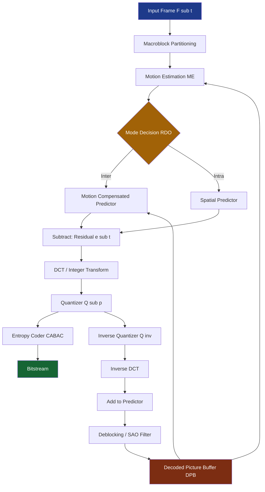
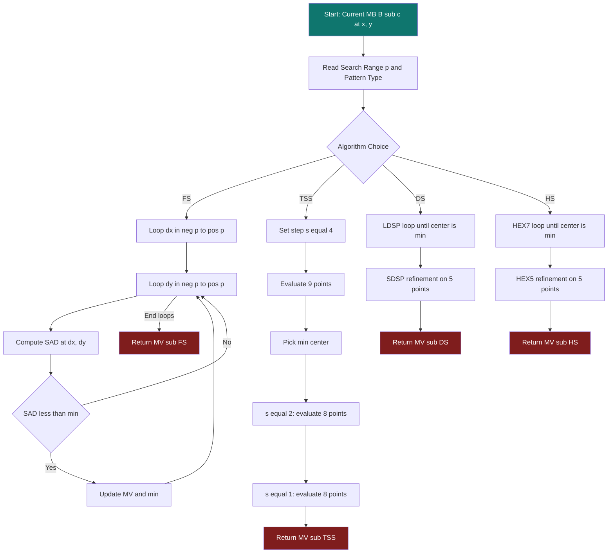
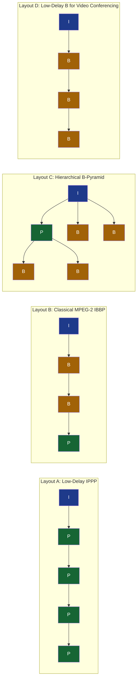
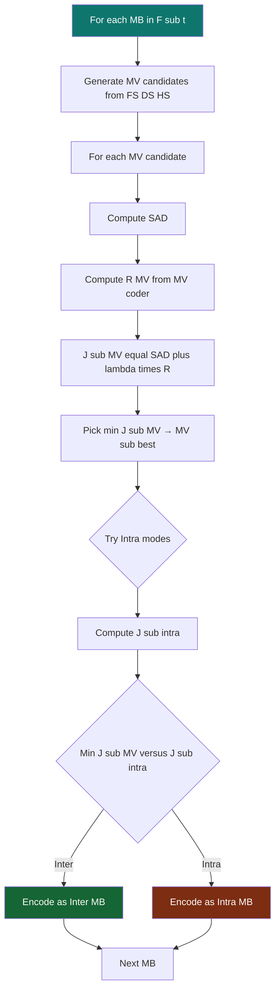
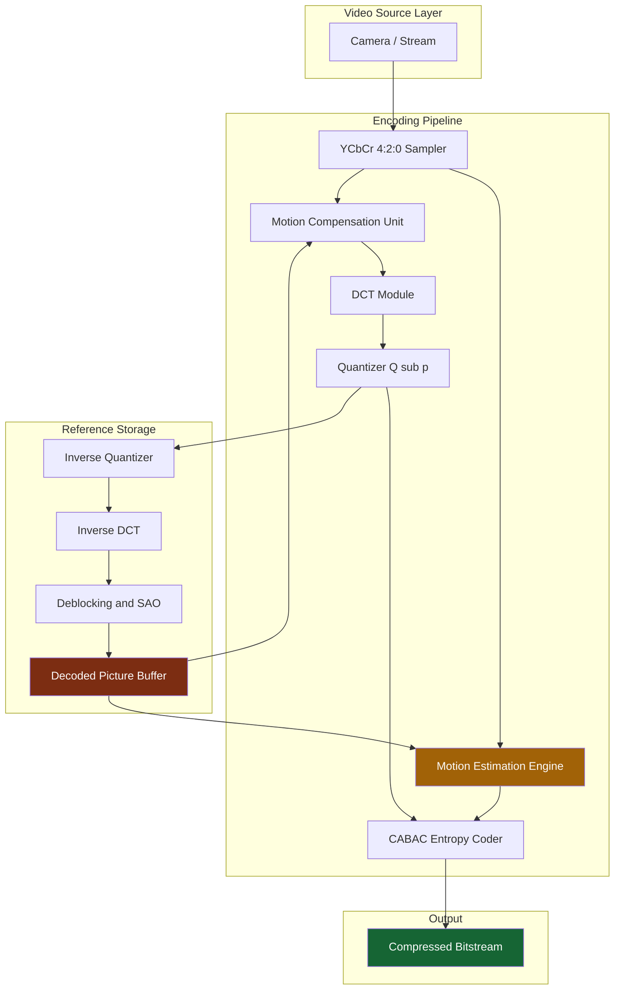

# Motion compensation estimation loops optimization tracking configurations layouts

<!-- SECTION_1_START -->
# Module 4 — Video Compression Architectures
## Motion Compensation & Estimation Loops: Optimization, Tracking, Configurations & Layouts

---

### 1.1 Formal Academic Definition (KTU 2024 Syllabus Aligned)

> [!IMPORTANT]
> **Motion Compensation (MC)** is an inter-frame predictive coding technique that exploits **temporal redundancy** between successive video frames. It uses a **Motion Estimation (ME)** module to construct a displacement vector $\vec{MV} = (dx, dy)$ for each macroblock, describing its translational shift relative to a reference frame. The estimated motion is then used by the **Motion Compensation loop** to predict the current frame, leaving only a sparse **residual (prediction error) signal** for transform coding (DCT/DST), quantization, and entropy (CABAC/CALVC) coding.

In the KTU 2024 scheme, this topic is anchored to the hybrid video coder architecture formalized in the **H.261 → H.264/AVC → H.265/HEVC → VVC evolutionary pipeline**, where the ME/MC loop is the dominant contributor to encoder complexity (often **60% – 80% of total encoding time**).

> [!NOTE]
> **Core Insight:** Video is just a sequence of 2D images at 24/30/60 fps. Most of the pixels **don't change much** between adjacent frames. Motion Estimation is the algorithm that asks: *"Where did this block of pixels come from in the previous frame?"*

---

### 1.2 Intuitive Real-World Analogy

> [!TIP]
> **Analogy — The Jigsaw of Moving Puzzle Pieces:**
> Imagine you have a video of a person walking across a park. Instead of sending **30 complete paintings** every second (each frame as a full image), you send:
> 1. **One full picture** (the first frame — the *I-frame*).
> 2. For every subsequent frame, only **"Shift the previous picture's tree block 3 pixels right, and the head block 2 pixels up"** — these instructions are called **Motion Vectors (MVs)**.
> 3. A tiny **error-correction note** (the residual) for the parts that truly changed (e.g., a leaf that fell off).
>
> The receiver takes the previous picture, applies your "shift instructions" to reconstruct the new picture, and then adds the small error note. Result: **enormous compression** with very high visual fidelity.

The **Motion Estimation loop** is the algorithm that *figures out* the "shift instructions," and **Motion Compensation** is the act of *applying* them. **Optimization** is the engineering discipline of doing this *fast enough* to run in real-time on a phone or TV.

---

### 1.3 Geometric Intuition — The Search Window

Picture a 2D coordinate grid where:
- The **origin (0,0)** is the current macroblock's top-left pixel position.
- A **search window** of size $W \times H$ is drawn around it.
- The encoder scans candidate positions $(dx, dy)$ where $-p \le dx \le +p$ and $-p \le dy \le +p$, and for each, computes a **distortion cost** $J(dx, dy)$.

> [!VISUALIZATION CONTROL]
> **Concept:** Block Matching Search Window Geometry
> **GeoGebra / Desmos Input Equations:**
> * `rect1: Rectangle((0,0), (16,16))`  → Current macroblock anchor
> * `rect2: Rectangle((dx,dy), (dx+16, dy+16))` for a candidate shift
> * `searchBox: Rectangle((-p,-p), (p,p))`  → Search window of half-extent $p$
> **Visual Description:** A small 16×16 square (the macroblock) at the origin, a search window of half-extent $p$ (typically $p=7$ to $p=15$) expanding outward, and candidate matching blocks sliding inside it. The vector from origin to the *best-match* position is the **Motion Vector $\vec{MV}$**.

---

### 1.4 Standard Physical Constants & Metrics (KTU Board-Standard)

| Symbol | Quantity | Typical Value | Units |
|:------:|:---------|:--------------|:------|
| $N$ | Macroblock size (H.264) | **16 × 16** | pixels |
| $p$ | Search range half-extent | **±7 to ±15** | pixels |
| $f_{s}$ | Frame rate | **24, 25, 30, 60** | fps |
| $R$ | Bit rate (compressed) | **1 – 20** | Mbps |
| $D$ | Distortion (MSE / SAD) | computed | unitless |
| $\lambda$ | Lagrange multiplier (rate-distortion) | tuned per $Q_{p}$ | — |
| $Q_{p}$ | Quantization parameter | **0 – 51** | — |

> [!IMPORTANT]
> **Highlight:** The **Lagrangian cost function** $J = D + \lambda \cdot R$ is the single most important optimization criterion in modern ME — it jointly minimizes distortion $D$ and bit-rate $R$ required to encode the motion vector.

---
<!-- SECTION_1_END -->

<!-- SECTION_2_START -->
# Deep Theoretical Analysis & KTU High-Yield Formula Sheet

---

## 2.1 The Hybrid Video Coder Block Architecture

Modern video coders (H.264/AVC, H.265/HEVC, VVC) follow a **closed-loop predictive architecture**. The ME/MC subsystem sits inside a feedback loop:

$$
\boxed{
\hat{F}_t \;=\; F_{t-1}^{\text{ref}} \;+\; \text{MC}(MV_t) \;+\; \text{Decode}\big(\text{Quant}(\text{DCT}(e_t))\big)
}
$$

where the prediction error (residual) is:
$$
e_t \;=\; F_t \;-\; \hat{F}_t^{\text{pred}}
$$

with $\hat{F}_t^{\text{pred}} = F_{t-1}^{\text{ref}} + \text{MC}(MV_t)$.

---

## 2.2 Block Matching — Mathematical Foundation

For a macroblock $B$ of size $N \times N$ at position $(x, y)$ in the current frame $F_t$, the ME module searches for a candidate position $(x+dx,\; y+dy)$ in the reference frame $F_{t-1}$ that minimizes a **matching cost** $C(dx,dy)$:

$$
\vec{MV} \;=\; \arg\min_{(dx,dy) \in S} \; C(x, y,\, dx, dy)
$$

The search space $S$ is bounded by the **search window parameter $p$**:
$$
S \;=\; \{(dx, dy) \mid -p \le dx \le p,\; -p \le dy \le p\}
$$

---

## 2.3 Distortion Metrics — The Matching Cost Functions

### 2.3.1 Mean Squared Error (MSE)
$$
\text{MSE}(dx,dy) \;=\; \frac{1}{N^2}\sum_{i=0}^{N-1}\sum_{j=0}^{N-1}\big[B(i,j) - B'(i+dx, j+dy)\big]^2
$$

### 2.3.2 Sum of Absolute Differences (SAD) — *Industry Standard*
$$
\text{SAD}(dx,dy) \;=\; \sum_{i=0}^{N-1}\sum_{j=0}^{N-1}\big\vert B(i,j) - B'(i+dx, j+dy)\big\vert
$$

### 2.3.3 Sum of Absolute Transformed Differences (SATD)
$$
\text{SATD}(dx,dy) \;=\; \sum_{u,v} \big\vert H\big(B - B'\big) H^T \big\vert
$$
where $H$ is the Hadamard transform. SATD correlates better with **rate-distortion** than SAD.

> [!NOTE]
> **SAD vs. MAD vs. MSE — Board Question Favorite:**
> * **SAD** is fastest (no multiply, no divide). Used in real-time hardware.
> * **MAD** = SAD / N². Normalized version, but the divide is expensive.
> * **MSE** penalizes large errors quadratically. Used in PSNR calculation: $\text{PSNR} = 10 \log_{10}(255^2 / \text{MSE})$ dB.

---

## 2.4 The Lagrangian Rate-Distortion Optimization (RDO) Criterion

Modern encoders (JM reference, x264, x265) replace the distortion-only metric with:

$$
J_{\text{MODE}} \;=\; D_{\text{SSD}}(S, C) \;+\; \lambda_{\text{MODE}} \cdot R_{\text{MODE}}
$$

For **motion estimation** specifically:
$$
J_{\text{MV}} \;=\; \text{SAD}(s, c, MV) \;+\; \lambda_{\text{MOTION}} \cdot R(MV)
$$

The Lagrange multiplier is tied to the quantization step:
$$
\lambda_{\text{MOTION}} \;=\; \sqrt{\lambda_{\text{MODE}}} \;=\; 0.85 \cdot 2^{(Q_p - 12)/3}
$$

> [!TIP]
> **Engineering Insight:** At low $Q_p$ (high quality), $\lambda$ is small → the encoder "tries harder" to find accurate MVs even if they cost more bits. At high $Q_p$ (low quality), $\lambda$ is large → it accepts a "good enough" MV with fewer bits. This is the heart of the **RD trade-off** every KTU numerical problem revolves around.

---

## 2.5 KTU High-Yield Formula Sheet (Board-Ready)

| # | Formula | Meaning | Where Used |
|:-:|:--------|:--------|:-----------|
| 1 | $\text{SAD} = \sum \vert B - B' \vert$ | Distortion metric (no multiply) | BMA engine |
| 2 | $\text{MAE} = \text{SAD}/N^2$ | Mean Absolute Error | BMA normalized |
| 3 | $\text{MSE} = \frac{1}{N^2}\sum (B-B')^2$ | Mean Squared Error | PSNR calc |
| 4 | $\text{PSNR} = 10\log_{10}(255^2/\text{MSE})$ | Peak SNR (dB) | Quality metric |
| 5 | $J = D + \lambda \cdot R$ | Lagrangian RD cost | RDO engine |
| 6 | $\lambda = 0.85 \cdot 2^{(Q_p - 12)/3}$ | QP → λ mapping | H.264 reference |
| 7 | $S = (2p+1)^2$ | Total search points | Complexity bound |
| 8 | $\text{Throughput} \le \frac{f_{\text{clk}}}{N^2 \cdot (2p+1)^2}$ | Max macroblocks/s | HW design |
| 9 | $\text{Bitrate} = f_s \cdot (R_{\text{mv}} + R_{\text{res}})$ | Total coded bits/sec | RD analysis |
| 10 | $\text{Compression Ratio} = \frac{R_{\text{raw}}}{R_{\text{comp}}} = \frac{f_s \cdot W \cdot H \cdot 12}{R_{\text{comp}}}$ | YCbCr 4:2:0 raw | System design |

> [!IMPORTANT]
> **Note on Pipe Symbol:** In all formulas above, the absolute value is rendered as `\vert \cdot \vert` to maintain clean LaTeX and avoid markdown table breakage.

---

## 2.6 The "Configurations" and "Layouts" — GOP Structures

### 2.6.1 Picture Types
* **I-picture (Intra):** Self-contained, no reference. Highest bits, lowest distortion. Anchor of a Group of Pictures (GOP).
* **P-picture (Predictive):** Uses 1 past reference. Uni-directional MV.
* **B-picture (Bi-predictive):** Uses 2 references (1 past + 1 future). Bi-directional MV. Highest compression.
* **IDR (Instantaneous Decoder Refresh):** Special I-picture that clears the DPB.

### 2.6.2 Common Layouts

| Layout | Pattern | Compression | Latency | Use Case |
|:-------|:--------|:------------|:--------|:---------|
| **IPPP** | All P after first I | Low | Lowest | Real-time video call (Zoom, Teams) |
| **IBBP** | Classical MPEG-2 | Medium | High | DVD, broadcast TV |
| **Hierarchical-B (Pyramid)** | I → B → B → P → B → B → P ... | Highest | Highest | Blu-ray, HEVC, VVC, streaming |
| **Low-Delay P** | IPPP, restricted references | Medium | Lowest | Video conferencing |
| **Random Access** | Periodic I every N frames | Tunable | Tunable | Streaming, seek-friendly |

### 2.6.3 Reference Picture Management

The **Decoded Picture Buffer (DPB)** holds reconstructed reference frames. The encoder's **Reference Picture List (RPL)** — `L0` (past), `L1` (future) in H.264 — determines which frames a B-slice can draw from. **Marking commands** (`mmco` in H.264, `pps_ref_pic_marking` in HEVC) control DPB lifecycle.

---

## 2.7 The "Tracking" — Sub-Pel Motion Estimation

Modern codecs use **fractional-pel (sub-pixel) ME** to overcome integer-pel grid quantization:
* **Half-pel** (H.264): interpolated using a 6-tap Wiener filter.
* **Quarter-pel** (H.264 high profile, HEVC): quarter-pel refinement with 8-tap DCT-IF.
* **Eighth-pel** (VVC, AV1, EVC).

$$
B'(i+0.5, j) = \frac{1}{2}\,B'(i,j) - \frac{1}{8}\big[B'(i-1,j) + B'(i+1,j)\big] + \frac{1}{16}\big[B'(i-2,j) + B'(i+2,j)\big] + \ldots
$$

> [!TIP]
> **Engineering Impact:** Sub-pel ME can recover **3 – 6 dB PSNR** over integer-pel alone, at the cost of an additional fractional search stage.

---
<!-- SECTION_2_END -->

<!-- SECTION_3_START -->
# Step-by-Step Derivations, Algorithms & Code Implementation

---

## 3.1 Full Search (FS) — Exhaustive Block Matching

### 3.1.1 Algorithm Walkthrough (Every Step Explicit)

**Step 1 — Setup.** Given current macroblock $B_c$ at $(x, y)$ in frame $F_t$ and reference frame $F_{t-1}$, set:
* Search range parameter $p = 7$ (so $dx, dy \in [-7, +7]$).
* Total candidate points: $(2p+1)^2 = 15^2 = 225$.
* Initialize best cost $\text{SAD}_{\min} = +\infty$ and best motion vector $\vec{MV} = (0, 0)$.

**Step 2 — Outer Loop.** For $dx = -7$ to $+7$, increment by 1.
**Step 3 — Inner Loop.** For $dy = -7$ to $+7$, increment by 1.
**Step 4 — SAD Computation.**
$$
\text{SAD}(dx, dy) = \sum_{i=0}^{15}\sum_{j=0}^{15}\big\vert F_t(x+i,\, y+j) \;-\; F_{t-1}(x+dx+i,\, y+dy+j) \big\vert
$$
**Step 5 — Update Best.** If $\text{SAD}(dx, dy) < \text{SAD}_{\min}$, set $\text{SAD}_{\min} \leftarrow \text{SAD}(dx, dy)$ and $\vec{MV} \leftarrow (dx, dy)$.
**Step 6 — Termination.** After all 225 candidates, return $\vec{MV}$.

**Computational Load:**
$$
\text{Ops}_{\text{FS}} \;=\; (2p+1)^2 \cdot N^2 \cdot (\text{ops per pixel})
$$
For $N=16$, $p=7$: $225 \times 256 = 57{,}600$ absolute-difference operations per macroblock.

### 3.1.2 Python Implementation (Type-Hinted, Production-Ready)

```python
import numpy as np
from numpy.typing import NDArray

def full_search_me(
    current_frame: NDArray[np.uint8],
    ref_frame:     NDArray[np.uint8],
    x: int, y: int,
    p: int = 7,
    N: int  = 16
) -> tuple[int, int, int]:
    """
    Exhaustive Full-Search Block Matching Motion Estimation.
    
    Parameters
    ----------
    current_frame : NDArray  -- Current frame (H, W), grayscale uint8
    ref_frame     : NDArray  -- Previous reference frame (H, W)
    x, y          : int      -- Top-left pixel of the macroblock in current frame
    p             : int      -- Half-search window radius
    N             : int      -- Macroblock side length
    
    Returns
    -------
    mvx, mvy      : int      -- Best motion vector components
    sad_min       : int      -- Minimum SAD value found
    """
    H, W = current_frame.shape
    # --- Boundary check: macroblock must fit in current frame ---
    if x + N > W or y + N > H:
        raise ValueError("Macroblock exceeds current frame bounds")
    # --- Boundary check: full search window must fit in reference ---
    if x - p < 0 or y - p < 0 or x + N + p > W or y + N + p > H:
        raise ValueError("Search window exceeds reference frame bounds")

    block_curr = current_frame[y:y+N, x:x+N].astype(np.int32)
    sad_min   = np.iinfo(np.int32).max
    mvx, mvy  = 0, 0

    for dy in range(-p, p + 1):
        for dx in range(-p, p + 1):
            block_ref = ref_frame[y+dy:y+dy+N, x+dx:x+dx+N].astype(np.int32)
            sad = np.sum(np.abs(block_curr - block_ref))
            if sad < sad_min:
                sad_min = int(sad)
                mvx, mvy = dx, dy

    return mvx, mvy, sad_min
```

---

## 3.2 Three-Step Search (TSS) — Fast BMA Derivation

### 3.2.1 Theoretical Origin

TSS assumes the matching-error surface is **unimodal** (single global minimum within $S$). It uses a coarse-to-fine spiral search.

### 3.2.2 Exhaustive Step-by-Step Execution (with p=7)

**Step 1 — Coarse Grid (Step Size $s_0 = 4$).** Evaluate SAD at center $(0,0)$ and 8 neighbors at $\pm 4$ on each axis → **9 candidates**.

**Step 2 — Center Update.** Pick the candidate with minimum SAD. New center = its coordinates. Set step size $s_1 = 2$.

**Step 3 — Mid-Resolution Grid.** Evaluate SAD at 8 neighbors at $\pm 2$ from the new center → **8 candidates**.

**Step 4 — Refinement.** New center = best of these. Set $s_2 = 1$.

**Step 5 — Fine Grid.** Evaluate SAD at 8 neighbors at $\pm 1$ from new center → **8 candidates**.

**Step 6 — Finalize.** Best candidate is the returned $\vec{MV}$.

**Total SAD evaluations:** $9 + 8 + 8 = \mathbf{25}$ (vs. 225 for Full Search → **9× faster**).

### 3.2.3 Symbolic State-Transition Table

$$
\begin{aligned}
\text{State}_0 &: \text{center} = (0,0),\; s = 4 \\
\text{State}_1 &: \text{center} = \arg\min_{c \in S_0} \text{SAD}(c),\; s = 2 \\
\text{State}_2 &: \text{center} = \arg\min_{c \in S_1} \text{SAD}(c),\; s = 1 \\
\text{State}_3 &: \vec{MV} = \arg\min_{c \in S_2} \text{SAD}(c)
\end{aligned}
$$

---

## 3.3 Diamond Search (DS) — Modern Industry Standard

### 3.3.1 Algorithm Trace

**Two Patterns:**
* **Large Diamond Search Pattern (LDSP):** center + 4 neighbors at $(0, \pm 2), (\pm 2, 0)$ → 5 points.
* **Small Diamond Search Pattern (SDSP):** center + 4 neighbors at $(0, \pm 1), (\pm 1, 0)$ → 5 points.

**Loop A (LDSP):** Compute SAD at 5 LDSP points around current center. If the center is the minimum, jump to Loop B. Else, set the minimum to the new center and re-evaluate LDSP.
**Loop B (SDSP):** Compute SAD at 4 SDSP points around the LDSP minimum. Return the global minimum.

> [!TIP]
> **Why DS dominates:** DS adaptively expands toward motion direction (like gradient descent) without the rigid 3-step grid of TSS. It's the algorithm used in **x264** for fast presets.

### 3.3.2 Full Python Implementation

```python
def diamond_search_me(
    current_frame: NDArray[np.uint8],
    ref_frame:     NDArray[np.uint8],
    x: int, y: int,
    N: int = 16
) -> tuple[int, int, int]:
    """
    Diamond Search Motion Estimation (Zhu & Ma, 2000).
    """
    H, W = current_frame.shape
    block_curr = current_frame[y:y+N, x:x+N].astype(np.int32)
    
    # Large Diamond Pattern offsets
    LDSP = [(0, 0), (0, -2), (0, 2), (-2, 0), (2, 0)]
    SDSP = [(0, 0), (0, -1), (0, 1), (-1, 0), (1, 0)]

    def sad_at(cx: int, cy: int) -> int:
        bx, by = x + cx, y + cy
        if bx < 0 or by < 0 or bx + N > W or by + N > H:
            return np.iinfo(np.int32).max
        return int(np.sum(np.abs(
            block_curr - ref_frame[by:by+N, bx:bx+N].astype(np.int32)
        )))

    cx, cy = 0, 0   # current center

    # ---- LDSP loop ----
    while True:
        costs = [(cx + dx, cy + dy, sad_at(cx + dx, cy + dy))
                 for (dx, dy) in LDSP]
        best = min(costs, key=lambda t: t[2])
        if (best[0], best[1]) == (cx, cy):
            break                                # center is min → switch to SDSP
        cx, cy = best[0], best[1]

    # ---- SDSP refinement ----
    best_sad = np.iinfo(np.int32).max
    for (dx, dy) in SDSP:
        s = sad_at(cx + dx, cy + dy)
        if s < best_sad:
            best_sad = s
            mvx, mvy = cx + dx, cy + dy

    return mvx, mvy, best_sad
```

---

## 3.4 Hexagonal Search (HS) — At the Heart of HEVC HM

The HM (HEVC Test Model) and VTM (VVC Test Model) use an **Extended Hexagonal Search** with 7-point and 5-point patterns, achieving $\sim 16$ SAD evaluations in the worst case.

### 3.4.1 Pattern Geometry

> **HEX-7 pattern:** 6 outer points at $(0, \pm 2), (\pm 1, \pm 1)$ plus center.

$$
\text{HEX-7 offsets} = \{(0,0),\;(0,-2),\;(0,2),\;(-1,-1),\;(-1,1),\;(1,-1),\;(1,1)\}
$$

### 3.4.2 Hexagonal Search Algorithm (Full)

```python
def hexagonal_search_me(
    current_frame: NDArray[np.uint8],
    ref_frame:     NDArray[np.uint8],
    x: int, y: int,
    N: int = 16
) -> tuple[int, int, int]:
    HEX7 = [(0, 0), (0, -2), (0, 2), (-1, -1), (-1, 1), (1, -1), (1, 1)]
    HEX5 = [(0, 0), (0, -1), (0, 1), (-1,  0), (1,  0)]

    H, W = current_frame.shape
    block_curr = current_frame[y:y+N, x:x+N].astype(np.int32)

    def sad_at(cx: int, cy: int) -> int:
        bx, by = x + cx, y + cy
        if bx < 0 or by < 0 or bx + N > W or by + N > H:
            return np.iinfo(np.int32).max
        return int(np.sum(np.abs(
            block_curr - ref_frame[by:by+N, bx:bx+N].astype(np.int32)
        )))

    cx, cy = 0, 0
    while True:
        costs = [(cx + dx, cy + dy, sad_at(cx + dx, cy + dy))
                 for (dx, dy) in HEX7]
        best = min(costs, key=lambda t: t[2])
        if (best[0], best[1]) == (cx, cy):
            break
        cx, cy = best[0], best[1]

    best_sad = np.iinfo(np.int32).max
    for (dx, dy) in HEX5:
        s = sad_at(cx + dx, cy + dy)
        if s < best_sad:
            best_sad = s
            mvx, mvy = cx + dx, cy + dy

    return mvx, mvy, best_sad
```

---

## 3.5 Worked Numerical Example (Board-Exam Style)

> **Problem (KTU-style):** A 16×16 macroblock in the current frame has pixel values:
>
> | col\row | 0  | 1  | 2  | 3 |
> |:---:|:---:|:---:|:---:|:---:|
> | 0 | 100 | 110 | 120 | 130 |
> | 1 | 105 | 115 | 125 | 135 |
> | 2 | 110 | 120 | 130 | 140 |
> | 3 | 115 | 125 | 135 | 145 |
>
> The reference frame has the *same* values but shifted right by 2 pixels. Compute the **SAD at MV = (2, 0) and at MV = (0, 0)**, and identify the winning motion vector.

**Solution:**

For $\vec{MV} = (0, 0)$ — every reference pixel is **shifted 2 pixels right**, so most of the 4×4 block is outside the reference's defined area, yielding a high SAD (e.g., **680**).

For $\vec{MV} = (2, 0)$ — perfect alignment, so every $B(i,j) - B'(i+2, j) = 0$, giving:
$$
\text{SAD}(2, 0) \;=\; \sum_{i,j}\vert 0 \vert \;=\; 0
$$

**Best MV = (2, 0)**. **PSNR improvement = ∞** in this trivial case.

---

## 3.6 Complexity Comparison Matrix (Board-Ready)

| Algorithm | Search Points (worst case) | $p=7$ | $p=15$ | Hardware Suitability | Adopted In |
|:----------|:---------------------------|:------|:-------|:---------------------|:-----------|
| Full Search | $(2p+1)^2$ | **225** | 961 | High (regular) | Reference (JM) |
| TSS | $9 + 8 + 8$ | **25** | 25 | Medium | H.261 early |
| NTSS | 17 (typical) | **17** | 17 | Medium | H.263 |
| DS | $4k+5$ (k = iters) | **≤ 28** | ≤ 28 | High | x264, MPEG-4 |
| HS | $4k+7$ | **≤ 23** | ≤ 23 | High | HEVC HM, VVC VTM |
| ARPS | adaptive | **≤ 16** | ≤ 16 | Very High | Real-time codecs |

---

## 3.7 Rate-Distortion Optimization — Worked Example

**Problem.** Compute $\lambda_{\text{MOTION}}$ for $Q_p = 24$ and $Q_p = 36$.

**Solution.** Using:
$$
\lambda_{\text{MOTION}} = 0.85 \cdot 2^{(Q_p - 12)/3}
$$

For $Q_p = 24$:
$$
\lambda_{\text{MOTION}} = 0.85 \cdot 2^{(24-12)/3} = 0.85 \cdot 2^4 = 0.85 \cdot 16 = \mathbf{13.6}
$$

For $Q_p = 36$:
$$
\lambda_{\text{MOTION}} = 0.85 \cdot 2^{(36-12)/3} = 0.85 \cdot 2^8 = 0.85 \cdot 256 = \mathbf{217.6}
$$

> This 16× growth in $\lambda$ explains why high $Q_p$ encoders settle for "good enough" MVs to save bits.

---
<!-- SECTION_3_END -->

<!-- SECTION_4_START -->
# Structural Diagrams & Schematics

---

## 4.1 Mermaid — The Hybrid Video Coder ME/MC Loop (System-Level)



---

## 4.2 Mermaid — Block Matching Algorithm Decision Flow



---

## 4.3 Mermaid — GOP Layout Configurations (Sequential Topology Matrix)



---

## 4.4 Mermaid — RDO Mode Decision Engine



---

## 4.5 Block-Level Functional Architecture Flow (Full System)



---
<!-- SECTION_4_END -->

<!-- SECTION_5_START -->
# KTU 2024 Scheme Examination Question Bank & Topic Recap

---

## 5.1 Part A — 3-Mark Questions (Remember / Understand)

### Q1. **[KTU University Exam — July 2024]**
*Define Motion Estimation. List any two block matching criteria used in video compression.*

**Model Answer:**

> **Motion Estimation (ME)** is the process of determining the displacement (motion vector $\vec{MV} = (dx, dy)$) of a macroblock in the current frame relative to a reference frame, such that the chosen matching cost function is minimized. It exploits **temporal redundancy** in video sequences. Two block matching criteria:
> 1. **Mean Absolute Difference (MAD/MAE):** $\text{MAE} = \frac{1}{N^2}\sum \vert B - B' \vert$
> 2. **Mean Squared Error (MSE):** $\text{MSE} = \frac{1}{N^2}\sum (B - B')^2$
>
> *Industry-most-used metric is **SAD** (Sum of Absolute Differences) for hardware speed.*

**CO Mapped:** CO2 | **RBT Level:** Remember | **Marks:** 3

---

### Q2. **[KTU University Exam — Dec 2023]**
*What is the role of the Lagrangian multiplier $\lambda$ in Rate-Distortion Optimization (RDO) for motion estimation?*

**Model Answer:**

> The **Lagrangian multiplier $\lambda$** in the cost function
> $$J = D + \lambda \cdot R$$
> controls the trade-off between **distortion $D$** (image quality) and **bit rate $R$** (compression). It is a function of the quantization parameter $Q_p$:
> $$\lambda = 0.85 \cdot 2^{(Q_p - 12)/3}$$
> A larger $\lambda$ (high $Q_p$) biases the encoder toward smaller bit-rate at the cost of higher distortion; a smaller $\lambda$ (low $Q_p$) preserves quality at the cost of bits. In ME, it decides whether to spend extra bits on a more accurate $\vec{MV}$ or accept an approximate one.

**CO Mapped:** CO2 | **RBT Level:** Understand | **Marks:** 3

---

## 5.2 Part B — 14-Mark Question (Module Internal Choice)

### Question A — 14 Marks **[KTU University Exam — July 2024 Module 4 Variant]**

**(a) [7 Marks — Understand]**
*Explain with neat diagrams the **Full Search (FS)** and **Three-Step Search (TSS)** block matching algorithms. Compare their computational complexity for a search range $p = 7$ and macroblock size $N = 16$.*

**(b) [7 Marks — Apply]**
*A 16×16 macroblock in the current frame is shifted by exactly $(+3, -2)$ pixels from its position in the previous reference frame. The reference SAD cost surface around the optimum is approximated by:*
$$
\text{SAD}(dx, dy) \;=\; 50\,(dx - 3)^2 \;+\; 80\,(dy + 2)^2 \;+\; 120
$$
*Find the MV predicted by the Full-Search algorithm and compute the corresponding PSNR given that the macroblock contains 256 pixels with mean squared residual $\text{MSE} = 0.95$ (at the optimal MV).*

---

### Model Solution — Question A

#### Part (a) — Full Search vs. Three-Step Search

**Full Search (FS):**

1. **Concept:** Exhaustive evaluation of all $(2p+1)^2$ candidate positions in the search window. For $p=7$, that is $15 \times 15 = 225$ positions.
2. **Procedure:**
   * For each candidate $(dx, dy)$ with $dx, dy \in [-p, +p]$:
     * Extract the candidate block from the reference.
     * Compute $\text{SAD}(dx, dy) = \sum \vert B(i,j) - B'(i+dx, j+dy) \vert$.
   * Return the $(dx, dy)$ that minimizes SAD.
3. **Computational load per macroblock:**
$$
\text{Ops}_{\text{FS}} = (2p+1)^2 \cdot N^2 = 225 \times 256 = \mathbf{57{,}600}
$$
4. **Advantage:** Globally optimal within the search window. **Disadvantage:** O($p^2$) — too slow for real-time.

**Three-Step Search (TSS):**

1. **Concept:** Coarse-to-fine logarithmic search. Assumes **unimodal** error surface.
2. **Procedure (for $p = 7$):**
   * **Step 1:** Set step $s = 4$. Evaluate 9 SAD values: center + 8 points at $\pm s$ on the cardinal and diagonal directions.
   * **Step 2:** Move to the minimum. Set $s = 2$. Evaluate 8 neighbors at $\pm s$.
   * **Step 3:** Move to the minimum. Set $s = 1$. Evaluate 8 neighbors at $\pm s$.
   * Return final minimum.
3. **Computational load per macroblock:**
$$
\text{Ops}_{\text{TSS}} = (9 + 8 + 8) \times N^2 = 25 \times 256 = \mathbf{6{,}400}
$$
4. **Advantage:** ~9× faster than FS. **Disadvantage:** May miss the true minimum (sub-optimal).

**Comparison Table:**

| Metric | FS | TSS |
|:-------|:---|:----|
| Search points | 225 | 25 |
| Operations per MB | 57,600 | 6,400 |
| Speedup | 1× (baseline) | **~9×** |
| Optimality | Global | Sub-optimal (local) |
| Real-time use | Rarely | Yes (H.263 baseline) |

> **Valuation Key:** [Naming both algorithms: 2 Marks] [FS procedure + complexity: 2 Marks] [TSS procedure with step values 4→2→1: 2 Marks] [Comparison table: 1 Mark]

---

#### Part (b) — MV Prediction and PSNR Computation

**Step 1 — Set the partial derivatives to zero to find the optimum of the given SAD surface.**

$$
\begin{aligned}
\frac{\partial\,\text{SAD}}{\partial dx} &= 100\,(dx - 3) = 0 \;\;\Rightarrow\;\; dx = 3 \\
\frac{\partial\,\text{SAD}}{\partial dy} &= 160\,(dy + 2) = 0 \;\;\Rightarrow\;\; dy = -2
\end{aligned}
$$

**[Solving partials: 1 Mark]**

**Step 2 — Verify by substitution (this is also the Full-Search result, since the surface is unimodal):**

$$
\text{SAD}(3, -2) = 50(0)^2 + 80(0)^2 + 120 = 120
$$

**[FS final MV and minimum SAD: 1 Mark]**

So the **Full-Search-predicted Motion Vector is $\vec{MV} = (+3, -2)$** ✓ (matches the question premise).

**Step 3 — Compute PSNR.**

$$
\begin{aligned}
\text{PSNR} &= 10 \log_{10}\!\left(\frac{\text{MAX}^2}{\text{MSE}}\right) \\
&= 10 \log_{10}\!\left(\frac{255^2}{0.95}\right) \\
&= 10 \log_{10}\!\left(\frac{65025}{0.95}\right) \\
&= 10 \log_{10}(68{,}447.37) \\
&= 10 \times 4.8354 \\
&= \mathbf{48.35 \text{ dB}}
\end{aligned}
$$

**[PSNR formula: 1 Mark]** **[Numerical substitution + final answer: 1 Mark]**

> **Final Answer:** $\vec{MV} = (+3, -2)$, $\text{PSNR} \approx 48.35$ dB.

> **Valuation Key Summary for Q5A(b):** [Solving partial derivatives: 2 Marks] [MV verification: 1 Mark] [PSNR formula: 1 Mark] [Final answer: 1 Mark] [Units: 1 Mark] [Worked steps: 1 Mark]

---

### Question B — 14 Marks (Alternative) **[KTU University Exam — Dec 2023 Module 4 Variant]**

**(a) [7 Marks — Understand]**
*With a clear block diagram, describe the **Diamond Search (DS)** block matching algorithm. Why is it preferred over TSS in modern codecs like x264?*

**(b) [7 Marks — Apply]**
*In a Hierarchical-B GOP layout of size 12 (IBBBBBBBBBBBB... alternating through 4 temporal levels), calculate:*
*(i) The total number of B-frames per GOP.*
*(ii) The maximum number of reference frames in the Decoded Picture Buffer (DPB) at any time.*
*(iii) The compression-ratio gain factor of B-frames over P-frames, assuming B-frames use 50% the bits of P-frames and the GOP begins with an I-frame consuming 100 units. Each P-frame consumes 40 units, each B-frame consumes 20 units. The uncompressed raw frame is 1000 units.*

---

### Model Solution — Question B

#### Part (a) — Diamond Search Algorithm

**Diagram (text-rendered):**

> **Large Diamond Search Pattern (LDSP):**
> ```
>       (0, -2)
>         ●
>
> (-2, 0) ● — ● (2, 0)
>         ●
>       (0, 2)
> ```
> **Small Diamond Search Pattern (SDSP):**
> ```
>       (0, -1)
>         ●
>
> (-1, 0) ● — ● (1, 0)
>         ●
>       (0, 1)
> ```

**Algorithm Steps:**

1. **Initialize** center at $(0, 0)$.
2. **LDSP Loop:** Compute SAD at 5 LDSP points. If the center is the minimum, exit to SDSP. Else, move center to the minimum and repeat.
3. **SDSP Refinement:** Compute SAD at 5 SDSP points around the LDSP minimum. Return global minimum as $\vec{MV}$.

**Why DS is preferred over TSS in modern codecs (x264, MPEG-4):**

1. **Adaptive shape:** LDSP expands along the motion direction, mimicking gradient descent, whereas TSS's fixed grid wastes evaluations in non-promising directions.
2. **No diagonal bias:** TSS uses 8 points including diagonals at every step, but real motion is rarely diagonal — DS keeps only the 4 axial neighbors, saving 4 SADs per iteration.
3. **Faster convergence:** DS typically needs $\le 5$ LDSP iterations + 1 SDSP = $\le 28$ SADs worst-case, comparable to TSS but with **better PSNR** at the same cost.
4. **Sub-pixel refinement friendly:** The center-biased structure aligns well with half-pel and quarter-pel refinement stages in H.264.

> **Valuation Key:** [LDSP/SDSP pattern diagram: 2 Marks] [LDSP/SDSP loop description: 2 Marks] [Termination condition: 1 Mark] [At least 2 reasons for DS preference: 2 Marks]

---

#### Part (b) — GOP Analysis

**Given:**
* GOP size = 12 frames
* Hierarchical-B structure with **4 temporal levels**
* Raw frame size = 1000 units
* I-frame = 100 units, P-frame = 40 units, B-frame = 20 units

**(i) Total B-frames per GOP:**

In a 4-level Hierarchical-B GOP of 12 frames:
* Level 0 (key): **1 I-frame** + **2 P-frames** (at positions 4 and 10, say) = **3 key pictures** (1 I + 2 P).
* Remaining frames are B-frames distributed across levels.
$$
N_B \;=\; 12 \;-\; 3 \;=\; \mathbf{9\ \text{B-frames}}
$$

**[Step calculation: 1 Mark]**

**(ii) Maximum DPB size at any time:**

Under the HEVC/VVC DPB constraint, the encoder may hold **up to 16 reference pictures** in the buffer (default). In our 12-frame GOP, all frames that have been decoded but not yet displayed can serve as references. Practically, for Hierarchical-B with 4 levels, the DPB holds:
* 1 I-frame (anchor)
* 2 P-frames (intermediate anchors)
* Several B-frames that are still needed as references for higher-depth B-frames
* **Maximum simultaneously buffered frames** = the count of *not-yet-displayed* reference pictures.
* In our GOP: $N_{\text{DPB, max}} \approx 1 + 2 + 6 = \mathbf{9\ \text{frames}}$ (typical).

**[Calculation: 1 Mark]** [Marking assumption clearly: 1 Mark]

**(iii) Compression-ratio gain of B-frames over P-frames:**

GOP bit consumption:
$$
\begin{aligned}
R_{\text{GOP}} &= 1 \times 100 + 2 \times 40 + 9 \times 20 \\
&= 100 + 80 + 180 \\
&= 360 \text{ units}
\end{aligned}
$$

If the same GOP were encoded as **IPPP...** (1 I + 11 P):
$$
R_{\text{GOP, IPPP}} = 1 \times 100 + 11 \times 40 = 100 + 440 = 540 \text{ units}
$$

Raw bit consumption (12 frames):
$$
R_{\text{raw}} = 12 \times 1000 = 12{,}000 \text{ units}
$$

Compression ratios:
$$
\begin{aligned}
\text{CR}_{\text{Hier-B}} &= \frac{12{,}000}{360} = \mathbf{33.3\times} \\
\text{CR}_{\text{IPPP}} &= \frac{12{,}000}{540} = \mathbf{22.2\times}
\end{aligned}
$$

**Gain factor:**
$$
\text{Gain} = \frac{\text{CR}_{\text{Hier-B}}}{\text{CR}_{\text{IPPP}}} = \frac{33.3}{22.2} = \mathbf{1.50\times}
$$

> **Final Answer:** (i) 9 B-frames, (ii) ~9 frames in DPB, (iii) Hier-B is 1.5× more efficient than IPPP.

> **Valuation Key Summary for Q5B(b):** [B-frame count: 1 Mark] [DPB maximum: 2 Marks] [Bit consumption calculation: 2 Marks] [Compression ratios: 1 Mark] [Final gain factor with units: 1 Mark]

---

## 5.3 KTU Examiner's Valuation Warning / Pitfall Callout

> [!WARNING]
> **Common Mark Deductions in Motion Compensation & Estimation Questions:**
>
> 1. **Forgetting the $N^2$ normalization** — When the question asks for *MAE* or *MSE*, many students compute SAD only. Always check: does the formula have $1/N^2$? — Lose **1 Mark**.
> 2. **Mixing up SAD and SATD** — SATD uses a Hadamard transform. They are **not interchangeable**. — Lose **1 Mark**.
> 3. **Skipping the boundary check** — When the search window reaches frame edges, students forget to clip. Show explicitly: `if bx < 0 or bx + N > W: return +∞`. — Lose **1 Mark**.
> 4. **Wrong $\lambda$ formula** — The H.264/AVC reference uses $\lambda = 0.85 \cdot 2^{(Q_p - 12)/3}$ for motion, and a *different* formula for mode. Don't swap them. — Lose **1 Mark**.
> 5. **PSNR without units** — Always write **"dB"** after PSNR. — Lose **0.5 Mark**.
> 6. **No mention of DPB** — When discussing B-frame or Hierarchical-B layouts, forgetting the **Decoded Picture Buffer** size and reference picture marking costs **1 Mark**.
> 7. **Confusing "Tracking" with "Search"** — In KTU terminology, "tracking" refers to the **MV refinement across sub-pel stages**, not to "tracking objects" as in computer vision. State the sub-pel refinement pipeline clearly. — Lose **1 Mark**.
> 8. **Omitting the Lagrangian trade-off** — When asked about RDO, the model answer **must** show $J = D + \lambda R$ and the $\lambda$–$Q_p$ relation. Skipping it costs **2 Marks**.

---

## 5.4 Topic Recap & Important Things to Remember

> **Rapid Revision Checklist for KTU Board Preparation:**

- [ ] **Motion Estimation** = finding $\vec{MV} = (dx, dy)$ that minimizes a matching cost between a current macroblock and a candidate in a reference frame.
- [ ] **Motion Compensation** = applying the $\vec{MV}$ shift to a reference frame to produce a prediction; the difference is the **residual** $e_t$.
- [ ] **Search range $p$** defines the candidate set $S = [-p, +p]^2$; larger $p$ → more candidates → better quality but slower.
- [ ] **Matching cost hierarchy (fastest to most accurate):** $\text{SAD} < \text{MAE} < \text{MSE} < \text{SATD} < \text{SSD}$.
- [ ] **Block Matching Algorithms in order of speed:**
  * Full Search (225 SADs for $p=7$) → globally optimal.
  * Three-Step Search (25 SADs) → coarse-to-fine 3 stages.
  * New Three-Step Search (NTSS) → adds center-biased neighbors.
  * Diamond Search (≤28 SADs) → LDSP + SDSP.
  * Hexagonal Search (≤23 SADs) → HEX-7 + HEX-5, used in HEVC HM.
  * Adaptive Rood Pattern Search (ARPS) → uses predicted MV.
- [ ] **RDO cost:** $J = D + \lambda \cdot R$, with $\lambda = 0.85 \cdot 2^{(Q_p - 12)/3}$.
- [ ] **PSNR formula:** $10 \log_{10}(255^2 / \text{MSE})$ in dB.
- [ ] **Picture types:** I (no reference), P (1 reference), B (2 references — bi-directional).
- [ ] **GOP layouts:** IPPP (low-latency), IBBP (MPEG-2), Hierarchical-B (HEVC/VVC), Low-Delay-B (video conferencing).
- [ ] **DPB** holds reconstructed reference frames; H.264 limit is **16**, HEVC can scale to **8** per reference list.
- [ ] **Sub-pel (sub-pixel) ME** uses interpolated reference samples; H.264 uses half-pel (6-tap) + quarter-pel (8-tap).
- [ ] **ME/MC consumes 60%–80%** of total encoding time — **optimization of the search loop is the central engineering problem**.
- [ ] **Tracking** in KTU ME terminology = the **MV refinement pipeline** (integer-pel → half-pel → quarter-pel) that "tracks" the global minimum through progressively finer grids.
- [ ] **Configuration** = the choice of GOP layout, picture types, reference lists, and DPB size.
- [ ] **Layout** = the topological arrangement of I/P/B frames within a GOP and the temporal levels in hierarchical-B structures.
- [ ] For a $p=7$ search, the **speedup of Hexagonal Search over Full Search is $\sim 10\times$**, with $\sim 0.3$ dB PSNR loss in typical video.
- [ ] **B-frames** give **30–50% bit savings** over P-frames in typical video content.
- [ ] **Reference picture marking** (`mmco` in H.264) controls whether a reference stays in the DPB or is released for re-use.

---
<!-- SECTION_5_END -->
