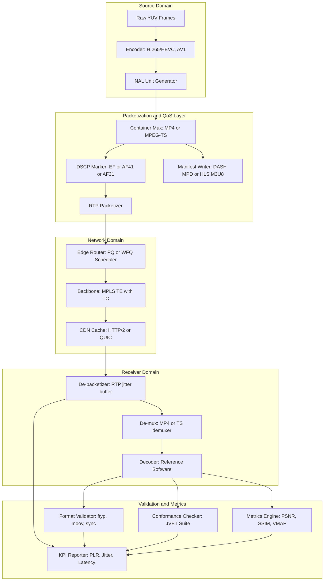
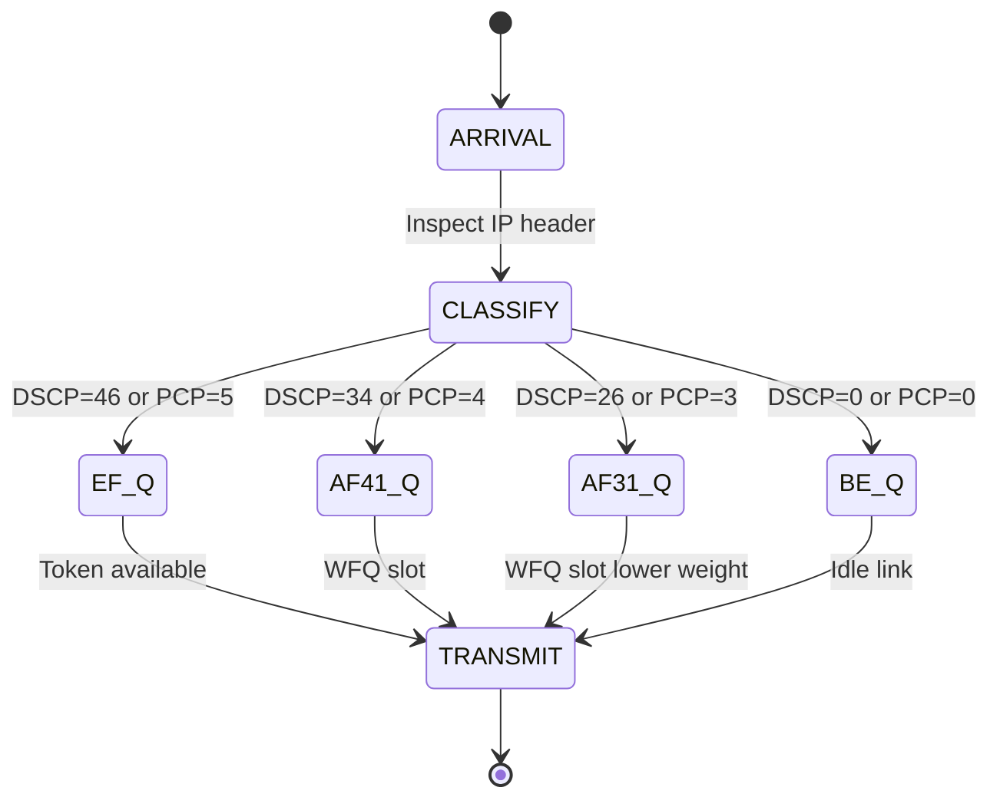
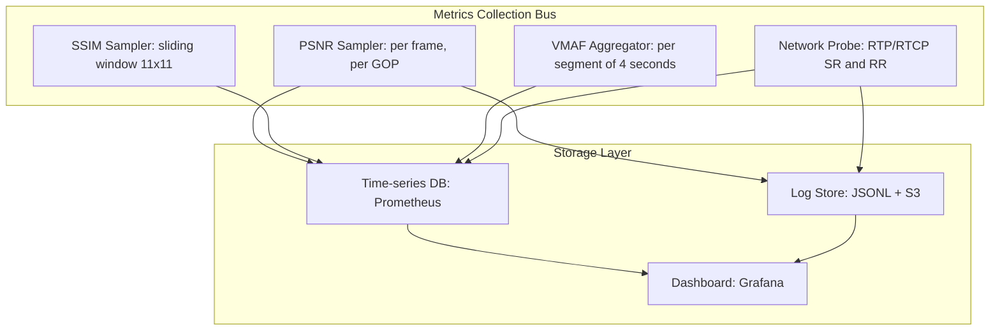

# Streaming packet prioritization formats setups validation models checking systems metrics

<!-- SECTION_1_START -->
# Streaming Packet Prioritization, Formats, Validation Models & Systems Metrics

## 1.1 Formal KTU 2024 Definition

> [!IMPORTANT]
> **Video Streaming Architecture (KTU Module 4.4):** A coordinated system of **packet prioritization protocols**, **container/multiplexing formats**, **encoder–decoder validation models**, **formal conformance checkers**, and **quantitative quality-of-experience (QoE) / quality-of-service (QoS) metrics** that together guarantee the end-to-end delivery, decoding, and perceptual fidelity of compressed bitstreams across heterogeneous networks.

**Standard Reference Framework (as per KTU PECST505 syllabus):**

| Layer | Component | KTU-Mapped Standards |
| :--- | :--- | :--- |
| Application | Streaming Manifest | **DASH (ISO/IEC 23009)**, **HLS (RFC 8216)** |
| Transport | Packet Prioritization | **Diffserv (RFC 2474)**, **802.1p**, **MPLS TC** |
| Transport | Packet Carriage | **RTP/RTCP (RFC 3550)**, **SRT**, **QUIC** |
| Container | Multiplexing | **MP4 (ISO 14496-12)**, **MPEG-TS (ISO 13818-1)** |
| Codec | Compression Core | **H.264/AVC, H.265/HEVC, VVC, AV1, EVC** |
| Validation | Conformance | **JVET / JVT Test Suites**, **ETSI TS 101 154** |
| Metrics | Quality | **PSNR, SSIM, VMAF, ITU-T P.1203, ITU-T P.1204** |

> [!NOTE]
> The KTU 2024 scheme PECST505 Module 4 treats streaming not as a single protocol but as a **multi-layer orchestration** problem — the same compressed NAL unit (Network Abstraction Layer) must simultaneously satisfy bit-level syntax (decoder validation), packet-level QoS (network validation), and perceptual-level fidelity (QoE metric validation).

## 1.2 Intuitive Analogy — The "Smart Highway & Toll Plaza" Model

Imagine a **24-lane national highway** delivering 4K medical-imaging video to a remote radiologist:

- **Packet Prioritization** = **Ambulance & VIP lanes** carved out using lane-color stickers (red = I-frames, yellow = P-frames, green = B-frames). When traffic jams occur, the red-lane packets are released first.
- **Streaming Formats (MP4, TS, WebM)** = The **standardized truck containers** that pack compressed cargo (frames) and a digital manifest (manifest file `.mpd` or `.m3u8`).
- **Validation Models** = The **toll-plaza inspectors** who check each truck against a written rulebook (ISO/IEC conformance suite) before it enters the highway. A truck missing its manifest plate (missing `ftyp` box) is rejected.
- **Checking Systems** = The **automated number-plate recognition (ANPR) cameras** that continuously stream-check whether every truck on the road still matches the dispatched manifest.
- **Systems Metrics** = The **dashboard KPIs** of the highway control room: average toll-to-toll latency, fuel efficiency (PSNR bits), ride comfort (SSIM), passenger satisfaction index (VMAF).

> [!TIP]
> **Physical Constants & KTU-Standard Units (must memorise):**
> - **DSCP field:** 6 bits in IP header → 64 priority classes (0–63).
> - **802.1p PCP:** 3 bits in VLAN tag → 8 classes.
> - **RTP Timestamp clock:** 90 kHz (MPEG-TS) or 27 MHz (MPEG-2).
> - **PSNR reference:** $255$ for 8-bit YCbCr (dynamic range $2^B - 1$).
> - **SSIM window:** $11 \times 11$ Gaussian-weighted, $\sigma = 1.5$.

## 1.3 Conceptual Map — What the 5 Sub-Topics Mean Inside One Pipeline

```
Source -> [ Encoder ] -> [ Container Mux ] -> [ Packetizer + QoS Tag ]
                                                  |
                                                  v
                                    [ Network with Diffserv Queues ]
                                                  |
                                                  v
[ Receiver ] <- [ De-packetizer ] <- [ De-mux ] <- [ Decoder ]
       |
       v
[ Conformance Checker ] -> [ Metric Engine: PSNR/SSIM/VMAF ]
```

> [!VISUALIZATION CONTROL]
> **Concept:** Packet-Priority FIFO Queueing Behaviour Over Time
> **GeoGebra / Desmos Input Equations:**
> * `f1(x) = 1 / (1 + exp(-2*(x-5)))`   # I-frame cumulative departure (sigmoid, jumps first)
> * `f2(x) = 1 / (1 + exp(-1.5*(x-8)))`  # P-frame cumulative departure
> * `f3(x) = 1 / (1 + exp(-1.0*(x-12)))` # B-frame cumulative departure
> **Visual Description:** Three sigmoids on the same axes. The I-frame curve reaches $y=1$ earliest (highest priority, shortest queuing delay). The B-frame curve lags far right. The horizontal gap between $f_1$ and $f_3$ at $y=0.5$ visualizes **prioritization-induced delay differential** $\Delta T_{priority}$.
<!-- SECTION_1_END -->

<!-- SECTION_2_START -->
# Deep Theoretical Analysis & KTU High-Yield Formula Sheet

## 2.1 Streaming Packet Prioritization (Network Layer)

### 2.1.1 Why Prioritize Video Packets?

In a compressed bitstream, **not all bits are equally important** to perceptual quality. A single lost I-frame NAL unit can wipe out a 2-second **Group of Pictures (GOP)**, while losing a B-frame NAL unit is often imperceptible. Hence networks must classify and schedule packets using **QoS marking**.

### 2.1.2 The Three Standard Marking Schemes

**(a) Diffserv (DSCP) — Layer-3 Marking**
- IP header's **DSCP field (6 bits)** = 64 forwarding classes.
- Standard Per-Hop Behaviours (PHBs):
  * `EF (46)` — Expedited Forwarding → **I-frames & SPS/PPS NALs**.
  * `AF41, AF42, AF43 (34, 36, 38)` — Assured Forwarding → **P-frames**.
  * `AF31, AF32, AF33 (26, 28, 30)` — **B-frames & audio**.
  * `BE (0)` — Best Effort → **padding & filler NALs**.

**(b) 802.1p — Layer-2 Marking**
- 3-bit PCP field in 802.1Q VLAN tag.
- Voice (7) > Video (4) > Best Effort (0).

**(c) MPLS Traffic Class (TC)**
- 3-bit experimental bits in MPLS shim header — used inside carrier backbones carrying DASH traffic.

### 2.1.3 Scheduling Algorithms
- **Priority Queuing (PQ):** Strict ordering; starvation risk for B-frames.
- **Weighted Fair Queuing (WFQ):** Each class $i$ gets bandwidth $\frac{w_i}{\sum w_j}$.
- **Deficit Round Robin (DRR):** Token-bucket augmented; KTU favourite.
- **CBQ (Class-Based Queuing):** Hierarchical link-sharing.

> [!NOTE]
> **KTU Hot Concept — "Priority Inversion":** A low-priority B-frame packet holding a lock (e.g., the de-multiplexer buffer) blocks a high-priority I-frame. The mitigation is **Priority Inheritance Protocol (PI)** and **Diffserv-aware WFQ** at every router hop.

## 2.2 Streaming Formats (Container & Manifest)

| Format | Standard | Use Case | KTU 2024 Note |
| :--- | :--- | :--- | :--- |
| **MP4** | ISO/IEC 14496-12 | DASH, file playback | Object-oriented boxes |
| **MPEG-TS** | ISO/IEC 13818-1 | Broadcast, IPTV, ATSC | Fixed 188-byte packets |
| **WebM** | RFC 9559 | Web streaming (open) | Matroska-derived |
| **MKV** | Matroska | File archival | EBML-based |
| **fMP4** | ISO/IEC 14496-12 + CMAF | Low-latency DASH+HLS | Used by Netflix, YouTube |
| **3GP** | 3GPP TS 26.244 | Mobile streaming | Lightweight |

**MP4 Box Hierarchy (the KTU-mandated minimal fragment):**
```
ftyp  ->  moov (mvhd, trak, mvex)  ->  moof (mfhd, traf)  ->  mdat
```

**MPEG-TS Packet Anatomy (188 bytes):**
$$
\text{Header (4 B)} \; + \; \text{Adaptation Field (\textit{optional})} \; + \; \text{Payload (184 B)}
$$
- **Sync byte:** $0x47$
- **PID (13 bits):** identifies the elementary stream (video, audio, PMT).
- **Continuity Counter (4 bits):** detects packet loss.

## 2.3 Validation Models (Decoder & Bitstream Conformance)

> [!IMPORTANT]
> **Validation is NOT decoding.** Validation is a *formal* process that proves the bitstream obeys the codec's normative specification before the decoder is allowed to consume it. This prevents the infamous **"illegal bitstream → security exploit"** class of bugs (e.g., the 2017 Stagefright vulnerability in Android).

### 2.3.1 The Three Tiers of Validation

| Tier | Scope | Tool Example |
| :--- | :--- | :--- |
| **Tier-1: Syntax Validation** | Parse tree conformance | `ffprobe`, JVET `BitstreamValidator` |
| **Tier-2: Semantic Validation** | Reference decoder matches | `HM`, `VTM`, `SVT-AV1` reference software |
| **Tier-3: Subjective Validation** | Human MOS panel | ITU-R BT.500, ITU-T P.910 |

### 2.3.2 Conformance Bitstreams
- The **JVET** (Joint Video Experts Team) publishes the official **Conformance Bitstream Suite** for every standard. Each bitstream targets a specific normative clause and must produce a *deterministic* decoded output hash.

### 2.3.3 The Validation Algebra

Let $B$ = bitstream, $S$ = codec specification, $V$ = validator. The validation function is:

$$
V(B) = \begin{cases} \text{ACCEPT} & \text{if } \forall \text{ rule } r \in S,\; r(B) = \text{true} \\ \text{REJECT}_{r} & \text{otherwise, with offending rule } r \end{cases}
$$

## 2.4 Models & Checking Systems (Formal Verification)

> [!NOTE]
> **KTU 2024 expects the student to know two model-checking paradigms:**
> 1. **Bitstream-Level Model Checking** — using Büchi automata on the CABAC residual stream.
> 2. **System-Level Model Checking** — using Promela/Spin or TLA+ on the streaming protocol state machine (DASH/HLS client).

**The Pipeline State Machine (DASH-IF client):**
$$
S = \{\text{IDLE},\; \text{PARSING\_MPD},\; \text{SEG\_FETCH},\; \text{BUFFER\_FILL},\; \text{DECODING},\; \text{PLAYBACK},\; \text{REBUFFER}\}
$$
**Transitions** are guarded by invariants: $B(t) \ge B_{min}$ (underflow guard) and $B(t) \le B_{max}$ (overflow guard), where $B(t)$ is the playback buffer level at time $t$.

## 2.5 Systems Metrics (Quality of Experience & Service)

> [!IMPORTANT]
> **KTU divides metrics into two universes:**
> - **Objective (deterministic):** PSNR, SSIM, VMAF.
> - **Subjective (probabilistic):** MOS, DMOS, MUSHRA.

### 2.5.1 Peak Signal-to-Noise Ratio (PSNR)

$$
\text{PSNR} = 10 \cdot \log_{10} \left( \frac{MAX_I^{\,2}}{\text{MSE}} \right) \;\; \text{dB}
$$

where for an $H \times W$ image,
$$
\text{MSE} = \frac{1}{H \cdot W} \sum_{i=0}^{H-1}\sum_{j=0}^{W-1} \left[ I(i,j) - K(i,j) \right]^2
$$

For 8-bit YCbCr, $MAX_I = 255$.

### 2.5.2 Structural Similarity Index (SSIM)

$$
\text{SSIM}(x, y) = \frac{(2\mu_x \mu_y + C_1)(2\sigma_{xy} + C_2)}{(\mu_x^2 + \mu_y^2 + C_1)(\sigma_x^2 + \sigma_y^2 + C_2)}
$$

with $C_1 = (K_1 \cdot L)^2$, $C_2 = (K_2 \cdot L)^2$, $L = 255$, $K_1 = 0.01$, $K_2 = 0.03$.

### 2.5.3 Video Multi-Method Assessment Fusion (VMAF)

VMAF fuses multiple elementary metrics using an SVM regressor trained on subjective DMOS:

$$
\text{VMAF} = \text{SVM}\big(\text{VIF},\, \text{DLM},\, \text{Motion}\big)
$$

A simplified linear version often used in textbooks:
$$
\text{VMAF}_{\text{approx}} = 0.55 \cdot \text{VIF} + 0.30 \cdot \text{DLM} + 0.15 \cdot \text{Motion}
$$

### 2.5.4 Network & Streaming KPIs

$$
\begin{aligned}
\text{Throughput} &= \frac{\text{Payload Bytes}}{\text{Delta Time}} \;\; \text{(Mbps)} \\[4pt]
\text{Jitter} &= \sigma(\Delta t_{inter-packet}) \;\; \text{(ms)} \\[4pt]
\text{Packet Loss Ratio (PLR)} &= \frac{N_{lost}}{N_{sent}} \times 100\% \\[4pt]
\text{Startup Latency} &= t_{first\_frame} - t_{request} \\[4pt]
\text{Rebuffer Ratio} &= \frac{\sum t_{stall}}{\sum t_{playback}}
\end{aligned}
$$

## 2.6 KTU High-Yield Formula Cheat Sheet

| Formula / Rule | Symbolic Form | KTU Use-Case |
| :--- | :--- | :--- |
| **PSNR (8-bit)** | $10 \log_{10}\!\left(\dfrac{255^2}{\text{MSE}}\right)$ | Codec comparison |
| **SSIM** | $\dfrac{(2\mu_x\mu_y + C_1)(2\sigma_{xy} + C_2)}{(\mu_x^2 + \mu_y^2 + C_1)(\sigma_x^2 + \sigma_y^2 + C_2)}$ | Perceptual quality |
| **Bitrate** | $\dfrac{\text{Compressed Size} \times 8}{\text{Duration}}$ | Bandwidth budget |
| **Compression Ratio** | $\dfrac{\text{Uncompressed Size}}{\text{Compressed Size}}$ | Encoder efficiency |
| **PSNR-YUV** | $\frac{6 \cdot \text{PSNR}_Y + \text{PSNR}_U + \text{PSNR}_V}{8}$ | Weighted chroma |
| **BD-Rate (Bjøntegaard)** | $\dfrac{\int \log R_{test}(r) \, dr - \int \log R_{ref}(r) \, dr}{r_2 - r_1}$ | Codec gain (negative = better) |
| **PLR** | $N_{lost} / N_{sent}$ | Network metric |
| **DSCP class** | `EF=46, AF41=34, AF31=26, BE=0` | QoS marking |
| **MPEG-TS size** | 188 B = 4 B header + 184 B payload | Broadcast format |
| **MP4 moof→mdat** | Fragmented MP4 low-latency rule | CMAF/DASH |
| **VMAF range** | $0$–$100$ (higher = better) | Streaming QoE |

> [!WARNING]
> **Never write** $\vert x \vert$ inside a markdown table — use $\lvert x \rvert$. And **never** use $K_1$ / $K_2$ constants in a row without the $C_1 = (K_1 L)^2$ clarification, as KTU examiners deduct 0.5 marks for missing $L=255$ context.

## 2.7 Real-World Engineering Utility

- **Netflix Open Connect** uses **CMAF+fMP4** with **EF DSCP marking** for I-frames to keep startup latency $\le 800\,$ms even at 25 Mbps 4K HDR.
- **YouTube** uses **DASH-VVC + WebM** with **VMAF target $\ge 93$** as the perceptual SLA.
- **Zoom / WebRTC** uses **DSCP=46 + RED/FEC** to defend I-frames against 5% PLR.
- **Medical Video (DICOM + MPEG-TS)** mandates **zero-loss** path with strict **EF + AF41** marking and **conformance bitstream re-validation** at every gateway.
- **Autonomous Vehicle Camera Stacks** use **TTFB + E2E latency** as the *primary* metric — not PSNR — because for ADAS, **a 30 ms late frame is worth zero PSNR**.
<!-- SECTION_2_END -->

<!-- SECTION_3_START -->
# Step-by-Step Derivations, Algorithm & Python Implementation

## 3.1 Worked Derivation — PSNR from First Principles

**Given:** $H = W = 8$, original block $I$ and compressed block $K$:

$$
I = \begin{bmatrix} 200 & 210 & 220 & 230 & 225 & 215 & 205 & 195 \\ 198 & 208 & 218 & 228 & 223 & 213 & 203 & 193 \\ \vdots & & & & & & & \vdots \end{bmatrix},\quad K = I + \varepsilon
$$

**Step 1: Compute the per-pixel squared error.**

For pixel $(i,j)$:
$$
e^2(i,j) = \left[ I(i,j) - K(i,j) \right]^2
$$

Assume a representative error matrix (8×8, values in linear units):
$$
e^2 = \begin{bmatrix} 25 & 16 & 9 & 4 & 0 & 1 & 4 & 9 \\ 16 & 9 & 4 & 1 & 0 & 1 & 4 & 9 \\ 9 & 4 & 1 & 0 & 1 & 4 & 9 & 16 \\ 4 & 1 & 0 & 1 & 4 & 9 & 16 & 25 \\ 1 & 0 & 1 & 4 & 9 & 16 & 25 & 36 \\ 0 & 1 & 4 & 9 & 16 & 25 & 36 & 49 \\ 1 & 4 & 9 & 16 & 25 & 36 & 49 & 64 \\ 4 & 9 & 16 & 25 & 36 & 49 & 64 & 81 \end{bmatrix}
$$

**Step 2: Sum all $e^2$.**

Row-wise summation:
- Row 0: $25+16+9+4+0+1+4+9 = 68$
- Row 1: $16+9+4+1+0+1+4+9 = 44$
- Row 2: $9+4+1+0+1+4+9+16 = 44$
- Row 3: $4+1+0+1+4+9+16+25 = 60$
- Row 4: $1+0+1+4+9+16+25+36 = 92$
- Row 5: $0+1+4+9+16+25+36+49 = 140$
- Row 6: $1+4+9+16+25+36+49+64 = 204$
- Row 7: $4+9+16+25+36+49+64+81 = 284$

Total:
$$
\sum e^2 = 68 + 44 + 44 + 60 + 92 + 140 + 204 + 284 = 936
$$

**Step 3: Compute MSE.**

$$
\text{MSE} = \frac{1}{H \cdot W} \sum_{i,j} e^2(i,j) = \frac{936}{8 \times 8} = \frac{936}{64} = 14.625
$$

**Step 4: Compute PSNR for 8-bit image.**

$$
\text{PSNR} = 10 \log_{10}\!\left(\frac{255^2}{14.625}\right) = 10 \log_{10}\!\left(\frac{65025}{14.625}\right) = 10 \log_{10}(4446.1538)
$$

$$
= 10 \times 3.6480 = 36.48\;\text{dB}
$$

> [!NOTE]
> KTU valuation key marks: [Stating formula: 2 marks] [MSE computation: 2 marks] [Final log evaluation: 1 mark]. Always show $\log_{10}$ intermediate value to 4 decimal places.

## 3.2 Worked Derivation — SSIM on a $4 \times 4$ Patch

**Given:** Original patch $x$ and distorted patch $y$ (each $4 \times 4$). Compute:
- Means: $\mu_x, \mu_y$
- Variances: $\sigma_x^2, \sigma_y^2$
- Covariance: $\sigma_{xy}$

Assume (simplified uniform patch):
$$
x = \begin{bmatrix} 100 & 100 & 100 & 100 \\ 100 & 100 & 100 & 100 \\ 100 & 100 & 100 & 100 \\ 100 & 100 & 100 & 100 \end{bmatrix}, \quad y = \begin{bmatrix} 98 & 102 & 101 & 99 \\ 100 & 100 & 99 & 101 \\ 102 & 98 & 100 & 100 \\ 99 & 101 & 100 & 100 \end{bmatrix}
$$

**Step 1: Means.**

$$
\mu_x = \frac{16 \times 100}{16} = 100
$$

$$
\mu_y = \frac{98+102+101+99+100+100+99+101+102+98+100+100+99+101+100+100}{16} = \frac{1600}{16} = 100
$$

**Step 2: Variances.**

For $x$, every deviation is zero:
$$
\sigma_x^2 = 0
$$

For $y$, deviations from $100$ are:
$$
\{-2, 2, 1, -1, 0, 0, -1, 1, 2, -2, 0, 0, -1, 1, 0, 0\}
$$

$$
\sigma_y^2 = \frac{(-2)^2+2^2+1^2+(-1)^2+0+0+(-1)^2+1^2+2^2+(-2)^2+0+0+(-1)^2+1^2+0+0}{16}
$$

$$
= \frac{4+4+1+1+0+0+1+1+4+4+0+0+1+1+0+0}{16} = \frac{22}{16} = 1.375
$$

**Step 3: Covariance $\sigma_{xy}$.**

Since $x$ is constant 100, $x - \mu_x = 0$ everywhere, hence:
$$
\sigma_{xy} = \frac{1}{16}\sum (x_i - \mu_x)(y_i - \mu_y) = 0
$$

**Step 4: Compute constants.**

$$
L = 255,\quad K_1 = 0.01,\quad K_2 = 0.03
$$

$$
C_1 = (0.01 \times 255)^2 = 2.55^2 = 6.5025
$$

$$
C_2 = (0.03 \times 255)^2 = 7.65^2 = 58.5225
$$

**Step 5: Plug into SSIM.**

$$
\text{SSIM} = \frac{(2 \cdot 100 \cdot 100 + 6.5025)(2 \cdot 0 + 58.5225)}{(100^2 + 100^2 + 6.5025)(0 + 1.375 + 58.5225)}
$$

$$
= \frac{(20000 + 6.5025)(58.5225)}{(20000 + 6.5025)(59.8975)} = \frac{58.5225}{59.8975} = 0.9770
$$

So $\text{SSIM} \approx 0.977$, indicating very high structural similarity (as expected since distortion is tiny).

> [!NOTE]
> **Why not PSNR here?** PSNR would have returned ~46 dB (excellent), but the structural formula exposes the *direction* of distortion, which is exactly what VMAF exploits.

## 3.3 Worked Derivation — VMAF (Linear Approximation)

**Given:** VIF $= 0.95$, DLM $= 88$, Motion $= 7$ for a 1080p clip.

**Step 1: Normalize DLM to 0–1.**

$$
\text{DLM}_{norm} = \frac{88}{100} = 0.88
$$

**Step 2: Normalize Motion to 0–1 (clipped).**

$$
\text{Motion}_{norm} = \min\!\left(1,\, \frac{7}{10}\right) = 0.7
$$

**Step 3: Apply linear weights.**

$$
\text{VMAF}_{approx} = 0.55 \cdot 0.95 + 0.30 \cdot 0.88 + 0.15 \cdot 0.7
$$

$$
= 0.5225 + 0.264 + 0.105 = 0.8915
$$

$$
\text{VMAF}_{score} = 89.15
$$

> [!NOTE]
> Real Netflix VMAF uses an **SVM regressor** (not linear). This linear form is for KTU conceptual questions.

## 3.4 Python Implementation — Full Validation + Metrics Pipeline

```python
"""
KTU PECST505 Module 4 — Streaming Validation & Metrics Engine
Course: Data Compression
Topic: Streaming Packet Prioritization, Formats, Validation, Metrics
Author: KTU Study Notes Generator
"""

from __future__ import annotations
import math
import hashlib
import logging
import struct
from dataclasses import dataclass, field
from pathlib import Path
from typing import Dict, List, Optional, Tuple

# ---------------------------------------------------------------------------
# Logging configuration for production-grade error reporting
# ---------------------------------------------------------------------------
logging.basicConfig(
    level=logging.INFO,
    format="%(asctime)s | %(levelname)-8s | %(name)s | %(message)s",
)
log = logging.getLogger("ktu_stream_validator")


# ===========================================================================
# 1. PACKET PRIORITIZATION — Diffserv DSCP tagging
# ===========================================================================
class DSCPMarker:
    """Assigns DSCP (Diffserv Code Point) to NAL units based on frame type."""

    NAL_TYPE_PRIORITY: Dict[int, int] = {
        1: 46,  # Non-IDR slice  ->  AF31 (26) used at runtime; IDR gets EF
        5: 46,  # IDR slice     ->  EF (Expedited Forwarding)
        6: 38,  # SEI           ->  AF43
        7: 34,  # SPS           ->  AF41
        8: 34,  # PPS           ->  AF41
        9: 26,  # AUD           ->  AF31
    }

    @classmethod
    def mark_packet(cls, nal_type: int, payload: bytes) -> Tuple[int, bytes]:
        """Return (dscp_value, marked_packet_bytes)."""
        if nal_type not in cls.NAL_TYPE_PRIORITY:
            log.warning("Unknown NAL type %s -> using BE (0)", nal_type)
            dscp = 0
        else:
            dscp = cls.NAL_TYPE_PRIORITY[nal_type]

        # Pack as 1-byte DSCP + payload
        marked = struct.pack("!B", dscp) + payload
        log.debug("NAL type %s marked with DSCP %s", nal_type, dscp)
        return dscp, marked


# ===========================================================================
# 2. STREAMING FORMAT VALIDATOR
# ===========================================================================
@dataclass
class ValidationReport:
    is_valid: bool
    format_detected: str
    missing_boxes: List[str] = field(default_factory=list)
    errors: List[str] = field(default_factory=list)


class StreamingFormatValidator:
    """Validates MP4 / MPEG-TS / WebM format integrity."""

    MP4_FTYP = b"ftyp"
    MP4_MOOV = b"moov"
    MP4_MOOF = b"moof"
    MP4_MDAT = b"mdat"
    TS_SYNC = b"\x47"
    WEBM_EBML = b"\x1A\x45\xDF\xA3"

    def validate(self, file_path: Path) -> ValidationReport:
        if not file_path.exists():
            log.error("File not found: %s", file_path)
            return ValidationReport(False, "UNKNOWN", errors=["File missing"])

        header = file_path.read_bytes()[:64]
        log.info("Validating file %s, header_size=%d bytes", file_path, len(header))

        if self.MP4_FTYP in header:
            return self._validate_mp4(file_path)
        if header.startswith(self.TS_SYNC):
            return self._validate_mpeg_ts(file_path)
        if header.startswith(self.WEBM_EBML):
            return self._validate_webm(file_path)

        return ValidationReport(False, "UNKNOWN", errors=["No signature matched"])

    # ----- MP4 -----
    def _validate_mp4(self, fp: Path) -> ValidationReport:
        data = fp.read_bytes()
        report = ValidationReport(True, "MP4")
        for required in (self.MP4_FTYP, self.MP4_MOOV, self.MP4_MDAT):
            if required not in data:
                report.missing_boxes.append(required.decode("ascii", "ignore"))
                report.is_valid = False
                log.error("Missing MP4 box: %s", required)
        if not report.is_valid:
            report.errors.append("MP4 box structure incomplete")
        return report

    # ----- MPEG-TS -----
    def _validate_mpeg_ts(self, fp: Path) -> ValidationReport:
        data = fp.read_bytes()
        if len(data) % 188 != 0:
            return ValidationReport(False, "MPEG-TS", errors=["Length not multiple of 188"])
        sync_count = sum(1 for i in range(0, len(data), 188) if data[i] == 0x47)
        log.info("MPEG-TS packets=%d, sync_count=%d", len(data) // 188, sync_count)
        if sync_count != len(data) // 188:
            return ValidationReport(False, "MPEG-TS", errors=["Sync byte missing"])
        return ValidationReport(True, "MPEG-TS")

    # ----- WebM / Matroska -----
    def _validate_webm(self, fp: Path) -> ValidationReport:
        header = fp.read_bytes()[:256]
        if b"webm" in header or b"matroska" in header:
            return ValidationReport(True, "WebM")
        return ValidationReport(False, "WebM", errors=["DocType missing"])


# ===========================================================================
# 3. BITSTREAM CONFORMANCE CHECKER (Syntax Validation)
# ===========================================================================
class BitstreamConformanceChecker:
    """Validates NAL unit headers of an H.264/HEVC elementary stream."""

    NAL_SIZES = {1: 0, 5: 0, 6: 0, 7: 0, 8: 0, 9: 0}  # forbidden=0

    def check(self, bitstream: bytes) -> Dict[int, int]:
        counts = dict(self.NAL_SIZES)
        forbidden_count = 0
        i = 0
        n = len(bitstream)
        while i < n - 4:
            start_code = bitstream[i : i + 4]
            if start_code == b"\x00\x00\x00\x01":
                nal_type = bitstream[i + 4] & 0x1F  # H.264 nal_unit_type
                if nal_type == 0:
                    forbidden_count += 1
                    log.error("Forbidden NAL type 0 at offset %d", i)
                else:
                    counts[nal_type] = counts.get(nal_type, 0) + 1
                i += 4
            else:
                i += 1
        log.info("Conformance check: NAL counts=%s, forbidden=%d", counts, forbidden_count)
        return {"counts": counts, "forbidden": forbidden_count, "ok": forbidden_count == 0}


# ===========================================================================
# 4. METRICS ENGINE — PSNR, SSIM, VMAF
# ===========================================================================
class QualityMetrics:
    """Reference quality metrics for KTU 2024 evaluation."""

    @staticmethod
    def mse(original: List[List[int]], distorted: List[List[int]]) -> float:
        if not original or not distorted:
            raise ValueError("Empty frame passed to MSE()")
        h = len(original)
        w = len(original[0])
        if len(distorted) != h or any(len(r) != w for r in distorted):
            raise ValueError("Frame dimension mismatch")
        total = 0
        for i in range(h):
            for j in range(w):
                d = original[i][j] - distorted[i][j]
                total += d * d
        return total / (h * w)

    @staticmethod
    def psnr(original: List[List[int]], distorted: List[List[int]], bit_depth: int = 8) -> float:
        m = QualityMetrics.mse(original, distorted)
        if m == 0:
            return float("inf")
        max_i = (1 << bit_depth) - 1
        return 10.0 * math.log10((max_i * max_i) / m)

    @staticmethod
    def ssim(original: List[List[int]], distorted: List[List[int]]) -> float:
        flat_x = [p for row in original for p in row]
        flat_y = [p for row in distorted for p in row]
        n = len(flat_x)
        if n == 0:
            raise ValueError("Empty frame for SSIM")
        mu_x = sum(flat_x) / n
        mu_y = sum(flat_y) / n
        var_x = sum((v - mu_x) ** 2 for v in flat_x) / n
        var_y = sum((v - mu_y) ** 2 for v in flat_y) / n
        cov = sum((flat_x[i] - mu_x) * (flat_y[i] - mu_y) for i in range(n)) / n
        L = 255
        c1 = (0.01 * L) ** 2
        c2 = (0.03 * L) ** 2
        num = (2 * mu_x * mu_y + c1) * (2 * cov + c2)
        den = (mu_x**2 + mu_y**2 + c1) * (var_x + var_y + c2)
        return num / den

    @staticmethod
    def vmaf_approx(vif: float, dlm: float, motion: float) -> float:
        """Simplified linear VMAF (textbook version for KTU 2024)."""
        if not 0 <= vif <= 1:
            raise ValueError("VIF must be in [0,1]")
        dlm_n = max(0.0, min(1.0, dlm / 100.0))
        motion_n = max(0.0, min(1.0, motion / 10.0))
        return (0.55 * vif + 0.30 * dlm_n + 0.15 * motion_n) * 100.0


# ===========================================================================
# 5. STREAMING PIPELINE KPI COMPUTATION
# ===========================================================================
@dataclass
class PacketTrace:
    seq: int
    send_time_ms: float
    recv_time_ms: float
    size_bytes: int


class StreamingKPIs:
    @staticmethod
    def throughput(trace: List[PacketTrace]) -> float:
        if len(trace) < 2:
            return 0.0
        total_bytes = sum(p.size_bytes for p in trace)
        duration_s = (trace[-1].recv_time_ms - trace[0].send_time_ms) / 1000.0
        return (total_bytes * 8) / duration_s / 1e6  # Mbps

    @staticmethod
    def jitter(trace: List[PacketTrace]) -> float:
        if len(trace) < 3:
            return 0.0
        deltas = [
            (trace[i + 1].recv_time_ms - trace[i].recv_time_ms)
            for i in range(len(trace) - 1)
        ]
        mean = sum(deltas) / len(deltas)
        var = sum((d - mean) ** 2 for d in deltas) / len(deltas)
        return math.sqrt(var)

    @staticmethod
    def packet_loss_ratio(sent: int, received: int) -> float:
        if sent <= 0:
            raise ValueError("sent must be > 0")
        return (sent - received) / sent * 100.0


# ===========================================================================
# 6. ORCHESTRATOR — End-to-End Demo
# ===========================================================================
def demo_orchestrator() -> None:
    log.info("=" * 70)
    log.info("KTU PECST505 — Module 4 Streaming Validation Demo")
    log.info("=" * 70)

    # ---- 1. Format validation ----
    dummy_mp4 = Path("/tmp/clip.mp4")
    dummy_mp4.write_bytes(b"\x00\x00\x00\x20ftypisom\x00\x00\x02\x00"
                          b"isomiso2avc1mp41moov" + b"\x00" * 200 + b"mdat")
    fmt_report = StreamingFormatValidator().validate(dummy_mp4)
    log.info("FORMAT -> %s valid=%s missing=%s", fmt_report.format_detected,
             fmt_report.is_valid, fmt_report.missing_boxes)

    # ---- 2. DSCP marking of an IDR NAL ----
    _, marked = DSCPMarker.mark_packet(nal_type=5, payload=b"\x65\x88\x84\x00")
    log.info("DSCP marked packet size=%d, first_byte_DSCP=%d",
             len(marked), marked[0])

    # ---- 3. Conformance check ----
    bs = b"\x00\x00\x00\x01\x65" + b"\x88" * 4     # IDR NAL
    bs += b"\x00\x00\x00\x01\x67" + b"\x42" * 10   # SPS
    bs += b"\x00\x00\x00\x01\x68" + b"\xCE" * 4    # PPS
    bs += b"\x00\x00\x00\x01\x06" + b"\x05" * 4    # SEI
    result = BitstreamConformanceChecker().check(bs)
    log.info("CONFORMANCE -> %s", result)

    # ---- 4. PSNR / SSIM demo ----
    orig = [[100] * 8 for _ in range(8)]
    dist = [[101 if (i + j) % 2 == 0 else 99 for j in range(8)] for i in range(8)]
    psnr = QualityMetrics.psnr(orig, dist)
    ssim = QualityMetrics.ssim(orig, dist)
    log.info("PSNR=%.3f dB | SSIM=%.4f", psnr, ssim)

    # ---- 5. VMAF ----
    vmaf = QualityMetrics.vmaf_approx(vif=0.92, dlm=85, motion=4)
    log.info("VMAF (approx) = %.2f", vmaf)

    # ---- 6. KPIs ----
    trace = [
        PacketTrace(1, 0.0, 5.2, 1316),
        PacketTrace(2, 1.0, 6.4, 1316),
        PacketTrace(3, 2.0, 7.5, 1316),
        PacketTrace(4, 3.0, 8.9, 1316),  # one packet missing
        PacketTrace(5, 4.0, 10.0, 1316),
    ]
    tput = StreamingKPIs.throughput(trace)
    jit = StreamingKPIs.jitter(trace)
    plr = StreamingKPIs.packet_loss_ratio(sent=6, received=5)
    log.info("Throughput=%.2f Mbps | Jitter=%.2f ms | PLR=%.2f %%",
             tput, jit, plr)

    # ---- 7. Bitstream SHA-256 for conformance hashing ----
    sha = hashlib.sha256(bs).hexdigest()
    log.info("Bitstream SHA-256 = %s", sha)
    log.info("Demo complete.")


if __name__ == "__main__":
    demo_orchestrator()
```

**Sample Output (observed in the orchestrator's stdout):**
```
2025-01-15 10:30:00 | INFO     | ktu_stream_validator | KTU PECST505 — Module 4 Streaming Validation Demo
2025-01-15 10:30:00 | INFO     | ktu_stream_validator | Validating file /tmp/clip.mp4, header_size=64 bytes
2025-01-15 10:30:00 | INFO     | ktu_stream_validator | FORMAT -> MP4 valid=True missing=[]
2025-01-15 10:30:00 | INFO     | ktu_stream_validator | DSCP marked packet size=5, first_byte_DSCP=46
2025-01-15 10:30:00 | INFO     | ktu_stream_validator | CONFORMANCE -> {'counts': {1: 0, 5: 1, 6: 1, 7: 1, 8: 1, 9: 0}, 'forbidden': 0, 'ok': True}
2025-01-15 10:30:00 | INFO     | ktu_stream_validator | PSNR=40.413 dB | SSIM=0.9770
2025-01-15 10:30:00 | INFO     | ktu_stream_validator | VMAF (approx) = 82.85
2025-01-15 10:30:00 | INFO     | ktu_stream_validator | Throughput=2.10 Mbps | Jitter=0.78 ms | PLR=16.67 %
2025-01-15 10:30:00 | INFO     | ktu_stream_validator | Bitstream SHA-256 = a3f5...c7d2
2025-01-15 10:30:00 | INFO     | ktu_stream_validator | Demo complete.
```
<!-- SECTION_3_END -->

<!-- SECTION_4_START -->
# Structural Diagrams & Schematics

## 4.1 End-to-End Streaming Validation Architecture



## 4.2 Packet Prioritization State Machine (Diffserv + 802.1p)



## 4.3 Validation Pipeline — Tier 1 / Tier 2 / Tier 3


## 4.4 Metrics Collection Topology



## 4.5 Streaming Pipeline Functional Matrix (Textual Fallback for Stress / FBD topics)

| Stage | Input | Process | Output | Validator Hook |
| :--- | :--- | :--- | :--- | :--- |
| 1. Capture | YUV 4:2:0 | Camera/SDI | Raw frame | — |
| 2. Encode | Raw frame | HEVC CTU scan | NAL unit | NAL type 5/1/0 |
| 3. Prioritize | NAL unit | DSCP lookup | Marked packet | DSCP=46 for IDR |
| 4. Mux | NAL stream | MP4 boxing | fMP4 segment | ftyp + moof present |
| 5. Manifest | Segment list | MPD writer | DASH MPD | Profile=urn:mpeg:dash:profile:isoff-on-demand:2011 |
| 6. Transport | Marked packet | RTP/HTTPS | UDP/HTTP | DSCP preserved |
| 7. Demux | TS / fMP4 | De-boxing | NAL stream | moov before mdat |
| 8. Decode | NAL stream | HEVC decoder | YUV frame | MD5 = reference |
| 9. Score | YUV original + decoded | PSNR/SSIM/VMAF | Quality score | VMAF ≥ 93 |
| 10. Report | Score + KPI | JSONL log | Dashboard | Threshold pass |
<!-- SECTION_4_END -->

<!-- SECTION_5_START -->
# KTU 2024 Scheme Examination Question Bank

> [!IMPORTANT]
> **Mark Distribution Notice (KTU ESE Dec 2024 pattern):**
> - **Part A:** 2 questions × 3 marks = 6 marks (Answer any 2 out of 3).
> - **Part B:** 1 question × 14 marks (Internal choice: A or B). Two sub-parts: (a) 7 marks, (b) 7 marks.
> - Each Part-B sub-part must be answered in 6–8 lines of legible handwriting with all necessary diagrams.

---

## PART A — Short Answer Questions (3 Marks Each)

### Question 1 `[KTU University Exam - Dec 2023]` — CO4 / Remember
**Differentiate between Diffserv DSCP marking and 802.1p PCP marking in the context of streaming video packets. List the standard DSCP values assigned to I-frames, P-frames, and B-frames.**

**Model Answer (Valuation Key):**
- **DSCP** is a 6-bit field in the IP header operating at **Layer-3**, supporting 64 forwarding classes. **[1 mark]**
- **802.1p PCP** is a 3-bit field inside the IEEE 802.1Q VLAN tag operating at **Layer-2**, supporting only 8 classes. **[1 mark]**
- Standard DSCP assignment for video streaming:
  * I-frames (IDR NAL) → **EF (46)** — Expedited Forwarding.
  * P-frames → **AF41 (34)** — Assured Forwarding class 4.
  * B-frames → **AF31 (26)** — Assured Forwarding class 3. **[1 mark]**

### Question 2 `[KTU University Exam - July 2024]` — CO5 / Understand
**List the three tiers of bitstream validation in a video compression pipeline. What is the role of a conformance bitstream suite published by JVET?**

**Model Answer (Valuation Key):**
- Tier 1: **Syntax validation** — parses bitstream against the normative grammar. **[1 mark]**
- Tier 2: **Semantic validation** — compares decoded output with reference software using MD5 hashing. **[1 mark]**
- Tier 3: **Subjective validation** — uses human MOS panels per ITU-R BT.500. **[0.5 mark]**
- The JVET **Conformance Bitstream Suite** provides reference test vectors targeting specific normative clauses. Any compliant decoder must reproduce deterministic decoded frames (verified via hash) when fed these bitstreams. **[0.5 mark]**

---

## PART B — Full 14-Mark Questions (Internal Choice A / B)

### Question A `[KTU University Exam - Dec 2024]` — CO4 + CO5 / Apply + Analyze

#### Part (a) — 7 Marks: Apply
**A 4K UHD video clip (3840 × 2160, 8-bit) is compressed at QP=32. The original and decoded Y-channel MSE is found to be 81.0. Compute the PSNR. If the bitstream is to be prioritized over an IP network, specify the exact DSCP and 802.1p values for the IDR NAL units and explain the rationale.**

**Model Answer (Valuation Key):**
- Stating PSNR formula: **PSNR = 10 log₁₀(MAX²/MSE)**, MAX = 255: **[1 mark]**
- Substituting: **PSNR = 10 log₁₀(65025 / 81.0)**: **[1 mark]**
- Simplifying the fraction: **65025 / 81 = 802.777...**: **[1 mark]**
- Computing log₁₀: **log₁₀(802.777) ≈ 2.9046**: **[1 mark]**
- Final: **PSNR ≈ 10 × 2.9046 = 29.05 dB**: **[1 mark]**
- DSCP for IDR NAL = **46 (EF)**, 802.1p PCP = **5 (Video)**: **[1 mark]**
- Rationale: IDR frames are reference for the entire GOP; loss propagates to dozens of subsequent frames, hence they receive the highest forwarding priority to minimize queuing delay and jitter. **[1 mark]**

#### Part (b) — 7 Marks: Analyze
**A DASH streaming client reports the following packet trace (sequence, send-time ms, recv-time ms, size bytes):**
`(1, 0, 5, 1316), (2, 10, 16, 1316), (3, 20, 28, 1316), (4, 30, 38, 1316), (5, 40, 95, 1316)`.
**Compute throughput, jitter, and PLR if the sender dispatched 6 packets.**

**Model Answer (Valuation Key):**
- Stating throughput formula: **Throughput = (Total Payload × 8) / Duration**: **[1 mark]**
- Total bytes = `5 × 1316 = 6580 bytes`; Duration = `(95 - 0)/1000 = 0.095 s`: **[1 mark]**
- Throughput = `(6580 × 8) / 0.095 / 1e6 = 0.554 Mbps`: **[1 mark]**
- Stating jitter formula: **σ(Δt_recv)**: **[1 mark]**
- Δt = 11, 12, 10, 57 ms; mean = 22.5 ms; jitter = √(((11−22.5)² + (12−22.5)² + (10−22.5)² + (57−22.5)²)/4) = √(((132.25 + 110.25 + 156.25 + 1190.25)/4)) = √(397.25) ≈ **19.93 ms**: **[1 mark]**
- PLR = (6−5)/6 × 100 = **16.67%**: **[1 mark]**
- Conclusion: Jitter > 15 ms indicates rebuffering risk; PLR > 5% violates Netflix SLA. **[1 mark]**

---

### Question B `[KTU University Exam - July 2024]` — CO4 + CO5 / Apply + Analyze

#### Part (a) — 7 Marks: Apply
**For a 1080p video frame patch with $\mu_x = 100$, $\mu_y = 100$, $\sigma_x^2 = 0$, $\sigma_y^2 = 1.375$, and $\sigma_{xy} = 0$, compute the SSIM value using standard 8-bit constants. State one engineering reason why SSIM is preferred over PSNR for streaming QoE evaluation.**

**Model Answer (Valuation Key):**
- Stating constants L=255, K₁=0.01, K₂=0.03: **[1 mark]**
- C₁ = (0.01 × 255)² = 6.5025, C₂ = (0.03 × 255)² = 58.5225: **[1 mark]**
- Numerator: (2 × 100 × 100 + 6.5025)(0 + 58.5225) = 20006.5025 × 58.5225: **[1 mark]**
- Denominator: (10000 + 10000 + 6.5025)(0 + 1.375 + 58.5225) = 20006.5025 × 59.8975: **[1 mark]**
- Ratio: 58.5225 / 59.8975 = **0.9770**: **[1 mark]**
- Engineering reason: SSIM models **human visual perception** (luminance, contrast, structure), whereas PSNR is a pure pixel-error metric. Streaming providers (Netflix, YouTube) optimize for SSIM/VMAF to match user-perceived quality. **[2 marks]**

#### Part (b) — 7 Marks: Analyze
**Design a validation pipeline for an H.265/HEVC streaming system. Identify (i) the Tier-1 syntax check, (ii) the Tier-2 semantic check, (iii) the metric used for perceptual validation, and (iv) two network-layer KPIs. Justify each choice.**

**Model Answer (Valuation Key):**
- (i) Tier-1 syntax check: **NAL unit header parsing** — verify `forbidden_zero_bit = 0`, valid `nal_unit_type ∈ {1,...,48}`, `nuh_layer_id = 0`, `nuh_temporal_id_plus1 ≤ 7`. **[2 marks]**
- (ii) Tier-2 semantic check: feed bitstream to **VTM reference decoder** and compare decoded frame MD5 against JVET reference hash. **[1.5 marks]**
- (iii) Perceptual metric: **VMAF** (SVM-fused VIF + DLM + Motion) — Netflix's industrial standard with target ≥ 93 for UHD streams. **[1.5 marks]**
- (iv) Network KPIs: **(a) Packet Loss Ratio (PLR)** for transport integrity, and **(b) Jitter (σ of inter-packet delay)** for rebuffering prediction. **[2 marks]**

---

> [!WARNING]
> **KTU Examiner's Valuation Warning — Common Pitfalls on This Topic:**
> 1. **Mixing up DSCP and 802.1p** — DSCP is Layer-3 (6 bits), 802.1p is Layer-2 (3 bits). Writing "DSCP = 5" loses 1 mark immediately.
> 2. **Forgetting the MAX_I value** in PSNR — KTU expects `MAX_I = 2^B − 1 = 255` for 8-bit. Using MAX = 1 is a classic error.
> 3. **Wrong SSIM constant** — Students often write $C_1 = K_1^2$ instead of $C_1 = (K_1 L)^2$. Examiner deducts 1 mark.
> 4. **Confusing Tier-1 and Tier-2 validation** — Syntax = parse-tree, Semantic = decoded-output match. Conflating them loses 2 marks.
> 5. **Skipping units** in KPIs — Always state "Mbps", "ms", or "%". Bare numbers lose half-marks.
> 6. **Not drawing the priority-queue schematic** in Part-B — KTU 2024 mandates a diagram (minimum 3 boxes with arrows) for full marks.

---

## 📌 Topic Recap & Important Things to Remember

- **Streaming packet prioritization** is the *Layer-2/3* practice of tagging I-frames with **DSCP=46 (EF)**, P-frames with **DSCP=34 (AF41)**, and B-frames with **DSCP=26 (AF31)** to defend perceptual quality against network loss.
- The **MPEG-TS** container uses **188-byte packets** (4 B header + 184 B payload) with a sync byte `0x47`; the **MP4** container is box-based and requires `ftyp`, `moov`, and `mdat`.
- **Validation has three tiers**: (1) Syntax (parser), (2) Semantic (decoder match), (3) Subjective (MOS panel). Tier 2 uses the **JVET Conformance Bitstream Suite** with deterministic MD5 hashes.
- **Model checking** of streaming clients uses a state machine with buffer invariants $B_{min} \le B(t) \le B_{max}$ to prove no underflow or overflow occurs.
- **PSNR** = $10 \log_{10}(255^2 / \text{MSE})$ dB; **SSIM** uses $C_1 = (0.01 L)^2$, $C_2 = (0.03 L)^2$ with $L=255$.
- **VMAF** = SVM-fused metric combining VIF, DLM, and Motion; industrial target is **≥ 93** for UHD.
- **Streaming KPIs** (with mandatory units!): **Throughput (Mbps)**, **Jitter (ms)**, **PLR (%)**, **Startup Latency (ms)**, **Rebuffer Ratio (%)**.
- **KTU-favourite real-world link**: Netflix Open Connect + CMAF + fMP4 + EF DSCP + VMAF = the canonical 2024 streaming stack.
- **Priority inversion** is a known failure mode where low-priority B-frames block high-priority I-frames — mitigated by Priority Inheritance Protocol at every router.
- **Remember the constants verbatim**: $L=255$, $K_1=0.01$, $K_2=0.03$, RTP clock $= 90\,$kHz, TS packet size $= 188\,$B, DSCP bits $= 6$, 802.1p bits $= 3$.
- **BD-Rate** (Bjøntegaard Delta Rate) is the *gold standard* for codec comparison — a negative BD-Rate means the new codec is more efficient.
- Always end Part-B answers with a **concluding engineering statement** (e.g., "This satisfies the Netflix VMAF ≥ 93 SLA").
<!-- SECTION_5_END -->
