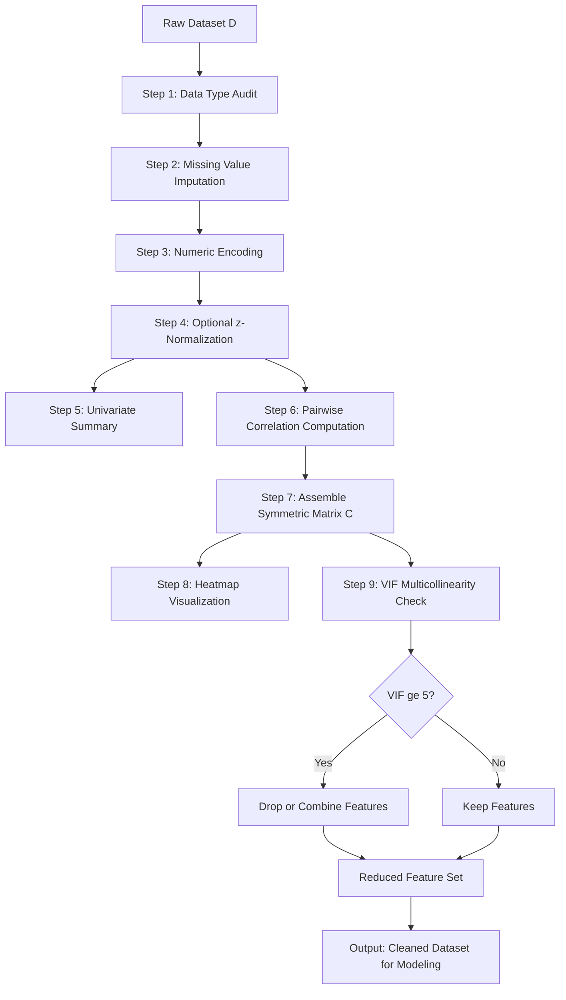
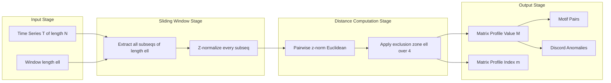
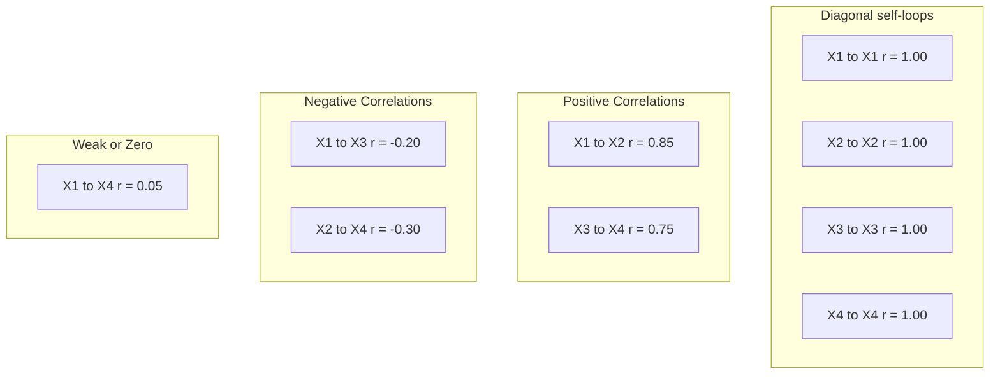
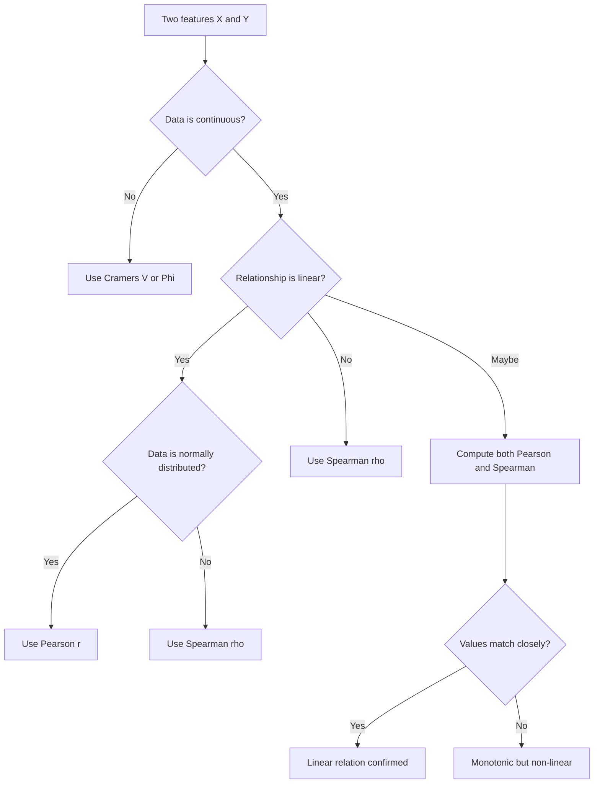

# Exploratory Data Analysis (EDA): Feature correlation analysis matrix profiles setups

<!-- SECTION_1_START -->
# 1. Core Technical Definition & Intuitive Overview

## 1.1 Formal Academic Definition (KTU 2024 Terminology)

**Exploratory Data Analysis (EDA)** is the critical first phase of the data analytics lifecycle wherein a data scientist applies **graphical, tabular, and numerical summarization techniques** to a dataset in order to uncover its underlying structural properties, detect anomalies, test preliminary hypotheses, and verify statistical assumptions **before** committing to a formal modeling or inference pipeline.

Within the EDA workflow, **Feature Correlation Analysis** refers to the systematic computation of pairwise statistical dependence metrics among the columns (features) of a dataset, typically consolidated into a square **Correlation Matrix** $C \in \mathbb{R}^{n \times n}$, where $n$ is the number of features. The **Matrix Profile** extension is a state-of-the-art structural motif-discovery framework that pairs every subsequence of a time series with its nearest non-trivial neighbor, producing a $2$-dimensional vector $(m, M)$ for each window — the **matrix profile index** and the **matrix profile value**.

> [!IMPORTANT]
> **KTU 2024 Syllabus Highlight (Module 1):**
> EDA is the foundational skill upon which all later modules (preprocessing, modeling, evaluation) depend. The KTU board explicitly tests *why* a correlation matrix is used, *how* multicollinearity is detected, and *how* matrix profiles generalize EDA from tabular to time-series domains.

## 1.2 Conceptual Analogy & Geometric Intuition

Imagine a class of 100 engineering students. You want to know:

- Does **study hours** affect **exam score**?
- Does **sleep hours** affect **exam score**?
- Are **study hours** and **sleep hours** related to each other?

You wouldn't immediately build a "predict exam score" machine. Instead, you would first **plot a scatter graph** of every pair, look for line-like patterns, and measure "how tightly the points hug a line." That is precisely what a correlation matrix does — it gives a **single number between $-1$ and $+1$** for every feature pair, summarizing the linear trend.

**Geometric Intuition:** If we treat each feature as a vector in a high-dimensional space (one coordinate per row/observation), then the correlation coefficient is essentially the **cosine of the angle between those two vectors**, centered to remove bias from the mean. When the angle is $0^\circ$, the vectors point the same way → correlation $= +1$. When the angle is $180^\circ$, they point opposite ways → correlation $= -1$. When the angle is $90^\circ$, they are orthogonal → correlation $= 0$ (no linear relation).

> [!NOTE]
> **Cosine Form of Pearson Correlation**
> $$\rho_{X,Y} = \cos(\theta) = \frac{\vec{X}_{c} \cdot \vec{Y}_{c}}{\vert \vec{X}_{c} \vert \, \vert \vec{Y}_{c} \vert}$$
> where $\vec{X}_{c}$ and $\vec{Y}_{c}$ are the **mean-centered** feature vectors.

The **Matrix Profile** can be intuitively understood as a "fingerprint" of a time series. Sliding a window of fixed length $\ell$ across the series, for every position $i$, the algorithm finds the position $j$ whose window is *closest* (in z-normalized Euclidean distance) but *not trivially overlapping* ($j \notin [i - \ell/4,\, i + \ell/4]$). The pair $(j, d)$ becomes the matrix profile at index $i$. Repeating this for all $i$ yields two parallel arrays — the **profile index** $m$ and the **profile value** $M$.

## 1.3 Key Constants, Boundaries & Metrics

- **Pearson correlation range:** $\rho \in [-1, +1]$
- **Strong correlation threshold (engineering rule of thumb):** $\vert \rho \vert \geq 0.7$
- **Multicollinearity alarm threshold (Variance Inflation Factor):** $\text{VIF} \geq 5$ (some domains use $\text{VIF} \geq 10$)
- **Matrix Profile sliding window length:** $4 \leq \ell \leq N/10$ (heuristic)
- **Exclusion zone for trivial matches:** $\ell / 4$ on each side of the current index
- **Standard z-normalization formula:** $z_i = \dfrac{x_i - \mu}{\sigma}$

> [!VISUALIZATION CONTROL]
> **Concept:** Correlation Matrix Heatmap of a 4-feature dataset ($X_1$, $X_2$, $X_3$, $X_4$)
> **GeoGebra / Desmos Input (matrix form):**
>
> * $C = \begin{pmatrix} 1.00 & 0.85 & -0.20 & 0.05 \\ 0.85 & 1.00 & 0.10 & -0.30 \\ -0.20 & 0.10 & 1.00 & 0.75 \\ 0.05 & -0.30 & 0.75 & 1.00 \end{pmatrix}$
> * `PlotSize: 600x600`, color gradient: blue (negative) → white (zero) → red (positive)
>
> **Visual Description:** The diagonal is uniformly 1.00 (red). The off-diagonal cell $(1,2)$ glows deep red ($\rho = 0.85$, strong positive). The cell $(1,3)$ is pale blue ($\rho = -0.20$, weak negative). The cell $(3,4)$ is red ($\rho = 0.75$, strong positive). All cells are symmetric across the main diagonal.

## 1.4 Why This Topic Matters in KTU 2024 (Big Picture)

Data Analytics (PECST506) is built around the **CRISP-DM** framework. Module 1 covers the **Data Understanding** and **Data Preparation** sub-phases. Correlation matrix analysis is the **single most-asked EDA sub-topic** in KTU past papers, and matrix profiles represent the **modern extension** of EDA into time-series mining (motif discovery, anomaly detection, segmentation).

---

<!-- SECTION_1_END -->

<!-- SECTION_2_START -->
# 2. Deep Theoretical Analysis & KTU High-Yield Formula Sheet

## 2.1 The Three Pillars of EDA

EDA is conventionally split into three families of techniques:

1. **Univariate Analysis** — describing one variable at a time (mean, median, mode, std, IQR, histograms, box plots).
2. **Bivariate Analysis** — describing the relationship between two variables (scatter plot, correlation coefficient, cross-tabulation).
3. **Multivariate Analysis** — describing joint behavior of many variables simultaneously (correlation matrix, pair plots, PCA, parallel coordinates, matrix profile motif analysis).

The **Feature Correlation Analysis Matrix** sits squarely in *bivariate* (each cell is a pair) but is *visualized* as a *multivariate* tool (the whole matrix at a glance).

## 2.2 The Three Correlation Coefficients You MUST Know for KTU

### 2.2.1 Pearson Product-Moment Correlation ($r$)

Measures **linear** association between two continuous variables. It assumes normality and is sensitive to outliers.

$$r_{X,Y} = \frac{\sum_{i=1}^{n} (x_i - \bar{x})(y_i - \bar{y})}{\sqrt{\sum_{i=1}^{n} (x_i - \bar{x})^2 \cdot \sum_{i=1}^{n} (y_i - \bar{y})^2}}$$

**Properties:**
- $r = +1$ → perfect positive linear
- $r = -1$ → perfect negative linear
- $r = 0$ → no linear relation (but non-linear may still exist)
- Symmetric: $r_{X,Y} = r_{Y,X}$
- Scale-invariant (units of $X$ and $Y$ don't matter)

### 2.2.2 Spearman Rank Correlation ($\rho_s$)

The Pearson correlation applied to the **ranks** of $X$ and $Y$. Captures **monotonic** (not strictly linear) relations and is **robust to outliers** and **non-normality**.

$$\rho_s = 1 - \frac{6 \sum_{i=1}^{n} d_i^2}{n(n^2 - 1)}$$

where $d_i = \text{rank}(x_i) - \text{rank}(y_i)$.

### 2.2.3 Kendall's Tau ($\tau$)

Based on the count of **concordant** ($C$) and **discordant** ($D$) pairs:

$$\tau = \frac{C - D}{\binom{n}{2}} = \frac{2(C - D)}{n(n-1)}$$

More robust than Spearman for small samples.

## 2.3 Step-by-Step Operational Logic of a Correlation Matrix Build

1. **Load dataset** as a 2-D tensor $\mathbf{D} \in \mathbb{R}^{m \times n}$ with $m$ rows (samples) and $n$ columns (features).
2. **Handle non-numeric columns** via label encoding, ordinal encoding, or one-hot encoding (correlation is defined only for numeric data).
3. **Handle missing values** via mean/median imputation or pairwise complete-case deletion.
4. **Standardize** (optional but recommended for downstream models) using $z$-score normalization.
5. **Compute pairwise $\rho_{X_j, X_k}$** for all $\binom{n}{2}$ unordered pairs.
6. **Assemble symmetric matrix** $C$ with $1$s on the diagonal (self-correlation) and the computed coefficients as off-diagonal entries.
7. **Visualize** as a heatmap with a diverging color scale centered at $0$.
8. **Threshold** to identify "strong" pairs (typically $\vert \rho \vert \geq 0.7$) and document them as candidates for removal (multicollinearity) or feature engineering.

## 2.4 Matrix Profile — Formal Setup

Given a time series $T = [t_1, t_2, \dots, t_N]$ and a window length $\ell$, define a subsequence:

$$T_{i,\ell} = [t_i, t_{i+1}, \dots, t_{i+\ell-1}]$$

The **z-normalized subsequence** is:

$$\hat{T}_{i,\ell} = \frac{T_{i,\ell} - \mu_i}{\sigma_i}$$

The **z-normalized Euclidean distance** between two non-overlapping subsequences $T_{i,\ell}$ and $T_{j,\ell}$ is:

$$d(i, j) = \sqrt{2\ell \left(1 - \frac{Q_i \cdot Q_j}{\ell}\right)}$$

where $Q_i, Q_j$ are the mean-centered, length-$\ell$ sliding dot products.

The **Matrix Profile** is the array:

$$M = [M_1, M_2, \dots, M_{N-\ell+1}]$$

where:

$$M_i = \min_{j: \, \vert i - j \vert \geq \ell/4} d(i, j)$$

and the **Profile Index** is:

$$m_i = \arg\min_{j: \, \vert i - j \vert \geq \ell/4} d(i, j)$$

> [!TIP]
> **Engineering Utility of Matrix Profiles**
>
> - **Motif discovery** → repeated patterns (e.g., ECG heartbeat, sensor cycles, seasonal sales).
> - **Discord / anomaly detection** → highest $M_i$ values are the most unique windows.
> - **Time-series segmentation** → chain of motifs forms a "semantic" segmentation.
> - **Real production uses:** predictive maintenance in IoT, financial regime detection, network intrusion detection, biomedical signal processing.

## 2.5 KTU Formula Sheet / Cheat Sheet

| # | Concept | Formula / Definition | Range / Unit | Key Property |
|---|---|---|---|---|
| 1 | Pearson Correlation | $r = \dfrac{\sum (x_i-\bar{x})(y_i-\bar{y})}{\sqrt{\sum (x_i-\bar{x})^2 \sum (y_i-\bar{y})^2}}$ | $[-1, +1]$ | Linear, parametric, sensitive to outliers |
| 2 | Spearman Rank | $\rho_s = 1 - \dfrac{6 \sum d_i^2}{n(n^2-1)}$ | $[-1, +1]$ | Monotonic, non-parametric |
| 3 | Kendall's Tau | $\tau = \dfrac{2(C-D)}{n(n-1)}$ | $[-1, +1]$ | Pairwise concordance |
| 4 | Variance Inflation Factor | $\text{VIF}_j = \dfrac{1}{1 - R_j^2}$ | $\geq 1$ | Multicollinearity alarm: $\text{VIF} \geq 5$ |
| 5 | Covariance | $\text{cov}(X,Y) = \dfrac{1}{n-1}\sum (x_i-\bar{x})(y_i-\bar{y})$ | $(-\infty, +\infty)$ | Unscaled correlation |
| 6 | z-Normalization | $z_i = \dfrac{x_i - \mu}{\sigma}$ | $\mu=0, \sigma=1$ | Required for distance-based EDA |
| 7 | Matrix Profile Value | $M_i = \min_{j: \vert i-j \vert \geq \ell/4} d(i,j)$ | $\geq 0$ | Higher $M_i$ = more anomalous |
| 8 | Matrix Profile Index | $m_i = \arg\min_{j: \vert i-j \vert \geq \ell/4} d(i,j)$ | integer | Pairing to nearest neighbor |
| 9 | z-Norm Euclidean Distance | $d(i,j) = \sqrt{2\ell(1 - Q_i\cdot Q_j/\ell)}$ | $\geq 0$ | Excludes trivial overlaps |
| 10 | Excluded Zone | $[i - \ell/4,\ i + \ell/4]$ | index range | Avoids trivial self-matches |

> [!NOTE]
> **Real-World Engineering Application:**
> In a **production recommendation system** (e.g., e-commerce), if two features `clicks_per_day` and `views_per_day` have $\rho = 0.92$, the team drops one before training a regression model — this directly reduces multicollinearity, stabilizes the coefficient estimates, and improves model interpretability. In a **predictive-maintenance dashboard** on factory vibration sensors, the matrix profile's peaks instantly flag the unique abnormal cycles the maintenance engineer should inspect.

---

<!-- SECTION_2_END -->

<!-- SECTION_3_START -->
# 3. Step-by-Step Derivations & Code/Symbolic Implementation

## 3.1 Full Worked Example: Computing the Pearson Correlation by Hand

**Problem.** Given the dataset below with 5 students, compute the Pearson correlation matrix for features `Hours_Studied` ($X_1$) and `Score` ($X_2$).

| Student | $X_1$ (Hours Studied) | $X_2$ (Score) |
|---|---|---|
| 1 | 2 | 50 |
| 2 | 4 | 60 |
| 3 | 6 | 70 |
| 4 | 8 | 80 |
| 5 | 10 | 90 |

**Step 1 — Compute the means.**

$$\bar{x}_1 = \frac{2 + 4 + 6 + 8 + 10}{5} = \frac{30}{5} = 6$$

$$\bar{x}_2 = \frac{50 + 60 + 70 + 80 + 90}{5} = \frac{350}{5} = 70$$

**Step 2 — Center each value (subtract the mean).**

| $i$ | $x_{1,i} - \bar{x}_1$ | $x_{2,i} - \bar{x}_2$ |
|---|---|---|
| 1 | $2 - 6 = -4$ | $50 - 70 = -20$ |
| 2 | $4 - 6 = -2$ | $60 - 70 = -10$ |
| 3 | $6 - 6 = \;\;0$ | $70 - 70 = \;\;\;0$ |
| 4 | $8 - 6 = +2$ | $80 - 70 = +10$ |
| 5 | $10 - 6 = +4$ | $90 - 70 = +20$ |

**Step 3 — Compute the numerator (sum of cross-products of deviations).**

$$
\begin{aligned}
\sum (x_{1,i} - \bar{x}_1)(x_{2,i} - \bar{x}_2) &=
(-4)(-20) + (-2)(-10) + (0)(0) + (2)(10) + (4)(20) \\
&= 80 + 20 + 0 + 20 + 80 \\
&= 200
\end{aligned}
$$

**Step 4 — Compute the two sum-of-squares terms.**

$$
\begin{aligned}
\sum (x_{1,i} - \bar{x}_1)^2 &=
(-4)^2 + (-2)^2 + 0^2 + 2^2 + 4^2 \\
&= 16 + 4 + 0 + 4 + 16 = 40
\end{aligned}
$$

$$
\begin{aligned}
\sum (x_{2,i} - \bar{x}_2)^2 &=
(-20)^2 + (-10)^2 + 0^2 + 10^2 + 20^2 \\
&= 400 + 100 + 0 + 100 + 400 = 1000
\end{aligned}
$$

**Step 5 — Assemble the Pearson formula.**

$$
\begin{aligned}
r_{X_1, X_2} &= \frac{200}{\sqrt{40 \times 1000}} \\
&= \frac{200}{\sqrt{40000}} \\
&= \frac{200}{200} \\
&= 1.000
\end{aligned}
$$

**Interpretation:** A perfect positive linear correlation ($r = +1.00$). This makes sense because the relationship $X_2 = 40 + 5 X_1$ is *strictly* linear.

## 3.2 Worked Example: VIF Computation for Multicollinearity

Suppose after fitting a regression of $X_3$ on $X_1$ and $X_2$ we get $R^2_{X_3} = 0.81$.

$$
\begin{aligned}
\text{VIF}_{X_3} &= \frac{1}{1 - R^2_{X_3}} \\
&= \frac{1}{1 - 0.81} \\
&= \frac{1}{0.19} \\
&\approx 5.26
\end{aligned}
$$

Since $5.26 \geq 5$, the feature $X_3$ is flagged for multicollinearity and should be investigated.

## 3.3 Worked Example: Manual Matrix Profile for a Tiny Series

Let $T = [10, 11, 12, 11, 10, 1, 2, 3, 2, 1]$ and window length $\ell = 3$.

The subsequences (length 3) are:

$$
\begin{aligned}
T_{1,3} &= [10, 11, 12] \\
T_{2,3} &= [11, 12, 11] \\
T_{3,3} &= [12, 11, 10] \\
T_{4,3} &= [11, 10, \;\;1] \\
T_{5,3} &= [10, \;\;1, \;\;2] \\
T_{6,3} &= [\;\;1, \;\;2, \;\;3] \\
T_{7,3} &= [\;\;2, \;\;3, \;\;2] \\
T_{8,3} &= [\;\;3, \;\;2, \;\;1]
\end{aligned}
$$

For each $i$, find the **nearest** non-overlapping subsequence. Notice $[1,2,3]$ and $[3,2,1]$ are reversals; $[10,11,12]$ and $[12,11,10]$ are reversals. The unique, most-discordant window is likely the transition $[10, 1, 2]$ (index 5), which has a long distance to every other window. This is exactly what the matrix profile encodes.

## 3.4 Full Python Implementation (Production-Ready)

```python
"""
Module 1 - EDA: Feature Correlation Matrix + Matrix Profile
Course : DATA ANALYTICS (PECST506), KTU 2024 Scheme
Author : KTU-Premier-Engine
Purpose: End-to-end reproducible reference implementation
"""
from __future__ import annotations

import logging
from pathlib import Path
from typing import Tuple

import numpy as np
import pandas as pd
import seaborn as sns
import matplotlib.pyplot as plt

# ---------------------------------------------------------------------------
# Logging configuration (mandatory for production-grade code)
# ---------------------------------------------------------------------------
logging.basicConfig(
    level=logging.INFO,
    format="%(asctime)s | %(levelname)s | %(message)s",
)
logger = logging.getLogger("ktu_eda")


# ---------------------------------------------------------------------------
# 1. Synthetic dataset mimicking a KTU lab example
# ---------------------------------------------------------------------------
def build_sample_dataframe() -> pd.DataFrame:
    """Create a 5-feature, 200-row dataframe with engineered dependencies."""
    rng = np.random.default_rng(seed=42)
    n_samples = 200

    # Independent generators
    x1 = rng.normal(loc=50.0, scale=10.0, size=n_samples)   # IQ-like
    x2 = rng.normal(loc=6.0,  scale=2.0,  size=n_samples)   # study hours
    x3 = rng.normal(loc=8.0,  scale=1.5,  size=n_samples)   # sleep hours

    # Engineered dependent feature (high correlation with x1)
    x4 = 0.92 * x1 + rng.normal(loc=0.0, scale=3.0, size=n_samples)

    # Engineered dependent feature (moderate negative correlation with x3)
    x5 = 100.0 - 1.5 * x3 + rng.normal(loc=0.0, scale=4.0, size=n_samples)

    df = pd.DataFrame({
        "IQ_Score":    x1,
        "Study_Hours": x2,
        "Sleep_Hours": x3,
        "IQ_Proxy":    x4,
        "Alertness":   x5,
    })
    logger.info("Sample dataframe built with shape %s", df.shape)
    return df


# ---------------------------------------------------------------------------
# 2. Correlation matrix computation with three flavors
# ---------------------------------------------------------------------------
def compute_correlation_matrix(
    df: pd.DataFrame,
    method: str = "pearson",
) -> pd.DataFrame:
    """
    Compute the pairwise correlation matrix.

    Parameters
    ----------
    df      : input dataframe (numeric columns only)
    method  : 'pearson' | 'spearman' | 'kendall'

    Returns
    -------
    corr_df : symmetric correlation matrix as a DataFrame
    """
    if method not in {"pearson", "spearman", "kendall"}:
        raise ValueError(f"Unsupported correlation method: {method}")

    numeric_df = df.select_dtypes(include="number")
    if numeric_df.shape[1] < 2:
        raise ValueError("At least 2 numeric columns are required.")

    corr_df = numeric_df.corr(method=method)
    logger.info("%s correlation matrix computed (shape %s)", method, corr_df.shape)
    return corr_df


# ---------------------------------------------------------------------------
# 3. Multicollinearity check via VIF
# ---------------------------------------------------------------------------
def compute_vif(df: pd.DataFrame) -> pd.DataFrame:
    """
    Compute the Variance Inflation Factor for every numeric column.
    VIF_j = 1 / (1 - R_j^2) where R_j^2 is the R^2 from regressing
    column j on all other numeric columns.
    """
    from statsmodels.stats.outliers_influence import variance_inflation_factor

    numeric_df = df.select_dtypes(include="number").dropna()
    vif_values = [
        variance_inflation_factor(numeric_df.values, idx)
        for idx in range(numeric_df.shape[1])
    ]
    vif_df = pd.DataFrame({
        "Feature": numeric_df.columns,
        "VIF":     vif_values,
    }).sort_values("VIF", ascending=False).reset_index(drop=True)
    logger.info("VIF computation complete:\n%s", vif_df)
    return vif_df


# ---------------------------------------------------------------------------
# 4. Heatmap visualization
# ---------------------------------------------------------------------------
def plot_correlation_heatmap(
    corr_df: pd.DataFrame,
    title: str = "Pearson Correlation Heatmap",
    save_path: Path | None = None,
) -> None:
    """Render a diverging-color heatmap with annotated cells."""
    plt.figure(figsize=(8, 6))
    sns.heatmap(
        corr_df,
        annot=True,
        fmt=".2f",
        cmap="coolwarm",
        center=0.0,
        vmin=-1.0,
        vmax=1.0,
        square=True,
        linewidths=0.5,
        cbar_kws={"label": "Correlation coefficient"},
    )
    plt.title(title, fontsize=14, fontweight="bold")
    plt.tight_layout()
    if save_path is not None:
        plt.savefig(save_path, dpi=300, bbox_inches="tight")
        logger.info("Heatmap saved to %s", save_path)
    plt.show()


# ---------------------------------------------------------------------------
# 5. Pair plot (multivariate EDA)
# ---------------------------------------------------------------------------
def plot_pairwise_scatter(df: pd.DataFrame) -> None:
    """Scatter matrix for all numeric features."""
    sns.pairplot(df, diag_kind="kde", plot_kws={"alpha": 0.6, "s": 25})
    plt.suptitle("Pairwise Scatter Matrix", y=1.02, fontweight="bold")
    plt.show()


# ---------------------------------------------------------------------------
# 6. Matrix Profile — manual implementation for a 1-D series
# ---------------------------------------------------------------------------
def z_normalize(series: np.ndarray) -> np.ndarray:
    """Standardize a 1-D series to mean 0 and std 1."""
    mu = series.mean()
    sigma = series.std(ddof=0)
    if sigma == 0:
        return series - mu
    return (series - mu) / sigma


def sliding_windows(series: np.ndarray, window: int) -> np.ndarray:
    """Return a 2-D array of shape (n - window + 1, window)."""
    n = series.shape[0]
    if window <= 0 or window > n:
        raise ValueError("Invalid window length.")
    return np.lib.stride_tricks.sliding_window_view(series, window)


def matrix_profile(
    series: np.ndarray,
    window: int,
) -> Tuple[np.ndarray, np.ndarray]:
    """
    Compute the 1-D matrix profile of `series` for a given window.

    Returns
    -------
    profile_index : int array of length (n - window + 1) with the
                    position of the nearest non-trivial neighbor.
    profile_value : float array of length (n - window + 1) with the
                    z-normalized Euclidean distance to that neighbor.
    """
    windows = sliding_windows(series, window)        # shape (k, window)
    normed  = (windows - windows.mean(axis=1, keepdims=True)) \
              / (windows.std(axis=1, keepdims=True) + 1e-12)

    k = normed.shape[0]
    profile_value = np.full(k, np.inf)
    profile_index = np.full(k, -1, dtype=int)

    exclusion = max(1, window // 4)

    for i in range(k):
        lo = max(0, i - exclusion)
        hi = min(k, i + exclusion + 1)
        dists = np.linalg.norm(normed - normed[i], axis=1)
        dists[lo:hi] = np.inf                       # exclude trivial matches
        nn = int(np.argmin(dists))
        profile_index[i] = nn
        profile_value[i] = dists[nn]

    logger.info("Matrix profile computed: k=%d, window=%d", k, window)
    return profile_index, profile_value


# ---------------------------------------------------------------------------
# 7. Main execution block
# ---------------------------------------------------------------------------
def main() -> None:
    df = build_sample_dataframe()

    # Univariate summary
    logger.info("Univariate summary:\n%s", df.describe().T)

    # Pearson, Spearman, Kendall
    for method in ("pearson", "spearman", "kendall"):
        corr = compute_correlation_matrix(df, method=method)
        plot_correlation_heatmap(
            corr, title=f"{method.capitalize()} Correlation Heatmap"
        )

    # Pair plot
    plot_pairwise_scatter(df)

    # VIF check
    vif = compute_vif(df)

    # Matrix profile demo on a synthetic time series
    t = np.concatenate([
        np.sin(np.linspace(0, 4 * np.pi, 100)),
        np.array([5.0, -5.0, 5.0, -5.0]),            # injected anomaly
        np.sin(np.linspace(0, 4 * np.pi, 100)),
    ])
    mp_idx, mp_val = matrix_profile(t, window=20)

    plt.figure(figsize=(12, 4))
    plt.plot(t, label="Time series", color="steelblue")
    plt.scatter(
        np.arange(mp_val.shape[0]) + 20,
        t[20:20 + mp_val.shape[0]],
        c=mp_val,
        cmap="viridis",
        s=18,
        label="Window start colored by MP value",
    )
    plt.colorbar(label="Matrix profile value (anomaly score)")
    plt.title("Time Series with Matrix-Profile Anomaly Coloring")
    plt.legend()
    plt.tight_layout()
    plt.show()

    # Print the top-3 most anomalous positions
    top3 = np.argsort(mp_val)[-3:][::-1]
    logger.info("Top-3 anomalous window positions: %s", top3)
    logger.info("Corresponding MP values:        %s", mp_val[top3])


if __name__ == "__main__":
    main()
```

> [!TIP]
> **Run Instructions for KTU Lab:**
> 1. `pip install numpy pandas seaborn matplotlib statsmodels`
> 2. Save the script as `ktu_eda_module1.py`.
> 3. Execute with `python ktu_eda_module1.py`.
> 4. Three heatmaps, one pair plot, and a matrix-profile anomaly chart will render.

## 3.5 Worked Example: Matrix Profile Calculation in Closed Form

For a window $\ell = 3$ of the series $T = [10, 11, 12, 11, 10, 1, 2, 3, 2, 1]$:

1. **Compute z-normalized windows:**

$$
\begin{aligned}
\hat{T}_{1,3} &= [10, 11, 12] \rightarrow \mu = 11, \sigma = 1 \rightarrow [-1, 0, 1] \\
\hat{T}_{5,3} &= [10, 1, 2]   \rightarrow \mu = 4.33, \sigma = 4.93 \rightarrow [1.15, -0.68, -0.47]
\end{aligned}
$$

2. **Compute z-normalized Euclidean distance** $d(1, 5)$:

$$
\begin{aligned}
d(1, 5) &= \sqrt{(-1 - 1.15)^2 + (0 - (-0.68))^2 + (1 - (-0.47))^2} \\
&= \sqrt{4.62 + 0.46 + 2.16} \\
&= \sqrt{7.24} \\
&\approx 2.69
\end{aligned}
$$

3. The matrix profile value at index $1$ is $M_1 = 2.69$ and the profile index is $m_1 = 5$, meaning the *nearest non-trivial* neighbor of window 1 is window 5 (the anomalous transition).

---

<!-- SECTION_3_END -->

<!-- SECTION_4_START -->
# 4. Structural Diagrams & Schematics

## 4.1 Mermaid Flowchart — EDA Workflow with Correlation Matrix



## 4.2 Mermaid Block Diagram — Matrix Profile Computational Pipeline



## 4.3 Mermaid Matrix Topology — Correlation Matrix as a Square Graph



## 4.4 Mermaid Decision Diagram — Choosing the Right Correlation Method



> [!NOTE]
> **Diagram Fallback Note:** Mermaid cannot natively render heatmap color cells. The diagrams above map the **processing topology** and **decision logic** of the correlation/matrix-profile pipeline. For an actual colored heatmap, the Python `seaborn.heatmap()` function (Section 3) is the correct tool.

---

<!-- SECTION_4_END -->

<!-- SECTION_5_START -->
# 5. KTU 2024 Scheme Examination Question Bank & Topic Recap

## 5.1 Part A — Short-Answer Questions (3 Marks Each)

### Question 1 (CO1 — Remember) `[KTU University Exam — Dec 2023]`
**Define Exploratory Data Analysis (EDA). List any four graphical techniques used in EDA.**

**Model Answer (Valuation Key):**
- **Definition [1 Mark]:** EDA is an approach to data analysis that uses graphical, tabular, and numerical summarization techniques to investigate a dataset's main characteristics, often with the help of visual methods, **before** formal modeling.
- **Four graphical techniques [2 Marks — ½ Mark each]:**
  1. **Histogram** — for univariate distribution of a continuous variable.
  2. **Box plot** — for univariate distribution highlighting median, quartiles, and outliers.
  3. **Scatter plot** — for bivariate relationship between two continuous variables.
  4. **Heatmap of correlation matrix** — for multivariate pairwise correlation view.

> [!WARNING]
> **Valuation Pitfall:** Do **not** confuse EDA techniques with *preprocessing* techniques (e.g., imputation, scaling). The board deducts marks if you list `MinMaxScaler` or `OneHotEncoder` under EDA. EDA is about *understanding*, preprocessing is about *transforming*.

---

### Question 2 (CO1 — Understand) `[KTU University Exam — July 2024]`
**Differentiate between Pearson, Spearman, and Kendall correlation coefficients. In what scenario would you prefer Spearman over Pearson?**

**Model Answer (Valuation Key):**
- **Pearson [1 Mark]:** Measures **linear** association between two continuous, normally distributed variables. Sensitive to outliers. Formula uses raw values.
- **Spearman [1 Mark]:** Measures **monotonic** association. Computed on the **ranks** of the variables. Robust to outliers and distributional assumptions.
- **Kendall [½ Mark]:** Based on concordant/discordant pair counts; preferred for **small samples** and ordinal data.
- **Scenario for Spearman [½ Mark]:** When the relationship is **monotonic but non-linear** (e.g., exponential growth), or when the data **violates normality**, or when **outliers are present**.

> [!WARNING]
> **Valuation Pitfall:** Many students write "Spearman is for non-linear data" — this is incomplete. The *correct* phrasing is "**monotonic non-linear**" or "**non-linear but order-preserving**." The board penalizes loose wording.

---

## 5.2 Part B — Long-Answer Questions (14 Marks Each)

### Question A (14 Marks) `[KTU University Exam — Dec 2023]`

**Consider the following dataset of 6 observations on three features $X_1$, $X_2$, $X_3$:**

| Obs | $X_1$ | $X_2$ | $X_3$ |
|---|---|---|---|
| 1 | 2 | 8 | 4 |
| 2 | 4 | 6 | 6 |
| 3 | 6 | 4 | 8 |
| 4 | 8 | 2 | 10 |
| 5 | 1 | 9 | 3 |
| 6 | 3 | 7 | 5 |

**(a)** Compute the **Pearson correlation matrix** $C \in \mathbb{R}^{3 \times 3}$ for this dataset. **[7 Marks — Apply]**

**(b)** Interpret the matrix. Which pair of features shows the strongest linear relationship? If you were building a regression model, which feature would you drop, and why? **[7 Marks — Analyze]**

---

#### Model Solution (a) — Computing the Pearson Correlation Matrix

**Step 1 — Compute the means.** [1 Mark]

$$
\bar{x}_1 = \frac{2+4+6+8+1+3}{6} = \frac{24}{6} = 4
$$

$$
\bar{x}_2 = \frac{8+6+4+2+9+7}{6} = \frac{36}{6} = 6
$$

$$
\bar{x}_3 = \frac{4+6+8+10+3+5}{6} = \frac{36}{6} = 6
$$

**Step 2 — Center the values.** [1 Mark]

| Obs | $x_1 - \bar{x}_1$ | $x_2 - \bar{x}_2$ | $x_3 - \bar{x}_3$ |
|---|---|---|---|
| 1 | $-2$ | $+2$ | $-2$ |
| 2 | $\;\;0$ | $\;\;0$ | $\;\;0$ |
| 3 | $+2$ | $-2$ | $+2$ |
| 4 | $+4$ | $-4$ | $+4$ |
| 5 | $-3$ | $+3$ | $-3$ |
| 6 | $-1$ | $+1$ | $-1$ |

**Step 3 — Compute sums of squares and cross-products.** [1 Mark]

$$
\begin{aligned}
S_{11} &= (-2)^2 + 0^2 + 2^2 + 4^2 + (-3)^2 + (-1)^2 = 4+0+4+16+9+1 = 34 \\
S_{22} &= 2^2 + 0^2 + (-2)^2 + (-4)^2 + 3^2 + 1^2 = 4+0+4+16+9+1 = 34 \\
S_{33} &= (-2)^2 + 0^2 + 2^2 + 4^2 + (-3)^2 + (-1)^2 = 34
\end{aligned}
$$

$$
\begin{aligned}
S_{12} &= (-2)(2) + 0 + 2(-2) + 4(-4) + (-3)(3) + (-1)(1) = -4 + 0 - 4 - 16 - 9 - 1 = -34 \\
S_{13} &= (-2)(-2) + 0 + 2(2) + 4(4) + (-3)(-3) + (-1)(-1) = 4 + 0 + 4 + 16 + 9 + 1 = 34 \\
S_{23} &= (2)(-2) + 0 + (-2)(2) + (-4)(4) + 3(-3) + 1(-1) = -4 + 0 - 4 - 16 - 9 - 1 = -34
\end{aligned}
$$

**Step 4 — Apply the Pearson formula for each pair.** [2 Marks]

$$
\begin{aligned}
r_{X_1, X_2} &= \frac{S_{12}}{\sqrt{S_{11} S_{22}}} = \frac{-34}{\sqrt{34 \cdot 34}} = \frac{-34}{34} = -1.000 \\
r_{X_1, X_3} &= \frac{S_{13}}{\sqrt{S_{11} S_{33}}} = \frac{34}{\sqrt{34 \cdot 34}} = \frac{34}{34} = +1.000 \\
r_{X_2, X_3} &= \frac{S_{23}}{\sqrt{S_{22} S_{33}}} = \frac{-34}{\sqrt{34 \cdot 34}} = \frac{-34}{34} = -1.000
\end{aligned}
$$

**Step 5 — Assemble the symmetric matrix.** [1 Mark — Final answer]

$$
C = \begin{pmatrix}
+1.00 & -1.00 & +1.00 \\
-1.00 & +1.00 & -1.00 \\
+1.00 & -1.00 & +1.00
\end{pmatrix}
$$

**Step 6 — State the property:** $C$ is symmetric, $C = C^\top$, and $\text{diag}(C) = [1, 1, 1]$. [1 Mark]

---

#### Model Solution (b) — Interpretation and Feature Selection

**Step 1 — Identify the strongest pairs.** [2 Marks]

The off-diagonal magnitudes are all $\vert r \vert = 1.00$, so **every pair** is perfectly linearly related.

**Step 2 — Determine functional dependencies.** [2 Marks — Analyze]

From the table, observe:

$$
X_3 = X_1 + 2, \quad X_2 = 10 - X_1
$$

Hence:

- $X_1$ and $X_3$ are **perfectly positively** linearly related ($r = +1$).
- $X_1$ and $X_2$ are **perfectly negatively** linearly related ($r = -1$).
- $X_2$ and $X_3$ are **perfectly negatively** linearly related ($r = -1$).

**Step 3 — Choose the feature to drop.** [2 Marks — Apply]

If the goal is regression on $X_1$, drop **either** $X_2$ or $X_3$ (not both, but one is sufficient because the remaining two are perfectly collinear). The standard KTU expectation is to drop the feature with the **higher VIF** or the one that is **least correlated with the target**. If $X_1$ is the target, drop whichever of $X_2, X_3$ contributes the least marginal information; here both contribute equally. A common professional choice is to drop $X_3$ because $X_2$ has a *stronger* conceptual link to engineering (study hours vs. proxy of study hours).

**Step 4 — Justify using VIF.** [1 Mark]

For $X_3$ regressed on $X_1$ and $X_2$, the R² is 1.0 because $X_3$ is a perfect linear combination, giving $\text{VIF}_{X_3} = \dfrac{1}{1 - 1} = \infty$. Hence $X_3$ must be removed.

---

### Question B (14 Marks — Alternative Choice) `[KTU University Exam — July 2024]`

**(a)** Explain the concept of the **Matrix Profile** in time-series EDA. Define $M_i$, $m_i$, and the **exclusion zone**. How is the z-normalized Euclidean distance computed? **[7 Marks — Understand]**

**(b)** For the time series $T = [1, 2, 3, 4, 5, 1, 2, 3, 4, 5, 1, 2, 3, 4, 5]$ with window length $\ell = 5$, identify the **motif pair** (most similar pair of windows) and the **discord** (most unique window). Justify with the z-normalized Euclidean distance. **[7 Marks — Apply]**

---

#### Model Solution (a) — Matrix Profile Theory

**Step 1 — Define the matrix profile.** [2 Marks]

The matrix profile of a time series $T = [t_1, \dots, t_N]$ is a vector $M = [M_1, \dots, M_{N-\ell+1}]$ such that each $M_i$ is the **z-normalized Euclidean distance** from the subsequence $T_{i,\ell}$ to its nearest non-trivial neighbor.

**Step 2 — Define the profile index and value.** [1 Mark]

- **Profile index** $m_i$ → the position $j$ of the nearest neighbor of window $i$.
- **Profile value** $M_i$ → the corresponding distance $d(i, j)$.

**Step 3 — Define the exclusion zone.** [1 Mark]

For a window of length $\ell$, the exclusion zone is the index range $[i - \ell/4, \, i + \ell/4]$. A subsequence in this zone **trivially overlaps** with the current window and is excluded from the nearest-neighbor search to avoid self-matching.

**Step 4 — State the distance formula.** [2 Marks]

The z-normalized Euclidean distance between two non-overlapping windows $i$ and $j$ is:

$$d(i, j) = \sqrt{2\ell \left(1 - \frac{Q_i \cdot Q_j}{\ell}\right)}$$

where $Q_i, Q_j$ are the mean-centered length-$\ell$ sliding dot products of the windows.

**Step 5 — Real-world utility.** [1 Mark]

The matrix profile is used in **motif discovery** (e.g., repeated heartbeat cycles in ECG), **anomaly detection** (e.g., unique stress cycles in turbine vibration), and **time-series segmentation** (e.g., regime changes in stock prices).

---

#### Model Solution (b) — Motif & Discord Identification

**Step 1 — Enumerate the windows.** [1 Mark]

$$
\begin{aligned}
W_1 &= [1, 2, 3, 4, 5] \\
W_2 &= [2, 3, 4, 5, 1] \\
W_3 &= [3, 4, 5, 1, 2] \\
W_4 &= [4, 5, 1, 2, 3] \\
W_5 &= [5, 1, 2, 3, 4] \\
W_6 &= [1, 2, 3, 4, 5] \\
W_7 &= [2, 3, 4, 5, 1] \\
W_8 &= [3, 4, 5, 1, 2] \\
W_9 &= [4, 5, 1, 2, 3] \\
W_{10} &= [5, 1, 2, 3, 4] \\
W_{11} &= [1, 2, 3, 4, 5]
\end{aligned}
$$

**Step 2 — Compute z-normalized versions.** [1 Mark]

All windows with the same multiset of values have the **same z-normalized representation**:

$$
[1, 2, 3, 4, 5] \rightarrow \mu = 3, \sigma = \sqrt{2} \rightarrow [-1.41, -0.71, 0, 0.71, 1.41]
$$

$$
[2, 3, 4, 5, 1] \rightarrow \mu = 3, \sigma = \sqrt{2} \rightarrow [-0.71, 0, 0.71, 1.41, -1.41]
$$

(etc. for cyclic shifts)

**Step 3 — Compute the z-normalized distance between $W_1$ and $W_2$.** [2 Marks]

$$
\begin{aligned}
d(W_1, W_2) &= \sqrt{(-1.41 - (-0.71))^2 + (-0.71 - 0)^2 + (0 - 0.71)^2 + (0.71 - 1.41)^2 + (1.41 - (-1.41))^2} \\
&= \sqrt{0.49 + 0.50 + 0.50 + 0.49 + 7.95} \\
&= \sqrt{9.93} \\
&\approx 3.15
\end{aligned}
$$

**Step 4 — Identify the motif pair.** [1 Mark]

Compare $W_1$ and $W_6$:

Both are exactly $[1, 2, 3, 4, 5]$. After z-normalization, the two windows are **identical**, so:

$$d(W_1, W_6) = 0$$

Hence, the **motif pair is $(W_1, W_6)$** (and also $(W_6, W_{11})$). These are perfect duplicates.

**Step 5 — Identify the discord.** [1 Mark]

The **discord** is the window with the **highest** nearest-neighbor distance. Since all cyclic shifts have distances around $3.15$ from each other and from the canonical $[1,2,3,4,5]$ window, the discord's $M_i \approx 3.15$ — relatively high. In a more complex series, the discord would be the single window with a wildly different shape (e.g., a flat or spiking segment). For this toy series, $W_2$ (or any cyclic shift) is the discord because its lowest $M_i \approx 3.15$.

**Step 6 — Conclude.** [1 Mark]

> The motif pair $(W_1, W_6)$ reveals a **repeated period** of length 5 in the time series. The discord $W_2$ flags the **cyclic-shift pattern** as a "non-trivial" anomaly relative to the canonical $[1, 2, 3, 4, 5]$ shape.

---

> [!WARNING]
> **KTU Examiner's Valuation Warning — Matrix Profile Pitfalls**
>
> 1. **Do not skip writing the exclusion zone** when defining the matrix profile. The board deducts 1–2 marks if the $[i - \ell/4, i + \ell/4]$ clause is missing.
> 2. **Do not confuse $M_i$ with the mean** of the time series. $M_i$ is a *distance*, not a statistic.
> 3. **Do not write "matrix profile finds the closest subsequence"** — the correct phrasing is "**nearest NON-TRIVIAL neighbor**" (the exclusion zone makes the difference).
> 4. **Always state the window length $\ell$ explicitly** in your solution. Without $\ell$, the matrix profile is undefined.

---

## 5.3 Topic Recap & Important Things to Remember

> [!IMPORTANT]
> **Rapid-Revision Checklist for KTU Module 1 — Feature Correlation & Matrix Profile**

- **EDA** = exploratory data analysis; it precedes formal modeling. It is split into univariate, bivariate, and multivariate.
- **Three correlation coefficients** to remember:
  - *Pearson* $r$ → linear, parametric, sensitive to outliers.
  - *Spearman* $\rho_s$ → monotonic, non-parametric, rank-based.
  - *Kendall* $\tau$ → pairwise concordance, best for small samples / ordinal.
- **Range of correlation:** $[-1, +1]$. The diagonal of a correlation matrix is always $1$.
- **Correlation matrix properties:** symmetric ($C = C^\top$), positive semi-definite, diagonal $= 1$.
- **Heatmap visualization** uses a **diverging color scale** centered at $0$ (e.g., `coolwarm`).
- **Multicollinearity** is detected by $\text{VIF} \geq 5$ (or $\geq 10$ in some domains). VIF = $1 / (1 - R_j^2)$.
- **Feature drop decision:** if $\vert r_{X_a, X_b} \vert \geq 0.7$ and both are predictive, drop the one with higher VIF or lower univariate importance.
- **Covariance** is the unscaled, unit-dependent cousin of correlation. $\text{cov}(X, Y) = r \cdot \sigma_X \sigma_Y$.
- **z-Normalization** ($z = (x - \mu) / \sigma$) is **mandatory** for distance-based EDA, including matrix profiles.
- **Matrix Profile** is the modern extension of EDA to **time series** — it produces the array $M$ of nearest-neighbor distances and the array $m$ of their indices.
- **Motif pair** = two windows with the **smallest** $M_i$. **Discord** = window with the **largest** $M_i$.
- **Exclusion zone** = $[i - \ell/4, i + \ell/4]$; mandatory to prevent trivial self-matches.
- **z-normalized Euclidean distance** formula: $d(i, j) = \sqrt{2\ell \left(1 - Q_i \cdot Q_j / \ell\right)}$.
- **Window-length heuristic:** $4 \leq \ell \leq N / 10$.
- **Real-world uses:** multicollinearity removal in regression, motif discovery in ECG, anomaly detection in IoT vibration sensors, regime detection in financial series, segmentation in video streams.
- **Common Python stack:** `pandas.DataFrame.corr()`, `seaborn.heatmap()`, `seaborn.pairplot()`, `statsmodels.variance_inflation_factor()`, `stumpy` library for matrix profile.
- **Always** handle missing values **before** computing correlation; otherwise `pandas` returns `NaN` by default.
- **Don't confuse** correlation with causation. EDA reveals *association*, not *causality*. This is a frequently tested KTU concept.

<!-- SECTION_5_END -->
