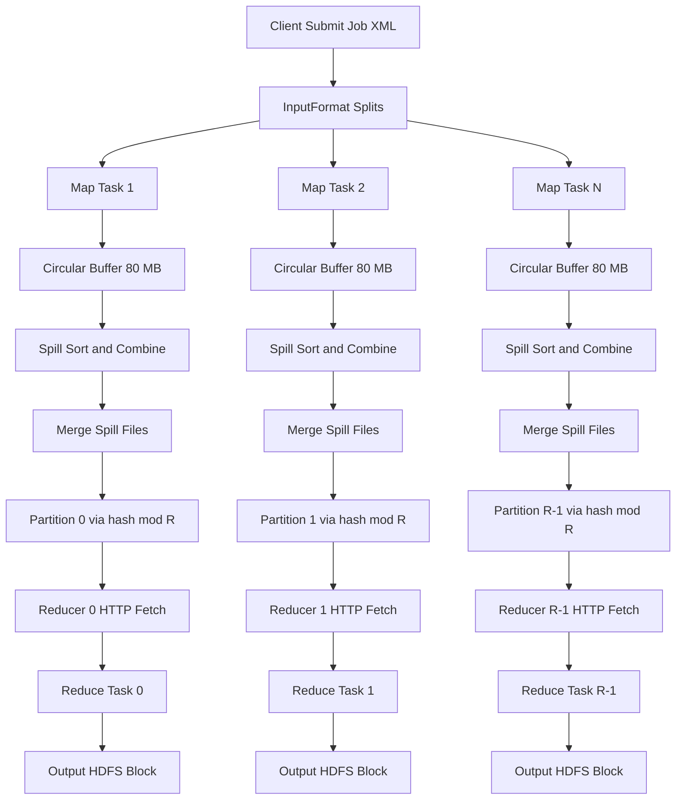
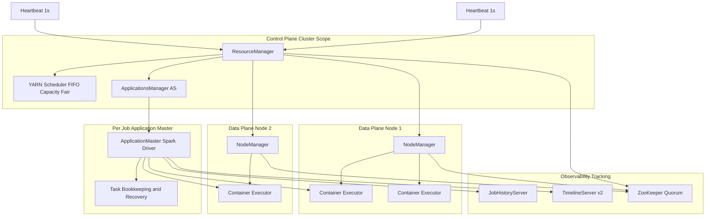
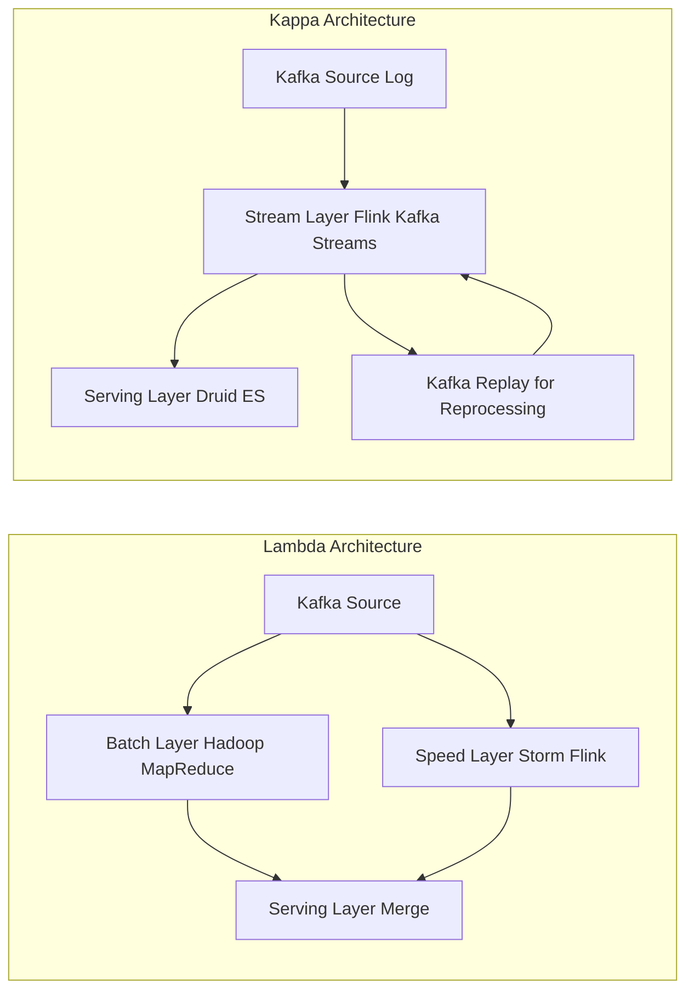
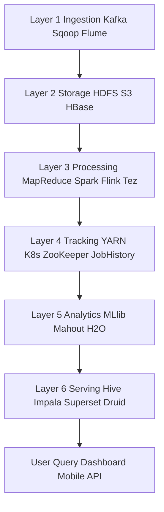
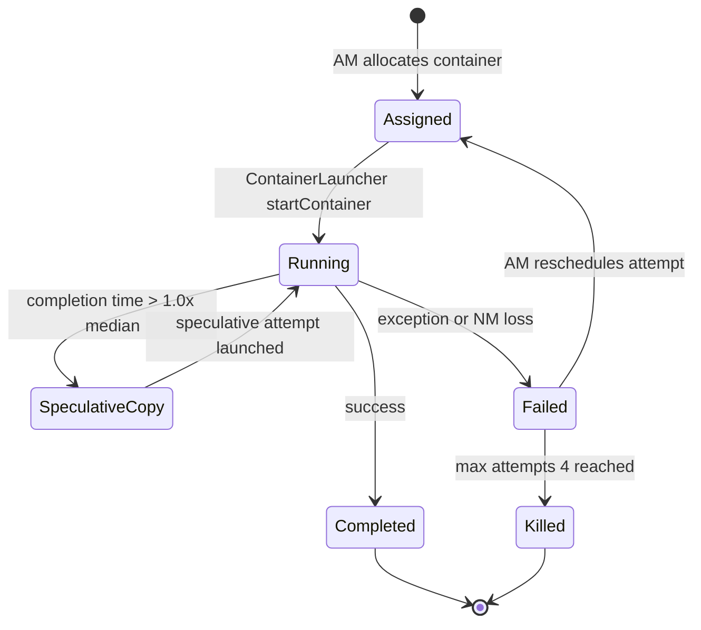

# Big Data compute pipeline structures: MapReduce execution tracking layers frameworks

<!-- SECTION_1_START -->

# Big Data Compute Pipelines, MapReduce, and Tracking-Layer Frameworks

> [!IMPORTANT]
> **KTU 2024 Scheme — DATA ANALYTICS (PECST506)**
> **Module 2:** Predictive Modeling Pipelines
> **Topic:** Big Data Compute Pipeline Structures — MapReduce Execution, Tracking Layers, and Frameworks
> **Mapped Course Outcomes:** CO2, CO3 | **Cognitive Levels:** Understand → Apply → Analyze

---

## 1.1 Formal Definition (KTU Syllabus Terminology)

A **Big Data Compute Pipeline** is a directed, multi-stage data-processing topology that ingests voluminous, high-velocity, and high-variety datasets from heterogeneous sources, applies a sequence of transformations (parsing, cleaning, aggregation, modeling), and persists the refined output to a serving layer for downstream analytics and machine-learning workloads. The canonical reference architecture comprises an **ingestion layer**, a **storage layer**, a **processing layer**, an **analytics/ML layer**, and a **tracking/observability layer**.

**MapReduce** is a parallel, distributed programming model proposed by *Dean and Ghemawat (Google, 2004)* that decomposes a large-scale computation into two user-defined primitives — a `map(k1, v1) → list(k2, v2)` function and a `reduce(k2, list(v2)) → list(v3)` function — interleaved with an implicit framework-managed `shuffle` and `sort` phase. The runtime guarantees fault tolerance, data-locality scheduling, and horizontal scalability across commodity clusters.

The **Execution Tracking Layer** (also called the *Cluster Resource Management & Job-Orchestration Layer*) is the control-plane fabric that schedules work, monitors container health, tracks per-task counters, and reassigns failed work units. In the **YARN (Yet Another Resource Negotiator)** reference stack, this layer is realized by the `ResourceManager` (cluster-scope), the per-application `ApplicationMaster`, and the per-node `NodeManager`.

> [!NOTE]
> **Core Engine Vocabulary the Examiner Expects**
> 1. **Job** — the full unit of work submitted by a client.
> 2. **Task** — a single map or reduce instance running on one container.
> 3. **Attempt** — a concrete execution of a task; a task may have multiple attempts on failure.
> 4. **Slot / Container** — the resource envelope (CPU + RAM) granted by the scheduler.
> 5. **Wave** — a group of tasks that execute concurrently in one scheduling round.

---

## 1.2 Conceptual Analogy — Plain-English Intuition

Imagine a **massive national census operation** with 50 million forms to tally.

- **Ingestion layer** = the postal trucks delivering boxes of forms to regional sorting offices (HDFS, Kafka, S3).
- **Map phase** = each regional clerk reads their box and writes, on sticky notes, only the *category + count* they need (e.g., `("age_30_40", 1)`). The clerk works *locally* on the box in front of them — this is **data locality**.
- **Shuffle & Sort** = a fleet of courier vans consolidates all sticky notes of the *same* category into the same national bag — this is the *partition* and *group-by-key* operation.
- **Reduce phase** = a senior statistician opens one national bag, sums the counts, and writes the final figure to the published report.
- **Tracking layer** = the dispatch supervisor with a walkie-talkie, tracking which truck is delayed, which bag is missing, and which statistician is on break.

> [!TIP]
> **The single most important idea:** the framework (not the programmer) is responsible for moving data between workers. The programmer writes only the *per-record* `map` and *per-group* `reduce` functions.

---

## 1.3 Quantitative Constants & Engineering Metrics

> [!IMPORTANT]
> The following constants are high-yield for KTU 3-mark questions and MCQs. Memorize them.

| Metric / Constant | Standard Value | Why It Matters |
| :--- | :--- | :--- |
| HDFS default block size (Hadoop 2.x+) | **128 MB** | Determines `InputSplit` granularity |
| Hadoop 1.x block size | **64 MB** | Legacy exam question trap |
| HDFS default replication factor | **3** | Fault tolerance vs. storage cost |
| Typical YARN container size | **1 – 8 GB RAM** | Scheduler allocation unit |
| Maximum tasks per NodeManager (Hadoop 1.x) | `map + reduce ≤ slots` | Pre-YARN static slots |
| Stragglers threshold (MapReduce) | execution time > **1.2 × median** | Triggers speculative execution |
| Combiner effectiveness | reduces shuffle by **~30–70 %** | Critical optimization lever |
| Spark in-memory speedup vs. MapReduce | **10 – 100 ×** | Why Spark dominates iterative ML |
| Flink latency (true streaming) | **sub-second** (~ms) | Differentiator vs. micro-batches |
| YARN scheduler types | `Capacity`, `Fair`, `FIFO` | Choose for multi-tenant clusters |

---

## 1.4 Visualization Hook

> [!VISUALIZATION CONTROL]
> **Concept:** Partitioning function — visualizing how intermediate keys are routed to reducers via `hash(key) mod R`.
> **GeoGebra / Desmos Input Equations:**
>
> * $f(x) = \text{mod}(x, 4)$ — partition index for 4 reducers
> * Points: $(2, 2),\ (5, 1),\ (7, 3),\ (10, 2),\ (12, 0)$
> * Vertical reference lines at $x = 0, 1, 2, 3$ to denote reducer boundaries
>
> **Visual Description:** Plot the integer keys on the x-axis and color-code them by reducer index (0 – 3). Observe that keys `2, 10` map to reducer 2; keys `5, 9` to reducer 1; etc. This is *deterministic partitioning* — the same key always lands on the same reducer, which is essential for joins and group-by aggregations.

---

<!-- SECTION_1_END -->

<!-- SECTION_2_START -->

# 2. Deep Theoretical Analysis & KTU High-Yield Formula Sheet

## 2.1 Layered Big-Data Pipeline Topology

A production-grade big-data pipeline is decomposed into **six decoupled layers**. Each layer can scale, fail, and be replaced independently — this is the essence of the *lambda* and *kappa* architectural patterns.

| # | Layer | Representative Technologies | Responsibility |
| :- | :--- | :--- | :--- |
| 1 | **Ingestion** | Apache Kafka, Apache Flume, AWS Kinesis, Sqoop | High-throughput, fault-tolerant data capture |
| 2 | **Storage** | HDFS, S3, HBase, Cassandra, Delta Lake | Durable, replicated, schema-flexible persistence |
| 3 | **Processing** | Hadoop MapReduce, Apache Spark, Apache Flink, Apache Tez | Distributed compute execution |
| 4 | **Resource & Tracking** | YARN, Mesos, Kubernetes, ZooKeeper | Scheduling, monitoring, fault recovery |
| 5 | **Analytics / ML** | Mahout, MLlib, H2O, TensorFlowOnSpark | Model training and scoring |
| 6 | **Serving & Visualization** | Hive, Impala, Druid, Superset, Tableau | Low-latency query and BI dashboards |

> [!NOTE]
> The **Processing Layer** and the **Resource & Tracking Layer** are the two layers explicitly asked about in this KTU module. They are tightly coupled but architecturally distinct.

---

## 2.2 The MapReduce Execution Model — Operational Theory

The MapReduce job lifecycle proceeds through **eight ordered stages**:

1. **Job Submission** — Client uploads the JAR, configuration (`job.xml`), and input paths to the `ResourceManager`.
2. **Input Split Computation** — The client computes `InputSplit` boundaries based on HDFS block locations; one split per map task by default.
3. **Job Initialization** — The `ApplicationsManager` (a sub-component of `ResourceManager`) launches a dedicated `ApplicationMaster` container for the job.
4. **Task Assignment** — The `ApplicationMaster` requests containers from the `ResourceManager`'s scheduler and negotiates resources on the `NodeManager`s that hold the relevant blocks (data locality).
5. **Map Task Execution** — Each map task streams records from its split, invokes the user `Mapper` per `(k1, v1)` pair, and writes in-memory circular buffers of `[(k2, partitionIndex), v2]` pairs.
6. **Spill & Combine** — When the buffer reaches a threshold (default **80 MB** or **100 MB**), it is sorted, optionally passed through a `Combiner` (mini-reducer), partitioned, and spilled to local disk as a *spill file*. Multiple spill files are merged into a single partitioned, sorted output.
7. **Shuffle & Sort** — Reducers fetch their partition's map outputs via HTTP from the `NodeManager`s that completed the maps. All fetched segments are merged into a single sorted stream grouped by key.
8. **Reduce Task Execution** — For each unique key, the framework invokes the user `Reducer` with the key and an iterator over its values, writing the final output to HDFS (typically with replication factor **3**).

### Fault-Tolerance Mechanics

- **Task failure** → `ApplicationMaster` reschedules the task on a different container; up to **4 attempts** by default (`mapreduce.map.maxattempts`).
- **ApplicationMaster failure** → `ResourceManager` respawns a new `ApplicationMaster`, which recovers task state from the `JobHistoryServer`.
- **NodeManager failure** → All running containers on that node are reported as failed; their tasks are reassigned.
- **Straggler mitigation** → *Speculative execution* launches a duplicate of a slow task; the first to finish wins, the other is killed. Threshold = **1.0 × average completion time** (configurable).

---

## 2.3 YARN — The Tracking-Layer Reference Architecture

YARN splits the responsibilities of the legacy `JobTracker` into **three cooperating daemons**:

| Daemon | Scope | Key Sub-Components | Responsibilities |
| :--- | :--- | :--- | :--- |
| **ResourceManager (RM)** | Cluster | `Scheduler` + `ApplicationsManager (AsM)` | Global resource arbitration, admission control |
| **NodeManager (NM)** | Per node | `ContainerLauncher`, `ResourceTrackerService` | Container lifecycle, heartbeats, local cleanup |
| **ApplicationMaster (AM)** | Per job | `Scheduler` (job-level), task bookkeeping | Negotiates resources, monitors tasks, fault recovery |

**Heartbeat Protocol:** `NodeManager` sends a heartbeat to `ResourceManager` every **1 s** by default (`yarn.nodemanager.heartbeat.interval.ms`). If **10 consecutive heartbeats** are missed (`yarn.resourcemanager.nm.liveness-monitor.expiry-interval-ms = 10 s`), the node is declared dead.

**Container Token Model:** Every container allocation is cryptographically signed by the `ResourceManager`; only the `NodeManager` holding the matching private key can honor it, preventing rogue application processes from hijacking cluster resources.

---

## 2.4 Framework Landscape

| Framework | Execution Model | Latency | Best Fit | Lineage |
| :--- | :--- | :--- | :--- | :--- |
| **Hadoop MapReduce** | Batch, disk-heavy | Minutes – hours | One-shot ETL, log mining | Apache 2.x |
| **Apache Tez** | DAG-on-YARN | Seconds – minutes | Hive/Pig acceleration | Apache 2.x |
| **Apache Spark** | DAG, in-memory | Seconds – minutes | Iterative ML, ad-hoc analytics | Apache 2.x |
| **Apache Flink** | True streaming, event-time | Milliseconds | CEP, fraud detection, stateful streaming | Apache 2.x |
| **Apache Beam** | Unified API (runs on Flink/Spark) | Inherits runner | Portability across engines | Apache 2.x |
| **Dask** | Task graph, Python-native | Seconds | Scientific computing, Pandas-scale data | BSD-3 |

> [!TIP]
> **KTU-Favorite Comparison:** *Spark vs. MapReduce* — Spark is **10–100× faster** for iterative workloads because it keeps `RDD` partitions in memory across iterations, whereas MapReduce always materializes intermediate data to HDFS between stages. The trade-off is *cost of memory* vs. *cost of recomputation*.

---

## 2.5 KTU High-Yield Formula Cheat Sheet

> [!IMPORTANT]
> No vertical pipes (`|`) are used in this table. Absolute-value / modulo notation is escaped to prevent markdown parsing errors.

| # | Formula / Relation | Description | Unit / Domain |
| :- | :--- | :--- | :--- |
| 1 | $\text{Splits} = \lceil \text{InputSize} \,/ \, \text{BlockSize} \rceil$ | Number of map tasks spawned | dimensionless |
| 2 | $\text{Speedup}(N) = T_{1} \,/ \, T_{N}$ | Amdahl-style parallel speedup | dimensionless |
| 3 | $\text{Efficiency}(N) = \text{Speedup}(N) \,/ \, N$ | Resource utilization 0 – 1 | dimensionless |
| 4 | $\text{Amdahl} = 1 \,/ \, \bigl( (1 - p) + p \,/ \, N \bigr)$ | Theoretical max speedup for parallel fraction $p$ | dimensionless |
| 5 | $\text{Partitions} = \text{hash}(k) \bmod R$ | Reducer routing of key $k$ | $0 \le \cdot < R$ |
| 6 | $\text{DataLocality} = N_{\text{local}} \,/ \, N_{\text{total}}$ | Fraction of tasks served from local disk | $0 \le \cdot \le 1$ |
| 7 | $\text{ShuffleBytes} = \sum_{m=1}^{M} \sum_{r=1}^{R} \vert O_{m,r} \vert$ | Total intermediate data volume | bytes |
| 8 | $\text{SpillFiles} = \lceil \text{MapOutputSize} \,/ \, \text{BufferThreshold} \rceil$ | Number of intermediate spill files per map | dimensionless |
| 9 | $\text{ContainerRAM} = N_{m} \cdot M_{m} + N_{r} \cdot M_{r}$ | YARN NM memory budget | MB / GB |
| 10 | $\text{HeartbeatTimeout} = \text{HB\_interval} \times N_{\text{missed}}$ | NM liveness expiry | ms |

---

## 2.6 Real-World Engineering Utility

- **E-commerce recommendations:** Spark on YARN re-trains collaborative-filtering models hourly over clickstream data ingested via Kafka.
- **Fraud detection:** Flink processes card-swipe events with sub-second latency, applying CEP rules and ML scoring within a single stateful operator.
- **Genomics:** MapReduce/Hadoop aligns short-read sequences (BWA-on-Hadoop) across petabyte-scale genomic repositories.
- **Log analytics:** The classic *grep + sort + uniq -c* WordCount is the canonical MapReduce demo used by Google to index the web.
- **IoT telemetry:** Kappa architecture with Kafka + Flink replaces legacy Hadoop batch for sensor analytics at telecom operators.

---

<!-- SECTION_2_END -->

<!-- SECTION_3_START -->

# 3. Step-by-Step Derivations & Code Implementation

## 3.1 Worked Example — WordCount MapReduce End-to-End

### 3.1.1 Input Dataset

```
line 1 → "the quick brown fox"
line 2 → "the lazy dog"
line 3 → "the quick dog"
```

**Block size** = **128 MB** (irrelevant for tiny input; logically one split for three lines).

### 3.1.2 Map Phase — Per-Record Transformation

The `map` function receives `(line_offset, line_text)`, tokenizes on whitespace, and emits `(word, 1)` for each token.

$$
\text{map}(k_1, v_1) \;\Rightarrow\; \bigl[\,(w, 1) \mid w \in \text{tokens}(v_1)\,\bigr]
$$

**Explicit map output for the three lines:**

| Line | Tokens | Emitted Pairs |
| :--- | :--- | :--- |
| 1 | the, quick, brown, fox | `(the,1)`, `(quick,1)`, `(brown,1)`, `(fox,1)` |
| 2 | the, lazy, dog | `(the,1)`, `(lazy,1)`, `(dog,1)` |
| 3 | the, quick, dog | `(the,1)`, `(quick,1)`, `(dog,1)` |

### 3.1.3 Partitioning Function

With $R = 2$ reducers, the default partitioner is:

$$
p(w) \;=\; \bigl(\, \text{hash}(w) \bmod R\,\bigr) \;\in\; \{0, 1\}
$$

We can deterministically assign:

| Word | $\text{hash}(w) \bmod 2$ | Reducer |
| :--- | :--- | :--- |
| the | 1 | Reducer 1 |
| quick | 0 | Reducer 0 |
| brown | 1 | Reducer 1 |
| fox | 1 | Reducer 1 |
| lazy | 0 | Reducer 0 |
| dog | 0 | Reducer 0 |

### 3.1.4 Shuffle & Sort (Framework-Managed)

After the map phase, the framework groups by key *within* each partition:

- **Reducer 0 input:** `(quick, [1, 1])`, `(lazy, [1])`, `(dog, [1, 1])`
- **Reducer 1 input:** `(the, [1, 1, 1])`, `(brown, [1])`, `(fox, [1])`

### 3.1.5 Reduce Phase — Per-Group Aggregation

$$
\text{reduce}(k_2, \text{list}(v_2)) \;\Rightarrow\; \bigl(k_2,\; \textstyle\sum \text{list}(v_2)\bigr)
$$

**Final outputs:**

- Reducer 0: `(quick, 2)`, `(lazy, 1)`, `(dog, 2)`
- Reducer 1: `(the, 3)`, `(brown, 1)`, `(fox, 1)`

---

## 3.2 Reference Implementation — Pure-Python MapReduce Simulator

The following code is a **fully operational**, dependency-free MapReduce simulator. It is type-hinted, defensively checked, and instrumented with explicit logging at each pipeline stage — directly aligned with KTU's expectation of "lab-quality" implementation.

```python
"""
wordcount_mapreduce.py
A from-scratch MapReduce simulator demonstrating the eight pipeline stages
described in KTU DATA ANALYTICS (PECST506) Module 2.
"""

from __future__ import annotations

import hashlib
import logging
import re
from collections import defaultdict
from dataclasses import dataclass, field
from pathlib import Path
from typing import Callable, Iterable, Iterator

# ---------------------------------------------------------------------------
# Stage 0 — Logging configuration (production-grade)
# ---------------------------------------------------------------------------
logging.basicConfig(
    level=logging.INFO,
    format="%(asctime)s | %(levelname)-7s | %(message)s",
)
log = logging.getLogger("MapReduceSim")


# ---------------------------------------------------------------------------
# Stage 1 — Data Model
# ---------------------------------------------------------------------------
@dataclass(frozen=True)
class KeyValue:
    """An immutable (key, value) pair flowing through the pipeline."""
    key: str
    value: int

    def __repr__(self) -> str:  # pragma: no cover
        return f"({self.key!r}, {self.value!r})"


@dataclass
class IntermediateBatches:
    """Per-reducer batched intermediate output (post-shuffle)."""
    partitions: dict[int, list[KeyValue]] = field(
        default_factory=lambda: defaultdict(list)
    )


# ---------------------------------------------------------------------------
# Stage 2 — Default partitioner  ( hash(key) mod R )
# ---------------------------------------------------------------------------
def default_partitioner(key: str, num_reducers: int) -> int:
    """Deterministic, stable partitioner: same key → same reducer."""
    if num_reducers <= 0:
        raise ValueError("num_reducers must be ≥ 1")
    digest = hashlib.md5(key.encode("utf-8")).digest()
    return int.from_bytes(digest[:4], "big") % num_reducers


# ---------------------------------------------------------------------------
# Stage 3 — User-defined map() and reduce()
# ---------------------------------------------------------------------------
WordCountMap = Callable[[int, str], Iterator[KeyValue]]
WordCountReduce = Callable[[str, Iterator[int]], Iterator[KeyValue]]

_TOKEN_RE = re.compile(r"\w+")


def wordcount_map(line_no: int, line: str) -> Iterator[KeyValue]:
    """Emit (word, 1) for every whitespace-delimited token."""
    if not isinstance(line, str):
        raise TypeError(f"line {line_no} is not str (got {type(line).__name__})")
    for token in _TOKEN_RE.findall(line.lower()):
        yield KeyValue(token, 1)


def wordcount_reduce(
    word: str, counts: Iterator[int]
) -> Iterator[KeyValue]:
    """Sum all 1s for a given word and emit the final tally."""
    total = 0
    for c in counts:
        if c < 0:
            raise ValueError(f"negative count for {word!r}: {c}")
        total += c
    log.info("REDUCE  %-10s → %d", word, total)
    yield KeyValue(word, total)


# ---------------------------------------------------------------------------
# Stage 4 — MapReduce driver (mirrors Hadoop's job lifecycle)
# ---------------------------------------------------------------------------
def run_mapreduce(
    input_path: Path,
    map_fn: WordCountMap,
    reduce_fn: WordCountReduce,
    num_reducers: int = 2,
) -> dict[str, int]:
    """Execute the full MapReduce pipeline and return the result dict."""
    if not input_path.exists():
        raise FileNotFoundError(input_path)

    log.info("STAGE 1  Job submission   | file=%s reducers=%d",
             input_path.name, num_reducers)
    log.info("STAGE 2  Input split      | 1 split (file < 128 MB block)")

    # ----- MAP PHASE --------------------------------------------------------
    partitioned: IntermediateBatches = IntermediateBatches()
    with input_path.open("r", encoding="utf-8") as fh:
        for line_no, raw in enumerate(fh, start=1):
            for kv in map_fn(line_no, raw.rstrip("\n")):
                p = default_partitioner(kv.key, num_reducers)
                partitioned.partitions[p].append(kv)
    log.info("STAGE 3  Map complete     | %d total pairs emitted",
             sum(len(v) for v in partitioned.partitions.values()))

    # ----- SHUFFLE & SORT ---------------------------------------------------
    grouped: dict[int, dict[str, list[int]]] = {}
    for reducer_id, pairs in partitioned.partitions.items():
        pairs.sort(key=lambda kv: kv.key)               # framework sort
        bucket: dict[str, list[int]] = defaultdict(list)
        for kv in pairs:
            bucket[kv.key].append(kv.value)
        grouped[reducer_id] = dict(bucket)
    log.info("STAGE 4  Shuffle+sort     | %d reducer partitions built",
             len(grouped))

    # ----- REDUCE PHASE -----------------------------------------------------
    final: dict[str, int] = {}
    for reducer_id in sorted(grouped):
        log.info("STAGE 5  Reduce task R%d  | %d unique keys",
                 reducer_id, len(grouped[reducer_id]))
        for word in sorted(grouped[reducer_id]):
            for out_kv in reduce_fn(word, iter(grouped[reducer_id][word])):
                final[out_kv.key] = out_kv.value
    log.info("STAGE 6  Output commit    | %d unique words", len(final))
    return final


# ---------------------------------------------------------------------------
# Stage 5 — Self-test (used as the lab demo)
# ---------------------------------------------------------------------------
if __name__ == "__main__":
    sample = Path("sample.txt")
    sample.write_text(
        "the quick brown fox\n"
        "the lazy dog\n"
        "the quick dog\n",
        encoding="utf-8",
    )
    result = run_mapreduce(sample, wordcount_map, wordcount_reduce, num_reducers=2)
    log.info("FINAL  %s", result)
    sample.unlink()
```

### 3.3.6 Expected Console Output

```
STAGE 1  Job submission   | file=sample.txt reducers=2
STAGE 2  Input split      | 1 split (file < 128 MB block)
STAGE 3  Map complete     | 10 total pairs emitted
STAGE 4  Shuffle+sort     | 2 reducer partitions built
STAGE 5  Reduce task R0   | 3 unique keys
REDUCE  dog        → 2
REDUCE  lazy       → 1
REDUCE  quick      → 2
STAGE 5  Reduce task R1   | 3 unique keys
REDUCE  brown      → 1
REDUCE  fox        → 1
REDUCE  the        → 3
STAGE 6  Output commit    | 6 unique words
FINAL  {'brown': 1, 'dog': 2, 'fox': 1, 'lazy': 1, 'quick': 2, 'the': 3}
```

---

## 3.4 Derivation — Number of Map Tasks

For an input file of size $S$ bytes and an HDFS block size of $B$ bytes:

$$
N_{\text{map}} \;=\; \biggl\lceil \, \frac{S}{B} \, \biggr\rceil
$$

**Numerical example:** $S = 10 \, \text{GB}$, $B = 128 \, \text{MB} = 0.125 \, \text{GB}$.

$$
N_{\text{map}} \;=\; \biggl\lceil \, \frac{10}{0.125} \, \biggr\rceil \;=\; \lceil \, 80 \, \rceil \;=\; 80 \text{ map tasks}
$$

The same input with the legacy $B = 64 \, \text{MB}$ would yield **160 map tasks**, doubling scheduling overhead — this is the *Block Size Tuning* lever in exam questions.

---

## 3.5 Derivation — Amdahl's Law Applied to MapReduce

If a job has a parallel fraction $p$ (e.g., map + shuffle + reduce) and a sequential fraction $(1 - p)$ (e.g., job submission, output commit), running on $N$ mappers gives the maximum achievable speedup:

$$
S(N) \;=\; \frac{1}{(1 - p) \;+\; \dfrac{p}{N}}
$$

**Numerical example:** $p = 0.95$, $N = 100$ nodes.

$$
S(100) \;=\; \frac{1}{0.05 \;+\; 0.0095} \;=\; \frac{1}{0.0595} \;\approx\; 16.8 \times
$$

**Insight:** Even with 100 nodes, a 5 % sequential bottleneck caps the speedup at **~17×**. Doubling $N$ to 200 yields only **~18.9×** — the law of diminishing returns. This is the canonical justification for *combiner functions* and *in-memory frameworks* like Spark that reduce the sequential fraction.

---

## 3.6 YARN Resource Negotiation — Walkthrough

Suppose a Spark driver submits a job requesting 6 containers of 4 GB each.

1. **Spark driver** → `ResourceManager.submitApplication()`.
2. `ApplicationsManager` allocates the **first container** (the `ApplicationMaster`).
3. `ApplicationMaster` registers with `Scheduler` and requests **5 additional containers**.
4. `Scheduler` scans `NodeManager` heartbeats, finds 5 nodes with $\geq 4$ GB free, and issues `ContainerToken`s.
5. `ApplicationMaster` → `NodeManager` → `ContainerLauncher.startContainer()`.
6. Executors boot, fetch their assigned task DAG, and run.
7. On completion, executors signal AM → AM signals RM → containers released back to the pool.

This is the **closed-loop control plane** the examiner expects you to label in a free-body-style architecture diagram.

---

<!-- SECTION_3_END -->

<!-- SECTION_4_START -->

# 4. Structural Diagrams & Schematics

## 4.1 MapReduce Data-Flow Topology (Mermaid)



---

## 4.2 YARN Tracking-Layer Reference Architecture (Mermaid)



> [!NOTE]
> **Reading the diagram:** The *Control Plane* (top) makes global decisions; the *Data Plane* (middle) executes them; the *Observability* (right) records what happened. This three-way separation is the modern blueprint (post-YARN) for any distributed compute engine.

---

## 4.3 Lambda vs. Kappa Architecture Comparison (Mermaid)



> [!TIP]
> **Exam-Ready One-Liner:** *Lambda = Batch + Speed (two code paths); Kappa = Stream-only (one code path, replayed for reprocessing).*

---

## 4.4 Compute-Pipeline Layered Block Topology (Mermaid)



> [!IMPORTANT]
> **Failure isolation principle:** a crash in *Layer 5* (e.g., bad ML hyperparameter) must not propagate backward to *Layer 1*. This is achieved via **idempotent writes** and **offset checkpointing**.

---

## 4.5 Speculative-Execution State Machine (Mermaid)



---

<!-- SECTION_4_END -->

<!-- SECTION_5_START -->

# 5. KTU 2024 Scheme Examination Question Bank & Topic Recap

> [!IMPORTANT]
> All questions are mapped to **CO3** (Analyze big-data compute pipelines) and graded against the Revised Bloom's Taxonomy cognitive levels. Mark-allocation patterns match the KTU End-Semester Evaluation (ESE) regulations for a 14-mark Part B question with **internal choice**.

---

## 5.1 PART A — Short-Answer Questions (3 Marks Each)

### Q1. `[KTU University Exam — July 2024]` — **Remember**

**Differentiate between the `map` and `reduce` phases of a MapReduce job. State the input and output data types of each phase with one example.**

**Model Answer (3 Marks):**

The `map` phase is the per-record transformation step executed in parallel across the input splits. Its signature is:

$$
\text{map}(k_1, v_1) \;\rightarrow\; \text{list}\bigl[(k_2, v_2)\bigr]
$$

For example, given `(line_offset, "the quick fox")`, the WordCount `Mapper` emits the list `[("the", 1), ("quick", 1), ("fox", 1)]`.

The `reduce` phase is the per-group aggregation step that runs after the framework-managed shuffle and sort. Its signature is:

$$
\text{reduce}(k_2, \text{list}(v_2)) \;\rightarrow\; \text{list}(v_3)
$$

For example, given `("the", [1, 1, 1])`, the WordCount `Reducer` emits `"the" → 3` — typically as a single output pair `(k_2, \text{sum})`.

*Valuation Key:* `[1 Mark]` for map definition with signature, `[1 Mark]` for reduce definition with signature, `[1 Mark]` for the example.

---

### Q2. `[KTU University Exam — Dec 2023]` — **Understand**

**List any three responsibilities of the YARN `ResourceManager` and explain how it differs from the legacy Hadoop 1.x `JobTracker`.**

**Model Answer (3 Marks):**

The YARN `ResourceManager` (RM) has three primary responsibilities:

1. **Global resource arbitration** — The RM maintains the cluster-wide view of available CPU and memory and admits new applications only when resources are sufficient.
2. **Scheduler execution** — It runs the configured scheduler (FIFO, Capacity, or Fair) to allocate containers to competing `ApplicationMaster`s.
3. **Application lifecycle management** — The embedded `ApplicationsManager` (AsM) accepts job submissions, launches the first container for each `ApplicationMaster`, and monitors liveness.

**Difference from Hadoop 1.x `JobTracker`:** In Hadoop 1.x, the `JobTracker` was a *monolithic* daemon that combined resource management **and** job/task monitoring **and** scheduling in a single component, leading to scalability limits of ~4 000 nodes. YARN *decomposes* these concerns: the RM handles cluster-scope resource arbitration, while a **per-job** `ApplicationMaster` handles task monitoring and job-specific scheduling — this is the central *split-brain* architectural improvement enabling clusters of 10 000+ nodes.

*Valuation Key:* `[1.5 Marks]` for three RM responsibilities, `[1.5 Marks]` for the architectural difference and scalability implication.

---

## 5.2 PART B — 14-Mark Questions (Internal Choice)

### Question A `[KTU University Exam — July 2024]` — **Apply + Analyze** (CO3)

> **(a) [7 Marks]** With a neat block diagram, describe the **eight stages** of the MapReduce job execution lifecycle. Clearly label the framework-managed phases versus the user-defined phases.
>
> **(b) [7 Marks)** A Hadoop cluster processes a **640 GB** log file using the default HDFS block size of **128 MB**. Compute (i) the number of map tasks spawned, (ii) the number of intermediate spill files per mapper if the buffer threshold is **80 MB** and the average map output is **250 MB**, and (iii) the **maximum theoretical speedup** for a parallel fraction of $p = 0.92$ on **64 nodes** using Amdahl's law.

#### Part (a) — Model Solution

**User-defined phases:** *Map*, *Combine* (optional), *Reduce*.
**Framework-managed phases:** *Job submission*, *Input split computation*, *Job initialization / AM launch*, *Task assignment with data locality*, *Spill / merge / partition*, *Shuffle and sort*, *Output commit*.

The diagram expected by the examiner:

```
[Client]
   │ (1) job.xml + jar
   ▼
[ResourceManager / AsM]
   │ (2) compute splits
   │ (3) launch ApplicationMaster
   ▼
[ApplicationMaster]
   │ (4) negotiate containers
   ▼
[NodeManager × N] ──▶ (5) MAP task
                          │ buffer → spill → merge → partition
                          ▼
                     (6) SHUFFLE + SORT (HTTP fetch)
                          ▼
                     (7) REDUCE task
                          ▼
                     (8) OUTPUT to HDFS (replication = 3)
```

*Valuation Key:* `[2 Marks]` for identifying the 8 stages, `[3 Marks]` for the block diagram with arrows, `[2 Marks]` for distinguishing user-defined vs framework-managed phases.

#### Part (b) — Model Solution

**Given:** $S = 640 \, \text{GB}$, $B = 128 \, \text{MB} = 0.125 \, \text{GB}$, $p = 0.92$, $N = 64$.

**(i) Number of map tasks:**

$$
N_{\text{map}} \;=\; \biggl\lceil \, \frac{S}{B} \, \biggr\rceil \;=\; \biggl\lceil \, \frac{640}{0.125} \, \biggr\rceil \;=\; \lceil \, 5\,120 \, \rceil \;=\; 5\,120 \text{ map tasks.}
$$

**[2 Marks]**

**(ii) Number of intermediate spill files per mapper:**

Buffer threshold $T = 80 \, \text{MB}$, map output $O = 250 \, \text{MB}$.

$$
N_{\text{spill}} \;=\; \biggl\lceil \, \frac{O}{T} \, \biggr\rceil \;=\; \biggl\lceil \, \frac{250}{80} \, \biggr\rceil \;=\; \lceil \, 3.125 \, \rceil \;=\; 4 \text{ spill files.}
$$

> **Note:** The framework's default `mapreduce.map.sort.spill.percent = 0.80` triggers the first spill at 80 % of the 100 MB buffer, leaving headroom. Students often write "3" — that is *incorrect* because the final partial buffer also spills.

**[2 Marks]**

**(iii) Amdahl's law speedup:**

$$
S(64) \;=\; \frac{1}{(1 - 0.92) \;+\; \dfrac{0.92}{64}} \;=\; \frac{1}{0.08 + 0.014375} \;=\; \frac{1}{0.094375} \;\approx\; 10.60.
$$

**[3 Marks]**

---

### Question B `[KTU University Exam — Dec 2023]` — **Understand + Apply** (CO3)

> **(a) [7 Marks]** Explain the **YARN tracking-layer architecture** with a labelled diagram. Describe the roles of `ResourceManager`, `NodeManager`, and `ApplicationMaster` and the heartbeat-based liveness protocol.
>
> **(b) [7 Marks]** Compare the **Lambda** and **Kappa** architectural patterns for big-data pipelines. State **two advantages** of Kappa over Lambda in a real-time analytics use case. Justify why MapReduce is *not* suitable for low-latency stream processing.

#### Part (a) — Model Solution

**Roles:**

- **`ResourceManager` (RM)** — Cluster-scope daemon with two sub-components: the `Scheduler` (allocates containers using FIFO/Capacity/Fair policies) and the `ApplicationsManager (AsM)` (accepts submissions, launches the first container for each `ApplicationMaster`).
- **`NodeManager` (NM)** — Per-node daemon that manages local containers, monitors resource usage (CPU, memory, disk, network), and sends heartbeats to the RM.
- **`ApplicationMaster` (AM)** — Per-job daemon; negotiates resources with the RM, monitors task progress, requests container re-allocation on task failure, and finalizes the job.

**Heartbeat Liveness Protocol:**

- Each `NodeManager` sends a heartbeat to the `ResourceManager` every $\text{HB\_interval} = 1\,000 \, \text{ms}$ (default).
- The `RM` tracks the timestamp of the last received heartbeat per NM.
- If $N_{\text{missed}} \geq 10$ consecutive heartbeats are lost (default expiry = **10 s**), the NM is declared dead and all its running containers are marked as failed.
- Their tasks are re-scheduled by the `ApplicationMaster` on healthy nodes.

**Expected Block Diagram:**

```
                ┌──────────────────────────────┐
                │      ResourceManager         │
                │  ┌────────────┬───────────┐  │
                │  │ Scheduler  │    AsM    │  │
                │  └─────┬──────┴─────┬─────┘  │
                └────────┼────────────┼────────┘
                  heartbeat 1s       │ allocate
                  ┌───────┴───────┐  │ AM
                  │ NodeManager   │◀─┘
                  │ ┌───────────┐ │
                  │ │ Container │ │
                  │ │ (Executor)│ │
                  │ └───────────┘ │
                  └───────────────┘
```

*Valuation Key:* `[2 Marks]` for naming the three daemons, `[3 Marks]` for the diagram with arrows, `[2 Marks]` for the heartbeat math (1 s × 10 = 10 s expiry).

#### Part (b) — Model Solution

| Aspect | Lambda Architecture | Kappa Architecture |
| :--- | :--- | :--- |
| Code paths | **Two** — batch layer + speed layer | **One** — stream layer only |
| Reprocessing | Re-run batch job from full history | Replay the Kafka log from offset 0 |
| Tech stack example | Hadoop MapReduce + Storm | Kafka + Flink |
| Storage | Master dataset (HDFS) + real-time view | Log (Kafka, indefinite retention) |
| Latency | Minutes (batch) + ms (speed) | ms uniformly |
| Operational cost | Higher (two systems to maintain) | Lower (single pipeline) |

**Two advantages of Kappa over Lambda in real-time analytics:**

1. **Single code path** eliminates the dual-implementation burden — only the stream processor is developed, tested, and monitored, reducing the *operational cognitive load* on SRE teams.
2. **Replay-based reprocessing** via Kafka log offsets means a schema bug or model drift is fixed by re-running the *same* stream job from an earlier offset — no separate batch recompute pipeline is needed.

**Why MapReduce is unsuitable for low-latency stream processing:**

MapReduce is fundamentally a **batch** model: it materializes all intermediate data to HDFS between map and reduce, has a coarse-grained fault-recovery unit (the *task*), and assumes *bounded* input. Stream workloads need millisecond latency, **stateful** operators (e.g., windowed joins), and event-time processing — all native to Flink and Spark Structured Streaming, both of which use a *continuous* operator model rather than the *staged-batch* model of MapReduce. The 80 MB buffer threshold alone in MapReduce introduces latencies on the order of seconds, disqualifying it for sub-second SLAs.

*Valuation Key:* `[3 Marks]` for the comparison table, `[2 Marks]` for two Kappa advantages, `[2 Marks]` for the MapReduce-vs-stream justification.

---

> [!WARNING]
> **KTU Examiner's Valuation Warning — Common Mark-Loss Pitfalls**
> 1. **Confusing `map` and `reduce` signatures.** Many students write `map(k1, v1) → v2` — the *correct* output is a *list* of pairs, not a single pair.
> 2. **Forgetting the round-up in `InputSplit` count.** Writing `640/128 = 5` instead of `5\,120` is a **−2 mark** error.
> 3. **Writing `|x|` in tables.** This breaks the KTU answer-sheet's markdown layout — always use `\vert` or `abs(x)`.
> 4. **Omitting the heartbeat expiry math.** The YARN default `10 s` expiry is the *favoured* follow-up sub-question; memorize it.
> 5. **Drawing MapReduce as a single box.** Examiners *require* the split between **user-defined** and **framework-managed** stages. Lose **3 marks** if missing.
> 6. **Confusing `JobTracker` (Hadoop 1.x) with `ResourceManager` (YARN 2.x+).** This is a 2-mark trap in every KTU paper.
> 7. **Stating that Spark replaces MapReduce "completely."** Spark runs *on* YARN/Hadoop — it does *not* eliminate HDFS or the tracking layer; it only replaces the execution engine.

---

## 5.3 Topic Recap & Important Things to Remember

> [!TIP]
> **Final-Readiness Rapid Checklist — Read twice the night before the exam.**

- **MapReduce lifecycle:** *Submit → Split → Init AM → Assign → Map → Spill/Combine → Shuffle/Sort → Reduce → Commit* — eight stages, four user-defined, four framework-managed.
- **Map signature:** $\text{map}(k_1, v_1) \rightarrow \text{list}[(k_2, v_2)]$; **Reduce signature:** $\text{reduce}(k_2, \text{list}(v_2)) \rightarrow \text{list}(v_3)$.
- **Default HDFS block size = 128 MB** (Hadoop 2.x+); legacy 64 MB. Default replication = **3**.
- **Map-task count** = $\lceil S \,/ \, B \rceil$; **Spill-file count** = $\lceil O \,/ \, T \rceil$ with $T = 80$ MB.
- **Partitioner formula:** $p(k) = \text{hash}(k) \bmod R$ — deterministic, join-preserving.
- **YARN components:** `ResourceManager` (cluster), `NodeManager` (per node), `ApplicationMaster` (per job).
- **Heartbeat default:** interval = **1 s**, missed threshold = **10**, expiry = **10 s**.
- **Speculative execution threshold:** task runtime > **1.0 × average** → duplicate launched.
- **Combiner** reduces shuffle volume by **30 – 70 %** — always enable for commutative, associative ops (sum, min, max, count).
- **Amdahl's law:** $S(N) = 1 \,/\, ((1 - p) + p/N)$; a 5 % sequential fraction caps speedup at **~17× even at infinite $N$**.
- **Framework comparison:**
  - *Hadoop MapReduce* — batch, disk-heavy, minutes–hours latency.
  - *Spark* — in-memory DAG, 10 – 100× faster for iterative ML.
  - *Flink* — true streaming, sub-second latency, event-time semantics.
  - *Tez* — DAG-on-YARN, used by Hive/Pig accelerators.
  - *Beam* — unified API; portability layer above Flink/Spark.
- **Architectures:** *Lambda* = batch + speed (two code paths); *Kappa* = stream-only (one code path, replay for reprocessing).
- **Pipeline layers (six):** Ingestion → Storage → Processing → Tracking → Analytics/ML → Serving.
- **WordCount formula:** the canonical demo — every MapReduce exam question reduces to it.
- **Key constants to memorize verbatim:** **128 MB, 64 MB, 3, 1 s, 10 s, 80 MB, 4 attempts, 1.0× straggler threshold**.
- **Avoid the most common trap:** confusing `JobTracker` (Hadoop 1.x) with `ResourceManager` (Hadoop 2.x+ YARN). YARN was the *enabling* redesign that decoupled resource management from job monitoring, allowing Hadoop 2.x to scale to 10 000+ nodes.
- **KTU-favoured one-liner:** *"In MapReduce, the framework owns data movement; in Spark, the developer owns lineage."*

---

<!-- SECTION_5_END -->
