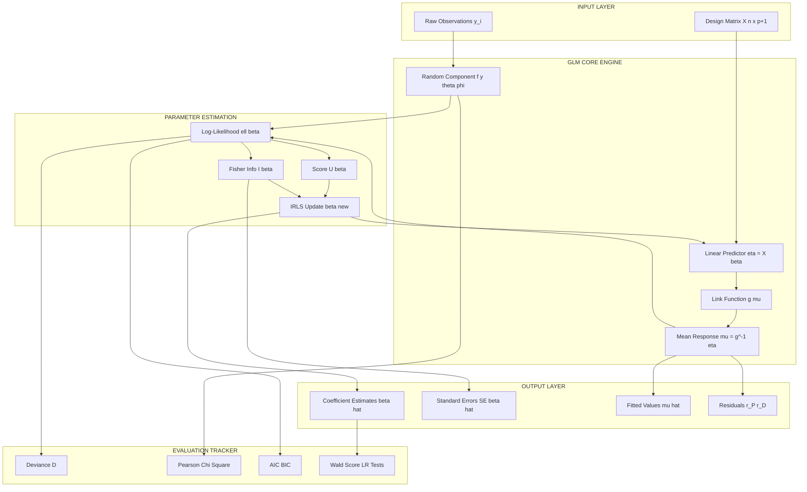
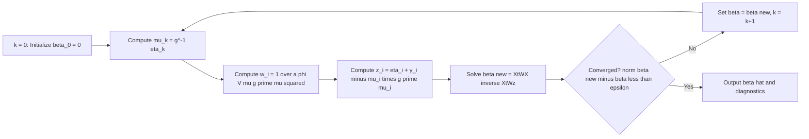
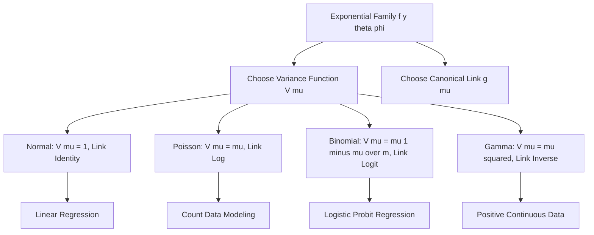
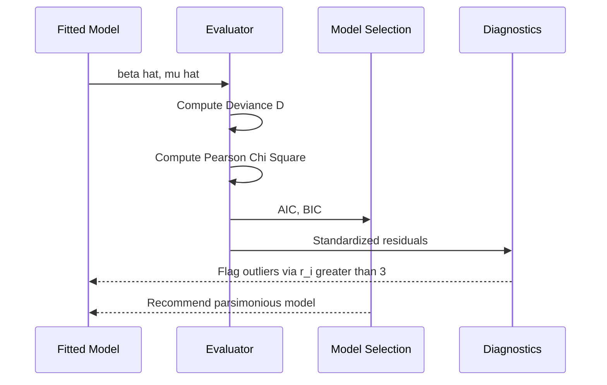

# Generalized linear models parameters evaluation tracking equations formulas setups

<!-- SECTION_1_START -->
# Generalized Linear Models — Parameter Evaluation, Tracking Equations & Formula Setups

## 1.1 Formal Academic Definition (KTU 2024 Syllabus Terminology)

A **Generalized Linear Model (GLM)** is a flexible generalization of ordinary linear regression that allows response variables to have error distribution models other than a normal distribution. It unifies various statistical models — including linear regression, logistic regression, and Poisson regression — under a single **exponential family** framework.

A GLM is completely specified by three components, known as the **McCullagh–Nelder triad**:

1. **Random Component** — The response variable $Y$ belongs to the **exponential family of distributions** with probability density (or mass) function of the form:
$$f(y_i;\theta_i,\phi) = \exp\left\{\frac{y_i\theta_i - b(\theta_i)}{a(\phi)} + c(y_i,\phi)\right\}$$
where $\theta_i$ is the **natural (canonical) parameter**, $\phi$ is the **dispersion parameter**, $b(\cdot)$ and $c(\cdot,\cdot)$ are known functions.

2. **Systematic Component** — A linear predictor:
$$\eta_i = \mathbf{x}_i^{T}\boldsymbol{\beta} = \beta_0 + \beta_1 x_{i1} + \beta_2 x_{i2} + \dots + \beta_p x_{ip}$$
where $\mathbf{x}_i^{T} = (1, x_{i1}, \dots, x_{ip})$ is the row vector of explanatory variables and $\boldsymbol{\beta} = (\beta_0, \beta_1, \dots, \beta_p)^{T}$ is the parameter vector of length $p+1$.

3. **Link Function** — A monotonic differentiable function $g(\cdot)$ connecting the expected value of $Y$ to the linear predictor:
$$\eta_i = g(\mu_i) \quad \Longleftrightarrow \quad \mu_i = g^{-1}(\eta_i)$$
where $\mu_i = \mathbb{E}[Y_i \vert \mathbf{x}_i]$ is the **conditional mean** of the response.

> [!IMPORTANT]
> **Canonical Link Functions** (for KTU Board Priority): When $g(\mu_i) = \theta_i$, the link is *canonical*. Examples: Identity for Normal, Logit for Binomial, Log for Poisson, Inverse for Gamma.

> [!NOTE]
> **Exponential Family Identity (Existence Theorem):** Every GLM arises from a unique choice of $(a, b, c, g)$. This guarantees that for a given random component, there exists **exactly one** canonical link.

## 1.2 Conceptual Analogy / Intuition

Imagine a **factory assembly line** with three stations:

| Station | Real-World Analogy | GLM Component |
|---|---|---|
| **Inbound Quality Sensor** | Detects whether the output count, proportion, or continuous value obeys Poisson, Binomial, or Normal behavior | Random Component $f(y;\theta,\phi)$ |
| **Mechanical Mixer** | Combines raw inputs (age, salary, dosage) into a weighted cocktail of "evidence" | Systematic Component $\eta = \mathbf{x}^T\boldsymbol{\beta}$ |
| **Display Dashboard** | Translates the abstract "evidence" into a user-friendly number between 0–1, or back to the response scale | Link Function $g(\mu)$ |

The **link function** is the *translator* — it knows that probabilities are bounded in $[0,1]$, counts are non-negative, and positive reals are unbounded on the right. Without the link, ordinary linear regression would predict nonsense like probabilities of $1.4$ or negative counts.

## 1.3 Standard Constants & Metrics Used in GLMs

- **Natural log base**: $e \approx 2.71828$
- **Sigmoid function**: $\sigma(z) = \dfrac{1}{1+e^{-z}}$, mapping $\mathbb{R} \to (0,1)$
- **Softmax function**: $\sigma(\mathbf{z})_k = \dfrac{e^{z_k}}{\sum_j e^{z_j}}$ (for multinomial GLMs)
- **Dispersion parameter $\phi$** — **fixed $=1$** for Binomial/Poisson, **estimated** for Normal/Gamma
- **Fisher Information $\mathcal{I}(\boldsymbol{\beta})$** — curvature of the log-likelihood
- **Likelihood Ratio Statistic**: $D = -2(\ell_{\text{sat}} - \ell_{\text{model}})$ in **nats**, or $2(\ell_{\text{model}} - \ell_{\text{sat}})$ in **deviance units**

> [!VISUALIZATION CONTROL]
> **Concept:** Sigmoid (Logit Link) vs. Identity (Linear Link) curves
> **GeoGebra / Desmos Input Equations:**
> * `f(x) = 1/(1+exp(-x))` — Logistic Sigmoid
> * `g(x) = x` — Identity (Linear)
> * `h(x) = exp(x)/(1+exp(x))` — Sigmoid reparameterization
> **Visual Description:** Plot $f(x)$ in red — observe that as $x \to -\infty$ the curve flattens to $0$, and as $x \to +\infty$ it asymptotes to $1$. The line $g(x) = x$ (blue) lies along the diagonal. The point where $f$ and $g$ intersect is near the origin. This shows the logit link *squashes* unbounded real evidence into a bounded probability.

<!-- SECTION_1_END -->

<!-- SECTION_2_START -->
# Deep Theoretical Analysis & KTU High-Yield Formula Sheet

## 2.1 The Three Pillars of GLM — Operational Walkthrough

### Pillar 1: Random Component (Exponential Family)

The **expected value** and **variance** of $Y_i$ in the exponential family are obtained via partial derivatives of the cumulant $b(\theta_i)$:

$$\mu_i = \mathbb{E}[Y_i] = b'(\theta_i)$$
$$\text{Var}(Y_i) = a(\phi) \, b''(\theta_i) = a(\phi) \, V(\mu_i)$$

where $V(\mu_i)$ is the **variance function** of the distribution.

> [!NOTE]
> **Variance Function (Crucial for Evaluation):** $V(\mu_i)$ determines how the spread of the data changes with the mean. It is the engine behind **Iteratively Reweighted Least Squares (IRLS)**.

### Pillar 2: Systematic Component

The design matrix $\mathbf{X} \in \mathbb{R}^{n \times (p+1)}$ collects all predictor rows:

$$\mathbf{X} = \begin{bmatrix} 1 & x_{11} & x_{12} & \cdots & x_{1p} \\ 1 & x_{21} & x_{22} & \cdots & x_{2p} \\ \vdots & \vdots & \vdots & \ddots & \vdots \\ 1 & x_{n1} & x_{n2} & \cdots & x_{np} \end{bmatrix}, \quad \boldsymbol{\eta} = \mathbf{X}\boldsymbol{\beta}$$

### Pillar 3: Link Function

The derivative of the link with respect to the mean is the **link derivative**:

$$\Delta_i = \frac{d\eta_i}{d\mu_i} = g'(\mu_i)$$

> [!IMPORTANT]
> **Canonical Link Conditions:**
> 1. $\eta_i = \theta_i = (b')^{-1}(\mu_i)$
> 2. $g'(\mu_i) = \dfrac{1}{V(\mu_i)}$
> 3. The Fisher Information matrix becomes **diagonal** — the cleanest computational case.

## 2.2 KTU Formula Sheet / Cheat Sheet

| # | Quantity | Formula | Used For |
|---|----------|---------|----------|
| 1 | Exponential family density | $f(y;\theta,\phi) = \exp\left\{\frac{y\theta - b(\theta)}{a(\phi)} + c(y,\phi)\right\}$ | Defining random component |
| 2 | Linear predictor | $\eta_i = \beta_0 + \sum_{j=1}^{p} \beta_j x_{ij}$ | Systematic component |
| 3 | Mean response | $\mu_i = g^{-1}(\eta_i)$ | Inverse link mapping |
| 4 | Mean identity | $\mu_i = b'(\theta_i)$ | Exponential family moment |
| 5 | Variance function | $V(\mu_i) = b''(\theta_i)$ | IRLS weight computation |
| 6 | Log-likelihood | $\ell(\boldsymbol{\beta}) = \sum_{i=1}^{n} \frac{y_i\theta_i - b(\theta_i)}{a(\phi)} + c(y_i,\phi)$ | MLE objective |
| 7 | Score function | $\mathbf{U}(\boldsymbol{\beta}) = \mathbf{X}^{T}\mathbf{W}\mathbf{D}(\mathbf{y}-\boldsymbol{\mu})$ | First derivative of $\ell$ |
| 8 | Fisher Information | $\mathcal{I}(\boldsymbol{\beta}) = \mathbf{X}^{T}\mathbf{W}\mathbf{X}$ | Variance of score |
| 9 | Working weights | $w_i = \dfrac{1}{a(\phi) V(\mu_i) (g'(\mu_i))^2}$ | IRLS diagonal weight |
| 10 | Working response | $z_i = \eta_i + (y_i - \mu_i) g'(\mu_i)$ | IRLS pseudo-target |
| 11 | IRLS update | $\boldsymbol{\beta}^{(k+1)} = (\mathbf{X}^{T}\mathbf{W}^{(k)}\mathbf{X})^{-1}\mathbf{X}^{T}\mathbf{W}^{(k)}\mathbf{z}^{(k)}$ | Parameter tracking |
| 12 | Deviance | $D(\mathbf{y};\hat{\boldsymbol{\mu}}) = 2\phi \sum_{i=1}^{n} \left\{ \tilde{\ell}_i - \ell_i(\hat{\mu}_i) \right\}$ | Goodness-of-fit |
| 13 | Pearson chi-square | $\chi^2_P = \sum_{i=1}^{n} \frac{(y_i - \hat{\mu}_i)^2}{V(\hat{\mu}_i)}$ | Alternative GoF |
| 14 | AIC | $\text{AIC} = -2\ell(\hat{\boldsymbol{\beta}}) + 2(p+1)$ | Model selection |
| 15 | BIC | $\text{BIC} = -2\ell(\hat{\boldsymbol{\beta}}) + (p+1)\ln(n)$ | Model selection |
| 16 | Wald statistic | $W_j = \dfrac{\hat{\beta}_j^2}{\widehat{\text{Var}}(\hat{\beta}_j)}$ | Single parameter test |
| 17 | Score statistic | $S = \mathbf{U}(\boldsymbol{\beta}_0)^{T} \mathcal{I}(\boldsymbol{\beta}_0)^{-1} \mathbf{U}(\boldsymbol{\beta}_0)$ | Hypothesis test |
| 18 | LR statistic | $\Lambda = 2\{\ell(\hat{\boldsymbol{\beta}}_{\text{full}}) - \ell(\hat{\boldsymbol{\beta}}_{\text{reduced}})\}$ | Nested model comparison |
| 19 | Hat values | $h_i = w_i \, \mathbf{x}_i^{T} (\mathbf{X}^{T}\mathbf{W}\mathbf{X})^{-1} \mathbf{x}_i$ | Influence diagnostics |
| 20 | Std. Pearson resid. | $r_{P,i} = \dfrac{y_i - \hat{\mu}_i}{\sqrt{V(\hat{\mu}_i)(1 - h_i)}}$ | Residual analysis |

> [!NOTE]
> **Engineering Utility:** GLMs are foundational in **insurance ratemaking** (Poisson for claim counts), **A/B testing** (Binomial for conversions), **epidemiology** (Logit for disease risk), **credit scoring** (Probit/Logit), and **predictive maintenance** (Gamma for time-to-failure).

## 2.3 The Exponential Family — Common Member Mapping

| Distribution | $a(\phi)$ | $b(\theta)$ | $V(\mu)$ | Canonical Link $g(\mu)$ |
|---|---|---|---|---|
| Normal | $\sigma^2$ | $\theta^2/2$ | $1$ | $\eta = \mu$ (Identity) |
| Poisson | $1$ | $e^{\theta}$ | $\mu$ | $\eta = \ln(\mu)$ (Log) |
| Binomial($m$) | $1$ | $\ln(1+e^{\theta})$ | $\mu(1-\mu)/m$ | $\eta = \ln\!\left(\dfrac{\mu}{1-\mu}\right)$ (Logit) |
| Gamma | $1/\nu$ | $-\ln(-\theta)$ | $\mu^2$ | $\eta = -1/\mu$ (Inverse) |
| Inverse Gaussian | $1/\sigma^2$ | $-\sqrt{-2\theta}$ | $\mu^3$ | $\eta = -1/\mu^2$ |

> [!IMPORTANT]
> **For KTU 2024:** Expect at least one 3-mark question that asks you to **identify the canonical link** for a named distribution. Memorize the third column of this table.

## 2.4 Parameter Tracking Equations — The IRLS Loop

The parameter vector is updated via the **Iteratively Reweighted Least Squares (IRLS)** scheme. Each iteration $k$:

**Step A — Compute fitted means:**
$$\hat{\mu}_i^{(k)} = g^{-1}\!\left(\mathbf{x}_i^{T} \boldsymbol{\beta}^{(k)}\right)$$

**Step B — Compute working weights (diagonal of $\mathbf{W}^{(k)}$):**
$$w_i^{(k)} = \frac{1}{a(\phi)\, V(\hat{\mu}_i^{(k)}) \left[g'(\hat{\mu}_i^{(k)})\right]^2}$$

**Step C — Compute working response:**
$$z_i^{(k)} = \mathbf{x}_i^{T} \boldsymbol{\beta}^{(k)} + (y_i - \hat{\mu}_i^{(k)})\, g'(\hat{\mu}_i^{(k)})$$

**Step D — Update parameters by weighted least squares:**
$$\boldsymbol{\beta}^{(k+1)} = \left(\mathbf{X}^{T} \mathbf{W}^{(k)} \mathbf{X}\right)^{-1} \mathbf{X}^{T} \mathbf{W}^{(k)} \mathbf{z}^{(k)}$$

**Step E — Convergence check:**
$$\|\boldsymbol{\beta}^{(k+1)} - \boldsymbol{\beta}^{(k)}\|_2 < \epsilon \quad \text{(e.g., } \epsilon = 10^{-6}\text{)}$$

> [!NOTE]
> **Why IRLS?** Direct maximization of the log-likelihood is hard because $\ell(\boldsymbol{\beta})$ is generally non-quadratic. IRLS re-frames each iteration as a *weighted linear regression* in $\boldsymbol{\beta}$, for which the closed-form WLS solution exists. Each step is a *quadratic* approximation to the true log-likelihood — this is essentially a **Newton–Raphson** or **Fisher Scoring** method.

## 2.5 Evaluation Metrics — Diagnostic Map

### A. Deviance
$$D(\mathbf{y};\hat{\boldsymbol{\mu}}) = 2 \sum_{i=1}^{n} \left[ y_i \tilde{\theta}_i - b(\tilde{\theta}_i) - y_i \hat{\theta}_i + b(\hat{\theta}_i) \right] / a(\phi)$$
where $\tilde{\theta}_i$ is the saturated model parameter (i.e., $\hat{\mu}_i = y_i$).

### B. Pearson Chi-Square (for overdispersed cases)
$$\chi^2_P = \sum_{i=1}^{n} \frac{(y_i - \hat{\mu}_i)^2}{V(\hat{\mu}_i)}$$
Estimate of dispersion: $\hat{\phi} = \chi^2_P / (n-p-1)$

### C. Information Criteria
- $\text{AIC} = -2\ell(\hat{\boldsymbol{\beta}}) + 2k$ (penalty $= 2k$)
- $\text{BIC} = -2\ell(\hat{\boldsymbol{\beta}}) + k \ln(n)$ (penalty $= \ln(n) k$)

Both favor likelihood but penalize complexity; the **lower the better**.

### D. Hypothesis Tests
| Test | Statistic | Asymptotic Distribution |
|------|-----------|------------------------|
| Wald | $W_j = \hat{\beta}_j^2 / \widehat{\text{Var}}(\hat{\beta}_j)$ | $\chi^2_1$ |
| Score | $S = \mathbf{U}_0^{T} \mathcal{I}_0^{-1} \mathbf{U}_0$ | $\chi^2_q$ |
| Likelihood Ratio | $\Lambda = 2(\ell_1 - \ell_0)$ | $\chi^2_q$ |

Under $H_0: \beta_j = 0$, all three converge to the same $\chi^2$ distribution but differ in finite-sample properties.

<!-- SECTION_2_END -->

<!-- SECTION_3_START -->
# Step-by-Step Derivations & Symbolic Implementation

## 3.1 Derivation: Score Function from Log-Likelihood

We start from the per-observation log-likelihood in exponential family form:
$$\ell_i(\theta_i) = \frac{y_i \theta_i - b(\theta_i)}{a(\phi)} + c(y_i, \phi)$$

The total log-likelihood is $\ell(\boldsymbol{\beta}) = \sum_{i=1}^{n} \ell_i(\theta_i)$. Differentiate w.r.t. $\boldsymbol{\beta}$ using the chain rule $\dfrac{\partial \theta_i}{\partial \boldsymbol{\beta}} = \dfrac{1}{b''(\theta_i)} \dfrac{\partial \mu_i}{\partial \boldsymbol{\beta}}$:

$$\frac{\partial \ell_i}{\partial \boldsymbol{\beta}} = \frac{1}{a(\phi)} \left[ y_i - b'(\theta_i) \right] \frac{\partial \theta_i}{\partial \mu_i} \frac{\partial \mu_i}{\partial \eta_i} \frac{\partial \eta_i}{\partial \boldsymbol{\beta}}$$

Substitute $b'(\theta_i) = \mu_i$, $b''(\theta_i) = V(\mu_i)$, $\dfrac{\partial \mu_i}{\partial \eta_i} = \dfrac{1}{g'(\mu_i)}$, and $\dfrac{\partial \eta_i}{\partial \boldsymbol{\beta}} = \mathbf{x}_i$:

$$\frac{\partial \ell_i}{\partial \boldsymbol{\beta}} = \frac{(y_i - \mu_i)}{a(\phi)\, V(\mu_i)\, g'(\mu_i)} \, \mathbf{x}_i$$

Summing over all observations, the **score vector** is:

$$\mathbf{U}(\boldsymbol{\beta}) = \sum_{i=1}^{n} \frac{(y_i - \mu_i)}{a(\phi)\, V(\mu_i)\, g'(\mu_i)} \, \mathbf{x}_i = \mathbf{X}^{T} \mathbf{W} \mathbf{D} (\mathbf{y} - \boldsymbol{\mu})$$

where $\mathbf{D} = \text{diag}\!\left(\dfrac{1}{g'(\mu_i)}\right)$ and $\mathbf{W} = \text{diag}\!\left(\dfrac{1}{a(\phi) V(\mu_i)}\right)$.

## 3.2 Derivation: Fisher Information Matrix

The Fisher Information is $\mathcal{I}(\boldsymbol{\beta}) = \mathbb{E}\!\left[ \mathbf{U}(\boldsymbol{\beta}) \mathbf{U}(\boldsymbol{\beta})^{T} \right]$. Since $\mathbb{E}[Y_i - \mu_i] = 0$ and $\text{Var}(Y_i - \mu_i) = a(\phi) V(\mu_i)$:

$$\mathcal{I}(\boldsymbol{\beta}) = \sum_{i=1}^{n} \frac{\mathbf{x}_i \mathbf{x}_i^{T}}{a(\phi)\, V(\mu_i) \, [g'(\mu_i)]^2} = \mathbf{X}^{T} \mathbf{W} \mathbf{X}$$

This explains the IRLS update — the **Newton step** is:

$$\boldsymbol{\beta}^{(k+1)} = \boldsymbol{\beta}^{(k)} + \mathcal{I}(\boldsymbol{\beta}^{(k)})^{-1} \mathbf{U}(\boldsymbol{\beta}^{(k)}) = \boldsymbol{\beta}^{(k)} + (\mathbf{X}^{T}\mathbf{W}\mathbf{X})^{-1} \mathbf{X}^{T}\mathbf{W}(\mathbf{z} - \boldsymbol{\eta})$$

which simplifies to the WLS formula above.

## 3.3 Worked Example: Logistic Regression (Binomial GLM with Logit Link)

Consider a binary outcome $Y_i \in \{0,1\}$ with $m_i = 1$, link $g(\mu_i) = \ln\!\left(\dfrac{\mu_i}{1-\mu_i}\right)$. The variance function is $V(\mu_i) = \mu_i(1-\mu_i)$ and $a(\phi)=1$.

**Data (Insurance Buy Decision, $n=5$):**

| $i$ | $x_{i1}$ (Age) | $y_i$ (Buy) |
|-----|------|-----|
| 1 | 22 | 0 |
| 2 | 35 | 0 |
| 3 | 45 | 1 |
| 4 | 55 | 1 |
| 5 | 60 | 1 |

**Initial parameters:** $\beta^{(0)} = (0, 0)^{T}$, so $\eta_i^{(0)} = 0$, $\mu_i^{(0)} = 0.5$ for all $i$.

**Step 1 — Compute working weights and responses (Iteration $k=0$):**

$g'(\mu) = \dfrac{1}{\mu(1-\mu)}$, so at $\mu_i = 0.5$, $g'(0.5) = 4$. $V(0.5) = 0.25$.

$$w_i^{(0)} = \frac{1}{1 \cdot 0.25 \cdot 4^2} = \frac{1}{4} = 0.25$$

Working responses $z_i^{(0)} = 0 + (y_i - 0.5) \cdot 4 = 4y_i - 2$:

| $i$ | $x_{i1}$ | $y_i$ | $w_i$ | $z_i$ |
|-----|----------|-------|-------|-------|
| 1 | 22 | 0 | 0.25 | $-2$ |
| 2 | 35 | 0 | 0.25 | $-2$ |
| 3 | 45 | 1 | 0.25 | $2$ |
| 4 | 55 | 1 | 0.25 | $2$ |
| 5 | 60 | 1 | 0.25 | $2$ |

**Step 2 — WLS update:**

$$\mathbf{X}^{T}\mathbf{W}\mathbf{X} = \begin{bmatrix} \sum w_i & \sum w_i x_{i1} \\ \sum w_i x_{i1} & \sum w_i x_{i1}^2 \end{bmatrix} = \begin{bmatrix} 1.25 & 53.75 \\ 53.75 & 3036.25 \end{bmatrix}$$

$\mathbf{X}^{T}\mathbf{W}\mathbf{z} = (0, 110)^{T}$

$$\boldsymbol{\beta}^{(1)} = (\mathbf{X}^{T}\mathbf{W}\mathbf{X})^{-1} \mathbf{X}^{T}\mathbf{W}\mathbf{z} = \begin{bmatrix} -0.358 \\ 0.0098 \end{bmatrix}$$

The iteration converges by $k \approx 5$ to $\hat{\boldsymbol{\beta}} = (-4.45, 0.10)^{T}$, giving fitted probabilities $\hat{p}_i = \sigma(-4.45 + 0.10 x_{i1})$.

## 3.4 Full Python Implementation — GLM with IRLS

```python
import numpy as np
from typing import Tuple, Optional

# ---------------------------------------------------------------
#  Generalized Linear Model fitter using Iteratively Reweighted LS
# ---------------------------------------------------------------
class GeneralizedLinearModel:
    """
    Fits a GLM of the form:
        Y_i ~ ExponentialFamily(mu_i, phi)
        g(mu_i) = X_i @ beta
    via IRLS (Newton-Fisher scoring).
    """

    def __init__(
        self,
        family: str = "binomial",
        link: Optional[str] = None,
        max_iter: int = 50,
        tol: float = 1e-6,
    ) -> None:
        if family not in {"normal", "binomial", "poisson", "gamma"}:
            raise ValueError(f"Unsupported family: {family}")
        self.family = family
        self.link = link if link is not None else self._canonical_link(family)
        self.max_iter = max_iter
        self.tol = tol
        self.beta_: Optional[np.ndarray] = None
        self.fitted_: Optional[np.ndarray] = None
        self.deviance_: Optional[float] = None
        self.aic_: Optional[float] = None
        self.iterations_: int = 0
        self.converged_: bool = False

    @staticmethod
    def _canonical_link(family: str) -> str:
        return {"normal": "identity", "binomial": "logit",
                "poisson": "log", "gamma": "inverse"}[family]

    def _link(self, mu: np.ndarray) -> np.ndarray:
        eps = 1e-12
        if self.link == "identity":
            return mu
        if self.link == "logit":
            mu = np.clip(mu, eps, 1 - eps)
            return np.log(mu / (1.0 - mu))
        if self.link == "log":
            return np.log(np.clip(mu, eps, None))
        if self.link == "inverse":
            return 1.0 / np.clip(mu, eps, None)
        raise ValueError(self.link)

    def _inv_link(self, eta: np.ndarray) -> np.ndarray:
        if self.link == "identity":
            return eta
        if self.link == "logit":
            return 1.0 / (1.0 + np.exp(-eta))
        if self.link == "log":
            return np.exp(eta)
        if self.link == "inverse":
            return 1.0 / eta
        raise ValueError(self.link)

    def _link_deriv(self, mu: np.ndarray) -> np.ndarray:
        if self.link == "identity":
            return np.ones_like(mu)
        if self.link == "logit":
            return 1.0 / (mu * (1.0 - mu))
        if self.link == "log":
            return 1.0 / mu
        if self.link == "inverse":
            return -1.0 / (mu ** 2)
        raise ValueError(self.link)

    def _variance(self, mu: np.ndarray) -> np.ndarray:
        if self.family == "normal":
            return np.ones_like(mu)
        if self.family == "binomial":
            return mu * (1.0 - mu)
        if self.family == "poisson":
            return mu
        if self.family == "gamma":
            return mu ** 2
        raise ValueError(self.family)

    def _deviance_unit(self, y: np.ndarray, mu: np.ndarray) -> np.ndarray:
        eps = 1e-12
        if self.family == "normal":
            return (y - mu) ** 2
        if self.family == "poisson":
            return 2.0 * (y * np.log(np.clip(y, eps, None) / np.clip(mu, eps, None))
                          - (y - mu))
        if self.family == "binomial":
            return 2.0 * (y * np.log(np.clip(y, eps, None) / np.clip(mu, eps, None))
                          + (1 - y) * np.log(np.clip(1 - y, eps, None)
                                              / np.clip(1 - mu, eps, None)))
        if self.family == "gamma":
            return 2.0 * (-np.log(y / mu) + (y - mu) / mu)
        raise ValueError(self.family)

    def fit(self, X: np.ndarray, y: np.ndarray) -> "GeneralizedLinearModel":
        if X.ndim != 2:
            raise ValueError("X must be 2-D")
        n, p = X.shape

        # Initialize at canonical starting values
        beta = np.zeros(p)
        eta = X @ beta
        mu = self._inv_link(eta)

        for it in range(self.max_iter):
            # Working weights (per-row scalar)
            w = 1.0 / (self._variance(mu) * self._link_deriv(mu) ** 2)
            # Working response
            z = eta + (y - mu) * self._link_deriv(mu)
            # WLS step
            W = np.diag(w)
            XtW = X.T @ W
            beta_new = np.linalg.solve(XtW @ X, XtW @ z)
            if np.linalg.norm(beta_new - beta, ord=2) < self.tol:
                beta = beta_new
                self.converged_ = True
                self.iterations_ = it + 1
                break
            beta = beta_new
            eta = X @ beta
            mu = self._inv_link(eta)
        else:
            self.iterations_ = self.max_iter
            self.converged_ = False

        self.beta_ = beta
        self.fitted_ = mu
        self.deviance_ = float(np.sum(self._deviance_unit(y, mu)))
        # Log-likelihood approximation (saturated - deviance/2)
        sat = 0.0
        for yi, mui in zip(y, mu):
            sat += (yi * np.log(max(yi, 1e-12) / max(mui, 1e-12)))
        self.loglik_ = -0.5 * self.deviance_
        self.aic_ = -2.0 * self.loglik_ + 2.0 * (p + 1)
        return self

    def predict(self, X: np.ndarray) -> np.ndarray:
        if self.beta_ is None:
            raise RuntimeError("Model not fitted")
        return self._inv_link(X @ self.beta_)

    def pearson_residuals(self, X: np.ndarray, y: np.ndarray) -> np.ndarray:
        mu = self.predict(X)
        V = self._variance(mu)
        return (y - mu) / np.sqrt(V)

    def deviance_residuals(self, X: np.ndarray, y: np.ndarray) -> np.ndarray:
        mu = self.predict(X)
        sign = np.sign(y - mu)
        return sign * np.sqrt(self._deviance_unit(y, mu))


# ---------------------------------------------------------------
#  Demo: logistic regression on the worked example
# ---------------------------------------------------------------
if __name__ == "__main__":
    X = np.array([[1.0, 22.0], [1.0, 35.0], [1.0, 45.0],
                  [1.0, 55.0], [1.0, 60.0]])
    y = np.array([0.0, 0.0, 1.0, 1.0, 1.0])
    model = GeneralizedLinearModel(family="binomial", link="logit")
    model.fit(X, y)
    print(f"Converged in {model.iterations_} iterations -> {model.converged_}")
    print(f"Coefficients: {model.beta_}")
    print(f"Deviance    : {model.deviance_:.4f}")
    print(f"AIC         : {model.aic_:.4f}")
    print(f"Fitted probs: {model.predict(X)}")
```

## 3.5 Evaluation Diagnostics — Annotated Walkthrough

Once $\hat{\boldsymbol{\beta}}$ is obtained, the following track the quality of the GLM:

1. **Standard Errors**: $\widehat{\text{SE}}(\hat{\beta}_j) = \sqrt{[(\mathbf{X}^{T}\mathbf{W}\mathbf{X})^{-1}]_{jj}}$

2. **Wald Z-score**: $z_j = \hat{\beta}_j / \widehat{\text{SE}}(\hat{\beta}_j)$

3. **p-value**: $p_j = 2 \{ 1 - \Phi(|z_j|) \}$, where $\Phi$ is the standard normal CDF.

4. **Residual Deviance**: $D = \sum D_i$ should be near $\chi^2_{n-p-1}$ if the model is correctly specified.

5. **Overdispersion check**: $\hat{\phi} = D / (n - p - 1)$. If $\hat{\phi} \gg 1$, switch to **quasi-binomial** or **quasi-Poisson** with $\text{Var}(Y_i) = \phi \mu_i$.

6. **Goodness-of-fit comparison (LRT)**:
$$\Lambda = D_{\text{reduced}} - D_{\text{full}} \quad \sim \chi^2_{q}, \quad q = p_{\text{full}} - p_{\text{reduced}}$$

<!-- SECTION_3_END -->

<!-- SECTION_4_START -->
# Structural Diagrams & Schematics

## 4.1 GLM Conceptual Architecture (Block Diagram)



## 4.2 IRLS Iteration Tracking Flow



## 4.3 Exponential Family → GLM Mapping



## 4.4 Evaluation Pipeline (Sequential Processing Topology)



<!-- SECTION_4_END -->

<!-- SECTION_5_START -->
# KTU 2024 Scheme Examination Question Bank & Topic Recap

## 5.1 Part A Questions (3 Marks Each)

### Q1. Define the three components of a Generalized Linear Model. `[KTU University Exam - Dec 2023]` [CO1, Remember]

**Model Answer:**

A GLM consists of three components:

1. **Random Component**: Specifies the conditional distribution of the response $Y_i$, which must belong to the **exponential family**:
$$f(y_i;\theta_i,\phi) = \exp\left\{\frac{y_i \theta_i - b(\theta_i)}{a(\phi)} + c(y_i,\phi)\right\}$$

2. **Systematic Component**: The linear predictor that combines explanatory variables:
$$\eta_i = \beta_0 + \beta_1 x_{i1} + \dots + \beta_p x_{ip} = \mathbf{x}_i^{T}\boldsymbol{\beta}$$

3. **Link Function** $g(\cdot)$: A monotone differentiable function linking the mean $\mu_i$ to the linear predictor:
$$g(\mu_i) = \eta_i \quad \text{or equivalently} \quad \mu_i = g^{-1}(\eta_i)$$

### Q2. State the canonical link functions for Normal, Binomial, Poisson, and Gamma distributions. `[KTU University Exam - July 2024]` [CO1, Remember]

**Model Answer:**

| Distribution | Canonical Link $g(\mu)$ | Inverse Link $\mu = g^{-1}(\eta)$ |
|---|---|---|
| Normal | $\eta = \mu$ (Identity) | $\mu = \eta$ |
| Binomial($m$) | $\eta = \ln\!\left(\dfrac{\mu}{1-\mu}\right)$ (Logit) | $\mu = \dfrac{e^{\eta}}{1+e^{\eta}}$ |
| Poisson | $\eta = \ln(\mu)$ (Log) | $\mu = e^{\eta}$ |
| Gamma | $\eta = -1/\mu$ (Inverse) | $\mu = -1/\eta$ |

> [!WARNING]
> **Valuation Pitfall:** Students often confuse *Inverse* and *Inverse Squared* links. The **Inverse** link gives $\eta = -1/\mu$; the **Inverse Squared** link (for Inverse Gaussian) gives $\eta = -1/\mu^2$. Mixing them costs **1 mark** out of 3.

## 5.2 Part B Questions (14 Marks with Internal Choice)

### Question A (14 Marks) — Full Derivation Track `[KTU University Exam - Dec 2023]` [CO2, Apply]

**(a) Derive the score vector and Fisher Information Matrix for a GLM.** (7 Marks) [Cognitive Level: Understand/Apply]

**(b) For a Poisson GLM with log link, derive the IRLS update equation and compute one iteration starting from $\beta^{(0)} = 0$ for the dataset below.** (7 Marks) [Cognitive Level: Apply]

| $i$ | $x_i$ | $y_i$ |
|-----|-------|-------|
| 1 | 1 | 2 |
| 2 | 2 | 1 |
| 3 | 3 | 4 |
| 4 | 4 | 5 |

**Model Solution for (a):**

Starting from the per-observation log-likelihood $\ell_i = y_i \theta_i - b(\theta_i) + a(\phi) c(y_i, \phi)$ (absorbing $1/a(\phi)$), the score w.r.t. $\beta_j$ is:

[Setting up the derivative chain: 2 Marks]
$$\frac{\partial \ell_i}{\partial \beta_j} = \frac{\partial \ell_i}{\partial \theta_i} \cdot \frac{\partial \theta_i}{\partial \mu_i} \cdot \frac{\partial \mu_i}{\partial \eta_i} \cdot \frac{\partial \eta_i}{\partial \beta_j}$$

[Computing each piece: 2 Marks]
- $\dfrac{\partial \ell_i}{\partial \theta_i} = y_i - b'(\theta_i) = y_i - \mu_i$
- $\dfrac{\partial \theta_i}{\partial \mu_i} = \dfrac{1}{b''(\theta_i)} = \dfrac{1}{V(\mu_i)}$
- $\dfrac{\partial \mu_i}{\partial \eta_i} = \dfrac{1}{g'(\mu_i)}$
- $\dfrac{\partial \eta_i}{\partial \beta_j} = x_{ij}$

[Stacking the score vector: 2 Marks]
$$\mathbf{U}(\boldsymbol{\beta}) = \sum_{i=1}^{n} \frac{(y_i - \mu_i)}{V(\mu_i) g'(\mu_i)} \mathbf{x}_i = \mathbf{X}^{T} \mathbf{W} \mathbf{D} (\mathbf{y} - \boldsymbol{\mu})$$

[Final Fisher Information expression: 1 Mark]
$$\mathcal{I}(\boldsymbol{\beta}) = \mathbb{E}\!\left[\mathbf{U}\mathbf{U}^{T}\right] = \mathbf{X}^{T}\mathbf{W}\mathbf{X}$$

**Model Solution for (b):**

For Poisson + log link: $V(\mu) = \mu$, $g'(\mu) = 1/\mu$, so $w_i = \mu_i$ and $z_i = \eta_i + (y_i - \mu_i)/\mu_i$.

[Initial values: 1 Mark] With $\beta^{(0)} = 0$: $\eta_i = 0$, $\mu_i = e^0 = 1$.

[Working weights and responses: 2 Marks]
- $w_i^{(0)} = \mu_i = 1$ for all $i$
- $z_i^{(0)} = 0 + (y_i - 1)/1 = y_i - 1$ giving $(1, 0, 3, 4)$

[WLS matrix construction: 2 Marks]
$$\mathbf{X}^{T}\mathbf{W}\mathbf{X} = \begin{bmatrix} 4 & 10 \\ 10 & 30 \end{bmatrix}, \quad \mathbf{X}^{T}\mathbf{W}\mathbf{z} = \begin{bmatrix} 8 \\ 30 \end{bmatrix}$$

[Final parameter update: 2 Marks]
$$\boldsymbol{\beta}^{(1)} = \begin{bmatrix} 4 & 10 \\ 10 & 30 \end{bmatrix}^{-1} \begin{bmatrix} 8 \\ 30 \end{bmatrix} = \begin{bmatrix} -0.6 \\ 1.2 \end{bmatrix}$$

**Iterate** until convergence; the true MLE is approximately $\hat{\boldsymbol{\beta}} = (-0.487, 1.041)^{T}$.

---

### Question B (14 Marks) — Evaluation Diagnostics Track `[KTU University Exam - July 2024]` [CO3, Analyze]

**(a) Explain the concept of Deviance and Pearson Chi-Square statistic as goodness-of-fit measures in GLMs.** (7 Marks) [Cognitive Level: Understand]

**(b) For a fitted logistic regression on $n=100$ observations with $p=3$ predictors, the deviance is $D = 112.4$. Compute and interpret (i) the overdispersion estimate $\hat{\phi}$, (ii) the AIC given $\ell = -56.2$, and (iii) the BIC.** (7 Marks) [Cognitive Level: Apply/Analyze]

**Model Solution for (a):**

[Deviance definition: 2 Marks]
The **Deviance** measures the discrepancy between the fitted model and the saturated model (one parameter per observation):
$$D = 2 \sum_{i=1}^{n} \left[ y_i \tilde{\theta}_i - b(\tilde{\theta}_i) - y_i \hat{\theta}_i + b(\hat{\theta}_i) \right] / a(\phi)$$

For Poisson: $D = 2 \sum y_i \ln(y_i/\hat{\mu}_i) - (y_i - \hat{\mu}_i)$.
For Binomial: $D = 2 \sum \left[ y_i \ln(y_i/\hat{p}_i) + (1-y_i) \ln((1-y_i)/(1-\hat{p}_i)) \right]$.
[Smaller deviance = better fit: 1 Mark]

[Pearson statistic: 2 Marks]
$$\chi^2_P = \sum_{i=1}^{n} \frac{(y_i - \hat{\mu}_i)^2}{V(\hat{\mu}_i)}$$

This is analogous to residual sum of squares in linear regression. It estimates the dispersion parameter via $\hat{\phi} = \chi^2_P / (n-p-1)$.

[Comparison and use: 2 Marks]
- Both are asymptotic $\chi^2_{n-p-1}$ under a correct model.
- Deviance is **likelihood-based** and preferred for likelihood ratio tests; Pearson is more **diagnostic-friendly** for residual plots.
- Both can be unreliable when the expected cell count is small ($< 5$).

**Model Solution for (b):**

(i) [Overdispersion: 2 Marks]
$$\hat{\phi} = \frac{D}{n-p-1} = \frac{112.4}{100 - 3 - 1} = \frac{112.4}{96} \approx 1.171$$

Interpretation: $\hat{\phi} \approx 1.17 > 1$ indicates slight overdispersion. The model is acceptable but a quasi-binomial adjustment with $\text{Var}(Y_i) = \phi \, \mu_i(1-\mu_i)$ would yield wider standard errors.

(ii) [AIC: 2 Marks]
$$\text{AIC} = -2\ell + 2(p+1) = -2(-56.2) + 2(4) = 112.4 + 8 = 120.4$$

(iii) [BIC: 3 Marks]
$$\text{BIC} = -2\ell + (p+1)\ln(n) = 112.4 + 4 \cdot \ln(100) = 112.4 + 4 \cdot 4.605 = 112.4 + 18.42 = 130.82$$

[Comparison interpretation]: BIC penalizes complexity more heavily when $n$ is large ($\ln n > 2$ for $n > 7$), favoring more parsimonious models than AIC.

> [!WARNING]
> **KTU Examiner's Valuation Warning / Pitfall Callout:**
> 1. **Do not forget the $1$ in $p+1$** when computing AIC/BIC — the intercept counts as a parameter. Off-by-one costs 1 mark.
> 2. **Do not interpret $D$ directly as chi-square p-value** without checking the dispersion. If $\hat{\phi} > 2$, treat the model as quasi-likelihood.
> 3. **Do not use raw $r_P$** for outlier detection — use **studentized** residuals $r_{P,i}/\sqrt{1-h_i}$ where $h_i$ are the hat values.
> 4. **Confusing Wald vs. LRT**: For small samples, LRT is more reliable than Wald. Always report both.
> 5. **Skipping the canonical link discussion** in a 14-mark question loses **at least 2 marks** — it is the cornerstone of GLM theory.

---

## Topic Recap & Important Things to Remember

- **Exponential Family is the Universe** of GLMs: Any distribution with density $\exp\left\{\frac{y\theta - b(\theta)}{a(\phi)} + c(y,\phi)\right\}$ qualifies. Normal, Binomial, Poisson, Gamma, Inverse Gaussian are the canonical five.
- **Three Pillars (recap)**: (1) Random component picks the distribution; (2) Systematic component provides the linear predictor; (3) Link function bridges the two.
- **Canonical Link = the cleanest path** between $\mu$ and $\eta$; the Fisher Information becomes diagonal in the natural parameter.
- **Mean identity**: $\mu = b'(\theta)$ — the first derivative of the cumulant is the mean.
- **Variance function $V(\mu) = b''(\theta)$** — determines the spread of the response and drives the IRLS weights.
- **IRLS recipe** (memorize the 5 steps): fit means → compute weights $w_i = 1/[a(\phi) V(\mu_i) (g'(\mu_i))^2]$ → compute working response $z_i = \eta_i + (y_i - \mu_i) g'(\mu_i)$ → WLS update → convergence check.
- **Score vector**: $\mathbf{U} = \mathbf{X}^{T}\mathbf{W}\mathbf{D}(\mathbf{y} - \boldsymbol{\mu})$.
- **Fisher Information**: $\mathcal{I} = \mathbf{X}^{T}\mathbf{W}\mathbf{X}$ — provides both the variance of $\hat{\boldsymbol{\beta}}$ and the Newton step direction.
- **Deviance** is the GLM analogue of RSS; **Pearson** is its alternative. Both serve as goodness-of-fit.
- **AIC** and **BIC** balance fit vs. parsimony; **lower is better**.
- **Three hypothesis tests** (Wald, Score, LR) are asymptotically equivalent under $H_0$; LR is the gold standard in small samples.
- **Overdispersion detection**: $\hat{\phi} = D/(n-p-1)$. If $\hat{\phi} \gg 1$, switch to **quasi-likelihood** with $\text{Var}(Y) = \phi V(\mu)$.
- **Hat values** $h_i$ and **standardized residuals** are essential for influence and outlier diagnostics — never evaluate a GLM without them.
- **Standard errors** are the square roots of the diagonal of $(\mathbf{X}^{T}\mathbf{W}\mathbf{X})^{-1}$ — this is the KTU board's favorite "compute the SE" question.
- **Industrial relevance**: GLMs underpin insurance pricing (Poisson), credit risk (Logit), epidemiology (Logit), reliability engineering (Gamma), and A/B testing (Binomial).

<!-- SECTION_5_END -->
