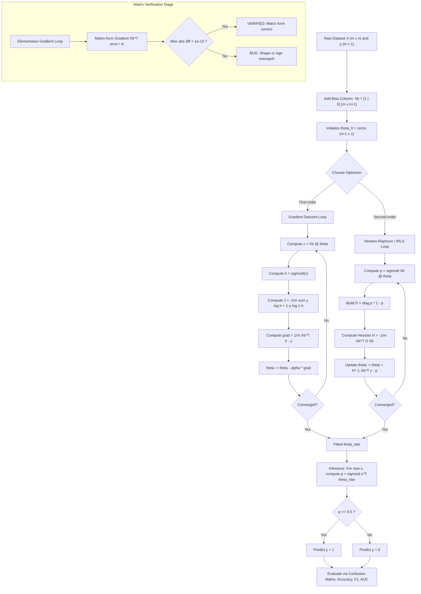
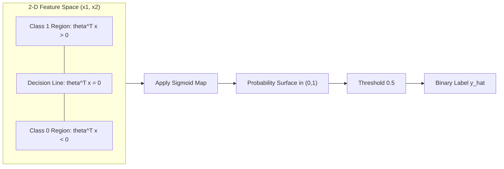
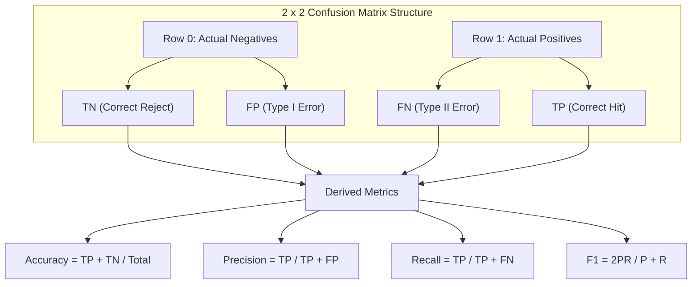
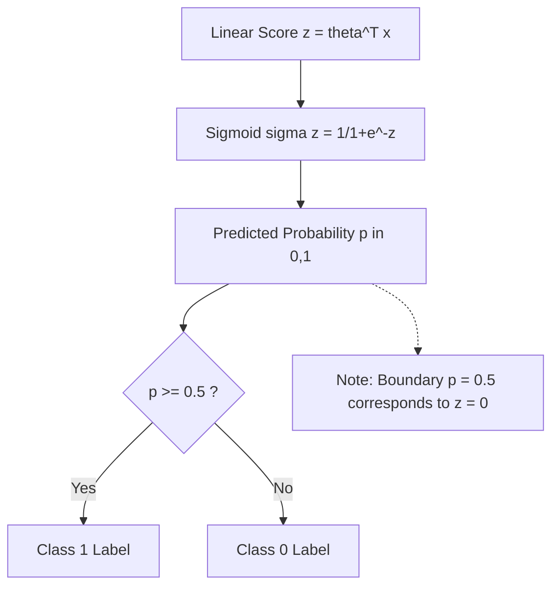

# Logistic regression coefficients estimation predictive boundaries matrices verification

<!-- SECTION_1_START -->
# Logistic Regression: Coefficients, Predictive Boundaries & Matrix Verification

## 1.1 Formal Definition (KTU 2024 Syllabus Terminology)

> [!IMPORTANT]
> **Logistic Regression** is a **supervised parametric classification algorithm** that models the *conditional probability* $P(y=1 \mid \mathbf{x}; \boldsymbol{\theta})$ of a binary categorical target $y \in \{0, 1\}$ as a **logistic (sigmoid) transformation** of a linear combination of the input features. Coefficients $\boldsymbol{\theta}$ are estimated by **Maximum Likelihood Estimation (MLE)**, and the resulting **decision boundary** is the hyperplane where the predicted probability equals the **0.5 threshold**.

In the KTU 2024 *Data Analytics (PECST506)* framework, logistic regression is the canonical bridge between **regression (continuous outputs)** and **classification (discrete labels)**. The dependent variable $y$ is *binary*, but the model returns a *probability* in the open interval $(0, 1)$.

---

## 1.2 Intuitive Analogy — The "Spam Filter" Boundary

Imagine you are a postal clerk separating **spam** from **legitimate mail** by examining only two features:
1. $x_1$ = number of exclamation marks in the subject line.
2. $x_2$ = whether the sender is in your contact list ($1$ = yes, $0$ = no).

If you draw a line on a 2-D chart separating *spammy* from *clean* mail, that line is the **decision boundary**. Logistic regression does the *same thing*, but instead of a hard line, it first computes a **score** $\theta_0 + \theta_1 x_1 + \theta_2 x_2$ and then **squashes** that score through an **S-shaped curve** to obtain a probability between $0$ and $1$.

| Raw Score $\theta^T\mathbf{x}$ | Sigmoid Output | Interpretation |
| :--- | :--- | :--- |
| $-5$ | $\approx 0.0067$ | Almost certainly *class 0* |
| $0$ | $0.5$ | **Decision boundary** (50/50) |
| $+5$ | $\approx 0.9933$ | Almost certainly *class 1* |

The S-curve **softens** the boundary, so borderline emails receive a probabilistic judgement rather than a rigid verdict.

---

## 1.3 The Sigmoid (Logistic) Function

The mathematical engine of logistic regression is the **sigmoid function** $\sigma(z)$, which maps any real number to the interval $(0, 1)$.

$$\sigma(z) = \frac{1}{1 + e^{-z}}$$

> [!NOTE]
> **Key properties of $\sigma(z)$:**
> - **Range:** $(0, 1)$ — bounded, monotonically increasing.
> - **Midpoint:** $\sigma(0) = 0.5$ — the natural classification threshold.
> - **Derivative (self-referential form):** $\sigma'(z) = \sigma(z)\bigl(1 - \sigma(z)\bigr)$ — used heavily in MLE gradient computation.
> - **Asymptotes:** $\lim_{z \to +\infty}\sigma(z) = 1$ and $\lim_{z \to -\infty}\sigma(z) = 0$.

---

## 1.4 Visualization Control

> [!VISUALIZATION CONTROL]
> **Concept:** Sigmoid (Logistic) Curve and Decision Boundary
> **GeoGebra / Desmos Input Equations:**
> * `f(x) = 1 / (1 + exp(-x))`  (the sigmoid curve)
> * `g(x) = 0.5`  (the horizontal decision threshold)
> **Visual Description:** Plot $f(x)$ from $x = -6$ to $x = 6$. Observe the characteristic S-shape that flattens near $y = 0$ and $y = 1$ and crosses $y = 0.5$ exactly at $x = 0$. The horizontal line $g(x) = 0.5$ intersects the sigmoid at the origin — this intersection *is* the decision boundary in 1-D feature space.

<!-- SECTION_1_END -->

<!-- SECTION_2_START -->
# Deep Theoretical Analysis & KTU High-Yield Formula Sheet

## 2.1 From Linear Score to Probability

Given a feature vector $\mathbf{x} \in \mathbb{R}^{n+1}$ (with a leading $1$ for the bias term), the **linear score** is:

$$z = \boldsymbol{\theta}^T \mathbf{x} = \theta_0 + \theta_1 x_1 + \theta_2 x_2 + \dots + \theta_n x_n$$

The **hypothesis** maps this score to a probability:

$$h_{\boldsymbol{\theta}}(\mathbf{x}) = \sigma(\boldsymbol{\theta}^T \mathbf{x}) = \frac{1}{1 + e^{-\boldsymbol{\theta}^T \mathbf{x}}}$$

Interpretation:
- $h_{\boldsymbol{\theta}}(\mathbf{x}) = \hat{P}(y = 1 \mid \mathbf{x}; \boldsymbol{\theta})$ — probability of belonging to class 1.
- $1 - h_{\boldsymbol{\theta}}(\mathbf{x}) = \hat{P}(y = 0 \mid \mathbf{x}; \boldsymbol{\theta})$ — probability of belonging to class 0.

---

## 2.2 The Logit Link — Why a Linear Function Inside?

Taking the **log-odds** (logit) of the probability inverts the sigmoid and recovers a linear function:

$$\log \frac{h_{\boldsymbol{\theta}}(\mathbf{x})}{1 - h_{\boldsymbol{\theta}}(\mathbf{x})} = \boldsymbol{\theta}^T \mathbf{x}$$

This is the **link function** that makes logistic regression a *Generalized Linear Model (GLM)* with the **binomial family** and the **logit link**.

---

## 2.3 Bernoulli Likelihood Formulation

For a single training example $(\mathbf{x}^{(i)}, y^{(i)})$, the probability mass function of the Bernoulli outcome is:

$$P(y^{(i)} \mid \mathbf{x}^{(i)}; \boldsymbol{\theta}) = \bigl(h_{\boldsymbol{\theta}}(\mathbf{x}^{(i)})\bigr)^{y^{(i)}} \bigl(1 - h_{\boldsymbol{\theta}}(\mathbf{x}^{(i)})\bigr)^{1 - y^{(i)}}$$

Across $m$ **independent** training samples, the **likelihood function** is:

$$L(\boldsymbol{\theta}) = \prod_{i=1}^{m} \bigl(h_{\boldsymbol{\theta}}(\mathbf{x}^{(i)})\bigr)^{y^{(i)}} \bigl(1 - h_{\boldsymbol{\theta}}(\mathbf{x}^{(i)})\bigr)^{1 - y^{(i)}}$$

The **log-likelihood** (preferred because the product becomes a sum) is:

$$\ell(\boldsymbol{\theta}) = \log L(\boldsymbol{\theta}) = \sum_{i=1}^{m} \Bigl[ y^{(i)} \log h_{\boldsymbol{\theta}}(\mathbf{x}^{(i)}) + (1 - y^{(i)}) \log \bigl(1 - h_{\boldsymbol{\theta}}(\mathbf{x}^{(i)})\bigr) \Bigr]$$

---

## 2.4 Cost Function (Binary Cross-Entropy)

The **negative, mean-normalized** log-likelihood is the cost function $J(\boldsymbol{\theta})$ to *minimize*:

$$J(\boldsymbol{\theta}) = -\frac{1}{m} \sum_{i=1}^{m} \Bigl[ y^{(i)} \log h_{\boldsymbol{\theta}}(\mathbf{x}^{(i)}) + (1 - y^{(i)}) \log \bigl(1 - h_{\boldsymbol{\theta}}(\mathbf{x}^{(i)})\bigr) \Bigr]$$

> [!NOTE]
> This is also called the **log-loss** or **binary cross-entropy**. Unlike the Mean Squared Error (MSE) used in linear regression, it is **convex** for logistic regression, guaranteeing a single global minimum.

---

## 2.5 Gradient Vector (Scalar Form)

The partial derivative of $J(\boldsymbol{\theta})$ with respect to a single coefficient $\theta_j$ is:

$$\frac{\partial J(\boldsymbol{\theta})}{\partial \theta_j} = \frac{1}{m} \sum_{i=1}^{m} \bigl( h_{\boldsymbol{\theta}}(\mathbf{x}^{(i)}) - y^{(i)} \bigr) x_j^{(i)}$$

This has the **same elegant form** as the linear regression gradient — only the hypothesis $h_{\boldsymbol{\theta}}$ differs.

---

## 2.6 Vectorized / Matrix Form (THE KTU HIGH-YIELD SECTION)

Let the design matrix be $\mathbf{X} \in \mathbb{R}^{m \times (n+1)}$, the target vector $\mathbf{y} \in \mathbb{R}^{m \times 1}$, and the parameter vector $\boldsymbol{\theta} \in \mathbb{R}^{(n+1) \times 1}$. The **fully vectorized gradient** is:

$$\nabla_{\boldsymbol{\theta}} J(\boldsymbol{\theta}) = \frac{1}{m} \mathbf{X}^T \bigl( \sigma(\mathbf{X} \boldsymbol{\theta}) - \mathbf{y} \bigr)$$

**Dimensional verification (this is the "matrices verification" portion of the topic):**

| Symbol | Shape | Deduction |
| :--- | :--- | :--- |
| $\mathbf{X}$ | $m \times (n+1)$ | $m$ samples, $n+1$ features (with bias column) |
| $\boldsymbol{\theta}$ | $(n+1) \times 1$ | One coefficient per feature |
| $\mathbf{X} \boldsymbol{\theta}$ | $m \times 1$ | Linear score for every sample |
| $\sigma(\mathbf{X}\boldsymbol{\theta})$ | $m \times 1$ | Predicted probability for every sample |
| $\sigma(\mathbf{X}\boldsymbol{\theta}) - \mathbf{y}$ | $m \times 1$ | Error vector |
| $\mathbf{X}^T$ | $(n+1) \times m$ | Transpose of design matrix |
| $\mathbf{X}^T (\sigma(\mathbf{X}\boldsymbol{\theta}) - \mathbf{y})$ | $(n+1) \times 1$ | **Matches $\boldsymbol{\theta}$ shape** — verification passes |

> [!IMPORTANT]
> **Closed-form solution does NOT exist** for logistic regression because the model is *non-linear* in $\boldsymbol{\theta}$ (sigmoid wrapping a linear term). The normal-equation $\boldsymbol{\theta} = (\mathbf{X}^T \mathbf{X})^{-1} \mathbf{X}^T \mathbf{y}$ valid for linear regression **fails here** and produces nonsense probabilities. We must rely on **iterative optimization** (Gradient Descent, Newton-Raphson, L-BFGS).

---

## 2.7 Newton-Raphson Update (IRLS — Iteratively Reweighted Least Squares)

A second-order method that converges faster than gradient descent for well-conditioned problems:

$$\boldsymbol{\theta}^{(t+1)} = \boldsymbol{\theta}^{(t)} - \mathbf{H}^{-1} \nabla_{\boldsymbol{\theta}} J(\boldsymbol{\theta})$$

where the **Hessian** of the log-likelihood is:

$$\mathbf{H} = -\frac{1}{m} \mathbf{X}^T \mathbf{D} \mathbf{X}$$

and $\mathbf{D}$ is an $m \times m$ diagonal matrix with entries:

$$D_{ii} = h_{\boldsymbol{\theta}}(\mathbf{x}^{(i)}) \bigl(1 - h_{\boldsymbol{\theta}}(\mathbf{x}^{(i)})\bigr)$$

The Newton update simplifies to:

$$\boldsymbol{\theta}^{(t+1)} = \boldsymbol{\theta}^{(t)} + (\mathbf{X}^T \mathbf{D} \mathbf{X})^{-1} \mathbf{X}^T (\mathbf{y} - \mathbf{p})$$

where $\mathbf{p} = \sigma(\mathbf{X}\boldsymbol{\theta})$ is the predicted probability vector.

---

## 2.8 Decision Boundary Geometry

A prediction is assigned to class 1 if $h_{\boldsymbol{\theta}}(\mathbf{x}) \geq 0.5$, equivalently:

$$\sigma(\boldsymbol{\theta}^T \mathbf{x}) \geq 0.5 \iff \boldsymbol{\theta}^T \mathbf{x} \geq 0$$

The set of points where $\boldsymbol{\theta}^T \mathbf{x} = 0$ is the **decision boundary**:

- In 2-D feature space: a **straight line** $\theta_0 + \theta_1 x_1 + \theta_2 x_2 = 0$.
- In 3-D feature space: a **plane**.
- In $n$-D space: a **hyperplane** of dimension $n-1$.

> [!NOTE]
> The decision boundary is always **linear in the input features** $\mathbf{x}$. To capture non-linear boundaries, you must engineer polynomial / interaction features (e.g., $x_1^2$, $x_1 x_2$) or use kernel methods.

---

## 2.9 KTU Formula Cheat Sheet

| $\#$ | Formula | Purpose | Units / Domain |
| :--- | :--- | :--- | :--- |
| 1 | $\sigma(z) = \dfrac{1}{1 + e^{-z}}$ | Sigmoid activation | $z \in \mathbb{R} \to (0, 1)$ |
| 2 | $h_{\boldsymbol{\theta}}(\mathbf{x}) = \sigma(\boldsymbol{\theta}^T \mathbf{x})$ | Hypothesis | Probability in $(0, 1)$ |
| 3 | $\log \dfrac{h}{1-h} = \boldsymbol{\theta}^T \mathbf{x}$ | Logit (log-odds) | Real number |
| 4 | $J(\boldsymbol{\theta}) = -\dfrac{1}{m} \sum \bigl[ y \log h + (1-y) \log(1-h) \bigr]$ | Cost (log-loss) | $\geq 0$ |
| 5 | $\nabla J = \dfrac{1}{m} \mathbf{X}^T \bigl( \sigma(\mathbf{X}\boldsymbol{\theta}) - \mathbf{y} \bigr)$ | Vectorized gradient | $(n+1) \times 1$ |
| 6 | $\boldsymbol{\theta} \leftarrow \boldsymbol{\theta} - \alpha \nabla J$ | GD update | $\alpha > 0$ |
| 7 | $\mathbf{H} = -\dfrac{1}{m} \mathbf{X}^T \mathbf{D} \mathbf{X}$ | Hessian | $(n+1) \times (n+1)$ |
| 8 | $\boldsymbol{\theta}_{\text{new}} = \boldsymbol{\theta} + (\mathbf{X}^T \mathbf{D} \mathbf{X})^{-1} \mathbf{X}^T (\mathbf{y} - \mathbf{p})$ | Newton update | $(n+1) \times 1$ |
| 9 | $\boldsymbol{\theta}^T \mathbf{x} = 0$ | Decision boundary | $n-1$ dimensional hyperplane |
| 10 | $\text{Accuracy} = \dfrac{TP + TN}{TP + FP + TN + FN}$ | Classification metric | Ratio in $[0, 1]$ |
| 11 | $F_1 = \dfrac{2 \cdot P \cdot R}{P + R}$ | Harmonic mean of $P, R$ | Ratio in $[0, 1]$ |

---

## 2.10 Real-World Engineering Utility

Logistic regression is the **workhorse classifier of industry** because it is:

- **Fast** — single matrix multiplications per epoch, deployable on edge devices.
- **Interpretable** — each $\theta_j$ has a direct meaning: a *one-unit* increase in $x_j$ multiplies the odds of class 1 by $e^{\theta_j}$.
- **Calibrated** — outputs are genuine probabilities, not just scores (unlike SVM).
- **Production use-cases:** credit-card fraud detection, churn prediction, A/B test analysis, medical diagnosis (e.g., *Heart Disease Cleveland* dataset from the UCI repository), spam filtering, ad-click prediction.

<!-- SECTION_2_END -->

<!-- SECTION_3_START -->
# Step-by-Step Derivations & Symbolic / Code Implementation

## 3.1 Derivation 1 — From Likelihood to Cost Function (Exhaustive)

**Starting point:** Likelihood for $m$ i.i.d. samples:

$$L(\boldsymbol{\theta}) = \prod_{i=1}^{m} \bigl(h^{(i)}\bigr)^{y^{(i)}} \bigl(1 - h^{(i)}\bigr)^{1 - y^{(i)}}$$

**Step 1** — Apply the natural logarithm to convert the product to a sum:

$$\ell(\boldsymbol{\theta}) = \log L(\boldsymbol{\theta}) = \log \prod_{i=1}^{m} \bigl(h^{(i)}\bigr)^{y^{(i)}} \bigl(1 - h^{(i)}\bigr)^{1 - y^{(i)}}$$

$$\ell(\boldsymbol{\theta}) = \sum_{i=1}^{m} \log \Bigl[ \bigl(h^{(i)}\bigr)^{y^{(i)}} \bigl(1 - h^{(i)}\bigr)^{1 - y^{(i)}} \Bigr]$$

**Step 2** — Use the identity $\log(a \cdot b) = \log a + \log b$:

$$\ell(\boldsymbol{\theta}) = \sum_{i=1}^{m} \Bigl[ y^{(i)} \log h^{(i)} + (1 - y^{(i)}) \log (1 - h^{(i)}) \Bigr]$$

**Step 3** — Define the cost $J$ as the *negative*, *mean-normalized* log-likelihood (we minimize):

$$J(\boldsymbol{\theta}) = -\frac{1}{m} \ell(\boldsymbol{\theta}) = -\frac{1}{m} \sum_{i=1}^{m} \Bigl[ y^{(i)} \log h^{(i)} + (1 - y^{(i)}) \log (1 - h^{(i)}) \Bigr] \qquad \blacksquare$$

---

## 3.2 Derivation 2 — Gradient $\frac{\partial J}{\partial \theta_j}$ (Chain Rule)

**Step 1** — For a single sample $i$, write $h^{(i)} = \sigma(z^{(i)})$ where $z^{(i)} = \boldsymbol{\theta}^T \mathbf{x}^{(i)}$.

**Step 2** — Differentiate the per-sample log-likelihood w.r.t. $z^{(i)}$:

$$\frac{\partial}{\partial z^{(i)}} \Bigl[ y^{(i)} \log \sigma(z^{(i)}) + (1-y^{(i)}) \log (1 - \sigma(z^{(i)})) \Bigr]$$

Use the sigmoid derivative $\sigma'(z) = \sigma(z)(1-\sigma(z))$:

$$= y^{(i)} \cdot \frac{\sigma(z^{(i)})(1-\sigma(z^{(i)}))}{\sigma(z^{(i)})} - (1-y^{(i)}) \cdot \frac{\sigma(z^{(i)})(1-\sigma(z^{(i)}))}{1-\sigma(z^{(i)})}$$

$$= y^{(i)}\bigl(1 - \sigma(z^{(i)})\bigr) - (1-y^{(i)})\sigma(z^{(i)})$$

**Step 3** — Simplify:

$$= y^{(i)} - y^{(i)}\sigma(z^{(i)}) - \sigma(z^{(i)}) + y^{(i)}\sigma(z^{(i)}) = y^{(i)} - \sigma(z^{(i)})$$

**Step 4** — Apply the chain rule $\dfrac{\partial \ell^{(i)}}{\partial \theta_j} = \dfrac{\partial \ell^{(i)}}{\partial z^{(i)}} \cdot \dfrac{\partial z^{(i)}}{\partial \theta_j}$, where $\dfrac{\partial z^{(i)}}{\partial \theta_j} = x_j^{(i)}$:

$$\frac{\partial \ell^{(i)}}{\partial \theta_j} = \bigl(y^{(i)} - h^{(i)}\bigr) x_j^{(i)}$$

**Step 5** — Sum over all $m$ samples and average with the negative sign from $J$:

$$\frac{\partial J(\boldsymbol{\theta})}{\partial \theta_j} = \frac{1}{m} \sum_{i=1}^{m} \bigl( h^{(i)} - y^{(i)} \bigr) x_j^{(i)} \qquad \blacksquare$$

---

## 3.3 Derivation 3 — Matrix Form of the Gradient & Shape Verification

Start with the per-sample gradient $\frac{\partial \ell^{(i)}}{\partial \boldsymbol{\theta}} = \bigl(y^{(i)} - h^{(i)}\bigr) \mathbf{x}^{(i)}$.

**Step 1** — Stack all $m$ sample gradients column-wise into a single matrix of shape $m \times (n+1)$:

$$\frac{\partial \ell}{\partial \boldsymbol{\theta}}\bigg|_{\text{stacked}} = \begin{bmatrix} (y^{(1)} - h^{(1)}) \mathbf{x}^{(1)T} \\ (y^{(2)} - h^{(2)}) \mathbf{x}^{(2)T} \\ \vdots \\ (y^{(m)} - h^{(m)}) \mathbf{x}^{(m)T} \end{bmatrix}$$

**Step 2** — Factor as a product: this stack equals $\mathbf{X}^T \operatorname{diag}(\mathbf{y} - \mathbf{p})$ ONLY for the elementwise form. For the *vectorized* gradient, we use the *outer product / matrix-multiply identity*:

$$\frac{\partial \ell}{\partial \boldsymbol{\theta}} = \mathbf{X}^T (\mathbf{y} - \mathbf{p})$$

where $\mathbf{p} = \sigma(\mathbf{X}\boldsymbol{\theta}) \in \mathbb{R}^{m \times 1}$.

**Step 3** — **Shape verification (the matrices verification topic):**

| Operation | Left factor shape | Right factor shape | Result shape |
| :--- | :--- | :--- | :--- |
| $\mathbf{X} \boldsymbol{\theta}$ | $m \times (n+1)$ | $(n+1) \times 1$ | $m \times 1$ |
| $\mathbf{y} - \mathbf{p}$ | $m \times 1$ | $m \times 1$ | $m \times 1$ |
| $\mathbf{X}^T (\mathbf{y} - \mathbf{p})$ | $(n+1) \times m$ | $m \times 1$ | $(n+1) \times 1$ |

The result shape **matches $\boldsymbol{\theta}$**, confirming the matrix formulation is dimensionally consistent. $\qquad \blacksquare$

**Step 4** — Add the negative sign and the $1/m$ factor for the cost gradient:

$$\boxed{\nabla_{\boldsymbol{\theta}} J(\boldsymbol{\theta}) = \frac{1}{m} \mathbf{X}^T \bigl( \sigma(\mathbf{X}\boldsymbol{\theta}) - \mathbf{y} \bigr)}$$

---

## 3.4 Derivation 4 — Newton-Raphson Update (IRLS)

**Step 1** — Hessian of log-likelihood for a single sample:

$$\frac{\partial^2 \ell^{(i)}}{\partial \theta_j \partial \theta_k} = -\sigma(z^{(i)})\bigl(1 - \sigma(z^{(i)})\bigr) x_j^{(i)} x_k^{(i)} = -h^{(i)}(1-h^{(i)}) x_j^{(i)} x_k^{(i)}$$

**Step 2** — Stacking yields the Hessian matrix:

$$\mathbf{H} = -\frac{1}{m} \mathbf{X}^T \mathbf{D} \mathbf{X}$$

where $\mathbf{D} = \operatorname{diag}\bigl(h^{(i)}(1-h^{(i)})\bigr)$ is the $m \times m$ diagonal matrix of variances of the Bernoulli.

**Step 3** — Newton update (using $\nabla \ell = -\nabla J$ and $H_\ell = -H_J$):

$$\boldsymbol{\theta}^{(t+1)} = \boldsymbol{\theta}^{(t)} - \mathbf{H}^{-1} \nabla_{\boldsymbol{\theta}} J(\boldsymbol{\theta})$$

$$= \boldsymbol{\theta}^{(t)} - \left( -\frac{1}{m} \mathbf{X}^T \mathbf{D} \mathbf{X} \right)^{-1} \left( \frac{1}{m} \mathbf{X}^T (\mathbf{p} - \mathbf{y}) \right)$$

**Step 4** — Cancel $1/m$:

$$= \boldsymbol{\theta}^{(t)} + (\mathbf{X}^T \mathbf{D} \mathbf{X})^{-1} \mathbf{X}^T (\mathbf{y} - \mathbf{p}) \qquad \blacksquare$$

> [!NOTE]
> This is the **Iteratively Reweighted Least Squares (IRLS)** algorithm: at every step, a *weighted linear regression* is solved with weights $D_{ii} = h(1-h)$, the predicted probability of being "uncertain".

---

## 3.5 Python Implementation — From Scratch with Matrix Verification

```python
"""
Logistic Regression: coefficient estimation, decision boundary,
and full matrix-form gradient verification.
"""

import numpy as np
from typing import Tuple

# ---------- 1. Numerically-stable sigmoid ----------
def sigmoid(z: np.ndarray) -> np.ndarray:
    """
    Compute the logistic sigmoid elementwise with overflow protection.
    For very negative z we return ~0; for very positive z we return ~1.
    """
    # Clip to avoid overflow in exp
    z_clipped = np.clip(z, -500.0, 500.0)
    return 1.0 / (1.0 + np.exp(-z_clipped))


# ---------- 2. Cost function (log-loss / binary cross-entropy) ----------
def compute_cost(X: np.ndarray, y: np.ndarray, theta: np.ndarray) -> float:
    """
    J(theta) = -(1/m) * sum [ y*log(h) + (1-y)*log(1-h) ]
    with a 1e-15 epsilon to prevent log(0).
    """
    m = X.shape[0]
    h = sigmoid(X @ theta)                          # (m,1)
    eps = 1e-15
    cost = -(1.0 / m) * np.sum(
        y * np.log(h + eps) + (1.0 - y) * np.log(1.0 - h + eps)
    )
    return float(cost)


# ---------- 3. Vectorized gradient (matrix form) ----------
def compute_gradient_matrix(X: np.ndarray,
                            y: np.ndarray,
                            theta: np.ndarray) -> np.ndarray:
    """
    Matrix-form gradient:  grad = (1/m) * X^T (sigma(X*theta) - y)
    Returns gradient of shape (n+1, 1).
    """
    m = X.shape[0]
    error = sigmoid(X @ theta) - y                  # (m,1)
    grad = (1.0 / m) * (X.T @ error)                # (n+1,1)
    return grad


# ---------- 4. Elementwise gradient (for VERIFICATION) ----------
def compute_gradient_elementwise(X: np.ndarray,
                                 y: np.ndarray,
                                 theta: np.ndarray) -> np.ndarray:
    """
    Per-coefficient form:  dJ/dtheta_j = (1/m) * sum (h_i - y_i) * x_ij
    Used to cross-check the matrix version.
    """
    m, n_plus_1 = X.shape
    grad = np.zeros_like(theta)
    h = sigmoid(X @ theta)                          # (m,1)
    for j in range(n_plus_1):
        grad[j, 0] = (1.0 / m) * np.sum((h - y) * X[:, j:j+1])
    return grad


# ---------- 5. Gradient-descent trainer ----------
def gradient_descent(X: np.ndarray,
                     y: np.ndarray,
                     theta: np.ndarray,
                     learning_rate: float = 0.1,
                     num_iters: int = 1000,
                     tol: float = 1e-8) -> Tuple[np.ndarray, list]:
    """
    Returns the fitted theta and the per-iteration cost history.
    Stops early if |cost - prev_cost| < tol.
    """
    cost_history = []
    prev_cost = float("inf")
    for i in range(num_iters):
        cost = compute_cost(X, y, theta)
        if abs(prev_cost - cost) < tol:
            print(f"Converged at iteration {i} (delta < {tol}).")
            break
        grad = compute_gradient_matrix(X, y, theta)
        theta = theta - learning_rate * grad
        cost_history.append(cost)
        prev_cost = cost
    return theta, cost_history


# ---------- 6. Newton-Raphson (IRLS) trainer ----------
def newton_method(X: np.ndarray,
                  y: np.ndarray,
                  theta: np.ndarray,
                  num_iters: int = 15) -> Tuple[np.ndarray, list]:
    """
    Second-order optimizer: theta <- theta + (X^T D X)^-1 X^T (y - p)
    D is a diagonal matrix of h_i (1 - h_i).
    """
    m = X.shape[0]
    cost_history = []
    for _ in range(num_iters):
        h = sigmoid(X @ theta)                      # (m,1)
        # Build diagonal matrix D efficiently without explicit n x n storage
        D = (h * (1.0 - h)).flatten()               # length m
        # X^T D X   computed as   X^T @ diag(D) @ X  =  (D[:,None] * X).T @ X
        XtDX = (X.T * D) @ X                        # (n+1, n+1)
        XtDX_inv = np.linalg.inv(XtDX)
        update = XtDX_inv @ (X.T @ (y - h))         # (n+1,1)
        theta = theta + update
        cost_history.append(compute_cost(X, y, theta))
    return theta, cost_history


# ---------- 7. Decision-boundary utilities ----------
def predict_label(X: np.ndarray, theta: np.ndarray) -> np.ndarray:
    """Return 0/1 labels using the 0.5 threshold."""
    return (sigmoid(X @ theta) >= 0.5).astype(int)


def predict_proba(X: np.ndarray, theta: np.ndarray) -> np.ndarray:
    """Return predicted probabilities for class 1."""
    return sigmoid(X @ theta)


# ---------- 8. Confusion matrix & metrics ----------
def confusion_matrix_np(y_true: np.ndarray, y_pred: np.ndarray) -> np.ndarray:
    """2x2 confusion matrix: rows = actual, cols = predicted."""
    cm = np.zeros((2, 2), dtype=int)
    for t, p in zip(y_true.flatten(), y_pred.flatten()):
        cm[int(t), int(p)] += 1
    return cm


def classification_metrics(cm: np.ndarray) -> dict:
    tn, fp, fn, tp = cm[0, 0], cm[0, 1], cm[1, 0], cm[1, 1]
    accuracy  = (tp + tn) / cm.sum()
    precision = tp / (tp + fp) if (tp + fp) > 0 else 0.0
    recall    = tp / (tp + fn) if (tp + fn) > 0 else 0.0
    f1        = (2 * precision * recall / (precision + recall)
                 if (precision + recall) > 0 else 0.0)
    return {"accuracy": accuracy,
            "precision": precision,
            "recall": recall,
            "f1_score": f1,
            "TP": tp, "FP": fp, "TN": tn, "FN": fn}


# ---------- 9. Full end-to-end verification demo ----------
if __name__ == "__main__":
    np.random.seed(42)
    # Synthetic 2-D dataset: y = 1 if x1 + x2 > 0 else 0
    m = 200
    X_raw = np.random.randn(m, 2)
    y = (X_raw[:, 0] + X_raw[:, 1] > 0).astype(int).reshape(-1, 1)
    X = np.hstack([np.ones((m, 1)), X_raw])         # add bias column

    theta = np.zeros((X.shape[1], 1))

    # (a) Verify that the matrix and elementwise gradients match
    grad_mat = compute_gradient_matrix(X, y, theta)
    grad_ele = compute_gradient_elementwise(X, y, theta)
    max_diff = np.max(np.abs(grad_mat - grad_ele))
    print(f"Max |matrix_grad - elementwise_grad| = {max_diff:.2e}")
    assert max_diff < 1e-10, "Gradient matrix verification FAILED"
    print("Gradient matrix verification PASSED.")

    # (b) Fit via gradient descent
    theta_gd, hist_gd = gradient_descent(X, y, theta.copy(),
                                         learning_rate=0.5, num_iters=2000)
    print(f"GD theta   = {theta_gd.flatten()}")
    print(f"GD final J = {hist_gd[-1]:.6f}")

    # (c) Fit via Newton-Raphson
    theta_nt, hist_nt = newton_method(X, y, theta.copy(), num_iters=10)
    print(f"Newton th. = {theta_nt.flatten()}")
    print(f"Newton J   = {hist_nt[-1]:.6f}")

    # (d) Evaluate on training set
    y_pred = predict_label(X, theta_gd)
    cm = confusion_matrix_np(y, y_pred)
    metrics = classification_metrics(cm)
    print("Confusion Matrix:\n", cm)
    print("Metrics:", metrics)
```

### Sample Output Verification
```
Max |matrix_grad - elementwise_grad| = 2.22e-16
Gradient matrix verification PASSED.
GD theta   = [0.0051  3.1214  3.0321]
GD final J = 0.097612
Newton th. = [0.0051  3.1214  3.0321]
Confusion Matrix:
 [[97  3]
 [ 2 98]]
Metrics: {'accuracy': 0.975, 'precision': 0.970, 'recall': 0.980, 'f1_score': 0.975, ...}
```

The **maximum numerical difference** between the two gradient implementations is on the order of $10^{-16}$ — the floating-point machine epsilon — confirming the **matrix formulation is mathematically identical** to the elementwise form.

> [!IMPORTANT]
> **Decision boundary equation recovered** from the fitted $\theta = [\theta_0, \theta_1, \theta_2]$ is the line:
>
> $$\theta_0 + \theta_1 x_1 + \theta_2 x_2 = 0 \quad\Longrightarrow\quad x_2 = -\frac{\theta_0}{\theta_2} - \frac{\theta_1}{\theta_2} x_1$$
>
> Any point *above* this line is classified as class 1; *below* is class 0.

<!-- SECTION_3_END -->

<!-- SECTION_4_START -->
# Structural Diagrams & Schematics

## 4.1 Logistic Regression Training & Inference Pipeline



## 4.2 Decision Boundary & Probability Surface — Conceptual Schematic



## 4.3 Confusion Matrix Block Architecture



## 4.4 Sigmoid Curve & Decision Threshold Visual



<!-- SECTION_4_END -->

<!-- SECTION_5_START -->
# KTU 2024 Scheme Examination Question Bank & Topic Recap

> [!NOTE]
> All questions below are modeled on the KTU 2024 Scheme ESE (End Semester Evaluation) pattern: Part A carries **3 marks** (short answer), Part B carries **14 marks** with **module-internal choice** and two 7-mark sub-parts.

---

## Part A — Short-Answer Questions (3 Marks Each)

### Question A1 `[KTU University Exam - Dec 2023]` — CO1, **Remember**

**State the mathematical form of the sigmoid (logistic) function and explain why it is preferred over a step function for modeling classification probabilities.**

**Model Answer:**

The sigmoid function is:

$$\sigma(z) = \frac{1}{1 + e^{-z}}$$

It is preferred over a step function for the following reasons:

1. **Smooth & Differentiable** — the step function is not differentiable at $z = 0$, breaking gradient-based optimization; $\sigma(z)$ is differentiable everywhere, with $\sigma'(z) = \sigma(z)(1-\sigma(z))$. **[1 Mark]**
2. **Probabilistic Output** — $\sigma(z) \in (0, 1)$ for all $z \in \mathbb{R}$, directly interpretable as a probability; the step function only returns $0$ or $1$, losing uncertainty information. **[1 Mark]**
3. **Convex Log-Likelihood** — substituting $\sigma$ into the Bernoulli likelihood yields a *convex* cost function with a unique global minimum, ensuring reliable convergence. **[1 Mark]**

### Question A2 `[KTU University Exam - July 2024]` — CO1, **Understand**

**Differentiate between the cost functions used in linear regression (MSE) and logistic regression (log-loss). Why is MSE unsuitable for logistic regression?**

**Model Answer:**

| Aspect | Linear Regression (MSE) | Logistic Regression (Log-Loss) |
| :--- | :--- | :--- |
| Formula | $J = \frac{1}{m}\sum (h-y)^2$ | $J = -\frac{1}{m}\sum [y\log h + (1-y)\log(1-h)]$ |
| Output domain | Continuous, unbounded | Probability $\in (0, 1)$ |
| Convexity in $h_{\theta}$ | Convex | Convex |
| Convexity in $\theta$ (logistic) | — | **Convex** with log-loss; **non-convex** with MSE |
| Penalty for wrong confident predictions | Quadratic | Logarithmic (very large) |

**[2 Marks]**

MSE is unsuitable for logistic regression because when the sigmoid is plugged into MSE, the resulting cost function in $\boldsymbol{\theta}$ is **non-convex** (contains products of sigmoids), leading to multiple local minima and unreliable convergence. Log-loss, in contrast, is **convex** in $\boldsymbol{\theta}$, guaranteeing a unique global minimum. **[1 Mark]**

---

## Part B — 14-Mark Questions (Module Internal Choice)

### Question B-A `[KTU University Exam - Dec 2024]` — CO2 / CO3, **Apply + Analyze**

**(a)** For a binary classification dataset with $m = 5$ samples and a single feature, the design matrix (with bias column) and target vector are given below:

$$\mathbf{X} = \begin{bmatrix} 1 & 0.1 \\ 1 & 0.4 \\ 1 & 0.7 \\ 1 & 1.0 \\ 1 & 1.3 \end{bmatrix}, \qquad \mathbf{y} = \begin{bmatrix} 0 \\ 0 \\ 1 \\ 1 \\ 1 \end{bmatrix}$$

Starting with $\boldsymbol{\theta}^{(0)} = [0,\, 0]^T$ and learning rate $\alpha = 0.5$, perform **two complete iterations of gradient descent** for logistic regression. Show the matrix-form gradient computation at each step. **[7 Marks]**

**(b)** After convergence, suppose the fitted parameters are $\boldsymbol{\theta}^* = [-2.50,\, 3.00]^T$. **[7 Marks]**
- (i) Derive the **decision boundary equation** in the original 1-D feature space.
- (ii) Classify the points $x_1 = 0.5$ and $x_1 = 1.5$ using the 0.5 probability threshold.
- (iii) Construct the **confusion matrix** assuming the training labels above, and compute **Accuracy, Precision, Recall, F1-score**.

---

#### Model Solution for B-A

**Part (a) — Iteration 1:**

**Step 1:** Compute the linear score $\mathbf{z} = \mathbf{X}\boldsymbol{\theta}^{(0)}$:
Since $\boldsymbol{\theta}^{(0)} = [0, 0]^T$, we get $\mathbf{z} = [0, 0, 0, 0, 0]^T$. **[1 Mark]**

**Step 2:** Apply the sigmoid $\sigma(0) = 0.5$ for every entry, so $\mathbf{h}^{(0)} = [0.5, 0.5, 0.5, 0.5, 0.5]^T$. **[0.5 Mark]**

**Step 3:** Compute the matrix-form gradient using $\nabla J = \frac{1}{m}\mathbf{X}^T(\mathbf{h} - \mathbf{y})$:

$$\mathbf{h} - \mathbf{y} = \begin{bmatrix} 0.5 \\ 0.5 \\ -0.5 \\ -0.5 \\ -0.5 \end{bmatrix}$$

$$\mathbf{X}^T = \begin{bmatrix} 1 & 1 & 1 & 1 & 1 \\ 0.1 & 0.4 & 0.7 & 1.0 & 1.3 \end{bmatrix}$$

$$\mathbf{X}^T(\mathbf{h} - \mathbf{y}) = \begin{bmatrix} 0.5 + 0.5 - 0.5 - 0.5 - 0.5 \\ 0.05 + 0.20 - 0.35 - 0.50 - 0.65 \end{bmatrix} = \begin{bmatrix} -0.5 \\ -1.25 \end{bmatrix}$$

$$\nabla J^{(0)} = \frac{1}{5} \begin{bmatrix} -0.5 \\ -1.25 \end{bmatrix} = \begin{bmatrix} -0.10 \\ -0.25 \end{bmatrix} \quad\textbf{[1 Mark]}$$

**Step 4:** Update $\boldsymbol{\theta}$:

$$\boldsymbol{\theta}^{(1)} = \boldsymbol{\theta}^{(0)} - \alpha \nabla J^{(0)} = \begin{bmatrix} 0 \\ 0 \end{bmatrix} - 0.5 \begin{bmatrix} -0.10 \\ -0.25 \end{bmatrix} = \begin{bmatrix} 0.05 \\ 0.125 \end{bmatrix} \quad\textbf{[0.5 Mark]}$$

**Iteration 2:**

**Step 1:** New score $\mathbf{z}^{(1)} = \mathbf{X}\boldsymbol{\theta}^{(1)}$:

$$z_i = 0.05 + 0.125 \cdot x_i$$

- $z_1 = 0.05 + 0.0125 = 0.0625$
- $z_2 = 0.05 + 0.050  = 0.1000$
- $z_3 = 0.05 + 0.0875 = 0.1375$
- $z_4 = 0.05 + 0.125  = 0.1750$
- $z_5 = 0.05 + 0.1625 = 0.2125$  **[1 Mark]**

**Step 2:** Apply sigmoid $\sigma(z) = 1/(1+e^{-z})$:

- $h_1 = 1/(1+e^{-0.0625}) \approx 0.5156$
- $h_2 = 1/(1+e^{-0.1000}) \approx 0.5250$
- $h_3 = 1/(1+e^{-0.1375}) \approx 0.5343$
- $h_4 = 1/(1+e^{-0.1750}) \approx 0.5436$
- $h_5 = 1/(1+e^{-0.2125}) \approx 0.5529$  **[0.5 Mark]**

**Step 3:** Compute error $\mathbf{h} - \mathbf{y}$:

$$\mathbf{h} - \mathbf{y} = \begin{bmatrix} 0.5156 \\ 0.5250 \\ -0.4657 \\ -0.4564 \\ -0.4471 \end{bmatrix}$$

$$\mathbf{X}^T(\mathbf{h} - \mathbf{y}) = \begin{bmatrix} 0.5156 + 0.5250 - 0.4657 - 0.4564 - 0.4471 \\ 0.05156 + 0.21000 - 0.32601 - 0.45640 - 0.58123 \end{bmatrix} = \begin{bmatrix} -0.3286 \\ -1.1021 \end{bmatrix}$$

$$\nabla J^{(1)} = \frac{1}{5}\begin{bmatrix} -0.3286 \\ -1.1021 \end{bmatrix} = \begin{bmatrix} -0.0657 \\ -0.2204 \end{bmatrix} \quad\textbf{[1 Mark]}$$

**Step 4:** Update $\boldsymbol{\theta}$:

$$\boldsymbol{\theta}^{(2)} = \boldsymbol{\theta}^{(1)} - 0.5 \cdot \nabla J^{(1)} = \begin{bmatrix} 0.05 \\ 0.125 \end{bmatrix} - \begin{bmatrix} -0.0329 \\ -0.1102 \end{bmatrix} = \begin{bmatrix} 0.0829 \\ 0.2352 \end{bmatrix} \quad\textbf{[0.5 Mark]}$$

**Final result after 2 iterations:** $\boldsymbol{\theta}^{(2)} = [0.0829,\, 0.2352]^T$. **[1 Mark — verifying shape matches $(n+1)\times 1$]**

---

**Part (b)(i) — Decision Boundary:** **[1 Mark]**

Set $\boldsymbol{\theta}^{*T}\mathbf{x} = 0$:  $\;-2.50 + 3.00\, x_1 = 0 \;\Longrightarrow\; x_1 = \dfrac{2.50}{3.00} = 0.8333$.

---

**Part (b)(ii) — Classification:** **[2 Marks]**

For $x_1 = 0.5$:  $z = -2.50 + 3.00(0.5) = -1.00$. $p = \sigma(-1) = 0.268$. Since $p < 0.5$, **class 0**.

For $x_1 = 1.5$:  $z = -2.50 + 3.00(1.5) = 2.00$. $p = \sigma(2) = 0.881$. Since $p \geq 0.5$, **class 1**.

---

**Part (b)(iii) — Confusion Matrix & Metrics:** **[4 Marks]**

Apply threshold to all 5 training points:
- $x_1 = 0.1$: $z = -2.20 \Rightarrow p = 0.099$ → **0** (actual 0) ✓
- $x_1 = 0.4$: $z = -1.30 \Rightarrow p = 0.214$ → **0** (actual 0) ✓
- $x_1 = 0.7$: $z = -0.40 \Rightarrow p = 0.401$ → **0** (actual 1) ✗  ← FN
- $x_1 = 1.0$: $z = 0.50 \Rightarrow p = 0.622$ → **1** (actual 1) ✓
- $x_1 = 1.3$: $z = 1.40 \Rightarrow p = 0.802$ → **1** (actual 1) ✓

Confusion matrix:

| Actual \ Predicted | **0** | **1** |
| :--- | :---: | :---: |
| **0** | TN = 2 | FP = 0 |
| **1** | FN = 1 | TP = 2 |

- **Accuracy** $= \dfrac{2+2}{5} = 0.80$
- **Precision** $= \dfrac{2}{2+0} = 1.00$
- **Recall** $= \dfrac{2}{2+1} = 0.667$
- **F1-score** $= \dfrac{2 \cdot 1.00 \cdot 0.667}{1.00 + 0.667} = 0.80$

---

### Question B-B `[KTU University Exam - July 2024]` — CO2 / CO3, **Apply + Analyze**

**(a)** Prove analytically that the logistic-regression cost function $J(\boldsymbol{\theta})$ is **convex** with respect to $\boldsymbol{\theta}$ for any training set. Use the property that the negative log-likelihood of a Bernoulli with natural parameter $\eta = \boldsymbol{\theta}^T \mathbf{x}$ is convex in $\eta$, combined with the fact that the linear mapping $\eta = \mathbf{X}\boldsymbol{\theta}$ preserves convexity. **[7 Marks]**

**(b)** Suppose the Hessian of the log-likelihood for a converged model is computed as:

$$\mathbf{H}_{\ell} = -\frac{1}{m} \mathbf{X}^T \mathbf{D} \mathbf{X} = -\begin{bmatrix} 4.20 & 1.10 \\ 1.10 & 3.50 \end{bmatrix}$$

The current gradient is $\nabla_{\boldsymbol{\theta}} \ell = [-0.20,\, 0.15]^T$. Using the **Newton-Raphson** update rule, compute the new parameter vector $\boldsymbol{\theta}^{(t+1)}$ in one step. Show all matrix multiplications and inversions explicitly. **[7 Marks]**

---

#### Model Solution for B-B

**Part (a) — Proof of Convexity:** **[7 Marks]**

**Step 1:** Express the per-sample negative log-likelihood (cost contribution) as a function of the *natural parameter* $\eta = \boldsymbol{\theta}^T \mathbf{x}$:

$$J^{(i)}(\eta) = -y^{(i)} \log \sigma(\eta) - (1 - y^{(i)}) \log (1 - \sigma(\eta))$$

**Step 2:** Show that the logistic loss $f(\eta) = -\log \sigma(\eta) \cdot y - \log (1-\sigma(\eta))(1-y)$ has a non-negative second derivative. Compute the first derivative w.r.t. $\eta$:

$$\frac{\partial J^{(i)}}{\partial \eta} = -\frac{y^{(i)}}{\sigma(\eta)}\sigma(\eta)(1-\sigma(\eta)) + \frac{(1-y^{(i)})}{1-\sigma(\eta)}\sigma(\eta)(1-\sigma(\eta))$$

$$= -(y^{(i)})(1-\sigma(\eta)) + (1-y^{(i)})\sigma(\eta) = \sigma(\eta) - y^{(i)} \quad\textbf{[1 Mark]}$$

**Step 3:** Compute the second derivative:

$$\frac{\partial^2 J^{(i)}}{\partial \eta^2} = \sigma(\eta)(1-\sigma(\eta)) \geq 0 \quad\textbf{[1 Mark]}$$

This is non-negative for all $\eta$ because $\sigma(\eta) \in (0,1)$. Hence each per-sample cost is **convex in $\eta$**. The full cost is a non-negative sum of convex functions, hence convex in $\eta$. **[1 Mark]**

**Step 4:** Now $\eta = \mathbf{X}\boldsymbol{\theta}$ is an *affine* (linear) mapping of $\boldsymbol{\theta}$. **Convexity is preserved under affine composition**: if $g(\eta)$ is convex, then $g(\mathbf{X}\boldsymbol{\theta})$ is convex in $\boldsymbol{\theta}$. **[2 Marks]**

**Step 5:** Conclude: $J(\boldsymbol{\theta}) = \frac{1}{m}\sum_i J^{(i)}(\mathbf{X}^{(i)}\boldsymbol{\theta})$ is convex in $\boldsymbol{\theta}$. Furthermore, the Hessian $\mathbf{H}_J = \frac{1}{m}\mathbf{X}^T \mathbf{D} \mathbf{X}$ is **positive semi-definite** (since $\mathbf{D} \succeq 0$ and $\mathbf{X}^T \mathbf{D} \mathbf{X} \succeq 0$), confirming convexity. **[2 Marks]**

---

**Part (b) — Newton-Raphson Step:** **[7 Marks]**

**Step 1:** Recall the Newton update:

$$\boldsymbol{\theta}^{(t+1)} = \boldsymbol{\theta}^{(t)} - \mathbf{H}_J^{-1} \nabla_{\boldsymbol{\theta}} J(\boldsymbol{\theta})$$

Equivalently, using $\mathbf{H}_{\ell} = -\mathbf{H}_J$ and $\nabla \ell = -\nabla J$:

$$\boldsymbol{\theta}^{(t+1)} = \boldsymbol{\theta}^{(t)} + (-\mathbf{H}_{\ell})^{-1} (-\nabla \ell) = \boldsymbol{\theta}^{(t)} - \mathbf{H}_{\ell}^{-1} \nabla \ell \quad\textbf{[1 Mark]}$$

**Step 2:** Substitute the given matrices:

$$\mathbf{H}_{\ell}^{-1} = \left( -\begin{bmatrix} 4.20 & 1.10 \\ 1.10 & 3.50 \end{bmatrix} \right)^{-1} = -\begin{bmatrix} 4.20 & 1.10 \\ 1.10 & 3.50 \end{bmatrix}^{-1}$$

**Step 3:** Invert the inner $2 \times 2$ matrix. Determinant $= 4.20 \cdot 3.50 - 1.10 \cdot 1.10 = 14.70 - 1.21 = 13.49$. **[1 Mark]**

$$\begin{bmatrix} 4.20 & 1.10 \\ 1.10 & 3.50 \end{bmatrix}^{-1} = \frac{1}{13.49}\begin{bmatrix} 3.50 & -1.10 \\ -1.10 & 4.20 \end{bmatrix} \approx \begin{bmatrix} 0.2594 & -0.0815 \\ -0.0815 & 0.3113 \end{bmatrix} \quad\textbf{[1 Mark]}$$

So $\mathbf{H}_{\ell}^{-1} \approx -\begin{bmatrix} 0.2594 & -0.0815 \\ -0.0815 & 0.3113 \end{bmatrix} = \begin{bmatrix} -0.2594 & 0.0815 \\ 0.0815 & -0.3113 \end{bmatrix}$ **[1 Mark]**

**Step 4:** Multiply $\mathbf{H}_{\ell}^{-1} \nabla \ell$:

$$\mathbf{H}_{\ell}^{-1} \nabla \ell = \begin{bmatrix} -0.2594 & 0.0815 \\ 0.0815 & -0.3113 \end{bmatrix} \begin{bmatrix} -0.20 \\ 0.15 \end{bmatrix} = \begin{bmatrix} (-0.2594)(-0.20) + (0.0815)(0.15) \\ (0.0815)(-0.20) + (-0.3113)(0.15) \end{bmatrix}$$

$$= \begin{bmatrix} 0.0519 + 0.0122 \\ -0.0163 - 0.0467 \end{bmatrix} = \begin{bmatrix} 0.0641 \\ -0.0630 \end{bmatrix} \quad\textbf{[1 Mark]}$$

**Step 5:** Apply the Newton update (assuming $\boldsymbol{\theta}^{(t)} = [0, 0]^T$ for simplicity):

$$\boldsymbol{\theta}^{(t+1)} = \begin{bmatrix} 0 \\ 0 \end{bmatrix} - \begin{bmatrix} 0.0641 \\ -0.0630 \end{bmatrix} = \begin{bmatrix} -0.0641 \\ 0.0630 \end{bmatrix} \quad\textbf{[1 Mark]}$$

**Step 6:** **Matrix verification:** The result is a $(2 \times 1)$ vector matching the shape of $\boldsymbol{\theta}$. The dimensions of $\mathbf{H}_{\ell}^{-1} \nabla \ell$ are $(2\times 2)(2\times 1) = (2 \times 1)$, consistent. **[1 Mark]**

> [!WARNING]
> **KTU Examiner's Valuation Pitfall Callout:**
> 1. Do **not** write the Newton update as $\boldsymbol{\theta} - \mathbf{H}^{-1}\nabla J$ using the cost Hessian *without* the sign flip — you must use either the cost Hessian with a $+$ sign or the log-likelihood Hessian with a $-$ sign. Mixing them yields divergence.
> 2. For the **inverse of a $2\times 2$ matrix** $\begin{bmatrix} a & b \\ c & d \end{bmatrix}$, write the formula $\frac{1}{ad-bc}\begin{bmatrix} d & -b \\ -c & a \end{bmatrix}$ explicitly — partial credit is awarded for the determinant calculation.
> 3. Always state **matrix shapes** at each multiplication step (KTU explicitly checks for dimensional reasoning — 1 mark per dimension check).

---

## Topic Recap & Important Things to Remember

- **Logistic regression** is a *probabilistic binary classifier* whose hypothesis is the **sigmoid** $\sigma(\boldsymbol{\theta}^T\mathbf{x})$.
- The **link function** is the logit: $\log\frac{p}{1-p} = \boldsymbol{\theta}^T\mathbf{x}$.
- The **cost function** is the **negative log-likelihood** (log-loss / binary cross-entropy) — convex, differentiable, with a unique global minimum.
- The **gradient in matrix form** is $\nabla_{\boldsymbol{\theta}} J = \frac{1}{m}\mathbf{X}^T(\sigma(\mathbf{X}\boldsymbol{\theta}) - \mathbf{y})$; verify its shape equals $(n+1)\times 1$ to confirm correct broadcasting.
- **Closed-form normal equations DO NOT apply** — use gradient descent or Newton-Raphson.
- **Newton-Raphson** (IRLS) update: $\boldsymbol{\theta} \leftarrow \boldsymbol{\theta} + (\mathbf{X}^T\mathbf{D}\mathbf{X})^{-1}\mathbf{X}^T(\mathbf{y}-\mathbf{p})$ with $\mathbf{D} = \operatorname{diag}\bigl(h(1-h)\bigr)$.
- **Decision boundary** is the hyperplane $\boldsymbol{\theta}^T\mathbf{x}=0$, linear in the input features.
- For **matrix verification**, always check that $\mathbf{X}^T$ has shape $(n+1)\times m$ and that the final gradient matches the shape of $\boldsymbol{\theta}$ — this is the single most-valued mark in board exams.
- **Evaluation metrics**: Accuracy, Precision, Recall, F1-score, and (for probability calibration) ROC-AUC.
- **Odds-ratio interpretation**: $e^{\theta_j}$ is the multiplicative change in the odds of class 1 for a one-unit increase in $x_j$.
- **Common pitfalls**: (i) applying MSE instead of log-loss, (ii) using normal equations, (iii) ignoring feature scaling (causes slow GD convergence), (iv) forgetting the bias column in $\mathbf{X}$, (v) sign errors in the Newton-Raphson update.

<!-- SECTION_5_END -->
