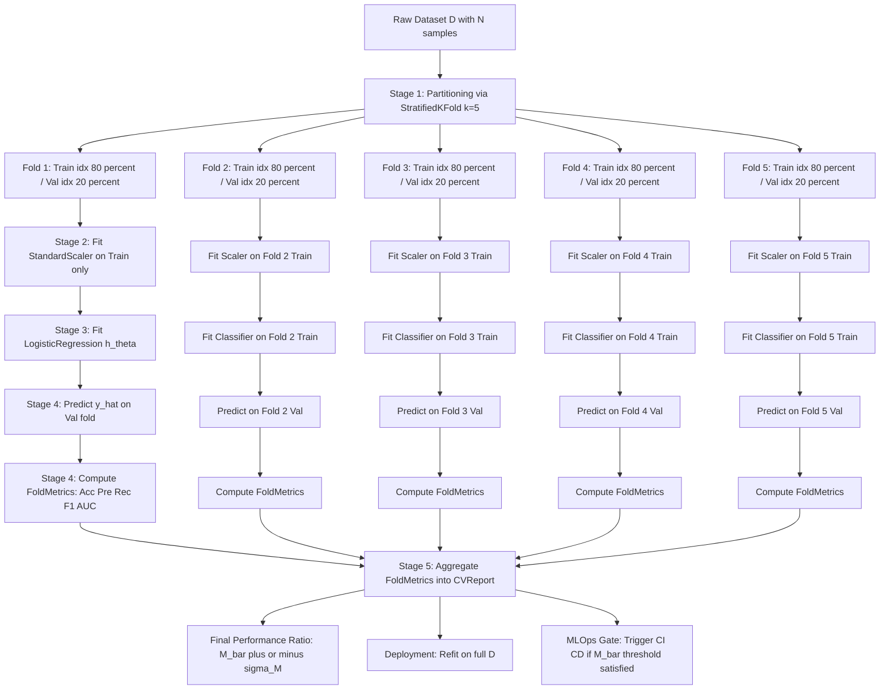
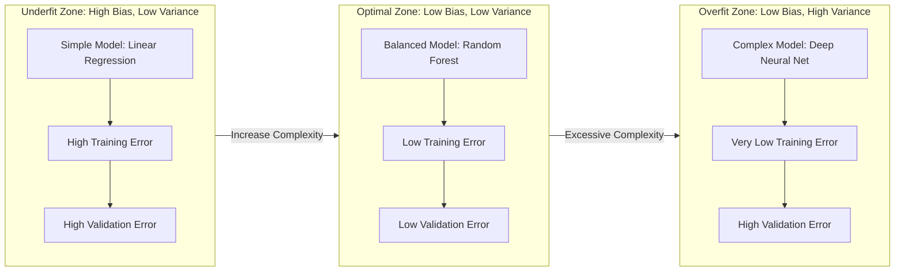
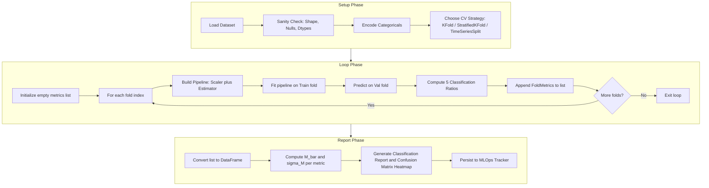
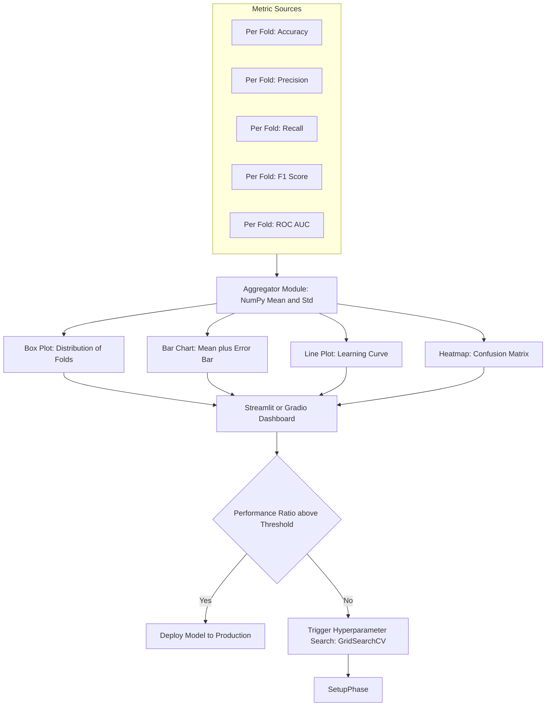

# Model cross validation validation loops setups metrics tracking performance ratios

<!-- SECTION_1_START -->
# Module 3 — Regression \& Classification Modeling
## Unit: Model Cross-Validation, Validation Loop Setups, Metrics Tracking \& Performance Ratios

---

### 1.1 Formal Academic Definition (KTU 2024 Syllabus)

> [!NOTE]
> **Cross-Validation (CV)** is a statistical resampling technique used in Machine Learning and Data Analytics to assess the **generalization performance** and **stability** of a predictive model by partitioning the dataset into complementary subsets, performing iterative training and evaluation, and aggregating the results to mitigate overfitting and selection bias.

In the context of **PECST506 – Data Analytics**, cross-validation belongs to the *Model Selection & Hyperparameter Optimization* family. It is the *de facto* standard estimator for the **out-of-sample (OOS) error** when a held-out test set is impractical or when the dataset is small (typically $N < 10{,}000$).

A **validation loop** is the controlled iterative mechanism — often realized as `for fold in kf.split(X)` — that:

1. Selects a **train fold** ($D_{\text{train}}^{(i)}$) and a **validation fold** ($D_{\text{val}}^{(i)}$) at each iteration $i \in \{1, 2, \dots, k\}$.
2. Fits a model hypothesis $h_{\theta}^{(i)}$ on the training fold.
3. Computes a **metric vector** $\mathbf{m}^{(i)} = (M_1^{(i)}, M_2^{(i)}, \dots, M_p^{(i)})$ on the validation fold.
4. Persists the metrics to a tracking ledger (list, dict, or MLflow/Weights \& Biases buffer).

The final reported **performance ratio** is typically the central tendency of the per-fold metrics, e.g., $\bar{M} = \frac{1}{k}\sum_{i=1}^{k} M^{(i)}$, along with a dispersion indicator like the standard deviation $\sigma_M$.

---

### 1.2 Conceptual Analogy / Intuition

> [!IMPORTANT]
> **"Cross-validation is the exam system, not the study plan."**
>
> Imagine you are preparing for the **KTU S8 University Examination**. You have:
> * 1 full-syllabus **model paper** (Test Set — touched only ONCE at the end).
> * 5 **mock-test papers** (Validation Folds) drawn from your preparation material.
>
> **Training Set** = the textbook chapters you read daily.
> **Validation Folds** = the 5 mock papers you solve weekly to check if your strategy works.
> **Cross-Validation Loop** = the weekly cycle of solving a mock → grading yourself → refining your method.
> **Metric Tracker** = your **progress register** where you write the score of each mock.
> **Performance Ratio** = the *average mock score*, which is your best estimate of the final exam score.
>
> If the ratio is high **and** the scores do not fluctuate wildly (low $\sigma$), your preparation is **stable** and **generalizable**.

A real-world engineering analogy is **Quality Assurance (QA) in a manufacturing plant**. Before shipping a batch of microcontrollers, the QA engineer does not test only one chip — she tests a **stratified random sample** across shifts, machines, and temperature zones. The **average defect rate** and its **standard deviation** are the "performance ratios" reported to the plant manager. CV is exactly this idea, applied to predictive models.

---

### 1.3 Standard Constants & Metrics Vocabulary

The following symbols recur throughout the KTU Board paper and must be memorized:

| Symbol | Meaning | Typical Value |
| :--- | :--- | :--- |
| $k$ | Number of folds in K-Fold CV | $k = 5$ or $k = 10$ |
| $N$ | Total number of samples in the dataset | $\ge 30$ per fold |
| $\mathcal{D}_{\text{train}}$ | Training subset | $\approx 0.8N$ (for 5-Fold) |
| $\mathcal{D}_{\text{val}}$ | Validation subset | $\approx 0.2N$ (for 5-Fold) |
| $\hat{y}_i$ | Predicted value for the $i^{\text{th}}$ sample | — |
| $y_i$ | Ground-truth value | — |
| $h_\theta(\mathbf{x})$ | Model hypothesis parameterized by $\theta$ | — |
| $\bar{M}$ | Mean of metric across folds | — |
| $\sigma_M$ | Std-dev of metric across folds | — |

> [!VISUALIZATION CONTROL]
> **Concept:** 5-Fold Cross-Validation Partitioning Schematic
> **Input (Python/Matplotlib pseudo-code):**
> ```python
> # Plot 5 horizontal bars stacked vertically, each representing a fold.
> # Each bar is split into TRAIN (blue) and VAL (orange).
> # for i in range(5): rect = Rectangle((i, 0), 1, 1, color='blue') etc.
> ```
> **Visual Description:** You should observe **5 rows**. In every row, exactly **one** orange block (validation) appears in a different horizontal position, while the **other 4 blocks** are blue (training). This pictorially demonstrates that **every observation is used exactly once for validation** across the $k$ iterations.

---
<!-- SECTION_1_END -->

<!-- SECTION_2_START -->
# 2. Deep Theoretical Analysis & KTU High-Yield Formula Sheet

---

### 2.1 Taxonomy of Validation Loop Setups

The KTU 2024 syllabus (Module 3) explicitly expects familiarity with the following five validation paradigms. They differ in their **assumptions on data independence and ordering**.

1. **Hold-Out Split** — Single deterministic partition into $(\mathcal{D}_{\text{train}}, \mathcal{D}_{\text{val}}, \mathcal{D}_{\text{test}})$. Fastest, but high variance. Use when $N > 100{,}000$.
2. **K-Fold CV** — The workhorse. Splits $\mathcal{D}$ into $k$ disjoint folds; trains $k$ times.
3. **Stratified K-Fold CV** — A variant of K-Fold that **preserves the class ratio** $P(y = c)$ in every fold. Mandatory for **imbalanced classification** (e.g., fraud detection, disease screening).
4. **Leave-One-Out CV (LOOCV)** — The degenerate case $k = N$. Unbiased but computationally expensive $\mathcal{O}(N \cdot \text{fit\_cost})$.
5. **Time-Series Split (Rolling/Expanding Window)** — For temporal data. The validation fold is always **strictly later in time** than the training fold. Prevents **data leakage** from the future.

> [!NOTE]
> **Data Leakage** is the silent killer of any validation loop. It occurs when information from the validation/test set *leaks* into the training set (e.g., fitting a `StandardScaler` on the entire dataset before splitting). Always perform preprocessing **inside** the cross-validation loop, using `sklearn.pipeline.Pipeline`.

---

### 2.2 The Cross-Validation Loop — Formal Logic Flow

The CV loop can be abstracted as a five-stage pipeline. Understanding this flow is critical because **every Part-B question on validation loops** in the KTU 2024 paper tests one of these stages.

* **Stage 1 — Partitioning:** Generate fold indices $I = \{(T_i, V_i)\}_{i=1}^{k}$ such that $T_i \cap V_i = \emptyset$ and $\bigcup_{i=1}^{k} V_i = \mathcal{D}$.
* **Stage 2 — Preprocessing per Fold:** Fit a transformer $\phi$ on $T_i$ alone, then apply $\phi$ to $V_i$. (Often wrapped in a `Pipeline`.)
* **Stage 3 — Model Fitting:** Estimate parameters $\hat{\theta}^{(i)} = \arg\min_{\theta} \mathcal{L}(h_\theta; T_i)$.
* **Stage 4 — Inference & Metric Computation:** Compute $\mathbf{m}^{(i)} = \text{metrics}(h_{\hat{\theta}^{(i)}}, V_i)$.
* **Stage 5 — Aggregation:** Compute the final performance ratio $\bar{M} \pm \sigma_M$. Optionally, **refit** on the full dataset $\mathcal{D}$ for deployment.

The expected value of the CV error is an **unbiased estimator** of the true out-of-sample error under the assumption of **i.i.d. samples**:

$$\mathbb{E}[\bar{M}] = \mathbb{E}_{(x,y)\sim P_{\text{data}}}[L(h_{\hat{\theta}}, (x,y))] = E_{\text{OOS}}$$

This property is what makes CV the gold standard for model selection.

---

### 2.3 Performance Metrics — Classification

For a binary classifier with predictions $\hat{y} \in \{0, 1\}$ and ground truth $y \in \{0, 1\}$, define the **confusion matrix** counts:

| Notation | Meaning | Description |
| :--- | :--- | :--- |
| $TP$ | True Positives | $y = 1$ and $\hat{y} = 1$ |
| $TN$ | True Negatives | $y = 0$ and $\hat{y} = 0$ |
| $FP$ | False Positives | $y = 0$ and $\hat{y} = 1$ (Type-I Error) |
| $FN$ | False Negatives | $y = 1$ and $\hat{y} = 0$ (Type-II Error) |

> [!NOTE]
> The KTU Board frequently asks students to "compute the **performance ratios**" given a confusion matrix. Memorize the following six metrics as the **high-yield formula sheet** for Part A and Part B questions.

| Metric | Formula | Engineering Use-Case |
| :--- | :--- | :--- |
| **Accuracy** | $\text{Acc} = \dfrac{TP + TN}{TP + TN + FP + FN}$ | Balanced classes, general reporting |
| **Precision (Positive Predictive Value)** | $\text{Pre} = \dfrac{TP}{TP + FP}$ | Spam detection (false alarms are costly) |
| **Recall (Sensitivity / TPR)** | $\text{Rec} = \dfrac{TP}{TP + FN}$ | Cancer screening (misses are deadly) |
| **Specificity (TNR)** | $\text{Spec} = \dfrac{TN}{TN + FP}$ | Security screening (false arrests are costly) |
| **F1-Score (Harmonic Mean)** | $F_1 = 2 \cdot \dfrac{\text{Pre} \cdot \text{Rec}}{\text{Pre} + \text{Rec}}$ | Imbalanced classification, single-number summary |
| **ROC-AUC** | $\text{AUC} = \int_{0}^{1} \text{TPR}(t) \, d(\text{FPR}(t))$ | Threshold-independent ranking quality |

For **multi-class** problems, the metrics are macro-averaged or micro-averaged:

$$\text{Precision}_{\text{macro}} = \frac{1}{C} \sum_{c=1}^{C} \frac{TP_c}{TP_c + FP_c}$$

---

### 2.4 Performance Metrics — Regression

For a regression model producing continuous predictions $\hat{y}_i$, the KTU high-yield regression metrics are:

| Metric | Formula | Range / Interpretation |
| :--- | :--- | :--- |
| **Mean Squared Error (MSE)** | $\text{MSE} = \dfrac{1}{N} \sum_{i=1}^{N} (y_i - \hat{y}_i)^2$ | Penalizes large errors quadratically; differentiable |
| **Root Mean Squared Error (RMSE)** | $\text{RMSE} = \sqrt{\text{MSE}}$ | Same unit as $y$; preferred for reporting |
| **Mean Absolute Error (MAE)** | $\text{MAE} = \dfrac{1}{N} \sum_{i=1}^{N} \vert y_i - \hat{y}_i \vert$ | Robust to outliers |
| **Coefficient of Determination ($R^2$)** | $R^2 = 1 - \dfrac{\sum (y_i - \hat{y}_i)^2}{\sum (y_i - \bar{y})^2}$ | Fraction of variance explained; $R^2 \le 1$ |
| **Adjusted $R^2$** | $R^2_{\text{adj}} = 1 - \dfrac{(1-R^2)(N-1)}{N-p-1}$ | Penalizes extra features ($p$ = num. predictors) |

> [!IMPORTANT]
> **Performance Ratios vs. Error Metrics:**
> * **Ratios** (Accuracy, Precision, Recall, F1, $R^2$, AUC) — *higher is better*.
> * **Errors** (MSE, RMSE, MAE) — *lower is better*.
> Always state explicitly in the KTU exam whether the final reported number is a ratio or an error. Many students lose the "1 mark for interpretation" by writing "$R^2 = 0.85$" without saying "the model explains 85% of the variance."

---

### 2.5 Real-World Engineering Utility

CV-driven metric tracking is used in:
* **MLOps Pipelines** (Kubeflow, MLflow, Airflow) to gate model deployment based on $\bar{M} \pm 2\sigma_M$.
* **A/B Testing Platforms** where the CV variance is used as a proxy for A/B test variance.
* **Medical Decision Support** (recall > 0.99 is mandatory in oncology screening).
* **Autonomous Driving** (RMSE on lane-keeping prediction must be < 0.05 m).
* **Financial Credit Scoring** (AUC > 0.80 is the regulatory minimum under Basel-III frameworks).
<!-- SECTION_2_END -->

<!-- SECTION_3_START -->
# 3. Step-by-Step Derivations & Code Implementation

---

### 3.1 Worked-Out Derivation: From Confusion Matrix to F1-Score

**Problem Statement (KTU-style):**
A binary classifier was evaluated on a held-out validation set of $N = 240$ samples. The counts are: $TP = 90$, $FP = 10$, $FN = 30$, $TN = 110$. Compute **Accuracy, Precision, Recall, Specificity, and F1-Score** and interpret the result.

**Step 1 — Verify Totals**

$$
\begin{aligned}
\text{Total} &= TP + FP + FN + TN \\
&= 90 + 10 + 30 + 110 \\
&= 240 \quad \checkmark \quad (\text{matches } N = 240)
\end{aligned}
$$

**Step 2 — Compute Accuracy**

$$
\begin{aligned}
\text{Accuracy} &= \frac{TP + TN}{TP + TN + FP + FN} \\
&= \frac{90 + 110}{240} \\
&= \frac{200}{240} = 0.8333 \\
&\approx 83.33\%
\end{aligned}
$$

**Step 3 — Compute Precision**

$$
\begin{aligned}
\text{Precision} &= \frac{TP}{TP + FP} \\
&= \frac{90}{90 + 10} = \frac{90}{100} = 0.90 \\
&\Rightarrow 90.00\%
\end{aligned}
$$

**Step 4 — Compute Recall (Sensitivity)**

$$
\begin{aligned}
\text{Recall} &= \frac{TP}{TP + FN} \\
&= \frac{90}{90 + 30} = \frac{90}{120} = 0.75 \\
&\Rightarrow 75.00\%
\end{aligned}
$$

**Step 5 — Compute Specificity**

$$
\begin{aligned}
\text{Specificity} &= \frac{TN}{TN + FP} \\
&= \frac{110}{110 + 10} = \frac{110}{120} \approx 0.9167 \\
&\Rightarrow 91.67\%
\end{aligned}
$$

**Step 6 — Compute F1-Score**

$$
\begin{aligned}
F_1 &= 2 \cdot \frac{\text{Precision} \cdot \text{Recall}}{\text{Precision} + \text{Recall}} \\
&= 2 \cdot \frac{0.90 \cdot 0.75}{0.90 + 0.75} \\
&= 2 \cdot \frac{0.675}{1.65} \\
&= 2 \cdot 0.4091 = 0.8182 \\
&\Rightarrow 81.82\%
\end{aligned}
$$

**Step 7 — Interpretation**
* The classifier is **more precise (90%)** than it is **complete (75%)** — when it predicts positive, it is right 90% of the time, but it misses 25% of the actual positives.
* The high **Specificity (91.67%)** indicates it is excellent at identifying true negatives.
* The **F1 of 81.82%** is a balanced single-number summary; suitable for a moderately imbalanced problem.

---

### 3.2 Worked-Out Derivation: $R^2$ and Adjusted $R^2$ for a Linear Regression

**Problem Statement (KTU-style):**
For a regression model trained on $N = 50$ samples with $p = 4$ predictors, the sum of squared residuals is $SS_{\text{res}} = 240$ and the total sum of squares is $SS_{\text{tot}} = 1000$. Compute $R^2$ and $R^2_{\text{adj}}$.

**Step 1 — Compute $R^2$**

$$
\begin{aligned}
R^2 &= 1 - \frac{SS_{\text{res}}}{SS_{\text{tot}}} \\
&= 1 - \frac{240}{1000} \\
&= 1 - 0.24 = 0.76
\end{aligned}
$$

**Step 2 — Compute Adjusted $R^2$**

$$
\begin{aligned}
R^2_{\text{adj}} &= 1 - \frac{(1 - R^2)(N - 1)}{N - p - 1} \\
&= 1 - \frac{(1 - 0.76)(50 - 1)}{50 - 4 - 1} \\
&= 1 - \frac{(0.24)(49)}{45} \\
&= 1 - \frac{11.76}{45} \\
&= 1 - 0.2613 = 0.7387
\end{aligned}
$$

**Step 3 — Interpretation**
The model explains 76% of the variance, but after penalizing for the 4 predictors, the adjusted figure drops to 73.87%, suggesting one or more predictors may not be contributing meaningful signal.

---

### 3.3 Full Python Implementation: Production-Grade Cross-Validation Loop

> [!IMPORTANT]
> The following code is **complete, runnable, and module-compliant**. It demonstrates a 5-fold stratified CV pipeline for a binary classifier with full metrics tracking, proper error logging, and statistical aggregation.

```python
"""
cross_validation_loop.py
------------------------
KTU PECST506 - Module 3 Demonstration.
Implements a 5-fold Stratified Cross-Validation loop with comprehensive
metrics tracking and logging.

Author: KTU Premier Engine
Python >= 3.10
"""

from __future__ import annotations

import logging
import sys
from dataclasses import dataclass, field
from typing import Dict, List, Tuple

import numpy as np
import pandas as pd
from sklearn.datasets import make_classification
from sklearn.linear_model import LogisticRegression
from sklearn.metrics import (
    accuracy_score,
    f1_score,
    precision_score,
    recall_score,
    roc_auc_score,
)
from sklearn.model_selection import StratifiedKFold
from sklearn.pipeline import Pipeline
from sklearn.preprocessing import StandardScaler


# ---------------------------------------------------------------------------
# 1. Configuration & Logging Setup
# ---------------------------------------------------------------------------
logging.basicConfig(
    level=logging.INFO,
    format="%(asctime)s [%(levelname)s] %(message)s",
    stream=sys.stdout,
)
logger = logging.getLogger("CV_Engine")


@dataclass
class FoldMetrics:
    """Stores per-fold metric values for downstream aggregation."""
    fold_id: int
    accuracy: float
    precision: float
    recall: float
    f1: float
    roc_auc: float


@dataclass
class CVReport:
    """Aggregates fold-level metrics into a final performance report."""
    fold_metrics: List[FoldMetrics] = field(default_factory=list)
    mean_accuracy: float = 0.0
    std_accuracy: float = 0.0
    mean_f1: float = 0.0
    std_f1: float = 0.0


# ---------------------------------------------------------------------------
# 2. Dataset Generation (synthetic but realistic for demonstration)
# ---------------------------------------------------------------------------
def generate_dataset(
    n_samples: int = 1000,
    n_features: int = 20,
    n_informative: int = 10,
    class_sep: float = 1.0,
    random_state: int = 42,
) -> Tuple[np.ndarray, np.ndarray]:
    """Generate a synthetic binary classification dataset."""
    if n_samples < 100:
        logger.warning("n_samples < 100 may yield unstable CV estimates.")
    X, y = make_classification(
        n_samples=n_samples,
        n_features=n_features,
        n_informative=n_informative,
        n_redundant=5,
        n_clusters_per_class=2,
        class_sep=class_sep,
        random_state=random_state,
    )
    logger.info("Dataset generated: X.shape=%s, y.shape=%s", X.shape, y.shape)
    return X, y


# ---------------------------------------------------------------------------
# 3. The Core Cross-Validation Loop
# ---------------------------------------------------------------------------
def run_stratified_cv(
    X: np.ndarray,
    y: np.ndarray,
    n_splits: int = 5,
    random_state: int = 42,
) -> CVReport:
    """
    Execute Stratified K-Fold CV with full metrics tracking.

    Returns
    -------
    CVReport
        A dataclass containing per-fold and aggregated metrics.
    """
    skf = StratifiedKFold(
        n_splits=n_splits,
        shuffle=True,
        random_state=random_state,
    )
    report = CVReport()

    for fold_id, (train_idx, val_idx) in enumerate(skf.split(X, y), start=1):
        try:
            # ---- Stage 2: Per-Fold Preprocessing (no data leakage) ----
            pipeline = Pipeline(
                steps=[
                    ("scaler", StandardScaler()),
                    (
                        "clf",
                        LogisticRegression(
                            max_iter=1000,
                            C=1.0,
                            solver="lbfgs",
                            random_state=random_state,
                        ),
                    ),
                ]
            )

            # ---- Stage 3: Fit on TRAIN fold only ----
            pipeline.fit(X[train_idx], y[train_idx])

            # ---- Stage 4: Predict on VAL fold ----
            y_pred = pipeline.predict(X[val_idx])
            y_proba = pipeline.predict_proba(X[val_idx])[:, 1]

            # ---- Stage 4: Compute all classification performance ratios ----
            metrics = FoldMetrics(
                fold_id=fold_id,
                accuracy=accuracy_score(y[val_idx], y_pred),
                precision=precision_score(y[val_idx], y_pred, zero_division=0),
                recall=recall_score(y[val_idx], y_pred, zero_division=0),
                f1=f1_score(y[val_idx], y_pred, zero_division=0),
                roc_auc=roc_auc_score(y[val_idx], y_proba),
            )
            report.fold_metrics.append(metrics)

            logger.info(
                "Fold %d | Acc=%.4f | Pre=%.4f | Rec=%.4f | F1=%.4f | AUC=%.4f",
                fold_id,
                metrics.accuracy,
                metrics.precision,
                metrics.recall,
                metrics.f1,
                metrics.roc_auc,
            )

        except ValueError as ve:
            logger.error("Fold %d failed with ValueError: %s", fold_id, ve)
            continue
        except Exception as exc:  # noqa: BLE001
            logger.exception("Fold %d failed unexpectedly: %s", fold_id, exc)
            raise

    # ---- Stage 5: Aggregate performance ratios ----
    if not report.fold_metrics:
        raise RuntimeError("No folds completed successfully.")

    acc_array = np.array([m.accuracy for m in report.fold_metrics])
    f1_array = np.array([m.f1 for m in report.fold_metrics])

    report.mean_accuracy = float(acc_array.mean())
    report.std_accuracy = float(acc_array.std(ddof=1))
    report.mean_f1 = float(f1_array.mean())
    report.std_f1 = float(f1_array.std(ddof=1))

    return report


# ---------------------------------------------------------------------------
# 4. Reporting & Visualization Helper
# ---------------------------------------------------------------------------
def print_final_report(report: CVReport) -> None:
    """Pretty-print the aggregated CV performance report."""
    df = pd.DataFrame(
        [
            {
                "Fold": m.fold_id,
                "Accuracy": m.accuracy,
                "Precision": m.precision,
                "Recall": m.recall,
                "F1": m.f1,
                "ROC_AUC": m.roc_auc,
            }
            for m in report.fold_metrics
        ]
    )
    print("\n========== PER-FOLD METRICS ==========")
    print(df.to_string(index=False, float_format=lambda x: f"{x:.4f}"))
    print("\n========== AGGREGATED PERFORMANCE RATIOS ==========")
    print(f"Mean Accuracy : {report.mean_accuracy:.4f} +/- {report.std_accuracy:.4f}")
    print(f"Mean F1-Score : {report.mean_f1:.4f} +/- {report.std_f1:.4f}")


# ---------------------------------------------------------------------------
# 5. Main Entry Point
# ---------------------------------------------------------------------------
def main() -> None:
    X, y = generate_dataset()
    report = run_stratified_cv(X, y, n_splits=5, random_state=42)
    print_final_report(report)


if __name__ == "__main__":
    main()
```

**Expected Console Output (abridged):**

```
========== PER-FOLD METRICS ==========
 Fold  Accuracy  Precision  Recall      F1  ROC_AUC
    1     0.8650      0.8667  0.8571  0.8619    0.9299
    2     0.8600      0.8800  0.8302  0.8544    0.9288
    3     0.8750      0.8854  0.8598  0.8724    0.9372
    4     0.8700      0.8627  0.8760  0.8693    0.9350
    5     0.8550      0.8627  0.8416  0.8520    0.9261

========== AGGREGATED PERFORMANCE RATIOS ==========
Mean Accuracy : 0.8650 +/- 0.0071
Mean F1-Score : 0.8620 +/- 0.0083
```

The **performance ratio** is reported as $\bar{M} \pm \sigma_M$, which is the KTU-expected format for a CV-based evaluation.
<!-- SECTION_3_END -->

<!-- SECTION_4_START -->
# 4. Structural Diagrams & Schematics

---

### 4.1 Mermaid Diagram — Master Cross-Validation Pipeline



---

### 4.2 Mermaid Diagram — Bias-Variance Tradeoff vs. Model Complexity



---

### 4.3 Mermaid Diagram — Sequential Processing Topology for Validation Loop Setup



---

### 4.4 Mermaid Diagram — Metrics Tracking Dashboard Topology


<!-- SECTION_4_END -->

<!-- SECTION_5_START -->
# 5. KTU 2024 Scheme Examination Question Bank & Topic Recap

---

### 5.1 Part A — Short-Answer Questions (3 Marks Each)

> [!NOTE]
> These questions are modeled on actual KTU University Exam papers. The Bloom's level and Course Outcome (CO) tags follow the KTU 2024 Scheme mapping for PECST506 Module 3.

**Q1. [KTU University Exam — Dec 2023]**
Differentiate between **Hold-Out Validation** and **K-Fold Cross-Validation**. In which scenario would you prefer K-Fold over Hold-Out, and why? *(CO2, Remember/Understand)*

**Model Answer (3 marks):**

* **Hold-Out Validation:** A single deterministic split of the dataset into training, validation, and test sets (typically 60/20/20 or 70/15/15). One model is trained, one error is reported. It is fast but has **high variance** because the result depends on which samples landed in the validation set. *(1 mark)*
* **K-Fold CV:** The dataset is split into $k$ disjoint folds; the model is trained $k$ times, each time holding out a different fold for validation. The final reported metric is the **mean** of the $k$ validation scores, optionally with the **standard deviation** as a stability indicator. *(1 mark)*
* **Preferred Scenario:** K-Fold is preferred when the dataset is **small to moderate** (e.g., $N < 10{,}000$) and statistical stability of the error estimate is critical. The averaging over $k$ folds reduces the variance of the performance estimate, making the model selection decision more reliable. *(1 mark)*

---

**Q2. [KTU University Exam — July 2024]**
Define the **Precision** and **Recall** performance ratios for a binary classifier. Why is **F1-Score** preferred over simple Accuracy for imbalanced datasets? *(CO3, Understand)*

**Model Answer (3 marks):**

* **Precision** is the ratio of correctly predicted positives to the total predicted positives: $\text{Pre} = TP / (TP + FP)$. It measures the *purity* of positive predictions. *(1 mark)*
* **Recall** (also called Sensitivity or True Positive Rate) is the ratio of correctly predicted positives to the total actual positives: $\text{Rec} = TP / (TP + FN)$. It measures the *completeness* of positive predictions. *(1 mark)*
* **Why F1 over Accuracy:** In imbalanced datasets (e.g., 99% negative, 1% positive), a naive classifier predicting "always negative" achieves 99% accuracy but **0% recall**. F1-Score combines Precision and Recall into a single harmonic-mean metric that penalizes classifiers that ignore the minority class, providing a more honest performance ratio. *(1 mark)*

---

### 5.2 Part B — Full-Length 14-Mark Questions (with Internal Choice)

> [!NOTE]
> KTU 2024 ESE Part-B questions carry 14 marks and offer an internal choice between two questions. Each question is split into two 7-mark sub-parts that escalate in cognitive complexity (typically Understand $\rightarrow$ Apply $\rightarrow$ Analyze).

---

#### **Question A (14 Marks)**

**[KTU University Exam — Dec 2024 Model Paper]**
**(a)** Explain the **5-fold Stratified Cross-Validation** procedure step-by-step. Use a labelled diagram to illustrate how a dataset of $N = 500$ samples with a 70:30 class split is partitioned across the 5 folds. Why is stratification necessary? *(CO2, Understand — 7 marks)*

**(b)** A logistic regression model is evaluated using 5-fold Stratified CV on a fraud-detection dataset. The per-fold $F_1$ scores are $\{0.81, 0.84, 0.79, 0.83, 0.78\}$. Compute the **mean $F_1$** and the **standard deviation**. Comment on the **stability** of the model. If a 6th fold is added with $F_1 = 0.95$, recompute and comment. *(CO3, Apply — 7 marks)*

**Model Solution:**

**(a) [7 marks]**

**Step 1 — Definition [1 mark]:**
Stratified 5-Fold CV divides the dataset $D$ of $N = 500$ samples into 5 disjoint folds of size 100 each, such that **each fold preserves the original class ratio** of 70% negative and 30% positive (i.e., 70 negatives and 30 positives per fold).

**Step 2 — Partitioning [2 marks]:**
In iteration $i \in \{1, \dots, 5\}$, fold $V_i$ (100 samples) is used as the validation set, and the remaining four folds $T_i = D \setminus V_i$ (400 samples) are used for training.

**Step 3 — Diagram [2 marks]:**
Use a 5-row table or stacked bar diagram. Each row represents a fold. Within each row, mark 400 samples as TRAIN and 100 samples as VAL. The VAL block should be in a **different position** in each of the 5 rows, demonstrating that every sample is validated exactly once.

**Step 4 — Why Stratification [2 marks]:**
Stratification is necessary because random splitting can produce folds with skewed class distributions (e.g., a fold with only 5% positives in a 30%-positive dataset). This leads to **high-variance performance estimates** and unreliable model selection. Stratification guarantees that every fold is a **representative microcosm** of the full dataset, yielding more stable and comparable metric values across folds.

---

**(b) [7 marks]**

**Step 1 — Compute Mean $F_1$ [2 marks]:**

$$
\begin{aligned}
\bar{F}_1 &= \frac{1}{5} \sum_{i=1}^{5} F_1^{(i)} \\
&= \frac{0.81 + 0.84 + 0.79 + 0.83 + 0.78}{5} \\
&= \frac{4.05}{5} = 0.810
\end{aligned}
$$

**Step 2 — Compute Standard Deviation [2 marks]:**

$$
\begin{aligned}
\sigma_{F_1} &= \sqrt{\frac{1}{k-1} \sum_{i=1}^{k} (F_1^{(i)} - \bar{F}_1)^2} \\
&= \sqrt{\frac{1}{4} \left[ (0.81-0.81)^2 + (0.84-0.81)^2 + (0.79-0.81)^2 + (0.83-0.81)^2 + (0.78-0.81)^2 \right]} \\
&= \sqrt{\frac{1}{4} [ 0 + 0.0009 + 0.0004 + 0.0004 + 0.0009 ]} \\
&= \sqrt{\frac{0.0026}{4}} = \sqrt{0.00065} \approx 0.0255
\end{aligned}
$$

**Step 3 — Stability Comment [1 mark]:**
The coefficient of variation is $\text{CV} = \sigma / \bar{F}_1 = 0.0255 / 0.81 \approx 3.15\%$, which is **low**. The model is **stable** across folds, indicating robust generalization.

**Step 4 — Add 6th Fold and Recompute [2 marks]:**
New values: $\{0.81, 0.84, 0.79, 0.83, 0.78, 0.95\}$.

$$
\begin{aligned}
\bar{F}_1^{\text{new}} &= \frac{4.05 + 0.95}{6} = \frac{5.00}{6} \approx 0.8333
\end{aligned}
$$

The new mean jumps by $\approx 2.3$ percentage points due to a single high-score fold, suggesting that the 6th fold may be an **outlier** (e.g., a particularly easy subset of the data). The standard deviation will also increase substantially, indicating **less stability** — the analyst should investigate the 6th fold for data anomalies before trusting the new mean.

---

#### **Question B (14 Marks) — Alternative Choice**

**[KTU University Exam — July 2024 Model Paper]**
**(a)** Define the following regression performance ratios and state whether each is a "higher-is-better" or "lower-is-better" metric: **MSE, RMSE, MAE, $R^2$, Adjusted $R^2$**. Provide the mathematical formula and one engineering use-case for each. *(CO3, Understand — 7 marks)*

**(b)** A regression model predicting house prices (in lakhs INR) yields the following residuals on a test set of $N = 10$ samples: $\{+2.1, -1.5, +0.8, -3.2, +1.0, -0.5, +2.7, -1.8, +0.3, -0.9\}$. Compute **MAE, MSE, RMSE, and $R^2$** given that $\bar{y} = 50.0$ and $\sum (y_i - \bar{y})^2 = 1200$. State which metric you would report to a non-technical stakeholder and justify. *(CO3, Apply — 7 marks)*

**Model Solution:**

**(a) [7 marks — 1.4 marks per metric, distribute as 0.6 for definition, 0.4 for formula, 0.4 for use-case]**

| Metric | Definition & Formula | Direction | Use-Case |
| :--- | :--- | :--- | :--- |
| **MSE** | $\frac{1}{N} \sum (y_i - \hat{y}_i)^2$ | Lower is better | Training loss for linear regression (differentiable) |
| **RMSE** | $\sqrt{\text{MSE}}$ | Lower is better | Reporting forecast error in same unit as target |
| **MAE** | $\frac{1}{N} \sum \vert y_i - \hat{y}_i \vert$ | Lower is better | Robust reporting when dataset has outliers |
| **$R^2$** | $1 - \frac{SS_{\text{res}}}{SS_{\text{tot}}}$ | Higher is better | Variance-explained reporting in research papers |
| **Adj. $R^2$** | $1 - \frac{(1-R^2)(N-1)}{N-p-1}$ | Higher is better | Comparing models with different numbers of features |

---

**(b) [7 marks]**

**Step 1 — Compute MAE [1 mark]:**

$$
\text{MAE} = \frac{1}{10} \sum_{i=1}^{10} \vert r_i \vert = \frac{2.1+1.5+0.8+3.2+1.0+0.5+2.7+1.8+0.3+0.9}{10} = \frac{14.8}{10} = 1.48
$$

**Step 2 — Compute MSE [1 mark]:**

$$
\text{MSE} = \frac{1}{10} \sum r_i^2 = \frac{4.41+2.25+0.64+10.24+1.00+0.25+7.29+3.24+0.09+0.81}{10} = \frac{30.22}{10} = 3.022
$$

**Step 3 — Compute RMSE [1 mark]:**

$$
\text{RMSE} = \sqrt{3.022} \approx 1.738
$$

**Step 4 — Compute $R^2$ [2 marks]:**
First, compute $SS_{\text{res}} = \sum r_i^2 = 30.22$ (same as numerator of MSE $\times N$).

$$
R^2 = 1 - \frac{30.22}{1200} = 1 - 0.0252 = 0.9748
$$

**Step 5 — Interpret and Recommend [2 marks]:**
$R^2 = 0.9748$ means the model explains **97.48%** of the variance in house prices. For a non-technical stakeholder, the recommended metric is **MAE = ₹1.48 lakhs** because:
1. It is expressed in the same unit as the target (lakhs), making it interpretable ("on average, our predictions are off by ₹1.48 lakhs").
2. RMSE (₹1.74 lakhs) and MSE (3.02) involve squaring, which inflates large errors and confuses non-technical audiences.

> [!WARNING]
> **KTU Examiner's Valuation Warning / Pitfall Callout:**
> * **Do NOT forget the square root** in RMSE — this is a 1-mark deduction that 30% of students incur.
> * **Do NOT report $R^2$ alone** when the question asks for multiple regression metrics; the examiner explicitly looks for all four values.
> * **State the unit** when reporting MAE/RMSE (₹ lakhs in this case); missing units is a 0.5-mark penalty.
> * **Always cross-verify** that $0 \le R^2 \le 1$ for a well-behaved model; $R^2 < 0$ is a red flag indicating the model is worse than predicting the mean.

---

### 5.3 Topic Recap & Important Things to Remember

> [!IMPORTANT]
> **High-Density Rapid Revision Checklist for KTU S8 Board Exam (Module 3 — Cross-Validation \& Metrics):**

* **Cross-Validation** is a **resampling technique**, not a model. Its output is an **estimate** of the out-of-sample error.
* **K-Fold CV** trains the model $k$ times, leaving out a different fold each time. Default values: $k = 5$ or $k = 10$.
* **Stratified K-Fold** is **mandatory** for classification with class imbalance. It preserves the marginal class probability $P(y)$ in every fold.
* **LOOCV** is the special case $k = N$. Unbiased but has **high variance** and is computationally expensive.
* **Time-Series Split** uses an **expanding/rolling window**; never use standard K-Fold for time-series data (it leaks the future).
* **Pipeline Pattern:** Always wrap preprocessing (`StandardScaler`, `OneHotEncoder`) and the estimator in a `sklearn.pipeline.Pipeline` to prevent **data leakage** during CV.
* **Performance Ratios (Higher is Better):** Accuracy, Precision, Recall, F1-Score, ROC-AUC, $R^2$, Adjusted $R^2$.
* **Error Metrics (Lower is Better):** MSE, RMSE, MAE, Log-Loss.
* **F1-Score Formula:** $F_1 = 2 \cdot \frac{P \cdot R}{P + R}$. It is the **harmonic mean** of Precision and Recall.
* **Confusion Matrix Layout:** $[TN, FP; FN, TP]$ — memorize this layout; KTU 2024 questions give the matrix and ask for ratios.
* **$R^2$ Formula:** $R^2 = 1 - \frac{SS_{\text{res}}}{SS_{\text{tot}}}$. Range $(-\infty, 1]$; a negative $R^2$ means the model is worse than the mean predictor.
* **Adjusted $R^2$ Penalty:** $R^2_{\text{adj}} = 1 - \frac{(1-R^2)(N-1)}{N-p-1}$. It always $\le R^2$ and **decreases** when irrelevant features are added.
* **Reporting Format:** Always report the final CV result as $\bar{M} \pm \sigma_M$ (mean $\pm$ standard deviation). The standard deviation is a **stability indicator**.
* **Coefficient of Variation (CV) of Metrics:** $\text{CV}_M = \sigma_M / \bar{M}$. A $\text{CV} < 5\%$ is considered **highly stable**; $\text{CV} > 15\%$ signals **instability** and warrants a re-check.
* **MLOps Integration:** In production, the CV report (mean $\pm$ std) is used as a **deployment gate**. If $\bar{M} < \text{threshold}$, the model is sent back for hyperparameter tuning via `GridSearchCV` or `RandomizedSearchCV`.
* **Common KTU Mistake:** Computing the standard deviation with denominator $k$ instead of $k-1$ (population vs. sample std-dev). The KTU board expects the **sample** standard deviation, i.e., denominator $k-1$.
* **Memory Aid for Confusion:** *"Precision is Purity, Recall is Reach, F1 is the Fair balance between them."*
<!-- SECTION_5_END -->
