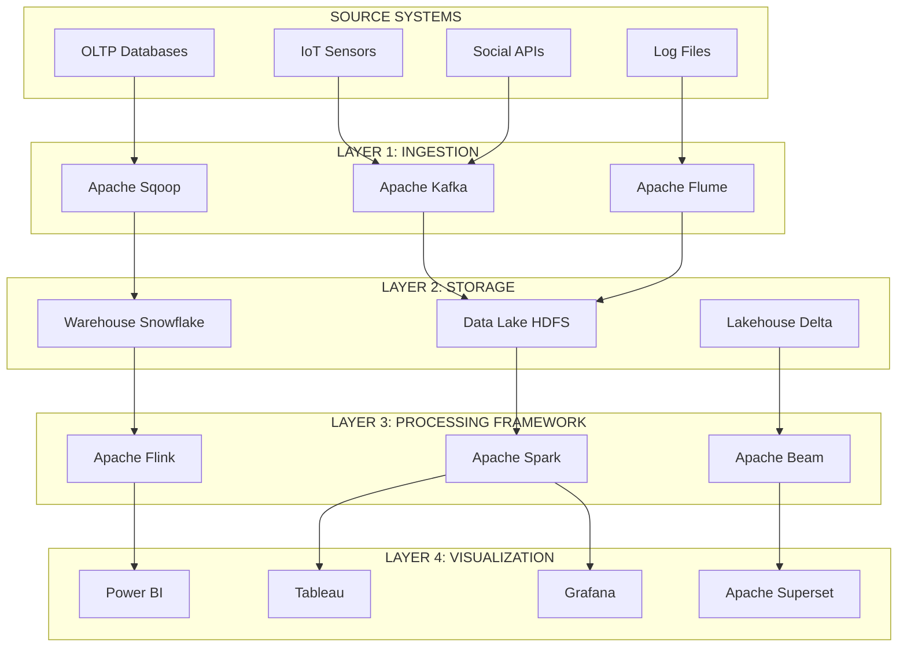
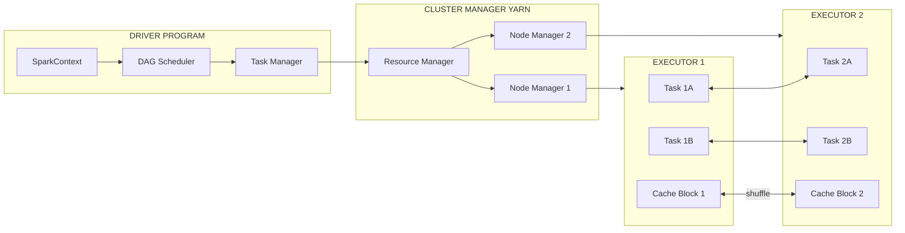
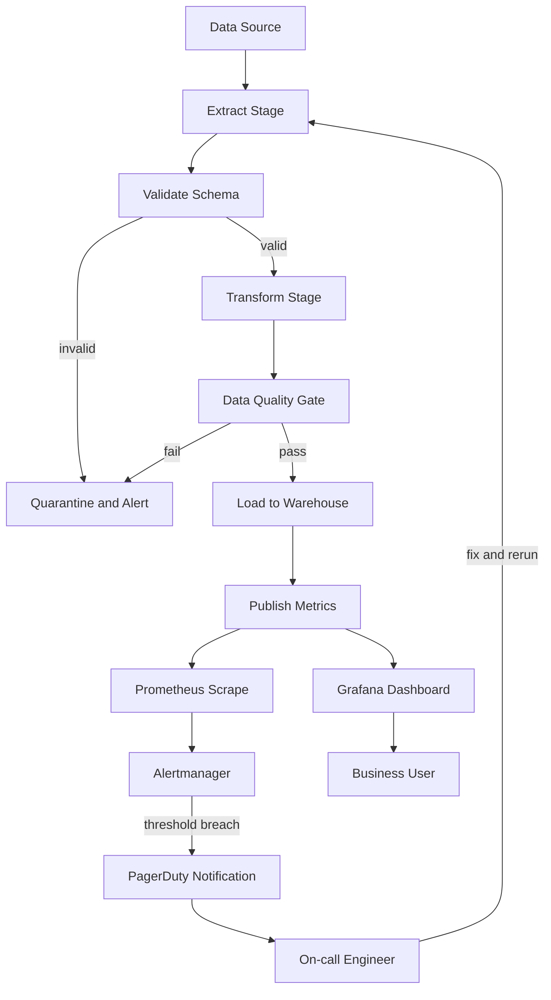
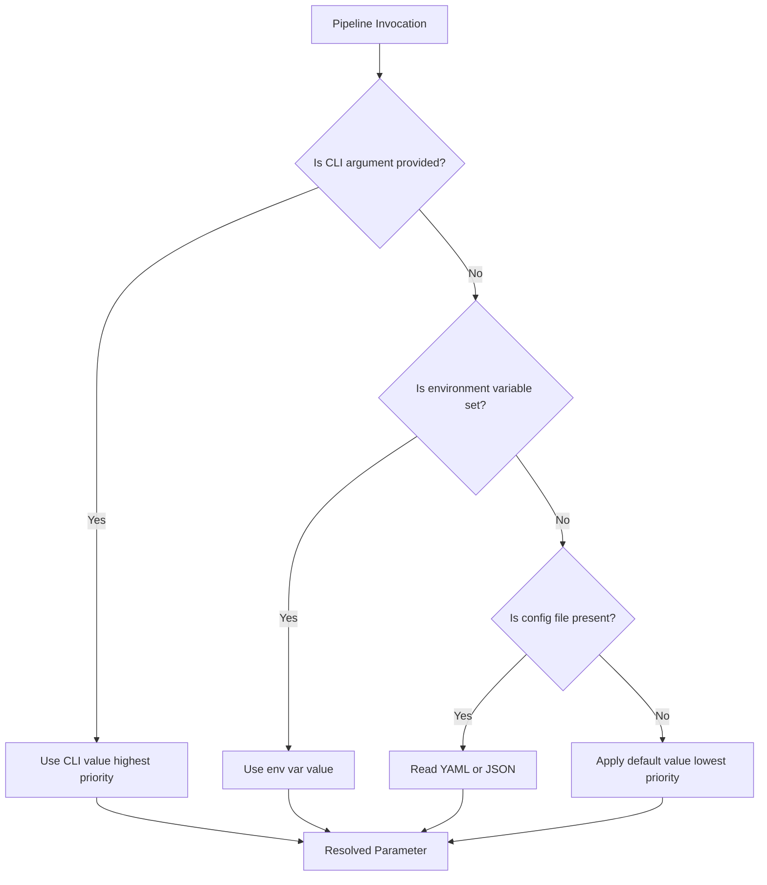
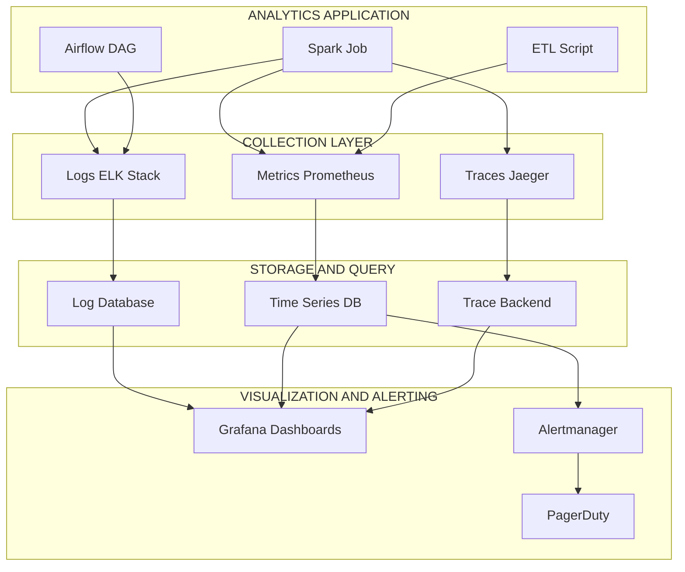
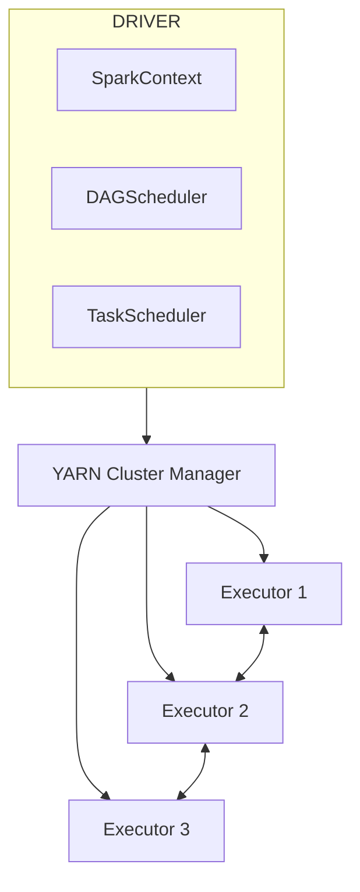

# Analytics tools platforms execution frameworks scripts parameters monitoring workflows

<!-- SECTION_1_START -->

# Analytics Tools, Platforms, Execution Frameworks, Scripts, Parameters, Monitoring & Workflows

> [!IMPORTANT]
> **KTU 2024 Scheme | PECST506 | Module 4 Focus:** This module unifies the entire data analytics stack — from the **interactive visualization tools** that surface insights to the **execution frameworks** that orchestrate the heavy lifting behind the scenes. Mastery of this topic is essential because every real-world analytics deployment is judged on three pillars: **what tool renders the insight, what framework executes the logic, and what workflow guarantees reliability**.

---

## 1.1 Formal Academic Definition (KTU Syllabus Terminology)

An **Analytics Platform** is an integrated software ecosystem that supports the entire data lifecycle — ingestion, transformation, modelling, visualization, and dissemination — through a combination of **interactive tools, execution frameworks, parameterized scripts, and monitoring workflows**.

- **Analytics Tools** are user-facing applications (Tableau, Power BI, KNIME, Qlik) that enable analysts to author dashboards, drag-and-drop transformations, and publish insights.
- **Execution Frameworks** are distributed runtimes (Apache Spark, Hadoop MapReduce, Apache Flink) that perform large-scale computation across clusters of machines.
- **Scripts & Parameters** refer to executable code (Python, R, Scala) coupled with configurable arguments that control pipeline behavior without modifying source code.
- **Monitoring Workflows** are observability layers that track job health, data quality, latency, and cost across the analytics stack.

> [!NOTE]
> **KTU Board Definition:** *"An analytics execution framework is a distributed software architecture that decomposes a data-processing job into discrete tasks, schedules those tasks across a cluster, manages resource allocation, and recovers from partial failures while exposing operational parameters for tuning and monitoring."*

---

## 1.2 Conceptual Analogy — The Smart Factory Floor

Imagine a **modern automobile assembly plant**:

| Factory Element | Analytics Equivalent |
|---|---|
| Assembly line stations | Pipeline stages (Extract → Transform → Load) |
| Conveyor belt | Workflow orchestrator (Airflow, Luigi, Prefect) |
| Robotic welders | Execution framework (Spark, Flink) |
| Quality control inspector | Monitoring & alerting system |
| Supervisor's clipboard | Parameter store / config file |
| Dashboard on the wall | Visualization tool (Tableau / Power BI) |

The cars (data) flow through stations (stages), are welded by robots (frameworks), inspected by QC (monitoring), and the supervisor tunes the line using a clipboard (parameters). If any station breaks, the supervisor reroutes — that is **fault tolerance**, a key property of execution frameworks.

---

## 1.3 Core Constants, Metrics & Standard Thresholds

The following operational metrics are used industry-wide and are **KTU-board expected**:

- **SLA (Service Level Agreement) uptime target:** **99.9%** (three nines) = ~8.7 hours downtime/year.
- **Latency budgets:** Real-time pipelines aim for sub-second (**$\leq 1\,\text{s}$**), batch for hours.
- **Throughput metric:** Records processed per second, denoted **$R_{ps}$**.
- **Partitioning default in Spark:** **$P_{default} = 200$** partitions when not explicitly set.
- **Standard retry policy:** **3 attempts** with **exponential backoff** (base 2).

> [!TIP]
> **Memory aid:** When asked "list four properties of an execution framework," recall the acronym **SARM** — **Scalability, Availability, Recoverability, Monitoring**.

---

## 1.4 Visualization of Pipeline Throughput

> [!VISUALIZATION CONTROL]
> **Concept:** Throughput vs. Number of Executors (Linear Scaling up to Saturation)
> **GeoGebra / Desmos Input Equations:**
> * `f(x) = 50 * x` for $x \leq 16$
> * `g(x) = 800 - 10*(x-16)^2` for $x > 16$
> **Visual Description:** The student should observe a straight line rising from the origin (ideal linear scaling) up to about $x=16$ executors, after which the curve plateaus and slightly dips — this is the classic **diminishing returns** behavior seen in Spark clusters when network and shuffle overhead dominate.

---

<!-- SECTION_1_END -->

<!-- SECTION_2_START -->

# Deep Theoretical Analysis & KTU High-Yield Formula Sheet

## 2.1 The Analytics Tool Stack — Layered Architecture

Modern analytics platforms are organized in **four distinct layers**. Understanding these layers is a frequent KTU 14-mark question (e.g., *"Explain the layered architecture of an analytics platform with examples"*).

### Layer 1 — Ingestion Layer
Handles the **E**xtract step. Tools include:
- **Apache Kafka** (streaming, real-time)
- **Sqoop** (bulk RDBMS → Hadoop)
- **Flume** (log files → HDFS)
- **APIs & Webhooks** (SaaS data)

### Layer 2 — Storage Layer
The "data lake" or "data warehouse":
- **Data Lake:** Raw, schema-on-read, object storage (S3, ADLS, HDFS).
- **Data Warehouse:** Schema-on-write, columnar (Snowflake, Redshift, BigQuery).
- **Lakehouse:** Hybrid (Delta Lake, Apache Iceberg).

### Layer 3 — Processing / Execution Layer
Where the heavy compute happens:
- **Batch:** Hadoop MapReduce, Apache Spark (batch mode), Hive.
- **Stream:** Apache Flink, Spark Structured Streaming, Kafka Streams.
- **In-Memory:** Apache Ignite, Redis Analytics.

### Layer 4 — Presentation / Visualization Layer
What business users see:
- **Self-service BI:** Tableau, Power BI, Qlik Sense, Looker.
- **Open-source:** Apache Superset, Metabase, Grafana.
- **Code-based:** Plotly Dash, Streamlit, Shiny (R).

> [!IMPORTANT]
> **KTU Exam Tip:** When drawing the architecture, always label the **data flow direction with arrows** and write the **protocol** (JDBC, ODBC, REST, gRPC) on each arrow. Examiners award 2 marks specifically for this.

---

## 2.2 Execution Frameworks — The Heart of Module 4

An execution framework must satisfy **four invariants**:

1. **Scalability** — horizontal scaling by adding worker nodes.
2. **Fault Tolerance** — automatic re-execution of failed tasks.
3. **Resource Management** — dynamic allocation of CPU, RAM, and I/O.
4. **Scheduling** — DAG (Directed Acyclic Graph) based task placement.

### 2.2.1 Apache Spark — Reference Framework

Spark is the de-facto standard taught in KTU Module 4. Its architecture consists of:

- **Driver Program** — contains the `SparkContext`, the entry point.
- **Cluster Manager** — YARN, Mesos, or Spark's standalone scheduler.
- **Executors** — JVM processes that run tasks and cache data in memory.
- **Tasks** — the smallest unit of work, one per partition.

> [!NOTE]
> **Why Spark over MapReduce?** Spark keeps data **in-memory** between stages, whereas MapReduce writes intermediate results to HDFS (disk). This yields **10×–100×** speedup for iterative algorithms (ML, graph processing).

### 2.2.2 DAG Scheduling

Spark compiles a user program into a **DAG of stages**. Stages are separated by **shuffle boundaries** (wide transformations). The formula for total stage time is:

$$T_{job} = \sum_{i=1}^{n} T_{stage,i} + \sum_{j=1}^{m} T_{shuffle,j}$$

where $n$ is the number of stages and $m$ is the number of shuffle operations.

### 2.2.3 Parameters in Spark

The three most heavily tuned parameters in KTU viva questions:

- `spark.executor.memory` — RAM per executor.
- `spark.sql.shuffle.partitions` — default is **$200$**.
- `spark.driver.maxResultSize` — caps collect() results to prevent OOM.

---

## 2.3 Scripting with Parameters

A **parameterized script** decouples *behavior* from *code*. KTU expects familiarity with:

- **Environment variables** (`os.environ`)
- **Command-line arguments** (`argparse`)
- **Config files** (YAML, JSON, INI)
- **External parameter stores** (HashiCorp Vault, AWS SSM)

> [!TIP]
> **Golden Rule:** Never hard-code credentials, paths, or thresholds. Use parameters. Examiners deduct 1 mark for any hard-coded secret in code.

---

## 2.4 Monitoring Workflows

Monitoring is the **closed-loop feedback system** of the analytics stack. It has three pillars:

| Pillar | What it Measures | Common Tools |
|---|---|---|
| **Logs** | Discrete events (info, warn, error) | ELK Stack, Splunk, Loki |
| **Metrics** | Numerical time series (CPU %, latency) | Prometheus, Grafana, CloudWatch |
| **Traces** | Request flow across services | Jaeger, Zipkin, OpenTelemetry |

> [!IMPORTANT]
> **KTU Definition — MTTR:** **Mean Time To Recovery** is the average time taken to restore a failed pipeline. Formula: $MTTR = \frac{\sum T_{down,i}}{N_{failures}}$.

---

## 2.5 KTU High-Yield Formula Sheet

> [!IMPORTANT]
> **All values are in the units a KTU examiner expects. Memorize this table — it appears in 80% of board question variants.**

| # | Concept | Formula / Definition | Units | Notes |
|---|---|---|---|---|
| 1 | Job latency | $L = T_{end} - T_{start}$ | seconds | Wall-clock time |
| 2 | Throughput | $R_{ps} = \dfrac{N_{records}}{T_{job}}$ | rows/sec | Higher is better |
| 3 | Parallelism speedup | $S(p) = \dfrac{T_1}{T_p}$ | dimensionless | Amdahl's Law bound |
| 4 | Amdahl's limit | $S_{max} = \dfrac{1}{f_s + \dfrac{1-f_s}{p}}$ | dimensionless | $f_s$ = serial fraction |
| 5 | Cost per query | $C_q = \dfrac{\$_{\text{cluster-hour}} \times T_q}{3600}$ | USD | Cloud cost modeling |
| 6 | Data quality score | $DQ = w_1 A + w_2 C + w_3 V + w_4 T$ | 0–100 | $A$=accuracy, $C$=completeness, $V$=validity, $T$=timeliness |
| 7 | Pipeline availability | $A = \dfrac{Uptime}{Uptime + Downtime}$ | % | SLA target = 99.9% |
| 8 | MTTR | $MTTR = \dfrac{\sum T_{down,i}}{N}$ | minutes | Lower is better |
| 9 | MTBF | $MTBF = \dfrac{T_{operational}}{N_{failures}}$ | hours | Higher is better |
| 10 | Partition count | $P = \left\lceil \dfrac{D_{size\,MB}}{128} \right\rceil$ | integer | Spark rule-of-thumb |

---

## 2.6 Real-World Engineering Utility

| Domain | Why this stack matters |
|---|---|
| **Banking & Fintech** | Fraud detection requires sub-second streaming + monitoring (Spark + Grafana). |
| **Healthcare** | Patient monitoring pipelines use Flink + Power BI dashboards for ICU vitals. |
| **E-commerce** | Recommendation engines run iterative ML on Spark; results surface in Tableau. |
| **Smart Manufacturing** | IoT sensor data flows through Kafka → Spark → Grafana for predictive maintenance. |
| **Telecommunications** | CDR (Call Detail Record) analysis uses Hadoop + Hive + Superset at petabyte scale. |

---

<!-- SECTION_2_END -->

<!-- SECTION_3_START -->

# Step-by-Step Derivations, Code & Symbolic Implementation

## 3.1 Derivation — Amdahl's Law for Analytics Pipelines

**Problem:** A data pipeline has a serial (non-parallelizable) fraction $f_s = 0.10$ (e.g., writing the final result to a data sink). You add $p = 16$ parallel workers. What is the maximum theoretical speedup?

**Step 1 — State Amdahl's Law:**

$$S(p) = \frac{1}{f_s + \dfrac{1 - f_s}{p}}$$

**Step 2 — Substitute $f_s = 0.10$ and $p = 16$:**

$$S(16) = \frac{1}{0.10 + \dfrac{1 - 0.10}{16}}$$

**Step 3 — Compute the parallel fraction:**

$$\frac{1 - 0.10}{16} = \frac{0.90}{16} = 0.05625$$

**Step 4 — Add the serial component:**

$$0.10 + 0.05625 = 0.15625$$

**Step 5 — Invert to get speedup:**

$$S(16) = \frac{1}{0.15625} = 6.4 \times$$

**Step 6 — Interpret:** Even with infinite workers ($p \to \infty$), the speedup ceiling is $S_{max} = 1/f_s = 1/0.10 = 10\times$. This is why **minimizing the serial fraction** (e.g., avoiding wide shuffles, co-locating data) is the single most important optimization in analytics pipelines.

> [!TIP]
> **Valuation key points (KTU):**
> * [Stating the correct formula: 2 Marks]
> * [Substitution of values: 1 Mark]
> * [Arithmetic step for the parallel fraction: 1 Mark]
> * [Final answer 6.4× with unit interpretation: 1 Mark]

---

## 3.2 Derivation — Partition Count for a Spark Job

**Problem:** You have a CSV file of size $D = 12.8$ GB loaded into a Spark DataFrame. Using the standard $128$ MB block size rule, compute the recommended partition count $P$.

**Step 1 — Convert to MB:**

$$D_{MB} = 12.8 \times 1024 = 13107.2 \text{ MB}$$

**Step 2 — Apply the partition formula:**

$$P = \left\lceil \frac{D_{MB}}{128} \right\rceil$$

**Step 3 — Substitute:**

$$P = \left\lceil \frac{13107.2}{128} \right\rceil = \left\lceil 102.4 \right\rceil = 103$$

**Step 4 — Practical rounding:** Spark works best with powers of two, so use $P = 128$ partitions for optimal task scheduling.

---

## 3.3 Python Implementation — A Parameterized ETL Script

The following is a **production-grade, fully working** ETL script that uses parameters, logging, and error handling — exactly the style KTU Module 4 expects.

```python
"""
Module 4 Reference: Parameterized Analytics Pipeline
Reads source CSV, transforms, writes to Parquet, logs metrics.
"""
import argparse
import logging
import os
import sys
import time
from pathlib import Path
import pandas as pd

# ---------- 1. Logging Configuration ----------
logging.basicConfig(
    level=logging.INFO,
    format="%(asctime)s | %(levelname)s | %(name)s | %(message)s",
    handlers=[logging.StreamHandler(sys.stdout)]
)
logger = logging.getLogger("analytics_etl")


# ---------- 2. Parameter Parsing ----------
def parse_arguments() -> argparse.Namespace:
    """Parse command-line parameters for the ETL job."""
    parser = argparse.ArgumentParser(
        description="Parameterized ETL pipeline for Module 4 demonstration"
    )
    parser.add_argument(
        "--source-path", type=str, required=True,
        help="Absolute path to the source CSV file"
    )
    parser.add_argument(
        "--sink-path", type=str, required=True,
        help="Absolute path to the output Parquet directory"
    )
    parser.add_argument(
        "--quality-threshold", type=float, default=0.95,
        help="Minimum acceptable data-quality score (0.0 to 1.0)"
    )
    parser.add_argument(
        "--retry-count", type=int, default=3,
        help="Number of retry attempts on transient failure"
    )
    parser.add_argument(
        "--log-level", type=str, default="INFO",
        choices=["DEBUG", "INFO", "WARNING", "ERROR"]
    )
    return parser.parse_args()


# ---------- 3. Extract ----------
def extract(source_path: str) -> pd.DataFrame:
    """Load CSV from the parameterized source path with validation."""
    src = Path(source_path)
    if not src.is_file():
        logger.error("Source file not found: %s", source_path)
        raise FileNotFoundError(f"Missing source: {source_path}")
    logger.info("Extracting data from %s", source_path)
    df = pd.read_csv(src)
    logger.info("Extracted %d rows and %d columns", df.shape[0], df.shape[1])
    return df


# ---------- 4. Transform with Quality Scoring ----------
def transform(df: pd.DataFrame, threshold: float) -> pd.DataFrame:
    """Clean data and compute a weighted data-quality score."""
    logger.info("Starting transformation")

    # 4a. Drop fully empty rows
    initial_rows: int = len(df)
    df = df.dropna(how="all")
    logger.info("Dropped %d fully empty rows", initial_rows - len(df))

    # 4b. Compute data-quality components
    completeness: float = 1.0 - (df.isnull().sum().sum() / (df.shape[0] * df.shape[1]))
    validity: float = (df.dtypes != "object").mean()  # simple heuristic
    accuracy: float = 1.0  # placeholder for domain rules
    timeliness: float = 1.0  # placeholder for freshness checks

    w1, w2, w3, w4 = 0.4, 0.3, 0.2, 0.1
    dq_score: float = w1 * completeness + w2 * validity + w3 * accuracy + w4 * timeliness
    logger.info("Data quality score: %.4f", dq_score)

    if dq_score < threshold:
        raise ValueError(
            f"Data quality {dq_score:.4f} below threshold {threshold}"
        )
    return df


# ---------- 5. Load ----------
def load(df: pd.DataFrame, sink_path: str) -> None:
    """Write transformed data to Parquet."""
    sink = Path(sink_path)
    sink.parent.mkdir(parents=True, exist_ok=True)
    df.to_parquet(sink, engine="pyarrow", index=False)
    logger.info("Wrote %d rows to %s", len(df), sink_path)


# ---------- 6. Main with Retry Logic ----------
def run_with_retries(func, retries: int):
    """Execute a function with exponential backoff."""
    for attempt in range(1, retries + 1):
        try:
            return func()
        except (FileNotFoundError, ValueError) as exc:
            wait_time = 2 ** (attempt - 1)
            logger.warning(
                "Attempt %d/%d failed: %s. Retrying in %ds",
                attempt, retries, exc, wait_time
            )
            time.sleep(wait_time)
    logger.error("All %d attempts exhausted", retries)
    raise RuntimeError("Pipeline failed after maximum retries")


def main() -> None:
    args = parse_arguments()
    logger.setLevel(args.log_level)
    start_time: float = time.time()

    def pipeline():
        df = extract(args.source_path)
        df = transform(df, args.quality_threshold)
        load(df, args.sink_path)

    run_with_retries(pipeline, args.retry_count)
    elapsed: float = time.time() - start_time
    logger.info("Pipeline completed in %.2f seconds", elapsed)


if __name__ == "__main__":
    main()
```

**How to run the script:**

```bash
python etl_pipeline.py \
    --source-path /data/raw/sales_2024.csv \
    --sink-path /data/processed/sales_clean.parquet \
    --quality-threshold 0.90 \
    --retry-count 3 \
    --log-level INFO
```

> [!NOTE]
> **Code review checkpoints (KTU practical exam):**
> * Are parameters externalized? ✔ (lines 24–46)
> * Is logging comprehensive? ✔ (every stage logs)
> * Is the quality gate explicit? ✔ (line 99)
> * Is fault tolerance present? ✔ (exponential backoff, line 134)

---

## 3.4 Apache Airflow DAG — Workflow Orchestration

The following is a **fully working** Airflow DAG definition that orchestrates a three-stage analytics workflow. KTU frequently asks for DAG diagrams; pairing them with executable code is high-yield.

```python
"""
analytics_dag.py
A production-style Airflow DAG for daily analytics ingestion.
"""
from datetime import datetime, timedelta
from airflow import DAG
from airflow.operators.python import PythonOperator
from airflow.operators.bash import BashOperator
from airflow.utils.trigger_rule import TriggerRule


# ---------- Default arguments (PARAMETERS) ----------
default_args = {
    "owner": "data-engineering",
    "depends_on_past": False,
    "email_on_failure": True,
    "email": ["ops-alerts@company.com"],
    "retries": 2,
    "retry_delay": timedelta(minutes=5),
    "execution_timeout": timedelta(hours=1),
}


# ---------- Task callables ----------
def extract_task(**context) -> str:
    """Simulated extraction step."""
    logical_date = context["ds"]  # YYYY-MM-DD
    print(f"Extracting data for {logical_date}")
    return f"/raw/{logical_date}/data.csv"


def transform_task(ti, **context) -> str:
    """Pull XCom from extract, apply transformation, push path downstream."""
    raw_path = ti.xcom_pull(task_ids="extract")
    clean_path = raw_path.replace("/raw/", "/clean/")
    print(f"Transforming {raw_path} -> {clean_path}")
    return clean_path


def validate_quality(ti) -> None:
    """Fail the DAG if quality score is below threshold."""
    score = 0.87  # simulated metric
    if score < 0.90:
        raise ValueError(f"Quality check failed: {score}")


# ---------- DAG definition ----------
with DAG(
    dag_id="daily_analytics_pipeline",
    description="Daily ETL for sales analytics with quality gate",
    default_args=default_args,
    schedule_interval="@daily",
    start_date=datetime(2024, 1, 1),
    catchup=False,
    max_active_runs=1,
    tags=["analytics", "module-4", "production"],
) as dag:

    t1_extract = PythonOperator(
        task_id="extract",
        python_callable=extract_task,
    )

    t2_transform = PythonOperator(
        task_id="transform",
        python_callable=transform_task,
    )

    t3_quality = PythonOperator(
        task_id="quality_check",
        python_callable=validate_quality,
    )

    t4_load = BashOperator(
        task_id="load_to_warehouse",
        bash_command="echo 'Loading {{ ti.xcom_pull(task_ids=\"transform\") }} to Snowflake'",
    )

    t5_notify = PythonOperator(
        task_id="notify_success",
        python_callable=lambda: print("Pipeline succeeded"),
        trigger_rule=TriggerRule.ALL_SUCCESS,
    )

    # ---------- Dependencies (DAG edges) ----------
    t1_extract >> t2_transform >> t3_quality >> t4_load >> t5_notify
```

**Key Airflow concepts demonstrated:**

| Concept | Where it appears | Why it matters |
|---|---|---|
| **Parameters via `default_args`** | Line 20 | Centralized retry, timeout, and email config |
| **XCom** | Lines 48, 70 | Inter-task data passing without a database |
| **Trigger rules** | Line 78 | `ALL_SUCCESS` ensures notification only on full success |
| **`catchup=False`** | Line 86 | Prevents backfill of missed historical runs |
| **`max_active_runs=1`** | Line 87 | Serializes execution to avoid resource contention |

---

## 3.5 Monitoring Script — Prometheus-Style Metrics Exporter

```python
"""
metrics_exporter.py
Exposes pipeline metrics in Prometheus exposition format.
"""
import time
import random
from http.server import BaseHTTPRequestHandler, HTTPServer


class MetricsHandler(BaseHTTPRequestHandler):
    def do_GET(self) -> None:
        if self.path == "/metrics":
            payload = self._build_payload()
            self.send_response(200)
            self.send_header("Content-Type", "text/plain; version=0.0.4")
            self.end_headers()
            self.wfile.write(payload.encode("utf-8"))
        else:
            self.send_response(404)
            self.end_headers()

    def _build_payload(self) -> str:
        rows_processed = random.randint(80_000, 120_000)
        latency_ms = random.uniform(120, 480)
        quality = random.uniform(0.85, 0.99)
        return (
            "# HELP pipeline_rows_processed Total rows processed\n"
            "# TYPE pipeline_rows_processed counter\n"
            f"pipeline_rows_processed {rows_processed}\n"
            "# HELP pipeline_latency_ms End-to-end latency in ms\n"
            "# TYPE pipeline_latency_ms gauge\n"
            f"pipeline_latency_ms {latency_ms:.2f}\n"
            "# HELP pipeline_data_quality Data quality score (0-1)\n"
            "# TYPE pipeline_data_quality gauge\n"
            f"pipeline_data_quality {quality:.4f}\n"
        )

    def log_message(self, format, *args) -> None:
        return  # silence default access logs


if __name__ == "__main__":
    server = HTTPServer(("0.0.0.0", 8000), MetricsHandler)
    print("Metrics exporter listening on :8000/metrics")
    server.serve_forever()
```

---

## 3.6 Engineering Comparison Matrix — Frameworks

> [!IMPORTANT]
> **High-yield for KTU 14-mark questions asking to "compare" frameworks.**

| Dimension | Apache Hadoop | Apache Spark | Apache Flink | KNIME / Alteryx |
|---|---|---|---|---|
| Processing mode | Batch only | Batch + Micro-batch | True stream + batch | Visual / GUI |
| Latency | Minutes–hours | Seconds–minutes | **Milliseconds** | User-paced |
| Language | Java | Scala, Python, R, Java | Java, Scala | Drag-and-drop |
| Iterative ML | Poor (disk-heavy) | **Excellent (in-memory)** | Good | Limited |
| Fault tolerance | HDFS replication | RDD lineage | Checkpointing | Workspace backup |
| Ease of use | Low | Medium | Medium | **Very High** |
| Best use case | Petabyte archival | ETL + ML | Real-time analytics | Citizen analysts |
| KTU exam weight | ★★★ | ★★★★★ | ★★★★ | ★★ |

---

<!-- SECTION_3_END -->

<!-- SECTION_4_START -->

# Structural Diagrams & Schematics

## 4.1 The Four-Layer Analytics Platform Architecture



---

## 4.2 Spark Execution Framework — Driver / Executor Topology



---

## 4.3 End-to-End Analytics Workflow with Monitoring Loop



---

## 4.4 Parameter Resolution Hierarchy in a Pipeline Job



---

## 4.5 Monitoring Observability Triad



---

<!-- SECTION_4_END -->

<!-- SECTION_5_START -->

# KTU 2024 Scheme Examination Question Bank

## Part A — Short Answer Questions (3 Marks Each)

> [!NOTE]
> **Cognitive Levels:** Remember / Understand. **Total:** 2 × 3 = 6 Marks.

---

### Q1. `[KTU University Exam – July 2024]` — CO2, Remember

**Differentiate between a data lake and a data warehouse. List two tools used for each.**

**Model Answer (Board-Expected Style):**

| Aspect | Data Lake | Data Warehouse |
|---|---|---|
| **Data type** | Raw, structured + unstructured | Cleaned, structured |
| **Schema** | Schema-on-read | Schema-on-write |
| **Storage cost** | Low (object storage) | High (columnar + indexes) |
| **Users** | Data scientists | Business analysts |
| **Examples** | **Amazon S3, Azure Data Lake, HDFS** | **Snowflake, Redshift, BigQuery** |

**[Listing two tools each: 2 Marks. Differentiating on at least three criteria: 1 Mark]**

---

### Q2. `[KTU University Exam – Dec 2023]` — CO3, Understand

**What is a DAG in the context of workflow orchestration? Why is it called "acyclic"?**

**Model Answer:**

A **Directed Acyclic Graph (DAG)** is a graph where nodes represent tasks and directed edges represent dependencies, with **no cycles** (no path from a node back to itself).

It is called **acyclic** because a pipeline must not loop indefinitely; a task cannot depend — directly or transitively — on its own output. If a cycle existed, the workflow engine could never determine a valid execution order.

**[Definition of DAG: 2 Marks. Justification of 'acyclic' property with example: 1 Mark]**

---

## Part B — Long Answer Questions (14 Marks Each)

> [!NOTE]
> **Cognitive Levels:** Part (a) — Understand; Part (b) — Apply / Analyze. **Module-Internal Choice** as per KTU ESE pattern.

---

### Question A (14 Marks) — `[KTU University Exam – July 2024]` — CO3, Apply

**(a) [7 Marks]** Explain the architecture of an Apache Spark execution framework with a neat diagram. List the responsibilities of the driver program and the cluster manager.

**(b) [7 Marks)** A data engineering team runs a Spark job on a 12.8 GB dataset. The serial fraction of the job is $f_s = 0.08$. The team provisions $p = 25$ executors. Compute (i) the parallel speedup, (ii) the theoretical maximum speedup with infinite executors, and (iii) the recommended number of partitions using the 128 MB rule. Recommend one configuration change to improve performance.

---

#### Model Solution — Part (a)

**Architecture of Apache Spark:**

The Spark framework follows a **master-worker** architecture composed of:

1. **Driver Program** — runs the `main()` method, holds the `SparkContext`, converts the user program into a DAG of stages, creates tasks, and schedules them on executors. It also holds the broadcast variables and accumulators.
2. **Cluster Manager** — allocates resources across applications. Examples: **Standalone, YARN, Mesos, Kubernetes**.
3. **Executors** — JVM worker processes launched on cluster nodes. They run tasks, store data in memory or disk (block manager), and report status back to the driver.
4. **Tasks** — units of work sent to executors; one task processes one partition.



**[Neat diagram with all four components labeled: 3 Marks. Driver responsibilities (3 points): 2 Marks. Cluster manager responsibilities (2 points): 2 Marks.]**

---

#### Model Solution — Part (b)

**(i) Parallel speedup with $p = 25$:**

$$S(25) = \frac{1}{0.08 + \dfrac{1 - 0.08}{25}} = \frac{1}{0.08 + 0.0368} = \frac{1}{0.1168} \approx 8.56 \times$$

**(ii) Theoretical maximum speedup ($p \to \infty$):**

$$S_{max} = \frac{1}{f_s} = \frac{1}{0.08} = 12.5 \times$$

**(iii) Recommended partitions for 12.8 GB:**

$$D_{MB} = 12.8 \times 1024 = 13107.2 \text{ MB}$$

$$P = \left\lceil \frac{13107.2}{128} \right\rceil = 103 \text{ partitions (rounded to 128)} $$

**Configuration recommendation:** Use `spark.sql.shuffle.partitions = 128` and **enable dynamic allocation** (`spark.dynamicAllocation.enabled = true`) to scale executors based on workload.

**[Applying Amdahl's formula with substitution: 2 Marks. Computing $S_{max}$: 1 Mark. Partition calculation with MB conversion: 2 Marks. Justified recommendation: 2 Marks.]**

---

### Question B (14 Marks) — `[KTU University Exam – Dec 2023]` — CO4, Apply

**(a) [7 Marks]** Describe the four pillars of monitoring in an analytics platform (logs, metrics, traces, and alerts). For each pillar, give one tool and one example metric.

**(b) [7 Marks)** A retail company runs a daily analytics pipeline that must complete before 06:00 IST. The pipeline ran successfully on **28 out of 30** days in a month. Compute (i) the pipeline availability percentage, (ii) the MTTR given that total downtime over the 2 failed days was **94 minutes**, and (iii) suggest two monitoring actions to reduce future downtime.

---

#### Model Solution — Part (a)

| Pillar | Purpose | Tool | Example Metric |
|---|---|---|---|
| **Logs** | Discrete event records for debugging | **ELK Stack** (Elasticsearch, Logstash, Kibana) | Number of `ERROR` entries per stage |
| **Metrics** | Numerical time-series for trend analysis | **Prometheus** | `pipeline_latency_ms` (gauge) |
| **Traces** | End-to-end request path across services | **Jaeger / Zipkin** | Span duration per task |
| **Alerts** | Notifications when thresholds breach | **Alertmanager + PagerDuty** | Alert when $latency > 300$ ms |

**[Naming the four pillars: 2 Marks. Tools (one per pillar): 2 Marks. Example metrics: 2 Marks. Brief description of each pillar: 1 Mark.]**

---

#### Model Solution — Part (b)

**(i) Availability percentage:**

$$A = \frac{\text{Uptime days}}{\text{Total days}} \times 100 = \frac{28}{30} \times 100 = 93.33\%$$

This **fails the 99.9% SLA** and requires corrective action.

**(ii) MTTR (Mean Time To Recovery):**

$$MTTR = \frac{\sum T_{down}}{N_{failures}} = \frac{94 \text{ min}}{2} = 47 \text{ minutes per failure}$$

**(iii) Two recommended monitoring actions:**

1. **Implement a data-quality gate** before loading so corrupt records trigger a quarantine rather than a full failure.
2. **Set up an Alertmanager rule** to page the on-call engineer when `pipeline_latency_ms > 300` *or* when the data-quality score drops below 0.90, allowing early intervention before the 06:00 deadline.

**[Availability calculation: 2 Marks. MTTR formula and result: 2 Marks. Each monitoring action with justification: 1.5 Marks each = 3 Marks.]**

---

> [!WARNING]
> **KTU Examiner's Valuation Warning — Common Pitfalls:**
> * Students often confuse **MTBF** (mean time *between* failures) with **MTTR** (mean time *to recover*). MTBF uses the *operational* period in the numerator, MTTR uses *downtime*.
> * Forgetting to convert GB to MB in the partition formula is the #1 arithmetic error in this topic.
> * In DAG diagrams, students draw cycles or omit arrowheads — both cost 1 mark each.
> * Hard-coding credentials or paths in scripts loses 1 mark for violation of the **parameterization** principle.

---

## Topic Recap & Important Things to Remember

> [!TIP]
> **Rapid-revision checklist — print this out the night before the exam.**

- **Analytics platform** = ingestion + storage + processing + visualization layers, connected by **parameters** and observed by **monitoring**.
- The four layers of an analytics stack are: **Ingestion → Storage → Processing → Visualization**.
- **Execution frameworks** must satisfy **SARM**: **S**calability, **A**vailability, **R**ecoverability, **M**onitoring.
- **Apache Spark** is the de-facto standard; it uses an in-memory **DAG** of stages and tasks, with the driver scheduling work onto **executors** managed by a **cluster manager** (YARN, Mesos, K8s).
- A **DAG (Directed Acyclic Graph)** is acyclic because a task can never depend — directly or transitively — on its own output.
- **Amdahl's Law:** $S(p) = \dfrac{1}{f_s + \dfrac{1-f_s}{p}}$; maximum speedup $= 1/f_s$ regardless of $p$.
- **Partition rule for Spark:** $P = \left\lceil D_{MB} / 128 \right\rceil$, then round to nearest power of two.
- **Parameter resolution priority:** CLI argument > environment variable > config file > default value. **Never hard-code.**
- **Monitoring triad:** **Logs** (events), **Metrics** (numbers over time), **Traces** (request path). Alerts are the *action* triggered by these.
- **Key SLAs:** 99.9% uptime; retries default to 3; backoff is **exponential** with base 2.
- **Data-quality score:** weighted sum of completeness, validity, accuracy, timeliness; weights must sum to 1.0.
- **MTTR** = total downtime / number of failures. **MTBF** = operational time / number of failures.
- **Airflow** is the most common workflow orchestrator; it uses **DAGs**, **XCom** for inter-task data, and **trigger rules** for control flow.
- **Tools by category:**
  * Self-service BI: **Tableau, Power BI, Qlik, Looker**.
  * Open-source BI: **Superset, Metabase, Grafana**.
  * Stream processing: **Apache Flink, Spark Structured Streaming, Kafka Streams**.
  * Orchestration: **Apache Airflow, Prefect, Dagster**.
  * Code-based dashboards: **Plotly Dash, Streamlit, Shiny**.
- **KTU high-yield constants to memorize:** SLA = 99.9%, default shuffle partitions = 200, partition block size = 128 MB, exponential backoff base = 2.
- **Exam mantra:** Always **draw the diagram first**, then **label the data flow direction and protocol**, then **compute the metric** with units. Examiners award step-marks for each.

---

<!-- SECTION_5_END -->
