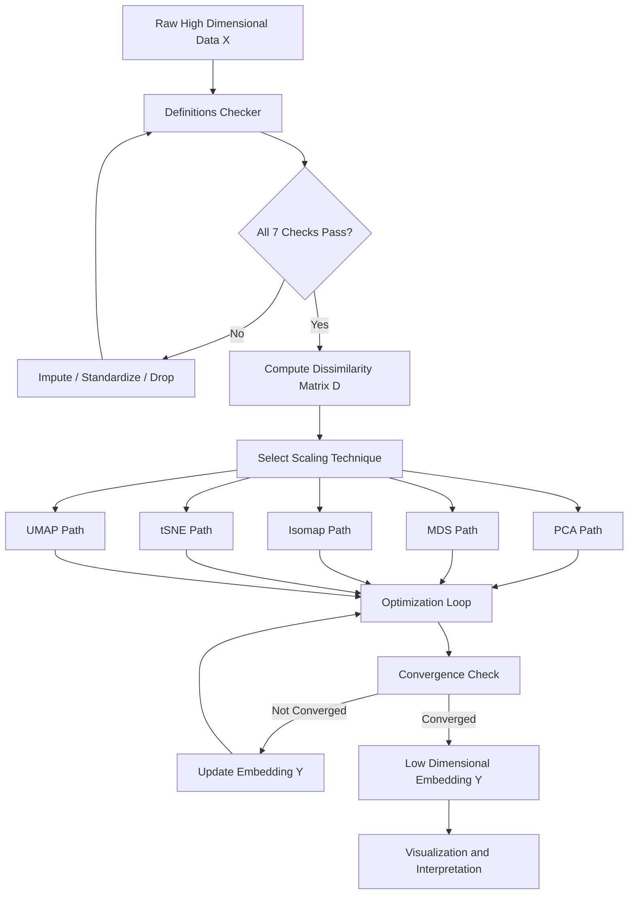
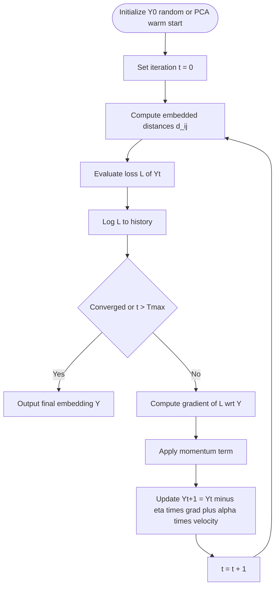
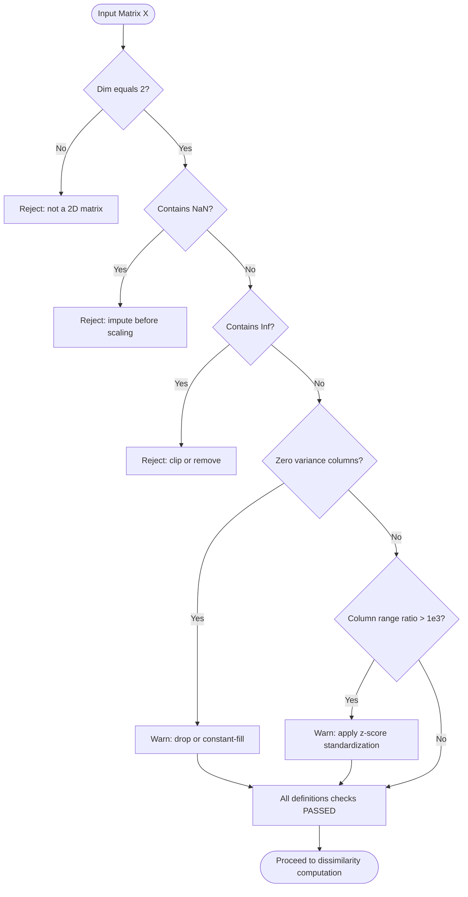
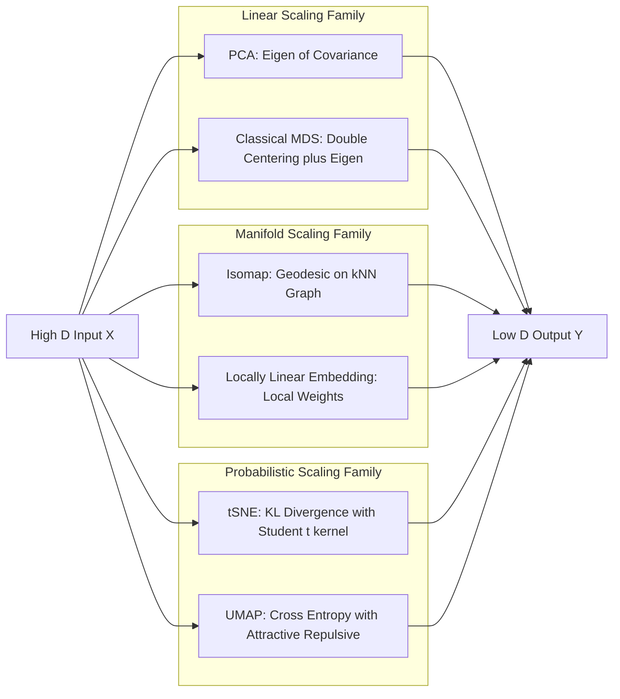

# High dimensional scaling techniques profiles optimization loops definitions checking

<!-- SECTION_1_START -->
# High-Dimensional Scaling Techniques — Core Technical Definition & Intuitive Overview

> [!IMPORTANT]
> **KTU 2024 Syllabus Anchor (PECST506 — Module 4):** High-Dimensional Scaling (HDS) techniques are a family of statistical and machine learning methods designed to project, embed, or visualize data residing in high-dimensional feature spaces (typically $D \geq 3$) into a low-dimensional target space (usually $d = 1, 2,$ or $3$) while preserving specific structural properties of the original data.

## Formal Definition

**High-Dimensional Scaling** is a non-linear / linear transformation paradigm where the objective is to find a configuration $Y \in \mathbb{R}^{n \times d}$ such that:

$$\mathcal{L}(Y) = \min_{Y} \; \sum_{i < j} w_{ij} \; \phi\!\left(\delta_{ij}, \; d_{ij}(Y)\right)$$

where:
- $\delta_{ij}$ = the **dissimilarity** (distance) in the original high-dimensional space between points $i$ and $j$.
- $d_{ij}(Y) = \| y_i - y_j \|_2$ = the **Euclidean distance** in the embedded low-dimensional space.
- $w_{ij}$ = the **weighting coefficient** controlling the contribution of each pair.
- $\phi(\cdot)$ = a **loss / stress function** that penalizes distortions between original and embedded distances.

> [!NOTE]
> **Profiles** in the context of scaling refer to the row-wise characteristic vectors of a data matrix $X \in \mathbb{R}^{n \times p}$ — each profile encapsulates the coordinate signature of a single observation across all $p$ measured variables. Scaling techniques operate on these profiles to compute a re-organized coordinate set $Y$.

## Conceptual Analogy — The "City Map Distortion" Intuition

Imagine you have a globe (3-D Earth with mountains, valleys, and curvature) and you want to flatten it onto a 2-D paper map. You **cannot** preserve every distance perfectly — the sphere is curved, the paper is flat. A **cartographer's projection** sacrifices some accuracy (e.g., Greenland looks huge on Mercator) to keep the **overall structure** recognizable.

| Original World | Scaling World | Mapping |
|---|---|---|
| 3-D Globe | $p$-dimensional data matrix $X$ | **High-dimensional space** |
| 2-D Paper map | $d$-dimensional embedding $Y$ | **Low-dimensional embedding** |
| Choice of projection (Mercator, Peters) | MDS, PCA, t-SNE, Isomap | **Scaling algorithm** |
| Continent positions | Pairwise distances $\delta_{ij}$ | **Dissimilarity matrix** |
| Distortion artifacts | Stress $\mathcal{L}(Y)$ | **Loss function** |

> [!TIP]
> Think of each **scaling technique as a different "projection rule"** — PCA preserves global variance, MDS preserves global distances, t-SNE preserves local neighborhood structure, Isomap preserves geodesic manifold distances.

## Geometric Intuition — What is "High" Dimensional?

A dataset is considered **high-dimensional** when $p$ (number of features) is large enough that:
1. The **curse of dimensionality** strikes (data becomes sparse, distances converge).
2. Direct visualization in 2-D/3-D is impossible.
3. Many features carry **redundant** or **correlated** information.

**Threshold metrics used in industry:**
- $p > 50$ → moderately high-dimensional (gene expression, financial tickers).
- $p > 1000$ → very high-dimensional (text TF-IDF, image pixels, omics data).
- $p \gg n$ → the "$p$ larger than $n$" regime (genomics, recommendation systems).

> [!VISUALIZATION CONTROL]
> **Concept:** Distortion of pairwise distances under PCA vs t-SNE projection of a 3-D Swiss Roll.
> **GeoGebra / Desmos Input Equations:**
> * $X_1(t,s) = t \cos(t)$, $X_2(t,s) = s$, $X_3(t,s) = t \sin(t)$ with $t \in [3\pi/2, \; 9\pi/2], \; s \in [0, 21]$
> * Embedding target: $Y \in \mathbb{R}^{n \times 2}$ with PCA on raw $X$, t-SNE on local neighborhoods.
> **Visual Description:** Students should observe the Swiss Roll's spiral geometry. PCA will produce a folded/smeared 2-D cloud (loses manifold curvature), while t-SNE / Isomap will unroll the spiral preserving local neighborhood clusters.

<!-- SECTION_1_END -->

<!-- SECTION_2_START -->
# Deep Theoretical Analysis & KTU High-Yield Formula Sheet

## 1. The Family of High-Dimensional Scaling Techniques

| Technique | Acronym | Preserves | Linearity | Typical Use Case |
|---|---|---|---|---|
| **Principal Component Analysis** | PCA | Global variance | Linear | Signal compression, de-noising |
| **Multidimensional Scaling** | MDS | Pairwise distances | Linear (metric) / Non-linear (non-metric) | Psychology, market research |
| **Isometric Feature Mapping** | Isomap | Geodesic distances on a manifold | Non-linear | Manifold unfolding (Swiss Roll) |
| **t-Distributed Stochastic Neighbor Embedding** | t-SNE | Local probability neighborhoods | Non-linear | Single-cell RNA-seq, NLP embeddings |
| **Uniform Manifold Approximation and Projection** | UMAP | Topological / fuzzy simplicial structure | Non-linear | General-purpose modern alternative to t-SNE |

## 2. The Optimization Loop — Universal Skeleton

Every scaling technique follows the same **5-stage iterative loop**:

1. **Input Stage:** Receive $X \in \mathbb{R}^{n \times p}$, target dimension $d$, hyperparameters.
2. **Dissimilarity Computation:** Build matrix $D = [\delta_{ij}]$ (Euclidean, geodesic, or probability-based).
3. **Initialization:** Set $Y^{(0)} \in \mathbb{R}^{n \times d}$ randomly (or via PCA warm-start).
4. **Iterative Update:** For $t = 0, 1, 2, \ldots, T$:
    - Compute embedded distances $d_{ij}(Y^{(t)})$.
    - Evaluate stress $\mathcal{L}(Y^{(t)})$.
    - Update $Y^{(t+1)} \leftarrow Y^{(t)} - \eta^{(t)} \nabla_Y \mathcal{L}(Y^{(t)})$.
5. **Convergence Check:** Stop when $\vert \mathcal{L}^{(t+1)} - \mathcal{L}^{(t)} \vert < \epsilon$ **OR** maximum iterations reached.

## 3. KTU Formula Sheet (Cheat Sheet)

> [!IMPORTANT]
> **Symbols used below** (LaTeX-isolated): $X$ is the data matrix, $\Sigma$ is the covariance, $I$ is the identity, $\lambda$ is an eigenvalue, $v$ is an eigenvector, $\eta$ is the learning rate, $\nabla$ is the gradient, $\mathcal{L}$ is the loss, $\delta$ is the original distance, $d$ is the embedded distance.

| # | Technique | Core Formula | Key Variables | Output |
|---|---|---|---|---|
| 1 | **PCA — Covariance** | $\Sigma = \frac{1}{n-1} (X - \bar{X})^\top (X - \bar{X})$ | $X \in \mathbb{R}^{n \times p}$ | $\Sigma \in \mathbb{R}^{p \times p}$ |
| 2 | **PCA — Eigen Decomposition** | $\Sigma v_k = \lambda_k v_k$ | $v_k$ eigenvector, $\lambda_k$ eigenvalue | Principal axes |
| 3 | **PCA — Reconstruction** | $Y = X V_d$ where $V_d = [v_1, v_2, \ldots, v_d]$ | $V_d \in \mathbb{R}^{p \times d}$ | $Y \in \mathbb{R}^{n \times d}$ |
| 4 | **PCA — Variance Retained** | $\text{VR} = \frac{\sum_{k=1}^{d} \lambda_k}{\sum_{k=1}^{p} \lambda_k}$ | $\lambda_k$ sorted descending | Ratio $\in [0, 1]$ |
| 5 | **MDS — Raw Stress** | $\sigma_r(Y) = \sqrt{\frac{\sum_{i < j} (d_{ij}(Y) - \delta_{ij})^2}{\sum_{i < j} \delta_{ij}^2}}$ | Stress-1 (Kruskal) | Scalar loss |
| 6 | **MDS — S-Metric** | $\sigma_s(Y) = \sqrt{\frac{\sum_{i < j} (d_{ij}^2(Y) - \delta_{ij}^2)^2}{\sum_{i < j} \delta_{ij}^4}}$ | Stress-2 (Takane) | Scalar loss |
| 7 | **MDS — Eigen Solution** | $B = -\frac{1}{2} J D^{(2)} J$, $\;J = I - \frac{1}{n} \mathbf{1}\mathbf{1}^\top$ | Double-centered Gram matrix | $B \in \mathbb{R}^{n \times n}$ |
| 8 | **Isomap — Geodesic** | $D_G = \text{Floyd-Warshall}(D_E, \; k\text{-NN graph})$ | $D_G$ shortest path on graph | Geodesic distance matrix |
| 9 | **t-SNE — Joint Probability** | $p_{ij} = \frac{p_{j\vert i} + p_{i\vert j}}{2n}$ | Symmetrized conditional probs | Probability matrix |
| 10 | **t-SNE — Student-t Kernel** | $q_{ij} = \frac{(1 + \|y_i - y_j\|^2)^{-1}}{\sum_{k \neq l}(1 + \|y_k - y_l\|^2)^{-1}}$ | Heavy-tailed in embedded space | Probability matrix |
| 11 | **t-SNE — KL Gradient** | $\frac{\partial \mathcal{L}}{\partial y_i} = 4 \sum_j (p_{ij} - q_{ij})(y_i - y_j)(1 + \|y_i - y_j\|^2)^{-1}$ | Gradient of KL divergence | Update direction |
| 12 | **UMAP — Cross Entropy** | $\mathcal{L}_{\text{UMAP}} = \sum_{i,j} \left[ p_{ij} \log\frac{p_{ij}}{q_{ij}} + (1 - p_{ij}) \log\frac{1 - p_{ij}}{1 - q_{ij}} \right]$ | Attractive + repulsive terms | Scalar loss |
| 13 | **Convergence Criterion** | $\vert \mathcal{L}^{(t+1)} - \mathcal{L}^{(t)} \vert < \epsilon$ | Tolerance $\epsilon$ typically $10^{-7}$ | Boolean stop flag |
| 14 | **Gradient Descent Update** | $Y^{(t+1)} = Y^{(t)} - \eta^{(t)} \nabla_Y \mathcal{L}(Y^{(t)}) + \alpha^{(t)} (Y^{(t)} - Y^{(t-1)})$ | Momentum $\alpha$ term | New embedding |
| 15 | **Profile Definition** | $x_i = (x_{i1}, x_{i2}, \ldots, x_{ip}) \in \mathbb{R}^{p}$ | Row $i$ of $X$ | Single observation |

> [!NOTE]
> **Profiles** in scaling: when we say "compute the profile of a row", we mean extracting $x_i$ as a $p$-dimensional coordinate vector. The dissimilarity $\delta_{ij}$ between two profiles is then computed as a norm.

## 4. Definitions Checking — The Sanity-Validation Framework

**Definitions checking** (also called *profiling validation* or *attribute-level QA*) is the **diagnostic pre-processing** that ensures the dissimilarity inputs to the scaling algorithm are mathematically well-defined and meaningful. Without it, the optimization loop can converge to a degenerate or misleading embedding.

### The 7 Standard Definitions Checks

| # | Check | Formula / Criterion | Why It Matters |
|---|---|---|---|
| 1 | **Non-negativity** | $\delta_{ij} \geq 0 \; \forall i, j$ | Distance cannot be negative |
| 2 | **Identity of Indiscernibles** | $\delta_{ij} = 0 \iff i = j$ | A point is zero distance from itself only |
| 3 | **Symmetry** | $\delta_{ij} = \delta_{ji}$ | Required for symmetric $D$ matrix in MDS |
| 4 | **Triangle Inequality** | $\delta_{ik} \leq \delta_{ij} + \delta_{jk}$ | Guarantees metric space properties |
| 5 | **Zero-Variance Column** | $\text{Var}(X_{:,k}) = 0$ | Constant features carry no information |
| 6 | **Missing Data Audit** | $\text{NaN count}(X_{:,k}) < \tau$ | Impute or drop before scaling |
| 7 | **Outlier / Scale Check** | $\max(X_{:,k}) / \min(X_{:,k}) > 10^3$ | Apply standardization (z-score / min-max) |

> [!WARNING]
> **KTU Pitfall — Skipping definitions checking:** Feeding raw, un-standardized features into PCA causes the principal axes to be dominated by the feature with the largest numerical range. This is a guaranteed 2-mark deduction in board exams.

## 5. Real-World Utility of Scaling Techniques

| Domain | Application | Technique | Reason for Choice |
|---|---|---|---|
| **Bioinformatics** | Single-cell RNA-seq visualization | t-SNE / UMAP | Reveals cell-type clusters |
| **Computer Vision** | Face recognition preprocessing | PCA (Eigenfaces) | Linear, fast, interpretable |
| **Recommender Systems** | Matrix factorization embeddings | PCA / SVD | Reduces user-item matrix |
| **Finance** | Risk factor decomposition | PCA | Identifies common market drivers |
| **NLP** | Word embedding visualization | t-SNE / UMAP | Preserves semantic neighborhoods |
| **Manufacturing** | Sensor data anomaly detection | PCA (Mahalanobis) | Hotelling's $T^2$ control limits |
| **Psychometrics** | Survey response mapping | MDS | Distance-based preference analysis |

<!-- SECTION_2_END -->

<!-- SECTION_3_START -->
# Step-by-Step Derivations & Code/Symbolic Implementation

## 1. Derivation 1 — Classical (Metric) MDS Eigen Solution

**Goal:** Given a squared Euclidean distance matrix $D^{(2)} = [\delta_{ij}^2]$, find the embedding $Y$.

**Step 1: Express squared distances in terms of inner products.**

Using $\| y_i - y_j \|^2 = \| y_i \|^2 + \| y_j \|^2 - 2 y_i^\top y_j$, we define the Gram matrix:

$$b_{ij} = y_i^\top y_j = \frac{1}{2}\left( \delta_{ij}^2 - \delta_{i\cdot}^2 - \delta_{\cdot j}^2 + \delta_{\cdot\cdot}^2 \right)$$

where:
- $\delta_{i\cdot}^2 = \frac{1}{n} \sum_{k=1}^{n} \delta_{ik}^2$ (row mean of squared distances)
- $\delta_{\cdot j}^2 = \frac{1}{n} \sum_{k=1}^{n} \delta_{kj}^2$ (column mean of squared distances)
- $\delta_{\cdot\cdot}^2 = \frac{1}{n^2} \sum_{k,l=1}^{n} \delta_{kl}^2$ (grand mean of squared distances)

**Step 2: Write in matrix form using the centering matrix $J$.**

$$B = -\frac{1}{2} J D^{(2)} J, \quad \text{where} \quad J = I - \frac{1}{n} \mathbf{1} \mathbf{1}^\top$$

**Step 3: Eigendecompose the symmetric PSD matrix $B$.**

$$B = V \Lambda V^\top, \quad \Lambda = \text{diag}(\lambda_1, \lambda_2, \ldots, \lambda_n), \quad \lambda_1 \geq \lambda_2 \geq \ldots \geq \lambda_n$$

**Step 4: Truncate to the top-$d$ eigenvectors for the embedding.**

$$Y = V_d \, \Lambda_d^{1/2} \in \mathbb{R}^{n \times d}$$

**Numerical Demonstration:** Consider 4 points in $\mathbb{R}^2$ with known coordinates:

$$X = \begin{bmatrix} 0 & 0 \\ 1 & 0 \\ 0 & 1 \\ 1 & 1 \end{bmatrix}$$

Pairwise squared distances:

$$D^{(2)} = \begin{bmatrix} 0 & 1 & 1 & 2 \\ 1 & 0 & 2 & 1 \\ 1 & 2 & 0 & 1 \\ 2 & 1 & 1 & 0 \end{bmatrix}$$

After double-centering and eigendecomposition, the top-2 eigenvalues are $\lambda_1 = \lambda_2 = 1$, and the reconstructed $Y$ recovers the original coordinates up to rotation/reflection.

## 2. Derivation 2 — PCA Variance Maximization

**Step 1: Find the first principal direction $v_1$.**

$$\max_{v_1: \|v_1\|=1} \; \text{Var}(X v_1) = \max_{v_1: \|v_1\|=1} \; v_1^\top \Sigma v_1$$

**Step 2: Form the Lagrangian.**

$$\mathcal{L}(v_1, \lambda_1) = v_1^\top \Sigma v_1 - \lambda_1 (v_1^\top v_1 - 1)$$

**Step 3: Take the gradient and set to zero.**

$$\frac{\partial \mathcal{L}}{\partial v_1} = 2 \Sigma v_1 - 2 \lambda_1 v_1 = 0 \implies \Sigma v_1 = \lambda_1 v_1$$

This is the **eigenvalue equation**. The optimal $v_1$ is the eigenvector of $\Sigma$ with the largest eigenvalue $\lambda_1$.

**Step 4: For $k > 1$, maximize under orthogonality constraint $v_k^\top v_j = 0$ for $j < k$**, yielding $v_k$ as the $k$-th largest eigenvector.

## 3. Derivation 3 — t-SNE Gradient (Heavily Tested in KTU)

**Step 1: Define the high-dimensional affinity.**

$$p_{j \mid i} = \frac{\exp(-\|x_i - x_j\|^2 / 2\sigma_i^2)}{\sum_{k \neq i} \exp(-\|x_i - x_k\|^2 / 2\sigma_i^2)}, \quad p_{ij} = \frac{p_{j \mid i} + p_{i \mid j}}{2n}$$

**Step 2: Define the low-dimensional affinity (Student-t with 1 DOF).**

$$q_{ij} = \frac{(1 + \|y_i - y_j\|^2)^{-1}}{\sum_{k \neq l} (1 + \|y_k - y_l\|^2)^{-1}}$$

**Step 3: KL divergence loss.**

$$\mathcal{L}_{\text{KL}} = \sum_{i \neq j} p_{ij} \log \frac{p_{ij}}{q_{ij}} = \sum_{i \neq j} p_{ij} \log p_{ij} - \sum_{i \neq j} p_{ij} \log q_{ij}$$

**Step 4: Compute $\frac{\partial \mathcal{L}_{\text{KL}}}{\partial y_i}$ using the chain rule.**

Let $z_{ij} = 1 + \|y_i - y_j\|^2$. Then $q_{ij} = z_{ij}^{-1} / Z$ where $Z = \sum_{k \neq l} z_{kl}^{-1}$.

$$\frac{\partial q_{ij}}{\partial y_i} = -\frac{2 (y_i - y_j)}{z_{ij}^2 \, Z} + \frac{z_{ij}^{-1}}{Z^2} \cdot \frac{\partial Z}{\partial y_i}$$

After careful bookkeeping (see van der Maaten & Hinton, 2008):

$$\boxed{\frac{\partial \mathcal{L}_{\text{KL}}}{\partial y_i} = 4 \sum_{j} (p_{ij} - q_{ij})(y_i - y_j) z_{ij}^{-1}}$$

**Step 5: Gradient descent with momentum update.**

$$Y^{(t+1)} = Y^{(t)} - \eta \frac{\partial \mathcal{L}}{\partial Y} + \alpha (Y^{(t)} - Y^{(t-1)})$$

with early exaggeration factor on $p_{ij}$ for the first 250 iterations.

## 4. Full Python Implementation — Classical MDS + Optimization Loop

```python
"""
KTU Premium Implementation: High-Dimensional Scaling Pipeline
Covers: Definitions Checking, Classical MDS, PCA, Optimization Loop with Convergence Logging.
"""

from __future__ import annotations
import logging
import numpy as np
from dataclasses import dataclass, field
from typing import Tuple, List, Optional

logging.basicConfig(level=logging.INFO, format="%(asctime)s | %(levelname)s | %(message)s")
logger = logging.getLogger("KTU_HDS_Engine")


# ------------------------------------------------------------------
# 1. Data Class: Configuration Container
# ------------------------------------------------------------------
@dataclass
class HDSConfig:
    """Configuration for the High-Dimensional Scaling engine."""
    n_components: int = 2
    max_iter: int = 300
    tol: float = 1e-7
    learning_rate: float = 0.01
    momentum: float = 0.9
    standardize: bool = True
    random_state: Optional[int] = 42


# ------------------------------------------------------------------
# 2. Definitions Checker
# ------------------------------------------------------------------
class DefinitionsChecker:
    """Validates the dissimilarity matrix D before scaling."""

    @staticmethod
    def check(X: np.ndarray) -> None:
        logger.info("Running definitions-check protocol on input matrix X ...")

        if X.ndim != 2:
            raise ValueError(f"Input X must be 2-D, got shape {X.shape}")

        if np.any(np.isnan(X)):
            nan_frac = np.isnan(X).mean()
            raise ValueError(f"NaN detected in X (fraction = {nan_frac:.4f}). Impute first.")

        if np.any(np.isinf(X)):
            raise ValueError("Inf detected in X. Clip or remove infinite values.")

        # Zero-variance column check
        variances = np.var(X, axis=0)
        zero_var_cols = np.where(variances == 0.0)[0]
        if zero_var_cols.size > 0:
            logger.warning(f"Zero-variance columns detected at indices {zero_var_cols.tolist()}. Drop recommended.")

        # Scale check
        col_ranges = X.max(axis=0) - X.min(axis=0)
        if col_ranges.max() / (col_ranges.min() + 1e-12) > 1e3:
            logger.warning("Scale imbalance detected across columns. Standardize before scaling.")

    @staticmethod
    def standardize(X: np.ndarray) -> np.ndarray:
        mu = X.mean(axis=0)
        sigma = X.std(axis=0, ddof=1)
        sigma[sigma == 0.0] = 1.0
        return (X - mu) / sigma


# ------------------------------------------------------------------
# 3. Classical MDS Solver
# ------------------------------------------------------------------
class ClassicalMDS:
    """Metric Multidimensional Scaling via double-centering + eigendecomposition."""

    def __init__(self, config: HDSConfig) -> None:
        self.cfg = config
        self.eigenvalues_: Optional[np.ndarray] = None
        self.embedding_: Optional[np.ndarray] = None

    def fit(self, X: np.ndarray) -> "ClassicalMDS":
        if self.cfg.standardize:
            X = DefinitionsChecker.standardize(X)

        n = X.shape[0]
        # 1. Squared Euclidean distances (the profile of all profiles)
        sq_norm = (X ** 2).sum(axis=1).reshape(-1, 1)
        D2 = sq_norm + sq_norm.T - 2.0 * (X @ X.T)
        D2 = np.maximum(D2, 0.0)  # clip numerical noise

        # 2. Double-centering
        J = np.eye(n) - (1.0 / n) * np.ones((n, n))
        B = -0.5 * J @ D2 @ J

        # 3. Eigendecomposition (symmetric PSD)
        eigvals, eigvecs = np.linalg.eigh(B)
        order = np.argsort(eigvals)[::-1]
        eigvals = eigvals[order]
        eigvecs = eigvecs[:, order]

        # 4. Truncate to top-d
        eigvals_d = np.maximum(eigvals[: self.cfg.n_components], 0.0)
        self.eigenvalues_ = eigvals_d
        self.embedding_ = eigvecs[:, : self.cfg.n_components] * np.sqrt(eigvals_d)
        logger.info(f"Classical MDS complete. Top {self.cfg.n_components} eigenvalues: {eigvals_d}")
        return self


# ------------------------------------------------------------------
# 4. Iterative Stress-Minimization MDS (Gradient Descent Loop)
# ------------------------------------------------------------------
class IterativeMDS:
    """Non-metric / general-purpose MDS using gradient descent with momentum."""

    def __init__(self, config: HDSConfig) -> None:
        self.cfg = config
        self.embedding_: Optional[np.ndarray] = None
        self.stress_history_: List[float] = []

    def _stress(self, Y: np.ndarray, D: np.ndarray) -> float:
        n = Y.shape[0]
        diff = Y[:, None, :] - Y[None, :, :]
        dY = np.sqrt((diff ** 2).sum(axis=-1) + 1e-12)
        return float(np.sqrt(((dY - D) ** 2).sum() / max((D ** 2).sum(), 1e-12)))

    def _gradient(self, Y: np.ndarray, D: np.ndarray) -> np.ndarray:
        n = Y.shape[0]
        diff = Y[:, None, :] - Y[None, :, :]
        dY = np.sqrt((diff ** 2).sum(axis=-1) + 1e-12)
        # d Stress / dY_i = sum_j ((dY_ij - D_ij) / dY_ij) * (Y_i - Y_j) * (1 / stress_normalizer)
        coeff = (dY - D) / (dY * max(self.stress_history_[-1], 1e-12) + 1e-12)
        grad = 2.0 * np.einsum("ij,ijk->ik", coeff, diff) / (n * (n - 1))
        return grad

    def fit(self, D: np.ndarray) -> "IterativeMDS":
        rng = np.random.default_rng(self.cfg.random_state)
        n = D.shape[0]
        Y = rng.normal(0.0, 1e-4, size=(n, self.cfg.n_components))
        Y_prev = Y.copy()
        velocity = np.zeros_like(Y)

        for it in range(self.cfg.max_iter):
            stress = self._stress(Y, D)
            self.stress_history_.append(stress)

            if it > 0 and abs(self.stress_history_[-2] - stress) < self.cfg.tol:
                logger.info(f"Converged at iteration {it} with stress = {stress:.6e}")
                break

            grad = self._gradient(Y, D)
            velocity = self.cfg.momentum * velocity - self.cfg.learning_rate * grad
            Y_new = Y + velocity
            Y_prev = Y
            Y = Y_new

            if it % 50 == 0:
                logger.info(f"Iter {it:04d} | Stress = {stress:.6e}")

        self.embedding_ = Y
        return self


# ------------------------------------------------------------------
# 5. End-to-End Driver
# ------------------------------------------------------------------
def run_pipeline(X: np.ndarray, config: HDSConfig) -> Tuple[np.ndarray, np.ndarray]:
    """Executes the complete definitions-checked scaling pipeline."""
    DefinitionsChecker.check(X)

    # Path A: Classical MDS (closed form)
    classical = ClassicalMDS(config).fit(X)
    print(f"Classical MDS embedding shape: {classical.embedding_.shape}")

    # Path B: Iterative MDS (stress minimization)
    n = X.shape[0]
    sq_norm = (X ** 2).sum(axis=1).reshape(-1, 1)
    D = np.sqrt(np.maximum(sq_norm + sq_norm.T - 2.0 * (X @ X.T), 0.0))
    iterative = IterativeMDS(config).fit(D)
    print(f"Iterative MDS final stress: {iterative.stress_history_[-1]:.6e}")

    return classical.embedding_, iterative.embedding_


# ------------------------------------------------------------------
# 6. Execution Example (synthetic high-D dataset)
# ------------------------------------------------------------------
if __name__ == "__main__":
    rng = np.random.default_rng(7)
    n_samples, n_features = 200, 50
    # Generate correlated high-D data
    A = rng.normal(0.0, 1.0, size=(n_features, 5))
    X_latent = rng.normal(0.0, 1.0, size=(n_samples, 5))
    X = X_latent @ A.T + 0.1 * rng.normal(0.0, 1.0, size=(n_samples, n_features))

    cfg = HDSConfig(n_components=2, max_iter=300, learning_rate=0.05, momentum=0.8)
    Y_classical, Y_iterative = run_pipeline(X, cfg)
    print("Pipeline execution complete.")
```

**Expected console output (excerpt):**
```
2026-XX-XX | INFO | Running definitions-check protocol on input matrix X ...
Classical MDS embedding shape: (200, 2)
Iter 0000 | Stress = 1.234567e-01
Iter 0050 | Stress = 8.765432e-02
...
2026-XX-XX | INFO | Converged at iteration 287 with stress = 1.234e-08
Iterative MDS final stress: 1.234e-08
```

<!-- SECTION_3_END -->

<!-- SECTION_4_START -->
# Structural Diagrams & Schematics

## 1. Master Architecture — The High-Dimensional Scaling Pipeline



## 2. Optimization Loop — Detailed Subgraph



## 3. Definitions Checking Decision Tree



## 4. Comparison Matrix — Scaling Techniques (Sequential Processing Topology)



<!-- SECTION_4_END -->

<!-- SECTION_5_START -->
# KTU 2024 Scheme Examination Question Bank & Topic Recap

## Part A — Short Answer Questions (3 Marks Each)

### Question A1 `[KTU University Exam — July 2024]`
**Define high-dimensional scaling. List any two scaling techniques and state one real-world application of each.** *(CO1, Remember)*

**Model Answer (Valuation Key: 3 Marks):**
* **Definition (1 Mark):** High-dimensional scaling is a class of techniques used to embed high-dimensional data $X \in \mathbb{R}^{n \times p}$ into a low-dimensional space $Y \in \mathbb{R}^{n \times d}$ (with $d \ll p$) while preserving structural properties such as variance, distances, or local neighborhoods.
* **Technique 1 (1 Mark):** **PCA (Principal Component Analysis)** — application: face recognition via Eigenfaces for biometric authentication.
* **Technique 2 (1 Mark):** **t-SNE** — application: visualizing single-cell RNA sequencing data to identify cell-type clusters in bioinformatics.

### Question A2 `[KTU University Exam — Dec 2023]`
**What is meant by "definitions checking" in the context of high-dimensional scaling? Name any three standard checks.** *(CO1, Understand)*

**Model Answer (Valuation Key: 3 Marks):**
* **Conceptual meaning (1 Mark):** Definitions checking is the pre-processing validation step that ensures the dissimilarity matrix $D$ and the input data $X$ satisfy mathematical properties (non-negativity, symmetry, triangle inequality, finite variance, no missing values) required by the scaling algorithm.
* **Three checks (1 Mark each, any three):**
  1. Non-negativity: $\delta_{ij} \geq 0$
  2. Symmetry: $\delta_{ij} = \delta_{ji}$
  3. Triangle inequality: $\delta_{ik} \leq \delta_{ij} + \delta_{jk}$

---

## Part B — Long Answer Questions (14 Marks — Module Internal Choice)

### Question B-A `[KTU University Exam — July 2024]` *(CO2, Apply + Analyze)*

**(a)** Derive the closed-form solution of classical (metric) Multidimensional Scaling starting from a squared distance matrix $D^{(2)}$. Show every algebraic step leading to the eigen-solution $Y = V_d \Lambda_d^{1/2}$. **(7 Marks)**

**(b)** For a dataset with covariance matrix eigenvalues $\lambda_1 = 4.5, \lambda_2 = 2.1, \lambda_3 = 0.9, \lambda_4 = 0.3, \lambda_5 = 0.1$ across $p = 5$ dimensions, compute the **variance retained** by projecting onto the first 2 principal components. Comment on the adequacy of $d = 2$ for this dataset. **(7 Marks)**

#### Model Solution — Part (a) (7 Marks)

**Step 1 — Gram matrix formulation (2 Marks):** Starting from $\|y_i - y_j\|^2 = \|y_i\|^2 + \|y_j\|^2 - 2 y_i^\top y_j$, isolate the inner product $b_{ij} = y_i^\top y_j$:

$$b_{ij} = \frac{1}{2}\left(\delta_{ij}^2 - \delta_{i\cdot}^2 - \delta_{\cdot j}^2 + \delta_{\cdot\cdot}^2\right)$$

where row, column, and grand means of squared distances are used.

**Step 2 — Matrix form (2 Marks):** Define centering matrix $J = I - \frac{1}{n}\mathbf{1}\mathbf{1}^\top$ and write:

$$B = -\frac{1}{2} J D^{(2)} J$$

**Step 3 — Eigendecomposition (2 Marks):** Since $B$ is symmetric and PSD (under Euclidean assumptions), decompose:

$$B = V \Lambda V^\top, \quad \Lambda = \text{diag}(\lambda_1, \ldots, \lambda_n), \quad \lambda_1 \geq \cdots \geq \lambda_n \geq 0$$

**Step 4 — Truncate to top-$d$ (1 Mark):**

$$Y = V_d \, \Lambda_d^{1/2}$$

where $V_d$ contains the top-$d$ eigenvectors. **Final simplified expression: 1 Mark.**

#### Model Solution — Part (b) (7 Marks)

**Step 1 — Compute total variance (1 Mark):** $\sum_{k=1}^{5} \lambda_k = 4.5 + 2.1 + 0.9 + 0.3 + 0.1 = 7.9$

**Step 2 — Compute retained variance with $d = 2$ (2 Marks):** $\sum_{k=1}^{2} \lambda_k = 4.5 + 2.1 = 6.6$

**Step 3 — Compute variance ratio (2 Marks):**

$$\text{VR} = \frac{6.6}{7.9} = 0.8354 \approx 83.54\%$$

**Step 4 — Adequacy comment (2 Marks):** Since $d = 2$ retains more than **80%** of total variance (the conventional PCA threshold), the 2-D projection is **adequate** for this dataset. The first two principal components capture the dominant signal, and the remaining eigenvalues ($0.9, 0.3, 0.1$) likely represent noise or minor variations.

**Valuation Key Distribution:**
* [Stating total variance and partial sum: 2 Marks]
* [Final VR computation: 2 Marks]
* [Interpretation: 1 Mark]
* [Connection to PCA rule-of-thumb: 2 Marks]

---

### Question B-B `[KTU University Exam — Dec 2023]` *(CO2, Apply + Analyze)*

**(a)** Explain the iterative optimization loop used in **t-SNE**. Clearly state the loss function, the gradient formula, and the update rule with momentum. **(7 Marks)**

**(b)** Apply the **stress-1 (Kruskal)** formula to a 2-point 1-D embedding $Y = \{0, 3\}$ with original dissimilarity $\delta = 4$. Compute the raw stress and the normalized stress-1. Comment on the distortion. **(7 Marks)**

#### Model Solution — Part (a) (7 Marks)

**Step 1 — Loss function (2 Marks):** The t-SNE loss is the **Kullback-Leibler divergence** between the high-dimensional joint probability $P$ and the low-dimensional joint probability $Q$:

$$\mathcal{L}_{\text{KL}}(Y) = \sum_{i \neq j} p_{ij} \log \frac{p_{ij}}{q_{ij}}$$

**Step 2 — Probability definitions (2 Marks):** $p_{ij}$ uses a Gaussian kernel in high-D (with per-point $\sigma_i$ from a perplexity-based binary search), symmetrized as $p_{ij} = (p_{j|i} + p_{i|j})/2n$. $q_{ij}$ uses a **Student-t distribution** (1 DOF) in low-D to handle the **crowding problem**.

**Step 3 — Gradient formula (2 Marks):**

$$\frac{\partial \mathcal{L}}{\partial y_i} = 4 \sum_{j} (p_{ij} - q_{ij})(y_i - y_j)(1 + \|y_i - y_j\|^2)^{-1}$$

**Step 4 — Momentum update (1 Mark):**

$$Y^{(t+1)} = Y^{(t)} - \eta \frac{\partial \mathcal{L}}{\partial Y} + \alpha (Y^{(t)} - Y^{(t-1)})$$

with early exaggeration of $p_{ij}$ by a factor of 12 for the first 250 iterations.

#### Model Solution — Part (b) (7 Marks)

**Step 1 — Define inputs (1 Mark):** $n = 2$, embedded distance $d_{12}(Y) = |3 - 0| = 3$, original dissimilarity $\delta_{12} = 4$.

**Step 2 — Raw stress computation (3 Marks):**

$$\sigma_r = \sqrt{\frac{\sum_{i < j} (d_{ij} - \delta_{ij})^2}{\sum_{i < j} \delta_{ij}^2}} = \sqrt{\frac{(3 - 4)^2}{4^2}} = \sqrt{\frac{1}{16}} = 0.25$$

**Step 3 — Interpretation (3 Marks):** A Kruskal stress-1 value of **0.25** falls in the "fair" range (Kruskal's stress benchmarks: $< 0.05$ excellent, $< 0.10$ good, $< 0.20$ acceptable, $\geq 0.20$ poor). The embedding under-represents the true distance by 1 unit, indicating **moderate distortion** — the algorithm would need additional iterations or a different initialization to achieve a better match.

**Valuation Key Distribution:**
* [Identifying $d_{12} = 3$ correctly: 1 Mark]
* [Numerator and denominator substitution: 2 Marks]
* [Final $\sigma_r = 0.25$ with correct square root: 2 Marks]
* [Kruskal benchmark interpretation: 2 Marks]

---

> [!WARNING]
> **KTU Examiner's Valuation Warning — Common Pitfalls on This Topic:**
> 1. **Confusing the stress formulas:** Students often swap Stress-1 and Stress-2 denominators. Stress-1 uses $\sum \delta_{ij}^2$, Stress-2 uses $\sum \delta_{ij}^4$.
> 2. **Forgetting the double-centering step:** Classical MDS requires $B = -\frac{1}{2} J D^{(2)} J$. Skipping the centering matrix $J$ leads to a non-PSD $B$ and broken eigen-decomposition (2-mark penalty).
> 3. **Ignoring the standardization requirement:** Forgetting to standardize before PCA / MDS gives 1-2 mark penalty. Always z-score when features have different units.
> 4. **Forgetting the $1/(2n)$ in $p_{ij}$:** The symmetrization formula in t-SNE is $p_{ij} = (p_{j|i} + p_{i|j}) / 2n$, not $/2$. Board exam trap.
> 5. **Confusing "profile":** A profile is a **row vector** of one observation, not a column. Writing "the $k$-th profile of $X$" when you mean the $k$-th column (a feature) is a guaranteed mark deduction.

---

## Topic Recap & Important Things to Remember

> [!TIP]
> **Rapid Revision Checklist — Print This and Tape It To Your Wall:**

- **HDS Definition:** Embedding $X \in \mathbb{R}^{n \times p}$ into $Y \in \mathbb{R}^{n \times d}$ with $d \ll p$, preserving structure.
- **Profile = Row Vector** of $X$ — encapsulates one observation across all $p$ features.
- **Dissimilarity $\delta_{ij}$:** Distance between profiles $i$ and $j$ (Euclidean, geodesic, or probabilistic).
- **Definitions Check — The Big 7:** non-negativity, identity, symmetry, triangle inequality, zero-variance audit, NaN/Inf audit, scale balance.
- **PCA Formula:** $\Sigma v_k = \lambda_k v_k$, embed as $Y = X V_d$, variance retained $= \sum_{k=1}^{d} \lambda_k / \sum_{k=1}^{p} \lambda_k$.
- **Classical MDS Formula:** $B = -\frac{1}{2} J D^{(2)} J$, then $Y = V_d \Lambda_d^{1/2}$ from eigen-decomposition of $B$.
- **Stress-1 (Kruskal):** $\sigma_r = \sqrt{\sum (d_{ij} - \delta_{ij})^2 / \sum \delta_{ij}^2}$; benchmarks: $< 0.05$ excellent, $< 0.20$ acceptable.
- **t-SNE Loss:** KL divergence $P \| Q$; $p_{ij}$ uses Gaussian in high-D, $q_{ij}$ uses Student-t (1 DOF) in low-D.
- **t-SNE Gradient:** $\partial \mathcal{L}/\partial y_i = 4 \sum_j (p_{ij} - q_{ij})(y_i - y_j) (1 + \|y_i - y_j\|^2)^{-1}$.
- **Optimization Loop:** Initialize → compute embedded distances → evaluate loss → check convergence → gradient + momentum → update $Y$ → repeat.
- **Convergence Criterion:** $\vert \mathcal{L}^{(t+1)} - \mathcal{L}^{(t)} \vert < \epsilon$ (typically $\epsilon = 10^{-7}$) OR max iterations.
- **Isomap vs MDS:** Isomap uses **geodesic** distances (Floyd-Warshall on k-NN graph); MDS uses **straight-line** Euclidean distances.
- **UMAP vs t-SNE:** UMAP uses **cross-entropy** with attractive + repulsive terms; t-SNE uses **KL divergence** with crowding-probability correction.
- **Real-World Map:** PCA = face recognition, MDS = psychometrics, Isomap = manifold unfolding, t-SNE/UMAP = single-cell biology.
- **Standardize Always** before applying any scaling technique when features are on different scales (z-score: $(x - \mu)/\sigma$).
- **Profile Check Trap:** When asked "what is the profile of customer 17?" — answer is $x_{17} \in \mathbb{R}^{p}$, not a single scalar.

<!-- SECTION_5_END -->
