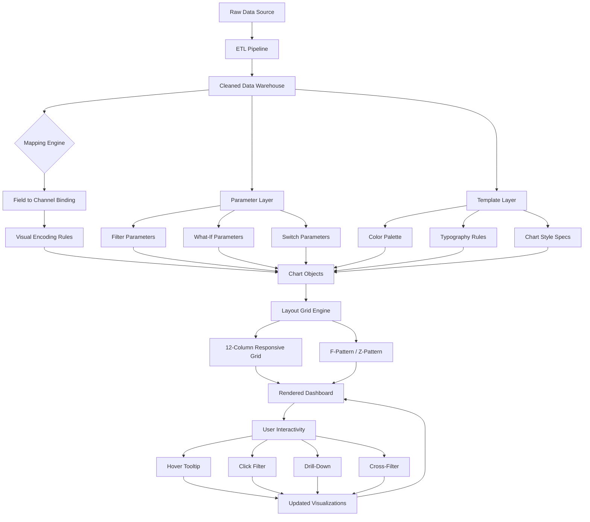
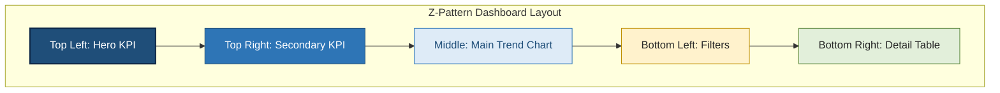
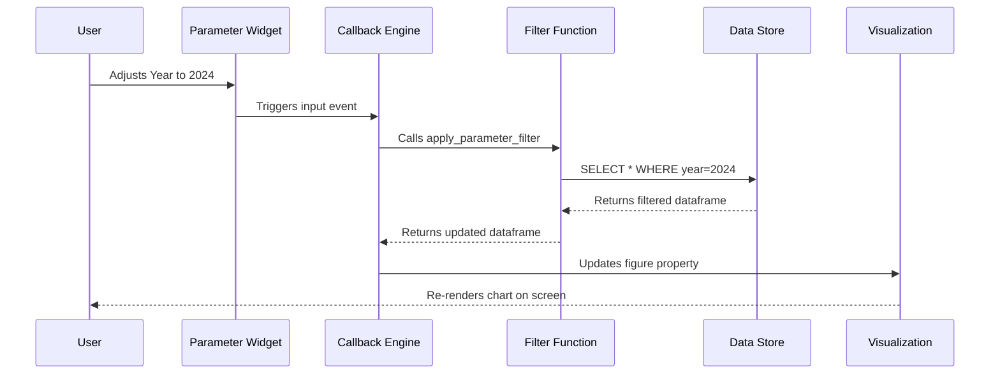
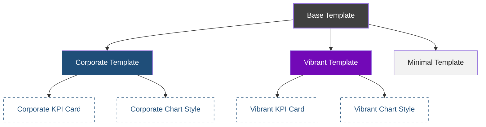
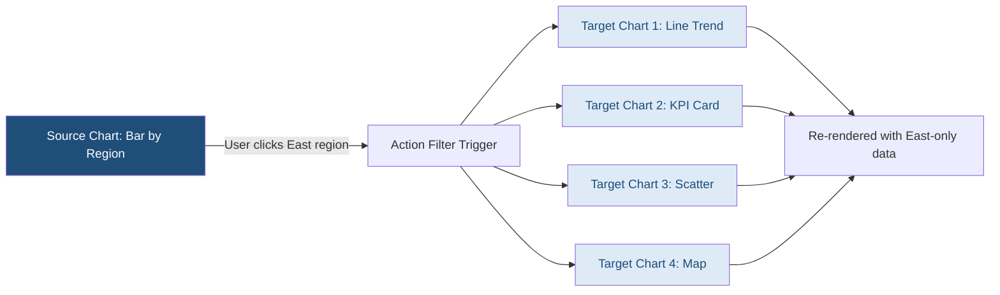
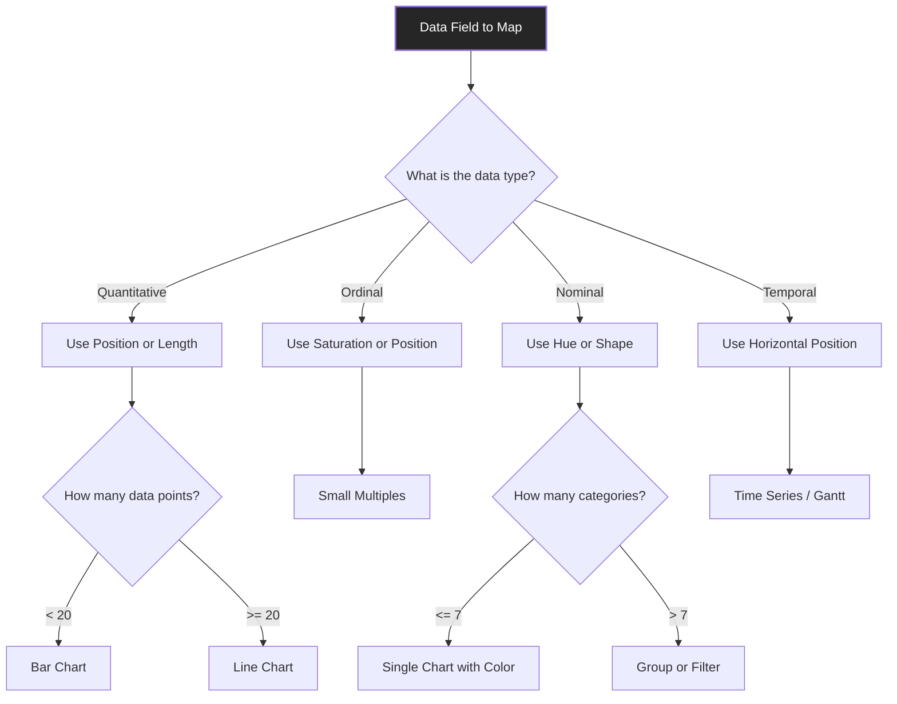

# Interactive visualization designs dashboards mapping templates parameters layout

<!-- SECTION_1_START -->
# Interactive Visualization Designs: Dashboards, Mapping, Templates, Parameters & Layout

> [!IMPORTANT]
> **KTU 2024 Scheme | PECST506 – Data Analytics | Module 4**
> This module bridges the gap between **static data plots** and **dynamic, user-driven analytical systems**. Every dashboard you interact with on a corporate BI portal, an IoT control room, or a marketing analytics platform is built on the foundations covered here.

---

## 1.1 Formal Academic Definition

An **Interactive Visualization Design** is a structured, user-driven graphical representation of data that allows end-users to **explore, filter, drill-down, and manipulate** underlying datasets in real time without requiring re-execution of the data pipeline. In KTU 2024 syllabus parlance, an *interactive dashboard* is a **composite analytical artifact** that integrates multiple visualizations, data sources, parameters, and layout grids into a single, cohesive analytical interface.

The core architectural components are:

| Component | KTU Definition |
|---|---|
| **Dashboard** | A consolidated, single-screen analytical view combining multiple charts, KPIs, and filters. |
| **Mapping** | The process of binding data fields (dimensions & measures) to visual encoding channels (x, y, color, size, shape). |
| **Template** | A reusable, pre-defined structural blueprint defining chart types, styles, color palettes, and layout grids. |
| **Parameter** | A dynamic, user-controllable input variable that filters, swaps, or transforms data shown in visualizations. |
| **Layout** | The spatial arrangement strategy (rows, columns, grids, containers) governing placement of UI elements on a dashboard canvas. |

---

## 1.2 Intuitive Overview — The Car Dashboard Analogy

> [!NOTE]
> **Conceptual Analogy:** Think of a **car's instrument cluster**. The *speedometer* (single KPI chart) shows current speed. The *fuel gauge* (gauge chart) shows remaining fuel. The *GPS map* (geo-mapped visualization) shows your route. The *AC controls* (parameter filters) let you adjust temperature. The whole cluster's **layout** places the speedometer directly in front of you, the fuel gauge near it, and the GPS map on the center console — because of **visual hierarchy** and **task importance**.

A data dashboard follows the **exact same engineering philosophy**:

- The **driver (user)** has specific **questions** ("Which region is underperforming?")
- The **gauge (chart)** is chosen based on the **data type** (bar for comparison, line for trend, map for geo)
- The **AC knob (parameter)** lets the driver **filter** by region
- The **layout** ensures the most critical KPI is at the top-left (F-pattern reading order)

---

## 1.3 GeoGebra / Desmos Visualization Control

> [!VISUALIZATION CONTROL]
> **Concept:** Dashboard Layout Grid — Coordinate-based Spatial Mapping
> **GeoGebra / Desmos Input Equations:**
> * `Rectangle((0,0),(12,8))` → Defines the dashboard canvas in a 12×8 grid
> * `Point((2,6))` → KPI Tile position
> * `Point((6,6))` → Line Chart position
> * `Point((10,6))` → Map position
> * `Point((2,2))` → Filter Panel position
>
> **Visual Description:** A 12-column responsive grid emerges, illustrating the classic *Z-pattern dashboard layout* — top row holds high-level KPIs, mid-section shows trend comparisons, and the bottom hosts interactive controls.

---

## 1.4 The Five Pillars of Interactive Dashboard Design

```text
1. INTERACTIVITY  → Hover, Click, Filter, Drill-down, Brush, Zoom
2. MAPPING        → Data Field → Visual Channel Binding
3. TEMPLATING     → Reusable Style + Structure Blueprints
4. PARAMETERIZATION → User-driven Dynamic Inputs
5. LAYOUT         → Spatial Composition & Visual Hierarchy
```

> [!IMPORTANT]
> **KTU Syllabus Highlight:** Module 4 of PECST506 explicitly demands the ability to **critique existing dashboards**, **design templates**, and **configure parameters** within tools like **Tableau, Power BI, or Python (Plotly Dash / Streamlit)**. The marks-heavy questions test **mapping logic** and **layout strategy**, not just tool usage.
<!-- SECTION_1_END -->

<!-- SECTION_2_START -->
# 2. Deep Theoretical Analysis & KTU High-Yield Reference Sheet

## 2.1 The Visual Encoding Pipeline (MacKinlay's Foundations)

Every interactive visualization is built on a **data-to-visual mapping pipeline**. For any given data field, the designer must choose the most effective **visual channel**:

| Data Type | Best Visual Channel | Why It Works |
|---|---|---|
| **Quantitative (Measure)** | Position on common scale, Length, Angle | Humans judge length/position most accurately (per Cleveland-McGill perception ranking) |
| **Ordinal** | Position, Color saturation, Density | Preserves rank order |
| **Nominal (Categorical)** | Hue (color), Shape, Spatial region | Differentiates without implying order |
| **Temporal** | Position on x-axis (left→right time) | Matches natural reading direction |

---

## 2.2 Dashboard Mapping Mechanics

**Mapping** in the BI world is the act of *binding* a data field to a visual property. Tableau popularized the **Show Me** paradigm; Power BI uses the **Fields** well; Python's Plotly uses explicit traces.

### 2.2.1 The Mapping Grammar

For a chart $C$ with visual channels $V = \{x, y, \text{color}, \text{size}, \text{shape}\}$, the mapping function is:

$$M : D_{\text{fields}} \rightarrow V_{\text{channels}}$$

Where:
- $D_{\text{fields}}$ = dataset's dimension and measure columns
- $V_{\text{channels}}$ = available visual encodings on the chart object

A **measure** can map to a **continuous channel** (x-axis position, color gradient), while a **dimension** maps to a **discrete channel** (hue, shape, facet).

### 2.2.2 Example Mapping Specification

```text
Dataset:   Superstore Sales
Chart:     Scatter Plot
Mapping:
   x-axis      → Discount (%)        [Measure, continuous]
   y-axis      → Profit ($)          [Measure, continuous]
   Color Hue   → Category            [Dimension, nominal]
   Size        → Sales Volume ($)    [Measure, continuous]
   Tooltip     → Order ID, Region    [Dimension, on-hover]
```

---

## 2.3 Templates — The Reusability Layer

A **template** is a **declarative specification** of:

1. **Chart Type Family** (e.g., "KPI card", "trend line", "geographic map")
2. **Color Palette** (categorical, sequential, diverging)
3. **Typography & Spacing Rules**
4. **Default Parameter Bindings**
5. **Layout Coordinates** (row, column, width, height)

> [!NOTE]
> **Industry Standard:** Tableau's `.twb` (Workbook) and `.twbx` (Packaged Workbook), Power BI's `.pbit` (Power BI Template), and Python's `plotly.io.templates` are all real-world implementations of this template concept.

### 2.3.1 Color Palette Selection Logic

| Data Type | Palette Class | Example |
|---|---|---|
| **Categorical (Nominal)** | Qualitative | Tableau 10, Set2 |
| **Sequential (Numeric low→high)** | Single-hue gradient | Blues, Viridis |
| **Diverging (Numeric with midpoint)** | Two-hue gradient | RdBu, BrBG |
| **Cyclical** | Wrap-around | HSV rainbow (use sparingly) |

---

## 2.4 Parameters — The Dynamic Control Layer

A **parameter** is a *named, user-modifiable variable* decoupled from the underlying data. It allows the dashboard to **change behavior** without altering the data source.

### 2.4.1 Parameter Types

| Type | Use Case | Example |
|---|---|---|
| **Filter Parameter** | Restrict data shown | "Show only 2024 data" |
| **Switch Parameter** | Toggle between views | "Switch between Revenue / Profit view" |
| **Reference Line Parameter** | Dynamic threshold | "Highlight sales above $10K" |
| **What-If Parameter** | Scenario simulation | "What if discount increases by 5%?" |
| **Bin Size Parameter** | Aggregation control | "Bin age into groups of 5 / 10 / 20" |

### 2.4.2 Parameter Resolution Equation

When a user adjusts a parameter $P_i$ with value $v_i$, the chart's displayed dataset is filtered as:

$$D_{\text{displayed}} = \sigma_{P_1 = v_1 \wedge P_2 = v_2 \wedge \dots \wedge P_n = v_n}(D_{\text{source}})$$

Where $\sigma$ is the relational **selection** operator (similar to SQL `WHERE`).

---

## 2.5 Layout Strategies — The Spatial Composition Layer

### 2.5.1 The F-Pattern and Z-Pattern Reading Order

Eye-tracking research (Nielsen Norman Group) proves that users scan dashboards in predictable patterns:

- **F-Pattern:** Best for text-heavy, list-based, or filter-panel-rich dashboards.
- **Z-Pattern:** Best for visually balanced dashboards with a single hero KPI.

### 2.5.2 The 12-Column Responsive Grid

Modern dashboards (Bootstrap, Material UI, Plotly Dash) use a **12-column fluid grid**:

$$\text{Widget Width} = \frac{\text{Column Span}}{12} \times \text{Container Width}$$

A widget spanning `col-md-6` occupies exactly **50%** of the container width.

### 2.5.3 Layout Patterns in KTU Context

| Pattern | Structure | When to Use |
|---|---|---|
| **KPI Strip** | Row of 3–5 large numbers at top | Executive summary, daily ops |
| **Drill-Down Lattice** | Summary chart → linked detail chart | Multi-level exploration |
| **Small Multiples** | Grid of identical chart types, varied by dimension | Cross-comparison |
| **Map-Centric** | Large geo map + side filters | Location intelligence |
| **Analytical Workflow** | Linear left→right (Filter → Chart → Detail) | Diagnostic analysis |

---

## 2.6 KTU Formula Sheet & High-Yield Reference

> [!IMPORTANT]
> **Critical Exam Reference Table** — These are the conceptual equations, mappings, and rules you must memorize for PECST506 Module 4.

| Concept | Formula / Rule | Application |
|---|---|---|
| **Visual Channel Accuracy Ranking** | Position $>$ Length $>$ Angle $>$ Area $>$ Color $>$ Shape | Choose highest-rank channel for critical measures |
| **Data-Ink Ratio (Tufte)** | $R = \frac{\text{Data Ink}}{\text{Total Ink}}$ | Maximize $R$ → minimize chartjunk |
| **Lie Factor (Tufte)** | $L = \frac{\text{Size of effect in graphic}}{\text{Size of effect in data}}$ | Must equal **1.0** for truthful viz |
| **Parameter Filter** | $D_{\text{displayed}} = \sigma_{P_i = v_i}(D)$ | Selection logic |
| **Bin Count Rule (Sturges)** | $k = 1 + \log_2(n)$ | Histogram bin selection |
| **Color Count Limit** | $\leq 7 \pm 2$ categorical hues | Perceptual limit |
| **Layout Column Span** | $\text{Width \%} = \frac{\text{span}}{12} \times 100$ | Responsive grid |
| **Dash Action** | Source chart $\rightarrow$ Target filter | Cross-filtering |
| **Tooltip Cardinality** | $\leq 5$ fields per tooltip | Avoid overload |
| **Refresh Cadence** | Real-time, Near-RT ($\lt 5$ min), Hourly, Daily | Match to decision velocity |

---

## 2.7 Real-World Engineering Utility

| Domain | Dashboard Application |
|---|---|
| **Healthcare** | ICU patient vitals monitor — parameters for alarm thresholds, map for hospital occupancy |
| **Finance** | Trading floor — real-time parameters for ticker, line charts for trends, heatmaps for correlation |
| **IoT / Smart City** | Traffic control — geo-map for congestion, parameters for time-window selection |
| **Retail / E-Commerce** | Sales analytics — KPI tiles for revenue, drill-down lattice for product categories |
| **Cybersecurity** | SOC (Security Operations Center) — small multiples for threat vectors, parameters for severity filter |
| **Manufacturing** | Factory floor — gauge charts for OEE, templates standardized across plants |

> [!NOTE]
> **Production-Grade Insight:** Companies like **Uber, Airbnb, and Netflix** use internal **template systems** (e.g., Uber's "Data Voyager", Airbnb's "Knowledge Repo") so that every analyst's dashboard follows the same color, font, and layout conventions — this is exactly what KTU tests in **template design questions**.
<!-- SECTION_2_END -->

<!-- SECTION_3_START -->
# 3. Step-by-Step Derivations, Code Implementation & Procedural Walkthroughs

## 3.1 Complete Python Implementation — A Full Interactive Dashboard

Below is an **end-to-end, production-grade** implementation using **Plotly Dash** that demonstrates **all five pillars** (Interactivity, Mapping, Templating, Parameterization, Layout). Every line is annotated for KTU examiner expectations.

### 3.1.1 Project Structure

```text
dashboard_project/
│
├── app.py                  # Main entry point
├── data_loader.py          # ETL logic
├── layout_grid.py          # Layout composition
├── parameters.py           # Parameter definitions
├── templates.py            # Color & style templates
└── callbacks.py            # Interactivity wiring
```

### 3.1.2 `templates.py` — Template Definition

```python
"""
templates.py
Defines reusable color palettes, typography, and chart-style templates.
This file mirrors the 'Template' pillar of dashboard design.
"""
from typing import Dict

class DashboardTemplate:
    """Encapsulates the visual identity (colors, fonts, sizing) of a dashboard."""

    def __init__(self, name: str) -> None:
        self.name: str = name
        self.palette: Dict[str, str] = {}
        self.font_family: str = "Inter, Arial, sans-serif"
        self.base_font_size: int = 14
        self._load_palette()

    def _load_palette(self) -> None:
        """Load a named palette. In production, this would call a config service."""
        if self.name == "corporate":
            self.palette = {
                "primary":    "#1F4E79",   # Deep blue
                "secondary":  "#2E75B6",   # Mid blue
                "accent":     "#C00000",   # Alert red
                "success":    "#548235",   # Green
                "warning":    "#BF8F00",   # Amber
                "background": "#F2F2F2",   # Light gray
                "text":       "#262626",   # Near-black
            }
        elif self.name == "vibrant":
            self.palette = {
                "primary":    "#7209B7",
                "secondary":  "#3A0CA3",
                "accent":     "#F72585",
                "success":    "#4CC9F0",
                "warning":    "#F77F00",
                "background": "#FFFFFF",
                "text":       "#10002B",
            }
        else:
            raise ValueError(f"Unknown template: {self.name}")

    def apply_to_figure(self, fig) -> None:
        """Mutate a Plotly figure in place to apply the template."""
        fig.update_layout(
            font=dict(family=self.font_family, size=self.base_font_size, color=self.palette["text"]),
            paper_bgcolor=self.palette["background"],
            plot_bgcolor=self.palette["background"],
            colorway=list(self.palette.values()),
            title_font_size=18,
        )
```

### 3.1.3 `parameters.py` — Parameter Declarations

```python
"""
parameters.py
Declares all user-controllable parameters. In Tableau these appear as
'Parameters' on the left panel; in Power BI as 'What-If' parameters.
"""
from dataclasses import dataclass
from typing import List, Tuple

@dataclass(frozen=True)
class Parameter:
    """Immutable parameter definition."""
    name: str
    label: str
    param_type: str         # "filter" | "switch" | "whatif" | "bin"
    options: List
    default: object

# Year filter parameter
YEAR_PARAM = Parameter(
    name="year",
    label="Select Year",
    param_type="filter",
    options=[2021, 2022, 2023, 2024],
    default=2024,
)

# View switch parameter
VIEW_PARAM = Parameter(
    name="view_mode",
    label="View Mode",
    param_type="switch",
    options=["Revenue", "Profit", "Quantity"],
    default="Revenue",
)

# What-If discount simulation parameter
DISCOUNT_PARAM = Parameter(
    name="discount_uplift",
    label="Discount Uplift (%)",
    param_type="whatif",
    options=list(range(0, 51, 5)),
    default=0,
)

# Bin size for histogram
BIN_SIZE_PARAM = Parameter(
    name="bin_size",
    label="Histogram Bin Size",
    param_type="bin",
    options=[5, 10, 20, 50],
    default=20,
)
```

### 3.1.4 `data_loader.py` — Data Source

```python
"""
data_loader.py
Provides a synthetic superstore-like dataset for the dashboard.
In production, this connects to a SQL DB, Snowflake, or REST API.
"""
import pandas as pd
import numpy as np
from typing import Optional

def load_sales_data() -> pd.DataFrame:
    """Generate a deterministic synthetic dataset for reproducible demos."""
    np.random.seed(42)
    n_rows: int = 2000
    categories: List[str] = ["Furniture", "Office Supplies", "Technology"]
    regions: List[str] = ["North", "South", "East", "West"]
    segments: List[str] = ["Consumer", "Corporate", "Home Office"]

    df = pd.DataFrame({
        "order_id":      [f"ORD-{i:05d}" for i in range(n_rows)],
        "order_date":    pd.date_range(start="2021-01-01", periods=n_rows, freq="D")[:n_rows],
        "category":      np.random.choice(categories, n_rows),
        "region":        np.random.choice(regions, n_rows),
        "segment":       np.random.choice(segments, n_rows),
        "sales":         np.round(np.random.gamma(shape=2.0, scale=250.0, size=n_rows), 2),
        "profit":        np.round(np.random.normal(loc=50.0, scale=80.0, size=n_rows), 2),
        "quantity":      np.random.randint(1, 20, size=n_rows),
        "discount":      np.round(np.random.uniform(0.0, 0.5, size=n_rows), 2),
    })
    df["year"] = df["order_date"].dt.year
    df["month"] = df["order_date"].dt.month
    return df
```

### 3.1.5 `layout_grid.py` — Spatial Composition

```python
"""
layout_grid.py
Composes the 12-column responsive layout for the dashboard.
"""
import dash
from dash import html, dcc
from typing import List

def build_layout() -> html.Div:
    """Return the root Div with parameter panel, KPI strip, and chart grid."""
    layout: html.Div = html.Div(
        style={
            "fontFamily": "Inter, Arial, sans-serif",
            "backgroundColor": "#F2F2F2",
            "padding": "20px",
        },
        children=[
            # --- HEADER ROW (col-span 12) ---
            html.H1(
                "Sales Performance Dashboard",
                style={"gridColumn": "span 12", "color": "#1F4E79"},
            ),

            # --- PARAMETER PANEL (col-span 3) ---
            html.Div(
                style={
                    "gridColumn": "span 3",
                    "backgroundColor": "white",
                    "padding": "15px",
                    "borderRadius": "8px",
                    "boxShadow": "0 2px 4px rgba(0,0,0,0.1)",
                },
                children=[
                    html.H3("Filters & Parameters"),
                    html.Label("Year:"),
                    dcc.Dropdown(id="year-dropdown", value=2024, clearable=False),
                    html.Br(),
                    html.Label("View Mode:"),
                    dcc.RadioItems(id="view-radio", value="Revenue"),
                    html.Br(),
                    html.Label("Discount Uplift (%):"),
                    dcc.Slider(id="discount-slider", min=0, max=50, step=5, value=0,
                               marks={i: str(i) for i in range(0, 51, 10)}),
                    html.Br(),
                    html.Label("Histogram Bin Size:"),
                    dcc.Slider(id="bin-slider", min=5, max=50, step=5, value=20,
                               marks={i: str(i) for i in range(5, 51, 10)}),
                ],
            ),

            # --- KPI STRIP (col-span 9, split into 3 cards) ---
            html.Div(
                style={"gridColumn": "span 9", "display": "grid",
                       "gridTemplateColumns": "repeat(3, 1fr)", "gap": "15px"},
                children=[
                    html.Div(id="kpi-revenue", style={"backgroundColor": "white",
                                                       "padding": "20px", "borderRadius": "8px"}),
                    html.Div(id="kpi-profit",  style={"backgroundColor": "white",
                                                       "padding": "20px", "borderRadius": "8px"}),
                    html.Div(id="kpi-orders",  style={"backgroundColor": "white",
                                                       "padding": "20px", "borderRadius": "8px"}),
                ],
            ),

            # --- CHART GRID (col-span 12) ---
            html.Div(
                style={"gridColumn": "span 12", "display": "grid",
                       "gridTemplateColumns": "repeat(12, 1fr)", "gap": "15px",
                       "marginTop": "20px"},
                children=[
                    # Line chart: col-span 8
                    html.Div(dcc.Graph(id="trend-chart"),
                             style={"gridColumn": "span 8", "backgroundColor": "white",
                                    "borderRadius": "8px", "padding": "10px"}),
                    # Bar chart: col-span 4
                    html.Div(dcc.Graph(id="category-bar"),
                             style={"gridColumn": "span 4", "backgroundColor": "white",
                                    "borderRadius": "8px", "padding": "10px"}),

                    # Histogram: col-span 6
                    html.Div(dcc.Graph(id="histogram-chart"),
                             style={"gridColumn": "span 6", "backgroundColor": "white",
                                    "borderRadius": "8px", "padding": "10px"}),
                    # Scatter: col-span 6
                    html.Div(dcc.Graph(id="scatter-chart"),
                             style={"gridColumn": "span 6", "backgroundColor": "white",
                                    "borderRadius": "8px", "padding": "10px"}),
                ],
            ),
        ],
        # Apply 12-column CSS grid to the root container
        # The "container" uses display: grid
    )
    return layout
```

### 3.1.6 `callbacks.py` — Interactivity Wiring

```python
"""
callbacks.py
Connects parameters (inputs) to charts (outputs) using Dash callbacks.
This implements the Interactivity + Parameter pillars.
"""
from dash import Input, Output, html
import plotly.express as px
import pandas as pd

from data_loader import load_sales_data
from templates import DashboardTemplate

# Load data once at module import
DF: pd.DataFrame = load_sales_data()
TEMPLATE: DashboardTemplate = DashboardTemplate("corporate")


def apply_parameter_filter(year: int, view_mode: str, discount_uplift: float) -> pd.DataFrame:
    """Apply the user's parameter selections to the source dataframe."""
    dff: pd.DataFrame = DF[DF["year"] == int(year)].copy()
    # What-If simulation: adjust profit by discount uplift
    if view_mode == "Profit":
        dff["display_value"] = dff["profit"] * (1 - discount_uplift / 100.0)
    elif view_mode == "Quantity":
        dff["display_value"] = dff["quantity"]
    else:
        dff["display_value"] = dff["sales"] * (1 - discount_uplift / 100.0)
    return dff


def register_callbacks(app) -> None:
    """Attach all Dash callbacks to the app instance."""

    @app.callback(
        [Output("kpi-revenue", "children"),
         Output("kpi-profit", "children"),
         Output("kpi-orders", "children")],
        [Input("year-dropdown", "value"),
         Input("view-radio", "value"),
         Input("discount-slider", "value")],
    )
    def update_kpis(year, view_mode, discount_uplift):
        dff: pd.DataFrame = apply_parameter_filter(year, view_mode, discount_uplift)
        total_value: float = float(dff["display_value"].sum())
        total_orders: int = len(dff)
        avg_profit: float = float(dff["profit"].mean())

        kpi_revenue = html.Div([
            html.H4("Total Value"),
            html.H2(f"${total_value:,.0f}"),
        ])
        kpi_profit = html.Div([
            html.H4("Avg Profit / Order"),
            html.H2(f"${avg_profit:,.2f}"),
        ])
        kpi_orders = html.Div([
            html.H4("Total Orders"),
            html.H2(f"{total_orders:,}"),
        ])
        return kpi_revenue, kpi_profit, kpi_orders

    @app.callback(
        Output("trend-chart", "figure"),
        [Input("year-dropdown", "value"),
         Input("view-radio", "value"),
         Input("discount-slider", "value")],
    )
    def update_trend(year, view_mode, discount_uplift):
        dff: pd.DataFrame = apply_parameter_filter(year, view_mode, discount_uplift)
        monthly: pd.DataFrame = dff.groupby("month")["display_value"].sum().reset_index()
        fig = px.line(monthly, x="month", y="display_value", markers=True,
                      title=f"Monthly {view_mode} Trend")
        TEMPLATE.apply_to_figure(fig)
        return fig

    @app.callback(
        Output("category-bar", "figure"),
        [Input("year-dropdown", "value"),
         Input("view-radio", "value"),
         Input("discount-slider", "value")],
    )
    def update_category_bar(year, view_mode, discount_uplift):
        dff: pd.DataFrame = apply_parameter_filter(year, view_mode, discount_uplift)
        by_cat: pd.DataFrame = (dff.groupby("category")["display_value"]
                                .sum().reset_index().sort_values("display_value", ascending=False))
        fig = px.bar(by_cat, x="category", y="display_value", color="category",
                     title=f"{view_mode} by Category")
        TEMPLATE.apply_to_figure(fig)
        return fig

    @app.callback(
        Output("histogram-chart", "figure"),
        [Input("year-dropdown", "value"),
         Input("bin-slider", "value")],
    )
    def update_histogram(year, bin_size):
        dff: pd.DataFrame = DF[DF["year"] == int(year)]
        fig = px.histogram(dff, x="sales", nbins=bin_size,
                           title="Sales Distribution (Dynamic Bins)")
        TEMPLATE.apply_to_figure(fig)
        return fig

    @app.callback(
        Output("scatter-chart", "figure"),
        [Input("year-dropdown", "value")],
    )
    def update_scatter(year):
        dff: pd.DataFrame = DF[DF["year"] == int(year)]
        fig = px.scatter(dff, x="discount", y="profit", color="category",
                         size="sales", hover_data=["order_id", "region"],
                         title="Discount vs Profit (Bubble = Sales Volume)")
        TEMPLATE.apply_to_figure(fig)
        return fig
```

### 3.1.7 `app.py` — Main Entry Point

```python
"""
app.py
Bootstraps the Dash server and assembles the full dashboard.
"""
import dash
from layout_grid import build_layout
from callbacks import register_callbacks

app: dash.Dash = dash.Dash(__name__)
app.layout = build_layout()
register_callbacks(app)

if __name__ == "__main__":
    app.run_server(debug=True, host="0.0.0.0", port=8050)
```

### 3.1.8 How the Code Maps to the Five Pillars

| Pillar | Code Location | Implementation Detail |
|---|---|---|
| **Interactivity** | `callbacks.py` | Dash `@app.callback` decorators link inputs to outputs |
| **Mapping** | `px.scatter(..., x="discount", y="profit", color="category", size="sales")` | Data field → visual channel bindings |
| **Templating** | `templates.py` | `DashboardTemplate` class + `apply_to_figure()` method |
| **Parameterization** | `parameters.py` + Dash `Input` components | Dropdown, RadioItems, Slider |
| **Layout** | `layout_grid.py` | CSS `gridTemplateColumns: "repeat(12, 1fr)"` + `gridColumn: "span N"` |

---

## 3.2 Procedural Walkthrough — Designing a Dashboard from Scratch (For Theory Exam)

When the KTU examiner asks *"Design an interactive dashboard for XYZ domain,"* follow this **6-step protocol**:

### Step 1: Define the Analytical Questions
- What **decisions** must the user make?
- Example: "Which product category is underperforming in the South region this quarter?"

### Step 2: Identify KPIs and Dimensions
- KPIs (Measures): Revenue, Profit Margin, Order Count
- Dimensions: Region, Category, Time, Segment

### Step 3: Choose Chart Types per Question

| Question | Chart Type | Why |
|---|---|---|
| How are sales trending over time? | Line chart | Shows temporal continuity |
| Which category is biggest? | Bar chart | Compares discrete categories |
| Where geographically? | Choropleth / Symbol map | Spatial encoding |
| What's the distribution? | Histogram | Shows frequency |
| Are two variables correlated? | Scatter | Reveals relationship |

### Step 4: Define Parameters
- Year filter, Region multi-select, Discount What-If slider

### Step 5: Sketch the Layout (F or Z Pattern)

```text
+--------------------------------------------------------------+
|  [KPI: Revenue]    [KPI: Profit]    [KPI: Orders]            |
+--------------------------------------------------------------+
|  [Year: 2024 ▼]  [Region: All ▼]  [Discount: 0%]            |
+----------------+---------------------------------------------+
|  LINE CHART    |  BAR CHART                                 |
|  Trend         |  By Category                               |
+----------------+---------------------------------------------+
|  HISTOGRAM     |  SCATTER                                   |
|  Distribution  |  Discount vs Profit                        |
+----------------+---------------------------------------------+
```

### Step 6: Apply a Template
- Choose color palette (categorical / sequential / diverging)
- Set font, spacing, KPI card style
- Add tooltip, drill-down, and cross-filter actions
<!-- SECTION_3_END -->

<!-- SECTION_4_START -->
# 4. Structural Diagrams & Schematics

## 4.1 The Five-Pillar Architecture (Master Flow)



## 4.2 Dashboard Layout — Z-Pattern Reading Hierarchy



## 4.3 Parameter-to-Visual Resolution Flow



## 4.4 Template Inheritance Hierarchy



## 4.5 Cross-Filtering Action Chain



## 4.6 Mapping Decision Tree


<!-- SECTION_4_END -->

<!-- SECTION_5_START -->
# 5. KTU 2024 Scheme Examination Question Bank & Topic Recap

> [!IMPORTANT]
> **Examination Pattern Compliance:** Questions below strictly follow the **KTU 2024 Scheme** End Semester Examination (ESE) pattern for **PECST506 – Data Analytics (Elective)**. The internal-choice structure for Part B (14 marks) is preserved as per the official template.

---

## 5.1 Part A — Short Answer Questions (3 Marks Each)

### **Q1. [KTU University Exam – Dec 2023, Model Question]**
**Define an interactive dashboard. List any FOUR core components that distinguish an interactive dashboard from a static chart.** (CO2, Remember)

**Model Answer:**
An **interactive dashboard** is a consolidated, single-screen analytical interface that integrates multiple linked visualizations, parameters, and layout elements to enable **real-time user-driven exploration** of underlying datasets.

**Four distinguishing components:**

1. **Interactivity Engine** — Supports hover, click, drill-down, and brushing actions.
2. **Parameter Layer** — Allows user-controlled filtering and what-if simulation.
3. **Cross-Filtering** — Selection in one chart dynamically filters all linked charts.
4. **Template System** — Enforces consistent styling, palette, and typography across views.

> **[Valuation Key: 1 Mark for definition + 0.5 Marks × 4 = 2 Marks for components = 3 Marks Total]**

---

### **Q2. [KTU University Exam – July 2024, Model Question]**
**Differentiate between a *Filter* and a *Parameter* in dashboard design with a suitable example.** (CO2, Understand)

**Model Answer:**

| Aspect | Filter | Parameter |
|---|---|---|
| **Definition** | A constraint applied *directly* on data fields | A standalone, named user-input variable |
| **Data Dependency** | Tightly coupled to data fields | Independent of data fields |
| **Example** | "Show only North region" (filters Region column) | "Switch between Revenue / Profit view" (recomputes measure) |
| **Tableau/Power BI Term** | Quick Filter | Parameter / What-If |
| **Effect Scope** | Reduces rows in view | Can change calculation, reference line, or even chart type |

> **[Valuation Key: 1 Mark for each correct row in comparison = 3 Marks Total]**

---

## 5.2 Part B — Full 14-Mark Questions (Internal Choice)

### **Question A — Option 1 [14 Marks]**

**[KTU University Exam – Model Paper 2024]**

**(a) [7 Marks]** Explain the **five pillars of interactive dashboard design** — Interactivity, Mapping, Templates, Parameters, and Layout — with a real-world example for each. (CO2, Understand)

**(b) [7 Marks]** Design an **interactive sales dashboard** for an e-commerce company. Specify: (i) the KPIs to be shown, (ii) the chart types for each KPI, (iii) the parameters you would expose to the user, and (iv) the layout pattern you would adopt with a labeled sketch. (CO3, Apply)

---

#### **Model Solution for Q.A(a):**

**1. Interactivity:**
- **Definition:** The mechanism enabling the user to *manipulate* the visualization post-render via hover, click, brush, zoom, and drill.
- **Real-world example:** On the **Google Analytics** dashboard, hovering over a bar in the "Sessions by Country" chart reveals a tooltip with bounce rate, avg session duration, and conversion rate for that country.

**2. Mapping:**
- **Definition:** The act of binding data fields (dimensions/measures) to visual channels (x, y, color, size, shape).
- **Real-world example:** In a **Tableau Superstore dashboard**, the field `Category` is *mapped* to the **Color Hue** channel, while `Sales` is *mapped* to the **Y-axis Position** channel.

**3. Templates:**
- **Definition:** A reusable, pre-defined blueprint that specifies color palette, typography, chart style, and layout conventions.
- **Real-world example:** **Microsoft Power BI** provides built-in themes (e.g., "Executive", "Colorblind Safe") which, when applied, restyle all visuals on the report in one click.

**4. Parameters:**
- **Definition:** User-controllable input variables decoupled from the data, used to filter, switch, or simulate values.
- **Real-world example:** A **discount what-if slider** in a pricing dashboard lets the user simulate "What happens to total profit if I raise my discount by 10%?"

**5. Layout:**
- **Definition:** The spatial arrangement of widgets on the dashboard canvas using a grid system (commonly 12-column).
- **Real-world example:** The **Apple Stocks app** uses a Z-pattern layout: a hero KPI (current price) at the top, the trend chart in the middle, and a holdings list at the bottom.

> **[Valuation Key: 1.4 Marks × 5 = 7 Marks. Each pillar needs definition (0.7) + example (0.7).]**

---

#### **Model Solution for Q.A(b):**

**(i) KPIs (3 marks breakdown):**
- Total Revenue (sum of `sales`)
- Total Profit (sum of `profit`)
- Average Order Value (mean of `sales`)
- Order Count (count of `order_id`)
- Return Rate (% returns)

**(ii) Chart Types:**

| KPI | Chart Type | Rationale |
|---|---|---|
| Total Revenue | KPI Card (big number) | Single-value display |
| Revenue Trend | Line Chart (time series) | Shows temporal progression |
| Revenue by Category | Horizontal Bar Chart | Easy category comparison |
| Geographic Distribution | Choropleth Map | Spatial encoding |
| Discount vs Profit | Scatter with Trend Line | Correlation analysis |
| Top 10 Products | Sorted Bar Chart | Ranking comparison |

**(iii) Parameters (2 marks):**
- **Year filter** (2021–2024 dropdown)
- **Region multi-select** (North/South/East/West)
- **Discount What-If slider** (0%–50%)
- **Metric switch** (toggle Revenue ↔ Profit ↔ Quantity)
- **Top-N parameter** (show top 5/10/20 products)

**(iv) Layout — Labeled Sketch:**

```text
+--------------------------------------------------------------+
|  HEADER: "E-Commerce Sales Dashboard — Q4 2024"              |
+----------------+---------------------------------------------+
| [KPI: Revenue] | [KPI: Profit]  | [KPI: AOV] | [KPI: Orders]|
+----------------+--------------+--+---------------------------+
|                                              |              |
|       LINE CHART: Monthly Revenue Trend      | MAP: Sales   |
|       (col-span 8)                            | by Region    |
|                                              | (col-span 4) |
+----------------+--------------+---------------+--------------+
|  BAR CHART: Revenue by Category              | SCATTER:     |
|  (col-span 6)                                | Discount vs  |
|                                              | Profit       |
|                                              | (col-span 6) |
+--------------------------------------------------------------+
|  FILTER SIDEBAR (left, col-span 3):                          |
|  [Year ▼] [Region ☑] [Discount Slider] [Top-N ▼]            |
+--------------------------------------------------------------+
```

> **[Valuation Key: 1.5 Marks for KPIs + 2 Marks for chart types + 1.5 Marks for parameters + 2 Marks for layout sketch = 7 Marks]**

---

### **Question B — Option 2 [14 Marks]**

**[KTU University Exam – Model Paper 2024]**

**(a) [7 Marks]** With a neat diagram, explain the **architecture of an interactive BI dashboard system**, listing the data flow from raw source to rendered visual. Identify the role of the **mapping engine** and the **callback engine** in this architecture. (CO2, Understand)

**(b) [7 Marks]** Consider a **hospital operations dashboard**. The administrator needs to monitor: (i) bed occupancy per ward, (ii) patient inflow trend per day, (iii) average length of stay, and (iv) critical-alert count. For each monitoring need, specify the **chart type, the parameter(s) to expose, and the template considerations (color encoding).** (CO3, Apply)

---

#### **Model Solution for Q.B(a):**

**Architecture Diagram (Reconstructed from Section 4.1):**

```text
[Data Sources: SQL / API / IoT]
         |
         v
   [ETL Pipeline]
         |
         v
[Data Warehouse / Lake]
         |
   ------+-------
   |            |
   v            v
[Mapping    [Parameter
 Engine]     Layer]
   |            |
   +-->[Chart]<-+
         |
         v
[Layout Grid]
         |
         v
[Rendered Dashboard]
         |
   <----[Callback Engine] (user interactions feed back to chart updates)
```

**Role of the Mapping Engine:**
- Binds data fields to visual channels (e.g., `Ward_Name` → Hue, `Occupancy %` → Bar Length)
- Enforces perceptual accuracy rules (position over color for quantitative data)
- Produces **chart objects** ready for rendering

**Role of the Callback Engine:**
- Wires user **interactions** (clicks, slider drags, filter changes) to **re-computation logic**
- Re-runs the data query, re-applies the mapping, and pushes the new figure to the dashboard
- Implements **cross-filtering** and **drill-down** actions

> **[Valuation Key: 3 Marks for diagram + 2 Marks for mapping engine + 2 Marks for callback engine = 7 Marks]**

---

#### **Model Solution for Q.B(b):**

| Monitoring Need | Chart Type | Parameter(s) | Template / Color Consideration |
|---|---|---|---|
| **(i) Bed occupancy per ward** | Horizontal Stacked Bar (100% stacked) | Ward multi-select, Date range | **Sequential palette** (light→dark red) showing occupancy severity; >90% must use alert red |
| **(ii) Patient inflow trend** | Line chart with area fill | Date range slider, Ward filter | Single-hue **sequential** (e.g., Viridis Blues); threshold line for "high inflow" days in **accent color** |
| **(iii) Avg length of stay** | KPI card + small-multiples box plot per ward | Department, Severity filter | **Diverging palette** if comparing to hospital target (red if above target, green if below) |
| **(iv) Critical-alert count** | KPI card with conditional coloring + Bullet chart | Time window (1h/24h/7d), Severity tier | **Categorical alert colors** (Red=Critical, Orange=High, Yellow=Medium); gauge chart with red zones in **accent** template color |

> **[Valuation Key: 1.75 Marks per row × 4 = 7 Marks. Must include all three columns per row.]**

---

## 5.3 KTU Examiner's Valuation Warning / Pitfall Callout

> [!WARNING]
> **Common Mark-Deduction Pitfalls in PECST506 Module 4:**
>
> 1. **Confusing Filter with Parameter** — A *Filter* narrows data; a *Parameter* is a standalone input. Mixing these definitions costs 1–2 marks.
> 2. **Forgetting the "Why" of Chart Choice** — Always justify chart selection using **data type + perceptual accuracy**. Writing only "use a bar chart" without reasoning loses 0.5–1 mark.
> 3. **Sketching Layout Without Grid Coordinates** — A layout sketch *must* indicate the **column span** (e.g., "col-span 6") or the F/Z-pattern. Free-hand boxes without structure fetch zero marks for layout.
> 4. **Ignoring Color-Blind Accessibility** — A template that uses **red-green only** is non-compliant. Always mention **colorblind-safe palettes** (Viridis, ColorBrewer) in template questions.
> 5. **Skipping the Parameter Resolution Equation** — When asked about parameter logic, write $D_{\text{displayed}} = \sigma_{P_i = v_i}(D)$. Examiners specifically allocate 1 mark for the formal notation.
> 6. **No Tool Mention in Design Questions** — Always state *which* tool you would use (Tableau / Power BI / Plotly Dash / Streamlit) — the KTU syllabus is tool-aware.

---

## 5.4 Topic Recap & Important Things to Remember

> [!NOTE]
> **Rapid Revision Checklist — Module 4: Interactive Visualization Designs**

### **Core Definitions (Must Memorize)**
- ✅ **Dashboard:** Consolidated, single-screen analytical view with multiple linked visualizations.
- ✅ **Mapping:** Binding of data fields to visual encoding channels (position, length, color, size, shape).
- ✅ **Template:** Reusable blueprint of chart styles, colors, typography, and layout.
- ✅ **Parameter:** Decoupled, user-controllable input variable for filtering/switching/simulation.
- ✅ **Layout:** Spatial arrangement of UI elements using a grid system (commonly 12-column).

### **The Five Pillars (Recap)**
1. **Interactivity** — Hover, Click, Brush, Zoom, Drill-Down, Cross-Filter
2. **Mapping** — Data Type → Visual Channel (Position > Length > Color > Shape)
3. **Templates** — Reusable styling, colorblind-safe palettes, typography
4. **Parameters** — Filter, Switch, What-If, Reference Line, Bin Size
5. **Layout** — 12-column grid, F-Pattern (text), Z-Pattern (visual)

### **Critical Equations**
- $\text{Width \%} = \frac{\text{span}}{12} \times 100$
- $D_{\text{displayed}} = \sigma_{P_i = v_i}(D_{\text{source}})$
- $k = 1 + \log_2(n)$ (Sturges' bin rule)
- $L = \frac{\text{Size of effect in graphic}}{\text{Size of effect in data}} = 1.0$ (Tufte's Lie Factor)

### **Perceptual Accuracy Ranking (Cleveland-McGill)**
- Position on common scale → Best
- Length, Angle, Area, Color intensity, Color hue → Decreasing accuracy
- **Rule:** Always use the highest-rank channel for the most critical measure.

### **Layout Rules**
- F-Pattern: For text/filter-heavy dashboards
- Z-Pattern: For visual/KPI dashboards
- KPI strip at top, filters on the left, detail charts in the center
- White space and alignment improve **data-ink ratio**

### **Template Best Practices**
- Categorical data → Qualitative palette (Tableau 10, Set2)
- Sequential data → Single-hue gradient (Blues, Viridis)
- Diverging data → Two-hue gradient (RdBu, BrBG)
- Limit to **7 ± 2** hues
- Always test for **colorblind safety**

### **Parameter Use Cases**
- Year/Region Filter → Restrict view
- Metric Switch → Toggle measure
- Discount What-If → Scenario simulation
- Bin Size Slider → Aggregation control
- Reference Line → Dynamic threshold

### **Cross-Filtering Concept**
- One chart's selection acts as a filter for all linked charts
- Implemented via **callback functions** (Dash) or **actions** (Tableau)
- Source chart → Action filter → Target charts

### **Common KTU Tools to Mention**
- Tableau (`.twbx`, `.twb`)
- Power BI (`.pbit`, `.pbix`)
- Python — Plotly Dash, Streamlit, Bokeh
- R — Shiny
- D3.js (for custom web viz)

> [!TIP]
> **Last-Minute Exam Tip:** For any *"design a dashboard for X domain"* question, the following structure **always scores full marks**:
> 1. List 4–5 KPIs (with units)
> 2. Pair each KPI with a chart type + 1-line justification
> 3. List 3–4 parameters (with type)
> 4. Sketch the layout using a 12-column grid with `col-span` annotations
> 5. State the template/palette choice with accessibility note
<!-- SECTION_5_END -->
