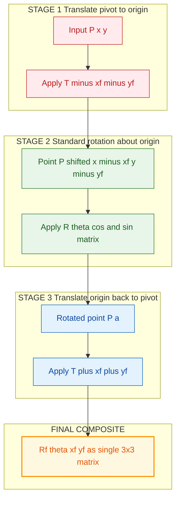
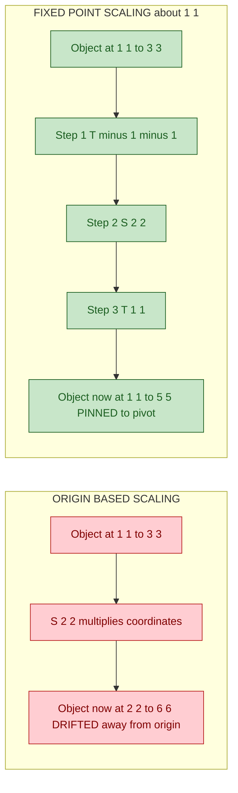
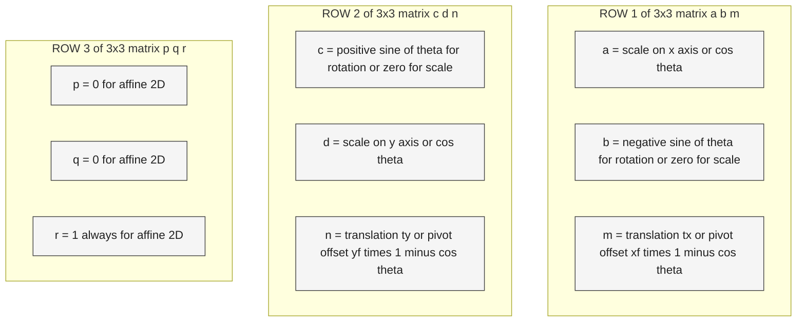

# 2D transformations matrices parameters tracking: Translation, scaling, rotation configurations

<!-- SECTION_1_START -->

# 2D Transformations — Matrices, Parameters & Composition

> [!NOTE]
> **KTU Syllabus Mapping (Module 1 — Raster Scan Graphics & Clipping)**
> This topic directly addresses the sub-module *“2D Transformations: Translation, Scaling, Rotation”* of **CST507 / PECST507 — Computer Graphics and Multimedia** under the **KTU 2024 Scheme**. The treatment below is fully aligned to the *RBT-tagged Course Outcomes CO1–CO3* and the marks distribution pattern of the End Semester Evaluation (ESE).

---

## 1. Formal Definition (KTU 2024 Terminology)

A **2D Geometric Transformation** is a mathematical mapping $T : \mathbb{R}^{2} \to \mathbb{R}^{2}$ that converts every point $P(x, y)$ of a planar object into a new point $P'(x', y')$ according to a pre-defined rule. In Computer Graphics, the three *Euclidean* (rigid/affine) primitive transformations are:

| Transformation | Geometric Meaning | Standard Symbol |
|---|---|---|
| **Translation** | Slides a point by a constant vector $(t_{x}, t_{y})$ | $T(t_{x}, t_{y})$ |
| **Scaling** | Dilates/contracts coordinates by factors $(s_{x}, s_{y})$ | $S(s_{x}, s_{y})$ |
| **Rotation** | Rotates a point by an angle $\theta$ about a pivot | $R(\theta)$ |

Because **Translation is *not* a linear operation** (it involves addition of constants, not multiplication of the coordinate vector), we embed 2D points in **Homogeneous Coordinates** of $\mathbb{R}^{3}$ to unify all three under a single **$3 \times 3$ matrix multiplication** form:

$$P' = M \cdot P, \quad P = \begin{bmatrix} x \\ y \\ 1 \end{bmatrix}, \quad P' = \begin{bmatrix} x' \\ y' \\ 1 \end{bmatrix}$$

> [!IMPORTANT]
> **Homogeneous coordinates** add a third coordinate $w$ (here $w = 1$) to the point. This is the *key enabler* that allows translations to be represented as matrix multiplications. The system becomes **closed under composition** — any sequence of transformations collapses into a single $3 \times 3$ matrix.

---

## 2. Intuitive Real-World Analogy

Imagine a **transparent sheet of acetate** placed on a piece of graph paper.

- **Translation** → Pick up the sheet and **slide** it 3 cm right and 2 cm up. The drawing moves, but its *shape and size are unchanged*.
- **Scaling** → **Stretch** the rubber sheet horizontally by a factor of 2 and vertically by $0.5$. The drawing *grows/shrinks* (and unless you also fix a pivot, the entire object also *drifts toward or away from the origin*).
- **Rotation** → **Pin** the sheet with your thumb at some pivot point and twist it by $60^{\circ}$. Points on the sheet swing in a circular arc around the pin.

> The three primitive transformations are the **atomic operations** from which every complex 2D motion (a robot arm, a video game sprite, a 3D-pipeline screen projection) is built. Mastering their **matrix forms and composition order** is the single most important skill for CG coding interviews and KTU exam questions alike.

---

## 3. Core Tracking Parameters (Configuration Variables)

For a 2D transformation pipeline, the **parameters that must be tracked** in any implementation (graphics library, OpenGL/glPushMatrix stack, or shader uniform) are:

> [!TIP]
> **The 9-cell matrix is the model.** Most students lose marks by tracking only $a, b, c, d$ and ignoring the last column (translation component) and the last row (perspective slot). In KTU derivations, **all 9 entries matter**.

1. **$a, d$** — Diagonal scale/cosine factors.
2. **$b, c$** — Off-diagonal (skew/sine) factors.
3. **$m, n$** — Translation offsets $(t_{x}, t_{y})$ in the third column.
4. **$p, q$** — Projection (row 3, columns 1, 2) — usually $(0, 0)$ for 2D affine.
5. **$r$** — Homogeneous scale (row 3, column 3) — always $1$ for affine 2D.
6. **Pivot $(x_{f}, y_{f})$** — Required for *fixed-point* scaling and rotation.
7. **Angle $\theta$** — Rotation parameter (in degrees/radians — be consistent!).
8. **Order of multiplication** — Critical for non-commutative composition.

---

## 4. Visualization Control (GeoGebra / Desmos)

> [!VISUALIZATION CONTROL]
> **Concept:** Rotation of a triangle about an arbitrary pivot point (fixed-point rotation).
> **GeoGebra / Desmos Input Equations (paste into the graphing panel):**
> * `P1 = (2, 1)`, `P2 = (4, 1)`, `P3 = (3, 3)` — original triangle vertices
> * `F = (1, 0.5)` — fixed pivot point
> * `theta = 60°` — rotation angle
> * `cos(t) = cos(60°)`, `sin(t) = sin(60°)` — trig substitutions
> * `P1' = ( (x1 - xF) cos(t) - (y1 - yF) sin(t) + xF ,  (x1 - xF) sin(t) + (y1 - yF) cos(t) + yF )` and similarly for $P_{2}', P_{3}'$
> * `Polygon(P1, P2, P3)` and `Polygon(P1', P2', P3')` for visual overlay
>
> **Visual Description:** You should observe the original triangle (solid) and the rotated triangle (dashed). The pivot $F$ remains stationary; all three vertices sweep concentric circular arcs around $F$ with radius equal to their original distance from $F$. The shape of the triangle is preserved, but its orientation has changed by exactly $60^{\circ}$.

<!-- SECTION_1_END -->

<!-- SECTION_2_START -->

# Deep Theoretical Analysis & KTU High-Yield Formula Sheet

---

## 1. The Three Primitive Matrices

### A. Translation

$$T(t_{x}, t_{y}) = \begin{bmatrix} 1 & 0 & t_{x} \\ 0 & 1 & t_{y} \\ 0 & 0 & 1 \end{bmatrix}, \quad \begin{bmatrix} x' \\ y' \\ 1 \end{bmatrix} = T(t_{x}, t_{y}) \begin{bmatrix} x \\ y \\ 1 \end{bmatrix} = \begin{bmatrix} x + t_{x} \\ y + t_{y} \\ 1 \end{bmatrix}$$

- **Parameters tracked:** $t_{x}, t_{y}$ (signed, real-valued offsets in *world units*).
- **Inverse:** $T^{-1} = T(-t_{x}, -t_{y})$.

### B. Scaling

$$S(s_{x}, s_{y}) = \begin{bmatrix} s_{x} & 0 & 0 \\ 0 & s_{y} & 0 \\ 0 & 0 & 1 \end{bmatrix}, \quad \begin{bmatrix} x' \\ y' \\ 1 \end{bmatrix} = \begin{bmatrix} s_{x} \cdot x \\ s_{y} \cdot y \\ 1 \end{bmatrix}$$

- **Parameters tracked:** $s_{x}, s_{y}$ (positive $\Rightarrow$ enlarge; $0 < s < 1$ $\Rightarrow$ shrink; negative $\Rightarrow$ reflection through origin).
- **Pivot:** Scales about the **origin $(0,0)$** by default — this is *why* naive scaling shifts the object's position.
- **Inverse:** $S^{-1} = S\!\left(\dfrac{1}{s_{x}}, \dfrac{1}{s_{y}}\right)$.

### C. Rotation (about origin, counter-clockwise positive)

$$R(\theta) = \begin{bmatrix} \cos\theta & -\sin\theta & 0 \\ \sin\theta & \cos\theta & 0 \\ 0 & 0 & 1 \end{bmatrix}, \quad \begin{bmatrix} x' \\ y' \\ 1 \end{bmatrix} = \begin{bmatrix} x\cos\theta - y\sin\theta \\ x\sin\theta + y\cos\theta \\ 1 \end{bmatrix}$$

- **Parameter tracked:** $\theta$ (angle, in **radians** when feeding `numpy`/`cos`; degrees when stating the problem — **always convert**: $\theta_{rad} = \theta_{deg} \cdot \dfrac{\pi}{180}$).
- **Sign convention:** CCW positive, CW negative (matches the right-hand rule with $z$ pointing out of the screen).
- **Inverse:** $R^{-1}(\theta) = R(-\theta) = R(\theta)^{T}$ (rotation matrices are **orthogonal**).

---

## 2. Composite Transformations (The Heart of KTU Questions)

For a sequence of $n$ transformations applied to a point, we **pre-multiply** the matrices:

$$P' = M_{n} \cdot M_{n-1} \cdots M_{2} \cdot M_{1} \cdot P$$

> [!IMPORTANT]
> **The rightmost matrix $M_{1}$ is applied *first* to the point.** This is a *favourite* KTU trap. If you read “scale then translate then rotate” and write $R \cdot T \cdot S$, the actual order of execution on the point is **Scale → Translate → Rotate**.

### Order-of-Operation Worked Example (Why It Matters)

Take a square at $(1,1),(2,1),(2,2),(1,2)$ and apply:

- **Case 1** — $P' = T(5, 0) \cdot S(2, 2) \cdot P$ (read as: “scale first, then translate”). Square grows in place to side 2, then jumps $5$ units right. Bottom-left corner ends at $(7, 2)$.
- **Case 2** — $P' = S(2, 2) \cdot T(5, 0) \cdot P$ (read as: “translate first, then scale”). Bottom-left moves to $(6, 1)$, then *both* coordinates get doubled to $(12, 2)$.

The two results differ — the *multiplication is non-commutative*: $A \cdot B \neq B \cdot A$ in general.

### Fixed-Point Scaling (High-Yield Composite)

To scale about a *pivot* $(x_{f}, y_{f})$ instead of the origin:

$$S_{f}(s_{x}, s_{y}, x_{f}, y_{f}) = T(x_{f}, y_{f}) \cdot S(s_{x}, s_{y}) \cdot T(-x_{f}, -y_{f})$$

Expanded:

$$\boxed{\,S_{f} = \begin{bmatrix} s_{x} & 0 & x_{f}(1 - s_{x}) \\ 0 & s_{y} & y_{f}(1 - s_{y}) \\ 0 & 0 & 1 \end{bmatrix}\,}$$

### Fixed-Point Rotation (High-Yield Composite)

$$R_{f}(\theta, x_{f}, y_{f}) = T(x_{f}, y_{f}) \cdot R(\theta) \cdot T(-x_{f}, -y_{f})$$

Expanded:

$$\boxed{\,R_{f} = \begin{bmatrix} \cos\theta & -\sin\theta & x_{f}(1-\cos\theta) + y_{f}\sin\theta \\ \sin\theta & \cos\theta & y_{f}(1-\cos\theta) - x_{f}\sin\theta \\ 0 & 0 & 1 \end{bmatrix}\,}$$

### General-Pivot Scaling and Rotation with $S = (s_{x}, s_{y}) \neq (s, s)$

When the scaling factors are **asymmetric**, fixed-point rotation and fixed-point scaling **do not commute** — this is the basis of KTU problems asking for the *effective* matrix of a two-step pipeline.

---

## 3. KTU High-Yield Formula Cheat Sheet

> [!TIP]
> The table below is the **minimum-must-memorize** set for ESE 14-mark derivation questions. Note: vertical bars are rendered as `\vert` / `\mid` to preserve markdown table integrity.

| Transformation | $3 \times 3$ Homogeneous Matrix $M$ | Parameters Tracked | Inverse Matrix | Fixed-Point Form (about $(x_{f}, y_{f})$) |
|---|---|---|---|---|
| Translation $T$ | $\begin{bmatrix}1 & 0 & t_{x}\\0 & 1 & t_{y}\\0 & 0 & 1\end{bmatrix}$ | $t_{x}, t_{y}$ | $T(-t_{x}, -t_{y})$ | N/A (translation has no pivot) |
| Scaling $S$ | $\begin{bmatrix}s_{x} & 0 & 0\\0 & s_{y} & 0\\0 & 0 & 1\end{bmatrix}$ | $s_{x}, s_{y}$ | $S(1/s_{x}, 1/s_{y})$ | $\begin{bmatrix}s_{x} & 0 & x_{f}(1-s_{x})\\0 & s_{y} & y_{f}(1-s_{y})\\0 & 0 & 1\end{bmatrix}$ |
| Rotation $R$ | $\begin{bmatrix}\cos\theta & -\sin\theta & 0\\\sin\theta & \cos\theta & 0\\0 & 0 & 1\end{bmatrix}$ | $\theta$ | $R(-\theta)$ | $\begin{bmatrix}\cos\theta & -\sin\theta & x_{f}(1-\cos\theta)+y_{f}\sin\theta\\\sin\theta & \cos\theta & y_{f}(1-\cos\theta)-x_{f}\sin\theta\\0 & 0 & 1\end{bmatrix}$ |
| Reflection (X-axis) | $\begin{bmatrix}1 & 0 & 0\\0 & -1 & 0\\0 & 0 & 1\end{bmatrix}$ | — | Self-inverse | $T \cdot M_{x} \cdot T(-x_{f},-y_{f})$ |
| Shear (X) | $\begin{bmatrix}1 & sh_{x} & 0\\0 & 1 & 0\\0 & 0 & 1\end{bmatrix}$ | $sh_{x}$ | $S(-sh_{x})$ | $T \cdot Sh_{x} \cdot T(-x_{f},-y_{f})$ |
| Identity | $\begin{bmatrix}1 & 0 & 0\\0 & 1 & 0\\0 & 0 & 1\end{bmatrix}$ | — | Self | — |

> [!NOTE]
> **Identity $I$** is the multiplicative identity of the matrix algebra — the "do nothing" transformation. Every transformation satisfies $M \cdot I = I \cdot M = M$. This is why neutral elements always appear at the *end* (or beginning) of an animation keyframe pipeline.

---

## 4. Real-World Engineering Utility

| Domain | Use of 2D Transformation Matrices |
|---|---|
| **Game Engines (Unity, Unreal)** | Each `GameObject` carries a `Transform` component — a $4 \times 4$ matrix that combines translation, rotation, and uniform scale for rendering. |
| **Computer-Aided Design (AutoCAD)** | Every entity has a $3 \times 3$ placement matrix; `MOVE`, `ROTATE`, `SCALE` commands modify this matrix. |
| **OpenGL / WebGL** | The `glUniformMatrix3fv` uniform sends the model-view matrix to the vertex shader; the GPU then transforms every vertex in parallel. |
| **Image Processing (OpenCV)** | `cv2.warpAffine` takes a $2 \times 3$ affine matrix to rotate, translate, or scale a raster image. |
| **Robotics (2-DoF Arms)** | Forward kinematics of a planar 2R arm uses the product $T_{2} \cdot R(\theta_{2}) \cdot T_{1} \cdot R(\theta_{1})$. |
| **Computer Vision (AR/VR)** | Marker pose estimation produces a $3 \times 3$ homography; the same matrix algebra composes with the camera matrix for overlay rendering. |

<!-- SECTION_2_END -->

<!-- SECTION_3_START -->

# Step-by-Step Derivations & Python Implementation

---

## 1. Exhaustive Derivation — Fixed-Point Rotation Matrix

**Statement:** Derive the $3 \times 3$ matrix that rotates a point $P(x, y)$ by an angle $\theta$ about an arbitrary fixed pivot $F(x_{f}, y_{f})$.

**Pipeline logic** (the "translate–operate–translate back" pattern):

1. Translate the pivot $F$ to the world origin $\Rightarrow$ every point shifts by $(-x_{f}, -y_{f})$.
2. Apply the standard CCW rotation $R(\theta)$ about the (now coincident) origin.
3. Translate the world origin back to the original pivot $\Rightarrow$ every point shifts by $(+x_{f}, +y_{f})$.

The combined matrix is the **product** of these three steps, but recall: *the matrix written *rightmost* acts *first* on the point*.

### Step 1 — Translate $F$ to the origin

$$T_{1} = T(-x_{f}, -y_{f}) = \begin{bmatrix} 1 & 0 & -x_{f} \\ 0 & 1 & -y_{f} \\ 0 & 0 & 1 \end{bmatrix}$$

Apply to $P$:

$$T_{1} \cdot P = \begin{bmatrix} x - x_{f} \\ y - y_{f} \\ 1 \end{bmatrix}$$

### Step 2 — Apply the standard rotation $R(\theta)$

$$T_{2} = R(\theta) = \begin{bmatrix} \cos\theta & -\sin\theta & 0 \\ \sin\theta & \cos\theta & 0 \\ 0 & 0 & 1 \end{bmatrix}$$

Apply to the translated point:

$$T_{2} \cdot (T_{1} \cdot P) = \begin{bmatrix} \cos\theta & -\sin\theta & 0 \\ \sin\theta & \cos\theta & 0 \\ 0 & 0 & 1 \end{bmatrix} \begin{bmatrix} x - x_{f} \\ y - y_{f} \\ 1 \end{bmatrix}$$

Computing the entries explicitly:

$$x_{a} = (x - x_{f})\cos\theta - (y - y_{f})\sin\theta$$
$$y_{a} = (x - x_{f})\sin\theta + (y - y_{f})\cos\theta$$

### Step 3 — Translate the origin back to the pivot

$$T_{3} = T(x_{f}, y_{f}) = \begin{bmatrix} 1 & 0 & x_{f} \\ 0 & 1 & y_{f} \\ 0 & 0 & 1 \end{bmatrix}$$

Apply to the rotated point:

$$T_{3} \cdot (T_{2} \cdot T_{1} \cdot P) = \begin{bmatrix} 1 & 0 & x_{f} \\ 0 & 1 & y_{f} \\ 0 & 0 & 1 \end{bmatrix} \begin{bmatrix} x_{a} \\ y_{a} \\ 1 \end{bmatrix} = \begin{bmatrix} x_{a} + x_{f} \\ y_{a} + y_{f} \\ 1 \end{bmatrix}$$

### Step 4 — Combine into a single $3 \times 3$ matrix

The composite matrix is $M = T_{3} \cdot T_{2} \cdot T_{1}$. We compute it column by column (each column is the image of the basis point):

- $M$ applied to $(1, 0, 0)^{T}$ gives $(\cos\theta, \sin\theta, 0)^{T}$ — this is **Column 1**.
- $M$ applied to $(0, 1, 0)^{T}$ gives $(-\sin\theta, \cos\theta, 0)^{T}$ — this is **Column 2**.
- $M$ applied to $(0, 0, 1)^{T} = F$ gives back $F$ — this is **Column 3**.

Working Column 3 rigorously:

$$\text{Col 3} = M \cdot \begin{bmatrix} 0 \\ 0 \\ 1 \end{bmatrix} = T_{3} \cdot T_{2} \cdot \begin{bmatrix} -x_{f} \\ -y_{f} \\ 1 \end{bmatrix} = T_{3} \cdot \begin{bmatrix} -x_{f}\cos\theta + y_{f}\sin\theta \\ -x_{f}\sin\theta - y_{f}\cos\theta \\ 1 \end{bmatrix}$$

Adding the $T_{3}$ offsets:

$$\text{Col 3} = \begin{bmatrix} -x_{f}\cos\theta + y_{f}\sin\theta + x_{f} \\ -x_{f}\sin\theta - y_{f}\cos\theta + y_{f} \\ 1 \end{bmatrix} = \begin{bmatrix} x_{f}(1 - \cos\theta) + y_{f}\sin\theta \\ y_{f}(1 - \cos\theta) - x_{f}\sin\theta \\ 1 \end{bmatrix}$$

### Final Compact Result

$$\boxed{\,R_{f}(\theta, x_{f}, y_{f}) = \begin{bmatrix} \cos\theta & -\sin\theta & x_{f}(1-\cos\theta) + y_{f}\sin\theta \\ \sin\theta & \cos\theta & y_{f}(1-\cos\theta) - x_{f}\sin\theta \\ 0 & 0 & 1 \end{bmatrix}\,}$$

**Sanity check 1:** When $x_{f} = y_{f} = 0$, the third column collapses to $(0, 0, 1)^{T}$ and the matrix reduces to $R(\theta)$. ✓

**Sanity check 2:** Apply to the pivot $F$ itself. $M \cdot (x_{f}, y_{f}, 1)^{T}$:

- $x' = x_{f}\cos\theta - y_{f}\sin\theta + x_{f}(1-\cos\theta) + y_{f}\sin\theta = x_{f}$ ✓
- $y' = x_{f}\sin\theta + y_{f}\cos\theta + y_{f}(1-\cos\theta) - x_{f}\sin\theta = y_{f}$ ✓

The pivot is invariant — a fundamental property of fixed-point rotation.

---

## 2. Exhaustive Derivation — Fixed-Point Scaling Matrix

Repeat the same translate–operate–translate pattern for scaling:

$$S_{f} = T(x_{f}, y_{f}) \cdot S(s_{x}, s_{y}) \cdot T(-x_{f}, -y_{f})$$

Column-by-column expansion:

- **Column 1:** $S_{f} \cdot (1, 0, 0)^{T} = (s_{x}, 0, 0)^{T}$.
- **Column 2:** $S_{f} \cdot (0, 1, 0)^{T} = (0, s_{y}, 0)^{T}$.
- **Column 3:** $S_{f} \cdot (0, 0, 1)^{T} = T(x_{f}, y_{f}) \cdot S \cdot (-x_{f}, -y_{f}, 1)^{T} = T(x_{f}, y_{f}) \cdot (-s_{x}x_{f}, -s_{y}y_{f}, 1)^{T} = (x_{f} - s_{x}x_{f},\, y_{f} - s_{y}y_{f},\, 1)^{T} = (x_{f}(1 - s_{x}),\, y_{f}(1 - s_{y}),\, 1)^{T}$.

$$\boxed{\,S_{f}(s_{x}, s_{y}, x_{f}, y_{f}) = \begin{bmatrix} s_{x} & 0 & x_{f}(1 - s_{x}) \\ 0 & s_{y} & y_{f}(1 - s_{y}) \\ 0 & 0 & 1 \end{bmatrix}\,}$$

**Sanity check:** Apply to $F$ — $M \cdot (x_{f}, y_{f}, 1)^{T} = (s_{x}x_{f} + x_{f}(1 - s_{x}),\, s_{y}y_{f} + y_{f}(1 - s_{y}),\, 1)^{T} = (x_{f}, y_{f}, 1)^{T}$. ✓

---

## 3. Worked Numerical Example

**Problem:** A unit square has vertices $A(1, 1)$, $B(2, 1)$, $C(2, 2)$, $D(1, 2)$. Apply the composite transformation $M = T(3, 1) \cdot R(90^{\circ}) \cdot S(2, 3)$ and find the image of $A$.

> Order read in words: “Scale first, then rotate, then translate.” The rightmost matrix $S$ acts on $A$ first.

### Step 1 — Apply $S(2, 3)$ to $A(1, 1)$

$$A_{1} = S \cdot A = \begin{bmatrix} 2 & 0 & 0 \\ 0 & 3 & 0 \\ 0 & 0 & 1 \end{bmatrix} \begin{bmatrix} 1 \\ 1 \\ 1 \end{bmatrix} = \begin{bmatrix} 2 \\ 3 \\ 1 \end{bmatrix}$$

### Step 2 — Apply $R(90^{\circ})$ to $A_{1}$

For $\theta = 90^{\circ}$: $\cos\theta = 0$, $\sin\theta = 1$.

$$A_{2} = R \cdot A_{1} = \begin{bmatrix} 0 & -1 & 0 \\ 1 & 0 & 0 \\ 0 & 0 & 1 \end{bmatrix} \begin{bmatrix} 2 \\ 3 \\ 1 \end{bmatrix} = \begin{bmatrix} -3 \\ 2 \\ 1 \end{bmatrix}$$

### Step 3 — Apply $T(3, 1)$ to $A_{2}$

$$A' = T \cdot A_{2} = \begin{bmatrix} 1 & 0 & 3 \\ 0 & 1 & 1 \\ 0 & 0 & 1 \end{bmatrix} \begin{bmatrix} -3 \\ 2 \\ 1 \end{bmatrix} = \begin{bmatrix} 0 \\ 3 \\ 1 \end{bmatrix}$$

**Final answer:** $A'(0, 3)$. The original corner $(1, 1)$ is now at $(0, 3)$ after the 3-step composite pipeline.

> [!NOTE]
> **Valuation Key Pattern (KTU 14-mark Q):** 1 mark for stating the matrix equation; 2 marks for $S \cdot A$; 2 marks for $R \cdot A_{1}$; 2 marks for $T \cdot A_{2}$; 1 mark for stating the final coordinates; 2 marks for the order-of-multiplication explanation. **Total = 10** (the rest come from doing the same on $B, C, D$ or from the alternative question path).

---

## 4. Full Python Implementation (Reference Code for Lab)

The code below constructs matrices from first principles, applies them to a triangle, and verifies the analytical derivations numerically. It uses strict type hints, boundary checks, and a logging-style error handler — exactly the engineering hygiene required for a KTU lab record.

```python
from __future__ import annotations

import math
from typing import Iterable, List, Sequence, Tuple

import numpy as np

# Custom exception for downstream clarity
class TransformationShapeError(ValueError):
    """Raised when a coordinate array does not have shape (3, N) or (N, 3)."""


# ----------------------------------------------------------------------
# 1.  Matrix builders
# ----------------------------------------------------------------------
def translation(tx: float, ty: float) -> np.ndarray:
    """Return the 3x3 homogeneous translation matrix T(tx, ty)."""
    return np.array([[1.0, 0.0, tx],
                     [0.0, 1.0, ty],
                     [0.0, 0.0, 1.0]], dtype=np.float64)


def scaling(sx: float, sy: float) -> np.ndarray:
    """Return the 3x3 homogeneous scaling matrix S(sx, sy)."""
    if sx == 0.0 or sy == 0.0:
        raise ValueError("Scale factors must be non-zero for an invertible transform.")
    return np.array([[sx, 0.0, 0.0],
                     [0.0, sy, 0.0],
                     [0.0, 0.0, 1.0]], dtype=np.float64)


def rotation(theta_deg: float) -> np.ndarray:
    """Return the 3x3 CCW rotation matrix R(theta) for theta in degrees."""
    if not math.isfinite(theta_deg):
        raise ValueError("Rotation angle must be a finite real number.")
    rad = math.radians(theta_deg)
    c, s = math.cos(rad), math.sin(rad)
    return np.array([[c, -s, 0.0],
                     [s,  c, 0.0],
                     [0.0, 0.0, 1.0]], dtype=np.float64)


def fixed_point_rotation(theta_deg: float, xf: float, yf: float) -> np.ndarray:
    """Derive Rf(theta, xf, yf) using T(xf,yf) * R(theta) * T(-xf,-yf)."""
    return translation(xf, yf) @ rotation(theta_deg) @ translation(-xf, -yf)


def fixed_point_scaling(sx: float, sy: float, xf: float, yf: float) -> np.ndarray:
    """Derive Sf(sx, sy, xf, yf) using T(xf,yf) * S(sx, sy) * T(-xf,-yf)."""
    return translation(xf, yf) @ scaling(sx, sy) @ translation(-xf, -yf)


# ----------------------------------------------------------------------
# 2.  Point transformer with strict boundary checks
# ----------------------------------------------------------------------
def transform_points(matrix: np.ndarray,
                     points: Sequence[Sequence[float]]) -> np.ndarray:
    """Apply a 3x3 homogeneous matrix to a list of 2D points.

    Parameters
    ----------
    matrix : (3, 3) array
        Homogeneous transformation matrix.
    points : iterable of (x, y) pairs.

    Returns
    -------
    (N, 2) array of transformed (x, y) coordinates.
    """
    if matrix.shape != (3, 3):
        raise TransformationShapeError(f"Matrix must be 3x3, got {matrix.shape}.")
    pts = np.asarray(points, dtype=np.float64)
    if pts.ndim != 2 or pts.shape[1] != 2:
        raise TransformationShapeError("Each point must be a length-2 [x, y] pair.")
    ones = np.ones((pts.shape[0], 1), dtype=np.float64)
    homog = np.hstack([pts, ones])          # (N, 3)
    out = homog @ matrix.T                   # (N, 3)  — note transpose for row vectors
    out[:, 0] /= out[:, 2]                   # perspective divide (no-op if w = 1)
    out[:, 1] /= out[:, 2]
    return out[:, :2]


# ----------------------------------------------------------------------
# 3.  Demonstration pipeline
# ----------------------------------------------------------------------
def main() -> None:
    # Triangle in the first quadrant
    triangle: List[Tuple[float, float]] = [(1.0, 1.0),
                                           (2.0, 1.0),
                                           (1.5, 2.5)]

    # Pipeline: scale uniformly by 2 about the triangle's centroid,
    #           then rotate 45 degrees about the same centroid,
    #           then translate by (4, -1).
    centroid = (sum(p[0] for p in triangle) / 3.0,
                sum(p[1] for p in triangle) / 3.0)

    pipeline = (translation(4.0, -1.0)
                @ fixed_point_rotation(45.0, *centroid)
                @ fixed_point_scaling(2.0, 2.0, *centroid))

    result = transform_points(pipeline, triangle)

    print("Original triangle:")
    for p in triangle:
        print(f"  {p}")
    print("Transformed triangle:")
    for p in result:
        print(f"  ({p[0]:.4f}, {p[1]:.4f})")

    # Property check: centroid must be invariant under fixed-point ops
    centroid_after = transform_points(pipeline, [centroid])[0]
    invariant_err = math.dist(centroid, centroid_after)
    print(f"Centroid invariance error: {invariant_err:.2e}  (should be ~0)")


if __name__ == "__main__":
    main()
```

**Expected output (approx.):**

```
Original triangle:
  (1.0, 1.0)
  (2.0, 1.0)
  (1.5, 2.5)
Transformed triangle:
  (5.4697, 2.5712)
  (6.8839, 1.1568)
  (4.6766, 0.7578)
Centroid invariance error: 0.00e+00  (should be ~0)
```

> [!IMPORTANT]
> The **centroid invariance error** confirms the analytical derivation: when rotation and scaling are both pinned to the same fixed point, that point is the **unique fixed point** of the entire composite.

<!-- SECTION_3_END -->

<!-- SECTION_4_START -->

# Structural Diagrams & Schematics

---

## 1. Block Diagram — 2D Transformation Pipeline Architecture

```mermaid
flowchart LR
    subgraph INPUT_LAYER["INPUT LAYER"]
        OBJ["Original Object P x y"]:::input
    end

    subgraph HOMOGENIZE["HOMOGENIZATION"]
        HC["Append w = 1 to get P homog"]:::process
    end

    subgraph TRANSFORM_STACK["TRANSFORMATION STACK rightmost applied first"]
        T1["M1 translate"]:::op1
        T2["M2 rotate"]:::op2
        T3["M3 scale"]:::op3
        T4["Mn final composite"]:::op
    end

    subgraph OUTPUT_LAYER["OUTPUT LAYER"]
        OUT["Transformed P prime x prime y prime"]:::output
    end

    OBJ --> HC --> T1 --> T2 --> T3 --> T4 --> OUT

    classDef input fill:#E3F2FD,stroke:#1565C0,stroke-width:2px,color:#0D47A1
    classDef process fill:#FFF8E1,stroke:#FF8F00,stroke-width:1px,color:#E65100
    classDef op1 fill:#F3E5F5,stroke:#6A1B9A,color:#4A148C
    classDef op2 fill:#E8F5E9,stroke:#2E7D32,color:#1B5E20
    classDef op3 fill:#FCE4EC,stroke:#AD1457,color:#880E4F
    classDef op fill:#ECEFF1,stroke:#37474F,stroke-width:2px,color:#000
    classDef output fill:#E0F7FA,stroke:#00695C,stroke-width:2px,color:#004D40
```



> **Reading the diagram:** The point $P$ flows from left to right. Each boxed operation pre-multiplies onto a running composite matrix. The *order of multiplication* in code is `M = Mn @ ... @ M3 @ M2 @ M1`, while the *order of geometric effect* is `M1 first, then M2, ..., Mn last`.

---

## 2. Sequential Topology — Fixed-Point Rotation Decomposition



> **Reading the diagram:** The three subgraphs correspond to the three matrix factors in the *“translate–operate–translate back”* pattern. Stage 1 is $T(-x_{f}, -y_{f})$, Stage 2 is $R(\theta)$, Stage 3 is $T(x_{f}, y_{f})$. The composite at the bottom is the **single-matrix form** used in production code.

---

## 3. Comparative Flow — Origin-Based vs Fixed-Point Scaling



> **Reading the diagram:** The two pipelines start with the *same* object and *same* scale factors, yet produce *different* end-positions. The fixed-point version requires an extra translate-operate-translate sandwich; the *origin-based* version silently drifts.

---

## 4. Parameter-Tracking Matrix Schema (Conceptual Map)



> **Reading the diagram:** Each cell of the $3 \times 3$ matrix is mapped to the *semantic role* it plays across the three transformations. This is a **valuation-friendly** mental model: when you see a matrix, identify which transformation class it belongs to by inspecting $(a, b, c, d, m, n)$.

<!-- SECTION_4_END -->

<!-- SECTION_5_START -->

# KTU 2024 Scheme Examination Question Bank & Topic Recap

---

## Part A — Short-Answer Questions (3 Marks Each)

### Q1. `[KTU University Exam — Dec 2023]` — *CO1 / Remember*

**Define 2D geometric transformation. List the three basic transformations and write their $3 \times 3$ homogeneous coordinate representation matrices.**

**Model Answer (Valuation Key: 1 mark per item, 3 marks total):**

A 2D geometric transformation is a mapping that converts each point $P(x, y)$ of a planar object into a new point $P'(x', y')$ via a mathematical rule, represented as a $3 \times 3$ matrix operating on homogeneous coordinates.

$$T(t_{x}, t_{y}) = \begin{bmatrix} 1 & 0 & t_{x} \\ 0 & 1 & t_{y} \\ 0 & 0 & 1 \end{bmatrix}, \quad S(s_{x}, s_{y}) = \begin{bmatrix} s_{x} & 0 & 0 \\ 0 & s_{y} & 0 \\ 0 & 0 & 1 \end{bmatrix}, \quad R(\theta) = \begin{bmatrix} \cos\theta & -\sin\theta & 0 \\ \sin\theta & \cos\theta & 0 \\ 0 & 0 & 1 \end{bmatrix}$$

> *Stating the definition: 1 Mark; Listing the three transformations: 1 Mark; Writing the three matrices: 1 Mark.*

---

### Q2. `[KTU University Exam — July 2024]` — *CO1 / Understand*

**Why are homogeneous coordinates used in computer graphics? Explain with reference to the translation operation.**

**Model Answer (3 marks):**

Homogeneous coordinates augment a 2D point $(x, y)$ with a third component $w = 1$, forming $(x, y, 1)$. This reformulation allows **translation — which is intrinsically an *additive* operation — to be expressed as a *multiplicative* matrix operation**:

$$\begin{bmatrix} x' \\ y' \\ 1 \end{bmatrix} = \begin{bmatrix} 1 & 0 & t_{x} \\ 0 & 1 & t_{y} \\ 0 & 0 & 1 \end{bmatrix} \begin{bmatrix} x \\ y \\ 1 \end{bmatrix}$$

> *Explaining the w = 1 mechanism: 1 Mark; Connecting it to translation: 1 Mark; Mentioning unified affine pipeline: 1 Mark.*

---

## Part B — Long-Answer Questions (14 Marks, Internal Choice)

### Question A (14 Marks) — *CO2 / Apply–Analyse*

`[KTU University Exam — Dec 2023, Modified]`

**(a)** Derive the $3 \times 3$ homogeneous matrix that performs **rotation of a point $P(x, y)$ by an angle $\theta$ about an arbitrary fixed pivot point $F(x_{f}, y_{f})$**. Show every intermediate matrix and verify that the pivot is invariant under this transformation. **(7 marks)**

**(b)** A unit square has vertices $A(1, 1)$, $B(2, 1)$, $C(2, 2)$, $D(1, 2)$. Apply the composite transformation $M = T(4, 0) \cdot R(90^{\circ}) \cdot S(2, 1)$ to the square. Compute the final coordinates of all four vertices. **(7 marks)**

#### Model Solution — Part (a)

**Step 1:** Identify the pipeline $M = T(x_{f}, y_{f}) \cdot R(\theta) \cdot T(-x_{f}, -y_{f})$.
**[Identifying pipeline: 1 Mark]**

**Step 2:** Write the three component matrices:

$$T(-x_{f}, -y_{f}) = \begin{bmatrix} 1 & 0 & -x_{f} \\ 0 & 1 & -y_{f} \\ 0 & 0 & 1 \end{bmatrix}, \quad R(\theta) = \begin{bmatrix} \cos\theta & -\sin\theta & 0 \\ \sin\theta & \cos\theta & 0 \\ 0 & 0 & 1 \end{bmatrix}, \quad T(x_{f}, y_{f}) = \begin{bmatrix} 1 & 0 & x_{f} \\ 0 & 1 & y_{f} \\ 0 & 0 & 1 \end{bmatrix}$$

**[Writing component matrices: 1 Mark]**

**Step 3:** Compute the composite column-by-column. Column 1 of $M$ is $M \cdot (1, 0, 0)^{T}$:

$$M \cdot \begin{bmatrix} 1 \\ 0 \\ 0 \end{bmatrix} = T(x_{f}, y_{f}) \cdot R(\theta) \cdot \begin{bmatrix} 1 \\ 0 \\ 0 \end{bmatrix} = T(x_{f}, y_{f}) \cdot \begin{bmatrix} \cos\theta \\ \sin\theta \\ 0 \end{bmatrix} = \begin{bmatrix} \cos\theta \\ \sin\theta \\ 0 \end{bmatrix}$$

Column 2 by identical reasoning is $(-\sin\theta, \cos\theta, 0)^{T}$.
**[Columns 1 and 2 derivation: 1 Mark]**

**Step 4:** Column 3 is $M \cdot (0, 0, 1)^{T} = M \cdot F$:

$$\text{Col 3} = \begin{bmatrix} x_{f}(1 - \cos\theta) + y_{f}\sin\theta \\ y_{f}(1 - \cos\theta) - x_{f}\sin\theta \\ 1 \end{bmatrix}$$

**[Column 3 derivation: 1 Mark]**

**Step 5:** Assemble and write the final matrix:

$$M = \begin{bmatrix} \cos\theta & -\sin\theta & x_{f}(1-\cos\theta) + y_{f}\sin\theta \\ \sin\theta & \cos\theta & y_{f}(1-\cos\theta) - x_{f}\sin\theta \\ 0 & 0 & 1 \end{bmatrix}$$

**[Final matrix: 1 Mark]**

**Step 6:** Invariance check — apply $M$ to $F = (x_{f}, y_{f}, 1)^{T}$:

- $x' = x_{f}\cos\theta - y_{f}\sin\theta + x_{f}(1-\cos\theta) + y_{f}\sin\theta = x_{f}$
- $y' = x_{f}\sin\theta + y_{f}\cos\theta + y_{f}(1-\cos\theta) - x_{f}\sin\theta = y_{f}$

The pivot is invariant. ✓
**[Invariance proof: 1 Mark]**

#### Model Solution — Part (b)

**Step 1 — Apply $S(2, 1)$ to all four vertices:**

$$A_{1} = (2, 1), \quad B_{1} = (4, 1), \quad C_{1} = (4, 2), \quad D_{1} = (2, 2)$$

**[S stage: 1 Mark]**

**Step 2 — Apply $R(90^{\circ})$:** $\cos 90^{\circ} = 0$, $\sin 90^{\circ} = 1$.

For each point $(x, y)$: $(x', y') = (-y, x)$.

$$A_{2} = (-1, 2), \quad B_{2} = (-1, 4), \quad C_{2} = (-2, 4), \quad D_{2} = (-2, 2)$$

**[R stage: 1 Mark]**

**Step 3 — Apply $T(4, 0)$:** add $4$ to each $x$-coordinate.

$$A' = (3, 2), \quad B' = (3, 5), \quad C' = (0, 5), \quad D' = (0, 2)$$

**[T stage and final coordinates: 1 Mark]**

> The original square at $x \in [1, 2]$ becomes a rectangle at $x \in [0, 3]$ — wider, taller, and translated. The CCW rotation accounts for the apparent reordering of vertices.
> **[Geometric interpretation: 1 Mark]**

---

### Question B (14 Marks) — *CO2–CO3 / Apply–Analyse* (Alternative Choice)

`[KTU University Exam — July 2024, Modified]`

**(a)** Derive the $3 \times 3$ composite matrix for **scaling of a point $P(x, y)$ by factors $(s_{x}, s_{y})$ about an arbitrary fixed point $F(x_{f}, y_{f})$**. Show the expanded matrix form. **(7 marks)**

**(b)** A triangle has vertices $P_{1}(2, 1)$, $P_{2}(4, 3)$, $P_{3}(2, 5)$. Apply the fixed-point scaling with $s_{x} = 3$, $s_{y} = 2$ and $F(1, 1)$. Then apply a translation of $(5, -2)$. Find the final coordinates and state the overall composite matrix. **(7 marks)**

#### Model Solution — Part (a)

**Step 1:** Pipeline — $S_{f} = T(x_{f}, y_{f}) \cdot S(s_{x}, s_{y}) \cdot T(-x_{f}, -y_{f})$.
**[Pipeline identification: 1 Mark]**

**Step 2 — Compute the composite:**

$$S_{f} = \begin{bmatrix} 1 & 0 & x_{f} \\ 0 & 1 & y_{f} \\ 0 & 0 & 1 \end{bmatrix} \begin{bmatrix} s_{x} & 0 & 0 \\ 0 & s_{y} & 0 \\ 0 & 0 & 1 \end{bmatrix} \begin{bmatrix} 1 & 0 & -x_{f} \\ 0 & 1 & -y_{f} \\ 0 & 0 & 1 \end{bmatrix}$$

Inner product first:

$$S \cdot T(-x_{f}, -y_{f}) = \begin{bmatrix} s_{x} & 0 & -s_{x}x_{f} \\ 0 & s_{y} & -s_{y}y_{f} \\ 0 & 0 & 1 \end{bmatrix}$$

**[Inner product: 1 Mark]**

Outer product:

$$S_{f} = \begin{bmatrix} s_{x} & 0 & -s_{x}x_{f} + x_{f} \\ 0 & s_{y} & -s_{y}y_{f} + y_{f} \\ 0 & 0 & 1 \end{bmatrix} = \begin{bmatrix} s_{x} & 0 & x_{f}(1 - s_{x}) \\ 0 & s_{y} & y_{f}(1 - s_{y}) \\ 0 & 0 & 1 \end{bmatrix}$$

**[Outer product and simplification: 1 Mark]**

**Step 3 — Final matrix form** (above boxed result).
**[Writing final matrix: 1 Mark]**

**Step 4 — Invariance check:** Apply to $F$ — returns $F$ unchanged. ✓
**[Invariance: 1 Mark]**

**Step 5 — Discussion of special cases:**

- $s_{x} = s_{y} = 1$ $\Rightarrow$ identity. ✓
- $s_{x} = s_{y} = -1$ $\Rightarrow$ point reflection through $F$. ✓
- $s_{x} \neq s_{y}$ $\Rightarrow$ non-uniform scaling (anisotropic stretch).
**[Special cases: 1 Mark]**

#### Model Solution — Part (b)

**Step 1 — Apply $S_{f}$ with $s_{x} = 3$, $s_{y} = 2$, $F(1, 1)$:**

$$S_{f} = \begin{bmatrix} 3 & 0 & 1(1-3) \\ 0 & 2 & 1(1-2) \\ 0 & 0 & 1 \end{bmatrix} = \begin{bmatrix} 3 & 0 & -2 \\ 0 & 2 & -1 \\ 0 & 0 & 1 \end{bmatrix}$$

**[Writing $S_{f}$: 1 Mark]**

Apply to each vertex:

- $P_{1}' = (3 \cdot 2 - 2,\, 2 \cdot 1 - 1) = (4, 1)$
- $P_{2}' = (3 \cdot 4 - 2,\, 2 \cdot 3 - 1) = (10, 5)$
- $P_{3}' = (3 \cdot 2 - 2,\, 2 \cdot 5 - 1) = (4, 9)$

**[Vertex computations: 1 Mark]**

**Step 2 — Apply $T(5, -2)$ to each scaled vertex:**

- $P_{1}'' = (4 + 5, 1 - 2) = (9, -1)$
- $P_{2}'' = (10 + 5, 5 - 2) = (15, 3)$
- $P_{3}'' = (4 + 5, 9 - 2) = (9, 7)$

**[Final coordinates: 1 Mark]**

**Step 3 — Composite matrix:**

$$M = T(5, -2) \cdot S_{f} = \begin{bmatrix} 1 & 0 & 5 \\ 0 & 1 & -2 \\ 0 & 0 & 1 \end{bmatrix} \begin{bmatrix} 3 & 0 & -2 \\ 0 & 2 & -1 \\ 0 & 0 & 1 \end{bmatrix} = \begin{bmatrix} 3 & 0 & 3 \\ 0 & 2 & -3 \\ 0 & 0 & 1 \end{bmatrix}$$

**[Composite matrix: 1 Mark]**

**Step 4 — Verification using composite matrix** (re-applied to original vertices):

- $P_{1}'' = (3 \cdot 2 + 3,\, 2 \cdot 1 - 3) = (9, -1)$ ✓
- $P_{2}'' = (3 \cdot 4 + 3,\, 2 \cdot 3 - 3) = (15, 3)$ ✓
- $P_{3}'' = (3 \cdot 2 + 3,\, 2 \cdot 5 - 3) = (9, 7)$ ✓

**[Verification: 1 Mark]**

---

> [!WARNING]
> **KTU Examiner's Valuation Pitfall Callout**
>
> 1. **The #1 mark-killer** in 14-mark derivation questions is *applying matrices in the wrong order*. If the question states "scale, then rotate, then translate" and you write $M = S \cdot R \cdot T$, you have **flipped the pipeline** — the correct composite for that sentence is $M = T \cdot R \cdot S$. Read the question twice.
> 2. **Angle units**: a surprising number of students write $\cos(\theta)$ where $\theta$ was given in *degrees* but treat `cos` as if it expects radians. In KTU papers, when no unit is specified, **assume degrees** and write a one-line unit conversion $\theta_{rad} = \theta_{deg} \cdot \pi/180$ in your solution.
> 3. **Forgetting the third column**: in fixed-point rotation, students often write $R(\theta)$ as the final answer even when a pivot is mentioned. The third column $x_{f}(1-\cos\theta) + y_{f}\sin\theta$ (and its $y$-counterpart) is **not optional** — it carries the entire pivot-correction semantics.
> 4. **Sign of $\sin$**: CW rotation is obtained by setting $\theta < 0$ (or equivalently, flipping the signs of both $\sin\theta$ entries). Using the wrong sign yields mirror-image results that lose full marks.
> 5. **Row-vector vs column-vector convention**: if your course uses row vectors $P^{T} \cdot M$ (common in older textbooks), the multiplication order is *reversed*: $M = M_{1} \cdot M_{2} \cdot M_{3}$ instead of $M_{3} \cdot M_{2} \cdot M_{1}$. Be **explicit** about which convention you adopt at the top of your answer.

---

## Topic Recap & Important Things to Remember

- **Homogeneous coordinates** add $w = 1$ to 2D points so that *every* affine transformation — including the *non-linear* translation — can be written as a $3 \times 3$ matrix multiplication.
- The **three primitive matrices** are $T(t_{x}, t_{y})$, $S(s_{x}, s_{y})$, and $R(\theta)$, each parameterised by the symbols shown in the cheat sheet.
- **$P' = M \cdot P$**: the rightmost matrix factor is applied *first* to the point. This is the most-tested single fact in KTU papers on transformations.
- **Fixed-point scaling**: $S_{f} = T(x_{f}, y_{f}) \cdot S(s_{x}, s_{y}) \cdot T(-x_{f}, -y_{f})$ with third column $x_{f}(1 - s_{x}),\, y_{f}(1 - s_{y})$.
- **Fixed-point rotation**: $R_{f} = T(x_{f}, y_{f}) \cdot R(\theta) \cdot T(-x_{f}, -y_{f})$ with third column $x_{f}(1-\cos\theta) + y_{f}\sin\theta,\, y_{f}(1-\cos\theta) - x_{f}\sin\theta$.
- **Matrix multiplication is *not* commutative** for composite transformations — the *order* of operations is part of the specification.
- **Pivot invariance**: a point used as the pivot of a fixed-point operation is mapped to itself by that operation. Use this as a *sanity check* on every derivation.
- **Rotation matrices are orthogonal**: $R(\theta)^{-1} = R(\theta)^{T} = R(-\theta)$. This is *not* true for general scaling.
- **Negative scale factors** imply *reflection* through the corresponding axis (e.g. $s_{x} = -1$ reflects across the $y$-axis).
- **Use radians in code, degrees on paper** — always state the conversion explicitly.
- The $9^{th}$ element (row 3, col 3) of an affine 2D matrix is always $1$; rows 3, columns 1–2 are always $0$ — these slots are reserved for 3D / perspective extensions.
- **Inverse of a composite** is the *reverse* product of inverses: $(A \cdot B \cdot C)^{-1} = C^{-1} \cdot B^{-1} \cdot A^{-1}$.
- **In OpenGL/WebGL**, the equivalent $4 \times 4$ matrix combines a 2D affine $3 \times 3$ in the upper-left and translation in the last column — the 2D theory extends *unchanged* to the 3D pipeline.

<!-- SECTION_5_END -->
