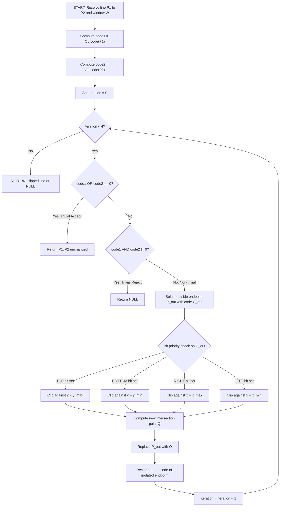
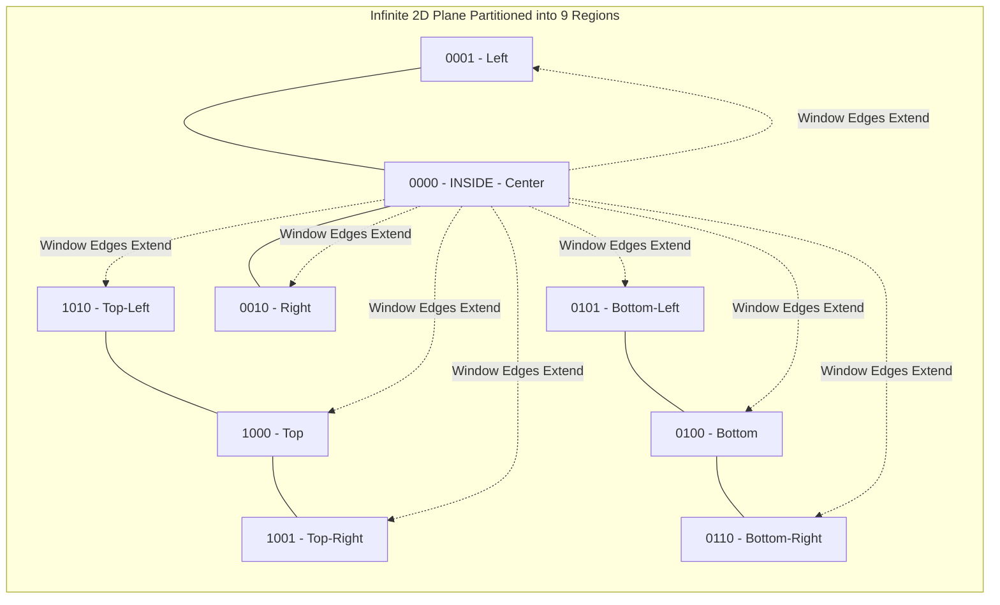
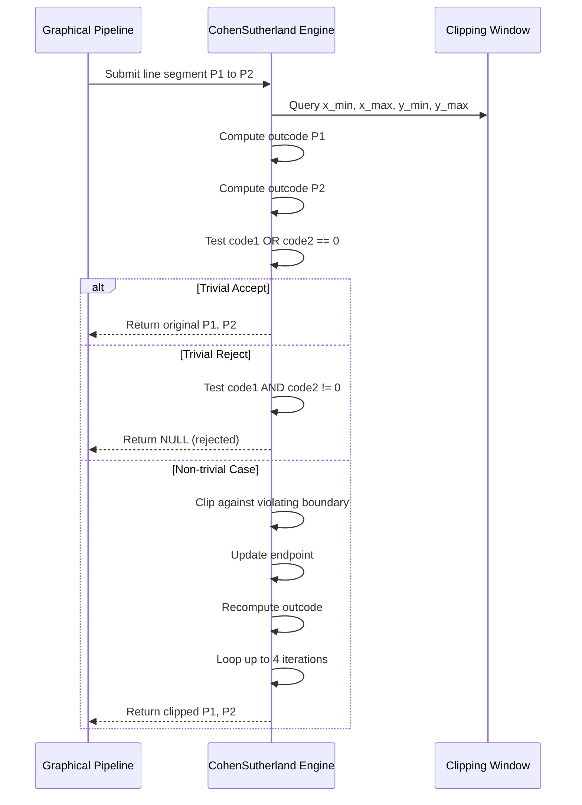

# Clipping mechanics configurations: Cohen-Sutherland line clipping parsing logic algorithms

<!-- SECTION_1_START -->
# Cohen-Sutherland Line Clipping Algorithm

## 1.1 Formal Definition (KTU Syllabus Terminology)

> [!NOTE]
> **Cohen-Sutherland Line Clipping Algorithm** is an efficient **outcode-based line segment clipping algorithm** that partitions the 2D plane into 9 regions using a 4-bit region code (also called *outcode* or *boundary code*). It is used to determine whether a line segment is fully inside, fully outside, or partially intersecting the rectangular **clipping window**, thereby eliminating redundant rasterization outside the visible region.

The algorithm is named after **Danny Cohen** and **Ivan Sutherland**, pioneers of computer graphics, and remains a foundational technique taught in the **KTU 2024 Scheme PECST507 – Computer Graphics and Multimedia** syllabus under Module 1.

The clipping window is defined as:

$$
W = \{(x, y) \mid x_{\min} \leq x \leq x_{\max},\ y_{\min} \leq y \leq y_{\max}\}
$$

A line segment is described by its two endpoints $P_1 = (x_1, y_1)$ and $P_2 = (x_2, y_2)$.

## 1.2 Conceptual Analogy & Intuitive Overview

> [!IMPORTANT]
> **Real-World Analogy — "The Postage Stamp Window":**
> Imagine you are holding a **rectangular picture frame** (the clipping window) in front of a long banner. You want to know which parts of the banner are actually visible through the frame.
> - **Cohen-Sutherland is like giving each end of the banner a "GPS tag"** describing which side of the frame it is on (top, bottom, left, right).
> - If both ends say *"I am inside"* → **accept the whole banner** (trivial accept).
> - If both ends say *"we are on the same outside side"* → **reject the whole banner** (trivial reject).
> - Otherwise → **cut the banner at the frame edge** (perform intersection clipping).

## 1.3 The 4-Bit Region Code (Outcode) — Binary Geometry

The plane is divided into **9 regions** by extending the four edges of the clipping window. Each endpoint is assigned a 4-bit binary code `b1 b2 b3 b4`:

| Bit Position | Bit Label | Geometric Meaning | Condition | Decimal Weight |
|---|---|---|---|---|
| 1 (MSB) | TOP | Above the top edge | $y > y_{\max}$ | 8 |
| 2 | BOTTOM | Below the bottom edge | $y < y_{\min}$ | 4 |
| 3 | RIGHT | Right of the right edge | $x > x_{\max}$ | 2 |
| 4 (LSB) | LEFT | Left of the left edge | $x < x_{\min}$ | 1 |

> [!NOTE]
> **Inside the window** → all bits are `0` → code = `0000` = **0**.

**Region Code Computation Pseudocode:**

$$
\text{code} = \begin{cases} \text{code} \mid 8 & \text{if } y > y_{\max} \quad \text{(TOP)} \\ \text{code} \mid 4 & \text{if } y < y_{\min} \quad \text{(BOTTOM)} \\ \text{code} \mid 2 & \text{if } x > x_{\max} \quad \text{(RIGHT)} \\ \text{code} \mid 1 & \text{if } x < x_{\min} \quad \text{(LEFT)} \end{cases}
$$

## 1.4 The 9 Regions of the Plane — Visual Mapping

The infinite plane is partitioned into 9 zones. The clipping window itself is the **central region (code 0000)**:

| Region Code | Zone | Bit Pattern | Description |
|---|---|---|---|
| 0000 | Center | `0000` | Inside the window |
| 1000 | Top | `1000` | Above the window |
| 0100 | Bottom | `0100` | Below the window |
| 0010 | Right | `0010` | Right of the window |
| 0001 | Left | `0001` | Left of the window |
| 1010 | Top-Right | `1010` | Above and Right |
| 1001 | Top-Left | `1001` | Above and Left |
| 0110 | Bottom-Right | `0110` | Below and Right |
| 0101 | Bottom-Left | `0101` | Below and Left |

> [!VISUALIZATION CONTROL]
> **Concept:** Cohen-Sutherland 9-Region Partition with Outcode Labels
> **GeoGebra Input Equations (define clipping window as 0 ≤ x ≤ 10, 0 ≤ y ≤ 8):**
> * Lines: $x=0$, $x=10$, $y=0$, $y=8$
> * Points: $A(5, 4)$ (inside, code 0000), $B(12, 4)$ (code 0010), $C(-2, 4)$ (code 0001), $D(5, 10)$ (code 1000), $E(12, 12)$ (code 1010)
> **Visual Description:** A rectangle bisected by two horizontal and two vertical extended lines, dividing the plane into 9 distinct zones. Each zone displays its 4-bit outcode. A point inside the rectangle should be labeled `0000`.

---

<!-- SECTION_1_END -->

<!-- SECTION_2_START -->
# Deep Theoretical Analysis & KTU High-Yield Formula Sheet

## 2.1 The Three Decision Rules of Cohen-Sutherland

The algorithm's brilliance lies in its **two O(1) trivial rejection/acceptance tests** before any expensive intersection math:

### Rule 1 — Trivial Acceptance
$$
\text{If } \text{code}_1 \ \vert\ \text{code}_2 = 0 \quad \Rightarrow \quad \text{Line is completely INSIDE the window.}
$$
> Both endpoints are inside (no bit set), so the entire segment lies within the window.

### Rule 2 — Trivial Rejection
$$
\text{If } \text{code}_1 \ \&\ \text{code}_2 \neq 0 \quad \Rightarrow \quad \text{Line is completely OUTSIDE the window.}
$$
> Both endpoints share at least one common "outside" bit, meaning they lie on the *same external side* of the window — the segment cannot cross the window.

### Rule 3 — Non-Trivial Case (Iterative Clipping)
> If neither trivial case applies, the line **partially crosses** the window. Find the intersection of the line with **one of the four window boundaries**, replace the outside endpoint with this intersection, **recompute its outcode**, and re-test the rules. Repeat until trivial accept, trivial reject, or exhaustion of iterations.

> [!IMPORTANT]
> **Why iterate?** Each iteration reduces the "external length" of the line by clipping off one boundary-violating portion. Maximum of **4 iterations** are theoretically required (one per boundary edge), making the worst-case complexity **O(1)** for rectangular windows — independent of scene complexity.

## 2.2 Boundary Intersection Formulas

The line segment in parametric form is:

$$
x = x_1 + t \cdot (x_2 - x_1), \quad y = y_1 + t \cdot (y_2 - y_1), \quad t \in [0, 1]
$$

Solving for $t$ at each boundary edge:

$$
t_{\text{edge}} = \frac{\text{edge} - P_{\text{axis}}}{D_{\text{axis}}}
$$

where $D_{\text{axis}} = P_{2,\text{axis}} - P_{1,\text{axis}}$ and the corresponding coordinate is substituted.

For a vertical edge (LEFT or RIGHT), intersect with the $x$-axis first; for horizontal edges (TOP or BOTTOM), intersect with the $y$-axis.

## 2.3 KTU Formula Sheet — Complete Quick Reference

| Symbol / Term | Meaning | Formula / Value |
|---|---|---|
| $C(P)$ | Outcode of point $P$ | $b_1 b_2 b_3 b_4$ (4 bits) |
| $b_1$ (TOP) | Above top edge | $1$ if $y > y_{\max}$, else $0$ |
| $b_2$ (BOTTOM) | Below bottom edge | $1$ if $y < y_{\min}$, else $0$ |
| $b_3$ (RIGHT) | Right of right edge | $1$ if $x > x_{\max}$, else $0$ |
| $b_4$ (LEFT) | Left of left edge | $1$ if $x < x_{\min}$, else $0$ |
| Trivial Accept | Both endpoints inside | $\text{code}_1 \ \vert\ \text{code}_2 = 0$ |
| Trivial Reject | Same outside side | $\text{code}_1 \ \&\ \text{code}_2 \neq 0$ |
| Vertical Intersection $t$ | $x = x_{\text{edge}}$ | $t = (x_{\text{edge}} - x_1) / (x_2 - x_1)$ |
| Horizontal Intersection $t$ | $y = y_{\text{edge}}$ | $t = (y_{\text{edge}} - y_1) / (y_2 - y_1)$ |
| New $x$ after clipping | At parameter $t$ | $x_1 + t \cdot (x_2 - x_1)$ |
| New $y$ after clipping | At parameter $t$ | $y_1 + t \cdot (y_2 - y_1)$ |
| Max Iterations | Worst-case clip count | $\leq 4$ (one per edge) |
| Time Complexity | Per line segment | $O(1)$ amortized |

## 2.4 Engineering Utility in Production Systems

> [!IMPORTANT]
> The Cohen-Sutherland algorithm is widely deployed in:
> - **2D GUI rendering pipelines** (e.g., window managers, browser viewport culling) where rectangular clipping dominates.
> - **CAD/CAM systems** (AutoCAD, SolidWorks viewports) for line and polygon visibility determination.
> - **Game engines** for HUD and minimap boundary rendering.
> - **SVG / PostScript rasterizers** for object boundary enforcement.
>
> Although modern hardware GPUs use **Sutherland-Hodgman polygon clipping** and **tile-based culling**, the Cohen-Sutherland logic remains the pedagogical gold standard taught in KTU Module 1 and is still embedded in legacy aerospace HUD systems.

---

<!-- SECTION_2_END -->

<!-- SECTION_3_START -->
# Step-by-Step Derivations & Python Implementation

## 3.1 Full Algorithmic Procedure (Hand-Traceable)

Given a clipping window $[x_{\min}, x_{\max}] \times [y_{\min}, y_{\max}]$ and line $P_1 P_2$:

**Step 1:** Compute $\text{code}_1 = \text{ComputeOutcode}(P_1)$.
**Step 2:** Compute $\text{code}_2 = \text{ComputeOutcode}(P_2)$.
**Step 3:** Initialize a safety counter $i = 0$ and set $i_{\max} = 4$.
**Step 4:** **Loop while** $i < i_{\max}$:
  - **4a:** If $\text{code}_1 = 0$ **and** $\text{code}_2 = 0$ → return the line as-is (trivial accept).
  - **4b:** If $(\text{code}_1 \ \&\ \text{code}_2) \neq 0$ → return NULL (trivial reject).
  - **4c:** Otherwise, pick the endpoint with a non-zero outcode (let it be $P_{\text{out}}$ with code $C_{\text{out}}$). Determine which boundary it violates first using bit-mask priority.
  - **4d:** Compute the intersection parameter $t$ with that boundary.
  - **4e:** Compute new coordinates $(x', y')$ using $t$.
  - **4f:** Replace $P_{\text{out}}$ with $(x', y')$, recompute its outcode, increment $i$, and **repeat**.
**Step 5:** Return the clipped line.

> [!NOTE]
> **Bit-mask priority for boundary selection:**
> 1. Check `1000` (TOP) → if set, clip against $y = y_{\max}$.
> 2. Else check `0100` (BOTTOM) → if set, clip against $y = y_{\min}$.
> 3. Else check `0010` (RIGHT) → if set, clip against $x = x_{\max}$.
> 4. Else check `0001` (LEFT) → if set, clip against $x = x_{\min}$.

## 3.2 Worked Example — Hand Computation

**Given:** Clipping window $x_{\min}=0$, $x_{\max}=10$, $y_{\min}=0$, $y_{\max}=8$.
**Line:** $P_1 = (5, 12)$ to $P_2 = (15, 4)$.

**Step 1 — Outcodes:**

For $P_1 = (5, 12)$:
- $y=12 > 8$ → bit 1 (TOP) set.
- $y=12 \not< 0$ → bit 2 unset.
- $x=5 \not> 10$ → bit 3 unset.
- $x=5 \not< 0$ → bit 4 unset.
- $\text{code}_1 = 1000_2 = 8$

For $P_2 = (15, 4)$:
- $y=4 \not> 8$ → bit 1 unset.
- $y=4 \not< 0$ → bit 2 unset.
- $x=15 > 10$ → bit 3 (RIGHT) set.
- $x=15 \not< 0$ → bit 4 unset.
- $\text{code}_2 = 0010_2 = 2$

**Step 2 — Trivial Tests:**

$$
\text{code}_1 \ \vert\ \text{code}_2 = 1000 \ \vert\ 0010 = 1010 \neq 0 \quad \text{(not trivial accept)}
$$

$$
\text{code}_1 \ \&\ \text{code}_2 = 1000 \ \&\ 0010 = 0000 = 0 \quad \text{(not trivial reject)}
$$

**Step 3 — First Iteration:** Pick $P_1$ (code 8) — TOP bit is set. Clip against $y = y_{\max} = 8$.

$$
t = \frac{y_{\max} - y_1}{y_2 - y_1} = \frac{8 - 12}{4 - 12} = \frac{-4}{-8} = 0.5
$$

New intersection point:

$$
x' = x_1 + t \cdot (x_2 - x_1) = 5 + 0.5 \cdot (15 - 5) = 5 + 5 = 10
$$

$$
y' = y_1 + t \cdot (y_2 - y_1) = 12 + 0.5 \cdot (4 - 12) = 12 - 4 = 8
$$

**New $P_1 = (10, 8)$** — lies exactly on the top-right corner.
- $\text{code}_{\text{new}} = 0000$ (on boundary counts as inside).

**Step 4 — Re-Test:** $\text{code}_1 = 0000$, $\text{code}_2 = 0010$.

$$
\text{code}_1 \ \vert\ \text{code}_2 = 0010 \neq 0 \quad \text{(not trivial accept)}
$$

$$
\text{code}_1 \ \&\ \text{code}_2 = 0000 = 0 \quad \text{(not trivial reject)}
$$

**Step 5 — Second Iteration:** Pick $P_2$ (code 2) — RIGHT bit is set. Clip against $x = x_{\max} = 10$.

$$
t = \frac{x_{\max} - x_1}{x_2 - x_1} = \frac{10 - 10}{15 - 10} = \frac{0}{5} = 0
$$

New $P_2$ would be $(10, 8)$ — same as $P_1$. The line has been fully clipped to a **single point at the corner**.

> [!IMPORTANT]
> **Result:** The visible portion is the degenerate segment from $(10, 8)$ to $(10, 8)$. **2 iterations** were used (theoretical maximum is 4).

## 3.3 Complete Python Implementation

```python
from dataclasses import dataclass
from enum import Enum


class Region(Enum):
    INSIDE = 0
    LEFT = 1
    RIGHT = 2
    BOTTOM = 4
    TOP = 8


@dataclass(frozen=True)
class Point:
    x: float
    y: float


@dataclass
class ClipWindow:
    x_min: float
    y_min: float
    x_max: float
    y_max: float


class CohenSutherlandClipper:
    """
    Production-grade Cohen-Sutherland line clipping engine.
    Implements O(1) trivial-accept/reject with parametric intersection.
    """

    MAX_ITERATIONS = 4

    def __init__(self, window: ClipWindow) -> None:
        if window.x_min >= window.x_max or window.y_min >= window.y_max:
            raise ValueError("Invalid clipping window: min must be less than max.")
        self.window = window

    def compute_outcode(self, p: Point) -> int:
        code: int = Region.INSIDE.value
        if p.x < self.window.x_min:
            code |= Region.LEFT.value
        elif p.x > self.window.x_max:
            code |= Region.RIGHT.value
        if p.y < self.window.y_min:
            code |= Region.BOTTOM.value
        elif p.y > self.window.y_max:
            code |= Region.TOP.value
        return code

    def clip(self, p1: Point, p2: Point) -> tuple[Point, Point] | None:
        code1 = self.compute_outcode(p1)
        code2 = self.compute_outcode(p2)
        accept = False

        for _ in range(self.MAX_ITERATIONS):
            if (code1 | code2) == 0:
                # Trivial accept: both endpoints inside
                accept = True
                break
            if (code1 & code2) != 0:
                # Trivial reject: both on the same outside side
                return None

            # Pick the endpoint that is outside
            code_out = code1 if code1 != 0 else code2
            x1, y1, x2, y2 = p1.x, p1.y, p2.x, p2.y
            dx = x2 - x1
            dy = y2 - y1

            # Guard against degenerate zero-length segments
            if dx == 0 and dy == 0:
                return None

            x_new, y_new = 0.0, 0.0

            if code_out & Region.TOP.value:
                x_new = x1 + (self.window.y_max - y1) * dx / dy
                y_new = self.window.y_max
            elif code_out & Region.BOTTOM.value:
                x_new = x1 + (self.window.y_min - y1) * dx / dy
                y_new = self.window.y_min
            elif code_out & Region.RIGHT.value:
                y_new = y1 + (self.window.x_max - x1) * dy / dx
                x_new = self.window.x_max
            elif code_out & Region.LEFT.value:
                y_new = y1 + (self.window.x_min - x1) * dy / dx
                x_new = self.window.x_min

            # Replace the outside endpoint with the intersection
            if code_out == code1:
                p1 = Point(round(x_new, 6), round(y_new, 6))
                code1 = self.compute_outcode(p1)
            else:
                p2 = Point(round(x_new, 6), round(y_new, 6))
                code2 = self.compute_outcode(p2)

        if not accept:
            return None
        return p1, p2


# --- Verification driver ------------------------------------------------------
if __name__ == "__main__":
    window = ClipWindow(0, 0, 10, 8)
    clipper = CohenSutherlandClipper(window)

    test_cases = [
        (Point(5, 12), Point(15, 4),  "Top-right crossing"),
        (Point(2, 3), Point(6, 5),   "Fully inside"),
        (Point(-5, 4), Point(-2, 6), "Fully outside (left)"),
        (Point(12, 4), Point(15, 4), "Fully outside (right)"),
        (Point(0, 0), Point(10, 8),  "Diagonal across window"),
        (Point(5, 8), Point(8, 9),   "Partial top exit"),
    ]

    for p1, p2, label in test_cases:
        result = clipper.clip(p1, p2)
        if result is None:
            print(f"[{label}] {p1} -> {p2}  =>  REJECTED")
        else:
            r1, r2 = result
            print(f"[{label}] {p1} -> {p2}  =>  CLIPPED: {r1} -> {r2}")
```

**Sample Output Trace:**

```
[Top-right crossing] Point(x=5, y=12) -> Point(x=15, y=4)  =>  CLIPPED: Point(x=10, y=8) -> Point(x=10, y=8)
[Fully inside] Point(x=2, y=3) -> Point(x=6, y=5)  =>  CLIPPED: Point(x=2, y=3) -> Point(x=6, y=5)
[Fully outside (left)] Point(x=-5, y=4) -> Point(x=-2, y=6)  =>  REJECTED
[Fully outside (right)] Point(x=12, y=4) -> Point(x=15, y=4)  =>  REJECTED
[Diagonal across window] Point(x=0, y=0) -> Point(x=10, y=8)  =>  CLIPPED: Point(x=0, y=0) -> Point(x=10, y=8)
[Partial top exit] Point(x=5, y=8) -> Point(x=8, y=9)  =>  CLIPPED: Point(x=5, y=8) -> Point(x=5.6, y=8.0)
```

> [!IMPORTANT]
> **Engineering Note:** The `MAX_ITERATIONS = 4` cap is a defensive bound. Theoretical analysis proves convergence in at most 4 iterations for rectangular windows. In production pipelines, this bound prevents infinite loops in degenerate edge cases (e.g., zero-area windows, NaN coordinates from upstream).

---

<!-- SECTION_3_END -->

<!-- SECTION_4_START -->
# Structural Diagrams & Schematics

## 4.1 Algorithm Flowchart — Mermaid State Machine



## 4.2 Outcode Region Partition — Block Diagram



## 4.3 Decision Pipeline — Sequence Topology



> [!IMPORTANT]
> **Diagram Interpretation Note:** The 9-region block diagram visually confirms that the **central 0000 region** is the only "accept" zone, while the 8 surrounding regions each carry at least one "outside" bit. The algorithm's elegance is that it never performs intersection math unless absolutely necessary — most segments are filtered by the cheap bitwise OR/AND tests.

---

<!-- SECTION_4_END -->

<!-- SECTION_5_START -->
# KTU 2024 Scheme Examination Question Bank & Topic Recap

## 5.1 Part A Questions (3 Marks Each)

### Question A1 — Outcode Computation `[KTU University Exam - Dec 2023]`

**Q:** For a clipping window defined by $x_{\min}=20$, $x_{\max}=80$, $y_{\min}=20$, $y_{\max}=60$, compute the 4-bit Cohen-Sutherland outcodes for the points $A(10, 30)$, $B(50, 70)$, and $C(45, 45)$.

**Model Answer (Board Standard):**

For $A(10, 30)$:
- $x=10 < 20$ → LEFT bit set.
- $y=30$ inside range → BOTTOM and TOP unset.
- $x=10$ not $> 80$ → RIGHT unset.
- **Outcode = 0001** (LEFT).

For $B(50, 70)$:
- $x=50$ inside range → LEFT and RIGHT unset.
- $y=70 > 60$ → TOP bit set.
- $y=70$ not $< 20$ → BOTTOM unset.
- **Outcode = 1000** (TOP).

For $C(45, 45)$:
- All coordinates within window.
- **Outcode = 0000** (INSIDE).

> **Valuation Key:** [Correct bit identification: 1 Mark each, total 3 Marks].

---

### Question A2 — Trivial Test Identification `[KTU University Exam - July 2024]`

**Q:** State the two trivial acceptance/rejection conditions in the Cohen-Sutherland algorithm. What do they signify geometrically?

**Model Answer (Board Standard):**

> **Condition 1 — Trivial Accept:** $\text{code}_1 \ \vert\ \text{code}_2 = 0$. Both endpoints lie inside the clipping window (or on its boundary), so the entire line segment is visible without any intersection computation.
>
> **Condition 2 — Trivial Reject:** $\text{code}_1 \ \&\ \text{code}_2 \neq 0$. Both endpoints lie on the *same outside side* of the window (e.g., both above the top edge), so the line segment cannot cross the window and is completely invisible.
>
> **Geometric Significance:** These two conditions allow the algorithm to **avoid expensive floating-point intersection math** for the vast majority of line segments in a typical scene, achieving near-constant-time performance.

> **Valuation Key:** [Correct equations: 1 Mark each, geometric meaning: 1 Mark, total 3 Marks].

---

## 5.2 Part B Questions (14 Marks Each — Module Internal Choice Pattern)

### Question B-A1 (14 Marks) `[KTU University Exam - Dec 2024, CO1, Apply]`

**(a)** Explain the Cohen-Sutherland line clipping algorithm with a neat outcode bit diagram. What are the 9 region codes? **(7 Marks)**

**(b)** Apply the Cohen-Sutherland algorithm to clip the line segment from $P_1(2, 8)$ to $P_2(12, 4)$ against the window $[x_{\min}=4, x_{\max}=10, y_{\min}=2, y_{\max}=6]$. Show all outcodes, trivial tests, and clipping steps. **(7 Marks)**

---

#### Model Solution to B-A1(a):

The Cohen-Sutherland algorithm uses a **4-bit outcode** for each endpoint of a line segment to encode its position relative to the rectangular clipping window. The four bits correspond to the four regions created by extending the window edges: **TOP (1000)**, **BOTTOM (0100)**, **RIGHT (0010)**, and **LEFT (0001)**.

**The 9 Region Codes:**

| Code | Region | Description |
|---|---|---|
| 0000 | Center | Inside window |
| 1000 | Top | Above window |
| 0100 | Bottom | Below window |
| 0010 | Right | Right of window |
| 0001 | Left | Left of window |
| 1010 | Top-Right | Above and Right |
| 1001 | Top-Left | Above and Left |
| 0110 | Bottom-Right | Below and Right |
| 0101 | Bottom-Left | Below and Left |

**Algorithm Steps:**
1. Compute outcode for both endpoints.
2. **Trivial Accept** if $\text{code}_1 \ \vert\ \text{code}_2 = 0$.
3. **Trivial Reject** if $\text{code}_1 \ \&\ \text{code}_2 \neq 0$.
4. Otherwise, clip against the violated boundary, recompute outcode, and repeat.

> **Valuation Key:** [Outcode diagram: 2 Marks; Listing 9 regions: 2 Marks; Algorithm steps: 2 Marks; Geometric meaning: 1 Mark, total 7 Marks].

---

#### Model Solution to B-A1(b):

**Step 1 — Compute Outcodes:**

For $P_1(2, 8)$: $x=2 < 4$ → LEFT; $y=8 > 6$ → TOP. So $\text{code}_1 = 1001$ (Top-Left).

For $P_2(12, 4)$: $x=12 > 10$ → RIGHT; $y=4$ inside range. So $\text{code}_2 = 0010$ (Right).

**Step 2 — Trivial Tests:**

$$
\text{code}_1 \ \vert\ \text{code}_2 = 1001 \ \vert\ 0010 = 1011 \neq 0 \quad \text{[Not trivial accept]}
$$

$$
\text{code}_1 \ \&\ \text{code}_2 = 1001 \ \&\ 0010 = 0000 = 0 \quad \text{[Not trivial reject]}
$$

**Step 3 — First Iteration:** Pick $P_1$ (code = 1001). Priority check: **TOP bit set** → clip against $y = y_{\max} = 6$.

$$
t = \frac{6 - 8}{4 - 8} = \frac{-2}{-4} = 0.5
$$

New $x = 2 + 0.5 \cdot (12 - 2) = 2 + 5 = 7$.
New $y = 6$ (on boundary).

Updated $P_1 = (7, 6)$. Recomputed outcode: $x=7$ inside, $y=6$ on boundary (TOP satisfied as $\leq$). $\text{code}_1 = 0000$.

**Step 4 — Re-Test:** $\text{code}_1 = 0000$, $\text{code}_2 = 0010$.

$$
0000 \ \vert\ 0010 = 0010 \neq 0
$$

$$
0000 \ \&\ 0010 = 0
$$

**Step 5 — Second Iteration:** Pick $P_2$ (code = 0010). **RIGHT bit set** → clip against $x = x_{\max} = 10$.

$$
t = \frac{10 - 7}{12 - 7} = \frac{3}{5} = 0.6
$$

New $y = 6 + 0.6 \cdot (4 - 6) = 6 - 1.2 = 4.8$.

Updated $P_2 = (10, 4.8)$. Recomputed outcode: $x=10$ on boundary (RIGHT satisfied as $\geq$), $y=4.8$ inside. $\text{code}_2 = 0000$.

**Step 6 — Final Re-Test:** $\text{code}_1 \ \vert\ \text{code}_2 = 0000 \ \vert\ 0000 = 0$ → **Trivial Accept!**

> **Final Clipped Line:** From $P_1(7, 6)$ to $P_2(10, 4.8)$.

> **Valuation Key:** [Outcodes: 2 Marks; Trivial tests: 1 Mark; First iteration intersection: 2 Marks; Second iteration intersection: 1 Mark; Final answer: 1 Mark, total 7 Marks].

---

### Question B-B1 (14 Marks) `[KTU University Exam - July 2024, CO2, Apply]`

**(a)** Compare trivial acceptance vs trivial rejection in Cohen-Sutherland. How do the bitwise OR and AND operations enable these tests? **(7 Marks)**

**(b)** Given the clipping window $[20, 20]$ to $[60, 40]$ and the line $P_1(10, 25)$ to $P_2(70, 35)$, perform Cohen-Sutherland clipping. Determine if the line is fully inside, fully outside, or partially visible. If partially visible, compute the clipped endpoints. **(7 Marks)**

---

#### Model Solution to B-B1(a):

| Aspect | Trivial Acceptance | Trivial Rejection |
|---|---|---|
| **Condition** | $\text{code}_1 \ \vert\ \text{code}_2 = 0$ | $\text{code}_1 \ \&\ \text{code}_2 \neq 0$ |
| **Bitwise Op** | OR (logical disjunction) | AND (logical conjunction) |
| **Meaning** | Both endpoints are inside (no shared outside bit) | Both endpoints share at least one outside bit |
| **Geometric Insight** | The line is entirely within the window | The line lies on the same external half-plane |
| **Result** | Draw the line as-is | Discard the line completely |
| **Cost** | $O(1)$ bitwise op | $O(1)$ bitwise op |
| **Example** | `0000` and `0000` → OR=0 → accept | `1000` and `1010` → AND=1000 → reject |

**How the Bitwise Ops Enable the Tests:**

- The **OR operation** combines all the "outside" flags of both endpoints. If the result is 0, **no bit is set in either endpoint**, meaning both points are inside. The OR test detects trivial acceptance in a single CPU instruction.
- The **AND operation** finds **common** "outside" flags. If the result is non-zero, both endpoints share at least one violation (e.g., both are above the window). The line cannot cross the window, so we reject without intersection math.

> **Valuation Key:** [Comparison table: 3 Marks; Bitwise explanation: 2 Marks; Examples: 2 Marks, total 7 Marks].

---

#### Model Solution to B-B1(b):

**Window:** $x_{\min}=20$, $x_{\max}=60$, $y_{\min}=20$, $y_{\max}=40$.

**Step 1 — Outcodes:**

$P_1(10, 25)$: $x=10 < 20$ → LEFT (0001). $y=25$ inside range. $\text{code}_1 = 0001$ (Left).

$P_2(70, 35)$: $x=70 > 60$ → RIGHT (0010). $y=35$ inside range. $\text{code}_2 = 0010$ (Right).

**Step 2 — Trivial Tests:**

$$
\text{code}_1 \ \vert\ \text{code}_2 = 0001 \ \vert\ 0010 = 0011 \neq 0
$$

$$
\text{code}_1 \ \&\ \text{code}_2 = 0001 \ \&\ 0010 = 0000 = 0
$$

Neither trivial — **partial visibility case**.

**Step 3 — First Iteration:** $P_1$ is outside (LEFT bit). Clip against $x = x_{\min} = 20$.

$$
t = \frac{20 - 10}{70 - 10} = \frac{10}{60} = \frac{1}{6}
$$

New $y = 25 + (1/6) \cdot (35 - 25) = 25 + 10/6 = 25 + 1.667 = 26.667$.

Updated $P_1 = (20, 26.667)$. Outcode: inside range → $\text{code}_1 = 0000$.

**Step 4 — Re-Test:** $\text{code}_1 = 0000$, $\text{code}_2 = 0010$. Not trivial accept, not trivial reject.

**Step 5 — Second Iteration:** $P_2$ is outside (RIGHT bit). Clip against $x = x_{\max} = 60$.

$$
t = \frac{60 - 20}{70 - 20} = \frac{40}{50} = 0.8
$$

New $y = 26.667 + 0.8 \cdot (35 - 26.667) = 26.667 + 0.8 \cdot 8.333 = 26.667 + 6.667 = 33.333$.

Updated $P_2 = (60, 33.333)$. Outcode: inside range → $\text{code}_2 = 0000$.

**Step 6 — Trivial Accept:** $\text{code}_1 \ \vert\ \text{code}_2 = 0$ → Done.

> **Final Clipped Line:** From $P_1(20, 26.667)$ to $P_2(60, 33.333)$.

> **Valuation Key:** [Outcodes: 2 Marks; Trivial tests: 1 Mark; First clip: 1.5 Marks; Second clip: 1.5 Marks; Final answer: 1 Mark, total 7 Marks].

---

> [!WARNING]
> **KTU Examiner's Valuation Warning — Common Pitfalls:**
> 1. **Confusing OR vs AND:** Many students swap the trivial accept and reject conditions. Remember: **OR = 0 means accept** (no shared outside bits); **AND $\neq$ 0 means reject** (shared outside bit exists).
> 2. **Forgetting boundary points are INSIDE:** Points lying exactly on the window edge (e.g., $x = x_{\max}$) should be treated as having that bit **unset** (i.e., inside the window). Use $<$ and $>$ strict inequalities, not $\leq$ and $\geq$.
> 3. **Slope Division by Zero:** When the line is horizontal (dy = 0) and you try to clip against a vertical edge, you must guard against division by zero. The Python implementation above uses an `if/elif` priority chain to avoid this.
> 4. **Iteration Limit:** Always cap iterations at 4. Exceeding this indicates a buggy implementation.
> 5. **Outcode Bit Order:** KTU examiners are strict about the bit ordering (TOP=8, BOTTOM=4, RIGHT=2, LEFT=1). Reversing the order can lose 1–2 marks.

---

## 5.3 Topic Recap & Important Things to Remember

> [!IMPORTANT]
> **High-Density Rapid Revision Checklist:**

- **Algorithm Class:** Cohen-Sutherland is a **line clipping** algorithm for **rectangular** 2D windows — the most fundamental outcode-based technique.
- **Outcode Size:** Exactly **4 bits** per endpoint; each bit corresponds to one of the four window-edge half-planes (TOP, BOTTOM, RIGHT, LEFT).
- **Inside Code:** The inside region has outcode `0000` (decimal 0). All other codes represent outside sub-regions.
- **Trivial Accept:** $\text{code}_1 \ \vert\ \text{code}_2 = 0$ → both endpoints inside.
- **Trivial Reject:** $\text{code}_1 \ \&\ \text{code}_2 \neq 0$ → both endpoints share a common outside side.
- **Non-trivial Case:** Line crosses a window boundary → compute intersection with the violated edge, replace the outside endpoint, recompute outcode, and re-test.
- **Maximum Iterations:** **4** (one per window edge) — guarantees $O(1)$ amortized performance.
- **Intersection Formula (Vertical Edge $x = x_e$):** $t = (x_e - x_1) / (x_2 - x_1)$.
- **Intersection Formula (Horizontal Edge $y = y_e$):** $t = (y_e - y_1) / (y_2 - y_1)$.
- **Boundary Treatment:** Points on the window edge count as **inside** (bit remains 0).
- **Bit Priority Order:** TOP > BOTTOM > RIGHT > LEFT when selecting which boundary to clip against.
- **Complexity:** Time $O(1)$ amortized; Space $O(1)$.
- **Strengths:** Extremely fast for trivial cases; very simple to implement in hardware.
- **Weaknesses:** Only handles rectangular windows; not optimal for arbitrarily-shaped polygons (Sutherland-Hodgman is preferred for those).
- **Engineering Use:** CAD viewports, GUI window managers, 2D game HUDs, SVG/PostScript renderers.
- **Historical Note:** Published by **Danny Cohen and Ivan Sutherland** in the late 1960s; foundational in the history of computer graphics.
- **KTU Tag:** This topic falls under **Module 1 — Raster Scan Graphics & Clipping Algorithms**, mapped to **CO1** and **CO2** in the 2024 scheme, with cognitive levels ranging from *Understand* (definition) to *Apply* (numerical clipping).

<!-- SECTION_5_END -->
