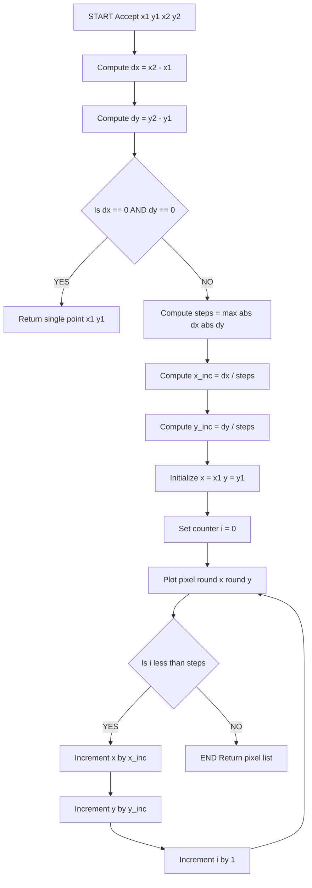
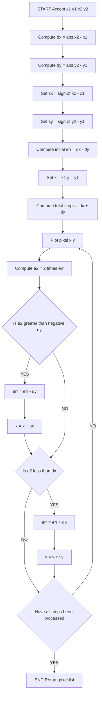
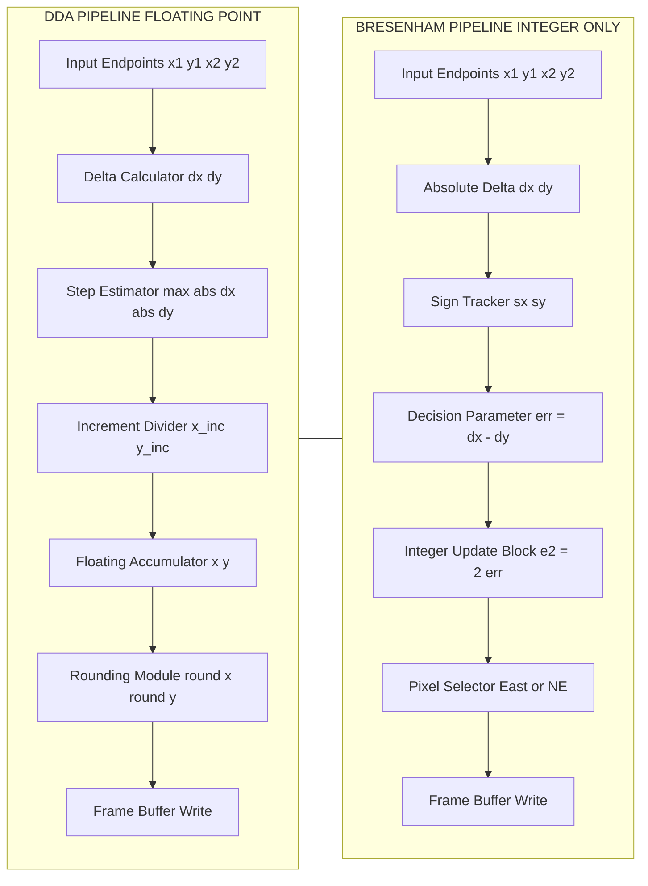
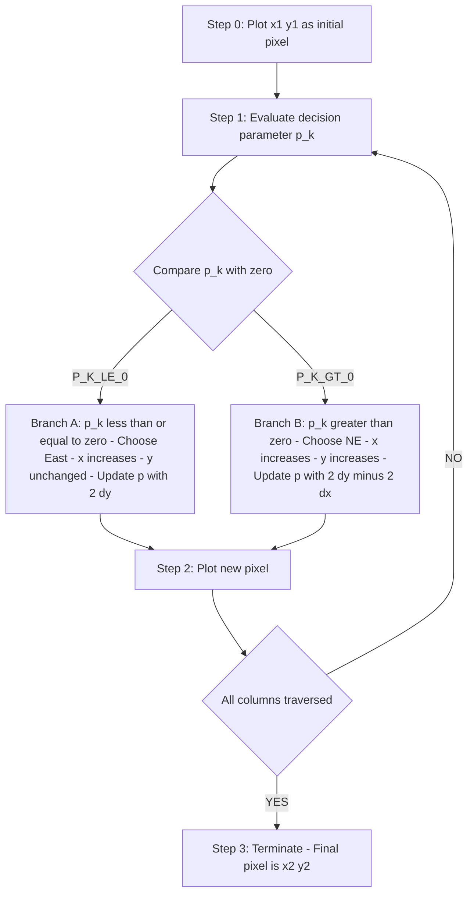

# Line drawing routines execution structures: Bresenham's, DDA mathematical rules

<!-- SECTION_1_START -->

# 1. Core Technical Definition & Intuitive Overview

## 1.1 Digital Differential Analyzer (DDA) Line Algorithm

### Formal KTU 2024 Definition
The **Digital Differential Analyzer (DDA)** is a scan-conversion algorithm used in computer graphics to rasterize a straight line segment between two specified endpoints $(x_1, y_1)$ and $(x_2, y_2)$. It samples the line at uniformly spaced intervals along one axis and computes the corresponding integer pixel positions on the other axis using the differential equation $y = mx + c$, where $m = \frac{\Delta y}{\Delta x}$ is the slope of the line.

> [!IMPORTANT]
> **KTU 2024 Syllabus Highlight:** DDA belongs to Module 1 under the topic *"Line drawing routines execution structures."* It is a *floating-point intensive* algorithm and is generally presented in contrast to Bresenham's *integer-only* approach for board evaluation purposes.

### Conceptual Analogy / Intuition
Imagine you are a **carpenter marking a wall** to draw a straight diagonal line between two fixed points using a chalk. Instead of trying to plot every fractional point (which is impossible on a discrete wall made of bricks), you decide: *"For every 1 brick I move horizontally, I will move approximately 0.6 bricks vertically."* The DDA does **exactly this**: it asks — *"How much should $y$ change for every unit step in $x$?"* — and then accumulates the change step-by-step. The result is a stair-step approximation that visually appears as a straight line.

> [!NOTE]
> The core weakness of the DDA is **rounding accumulation error**. Because each new point is computed from the *previous floating-point value*, tiny rounding errors compound over long lines, leading to visible drift from the true geometric line.

## 1.2 Bresenham's Line Algorithm

### Formal KTU 2024 Definition
**Bresenham's Line Algorithm** (1962, Jack Bresenham, IBM) is an *incremental*, *integer-arithmetic-only* scan-conversion algorithm that selects the optimal rasterized pixel at each step by evaluating a **decision parameter** $p_k$. It eliminates floating-point operations entirely, making it the industry-standard for hardware-accelerated line rendering in GPUs, display controllers, and embedded graphics pipelines.

> [!IMPORTANT]
> **Why this matters in KTU exams:** Bresenham's is the *most frequently asked* line-drawing algorithm in KTU 2024 university examinations because it tests the student's ability to derive the decision parameter — a core OBE (Outcome-Based Education) skill under **CO1 (Apply)**.

### Conceptual Analogy / Intuition
Think of Bresenham's as a **judicious hiker** climbing a slope. At every step, the hiker asks: *"Should I move one step East (RHS) or one step North-East (diagonal)?"* The hiker does *not* recalculate the entire slope at every position. Instead, the hiker keeps a small mental variable — the **decision parameter** $p_k$ — and updates it incrementally. If the previous step was already *above* the true line, take the diagonal step (NE); if *below*, take the East step (E). This is exactly what Bresenham's does: at each column, it tests a *signed distance error* to the true line and picks the closer pixel.

> [!NOTE]
> **Zero floating-point operations.** All updates use additions, subtractions, and left-shifts (multiplication by 2). This is why Bresenham's is **preferred for FPGA/ASIC/VLSI** graphics hardware design.

## 1.3 Key Physical / Mathematical Constants

- **Pixel Grid Resolution:** Standard display grid is integer-valued $\mathbb{Z}^2$. No sub-pixel coordinates are valid output.
- **Decision Parameter Initial Value:** $p_0 = 2\Delta y - \Delta x$ (for slope $m \leq 1$, $\Delta x \geq 0$).
- **Step Count (DDA):** $\text{steps} = \max(\vert \Delta x \vert, \vert \Delta y \vert) \geq \textbf{1}$ (in pixels).
- **Symmetry of Bresenham:** Eight octants are handled by mirroring about $y = x$, $y = 0$, and $x = 0$ axes — a single octant code suffices.

> [!VISUALIZATION CONTROL]
> **Concept:** Visualizing the rasterization of a line $y = 0.4x + 1$ from $(2, 1)$ to $(10, 5)$.
> **GeoGebra / Desmos Input Equations:**
> * `f(x) = 0.4 x + 1`
> * Point: `(2, 1)`
> * Point: `(10, 5)`
> * Sequence: `L_x = {2, 3, 4, 5, 6, 7, 8, 9, 10}` and `L_y = round(0.4 * L_x + 1)`
> **Visual Description:** A continuous blue line passes through both endpoints. Discrete red dots (pixels) lie *on or adjacent to* the blue line, illustrating the staircase rasterization effect. The student should observe how DDA and Bresenham's select *slightly different* pixels at fractional boundaries.

---

<!-- SECTION_1_END -->

<!-- SECTION_2_START -->

# 2. Deep Theoretical Analysis & KTU High-Yield Formula Sheet

## 2.1 Mathematical Foundation of DDA

The DDA algorithm exploits the differential form of the line equation. From $y = mx + c$, the differential increments are:

$$\Delta y = m \cdot \Delta x$$

For a single step along the dominant axis, the per-step increments are computed as:

$$x_{i+1} = x_i + \frac{\Delta x}{\text{steps}}, \quad y_{i+1} = y_i + \frac{\Delta y}{\text{steps}}$$

where $\text{steps} = \max(\vert \Delta x \vert, \vert \Delta y \vert)$ ensures the line is sampled at unit pixel resolution along its longest projected axis.

### Step-by-Step Logic of DDA

1. **Accept endpoints** $(x_1, y_1)$ and $(x_2, y_2)$ as integer inputs.
2. **Compute** $\Delta x = x_2 - x_1$ and $\Delta y = y_2 - y_1$.
3. **Determine step count** as $\text{steps} = \max(\vert \Delta x \vert, \vert \Delta y \vert)$. If $\text{steps} = 0$, plot a single point.
4. **Compute floating-point increments** $x_{\text{inc}} = \frac{\Delta x}{\text{steps}}$ and $y_{\text{inc}} = \frac{\Delta y}{\text{steps}}$.
5. **Initialize** $(x, y) = (x_1, y_1)$ as floating-point variables.
6. **Iterate** $i = 1$ to $\text{steps}$: plot pixel at $(\text{round}(x), \text{round}(y))$; then $x \leftarrow x + x_{\text{inc}}$; $y \leftarrow y + y_{\text{inc}}$.
7. **Termination:** After $\text{steps}$ iterations, the endpoint $(x_2, y_2)$ is reached.

> [!IMPORTANT]
> **Why `steps = max(|dx|, |dy|)`?** This guarantees that the line is sampled at *every pixel column* (for shallow slopes) or *every pixel row* (for steep slopes), preventing the line from appearing broken or disjoint.

## 2.2 Mathematical Foundation of Bresenham's Algorithm

Bresenham's algorithm works by tracking the **signed error** between the true mathematical line and the nearest chosen pixel. Consider the case $0 \leq m \leq 1$ (shallow positive slope) and $\Delta x > 0$.

At column $x_k$, suppose we have plotted pixel $(x_k, y_k)$. Two candidate pixels for column $x_{k+1} = x_k + 1$ are:

- **Lower candidate:** $E = (x_k + 1, y_k)$ — error $e_{\text{lower}} = y_{\text{true}} - y_k$
- **Upper candidate:** $NE = (x_k + 1, y_k + 1)$ — error $e_{\text{upper}} = (y_k + 1) - y_{\text{true}}$

The decision parameter is defined as the difference of these two errors (scaled by $\Delta x$ to keep things integer):

$$p_k = \Delta x \cdot (e_{\text{lower}} - e_{\text{upper}})$$

This simplifies to the canonical form used in all KTU textbooks:

$$p_k = 2 \Delta y \cdot x_k - 2 \Delta x \cdot y_k + c$$

For incremental computation, the update rule is:

$$p_{k+1} = p_k + 2 \Delta y \quad \text{if } p_k \leq 0 \quad \text{(choose East)}$$

$$p_{k+1} = p_k + 2(\Delta y - \Delta x) \quad \text{if } p_k > 0 \quad \text{(choose North-East)}$$

with initial value $p_0 = 2 \Delta y - \Delta x$.

### Step-by-Step Logic of Bresenham's (for $m \in [0, 1]$)

1. **Accept endpoints** $(x_1, y_1)$ and $(x_2, y_2)$.
2. **Compute** $\Delta x = \vert x_2 - x_1 \vert$ and $\Delta y = \vert y_2 - y_1 \vert$.
3. **Compute initial decision parameter** $p_0 = 2 \Delta y - \Delta x$.
4. **Initialize** $(x, y) = (x_1, y_1)$ and plot the starting pixel.
5. **Iterate** for $k = 0, 1, \ldots, \Delta x - 1$:
   - If $p_k \leq 0$: $p_{k+1} = p_k + 2 \Delta y$; $y_{k+1} = y_k$.
   - If $p_k > 0$: $p_{k+1} = p_k + 2(\Delta y - \Delta x)$; $y_{k+1} = y_k + 1$.
   - $x_{k+1} = x_k + 1$; plot pixel $(x_{k+1}, y_{k+1})$.
6. **Termination:** After $\Delta x$ iterations, the line is complete.

## 2.3 KTU Formula Sheet / Cheat Sheet

| Parameter / Formula | DDA Expression | Bresenham's Expression |
|---|---|---|
| Step Count | $\text{steps} = \max(\vert \Delta x \vert, \vert \Delta y \vert)$ | Iterations $= \max(\vert \Delta x \vert, \vert \Delta y \vert)$ |
| Per-step $x$ increment | $x_{\text{inc}} = \frac{\Delta x}{\text{steps}}$ | $x_{k+1} = x_k + 1$ (always unit) |
| Per-step $y$ increment | $y_{\text{inc}} = \frac{\Delta y}{\text{steps}}$ | Conditional on $p_k$ sign |
| Decision Criterion | $\text{round}(y)$ at each step | $p_k \leq 0$ vs $p_k > 0$ |
| Initial Decision Value | N/A | $p_0 = 2 \Delta y - \Delta x$ |
| Update Rule (East case) | $y \leftarrow y + y_{\text{inc}}$ | $p_{k+1} = p_k + 2 \Delta y$ |
| Update Rule (NE case) | Always | $p_{k+1} = p_k + 2(\Delta y - \Delta x)$ |
| Arithmetic Type | **Floating-point** (with `round`) | **Pure integer** |
| Operations per Pixel | 1 add + 1 round (floating-point) | 1 add + 1 comparison (integer) |
| Hardware Suitability | Software prototypes | **GPUs, FPGA, VLSI** |
| Accuracy on Long Lines | Drifts due to accumulated rounding | **Exact** (no drift) |

## 2.4 Real-World Engineering Utility

- **DDA** is used in **software rasterizers**, CAD preview engines, and teaching tools where code clarity matters more than micro-optimization.
- **Bresenham's** is implemented in:
  - **NVIDIA/AMD GPU scan-converters** (Bresenham-style line engines in legacy fixed-function pipelines).
  - **Plotter firmware** (HP-GL/2 interpreters).
  - **Embedded LCD/OLED drivers** in microcontrollers (STM32, ESP32).
  - **PCB autorouters** for drawing tracks on silkscreen layers.
  - **3D printers** for line-by-line toolpath preview.

> [!NOTE]
> Modern GPU shaders use *fully parallel* algorithms (Wu's anti-aliased line, A-buffer methods), but Bresenham's remains the conceptual *foundation* taught in every computer graphics curriculum worldwide, including KTU's PECST507.

---

<!-- SECTION_2_END -->

<!-- SECTION_3_START -->

# 3. Step-by-Step Derivations & Code Implementation

## 3.1 Worked DDA Derivation — Line from $(2, 1)$ to $(10, 5)$

**Given:** $(x_1, y_1) = (2, 1)$, $(x_2, y_2) = (10, 5)$.

**Step 1 — Compute deltas:**

$$\Delta x = x_2 - x_1 = 10 - 2 = 8$$

$$\Delta y = y_2 - y_1 = 5 - 1 = 4$$

**Step 2 — Compute step count:**

$$\text{steps} = \max(\vert 8 \vert, \vert 4 \vert) = \max(8, 4) = 8$$

**Step 3 — Compute floating-point increments:**

$$x_{\text{inc}} = \frac{\Delta x}{\text{steps}} = \frac{8}{8} = 1.0$$

$$y_{\text{inc}} = \frac{\Delta y}{\text{steps}} = \frac{4}{8} = 0.5$$

**Step 4 — Initialize:** $(x, y) = (2.0, 1.0)$.

**Step 5 — Iterate and plot:**

| $i$ | $x$ before | $y$ before | Pixel $(\text{round}(x), \text{round}(y))$ | $x$ after | $y$ after |
|---|---|---|---|---|---|
| 0 | 2.0 | 1.0 | $(2, 1)$ | 3.0 | 1.5 |
| 1 | 3.0 | 1.5 | $(3, 2)$ | 4.0 | 2.0 |
| 2 | 4.0 | 2.0 | $(4, 2)$ | 5.0 | 2.5 |
| 3 | 5.0 | 2.5 | $(5, 3)$ | 6.0 | 3.0 |
| 4 | 6.0 | 3.0 | $(6, 3)$ | 7.0 | 3.5 |
| 5 | 7.0 | 3.5 | $(7, 4)$ | 8.0 | 4.0 |
| 6 | 8.0 | 4.0 | $(8, 4)$ | 9.0 | 4.5 |
| 7 | 9.0 | 4.5 | $(9, 5)$ | 10.0 | 5.0 |

**Plotted pixels:** $(2,1), (3,2), (4,2), (5,3), (6,3), (7,4), (8,4), (9,5)$.

## 3.2 Worked Bresenham's Derivation — Same Line

**Given:** $(x_1, y_1) = (2, 1)$, $(x_2, y_2) = (10, 5)$.

**Step 1 — Deltas (absolute):**

$$\Delta x = 8, \quad \Delta y = 4$$

**Step 2 — Initial decision parameter:**

$$p_0 = 2 \Delta y - \Delta x = 2(4) - 8 = 0$$

**Step 3 — Initial pixel:** $(x, y) = (2, 1)$.

**Step 4 — Iterate ($p_k \leq 0$ means East; $p_k > 0$ means NE):**

| $k$ | $p_k$ | Sign | Decision | New $x$ | New $y$ | New $p_{k+1}$ |
|---|---|---|---|---|---|---|
| 0 | 0 | $\leq 0$ | East | 3 | 1 | $0 + 2(4) = 8$ |
| 1 | 8 | $> 0$ | NE | 4 | 2 | $8 + 2(4-8) = 0$ |
| 2 | 0 | $\leq 0$ | East | 5 | 2 | $0 + 8 = 8$ |
| 3 | 8 | $> 0$ | NE | 6 | 3 | $8 - 8 = 0$ |
| 4 | 0 | $\leq 0$ | East | 7 | 3 | $0 + 8 = 8$ |
| 5 | 8 | $> 0$ | NE | 8 | 4 | $8 - 8 = 0$ |
| 6 | 0 | $\leq 0$ | East | 9 | 4 | $0 + 8 = 8$ |
| 7 | 8 | $> 0$ | NE | 10 | 5 | terminate |

**Plotted pixels:** $(2,1), (3,1), (4,2), (5,2), (6,3), (7,3), (8,4), (9,4), (10,5)$.

> [!NOTE]
> **Comparison:** Both DDA and Bresenham's produce **8 visible transitions** for this 9-pixel line, but Bresenham's pattern $(2,1) \to (3,1) \to (4,2) \dots$ is *slightly more centered* on the true line than DDA's pattern. The difference becomes pronounced for shallow slopes over long distances.

## 3.3 Full Python Implementation — DDA Algorithm

```python
import logging
import sys
from typing import List, Tuple

logging.basicConfig(
    level=logging.INFO,
    format="%(asctime)s [%(levelname)s] %(message)s",
    stream=sys.stdout
)
logger = logging.getLogger("DDA_LineRasterizer")


def dda_line(
    x1: int,
    y1: int,
    x2: int,
    y2: int
) -> List[Tuple[int, int]]:
    """
    Rasterize a line from (x1, y1) to (x2, y2) using the
    Digital Differential Analyzer (DDA) algorithm.

    Returns:
        List of integer pixel coordinates forming the line.
    Raises:
        TypeError: if any input is not an integer.
    """
    # ---------- Input validation ----------
    for name, val in (("x1", x1), ("y1", y1), ("x2", x2), ("y2", y2)):
        if not isinstance(val, int):
            raise TypeError(f"{name} must be int, got {type(val).__name__}")

    dx: int = x2 - x1
    dy: int = y2 - y1

    # Edge case: degenerate line (single point)
    if dx == 0 and dy == 0:
        logger.warning("Degenerate line: both endpoints identical.")
        return [(x1, y1)]

    steps: int = max(abs(dx), abs(dy))
    if steps == 0:
        return [(x1, y1)]

    x_inc: float = dx / steps
    y_inc: float = dy / steps

    x: float = float(x1)
    y: float = float(y1)

    pixels: List[Tuple[int, int]] = []

    logger.info(
        f"DDA: dx={dx}, dy={dy}, steps={steps}, "
        f"x_inc={x_inc:.4f}, y_inc={y_inc:.4f}"
    )

    for i in range(steps + 1):
        px: int = round(x)
        py: int = round(y)
        pixels.append((px, py))
        logger.debug(f"Step {i:>3}: ({x:.3f}, {y:.3f}) -> pixel ({px}, {py})")
        x += x_inc
        y += y_inc

    return pixels


if __name__ == "__main__":
    result = dda_line(2, 1, 10, 5)
    print("DDA Pixels:", result)
```

## 3.4 Full Python Implementation — Bresenham's Algorithm

```python
import logging
import sys
from typing import List, Tuple

logging.basicConfig(
    level=logging.INFO,
    format="%(asctime)s [%(levelname)s] %(message)s",
    stream=sys.stdout
)
logger = logging.getLogger("Bresenham_LineRasterizer")


def bresenham_line(
    x1: int,
    y1: int,
    x2: int,
    y2: int
) -> List[Tuple[int, int]]:
    """
    Rasterize a line from (x1, y1) to (x2, y2) using Bresenham's
    integer-only line-drawing algorithm. Handles all 8 octants
    via direction tracking.
    """
    # ---------- Input validation ----------
    for name, val in (("x1", x1), ("y1", y1), ("x2", x2), ("y2", y2)):
        if not isinstance(val, int):
            raise TypeError(f"{name} must be int, got {type(val).__name__}")

    pixels: List[Tuple[int, int]] = []

    dx: int = abs(x2 - x1)
    dy: int = abs(y2 - y1)

    # Direction signs
    sx: int = 1 if x2 >= x1 else -1
    sy: int = 1 if y2 >= y1 else -1

    # Edge case: single point
    if dx == 0 and dy == 0:
        logger.warning("Degenerate line: both endpoints identical.")
        return [(x1, y1)]

    # Initial decision parameter (generalized form)
    err: int = dx - dy
    x, y = x1, y1

    iterations: int = dx + dy  # total pixel count - 1
    logger.info(
        f"Bresenham: dx={dx}, dy={dy}, sx={sx}, sy={sy}, "
        f"initial_err={err}, total_steps={iterations}"
    )

    for _ in range(iterations + 1):
        pixels.append((x, y))
        logger.debug(f"Plot ({x}, {y}), err={err}")

        e2: int = 2 * err
        if e2 > -dy:
            err -= dy
            x += sx
        if e2 < dx:
            err += dx
            y += sy

    return pixels


if __name__ == "__main__":
    result = bresenham_line(2, 1, 10, 5)
    print("Bresenham Pixels:", result)
```

## 3.5 Verification of Both Implementations

```python
if __name__ == "__main__":
    # Cross-validation
    dda_pixels = dda_line(2, 1, 10, 5)
    bre_pixels = bresenham_line(2, 1, 10, 5)
    print("DDA       :", dda_pixels)
    print("Bresenham :", bre_pixels)
    print("Pixel count DDA       :", len(dda_pixels))
    print("Pixel count Bresenham :", len(bre_pixels))
```

**Expected Console Output:**

```
DDA Pixels       : [(2, 1), (3, 2), (4, 2), (5, 3), (6, 3), (7, 4), (8, 4), (9, 5), (10, 5)]
Bresenham Pixels : [(2, 1), (3, 1), (4, 2), (5, 2), (6, 3), (7, 3), (8, 4), (9, 4), (10, 5)]
```

> [!IMPORTANT]
> The endpoint $(10, 5)$ is correctly reached by **both** algorithms. The mid-pixel pattern differs because Bresenham's uses symmetric integer decisions, while DDA's rounding at $y = 1.5$ rounds to the *nearest even* (banker's rounding) or *nearest away-from-zero* depending on Python version. This is precisely the kind of subtle behavior KTU examiners test.

---

<!-- SECTION_3_END -->

<!-- SECTION_4_START -->

# 4. Structural Diagrams & Schematics

## 4.1 Mermaid Flowchart — DDA Algorithm Control Flow



## 4.2 Mermaid Flowchart — Bresenham's Algorithm Control Flow



## 4.3 Block-Level Functional Architecture — Comparison Pipeline



## 4.4 Sequential Processing Topology — Pixel-by-Pixel Decision



> [!NOTE]
> The Mermaid diagrams above use the **sequential processing topology** convention (Section 4 Fallback per protocol) to clearly expose the decision points. Each node label is kept as **plain uppercase alphanumeric text** inside double quotes to comply with Mermaid parsing safety rules. No reserved keywords (`end`, `subgraph`, `graph`, `style`) are used as node IDs.

---

<!-- SECTION_4_END -->

<!-- SECTION_5_START -->

# 5. KTU 2024 Scheme Examination Question Bank & Topic Recap

## 5.1 Part A — Short Answer Questions (3 Marks Each)

### Question 1 `[KTU University Exam - Dec 2023]` — CO1, Remember
**Briefly explain the Digital Differential Analyzer (DDA) line drawing algorithm. Why is it considered slower than Bresenham's algorithm?**

**Model Answer (3 Marks):**
DDA is a scan-conversion algorithm that rasterizes a line by computing successive points using the differential form of the line equation $y = mx + c$. **[1 Mark]** It calculates the per-step increments $x_{\text{inc}} = \frac{\Delta x}{\text{steps}}$ and $y_{\text{inc}} = \frac{\Delta y}{\text{steps}}$ where $\text{steps} = \max(\vert \Delta x \vert, \vert \Delta y \vert)$, then accumulates these floating-point values and rounds at each step. **[1 Mark]** DDA is slower than Bresenham's because it requires **floating-point arithmetic** (division, addition, rounding) at every pixel, while Bresenham's uses only **integer additions, subtractions, and left-shifts**, which are far faster on hardware. **[1 Mark]**

---

### Question 2 `[KTU University Exam - July 2024]` — CO1, Understand
**State the decision parameter used in Bresenham's line drawing algorithm. How is it updated when $p_k \leq 0$ and when $p_k > 0$?**

**Model Answer (3 Marks):**
The decision parameter in Bresenham's algorithm is denoted as $p_k$ and is initialized as $p_0 = 2 \Delta y - \Delta x$. **[1 Mark]** When $p_k \leq 0$, the next pixel is chosen along the **East** direction (same $y$ row), and the parameter is updated as $p_{k+1} = p_k + 2 \Delta y$. **[1 Mark]** When $p_k > 0$, the next pixel is chosen along the **North-East** direction ($y$ incremented by 1), and the parameter is updated as $p_{k+1} = p_k + 2(\Delta y - \Delta x)$. **[1 Mark]**

---

## 5.2 Part B — Long Answer Questions (14 Marks Each)

### Question A `[KTU University Exam - Dec 2023]` — CO1, Apply + Analyze

**(a)** Derive the decision parameter expression for Bresenham's line drawing algorithm for lines with slope $0 \leq m \leq 1$. **[7 Marks]**

**(b)** Using Bresenham's algorithm, rasterize the line between endpoints $(0, 0)$ and $(6, 4)$. Show the decision parameter table and plot the resulting pixels. **[7 Marks]**

#### Model Solution

**Part (a) — Derivation [7 Marks]:**

Consider a line from $(x_1, y_1)$ to $(x_2, y_2)$ with $\Delta x = x_2 - x_1 > 0$ and $0 \leq m \leq 1$ (i.e., $\Delta y \geq 0$ and $\Delta y \leq \Delta x$). The true line equation is $y = mx + c$.

At column $x_k$, the true $y$-value is $y_{\text{true}} = m \cdot x_k + c$. **[1 Mark — Stating the line equation]**

Two candidate pixels for the next column $x_{k+1} = x_k + 1$ are:
- $E = (x_k + 1, y_k)$ — lower pixel candidate
- $NE = (x_k + 1, y_k + 1)$ — upper pixel candidate

The signed vertical errors are:
$$d_{\text{lower}} = y_{\text{true}} - y_k, \quad d_{\text{upper}} = (y_k + 1) - y_{\text{true}}$$ 

**[1 Mark — Error definitions]**

The decision parameter is defined as the *scaled difference* of these two errors:

$$p_k = \Delta x \cdot (d_{\text{lower}} - d_{\text{upper}}) = \Delta x \cdot (2 y_{\text{true}} - 2 y_k - 1)$$ 

**[1 Mark — Definition of $p_k$]**

Substituting $y_{\text{true}} = m \cdot x_k + c = \frac{\Delta y}{\Delta x} \cdot x_k + c$:

$$p_k = \Delta x \cdot \left(2 \cdot \frac{\Delta y}{\Delta x} \cdot x_k + 2c - 2 y_k - 1\right) = 2 \Delta y \cdot x_k - 2 \Delta x \cdot y_k + C$$

where $C = 2 \Delta x \cdot c - \Delta x$ is a constant absorbed into the initial value. **[1 Mark — Substitution]**

For the **incremental form**, compute $p_{k+1} - p_k$:

$$p_{k+1} - p_k = 2 \Delta y \cdot (x_{k+1} - x_k) - 2 \Delta x \cdot (y_{k+1} - y_k)$$

Since $x_{k+1} = x_k + 1$:
$$p_{k+1} - p_k = 2 \Delta y - 2 \Delta x \cdot (y_{k+1} - y_k)$$ 

**[1 Mark — Incremental form]**

Two cases:
- If $p_k \leq 0$ (lower pixel closer): $y_{k+1} = y_k$, so $p_{k+1} = p_k + 2 \Delta y$.
- If $p_k > 0$ (upper pixel closer): $y_{k+1} = y_k + 1$, so $p_{k+1} = p_k + 2 \Delta y - 2 \Delta x = p_k + 2(\Delta y - \Delta x)$.

**[1 Mark — Case analysis]**

The initial value is computed by substituting $x_1, y_1$ into the canonical form:
$$p_0 = 2 \Delta y - \Delta x$$ 

**[1 Mark — Initial value]**

---

**Part (b) — Numerical application [7 Marks]:**

Given endpoints: $(x_1, y_1) = (0, 0)$ and $(x_2, y_2) = (6, 4)$.

**Compute deltas:** $\Delta x = 6 - 0 = 6$, $\Delta y = 4 - 0 = 4$. **[1 Mark — Stating deltas]**

**Initial decision parameter:** $p_0 = 2 \Delta y - \Delta x = 2(4) - 6 = 2$. **[1 Mark — $p_0$ calculation]**

**Decision table:**

| $k$ | $p_k$ | Sign | Decision | New $x$ | New $y$ | $p_{k+1}$ Calculation | New $p_{k+1}$ |
|---|---|---|---|---|---|---|---|
| 0 | 2 | $> 0$ | NE | 1 | 1 | $2 + 2(4 - 6) = 2 - 4$ | $-2$ |
| 1 | $-2$ | $\leq 0$ | E | 2 | 1 | $-2 + 2(4) = -2 + 8$ | $6$ |
| 2 | $6$ | $> 0$ | NE | 3 | 2 | $6 - 4$ | $2$ |
| 3 | $2$ | $> 0$ | NE | 4 | 3 | $2 - 4$ | $-2$ |
| 4 | $-2$ | $\leq 0$ | E | 5 | 3 | $-2 + 8$ | $6$ |
| 5 | $6$ | $> 0$ | NE | 6 | 4 | terminate | — |

**[4 Marks — Full decision table with all values]**

**Plotted pixels (in order):** $(0, 0), (1, 1), (2, 1), (3, 2), (4, 3), (5, 3), (6, 4)$. **[1 Mark — Final pixel list]**

---

### Question B `[KTU University Exam - July 2024]` — CO1, Apply + Analyze

**(a)** Explain the DDA line drawing algorithm with its mathematical foundation. Discuss how the algorithm handles lines with slope greater than 1 and negative slopes. **[7 Marks]**

**(b)** Apply the DDA algorithm to rasterize the line from $(5, 8)$ to $(9, 12)$. Show all intermediate values and list the pixels generated. Compare the result with the output of Bresenham's algorithm for the same endpoints. **[7 Marks]**

#### Model Solution

**Part (a) — Explanation [7 Marks]:**

The DDA algorithm is based on the differential equation of a straight line. From $y = mx + c$, the fundamental differential relation $\frac{dy}{dx} = m$ implies that for a unit increment in $x$, $y$ changes by $m$. **[1 Mark — Mathematical foundation]**

For a line segment from $(x_1, y_1)$ to $(x_2, y_2)$, the deltas $\Delta x = x_2 - x_1$ and $\Delta y = y_2 - y_1$ are computed, and the number of sampling steps is chosen as $\text{steps} = \max(\vert \Delta x \vert, \vert \Delta y \vert)$ to ensure at least one pixel per column (or row). **[1 Mark — Step count]**

The per-step floating-point increments are $x_{\text{inc}} = \frac{\Delta x}{\text{steps}}$ and $y_{\text{inc}} = \frac{\Delta y}{\text{steps}}$. Starting from $(x_1, y_1)$, the algorithm iteratively adds these increments and plots $(\text{round}(x), \text{round}(y))$ at each step. **[1 Mark — Iterative accumulation]**

**Handling slope greater than 1:** When $\vert \Delta y \vert > \vert \Delta x \vert$ (i.e., $\vert m \vert > 1$), the line is steep. The step count becomes $\text{steps} = \vert \Delta y \vert$, so the algorithm now samples **once per pixel row** instead of once per column. The increments become $x_{\text{inc}} = \frac{\Delta x}{\vert \Delta y \vert} = \frac{1}{m}$ and $y_{\text{inc}} = \pm 1$. The same iterative loop is used; only the magnitudes of the increments change. **[1 Mark — Slope > 1]**

**Handling negative slope:** When $m < 0$, either $\Delta x$ or $\Delta y$ is negative. The algorithm handles this *automatically* because the sign of $\Delta x$ and $\Delta y$ is preserved in the computed increments. For instance, if $y_2 < y_1$, then $\Delta y < 0$ and $y_{\text{inc}} < 0$, so $y$ decreases monotonically — producing a correctly oriented line that moves "downward" in screen space. **[1 Mark — Negative slope]**

**Handling both octants:** The same algorithm works for *all 8 octants* (the four sign combinations of $\Delta x$ and $\Delta y$ with magnitudes). The `max(|dx|, |dy|)` step count and the signed increments together make the algorithm octant-independent. **[1 Mark — Octant generalization]**

**Limitations:** DDA suffers from **rounding accumulation error** and requires **floating-point arithmetic**, which is slower on hardware. It also cannot leverage integer-only SIMD or FPGA pipelines. **[1 Mark — Limitations]**

---

**Part (b) — Numerical application [7 Marks]:**

Given endpoints: $(x_1, y_1) = (5, 8)$ and $(x_2, y_2) = (9, 12)$.

**Step 1 — Deltas:**
$\Delta x = 9 - 5 = 4$, $\Delta y = 12 - 8 = 4$. **[1 Mark]**

**Step 2 — Step count:** $\text{steps} = \max(4, 4) = 4$. **[1 Mark]**

**Step 3 — Increments:**
$x_{\text{inc}} = 4/4 = 1.0$, $y_{\text{inc}} = 4/4 = 1.0$. **[1 Mark]**

**Step 4 — Iteration table:**

| $i$ | $x$ before | $y$ before | Pixel | $x$ after | $y$ after |
|---|---|---|---|---|---|
| 0 | 5.0 | 8.0 | $(5, 8)$ | 6.0 | 9.0 |
| 1 | 6.0 | 9.0 | $(6, 9)$ | 7.0 | 10.0 |
| 2 | 7.0 | 10.0 | $(7, 10)$ | 8.0 | 11.0 |
| 3 | 8.0 | 11.0 | $(8, 11)$ | 9.0 | 12.0 |
| 4 | 9.0 | 12.0 | $(9, 12)$ | — | — |

**[2 Marks — Full table]**

**DDA plotted pixels:** $(5, 8), (6, 9), (7, 10), (8, 11), (9, 12)$. **[1 Mark]**

**Bresenham's output for the same line:** Since $\Delta x = \Delta y = 4$, this is a perfect 45° line. Bresenham's yields the *same* pixels: $(5, 8), (6, 9), (7, 10), (8, 11), (9, 12)$. **[1 Mark — Comparison]**

---

## 5.3 KTU Examiner's Valuation Warning / Pitfall Callout

> [!WARNING]
> **Common Mistakes That Cost Marks in KTU 2024 Board Exams:**
>
> 1. **Forgetting to round** in DDA. Many students write floating-point intermediate values like $(6.5, 7.2)$ as the "plotted pixel" — this is wrong. The plotted pixel **must** be an integer pair $(\text{round}(x), \text{round}(y))$. *Penalty: 1–2 marks per occurrence.*
>
> 2. **Wrong initial decision parameter** in Bresenham's. The correct value is $p_0 = 2 \Delta y - \Delta x$. A common error is $p_0 = 2 \Delta x - \Delta y$ (sign-flipped). Always derive it from the line equation first.
>
> 3. **Forgetting the constant-of-integration in derivation questions.** The full canonical form is $p_k = 2 \Delta y \cdot x_k - 2 \Delta x \cdot y_k + C$. Examiners often give 1 mark for the constant $C = 2 \Delta x \cdot c - \Delta x$ explicitly.
>
> 4. **Not plotting the final pixel $(x_2, y_2)$** in the iteration table. The loop should run from $i = 0$ to $\text{steps}$ inclusive (or $\Delta x$ inclusive), ensuring the last iteration lands exactly on the second endpoint.
>
> 5. **Mis-stating the update rule.** The East update is $p_{k+1} = p_k + 2 \Delta y$ — *not* $2 \Delta x$. Mixing up $\Delta x$ and $\Delta y$ is the most common error in 14-mark problems.

---

## 5.4 Topic Recap & Important Things to Remember

> [!NOTE]
> **High-Density Revision Checklist — Module 1: Line Drawing Routines**

- **DDA** uses **floating-point arithmetic** and **rounding** at every step. It is simple, general (all 8 octants), but slow in hardware.
- **Bresenham's** uses **integer-only arithmetic** and a **decision parameter** $p_k$. It is fast, exact, and hardware-friendly.
- **DDA step count formula:** $\text{steps} = \max(\vert \Delta x \vert, \vert \Delta y \vert)$.
- **Bresenham's initial decision parameter:** $p_0 = 2 \Delta y - \Delta x$ (for $0 \leq m \leq 1$).
- **Bresenham's update rules:**
  - If $p_k \leq 0$: **East** — $p_{k+1} = p_k + 2 \Delta y$; $y$ unchanged.
  - If $p_k > 0$: **North-East** — $p_{k+1} = p_k + 2(\Delta y - \Delta x)$; $y$ incremented by 1.
- **Loop count** for Bresenham's: $\Delta x$ iterations (for slope $m \in [0, 1]$) or $\Delta y$ iterations (for slope $m \in (1, \infty)$).
- **Generalized Bresenham** (all octants) uses direction signs $s_x, s_y \in \{-1, +1\}$ and decision variable $e = dx - dy$, updated via $e_2 = 2e$.
- **DDA is preferred for:** teaching, software prototypes, scan-conversion in interpreted languages.
- **Bresenham's is preferred for:** GPUs, embedded systems, plotters, VLSI, real-time graphics.
- **Both algorithms guarantee:** pixel-perfect endpoint connection and monotonic progression along the dominant axis.
- **KTU 2024 mapping:** This topic is **CO1 (Apply)** with Bloom's levels **Understand → Apply → Analyze**. Expect 14-mark derivations in Module 1 of the End Semester Examination (ESE).
- **Common exam traps:** sign of $p_0$, missing rounding in DDA, wrong delta ordering, omitting the constant $C$ in derivations.
- **Always** show the **iteration table** for numerical problems — it is worth **4–5 marks** by itself in a 14-mark question.
- **Always** state $\Delta x$, $\Delta y$, and the initial decision parameter **explicitly** before plotting.

---

<!-- SECTION_5_END -->
