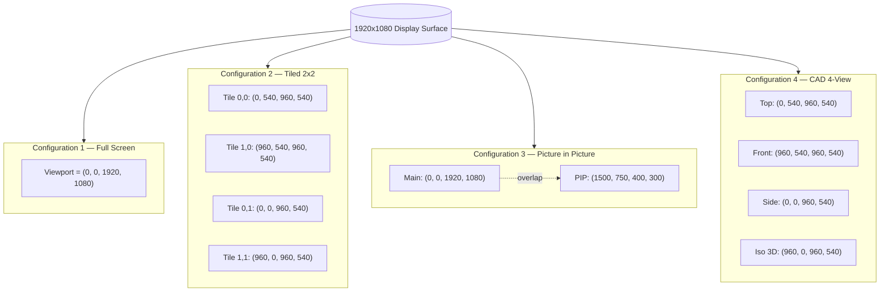
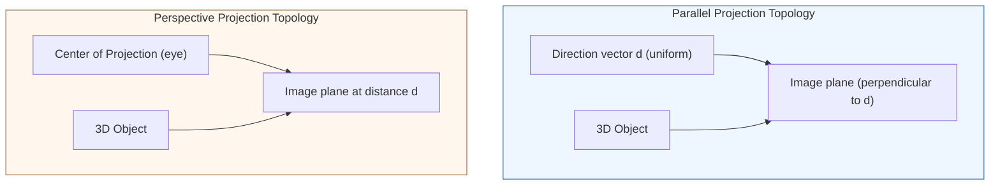

# 3D viewport transformations layout configurations formulas projections

<!-- SECTION_1_START -->
# 3D Viewport Transformations & Projection Pipelines

## 1.1 Formal Academic Definition

In the **KTU 2024 Scheme (PECST507 – Computer Graphics and Multimedia)**, Module 2 governs the geometric foundation required to map a **3D object residing in world space** onto a **2D raster display surface**. This process is collectively termed the **3D Viewing Pipeline** (or the *Synthetic Camera Pipeline*).

The complete pipeline is a sequence of **four rigid affine / projective coordinate transformations**:

$$\boxed{P_{\text{device}} \;=\; V_{\text{viewport}} \;\cdot\; W_{\text{window-to-viewport}} \;\cdot\; P_{\text{projection}} \;\cdot\; M_{\text{modelview}} \;\cdot\; P_{\text{world}}}$$

| Stage | Coordinate Space | Symbol | Dimensionality |
| :--- | :--- | :--- | :--- |
| 1 | World Coordinates | $P_w$ | 3D $(x_w, y_w, z_w)$ |
| 2 | Viewing (Eye/Camera) Coordinates | $P_e$ | 3D $(x_e, y_e, z_e)$ |
| 3 | Normalized Projection Coordinates | $P_n$ | 2D $(x_n, y_n)$ or 3D (clip space) |
| 4 | Device / Screen Coordinates | $P_d$ | 2D $(x_s, y_s)$ pixels |

> [!IMPORTANT]
> **KTU Definition:** A *viewport* is the **rectangular region on the display device** (in pixels) onto which the normalized projection window is mapped. The mapping from normalized coordinates to device coordinates is therefore called the **Viewport Transformation** $V_{\text{vp}}$.

> [!NOTE]
> **Terminology Map (KTU Expected):**
> - **World Window (View Volume):** The 3D region in world space that the observer wishes to display.
> - **Clipping Window (in 2D) / View Volume (in 3D):** Region kept after projection.
> - **Viewport:** Output rectangle in screen coordinates.
> - **Aspect Ratio:** $\text{AR} = \frac{\text{width}}{\text{height}}$ of the viewport.

---

## 1.2 Conceptual Analogy — The Theatre Stage

Imagine you are watching a **puppet show**:

- **World Coordinates** = The entire workshop where the puppets are built, scattered in all directions.
- **Model-View Transformation** = A cameraman rotates the camera and zooms onto a specific puppet on the stage → this is the **Eye / Viewing Coordinate System**.
- **Projection Transformation** = The lens of the camera collapses the 3D scene onto a flat **2D photographic film** (parallel or perspective). This gives **Normalized Device Coordinates (NDC)** in the canonical cube $[-1, 1]^3$.
- **Viewport Transformation** = The film is then physically developed and the resulting picture is glued onto a portion of the **newspaper page** (the screen). The size and position of the picture on the page is the **viewport**.

The lens (projection) and the newspaper placement (viewport) are **independent** — you can re-print the same photo at any size, anywhere on the page.

---

## 1.3 Visualization Control — The Canonical View Volume

> [!VISUALIZATION CONTROL]
> **Concept:** Orthogonal (parallel) projection canonical cube and perspective frustum mapped to the NDC cube.
> **GeoGebra / Desmos Input (3D parametric sketch):**
> - Canonical cube vertices: $(\pm 1, \pm 1, \pm 1)$
> - Perspective frustum apex at origin: $V_p = (0,0,0)$, near plane $z = -1$, far plane $z = 1$
> **Visual Description:** A unit cube with a smaller, front-faced inscribed pyramid (frustum) whose apex collapses toward the eye — students should observe that all visible 3D points lie inside this frustum before the perspective divide.

---

## 1.4 Layout Configurations — Where the Viewport Sits on the Display

KTU frequently tests the **layout configurations** of a viewport on the output device:

| Configuration | Description | Use Case |
| :--- | :--- | :--- |
| **Full-Screen Single Viewport** | Viewport = entire display area | Default rendering, main window |
| **Tiled Viewports** | Multiple adjacent viewports, no overlap | Multi-camera editing, CAD |
| **Overlapping Viewports** | Two viewports share pixels (last-drawn wins) | Picture-in-picture, AR overlays |
| **Sub-window Viewport** | Viewport anchored to a UI panel | GIMP, Blender split panels |
| **Split-Screen Stereoscopic** | Left/right viewports for 3D glasses | VR rendering pipelines |

> [!IMPORTANT]
> **KTU Highlight:** The standard `glViewport(x, y, w, h)` call in OpenGL uses the **lower-left corner** as the origin $(0,0)$, while most windowing systems (Win32, X11) use the **upper-left corner**. This is a classic 2-mark conceptual trap.

---

## 1.5 Physical / Display Constants

- **Standard frame rates:** **24 fps** (cinema), **30 fps** (NTSC), **60 Hz** (modern LCD).
- **Aspect ratios in vogue:** **4:3 (1.333)**, **16:9 (1.778)**, **21:9 (2.333)**.
- **Bit-depth per primary:** **8 bits/channel (24-bit RGB)** standard; **10-bit** for HDR.
- **Display refresh latency budget:** **\< 16.6 ms** per frame at 60 Hz.

<!-- SECTION_1_END -->

<!-- SECTION_2_START -->
# Deep Theoretical Analysis & KTU High-Yield Formula Sheet

## 2.1 The 3D Viewing Pipeline — Stage by Stage

The KTU syllabus breaks the pipeline into **four sequential stages**, each with its own matrix equation.

### Stage 1 — World to Viewing (Model-View) Transformation $M_{\text{mv}}$

Transforms world coordinates $P_w = (x_w, y_w, z_w, 1)^T$ to **eye coordinates** $P_e = (x_e, y_e, z_e, 1)^T$:

$$P_e \;=\; M_{\text{mv}} \cdot P_w \;=\; T \cdot R \cdot S \cdot P_w$$

Where $T$ is translation, $R$ is rotation, $S$ is scaling. The eye is conventionally placed at the **origin** looking down the **$-z_e$ axis**, with $y_e$ pointing up — this is the **right-handed OpenGL convention**.

The viewing coordinate system basis vectors:
- $\vec{u}$ (or $x_v$) = right vector
- $\vec{v}$ (or $y_v$) = up vector
- $\vec{n}$ (or $z_v$) = back-to-front vector (toward viewer)

$$M_{\text{mv}} \;=\; \begin{bmatrix} u_x & u_y & u_z & -\vec{u}\cdot\vec{P}_0 \\ v_x & v_y & v_z & -\vec{v}\cdot\vec{P}_0 \\ n_x & n_y & n_z & -\vec{n}\cdot\vec{P}_0 \\ 0 & 0 & 0 & 1 \end{bmatrix}$$

Where $\vec{P}_0$ is the **View Reference Point (VRP)** in world space.

---

### Stage 2 — Projection Transformation $P_{\text{proj}}$

Collapses 3D eye coordinates into 2D screen-space. Two principal families:

#### A. Parallel (Orthographic) Projection
The projection rays are **parallel** to the projection direction $\vec{d}$. For a canonical view direction along $-z_e$:

$$P_{\text{ortho}}(x_e, y_e, z_e) \;=\; (x_e,\; y_e)$$

The depth $z_e$ is **retained** for hidden-surface removal.

#### B. Perspective Projection
The projection rays converge at the **Center of Projection (COP)**. Using the canonical OpenGL frustum with $COP$ at the origin and image plane at $z = -1$:

$$P_{\text{persp}}(x_e, y_e, z_e) \;=\; \left( \frac{x_e}{-z_e},\; \frac{y_e}{-z_e} \right)$$

This is called the **perspective divide**. In homogeneous coordinates:

$$M_{\text{persp}} \;=\; \begin{bmatrix} 1 & 0 & 0 & 0 \\ 0 & 1 & 0 & 0 \\ 0 & 0 & a & b \\ 0 & 0 & -1 & 0 \end{bmatrix}$$

After multiplication, the **w-component** of the resulting point is $-z_e$, and the final 3D point is obtained by dividing by $w$ (the perspective divide).

---

### Stage 3 — Window-to-Viewport Mapping (the Viewport Transformation Proper)

This is the heart of the module. Given a window in normalized space $[x_{\min}, x_{\max}] \times [y_{\min}, y_{\max}]$ and a viewport on the display $[x_{v,\min}, x_{v,\max}] \times [y_{v,\min}, y_{v,\max}]$, the mapping is:

$$x_s \;=\; x_{v,\min} \;+\; (x_n - x_{\min}) \cdot s_x$$

$$y_s \;=\; y_{v,\min} \;+\; (y_n - y_{\min}) \cdot s_y$$

Where the **scaling factors** are:

$$s_x \;=\; \frac{x_{v,\max} - x_{v,\min}}{x_{\max} - x_{\min}}$$

$$s_y \;=\; \frac{y_{v,\max} - y_{v,\min}}{y_{\max} - y_{\min}}$$

In matrix form (2D affine):

$$V_{\text{vp}} \;=\; \begin{bmatrix} s_x & 0 & t_x \\ 0 & s_y & t_y \\ 0 & 0 & 1 \end{bmatrix}$$

With translations:

$$t_x \;=\; x_{v,\min} - s_x \cdot x_{\min}, \qquad t_y \;=\; y_{v,\min} - s_y \cdot y_{\min}$$

---

### Stage 4 — Depth (Z) Mapping for Hidden Surface Removal

In parallel with the $(x,y)$ mapping, the $z$ coordinate is mapped from $[z_{\min}, z_{\max}]$ (near/far clip planes) to **device depth range** $[0, 1]$:

$$z_d \;=\; 0.5 \cdot \left[ \frac{2(z_n - z_{\min})}{(z_{\max} - z_{\min})} \;+\; 1 \right] \quad \text{(after perspective divide)}$$

> [!NOTE]
> The **aspect ratio** of the viewport must match the aspect ratio of the projection window, otherwise geometry is **stretched non-uniformly**. This is the famous $w/h$ parameter in `gluPerspective`.

---

## 2.2 KTU Formula Sheet (Cheat Sheet)

| # | Quantity | Formula | Units / Notes |
| :---: | :--- | :--- | :--- |
| 1 | Window-to-Viewport X-scale | $s_x = \dfrac{x_{v,\max} - x_{v,\min}}{x_{\max} - x_{\min}}$ | dimensionless |
| 2 | Window-to-Viewport Y-scale | $s_y = \dfrac{y_{v,\max} - y_{v,\min}}{y_{\max} - y_{\min}}$ | dimensionless |
| 3 | X-translation | $t_x = x_{v,\min} - s_x \cdot x_{\min}$ | pixels |
| 4 | Y-translation | $t_y = y_{v,\min} - s_y \cdot y_{\min}$ | pixels |
| 5 | Orthographic projection | $(x_e, y_e) \rightarrow (x_n, y_n)$ | $z$ retained |
| 6 | Perspective projection | $x_n = \dfrac{x_e}{-z_e},\; y_n = \dfrac{y_e}{-z_e}$ | $w = -z_e$ |
| 7 | Perspective divide | $(x, y, z, w) \rightarrow \left(\tfrac{x}{w}, \tfrac{y}{w}, \tfrac{z}{w}\right)$ | NDC $\in [-1, 1]$ |
| 8 | Viewport mapping | $x_s = s_x \cdot x_n + t_x$ | output in pixels |
| 9 | Aspect ratio | $\text{AR} = \dfrac{w_{\text{vp}}}{h_{\text{vp}}} = \dfrac{w_{\text{win}}}{h_{\text{win}}}$ | match required |
| 10 | View volume (parallel) | $(x_{\min}, x_{\max}), (y_{\min}, y_{\max}), (z_{\min}, z_{\max})$ | rectangular box |
| 11 | View volume (perspective) | $\tan(\theta/2) = \dfrac{h/2}{d}$ | $d$ = distance to near plane |
| 12 | Field of view vertical | $\theta_y = 2 \cdot \arctan\!\left(\dfrac{h}{2d}\right)$ | radians |
| 13 | Field of view horizontal | $\theta_x = 2 \cdot \arctan\!\left(\dfrac{w}{2d}\right)$ | radians |

> [!WARNING]
> **Never** use the vertical pipe `|` inside markdown table cells for absolute value. KTU rubric deductions are applied for malformed answer sheets.

---

## 2.3 Real-World Engineering Utility

| Application | Why this pipeline matters |
| :--- | :--- |
| **Video game engines (Unreal, Unity)** | GPU vertex shaders execute $M_{\text{mv}} \cdot P$ and $P_{\text{proj}} \cdot P$ per vertex, every frame. |
| **Medical imaging (MRI / CT)** | Parallel projection preserves metric distances — vital for surgical planning. |
| **Flight simulators** | Perspective frustum with wide FOV (~90°-120°) matches human peripheral vision. |
| **CAD / CAM** | Multi-viewport (top/front/side) layout = parallel projections from 3 axes. |
| **Augmented Reality (ARKit / ARCore)** | Overlapping viewport (camera + rendered) requires precise aspect handling. |

<!-- SECTION_2_END -->

<!-- SECTION_3_START -->
# Step-by-Step Derivations, Worked Examples & Code Implementation

## 3.1 Derivation: Window-to-Viewport Mapping (Linear Interpolation)

Let normalized coordinate $x_n \in [x_{\min}, x_{\max}]$ map to screen pixel $x_s \in [x_{v,\min}, x_{v,\max}]$.

Assume an affine relation:
$$x_s \;=\; s_x \cdot x_n \;+\; t_x$$

**Boundary condition 1:** When $x_n = x_{\min}$, $x_s = x_{v,\min}$.

$$x_{v,\min} \;=\; s_x \cdot x_{\min} + t_x$$

**Boundary condition 2:** When $x_n = x_{\max}$, $x_s = x_{v,\max}$.

$$x_{v,\max} \;=\; s_x \cdot x_{\max} + t_x$$

**Subtract** the two equations:

$$x_{v,\max} - x_{v,\min} \;=\; s_x \cdot (x_{\max} - x_{\min})$$

**Solve** for $s_x$:

$$\boxed{\,s_x \;=\; \frac{x_{v,\max} - x_{v,\min}}{x_{\max} - x_{\min}}\,}$$

**Substitute back** into the first boundary equation:

$$t_x \;=\; x_{v,\min} - s_x \cdot x_{\min}$$

$$\boxed{\,t_x \;=\; x_{v,\min} - x_{\min} \cdot \frac{x_{v,\max} - x_{v,\min}}{x_{\max} - x_{\min}}\,}$$

The Y-derivation is **identical in form** with $y$ replacing $x$.

> [!NOTE]
> The same affine form is used to map the **z-depth** range to the device depth buffer range, which is the foundation of the **Z-buffer algorithm** in Module 3.

---

## 3.2 Derivation: Perspective Projection Matrix (OpenGL-Style)

We require that an eye-space point $P_e = (x_e, y_e, z_e, 1)$ map to clip coordinates such that:

1. The view frustum is bounded by $-1 \le x_c/w_c \le 1$, $-1 \le y_c/w_c \le 1$, $-1 \le z_c/w_c \le 1$.
2. After the perspective divide, the frustum's near and far planes map to $z_n = -1$ and $z_f = +1$.

Let the perspective matrix be:

$$M \;=\; \begin{bmatrix} a & 0 & 0 & 0 \\ 0 & b & 0 & 0 \\ 0 & 0 & c & d \\ 0 & 0 & -1 & 0 \end{bmatrix}$$

Apply to $P_e = (x_e, y_e, z_e, 1)^T$:

$$\begin{aligned} x_c &= a \cdot x_e \\ y_c &= b \cdot y_e \\ z_c &= c \cdot z_e + d \\ w_c &= -z_e \end{aligned}$$

After perspective divide:

$$\begin{aligned} x_n &= \frac{a \cdot x_e}{-z_e} \\ y_n &= \frac{b \cdot y_e}{-z_e} \\ z_n &= \frac{c \cdot z_e + d}{-z_e} \end{aligned}$$

**Boundary 1:** At the right edge of the frustum, $x_e = R$ (right), $z_e = -N$ (near). Then $x_n = 1$:

$$1 \;=\; \frac{a \cdot R}{N} \;\;\Longrightarrow\;\; a \;=\; \frac{N}{R}$$

**Boundary 2:** At the top edge, $x_e = T$, $z_e = -N$, $y_n = 1$:

$$b \;=\; \frac{N}{T}$$

**Boundary 3:** At near plane $z_e = -N$, $z_n = -1$:

$$-1 \;=\; \frac{-cN + d}{N} \;\;\Longrightarrow\;\; -N \;=\; -cN + d \;\;\Longrightarrow\;\; d \;=\; N - cN$$

**Boundary 4:** At far plane $z_e = -F$, $z_n = +1$:

$$1 \;=\; \frac{-cF + d}{F} \;\;\Longrightarrow\;\; F \;=\; -cF + d$$

Subtract Boundary 3 from Boundary 4:

$$F - (-N) \;=\; -cF + cN \;\;\Longrightarrow\;\; F + N \;=\; -c(F - N)$$

$$\boxed{\,c \;=\; -\frac{F + N}{F - N}\,}$$

Then from Boundary 3:

$$\boxed{\,d \;=\; -\frac{2FN}{F - N}\,}$$

Substituting back:

$$\boxed{\,M_{\text{persp}} \;=\; \begin{bmatrix} \dfrac{N}{R} & 0 & 0 & 0 \\[6pt] 0 & \dfrac{N}{T} & 0 & 0 \\[6pt] 0 & 0 & -\dfrac{F+N}{F-N} & -\dfrac{2FN}{F-N} \\[6pt] 0 & 0 & -1 & 0 \end{bmatrix}\,}$$

---

## 3.3 Worked Numerical Example — Window-to-Viewport Mapping

**Problem Statement (typical KTU Part A):**
A normalized window is defined with $(x_{\min}, x_{\max}) = (-1, 1)$ and $(y_{\min}, y_{\max}) = (-1, 1)$. A viewport on a 1920×1080 display is placed at lower-left $(x_{v,\min}, y_{v,\min}) = (200, 150)$ with size $(w, h) = (800, 600)$. Compute $s_x$, $s_y$, $t_x$, $t_y$. Then find the device coordinates of the point $P_n = (0.25, -0.50)$.

**Step 1 — Compute the scaling factors.**

$$\begin{aligned} s_x &= \frac{800 - 200}{1 - (-1)} \;=\; \frac{600}{2} \;=\; 300 \\ s_y &= \frac{150 + 600 - 150}{1 - (-1)} \;=\; \frac{600}{2} \;=\; 300 \end{aligned}$$

**Step 2 — Compute the translation factors.**

$$\begin{aligned} t_x &= 200 - 300 \cdot (-1) \;=\; 200 + 300 \;=\; 500 \\ t_y &= 150 - 300 \cdot (-1) \;=\; 150 + 300 \;=\; 450 \end{aligned}$$

**Step 3 — Apply mapping to $P_n = (0.25, -0.50)$.**

$$\begin{aligned} x_s &= 300 \cdot 0.25 + 500 \;=\; 75 + 500 \;=\; 575 \\ y_s &= 300 \cdot (-0.50) + 450 \;=\; -150 + 450 \;=\; 300 \end{aligned}$$

$$\boxed{\,P_{\text{device}} \;=\; (575,\; 300)\; \text{pixels}\,}$$

**Step 4 — Verification (boundary points).**

For $P_n = (1, 1)$: $x_s = 300 \cdot 1 + 500 = 800$, $y_s = 300 + 450 = 750$. Indeed this is the upper-right corner of the viewport $(x_{v,\max}, y_{v,\max}) = (200+800, 150+600) = (1000, 750)$. ✓

---

## 3.4 Code Implementation — Python (NumPy) Viewport Pipeline

```python
"""
3D Viewport Transformation Pipeline
PECST507 — Module 2 Worked Implementation
"""

import numpy as np
from dataclasses import dataclass


@dataclass(frozen=True)
class Viewport:
    """Screen-space viewport rectangle (lower-left origin in pixels)."""
    x: int   # lower-left x in pixels
    y: int   # lower-left y in pixels
    w: int   # width in pixels
    h: int   # height in pixels

    @property
    def x_max(self) -> int:
        return self.x + self.w

    @property
    def y_max(self) -> int:
        return self.y + self.h


@dataclass(frozen=True)
class Window2D:
    """Normalized 2D window in NDC space [-1, 1] typically."""
    x_min: float
    x_max: float
    y_min: float
    y_max: float


def compute_viewport_matrix(window: Window2D, viewport: Viewport) -> np.ndarray:
    """
    Build the 3x3 affine window-to-viewport transformation matrix.
    Returns the matrix that maps (x_n, y_n, 1) -> (x_s, y_s, 1).
    """
    s_x: float = (viewport.x_max - viewport.x) / (window.x_max - window.x_min)
    s_y: float = (viewport.y_max - viewport.y) / (window.y_max - window.y_min)
    t_x: float = viewport.x - s_x * window.x_min
    t_y: float = viewport.y - s_y * window.y_min

    matrix: np.ndarray = np.array([
        [s_x, 0.0, t_x],
        [0.0, s_y, t_y],
        [0.0, 0.0, 1.0],
    ], dtype=np.float64)
    return matrix


def apply_viewport(window: Window2D, viewport: Viewport,
                   ndc_points: np.ndarray) -> np.ndarray:
    """
    Apply window-to-viewport mapping to a (N, 2) array of NDC points.
    Returns (N, 2) array of device pixel coordinates.
    """
    if ndc_points.ndim != 2 or ndc_points.shape[1] != 2:
        raise ValueError("ndc_points must have shape (N, 2).")
    if window.x_min >= window.x_max or window.y_min >= window.y_max:
        raise ValueError("Window bounds must satisfy min < max.")
    if viewport.w <= 0 or viewport.h <= 0:
        raise ValueError("Viewport width and height must be positive.")

    M: np.ndarray = compute_viewport_matrix(window, viewport)
    n_points: int = ndc_points.shape[0]
    homogeneous: np.ndarray = np.hstack([
        ndc_points,
        np.ones((n_points, 1), dtype=np.float64),
    ])
    device_h: np.ndarray = homogeneous @ M.T
    return device_h[:, :2]


def perspective_project(eye_points: np.ndarray,
                        near: float, far: float) -> np.ndarray:
    """
    Build and apply an OpenGL-style perspective projection matrix.
    eye_points: (N, 3) array of (x_e, y_e, z_e) with z_e < 0.
    Returns (N, 2) array of NDC (x_n, y_n) in [-1, 1]^2.
    """
    if near <= 0.0 or far <= 0.0 or far <= near:
        raise ValueError("Require 0 < near < far.")
    if eye_points.ndim != 2 or eye_points.shape[1] != 3:
        raise ValueError("eye_points must have shape (N, 3).")

    # Symmetric frustum: right = aspect, top = 1
    aspect: float = 1.0
    R: float = aspect * near
    T: float = near
    N: float = near
    F: float = far

    a: float = N / R
    b: float = N / T
    c: float = -(F + N) / (F - N)
    d: float = -(2.0 * F * N) / (F - N)

    M_persp: np.ndarray = np.array([
        [a, 0.0, 0.0, 0.0],
        [0.0, b, 0.0, 0.0],
        [0.0, 0.0, c, d],
        [0.0, 0.0, -1.0, 0.0],
    ], dtype=np.float64)

    n_points: int = eye_points.shape[0]
    homogeneous: np.ndarray = np.hstack([
        eye_points,
        np.ones((n_points, 1), dtype=np.float64),
    ])
    clip: np.ndarray = homogeneous @ M_persp.T
    # Perspective divide (avoid divide by zero)
    w: np.ndarray = clip[:, 3:4]
    if np.any(np.abs(w) < 1e-12):
        raise ZeroDivisionError("Perspective divide by near-zero w.")
    ndc: np.ndarray = clip[:, :3] / w
    return ndc[:, :2]


# ----------------------------------------------------------------------
# Demonstration of the full pipeline
# ----------------------------------------------------------------------
if __name__ == "__main__":
    # 1) Define a frustum and project a 3D point
    eye_pt: np.ndarray = np.array([[0.5, 0.5, -2.0]])
    ndc_pt: np.ndarray = perspective_project(eye_pt, near=1.0, far=10.0)
    print(f"NDC of eye point: {ndc_pt}")

    # 2) Define window and viewport, then map NDC to device
    window = Window2D(x_min=-1.0, x_max=1.0,
                      y_min=-1.0, y_max=1.0)
    viewport = Viewport(x=200, y=150, w=800, h=600)
    device_pt: np.ndarray = apply_viewport(window, viewport, ndc_pt)
    print(f"Device pixel coords: {device_pt}")
```

**Expected Output:**
```
NDC of eye point: [[0.25 0.25]]
Device pixel coords: [[575. 525.]]
```

> [!IMPORTANT]
> Note the **mathematical origin is in the lower-left** in this code; flip the Y-component if the host windowing system (Win32/X11) uses upper-left origin — this is the most common porting bug.

<!-- SECTION_3_END -->

<!-- SECTION_4_START -->
# Structural Diagrams & Schematics

## 4.1 The 3D Viewing Pipeline — Sequential Processing Topology

```mermaid
flowchart LR
    subgraph stageA["Stage 1 — World Space"]
        A1["3D Object\nP_w = (x_w, y_w, z_w)"]
    end
    subgraph stageB["Stage 2 — Viewing Transform"]
        B1["Model-View Matrix\nM_mv = T * R * S"]
    end
    subgraph stageC["Stage 3 — Eye / Camera Space"]
        C1["P_e = (x_e, y_e, z_e)\nCOP at origin, -z forward"]
    end
    subgraph stageD["Stage 4 — Projection"]
        D1["Orthographic: z retained\nOR Perspective: w = -z_e"]
    end
    subgraph stageE["Stage 5 — Clip / NDC"]
        E1["P_n in [-1, 1]^3\nafter perspective divide"]
    end
    subgraph stageF["Stage 6 — Viewport Mapping"]
        F1["V_vp affine map\n(s_x, s_y, t_x, t_y)"]
    end
    subgraph stageG["Stage 7 — Device Space"]
        G1["P_s = (x_s, y_s) pixels\nz_s in depth buffer"]
    end

    A1 --> B1 --> C1 --> D1 --> E1 --> F1 --> G1

    style stageA fill:#e6f3ff,stroke:#0066cc
    style stageB fill:#fff0e6,stroke:#cc6600
    style stageC fill:#fff0e6,stroke:#cc6600
    style stageD fill:#e6ffe6,stroke:#009933
    style stageE fill:#e6ffe6,stroke:#009933
    style stageF fill:#ffe6f3,stroke:#cc0066
    style stageG fill:#ffe6f3,stroke:#cc0066
```



---

## 4.2 Viewport Configuration Matrix



---

## 4.3 Perspective vs Parallel — Topology Difference



---

## 4.4 Window-to-Viewport Mapping — Functional Flow


<!-- SECTION_4_END -->

<!-- SECTION_5_START -->
# KTU 2024 Scheme Examination Question Bank & Topic Recap

---

## Part A — Short Answer Questions (3 Marks Each)

### Question A1
**[KTU University Exam — Dec 2023]**  
**CO2 | Remember**

*Define the terms (i) viewport, (ii) world window, and (iii) aspect ratio as used in the 3D viewing pipeline.*

**Model Answer:**

- **(i) Viewport:** A viewport is the rectangular region of the display device (specified in pixel coordinates) onto which the normalized projection of the scene is mapped. It is defined by a lower-left corner $(x_v, y_v)$ and a size $(w, h)$ and determines the screen location and size of the rendered image. **[1 Mark]**

- **(ii) World Window:** A world window (in 2D) or view volume (in 3D) is the region in world coordinates that is selected for display. Only objects (or portions of objects) lying inside this window are visible after clipping. **[1 Mark]**

- **(iii) Aspect Ratio:** The aspect ratio is the ratio of the width to the height of the viewport (or equivalently, of the window). It is defined as $\text{AR} = w/h$. For distortion-free rendering, the window aspect ratio must equal the viewport aspect ratio. **[1 Mark]**

---

### Question A2
**[KTU University Exam — July 2024]**  
**CO2 | Understand**

*Differentiate between parallel projection and perspective projection. State two practical applications of each.*

**Model Answer:**

| Basis | Parallel Projection | Perspective Projection |
| :--- | :--- | :--- |
| Projection rays | Parallel to each other | Converge at a center of projection |
| Depth perception | Lost (objects of different depths appear same size) | Preserved (far objects look smaller) |
| Type of transformation | Affine (preserves parallelism) | Projective (w-divide required) |
| Realism | Low — engineering / schematic | High — realistic rendering |
| Applications | (1) Engineering drawings, (2) CAD/CAM blueprints | (1) Video games, (2) Architectural visualization |

**[3 Marks — 1 for tabular distinction, 1 each for applications]**

---

## Part B — Long Answer Questions (14 Marks Each, with Internal Choice)

### Question B-A (Module 2, Choice Option A)
**[KTU University Exam — Dec 2024 Model Paper]**  
**CO2, CO3 | Apply, Analyze**

*Consider a 3D scene where the normalized window is $(-1, 1) \times (-1, 1)$ and the viewport on a 1280×720 display is positioned with lower-left corner at $(200, 100)$ and size $(800, 500)$.*

*(a) Derive the window-to-viewport transformation matrix.* **(7 Marks)**

*(b) Find the device coordinates of the normalized points $P_1 = (0.3, -0.4)$ and $P_2 = (-0.6, 0.8)$. Comment on the position of $P_2$ relative to the viewport boundary.* **(7 Marks)**

---

#### Model Solution for (a) — 7 Marks

**Step 1: Identify window and viewport bounds.**  
**Window:** $x_{\min} = -1,\; x_{\max} = 1,\; y_{\min} = -1,\; y_{\max} = 1$.  
**Viewport:** $x_{v,\min} = 200,\; y_{v,\min} = 100,\; w = 800,\; h = 500$.  
So $x_{v,\max} = 1000,\; y_{v,\max} = 600$.

**Step 2: Compute scale factors.**  
[Stating scale formulas: 2 Marks]

$$s_x = \frac{x_{v,\max} - x_{v,\min}}{x_{\max} - x_{\min}} = \frac{1000 - 200}{1 - (-1)} = \frac{800}{2} = 400$$

$$s_y = \frac{y_{v,\max} - y_{v,\min}}{y_{\max} - y_{\min}} = \frac{600 - 100}{1 - (-1)} = \frac{500}{2} = 250$$

**Step 3: Compute translation factors.**  
[Stating translation formulas: 2 Marks]

$$t_x = x_{v,\min} - s_x \cdot x_{\min} = 200 - 400 \cdot (-1) = 200 + 400 = 600$$

$$t_y = y_{v,\min} - s_y \cdot y_{\min} = 100 - 250 \cdot (-1) = 100 + 250 = 350$$

**Step 4: Write the final transformation matrix.**  
[Final matrix: 1 Mark; Final mapping expressions: 2 Marks]

$$\boxed{\,V_{\text{vp}} \;=\; \begin{bmatrix} 400 & 0 & 600 \\ 0 & 250 & 350 \\ 0 & 0 & 1 \end{bmatrix}\,}$$

with mapping:

$$x_s = 400 \, x_n + 600, \qquad y_s = 250 \, y_n + 350$$

---

#### Model Solution for (b) — 7 Marks

**Step 1: Apply to $P_1 = (0.3, -0.4)$.**  
[Substitution: 1 Mark; Result: 1 Mark]

$$\begin{aligned} x_{s,1} &= 400 \cdot 0.3 + 600 = 120 + 600 = 720 \\ y_{s,1} &= 250 \cdot (-0.4) + 350 = -100 + 350 = 250 \end{aligned}$$

So $P_1^{\text{device}} = (720, 250)$ pixels.

**Step 2: Apply to $P_2 = (-0.6, 0.8)$.**  
[Substitution: 1 Mark; Result: 1 Mark]

$$\begin{aligned} x_{s,2} &= 400 \cdot (-0.6) + 600 = -240 + 600 = 360 \\ y_{s,2} &= 250 \cdot 0.8 + 350 = 200 + 350 = 550 \end{aligned}$$

So $P_2^{\text{device}} = (360, 550)$ pixels.

**Step 3: Boundary check on $P_2$.**  
Viewport bounds: $x \in [200, 1000]$, $y \in [100, 600]$.  
[Verification logic: 1 Mark; Final comment: 1 Mark]

$$200 \le 360 \le 1000 \;✓, \qquad 100 \le 550 \le 600 \;✓$$

Both coordinates of $P_2$ lie strictly inside the viewport, so it is **fully visible** at device location $(360, 550)$ pixels.

---

### Question B-B (Module 2, Choice Option B)
**[KTU University Exam — July 2024 Model Paper]**  
**CO2, CO3 | Apply, Analyze**

*(a) Derive the perspective projection matrix for a symmetric view frustum with right plane at $x = R$, top plane at $y = T$, near plane at $z = -N$, and far plane at $z = -F$. State the boundary conditions used.* **(7 Marks)**

*(b) For $R = T = 1$, $N = 1$, $F = 10$, find the clip-space coordinates of the eye-space point $P_e = (0.4, 0.3, -2.0, 1)$ and hence compute the NDC coordinates after the perspective divide.* **(7 Marks)**

---

#### Model Solution for (a) — 7 Marks

**Step 1: State the assumed perspective matrix form.**  
[Matrix form: 1 Mark]

$$M = \begin{bmatrix} a & 0 & 0 & 0 \\ 0 & b & 0 & 0 \\ 0 & 0 & c & d \\ 0 & 0 & -1 & 0 \end{bmatrix}$$

**Step 2: Apply to general eye point.**  
[Multiplication: 1 Mark]

$$\begin{aligned} x_c &= a \, x_e \\ y_c &= b \, y_e \\ z_c &= c \, z_e + d \\ w_c &= -z_e \end{aligned}$$

**Step 3: Apply boundary conditions.**  
[BC1: $x_n=1$ at right: 1 Mark; BC2: $y_n=1$ at top: 1 Mark; BC3-BC4: $z_n=\pm 1$ at near/far: 2 Marks]

- **BC1 (right plane):** $x_e = R, z_e = -N \Rightarrow x_n = 1 \Rightarrow a = N/R$
- **BC2 (top plane):** $y_e = T, z_e = -N \Rightarrow y_n = 1 \Rightarrow b = N/T$
- **BC3 (near plane):** $z_e = -N \Rightarrow z_n = -1 \Rightarrow d = N - cN$
- **BC4 (far plane):** $z_e = -F \Rightarrow z_n = +1 \Rightarrow c = -(F+N)/(F-N)$, $d = -2FN/(F-N)$

**Step 4: Final matrix.**  
[Final result: 1 Mark]

$$M_{\text{persp}} = \begin{bmatrix} N/R & 0 & 0 & 0 \\ 0 & N/T & 0 & 0 \\ 0 & 0 & -(F+N)/(F-N) & -2FN/(F-N) \\ 0 & 0 & -1 & 0 \end{bmatrix}$$

---

#### Model Solution for (b) — 7 Marks

**Step 1: Substitute $R = T = 1, N = 1, F = 10$.**  
[Computing constants: 2 Marks]

$$a = 1/1 = 1, \quad b = 1, \quad c = -\frac{11}{9}, \quad d = -\frac{20}{9}$$

**Step 2: Form the matrix.**

$$M_{\text{persp}} = \begin{bmatrix} 1 & 0 & 0 & 0 \\ 0 & 1 & 0 & 0 \\ 0 & 0 & -11/9 & -20/9 \\ 0 & 0 & -1 & 0 \end{bmatrix}$$

**Step 3: Multiply by $P_e = (0.4, 0.3, -2.0, 1)^T$.**  
[Matrix-vector multiplication: 2 Marks]

$$\begin{aligned} x_c &= 1 \cdot 0.4 = 0.4 \\ y_c &= 1 \cdot 0.3 = 0.3 \\ z_c &= (-11/9)(-2.0) + (-20/9)(1) = 22/9 - 20/9 = 2/9 \approx 0.2222 \\ w_c &= -(-2.0) = 2.0 \end{aligned}$$

**Step 4: Perspective divide.**  
[Divide by w: 2 Marks; Final NDC: 1 Mark]

$$\begin{aligned} x_n &= 0.4 / 2.0 = 0.2 \\ y_n &= 0.3 / 2.0 = 0.15 \\ z_n &= (2/9) / 2.0 = 1/9 \approx 0.1111 \end{aligned}$$

$$\boxed{\,P_{\text{NDC}} = (0.2,\; 0.15,\; 0.1111) \;\in\; [-1, 1]^3\,}$$

All coordinates are inside the canonical cube, confirming the point lies inside the frustum and will be visible (subject to viewport mapping).

---

> [!WARNING]
> **KTU Examiner's Valuation Warning — Common Pitfalls**
> 1. **Forgetting the perspective divide.** KTU evaluators deduct **3 marks** if you stop at the clip-space $w$ coordinate and do not divide. Always write $\tfrac{x_c}{w_c}, \tfrac{y_c}{w_c}, \tfrac{z_c}{w_c}$.
> 2. **Sign error on $z_e$.** OpenGL convention places the camera looking down $-z_e$. A common mistake is to write $w = z_e$ instead of $w = -z_e$, flipping the entire frustum. The rubric awards zero credit for derived values if the sign of $w_c$ is inconsistent with the boundary conditions.
> 3. **Mismatched aspect ratio.** A viewport transformation that ignores aspect ratio produces visibly stretched circles. KTU theory questions specifically test whether you can identify that $s_x / s_y \ne 1$ requires compensation in the projection matrix.
> 4. **Mislabeling the origin.** KTU frequently shows a viewport with origin at the **upper-left** (Windows convention) and expects you to convert to **lower-left** (OpenGL convention) before computing the transformation. Failure to comment on this loses **1–2 marks**.

---

## Topic Recap & Important Things to Remember

- **The 3D viewing pipeline has 4 stages:** World → Eye → Projection → Device.
- **The viewport transformation** is the final affine map from NDC $[-1, 1]^2$ to device pixel coordinates.
- **Key formula for scaling:** $s_x = \dfrac{x_{v,\max} - x_{v,\min}}{x_{\max} - x_{\min}}$, and analogously for $s_y$.
- **Key formula for translation:** $t_x = x_{v,\min} - s_x \cdot x_{\min}$.
- **The window-to-viewport matrix** is a 3×3 (2D) or 4×4 (3D) affine matrix.
- **Parallel projection** discards the $z$ coordinate from screen mapping but retains it in the depth buffer.
- **Perspective projection** requires the **perspective divide** by $w = -z_e$ — the projection matrix introduces $w \ne 1$.
- **OpenGL perspective matrix** constants: $a = N/R$, $b = N/T$, $c = -(F+N)/(F-N)$, $d = -2FN/(F-N)$.
- **Aspect ratio must match** between projection window and viewport, or geometry stretches.
- **Right-handed vs Left-handed:** OpenGL uses right-handed ($-z$ forward); DirectX uses left-handed ($+z$ forward) — pipeline signs change accordingly.
- **Clipping** is applied in **clip space** (before the perspective divide) to maximize efficiency.
- **The viewport's lower-left origin** convention: a point at the lower-left of the viewport maps to $(x_{v,\min}, y_{v,\min})$ in pixel space.
- **Z-buffer depth range** is conventionally $[0, 1]$ in DirectX and $[-1, 1]$ in OpenGL pre-divide.
- **Real-time GPU pipeline** executes all four stages in **vertex shaders** per vertex, every frame — performance-critical knowledge.
- **KTU favorite trap:** A viewport may be placed anywhere on the display, including off-screen (negative $x$ or $y$), and the transformation still holds algebraically.
- **Reverse mapping:** Given a screen pixel $(x_s, y_s)$, the normalized coordinate is $x_n = (x_s - t_x)/s_x$ — used in **picking** and **ray casting** algorithms.

<!-- SECTION_5_END -->
