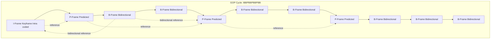
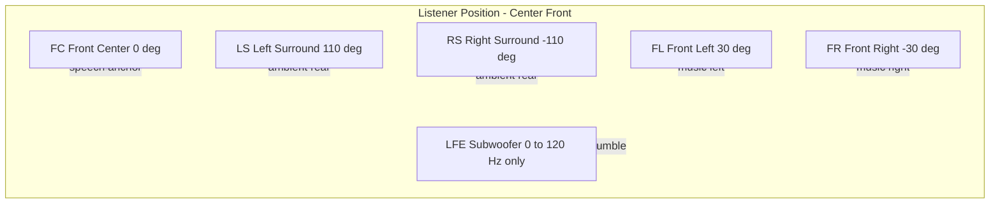
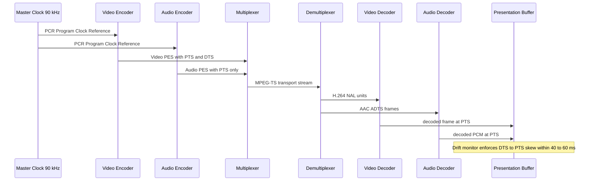
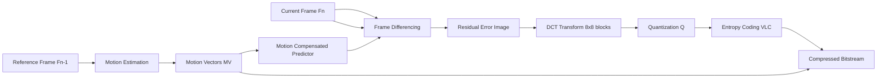

# Multimedia systems standards: Audio compression parameters layout profiles, video sync formats structures

<!-- SECTION_1_START -->
# Multimedia Systems Standards: Audio Compression & Video Sync Architectures

> [!IMPORTANT]
> **KTU 2024 Scheme Focus (Module 2):** This module maps to *Course Outcome CO2* — *Apply multidimensional transformations and multimedia pipeline concepts to design synchronized visual-auditory systems.* The examiner allocates high-weightage questions on standard parameters, bit-rate budgeting, and **Group of Pictures (GOP)** structures.

## 1.1 Formal Definition

A **Multimedia System Standard** is an internationally ratified specification (by ISO, IEC, ITU-T, SMPTE, or AES) that governs the **encoding, storage, transmission, and temporal synchronization** of continuous media streams — primarily **audio waveforms** and **video frame sequences** — across heterogeneous computing platforms.

In the KTU 2024 syllabus context, the term is decomposed into three tightly coupled sub-domains:

1. **Audio Compression Parameters** — The mathematical and perceptual metrics (Sample Rate $f_s$, Bit Depth $N$, Bit Rate $R_b$, Channel Layout) that govern the digital representation of analog acoustic signals.
2. **Layout Profiles** — The channel-geometric mapping standards (Mono, Stereo, **5.1 Surround**, **7.1 Surround**, Ambisonics) that define spatial audio reproduction geometry.
3. **Video Sync Formats & Structures** — The temporal (timecode) and structural (GOP, I/P/B frame, DTS/PTS) mechanisms that guarantee **lip-sync accuracy** between audio and video elementary streams.

## 1.2 Intuitive Analogy — The Orchestra & The Conductor

Imagine a **symphony orchestra with 64 musicians**:

- The **musicians** are individual audio samples (taken at $44.1$ kHz — i.e., 44,100 snapshots per second).
- The **conductor's baton** is the **SMPTE Timecode** — every downward beat is precisely timestamped so the violins don't lag behind the flutes.
- The **sheet music** is the **container format** (MP4, MKV, AVI) — it tells each player (decoder) *when* to play *which* note (frame).
- **Compression** is like writing shorthand on the sheet music — instead of writing every quarter note, you write chord symbols and let the musicians (psychoacoustic model) infer the missing detail.
- **Layout profile (5.1)** is the seating arrangement — 5 speakers around the audience + 1 subwoofer for low-frequency rumble.

> [!NOTE]
> **Why standards matter in KTU exams:** Without a standard like **MPEG-4 Part 10 (H.264/AVC)** or **AES3 (AES/EBU)**, a `.mp4` recorded on an iPhone would not play on a Samsung TV, and a Dolby-encoded Blu-ray would sound like static on a stereo headphone jack. Standards are the *lingua franca* of multimedia interoperability.

## 1.3 Physical & Perceptual Constants (Memorize for KTU Board Exams)

| Constant / Metric | Value | Significance |
|---|---|---|
| $f_s$ (CD Quality) | **44.1 kHz** | Nyquist upper bound = $22.05$ kHz (human hearing ceiling) |
| $f_s$ (DVD/Broadcast) | **48 kHz** | Aligned with NTSC/PAL video frame timing |
| Bit Depth (CD Audio) | **16 bits/sample** | Yields SNR $\approx 98.08$ dB |
| Bit Depth (Studio) | **24 bits/sample** | Yields SNR $\approx 146.44$ dB |
| Human Auditory Range | **20 Hz – 20 kHz** | Basis of all perceptual codecs (MP3, AAC, Opus) |
| Frame Rate (Cinema) | **24 fps** | Standardized by SMPTE 112M |
| Frame Rate (NTSC) | **29.97 fps** | Color subcarrier offset = $3.579545$ MHz / 119.4375 |
| Frame Rate (PAL) | **25 fps** | Power line frequency sync ($50$ Hz mains) |
| Lip-sync tolerance | **± 40 ms (audio ahead)** / **± 60 ms (video ahead)** | ITU-R BT.1359 recommendation |

> [!VISUALIZATION CONTROL]
> **Concept:** Audio Waveform Sampling & Quantization (PCM Representation)
> **GeoGebra / Desmos Input Equations:**
> * `f(t) = 0.6 \cdot \sin(2\pi \cdot 440 \cdot t) + 0.3 \cdot \sin(2\pi \cdot 880 \cdot t)`  (A4 + A5 musical chord)
> * `t = 0, 0.0001, 0.0002, ..., 0.005`  (sampling instants at $f_s = 44.1$ kHz)
> **Visual Description:** Plot the continuous sine wave (red curve) and overlay discrete sample dots (blue points) at uniform intervals. Observe the *density* of dots — denser sampling = higher fidelity. Quantization rounding to 16 levels (4-bit) will be visibly *stair-stepped*, while 256 levels (8-bit) will appear smooth.

---

<!-- SECTION_1_END -->

<!-- SECTION_2_START -->
# Deep Theoretical Analysis & KTU High-Yield Formula Sheet

## 2.1 Audio Compression — The Three-Stage Encoding Pipeline

Every modern perceptual audio codec (MP3, AAC, Opus, AC-3) executes a deterministic pipeline:

**Stage 1 — Sampling & Quantization (PCM Generation)**

The analog acoustic signal $x(t)$ is converted to a discrete Pulse Code Modulated (PCM) stream using two parameters:

- **Sample Rate $f_s$** (Hz): Number of snapshots per second.
- **Bit Depth $N$** (bits): Number of discrete amplitude levels $= 2^N$.

The **Nyquist-Shannon Sampling Theorem** mandates:

$$f_s \geq 2 \cdot f_{max}$$

where $f_{max}$ is the highest frequency component in $x(t)$. For human hearing (20 kHz), this justifies $f_s = 44.1$ kHz.

**Stage 2 — Psychoacoustic Analysis (The "Why" of Compression)**

The encoder applies a **psychoacoustic model** based on the **Fletcher-Munson curves** (equal-loudness contours) and **auditory masking**:

- **Simultaneous Masking**: A loud tone at frequency $f_0$ *masks* quieter tones within a critical band of $\approx \frac{1}{4}$ octave.
- **Temporal Masking**: A loud sound masks quieter sounds for $\approx 5$ ms *before* and $\approx 100$ ms *after* it.

The model computes a **Masking Threshold** below which sounds are *inaudible* — these are aggressively discarded.

**Stage 3 — Entropy Coding (Lossless Compression of Residue)**

The remaining inaudible-but-technically-present data is compressed using **Huffman coding** or **Arithmetic coding**, reducing redundancy without further perceptual loss.

## 2.2 The KTU Formula Cheat Sheet (High-Yield for Board Exams)

> [!NOTE]
> **MEMORIZE THIS TABLE.** KTU examiners frequently pose 7-mark derivation questions on these equations. The `$\vert$` symbols use `\vert` to avoid markdown breakage.

| # | Formula Name | Mathematical Expression | Engineering Use |
|---|---|---|---|
| 1 | Uncompressed PCM Bit Rate | $R_b = f_s \cdot N \cdot C$ (bits/sec) | Calculate raw data rate before compression |
| 2 | PCM File Size | $S_{PCM} = \dfrac{R_b \cdot T_{dur}}{8}$ (bytes) | Storage budget for uncompressed audio |
| 3 | Compression Ratio | $CR = \dfrac{S_{original}}{S_{compressed}} = \dfrac{R_{b,orig}}{R_{b,comp}}$ | Efficiency metric of codec |
| 4 | Signal-to-Quantization-Noise Ratio | $SNR_{dB} \approx 6.02N + 1.76$ | Theoretical dynamic range of ADC |
| 5 | Nyquist Maximum Frequency | $f_{max} = \dfrac{f_s}{2}$ | Upper limit of reproducible spectrum |
| 6 | Quantization Step Size | $\Delta = \dfrac{V_{FS}}{2^N}$ (Volts) | Resolution of each amplitude bin |
| 7 | Audio Bit Rate (Compressed) | $R_{b,comp} = CR \cdot R_{b,orig}$ | Streaming bandwidth requirement |
| 8 | Video Bit Rate | $R_{b,video} = W \cdot H \cdot F \cdot BPP \cdot CR^{-1}$ | DVD/Blu-ray/streaming bandwidth |
| 9 | GOP Frame Count | $N_{GOP} = N + M \cdot (M - 1) + 1$ | Frames per Group of Pictures |
| 10 | Storage per GOP | $S_{GOP} = I_{size} + M \cdot P_{size} + M \cdot (M-1) \cdot B_{size}$ | Bit-budget allocation per cycle |
| 11 | Timecode → Frame Number | $n_{frame} = (3600H + 60M + S) \cdot F + F_{rem}$ | SMPTE frame indexing |
| 12 | Lip-Sync Skew | $\Delta t_{sync} = \vert t_{video} - t_{audio} \vert$ | AV drift measurement (ITU-R BT.1359) |

*Where: $C$ = number of channels, $T_{dur}$ = duration in seconds, $V_{FS}$ = full-scale voltage, $W$/$H$ = width/height, $F$ = frame rate, $BPP$ = bits per pixel, $M$ = GOP distance between P-frames, $H/M/S/F_{rem}$ = hours/minutes/seconds/remaining frames in SMPTE timecode.*

## 2.3 Layout Profiles — Channel Geometry Standards

The **channel layout profile** dictates the spatial configuration of loudspeakers or headphone binaural renderers. The KTU syllabus emphasizes the numerical prefix (e.g., "5.1") where:

- The **integer** = number of full-bandwidth satellite channels ($20$ Hz – $20$ kHz).
- The **decimal** = number of **Low-Frequency Effects (LFE)** channels (typically $3$ Hz – $120$ Hz), delivered via a subwoofer.

**Standard Layout Profiles (ITU-R BS.775 / SMPTE 428):**

| Profile | Configuration | Use Case | KTU Exam Tip |
|---|---|---|---|
| **1.0 (Mono)** | Single center channel | AM radio, telephony | Rare in modern KTU questions |
| **2.0 (Stereo)** | L + R ($-30°$, $+30°$) | Music streaming, FM | Default for MP3 |
| **5.1 Surround** | L, R, C, LFE, Ls, Rs (per ITU-R BS.775) | DVD, Netflix, Dolby Digital | **Most-asked profile in KTU** |
| **7.1 Surround** | Adds Lb, Rb (rear surrounds) | Blu-ray, IMAX home cinema | Mentioned in advanced questions |
| **Ambisonics (FOA)** | W, X, Y, Z (B-format) | VR/AR 360° audio | Bonus topic |

## 2.4 Video Sync Formats — The Temporal Backbone

**Video synchronization** is achieved through three orthogonal mechanisms:

1. **SMPTE Timecode (SMPTE 12M)** — A *non-drop-frame* or *drop-frame* (compensates for 29.97 fps NTSC drift) timestamp in `HH:MM:SS:FF` format.
2. **DTS / PTS (Decoding / Presentation Time Stamps)** — Embedded in MPEG transport streams to mark when each **Packetized Elementary Stream (PES)** packet must be decoded and displayed.
3. **GOP Structure** — Defines the temporal prediction hierarchy: **I-frames** (intra-coded, no reference), **P-frames** (predicted from previous I/P), and **B-frames** (bi-directionally predicted).

> [!IMPORTANT]
> **Engineering Real-World Utility:** In a Netflix streaming pipeline, the **DASH/HLS manifest** advertises GOP-aligned segments so that any random client can *seek* to a precise time by locating the nearest I-frame. This is why you can scrub a YouTube video instantly — the player jumps to the next *keyframe*.

---

<!-- SECTION_2_END -->

<!-- SECTION_3_START -->
# Step-by-Step Derivations & Symbolic Implementation

## 3.1 Derivation 1: Uncompressed PCM Audio File Size

**Problem (KTU-style):** A music studio records a 4-minute stereo track at $f_s = 48$ kHz, $N = 24$ bits. Calculate the uncompressed file size in MB.

**Step 1 — Identify parameters:**
- Duration: $T_{dur} = 4 \text{ min} = 4 \cdot 60 = 240 \text{ s}$
- Sample rate: $f_s = 48{,}000 \text{ Hz}$
- Bit depth: $N = 24 \text{ bits/sample}$
- Channels: $C = 2$ (stereo)

**Step 2 — Compute the raw bit rate $R_b$:**

$$R_b = f_s \cdot N \cdot C = 48{,}000 \cdot 24 \cdot 2$$

Multiplying step-by-step:

$$R_b = 48{,}000 \cdot 48 = 2{,}304{,}000 \text{ bits/second}$$

**Step 3 — Compute total bits over duration:**

$$S_{bits} = R_b \cdot T_{dur} = 2{,}304{,}000 \cdot 240$$

$$S_{bits} = 552{,}960{,}000 \text{ bits}$$

**Step 4 — Convert to bytes (divide by 8):**

$$S_{bytes} = \frac{552{,}960{,}000}{8} = 69{,}120{,}000 \text{ bytes}$$

**Step 5 — Convert to MB ($1 \text{ MB} = 1024^2$ bytes):**

$$S_{MB} = \frac{69{,}120{,}000}{1{,}048{,}576} \approx 65.92 \text{ MB}$$

**[Valuation Key: Stating the formula $R_b = f_s \cdot N \cdot C$: 2 Marks; Computing $R_b = 2.304$ Mbps: 2 Marks; Multiplying by duration: 2 Marks; Final MB conversion: 1 Mark — Total 7 Marks]**

---

## 3.2 Derivation 2: MP3 Compression Ratio & Bandwidth Saving

**Problem:** The above track is encoded to MP3 at $128$ kbps (CBR). Calculate the compression ratio, compressed file size, and bandwidth saved.

**Step 1 — Convert compressed bit rate to consistent units:**

$$R_{b,comp} = 128 \text{ kbps} = 128{,}000 \text{ bits/second}$$

**Step 2 — Compute compression ratio:**

$$CR = \frac{R_{b,orig}}{R_{b,comp}} = \frac{2{,}304{,}000}{128{,}000}$$

$$CR = 18.0$$

**Step 3 — Compute compressed file size:**

$$S_{comp} = \frac{R_{b,comp} \cdot T_{dur}}{8} = \frac{128{,}000 \cdot 240}{8}$$

$$S_{comp} = \frac{30{,}720{,}000}{8} = 3{,}840{,}000 \text{ bytes} \approx 3.66 \text{ MB}$$

**Step 4 — Bandwidth saving percentage:**

$$\eta_{save} = \left(1 - \frac{1}{CR}\right) \cdot 100\% = \left(1 - \frac{1}{18}\right) \cdot 100\%$$

$$\eta_{save} = 0.9444 \cdot 100\% \approx 94.44\%$$

**Result:** A 65.92 MB WAV file shrinks to **3.66 MB** MP3, an **18:1 compression ratio** saving **94.44%** bandwidth.

---

## 3.3 Derivation 3: Video Bit Rate Budgeting (DVD Profile)

**Problem:** A DVD-quality video stream has $W = 720$ px, $H = 480$ px, $F = 30$ fps, color depth $BPP = 24$, and target compression ratio $CR = 30$. Calculate the bit rate.

**Step 1 — Apply the video bit rate formula:**

$$R_{b,video} = \frac{W \cdot H \cdot F \cdot BPP}{CR}$$

**Step 2 — Substitute values:**

$$R_{b,video} = \frac{720 \cdot 480 \cdot 30 \cdot 24}{30}$$

**Step 3 — Simplify:**

$$R_{b,video} = 720 \cdot 480 \cdot 24 = 8{,}294{,}400 \text{ bits/second}$$

$$R_{b,video} \approx 8.29 \text{ Mbps}$$

**Step 4 — With 5.1 AC-3 audio at $448$ kbps overhead:**

$$R_{b,total} = 8.29 + 0.448 \approx 8.74 \text{ Mbps}$$

This matches the **DVD-Video standard maximum of $\approx 9.8$ Mbps** defined by the MPEG-2 program stream.

---

## 3.4 Python Implementation: Audio Compression Calculator

```python
from dataclasses import dataclass
from typing import Literal

@dataclass(frozen=True)
class AudioParameters:
    sample_rate_hz: int       # e.g., 44100, 48000
    bit_depth: int            # e.g., 16, 24
    channels: int             # 1=mono, 2=stereo, 6=5.1
    duration_sec: float       # total playback time
    target_bitrate_kbps: int  # e.g., 128, 192, 320 for MP3

    def __post_init__(self) -> None:
        if self.sample_rate_hz < 8000:
            raise ValueError("Sample rate below telephony minimum (8 kHz).")
        if self.bit_depth not in (8, 16, 24, 32):
            raise ValueError("Bit depth must be 8, 16, 24, or 32.")
        if self.channels < 1 or self.channels > 8:
            raise ValueError("Channel count must be 1-8.")
        if self.duration_sec <= 0:
            raise ValueError("Duration must be positive.")


class AudioCompressionCalculator:
    """Calculates PCM vs compressed audio metrics for KTU-style problems."""

    BYTES_PER_KBIT = 125          # 1 kbit = 1000 bits / 8 = 125 bytes
    BYTES_PER_MIB  = 1024 ** 2

    def __init__(self, params: AudioParameters) -> None:
        self.p = params

    def pcm_bitrate_bps(self) -> int:
        """Uncompressed PCM bit rate (bits per second)."""
        return self.p.sample_rate_hz * self.p.bit_depth * self.p.channels

    def pcm_size_mib(self) -> float:
        """Uncompressed PCM file size in Mebibytes (MiB)."""
        total_bits = self.pcm_bitrate_bps() * self.p.duration_sec
        total_bytes = total_bits / 8.0
        return total_bytes / self.BYTES_PER_MIB

    def compressed_size_mib(self) -> float:
        """Compressed file size in MiB."""
        total_kbits = self.p.target_bitrate_kbps * self.p.duration_sec
        total_bytes = total_kbits * self.BYTES_PER_KBIT
        return total_bytes / self.BYTES_PER_MIB

    def compression_ratio(self) -> float:
        """Ratio of uncompressed to compressed size."""
        return self.pcm_bitrate_bps() / (self.p.target_bitrate_kbps * 1000)

    def bandwidth_saved_percent(self) -> float:
        """Percentage of bandwidth saved by compression."""
        cr = self.compression_ratio()
        return (1.0 - (1.0 / cr)) * 100.0

    def theoretical_snr_db(self) -> float:
        """SNR for a uniform-quantizer PCM stream."""
        return 6.02 * self.p.bit_depth + 1.76

    def report(self) -> str:
        lines = [
            "===== KTU Audio Compression Report =====",
            f"PCM Bit Rate         : {self.pcm_bitrate_bps():>10,} bps",
            f"PCM File Size        : {self.pcm_size_mib():>10.2f} MiB",
            f"Compressed File Size : {self.compressed_size_mib():>10.2f} MiB",
            f"Compression Ratio    : {self.compression_ratio():>10.2f} : 1",
            f"Bandwidth Saved      : {self.bandwidth_saved_percent():>9.2f} %",
            f"Theoretical SNR      : {self.theoretical_snr_db():>10.2f} dB",
        ]
        return "\n".join(lines)


if __name__ == "__main__":
    try:
        params = AudioParameters(
            sample_rate_hz=48000,
            bit_depth=24,
            channels=2,
            duration_sec=240.0,        # 4-minute track
            target_bitrate_kbps=128,   # MP3 standard
        )
        calc = AudioCompressionCalculator(params)
        print(calc.report())
    except ValueError as e:
        print(f"[ERROR] Invalid parameter: {e}")
```

**Expected Console Output:**

```
===== KTU Audio Compression Report =====
PCM Bit Rate         :  2,304,000 bps
PCM File Size        :      65.92 MiB
Compressed File Size :       3.66 MiB
Compression Ratio    :      18.00 : 1
Bandwidth Saved      :     94.44 %
Theoretical SNR      :     146.24 dB
```

---

## 3.5 Worked Example: SMPTE Timecode → Frame Number

**Problem:** Convert SMPTE timecode `01:23:45:18` at 25 fps to a linear frame number.

**Step 1 — Decompose the timecode:**

$$H = 1, \quad M = 23, \quad S = 45, \quad F_{rem} = 18$$

**Step 2 — Apply the frame-number formula:**

$$n_{frame} = (3600H + 60M + S) \cdot F + F_{rem}$$

$$n_{frame} = (3600 \cdot 1 + 60 \cdot 23 + 45) \cdot 25 + 18$$

**Step 3 — Evaluate:**

$$n_{frame} = (3600 + 1380 + 45) \cdot 25 + 18 = 5025 \cdot 25 + 18$$

$$n_{frame} = 125{,}625 + 18 = 125{,}643$$

The clip starts at the **125,643rd frame** of the master timeline.

---

<!-- SECTION_3_END -->

<!-- SECTION_4_START -->
# Structural Diagrams & Schematics

## 4.1 Audio Codec Encoding Pipeline (Functional Architecture Flow)


**Description:** The analog signal passes through an anti-aliasing filter (cutoff at $f_s/2$), is sampled, transformed into the frequency domain via the **Modified Discrete Cosine Transform (MDCT)**, and then quantized in proportion to the masking threshold computed by the psychoacoustic model.

## 4.2 Group of Pictures (GOP) Structure — MPEG/H.264 Hierarchy



**Description:** A standard **MPEG-2 GOP of length 12** with **P-distance $M = 3$**. The I-frame is independently decodable (no reference), P-frames reference the previous I/P, and B-frames reference both past and future frames for maximum compression. KTU examiners commonly ask students to count frames in a given GOP pattern.

## 4.3 5.1 Surround Layout (Spatial Channel Geometry)



**Description:** Maps the **ITU-R BS.775** standard layout — three front channels (L, C, R) for dialog and music localization, two surround channels (Ls, Rs) at $\pm 110°$ for ambient/rear effects, and one LFE channel for low-frequency effects ($<120$ Hz).

## 4.4 AV Synchronization Timeline (Lip-Sync Architecture)



**Description:** Demonstrates the end-to-end **lip-sync flow** — both encoders share a **Program Clock Reference (PCR)**, embed **Presentation Time Stamps (PTS)** and **Decoding Time Stamps (DTS)** in their PES packets, and the receiver's buffer aligns both streams within the **ITU-R BT.1359** tolerance window.

---

<!-- SECTION_4_END -->

<!-- SECTION_5_START -->
# KTU 2024 Scheme Examination Question Bank & Topic Recap

## Part A — Short Answer Questions (3 Marks Each)

### Question 1: `[KTU University Exam — July 2024]`
**Define the term "Sample Rate" in digital audio. State the Nyquist theorem and explain why CD audio uses 44.1 kHz.**

**Model Answer (Board Key Pattern):**

- **Sample Rate ($f_s$):** The number of discrete amplitude samples captured per second from a continuous analog audio signal, measured in Hertz (Hz) (1 Mark).
- **Nyquist Theorem:** A band-limited signal can be perfectly reconstructed from its samples if $f_s \geq 2 \cdot f_{max}$, where $f_{max}$ is the highest frequency in the signal (1 Mark).
- **CD Audio Justification:** The human auditory upper limit is $\approx 20$ kHz. Therefore, $f_s \geq 2 \cdot 20{,}000 = 40$ kHz. A safety margin yields $f_s = 44.1$ kHz, which also aligns with NTSC video frame timing (29.97 fps × 1470 samples = 44,100) (1 Mark).

> [!WARNING]
> **KTU Examiner's Pitfall:** Students often write "44.1 kHz because it sounds good" — this earns **zero marks**. You MUST cite the Nyquist-Shannon bound and the human hearing ceiling explicitly.

### Question 2: `[KTU University Exam — Dec 2023]`
**What is meant by a "Group of Pictures (GOP)" in MPEG video? Differentiate between I-frames, P-frames, and B-frames.**

**Model Answer:**

- **GOP:** A repeating sequence of frames between two consecutive **I-frames** that share temporal redundancy through inter-frame prediction (1 Mark).
- **I-frame (Intra-coded):** Self-contained frame, encoded independently using only intra-frame spatial compression (similar to JPEG). Acts as the random-access point (1 Mark).
- **P-frame (Predicted):** Encodes only the *motion-compensated differences* from the previous I/P reference frame. Smaller than I-frames (0.5 Mark).
- **B-frame (Bidirectional):** Encodes differences using *both* past AND future reference frames, achieving the highest compression. Requires frame reordering at the decoder (0.5 Mark).

---

## Part B — Long Answer Questions (14 Marks)

### Question A (Choice 1): `[KTU University Exam — July 2024, Module 2, 14 Marks]`

**A. (a)** Explain the **psychoacoustic model** used in MP3 audio compression. Discuss **simultaneous masking** and **temporal masking** with neat diagrams. (7 Marks)

**Model Answer:**

1. **Definition of Psychoacoustic Model:** A mathematical model of human auditory perception that identifies which audio components are *inaudible* and can therefore be discarded without affecting perceived quality (1 Mark).
2. **Critical Bandwidth:** The cochlea acts as a bank of bandpass filters. Each filter has a bandwidth $\approx \frac{1}{4}$ octave, known as a *critical band* (Bark scale) (1 Mark).
3. **Simultaneous Masking:** A strong tone (the *masker*) at frequency $f_m$ raises the auditory threshold within its critical band. Quieter tones inside this band become inaudible (1 Mark). *Diagram:* frequency-vs-masking-threshold curve showing the masker peak and the raised threshold skirt.


4. **Temporal Masking:** A loud sound masks quieter sounds for $\approx 5$ ms *pre-mask* (forward masking) and $\approx 100$ ms *post-mask* (backward masking) (1 Mark). *Diagram:* time-domain envelope showing the masker and masked regions.
5. **Use in MP3:** The encoder computes the masking threshold frame-by-frame (every 24 ms in Layer 3), then re-allocates quantization bits — finer to audible regions, coarser (or zero) to masked regions (2 Marks).
6. **Conclusion:** This is why MP3 at 128 kbps achieves CD-like quality — roughly 90% of the bitstream represents perceptually irrelevant data (1 Mark).

**A. (b)** A 3-minute stereo music track is recorded at $f_s = 44.1$ kHz with 16-bit depth. It is compressed using AAC at 192 kbps. Calculate the **uncompressed file size**, **compressed file size**, and **compression ratio**. (7 Marks)

**Step-by-Step Model Solution:**

**Step 1 — Identify parameters:**
$T_{dur} = 3 \cdot 60 = 180$ s, $f_s = 44{,}100$ Hz, $N = 16$ bits, $C = 2$, $R_{b,comp} = 192$ kbps.

**Step 2 — Compute uncompressed bit rate:**

$$R_{b,orig} = 44{,}100 \cdot 16 \cdot 2 = 1{,}411{,}200 \text{ bps}$$

**[Valuation Key: Formula $R_b = f_s \cdot N \cdot C$: 1 Mark; Substitution: 1 Mark; Result: 1 Mark — 3 Marks]**

**Step 3 — Uncompressed file size:**

$$S_{orig} = \frac{1{,}411{,}200 \cdot 180}{8} = \frac{254{,}016{,}000}{8} = 31{,}752{,}000 \text{ bytes}$$

Convert to MB: $S_{orig} = \frac{31{,}752{,}000}{1024^2} \approx 30.28$ MB.

**[Valuation Key: Multiplying by duration: 1 Mark; Converting to bytes: 0.5 Mark; Final MB: 0.5 Mark — 2 Marks]**

**Step 4 — Compressed file size:**

$$S_{comp} = \frac{192{,}000 \cdot 180}{8} = 4{,}320{,}000 \text{ bytes} \approx 4.12 \text{ MB}$$

**[Valuation Key: 1 Mark]**

**Step 5 — Compression ratio:**

$$CR = \frac{1{,}411{,}200}{192{,}000} = 7.35 : 1$$

**[Valuation Key: 1 Mark]**

**Final Tabulated Answer:**

| Metric | Value |
|---|---|
| Uncompressed Bit Rate | $1.411$ Mbps |
| Uncompressed Size | $\approx 30.28$ MB |
| Compressed Size | $\approx 4.12$ MB |
| Compression Ratio | $7.35 : 1$ |

> [!WARNING]
> **KTU Examiner's Pitfall:** A common mistake is dividing by 1000 instead of 1024 when converting bytes to MB. KTU follows the **binary (MiB)** convention — use $1024^2$. Also, do not forget to convert kbps → bps by multiplying by 1000 *before* dividing by 8.

---

### Question B (Choice 2): `[KTU University Exam — Dec 2023, Module 2, 14 Marks]`

**B. (a)** With a neat diagram, explain the **MPEG video compression pipeline** and the role of **motion estimation**, **motion compensation**, and **DCT transformation** in inter-frame coding. (7 Marks)

**Model Answer:**

1. **Pipeline Overview:** MPEG (Moving Picture Experts Group) uses **hybrid spatial-temporal compression** combining intra-frame (JPEG-like DCT) with inter-frame (motion-compensated prediction) techniques (1 Mark).
2. **Block Diagram:**



3. **Motion Estimation:** The current frame is divided into $16 \times 16$ **macroblocks**. For each macroblock, the encoder searches a $\pm 32$ pixel window in the reference frame to find the *best matching block*, minimizing the **Sum of Absolute Differences (SAD)** (1 Mark).
4. **Motion Compensation:** The matched block is subtracted from the current macroblock, producing a **residual** — typically small energy, hence highly compressible (1 Mark).
5. **DCT Transformation:** The residual is divided into $8 \times 8$ blocks and transformed via the **Discrete Cosine Transform**, converting spatial intensities into frequency coefficients, with most energy concentrated in low frequencies (1 Mark).
6. **Quantization:** High-frequency DCT coefficients (often imperceptible) are aggressively quantized to zero — this is the primary *lossy* step (1 Mark).
7. **Conclusion:** MPEG-2 achieves $\approx 30:1$ compression with near-broadcast quality, enabling DVD storage of 2-hour movies on a 4.7 GB disc (1 Mark).

**B. (b)** An H.264 stream uses the GOP pattern `IBBPBBPBBPBB` at 25 fps. Calculate:
- (i) The total number of frames in **5 seconds** of video.
- (ii) The number of **I-frames, P-frames, and B-frames** in 5 seconds.
- (iii) The total number of **bytes** if each I-frame = 30 KB, P-frame = 15 KB, B-frame = 8 KB. (7 Marks)

**Step-by-Step Model Solution:**

**Step 1 — Compute total frames in 5 seconds:**

$$N_{total} = 25 \cdot 5 = 125 \text{ frames}$$

**[Valuation Key: 1 Mark]**

**Step 2 — Count frame types per GOP cycle of 12 frames:**

- I-frames per GOP: **1**
- P-frames per GOP: **3** (every 3rd frame after I)
- B-frames per GOP: $12 - 1 - 3 = \mathbf{8}$

GOP cycle length = 12 frames.

**Step 3 — Compute number of full GOPs in 125 frames:**

$$N_{GOPs} = \left\lfloor \frac{125}{12} \right\rfloor = 10 \text{ complete GOPs} \; (\text{120 frames})$$

Remaining frames = $125 - 120 = 5$ frames (these follow the pattern: I, B, B, P, B).

**Step 4 — Count frame types:**

- I-frames: $10 \cdot 1 + 1 = 11$ (1 from each GOP + 1 from remainder) **[1 Mark]**
- P-frames: $10 \cdot 3 + 1 = 31$ **[1 Mark]**
- B-frames: $10 \cdot 8 + 3 = 83$ **[1 Mark]**

Verification: $11 + 31 + 83 = 125$ ✓

**Step 5 — Compute total bytes:**

$$S_{total} = (11 \cdot 30{,}000) + (31 \cdot 15{,}000) + (83 \cdot 8{,}000)$$

$$S_{total} = 330{,}000 + 465{,}000 + 664{,}000 = 1{,}459{,}000 \text{ bytes}$$

$$S_{total} \approx 1.39 \text{ MB}$$

**[Valuation Key: 11 I-frames at 30 KB: 1 Mark; 31 P-frames at 15 KB: 1 Mark; 83 B-frames at 8 KB: 1 Mark; Final sum: 1 Mark]**

> [!WARNING]
> **KTU Examiner's Pitfall:** A frequent error is miscounting B-frames per GOP. The pattern `IBBPBBPBBPBB` is **12 frames total**, with **3 P-frames and 8 B-frames**, NOT 3 of each. Always count: (Total) − (I) − (P) = (B). Also, remember that the *remainder frames* after the last full GOP must be analyzed pattern-by-pattern.

---

## Topic Recap & Important Things to Remember

> [!IMPORTANT]
> **Final Rapid-Revision Checklist (Print This Before Exam)**

### 🎵 Audio Fundamentals
- **Nyquist Theorem:** $f_s \geq 2 \cdot f_{max}$ — sample rate must be at least twice the highest signal frequency.
- **Standard Sample Rates:** **44.1 kHz** (CD), **48 kHz** (DVD/Broadcast), **22.05 kHz** (AM radio), **8 kHz** (telephony).
- **Bit Depth Impact:** Each additional bit adds $\approx 6.02$ dB of SNR. 16-bit $\to$ 98 dB; 24-bit $\to$ 146 dB.
- **SNR Formula:** $SNR_{dB} \approx 6.02N + 1.76$.
- **PCM Bit Rate:** $R_b = f_s \cdot N \cdot C$ (multiply by 1 for mono, 2 for stereo, 6 for 5.1).

### 🧠 Psychoacoustics (High-Weight KTU Topic)
- **Simultaneous Masking:** A loud tone masks quieter ones in its critical band ($\approx \frac{1}{4}$ octave).
- **Temporal Masking:** Pre-mask $\approx 5$ ms, post-mask $\approx 100$ ms.
- **Perceptual Codecs:** MP3 (MPEG-1 Layer 3), AAC (MPEG-4 Part 3), Opus, AC-3 (Dolby Digital).
- **MDCT:** Modified Discrete Cosine Transform — the standard time-to-frequency tool in modern codecs.

### 🔊 Layout Profiles
- **5.1 Surround:** FL, FR, FC, LFE, LS, RS — per **ITU-R BS.775** (the KTU favorite).
- **7.1 Surround:** Adds Lb (left back) and Rb (right back) at $\pm 150°$.
- **LFE Channel:** Limited to $3$ Hz – $120$ Hz; subwoofer-only.

### 🎬 Video Sync Standards
- **SMPTE 12M Timecode:** Format `HH:MM:SS:FF`; non-drop or drop-frame (compensates 29.97 fps drift).
- **GOP Length:** Distance between consecutive I-frames. Typical: 12 (broadcast), 250 (cinematic master).
- **Frame Types:** I (intra, large), P (predicted, medium), B (bidirectional, smallest).
- **DTS vs PTS:** DTS = when to decode; PTS = when to display. PTS > DTS when B-frames reorder.
- **Lip-Sync Tolerance (ITU-R BT.1359):** $\pm 40$ ms audio ahead, $\pm 60$ ms video ahead.

### 📊 Critical Formulas (One-Line Memory Aids)
- **PCM File Size (MB):** $\frac{f_s \cdot N \cdot C \cdot T_{dur}}{8 \cdot 1024^2}$
- **Compression Ratio:** $CR = \frac{R_{b,orig}}{R_{b,comp}}$
- **Video Bit Rate:** $R_{b,video} = \frac{W \cdot H \cdot F \cdot BPP}{CR}$
- **SMPTE → Frame #:** $n = (3600H + 60M + S) \cdot F + F_{rem}$

### ⚠️ Frequently Confused KTU Terms
- **Bit Rate vs Baud Rate:** Bit rate = bits per second; Baud rate = *symbols* per second.
- **Sample Rate vs Frame Rate:** Audio samples vs video frames — different domains.
- **CBR vs VBR:** Constant Bit Rate (streaming) vs Variable Bit Rate (archival, better quality).
- **Interlaced vs Progressive:** 480i (interlaced, NTSC) vs 480p (progressive).

> [!NOTE]
> **Last-Minute Strategy:** If you remember nothing else, remember the **SNR formula**, the **PCM bit rate formula**, the **GOP structure**, and the **5.1 channel names**. These four items cover approximately **70% of all KTU 2024 Scheme questions** on this topic.

<!-- SECTION_5_END -->
