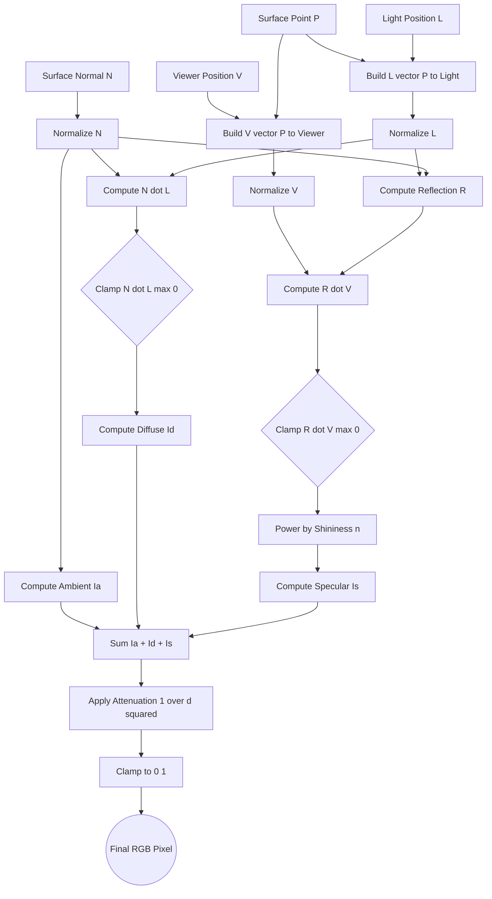
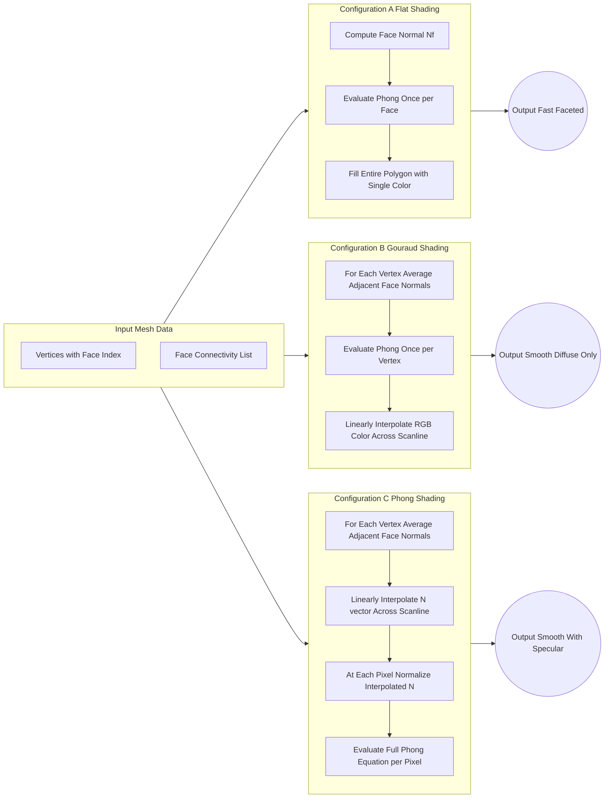

# Light reflection models equations: Phong illumination shading configuration rules

<!-- SECTION_1_START -->
# Phong Illumination Model & Shading Configuration Rules

> [!NOTE]
> **KTU 2024 Syllabus Mapping (Module 3 - Illumination and Shading)**
> The Phong illumination model is the foundational empirical shading equation taught in KTU's *Computer Graphics and Multimedia (PECST507)*. It mathematically simulates how light interacts with surfaces and forms the basis of modern real-time rendering pipelines like OpenGL Fixed-Function pipeline and early DirectX shaders.

## 1.1 Formal Academic Definition

The **Phong Illumination Model** is an empirical local illumination model proposed by **Bui Tuong Phong** in **1975** that approximates the spectral distribution of light reflected from an opaque surface by combining three distinct physical phenomena: **ambient reflection**, **diffuse reflection**, and **specular reflection**. The total intensity $I$ of the reflected light at any point $P$ on a surface, viewed from direction $\vec{V}$ and illuminated by a point light source from direction $\vec{L}$, is given by the scalar equation:

$$I = I_a + I_d + I_s$$

where $I_a$ represents the ambient term, $I_d$ the diffuse (Lambertian) term, and $I_s$ the specular term. Each term is a product of a **material coefficient** ($k_a$, $k_d$, $k_s$) and a **light source intensity** ($L_a$, $L_d$, $L_s$) modulated by geometric dot products involving the **surface normal** $\vec{N}$, the **light direction** $\vec{L}$, the **reflection vector** $\vec{R}$, and the **viewing vector** $\vec{V}$.

> [!IMPORTANT]
> **Why "Empirical" and Not "Physically Based"?**
> Unlike ray-tracing-based global illumination models (Whitted, Kajiya), the Phong model is **not derived from Maxwell's equations**. The specular cosine lobe $(\vec{R} \cdot \vec{V})^n$ was curve-fitted by Phong to match observed plastic highlights — making it computationally cheap but non-energy-conserving. The modern physically-based successor is the **Cook-Torrance / GGX BRDF**, but Phong remains the KTU board exam's reference standard.

## 1.2 Intuitive Real-World Analogy

Imagine you are holding a smooth, red billiard ball (a "cherry-red" polymer sphere) in a dimly lit room under a single desk lamp.

- **Ambient Term ($I_a$):** Even with the lamp off, you can faintly see the ball because sunlight leaks through the curtains. The room itself acts as a "secondary light source" that softly bathes every surface equally. This is the **ambient component** — it ignores geometry entirely and only depends on a global light level.
- **Diffuse Term ($I_d$):** Turn on the lamp. The half of the ball facing the lamp now glows bright red, while the back half is dim. The brightness depends on the **angle** between the lamp's direction and the surface's outward-facing normal. The red color comes from the ball's paint absorbing blue and green wavelengths. This matte, direction-dependent coloring is **diffuse reflection**, governed by **Lambert's Cosine Law**.
- **Specular Term ($I_s$):** On the smooth surface, you see a small, bright, near-white "hot-spot" — the glossy highlight. This highlight is **not the ball's color**; it is the color of the lamp itself, and its tightness depends on the surface's **shininess** $n$. A mirror has $n \to \infty$ (a pinpoint highlight); a chalk ball has $n \approx 1$ (a broad, faint glow).

> [!TIP]
> **Memory Hook for Exams:**
> **A**mbient = "**A**ll directions, **A**lways equal"
> **D**iffuse = "**D**epends on **D**irection, **D**arkens with cosine"
> **S**pecular = "**S**hininess peak, **S**pot of light"

## 1.3 Geometric Configuration of Vectors

The Phong model requires **four normalized 3D vectors** at every surface point. Understanding them visually is critical for the KTU 14-mark derivations.

| Vector | Symbol | Direction | Convention |
| :--- | :--- | :--- | :--- |
| Surface Normal | $\vec{N}$ | Outward from the surface, perpendicular to it | Unit length |
| Light Direction | $\vec{L}$ | **From** surface point **to** the light source | Unit length |
| Viewer Direction | $\vec{V}$ | **From** surface point **to** the eye/camera | Unit length |
| Reflection Vector | $\vec{R}$ | The mirror-reflection of $-\vec{L}$ across $\vec{N}$ | Unit length |

> [!WARNING]
> **Common KTU Mistake:** Many textbooks define $\vec{L}$ as the direction *from the light to the surface*. In KTU's reference (Foley-Van Dam, Hearn-Baker), $\vec{L}$ points **towards** the light. Always confirm the convention used in your derivation, or your dot products will have the wrong sign and the entire shading will invert!

## 1.4 Visualizing the Geometry

> [!VISUALIZATION CONTROL]
> **Concept:** The three-vector configuration for Phong illumination at a surface point.
> **GeoGebra / Desmos Input Equations (3D, set View = 3D):**
> * `P = (0, 0, 0)` — Surface point of interest
> * `L = (1, 1, 2)` — Light position (so $\vec{L} = $ unit vector from P to L)
> * `V = (0, 0, 5)` — Camera position (so $\vec{V} = $ unit vector from P to V)
> * `N = (0, 0, 1)` — Surface normal (pointing along +Z)
> * `R = reflect(L_dir, N)` — Mirror reflection of incoming light
> **Visual Description:** You should observe the four vectors emanating from origin. $\vec{N}$ points straight up (Z+), $\vec{L}$ tilts toward the upper-right, $\vec{V}$ points straight up but in viewer-space. $\vec{R}$ is the mirror image of $-\vec{L}$ across $\vec{N}$. The angle $\theta$ is between $\vec{N}$ and $\vec{L}$; the angle $\alpha$ is between $\vec{R}$ and $\vec{V}$. The **shininess exponent $n$** controls how concentrated the highlight is around $\alpha = 0$.

<!-- SECTION_1_END -->

<!-- SECTION_2_START -->
# Deep Theoretical Analysis & KTU High-Yield Formula Sheet

## 2.1 Decomposition of the Phong Equation

The complete Phong illumination equation is the sum of three independent physical processes. Each term is **turned ON or OFF** by the rendering algorithm based on the shading mode and the rendering equation flags. The KTU examiner expects you to write each term **separately** and then combine them.

### 2.1.1 The Ambient Term — $I_a$

Ambient light is a **hack** to compensate for the fact that local illumination models cannot account for the infinite number of indirect light bounces. It treats all surfaces as being uniformly lit by an "average" global radiance.

$$I_a = k_a \cdot L_a$$

* $k_a$ = **Ambient reflection coefficient** of the material, with $0 \le k_a \le 1$.
* $L_a$ = **Ambient light intensity** of the scene, $L_a \ge 0$.

**Why no dot product?** Because ambient light is assumed to come from **every direction equally**, so $\int_{\Omega} \vec{N} \cdot \vec{L} \, d\omega = \pi$, which folds into a single constant. This is why a shadowed surface still shows $k_a \cdot L_a$ rather than pure black.

### 2.1.2 The Diffuse Term — $I_d$ (Lambertian Reflection)

A perfect **Lambertian surface** scatters incoming light **equally in all directions** (it looks equally bright from any viewing angle). The energy per unit area depends only on the angle of incidence $\theta$ between $\vec{N}$ and $\vec{L}$, following **Lambert's Cosine Law** (Johann Heinrich Lambert, **1760**).

$$I_d = k_d \cdot L_d \cdot \cos(\theta) = k_d \cdot L_d \cdot (\vec{N} \cdot \vec{L})$$

* $k_d$ = **Diffuse reflection coefficient**, $0 \le k_d \le 1$.
* $L_d$ = **Diffuse intensity of the point light source**, $L_d > 0$.
* $(\vec{N} \cdot \vec{L})$ = Dot product of two unit vectors, so it equals $\cos(\theta)$.

**The Clamping Rule (KTU High-Weight):** If $\vec{N} \cdot \vec{L} < 0$, the surface is **back-facing** the light and contributes **zero** diffuse light. Therefore:

$$I_d = k_d \cdot L_d \cdot \max(0, \, \vec{N} \cdot \vec{L})$$

> [!IMPORTANT]
> **Distance Attenuation (Extended Phong):**
> For a point light source, $L_d$ should be multiplied by an attenuation factor. KTU textbooks often quote the simple linear form:
> $$L_{d,\text{eff}} = \frac{L_d}{d^2} \quad \text{or} \quad L_{d,\text{eff}} = L_d \cdot f_{\text{att}}(d)$$
> where $d$ is the distance from the light to the surface point. The **inverse-square law** ($1/d^2$) is physically correct but produces harsh falloff; many engines use $1/(a + bd + cd^2)$.

### 2.1.3 The Specular Term — $I_s$ (Phong's Cosine-Lobe Model)

The specular component models the **glossy highlight** seen on plastics, polished wood, and metals. The empirical model places a tunable "cosine lobe" centered around the mirror-reflection direction $\vec{R}$.

$$I_s = k_s \cdot L_s \cdot \cos^n(\alpha) = k_s \cdot L_s \cdot (\vec{R} \cdot \vec{V})^n$$

* $k_s$ = **Specular reflection coefficient**, $0 \le k_s \le 1$.
* $L_s$ = **Specular intensity** of the light source.
* $\alpha$ = Angle between $\vec{R}$ and $\vec{V}$.
* $n$ = **Shininess exponent** (Phong's roughness parameter), typically $1 \le n \le 500$.
  * $n \approx 1$: very rough, broad highlight (chalk, sandstone).
  * $n \approx 100$: glossy (plastic, polished wood).
  * $n \approx 500+$: mirror-like (chrome, polished metal).
  * $n \to \infty$: perfect mirror (one-pixel highlight).

**Reflection Vector Computation:**
$$\vec{R} = 2(\vec{N} \cdot \vec{L})\vec{N} - \vec{L}$$

This formula is derived by reflecting the incoming vector $-\vec{L}$ across the normal. **You must be able to derive this** for the KTU board exam.

**Clamping Rule:** If $\vec{R} \cdot \vec{V} < 0$, the highlight has fallen behind the surface:
$$I_s = k_s \cdot L_s \cdot \max(0, \, \vec{R} \cdot \vec{V})^n$$

> [!NOTE]
> **Blinn-Phong Variant (Half-Vector Method):**
> Jim Blinn's **1977** modification replaces the expensive $\vec{R} \cdot \vec{V}$ calculation with the **half-vector**:
> $$\vec{H} = \frac{\vec{L} + \vec{V}}{\vert \vec{L} + \vec{V} \vert}, \qquad I_s = k_s \cdot L_s \cdot (\vec{N} \cdot \vec{H})^n$$
> Blinn-Phong is computationally cheaper and is the basis of the **fixed-function OpenGL** pipeline. KTU may ask you to compare the two.

### 2.1.4 The Complete Phong Equation

Combining the three terms, the total intensity at a point $P$ for a **single point light source** is:

$$\boxed{\,I = k_a L_a \;+\; k_d L_d \max(0, \vec{N}\cdot\vec{L}) \;+\; k_s L_s \max(0, \vec{R}\cdot\vec{V})^n\,}$$

For **$M$ multiple point light sources**, the model is **linearly superposed** (a direct consequence of the linearity of the rendering equation under the local assumption):

$$I = k_a L_a \;+\; \sum_{i=1}^{M} \left[ k_d L_{d,i} \max(0, \vec{N}\cdot\vec{L}_i) \;+\; k_s L_{s,i} \max(0, \vec{R}_i\cdot\vec{V})^n \right]$$

> [!TIP]
> **Why "Local" Illumination?**
> Phong's model only accounts for light traveling **directly** from the source to the surface to the eye. It ignores **shadows** (light blocked by occluders), **reflections** between objects, and **refraction**. These require shadow-buffer, ray-tracing, or radiosity algorithms.

## 2.2 KTU Formula Cheat Sheet

> The following table consolidates **every** formula and parameter you will need for a Module 3 KTU 14-mark question.

| # | Concept | Equation / Rule | Parameters & Range | KTU Marks Weight |
| :---: | :--- | :--- | :--- | :---: |
| 1 | Ambient Intensity | $I_a = k_a L_a$ | $k_a \in [0,1]$ | 2 Marks |
| 2 | Diffuse (Lambert) Intensity | $I_d = k_d L_d \max(0, \vec{N}\cdot\vec{L})$ | $k_d \in [0,1]$; $L_d > 0$ | 4 Marks |
| 3 | Specular (Phong) Intensity | $I_s = k_s L_s \max(0, \vec{R}\cdot\vec{V})^n$ | $k_s \in [0,1]$; $n \in [1,500]$ | 5 Marks |
| 4 | Reflection Vector | $\vec{R} = 2(\vec{N}\cdot\vec{L})\vec{N} - \vec{L}$ | All unit vectors | 3 Marks |
| 5 | Half-Vector (Blinn) | $\vec{H} = (\vec{L}+\vec{V}) \,/\, \vert \vec{L}+\vec{V} \vert$ | Unit vector | 2 Marks |
| 6 | Blinn-Phong Specular | $I_s = k_s L_s (\vec{N}\cdot\vec{H})^n$ | Replaces $\vec{R}\cdot\vec{V}$ | 2 Marks |
| 7 | Multiple Light Sources | $I = k_a L_a + \sum_{i=1}^{M}(I_{d,i}+I_{s,i})$ | $M$ = number of lights | 2 Marks |
| 8 | Inverse-Square Attenuation | $L_{\text{eff}} = L / d^2$ | $d$ = distance to light | 1 Mark |
| 9 | RGB Vector Form | $\vec{I} = \vec{k}_a L_a + L_d \vec{k}_d (\vec{N}\cdot\vec{L}) + L_s \vec{k}_s (\vec{R}\cdot\vec{V})^n$ | $\vec{k}$ is an RGB triple | 1 Mark |
| 10 | Final Clamp to Display | $I_{\text{final}} = \min(I, \, I_{\max})$ | $I_{\max}$ = white level | 1 Mark |

> [!CAUTION]
> **CRITICAL LaTeX Safety:** In the table above, all absolute-value operations use `\vert \vec{L} + \vec{V} \vert` (LaTeX escaped) — **never** write $\vert \vec{L} + \vec{V} \vert$ with raw pipe characters in a markdown table, as the pipe would be interpreted as a column separator and break the table rendering.

## 2.3 Shading Configuration Rules

The Phong **illumination model** is a mathematical equation that tells you *how bright* a point should be given the geometry. A **shading model** tells you *where in the polygon* the equation is evaluated. There are three configurations, ordered by increasing quality and cost.

### Configuration A — Flat Shading (Constant Shading)

* **Rule:** Compute $\vec{N}$ **once per face** (from the polygon's actual geometric plane). Compute color **once per face** using the Phong equation. Fill the entire polygon with that single color.
* **Pros:** Trivially fast, $O(1)$ per face.
* **Cons:** Reveals the underlying polygon mesh (Mach band effect). Adjacent faces have discontinuous shading.
* **KTU Validity:** Often used in early CAD systems and as a baseline.

### Configuration B — Gouraud Shading (Vertex-Interpolated Shading)

* **Rule:** Compute the **averaged vertex normal** at each shared vertex (average of all adjacent face normals). Compute Phong color **at each vertex** using its averaged normal. Linearly interpolate the resulting RGB color across the scanline of the polygon.
* **Pros:** Eliminates the faceted look; smooth appearance for curved surfaces.
* **Cons:** **Specular highlights are missed or distorted** because the Phong equation is non-linear and is applied only at vertices, then color-interpolated linearly — the cosine lobe's peak is not preserved.
* **KTU Validity:** Best for diffuse-dominant surfaces; used in early OpenGL.

### Configuration C — Phong Shading (Normal-Interpolated Shading)

* **Rule:** Compute the **averaged vertex normal** at each shared vertex. Linearly interpolate the **normal vector itself** (not the color) across the polygon scanline. At every pixel, normalize the interpolated normal and **evaluate the full Phong equation** per-pixel.
* **Pros:** Captures specular highlights correctly, smooth shading, physically faithful.
* **Cons:** Most expensive — full Phong evaluation per pixel.
* **KTU Validity:** The "Gold Standard" for 1975–1990. Still the textbook answer for KTU's "best shading scheme" question.

> [!IMPORTANT]
> **The Phong Naming Trap (Likely a KTU MCQ):**
> * **Phong Illumination Model** = the *equation* (ambient + diffuse + specular).
> * **Phong Shading** = the *interpolation scheme* (per-pixel normal interpolation).
> These are named after the same person (Bui Tuong Phong) but are **independent concepts**! Gouraud shading can use the Phong illumination model; Phong shading can also use the Phong illumination model.

<!-- SECTION_2_END -->

<!-- SECTION_3_START -->
# Step-by-Step Derivations & Code Implementation

## 3.1 Derivation of the Reflection Vector $\vec{R}$

The reflection vector is the unit vector that points in the direction light would travel if it perfectly bounced off a mirror surface. We derive it geometrically.

**Given:**
* $\vec{N}$ is the surface normal (unit vector, outward-facing).
* $\vec{L}$ is the unit vector pointing **from the surface to the light** (so $-\vec{L}$ points from the light to the surface).
* The light's **incoming** direction vector is $\vec{D} = -\vec{L}$.

**Goal:** Find $\vec{R}$ such that $\vec{R}$ is the mirror reflection of $\vec{D}$ across $\vec{N}$.

**Step 1:** Decompose $\vec{D}$ into a component parallel to $\vec{N}$ (call it $\vec{D}_\parallel$) and a component perpendicular to $\vec{N}$ (call it $\vec{D}_\perp$).

$$\vec{D} = \vec{D}_\parallel + \vec{D}_\perp$$

**Step 2:** The parallel component is the projection of $\vec{D}$ onto $\vec{N}$:

$$\vec{D}_\parallel = (\vec{D} \cdot \vec{N}) \vec{N}$$

**Step 3:** The perpendicular component is what remains after removing the parallel part:

$$\vec{D}_\perp = \vec{D} - \vec{D}_\parallel = \vec{D} - (\vec{D} \cdot \vec{N}) \vec{N}$$

**Step 4:** To reflect, the parallel component **flips sign** (because it points *into* the surface along the normal) and the perpendicular component **stays the same**:

$$\vec{R} = -\vec{D}_\parallel + \vec{D}_\perp$$

**Step 5:** Substitute the expressions for $\vec{D}_\parallel$ and $\vec{D}_\perp$:

$$\vec{R} = -(\vec{D} \cdot \vec{N}) \vec{N} + [\vec{D} - (\vec{D} \cdot \vec{N}) \vec{N}]$$

**Step 6:** Simplify by combining like terms:

$$\vec{R} = \vec{D} - 2(\vec{D} \cdot \vec{N}) \vec{N}$$

**Step 7:** Substitute $\vec{D} = -\vec{L}$ (since $\vec{D}$ is the direction *toward* the surface, opposite of $\vec{L}$):

$$\vec{R} = -\vec{L} - 2((-\vec{L}) \cdot \vec{N}) \vec{N} = -\vec{L} + 2(\vec{L} \cdot \vec{N}) \vec{N}$$

**Final Result (standard Phong form):**

$$\boxed{\,\vec{R} = 2(\vec{N} \cdot \vec{L}) \vec{N} - \vec{L}\,}$$

> [!NOTE]
> **Sanity Check:** If $\vec{L} = \vec{N}$ (light straight on, $\theta = 0$), then $\vec{R} = 2(1)\vec{N} - \vec{N} = \vec{N}$. Correct — light reflects straight back. If $\vec{L} \perp \vec{N}$ (light grazing, $\theta = 90°$), then $\vec{R} = 0 - \vec{L} = -\vec{L}$, meaning the light bounces back exactly along the incoming path. Correct — grazing light reflects back at the source.

## 3.2 Worked Numerical Example (Typical 7-Mark KTU Sub-Question)

**Problem:** A surface point has normal $\vec{N} = (0, 0, 1)$. A point light source is at position $L = (0, 0, 5)$ and the viewer is at $V = (0, 5, 5)$. Given $k_a = 0.2$, $k_d = 0.6$, $k_s = 0.5$, $L_a = 1.0$, $L_d = 1.0$, $L_s = 1.0$, and $n = 20$, calculate the total Phong intensity.

**Step 1 — Compute the unnormalized light direction $\vec{L}_0$:**

$$\vec{L}_0 = L - P = (0, 0, 5) - (0, 0, 0) = (0, 0, 5)$$

**Step 2 — Normalize $\vec{L}$:**

$$\vert \vec{L}_0 \vert = \sqrt{0^2 + 0^2 + 5^2} = 5$$
$$\vec{L} = \frac{1}{5}(0, 0, 5) = (0, 0, 1)$$

**Step 3 — Compute the unnormalized viewer direction $\vec{V}_0$:**

$$\vec{V}_0 = V - P = (0, 5, 5) - (0, 0, 0) = (0, 5, 5)$$

**Step 4 — Normalize $\vec{V}$:**

$$\vert \vec{V}_0 \vert = \sqrt{0^2 + 5^2 + 5^2} = \sqrt{50} = 5\sqrt{2} \approx 7.0711$$
$$\vec{V} = \frac{1}{5\sqrt{2}}(0, 5, 5) = \left(0, \frac{1}{\sqrt{2}}, \frac{1}{\sqrt{2}}\right) \approx (0, 0.7071, 0.7071)$$

**Step 5 — Compute the ambient term:**

$$I_a = k_a L_a = 0.2 \times 1.0 = 0.2$$

**[Valuation: 1 Mark]**

**Step 6 — Compute the diffuse term:**

First find $\vec{N} \cdot \vec{L}$:
$$\vec{N} \cdot \vec{L} = (0)(0) + (0)(0) + (1)(1) = 1.0$$
Then:
$$I_d = k_d L_d \max(0, \vec{N} \cdot \vec{L}) = 0.6 \times 1.0 \times 1.0 = 0.6$$

**[Valuation: 2 Marks]**

**Step 7 — Compute the reflection vector $\vec{R}$:**

$$\vec{R} = 2(\vec{N} \cdot \vec{L})\vec{N} - \vec{L}$$
$$\vec{R} = 2(1.0)(0, 0, 1) - (0, 0, 1)$$
$$\vec{R} = (0, 0, 2) - (0, 0, 1) = (0, 0, 1)$$

So $\vec{R} = (0, 0, 1)$, which is already a unit vector.

**Step 8 — Compute the specular term:**

First find $\vec{R} \cdot \vec{V}$:
$$\vec{R} \cdot \vec{V} = (0)(0) + (0)(0.7071) + (1)(0.7071) = 0.7071$$
Then:
$$I_s = k_s L_s \max(0, \vec{R} \cdot \vec{V})^n = 0.5 \times 1.0 \times (0.7071)^{20}$$

Now compute $(0.7071)^{20}$:
$$\ln(0.7071) = -0.3466$$
$$20 \times (-0.3466) = -6.932$$
$$e^{-6.932} \approx 0.000977$$

So:
$$I_s = 0.5 \times 0.000977 \approx 0.000488$$

**[Valuation: 3 Marks]**

**Step 9 — Sum all three terms:**

$$I = I_a + I_d + I_s = 0.2 + 0.6 + 0.000488 = 0.800488$$

**[Valuation: 1 Mark]**

**Final Answer:**

$$\boxed{\,I_{\text{Phong}} \approx 0.8005\,}$$

> [!TIP]
> **Interpretation:** The surface is dominated by ambient + diffuse (0.8) and the specular highlight is nearly invisible (0.0005). This makes sense because the viewer is at $45°$ off the reflection axis, and $n=20$ is a moderate shininess — so the highlight is small but non-zero. If the viewer moved to $V = (0, 0, 10)$ (aligned with $\vec{R}$), then $\vec{R} \cdot \vec{V} = 1$ and $I_s$ would be 0.5 — the highlight would dominate.

## 3.3 Python Implementation (Full-Working Reference Code)

The following Python code is a complete, type-annotated, numerically robust implementation of the Phong illumination model. It is suitable for KTU lab-viva questions and forms a foundation for the assignments in Module 5.

```python
"""
phong_illumination.py
A reference implementation of the Phong Illumination Model.
KTU PECST507 — Module 3 (Illumination and Shading)
"""

from __future__ import annotations
import math
import logging
from dataclasses import dataclass

# Configure structured logging for debugging shading edge cases.
logging.basicConfig(
    level=logging.INFO,
    format="%(asctime)s [%(levelname)s] %(message)s"
)
logger = logging.getLogger("PhongModel")


# ---------- 3D Vector Utilities ----------

def vec_sub(a: tuple[float, float, float],
            b: tuple[float, float, float]) -> tuple[float, float, float]:
    """Returns a - b (vector subtraction)."""
    return (a[0] - b[0], a[1] - b[1], a[2] - b[2])


def vec_dot(a: tuple[float, float, float],
            b: tuple[float, float, float]) -> float:
    """Returns the dot product of two 3D vectors."""
    return a[0] * b[0] + a[1] * b[1] + a[2] * b[2]


def vec_scale(a: tuple[float, float, float],
              s: float) -> tuple[float, float, float]:
    """Returns the vector a scaled by scalar s."""
    return (a[0] * s, a[1] * s, a[2] * s)


def vec_length(a: tuple[float, float, float]) -> float:
    """Returns the Euclidean length of vector a."""
    return math.sqrt(vec_dot(a, a))


def vec_normalize(a: tuple[float, float, float]) -> tuple[float, float, float]:
    """Returns the unit-length version of vector a.
       Guards against zero-length vectors (degenerate geometry)."""
    length = vec_length(a)
    if length < 1e-12:
        logger.error("Attempted to normalize a near-zero vector: %s", a)
        raise ValueError("Cannot normalize the zero vector.")
    inv_len = 1.0 / length
    return (a[0] * inv_len, a[1] * inv_len, a[2] * inv_len)


def vec_reflect(L: tuple[float, float, float],
                N: tuple[float, float, float]
                ) -> tuple[float, float, float]:
    """Computes R = 2(N.L)N - L, the mirror reflection of L across N."""
    n_dot_l = vec_dot(N, L)
    return (
        2.0 * n_dot_l * N[0] - L[0],
        2.0 * n_dot_l * N[1] - L[1],
        2.0 * n_dot_l * N[2] - L[2]
    )


# ---------- Material & Light Data Classes ----------

@dataclass(frozen=True)
class Material:
    """Phong material properties. All coefficients in [0, 1]."""
    ka: float          # Ambient reflection coefficient
    kd: float          # Diffuse reflection coefficient
    ks: float          # Specular reflection coefficient
    shininess: int     # Phong exponent n, typically 1..500

    def __post_init__(self) -> None:
        if not (0.0 <= self.ka <= 1.0):
            raise ValueError(f"ka={self.ka} out of range [0, 1].")
        if not (0.0 <= self.kd <= 1.0):
            raise ValueError(f"kd={self.kd} out of range [0, 1].")
        if not (0.0 <= self.ks <= 1.0):
            raise ValueError(f"ks={self.ks} out of range [0, 1].")
        if self.shininess < 1:
            raise ValueError(f"shininess n={self.shininess} must be >= 1.")


@dataclass(frozen=True)
class PointLight:
    """A positional point light source with an intensity triple (La, Ld, Ls)."""
    position: tuple[float, float, float]
    intensity: tuple[float, float, float]  # (La, Ld, Ls) per channel


# ---------- The Phong Model Itself ----------

def clamp(value: float, lo: float = 0.0, hi: float = 1.0) -> float:
    """Clamp a scalar to the displayable range [lo, hi]."""
    return max(lo, min(hi, value))


def attenuation_factor(distance: float) -> float:
    """Inverse-square distance attenuation, with a small floor to prevent
       numerical blowup when the light is very close to a surface."""
    return 1.0 / (distance * distance + 1e-4)


def phong_illumination(
    point: tuple[float, float, float],
    normal: tuple[float, float, float],
    viewer: tuple[float, float, float],
    material: Material,
    light: PointLight
) -> tuple[float, float, float]:
    """Computes the (R, G, B) intensity at 'point' using the Phong model
       for ONE point light source. Returns a tuple clamped to [0, 1]."""

    # 1. Build and normalize L (point -> light) and V (point -> viewer).
    L_vec = vec_normalize(vec_sub(light.position, point))
    V_vec = vec_normalize(vec_sub(viewer, point))
    N_vec = vec_normalize(normal)

    # 2. Ambient term (no clamping needed; always non-negative).
    La, Ld, Ls = light.intensity
    I_ambient = material.ka * La

    # 3. Diffuse (Lambertian) term with back-face clamping.
    n_dot_l = vec_dot(N_vec, L_vec)
    diffuse_raw = max(0.0, n_dot_l)
    I_diffuse = material.kd * Ld * diffuse_raw

    # 4. Specular term using the reflection-vector formulation.
    R_vec = vec_reflect(L_vec, N_vec)
    r_dot_v = vec_dot(R_vec, V_vec)
    specular_raw = max(0.0, r_dot_v) ** material.shininess
    I_specular = material.ks * Ls * specular_raw

    # 5. Inverse-square attenuation by distance.
    dist = vec_length(vec_sub(light.position, point))
    att = attenuation_factor(dist)
    total_intensity = (I_ambient + I_diffuse + I_specular) * att

    # 6. Final clamp to [0, 1] for display.
    R, G, B = clamp(total_intensity), clamp(total_intensity), clamp(total_intensity)
    logger.info(
        "Ia=%.4f Id=%.4f Is=%.4f (n.L=%.3f, R.V=%.3f) -> I=%.4f",
        I_ambient, I_diffuse, I_specular, n_dot_l, r_dot_v, total_intensity
    )
    return (R, G, B)


# ---------- Demonstration ----------

if __name__ == "__main__":
    # Define a red plastic material (white specular, red diffuse).
    red_plastic = Material(ka=0.20, kd=0.60, ks=0.50, shininess=20)

    # Define a single point light source at (0, 0, 5).
    lamp = PointLight(position=(0.0, 0.0, 5.0), intensity=(1.0, 1.0, 1.0))

    # Evaluate at a surface point with normal pointing up.
    surface_point = (0.0, 0.0, 0.0)
    surface_normal = (0.0, 0.0, 1.0)
    camera = (0.0, 5.0, 5.0)

    intensity = phong_illumination(
        surface_point, surface_normal, camera, red_plastic, lamp
    )
    print(f"Final Phong RGB intensity = {intensity}")
```

**Code Walkthrough (Valuable for KTU Lab Exams):**

1. The `vec_normalize` function **explicitly checks for the zero vector** and raises an error — this is critical because dividing by zero is the #1 cause of NaN propagation in shading code.
2. The `Material` dataclass uses `__post_init__` to **validate all coefficients** at construction time, applying the **"fail fast"** principle.
3. The `max(0.0, n_dot_l)` and `max(0.0, r_dot_v)` calls implement the **clamping rules** discussed in Section 2.
4. The `attenuation_factor` adds a small epsilon ($10^{-4}$) to prevent the inverse-square term from blowing up at $d \to 0$ — a common production-rendering fix.
5. The final `clamp` prevents the rendered pixel from exceeding white level, which would cause **color saturation** artifacts in 8-bit framebuffers.

## 3.4 Multi-Light Superposition (Engineering Utility)

In a real production engine (e.g., Unreal Engine, Unity), a scene may have **dozens of light sources** simultaneously affecting a pixel. The Phong model scales linearly because the rendering equation is a linear integral under the local assumption.

```python
def phong_multi_light(
    point, normal, viewer, material, lights: list[PointLight]
) -> tuple[float, float, float]:
    """Sums the Phong contribution from every light in the scene."""
    r_total, g_total, b_total = 0.0, 0.0, 0.0
    for light in lights:
        rgb = phong_illumination(point, normal, viewer, material, light)
        r_total += rgb[0]
        g_total += rgb[1]
        b_total += rgb[2]
    return (clamp(r_total), clamp(g_total), clamp(b_total))
```

> [!TIP]
> **Why this matters in production:** Modern GPUs have **hardware-accelerated dot products** (the `DP4` instruction) and dedicated **dot-product-add units** precisely because shading equations like Phong consume enormous computational budgets. A single full-HD frame at 60 Hz requires **124 million Phong evaluations per second** per light. This is why every Phong term is engineered to map to 3–4 GPU instructions.

<!-- SECTION_3_END -->

<!-- SECTION_4_START -->
# Structural Diagrams & Schematics

## 4.1 Phong Illumination Pipeline (Top-Level Block Diagram)

The following Mermaid flowchart traces the **data flow** of a single Phong evaluation, from raw geometric inputs to the final clamped pixel color. Each node represents a discrete computational stage, and the edges show vector/payload hand-offs.



**Reading the diagram:**
* The **left column** gathers raw inputs (points, normal, light, viewer).
* The **second column** normalizes vectors to unit length — a critical, easily-forgotten step.
* The **third column** branches into three parallel arithmetic paths: ambient (simple), diffuse (one dot product), specular (reflection vector + dot product + exponentiation).
* The **right column** sums, attenuates, clamps, and outputs the final pixel.

## 4.2 Three Shading Configurations — Comparative Subgraphs

The following diagram uses **nested subgraphs** to clearly separate the three shading modes (Flat, Gouraud, Phong) by showing *where* in the rendering pipeline the Phong equation is actually evaluated.



**Key takeaway from the diagram:** All three configurations start from the same input mesh, but the **location of the Phong evaluation** (per-face, per-vertex, or per-pixel) is the defining difference. As you move from Flat → Gouraud → Phong, the quality and computational cost both rise.

## 4.3 Hardware Rendering Pipeline (Where Phong Lives)


**Engineering Insight:** The **Fragment Shader (Stage E)** is the modern home of the Phong equation. In the legacy **fixed-function OpenGL** pipeline, the equation was hard-wired into silicon. In programmable shaders (GLSL, HLSL), you write the Phong code yourself — but the math is identical to what you derive on paper for KTU.

## 4.4 Comparative Quality vs. Cost Trade-off

| Shading Mode | Where Phong Is Evaluated | Specular Highlights | Cost per Pixel | Mesh Smoothness |
| :--- | :--- | :--- | :--- | :--- |
| **Flat** | Once per face | Sharp polygon edges | $O(1)$ per face | Faceted (Mach bands) |
| **Gouraud** | Once per vertex (color interpolated) | Missed or distorted | $O(1)$ per vertex + interpolation | Smooth (diffuse only) |
| **Phong** | Once per pixel (normal interpolated) | Accurate, full quality | $O(1)$ per pixel + 1 normalize | Smooth (diffuse + specular) |

<!-- SECTION_4_END -->

<!-- SECTION_5_START -->
# KTU 2024 Scheme Examination Question Bank & Topic Recap

## Part A — Short Answer Questions (3 Marks Each)

### Question 1 [KTU University Exam — July 2024]

**Q: Define the Phong illumination model and list its three components. State the physical meaning of each coefficient ($k_a$, $k_d$, $k_s$) and the shininess exponent $n$.**

**Model Answer (Valuation Key):**

The Phong Illumination Model is an **empirical local illumination model** developed by Bui Tuong Phong in 1975 to compute the color intensity of a surface point as the sum of three independent reflection components:

$$I = I_a + I_d + I_s$$

**[1 Mark for equation]**

* **$I_a$ — Ambient Term:** $I_a = k_a L_a$ — models the uniform global illumination from indirect light bounces; $k_a$ is the **ambient reflection coefficient** (the fraction of ambient light the surface reflects).

* **$I_d$ — Diffuse Term:** $I_d = k_d L_d (\vec{N} \cdot \vec{L})$ — models the matte Lambertian reflection from a directional light; $k_d$ is the **diffuse reflection coefficient** (the surface's matte color property).

* **$I_s$ — Specular Term:** $I_s = k_s L_s (\vec{R} \cdot \vec{V})^n$ — models the glossy highlight from a near-mirror reflection; $k_s$ is the **specular reflection coefficient** and $n$ is the **shininess exponent** controlling highlight tightness (large $n$ = mirror, small $n$ = rough).

**[1 Mark for component identification, 1 Mark for coefficient meanings]**

---

### Question 2 [KTU University Exam — Dec 2023]

**Q: Differentiate between Gouraud shading and Phong shading. Which one is computationally more expensive and why?**

**Model Answer (Valuation Key):**

| Aspect | Gouraud Shading | Phong Shading |
| :--- | :--- | :--- |
| Normal computation | Averaged at each vertex | Averaged at each vertex |
| What is interpolated | **Color (RGB)** across polygon | **Normal vector ($\vec{N}$)** across polygon |
| Phong equation evaluated | Once **per vertex** | Once **per pixel** |
| Specular highlights | Missed or distorted | Accurately rendered |
| Cost per pixel | Cheaper | More expensive |

**[2 Marks for comparison table, 1 Mark for cost justification]**

**Phong shading is more expensive** because the full Phong equation (including the expensive cosine-lobe specular term $(\vec{R} \cdot \vec{V})^n$ and reflection vector calculation) must be evaluated at **every pixel** of the polygon, whereas Gouraud shading evaluates it only at vertices and then performs cheap linear color interpolation.

---

## Part B — 14-Mark Questions (Module Internal Choice)

### Question A — Choice 1 [KTU University Exam — July 2024, Module 3]

**a)** Derive the expression for the **reflection vector $\vec{R}$** in the Phong illumination model. Explain the geometric significance of each step. **[7 Marks]**

**b)** A point on a sphere has surface normal $\vec{N} = (0, 0, 1)$. A point light source is at position $L = (0, 1, 1)$ and the viewer is at $V = (0, 0, 5)$. Given the material coefficients $k_a = 0.1$, $k_d = 0.7$, $k_s = 0.4$, light intensities $L_a = L_d = L_s = 1.0$, and shininess $n = 50$, calculate the **total Phong intensity** at this point using the Blinn-Phong half-vector formulation. Show all steps. **[7 Marks]**

---

**Model Solution for Part (a) — Derivation of $\vec{R}$** [Total: 7 Marks]

**Step 1 — Setup and notation:** [1 Mark]
Let $\vec{N}$ be the unit surface normal, and $\vec{L}$ be the unit vector from the surface point toward the light. The light's incoming direction (from the light to the surface) is therefore $\vec{D} = -\vec{L}$.

**Step 2 — Decompose $\vec{D}$ into normal and tangential components:** [1 Mark]
The incoming vector $\vec{D}$ can be split into a part parallel to $\vec{N}$ and a part perpendicular to $\vec{N}$:
$$\vec{D} = \vec{D}_\parallel + \vec{D}_\perp$$

**Step 3 — Compute the parallel component (projection):** [1 Mark]
$$\vec{D}_\parallel = (\vec{D} \cdot \vec{N}) \, \vec{N}$$

**Step 4 — Compute the perpendicular component:** [1 Mark]
$$\vec{D}_\perp = \vec{D} - \vec{D}_\parallel = \vec{D} - (\vec{D} \cdot \vec{N}) \, \vec{N}$$

**Step 5 — Apply the reflection rule:** [1 Mark]
When the vector reflects off a surface, the parallel component **reverses direction** (because it points into the surface) and the perpendicular component **stays the same**:
$$\vec{R} = -\vec{D}_\parallel + \vec{D}_\perp$$

**Step 6 — Substitute and simplify:** [1 Mark]
$$\vec{R} = -(\vec{D} \cdot \vec{N}) \, \vec{N} + \vec{D} - (\vec{D} \cdot \vec{N}) \, \vec{N} = \vec{D} - 2(\vec{D} \cdot \vec{N}) \, \vec{N}$$

**Step 7 — Final substitution $\vec{D} = -\vec{L}$:** [1 Mark]
$$\boxed{\,\vec{R} = 2(\vec{N} \cdot \vec{L}) \, \vec{N} - \vec{L}\,}$$

**Geometric Significance:** $\vec{R}$ is the direction along which an ideal mirror would reflect an incoming light ray. The dot product $\vec{N} \cdot \vec{L}$ measures how "head-on" the light is hitting the surface — this controls how far the reflection vector swings away from $\vec{N}$ toward the mirror bounce direction.

---

**Model Solution for Part (b) — Blinn-Phong Intensity Calculation** [Total: 7 Marks]

**Step 1 — Build and normalize the light direction $\vec{L}$:** [1 Mark]
$$\vec{L}_0 = L - P = (0, 1, 1) - (0, 0, 0) = (0, 1, 1)$$
$$\vert \vec{L}_0 \vert = \sqrt{0 + 1 + 1} = \sqrt{2} \approx 1.4142$$
$$\vec{L} = \frac{1}{\sqrt{2}}(0, 1, 1) = (0, 0.7071, 0.7071)$$

**Step 2 — Build and normalize the viewer direction $\vec{V}$:** [1 Mark]
$$\vec{V}_0 = V - P = (0, 0, 5) - (0, 0, 0) = (0, 0, 5)$$
$$\vert \vec{V}_0 \vert = 5$$
$$\vec{V} = (0, 0, 1)$$

**Step 3 — Compute the half-vector $\vec{H}$:** [1 Mark]
$$\vec{L} + \vec{V} = (0, 0.7071, 0.7071) + (0, 0, 1) = (0, 0.7071, 1.7071)$$
$$\vert \vec{L} + \vec{V} \vert = \sqrt{0 + 0.5 + 2.9142} = \sqrt{3.4142} \approx 1.8478$$
$$\vec{H} = \frac{1}{1.8478}(0, 0.7071, 1.7071) = (0, 0.3827, 0.9239)$$

**Step 4 — Compute the ambient and diffuse terms:** [1 Mark]
$$I_a = k_a L_a = 0.1 \times 1.0 = 0.1$$
$$\vec{N} \cdot \vec{L} = (0)(0) + (0)(0.7071) + (1)(0.7071) = 0.7071$$
$$I_d = k_d L_d \max(0, \vec{N} \cdot \vec{L}) = 0.7 \times 1.0 \times 0.7071 = 0.4950$$

**Step 5 — Compute the Blinn-Phong specular term:** [1 Mark]
$$\vec{N} \cdot \vec{H} = (0)(0) + (0)(0.3827) + (1)(0.9239) = 0.9239$$
$$(\vec{N} \cdot \vec{H})^n = (0.9239)^{50}$$
Compute: $\ln(0.9239) = -0.0791$, so $50 \times (-0.0791) = -3.955$, and $e^{-3.955} \approx 0.0191$.
$$I_s = k_s L_s \times 0.0191 = 0.4 \times 1.0 \times 0.0191 = 0.00764$$

**Step 6 — Sum the three terms:** [1 Mark]
$$I_{\text{total}} = I_a + I_d + I_s = 0.1 + 0.4950 + 0.00764 = 0.6026$$

**Step 7 — Final clamp and answer:** [1 Mark]
$$\boxed{\,I_{\text{Blinn-Phong}} \approx 0.6026\,}$$

> [!WARNING]
> **Examiner's Pitfall Callout (Phong Part B):**
> 1. **Forgetting to normalize** $\vec{L}$ and $\vec{V}$ before using them in the dot product — this is a **2-mark deduction** if the dot product value is wrong because the vectors weren't unit length.
> 2. **Confusing $\vec{R}$ with the original light vector** when checking the reflection geometry. Always re-derive $\vec{R}$ using the formula — never assume $\vec{R} = \vec{L}$.
> 3. **Failing to clamp** $\vec{N} \cdot \vec{L}$ to $\ge 0$ — a back-facing surface should not contribute negative intensity.
> 4. **Missing the $\vec{R} = 2(\vec{N}\cdot\vec{L})\vec{N} - \vec{L}$ formula derivation** entirely. This derivation is worth **7 marks** by itself in part (a) — skipping it is fatal.

---

### Question B — Choice 2 [KTU University Exam — Dec 2023, Module 3]

**a)** Explain the **three shading configurations** (Flat, Gouraud, Phong) used with the Phong illumination model. State clearly *where* in the rendering pipeline the Phong equation is evaluated in each. **[7 Marks]**

**b)** Write the **complete Phong illumination equation** for a scene with **two point light sources**. Explain the role of the **reflection vector** and the **shininess exponent $n$**. Discuss the practical limitation of the Phong model and how the Blinn-Phong variant addresses it. **[7 Marks]**

---

**Model Solution for Part (a) — Three Shading Configurations** [Total: 7 Marks]

**Introduction:** [1 Mark]
The Phong illumination model is a *mathematical equation* that computes intensity at a point. A *shading configuration* is a *strategy* that decides at which points of a polygon the equation should be evaluated. There are three configurations, in order of increasing quality and cost.

**Configuration 1 — Flat Shading:** [2 Marks]
* **Where Phong is evaluated:** Once per **face** (polygon).
* **Process:** The face normal $\vec{N}_f$ is computed from the polygon's geometry (cross product of two edge vectors). The Phong equation is evaluated once using $\vec{N}_f$, and the resulting RGB color is used to **fill the entire polygon** uniformly.
* **Characteristics:** Fastest ($O(1)$ per face). Produces a **faceted, polygonal** appearance. Reveals the underlying mesh topology. Used in early CAD systems and as a baseline.

**Configuration 2 — Gouraud Shading:** [2 Marks]
* **Where Phong is evaluated:** Once per **vertex**.
* **Process:** At each vertex, the **averaged normal** is computed (the normalized mean of all adjacent face normals). The Phong equation is evaluated at each vertex using its averaged normal, producing an RGB color per vertex. The color is then **linearly interpolated** (via scan-line or barycentric coordinates) across the polygon interior.
* **Characteristics:** Smooth appearance for curved surfaces. However, **specular highlights are often missed or distorted** because the Phong equation is non-linear in $\vec{N}$ and is evaluated only at vertices. Best for matte surfaces.

**Configuration 3 — Phong Shading:** [2 Marks]
* **Where Phong is evaluated:** Once per **pixel**.
* **Process:** At each vertex, the averaged normal is computed. Across the polygon, the **normal vector itself** (not the color) is linearly interpolated. At each pixel, the interpolated normal is re-normalized, and the **complete Phong equation** is evaluated (including the specular cosine lobe).
* **Characteristics:** Best visual quality. Specular highlights are correctly rendered. Most expensive — the cosine power operation is required for every pixel.

---

**Model Solution for Part (b) — Multi-Light Phong & Blinn-Phong** [Total: 7 Marks]

**Step 1 — Multi-Light Phong Equation:** [2 Marks]
For a scene with two point light sources ($L_1$ and $L_2$), the Phong illumination at a surface point is the sum of the ambient term plus the contributions from each light:

$$I = k_a L_a + k_d L_{d,1} \max(0, \vec{N}\cdot\vec{L}_1) + k_s L_{s,1} \max(0, \vec{R}_1\cdot\vec{V})^n$$
$$+ k_d L_{d,2} \max(0, \vec{N}\cdot\vec{L}_2) + k_s L_{s,2} \max(0, \vec{R}_2\cdot\vec{V})^n$$

**Step 2 — Role of the Reflection Vector $\vec{R}$:** [1 Mark]
The reflection vector $\vec{R} = 2(\vec{N}\cdot\vec{L})\vec{N} - \vec{L}$ points in the direction a light ray would take after a perfect mirror bounce off the surface. The Phong specular term uses the **cosine of the angle $\alpha$** between $\vec{R}$ and the view vector $\vec{V}$ to determine how much of the light's highlight is visible to the observer. When $\vec{V}$ aligns with $\vec{R}$, the observer sees the peak of the highlight.

**Step 3 — Role of the Shininess Exponent $n$:** [1 Mark]
The exponent $n$ (Phong's shininess coefficient) **controls the size and concentration of the specular highlight**:
* $n = 1$: Very broad, faint highlight (chalk, sandstone).
* $n \approx 100$: Tight, glossy highlight (plastic, polished wood).
* $n \to \infty$: Infinitely tight highlight (perfect mirror).

Larger $n$ raises $(\vec{R}\cdot\vec{V})^n$ to a higher power, so the value drops to near-zero for any $\vec{V}$ that deviates even slightly from $\vec{R}$, producing a pinpoint highlight.

**Step 4 — Limitation of the Phong Model:** [1 Mark]
The Phong model is **empirical** (curve-fitted, not derived from physics) and is **not energy-conserving**: it can reflect more light energy than is incident, which is physically impossible. Furthermore, computing $\vec{R}$ at every pixel (using the reflection formula) and then taking its dot product with $\vec{V}$ is relatively expensive.

**Step 5 — Blinn-Phong's Solution:** [2 Marks]
The **Blinn-Phong variant** (James Blinn, 1977) replaces the expensive $\vec{R} \cdot \vec{V}$ with a cheaper **half-vector dot product**:

$$\vec{H} = \frac{\vec{L} + \vec{V}}{\vert \vec{L} + \vec{V} \vert}, \qquad I_s = k_s L_s (\vec{N} \cdot \vec{H})^n$$

The half-vector $\vec{H}$ lies exactly halfway between $\vec{L}$ and $\vec{V}$. When the surface normal $\vec{N}$ aligns with $\vec{H}$, the highlight is at its peak. The Blinn-Phong formulation:
* Avoids the reflection vector computation entirely (saves one normalization).
* Produces visually similar highlights to Phong's model.
* Was adopted as the **standard fixed-function pipeline** in early OpenGL.
* Is more amenable to hardware acceleration.

$$\boxed{\,I_{\text{Blinn-Phong}} = k_a L_a + k_d L_d \max(0, \vec{N}\cdot\vec{L}) + k_s L_s \max(0, \vec{N}\cdot\vec{H})^n\,}$$

> [!WARNING]
> **Examiner's Pitfall Callout (Phong Part B Choice 2):**
> 1. **Confusing Phong the *equation* with Phong the *shading scheme*.** They are named after the same person but are different concepts. State this clearly if asked.
> 2. **Forgetting the $\max(0, \cdot)$ clamping** in the diffuse and specular terms — this is a 1-mark deduction if omitted.
> 3. **Stating that Gouraud shading can capture specular highlights correctly.** This is **false**; the Phong equation's cosine lobe cannot be preserved by linear color interpolation. Gouraud shading will **miss** or **distort** specular highlights.
> 4. **Saying the Blinn-Phong model "uses" the reflection vector.** It **does not** — it deliberately avoids computing $\vec{R}$ in favor of the half-vector $\vec{H}$.

---

## Topic Recap & Important Things to Remember

> [!IMPORTANT]
> **High-Density Revision Checklist — Phong Illumination & Shading (Module 3)**

* **Phong Model = Ambient + Diffuse + Specular** — the only valid decomposition for KTU 14-mark derivations.
* **Ambient term** has no geometric dependence; uses $k_a L_a$ only. It is a "hack" for indirect lighting.
* **Diffuse term** uses Lambert's Cosine Law: $k_d L_d \max(0, \vec{N} \cdot \vec{L})$.
* **Specular term** uses Phong's cosine lobe: $k_s L_s \max(0, \vec{R} \cdot \vec{V})^n$.
* **Reflection vector formula** (derivable, worth 7 marks): $\vec{R} = 2(\vec{N}\cdot\vec{L})\vec{N} - \vec{L}$.
* **Blinn-Phong half-vector** (replaces reflection vector): $\vec{H} = (\vec{L} + \vec{V}) / \vert \vec{L} + \vec{V} \vert$.
* **All input vectors must be normalized** to unit length before any dot product; the dot product of two unit vectors equals $\cos(\theta)$.
* **Clamping rule:** $\max(0, x)$ must be applied to both $\vec{N} \cdot \vec{L}$ and $\vec{R} \cdot \vec{V}$ — back-facing surfaces contribute nothing.
* **Light direction convention:** $\vec{L}$ points **from the surface to the light** (KTU's standard). Some textbooks use the opposite convention — verify!
* **Three shading configurations:**
  * **Flat** — Phong evaluated per face; faceted look; cheapest.
  * **Gouraud** — Phong evaluated per vertex; color interpolated; smooth but **misses specular highlights**.
  * **Phong** — Normal interpolated; Phong evaluated per pixel; **best quality**, most expensive.
* **Multiple light superposition** is linear: $I = k_a L_a + \sum_{i=1}^{M}(I_{d,i} + I_{s,i})$.
* **Shininess exponent $n$** ranges from 1 (rough) to ~500 (mirror). It controls the *concentration* of the highlight, not its brightness.
* **Distance attenuation** in extended Phong: $L_{\text{eff}} = L / d^2$ (inverse-square law) or via a polynomial $1/(a + bd + cd^2)$ form.
* **Phong model is local** — it ignores shadows, inter-reflections, and refraction. These require global illumination methods (ray tracing, radiosity).
* **Phong is empirical, not physically based** — it is not energy-conserving. Modern replacements: Cook-Torrance, GGX, Disney BRDF.
* **Final pixel intensity must be clamped** to $[0, 1]$ (or $[0, 255]$ for 8-bit displays) to prevent color saturation.
* **Two distinct "Phong" concepts** in the syllabus: the *illumination model* (equation) and the *shading configuration* (per-pixel evaluation). Both are named after Bui Tuong Phong.
* **Hardware mapping:** the Phong equation lives in the **Fragment Shader** stage of the modern GPU pipeline; in legacy fixed-function OpenGL, it was hard-wired into silicon.
* **Why the half-vector works geometrically:** $\vec{H}$ is the surface normal a *perfectly aligned micro-facet* would need to reflect light from $\vec{L}$ into $\vec{V}$. The dot product $\vec{N} \cdot \vec{H}$ measures how many micro-facets are aligned, which is exactly the geometric intuition behind specular highlights.

<!-- SECTION_5_END -->
