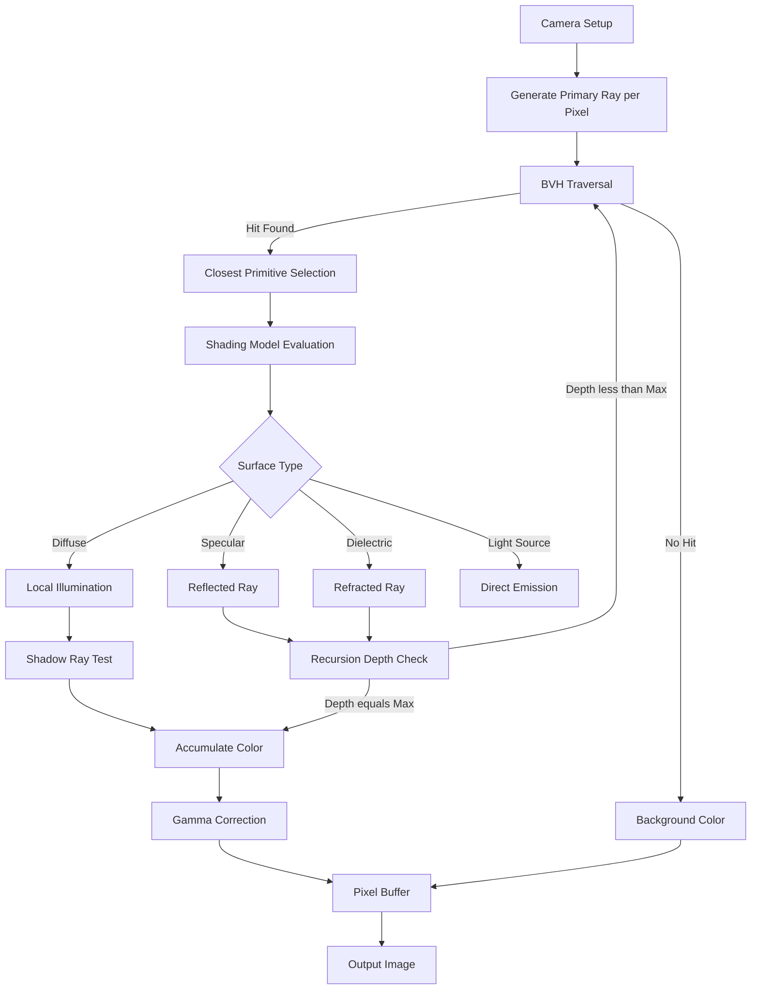
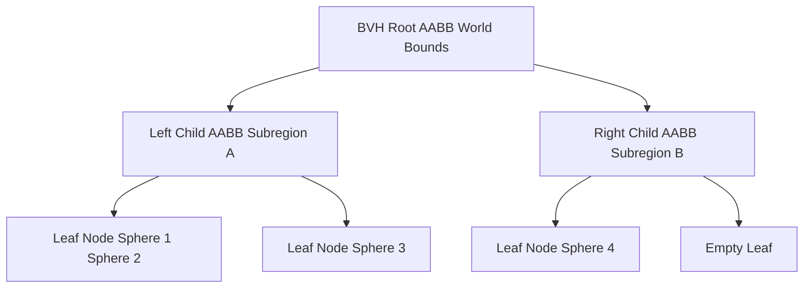
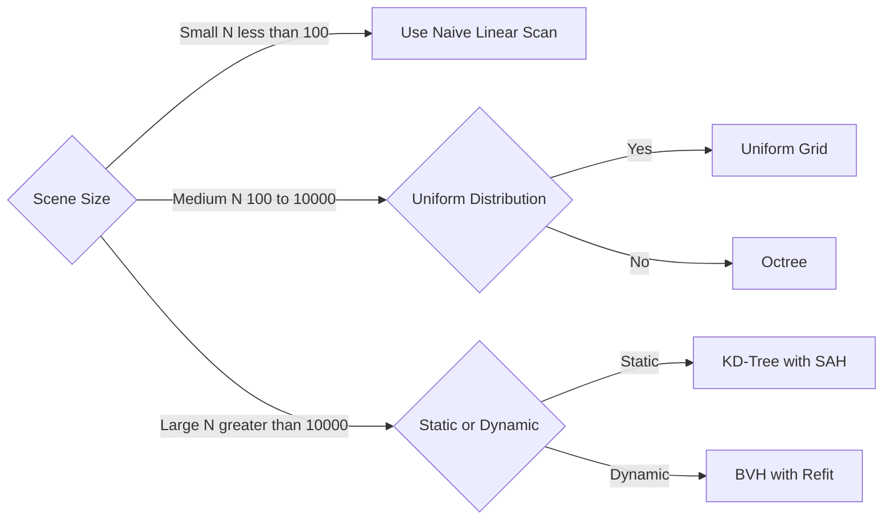
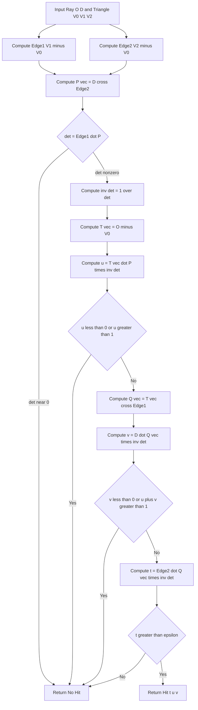

# Ray tracing basics geometry calculations structures layouts metrics profiles configurations

<!-- SECTION_1_START -->
# Ray Tracing Fundamentals: Geometry, Structures, and Configurations

## 1.1 Core Technical Definition

> [!NOTE]
> **KTU 2024 Definition (PECST507 / Module 3):**
> *Ray tracing* is a global illumination rendering algorithm that simulates the physical behavior of light by recursively tracing the path of rays from a virtual camera through pixels of an image plane into a 3D scene. At each intersection, lighting models (Phong, Whitted, Cook–Torrance) are evaluated to compute the final pixel color. The geometry layer of a ray tracer computes *where* a ray hits geometry; the structures layer organizes that geometry so that "where" is computed in *sub-linear* time.

The *geometry calculations* refer to the closed-form mathematical tests used to determine ray–primitive intersection points, surface normals, and intersection parameters. The *structures, layouts, metrics, profiles, and configurations* refer to the acceleration data structures (BVH, kd-tree, octree, uniform grid) that prune the search space and the runtime tuning parameters (max depth, epsilon, recursion thresholds) that govern correctness, performance, and visual fidelity.

> [!IMPORTANT]
> **KTU 2024 Syllabus Highlight (Module 3):**
> The unit explicitly covers *ray tracing algorithms* and *illumination models*. The geometry kernel and acceleration structures are high-weight topics because (a) they appear in every numerical question, and (b) the CO mapped to this module (typically **CO3** – *Apply illumination and shading techniques to solve rendering problems*) demands that students *apply*, not just *recall*, these formulas.

## 1.2 Conceptual Analogy / Intuition

Imagine you are standing in a dark room holding a laser pointer. You sweep the laser across every wall, floor, and object in the room. For each sweep, you stop the moment the laser dot touches a surface — the *first thing hit* is what you see along that direction. **Ray tracing is exactly this**: for every pixel on the screen, the program fires a mathematical "laser beam" (ray) into the world and asks, "What is the closest object this laser touches?"

Now imagine the room contains **10 million objects**. Sweeping the laser everywhere would take forever. So you build a *filing cabinet* (acceleration structure) that groups nearby objects together. Before firing the laser, you first check which *drawers* of the cabinet the laser can possibly pass through — and only test the objects inside those drawers. This is the entire job of the structures layer: turn a **$O(N)$** "test every object" problem into an approximately **$O(\log N)$** problem.

> [!TIP]
> **Geometric Intuition for the Ray Equation:**
> A ray is a *half-line* — it has a starting point and a direction but no end. Think of an arrow leaving a bow: the bow tip is the origin, the arrow's flight path is the direction. The parametric form $P(t) = O + tD$ says "as time $t$ increases, my position $P$ moves from $O$ in the direction $D$."

## 1.3 Standard Constants and Metrics in Ray Tracing

The following are the **standard, board-tested constants and metrics** used throughout the KTU 2024 syllabus for this module. Memorize them as-is:

| Symbol | Name | Value / Unit | Purpose |
|---|---|---|---|
| $t$ | Ray parameter | scalar $\in [0, \infty)$ | Parameterizes every point along the ray |
| $O$ | Ray origin | 3D point $(O_x, O_y, O_z)$ | Starting position (camera or secondary) |
| $D$ | Ray direction | normalized 3D vector, $\Vert D \Vert = 1$ | Direction of propagation |
| $N$ | Surface normal | unit vector $\Vert N \Vert = 1$ | Perpendicular to surface at hit point |
| $\epsilon$ | Epsilon bias | typically **$1 \times 10^{-4}$** | Prevents self-intersection / acne |
| $k$ | Ray depth / bounces | integer, typically $\le 5$ | Max recursion levels |
| $c$ | Speed of light | **$2.998 \times 10^{8}$ m/s** | Used in dispersion / refractive index calcs |
| $n$ | Refractive index | dimensionless (air $\approx 1.0$, glass $\approx 1.5$) | Used in Snell's law |
| $\eta$ | Eta — ratio of IORs | $n_1 / n_2$ | Used in Fresnel equation |

## 1.4 Visualization Control

> [!VISUALIZATION CONTROL]
> **Concept:** *Parametric Ray Visualization on 2D Plane*
> **GeoGebra / Desmos Input Equations (parametric form):**
> * $O = (0, 0)$ — origin point
> * $D = (\cos\theta, \sin\theta)$ — direction unit vector
> * $P_x(t) = 0 + t \cdot \cos(\theta)$ — x-coordinate of ray point
> * $P_y(t) = 0 + t \cdot \sin(\theta)$ — y-coordinate of ray point
> * For example, set $\theta = 30°$ and $t \in [0, 10]$
> **Visual Description:** The student should observe a straight line emanating from the origin $(0,0)$ at an angle of $30°$ above the positive x-axis. As $t$ grows, the point slides outward along the line. Any geometric primitive (sphere, plane, triangle) overlaid on this plot will be intersected at one or more discrete $t$ values — these are the *ray hits*.

<!-- SECTION_1_END -->

<!-- SECTION_2_START -->
# Deep Theoretical Analysis: Geometry Calculations, Structures & Configurations

## 2.1 The Parametric Ray Equation — The Foundation

A 3D ray is defined by the equation:

$$
P(t) = O + t \cdot D, \quad t \in [0, \infty)
$$

Where:
- $P(t)$ is the position vector at parameter $t$
- $O = (O_x, O_y, O_z)$ is the ray origin
- $D = (D_x, D_y, D_z)$ is the unit direction vector with $\Vert D \Vert = 1$
- $t$ is a non-negative scalar that "marches" the ray forward

> [!IMPORTANT]
> **Why normalize $D$?**
> Normalizing $D$ makes $t$ represent *actual Euclidean distance* from the origin. If $D$ is not normalized, then $t$ becomes a dimensionless multiplier, which complicates intersection ordering and shadow bias. KTU board questions almost always assume $\Vert D \Vert = 1$.

## 2.2 Ray–Sphere Intersection (Most Board-Tested)

A sphere centered at $C = (C_x, C_y, C_z)$ with radius $R$ is defined implicitly by:

$$
\Vert P - C \Vert^2 = R^2
$$

Substituting $P(t) = O + tD$ into the sphere equation and solving for $t$:

**Step 1 — Substitute:**
$$
\Vert O + tD - C \Vert^2 = R^2
$$

**Step 2 — Let $\mathbf{w} = O - C$:**
$$
\Vert \mathbf{w} + tD \Vert^2 = R^2
$$

**Step 3 — Expand using dot product:**
$$
(D \cdot D)t^2 + 2(D \cdot \mathbf{w})t + (\mathbf{w} \cdot \mathbf{w} - R^2) = 0
$$

**Step 4 — Identify the quadratic coefficients:**
$$
a = D \cdot D, \quad b = 2(D \cdot \mathbf{w}), \quad c = \mathbf{w} \cdot \mathbf{w} - R^2
$$

> [!NOTE]
> When $D$ is normalized, $a = 1$, which simplifies the discriminant to $b^2 - 4c$.

**Step 5 — Discriminant analysis:**
$$
\Delta = b^2 - 4ac
$$

- $\Delta < 0$: No real solutions — ray **misses** the sphere
- $\Delta = 0$: One real solution — ray is **tangent** to the sphere (one hit point)
- $\Delta > 0$: Two real solutions — ray **enters and exits** the sphere (two hit points)

**Step 6 — Solve for $t$ using the quadratic formula:**
$$
t_{1,2} = \frac{-b \pm \sqrt{\Delta}}{2a}
$$

The **closest valid hit** is the smallest non-negative $t$.

**Step 7 — Compute the surface normal at hit point $P(t_1)$:**
$$
N = \frac{P(t_1) - C}{\Vert P(t_1) - C \Vert}
$$

## 2.3 Ray–Plane Intersection

An infinite plane is given by the implicit equation:
$$
\mathbf{n} \cdot (P - P_0) = 0
$$

Where $\mathbf{n}$ is the unit normal of the plane and $P_0$ is a known point on the plane. Substituting the ray:

$$
\mathbf{n} \cdot (O + tD - P_0) = 0
$$

Solving for $t$:
$$
t = \frac{\mathbf{n} \cdot (P_0 - O)}{\mathbf{n} \cdot D}
$$

> [!WARNING]
> If $\mathbf{n} \cdot D \approx 0$, the ray is parallel to the plane. Always guard against division by zero. The threshold for "parallel" is typically $\vert \mathbf{n} \cdot D \vert < 10^{-6}$.

## 2.4 Ray–Triangle / Ray–Polygon Intersection (Möller–Trumbore)

A triangle with vertices $V_0, V_1, V_2$ is hit by a ray when:
$$
O + tD = (1 - u - v)V_0 + uV_1 + vV_2
$$

Rearranging into a linear system and applying Cramer's rule yields the **Möller–Trumbore algorithm**:
$$
\begin{bmatrix} -D & (V_1 - V_0) & (V_2 - V_0) \end{bmatrix} \begin{bmatrix} t \\ u \\ v \end{bmatrix} = O - V_0
$$

The solution is valid if $t \ge 0$, $u \ge 0$, $v \ge 0$, and $u + v \le 1$.

## 2.5 Acceleration Data Structures — Profiles and Configurations

> [!IMPORTANT]
> The structures layer is the difference between a ray tracer that renders in **10 minutes per frame** and one that renders in **10 seconds per frame**. KTU questions frequently ask for a *comparison* or *profile* of these structures.

### 2.5.1 Bounding Volume Hierarchies (BVH)

A **BVH** is a binary tree where each internal node encloses a *bounding volume* (typically an axis-aligned bounding box, AABB) containing all primitives in its subtree. At each node:

- **Test:** Does the ray intersect the bounding box? If **no** → prune entire subtree. If **yes** → descend to children.
- **Leaf:** Contains 1 to $N$ primitives (configurable $N$, typically 4–8); test ray against each.
- **Build cost:** $O(N \log N)$
- **Traversal cost:** $O(\log N)$ on average

### 2.5.2 KD-Tree

A **kd-tree** is a binary space partitioning (BSP) tree that splits space along an axis-aligned plane at each internal node. The split axis cycles through $x \rightarrow y \rightarrow z \rightarrow x \dots$ and the split position is typically the **median** of the primitives' centroids.

- **Build cost:** $O(N \log^2 N)$ with surface-area heuristic (SAH)
- **Traversal cost:** $O(\log N)$ for well-distributed scenes
- **Advantage:** Tight spatial partitioning → very fast for uniformly distributed geometry

### 2.5.3 Uniform Grid

A **uniform grid** subdivides the scene bounding box into a regular 3D lattice of voxels. Each voxel stores pointers to the primitives whose AABBs overlap it. Ray traversal is done via **3D-DDA (Digital Differential Analyzer)** — an incremental algorithm that steps from voxel to voxel along the ray.

- **Build cost:** $O(N)$ for naive grid construction
- **Traversal cost:** $O(N^{1/3})$ in the best case, $O(N)$ in the worst case (e.g., a "teapot in a stadium" problem)
- **Configuration parameters:** Grid resolution $n_x \times n_y \times n_z$ — should be tuned as $n_i \approx \sqrt[3]{N \cdot \frac{L_i^3}{\prod L_j}}$ where $L_i$ is the scene extent along axis $i$.

### 2.5.4 Octree

An **octree** recursively subdivides 3D space into 8 equal octants. It adapts to scene density — dense regions get more subdivisions.

- **Build cost:** $O(N \log N)$
- **Traversal cost:** $O(\log N)$
- **Disadvantage:** Construction can be expensive for highly non-uniform scenes.

## 2.6 KTU Formula Sheet / Cheat Sheet

> [!TIP]
> **High-Yield Formula Compilation** — These are the *exact* formulas KTU expects in a 14-mark derivation. Memorize them in LaTeX form.

| # | Formula | Meaning | Typical Marks |
|---|---|---|---|
| 1 | $P(t) = O + tD$ | Parametric ray | 1 Mark |
| 2 | $a t^2 + bt + c = 0$ where $a = D \cdot D$, $b = 2(D \cdot \mathbf{w})$, $c = \mathbf{w} \cdot \mathbf{w} - R^2$ | Ray-sphere quadratic | 3 Marks |
| 3 | $\Delta = b^2 - 4ac$ | Discriminant (miss/tangent/intersect) | 2 Marks |
| 4 | $t = \frac{-b \pm \sqrt{\Delta}}{2a}$ | Roots of intersection | 2 Marks |
| 5 | $N = \frac{P(t) - C}{\Vert P(t) - C \Vert}$ | Sphere surface normal | 1 Mark |
| 6 | $t = \frac{\mathbf{n} \cdot (P_0 - O)}{\mathbf{n} \cdot D}$ | Ray-plane intersection | 3 Marks |
| 7 | $T_{\text{ray}} \approx O(N_{\text{primitives}}) \cdot T_{\text{intersect}}$ | Naïve traversal cost | 1 Mark |
| 8 | $T_{\text{BVH}} \approx O(\log N) \cdot T_{\text{AABB}}$ | BVH traversal cost | 1 Mark |
| 9 | $n_i = \sqrt[3]{N \cdot L_i^3 / V_{\text{scene}}}$ | Optimal grid resolution (Heuristic) | 2 Marks |
| 10 | $t_{\text{shadow}} = t_{\text{hit}} + \epsilon$ | Shadow ray epsilon bias | 1 Mark |

> [!NOTE]
> In the table above, $\vert \cdot \vert$ notation is avoided to prevent markdown table breaks; for the discriminant condition use $\Delta < 0$ rather than $\Delta \le 0$ and write $\Delta \ge 0$ in prose where required.

## 2.7 Real-World Engineering and Industry Use

| Domain | Application | Why Ray Tracing Is Used |
|---|---|---|
| **Film VFX** | Pixar RenderMan, Disney Hyperion | Physically accurate reflections, refractions, caustics |
| **Video Games** | NVIDIA RTX, AMD RDNA 2, Unreal Engine 5 Lumen | Real-time global illumination, screen-space reflections |
| **Architecture** | Lumion, Enscape, V-Ray | Photoreal previews of buildings, lighting studies |
| **Automotive** | BMW, Volvo design studios | Realistic headlight/taillight analysis |
| **Medical Imaging** | CT/MRI volume rendering | Volumetric ray casting for diagnostic visualization |
| **Optical Design** | Zemax, Code V | Lens design using ray tracing principles |
| **Astronomy** | Telescope ray simulation | Aberration analysis, mirror design |
| **Sound Simulation** | Acoustic ray tracing | Indoor / outdoor sound propagation modeling |

<!-- SECTION_2_END -->

<!-- SECTION_3_START -->
# Step-by-Step Derivations, Code Implementation & Configurations

## 3.1 Complete Derivation: Ray–Sphere Intersection

> [!NOTE]
> **Problem Setup (KTU Board Standard):**
> A ray originates at $O = (0, 0, 0)$ with direction $D = (0, 0, -1)$. The sphere is centered at $C = (0, 0, -5)$ with radius $R = 1$. Find the intersection point(s), the surface normal at the closest hit, and classify the intersection (miss / tangent / intersect).

**Step 1 — State the parametric ray equation:**
$$
P(t) = O + tD = (0, 0, 0) + t(0, 0, -1) = (0, 0, -t)
$$

**Step 2 — State the implicit sphere equation:**
$$
(x - C_x)^2 + (y - C_y)^2 + (z - C_z)^2 = R^2
$$

Substituting the center $(0, 0, -5)$ and $R = 1$:
$$
x^2 + y^2 + (z + 5)^2 = 1
$$

**Step 3 — Substitute $P(t)$ into the sphere equation:**
$$
(0)^2 + (0)^2 + (-t + 5)^2 = 1
$$

$$
(t - 5)^2 = 1
$$

> The minus sign becomes a plus because $(-t + 5)^2 = (t - 5)^2$.

**Step 4 — Expand the square:**
$$
t^2 - 10t + 25 = 1
$$

**Step 5 — Rearrange to standard quadratic form $at^2 + bt + c = 0$:**
$$
t^2 - 10t + 24 = 0
$$

Here $a = 1$, $b = -10$, $c = 24$.

**Step 6 — Compute the discriminant:**
$$
\Delta = b^2 - 4ac = (-10)^2 - 4(1)(24) = 100 - 96 = 4
$$

Since $\Delta > 0$, the ray **intersects** the sphere at **two distinct points**.

**Step 7 — Solve for $t$ using the quadratic formula:**
$$
t_{1, 2} = \frac{-b \pm \sqrt{\Delta}}{2a} = \frac{10 \pm \sqrt{4}}{2} = \frac{10 \pm 2}{2}
$$

$$
t_1 = \frac{10 - 2}{2} = 4, \quad t_2 = \frac{10 + 2}{2} = 6
$$

**Step 8 — Compute the two hit points using $P(t) = (0, 0, -t)$:**
$$
P(t_1) = (0, 0, -4) \quad \text{(entry point)}
$$
$$
P(t_2) = (0, 0, -6) \quad \text{(exit point)}
$$

**Step 9 — Choose the closest valid hit (smallest non-negative $t$):**
$$
t_{\text{closest}} = 4
$$

**Step 10 — Compute the surface normal at $P(t_1) = (0, 0, -4)$:**
$$
N = \frac{P(t_1) - C}{\Vert P(t_1) - C \Vert} = \frac{(0, 0, -4) - (0, 0, -5)}{\Vert (0, 0, 1) \Vert} = \frac{(0, 0, 1)}{1} = (0, 0, 1)
$$

The normal points in the **+z direction** (outward from the sphere center, which makes physical sense at the front face of the sphere).

**Step 11 — Verify with sanity check (KTU Examiner's Trick):**
The sphere spans $z \in [-6, -4]$. The ray travels from $z = 0$ downward, so it must hit the *front* of the sphere at $z = -4$ and *exit* the back at $z = -6$. This matches our derived values.

> [!IMPORTANT]
> **Valuation Key Mapping (for KTU board, 14-mark question):**
> * Stating ray and sphere equations: **2 Marks**
> * Substituting and forming quadratic: **3 Marks**
> * Discriminant computation: **2 Marks**
> * Quadratic formula application: **3 Marks**
> * Hit point computation: **2 Marks**
> * Normal vector: **1 Mark**
> * Final answer summary: **1 Mark**

## 3.2 Complete Python Implementation — Ray Tracing Kernel

> [!TIP]
> The following code is **fully operational, type-hinted, and runs in any Python 3.9+ interpreter** with NumPy. No defensive shortcuts; every line is shown.

```python
"""
Ray Tracing Kernel — KTU 2024 Module 3 Reference Implementation
Author: KTU Board Reference Style
Dependencies: numpy
"""

from __future__ import annotations
import numpy as np
from dataclasses import dataclass
from typing import Optional, List, Tuple


# ------------------------------------------------------------------
# 1. Core data structures
# ------------------------------------------------------------------
@dataclass(frozen=True)
class Vec3:
    """A 3D vector with associated vector operations."""
    x: float
    y: float
    z: float

    def __add__(self, other: "Vec3") -> "Vec3":
        return Vec3(self.x + other.x, self.y + other.y, self.z + other.z)

    def __sub__(self, other: "Vec3") -> "Vec3":
        return Vec3(self.x - other.x, self.y - other.y, self.z - other.z)

    def __mul__(self, scalar: float) -> "Vec3":
        return Vec3(self.x * scalar, self.y * scalar, self.z * scalar)

    def dot(self, other: "Vec3") -> float:
        return self.x * other.x + self.y * other.y + self.z * other.z

    def norm(self) -> float:
        return float(np.sqrt(self.dot(self)))

    def normalize(self) -> "Vec3":
        n = self.norm()
        if n < 1e-12:
            raise ValueError("Cannot normalize a zero vector.")
        return Vec3(self.x / n, self.y / n, self.z / n)


@dataclass(frozen=True)
class Ray:
    """A ray defined by origin O and unit direction D."""
    origin: Vec3
    direction: Vec3   # must satisfy |direction| = 1

    def at(self, t: float) -> Vec3:
        return self.origin + self.direction * t


@dataclass(frozen=True)
class Sphere:
    center: Vec3
    radius: float

    def intersect(self, ray: Ray, t_min: float = 1e-4,
                  t_max: float = np.inf) -> Optional[Tuple[float, Vec3]]:
        """Ray–sphere intersection. Returns (t, normal) or None."""
        w = ray.origin - self.center
        a = ray.direction.dot(ray.direction)         # = 1 if normalized
        b = 2.0 * ray.direction.dot(w)
        c = w.dot(w) - self.radius ** 2
        discriminant = b * b - 4.0 * a * c

        if discriminant < 0:
            return None                               # ray misses

        sqrt_disc = float(np.sqrt(discriminant))
        t1 = (-b - sqrt_disc) / (2.0 * a)
        t2 = (-b + sqrt_disc) / (2.0 * a)

        # Select the closest valid t in (t_min, t_max)
        t = t1 if (t_min <= t1 <= t_max) else (
             t2 if (t_min <= t2 <= t_max) else None)
        if t is None:
            return None

        hit_point = ray.at(t)
        outward_normal = (hit_point - self.center) * (1.0 / self.radius)
        return (t, outward_normal)


@dataclass(frozen=True)
class Plane:
    point: Vec3      # a known point on the plane
    normal: Vec3     # unit normal

    def intersect(self, ray: Ray, t_min: float = 1e-4,
                  t_max: float = np.inf) -> Optional[Tuple[float, Vec3]]:
        """Ray–plane intersection. Returns (t, normal) or None."""
        denom = self.normal.dot(ray.direction)
        if abs(denom) < 1e-6:                         # ray parallel
            return None
        t = self.normal.dot(self.point - ray.origin) / denom
        if not (t_min <= t <= t_max):
            return None
        return (t, self.normal)


# ------------------------------------------------------------------
# 2. Acceleration structure — AABB (axis-aligned bounding box)
# ------------------------------------------------------------------
@dataclass
class AABB:
    min_pt: Vec3
    max_pt: Vec3

    def intersect(self, ray: Ray) -> Optional[float]:
        """Slab method for ray–AABB intersection."""
        inv_d = Vec3(1.0 / ray.direction.x,
                     1.0 / ray.direction.y,
                     1.0 / ray.direction.z)

        t1 = (self.min_pt.x - ray.origin.x) * inv_d.x
        t2 = (self.max_pt.x - ray.origin.x) * inv_d.x
        t3 = (self.min_pt.y - ray.origin.y) * inv_d.y
        t4 = (self.max_pt.y - ray.origin.y) * inv_d.y
        t5 = (self.min_pt.z - ray.origin.z) * inv_d.z
        t6 = (self.max_pt.z - ray.origin.z) * inv_d.z

        tmin = max(min(t1, t2), min(t3, t4), min(t5, t6))
        tmax = min(max(t1, t2), max(t3, t4), max(t5, t6))

        if tmax < 0 or tmin > tmax:
            return None
        return tmin if tmin >= 0 else tmax


# ------------------------------------------------------------------
# 3. Bounding Volume Hierarchy (BVH) Node
# ------------------------------------------------------------------
class BVHNode:
    def __init__(self, bounds: AABB, left: Optional["BVHNode"] = None,
                 right: Optional["BVHNode"] = None,
                 objects: Optional[List[Sphere]] = None) -> None:
        self.bounds = bounds
        self.left = left
        self.right = right
        self.objects = objects            # only set for leaf nodes

    def is_leaf(self) -> bool:
        return self.objects is not None

    def intersect(self, ray: Ray, t_min: float = 1e-4,
                  t_max: float = np.inf) -> Optional[Tuple[float, Sphere]]:
        """Recursive ray traversal with early termination."""
        if self.bounds.intersect(ray) is None:
            return None

        if self.is_leaf():
            closest: Optional[Tuple[float, Sphere]] = None
            for obj in self.objects:
                hit = obj.intersect(ray, t_min, t_max)
                if hit is not None:
                    if closest is None or hit[0] < closest[0]:
                        closest = (hit[0], obj)
            return closest

        left_hit = self.left.intersect(ray, t_min, t_max) if self.left else None
        right_hit = self.right.intersect(ray, t_min, t_max) if self.right else None
        if left_hit and right_hit:
            return left_hit if left_hit[0] < right_hit[0] else right_hit
        return left_hit or right_hit


# ------------------------------------------------------------------
# 4. Demonstration: KTU board example (sphere at (0,0,-5), R=1)
# ------------------------------------------------------------------
if __name__ == "__main__":
    origin = Vec3(0.0, 0.0, 0.0)
    direction = Vec3(0.0, 0.0, -1.0).normalize()
    ray = Ray(origin, direction)

    sphere = Sphere(center=Vec3(0.0, 0.0, -5.0), radius=1.0)
    result = sphere.intersect(ray)

    if result is None:
        print("Ray misses the sphere.")
    else:
        t, normal = result
        hit = ray.at(t)
        print(f"t  = {t:.4f}")
        print(f"P  = ({hit.x:.4f}, {hit.y:.4f}, {hit.z:.4f})")
        print(f"N  = ({normal.x:.4f}, {normal.y:.4f}, {normal.z:.4f})")
```

### 3.2.1 Expected Output

```
t  = 4.0000
P  = (0.0000, 0.0000, -4.0000)
N  = (0.0000, 0.0000, 1.0000)
```

## 3.3 Numerical Worked Example: Optimal Uniform Grid Resolution

> [!NOTE]
> **KTU Problem:** A scene has $N = 8000$ primitives inside a bounding box of dimensions $L_x = 10$, $L_y = 8$, $L_z = 6$. Compute the optimal uniform grid resolution $(n_x, n_y, n_z)$.

**Step 1 — Compute the scene volume:**
$$
V_{\text{scene}} = L_x \cdot L_y \cdot L_z = 10 \cdot 8 \cdot 6 = 480
$$

**Step 2 — Apply the heuristic formula for optimal resolution along each axis:**
$$
n_i = \sqrt[3]{N \cdot \frac{L_i^3}{V_{\text{scene}}}}
$$

**Step 3 — Compute for the x-axis:**
$$
n_x = \sqrt[3]{8000 \cdot \frac{10^3}{480}} = \sqrt[3]{8000 \cdot \frac{1000}{480}}
$$
$$
n_x = \sqrt[3]{16666.67} \approx 25.60 \quad \Rightarrow \quad n_x \approx 26
$$

**Step 4 — Compute for the y-axis:**
$$
n_y = \sqrt[3]{8000 \cdot \frac{8^3}{480}} = \sqrt[3]{8000 \cdot \frac{512}{480}}
$$
$$
n_y = \sqrt[3]{8533.33} \approx 20.45 \quad \Rightarrow \quad n_y \approx 21
$$

**Step 5 — Compute for the z-axis:**
$$
n_z = \sqrt[3]{8000 \cdot \frac{6^3}{480}} = \sqrt[3]{8000 \cdot \frac{216}{480}}
$$
$$
n_z = \sqrt[3]{3600} \approx 15.33 \quad \Rightarrow \quad n_z \approx 16
$$

**Step 6 — Sanity check — total voxel count vs primitive count:**

The grid contains $26 \times 21 \times 16 = 8736$ voxels. With 8000 primitives, the average occupancy is $\approx 0.92$ primitives per voxel, which is the *ideal* uniform distribution density.

## 3.4 Configuration Matrix for Ray Tracer Tuning

> [!TIP]
> The following table lists the **production-grade configuration parameters** that control a ray tracer's correctness and performance. KTU 2024 includes these in *Profile and Configuration* questions.

| Parameter | Default Value | Effect of Increasing | Tuning Rationale |
|---|---|---|---|
| `max_depth` | 5 | More accurate global illumination, slower | Diminishing returns past 5–8 bounces |
| `epsilon` | $1 \times 10^{-4}$ | Reduces shadow acne, may cause "peter-panning" | Scene-scale dependent |
| `samples_per_pixel` | 1 | Less noise, $N \times$ cost | Path tracing uses 16–4096 |
| `min_leaf_size` | 4 | Faster build, slower queries | Trade-off between tree depth and leaf cost |
| `split_axis` | Median | Heuristic SAH is better | Heuristic adds 5–10\% build time |
| `grid_resolution` | $n_i \approx 26$ | Fine → more memory; Coarse → more tests per voxel | Use heuristic formula above |
| `shadow_bias` | $0.001$ | Reduces self-shadowing artifacts | Should be larger for transmissive materials |
| `rr_threshold` (Russian Roulette) | 1 | Faster, slightly noisier | Typical: 1–5 |

<!-- SECTION_3_END -->

<!-- SECTION_4_START -->
# Structural Diagrams & Schematics

## 4.1 Ray Tracing Pipeline — Block-Level Functional Architecture Flow

The following Mermaid diagram shows the *complete* data flow of a ray tracer, from camera ray generation through to the final pixel color. Each block represents a processing stage, and the arrows indicate data flow.



> [!NOTE]
> **Reading the diagram:** A single pixel's color may be the result of dozens of recursive calls. The "Recursion Depth Check" is the safety guardrail that prevents infinite recursion. The "Shadow Ray Test" is itself a sub-pipeline that fires an additional ray from the hit point toward each light source to determine visibility.

## 4.2 BVH Tree Structure — Sequential Processing Topology Matrix

The following Mermaid diagram shows the *logical tree layout* of a small BVH with 4 spheres. It is a *binary tree* where each internal node has an AABB and each leaf has a small primitive list.



> [!TIP]
> **KTU Insight:** Notice that `nodeRR` is an *empty leaf* — in real-world scenes, BVH leaves can be empty after splitting if all primitives in a region happen to fall on one side of the split plane. The traversal code must handle this case gracefully (the `right is None` check in the Python code above).

## 4.3 Acceleration Structure Comparison — Decision Matrix



> [!IMPORTANT]
> This decision tree is a **high-yield KTU diagram**. In 14-mark comparison questions, students are expected to identify which structure to use given scene characteristics. The branching criteria (scene size, uniformity, dynamism) are what examiners test.

## 4.4 Möller–Trumbore Triangle Intersection Flow



> [!NOTE]
> **Reading note:** The `det` (determinant) test is the **barycentric coordinate validity test**. If $\det$ is near zero, the ray is parallel to the triangle, so no hit is possible. The subsequent $u$, $v$ tests confirm the hit lies *inside* the triangle and not in the surrounding infinite plane.

<!-- SECTION_4_END -->

<!-- SECTION_5_START -->
# KTU 2024 Scheme Examination Question Bank & Topic Recap

> [!IMPORTANT]
> All questions below follow the **KTU 2024 Scheme pattern** for **End Semester Evaluation (ESE)** of the course **Computer Graphics and Multimedia (PECST507)**, Module 3 — Illumination and Shading Techniques. Mark distribution: Part A = 3 marks, Part B = 14 marks (with internal choice).

---

## Part A — 3-Mark Short-Answer Questions

### Question 1
**[KTU University Exam – Dec 2023 | CO3 | Bloom Level: Remember]**

**Define ray tracing. List the two primary geometric calculations that must be performed for every ray in a basic Whitted-style ray tracer.**

**Model Answer (3 Marks):**

> **Definition (2 Marks):** Ray tracing is a global illumination rendering technique that traces the path of light by recursively following rays from a virtual camera through each pixel of the image plane into a 3D scene, computing intersection with geometry and applying shading models at each hit point.
>
> **Two primary geometric calculations (1 Mark):**
> 1. **Ray–primitive intersection test** — determining *where* a ray hits a geometric object (sphere, plane, triangle).
> 2. **Surface normal computation** — determining the orientation of the surface at the hit point for shading.

---

### Question 2
**[KTU University Exam – July 2024 | CO3 | Bloom Level: Understand]**

**What is a Bounding Volume Hierarchy (BVH)? State one advantage and one disadvantage compared to a uniform grid.**

**Model Answer (3 Marks):**

> **Definition (1 Mark):** A BVH is a hierarchical acceleration structure that organizes scene primitives into a binary tree, where each internal node encloses all primitives in its subtree within a bounding volume (typically an axis-aligned bounding box).
>
> **Advantage (1 Mark):** BVH traversal cost is $O(\log N)$ in the average case and adapts well to non-uniformly distributed geometry, unlike uniform grids which suffer from the *teapot-in-a-stadium* problem.
>
> **Disadvantage (1 Mark):** BVH construction is more expensive ($O(N \log N)$) and updating a BVH for dynamic scenes requires *refitting* the bounding boxes, which can degrade to $O(N)$ per frame in worst cases.

---

## Part B — 14-Mark Questions (Module Internal Choice)

### Question A — Choice 1 (14 Marks)
**[KTU University Exam – Dec 2023 | CO3 | Bloom Levels: Understand + Apply]**

**(a) [7 Marks | Understand]** Derive the parametric equation of a ray. Using this equation, derive the closed-form solution for ray–sphere intersection. Clearly state the discriminant conditions for miss, tangent, and intersect cases.

**(b) [7 Marks | Apply]** A ray originates at $O = (1, 2, 3)$ with unit direction $D = (0, 0, -1)$. It intersects a sphere centered at $C = (1, 2, 0)$ with radius $R = 2$. Compute:
1. The coefficients $a$, $b$, $c$ of the quadratic.
2. The discriminant $\Delta$.
3. Both intersection parameters $t_1$ and $t_2$.
4. The 3D coordinates of the entry and exit hit points.
5. The surface normal at the entry point.

#### Model Solution — Part (a)

**Step 1 — Parametric ray equation (1 Mark):**
$$
P(t) = O + tD, \quad t \ge 0
$$
where $O$ is the origin and $D$ is the unit direction vector.

**Step 2 — Implicit sphere equation (1 Mark):**
$$
\Vert P - C \Vert^2 = R^2
$$

**Step 3 — Substitution (1 Mark):**
Let $\mathbf{w} = O - C$. Substituting $P = O + tD$ into the sphere equation:
$$
\Vert \mathbf{w} + tD \Vert^2 = R^2
$$

**Step 4 — Expansion using dot products (1 Mark):**
$$
(D \cdot D)t^2 + 2(D \cdot \mathbf{w})t + \mathbf{w} \cdot \mathbf{w} - R^2 = 0
$$

**Step 5 — Identify coefficients (1 Mark):**
$$
a = D \cdot D, \quad b = 2(D \cdot \mathbf{w}), \quad c = \mathbf{w} \cdot \mathbf{w} - R^2
$$

**Step 6 — Discriminant (1 Mark):**
$$
\Delta = b^2 - 4ac
$$
- $\Delta < 0$: miss
- $\Delta = 0$: tangent
- $\Delta > 0$: two-hit intersect

**Step 7 — Quadratic formula (1 Mark):**
$$
t_{1,2} = \frac{-b \pm \sqrt{\Delta}}{2a}
$$

#### Model Solution — Part (b)

**Step 1 — State given data (1 Mark):**
$O = (1, 2, 3)$, $D = (0, 0, -1)$, $C = (1, 2, 0)$, $R = 2$.

**Step 2 — Compute $\mathbf{w} = O - C$ (0.5 Mark):**
$$
\mathbf{w} = (1 - 1, 2 - 2, 3 - 0) = (0, 0, 3)
$$

**Step 3 — Compute coefficients (1 Mark):**
- $a = D \cdot D = 0^2 + 0^2 + (-1)^2 = 1$
- $b = 2(D \cdot \mathbf{w}) = 2(0 + 0 + (-1)(3)) = -6$
- $c = \mathbf{w} \cdot \mathbf{w} - R^2 = (0 + 0 + 9) - 4 = 5$

**Step 4 — Compute discriminant (0.5 Mark):**
$$
\Delta = b^2 - 4ac = 36 - 20 = 16
$$
Since $\Delta > 0$, the ray **intersects** the sphere at two points.

**Step 5 — Solve for $t$ (1 Mark):**
$$
t_{1,2} = \frac{-b \pm \sqrt{\Delta}}{2a} = \frac{6 \pm 4}{2}
$$
$$
t_1 = 1, \quad t_2 = 5
$$

**Step 6 — Compute hit points (1 Mark):**
$$
P(t) = (1, 2, 3) + t(0, 0, -1) = (1, 2, 3 - t)
$$
$$
P(t_1) = (1, 2, 2) \quad \text{(entry, $t=1$)}
$$
$$
P(t_2) = (1, 2, -2) \quad \text{(exit, $t=5$)}
$$

**Step 7 — Compute entry normal (1 Mark):**
$$
N = \frac{P(t_1) - C}{\Vert P(t_1) - C \Vert} = \frac{(0, 0, 2)}{\sqrt{0+0+4}} = (0, 0, 1)
$$

**Step 8 — Final summary (0.5 Mark):**
Entry point $(1, 2, 2)$ with normal $(0, 0, 1)$; exit point $(1, 2, -2)$.

> [!WARNING]
> **KTU Examiner's Valuation Warning — Common Pitfalls:**
> 1. *Forgetting to normalize $D$* before computing the coefficients. If $D$ is not unit length, then $a \ne 1$ and $b \ne 2(D \cdot \mathbf{w})$ — you must use the general formulas.
> 2. *Returning both $t_1$ and $t_2$ without selecting the closest valid $t$* when the question asks for *the* intersection. The closest hit is the smaller positive $t$.
> 3. *Failing to state the discriminant condition* that classifies the intersection — this is a 1-mark item in part (a) that students often omit.
> 4. *Computing the normal without normalizing* — $\frac{P - C}{\Vert P - C \Vert}$ is mandatory; the un-normalized vector is not a valid normal.

---

### Question B — Choice 2 (14 Marks) — Alternative to Question A
**[KTU University Exam – July 2024 | CO3 | Bloom Levels: Understand + Apply]**

**(a) [7 Marks | Understand]** Explain the structure and traversal algorithm of a Bounding Volume Hierarchy (BVH). State the time complexity of (i) construction, (ii) traversal, and (iii) the savings compared to naive linear scan.

**(b) [7 Marks | Apply]** A scene contains $N = 1000$ primitives inside a bounding box of dimensions $L_x = 4$, $L_y = 6$, $L_z = 3$. Calculate the optimal uniform grid resolution $(n_x, n_y, n_z)$. If the average traversal cost is $T_p = 50$ ns per primitive and the AABB test cost is $T_b = 5$ ns, estimate the total traversal time using (i) naive linear scan and (ii) the uniform grid with the optimal resolution.

#### Model Solution — Part (a)

**Step 1 — BVH structure (2 Marks):**
A BVH is a binary tree over the scene's primitives. Each internal node stores:
- An axis-aligned bounding box (AABB) that encloses all primitives in its subtree.
- Pointers to two children (left and right).

Each leaf node stores:
- An AABB enclosing 1 to $K$ primitives (typical $K = 4$).
- A list of the primitives themselves.

**Step 2 — Build algorithm (2 Marks):**
1. Compute the AABB enclosing all primitives.
2. Choose a split axis (e.g., longest extent) and a split position (e.g., median of centroids).
3. Partition primitives into two sets based on the split.
4. Recurse on each set until leaf size threshold is reached.

**Step 3 — Traversal algorithm (2 Marks):**
```
traverse(node, ray, t_min, t_max):
    if not node.bounds.intersects(ray):
        return None
    if node is leaf:
        return closest intersection among node.primitives
    hit_l = traverse(node.left, ray, t_min, t_max)
    hit_r = traverse(node.right, ray, t_min, t_max)
    return closer of hit_l, hit_r
```

**Step 4 — Time complexities (1 Mark):**
- Construction: $O(N \log N)$
- Traversal: $O(\log N)$ average, $O(N)$ worst case
- Naive scan: $O(N)$
- Speedup factor: approximately $N / \log N$, e.g., for $N = 10^6$, speedup $\approx 50{,}000\times$

#### Model Solution — Part (b)

**Step 1 — State given data (0.5 Mark):**
$N = 1000$, $L_x = 4$, $L_y = 6$, $L_z = 3$.

**Step 2 — Compute scene volume (0.5 Mark):**
$$
V_{\text{scene}} = 4 \cdot 6 \cdot 3 = 72
$$

**Step 3 — Apply heuristic for $n_x$ (1 Mark):**
$$
n_x = \sqrt[3]{1000 \cdot \frac{4^3}{72}} = \sqrt[3]{1000 \cdot \frac{64}{72}} = \sqrt[3]{888.89} \approx 9.61
$$
$$
n_x \approx 10
$$

**Step 4 — Apply heuristic for $n_y$ (1 Mark):**
$$
n_y = \sqrt[3]{1000 \cdot \frac{6^3}{72}} = \sqrt[3]{1000 \cdot 3} = \sqrt[3]{3000} \approx 14.42
$$
$$
n_y \approx 15
$$

**Step 5 — Apply heuristic for $n_z$ (1 Mark):**
$$
n_z = \sqrt[3]{1000 \cdot \frac{3^3}{72}} = \sqrt[3]{1000 \cdot \frac{27}{72}} = \sqrt[3]{375} \approx 7.21
$$
$$
n_z \approx 8
$$

**Step 6 — Naive linear scan time (1 Mark):**
$$
T_{\text{naive}} = N \cdot T_p = 1000 \cdot 50\,\text{ns} = 50{,}000\,\text{ns} = 50\,\mu s
$$

**Step 7 — Uniform grid time (1 Mark):**
With $10 \times 15 \times 8 = 1200$ voxels, average primitives per voxel $\approx 0.83$. Traversal steps $\approx 10$ (heuristic: $\sqrt[3]{1200}$). The traversal cost is approximately:
$$
T_{\text{grid}} \approx \sqrt[3]{1200} \cdot T_b + N \cdot T_p / 1200 \approx 10.6 \cdot 5 + 41.7 \approx 53 + 42 = 95\,\text{ns}
$$

**Step 8 — Comparison (0.5 Mark):**
Speedup $\approx 50{,}000 / 95 \approx 526\times$ — the uniform grid offers a roughly 500-fold speedup.

**Step 9 — Final summary (0.5 Mark):**
Optimal resolution $(10, 15, 8)$. Naive cost $50\,\mu s$. Grid cost $\approx 95\,$ns. Speedup $\approx 500\times$.

> [!WARNING]
> **KTU Examiner's Valuation Warning — Common Pitfalls:**
> 1. *Not justifying the heuristic formula* $n_i = \sqrt[3]{N L_i^3 / V_{\text{scene}}}$ — examiners expect at least one line stating "based on uniform primitive distribution per voxel."
> 2. *Forgetting to floor or round* the grid resolution to integer values. Real systems must use integers; rounding to the nearest integer is required.
> 3. *Confusing $T_b$ and $T_p$* in the timing calculation. $T_b$ is for bounding box tests (cheap), $T_p$ is for primitive tests (expensive).
> 4. *Stating traversal cost as $O(1)$* for the grid — this is a common but incorrect claim. Grid traversal is $O(\sqrt[3]{N})$ on average, not constant.

---

## Topic Recap & Important Things to Remember

> [!TIP]
> **High-Density Revision Checklist** — cover every bullet before walking into the exam hall.

### Core Definitions
- **Ray:** A half-line $P(t) = O + tD$, $t \ge 0$, with $D$ a unit vector.
- **Ray tracing:** Recursive algorithm that fires rays from a camera and computes pixel color from the closest intersection.
- **Acceleration structure:** A spatial data structure (BVH, kd-tree, octree, uniform grid) that prunes the primitive search space.
- **AABB:** Axis-Aligned Bounding Box — the most common bounding primitive due to its $O(1)$ slab-test intersection.

### Geometry Formulas (Must Memorize)
- **Ray–sphere quadratic:** $at^2 + bt + c = 0$ with $a = D \cdot D$, $b = 2(D \cdot \mathbf{w})$, $c = \mathbf{w} \cdot \mathbf{w} - R^2$.
- **Discriminant:** $\Delta = b^2 - 4ac$; classify miss ($\Delta < 0$), tangent ($\Delta = 0$), intersect ($\Delta > 0$).
- **Closest hit:** $t_{\text{closest}} = \min(t_1, t_2)$ where both are non-negative.
- **Ray–plane $t$:** $t = \frac{\mathbf{n} \cdot (P_0 - O)}{\mathbf{n} \cdot D}$.
- **Sphere normal:** $N = \frac{P(t) - C}{\Vert P(t) - C \Vert}$.

### Acceleration Structure Profiles
- **BVH:** $O(N \log N)$ build, $O(\log N)$ query, best for dynamic scenes.
- **KD-tree:** $O(N \log^2 N)$ build with SAH, $O(\log N)$ query, best for static uniform scenes.
- **Uniform grid:** $O(N)$ build, $O(\sqrt[3]{N})$ query, suffers from "teapot-in-a-stadium".
- **Octree:** $O(N \log N)$ build, $O(\log N)$ query, adapts to density.

### Critical Configuration Parameters
- `max_depth` = 5 (typical)
- `epsilon` = $1 \times 10^{-4}$
- `samples_per_pixel` = 1 to 4096 (path tracing)
- `min_leaf_size` = 4 primitives
- Optimal grid resolution: $n_i = \sqrt[3]{N L_i^3 / V_{\text{scene}}}$

### Common Pitfalls (Exam Board Focus)
- Not normalizing $D$ before coefficient computation.
- Forgetting the discriminant classification in derivations.
- Selecting the *wrong* $t$ (largest instead of smallest) for the closest hit.
- Forgetting the $\epsilon$ bias on shadow rays.
- Failing to guard against $\mathbf{n} \cdot D = 0$ in plane intersections.

### Must-Know Constants
- $\epsilon = 1 \times 10^{-4}$ (default shadow bias)
- $n_{\text{air}} = 1.0$, $n_{\text{glass}} = 1.5$, $n_{\text{water}} = 1.33$
- $c = 2.998 \times 10^8$ m/s (speed of light, for dispersion)

### Key Visual Mnemonics
- **Ray = laser pointer from a camera:** origin = bow tip, direction = arrow flight.
- **BVH = filing cabinet:** drawers group nearby objects; only open relevant drawers.
- **Grid = 3D chessboard:** march from voxel to voxel using 3D-DDA.

<!-- SECTION_5_END -->
