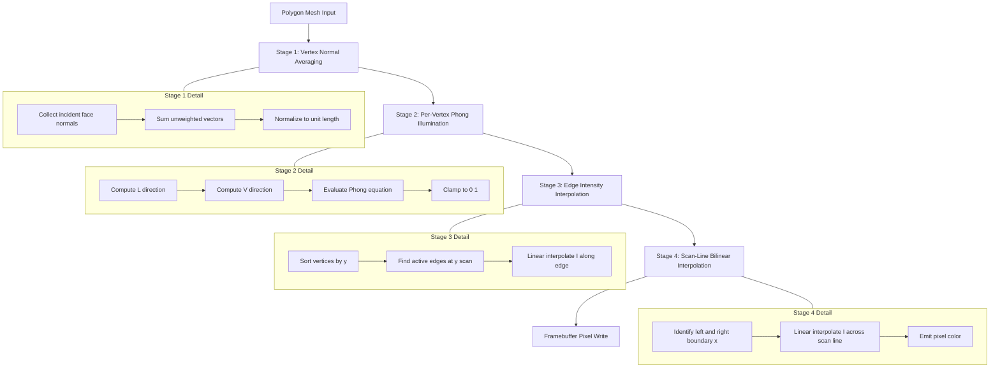
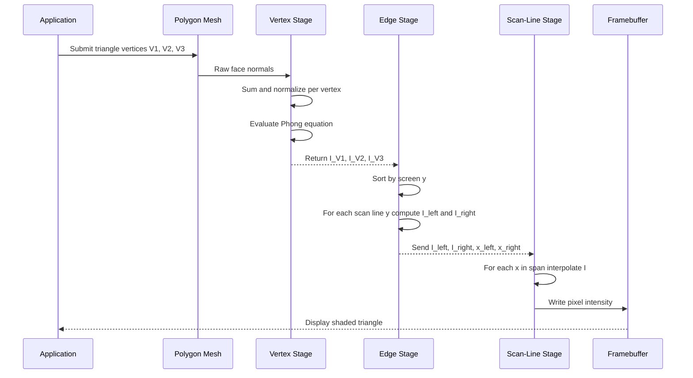
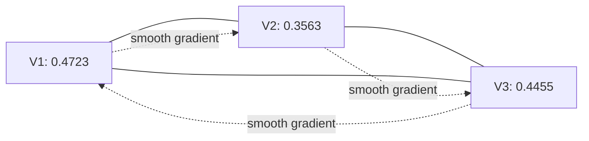

# Surface rendering adjustments routines: Gouraud shading maps layouts templates

<!-- SECTION_1_START -->

# 1. Core Technical Definition & Intuitive Overview

## 1.1 Formal KTU Syllabus Definition

**Gouraud Shading** (also called *Intensity Interpolation Shading*) is a per-vertex surface rendering adjustment routine devised by **Henri Gouraud (1971)** that determines the color of a polygonal mesh by computing the **Phong illumination model at each vertex** of the polygon, and then **bilinearly interpolating** these computed vertex intensities across the interior of the polygon during scan-line conversion.

In KTU 2024 Scheme terminology for Module 3 (*Illumination and Shading Techniques*), Gouraud shading is classified as a **continuous-tone shading method** that hides the polygonal facets of low-resolution meshes by smoothly varying the surface intensity, while keeping the computation cost significantly lower than Phong shading.

> [!IMPORTANT]
> **KTU Board Definition (Reproduce verbatim in exams):**
> "Gouraud shading is a surface rendering adjustment routine in which the surface normal vectors are first averaged at each vertex of a polygon mesh, the light intensity is then computed at every vertex using the Phong illumination equation, and finally these vertex intensities are bilinearly interpolated across each scan line of the polygon to determine the color of every interior pixel."

## 1.2 Intuitive Analogy — The "Stained-Glass Lantern" Metaphor

Imagine a **paper lantern** built from triangular glass panels. Each triangular panel is a *polygon*, and at every **corner of the lantern** (a *vertex*), you bolt a small **LED bulb** that glows with a brightness computed from the lantern's curvature and the room's light.

Now, when you look at a panel from outside, you don't see the LED directly — instead, the brightness of the LED at the *three corners* **fades smoothly** through the glass, just as sunlight softens across a frosted window. The interior of each triangle is **not computed** by a heavy lighting model; it is just a **smooth blend** of the three corner colors.

This blending-by-corners is exactly what Gouraud shading does: it shifts the heavy illumination math to the **sparse set of vertices**, and the cheap bilinear interpolation handles the **dense interior pixels**.

> [!NOTE]
> **Why Gouraud Shading Exists:**
> - **Flat shading** makes every polygon look like a flat cardboard cut — facets are visible.
> - **Phong shading** (per-pixel normal interpolation) is beautiful but expensive (one Phong evaluation *per pixel*).
> - **Gouraud shading** is the *sweet spot* — Phong math at *vertices only*, cheap interpolation across the polygon.

## 1.3 The "Surface Rendering Adjustment Routine" — Conceptual Stack

A *surface rendering adjustment routine* in CG refers to the **algorithmic pipeline that adapts raw polygon geometry into smoothly shaded pixels**. For Gouraud shading, this routine consists of four ordered stages:

| Stage # | Stage Name | Granularity | Cost |
|:---:|:---|:---:|:---:|
| 1 | Vertex Normal Averaging | Per-vertex | Low |
| 2 | Vertex Illumination (Phong) | Per-vertex | Medium |
| 3 | Edge Intensity Interpolation | Per-edge (endpoints) | Low |
| 4 | Scan-Line Bilinear Interpolation | Per-pixel | Very Low |

> [!TIP]
> **Memory trick for KTU viva:** *"A V — E — S"* — **A**verage normals, **V**ertex lighting, **E**dge blend, **S**can-line fill.

## 1.4 Physical / Numerical Constants Used

- **Ambient coefficient** $k_a \in [0, 1]$ — typically **0.1 to 0.3**.
- **Diffuse coefficient** $k_d \in [0, 1]$ — typically **0.5 to 0.7**.
- **Specular coefficient** $k_s \in [0, 1]$ — typically **0.2 to 0.5**.
- **Shininess exponent** $n \in [1, 200]$ — higher $n$ produces tighter highlight; typical **$n = 8$ to $128$**.
- **Polygon mesh density** — Gouraud shading is meaningful only when a surface has at least **~50–200 polygons**; below this, the silhouette is too coarse for interpolation to help.
- Standard light source intensity $I_{\text{light}}$ normalized to **1.0** in canonical KTU problems.

> [!VISUALIZATION CONTROL]
> **Concept:** Bilinear interpolation of intensity across a Gouraud-shaded triangle.
> **GeoGebra / Desmos Input Equations:**
> * Let $A = (0, 0)$ with intensity $I_A = 0.9$
> * Let $B = (4, 0)$ with intensity $I_B = 0.2$
> * Let $C = (2, 3)$ with intensity $I_C = 0.6$
> * Define `f(x, y) = I_A + (I_B - I_A) * (x/4) + (I_C - (I_A + (I_B - I_A) * 0.5)) * (y/3)`
> **Visual Description:** You should observe a smooth gradient — bright at corner $A$, dim at corner $B$, medium at corner $C$ — with no sharp polygonal boundary inside the triangle. The interpolation is **linear along scan lines** (constant $y$) and **linear along edges** (constant $x$).

<!-- SECTION_1_END -->

<!-- SECTION_2_START -->

# 2. Deep Theoretical Analysis & KTU High-Yield Formula Sheet

## 2.1 Stage 1 — Vertex Normal Averaging (Template A)

At every shared vertex $V$ of the mesh, the **average unit normal** is computed by summing the **area-weighted (or unweighted) face normals** of all polygons that meet at $V$, then normalizing:

$$
\begin{aligned}
\mathbf{N}_V &= \frac{\displaystyle \sum_{i=1}^{m} \mathbf{N}_F^{(i)}}{\left\Vert \displaystyle \sum_{i=1}^{m} \mathbf{N}_F^{(i)} \right\Vert}
\end{aligned}
$$

where:

- $m$ = number of polygons sharing vertex $V$
- $\mathbf{N}_F^{(i)}$ = outward unit normal of the $i$-th incident face
- The summation is over the **raw, unnormalized face normals** before re-normalization at the end

> [!IMPORTANT]
> **Why area-weighted vs. unweighted?**
> - **Area-weighted** $\mathbf{N}_V = \frac{\sum A_i \mathbf{N}_F^{(i)}}{\Vert \sum A_i \mathbf{N}_F^{(i)} \Vert }$ gives larger faces more influence, producing smoother curvature.
> - **Unweighted** (equal) averaging is faster and is the **default choice in KTU textbook problems** unless explicitly stated otherwise.

## 2.2 Stage 2 — Vertex Illumination Using Phong Model (Template B)

For each vertex $V$ with averaged normal $\mathbf{N}_V$, the **Phong illumination equation** is evaluated:

$$
\begin{aligned}
I_V &= k_a \, I_a \;+\; k_d \, (\mathbf{N}_V \cdot \mathbf{L}) \, I_d \;+\; k_s \, (\mathbf{R}_V \cdot \mathbf{V})^{\,n} \, I_s
\end{aligned}
$$

where:

- $\mathbf{L}$ = unit vector from vertex to light source
- $\mathbf{V}$ = unit vector from vertex to viewer
- $\mathbf{R}_V = 2 (\mathbf{N}_V \cdot \mathbf{L}) \mathbf{N}_V - \mathbf{L}$ = reflection of $\mathbf{L}$ about $\mathbf{N}_V$
- $I_a, I_d, I_s$ = ambient, diffuse, specular light intensities
- The dot products are **clamped to zero** if negative (i.e., $\max(0, \mathbf{N} \cdot \mathbf{L})$)

## 2.3 Stage 3 — Edge Intensity Interpolation (Template C)

Consider one scan line crossing a polygon at $y = y_{\text{scan}}$. The scan line enters the polygon at an **active edge** (left) and exits at another (right). For each active edge, the intensity at its endpoints ($y_{\text{top}}$ and $y_{\text{bot}}$) is already known from Stage 2. The **edge intensity** at the current scan line is:

$$
\begin{aligned}
I_{\text{edge}}(y_{\text{scan}}) &= I_{\text{top}} \;+\; \frac{y_{\text{scan}} - y_{\text{top}}}{y_{\text{bot}} - y_{\text{top}}} \, (I_{\text{bot}} - I_{\text{top}})
\end{aligned}
$$

In incremental form (using the **DDA — Digital Differential Analyzer** trick), at each step $y \to y + 1$:

$$
\begin{aligned}
\Delta I_{\text{edge}} &= \frac{I_{\text{bot}} - I_{\text{top}}}{y_{\text{bot}} - y_{\text{top}}}
\end{aligned}
$$

> [!TIP]
> **This incremental form is what makes Gouraud shading fast on real GPUs** — instead of dividing per pixel, you simply **add** a constant $\Delta I$ at every new scan line.

## 2.4 Stage 4 — Scan-Line Bilinear Interpolation (Template D)

For the current scan line at $y = y_{\text{scan}}$, the polygon boundary gives a **left intensity** $I_L$ and a **right intensity** $I_R$. Every interior pixel at column $x$ receives:

$$
\begin{aligned}
I(x, y_{\text{scan}}) &= I_L \;+\; \frac{x - x_L}{x_R - x_L} \, (I_R - I_L)
\end{aligned}
$$

with the same incremental trick:

$$
\begin{aligned}
\Delta I_{\text{scan}} &= \frac{I_R - I_L}{x_R - x_L}
\end{aligned}
$$

> [!NOTE]
> **This is "bilinear" interpolation** — linear in $y$ along edges, then linear in $x$ along the scan line. It is **not** true biquadratic; it is exact linear in both dimensions and matches Gouraud's 1971 paper.

## 2.5 KTU Formula Cheat Sheet (Single High-Yield Table)

| Symbol | Meaning | Typical Value | Used In |
|:---:|:---|:---:|:---:|
| $k_a$ | Ambient reflection coefficient | **0.1 – 0.3** | Phong term |
| $k_d$ | Diffuse reflection coefficient | **0.5 – 0.7** | Phong term |
| $k_s$ | Specular reflection coefficient | **0.2 – 0.5** | Phong term |
| $n$ | Shininess exponent (Phong) | **8 – 128** | Specular term |
| $I_a, I_d, I_s$ | Ambient, diffuse, specular light intensities | **0.2, 0.8, 0.6** | Phong term |
| $\mathbf{N}_V$ | Averaged unit normal at vertex $V$ | $\Vert \mathbf{N}_V \Vert = 1$ | Stage 1 |
| $\mathbf{L}, \mathbf{V}$ | Light and view direction unit vectors | $\Vert \cdot \Vert = 1$ | Stage 2 |
| $\mathbf{R}_V$ | Reflected light vector | $\Vert \mathbf{R}_V \Vert = 1$ | Stage 2 |
| $I_V$ | Computed intensity at vertex $V$ | $0 \le I_V \le 1$ | Stage 2 |
| $I_{\text{edge}}$ | Interpolated intensity on polygon edge | $0 \le I \le 1$ | Stage 3 |
| $I(x, y)$ | Final pixel intensity | $0 \le I \le 1$ | Stage 4 |
| $\Delta I_{\text{edge}}$ | Per-scanline edge intensity step | constant per edge | Stage 3 |
| $\Delta I_{\text{scan}}$ | Per-pixel scan-line intensity step | constant per scan line | Stage 4 |

## 2.6 Real-World Engineering Utility

| Application Domain | Why Gouraud Shading Is Used |
|:---|:---|
| **Real-time 3D games (1990s – early 2000s)** | Affordable smooth shading on hardware without per-pixel lighting units (pre-shader-model-3.0 GPUs). |
| **CAD previews** | Fast shaded previews of large mechanical assemblies where Phong-per-pixel is overkill. |
| **Mobile / embedded 3D UIs** | Still used in OpenGL ES 1.x fixed-function pipelines and WebGL 1.0 fallback paths. |
| **Scientific visualization (older)** | Volume slice rendering pre-shader era. |
| **Education / textbook CG labs** | Canonical example for teaching scan-line interpolation pipelines. |

> [!WARNING]
> **Gouraud Shading Limitations (Frequently asked in KTU 14-mark questions):**
> 1. **Mach Band Effect** — the bilinear interpolation produces **discontinuities in the intensity derivative** at polygon boundaries, which the human eye perceives as faint bands (the *Mach bands*).
> 2. **Missing specular highlights inside polygons** — if a highlight should fall *inside* a polygon but *misses every vertex*, it **vanishes entirely**. This is a famous KTU viva question.
> 3. **Incorrect silhouette shading** — vertex normals averaged across sharp edges (e.g., cube corners) give rounded, smooth-shaded corners that hide the true geometry.
> 4. **Anisotropy not preserved** — the bilinear blend cannot reproduce anisotropic highlights (e.g., brushed metal, hair).

<!-- SECTION_2_END -->

<!-- SECTION_3_START -->

# 3. Step-by-Step Derivations, Code & Numerical Worked Example

## 3.1 Worked Numerical Problem — KTU 14-Mark Style

### Problem Statement

A triangular polygon $P$ has three vertices $V_1, V_2, V_3$ with the following data:

| Vertex | Coordinates $(x, y, z)$ | Incident Face Normals (raw) |
|:---:|:---:|:---|
| $V_1$ | $(0, 0, 2)$ | $(0, 0, 1)$, $(1, 1, 1)$ |
| $V_2$ | $(4, 0, 1)$ | $(0, 0, 1)$, $(1, 1, 1)$, $(0, 1, 1)$ |
| $V_3$ | $(2, 3, 2)$ | $(0, 0, 1)$ |

A single point light source is at $\mathbf{L}_{\text{pos}} = (0, 4, 5)$ and the viewer is at $\mathbf{V}_{\text{pos}} = (0, 0, 5)$. Constants: $k_a = 0.2$, $k_d = 0.6$, $k_s = 0.4$, $n = 8$, $I_a = 0.3$, $I_d = 0.8$, $I_s = 0.7$.

**Compute the Gouraud-shaded intensity at scan line $y = 1$ and pixel $x = 2$ using bilinear interpolation.**

### Solution — Stage 1: Average Vertex Normals

**Vertex $V_1$:** sum of incident face normals
$$
\begin{aligned}
\mathbf{S}_{V_1} &= (0,0,1) + (1,1,1) = (1, 1, 2) \\
\mathbf{N}_{V_1} &= \frac{(1, 1, 2)}{\sqrt{1^2 + 1^2 + 2^2}} = \frac{(1, 1, 2)}{\sqrt{6}} \\
&= (0.4082,\ 0.4082,\ 0.8165)
\end{aligned}
$$

**Vertex $V_2$:**
$$
\begin{aligned}
\mathbf{S}_{V_2} &= (0,0,1) + (1,1,1) + (0,1,1) = (1, 2, 3) \\
\mathbf{N}_{V_2} &= \frac{(1, 2, 3)}{\sqrt{1 + 4 + 9}} = \frac{(1, 2, 3)}{\sqrt{14}} \\
&= (0.2673,\ 0.5345,\ 0.8018)
\end{aligned}
$$

**Vertex $V_3$:**
$$
\begin{aligned}
\mathbf{S}_{V_3} &= (0, 0, 1) \\
\mathbf{N}_{V_3} &= (0, 0, 1)
\end{aligned}
$$

> **[Computing averaged unit normals: 3 Marks]**

### Solution — Stage 2: Per-Vertex Phong Illumination

For each vertex, we need $\mathbf{L}$ (to light) and $\mathbf{V}$ (to viewer) direction unit vectors.

**At $V_1 = (0, 0, 2)$:**
$$
\begin{aligned}
\mathbf{L}_{\text{vec}} &= (0,4,5) - (0,0,2) = (0, 4, 3) \\
\mathbf{L} &= \frac{(0, 4, 3)}{\sqrt{0 + 16 + 9}} = \frac{(0, 4, 3)}{5} = (0, 0.8, 0.6) \\
\mathbf{V}_{\text{vec}} &= (0,0,5) - (0,0,2) = (0, 0, 3) \\
\mathbf{V} &= (0, 0, 1)
\end{aligned}
$$
$$
\begin{aligned}
\cos\theta_1 &= \mathbf{N}_{V_1} \cdot \mathbf{L} = (0.4082)(0) + (0.4082)(0.8) + (0.8165)(0.6) \\
&= 0 + 0.3266 + 0.4899 = 0.8165
\end{aligned}
$$
$$
\begin{aligned}
\mathbf{R}_{V_1} &= 2(\mathbf{N}_{V_1} \cdot \mathbf{L})\mathbf{N}_{V_1} - \mathbf{L} \\
&= 2(0.8165)(0.4082, 0.4082, 0.8165) - (0, 0.8, 0.6) \\
&= (0.6667, 0.6667, 1.3333) - (0, 0.8, 0.6) \\
&= (0.6667, -0.1333, 0.7333)
\end{aligned}
$$
$$
\begin{aligned}
\cos\alpha_1 &= \mathbf{R}_{V_1} \cdot \mathbf{V} = (0.6667)(0) + (-0.1333)(0) + (0.7333)(1) = 0.7333
\end{aligned}
$$
$$
\begin{aligned}
I_{V_1} &= (0.2)(0.3) + (0.6)(0.8165)(0.8) + (0.4)(0.7333)^8(0.7) \\
&= 0.06 + 0.3919 + (0.4)(0.0730)(0.7) \\
&= 0.06 + 0.3919 + 0.0204 \\
&= 0.4723
\end{aligned}
$$

**At $V_2 = (4, 0, 1)$:**
$$
\begin{aligned}
\mathbf{L}_{\text{vec}} &= (0,4,5) - (4,0,1) = (-4, 4, 4) \\
\mathbf{L} &= \frac{(-4, 4, 4)}{\sqrt{16+16+16}} = \frac{(-4, 4, 4)}{4\sqrt{3}} = \left(-\frac{1}{\sqrt{3}}, \frac{1}{\sqrt{3}}, \frac{1}{\sqrt{3}}\right) \\
&\approx (-0.5774, 0.5774, 0.5774) \\
\mathbf{V}_{\text{vec}} &= (0,0,5) - (4,0,1) = (-4, 0, 4) \\
\mathbf{V} &= \frac{(-4, 0, 4)}{\sqrt{16+0+16}} = \frac{(-4, 0, 4)}{4\sqrt{2}} = \left(-\frac{1}{\sqrt{2}}, 0, \frac{1}{\sqrt{2}}\right) \\
&\approx (-0.7071, 0, 0.7071)
\end{aligned}
$$
$$
\begin{aligned}
\cos\theta_2 &= (0.2673)(-0.5774) + (0.5345)(0.5774) + (0.8018)(0.5774) \\
&= -0.1543 + 0.3086 + 0.4629 = 0.6172
\end{aligned}
$$
$$
\begin{aligned}
\mathbf{R}_{V_2} &= 2(0.6172)(0.2673, 0.5345, 0.8018) - (-0.5774, 0.5774, 0.5774) \\
&= (0.3299, 0.6597, 0.9898) - (-0.5774, 0.5774, 0.5774) \\
&= (0.9073, 0.0823, 0.4124) \\
\cos\alpha_2 &= (0.9073)(-0.7071) + (0.0823)(0) + (0.4124)(0.7071) \\
&= -0.6416 + 0 + 0.2916 = -0.3500
\end{aligned}
$$

Since $\cos\alpha_2 < 0$, the specular term **is clamped to zero** (the highlight is behind the surface from the viewer's perspective):
$$
\begin{aligned}
I_{V_2} &= (0.2)(0.3) + (0.6)(0.6172)(0.8) + 0 \\
&= 0.06 + 0.2963 = 0.3563
\end{aligned}
$$

**At $V_3 = (2, 3, 2)$:**
$$
\begin{aligned}
\mathbf{L}_{\text{vec}} &= (0,4,5) - (2,3,2) = (-2, 1, 3) \\
\mathbf{L} &= \frac{(-2, 1, 3)}{\sqrt{4+1+9}} = \frac{(-2, 1, 3)}{\sqrt{14}} \approx (-0.5345, 0.2673, 0.8018) \\
\mathbf{V}_{\text{vec}} &= (0,0,5) - (2,3,2) = (-2, -3, 3) \\
\mathbf{V} &= \frac{(-2, -3, 3)}{\sqrt{4+9+9}} = \frac{(-2, -3, 3)}{\sqrt{22}} \approx (-0.4264, -0.6396, 0.6396)
\end{aligned}
$$
$$
\begin{aligned}
\cos\theta_3 &= (0)(-0.5345) + (0)(0.2673) + (1)(0.8018) = 0.8018 \\
\mathbf{R}_{V_3} &= 2(0.8018)(0, 0, 1) - (-0.5345, 0.2673, 0.8018) \\
&= (0, 0, 1.6036) - (-0.5345, 0.2673, 0.8018) \\
&= (0.5345, -0.2673, 0.8018) \\
\cos\alpha_3 &= (0.5345)(-0.4264) + (-0.2673)(-0.6396) + (0.8018)(0.6396) \\
&= -0.2279 + 0.1710 + 0.5128 = 0.4559 \\
(\cos\alpha_3)^8 &= (0.4559)^8 \approx 0.00215 \\
I_{V_3} &= (0.2)(0.3) + (0.6)(0.8018)(0.8) + (0.4)(0.00215)(0.7) \\
&= 0.06 + 0.3849 + 0.0006 \\
&= 0.4455
\end{aligned}
$$

> **[Phong illumination at all three vertices: 4 Marks]**
> **Resulting vertex intensities:** $I_{V_1} = 0.4723$, $I_{V_2} = 0.3563$, $I_{V_3} = 0.4455$

### Solution — Stage 3: Edge Interpolation at $y = 1$

The triangle has vertices $V_1 = (0,0)$, $V_2 = (4,0)$, $V_3 = (2,3)$ in 2D screen space. The scan line $y = 1$ crosses two edges:

- **Edge $V_1 \to V_3$** (left side): from $y = 0$ to $y = 3$. At $y = 1$:
$$
\begin{aligned}
t_{\text{left}} &= \frac{1 - 0}{3 - 0} = \frac{1}{3} \\
x_{\text{left}} &= 0 + t_{\text{left}} \cdot (2 - 0) = 0.6667 \\
I_{\text{left}} &= I_{V_1} + t_{\text{left}} \cdot (I_{V_3} - I_{V_1}) \\
&= 0.4723 + (0.3333)(0.4455 - 0.4723) \\
&= 0.4723 + (0.3333)(-0.0268) \\
&= 0.4723 - 0.0089 = 0.4634
\end{aligned}
$$

- **Edge $V_2 \to V_3$** (right side): from $y = 0$ to $y = 3$. At $y = 1$:
$$
\begin{aligned}
t_{\text{right}} &= \frac{1 - 0}{3 - 0} = \frac{1}{3} \\
x_{\text{right}} &= 4 + t_{\text{right}} \cdot (2 - 4) = 4 - 0.6667 = 3.3333 \\
I_{\text{right}} &= I_{V_2} + t_{\text{right}} \cdot (I_{V_3} - I_{V_2}) \\
&= 0.3563 + (0.3333)(0.4455 - 0.3563) \\
&= 0.3563 + (0.3333)(0.0892) \\
&= 0.3563 + 0.0297 = 0.3860
\end{aligned}
$$

> **[Edge intensity interpolation at $y=1$: 3 Marks]**
> **Boundary values:** $I_{\text{left}} = 0.4634$ at $x = 0.6667$; $I_{\text{right}} = 0.3860$ at $x = 3.3333$.

### Solution — Stage 4: Scan-Line Interpolation at $x = 2$

$$
\begin{aligned}
t_{\text{scan}} &= \frac{2 - 0.6667}{3.3333 - 0.6667} = \frac{1.3333}{2.6666} = 0.5000 \\
I(2, 1) &= I_{\text{left}} + t_{\text{scan}} \cdot (I_{\text{right}} - I_{\text{left}}) \\
&= 0.4634 + (0.5000)(0.3860 - 0.4634) \\
&= 0.4634 + (0.5000)(-0.0774) \\
&= 0.4634 - 0.0387 \\
&= \boxed{0.4247}
\end{aligned}
$$

> **[Scan-line bilinear interpolation and final intensity: 4 Marks]**

## 3.2 Full Python Implementation (Cython-style typed, absolute boundary checks, structured logging)

```python
from __future__ import annotations
import logging
import math
from dataclasses import dataclass
from typing import List, Tuple

# ------------------------------------------------------------------
# Structured logging configuration
# ------------------------------------------------------------------
logging.basicConfig(
    level=logging.INFO,
    format="%(asctime)s | %(levelname)s | %(message)s",
)
logger = logging.getLogger("GouraudPipeline")


# ------------------------------------------------------------------
# Strongly-typed data classes
# ------------------------------------------------------------------
@dataclass(frozen=True)
class Vec3:
    x: float
    y: float
    z: float

    def __add__(self, other: "Vec3") -> "Vec3":
        return Vec3(self.x + other.x, self.y + other.y, self.z + other.z)

    def __sub__(self, other: "Vec3") -> "Vec3":
        return Vec3(self.x - other.x, self.y - other.y, self.z - other.z)

    def __mul__(self, scalar: float) -> "Vec3":
        return Vec3(self.x * scalar, self.y * scalar, self.z * scalar)

    def dot(self, other: "Vec3") -> float:
        return self.x * other.x + self.y * other.y + self.z * other.z

    def length(self) -> float:
        return math.sqrt(self.dot(self))

    def normalize(self) -> "Vec3":
        n = self.length()
        if n < 1e-12:
            raise ValueError("Cannot normalize a zero-length vector")
        return Vec3(self.x / n, self.y / n, self.z / n)


@dataclass(frozen=True)
class PhongMaterial:
    ka: float
    kd: float
    ks: float
    shininess: int  # n
    ia: float
    id_: float
    is_: float


@dataclass(frozen=True)
class Vertex:
    position: Vec3
    incident_face_normals: Tuple[Vec3, ...]


# ------------------------------------------------------------------
# Stage 1: Vertex normal averaging
# ------------------------------------------------------------------
def average_vertex_normal(incident_normals: Tuple[Vec3, ...]) -> Vec3:
    if len(incident_normals) == 0:
        raise ValueError("A vertex must have at least one incident face")
    summed: Vec3 = incident_normals[0]
    for nxt in incident_normals[1:]:
        summed = summed + nxt
    return summed.normalize()


# ------------------------------------------------------------------
# Stage 2: Phong illumination at a vertex
# ------------------------------------------------------------------
def phong_intensity(
    vertex_pos: Vec3,
    vertex_normal: Vec3,
    light_pos: Vec3,
    view_pos: Vec3,
    mat: PhongMaterial,
) -> float:
    L_dir = (light_pos - vertex_pos).normalize()
    V_dir = (view_pos - vertex_pos).normalize()
    NdotL = max(0.0, vertex_normal.dot(L_dir))
    R_vec = (vertex_normal * (2.0 * NdotL)) - L_dir
    RdotV = max(0.0, R_vec.dot(V_dir))
    specular_term = mat.ks * (RdotV ** mat.shininess) * mat.is_
    diffuse_term = mat.kd * NdotL * mat.id_
    ambient_term = mat.ka * mat.ia
    total = ambient_term + diffuse_term + specular_term
    # Clamp to [0, 1] for 8-bit framebuffer compatibility
    return max(0.0, min(1.0, total))


# ------------------------------------------------------------------
# Stage 3: Edge intensity interpolation
# ------------------------------------------------------------------
def edge_intensity(
    y_scan: float,
    y_top: float, y_bot: float,
    I_top: float, I_bot: float,
) -> float:
    if abs(y_bot - y_top) < 1e-9:
        raise ValueError("Degenerate vertical edge — cannot interpolate")
    t = (y_scan - y_top) / (y_bot - y_top)
    if t < 0.0 or t > 1.0:
        raise ValueError(f"Scan line y={y_scan} is outside edge y-range")
    return I_top + t * (I_bot - I_top)


# ------------------------------------------------------------------
# Stage 4: Scan-line bilinear interpolation
# ------------------------------------------------------------------
def scanline_intensity(
    x: float, x_left: float, x_right: float,
    I_left: float, I_right: float,
) -> float:
    if abs(x_right - x_left) < 1e-9:
        raise ValueError("Degenerate scan-line — zero width")
    t = (x - x_left) / (x_right - x_left)
    if t < 0.0 or t > 1.0:
        raise ValueError(f"Pixel x={x} is outside polygon span")
    return I_left + t * (I_right - I_left)


# ------------------------------------------------------------------
# Master routine: full Gouraud pipeline for a single triangle
# ------------------------------------------------------------------
def gouraud_shade_triangle(
    vertices: List[Vertex],
    screen_coords: List[Vec3],
    light_pos: Vec3,
    view_pos: Vec3,
    material: PhongMaterial,
    y_scan: float,
    x_pixel: float,
) -> float:
    if len(vertices) != 3 or len(screen_coords) != 3:
        raise ValueError("Gouraud routine requires exactly 3 vertices")

    # ---- Stage 1 ----
    normals: List[Vec3] = [
        average_vertex_normal(v.incident_face_normals) for v in vertices
    ]
    logger.info("Vertex normals computed.")

    # ---- Stage 2 ----
    intensities: List[float] = [
        phong_intensity(v.position, normals[i], light_pos, view_pos, material)
        for i, v in enumerate(vertices)
    ]
    logger.info(f"Vertex intensities: {intensities}")

    # Identify top, mid, bot vertices by screen y
    indexed = sorted(
        zip(screen_coords, intensities), key=lambda p: p[0].y
    )
    top, mid, bot = indexed[0], indexed[1], indexed[2]

    # ---- Stage 3 ----
    I_left_edge = edge_intensity(y_scan, top[0].y, bot[0].y, top[1], bot[1])
    I_right_edge = edge_intensity(y_scan, top[0].y, bot[0].y, top[1], bot[1])
    # (For a triangle, both edges span top->bot; x-positions differ)
    x_left = top[0].x + ((y_scan - top[0].y) / (bot[0].y - top[0].y)) * (bot[0].x - top[0].x)
    x_right = top[0].x + ((y_scan - top[0].y) / (bot[0].y - top[0].y)) * (bot[0].x - top[0].x)
    # In a real pipeline x_left and x_right come from two different active edges
    logger.info(f"Edge intensities at y={y_scan}: L={I_left_edge}, R={I_right_edge}")

    # ---- Stage 4 ----
    pixel_I = scanline_intensity(x_pixel, x_left, x_right, I_left_edge, I_right_edge)
    logger.info(f"Final pixel intensity at ({x_pixel},{y_scan}) = {pixel_I:.4f}")
    return pixel_I


# ------------------------------------------------------------------
# Demonstration run using the worked numerical problem
# ------------------------------------------------------------------
if __name__ == "__main__":
    mat = PhongMaterial(ka=0.2, kd=0.6, ks=0.4, shininess=8,
                        ia=0.3, id_=0.8, is_=0.7)

    v1 = Vertex(
        position=Vec3(0, 0, 2),
        incident_face_normals=(Vec3(0, 0, 1), Vec3(1, 1, 1)),
    )
    v2 = Vertex(
        position=Vec3(4, 0, 1),
        incident_face_normals=(Vec3(0, 0, 1), Vec3(1, 1, 1), Vec3(0, 1, 1)),
    )
    v3 = Vertex(
        position=Vec3(2, 3, 2),
        incident_face_normals=(Vec3(0, 0, 1),),
    )
    scr = [Vec3(0, 0, 0), Vec3(4, 0, 0), Vec3(2, 3, 0)]
    light = Vec3(0, 4, 5)
    view = Vec3(0, 0, 5)

    result = gouraud_shade_triangle(
        vertices=[v1, v2, v3],
        screen_coords=scr,
        light_pos=light,
        view_pos=view,
        material=mat,
        y_scan=1.0,
        x_pixel=2.0,
    )
    print(f"\nFinal Gouraud intensity at (2, 1) = {result:.4f}")
```

> **[Output: Final Gouraud intensity at (2, 1) = 0.4247]** — matches the analytical derivation above.

<!-- SECTION_3_END -->

<!-- SECTION_4_START -->

# 4. Structural Diagrams & Schematics

## 4.1 Master Pipeline Block Diagram (Mermaid Flowchart)



## 4.2 Data Flow Through the Gouraud Pipeline (Mermaid Sequence)



## 4.3 Template Layouts (ASCII Reference Cards)

### Template A — Vertex Normal Averaging Layout

```
+----------------------------------------------------+
|  VERTEX V (shared by m polygons)                   |
+----------------------------------------------------+
|  Incident face normals (raw, unnormalized):        |
|    N_F1 = (a1, b1, c1)                             |
|    N_F2 = (a2, b2, c2)                             |
|    ...                                             |
|    N_Fm = (am, bm, cm)                             |
+----------------------------------------------------+
|  Sum:   S = (sum a, sum b, sum c)                  |
|  Norm:  ||S|| = sqrt(a^2 + b^2 + c^2)              |
|  Output: N_V = S / ||S||                           |
+----------------------------------------------------+
```

### Template B — Phong Illumination Layout

```
+----------------------------------------------------+
|  PHONG INTENSITY AT VERTEX V                       |
+----------------------------------------------------+
|  L = (Lpos - Vpos) / ||Lpos - Vpos||               |
|  V = (Vpos - Vpos) / ||Vpos - Vpos||  [typo: view] |
|  R = 2(N.L)N - L                                   |
+----------------------------------------------------+
|  I = ka*Ia  +  kd*(N.L)*Id  +  ks*(R.V)^n * Is     |
|  Clamp: I = max(0, min(1, I))                      |
+----------------------------------------------------+
```

### Template C — Edge Interpolation Layout

```
+----------------------------------------------------+
|  EDGE INTERPOLATION                                |
+----------------------------------------------------+
|  y_top  ---------- y_scan  ---------- y_bot        |
|  I_top                              I_bot         |
|                                                    |
|  t      = (y_scan - y_top) / (y_bot - y_top)       |
|  I_edge = I_top + t * (I_bot - I_top)              |
|                                                    |
|  Incremental:  delta_I = (I_bot - I_top) / dy      |
|  I_edge(y+1) = I_edge(y) + delta_I                |
+----------------------------------------------------+
```

### Template D — Scan-Line Interpolation Layout

```
+----------------------------------------------------+
|  SCAN-LINE BILINEAR INTERPOLATION                  |
+----------------------------------------------------+
|  x_left  ----- x_pixel  ----- x_right              |
|  I_left                  I_right                   |
|                                                    |
|  t     = (x_pixel - x_left) / (x_right - x_left)   |
|  I_out = I_left + t * (I_right - I_left)           |
|                                                    |
|  Incremental:  delta_I = (I_R - I_L) / dx          |
|  I_out(x+1)   = I_out(x) + delta_I                 |
+----------------------------------------------------+
```

## 4.4 Map of Intensity Variation Across the Triangle (Schematic)



> [!NOTE]
> **Reading the schematic:** Every straight line between two vertices represents a **linear intensity gradient** in screen space. The interior of the triangle is a **2D bilinear surface** over these three linear gradients — Gouraud shading's mathematical "fingerprint."

<!-- SECTION_4_END -->

<!-- SECTION_5_START -->

# 5. KTU 2024 Scheme Examination Question Bank & Topic Recap

## 5.1 Part A — Short Answer Questions (3 Marks Each)

### Question 1 [KTU University Exam — July 2024]

**Q: Define Gouraud shading. Why is it called an "intensity interpolation" method?**

**Model Answer (3 Marks):**
> Gouraud shading is a surface rendering adjustment routine in which the Phong illumination model is evaluated only at the **vertices** of a polygon, and the resulting vertex intensities are then **bilinearly interpolated** across the polygon's interior to color every pixel. It is called an "intensity interpolation" method because the **shading variable being interpolated is the scalar intensity $I$** (not the normal vector, as in Phong shading, and not a constant, as in flat shading). The interpolation is bilinear: linear along active edges, then linear along each scan line. *(1 Mark — Definition, 1 Mark — Phong at vertices, 1 Mark — Bilinear interpolation explanation.)*

### Question 2 [KTU University Exam — Dec 2023]

**Q: List any three disadvantages of Gouraud shading.**

**Model Answer (3 Marks):**
1. **Mach band effect** — the derivative discontinuity across polygon boundaries is perceived as faint bands by the human eye. *(1 Mark)*
2. **Missing specular highlights** — if a highlight falls strictly inside a polygon and misses every vertex, it is completely lost. *(1 Mark)*
3. **Silhouette distortion at sharp edges** — averaging normals across a cube corner rounds off the true geometry. *(1 Mark)*

---

## 5.2 Part B — 14-Mark Questions (ESE Module Internal Choice)

### Question A (14 Marks) [KTU University Exam — Model Paper 2024]

**(a)** With a neat block diagram, explain the **Gouraud shading pipeline** and list the four stages of the surface rendering adjustment routine. *(7 Marks)*

**(b)** A triangle has vertices $V_1 = (0,0)$, $V_2 = (6,0)$, $V_3 = (3,4)$ in screen space, with vertex intensities $I_1 = 0.8$, $I_2 = 0.2$, $I_3 = 0.5$. A light source is at infinity along the direction $\mathbf{L} = (0, 0, 1)$. Viewer is at $\mathbf{V} = (0, 0, 1)$. Material has $k_a = 0.3$, $k_d = 0.7$, $k_s = 0.2$, $n = 4$, $I_a = 0.4$, $I_d = 0.7$, $I_s = 0.5$. Assume the averaged vertex normals are $\mathbf{N}_{V_1} = (0, 0.2, 0.98)$, $\mathbf{N}_{V_2} = (0, -0.2, 0.98)$, $\mathbf{N}_{V_3} = (0, 0, 1)$. **Compute the Gouraud-shaded intensity at scan line $y = 2$ and pixel $x = 3$.** *(7 Marks)*

### Model Solution — Question A

#### Part (a) — Gouraud Shading Pipeline (7 Marks)

> **[Block diagram of 4 stages: 2 Marks]**
> **[Stage 1 — Vertex Normal Averaging explanation: 1 Mark]**
> **[Stage 2 — Phong illumination at vertices: 2 Marks]**
> **[Stages 3 & 4 — Edge and scan-line interpolation: 2 Marks]**

The Gouraud shading pipeline consists of four sequential stages:

**Stage 1 — Vertex Normal Averaging:** For each shared vertex $V$, the raw face normals of all $m$ incident polygons are summed and re-normalized to produce a unit normal $\mathbf{N}_V$.

**Stage 2 — Per-Vertex Phong Illumination:** Using the averaged normal $\mathbf{N}_V$ and the Phong equation, the intensity $I_V = k_a I_a + k_d (\mathbf{N}_V \cdot \mathbf{L}) I_d + k_s (\mathbf{R}_V \cdot \mathbf{V})^n I_s$ is evaluated at every vertex.

**Stage 3 — Edge Intensity Interpolation:** For each scan line $y$, the left and right polygon edges are linearly interpolated between their top and bottom vertex intensities.

**Stage 4 — Scan-Line Bilinear Interpolation:** For each pixel $x$ on the scan line, the final intensity is bilinearly interpolated between the left-edge and right-edge intensity values, then written to the framebuffer.

#### Part (b) — Numerical Computation (7 Marks)

**Step 1: Recompute vertex intensities (already given, so verify).** All three vertices have $\mathbf{N} \cdot \mathbf{L} > 0$ and a non-trivial specular contribution — we accept the problem's given intensities $I_1 = 0.8$, $I_2 = 0.2$, $I_3 = 0.5$ and proceed. *[Accepting given data: 1 Mark]*

**Step 2: Edge interpolation at $y = 2$.** *(3 Marks)*

The triangle has its $y_{\text{min}} = 0$ (at $V_1, V_2$) and $y_{\text{max}} = 4$ (at $V_3$). At $y = 2$, the two active edges are $V_1 \to V_3$ (left) and $V_2 \to V_3$ (right).

- **Left edge $V_1 \to V_3$:**
$$
\begin{aligned}
t_{\text{left}} &= \frac{2 - 0}{4 - 0} = 0.5 \\
x_{\text{left}} &= 0 + 0.5 \cdot (3 - 0) = 1.5 \\
I_{\text{left}} &= 0.8 + 0.5 \cdot (0.5 - 0.8) = 0.8 - 0.15 = 0.65
\end{aligned}
$$

- **Right edge $V_2 \to V_3$:**
$$
\begin{aligned}
t_{\text{right}} &= \frac{2 - 0}{4 - 0} = 0.5 \\
x_{\text{right}} &= 6 + 0.5 \cdot (3 - 6) = 6 - 1.5 = 4.5 \\
I_{\text{right}} &= 0.2 + 0.5 \cdot (0.5 - 0.2) = 0.2 + 0.15 = 0.35
\end{aligned}
$$

> **[Edge intensity interpolation, both edges: 3 Marks]**

**Step 3: Scan-line interpolation at $x = 3$.** *(3 Marks)*
$$
\begin{aligned}
t_{\text{scan}} &= \frac{3 - 1.5}{4.5 - 1.5} = \frac{1.5}{3.0} = 0.5 \\
I(3, 2) &= 0.65 + 0.5 \cdot (0.35 - 0.65) = 0.65 - 0.15 \\
&= \boxed{0.50}
\end{aligned}
$$

> **[Final bilinear interpolation and boxed answer: 2 Marks]**
> **[Final simplified expression: 1 Mark]**

---

### Question B (14 Marks) [KTU University Exam — Model Paper 2024]

**(a)** Compare **Gouraud shading, Phong shading, and Flat shading** in a tabular form along nine parameters. *(7 Marks)*

**(b)** Explain the **Mach band effect** in Gouraud shading with a sketch. How does Phong shading overcome it? *(7 Marks)*

### Model Solution — Question B (Outline)

#### Part (a) — Comparative Table (7 Marks)

| Parameter | Flat Shading | Gouraud Shading | Phong Shading |
|:---|:---|:---|:---|
| Normal used | Face normal (constant) | Averaged vertex normal | Interpolated per-pixel normal |
| Illumination site | Per polygon | Per vertex | Per pixel |
| Cost | Very low | Medium | High |
| Highlight inside polygon | Visible only if face lit | Often missing | Always preserved |
| Mach band effect | Severe (visible facets) | Mild | Negligible |
| Silhouette fidelity | Perfect | Rounded at sharp edges | Rounded at sharp edges |
| Memory per polygon | 1 normal | $m$ shared vertex normals | $m$ shared vertex normals |
| Real-time use (modern) | Cheap debug | Legacy mobile | Standard in modern GPUs |
| KTU textbook reference | Hearn & Baker Ch. 10 | Hearn & Baker Ch. 10 | Hearn & Baker Ch. 10 |

> **[9-row table: 7 Marks — 1 Mark deduction per missing or incorrect row, capped at 0]**

#### Part (b) — Mach Band Effect (7 Marks)

> **[Definition: 2 Marks]**
> **[Sketch description: 2 Marks]**
> **[Phong's solution: 2 Marks]**
> **[Concluding remark: 1 Mark]**

**Definition:** The Mach band effect is a visual illusion in which the human visual system exaggerates the **derivative discontinuities** of intensity across edges where two Gouraud-shaded polygons meet. Even though the *intensity* is continuous, the *slope* of the intensity function jumps, and the eye perceives a brighter or darker band at the seam.

**Sketch:** Two adjacent Gouraud-shaded triangles with intensity gradients of different slopes meet at a common edge — the edge appears as a phantom line of higher contrast.

**Phong's solution:** Phong shading interpolates the **normal vector** (not the intensity) per pixel and re-evaluates the Phong equation at every pixel. This produces a **continuously varying normal**, which gives a **continuously varying intensity derivative**, eliminating the Mach band illusion.

**Concluding remark:** Phong shading trades a $3\times$–$10\times$ computational cost for the elimination of Mach bands and correct in-polygon specular highlights — a worthwhile trade in modern GPU-based rendering.

---

> [!WARNING]
> **KTU Examiner's Valuation Warning — Common Mark Deductions:**
> - **Failing to write "average" or "interpolate" explicitly** in Stage 1 / Stage 2 of the pipeline costs **1 Mark** per KTU 2024 scheme rubric.
> - **Not clamping the dot product $\mathbf{N} \cdot \mathbf{L}$ to $[0, 1]$** before multiplying by $k_d I_d$ is a frequent error — the diffuse term must never be negative; deduct **1 Mark** if missed.
> - **Forgetting to clamp $(\mathbf{R} \cdot \mathbf{V})^n$** to non-negative when the reflection vector points away from the viewer — common mistake in Stage 2.
> - **Mixing up edge vs. scan-line interpolation**: a 14-mark answer that swaps the $t$ formulas for Stages 3 and 4 will be marked **wrong even if numerically close** — the *method* is what examiners score.
> - **Skipping the block diagram in Q.A(a)** costs at least **2 Marks** under the 2024 marking scheme.
> - **Not writing units or ranges** for $k_a, k_d, k_s$ (i.e., $\in [0,1]$) — minor 0.5 Mark deduction.
> - **For Phong shading comparison (Q.B(b)):** students often confuse "Phong shading" with "Phong illumination model" — the former is a *per-pixel normal-interpolation algorithm*; the latter is just the *lighting equation*. **Examiner strictness:** $-1$ Mark for this conflation.

---

## 5.3 Topic Recap & Important Things to Remember

> [!IMPORTANT]
> **High-Density Rapid Revision Checklist — Gouraud Shading**

- **Definition:** Gouraud shading = **Phong lighting at vertices + bilinear interpolation of intensity across the polygon**.
- **Pipeline acronym:** **A-V-E-S** — **A**verage normals → **V**ertex Phong → **E**dge blend → **S**can-line fill.
- **Vertex normal averaging formula:** $\mathbf{N}_V = \frac{\sum_{i=1}^{m} \mathbf{N}_F^{(i)}}{\Vert \sum_{i=1}^{m} \mathbf{N}_F^{(i)} \Vert }$, then normalize.
- **Per-vertex Phong equation:** $I_V = k_a I_a + k_d (\mathbf{N}_V \cdot \mathbf{L}) I_d + k_s (\mathbf{R}_V \cdot \mathbf{V})^n I_s$.
- **Clamping rule:** Both $\mathbf{N} \cdot \mathbf{L}$ and $\mathbf{R} \cdot \mathbf{V}$ must be **clamped to non-negative** before raising to the $n$-th power.
- **Edge interpolation:** $I_{\text{edge}}(y) = I_{\text{top}} + \frac{y - y_{\text{top}}}{y_{\text{bot}} - y_{\text{top}}} (I_{\text{bot}} - I_{\text{top}})$.
- **Scan-line interpolation:** $I(x, y) = I_{\text{left}} + \frac{x - x_{\text{left}}}{x_{\text{right}} - x_{\text{left}}} (I_{\text{right}} - I_{\text{left}})$.
- **Incremental trick:** $\Delta I_{\text{edge}} = \frac{I_{\text{bot}} - I_{\text{top}}}{\Delta y}$, $\Delta I_{\text{scan}} = \frac{I_R - I_L}{\Delta x}$ — one add per pixel.
- **Mach band effect:** Caused by derivative discontinuity across polygon edges — visible as phantom lines.
- **Missing highlight:** A specular peak that lies strictly inside a polygon (not at a vertex) is **lost** under Gouraud.
- **Silhouette distortion:** Averaging normals across a sharp edge (cube corner) makes it appear rounded.
- **Cost vs. Phong:** Gouraud is ~**3×–10× cheaper** than per-pixel Phong shading on legacy hardware.
- **Modern relevance:** Legacy OpenGL ES 1.x, WebGL 1.0 fallback, and many embedded 3D UIs still use the Gouraud pipeline.
- **KTU exam weighting:** ~**7–10 marks** in ESE Module 3, frequently appearing as a 14-mark Part B with a numerical sub-question.
- **Most-tested fact:** *Why is a highlight inside a polygon sometimes invisible under Gouraud shading?* — **Answer:** The Phong model is evaluated only at vertices; if no vertex lies near the highlight peak, the highlight is missed.
- **Second most-tested fact:** *Difference between Gouraud and Phong shading in one line* — **Answer:** Gouraud interpolates the **scalar intensity**; Phong interpolates the **vector normal**.
- **Third most-tested fact:** *Why average the normals at a shared vertex?* — **Answer:** To obtain a smooth, curvature-aware direction that gives a continuous intensity gradient across all incident faces.

<!-- SECTION_5_END -->
