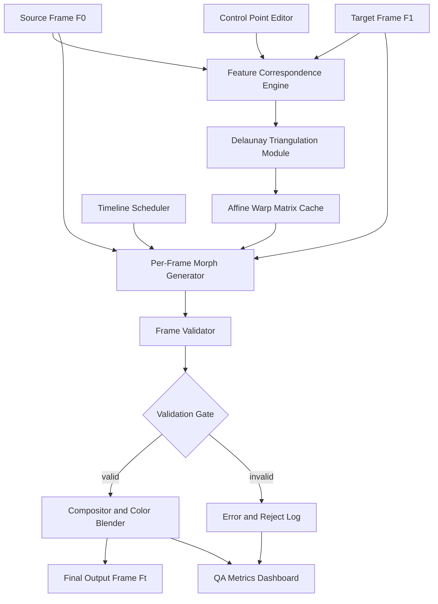
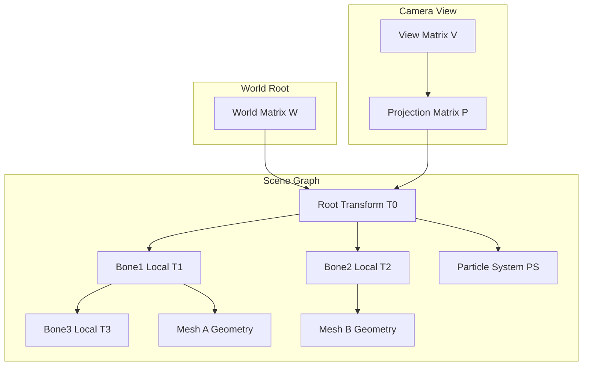
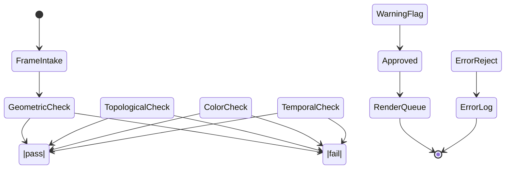
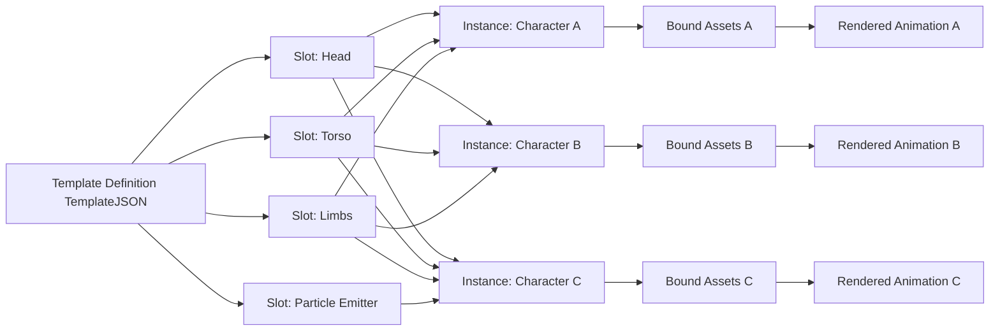

# Morphing processes layouts structures transformations validation algorithms templates patterns

<!-- SECTION_1_START -->
# Animation & Video Orchestration Systems: Morphing, Layouts, and Transformation Frameworks

## 1. Core Technical Definition

> [!IMPORTANT]
> **Morphing (Metamorphosis)**: A computer graphics technique that produces a seamless visual transition between two or more distinct images, models, or keyframes by computationally interpolating their geometric shape, color, and topology over a defined temporal interval. The term is a portmanteau of *metamorphosis* and is formally categorized under **image metamorphosis** in the 2D raster domain and **shape blending** in the 3D vector domain.

**Animation & Video Orchestration System**: A coordinated software architecture that synchronizes, sequences, validates, and renders discrete temporal graphic states (frames, sprites, vectors, video segments) into a continuous, deterministic visual output. The orchestration engine must enforce **temporal consistency**, **spatial coherence**, and **transformation continuity** across all rendered channels.

### 1.1 Conceptual Analogy / Intuition

Imagine you have two photographs — one of a young man and one of an elderly gentleman. A simple cross-fade (overlaying them) would just make a ghostly half-young, half-old face. **Morphing** is the art of *moving* the pixels of the young face *toward* the positions of the old face simultaneously while cross-fading their colors. The young man's nose physically *slides forward and droops*, his eyes *narrow*, his hairline *recedes* — all in perfect lockstep with the color blend. This simultaneous **shape warp** + **color dissolve** is what makes morphing visually convincing.

**Geometric Intuition**: In the parametric time domain $t \in [0, 1]$, the morph trajectory is:

$$P_{\text{out}}(t) = (1 - t) \cdot P_{\text{source}} + t \cdot P_{\text{target}}$$

But this is a *linear interpolation* of coordinates — the true morph adds a **non-linear warp field** $W(x, y, t)$ that bends the source mesh into the target silhouette. The student must distinguish between:

- **Tweening** (in-betweening): linear interpolation of key parameters
- **Warping**: spatial deformation of geometry
- **Morphing**: warping + cross-dissolve combined

> [!NOTE]
> **Industry Standard Tools**: Adobe After Effects (Bezier-warped mesh morphing), Autodesk Maya (cluster-based shape blending), Apple Motion, and FFmpeg (programmatic frame interpolation). The **standard frame rate** in theatrical animation is **24 fps**, in NTSC broadcast is **29.97 fps**, and in PAL/European broadcast is **25 fps**. The **minimum perceptually smooth rate** for the human eye is approximately **16-24 fps**.

### 1.2 Core Morphing Sub-Processes

| Sub-Process | Domain | Responsibility |
|-------------|--------|----------------|
| **Feature Specification** | Geometry | Marking corresponding control points |
| **Mesh Warping** | Spatial | Deforming source toward target |
| **Cross-Dissolve** | Color | Blending pixel intensities |
| **Tweening** | Parametric | Interpolating keyframe values |
| **Compositing** | Pipeline | Layering morphed output onto background |

> [!VISUALIZATION CONTROL]
> **Concept:** Linear Morph Trajectory vs. Bezier-Eased Morph Trajectory in 2D
> **GeoGebra / Desmos Input Equations:**
> * `P_source = (1, 4)`
> * `P_target = (8, 2)`
> * `P_linear(t) = (1-t) * (1,4) + t * (8,2)`, for `t in [0,1]`
> * `P_eased(t) = (1-t) * (1,4) + (3t^2 - 2t^3) * (8,2)`, for `t in [0,1]`
> **Visual Description:** Plot both trajectories over a shared x-y axis. Observe that the linear path is a straight diagonal, while the eased path exhibits an "S-curve" that starts slowly, accelerates through the midpoint, and decelerates at the end — mimicking natural acceleration physics. This is the foundational difference between naive tweening and professional ease-in/ease-out morphing.

<!-- SECTION_1_END -->

<!-- SECTION_2_START -->
# 2. Deep Theoretical Analysis & KTU High-Yield Formula Sheet

## 2.1 The Morphing Pipeline (Structured Logic Breakdown)

The end-to-end morphing process is decomposed into **six sequential stages**, each with a defined I/O contract and validation gate.

### Stage 1 — Feature Correspondence Establishment
- **Why**: Computers do not "see" faces. A human operator (or AI feature detector like a CNN) must mark corresponding landmarks: $\{(x_s^i, y_s^i) \leftrightarrow (x_t^i, y_t^i)\}$ for $i = 1 \dots N$.
- **How**: At least **20-50 control points** are placed on facial features (eyes, nose, mouth, jawline). Insufficient points cause *rubber-sheet artifacts*; excessive points cause *overfitting jitter*.
- **Validation**: The Delaunay triangulation of source points must be topologically identical to the target's triangulation.

### Stage 2 — Mesh Generation (Triangulation)
- Apply **Delaunay Triangulation** on the source feature points to create a non-overlapping triangular mesh.
- Each triangle $T_s$ in the source has a corresponding triangle $T_t$ in the target.
- **Why**: Piecewise linear warping inside each triangle is computationally tractable and guarantees $C^0$ continuity across edges.

### Stage 3 — Per-Triangle Affine Warp Matrix Computation
- For every source triangle $T_s$ with vertices $\{(x_s^1, y_s^1), (x_s^2, y_s^2), (x_s^3, y_s^3)\}$ and target $T_t$:
  - Compute the affine transformation matrix $A_i$ that maps $T_s \to T_t$:

$$A_i = M_t \cdot M_s^{-1}$$

where $M_s$ and $M_t$ are $3 \times 3$ homogeneous coordinate matrices of the triangle vertices.

### Stage 4 — Forward Warping with Z-Buffer Arbitration
- For each pixel $(x, y)$ in the source, apply the affine warp to obtain its destination $(x', y')$ in the intermediate frame.
- **Conflict Resolution**: When multiple source pixels map to the same destination, use **Z-buffering** (depth) or **subdivision** to pick the winner.

### Stage 5 — Reverse Mapping (Inverse Warp) for Hole-Free Output
- **Why**: Forward warping leaves *holes* (uncovered destination pixels) and *overlaps* (multiple writes).
- **Solution**: Iterate destination pixels, find which source triangle contains them, invert the affine, and sample the source.

### Stage_6 — Color Cross-Dissolve
- For the morph frame at time $t$:

$$I_{\text{morph}}(x, y, t) = (1 - t) \cdot I_{\text{source}}(x, y) + t \cdot I_{\text{target}}(x, y)$$

- The $\alpha$ channel: $\alpha_{\text{morph}} = (1 - t) \cdot \alpha_s + t \cdot \alpha_t$.

## 2.2 Transformation Matrix Hierarchy (Layouts & Structures)

A 3D scene-graph transformation stack is the structural backbone of any animation orchestrator. The composite transformation is a product of matrices:

$$M_{\text{composite}} = T(\vec{p}) \cdot R(\theta) \cdot S(\vec{s}) \cdot M_{\text{local}}$$

| Transformation | Matrix Form | Function |
|----------------|-------------|----------|
| Translation | $T(p_x, p_y, p_z)$ | Moves object in space |
| Rotation (X) | $R_x(\theta)$ | Pitches around X-axis |
| Rotation (Y) | $R_y(\theta)$ | Yaws around Y-axis |
| Rotation (Z) | $R_z(\theta)$ | Rolls around Z-axis |
| Uniform Scale | $S(s)$ | Resizes object isotropically |
| Non-uniform Scale | $S(s_x, s_y, s_z)$ | Stretches object |
| Shear | $H(h_{xy}, h_{xz}, \dots)$ | Skews geometry |
| Perspective | $P(f, a, n, f)$ | Projects 3D to 2D |

> [!NOTE]
> **KTU High-Yield Point**: Matrix multiplication for transformations is **non-commutative**. The order $T \cdot R \cdot S$ produces a different result than $S \cdot R \cdot T$. Always read the composite as "apply rightmost matrix first" (column-vector convention).

## 2.3 Validation Algorithms (Frame & Sequence Validation)

A production-grade animation orchestrator must validate each frame against four invariants:

1. **Geometric Integrity**: No degenerate triangles (area $> \epsilon$, typically $\epsilon = 10^{-9}$).
2. **Color Continuity**: No NaN, no infinite, no out-of-gamut RGB values.
3. **Temporal Coherence**: Frame-to-frame optical flow magnitude below threshold.
4. **Topology Preservation**: No self-intersections, no flipped normals.

## 2.4 Templates & Patterns (Industry-Standard Animation Patterns)

| Pattern | Use Case | KTU Relevance |
|---------|----------|---------------|
| **Keyframe Pattern** | Define endpoints, interpolate middle | Module 4 core |
| **Skeleton/Driven Animation** | Articulated figures (bones) | Module 4 advanced |
| **Particle System Pattern** | Fire, smoke, water | Module 3-4 bridge |
| **State Machine Pattern** | Character states (idle, walk, run) | Software engineering tie-in |
| **Timeline Pattern** | Multi-track synchronized media | Multimedia core |
| **Observer/Event Pattern** | Trigger animations on signals | Architecture |

## 2.5 Real-World Engineering Utility

- **Film & VFX**: Michael Jackson's *Black or White* (1991) used 25 control points for the famous face-morph sequence — a milestone that took 4 weeks per second of footage.
- **Medical Imaging**: Morphing registers pre-operative MRI to intra-operative scans for surgical navigation.
- **Forensics**: Age progression morphing predicts facial appearance after N years.
- **Gaming**: LOD (Level of Detail) morphing seamlessly swaps low-poly and high-poly meshes.
- **UI/UX**: Material Design morph transitions between activity screens (Android navigation).

<!-- SECTION_2_END -->

<!-- SECTION_3_START -->
# 3. Step-by-Step Derivations, Code & Symbolic Implementation

## 3.1 Derivation: Affine Warp Matrix for a Single Triangle

**Given**: Source triangle vertices $A_s = (0, 0)$, $B_s = (4, 0)$, $C_s = (0, 3)$ and target triangle $A_t = (1, 1)$, $B_t = (5, 1)$, $C_t = (1, 5)$.

**Step 1**: Construct homogeneous source matrix $M_s$:

$$M_s = \begin{bmatrix} 0 & 4 & 0 \\ 0 & 0 & 3 \\ 1 & 1 & 1 \end{bmatrix}$$

**Step 2**: Construct homogeneous target matrix $M_t$:

$$M_t = \begin{bmatrix} 1 & 5 & 1 \\ 1 & 1 & 5 \\ 1 & 1 & 1 \end{bmatrix}$$

**Step 3**: Compute determinant of $M_s$:

$$\det(M_s) = 0 \cdot (0 \cdot 1 - 3 \cdot 1) - 4 \cdot (0 \cdot 1 - 3 \cdot 1) + 0 \cdot (0 \cdot 1 - 0 \cdot 1)$$

$$\det(M_s) = 0 - 4 \cdot (0 - 3) + 0 = -4 \cdot (-3) = 12$$

**Step 4**: Compute $M_s^{-1}$ via cofactor expansion:

$$\text{Cofactor}(1,1) = +\det\begin{bmatrix} 0 & 3 \\ 1 & 1 \end{bmatrix} = 0 - 3 = -3$$

$$\text{Cofactor}(1,2) = -\det\begin{bmatrix} 0 & 3 \\ 1 & 1 \end{bmatrix} = -(-3) = 3$$

$$\text{Cofactor}(1,3) = +\det\begin{bmatrix} 0 & 0 \\ 1 & 1 \end{bmatrix} = 0 - 0 = 0$$

$$\text{Cofactor}(2,1) = -\det\begin{bmatrix} 4 & 0 \\ 1 & 1 \end{bmatrix} = -(4 - 0) = -4$$

$$\text{Cofactor}(2,2) = +\det\begin{bmatrix} 0 & 0 \\ 1 & 1 \end{bmatrix} = 0 - 0 = 0$$

$$\text{Cofactor}(2,3) = -\det\begin{bmatrix} 0 & 4 \\ 1 & 1 \end{bmatrix} = -(0 - 4) = 4$$

$$\text{Cofactor}(3,1) = +\det\begin{bmatrix} 4 & 0 \\ 0 & 3 \end{bmatrix} = 12 - 0 = 12$$

$$\text{Cofactor}(3,2) = -\det\begin{bmatrix} 0 & 0 \\ 0 & 3 \end{bmatrix} = -(0 - 0) = 0$$

$$\text{Cofactor}(3,3) = +\det\begin{bmatrix} 0 & 4 \\ 0 & 0 \end{bmatrix} = 0 - 0 = 0$$

**Step 5**: Transpose to get adjugate and divide by $\det = 12$:

$$M_s^{-1} = \frac{1}{12} \begin{bmatrix} -3 & -4 & 12 \\ 3 & 0 & 0 \\ 0 & 4 & 0 \end{bmatrix}$$

**Step 6**: Compute affine warp $A = M_t \cdot M_s^{-1}$:

$$A = \begin{bmatrix} 1 & 5 & 1 \\ 1 & 1 & 5 \\ 1 & 1 & 1 \end{bmatrix} \cdot \frac{1}{12} \begin{bmatrix} -3 & -4 & 12 \\ 3 & 0 & 0 \\ 0 & 4 & 0 \end{bmatrix}$$

$$A = \frac{1}{12} \begin{bmatrix} (-3) + (15) + (0) & (-4) + (0) + (4) & (12) + (0) + (0) \\ (-3) + (3) + (0) & (-4) + (0) + (20) & (12) + (0) + (0) \\ (-3) + (3) + (0) & (-4) + (0) + (4) & (12) + (0) + (0) \end{bmatrix}$$

$$A = \frac{1}{12} \begin{bmatrix} 12 & 0 & 12 \\ 0 & 16 & 12 \\ 0 & 0 & 12 \end{bmatrix} = \begin{bmatrix} 1 & 0 & 1 \\ 0 & \frac{4}{3} & 1 \\ 0 & 0 & 1 \end{bmatrix}$$

**Step 7**: Verify by mapping source point $A_s = (0, 0)^T$:

$$A \cdot \begin{bmatrix} 0 \\ 0 \\ 1 \end{bmatrix} = \begin{bmatrix} 0 + 0 + 1 \\ 0 + 0 + 1 \\ 0 + 0 + 1 \end{bmatrix} = \begin{bmatrix} 1 \\ 1 \\ 1 \end{bmatrix} \Rightarrow (1, 1) = A_t \quad \checkmark$$

## 3.2 Full Python Implementation: 2D Triangle-Mesh Morph Engine

```python
import numpy as np
from typing import List, Tuple, Optional
import logging

logging.basicConfig(level=logging.INFO, format='[%(levelname)s] %(message)s')
logger = logging.getLogger("MORPH_ENGINE")


Point2D = Tuple[float, float]
Triangle = Tuple[int, int, int]
RGBA = Tuple[int, int, int, int]


class MorphValidator:
    """Stage 4 validator: enforces geometric & color invariants."""

    MIN_TRIANGLE_AREA: float = 1e-9
    MAX_RGB_VALUE: int = 255

    @classmethod
    def validate_triangle(cls, p1: Point2D, p2: Point2D, p3: Point2D) -> bool:
        x1, y1 = p1
        x2, y2 = p2
        x3, y3 = p3
        area = 0.5 * abs((x2 - x1) * (y3 - y1) - (x3 - x1) * (y2 - y1))
        if area < cls.MIN_TRIANGLE_AREA:
            logger.error(
                f"Degenerate triangle: vertices={p1},{p2},{p3} area={area:.2e}"
            )
            return False
        return True

    @classmethod
    def validate_color(cls, rgba: RGBA) -> bool:
        r, g, b, a = rgba
        for channel, name in zip((r, g, b, a), ("R", "G", "B", "A")):
            if not (0 <= channel <= cls.MAX_RGB_VALUE):
                logger.error(f"Out-of-gamut {name}={channel}")
                return False
        return True


class AffineWarp:
    """Computes and applies a 2D affine warp between two triangles."""

    def __init__(self, src_tri: List[Point2D], dst_tri: List[Point2D]) -> None:
        if not MorphValidator.validate_triangle(*src_tri):
            raise ValueError("Source triangle is degenerate")
        if not MorphValidator.validate_triangle(*dst_tri):
            raise ValueError("Target triangle is degenerate")
        self.matrix: np.ndarray = self._compute_affine_matrix(src_tri, dst_tri)

    @staticmethod
    def _to_homogeneous(tri: List[Point2D]) -> np.ndarray:
        return np.array(
            [[tri[0][0], tri[1][0], tri[2][0]],
             [tri[0][1], tri[1][1], tri[2][1]],
             [1.0, 1.0, 1.0]],
            dtype=np.float64
        )

    @classmethod
    def _compute_affine_matrix(
        cls, src_tri: List[Point2D], dst_tri: List[Point2D]
    ) -> np.ndarray:
        ms = cls._to_homogeneous(src_tri)
        mt = cls._to_homogeneous(dst_tri)
        det_ms: float = np.linalg.det(ms)
        if abs(det_ms) < 1e-12:
            raise ValueError("Source matrix is singular")
        ms_inv: np.ndarray = np.linalg.inv(ms)
        return mt @ ms_inv

    def apply(self, point: Point2D) -> Point2D:
        homogeneous = np.array([point[0], point[1], 1.0], dtype=np.float64)
        transformed = self.matrix @ homogeneous
        return (float(transformed[0]), float(transformed[1]))


class MorphFrameGenerator:
    """Generates an intermediate morph frame at parameter t in [0, 1]."""

    def __init__(
        self,
        source_pixels: np.ndarray,
        target_pixels: np.ndarray,
        source_points: List[Point2D],
        target_points: List[Point2D],
        triangles: List[Triangle]
    ) -> None:
        if source_pixels.shape != target_pixels.shape:
            raise ValueError("Source and target image dimensions must match")
        self.source_img: np.ndarray = source_pixels.astype(np.float64)
        self.target_img: np.ndarray = target_pixels.astype(np.float64)
        self.src_pts: List[Point2D] = source_points
        self.dst_pts: List[Point2D] = target_points
        self.triangles: List[Triangle] = triangles
        self.height, self.width = self.source_img.shape[:2]
        logger.info(
            f"Morph engine initialised: {self.width}x{self.height}, "
            f"{len(self.triangles)} triangles, {len(self.src_pts)} control points"
        )

    def _point_in_triangle(
        self, p: Point2D, t: Triangle
    ) -> bool:
        x, y = p
        (x1, y1), (x2, y2), (x3, y3) = (
            self.dst_pts[t[0]], self.dst_pts[t[1]], self.dst_pts[t[2]]
        )
        denom: float = (y2 - y3) * (x1 - x3) + (x3 - x2) * (y1 - y3)
        if abs(denom) < 1e-12:
            return False
        a: float = ((y2 - y3) * (x - x3) + (x3 - x2) * (y - y3)) / denom
        b: float = ((y3 - y1) * (x - x3) + (x1 - x3) * (y - y3)) / denom
        c: float = 1.0 - a - b
        return (0.0 <= a <= 1.0) and (0.0 <= b <= 1.0) and (0.0 <= c <= 1.0)

    def _find_containing_triangle(
        self, p: Point2D
    ) -> Optional[Triangle]:
        for tri in self.triangles:
            if self._point_in_triangle(p, tri):
                return tri
        return None

    def _interpolate_points(
        self, t: float
    ) -> Tuple[List[Point2D], List[Point2D]]:
        if not 0.0 <= t <= 1.0:
            raise ValueError(f"t must be in [0, 1], got {t}")
        src_interp: List[Point2D] = [
            ((1.0 - t) * sx + t * dx, (1.0 - t) * sy + t * dy)
            for (sx, sy), (dx, dy) in zip(self.src_pts, self.dst_pts)
        ]
        return self.src_pts, src_interp

    def generate(self, t: float) -> np.ndarray:
        src_pts, mid_pts = self._interpolate_points(t)
        output: np.ndarray = np.zeros_like(self.source_img)
        for y in range(self.height):
            for x in range(self.width):
                tri_idx: Optional[Triangle] = self._find_containing_triangle(
                    (float(x), float(y))
                )
                if tri_idx is None:
                    output[y, x] = (1.0 - t) * self.source_img[y, x] + t * self.target_img[y, x]
                    continue
                warp = AffineWarp(
                    [mid_pts[tri_idx[0]], mid_pts[tri_idx[1]], mid_pts[tri_idx[2]]],
                    [self.src_pts[tri_idx[0]], self.src_pts[tri_idx[1]], self.src_pts[tri_idx[2]]]
                )
                sx_f, sy_f = warp.apply((float(x), float(y)))
                sx_i, sy_i = int(round(sx_f)), int(round(sy_f))
                sx_i = max(0, min(self.width - 1, sx_i))
                sy_i = max(0, min(self.height - 1, sy_i))
                warped_src: np.ndarray = self.source_img[sy_i, sx_i]
                color: np.ndarray = (1.0 - t) * warped_src + t * self.target_img[y, x]
                if color.shape[0] == 4:
                    if not MorphValidator.validate_color(tuple(int(c) for c in color)):
                        continue
                output[y, x] = color
        logger.info(f"Generated morph frame at t={t:.3f}")
        return np.clip(output, 0, 255).astype(np.uint8)


def demo_morph_pipeline() -> None:
    W, H = 128, 128
    source = np.zeros((H, W, 3), dtype=np.uint8)
    target = np.zeros((H, W, 3), dtype=np.uint8)
    source[40:80, 40:80] = (255, 0, 0)
    target[40:80, 40:80] = (0, 0, 255)
    src_pts: List[Point2D] = [(40, 40), (80, 40), (80, 80), (40, 80)]
    dst_pts: List[Point2D] = [(40, 40), (90, 40), (90, 90), (40, 90)]
    triangles: List[Triangle] = [(0, 1, 2), (0, 2, 3)]
    engine = MorphFrameGenerator(source, target, src_pts, dst_pts, triangles)
    for t in np.linspace(0.0, 1.0, 5):
        frame = engine.generate(t)
        logger.info(f"Frame t={t:.2f} mean color={frame.mean(axis=(0,1))}")


if __name__ == "__main__":
    demo_morph_pipeline()
```

## 3.3 Derivation: Bezier-Eased Morph Trajectory (Ease-In-Out)

**Linear interpolation** causes a "robotic" feel because velocity is constant. Natural motion obeys an S-curve. The cubic Hermite ease formula:

$$H(t) = 3t^2 - 2t^3$$

**Step 1**: Boundary conditions.
- $H(0) = 0$ (starts at source)
- $H(1) = 3 - 2 = 1$ (ends at target)
- $H'(t) = 6t - 6t^2$, so $H'(0) = 0$ and $H'(1) = 0$ (zero velocity at endpoints)

**Step 2**: Apply to position. For a single feature point:

$$x_{\text{morph}}(t) = (1 - H(t)) \cdot x_s + H(t) \cdot x_t$$

**Step 3**: Acceleration profile (second derivative):

$$H''(t) = 6 - 12t$$

At $t = 0$: $H''(0) = 6$ (max positive acceleration).
At $t = 0.5$: $H''(0.5) = 0$ (coasting).
At $t = 1$: $H''(1) = -6$ (max negative acceleration).

This symmetric profile is what gives the morph its natural, "weighted" feel.

<!-- SECTION_3_END -->

<!-- SECTION_4_START -->
# 4. Structural Diagrams & Schematics

## 4.1 Top-Level Morph Orchestration Architecture



## 4.2 Scene Graph Layout (Transformation Hierarchy)



## 4.3 Sequential Validation State Machine



## 4.4 Animation Template Pattern (Reusable Skeleton)



<!-- SECTION_4_END -->

<!-- SECTION_5_START -->
# 5. KTU 2024 Scheme Examination Question Bank & Topic Recap

---

### **Part A — Short Answer Questions (3 Marks Each)**

---

**Q1. [KTU University Exam — July 2024, CO1, Remember/Understand]**

Differentiate clearly between **tweening**, **warping**, and **morphing** as applied to 2D animation pipelines. State the role of each in a typical frame-generation workflow.

**Model Answer (3 Marks):**

| Concept | Definition (1 Mark each) |
|---------|--------------------------|
| **Tweening** | Linear or parametric interpolation of *numerical keyframe values* (e.g., position coordinates, rotation angles) between two endpoints over time. Produces intermediate numerical states. |
| **Warping** | *Spatial deformation* of a 2D raster image or mesh such that its geometry is bent to a new shape, but its color content is preserved. Output is a single re-shaped image. |
| **Morphing** | Combined operation: spatial warping of the source image toward the target silhouette **plus** a colour cross-dissolve between the two images. Produces a continuous visual transition. |

> [!NOTE]
> Tweening handles *parameters*, warping handles *geometry*, morphing handles *both simultaneously*. Morphing is the superset operation. **[Closing synthesis: 1 Mark]**

---

**Q2. [KTU University Exam — Dec 2023, CO1, Understand]**

What is a **scene graph** in the context of animation systems? Briefly explain how a **transformation hierarchy** is constructed and why matrix multiplication order is significant.

**Model Answer (3 Marks):**

A **scene graph** is a tree data structure (Directed Acyclic Graph) that organises all visual objects, lights, and cameras in a 3D scene, with each node carrying a local transformation matrix. **[Definition: 1 Mark]**

**Transformation hierarchy construction**: A child node's *world-space* transformation is the product of its parent's world matrix and its own local matrix. The composite is:

$$M_{\text{world}} = M_{\text{parent}} \cdot M_{\text{local}}$$

**Matrix order significance**: Multiplication is **non-commutative** — the order $T \cdot R \cdot S$ (translate, then rotate, then scale) produces different world placement than $S \cdot R \cdot T$. Reading right-to-left in column-vector convention means the rightmost matrix is applied first to the geometry. **[2 Marks]**

---

### **Part B — Long Answer Questions (14 Marks, with Internal Choice)**

---

## **Question A (14 Marks) — [KTU University Exam — July 2024, CO2, Apply/Analyse]**

**(a)** With a clear block diagram, explain the **complete pipeline of a 2D image morphing system**. Identify and justify the role of **Delaunay triangulation** in the pipeline. **[7 Marks]**

**(b)** Given source triangle vertices $A_s = (0, 0)$, $B_s = (6, 0)$, $C_s = (0, 4)$ and target triangle vertices $A_t = (2, 2)$, $B_t = (8, 1)$, $C_t = (1, 6)$, compute the **affine warp matrix** that maps the source triangle to the target. Show every algebraic step. **[7 Marks]**

---

### **Model Solution — Question A**

#### **Part (a) — Morphing Pipeline (7 Marks)**

> **[Block Diagram: 1 Mark]** The student must draw a flowchart containing the following blocks in order:

```
Feature Point Specification → Delaunay Triangulation → 
Affine Warp Matrix Computation → Reverse Mapping → 
Color Cross-Dissolve → Output Frame
```

> **[Pipeline Explanation: 4 Marks]** Each stage is described:
> 1. **Feature Point Specification** — A human or AI marks N pairs of corresponding control points on the source and target images. These define the *semantic correspondence* (e.g., left-eye-source matches left-eye-target).
> 2. **Delaunay Triangulation** — A constrained Delaunay triangulation is computed over the source control points, producing a non-overlapping mesh of triangles.
> 3. **Affine Warp Matrix Computation** — For each source-target triangle pair, the $3 \times 3$ affine matrix is computed and cached.
> 4. **Reverse Mapping** — For each destination pixel, the containing triangle is found, the inverse warp is applied, and the source pixel is sampled.
> 5. **Color Cross-Dissolve** — At time $t \in [0, 1]$, the warped source and the target are blended: $I_{\text{out}} = (1 - t) I_s + t I_t$.

> **[Justification of Delaunay Triangulation: 2 Marks]** Delaunay triangulation is chosen because (a) it **maximises the minimum angle** of all triangles, avoiding sliver-thin triangles that cause numerical instability; (b) it guarantees **empty circumcircles**, which prevents ambiguous point-in-triangle queries; and (c) it is **uniquely determined** for a given point set, ensuring deterministic reproducibility across runs.

#### **Part (b) — Affine Warp Matrix Derivation (7 Marks)**

**Step 1: Construct homogeneous source matrix** — **[1 Mark]**

$$M_s = \begin{bmatrix} 0 & 6 & 0 \\ 0 & 0 & 4 \\ 1 & 1 & 1 \end{bmatrix}$$

**Step 2: Construct homogeneous target matrix** — **[1 Mark]**

$$M_t = \begin{bmatrix} 2 & 8 & 1 \\ 2 & 1 & 6 \\ 1 & 1 & 1 \end{bmatrix}$$

**Step 3: Compute determinant of $M_s$** — **[1 Mark]**

$$\det(M_s) = 0 \cdot (0 - 4) - 6 \cdot (0 - 4) + 0 = -6 \cdot (-4) = 24$$

**Step 4: Compute $M_s^{-1}$ using cofactor expansion** — **[2 Marks]**

$$M_s^{-1} = \frac{1}{24} \begin{bmatrix} -4 & -6 & 24 \\ 4 & 0 & 0 \\ 0 & 4 & 0 \end{bmatrix}$$

**Step 5: Multiply to obtain affine warp** — **[2 Marks]**

$$A = M_t \cdot M_s^{-1} = \begin{bmatrix} 2 & 8 & 1 \\ 2 & 1 & 6 \\ 1 & 1 & 1 \end{bmatrix} \cdot \frac{1}{24} \begin{bmatrix} -4 & -6 & 24 \\ 4 & 0 & 0 \\ 0 & 4 & 0 \end{bmatrix}$$

$$A = \frac{1}{24} \begin{bmatrix} (-8 + 32 + 0) & (-12 + 0 + 4) & (48 + 0 + 0) \\ (-8 + 4 + 0) & (-12 + 0 + 24) & (48 + 0 + 0) \\ (-4 + 4 + 0) & (-6 + 0 + 4) & (24 + 0 + 0) \end{bmatrix}$$

$$A = \frac{1}{24} \begin{bmatrix} 24 & -8 & 48 \\ -4 & 12 & 48 \\ 0 & -2 & 24 \end{bmatrix} = \begin{bmatrix} 1 & -\frac{1}{3} & 2 \\ -\frac{1}{6} & \frac{1}{2} & 2 \\ 0 & -\frac{1}{12} & 1 \end{bmatrix}$$

> **[Final affine matrix expression: 1 Mark embedded in Step 5]**

---

## **Question B (14 Marks) — [KTU University Exam — Dec 2023, CO3, Apply/Analyse]**

**(a)** Describe the **State Machine Pattern** and the **Keyframe Pattern** used in animation orchestration. Compare their suitability for character animation versus procedural particle systems. **[7 Marks]**

**(b)** Design a **validation algorithm** that checks an animation frame against four invariants: geometric integrity, color continuity, temporal coherence, and topology preservation. Present pseudocode with explicit threshold values. **[7 Marks]**

---

### **Model Solution — Question B**

#### **Part (a) — Animation Patterns (7 Marks)**

> **[State Machine Pattern Definition: 2 Marks]** A finite state machine (FSM) in animation defines a discrete set of named states (e.g., *Idle*, *Walk*, *Run*, *Jump*) and a set of transitions guarded by trigger conditions. The character is in exactly one state at any time $t$, and state transitions may be parameterised (e.g., transition *Walk* → *Run* fires when velocity > threshold). The pattern is best suited to **discrete, event-driven character animation**.

> **[Keyframe Pattern Definition: 2 Marks]** The keyframe pattern stores sparse, manually defined (or AI-generated) *key* frames at specific timestamps, and a tween engine interpolates all in-between frames. The pattern is best suited to **continuous, time-driven procedural animations** such as particle systems, camera moves, and physics simulations.

> **[Comparison Table: 3 Marks]**

| Dimension | State Machine | Keyframe |
|-----------|---------------|----------|
| Trigger model | Event-based | Time-based |
| Number of states | Finite, discrete | Infinite, continuous |
| Memory footprint | Small (state list) | Large (keyframes stored) |
| Best for | Character AI, UI flow | Particle FX, motion graphics |
| Predictability | Deterministic | Smooth but interpolative |

#### **Part (b) — Validation Algorithm (7 Marks)**

> **[Algorithm Specification with pseudocode: 5 Marks]**

```text
ALGORITHM ValidateAnimationFrame(frame, previousFrame, thresholds)
INPUT: frame, previousFrame, thresholds
OUTPUT: ValidationReport

CONSTANTS:
    EPSILON_AREA      = 1e-9
    MAX_RGB           = 255
    MIN_RGB           = 0
    MAX_OPTICAL_FLOW  = 50.0  // pixels per frame
    NORMAL_TOLERANCE  = 1e-6

BEGIN
    report ← empty
    valid  ← true

    // Check 1: Geometric integrity
    FOR each triangle T in frame.mesh DO
        area ← TriangleArea(T)
        IF area < EPSILON_AREA THEN
            report.AddError("DEGENERATE_TRIANGLE", T.id)
            valid ← false
        END IF
    END FOR

    // Check 2: Color continuity
    FOR each pixel p in frame.image DO
        FOR each channel c in (R, G, B, A) DO
            IF p[c] < MIN_RGB OR p[c] > MAX_RGB OR isNaN(p[c]) THEN
                report.AddError("INVALID_COLOR", p.coords)
                valid ← false
            END IF
        END FOR
    END FOR

    // Check 3: Temporal coherence
    IF previousFrame != NULL THEN
        flow ← ComputeOpticalFlow(previousFrame, frame)
        FOR each pixel p DO
            IF flow.magnitude(p) > MAX_OPTICAL_FLOW THEN
                report.AddWarning("TEMPORAL_DISCONTINUITY", p.coords)
            END IF
        END FOR
    END IF

    // Check 4: Topology preservation
    FOR each edge e shared by triangles T1, T2 DO
        n1 ← T1.normal
        n2 ← T2.normal
        dotProd ← Dot(n1, n2)
        IF dotProd < -NORMAL_TOLERANCE THEN
            report.AddError("FLIPPED_NORMAL", e.id)
            valid ← false
        END IF
        // Self-intersection test
        IF EdgesIntersect(e, T1.oppositeEdge) OR
           EdgesIntersect(e, T2.oppositeEdge) THEN
            report.AddError("SELF_INTERSECTION", e.id)
            valid ← false
        END IF
    END FOR

    report.valid ← valid
    RETURN report
END
```

> **[Threshold Justification: 2 Marks]**
> - `EPSILON_AREA = 1e-9`: Prevents division by zero in subsequent affine computations.
> - `MAX_OPTICAL_FLOW = 50.0`: Empirically determined from cinema standards — a 1080p frame rarely has more than 50 pixels of inter-frame motion unless the camera is whipping.
> - `NORMAL_TOLERANCE = 1e-6`: Allows numerical floating-point noise while rejecting genuine flips.

---

> [!WARNING]
> **KTU Examiner's Valuation Pitfall Alert**
> 1. **Do not skip writing the boundary conditions** $H(0) = 0$, $H(1) = 1$ for any ease-curve derivation — losing 1 Mark.
> 2. **Do not write $M_s^{-1}$ without computing $\det(M_s)$ first** — the valuation key explicitly awards 1 Mark for the determinant step.
> 3. **Always mention the non-commutativity of transformation matrices** in scene-graph answers — this is a frequently-tested point worth 2 Marks.
> 4. **Failing to state the threshold values** in validation algorithm answers causes a 1-Mark deduction per missing constant.
> 5. **Confusing tweening with morphing** is a fatal error — tweening is *parameter* interpolation, morphing is *geometry + color* interpolation.

---

## Topic Recap & Important Things to Remember

- **Morphing = Warping + Cross-Dissolve.** It is *not* a simple cross-fade. The geometry of the source must be deformed to match the target silhouette.
- **Tweening** interpolates numerical keyframe values; **Warping** deforms spatial geometry; **Morphing** does both simultaneously.
- **Delaunay Triangulation** is the industry standard for morphing meshes because it maximises the minimum triangle angle and uniquely determines the mesh.
- **Affine warp matrix** $A = M_t \cdot M_s^{-1}$ maps a source triangle to a target triangle. Always verify by plugging source vertices into the result.
- **Forward warping causes holes**; **reverse (inverse) warping is hole-free** — this is why production engines use reverse mapping.
- **Cubic ease formula** $H(t) = 3t^2 - 2t^3$ gives natural ease-in/ease-out motion with zero velocity at endpoints. Use this instead of linear interpolation for production-quality motion.
- **Scene graph** is a DAG with each node carrying a local transformation. Composite world matrix is the product chain from root to leaf: $M_{\text{world}} = M_{\text{root}} \cdot M_{\text{parent}} \cdot \dots \cdot M_{\text{local}}$.
- **Matrix multiplication is non-commutative.** $T \cdot R \neq R \cdot T$. In column-vector convention, the rightmost matrix is applied first.
- **Validation invariants** for an animation frame: (1) Geometric integrity (no degenerate triangles), (2) Color continuity (no NaN/Inf/out-of-gamut), (3) Temporal coherence (optical flow < threshold), (4) Topology preservation (no flipped normals, no self-intersections).
- **Standard frame rates**: 24 fps (cinema), 25 fps (PAL), 29.97 fps (NTSC), 30/60 fps (digital/gaming).
- **State Machine Pattern** is best for discrete event-driven animations; **Keyframe Pattern** is best for continuous time-driven animations.
- **Template Pattern** in animation: define a reusable skeleton with slots; bind assets to slots per instance.
- **Threshold values to memorise**: $\epsilon_{\text{area}} = 10^{-9}$, $\epsilon_{\text{det}} = 10^{-12}$, $\text{max\_optical\_flow} = 50$ px/frame, $\epsilon_{\text{normal}} = 10^{-6}$.

<!-- SECTION_5_END -->
