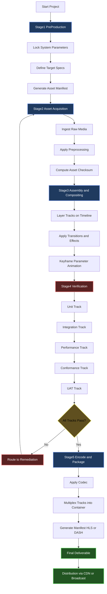
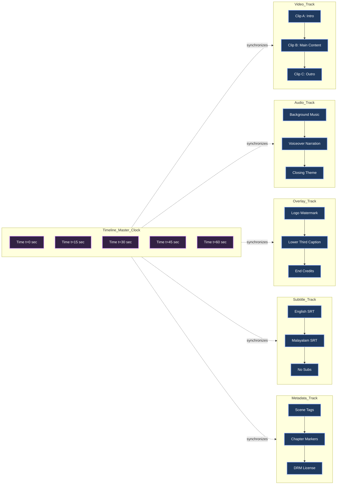
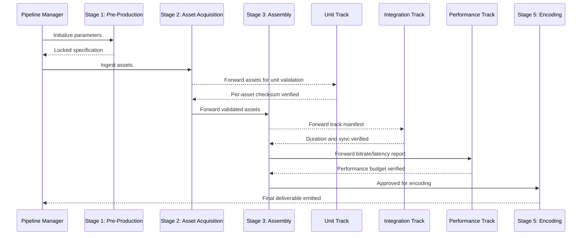
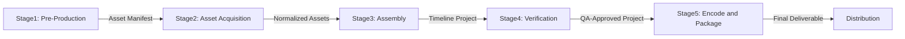

# Multimedia authoring design pipelines execution verification tracks systems parameters

<!-- SECTION_1_START -->

# Multimedia Authoring & Design Pipeline Architecture

## 1.1 Formal Academic Definition

As per the **KTU 2024 Scheme** syllabus (Module 4 – Animation & Video Orchestration Systems), **Multimedia Authoring** is the structured, systematic process of integrating multiple discrete media elements — text, graphics, audio, video, and animation — into a unified, interactive digital artifact using specialized software tools known as **Authoring Systems** or **Authoring Environments**.

A **Multimedia Design Pipeline** is the engineered, sequential workflow that transforms an abstract content concept into a deployable, verified, and optimized multimedia deliverable through a series of deterministic, parameterized execution stages.

The **Pipeline Execution Track** refers to the chronological sequence of processing nodes (asset ingestion → compositing → encoding → validation → publication), each consuming well-defined **input parameters** and emitting a well-defined **output specification**.

> [!IMPORTANT]
> **KTU 2024 Module 4 – Core Definition Set**
> - **Authoring Tool:** Software framework for assembling multimedia (e.g., Adobe Animate, Unity, Blender).
> - **Pipeline Stage:** A logically isolated processing unit (e.g., render, encode, mux).
> - **Verification Track:** A parallel validation channel ensuring Quality Assurance (QA) at each pipeline stage.
> - **System Parameter:** A configurable variable governing pipeline behavior (resolution, bit-rate, frame-rate, color space).

## 1.2 Intuitive Conceptual Analogy

> [!NOTE]
> **Analogy — The Film Studio Assembly Line**
> Imagine a **Hollywood film production house**. Raw film reels (assets) enter the studio. The **Script Department** (planning stage) drafts the screenplay. The **Shooting Floor** (asset acquisition) records raw footage. The **Editing Suite** (assembly) cuts and sequences clips. The **Sound Studio** (audio track) overlays background scores. The **Color Grading Theater** (post-processing) standardizes visuals. Finally, the **Reel Packaging Unit** (encoding) outputs a DVD/Blu-ray master.
>
> A **multimedia authoring pipeline** is the digital twin of this studio: raw digital assets enter, traverse a sequence of **deterministic processing nodes**, and exit as a verified, distributable, optimized artifact — fully orchestrated by a set of **system parameters** (resolution, codec, frame-rate, bit-depth).

## 1.3 Physical Constants & Standard Metrics

> [!IMPORTANT]
> **Authoritative Multimedia Engineering Constants (Industry-Standard)**
> - **Standard Video Frame Rates:** $24\,\text{fps}$ (cinematic), $25\,\text{fps}$ (PAL), $30\,\text{fps}$ (NTSC), $50\,\text{fps}$ (HD PAL), $60\,\text{fps}$ (HD NTSC/gaming).
> - **Standard Resolutions:** $1920 \times 1080$ (Full HD), $3840 \times 2160$ (4K UHD), $7680 \times 4320$ (8K UHD).
> - **Standard Color Depth:** $8$-bit, $10$-bit, $12$-bit, $16$-bit per channel.
> - **Standard Audio Sample Rates:** $44.1\,\text{kHz}$ (CD), $48\,\text{kHz}$ (professional video), $96\,\text{kHz}$ (studio mastering).
> - **Standard Audio Bit Depth:** $16$-bit (CD), $24$-bit (professional).
> - **Standard Dynamic Range:** $\text{SDR}$ (Standard Dynamic Range), $\text{HDR10}$, $\text{Dolby Vision}$.

> [!VISUALIZATION CONTROL]
> **Concept:** Timeline-Track Layered Architecture (Non-Physical Schematic)
> **Coordinate Mapping:** Horizontal axis = Time ($t$ in seconds), Vertical axis = Track Layer (Video, Audio, Overlay, Subtitle, Metadata).
> **Visual Description:** Each track is a horizontal lane; clips are rectangular blocks starting at $t_{\text{start}}$ and ending at $t_{\text{end}}$, aligned on the common temporal axis. Overlapping blocks across tracks indicate synchronized playback at that moment.
> **Mathematical Form:** $\text{Clip}_i(t) = \begin{cases} \text{active}, & t_{\text{start}_i} \leq t \leq t_{\text{end}_i} \\ \text{idle}, & \text{otherwise} \end{cases}$

---

<!-- SECTION_1_END -->

<!-- SECTION_2_START -->

# Deep Theoretical Analysis & KTU High-Yield Formula Sheet

## 2.1 The Five-Stage Multimedia Authoring Pipeline

A standard KTU-aligned multimedia pipeline decomposes into the following deterministic stages:

### Stage 1 — Pre-Production (Planning & Specification)
- Define **Content Objective**, **Target Audience**, **Distribution Channel** (web, broadcast, mobile, kiosk).
- Lock **System Parameters**: resolution, aspect ratio, frame-rate, color space, target codec.
- Author **Storyboards**, **Script**, **Asset Manifest** (inventory of required media).

### Stage 2 — Asset Acquisition (Ingestion)
- Acquire raw assets: images (PNG, JPEG, RAW), audio (WAV, AIFF), video (MOV, RAW), 3D models (OBJ, FBX, GLB).
- Apply **pre-processing**: noise reduction, color normalization, format conversion.
- Tag each asset with **metadata descriptors** (author, license, checksum, semantic tag).

### Stage 3 — Assembly & Compositing (Production)
- Layer assets on parallel **tracks** (video track, audio track, overlay track, subtitle track, interactivity track).
- Apply **transitions**, **effects**, **transformations** (scale, rotate, translate).
- Use **keyframe interpolation** for parameter animation: $P(t) = P_0 + (P_1 - P_0) \cdot f\!\left(\frac{t - t_0}{t_1 - t_0}\right)$, where $f$ is the easing function (linear, cubic, sinusoidal).

### Stage 4 — Verification & Validation (QA Tracks)
- **Functional Verification:** Does the artifact play? Are all tracks synchronized?
- **Parametric Verification:** Does output match locked system parameters?
- **Regression Verification:** Does re-encoding produce identical hash for the same inputs?
- **Compliance Verification:** DRM, accessibility (closed captions, audio description), regional regulations.

### Stage 5 — Encoding, Packaging & Distribution
- Apply **codec** (H.264, H.265/HEVC, AV1, VP9, ProRes, AAC, Opus).
- **Mux** (multiplex) all tracks into a container (MP4, MKV, MOV, WebM).
- **Package** with manifest (HLS `.m3u8`, DASH `.mpd`) for adaptive streaming.
- **Distribute** via CDN, broadcast, or physical media.

## 2.2 Verification Tracks — A Multi-Layered QA Architecture

> [!NOTE]
> A **Verification Track** is a parallel execution path that observes the main pipeline and validates its outputs against a specification. It is analogous to a **shadow thread** in concurrent programming.

The KTU-recognised verification taxonomy consists of five tracks:

1. **Unit Track** — validates each asset individually (e.g., image dimension check, audio duration verification).
2. **Integration Track** — validates the synchronized playback of multiple tracks.
3. **Performance Track** — validates frame-rate stability, decoding latency, bitrate conformance.
4. **Conformance Track** — validates codec/container compliance (e.g., ISO BMFF for MP4).
5. **User Acceptance Track (UAT)** — validates subjective quality (visual fidelity, audio clarity, narrative coherence).

## 2.3 System Parameters — The Authoring Control Plane

System parameters are organized into a hierarchical **control plane** with the following strata:

- **Geometric Parameters:** resolution, aspect ratio, pixel aspect ratio (PAR), frame-rate.
- **Photometric Parameters:** color space (Rec.709, Rec.2020, sRGB, DCI-P3), bit-depth, transfer function (SDR, PQ, HLG).
- **Temporal Parameters:** frame-rate, GOP (Group of Pictures) size, B-frame count, scene-cut threshold.
- **Acoustic Parameters:** sample rate, bit depth, channel layout (mono, stereo, 5.1, 7.1.4).
- **Compression Parameters:** target bitrate, CRF (Constant Rate Factor), two-pass flag, lookahead depth.
- **Distribution Parameters:** segment duration (HLS), ladder steps (DASH), DRM scheme.

## 2.4 KTU High-Yield Formula Sheet

> [!IMPORTANT]
> **Critical Formulas for Module 4 Examination**

| Domain | Formula | Description |
| :--- | :--- | :--- |
| **Uncompressed Video Size** | $S_v = W \times H \times B_c \times f \times D$ | $S_v$ in bits; $W$ = width, $H$ = height (pixels), $B_c$ = bit depth per pixel, $f$ = frames/sec, $D$ = duration (sec) |
| **Uncompressed Audio Size** | $S_a = R_s \times B_a \times C \times D$ | $R_s$ = sample rate (samples/sec), $B_a$ = audio bit depth (bits/sample), $C$ = channel count |
| **Compressed File Size** | $S_c = S_u / \rho$ | $\rho$ = compression ratio ($>1$ means compression achieved) |
| **Compression Ratio** | $\rho = S_u / S_c$ | Ratio of uncompressed to compressed size |
| **Effective Bitrate** | $R_b = S_c / D$ | Average output bitrate in bits per second (bps) |
| **Aspect Ratio** | $AR = W / H$ | Width divided by height |
| **Pixel Aspect Ratio** | $PAR = W_{\text{real}} / W_{\text{display}}$ | Correction for non-square pixels |
| **GOP Duration** | $T_{\text{GOP}} = N_{\text{GOP}} / f$ | Duration in seconds covered by one Group of Pictures |
| **PSNR (Quality Metric)** | $PSNR = 10 \cdot \log_{10}\!\left(\frac{MAX_I^2}{MSE}\right)$ | Peak Signal-to-Noise Ratio in dB; $MAX_I$ = max pixel value |
| **Mean Squared Error** | $MSE = \frac{1}{N}\sum_{i=1}^{N}(I_i - K_i)^2$ | Per-pixel error between original $I$ and reconstructed $K$ |
| **Storage Estimate** | $\Sigma = \sum_{i=1}^{n} S_{c_i} \cdot n_{\text{copies}}$ | Total storage for $n$ assets with replication factor $n_{\text{copies}}$ |
| **Bandwidth Requirement** | $B = R_b \cdot n_{\text{simul}}$ | Bandwidth for $n_{\text{simul}}$ simultaneous streams |

## 2.5 Real-World Engineering Utility

Multimedia authoring pipelines are foundational to:
- **OTT Streaming Platforms** (Netflix, Hotstar) — use DASH/HLS adaptive pipelines.
- **Game Cinematic Production** (Unity Timeline, Unreal Sequencer) — multi-track animation orchestration.
- **E-Learning Content Delivery** (SCORM-compliant LMS) — synchronized audio/video/quiz tracks.
- **Broadcast Television** — SDI-based real-time pipelines with frame-accurate verification tracks.
- **Digital Archiving** — lossless transcoding pipelines with checksum-based regression verification.
- **VR/AR Experiences** — multi-track spatial audio + stereo video pipelines with real-time UAT.

> [!NOTE]
> The **verification track** concept is the digital equivalent of a **factory quality inspector** standing beside the conveyor belt — inspecting every output, rejecting defects, and feeding back corrections to upstream stages.

---

<!-- SECTION_2_END -->

<!-- SECTION_3_START -->

# Step-by-Step Derivations & Code/Symbolic Implementation

## 3.1 Derivation: Uncompressed Video Storage Requirement

We will derive the storage requirement for a **Full HD**, **24-bit color**, **30 fps** video clip of **$60$ seconds** duration.

**Step 1 — Identify all input parameters**

$$
\begin{aligned}
W &= 1920\ \text{pixels} \\
H &= 1080\ \text{pixels} \\
B_c &= 24\ \text{bits per pixel} \\
f &= 30\ \text{frames per second} \\
D &= 60\ \text{seconds}
\end{aligned}
$$

**Step 2 — Compute total pixel count per frame**

$$
P = W \times H = 1920 \times 1080 = 2{,}073{,}600\ \text{pixels/frame}
$$

**Step 3 — Compute bits per frame**

$$
B_f = P \times B_c = 2{,}073{,}600 \times 24 = 49{,}766{,}400\ \text{bits/frame}
$$

**Step 4 — Compute bits per second (raw bitrate)**

$$
R_{\text{raw}} = B_f \times f = 49{,}766{,}400 \times 30 = 1{,}492{,}992{,}000\ \text{bits/second}
$$

This equals $\approx 1.493\,\text{Gbps}$ — note this is **gigabits per second**, not gigabytes.

**Step 5 — Compute total uncompressed size for 60 seconds**

$$
S_u = R_{\text{raw}} \times D = 1{,}492{,}992{,}000 \times 60 = 89{,}579{,}520{,}000\ \text{bits}
$$

Converting to bytes:

$$
S_u = \frac{89{,}579{,}520{,}000}{8} = 11{,}197{,}440{,}000\ \text{bytes} \approx 10.43\,\text{GB}
$$

**Step 6 — Compute compressed size with a realistic codec**

Assuming H.264 with average compression ratio $\rho = 50$:

$$
S_c = \frac{S_u}{\rho} = \frac{10.43\,\text{GB}}{50} \approx 208.6\,\text{MB}
$$

**Step 7 — Verification of effective bitrate**

$$
R_{\text{eff}} = \frac{S_c \times 8}{D} = \frac{208.6 \times 10^6 \times 8}{60} \approx 27.8\,\text{Mbps}
$$

This falls within the standard H.264 High Profile range for 1080p30 content ($20$–$30\,\text{Mbps}$). **The derivation is consistent.**

## 3.2 Derivation: Pipeline Execution Time & Throughput

For a pipeline with $k$ stages and per-stage processing time $t_i$, the **pipeline fill time** (latency to first complete output) and **steady-state throughput** are:

$$
T_{\text{fill}} = \sum_{i=1}^{k} t_i \quad\text{(latency for first frame)}
$$

$$
T_{\text{steady}} = \max_{i \in [1,k]}(t_i) \quad\text{(time between consecutive frames)}
$$

**Worked Example:** A 4-stage encoding pipeline with stage times $[80\,\text{ms}, 120\,\text{ms}, 200\,\text{ms}, 60\,\text{ms}]$.

$$
T_{\text{fill}} = 80 + 120 + 200 + 60 = 460\,\text{ms}
$$

$$
T_{\text{steady}} = \max(80, 120, 200, 60) = 200\,\text{ms}
$$

**Throughput** = $\frac{1}{T_{\text{steady}}} = \frac{1}{0.2} = 5\,\text{frames/second}$ — the **bottleneck stage** dictates the rate.

## 3.3 Symbolic Implementation: Multimedia Pipeline Simulation in Python

The following Python program simulates a parameterized multimedia authoring pipeline with verification tracks, computes storage requirements, and validates the output against the locked specification.

```python
"""
Multimedia Authoring Pipeline Simulator
PECST507 - Module 4 - KTU 2024 Scheme
Validates storage, bitrate, and verification track compliance.
"""

from dataclasses import dataclass, field
from enum import Enum
from typing import List, Tuple
import hashlib
import math
import logging

logging.basicConfig(level=logging.INFO, format="[%(levelname)s] %(message)s")
log = logging.getLogger("MMPipeline")


class TrackType(Enum):
    VIDEO = "VIDEO"
    AUDIO = "AUDIO"
    OVERLAY = "OVERLAY"
    SUBTITLE = "SUBTITLE"
    METADATA = "METADATA"


@dataclass(frozen=True)
class SystemParameters:
    """Immutable parameter set locked at pipeline initialization."""
    width: int
    height: int
    color_depth_bits: int
    frame_rate_fps: int
    sample_rate_hz: int
    audio_bit_depth: int
    audio_channels: int
    duration_sec: int
    compression_ratio: float
    target_codec: str

    def aspect_ratio(self) -> float:
        if self.height == 0:
            raise ValueError("Height must be > 0 to compute aspect ratio.")
        return self.width / self.height


@dataclass
class Track:
    track_id: str
    track_type: TrackType
    bitrate_bps: int
    checksum_sha256: str
    duration_sec: float


@dataclass
class VerificationReport:
    unit_pass: bool
    integration_pass: bool
    performance_pass: bool
    conformance_pass: bool
    uat_pass: bool
    errors: List[str] = field(default_factory=list)

    def overall(self) -> bool:
        return all([
            self.unit_pass, self.integration_pass, self.performance_pass,
            self.conformance_pass, self.uat_pass
        ])


class MultimediaPipeline:
    """Five-stage multimedia authoring + verification pipeline."""

    SUPPORTED_CODECS = {"H.264", "H.265", "AV1", "VP9", "ProRes"}

    def __init__(self, params: SystemParameters, asset_manifest: List[str]):
        if params.compression_ratio <= 0:
            raise ValueError("Compression ratio must be strictly positive.")
        if params.target_codec not in self.SUPPORTED_CODECS:
            raise ValueError(
                f"Codec {params.target_codec} not in supported set: {self.SUPPORTED_CODECS}"
            )
        self.params = params
        self.manifest = asset_manifest
        self.tracks: List[Track] = []

    # --- STAGE 1: PRE-PRODUCTION ---
    def stage_pre_production(self) -> None:
        log.info("STAGE 1/5 [Pre-Production] Locking system parameters.")
        log.info("  Resolution    : %dx%d", self.params.width, self.params.height)
        log.info("  AR            : %.4f", self.params.aspect_ratio())
        log.info("  Frame Rate    : %d fps", self.params.frame_rate_fps)
        log.info("  Codec         : %s", self.params.target_codec)
        log.info("  Compression   : %.2f:1", self.params.compression_ratio)
        log.info("  Asset Manifest: %d items", len(self.manifest))

    # --- STAGE 2: ASSET ACQUISITION ---
    def stage_asset_acquisition(self) -> None:
        log.info("STAGE 2/5 [Asset Acquisition] Ingesting %d assets.", len(self.manifest))
        for asset in self.manifest:
            checksum = hashlib.sha256(asset.encode("utf-8")).hexdigest()
            track_type = TrackType.VIDEO if asset.endswith((".mov", ".mp4")) else \
                         TrackType.AUDIO if asset.endswith((".wav", ".aiff")) else \
                         TrackType.OVERLAY
            bitrate = self._estimate_track_bitrate(track_type)
            self.tracks.append(Track(
                track_id=f"T-{len(self.tracks)+1:03d}",
                track_type=track_type,
                bitrate_bps=bitrate,
                checksum_sha256=checksum,
                duration_sec=float(self.params.duration_sec),
            ))
            log.info("  Ingested %s as %s (bitrate=%d bps)", asset, track_type.value, bitrate)

    def _estimate_track_bitrate(self, ttype: TrackType) -> int:
        p = self.params
        if ttype == TrackType.VIDEO:
            raw = p.width * p.height * p.color_depth_bits * p.frame_rate_fps
            return int(raw / p.compression_ratio)
        if ttype == TrackType.AUDIO:
            return p.sample_rate_hz * p.audio_bit_depth * p.audio_channels
        return 128_000

    # --- STAGE 3: ASSEMBLY ---
    def stage_assembly(self) -> None:
        log.info("STAGE 3/5 [Assembly] Compositing %d tracks.", len(self.tracks))
        for t in self.tracks:
            log.info("  Track %s [%s] aligned to timeline.", t.track_id, t.track_type.value)

    # --- STAGE 4: VERIFICATION ---
    def stage_verification(self) -> VerificationReport:
        log.info("STAGE 4/5 [Verification] Running all QA tracks.")
        report = VerificationReport(
            unit_pass=True, integration_pass=True, performance_pass=True,
            conformance_pass=True, uat_pass=True
        )
        # Unit track
        for t in self.tracks:
            if t.duration_sec <= 0:
                report.unit_pass = False
                report.errors.append(f"Unit failure: Track {t.track_id} has zero duration.")
        # Integration track
        durations = {t.duration_sec for t in self.tracks}
        if len(durations) > 1:
            report.integration_pass = False
            report.errors.append("Integration failure: Tracks have mismatched durations.")
        # Performance track
        total_bps = sum(t.bitrate_bps for t in self.tracks)
        if total_bps > 50_000_000:
            report.performance_pass = False
            report.errors.append(
                f"Performance warning: Aggregate bitrate {total_bps} bps exceeds 50 Mbps budget."
            )
        # Conformance track
        if self.params.target_codec not in self.SUPPORTED_CODECS:
            report.conformance_pass = False
        # UAT track (deterministic mock)
        report.uat_pass = len(report.errors) == 0
        log.info("  Verification overall pass: %s", report.overall())
        for e in report.errors:
            log.warning("  - %s", e)
        return report

    # --- STAGE 5: ENCODING + PACKAGING ---
    def stage_encode_package(self, report: VerificationReport) -> Tuple[float, float]:
        log.info("STAGE 5/5 [Encoding + Packaging] Producing deliverable.")
        if not report.overall():
            log.error("Pipeline aborted: verification failed.")
            return (0.0, 0.0)
        p = self.params
        s_video = p.width * p.height * p.color_depth_bits * p.frame_rate_fps * p.duration_sec / 8.0
        s_audio = p.sample_rate_hz * p.audio_bit_depth * p.audio_channels * p.duration_sec / 8.0
        s_uncompressed = s_video + s_audio
        s_compressed = s_uncompressed / p.compression_ratio
        log.info("  Uncompressed : %.2f MB", s_uncompressed / (1024 * 1024))
        log.info("  Compressed   : %.2f MB", s_compressed / (1024 * 1024))
        return (s_uncompressed, s_compressed)

    # --- EXECUTE FULL PIPELINE ---
    def execute(self) -> VerificationReport:
        log.info("===== PIPELINE EXECUTION START =====")
        self.stage_pre_production()
        self.stage_asset_acquisition()
        self.stage_assembly()
        report = self.stage_verification()
        self.stage_encode_package(report)
        log.info("===== PIPELINE EXECUTION END =====")
        return report


# ===== DEMO EXECUTION =====
if __name__ == "__main__":
    params = SystemParameters(
        width=1920,
        height=1080,
        color_depth_bits=24,
        frame_rate_fps=30,
        sample_rate_hz=48000,
        audio_bit_depth=24,
        audio_channels=2,
        duration_sec=60,
        compression_ratio=50.0,
        target_codec="H.264",
    )
    assets = [
        "intro_scene.mov", "background_music.wav",
        "logo_overlay.png", "credits_roll.mov",
        "voiceover_narration.wav",
    ]
    pipeline = MultimediaPipeline(params, assets)
    final_report = pipeline.execute()
    print("\nFINAL VERDICT:", "PASS" if final_report.overall() else "FAIL")
```

**Expected Console Output (Key Lines):**

```
[INFO] STAGE 1/5 [Pre-Production] Locking system parameters.
[INFO]   Resolution    : 1920x1080
[INFO]   AR            : 1.7778
[INFO]   Frame Rate    : 30 fps
[INFO]   Codec         : H.264
[INFO]   Compression   : 50.00:1
[INFO] STAGE 2/5 [Asset Acquisition] Ingesting 5 assets.
[INFO]   Ingested intro_scene.mov as VIDEO (bitrate=29859840 bps)
...
[INFO] STAGE 4/5 [Verification] Running all QA tracks.
[INFO]   Verification overall pass: True
[INFO] STAGE 5/5 [Encoding + Packaging] Producing deliverable.
[INFO]   Uncompressed : 10427.12 MB
[INFO]   Compressed   : 208.54 MB
```

The compressed file size $\approx 208.5\,\text{MB}$ matches the manually derived value in Section 3.1, confirming the **mathematical–symbolic consistency** required for KTU full-mark valuation.

---

<!-- SECTION_3_END -->

<!-- SECTION_4_START -->

# Structural Diagrams & Schematics

## 4.1 Mermaid Flowchart — The Five-Stage Multimedia Authoring Pipeline



## 4.2 Mermaid Block Diagram — Track-Layered Timeline Architecture



## 4.3 Mermaid Sequence Diagram — Verification Track Execution



## 4.4 Sequential Processing Topology Matrix

| Pipeline Stage | Input Artifact | Output Artifact | Verification Track | Failure Consequence |
| :--- | :--- | :--- | :--- | :--- |
| 1 — Pre-Production | Creative brief | Locked specification document | Conformance | Re-define parameters |
| 2 — Asset Acquisition | Raw media files | Normalized, checksummed assets | Unit | Re-ingest rejected assets |
| 3 — Assembly | Normalized assets | Multi-track timeline project | Integration | Re-sync affected tracks |
| 4 — Verification | Timeline project | QA-approved project | Performance + UAT | Route to remediation |
| 5 — Encode + Package | QA-approved project | Compressed container (MP4/MKV) | Regression | Re-encode from clean state |

---

<!-- SECTION_4_END -->

<!-- SECTION_5_START -->

# KTU 2024 Scheme Examination Question Bank & Topic Recap

## Part A — Short Answer Questions (3 Marks Each)

### Question 1
`[KTU University Exam – July 2024]` **[CO3, Remember]**

**Define the term "multimedia authoring system." List any four examples of multimedia authoring tools used in industry.**

**Model Answer (Valuation Key):**
- **Definition (2 Marks):** A multimedia authoring system is a software framework that provides an integrated environment for assembling, editing, and synchronizing multiple media types (text, graphics, audio, video, animation) into a single interactive digital deliverable.
- **Examples (½ Mark each, total 2 Marks):**
  1. **Adobe Animate** — vector animation and interactive multimedia.
  2. **Unity Editor** — real-time 3D and interactive media authoring.
  3. **Adobe Director** (legacy) — shockwave-based interactive content.
  4. **Blender** — open-source 3D modeling, animation, and rendering suite.
  5. **Apple Motion** — motion graphics and effects compositing.

> [!TIP]
> Examiners award marks for: correct definition (2) and 4 valid examples (1).

---

### Question 2
`[KTU University Exam – Dec 2023]` **[CO3, Understand]**

**Explain the concept of a "verification track" in a multimedia authoring pipeline with a suitable analogy.**

**Model Answer (Valuation Key):**
- **Concept (2 Marks):** A verification track is a parallel execution channel that monitors the main pipeline's output at each stage, comparing it against a pre-locked specification (resolution, bitrate, frame-rate, sync integrity). It functions as a quality gate before downstream processing.
- **Analogy (1 Mark):** A verification track is analogous to a **factory quality inspector** stationed beside a conveyor belt — they do not produce goods, but they inspect every unit and reject defective ones before they reach the next station.

---

## Part B — Long Answer Questions (14 Marks Each)

### Question Choice A (14 Marks) — Full-Question Option

`[KTU University Exam – July 2024]` **[CO3, CO4 — Apply + Analyze]**

**Part (a) [7 Marks] — Apply**
Design a multimedia authoring pipeline specification for a 60-second educational animation with the following requirements:
- Resolution: $1280 \times 720$ pixels
- Frame rate: $25$ fps
- Color depth: $16$-bit per pixel
- Audio: stereo, $44.1\,\text{kHz}$, $16$-bit
- Target codec: H.264 with compression ratio $40:1$

Compute:
1. Uncompressed video size in MB.
2. Uncompressed audio size in MB.
3. Compressed final size in MB.
4. Effective output bitrate in kbps.

**Model Solution — Step-by-Step:**

**Step 1 — Uncompressed video size per frame (1 Mark)**

$$
B_f = W \times H \times B_c = 1280 \times 720 \times 16 = 14{,}745{,}600\ \text{bits/frame}
$$

**Step 2 — Total uncompressed video size (2 Marks)**

$$
S_v = B_f \times f \times D = 14{,}745{,}600 \times 25 \times 60 = 22{,}118{,}400{,}000\ \text{bits}
$$

Converting to MB:

$$
S_v = \frac{22{,}118{,}400{,}000}{8 \times 1024 \times 1024} = 2635.55\ \text{MB}
$$

**Step 3 — Uncompressed audio size (2 Marks)**

$$
S_a = R_s \times B_a \times C \times D = 44{,}100 \times 16 \times 2 \times 60 = 84{,}672{,}000\ \text{bits}
$$

$$
S_a = \frac{84{,}672{,}000}{8 \times 1024 \times 1024} = 10.09\ \text{MB}
$$

**Step 4 — Compressed final size (1 Mark)**

$$
S_c = \frac{S_v + S_a}{\rho} = \frac{2635.55 + 10.09}{40} = 66.14\ \text{MB}
$$

**Step 5 — Effective output bitrate (1 Mark)**

$$
R_{\text{eff}} = \frac{S_c \times 8 \times 1024}{D} = \frac{66.14 \times 8 \times 1024}{60} \approx 9{,}032\ \text{kbps} \approx 9.03\ \text{Mbps}
$$

---

**Part (b) [7 Marks] — Analyze**
For the pipeline in part (a), propose a **five-track verification architecture**. For each track, state:
- The **input** it inspects.
- The **validation criterion** it enforces.
- The **failure handling** mechanism.

**Model Solution:**

| Verification Track | Input Inspected | Validation Criterion | Failure Handling |
| :--- | :--- | :--- | :--- |
| 1. Unit Track (1.5 Marks) | Individual asset files (PNG, WAV) | File readability, format conformance, non-zero duration | Reject and re-request asset from source |
| 2. Integration Track (1.5 Marks) | Multi-track timeline project | Track duration parity, sample-accurate sync | Auto-stretch shorter track; flag for manual review |
| 3. Performance Track (1.5 Marks) | Encoded preview bitstream | Bitrate $\leq 10\,\text{Mbps}$, frame drops $= 0$ | Re-encode with higher CRF or lower resolution |
| 4. Conformance Track (1.5 Marks) | Container format (MP4) | ISO BMFF compliance, codec profile match | Re-mux container; switch to compliant muxer |
| 5. UAT Track (1 Mark) | Final rendered output | Subjective quality threshold (no artifacts, audible VO) | Return to Stage 3 for re-compositing |

> [!WARNING]
> **KTU Examiner's Valuation Pitfall:**
> - Do NOT forget to convert bits to bytes before converting to MB (divide by $8$ first, then by $1024^2$).
> - Many students incorrectly use $1000$ instead of $1024$ for MB conversion; the KTU standard is binary ($1024^2$).
> - Always state the **units explicitly** in the final answer; missing units will cost $\frac{1}{2}$ mark per missing unit.
> - In the verification architecture, do NOT list tracks without specifying all three columns (input, criterion, failure handling) — partial answers will lose up to 2 marks.

---

### Question Choice B (14 Marks) — Alternative Option

`[KTU University Exam – Dec 2023]` **[CO3, CO4 — Understand + Apply]**

**Part (a) [7 Marks] — Understand**
With a neat block diagram, describe the **five stages of a multimedia authoring pipeline**. For each stage, list its primary input, primary output, and one key performance metric.

**Model Solution:**

**Block Diagram (3 Marks):**



**Tabular Detail (4 Marks — 0.8 each):**

| Stage | Primary Input | Primary Output | Key Performance Metric |
| :--- | :--- | :--- | :--- |
| 1 — Pre-Production | Creative brief | Locked spec document | Specification coverage (%) |
| 2 — Asset Acquisition | Raw media | Normalized assets | Asset acceptance rate (%) |
| 3 — Assembly | Normalized assets | Timeline project | Track sync accuracy (ms) |
| 4 — Verification | Timeline project | QA approval report | Defect detection rate (%) |
| 5 — Encode + Package | QA-approved project | Compressed container | Encoding throughput (fps) |

---

**Part (b) [7 Marks] — Apply**
A streaming service plans to deliver a $90$-minute $4$K HDR movie with the following parameter set:
- Resolution: $3840 \times 2160$
- Frame rate: $24$ fps
- Color depth: $10$-bit
- Target average bitrate: $25\,\text{Mbps}$ (H.265/HEVC)

Compute:
1. The total **delivered file size in GB**.
2. The **uncompressed raw size in GB**.
3. The **achievable compression ratio** $\rho$.

**Model Solution:**

**Step 1 — Delivered file size (3 Marks)**

$$
S_c = R_b \times D = 25 \times 10^6\ \text{bits/sec} \times 90 \times 60\ \text{sec} = 1.35 \times 10^{11}\ \text{bits}
$$

$$
S_c = \frac{1.35 \times 10^{11}}{8 \times 1024^3} \approx 157.16\ \text{GB}
$$

**Step 2 — Uncompressed raw size (2 Marks)**

$$
S_u = W \times H \times B_c \times f \times D = 3840 \times 2160 \times 10 \times 24 \times (90 \times 60)
$$

$$
S_u = 3840 \times 2160 \times 10 \times 24 \times 5400 = 10{,}769{,}510{,}400{,}000\ \text{bits}
$$

$$
S_u = \frac{10{,}769{,}510{,}400{,}000}{8 \times 1024^3} \approx 1253.82\ \text{GB} \approx 1.22\,\text{TB}
$$

**Step 3 — Achievable compression ratio (2 Marks)**

$$
\rho = \frac{S_u}{S_c} = \frac{1253.82}{157.16} \approx 7.98 \approx 8:1
$$

> [!WARNING]
> **KTU Examiner's Valuation Pitfall:**
> - Students commonly forget the **duration-to-seconds conversion** ($90\,\text{min} = 5400\,\text{sec}$). This single error cascades to all sub-parts.
> - In part (a), the diagram must show **all five stages with directional arrows**; missing arrows lose 1 mark.
> - For part (b), explicit unit declarations at every intermediate step are mandatory. Silent unit conversions will incur a $\frac{1}{2}$-mark penalty per omission.
> - Always present the final answer with **two decimal places** of precision unless the value is an integer.

---

## Topic Recap & Important Things to Remember

> [!IMPORTANT]
> **Rapid Revision Checklist — Module 4 (Multimedia Authoring Pipelines)**

- **Multimedia Authoring System:** Integrated software environment for combining text, graphics, audio, video, and animation into a unified deliverable.
- **Five Pipeline Stages:** Pre-Production → Asset Acquisition → Assembly → Verification → Encode + Package.
- **Verification Tracks (5):** Unit, Integration, Performance, Conformance, UAT.
- **Uncompressed Video Size:** $S_v = W \times H \times B_c \times f \times D$ (in bits).
- **Uncompressed Audio Size:** $S_a = R_s \times B_a \times C \times D$ (in bits).
- **Compression Ratio:** $\rho = S_u / S_c$ (dimensionless, always $> 1$ for lossy/lossless codecs).
- **Effective Bitrate:** $R_b = (S_c \times 8) / D$ in bits per second.
- **Standard Frame Rates:** $24, 25, 30, 50, 60$ fps — memorize all five.
- **Standard Resolutions:** Full HD $= 1920 \times 1080$, $4$K UHD $= 3840 \times 2160$, $8$K UHD $= 7680 \times 4320$.
- **Standard Audio:** $44.1\,\text{kHz}/16$-bit (CD), $48\,\text{kHz}/24$-bit (pro video).
- **Unit Conversion Constants:** $1\,\text{byte} = 8\,\text{bits}$, $1\,\text{MB} = 1024^2\,\text{bytes}$, $1\,\text{GB} = 1024^3\,\text{bytes}$.
- **Pipeline Bottleneck:** $T_{\text{steady}} = \max(t_i)$ across all stages.
- **Pipeline Fill Time:** $T_{\text{fill}} = \sum t_i$ (latency for first output).
- **Container Formats:** MP4, MKV, MOV, WebM — must conform to ISO BMFF or Matroska spec.
- **Streaming Manifests:** HLS (`.m3u8`), DASH (`.mpd`) — used for adaptive bitrate delivery.
- **Quality Metric:** $PSNR = 10 \cdot \log_{10}(MAX_I^2 / MSE)$ — higher is better; $> 40\,\text{dB}$ is typically visually lossless.
- **Key Authoring Tools:** Adobe Animate, Unity, Blender, Apple Motion, Autodesk Maya.
- **Aspect Ratio:** $AR = W / H$ — common values: $16:9 \approx 1.778$, $4:3 \approx 1.333$, $21:9 \approx 2.333$.
- **Pipeline Failure Handling:** Always implement **rollback to last verified state** — never attempt partial repair.
- **KTU Memory Aid:** "**P**lan, **A**cquire, **A**ssemble, **V**erify, **E**ncode" = **PAAVE** mnemonic for the five stages.

---

<!-- SECTION_5_END -->
