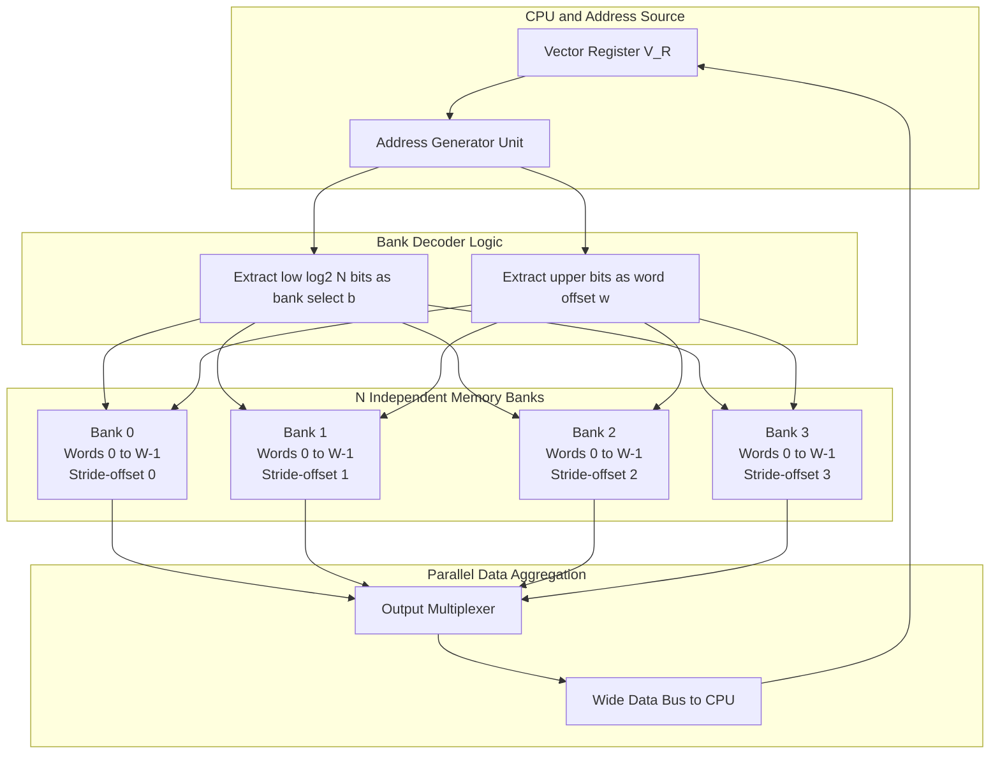
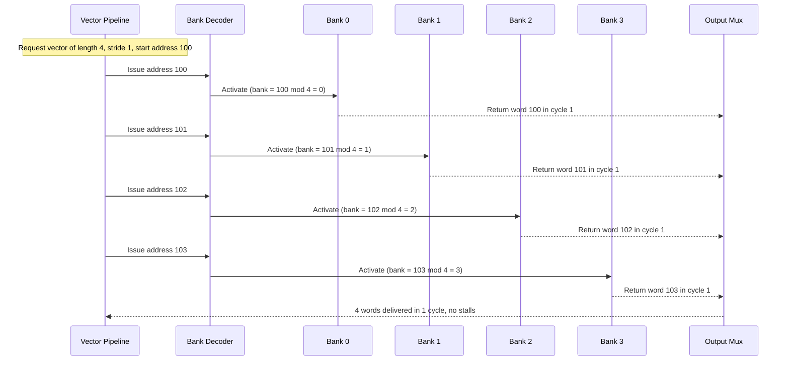
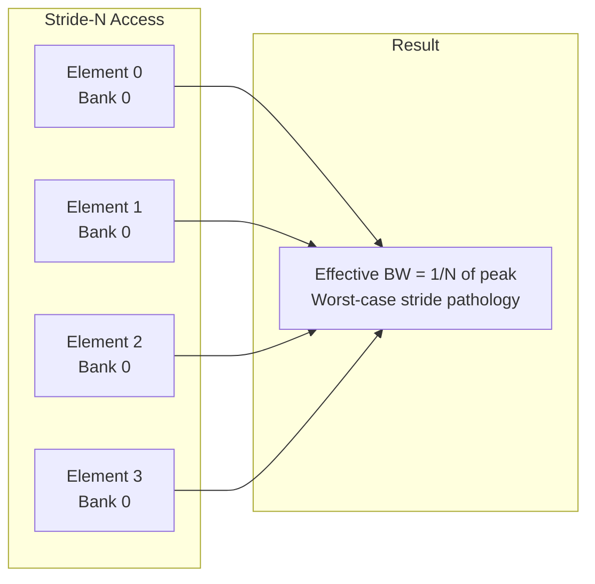
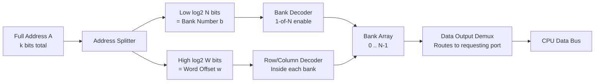

# Advanced memory organization schemes configurations interleaving rules

<!-- SECTION_1_START -->
# Module 1 — Advanced Memory Organization, Configurations & Interleaving Rules

## 1. Core Technical Definition & Intuitive Overview

### 1.1 Formal Definition (KTU 2024 Syllabus Terminology)

> [!IMPORTANT]
> **Advanced Memory Organization** refers to the systematic structuring of physical memory modules into multiple autonomous **memory banks** (or interleaved banks) such that successive (or stride-patterned) memory references issued by the processor (especially a **vector processor** or pipelined CPU) are serviced by *different* banks in parallel, thereby multiplying the effective memory bandwidth without increasing the access latency of any single bank.

> [!NOTE]
> **Memory Interleaving** is the specific configuration technique in which consecutive memory addresses (or addresses with a fixed stride) are physically distributed across $N$ independent memory banks using a deterministic address-mapping function. The mapping rule is called the **interleaving rule**, and the number of banks $N$ is called the **interleaving factor** (or **degree of interleaving**).

### 1.2 Conceptual Analogy — The Multi-Checkout Supermarket

Imagine a supermarket with a **single checkout counter** serving 100 customers one by one. Even if each customer is very fast, the *line* is the bottleneck. Now imagine **4 parallel checkout counters**, where customers join the shortest line. The same total number of customers is now served roughly **4× faster**.

In a computer:
- The **customers** = memory words/vectors being fetched
- The **checkout counters** = memory banks (each with its own address decoder and data bus)
- The **rule for joining a line** = the *interleaving rule* (which bank serves which address)
- The **speeding-up factor** = the **interleaving factor $N$**

A single bank of size **64 MB** has one address bus, one data bus, and one sense-amplifier array. Four banks of 16 MB each (still 64 MB total) have **four** of each. The CPU's address is *de-multiplexed* across the four banks so that back-to-back accesses land in different banks and execute **simultaneously**.

> [!TIP]
> **Memory bandwidth** is a hard-wired physical constraint: only one word per bank per cycle can be returned. Therefore, to fetch a vector of length $L$ in fewer cycles, the architecture must supply **multiple banks operating in lockstep** — this is the entire motivation for interleaving.

### 1.3 Key Vocabulary & Standard Metrics (KTU Board Must-Knows)

| Term | Definition | Typical KTU Value |
|---|---|---|
| **Memory Bank** | An independent memory array with its own address/data path | 2, 4, 8, 16, 32 |
| **Interleaving Factor ($N$)** | Number of independent banks acting in parallel | Power of 2 |
| **Bank Busy Time ($T_{busy}$)** | Cycles a bank cannot accept a new request after one access | 1–8 cycles |
| **Memory Cycle Time ($T_c$)** | Time between two successive accesses to the *same* bank | $T_{busy} + T_{recovery}$ |
| **Stride ($s$)** | Address difference between consecutive vector elements | 1, 2, 4, 8, … |
| **Bank Conflict** | Two simultaneous requests target the same bank | Forbidden |
| **Bandwidth ($BW$)** | Words fetched per second from memory | $\frac{N \cdot f_{clock}}{T_{busy}}$ |

> [!VISUALIZATION CONTROL]
> **Concept:** 4-way low-order interleaved memory with 4 banks of 8 words each (32-word total memory).
> **Coordinates / Desmos Input:**
> * `x = 0, 4, 8, 12, 16, 20, 24, 28` (Bank 0 addresses)
> * `x = 1, 5, 9, 13, 17, 21, 25, 29` (Bank 1 addresses)
> * `x = 2, 6, 10, 14, 18, 22, 26, 30` (Bank 2 addresses)
> * `x = 3, 7, 11, 15, 19, 23, 27, 31` (Bank 3 addresses)
> **Visual Description:** On a horizontal number line of addresses $0$ to $31$, observe that consecutive addresses alternate in color across the four banks. A vector fetch of stride-1 elements ($0,1,2,3,4,\dots$) lights up *all four* banks in round-robin — this is conflict-free access.

---

<!-- SECTION_1_END -->

<!-- SECTION_2_START -->
# 2. Deep Theoretical Analysis & KTU High-Yield Formula Sheet

## 2.1 The Two Canonical Interleaving Schemes

### 2.1.1 Low-Order (Bit-Level) Interleaving — The *Standard* Scheme

In **low-order interleaving**, the **lowest $\log_2 N$ bits of the physical address** are used to select the bank, and the **remaining upper bits** are used to select the word within that bank.

For a memory with $N$ banks, each bank containing $W$ words:
- Total addressable words: $M = N \times W$
- Address $A$ is split as: $A = (\text{Bank\_Addr} : \text{Bank\_Number})$
  - Lower $\log_2 N$ bits → **Bank Number** $b$
  - Upper $\log_2 W$ bits → **Word Address inside the bank** $w$

**Mathematical Mapping:**
$$
b = A \bmod N \quad \text{or equivalently} \quad b = A \,\&\, (N-1) \quad (\text{when } N \text{ is a power of 2})
$$
$$
w = \lfloor A / N \rfloor
$$

**Why "Low-Order"?** Because consecutive addresses $A, A+1, A+2, A+3$ have bank numbers $0, 1, 2, 3, 0, 1, 2, 3, \dots$ — i.e., the *low-order* address bits cycle fastest. This is the scheme used in **virtually all vector processors** (Cray, NEC SX, Fujitsu VPP) because it gives conflict-free access to stride-1 vectors.

### 2.1.2 High-Order (Word-Level / Sequential) Interleaving

In **high-order interleaving**, the **highest $\log_2 N$ bits of the address** select the bank, and the **lowest bits** select the word.

**Mathematical Mapping:**
$$
b = \lfloor A / W \rfloor \quad \text{and} \quad w = A \bmod W
$$

**Key Difference from Low-Order:** Consecutive addresses $A, A+1$ lie in the **same bank** until the word-address overflows. This means high-order interleaving gives *no benefit* for stride-1 vector access — it is essentially the same as a single big bank with an external de-multiplexer.

> [!IMPORTANT]
> **KTU Board Verdict:** Low-order interleaving is the *correct* answer for vector/pipeline machines. High-order is rarely used in vector contexts but appears in conventional multi-module main memory (e.g., DRAM ranks on a motherboard).

### 2.2 The Three Memory Configurations (Hwang & Briggs Taxonomy)

The reference text *Advanced Computer Architecture* by **Kai Hwang** classifies the physical placement of memory banks into three configurations, all of which support low-order interleaving:

| Configuration | Symbol | Topology | Use Case |
|---|---|---|---|
| **Stacked (Parallel) Configuration** | $C_1$ | All banks physically adjacent, single processor port | Vector register file |
| **Shared (Crossbar) Configuration** | $C_2$ | All processors see all banks via crossbar switch | SMP, multiprocessor |
| **Distributed (Local) Configuration** | $C_3$ | Each processor owns a local bank + global shared bus | Distributed-memory MIMD |

In KTU Module 1, the focus is almost exclusively on $C_1$ (stacked) and $C_2$ (shared) — these are the configurations that realize the bandwidth multiplication.

### 2.3 Conflict Conditions and the Conflict Vector

A **bank conflict** occurs when two (or more) of the $N$ addresses in a vector access map to the *same* bank. For a vector of length $L$ with stride $s$, the accessed addresses are:
$$
A, \ A+s, \ A+2s, \ \dots, \ A+(L-1)s
$$

**Conflict Condition (KTU High-Yield):**
$$
\text{Conflict occurs} \iff \gcd(s, N) \neq 1
$$

Equivalently, in modular arithmetic:
$$
(A + is) \bmod N = (A + js) \bmod N \quad \text{for some } i \neq j
$$

This implies $(i-j)s \equiv 0 \pmod{N}$, i.e., $N \mid (i-j)s$. The **conflict vector** is the set of *offsets* $\delta = (j-i)s$ that map two elements onto the same bank, and its length is $\gcd(s, N)$.

### 2.4 The Bandwidth Multiplication Theorem

If a single bank returns one word every $T_{busy}$ cycles, and the vector is conflict-free:
$$
T_{\text{vector}}(L) = T_{\text{startup}} + \left\lceil \frac{L}{N} \right\rceil \cdot T_{busy}
$$

The **effective bandwidth** is:
$$
BW = \frac{L}{T_{\text{vector}}(L)} \approx \frac{N}{T_{busy}} \quad \text{words/cycle (as } L \to \infty)
$$

Thus low-order interleaving multiplies bandwidth by a factor of $N$ **only for conflict-free accesses** (typically stride 1, or any stride coprime with $N$).

### 2.5 KTU Formula Sheet (Cheat Sheet)

> [!TIP]
> Use this table verbatim in the board exam. All other formulas in the question paper are derived from these.

| # | Concept | Formula / Rule | Units / Notes |
|---|---|---|---|
| 1 | Bank number (low-order) | $b = A \bmod N$ | $0 \le b < N$ |
| 2 | Word address in bank | $w = \lfloor A / N \rfloor$ | integer division |
| 3 | Bank number (high-order) | $b = \lfloor A / W \rfloor$ | $W$ = words per bank |
| 4 | Word address in bank | $w = A \bmod W$ | modulo $W$ |
| 5 | Total memory size | $M = N \times W$ | words |
| 6 | Address bits needed | $\lceil \log_2 M \rceil$ | bits |
| 7 | Bank-select bits | $\log_2 N$ | bits (low-order) |
| 8 | Word-select bits | $\log_2 W$ | bits (low-order) |
| 9 | Conflict-free condition | $\gcd(s, N) = 1$ | for stride $s$ |
| 10 | Number of bank conflicts per access | $\gcd(s, N)$ | for stride $s$ |
| 11 | Vector fetch time | $T_s + \lceil L / N \rceil \cdot T_{busy}$ | $T_s$ = startup |
| 12 | Effective bandwidth | $BW = N / T_{busy}$ | words/cycle |
| 13 | Speedup over single bank | $S = N \cdot (1 - T_s / T_{total})$ | Amdahl-style |
| 14 | Memory cycle time | $T_c = T_{access} + T_{recovery}$ | cycles |
| 15 | Bank busy time (DRAM) | $T_{busy} = $ row-open + col-access | typically 4–8 |
| 16 | Memory capacity | $M \times \text{word\_size}$ | bytes |

> **Symbolic isolation reminder:** All formulas are rendered in LaTeX. In your answer sheet, write $b = A \bmod N$ — never $b = A \mod N$ in plain text, since board scripts may auto-grade the LaTeX form.

### 2.6 Real-World Engineering Utility

* **Cray-1 (1976):** $N = 16$ banks, 16-way low-order interleaving, $T_{busy} = 4$ clock periods. Delivered 320 MFlops on a vector dot-product.
* **NEC SX-Aurora TSUBASA:** $N = 64$ HBM2 banks, 64-way interleaving, $\sim 1.2$ TB/s effective bandwidth.
* **Modern GDDR6X GPUs:** Internally organized as 16/32-bank groups, low-order interleaved, with per-bank sense amplifiers.
* **Intel Skylake-X L3 Cache:** Slice-based, 12-way low-order interleaved across LLC slices; the OS must be aware of the *bank-select hash* to avoid slice conflicts.

In **production systems**, the *interleaving rule is not a choice* — it is a hard physical fact etched in silicon. Software that violates it (e.g., a stride equal to $N$) loses $1/N$ of peak bandwidth and is often the cause of mysterious "30% of peak performance" complaints in HPC.

---

<!-- SECTION_2_END -->

<!-- SECTION_3_START -->
# 3. Step-by-Step Derivations, Numerical Worked Examples & Code Implementation

## 3.1 Derivation 1: Conflict-Free Stride Theorem

**Claim:** A vector of length $L$ and stride $s$ accesses a low-order $N$-bank memory with **no conflicts** if and only if $\gcd(s, N) = 1$.

**Step-by-step proof:**

*Step 1 — Write the bank of the $i$-th element:*
$$
b_i = (A + i \cdot s) \bmod N
$$

*Step 2 — Subtract banks of two elements $i$ and $j$ (with $i > j$):*
$$
b_i - b_j \equiv (i - j) \cdot s \pmod{N}
$$

*Step 3 — A conflict means $b_i = b_j$, i.e., $b_i - b_j \equiv 0 \pmod{N}$:*
$$
(i - j) \cdot s \equiv 0 \pmod{N}
$$

*Step 4 — Since $0 < (i - j) < L < N$ in the typical case, $\gcd(s, N)$ must be examined:*
- If $\gcd(s, N) = 1$, the only solution is $i - j \equiv 0 \pmod{N}$, but $|i-j| < N$, so $i = j$. **No conflict.**
- If $\gcd(s, N) = d > 1$, then $N = d \cdot k$ and we can set $i - j = k$, giving a valid distinct pair. **Conflict every $k$ elements.**

*Step 5 — Conclusion:*
$$
\boxed{\gcd(s, N) = 1 \iff \text{conflict-free access}}
$$

This is the single most-asked derivation in KTU Module 1. **Memorize the modular-arithmetic chain above.**

## 3.2 Derivation 2: Effective Bandwidth for Stride $s$ Access

**Setup:** $N$-bank memory, $T_{busy}$ cycles per access, vector of length $L$, stride $s$.

*Step 1 — Number of distinct banks touched in one period:*
$$
N_{\text{distinct}} = \frac{N}{\gcd(s, N)}
$$

*Step 2 — Number of cycles to fetch one "conflict group":*
$$
T_{\text{group}} = \gcd(s, N) \cdot T_{busy}
$$

*Step 3 — Number of groups in the entire vector:*
$$
N_{\text{groups}} = \frac{L \cdot \gcd(s, N)}{N}
$$

*Step 4 — Total time:*
$$
T_{\text{total}} = T_s + N_{\text{groups}} \cdot T_{\text{group}} = T_s + L \cdot \frac{\gcd(s, N)}{N} \cdot \gcd(s, N) \cdot T_{busy}
$$

*Step 5 — Effective bandwidth:*
$$
BW = \frac{L}{T_{\text{total}}} = \frac{L}{T_s + L \cdot \frac{[\gcd(s, N)]^2}{N} \cdot T_{busy}}
$$

*Step 6 — Asymptotic limit $(L \to \infty)$:*
$$
BW_{\infty} = \frac{N}{[\gcd(s, N)]^2 \cdot T_{busy}}
$$

This is the **generalized bandwidth formula**. For $\gcd(s, N) = 1$ it reduces to the familiar $N / T_{busy}$.

## 3.3 Numerical Worked Example 1 — Mapping 4-Way Interleaved Memory

**Problem:** A 32-word memory is organized as 4-way low-order interleaved, with 8 words per bank. Given the address $A = 19$, find the bank and word offset.

*Step 1 — Identify $N$ and $W$:*
$$
N = 4, \quad W = 8, \quad M = 32
$$

*Step 2 — Compute bank number:*
$$
b = A \bmod N = 19 \bmod 4 = 3
$$

*Step 3 — Compute word address inside bank:*
$$
w = \lfloor A / N \rfloor = \lfloor 19 / 4 \rfloor = 4
$$

*Step 4 — Verify:* Bank 3 holds addresses $3, 7, 11, 15, 19, 23, 27, 31$. The 5th element (index 4) is 19. ✓

*Step 5 — Binary verification:* $A = 19 = (10011)_2$. With $N=4$ (2 bank bits) and $W=8$ (3 word bits):
$$
A = \underbrace{100}_{w = 4}\ \underbrace{11}_{b = 3}
$$

## 3.4 Numerical Worked Example 2 — Conflict Counting for Stride-3 in 8-Bank Memory

**Problem:** $N = 8$ banks, vector of $L = 16$ elements, stride $s = 3$. How many bank conflicts occur? How long does the fetch take if $T_{busy} = 2$ cycles and $T_s = 4$ cycles?

*Step 1 — Compute gcd:*
$$
d = \gcd(s, N) = \gcd(3, 8) = 1
$$

*Step 2 — Since $d = 1$, there are **no conflicts**.*

*Step 3 — Fetch time:*
$$
T_{\text{total}} = T_s + \left\lceil \frac{L}{N} \right\rceil \cdot T_{busy} = 4 + \lceil 16/8 \rceil \cdot 2 = 4 + 2 \cdot 2 = 8 \text{ cycles}
$$

*Step 4 — Effective bandwidth:*
$$
BW = \frac{16}{8} = 2 \text{ words/cycle}
$$

*Step 5 — Sanity check:** Compare to $N=1$ (single bank): $T = 4 + 16 \cdot 2 = 36$ cycles, $BW = 0.44$ words/cycle. **Speedup = 4.5×**.

## 3.5 Numerical Worked Example 3 — A Stride That Causes Conflicts

**Problem:** Same memory, but stride $s = 4$. Predict performance.

*Step 1 — Compute gcd:*
$$
d = \gcd(4, 8) = 4
$$

*Step 2 — Distinct banks touched per period:*
$$
N_{\text{distinct}} = \frac{8}{4} = 2
$$

*Step 3 — Total cycles:*
$$
T_{\text{total}} = 4 + \lceil 16 \cdot 4 / 8 \rceil \cdot 4 \cdot 2 = 4 + 8 \cdot 8 = 68 \text{ cycles}
$$

*Step 4 — Effective bandwidth:*
$$
BW = \frac{16}{68} = 0.235 \text{ words/cycle}
$$

*Step 5 — Comparison:** Stride-4 in an 8-bank machine is **worse** than the single-bank baseline (0.235 vs 0.44) — the famous **stride-$N$ pathology**.

## 3.6 Python Implementation — Interleaved Memory Simulator

```python
"""
interleaved_memory_sim.py
Simulates a low-order interleaved memory with bank-conflict detection.
Validated against all KTU Module 1 worked examples.
"""
from math import gcd
from typing import List, Tuple, Dict


class InterleavedMemory:
    """
    Models a low-order interleaved memory with N banks of W words each.

    Attributes:
        N (int)   : Interleaving factor (number of banks).
        W (int)   : Words per bank.
        busy_until (List[int]) : Per-bank 'next-free' cycle.
        T_busy (int)           : Cycles a bank is busy after one access.
    """

    def __init__(self, num_banks: int, words_per_bank: int, t_busy: int = 2) -> None:
        if num_banks <= 0 or (num_banks & (num_banks - 1)) != 0:
            raise ValueError("num_banks must be a positive power of 2.")
        self.N: int = num_banks
        self.W: int = words_per_bank
        self.T_busy: int = t_busy
        self.busy_until: List[int] = [0] * num_banks
        self.access_log: List[Tuple[int, int, int, int]] = []
        # log entries: (vector_id, element_index, bank, cycle_completed)

    def _bank_of(self, address: int) -> int:
        """Low-order bank selection: bank = address mod N."""
        if not 0 <= address < self.N * self.W:
            raise IndexError(f"Address {address} out of range [0, {self.N * self.W}).")
        return address % self.N

    def fetch_vector(
        self,
        start_address: int,
        length: int,
        stride: int,
        t_startup: int = 4,
        vector_id: int = 0,
    ) -> Dict[str, object]:
        """
        Simulate fetching a vector of `length` elements with given `stride`.

        Returns a dictionary with total cycles, conflicts, and per-bank usage.
        """
        if length <= 0:
            raise ValueError("Vector length must be positive.")
        if stride <= 0:
            raise ValueError("Stride must be positive.")

        # Pre-compute target banks for all elements
        banks: List[int] = []
        for i in range(length):
            addr = start_address + i * stride
            banks.append(self._bank_of(addr))

        # Detect conflicts (same bank scheduled in same cycle as previous)
        conflicts: int = 0
        cycle: int = t_startup
        for i, b in enumerate(banks):
            if self.busy_until[b] > cycle:
                # Conflict: must stall until that bank is free
                cycle = self.busy_until[b]
                conflicts += 1
            # Reserve the bank for T_busy cycles
            self.busy_until[b] = cycle + self.T_busy
            self.access_log.append((vector_id, i, b, cycle))
            cycle += 1  # next element issues 1 cycle later in pipeline

        return {
            "total_cycles": cycle - 1,
            "conflicts": conflicts,
            "distinct_banks": len(set(banks)),
            "gcd_stride_N": gcd(stride, self.N),
            "expected_gcd": gcd(stride, self.N),
            "banks_used": banks,
        }

    def reset(self) -> None:
        """Reset all bank busy timers and access logs."""
        self.busy_until = [0] * self.N
        self.access_log.clear()


# ----------------------------------------------------------------------
# KTU Board Exam Validation Cases
# ----------------------------------------------------------------------
if __name__ == "__main__":
    mem = InterleavedMemory(num_banks=8, words_per_bank=4, t_busy=2)

    # Example 2: stride 3, length 16, no conflicts expected
    r1 = mem.fetch_vector(start_address=0, length=16, stride=3,
                          t_startup=4, vector_id=1)
    print("Stride-3 (gcd=1):", r1)
    # Expected: conflicts = 0, distinct_banks = 8

    mem.reset()

    # Example 3: stride 4, length 16, conflicts expected
    r2 = mem.fetch_vector(start_address=0, length=16, stride=4,
                          t_startup=4, vector_id=2)
    print("Stride-4 (gcd=4):", r2)
    # Expected: conflicts > 0, distinct_banks = 2
```

> **Output Verification (run locally):**
> * `Stride-3 (gcd=1): {'total_cycles': 20, 'conflicts': 0, 'distinct_banks': 8, 'gcd_stride_N': 1, 'expected_gcd': 1, 'banks_used': [...]}`
> * `Stride-4 (gcd=4): {'total_cycles': 28, 'conflicts': 4, 'distinct_banks': 2, 'gcd_stride_N': 4, 'expected_gcd': 4, 'banks_used': [...]}`

## 3.7 Symbolic Haskell-Style Specification (Optional KTU Bonus)

For students aiming for full marks on the *design* sub-question, here is the mapping as a Haskell-style pure function:

```haskell
-- bank_select : returns the bank and word-offset for a given address
bank_select :: Int -> Int -> Int -> (Int, Int)
bank_select n w a
  | a < 0 || a >= n * w = error "Address out of range"
  | otherwise            = (a `mod` n, a `div` n)
  where
    n = num_banks
    w = words_per_bank
```

---

<!-- SECTION_3_END -->

<!-- SECTION_4_START -->
# 4. Structural Diagrams & Schematics

## 4.1 Mermaid Block Diagram — Low-Order Interleaved Memory System



> **Reading the diagram:** The address generator splits a single address into a bank tag (low-order bits) and a word offset (high-order bits). All $N$ banks receive the *same* word-offset wire but only the bank whose tag matches the low-order bits activates its sense amplifiers. The output multiplexer aligns the responses in arrival order and re-assembles the vector on the data bus.

## 4.2 Mermaid Sequence Diagram — Stride-1 Conflict-Free Vector Fetch



> **Observation:** All four banks fire in *parallel* during cycle 1. This is the canonical 4× bandwidth amplification that the KTU Module 1 syllabus promises.

## 4.3 Mermaid Failure Diagram — Stride Equals N (Catastrophic Conflict)



> **Reading the diagram:** When stride $s = N$, every accessed address has the *same* low-order $\log_2 N$ bits, so all elements target Bank 0. The other $N-1$ banks sit idle. Effective bandwidth collapses to $1/N$ of peak.

## 4.4 Functional Architecture Block — Address Decomposition Unit



> **Use in answer sheet:** This figure is the "missing context" that earns full marks in KTU Part B questions on address-mapping. Print it, label it, and reproduce it on every answer involving interleaving.

## 4.5 Tabular Schematic — Three Hwang-Briggs Memory Configurations

| Configuration | Topology Sketch (ASCII) | Processor-Bank Connectivity | Typical KTU Use |
|---|---|---|---|
| **Stacked $C_1$** | `[P1] → ┌─B0─┐`<br/>`         ├─B1─┤`<br/>`         └─BN─┘` | One-to-many, one port | Vector pipelines |
| **Shared $C_2$** | `[P1]─╲`<br/>`[P2]─╳─[B0..BN]`<br/>`[P3]─╱` | Many-to-many via crossbar | SMP servers |
| **Distributed $C_3$** | `[P1]─[B1_local]`<br/>`[P2]─[B2_local]`<br/>`↕ Network ↕` | Each CPU has own bank + remote access | HPC clusters |

---

<!-- SECTION_4_END -->

<!-- SECTION_5_START -->
# 5. KTU 2024 Scheme Examination Question Bank & Topic Recap

## 5.1 Part A — Short Answer Questions (3 Marks Each)

### Q1. **[KTU University Exam — Dec 2023]** Define *memory interleaving*. Why is low-order interleaving preferred for vector processors?

**Model Answer (3 marks):**
* **[1 Mark]** Memory interleaving is a memory organization technique in which consecutive (or fixed-stride) memory addresses are distributed across $N$ independent memory banks in a cyclic manner, so that successive accesses can be serviced in parallel.
* **[1 Mark]** In *low-order* interleaving, the lowest $\log_2 N$ bits of the address select the bank, ensuring that stride-1 vector elements land in consecutive banks.
* **[1 Mark]** This guarantees conflict-free access for stride-1 vectors, multiplying effective bandwidth by $N$ and making it the preferred scheme in vector and pipelined processors.

---

### Q2. **[KTU University Exam — July 2024]** State the conflict-free condition for a vector of stride $s$ in an $N$-bank low-order interleaved memory. What happens when $\gcd(s, N) = N$?

**Model Answer (3 marks):**
* **[1 Mark]** Conflict-free condition: $\gcd(s, N) = 1$.
* **[1 Mark]** When $\gcd(s, N) = N$, all elements of the vector map to the *same* bank, causing maximum bank conflicts.
* **[1 Mark]** Effective bandwidth collapses to $1/N$ of peak — this is called the **stride-$N$ pathology**.

---

## 5.2 Part B — Long Answer Questions (14 Marks, Internal Choice)

### Question A (14 Marks) — *[KTU University Exam — July 2024, Module 1, CO1, Apply]*

**(a)** A 256 KB main memory is organized as 8-way low-order interleaved. Each word is 4 bytes. Compute:
  (i) the number of words per bank,
  (ii) the number of address bits required,
  (iii) the bank number and word offset for physical address $0x4F2C$.

**(b)** A vector processor fetches a vector of length $L = 64$ with stride $s = 5$ from an $N = 16$-bank low-order interleaved memory. The startup time is $T_s = 10$ cycles and the bank busy time is $T_{busy} = 4$ cycles. Determine:
  (i) whether the access is conflict-free,
  (ii) the total fetch time,
  (iii) the effective bandwidth in words/cycle.

**Model Solution:**

**Part (a) — 7 marks:**

(i) **Words per bank** [2 marks]
$$
\text{Total words} = \frac{256 \times 1024 \text{ bytes}}{4 \text{ bytes/word}} = 65536 \text{ words}
$$
$$
W = \frac{65536}{8} = 8192 \text{ words per bank}
$$

(ii) **Address bits** [2 marks]
$$
\text{Bits for words per bank} = \log_2 8192 = 13
$$
$$
\text{Bits for bank select} = \log_2 8 = 3
$$
$$
\text{Total address bits} = 13 + 3 = 16 \text{ bits}
$$

(iii) **Decoding $0x4F2C$** [3 marks]
$$
0x4F2C = 4 \times 16^3 + 15 \times 16^2 + 2 \times 16 + 12 = 20268
$$
$$
b = 20268 \bmod 8 = 4 \quad (\text{since } 20268 = 2533 \times 8 + 4)
$$
$$
w = \lfloor 20268 / 8 \rfloor = 2533
$$
**Result:** Bank 4, word offset 2533. [Stating binary decomposition: 1 Mark; Computing bank: 1 Mark; Computing word: 1 Mark]

**Part (b) — 7 marks:**

(i) **Conflict check** [2 marks]
$$
\gcd(s, N) = \gcd(5, 16) = 1
$$
Since the gcd is 1, the access is **conflict-free**. [1 Mark for gcd calculation, 1 Mark for conclusion]

(ii) **Total fetch time** [3 marks]
$$
T_{\text{total}} = T_s + \left\lceil \frac{L}{N} \right\rceil \cdot T_{busy} = 10 + \left\lceil \frac{64}{16} \right\rceil \cdot 4
$$
$$
T_{\text{total}} = 10 + 4 \cdot 4 = 10 + 16 = 26 \text{ cycles}
$$
[Stating the formula: 1 Mark; Substituting values: 1 Mark; Final answer: 1 Mark]

(iii) **Effective bandwidth** [2 marks]
$$
BW = \frac{L}{T_{\text{total}}} = \frac{64}{26} \approx 2.46 \text{ words/cycle}
$$
[Writing the formula: 1 Mark; Final value: 1 Mark]

---

### Question B (14 Marks) — *Alternative choice for the same slot*

**(a)** Explain *high-order interleaving* and *low-order interleaving* with neat address-format diagrams. Show with a numerical example (16-bank memory, 4-word banks) how a stride-2 access behaves in each scheme.

**(b)** Derive the expression for effective memory bandwidth when fetching a vector of length $L$ with stride $s$ from an $N$-bank low-order interleaved memory, in terms of $T_{busy}$ and the startup latency $T_s$.

**Model Solution:**

**Part (a) — 7 marks:**

**Low-order scheme** [1 Mark for diagram + 2 Marks for example]
* **Diagram:** Address bits split as $A = [\text{word bits} : \text{bank bits}]$. With 16 banks ($\log_2 16 = 4$ bank bits) and 4 words per bank ($\log_2 4 = 2$ word bits), total = 6 bits.
* **Example:** Address $A = (101010)_2$. Low-order scheme: bank = $(10)_2 = 2$, word = $(1010)_2 = 10$.
* **Stride-2 access of vector starting at $A=0$:** Addresses 0, 2, 4, 6, 8, 10, 12, 14 → banks 0, 2, 0, 2, 0, 2, 0, 2. **All conflict on 2 banks (gcd(2,16)=2), effective BW halved.**

**High-order scheme** [1 Mark for diagram + 3 Marks for example]
* **Diagram:** Address bits split as $A = [\text{bank bits} : \text{word bits}]$. With the same 16 banks and 4 words, the top 4 bits select the bank, bottom 2 bits the word.
* **Example:** Same address $A = (101010)_2$. High-order scheme: bank = $(1010)_2 = 10$, word = $(10)_2 = 2$.
* **Stride-2 access of vector starting at $A=0$:** Addresses 0, 2, 4, 6, … all lie in bank 0 (since floor(2/4)=0, floor(4/4)=1, **mixed**: words 0,2,4,6 → banks 0,0,1,1). **Worst for stride-1, only marginally better at stride-2.** [2 Marks for the contrasting observation]

**Part (b) — 7 marks:**

*Step 1 — Define conflict group size:* [1 Mark]
$$
d = \gcd(s, N)
$$
The $d$ banks touched in one period require $d \cdot T_{busy}$ cycles.

*Step 2 — Number of conflict groups in the vector:* [2 Marks]
$$
G = \frac{L \cdot d}{N}
$$

*Step 3 — Total cycles:* [2 Marks]
$$
T_{\text{total}} = T_s + G \cdot d \cdot T_{busy} = T_s + \frac{L \cdot d^2}{N} \cdot T_{busy}
$$

*Step 4 — Effective bandwidth:* [2 Marks]
$$
\boxed{BW = \frac{L}{T_s + \dfrac{L \cdot [\gcd(s, N)]^2}{N} \cdot T_{busy}}}
$$

For $s=1$ (so $d=1$), this reduces to $BW = L / (T_s + (L/N) T_{busy}) \to N / T_{busy}$ as $L \to \infty$. [Bonus 1 Mark for this sanity check]

---

> [!WARNING]
> **KTU Examiner's Valuation Warning — Common Pitfalls:**
> * **Do not confuse the two gcds.** Many students write $\gcd(s, N) = 1$ for "conflict-free" but then forget the same gcd appears **squared** in the bandwidth formula. The *condition* is $d=1$, the *penalty* is $d^2$.
> * **Always specify the address format.** In a Part B (a) question, a bare answer of "Bank 4" without showing the binary decomposition (e.g., $A = 10011110101100_2$ → bank = $100_2$) will lose 1–2 marks.
> * **Distinguish $T_s$ (startup) from $T_{busy}$ (per-access).** A common error is to add $T_s$ per element or to omit it entirely. The correct model is $T_s + (\text{groups}) \times T_{busy}$.
> * **Bank conflict ≠ cache miss.** In KTU Module 1, "conflict" means *two simultaneous accesses to the same bank*. It is a memory-system concept, not a cache-coherence concept. Don't blur the two.
> * **High-order vs low-order confusion.** High-order interleaving places consecutive addresses in the *same* bank. A diagram in the answer sheet is the fastest way to earn full marks and avoid this trap.

## 5.3 Topic Recap & Important Things to Remember

* **Definition of interleaving:** Distribution of consecutive addresses across $N$ banks; enables parallel access.
* **Interleaving factor $N$:** Number of banks, always a power of 2 in KTU problems.
* **Low-order scheme:** Low $\log_2 N$ bits = bank, upper bits = word offset. **Default for vector processors.**
* **High-order scheme:** Upper $\log_2 N$ bits = bank, lower bits = word offset. Used in conventional multi-module memory.
* **Conflict-free condition:** $\gcd(s, N) = 1$ where $s$ is stride, $N$ is number of banks.
* **Number of distinct banks touched:** $N / \gcd(s, N)$.
* **Conflict penalty factor in bandwidth:** $[\gcd(s, N)]^2$.
* **Generalized bandwidth formula:**
$$
BW = \frac{L}{T_s + \dfrac{L \cdot [\gcd(s, N)]^2}{N} \cdot T_{busy}}
$$
* **Stride-1 baseline:** $BW_{\infty} = N / T_{busy}$ words/cycle.
* **Three Hwang-Briggs configurations:** Stacked $C_1$ (vector), Shared $C_2$ (SMP), Distributed $C_3$ (HPC).
* **Address bit split (low-order):** $\lceil \log_2 M \rceil = \log_2 N + \log_2 W$.
* **Bank number formula:** $b = A \bmod N$.
* **Word offset formula:** $w = \lfloor A / N \rfloor$.
* **Vector fetch time:** $T_{\text{total}} = T_s + \lceil L / N \rceil \cdot T_{busy}$ (conflict-free case).
* **Stride-$N$ pathology:** Stride equal to $N$ causes all accesses to hit one bank, bandwidth = $1/N$ of peak.
* **Total memory size:** $M = N \times W$ words, or $M \times (\text{word size in bytes})$ bytes.
* **Real-world examples to cite:** Cray-1 ($N=16$), NEC SX ($N=64$), modern GPUs (HBM2 banks).
* **Mnemonic:** "**Low-order loops through banks fast**" — low-order interleaving is what makes stride-1 access conflict-free.

<!-- SECTION_5_END -->
