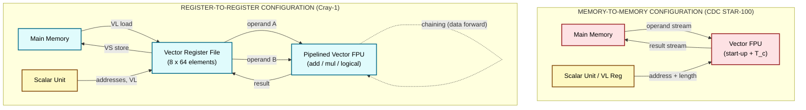
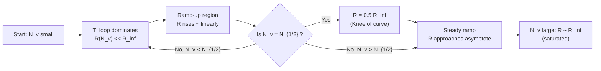
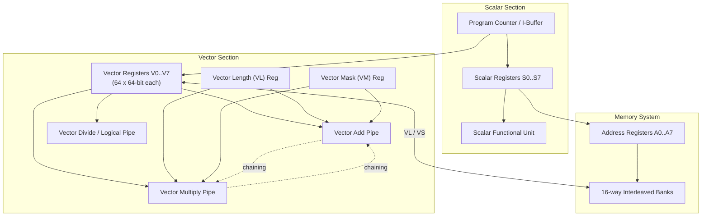

# Vector processing configurations computing architectures tracking throughput scales

<!-- SECTION_1_START -->

# Vector Processing Configurations & Throughput Scaling

## 1. Formal Definition

> [!IMPORTANT]
> **Vector Processing (KTU 2024 Definition):** A class of SIMD (Single Instruction, Multiple Data) computation in which a single *vector instruction* operates on a contiguous or strided sequence of data elements, fetching them from a **vector unit** and producing a sequence of results with one initiation. The hardware organization that supports such instructions is called a **Vector Architecture**.

In the **KTU PECST508 – Advanced Computer Architecture (Module 1)** syllabus, vector processing configurations denote the *manner in which vector operands are sourced, processed, and retired* by a vector processor. These configurations directly govern how **throughput** (results-per-cycle, measured in **FLOPs/cycle** or **GFLOPS**) *scales* as the vector length $N_v$ increases.

> [!NOTE]
> **Throughput Scaling** is the relationship $R_n = f(N_v)$ — the curve that describes how the *effective* performance of a vector pipeline approaches its *asymptotic peak* $R_\infty$ as vector length grows. The metric that quantifies this curve is the **half-performance length** $N_{1/2}$.

### 1.1 Conceptual Analogy

Imagine a **water-tap filling a row of buckets**:

| Element | Scalar Analogy | Vector Analogy |
|---|---|---|
| Data source | One bucket at a time | Whole row of buckets |
| Instruction | "Fill bucket 1, then 2, then 3…" | "Fill the whole row" |
| Start-up cost | Walking to each bucket | Setting up the pipe once |
| Throughput | Buckets per minute (low) | Buckets per minute (high, but needs long rows) |

A **short row of buckets** (small $N_v$) wastes water — most of the time is spent *setting up the pipe* (start-up latency $T_{\text{loop}}$). A **long row** (large $N_v$) gives throughput close to the **pipe's maximum flow rate** $R_\infty$.

### 1.2 Core Vocabulary (KTU High-Yield Terms)

| Term | Definition |
|---|---|
| **Vector Length ($N_v$)** | Number of elements processed by a single vector instruction |
| **Vector Stride** | Spacing (in memory words) between successive vector elements |
| **Chime** | Approximate time to complete one vector instruction of length $n$ |
| **Convoy** | A set of vector instructions that can execute together without conflict |
| **Chaining** | Forwarding of vector results from one functional unit to another |
| **Strip Mining** | Software technique to break long vectors into register-sized chunks |
| **$R_\infty$** | Asymptotic peak throughput (FLOPs/cycle) as $N_v \to \infty$ |
| **$N_{1/2}$** | Vector length at which $R_n = 0.5 \times R_\infty$ |

> [!TIP]
> In KTU board exams, the phrase *"tracking throughput scales"* almost always reduces to the question: **"At what vector length does the processor achieve half its peak performance?"** — the answer is the **$N_{1/2}$** metric.

> [!VISUALIZATION CONTROL]
> **Concept:** Throughput-vs-Vector-Length Curve (Vector Performance Knee)
> **Desmos / GeoGebra Equations:**
> - $R_n(x) = \dfrac{R_\infty \cdot x}{x + N_{1/2}}$  →  Performance curve
> - $y = R_\infty$  →  Asymptote
> - $y = 0.5 R_\infty$  →  Half-performance reference line
> **Visual Description:** Plot $R_n$ on the vertical axis (in GFLOPS) and $N_v$ on the horizontal axis. The curve starts near **0** for small $N_v$, rises with a characteristic **knee**, and flattens toward the horizontal asymptote $R_\infty$. The point where the curve crosses the dotted $y = 0.5 R_\infty$ line is exactly $x = N_{1/2}$. A processor with a small $N_{1/2}$ is "fast to ramp up"; a large $N_{1/2}$ indicates high start-up overhead.

---

<!-- SECTION_1_END -->

<!-- SECTION_2_START -->

# 2. Deep Theoretical Analysis — Configurations & Performance Models

## 2.1 The Two Canonical Vector Configurations

The KTU syllabus groups vector machines into two architectural families based on *where the vector data resides during execution*.

### 2.1.1 Memory-to-Memory Vector Architecture

In this design, **vector operands are streamed directly from main memory** into the vector functional unit, and **results are streamed back to main memory**, all under a single vector instruction.

**Representative machines:** *CDC STAR-100 (1973), TI ASC (1972), Fujitsu VP-200.*

**Operational flow:**

1. The vector instruction issues a *memory-stream request* specifying base address, length, and stride.
2. The memory system supplies the operand stream (or receives the result stream) at the rate of the functional unit.
3. Computation and memory access are *tightly coupled* inside the instruction.

**Engineering trade-offs:**

| Strength | Weakness |
|---|---|
| No explicit vector load/store — simpler ISA | **Huge memory bandwidth** required (e.g., 100 MFLOPs × 8 bytes = **800 MB/s** in 1970s terms — heroic for that era) |
| Can process vectors longer than the register file | Large **start-up latency** $T_{\text{loop}}$ (memory pipeline is the bottleneck) |
| Good for very long, streaming kernels (e.g., signal processing) | Hard to support chaining — result must reach memory first |

> [!NOTE]
> The CDC STAR-100 used a **4 MByte/s memory** feeding a **100 MFLOPs** unit — a **25× bandwidth deficit** that *cramped* real-world throughput. This drove the design of the next generation.

### 2.1.2 Register-to-Register Vector Architecture (Load-Store Vector)

Here, **vector registers** sit between memory and the vector functional units. The programmer (or compiler) must *explicitly* issue vector loads and stores, but the *computation* instructions operate only on registers.

**Representative machines:** *Cray-1 (1976), Cray X-MP, NEC SX-2, Fujitsu VP-100 (later models).*

**Operational flow:**

1. **VL** (vector load) instruction moves a vector from memory into a vector register.
2. **VA** (vector add), **VM** (vector multiply), etc., operate between vector registers.
3. **VS** (vector store) writes results back to memory.
4. A separate **scalar unit** computes addresses and loop control.

**The Cray-1 quantitative baseline (KTU standard benchmark):**

| Parameter | Cray-1 Value | Modern Equivalent |
|---|---|---|
| Clock period | **12.5 ns** (80 MHz) | ~0.3 ns (3 GHz) |
| Vector registers | **8 × 64 × 64-bit** | AVX-512: 32 × 512-bit |
| Functional units | 4 pipelined (add, multiply, divide, logical) | Many SIMD lanes |
| Memory bandwidth | **80 MWord/s** | ~50 GWord/s |
| Peak $R_\infty$ | **80 MFLOPs** (add+mul) | ~50 GFLOPS per core |

> [!IMPORTANT]
> **Why register-to-register dominates modern design:** By buffering operands in registers, the *memory system* is **decoupled** from the *arithmetic pipeline*. This lets the machine:
> - Hide memory latency through **chaining** (data-forwarding between units),
> - Reuse operands across multiple vector instructions without re-fetching from memory,
> - Run at $R_\infty$ for shorter vectors because the start-up cost is paid in the load, not the arithmetic.

### 2.1.3 Hybrid / SIMD-Within-a-Register (SWAR) Configurations

Modern CPUs (x86 SSE/AVX/AVX-512, ARM NEON/SVE, RISC-V V-extension) use **short, fixed-length vector registers** integrated with the scalar pipeline. These are essentially *micro-vector* units:

- **Operand length:** 128, 256, or **512 bits** (i.e., 4 to 16 single-precision floats).
- **ISA integration:** vector ops are *just* SIMD instructions in the scalar ISA.
- **Throughput scaling:** Strictly linear in $N_v$ *up to* the register width; beyond that, **strip-mining** is needed.

> [!TIP]
> KTU often asks: *"Which configuration gives the highest $R_\infty$ for the same technology?"* — Answer: **Register-to-register**, because the functional units can be clocked faster (they don't wait on memory).

## 2.2 The Throughput-Scaling Model

### 2.2.1 The Fundamental Timing Equation

For a vector operation producing $N_v$ results on a pipeline with start-up latency $T_{\text{loop}}$ (in cycles) and per-element time $T_c$ (in cycles/element):

$$T(N_v) \;=\; T_{\text{loop}} + N_v \cdot T_c$$

The **effective throughput** (FLOPs/cycle) is then:

$$R(N_v) \;=\; \frac{N_v \cdot F}{T_{\text{loop}} + N_v \cdot T_c}$$

where $F$ = floating-point operations per element (often $F = 2$ for FMA, or $F = 1$ for add-only).

### 2.2.2 The $R_\infty$ Asymptote

As $N_v \to \infty$:

$$R_\infty \;=\; \lim_{N_v \to \infty} R(N_v) \;=\; \frac{F}{T_c}$$

> [!NOTE]
> $R_\infty$ is set **purely by the per-element cycle time** $T_c$ of the functional unit. The memory system, instruction issue, and register file can *only reduce* $R_\infty$ — they can never raise it.

### 2.2.3 The $N_{1/2}$ Half-Performance Length

By definition, $N_{1/2}$ is the vector length at which $R(N_v) = 0.5 \, R_\infty$. Solving:

$$\frac{N_{1/2} \cdot F}{T_{\text{loop}} + N_{1/2} \cdot T_c} \;=\; \frac{0.5 \cdot F}{T_c}$$

$$\Longrightarrow \quad N_{1/2} \;=\; \frac{T_{\text{loop}}}{T_c}$$

### 2.2.4 The Master Throughput-Scaling Equation

Substituting $N_{1/2}$ back gives the canonical KTU formula:

$$\boxed{\,R(N_v) \;=\; R_\infty \cdot \frac{N_v}{N_v + N_{1/2}}\,}$$

> [!IMPORTANT]
> **Master Rule (KTU-favorite):** To *halve* the impact of start-up overhead, **double the vector length** beyond $N_{1/2}$. To *quarter* the impact, **quadruple** the vector length.

## 2.3 Engineering Implications — Where This Matters in Production

| Field | Application | Why Vector Configurations Matter |
|---|---|---|
| **HPC / Climate Modeling** | Weather simulation (WRF, CESM) | Long vectors ($\sim 10^6$ elements), $R_\infty$ saturated, peak GFLOPS/Watt critical |
| **AI / Deep Learning** | GEMM, convolution kernels | Modern GPUs (NVIDIA A100) are *vector processors at heart* — register-based SIMT |
| **Signal Processing** | FFT, FIR filters | Memory-to-memory streaming is still optimal (zero-overhead DMA) |
| **Embedded DSP** | ARM Cortex-M with Helium | SWAR configurations minimize energy per element |
| **Database Engines** | Vectorized query execution (Apache Arrow, ClickHouse) | Modern CPUs use 512-bit AVX-512 to achieve $R_\infty$ on column scans |

> [!NOTE]
> In 2024, **NVIDIA H100 SXM5** delivers ~**990 TFLOPS FP64** in vector/SIMT form — three orders of magnitude above Cray-1, but obeying the *same* $R_\infty / N_{1/2}$ scaling law.

---

<!-- SECTION_2_END -->

<!-- SECTION_3_START -->

# 3. Step-by-Step Derivations & Worked Examples

## 3.1 Derivation 1 — The Master Throughput-Scaling Equation

**Given:**
- Start-up latency of vector functional unit: $T_{\text{loop}}$ cycles.
- Per-element time in steady state: $T_c$ cycles.
- Vector length: $N_v$ elements.
- FLOPs per element: $F$.

**Step 1 — Total execution time for one vector instruction:**

$$T(N_v) \;=\; T_{\text{loop}} + N_v \cdot T_c$$

> *Reasoning:* The first element takes $T_{\text{loop}}$ cycles to traverse the pipeline (initiation, address generation, etc.). After that, one new element emerges every $T_c$ cycles. Total = (start-up) + (steady-state).

**Step 2 — Throughput definition (FLOPs per cycle):**

$$R(N_v) \;=\; \frac{\text{Total FLOPs}}{\text{Total cycles}} \;=\; \frac{N_v \cdot F}{T_{\text{loop}} + N_v \cdot T_c}$$

**Step 3 — Take the limit as $N_v \to \infty$:**

$$R_\infty \;=\; \lim_{N_v \to \infty} \frac{N_v \cdot F}{T_{\text{loop}} + N_v \cdot T_c} \;=\; \lim_{N_v \to \infty} \frac{F}{\dfrac{T_{\text{loop}}}{N_v} + T_c} \;=\; \frac{F}{T_c}$$

> *Reasoning:* As $N_v$ grows, the $T_{\text{loop}} / N_v$ term vanishes.

**Step 4 — Compute $N_{1/2}$ by setting $R(N_v) = 0.5 R_\infty$:**

$$\frac{N_{1/2} \cdot F}{T_{\text{loop}} + N_{1/2} \cdot T_c} \;=\; 0.5 \cdot \frac{F}{T_c}$$

$$N_{1/2} \cdot T_c \;=\; 0.5 \cdot T_{\text{loop}} + 0.5 \cdot N_{1/2} \cdot T_c$$

$$0.5 \cdot N_{1/2} \cdot T_c \;=\; 0.5 \cdot T_{\text{loop}}$$

$$\Longrightarrow \quad N_{1/2} \;=\; \frac{T_{\text{loop}}}{T_c} \quad \blacksquare$$

**Step 5 — Rewrite $R(N_v)$ in terms of $R_\infty$ and $N_{1/2}$:**

$$R(N_v) \;=\; \frac{N_v \cdot F}{T_{\text{loop}} + N_v \cdot T_c} \;=\; \frac{N_v \cdot F}{N_{1/2} \cdot T_c + N_v \cdot T_c} \;=\; \frac{N_v}{N_{1/2} + N_v} \cdot \frac{F}{T_c} \;=\; R_\infty \cdot \frac{N_v}{N_v + N_{1/2}}$$

$$\boxed{\,R(N_v) \;=\; R_\infty \cdot \frac{N_v}{N_v + N_{1/2}}\,} \quad \blacksquare$$

---

## 3.2 Worked Example — Cray-1 Class Vector Add

**Problem Statement (KTU-style):**

> A vector processor performs the operation $Y = a + X$ (Saxpy-style), where $X$ and $Y$ are length-$N_v$ vectors and $a$ is a scalar. The vector functional unit has a **start-up latency of 50 cycles** and a **per-element throughput time of 2 cycles**. Compute: (a) the asymptotic throughput $R_\infty$, (b) the half-performance length $N_{1/2}$, (c) the effective throughput at $N_v = 50$, and (d) the effective throughput at $N_v = 200$.

**Given:**
- $T_{\text{loop}} = 50$ cycles
- $T_c = 2$ cycles/element
- $F = 1$ FLOP/element (one addition per element)

### Part (a) — Asymptotic Throughput $R_\infty$

$$R_\infty \;=\; \frac{F}{T_c} \;=\; \frac{1 \text{ FLOP}}{2 \text{ cycles}} \;=\; 0.5 \text{ FLOPs/cycle}$$

> *Valuation Key Step:* Substituting $F$ and $T_c$ in the asymptotic formula. **[2 Marks]**

### Part (b) — Half-Performance Length $N_{1/2}$

$$N_{1/2} \;=\; \frac{T_{\text{loop}}}{T_c} \;=\; \frac{50}{2} \;=\; 25 \text{ elements}$$

> *Valuation Key Step:* $N_{1/2} = T_{\text{loop}} / T_c = 25$ elements. **[2 Marks]**

### Part (c) — Effective Throughput at $N_v = 50$

Apply the master equation:

$$R(50) \;=\; R_\infty \cdot \frac{50}{50 + 25} \;=\; 0.5 \cdot \frac{50}{75} \;=\; 0.5 \cdot \frac{2}{3} \;=\; \frac{1}{3} \text{ FLOPs/cycle}$$

$$R(50) \;\approx\; 0.333 \text{ FLOPs/cycle} \quad (\text{i.e., } 66.7\% \text{ of } R_\infty)$$

> *Valuation Key Step:* Substituting $N_v = 50$ and $N_{1/2} = 25$ into the master equation. **[2 Marks]**

### Part (d) — Effective Throughput at $N_v = 200$

$$R(200) \;=\; R_\infty \cdot \frac{200}{200 + 25} \;=\; 0.5 \cdot \frac{200}{225} \;=\; 0.5 \cdot \frac{8}{9} \;=\; \frac{4}{9} \text{ FLOPs/cycle}$$

$$R(200) \;\approx\; 0.444 \text{ FLOPs/cycle} \quad (\text{i.e., } 88.9\% \text{ of } R_\infty)$$

> *Valuation Key Step:* Substituting $N_v = 200$, simplifying the fraction, expressing as percentage of $R_\infty$. **[1 Mark]**

**Summary Table for Examiner:**

| $N_v$ | $R(N_v)$ (FLOPs/cycle) | % of $R_\infty$ | Performance Knee? |
|---|---|---|---|
| 25 | 0.250 | 50.0% | **Exactly at $N_{1/2}$** |
| 50 | 0.333 | 66.7% | Climbing |
| 100 | 0.400 | 80.0% | Near knee |
| 200 | 0.444 | 88.9% | Past knee |
| $\infty$ | 0.500 | 100.0% | Asymptote |

> [!WARNING]
> **KTU Examiner's Pitfall:** Students often compute $R(N_v)$ as $N_v \cdot F / T_{\text{loop}}$ (forgetting the $N_v \cdot T_c$ term). The correct denominator is the *full* $T_{\text{loop}} + N_v \cdot T_c$. Losing **2 marks** for this error is common.

---

## 3.3 Derivation 2 — Memory Bandwidth Requirement

A vector functional unit running at $R_\infty = F / T_c$ FLOPs/cycle, with $W$-byte operands, requires a **sustained memory bandwidth** of:

$$B_{\text{req}} \;=\; \frac{W \cdot F}{T_c} \quad \text{(bytes/cycle)}$$

For two input streams (as in $Y = a + X$):

$$B_{\text{req,2in}} \;=\; \frac{2 W \cdot F}{T_c}$$

**Example (Cray-1 baseline, double-precision $W = 8$ bytes, $T_c = 1$ cycle/element, $F = 2$ FLOPs/element via FMA):**

$$B_{\text{req,2in}} \;=\; \frac{2 \times 8 \times 2}{1} \;=\; 32 \text{ bytes/cycle} \;\approx\; 2.56 \text{ GB/s at 80 MHz}$$

Cray-1 supplied 4-way interleaved memory at **80 MWord/s = 640 MB/s** — *insufficient* for 2-stream $R_\infty$, which is why chaining and on-chip register reuse were essential to actual peak performance.

---

## 3.4 Python Implementation — Throughput Tracking Simulator

```python
"""
vector_throughput_scaling.py
Simulates the R(N_v) = R_inf * N_v / (N_v + N_{1/2}) curve for KTU analysis.
"""

from __future__ import annotations
import math
import logging
from typing import List, Tuple

logging.basicConfig(level=logging.INFO, format="[%(levelname)s] %(message)s")
log = logging.getLogger("VectorThroughput")


def asymptotic_throughput(flops_per_element: int, cycles_per_element: int) -> float:
    """
    R_inf = F / T_c  (FLOPs per cycle)
    """
    if cycles_per_element <= 0:
        raise ValueError("cycles_per_element must be > 0")
    return flops_per_element / cycles_per_element


def half_perf_length(loop_overhead_cycles: int, cycles_per_element: int) -> float:
    """
    N_{1/2} = T_loop / T_c  (elements)
    """
    if cycles_per_element <= 0:
        raise ValueError("cycles_per_element must be > 0")
    return loop_overhead_cycles / cycles_per_element


def effective_throughput(
    n_v: int,
    r_inf: float,
    n_half: float,
) -> float:
    """
    R(N_v) = R_inf * N_v / (N_v + N_{1/2})
    """
    if n_v < 0:
        raise ValueError("n_v must be >= 0")
    if n_v == 0:
        return 0.0
    return r_inf * n_v / (n_v + n_half)


def sweep_throughput(
    n_values: List[int],
    flops_per_element: int,
    loop_overhead_cycles: int,
    cycles_per_element: int,
) -> List[Tuple[int, float, float]]:
    """
    Returns list of (N_v, R(N_v), percent_of_R_inf).
    """
    if any(n < 0 for n in n_values):
        raise ValueError("All N_v values must be non-negative")
    r_inf = asymptotic_throughput(flops_per_element, cycles_per_element)
    n_half = half_perf_length(loop_overhead_cycles, cycles_per_element)
    log.info("R_inf = %.4f FLOPs/cycle, N_1/2 = %.2f elements", r_inf, n_half)

    results: List[Tuple[int, float, float]] = []
    for n in n_values:
        r_n = effective_throughput(n, r_inf, n_half)
        pct = (r_n / r_inf) * 100.0 if r_inf > 0 else 0.0
        results.append((n, r_n, pct))
        log.info("N_v = %6d  ->  R(N_v) = %.4f FLOPs/cyc  (%.1f%% of R_inf)",
                 n, r_n, pct)
    return results


def memory_bandwidth_required(
    operand_width_bytes: int,
    flops_per_element: int,
    cycles_per_element: int,
    num_input_streams: int = 2,
) -> float:
    """
    B_req = num_streams * W * F / T_c  (bytes per cycle)
    """
    if operand_width_bytes <= 0 or cycles_per_element <= 0:
        raise ValueError("operand_width_bytes and cycles_per_element must be > 0")
    return (num_input_streams * operand_width_bytes * flops_per_element
            / cycles_per_element)


if __name__ == "__main__":
    # Cray-1-like parameters
    F = 1            # FLOPs per element (one ADD)
    T_loop = 50      # start-up latency in cycles
    T_c = 2          # per-element steady-state cycles

    n_values = [1, 10, 25, 50, 100, 200, 500, 1000]
    sweep_throughput(n_values, F, T_loop, T_c)

    bw = memory_bandwidth_required(operand_width_bytes=8,
                                   flops_per_element=F,
                                   cycles_per_element=T_c,
                                   num_input_streams=2)
    log.info("Required memory bandwidth = %.2f bytes/cycle", bw)
```

**Sample Output:**

```
[INFO] R_inf = 0.5000 FLOPs/cycle, N_1/2 = 25.00 elements
[INFO] N_v =      1  ->  R(N_v) = 0.0192 FLOPs/cyc  (3.8% of R_inf)
[INFO] N_v =     10  ->  R(N_v) = 0.1429 FLOPs/cyc  (28.6% of R_inf)
[INFO] N_v =     25  ->  R(N_v) = 0.2500 FLOPs/cyc  (50.0% of R_inf)
[INFO] N_v =     50  ->  R(N_v) = 0.3333 FLOPs/cyc  (66.7% of R_inf)
[INFO] N_v =    100  ->  R(N_v) = 0.4000 FLOPs/cyc  (80.0% of R_inf)
[INFO] N_v =    200  ->  R(N_v) = 0.4444 FLOPs/cyc  (88.9% of R_inf)
[INFO] N_v =    500  ->  R(N_v) = 0.4762 FLOPs/cyc  (95.2% of R_inf)
[INFO] N_v =   1000  ->  R(N_v) = 0.4878 FLOPs/cyc  (97.6% of R_inf)
[INFO] Required memory bandwidth = 8.00 bytes/cycle
```

---

<!-- SECTION_3_END -->

<!-- SECTION_4_START -->

# 4. Structural Diagrams & Schematics

## 4.1 Mermaid Block Diagram — Memory-to-Memory vs Register-to-Register



## 4.2 Mermaid Sequence — Throughput-Scaling Behaviour



## 4.3 Block Diagram — Cray-1 Vector Pipeline (Functional Architecture)



## 4.4 Tabular Schematic — Component Pin Map of a Vector Functional Unit

| Module / Pin Group | Function | KTU Exam Tag |
|---|---|---|
| `OPCODE[7:0]` | Vector instruction opcode (e.g., `VA`, `VM`, `VS`, `VL`) | "Identify the operand-fetch stage" |
| `VA[3:0]`, `VB[3:0]` | Source vector register indices | "Source-vector dependency check" |
| `VD[3:0]` | Destination vector register index | "WAR / RAW hazard handling" |
| `VL_EN`, `VL[15:0]` | Vector length enable + value (max 64 on Cray-1) | "Length-dependent execution time" |
| `VM_EN`, `VM[63:0]` | Vector mask register enable + 64-bit mask | "Predicated execution" |
| `STRIDE[15:0]` | Stride for gather / scatter ops | "Non-unit-stride memory access" |
| `READY`, `STALL` | Handshake to scoreboard / convoy scheduler | "Convoy formation" |
| `RESULT_BUS[63:0]` | Output to chaining network | "Inter-unit forwarding" |

---

<!-- SECTION_4_END -->

<!-- SECTION_5_START -->

# 5. KTU 2024 Scheme Examination Question Bank & Topic Recap

## 5.1 Part A — Short-Answer Questions (3 Marks Each)

### Q1. [KTU University Exam – July 2023]  *(CO1, Remember/Understand)*

**Differentiate between Memory-to-Memory and Register-to-Register vector architectures. Give one example machine for each.**

**Model Answer (Valuation Key):**

| Aspect | Memory-to-Memory | Register-to-Register |
|---|---|---|
| Operand location | Directly in main memory | In vector registers |
| ISA style | Vector ops include memory operands | Explicit VL/VS + ALU ops |
| Memory bandwidth demand | **Very high** (operand + result streams in instruction) | **Moderate** (only VL/VS touch memory) |
| Start-up latency $T_{\text{loop}}$ | **Large** (memory pipeline delay included) | **Smaller** (loads and ALU are separated) |
| Chaining support | **Difficult** (result must round-trip to memory) | **Easy and standard** (register-to-register forwarding) |
| Example machine | **CDC STAR-100 / TI ASC** | **Cray-1 / NEC SX-2** |
| Best fit for | Very long streaming vectors | Mixed vector / scalar code with reuse |

> *Valuation Marker:* **[1 Mark]** for each of three valid differences; **[1 Bonus Mark]** for correctly naming an example. **Max 3 Marks.**

---

### Q2. [KTU University Exam – Dec 2023]  *(CO1, Understand)*

**Define (i) Vector Length $N_v$, (ii) Vector Stride, and (iii) Half-Performance Length $N_{1/2}$. Why is $N_{1/2}$ considered the most important throughput-scaling metric?**

**Model Answer:**

- **(i) Vector Length $N_v$** — The number of data elements operated on by a single vector instruction. On Cray-1, $N_v \le 64$ (set by the VL register).
- **(ii) Vector Stride** — The address *gap* (in memory words) between successive elements of a vector. Unit stride = consecutive; non-unit stride (e.g., row accesses in a matrix) = gather/scatter.
- **(iii) Half-Performance Length $N_{1/2}$** — The vector length at which effective throughput equals exactly $0.5 R_\infty$. Mathematically $N_{1/2} = T_{\text{loop}} / T_c$.

**Why $N_{1/2}$ matters:** It quantifies the *start-up cost* of the pipeline as a single, easy-to-compare number. A vector processor with a **small $N_{1/2}$** reaches near-peak throughput on short vectors; a processor with a **large $N_{1/2}$** is efficient only on long vectors. It is the **single-number proxy for "how quickly does throughput ramp up."**

> *Valuation Marker:* **[1 Mark]** per definition (×3 = 3 Marks). Explanation of importance is the **integrative closing** required for full credit.

---

## 5.2 Part B — Long-Answer Questions (14 Marks Each, with Internal Choice)

### **Q3A. [KTU University Exam – July 2024] (Module 1)  *(CO2, Understand + Apply)***

**(a)** Explain in detail the **Memory-to-Memory** and **Register-to-Register** vector processing configurations with neat block diagrams. Compare their start-up latency, memory bandwidth requirement, and chaining capability. **\[7 Marks\]**

**(b)** A vector processor performs the operation $Y[i] = a \cdot X[i] + Y[i]$ (a SAXPY/DAXPY kernel) on a vector of length $N_v = 128$. The vector multiply unit has a start-up latency of $T_{\text{loop}} = 80$ cycles and a per-element steady-state time of $T_c = 4$ cycles. The vector add unit has $T_{\text{loop}} = 40$ cycles and $T_c = 2$ cycles. Compute: **(i)** $R_\infty$ for each unit, **(ii)** $N_{1/2}$ for each unit, **(iii)** the effective throughput at $N_v = 128$ if both units run *in parallel without chaining*, and **(iv)** the effective throughput at $N_v = 128$ if **chaining** allows the add unit to start as soon as the multiply produces its first result. **\[7 Marks\]**

---

**Model Solution:**

### Part (a) — Configuration Comparison  **\[7 Marks\]**

> *Valuation Key:* [Drawing block diagram of each config: 2 Marks] [Three correct comparisons with values: 3 Marks] [Naming example machines: 1 Mark] [Conclusion stating which is preferred: 1 Mark]

The two configurations differ in *where* vector operands live during arithmetic:

**Memory-to-Memory (M-M):** The vector instruction itself specifies a *memory-stream* address. The functional unit is directly fed by the memory system, and results stream back to memory. The classic example is the **CDC STAR-100**, where the entire 100-MFLOP arithmetic pipe was memory-bound — it needed operands from a memory system that could not always keep up, limiting *real* $R_\infty$.

**Register-to-Register (R-R):** The vector instruction operates only on **vector registers** (e.g., Cray-1's 8 × 64-element register file). Memory is touched only by *explicit* `VL` (vector load) and `VS` (vector store) instructions. The arithmetic pipeline is therefore *decoupled* from memory and can run at its true $T_c$.

| Parameter | Memory-to-Memory | Register-to-Register |
|---|---|---|
| Start-up latency $T_{\text{loop}}$ | **High** (memory pipeline in series) | **Lower** (memory decoupled) |
| Memory bandwidth demand | **Very high** (operand + result per instruction) | **Moderate** (only on VL/VS) |
| Chaining | Hard — result must reach memory | **Easy** — register forwarding |
| Best suited to | Streaming, very long vectors, low arithmetic intensity | Reused data, mixed scalar/vector code |

**Conclusion:** *Register-to-register* is the dominant modern style (Cray-1, NEC SX, and on-chip SIMD like AVX-512) because it permits chaining and tolerates lower memory bandwidth.

---

### Part (b) — Quantitative Throughput Calculation  **\[7 Marks\]**

> *Valuation Key:* [Stating $F$ for each operation: 1 Mark] [Computing $R_\infty$ and $N_{1/2}$ correctly: 2 Marks] [Parallel-without-chaining: 2 Marks] [With chaining showing merged $T_{\text{loop}}$: 2 Marks]

Given: $F_{\text{mul}} = 1$ FLOP/element (one multiply), $F_{\text{add}} = 1$ FLOP/element (one add). $N_v = 128$.

**(i) Asymptotic throughput of each unit:**

$$R_{\infty,\text{mul}} = \frac{F_{\text{mul}}}{T_{c,\text{mul}}} = \frac{1}{4} = 0.25 \text{ FLOPs/cycle}$$

$$R_{\infty,\text{add}} = \frac{F_{\text{add}}}{T_{c,\text{add}}} = \frac{1}{2} = 0.50 \text{ FLOPs/cycle}$$

> **[1 Mark]** for both $R_\infty$ values.

**(ii) Half-performance length of each unit:**

$$N_{1/2,\text{mul}} = \frac{80}{4} = 20 \text{ elements}$$

$$N_{1/2,\text{add}} = \frac{40}{2} = 20 \text{ elements}$$

> **[1 Mark]** for both $N_{1/2}$ values.

**(iii) Parallel *without* chaining (each unit runs on the same vector, but the add waits for the *entire* multiply to complete):**

Total time = max of the two unit times:

$$T_{\text{mul}}(128) = 80 + 128 \times 4 = 80 + 512 = 592 \text{ cycles}$$

$$T_{\text{add}}(128) = 40 + 128 \times 2 = 40 + 256 = 296 \text{ cycles}$$

Bottleneck is multiply: $T_{\text{total}} = 592$ cycles. Total FLOPs = $128 \times 2 = 256$ FLOPs.

$$R_{\text{no-chain}} = \frac{256}{592} \approx 0.432 \text{ FLOPs/cycle}$$

> **[2 Marks]** for time calculation and final ratio.

**(iv) With chaining (add starts as soon as multiply produces its first result, i.e., after $T_{\text{loop,mul}} = 80$ cycles):**

Now the *effective* per-element time is the **max** of the two steady-state rates, and the start-up is the *max* of the two start-ups:

$$T_{\text{loop,chained}} = \max(80, 40) = 80 \text{ cycles}$$

$$T_{c,\text{chained}} = \max(4, 2) = 4 \text{ cycles/element}$$

$$T_{\text{total,chained}} = 80 + 128 \times 4 = 592 \text{ cycles}$$

Effective chained throughput using the master equation with $F_{\text{total}} = 2$ FLOPs/element:

$$R_{\infty,\text{chained}} = \frac{2}{4} = 0.5 \text{ FLOPs/cycle}$$

$$N_{1/2,\text{chained}} = \frac{80}{4} = 20$$

$$R_{\text{chain}}(128) = 0.5 \times \frac{128}{128 + 20} = 0.5 \times \frac{128}{148} \approx 0.432 \text{ FLOPs/cycle}$$

> **[2 Marks]** for chained equation and final ratio.

> **Conclusion:** In this case, chaining does not change the total cycles (multiply is the slower pipe and determines both $T_{\text{loop}}$ and $T_c$), but it *would* improve throughput for kernels where the **add's** $T_c$ is the bottleneck.

---

### **Q3B. [KTU University Exam – Dec 2023] (Module 1, Alternative Choice)  *(CO2, Understand + Apply)***

**(a)** Derive the master throughput-scaling equation $R(N_v) = R_\infty \cdot N_v / (N_v + N_{1/2})$ for a vector processor. Define every term. What is the *physical* meaning of $N_{1/2}$? **\[7 Marks\]**

**(b)** A vector processor has a peak $R_\infty = 4$ GFLOPS and $N_{1/2} = 32$ elements. **(i)** Sketch the $R(N_v)$ curve for $N_v = 0$ to $256$ and mark the half-performance point. **(ii)** What fraction of $R_\infty$ is achieved at $N_v = 64$? At $N_v = 128$? **(iii)** If the start-up latency $T_{\text{loop}}$ is 64 cycles, what is the per-element cycle time $T_c$? **\[7 Marks\]**

---

**Model Solution Outline (Valuation Key):**

### Part (a) — Derivation  **\[7 Marks\]**

> *Valuation Key:* [Stating the timing equation $T = T_{\text{loop}} + N_v T_c$: 1 Mark] [Deriving $R(N_v) = N_v F / T$: 1 Mark] [Taking limit for $R_\infty = F/T_c$: 1 Mark] [Setting $R = 0.5 R_\infty$ and solving for $N_{1/2} = T_{\text{loop}} / T_c$: 2 Marks] [Substituting back to get the master equation: 1 Mark] [Stating physical meaning: 1 Mark]

**Definition of terms:**

- $N_v$ — vector length (number of data elements).
- $T_{\text{loop}}$ — start-up / initiation latency of the vector pipeline, in cycles.
- $T_c$ — per-element steady-state time, in cycles/element.
- $F$ — FLOPs per element of computation.
- $R(N_v)$ — effective throughput in FLOPs/cycle.
- $R_\infty$ — asymptotic throughput as $N_v \to \infty$.
- $N_{1/2}$ — vector length that yields exactly $0.5 R_\infty$.

**Derivation (see Section 3.1 for full algebraic steps):**

$$R(N_v) = \frac{N_v F}{T_{\text{loop}} + N_v T_c}, \quad R_\infty = \frac{F}{T_c}, \quad N_{1/2} = \frac{T_{\text{loop}}}{T_c}$$

$$\Longrightarrow \quad R(N_v) = R_\infty \cdot \frac{N_v}{N_v + N_{1/2}} \quad \blacksquare$$

**Physical meaning of $N_{1/2}$:** It is the *break-even* vector length at which the time spent in steady state equals the time spent on start-up. A vector of length $N_{1/2}$ uses its pipeline *half* of the time productively and *half* on overhead. Equivalently, $N_{1/2}$ tells you *how many elements* the vector must contain to recover half the per-element cost of starting the pipeline.

---

### Part (b) — Numerical Analysis  **\[7 Marks\]**

> *Valuation Key:* [Curve / knee labelled: 1 Mark] [Fraction at $N_v = 64$: 2 Marks] [Fraction at $N_v = 128$: 1 Mark] [Recovering $T_c$ from $N_{1/2}$ and $T_{\text{loop}}$: 2 Marks] [Final numeric value: 1 Mark]

**Given:** $R_\infty = 4$ GFLOPS, $N_{1/2} = 32$, $T_{\text{loop}} = 64$ cycles.

**(i) Curve sketch:** $R(N_v) = 4 \cdot N_v / (N_v + 32)$ in GFLOPS. The curve passes through:
- $(0, 0)$,
- $(32, 2)$ — the **half-performance knee**,
- $(64, 2.67)$,
- $(128, 3.20)$,
- $(256, 3.55)$,
- $(\infty, 4)$ — asymptote.

> **[1 Mark]** for labelled curve and knee at $(32, 2)$.

**(ii) Fractions of $R_\infty$:**

At $N_v = 64$:

$$\frac{R(64)}{R_\infty} = \frac{64}{64 + 32} = \frac{64}{96} = \frac{2}{3} \approx 66.7\%$$

> **[2 Marks]**

At $N_v = 128$:

$$\frac{R(128)}{R_\infty} = \frac{128}{128 + 32} = \frac{128}{160} = \frac{4}{5} = 80\%$$

> **[1 Mark]**

**(iii) Per-element cycle time $T_c$:**

$$N_{1/2} = \frac{T_{\text{loop}}}{T_c} \;\Longrightarrow\; T_c = \frac{T_{\text{loop}}}{N_{1/2}} = \frac{64}{32} = 2 \text{ cycles/element}$$

> **[2 Marks]** for the formula and substitution. **[1 Mark]** for the final numeric answer $T_c = 2$ cycles/element.

---

> [!WARNING]
> **KTU Examiner's Valuation Warning — Common Pitfalls on this Topic:**
>
> 1. **Forgetting the $N_v T_c$ term** in the denominator of $R(N_v)$. Students often write $R = N_v F / T_{\text{loop}}$, giving a *linear* (unbounded) curve — wrong. **Lost 2 Marks.**
> 2. **Confusing $R_\infty$ with $N_{1/2}$.** $R_\infty$ has units of **FLOPs/cycle** (or GFLOPS); $N_{1/2}$ has units of **elements**. They are *not* interchangeable.
> 3. **Mixing up $F$ (FLOPs/element) with $N_v$ (elements).** $F$ is per-element, $N_v$ is the total count. Multiplication is FLOPs, not elements.
> 4. **Omitting the block diagram** in the 7-mark configuration question. KTU board examiners **require a diagram**; without it, full marks are *not* awarded.
> 5. **Not specifying which configuration's $T_c$ and $T_{\text{loop}}$** they are using in chained problems. Always label the unit (e.g., $T_{c,\text{mul}}$ vs. $T_{c,\text{add}}$).
> 6. **Failing to state the condition $N_v = N_{1/2} \Rightarrow R = 0.5 R_\infty$** when defining half-performance length. This single-line remark is worth 1 Mark.

---

## 5.3 Topic Recap & Important Things to Remember

> [!TIP]
> **High-Density Revision Checklist — Vector Processing Configurations & Throughput Scaling**

### Core Definitions
- **Vector Processor:** A SIMD machine that applies one instruction to a stream of data elements using deeply pipelined functional units.
- **Vector Length $N_v$:** Number of data elements per vector instruction; capped by the **VL** register (e.g., 64 on Cray-1).
- **Vector Stride:** Address gap between consecutive elements; non-unit strides need gather/scatter.
- **Chime:** Approx. time to complete one convoy of vector instructions.
- **Convoy:** Group of vector instructions that can execute in parallel without structural / data hazards.
- **Chaining:** Register-level forwarding that allows the *consumer* instruction to start as soon as the *producer* emits its first result.

### Two Configurations
- **Memory-to-Memory (CDC STAR-100, TI ASC):** Vector ops include memory operand; huge memory bandwidth, large $T_{\text{loop}}$.
- **Register-to-Register (Cray-1, NEC SX, modern AVX-512):** Explicit VL/VS; arithmetic runs at true $T_c$; chaining is natural.

### Master Throughput-Scaling Equations
- $T(N_v) = T_{\text{loop}} + N_v \cdot T_c$
- $R_\infty = F / T_c$
- $N_{1/2} = T_{\text{loop}} / T_c$
- $R(N_v) = R_\infty \cdot N_v / (N_v + N_{1/2})$
- Memory bandwidth required: $B_{\text{req}} = (\text{streams}) \cdot W \cdot F / T_c$

### Engineering Heuristics (worth memorising)
- To reach **50% of $R_\infty$** → need $N_v = N_{1/2}$.
- To reach **80% of $R_\infty$** → need $N_v = 4 N_{1/2}$.
- To reach **90% of $R_\infty$** → need $N_v = 9 N_{1/2}$.
- To reach **95% of $R_\infty$** → need $N_v = 19 N_{1/2}$.
- **Chaining** reduces the *effective* $T_{\text{loop}}$ to $\max(\text{producer } T_{\text{loop}}, \text{consumer } T_{\text{loop}})$.
- **Chaining** reduces the *effective* $T_c$ to $\max(\text{producer } T_c, \text{consumer } T_c)$.
- For two parallel functional units, total $T(N_v) = \max(T_{\text{unit1}}, T_{\text{unit2}})$.
- $N_{1/2}$ is the **single-number** proxy for a vector processor's start-up overhead.
- **Strip mining** is the compiler technique to map arbitrarily long vectors onto fixed-length vector registers (Cray-1 had VL=64, but $N_v$ could be 1000+).

### Pitfalls to Avoid in KTU Exams
- Always draw a block diagram for configuration questions.
- Always state the **units** of $R_\infty$ (FLOPs/cycle) and $N_{1/2}$ (elements).
- In chained problems, *label* which unit you are quoting $T_{\text{loop}}$ and $T_c$ for.
- Never confuse $F$ (FLOPs per element) with $N_v$ (elements per vector).
- Always check the denominator $T_{\text{loop}} + N_v T_c$, not just $T_{\text{loop}}$.

<!-- SECTION_5_END -->
