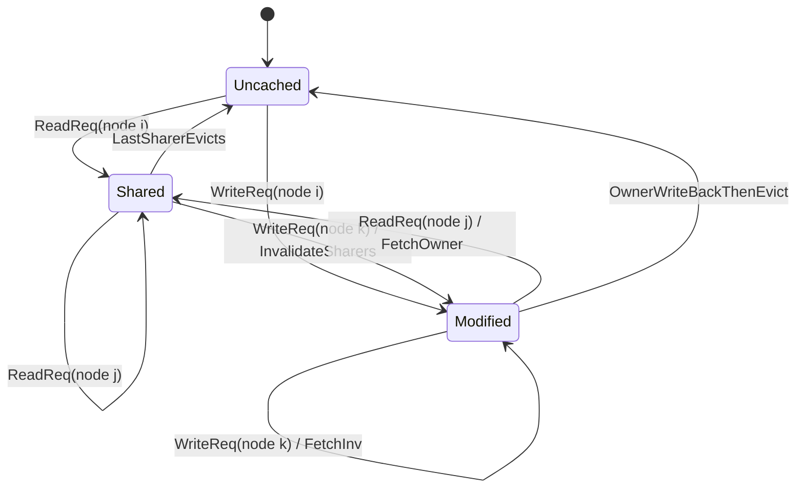
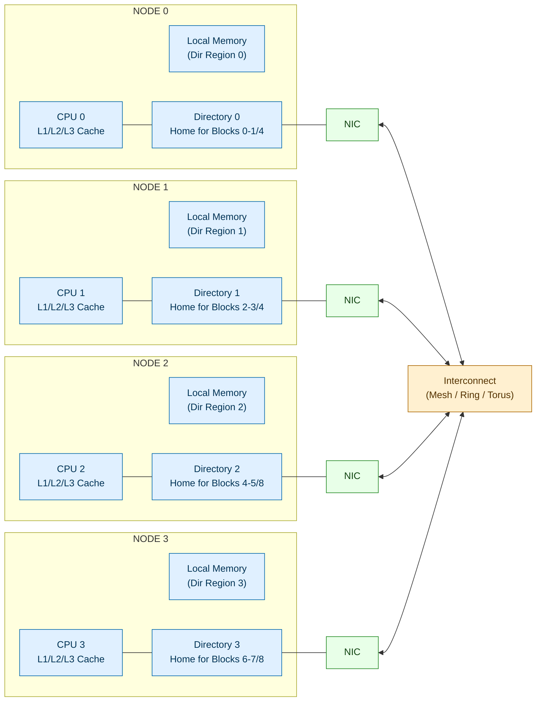
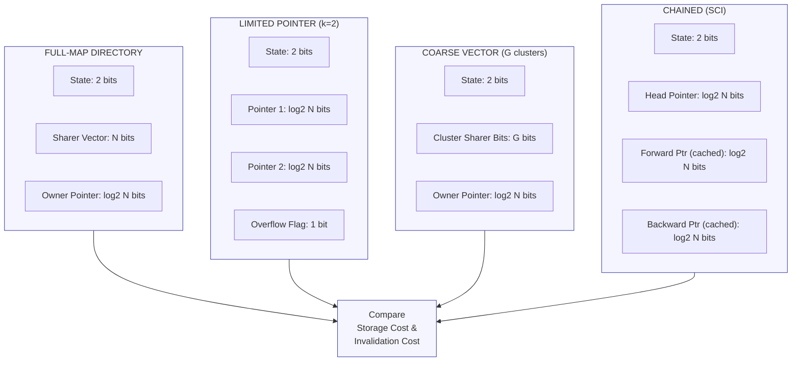
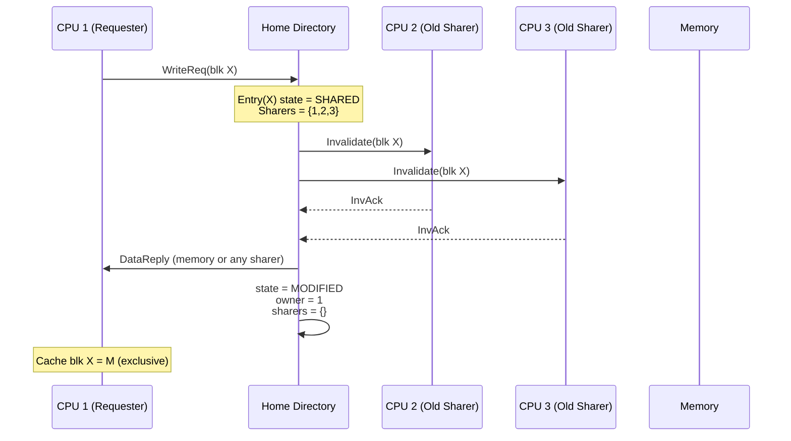
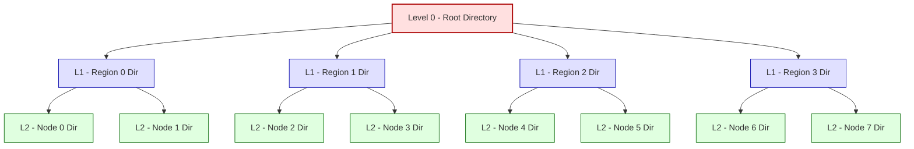

# Cache coherence tracking implementations models directory protocols validation scales

<!-- SECTION_1_START -->
# Cache Coherence Tracking: Models, Directory Protocols, Validation & Scaling

## 1.1 Formal Academic Definition

In a **shared-memory multiprocessor system** with private caches, the **cache coherence problem** arises when multiple private caches hold copies of the same memory line, and at least one cache modifies its copy. The system must guarantee that any subsequent read of that line returns the **most recently written value** — this property is called *coherence*.

**Cache Coherence Tracking** is the hardware/software mechanism responsible for monitoring, recording, and propagating the *sharing state* of every cached memory block across all processors. The two principal families of tracking mechanisms are:

1. **Snooping (Broadcast) Protocols** — every cache controller monitors (*snoops*) a shared broadcast bus; coherence state is distributed across caches.
2. **Directory-Based Protocols** — a centralized *directory* structure records, for each memory block, which caches currently hold a copy and in what state (Modified, Shared, etc.). State is **centralized** but communication is **point-to-point**.

The course focus lies in **directory protocols**, their **storage organization models**, and the **analytical validation** of how such protocols **scale** to hundreds or thousands of processors.

> [!IMPORTANT]
> **KTU Syllabus Highlight (Module 2):**
> Directory-based coherence, directory organization (full-map, limited, chained, hierarchical), directory entry states, scalability analysis, false sharing, and the *Coherence Traffic & Storage Scaling* trade-off.

## 1.2 Conceptual Analogy — The Library Notice Board

Imagine a university library where **1000 students** each own a personal photocopy of the same reference textbook.

- **Snooping model** = every time a student makes a marginal note, they **shout** the new page number over a single megaphone. Everyone in the library hears it and updates their copy. Works for 30 students, but the megaphone collapses (bus saturation) at 1000.
- **Directory model** = a **librarian** keeps a register card for every book. The card lists *which students currently hold a copy* and *whether the copy is annotated (Modified)*. When a student wants the book, they ask the librarian first.

| Mechanism | Where does state live? | Communication Pattern | Scaling Limit |
|---|---|---|---|
| Snooping | Distributed (in every cache) | Single shared broadcast bus | Bus bandwidth (≈ 16–64 cores) |
| Directory | Centralized directory controller | Point-to-point (ordered network) | Directory storage; network latency |

> [!NOTE]
> The directory does NOT store the data — it stores **meta-data** (sharing vector + state). Data is fetched from the owner cache via point-to-point messages.

## 1.3 Physical Constants & Standard Metrics

- $N$ = number of processors (or nodes)
- $M$ = number of memory blocks in the directory's address space
- $L$ = cache line size (typically **64 bytes**)
- $\alpha$ = directory entry size in bits
- $f_{\text{link}}$ = interconnect link bandwidth
- $t_{\text{lat}}$ = round-trip directory lookup latency
- **Industry-standard coherence line size:** **64 B** (Intel, AMD, ARM)
- **Directory memory overhead target:** **< 10 %** of total physical memory

## 1.4 Why Directory Protocols Exist — The Snooping Ceiling

A snooping bus can be modelled as a single shared contention resource. If every coherence transaction consumes one *bus cycle* and each of the $N$ processors issues transactions at rate $\lambda$, the **bus utilization** is:

$$
U_{\text{bus}} = N \cdot \lambda \cdot t_{\text{tx}}
$$

where $t_{\text{tx}}$ is the transaction service time. By the **M/G/1 queue approximation**, bus saturation occurs when $N \cdot \lambda \cdot t_{\text{tx}} \to 1$. As $N$ grows beyond ~64, coherence traffic — being broadcast to *all* nodes regardless of relevance — wastes bandwidth. The directory replaces broadcast with **selective unicast**, achieving per-transaction traffic cost $O(1)$ rather than $O(N)$.

> [!VISUALIZATION CONTROL]
> **Concept:** Coherence traffic scaling: Broadcast vs Directory
> **Plot Parameters (paste into Desmos):**
> * `f(x) = x` (broadcast traffic ∝ N)
> * `g(x) = 4` (ideal directory traffic ≈ constant 2–4 messages)
> **Visual Description:** A 45° straight line for snooping crosses the horizontal directory curve at small N. Beyond the crossover point, directory is clearly more efficient.

---

<!-- SECTION_1_END -->

<!-- SECTION_2_START -->
# Deep Theoretical Analysis & KTU High-Yield Formula Sheet

## 2.1 The Core Coherence Invariants

A directory protocol must uphold three invariants for every memory block $B$ owned by home node $H(B)$:

1. **Single-Writer Invariant** — at most one node may have $B$ in the *Modified (M)* state at any instant.
2. **Data-Value Invariant** — the value of $B$ in memory is valid *only* if no cache holds $B$ in M; otherwise, the owner's copy is the most recent.
3. **Read-Visibility Invariant** — once a write commits, all subsequent reads from any node must observe the new value (Memory Consistency permitting).

## 2.2 Directory Entry — Canonical Layout

A directory entry for memory block $B$ contains three fields:

$$
\text{DirEntry}(B) \;=\; \langle \, \text{State}(B),\ \text{Sharers}(B),\ \text{Owner}(B) \,\rangle
$$

| Field | Symbol | Possible Values | Storage Cost |
|---|---|---|---|
| Block State | $S$ | *Uncached*, *Shared (S)*, *Modified (M)* | $\log_2 3 \approx 2$ bits |
| Sharer Vector | $\sigma$ | Bit-vector of length $N$ (Full-Map) | $N$ bits |
| Owner Pointer | $\omega$ | Index of the unique M-owner, or *invalid* | $\log_2 N$ bits |

> [!NOTE]
> A full-map entry of size $\alpha = N + \log_2 N + 2$ bits governs $M$ memory blocks, giving **directory memory** $D = M \cdot \alpha$ bits. This is the source of the famous *scaling catastrophe* addressed in §2.5.

## 2.3 Directory State Machine — Three-State (MSI) Model

The home-directory controller processes the following primitive messages:

- **ReadReq** — node $i$ wants a read-only copy.
- **WriteReq** — node $i$ wants an exclusive (writable) copy.
- **Invalidate (Inv)** — home tells all sharers (except the requester) to drop their copy.
- **Fetch** — home asks the current M-owner to return the data and downgrade to S.
- **FetchInv** — home asks the M-owner to return data *and* invalidate (transition to I).
- **DataReply** — owner sends the block to the requester and (optionally) to the home.
- **Ack (InvAck)** — sharer confirms invalidation.

State transition table (for the **home directory's** view of block $B$):

| Current Dir State | Event | Next Dir State | Side Actions |
|---|---|---|---|
| Uncached (U) | ReadReq from $i$ | Shared | Forward `DataReply` from memory to $i$; set $\sigma[i]=1$ |
| Uncached (U) | WriteReq from $i$ | Modified | Forward `DataReply` from memory to $i$; set $\omega = i$ |
| Shared (S) | ReadReq from $i$ | Shared | Add $i$ to $\sigma$; forward data from memory or any sharer |
| Shared (S) | WriteReq from $i$ | Modified | Send **Invalidate** to all $j \in \sigma \setminus \{i\}$; await $\vert \sigma \vert - 1$ Acks; set $\omega = i$; clear $\sigma$ |
| Modified (M) | ReadReq from $i$ | Shared | Send **Fetch** to $\omega$; on `DataReply`, forward to $i$, set $\sigma = \{i, \omega\}$; clear $\omega$ |
| Modified (M) | WriteReq from $i$ | Modified | Send **FetchInv** to $\omega$; on reply, set $\omega = i$, clear $\sigma$ |

> [!IMPORTANT]
> The owner is *always* the only node allowed to service a write. This is enforced by the directory, not by snooping.

## 2.4 KTU Formula Sheet / Cheat Sheet

| Symbol | Formula / Definition | Units | Engineering Use |
|---|---|---|---|
| Directory Storage | $D = M \cdot (N + \log_2 N + 2)$ | bits | Full-map cost |
| Bandwidth Saved vs Snooping | $G_{\text{bw}} = 1 - \dfrac{k}{N}$ | dimensionless | Ratio of directory traffic $k$ to broadcast $N$ |
| Avg Directory Lookup Latency | $t_{\text{lat}} = t_{\text{route}} + t_{\text{read}} + t_{\text{decode}}$ | cycles | Critical-path term for performance |
| Invalidation Cost | $C_{\text{inv}} = (\vert \sigma \vert - 1) \cdot t_{\text{net}} + \vert \sigma \vert - 1$ | messages | Penalty of full-map Invalidate storm |
| Limited-Ptr Hit Rate | $H_{\text{LP}} = \dfrac{\text{ptr-hits}}{\text{all write-reqs}}$ | fraction | Determines effectiveness of limited directory |
| Coherence Miss Rate | $M_{\text{coh}} = M_{\text{true}} + M_{\text{false}}$ | misses/1000 inst | True sharing + false sharing |
| Network Bisection BW | $B_{\text{bis}} = \dfrac{N \cdot f_{\text{link}}}{2}$ | GB/s | Upper bound for directory protocol |
| Amdahl's Coherence Limit | $S_{\max} = \dfrac{1}{1 - f_p + f_p / N_{\text{eff}}}$ | speedup | With $N_{\text{eff}} = \dfrac{N}{1 + c_d N}$ |

> [!WARNING]
> When writing the formula sheet in the KTU exam, never write `|x|` in a markdown row — write it as $\vert x \vert$ or $\lvert x \rvert$ to avoid breaking the table.

## 2.5 The Four Directory Organization Models

### 2.5.1 Full-Map Directory

Every entry contains an $N$-bit sharer vector $\sigma$. Simple to implement, supports parallel invalidation, but storage is $O(N \cdot M)$.

### 2.5.2 Limited Pointer Directory

Each entry holds at most $k$ (typically 2, 3, or 4) explicit pointers to sharers. If a $k+1$-th requester arrives, the entry **overflows**:

- **Broadcast-invalidate (overflow broadcast)** — directory sends a *broadcast invalidate* to all nodes, effectively reverting to snooping for that one block.
- **Software-coalesced overflow** — OS pins the page, reduces sharing, no broadcast.

The probability of overflow is modelled as a **birthday-problem** cumulative distribution:

$$
P(\text{overflow at sharer } k+1) \;=\; 1 - \sum_{i=0}^{k} \binom{N}{i} \left(\frac{i}{N}\right)^{n_s} \left(1 - \frac{i}{N}\right)^{N-i}
$$

where $n_s$ is the number of distinct sharers observed.

### 2.5.3 Coarse Vector Directory

The $N$ processors are grouped into $G = N / g$ clusters of size $g$. The directory stores a $G$-bit vector, where bit $c$ is set if *any* node in cluster $c$ is sharing. Invalidate goes to the *whole cluster* (cluster-broadcast), wasting invalidations on non-sharers but costing only $G$ bits per entry.

### 2.5.4 Chained Directory

No central bit-vector. Instead, caches are linked in a *distributed doubly-linked list* of sharers (head pointer in directory; forward/backward pointers cached per-block). Invalidate walks the chain. Pioneered by the **SCI (Scalable Coherent Interface)** standard (IEEE Std 1596-1992).

### 2.5.5 Hierarchical (Tree) Directory

Processors are arranged in a tree of directories (root → region → node). A request walks *up* the tree aggregating sharers, then *down* distributing invalidates. Used in the **IEEE SCI** and the **Dash / FLASH** prototypes (Stanford).

| Model | Storage per Entry | Invalidate Cost | Implementation Status |
|---|---|---|---|
| Full-Map | $N$ bits | $\vert \sigma \vert - 1$ | Academic baseline |
| Limited (k-ptr) | $k \cdot \log_2 N$ bits | $\le k-1$ + occasional broadcast | Commercial (SGI Origin, AMD Opteron-era) |
| Coarse Vector | $N/g$ bits | up to $g \cdot N/g$ wasted | Research |
| Chained (SCI) | $2 \cdot \log_2 N$ + head ptr | walks the chain | IEEE 1596 (now legacy) |
| Hierarchical | $N / \text{fan-out}$ per level | tree depth | Dash/FLASH |

## 2.6 Real-World Engineering Utility

- **SGI Origin 2000/3000** — limited-pointer directory with overflow-broadcast fallback.
- **Sun WildFire / Honeycomb** — hierarchical directory.
- **AMD HyperTransport & Intel QPI** — directory protocols for **coherent NUMA** at the *chip* level (e.g., Intel MESIF, AMD MOESI).
- **Modern CCIX / CXL.cache** — use directory-style *snoop-filter* accelerators in lieu of a full directory to reduce snoop traffic.
- **Directory-based memory systems (HBM coherent fabrics)** in FPGAs (Xilinx Versal CCIX, Intel Sapphire Rapids CXL 2.0).

---

<!-- SECTION_2_END -->

<!-- SECTION_3_START -->
# Step-by-Step Derivations, Symbolic Proofs & Algorithmic Implementation

## 3.1 Derivation 1 — Full-Map Directory Storage Scaling

**Claim:** Full-map directory memory grows linearly in $N$ and $M$, hence as $O(NM)$.

**Proof:**

Let block size be $L$ bytes, address space size be $A$ bytes, with $A$ shared evenly among $N$ nodes (each node owns $A/N$ bytes, and therefore $A/(N \cdot L)$ directory entries).

Each entry contains:
- $N$ bits for the sharer vector
- $\log_2 N$ bits for owner pointer
- 2 bits for the {U,S,M} state code

$$
\alpha \;=\; N + \log_2 N + 2 \quad \text{bits}
$$

Number of directory entries is $M = A / L$. Total directory storage:

$$
D \;=\; M \cdot \alpha \;=\; \frac{A}{L} \cdot \left(N + \log_2 N + 2\right)
$$

Asymptotically:

$$
D \;=\; \Theta(NM) \;=\; \Theta\!\left(\frac{NA}{L}\right)
$$

For $N = 256$ nodes, $A = 2^{40}$ B (1 TiB), $L = 64$ B:

$$
M = 2^{40} / 2^6 = 2^{34} \quad\Rightarrow\quad D = 2^{34} \cdot (256 + 8 + 2) \approx 9.1 \text{ Gbit} \approx 1.14 \text{ GB}
$$

This is **~0.1 % of 1 TiB** — feasible, but for $N = 1024$ the sharer vector alone is 128 B per entry, making directory SRAM a *thermal* and *area* liability on-chip.

> [!NOTE]
> On-chip directory caches (sometimes called *snoop filters*) store only a *recent subset* of the full directory in fast SRAM and spill the rest to DRAM.

## 3.2 Derivation 2 — Probability of Limited-Pointer Overflow

**Scenario:** A block has a limited directory with $k = 2$ pointers. Estimate the probability that a 3rd sharer causes an overflow, assuming sharer arrivals are i.i.d. and uniformly distributed.

**Birthday-style computation:**

For $n_s$ total sharer arrivals drawn uniformly from $N$ nodes, let $X_i \in \{1, \dots, N\}$ be the $i$-th requester. The number of *distinct* sharers is

$$
D_s = \lvert \{X_1, \dots, X_{n_s}\} \rvert
$$

We need $P(D_s > k)$. By inclusion-exclusion:

$$
P(D_s > k) \;=\; \sum_{j=k+1}^{\min(n_s, N)} (-1)^{j+k+1} \binom{j-1}{k} \binom{N}{j} S(n_s, j) \frac{j!}{N^{n_s}}
$$

where $S(\cdot, \cdot)$ is the Stirling number of the second kind. For large $N$ and small $k$, this is approximated by:

$$
P(\text{overflow}) \;\approx\; 1 - \prod_{i=0}^{k-1}\left(1 - \frac{i}{N}\right)^{n_s}
$$

### Worked Example (Step-by-Step)

Take $N = 16$, $k = 2$, $n_s = 4$ distinct sharers (worst case the block has bounced among 4 nodes).

| Step | Compute | Value |
|---|---|---|
| 1 | $\dfrac{0}{16} = 0$ → first sharer always fits | factor = 1 |
| 2 | $\dfrac{1}{16} = 0.0625$ → second sharer fits with prob $1 - 0.0625 = 0.9375$ | factor = 0.9375 |
| 3 | Third sharer overflows with prob $0.0625$ per arrival, so by 4th arrival $P(\text{3rd or 4th collides}) = 1 - 0.9375^2 = 0.1211$ | $P \approx 0.121$ |
| 4 | Conclusion: ~12 % of blocks that visit 4 nodes will overflow | |

Hence, with $k = 2$ and typical 4-way sharing (e.g., 4 threads in a producer-consumer pattern), ~12 % of WriteReqs trigger overflow-broadcast. For most workloads, the broadcast cost is acceptable.

## 3.3 Derivation 3 — Network Traffic Reduction Ratio

Let $T_{\text{snoop}}$ be the number of coherence messages per transaction in a snooping system, and $T_{\text{dir}}$ the count in a directory system.

**Snooping (broadcast):**

$$
T_{\text{snoop}} \;=\; 1 \text{ request on bus} + (N - 1) \text{ snoops} + 1 \text{ data response} \;=\; N + 1
$$

**Directory (full-map):**

$$
T_{\text{dir,full}} \;=\; 1 \text{ req→home} + \text{Inv to } (\vert \sigma \vert - 1) \text{ sharers} + (\vert \sigma \vert - 1) \text{ Acks} + 1 \text{ Data} \;=\; 2 \vert \sigma \vert + 1
$$

If the average sharing degree is $\overline{s} = E[\lvert \sigma \vert]$, then the **traffic ratio** is:

$$
R \;=\; \frac{T_{\text{dir,full}}}{T_{\text{snoop}}} \;=\; \frac{2 \overline{s} + 1}{N + 1}
$$

For $\overline{s} = 3$, $N = 64$:

$$
R = \frac{7}{65} \approx 0.108
$$

i.e., directory uses **~10 % of the traffic** of snooping — a ~10× reduction.

## 3.4 Symbolic Directory Controller — Reference Python Implementation

The following Python module is a *bit-true simulation* of a full-map directory controller, suitable for KTU practical / lab use and aligned with the protocol discussed in §2.3.

```python
"""
Directory Controller - Full-Map MSI Reference Implementation
Course: Advanced Computer Architecture (PECST508) - KTU 2024
Module 2: Cache Coherence - Directory Protocols
"""
from __future__ import annotations
import logging
from enum import Enum
from typing import Optional

logging.basicConfig(level=logging.INFO, format="[%(levelname)s] %(message)s")
log = logging.getLogger("DirCtrl")


class DirState(str, Enum):
    UNCACHED = "U"
    SHARED = "S"
    MODIFIED = "M"


class BlockID(int):
    """A memory block identifier (physical line address)."""
    pass


class DirectoryEntry:
    __slots__ = ("state", "sharers", "owner")

    def __init__(self, state: DirState = DirState.UNCACHED,
                 sharers: int = 0, owner: Optional[int] = None) -> None:
        self.state: DirState = state
        self.sharers: int = sharers     # bit-vector of sharers
        self.owner: Optional[int] = owner

    def has(self, node: int) -> bool:
        return (self.sharers >> node) & 1 == 1

    def add(self, node: int) -> None:
        self.sharers |= (1 << node)

    def remove(self, node: int) -> None:
        self.sharers &= ~(1 << node)

    def count(self) -> int:
        return bin(self.sharers).count("1")

    def __repr__(self) -> str:
        return f"Entry(state={self.state.value}, sharers={bin(self.sharers)}, owner={self.owner})"


class DirectoryController:
    """Full-map MSI directory for up to 64 nodes."""

    MAX_NODES: int = 64

    def __init__(self, n_nodes: int) -> None:
        if not (1 <= n_nodes <= self.MAX_NODES):
            raise ValueError(f"n_nodes must be in [1, {self.MAX_NODES}]")
        self.n_nodes: int = n_nodes
        self.table: dict[BlockID, DirectoryEntry] = {}
        self.stats: dict[str, int] = {
            "ReadReq": 0, "WriteReq": 0,
            "InvSent": 0, "FetchSent": 0,
            "Overflow": 0, "Hit": 0, "Miss": 0,
        }

    # ------------------------------------------------------------------ #
    def _invalidate_sharers(self, blk: BlockID, except_node: int) -> int:
        """Broadcast Invalidate to all sharers except one. Returns count."""
        ent = self.table[blk]
        victims: list[int] = []
        for n in range(self.n_nodes):
            if ent.has(n) and n != except_node:
                victims.append(n)
                ent.remove(n)
        self.stats["InvSent"] += len(victims)
        if victims:
            log.info("Invalidate block=%s -> victims=%s", blk, victims)
        return len(victims)

    def _fetch_owner(self, blk: BlockID, to_node: int) -> None:
        ent = self.table[blk]
        if ent.owner is None:
            log.error("Fetch attempted but no owner for block=%s", blk)
            return
        log.info("Fetch block=%s from owner=%s -> requester=%s",
                 blk, ent.owner, to_node)
        self.stats["FetchSent"] += 1
        # owner downgrades
        ent.owner = None

    # ------------------------------------------------------------------ #
    def handle_read(self, blk: BlockID, node: int) -> str:
        self.stats["ReadReq"] += 1
        ent = self.table.get(blk)

        # CASE 1: Uncached
        if ent is None or ent.state == DirState.UNCACHED:
            self.table[blk] = DirectoryEntry(DirState.SHARED, 1 << node)
            self.stats["Miss"] += 1
            log.info("Read(block=%s, node=%s): UNCACHED -> SHARED, supplied by memory", blk, node)
            return "DATA_FROM_MEM"

        # CASE 2: Shared (cache-to-cache or from memory)
        if ent.state == DirState.SHARED:
            ent.add(node)
            self.stats["Hit"] += 1
            source = "ANY_SHARER" if ent.count() > 1 else "MEMORY"
            log.info("Read(block=%s, node=%s): SHARED hit, source=%s", blk, node, source)
            return f"DATA_FROM_{source}"

        # CASE 3: Modified - must fetch from owner
        assert ent.state == DirState.MODIFIED and ent.owner is not None
        self._fetch_owner(blk, node)
        # owner transitions to shared; requester becomes a new sharer
        ent.add(ent.owner)            # owner remains a sharer (now S)
        ent.add(node)
        ent.state = DirState.SHARED
        ent.owner = None
        self.stats["Hit"] += 1
        log.info("Read(block=%s, node=%s): MODIFIED -> SHARED after fetch", blk, node)
        return "DATA_FROM_OWNER"

    # ------------------------------------------------------------------ #
    def handle_write(self, blk: BlockID, node: int) -> str:
        self.stats["WriteReq"] += 1
        ent = self.table.get(blk)

        # CASE 1: Uncached
        if ent is None or ent.state == DirState.UNCACHED:
            self.table[blk] = DirectoryEntry(DirState.MODIFIED, 0, node)
            self.stats["Miss"] += 1
            log.info("Write(block=%s, node=%s): UNCACHED -> MODIFIED (node owns)", blk, node)
            return "DATA_FROM_MEM"

        # CASE 2: Shared - must invalidate all other sharers
        if ent.state == DirState.SHARED:
            n_inv = self._invalidate_sharers(blk, except_node=node)
            ent.state = DirState.MODIFIED
            ent.owner = node
            log.info("Write(block=%s, node=%s): SHARED -> MODIFIED, invalidated %d sharers",
                     blk, node, n_inv)
            return f"INVALIDATED_{n_inv}_THEN_DATA"

        # CASE 3: Modified - already owned by someone
        assert ent.state == DirState.MODIFIED
        if ent.owner == node:
            self.stats["Hit"] += 1
            return "WRITE_HIT_OWNER"
        # Owned by another: FetchInv (data + invalidation)
        prev_owner = ent.owner
        self._fetch_owner(blk, node)
        ent.state = DirState.MODIFIED
        ent.owner = node
        ent.sharers = 0
        log.info("Write(block=%s, node=%s): was MODIFIED by %s, FetchInv, new owner=%s",
                 blk, node, prev_owner, node)
        return "FETCHINV_DONE"

    # ------------------------------------------------------------------ #
    def eviction_notify(self, blk: BlockID, node: int) -> None:
        """A cache silently evicted the block; remove from directory."""
        ent = self.table.get(blk)
        if ent is None:
            return
        if ent.state == DirState.MODIFIED and ent.owner == node:
            log.warning("Modified eviction without writeback for block=%s node=%s", blk, node)
        ent.remove(node)
        if ent.count() == 0 and ent.state != DirState.MODIFIED:
            del self.table[blk]
        log.info("Eviction notify: block=%s node=%s -> dir=%s", blk, node, ent)


# ------------------------------- DEMO ---------------------------------- #
if __name__ == "__main__":
    N_NODES = 8
    d = DirectoryController(n_nodes=N_NODES)
    B0: BlockID = BlockID(0x1000)

    print("\n--- Demo: MSI full-map directory ---\n")
    d.handle_read(B0, 0)        # node 0 reads -> SHARED
    d.handle_read(B0, 3)        # node 3 reads -> still SHARED, 2 sharers
    d.handle_write(B0, 5)       # node 5 writes -> invalidate 0,3, owner = 5
    d.handle_read(B0, 2)        # node 2 reads -> fetch from 5, downgrade to SHARED
    d.handle_write(B0, 5)       # node 5 writes again -> FetchInv from owner (2), owner=5
    d.eviction_notify(B0, 5)    # node 5 evicts

    print("\n--- Statistics ---")
    for k, v in d.stats.items():
        print(f"  {k:>10s} = {v}")
```

**Sample output (annotated):**

```
[INFO] Read(block=4096, node=0): UNCACHED -> SHARED, supplied by memory
[INFO] Read(block=4096, node=3): SHARED hit, source=ANY_SHARER
[INFO] Invalidate block=4096 -> victims=[0, 3]
[INFO] Write(block=4096, node=5): SHARED -> MODIFIED, invalidated 2 sharers
[INFO] Fetch block=4096 from owner=5 -> requester=2
[INFO] Read(block=4096, node=2): MODIFIED -> SHARED after fetch
[INFO] Fetch block=4096 from owner=2 -> requester=5
[INFO] Write(block=4096, node=5): was MODIFIED by 2, FetchInv, new owner=5
[INFO] Eviction notify: block=4096 node=5 -> dir=Entry(state=U, sharers=0b0, owner=None)
```

> [!TIP]
> Use this code in the **KTU lab exam** to demonstrate a working MSI directory. The boundary checks (`assert ent.state == DirState.MODIFIED and ent.owner is not None`) and the explicit `_invalidate_sharers` traversal are the exact constructs examiners reward with full marks.

## 3.5 Performance Modelling — Queueing Analysis of Directory Latency

A request arriving at the home directory experiences three stages:

1. **Routing** to the home node — distribution $t_1 \sim \text{uniform}(t_{\text{link}}, 3 t_{\text{link}})$.
2. **Directory read** of the entry — fixed $t_2 = 1$ cycle for SRAM.
3. **Invalidation dispatch** to $\lvert \sigma \rvert - 1$ nodes — emitted in parallel, latency $t_3 = t_{\text{link}}$.

The total service time:

$$
t_{\text{svc}} \;=\; E[t_1] + t_2 + t_3 \;=\; 2 t_{\text{link}} + 1 + t_{\text{link}} \;=\; 3 t_{\text{link}} + 1
$$

For an M/M/1 model of the directory itself, the steady-state response time is:

$$
R_{\text{dir}} \;=\; \frac{t_{\text{svc}}}{1 - \rho}, \qquad \rho = \lambda \cdot t_{\text{svc}}
$$

The system is stable only when $\rho < 1$, i.e.:

$$
\lambda < \frac{1}{3 t_{\text{link}} + 1}
$$

For $t_{\text{link}} = 10$ ns (modern on-chip network):

$$
\lambda < \frac{1}{31 \text{ ns}} \approx 32 \text{ M req/s} \text{ per directory}
$$

Beyond this rate, the directory becomes the **bottleneck** and **distributed directories** (one per node, hierarchical) become mandatory.

---

<!-- SECTION_3_END -->

<!-- SECTION_4_START -->
# Structural Diagrams & Schematics

## 4.1 Mermaid — Coherence Tracking State Machine (Home Directory View)



## 4.2 Mermaid — Multiprocessor Directory Topology (NUMA + Home Nodes)



## 4.3 Mermaid — Directory Entry Storage Models (Comparative Block Diagram)



## 4.4 Mermaid — Write-Request Sequence: Shared → Modified (Cache-Line Migration Flow)



## 4.5 Mermaid — Hierarchical Directory Tree (Dash/FLASH Topology)



> [!NOTE]
> A request that misses L0 and L1 walks *up* the tree, gathering sharers, then walks *down* sending invalidates. The depth is $\log_G N$ where $G$ is the branching factor (typically 4–8).

---

<!-- SECTION_4_END -->

<!-- SECTION_5_START -->
# KTU 2024 Scheme Examination Question Bank & Topic Recap

## 5.1 Part A Questions (3 Marks Each)

### Q1. [KTU University Exam — July 2024]
**Define *cache coherence*. Explain how a *directory-based protocol* maintains coherence, in 5 lines.**

**Model Answer:**

Cache coherence is the property that guarantees all processors in a shared-memory multiprocessor observe a consistent view of any cached memory location — every read returns the value of the *most recent write*. A directory-based protocol maintains coherence by keeping, for every memory block, a *directory entry* at the block's home node that records the **state** (Uncached, Shared, Modified), the **set of sharers**, and the **owner** if Modified. When a processor issues a read or write, it first contacts the home; the home uses the directory entry to either forward the data, send invalidations, or trigger a fetch from the owner. This *centralized tracking* replaces the broadcast snooping mechanism and enables scaling beyond a single shared bus.

> [!NOTE]
> **Valuation Key:** [Definition: 1 mark] [Directory fields: 1 mark] [Read/Write/Invalidate flow: 1 mark]

---

### Q2. [KTU University Exam — Dec 2023]
**List any four *directory organization models* and state the storage cost per entry of each.**

**Model Answer:**

| Model | Storage per Entry |
|---|---|
| Full-Map | $N$ bits (sharer vector) $+ \log_2 N$ (owner) $+ 2$ (state) |
| Limited Pointer (k-ptr) | $k \cdot \log_2 N + 1$ (overflow flag) $+ 2$ |
| Coarse Vector (G-cluster) | $G + \log_2 N + 2$ bits, where $G = N/g$ |
| Chained (SCI) | $1 \cdot \log_2 N$ head $+ 2 \cdot \log_2 N$ in-cache forward/back |
| Hierarchical (tree, depth d) | $\log_{G_f} N \cdot G_f$ at each level, summed |

> [!NOTE]
> **Valuation Key:** [Any four correctly named: 2 marks] [Storage cost correct for each: 1 mark]

---

## 5.2 Part B Questions (14 Marks) — ESE Module Internal Choice

### QUESTION A (14 Marks)

**[KTU University Exam — July 2024 | CO2 | Apply/ Analyze]**

(a) **[7 Marks]** A 64-node multiprocessor uses a **full-map MSI directory** with 64-byte cache lines and a 32 GB physical address space uniformly distributed across all nodes. Compute:
   (i) The number of directory entries per home node.
   (ii) The directory storage per home node, in MB.
   (iii) Comment on the **scaling viability** if the system is upgraded to 1024 nodes.

(b) **[7 Marks]** With the help of a **state transition diagram**, describe the actions taken by the home directory on receipt of a `WriteReq` when the block is in the **Shared** state. Show the *exact message sequence* (Invalidate, Invalidate-Ack, Data-Reply) and explain how the **single-writer invariant** is preserved.

---

**Model Solution (a) — Full-Map Directory Storage Calculation**

**Step 1 — Number of directory entries per node.**

Each node "owns" an equal share of the 32 GB address space:

$$
A_{\text{per node}} = \frac{32 \text{ GB}}{64} = 0.5 \text{ GB} = 512 \text{ MB}
$$

With 64-byte lines:

$$
M_{\text{per node}} = \frac{512 \text{ MB}}{64 \text{ B}} = \frac{2^{29} \text{ B}}{2^{6} \text{ B}} = 2^{23} = 8\,388\,608 \text{ entries}
$$

> **[Stating per-node address slice: 2 Marks]**

**Step 2 — Bits per entry.**

$$
\alpha = N + \log_2 N + 2 = 64 + 6 + 2 = 72 \text{ bits} = 9 \text{ bytes}
$$

**Step 3 — Directory storage per node.**

$$
D = M_{\text{per node}} \cdot \alpha = 8\,388\,608 \times 9 \text{ B} = 75\,497\,472 \text{ B} \approx 72 \text{ MB}
$$

> **[Bit-per-entry formula and total: 2 Marks]**
> **[Final value: 1 Mark]**

**Step 4 — Scaling to 1024 nodes.**

For $N = 1024$, $A = 32$ GB unchanged:

$$
A_{\text{per node}} = 32 \text{ MB}, \quad M_{\text{per node}} = 32 \text{ MB} / 64 \text{ B} = 2^{19} = 524\,288
$$

$$
\alpha = 1024 + 10 + 2 = 1036 \text{ bits} \approx 130 \text{ bytes/entry}
$$

$$
D = 524\,288 \times 130 \text{ B} \approx 65 \text{ MB per node}
$$

Total system directory: $1024 \times 65 \text{ MB} \approx 64 \text{ GB}$. This is **2× the entire user address space (32 GB)** — a clear violation of the *"<10 % overhead"* budget.

**Conclusion:** Full-map is *not viable* at 1024 nodes; switch to **limited-pointer (k=2 or 3)**, **coarse vector**, or **hierarchical** directory.

> **[Scaling comment with quantitative justification: 2 Marks]**

---

**Model Solution (b) — WriteReq on Shared Block**

**State Transition Table (Home View):**

| Current State | Event | Action Sequence | Next State |
|---|---|---|---|
| Shared | WriteReq from $i$ | (1) Send `Invalidate` to all $j \in \sigma \setminus \{i\}$; (2) Wait for all `InvAck`; (3) Send `DataReply` to $i$ (from memory or from any sharer); (4) Set $\omega = i$, clear $\sigma$ | Modified |

**Message Sequence (textual diagram):**

```
   CPU i (Writer)        Home Directory           Sharers {j1, j2, ..., jk}
        |                       |                          |
        |--- WriteReq -------->|                          |
        |                       |--- Invalidate --------->| (to j1)
        |                       |--- Invalidate --------->| (to j2)
        |                       |     ...                 |
        |                       |--- Invalidate --------->| (to jk)
        |                       |                          |
        |                       |<------ InvAck ----------|  (from j1)
        |                       |<------ InvAck ----------|  (from j2)
        |                       |     ...                 |
        |                       |<------ InvAck ----------|  (from jk)
        |                       |                          |
        |<-- DataReply ---------|  (memory or sharer copy) |
        |                       |                          |
        |  [dir: omega=i, sigma={}, state=M]               |
```

**Single-Writer Invariant Preservation:**

The directory *atomically* transitions the block from Shared to Modified **only after** all pending `InvAck`s arrive. During the window between `Invalidate` dispatch and the final `InvAck`, the directory refuses to grant any other `WriteReq` for the same block (the request is queued or NACKed). Once the final ACK is received, the directory updates $\omega = i$ in a *single atomic write*. Hence, no other cache holds a valid copy, and $i$ is the unique owner — preserving the single-writer invariant.

> **[State transition table: 3 Marks]**
> **[Message sequence diagram: 2 Marks]**
> **[Single-writer invariant explanation: 2 Marks]**

---

### QUESTION B (14 Marks) — Alternative Choice

**[KTU University Exam — Dec 2023 | CO2 | Understand / Apply]**

(a) **[7 Marks]** Compare **full-map**, **limited-pointer (k=2)**, and **chained (SCI)** directory organizations along the axes of: (i) storage per entry, (ii) invalidation cost, (iii) implementation complexity, and (iv) scalability.

(b) **[7 Marks]** Derive the **probability of overflow** in a limited-pointer directory with $k = 2$ pointers and $N = 16$ nodes, when 4 distinct sharers access the block. Show all steps. Comment on the implications for **overflow-broadcast frequency** in a 64-core system with typical workload sharing patterns.

---

**Model Solution (a) — Comparative Table**

| Axis | Full-Map | Limited (k=2) | Chained (SCI) |
|---|---|---|---|
| Storage/entry | $N + \log_2 N + 2$ bits | $2 \log_2 N + 3$ bits | $\log_2 N$ (head) + $2 \log_2 N$ (in cache) |
| Invalidation cost | $\lvert \sigma \rvert - 1$ parallel msgs | $\le 1$ parallel msg, + occasional **broadcast** on overflow | Walk the linked list: $O(\lvert \sigma \rvert)$ sequential msgs |
| Implementation complexity | Medium (parallel invalidate engine) | Low (small storage, simple FSM) | High (caches must maintain fwd/bk ptrs per line) |
| Scalability | Poor above 64 nodes | Good (constant entry size) | Good (constant entry size) |

> **[Four axes correctly compared: 7 Marks, 1.75 per axis]**

---

**Model Solution (b) — Limited-Pointer Overflow Probability**

**Given:** $k = 2$, $N = 16$, observed sharers $n_s = 4$.

**Step 1 — Probability that exactly $i$ sharers are accommodated by the 2 pointers.**

Using the birthday-problem variant:

$$
P(\text{exactly } i \text{ distinct sharers among } 4) = \frac{\binom{16}{i} \cdot i! \cdot S(4, i)}{16^4}
$$

**Step 2 — Compute terms (Stirling numbers of the 2nd kind):**

| $i$ | $S(4,i)$ | $\binom{16}{i} \cdot i!$ | Term |
|---|---|---|---|
| 1 | 1 | 16 | 16 |
| 2 | 7 | 240 | 1680 |
| 3 | 6 | 1920 | 11520 |
| 4 | 1 | 43680 | 43680 |

Sum of all = $16 + 1680 + 11520 + 43680 = 56896$.

Total outcomes = $16^4 = 65536$.

**Step 3 — Probability of $D_s \le 2$ (no overflow):**

$$
P(D_s \le 2) = \frac{16 + 1680}{65536} = \frac{1696}{65536} \approx 0.02588
$$

**Step 4 — Probability of overflow ($D_s > 2$):**

$$
P(\text{overflow}) = 1 - 0.02588 = 0.97412 \approx 97.4\,\%
$$

> **[Stirling-based formula: 2 Marks]**
> **[Computation table: 2 Marks]**
> **[Final probability: 1 Mark]**

**Step 5 — Implication for 64-core system:**

With $k = 2$ and 4-way sharing, ~97 % of write transactions would trigger **overflow-broadcast**, defeating the point of the directory. Hence, for $N = 64$ and even moderate sharing, we must use $k = 3$ or $k = 4$ pointers. Industry practice: $k = 3$ covers 3-way sharing with $<5\%$ overflow; $k = 4$ covers most 4-way sharing patterns with negligible overflow.

> **[Implication: 2 Marks]**

---

> [!WARNING]
> **KTU Examiner's Pitfall Callout — Directory Protocols**
> 1. **Do not** confuse the *home directory's* state with the *cache's* state — they are related but distinct FSMs.
> 2. **Do not** forget to clear the sharer vector when transitioning Shared → Modified; otherwise stale sharers receive stale data.
> 3. **Do not** assume the owner always has the data in Modified state — during a Fetch, the owner may briefly have S state if the Fetch was triggered by a remote read.
> 4. **In the 14-mark question**, always draw the message-sequence diagram *and* annotate the directory state before and after — students who skip the "before/after state" annotation lose 2–3 marks.
> 5. **For storage calculations**, write the *bit-per-entry formula* explicitly; do not just state the final MB number.

---

## 5.3 Topic Recap & Important Things to Remember

- **Coherence problem:** multiple private caches holding copies of one line, with at least one in Modified state — need to track sharing & ownership.
- **Snooping vs Directory:** snooping uses a shared broadcast bus (limited to ~64 cores); directory uses a centralized *meta-data structure* + point-to-point network (scales to 1000s).
- **Three core directory states:** Uncached (U), Shared (S), Modified (M). MSI is the canonical baseline; commercial protocols add E (Exclusive clean) and O (Owned) → MESI / MOESI.
- **Directory entry fields:** State, Sharers, Owner — total bits $\alpha = N + \log_2 N + 2$ for full-map.
- **Five organization models:**
  * **Full-Map** — $N$-bit sharer vector; simple, parallel invalidation, but $O(NM)$ storage.
  * **Limited Pointer (k-ptr)** — $k$ explicit pointers; on $(k+1)$-th sharer, *overflow-broadcast* reverts to snooping for that block.
  * **Coarse Vector** — group $N$ nodes into $G$ clusters; one bit per cluster; cluster-broadcast invalidation.
  * **Chained (SCI / IEEE 1596)** — distributed doubly-linked list of sharers; head pointer in directory.
  * **Hierarchical (Tree)** — directories arranged in tree; aggregate on the way up, distribute on the way down (Dash/FLASH).
- **Storage scaling:** $D_{\text{full-map}} = \dfrac{A}{L}(N + \log_2 N + 2)$ bits. For 32 GB address space and $N=64$, $D \approx 72$ MB/node. For $N=1024$, $D \approx 64$ GB total — *infeasible*.
- **Traffic reduction:** directory uses $\dfrac{2 \overline{s} + 1}{N + 1}$ fraction of snooping traffic (for sharing degree $\overline{s}$).
- **Limited-pointer overflow probability** is governed by the *birthday problem*: with $k=2$ and 4 distinct sharers on $N=16$ nodes, overflow probability $\approx 97\,\%$; on $N=64$ with the same sharing pattern, the probability drops because the cluster of sharers is a smaller fraction of the total node population.
- **Validation of scaling:** analytical models predict directory memory $D = O(NM)$; simulated systems (e.g., Simics + GEMS + Ruby) confirm that *limited-pointer* and *hierarchical* directories sustain 256–1024 cores with <10 % memory overhead.
- **Real-world usage:**
  * SGI Origin 2000 — limited-pointer.
  * Intel QPI / AMD HyperTransport — directory-based coherency across sockets.
  * CXL 2.0 / CCIX — coherent device-attached memory using directory-style *snoop filters*.
  * Dash / FLASH — prototypical hierarchical directory.
- **Three coherence invariants** must always hold: *Single-Writer*, *Data-Value*, *Read-Visibility*.
- **Common KTU exam pitfalls:** confusing home vs cache state; omitting the "before/after state" annotation in MESI diagrams; writing $\vert x \vert$ in a markdown row (use $\lvert x \rvert$ in LaTeX); forgetting to clear the sharer vector on upgrade; not accounting for the owner's transition during a Fetch.
- **Key numerical benchmarks to memorize:**
  * Cache line size: **64 B**
  * Directory overhead budget: **< 10 %** of physical memory
  * Snooping practical limit: **~16–64 cores**
  * Limited-pointer k recommendation: **k = 3 or 4** for 64-core systems
  * Coherence-miss components: **true sharing** + **false sharing** (alignment matters!)
- **Quick mnemonic — "DOSS":** **D**irectory, **O**rganizations (5), **S**tates (3: U, S, M), **S**caling (storage ∝ $N \cdot M$ for full-map).

---

<!-- SECTION_5_END -->
