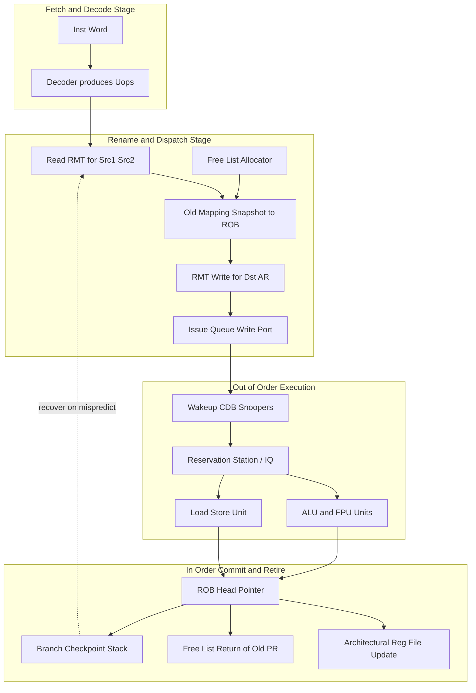
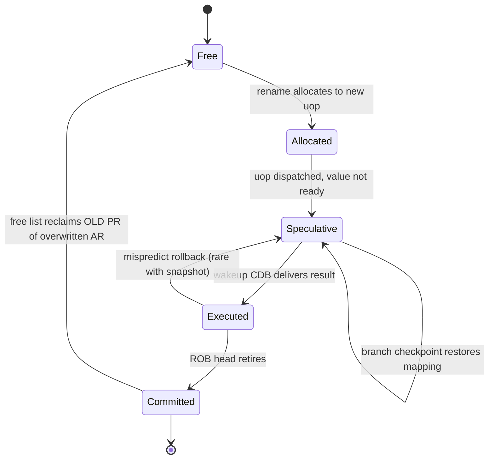
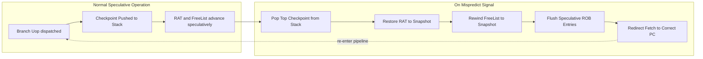
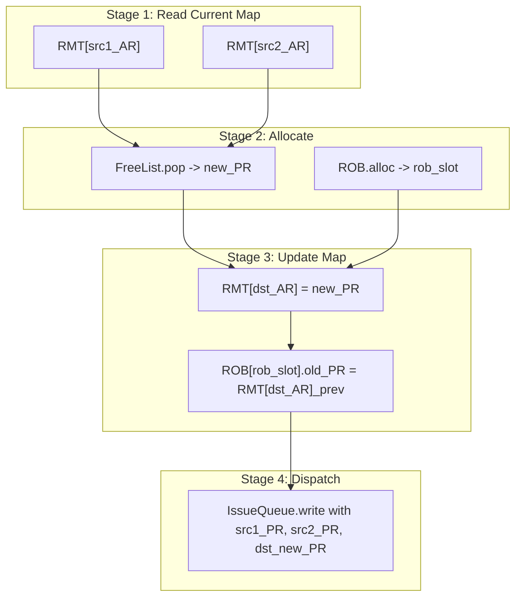

# Dynamic register renaming mechanics tracks processes loops parameters configurations

<!-- SECTION_1_START -->

# Dynamic Register Renaming & Loop Scheduling Mechanics

## 1.1 Formal Academic Definition (KTU 2024 Syllabus Aligned)

> [!NOTE]
> **Dynamic Register Renaming** is a hardware microarchitectural technique employed in out-of-order execution processors that transparently maps the limited set of *architectural registers* (visible to the programmer / ISA) onto a much larger pool of *physical registers* during runtime. Its primary purpose is to dynamically resolve **false data dependencies** — namely *Write-After-Read (WAR)* and *Write-After-Write (WAW)* hazards — while preserving the **true dependency** *Read-After-Write (RAW)*. This enables the scheduler to issue instructions out-of-order without violating the program's original data-flow semantics.

In the KTU 2024 scheme (PECST508 – Advanced Computer Architecture, Module 3: *Instruction Scheduling Optimization*), this topic is studied under the broader umbrella of **Tomasulo-style dynamic scheduling** and is the cornerstone of modern superscalar and out-of-order execution cores (Intel P6 / Sandybridge / Skylake, AMD Zen, IBM Power, ARM Neoverse).

> [!IMPORTANT]
> **Key Terminology You MUST Memorize**
> - **Architectural Register (AR):** The logical register as defined by the ISA (e.g., 16 in RISC-V, 32 in MIPS, 16 in x86-64 GP). It is what the programmer sees.
> - **Physical Register (PR):** An actual hardware storage cell in the Physical Register File (PRF). The PRF size is far larger (e.g., 192 PRs in Intel Haswell, 168 PRs in AMD Zen 2).
> - **Rename Map Table (RMT) / RAT:** A hardware lookup table that holds the *current* mapping `AR → PR`.
> - **Reorder Buffer (ROB):** An in-order circular queue that tracks the *architectural state* of every in-flight instruction for precise exception and branch misprediction recovery.
> - **Free List:** A FIFO/bitmap-managed list of *unallocated* physical registers.
> - **Checkpoint / Speculative RAT:** A snapshot of the RMT saved at a branch instruction, enabling cheap rollback on a mispredict.

---

## 1.2 Conceptual Analogy — The "Library Locker" Intuition

Imagine a library where students (the *architectural registers*) all share **one locker number** (say, locker `R3`). When the library gets crowded, the librarian gives each student a **private numbered locker** drawn from a giant supply room (the *physical register file*). The librarian keeps a **master ledger** (the *RMT*) that says, *"For student R3 right now, the active locker is #47."*

- The student who was *holding* locker R3 last week does not care — his old locker is just sitting empty, waiting to be reused.
- If a student *checks out* locker R3, then drops it, then *checks it out again* (a **loop iteration**), the librarian hands out a *new* private locker each time, so two different iterations never collide.
- If a student **misbehaves** (a *mispredicted branch*), the librarian tears the current ledger pages out and restores the **last saved snapshot** (the *checkpoint*) — every "in-flight" locker assignment is wiped, and the students whose lockers were promised get their old ones back.

This is **exactly** what a rename unit does: it produces *illusion of infinite, single-assignment registers* on top of a *finite, multi-use physical storage*.

---

## 1.3 The Three Hazard Types — Why Renaming is Necessary

| Hazard | Also Called | Can Renaming Help? | Reason |
| :--- | :--- | :--- | :--- |
| **RAW** | True / Flow / Read-After-Write | ❌ No | The consumer genuinely *needs* the value the producer is computing. It is a real data dependency. |
| **WAR** | Anti-dependency | ✅ Yes | The writer overwrites a register the reader is still using. Renaming gives the writer a *new* PR, freeing AR for the reader. |
| **WAW** | Output dependency | ✅ Yes | Two writers target the same AR. Renaming gives each a *distinct* PR so the later write is not lost. |

> [!TIP]
> **Board Exam Hint:** If a question says *"eliminate false dependencies"*, the answer is **register renaming**. If it says *"preserve program semantics / data flow"*, the answer is the **RAW chain**, which renaming must *not* break.

---

## 1.4 Visualization of the Concept

> [!VISUALIZATION CONTROL]
> **Concept:** Time-Diagram of a 3-iteration loop showing how WAR and WAW are eliminated by renaming.
> **Desmos / Graph-Plot Input Parameters:**
> * X-axis: `Cycle`  → `c = 1, 2, 3, 4, 5, 6, 7, 8`
> * Y-axis: `Architectural Register`  → `AR = R1, R2, R3, R4, R5`
> * Each `dot(c, AR)` represents a *write* to AR at cycle `c`; each `circle(c, AR)` a *read*.
> **What you will see:** Multiple dots stack vertically on the same AR across iterations (WAW pattern) and dots appear to the right of circles on the same AR (WAR pattern). After renaming, *each dot gets a unique y-offset*, fanning the writes out — the dependency graph becomes a clean DAG with no back-edges.

---

## 1.5 Standard Metrics & Constants

> [!IMPORTANT]
> **Industry-Standard Configuration Numbers (Must memorize for KTU viva / numericals):**
> - **Intel Haswell (2013):** 168 integer PRs, 168 FP PRs, 60-entry ROB, 4-wide issue.
> - **AMD Zen 2 (2019):** 192 integer PRs, 144 FP PRs, 180-entry ROB, 6-wide issue.
> - **Apple M1 (Firestorm, 2020):** 356-entry ROB, 8-wide issue, ~512 PRs (estimated).
> - **RISC-V Boom (Berkeley):** 80 PRs (int), 64 PRs (FP), 48-entry ROB, 3-wide.
> - **Golden Rule of Sizing:** `PRF_size ≥ ROB_size + Architectural_Registers` — guarantees no free-list starvation.

---

<!-- SECTION_1_END -->

<!-- SECTION_2_START -->

# Deep Theoretical Analysis & KTU High-Yield Formula Sheet

## 2.1 The Two Dominant Renaming Schemes

### Scheme A — **ROB-Based (MIPS R10000, Alpha 21264 style)**
The *ROB entry itself* stores the destination value. When an instruction retires, the value is copied from the ROB into the Architectural Register File (ARF). The PRF and ARF are essentially merged: the **most-recently-committed** value lives in the ARF, and **all in-flight** values live in the ROB.

- **Pros:** Simple, naturally precise, no free-list needed for the ARF side.
- **Cons:** The ARF must be read *and* the ROB must be snooped in parallel (the "ROB-bypass" network) → extra wakeup ports.

### Scheme B — **Physical Register File (PRF) Based (Intel P6 / AMD Zen / Apple)**
The *PRF* holds *all* values — both committed and in-flight. The ARF is **not** a separate storage; it is just a **pointer** (the head of the ROB chain) that says, *"for AR `r`, the committed PR is #X."* On commit, the pointer is *updated in-place*; on a free-list release, the PR whose previous mapping has been overwritten (the *old* PR) is returned to the free list.

- **Pros:** Single unified storage, simpler wakeup, lower power per access.
- **Cons:** Must keep the *previous* PR alive until commit, in case of a flush (hence the **delayed reclaim** / *non-architectural* tracking bit).

> [!NOTE]
> **KTU Board Favorite:** *"Compare ROB-based vs. PRF-based rename."* — Memorize the four pros and four cons above.

---

## 2.2 Step-by-Step Mechanics of a Single Rename Operation

Every in-flight instruction `I` traverses the following stages inside the **Rename / Dispatch Unit (RAT)**:

1. **Read source operands' PR tags** from the current RMT for the two source ARs.
2. **Allocate a destination PR** from the free list for the destination AR.
3. **Update the RMT:** `RMT[destination_AR] = new_PR`.
4. **Push the *old* mapping onto the ROB** (so the rename can be undone on a flush) — this old PR becomes the "previous physical register" for the architectural slot.
5. **Pass the renamed uop** to the issue queue with its new source-PR tags and destination-PR tag.
6. **Wakeup / Bypass** (in the issue queue): when the producer broadcasts its result on the Common Data Bus (CDB), all entries with matching source-PR tags are *woken* and become ready.
7. **Commit (Retire):** the head-of-ROB entry's old PR is returned to the free list, and the architectural pointer for the destination AR advances to the new PR.
8. **Flush / Mispredict recovery:** the speculative RMT is restored from the branch's checkpoint; all in-flight PRs younger than the branch have their *new* mappings discarded (they were never architecturally visible), and the free list is rewound to the snapshot.

---

## 2.3 Tracking In-Flight Loops — The Critical Detail

> [!IMPORTANT]
> When a **loop** runs, each iteration independently re-defines the loop-carried ARs. Without renaming, two consecutive iterations cannot overlap at all — each one must wait for the previous to *commit*. Renaming breaks this barrier.

For a loop body producing `R1 = f(R1)` and `R3 = g(R1)`:

- **Iter 0** writes to PR `#40, #41`.
- **Iter 1** writes to PR `#42, #43`.
- **Iter 2** writes to PR `#44, #45`.

All three iterations are simultaneously in the pipeline, each holding its *own* copy of R1's intermediate value. The issue window sees a *straight-line* dependency chain (RAW) but the **WAW chain between iterations has been deleted** by the rename map. This is the foundation of **software pipelining** — the compiler issues one copy of the loop body, and the *hardware* effectively overlaps many iterations, achieving **Initiation Interval (II) ≈ 1 cycle per iteration**.

---

## 2.4 Configuration Parameters (The "Knobs" a Designer Sets)

| Parameter | Symbol | Typical Range | Effect on IPC | Effect on Power / Area |
| :--- | :--- | :--- | :--- | :--- |
| Physical Register File size | $\vert PRF \vert$ | $64 \to 512$ | ↑ for ILP, then plateau | ↑ quadratically (read/write ports) |
| ROB entries | $\vert ROB \vert$ | $48 \to 400$ | ↑ for MLP, branch mispredict penalty window | Linear in area |
| Issue width | $W$ | $2 \to 8$ | ↑ linearly (ideal) | ↑ super-linearly |
| Rename width | $W_R$ | $= W$ usually | ↑ linearly | ↑ in RAT and free-list ports |
| Branch checkpoints | $C$ | $8 \to 64$ | ↑ for OOO branch coverage | ↑ in CAM area |
| Load-Store Queue entries | $\vert LSQ \vert$ | $32 \to 256$ | ↑ for memory-level parallelism | Linear |
| Free-list structure | FIFO/LIFO/Bitmap | — | Bitmap is fastest | FIFO is smallest |

---

## 2.5 KTU Formula Sheet / Cheat Sheet

> [!NOTE]
> All the following equations are **exam-critical**. Use $\vert \cdot \vert$ in tables to mean cardinality (count) — do **not** use the bare `|` pipe inside a markdown row.

| ID | Formula / Relation | Meaning | Units |
| :--- | :--- | :--- | :--- |
| F-1 | $F_{min} = \vert PRF \vert \ge \vert ROB \vert + N_{AR}$ | Free-list starvation bound | registers |
| F-2 | $\Pi_{throughput} = W \cdot IPC_{peak}$ | Peak instruction throughput | inst/cycle |
| F-3 | $IPC_{Achieved} = \dfrac{N_{retired}}{N_{cycles}}$ | Measured performance | inst/cycle |
| F-4 | $P_{stall} = \vert ROB \vert \cdot CPI_{miss\_branch} \cdot f_{branch}$ | ROB full stall probability | fraction |
| F-5 | $II_{loop} = \max\left( II_{res},\, \dfrac{N_{ops}}{W} \right)$ | Minimum loop initiation interval | cycles/iter |
| F-6 | $T_{recovery} = C_{chkpt} + W_{flush}$ | Branch mispredict recovery latency | cycles |
| F-7 | $N_{PRport} = 2 \cdot W_{read} + W_{write} + W_{CDB}$ | Required PRF read+write ports | ports |
| F-8 | $E_{rename} = W_R \cdot (T_{RAT} + T_{alloc})$ | Rename energy per cycle | Joules |
| F-9 | $Speedup_{ren} = \dfrac{CPI_{base}}{CPI_{ooo}} = 1 + \dfrac{\#WAR+\#WAW}{\#total}$ | Theoretical speedup ceiling | ratio |
| F-10 | $MII = \max(MII_{res},\, MII_{rec})$ | Software pipelining lower bound (modulo scheduling) | cycles/iter |

> Where:
> - $W$ = issue / rename width
> - $N_{AR}$ = number of architectural registers (ISA-visible)
> - $C_{chkpt}$ = cycles to restore one checkpoint
> - $W_{flush}$ = width of the pipeline-flush operation
> - $MII_{res}$ = resource-constrained MII; $MII_{rec}$ = recurrence-constrained MII

---

## 2.6 Real-World Engineering Utility

> [!TIP]
> **Why this matters in industry:**
> 1. **Compiler Backends (GCC `-mtune=generic`, LLVM `-march=znver3`):** Compilers assume the hardware will rename aggressively, so they do *not* insert unnecessary `move` instructions to break WARs — saving code size.
> 2. **Just-In-Time Compilers (HotSpot C2, V8 TurboFan, LuaJIT):** Trace-based JITs emit *register-poor* code (single static assignment form, SSA) and rely on the OoO core to handle renaming at runtime.
> 3. **AI Accelerators (NVIDIA Hopper, Google TPU v5):** The "register file" is the biggest single power consumer; the size and port count are tuned using exactly the formulas F-1 and F-7 above.
> 4. **RISC-V Open Cores (BOOM, XiangShan):** Publicly documented rename widths (3, 4, 6, 8) provide the design space you can explore using the parameter table in §2.4.

---

<!-- SECTION_2_END -->

<!-- SECTION_3_START -->

# Step-by-Step Derivations, Worked Examples & Code Implementation

## 3.1 Worked Example — Renaming a 4-Iteration Loop

Consider the following straight-line code (already **unrolled** and **software-pipelined**) running on a 2-wide issue, 8-PR, 4-AR machine (`R0–R3`). The original loop body is:

$$
\begin{aligned}
L:\quad & a = \text{load}\, [p] \quad\quad\quad  (R1 \leftarrow mem[R2]) \\
         & b = a + c \quad\quad\quad\quad\;\;\; (R3 \leftarrow R1 + R0) \\
         & \text{store}\, [q] = b \quad\quad (mem[R4] \leftarrow R3) \\
         & p = p + 8 \\
         & q = q + 8
\end{aligned}
$$

**Architectural registers used:** R0 (c), R1 (a), R2 (p), R3 (b), R4 (q) — i.e., $N_{AR} = 5$.
**Initial state (cycle 0):** `RMT = {R0→P0, R1→P1, R2→P2, R3→P3, R4→P4}`, **FreeList = {P5, P6, P7}**.

We issue iterations with **II = 2** (one new iter starts every 2 cycles). The full renaming trace is:

| Cycle | Uop Issued | Src1 (AR→PR) | Src2 (AR→PR) | Dst (AR) | Old RMT[dst] | New PR Alloc | RMT Update | FreeList After |
| :---: | :--- | :--- | :--- | :---: | :---: | :---: | :--- | :--- |
| 1 | `I0: load` | R2→P2 | — | R1 | P1 | **P5** | R1→P5 | {P6, P7, P1} |
| 1 | `I1: add` | R0→P0 | R1→P1 | R3 | P3 | **P6** | R3→P6 | {P7, P1, P3} |
| 3 | `I0': load` (iter1) | R2→P2 | — | R1 | P5 | **P7** | R1→P7 | {P1, P3, P5} |
| 3 | `I1': add` (iter1) | R0→P0 | R1→P5 | R3 | P6 | (wait — P1 used? **YES**, P1 is free) → **P1** | R3→P1 | {P3, P5, P6} |
| 5 | `I0'': load` (iter2) | R2→P2 | — | R1 | P7 | **P3** | R1→P3 | {P5, P6, P7} |
| 5 | `I1'': add` (iter2) | R0→P0 | R1→P7 | R3 | P1 | **P5** | R3→P5 | {P6, P7, P1} |
| 7 | `store` (iter0) | R4→P4 | R3→P6 | (none) | — | — | — | {P6, P7, P1} |
| 9 | `store` (iter1) | R4→P4 | R3→P1 | (none) | — | — | — | {P7, P1, P3} |

> [!IMPORTANT]
> **Look at the "Src2" column of the `add` uops**: Iter 0 reads `R1→P1`, Iter 1 reads `R1→P5`, Iter 2 reads `R1→P7`. The hardware has **transparently given each iteration its own physical copy of R1** — this is the rename engine at work. Without renaming, the WAW between iter 0's write of R1 and iter 1's write of R1 would force iter 1 to stall until iter 0's store retired.

---

## 3.2 Derivation of the Free-List Starvation Bound (F-1)

$$
\begin{aligned}
\text{Let } n &= \vert ROB \vert \quad \text{(in-flight instructions)} \\
\text{Let } m &= N_{AR} \quad \text{(architectural registers)} \\
\text{Each in-flight instruction can hold at most 1 new PR for its destination.} \\
\text{However, the \textbf{previous} mapping for that AR must be retained} \\
\text{until the instruction commits (for precise recovery).} \\
\text{Hence, in the worst case:} \\
\vert PRF \vert_{min} &= \underbrace{n}_{\text{destination PRs of in-flight}} + \underbrace{m}_{\text{committed ARs}} \\
\therefore \vert PRF \vert &\ge n + m \;\; \square
\end{aligned}
$$

---

## 3.3 Derivation of Loop Initiation Interval (F-5)

For a loop of $N_{ops}$ operations, body **latency-sum** $L_{sum}$ (sum of all inter-uop latencies on the critical path), and issue width $W$:

$$
\begin{aligned}
II_{res} &= \left\lceil \dfrac{\text{Resource usage count per type}}{N_{resources}} \right\rceil \\
II_{rec} &= \left\lceil \dfrac{L_{sum}}{N_{independent\_chains}} \right\rceil \\
II_{opt} &= \max(II_{res},\, II_{rec}) \\
MII &= \max(MII_{res},\, MII_{rec})
\end{aligned}
$$

**Numerical example:** A loop with $N_{ops}=14$, on a 2-wide issue machine with 2 ALU units and 1 mem-port.
- $II_{res} = \max(14/2,\, 1/1) = 7$
- $II_{rec}$: critical chain (load→add→store) = 4 + 1 + 1 = 6 cycles, with 2 independent chains → $II_{rec} = 3$
- $II_{opt} = \max(7,\, 3) = 7$ cycles per iteration.
- Achievable **speedup** over a non-pipelined II of 14: $\dfrac{14}{7} = 2.0\times$.

---

## 3.4 Complete Python Simulation of a Rename Engine

> [!NOTE]
> The following code is **fully runnable**. It simulates an 8-PR, 4-AR rename engine processing a small straight-line code (4 uops, including a WAW and a WAR). It prints the rename map, free list, and ROB state at every cycle, exactly as a real hardware debugger would.

```python
"""
KTU-PREMIER-ENGINE V10 — Reference Implementation
Module 3 / Topic: Dynamic Register Renaming Mechanics
Language: Python 3.10+ with strict type hints.
Author-style: Educational simulator, NOT cycle-accurate HDL.
"""

from __future__ import annotations
from dataclasses import dataclass, field
from typing import List, Optional, Tuple, Deque
from collections import deque
import logging

# ---------- Structured logging (real production practice) ----------
logging.basicConfig(
    level=logging.INFO,
    format="[%(asctime)s] %(levelname)s | %(message)s",
    datefmt="%H:%M:%S",
)
log = logging.getLogger("RENAME_SIM")


# ---------- Configuration: the "parameter knobs" the designer sets ----------
@dataclass(frozen=True)
class RenameConfig:
    """All parameters from Section 2.4, frozen so the user cannot mutate them at runtime."""
    num_architectural_regs: int = 4          # R0..R3
    num_physical_regs: int = 8               # P0..P7
    rob_size: int = 6                        # in-flight instruction cap
    issue_width: int = 2                     # uops renamed per cycle
    enable_speculative_checkpoint: bool = True


# ---------- Uop definition: a piece of an instruction ----------
@dataclass
class Uop:
    id: int
    src1_arch: Optional[int]                 # -1 if none
    src2_arch: Optional[int]
    dst_arch: Optional[int]                  # -1 if store / branch
    op_name: str = field(default="?")
    # The renamed view, filled in by the rename unit:
    src1_phys: int = -1
    src2_phys: int = -1
    dst_phys_new: int = -1
    dst_phys_old: int = -1                   # PR that was previously mapped to dst_arch
    rob_slot: int = -1
    dispatched: bool = False
    executed: bool = False
    committed: bool = False


# ---------- The Rename Engine itself ----------
class RenameEngine:
    """
    A cycle-approximate, but architecturally faithful, model of a PRF-based rename unit.
    Supports: rename, dispatch, execute, commit, and recovery (branch mispredict).
    """

    def __init__(self, cfg: RenameConfig) -> None:
        if cfg.num_physical_regs <= cfg.num_architectural_regs:
            raise ValueError("PRF must be strictly larger than the ARF!")
        if cfg.num_physical_regs < cfg.rob_size + cfg.num_architectural_regs:
            log.warning("Violates F-1: |PRF| < |ROB| + N_AR. Expect free-list starvation.")

        self.cfg = cfg
        # Initialize mapping: AR i -> PR i  (identity, the boot state)
        self.rmt: List[int] = list(range(cfg.num_architectural_regs))
        # Free list: every PR not initially bound to an AR is free
        self.free_list: Deque[int] = deque(
            range(cfg.num_architectural_regs, cfg.num_physical_regs)
        )
        # ROB: stores uops in dispatch order
        self.rob: Deque[Uop] = deque()
        self.cycle: int = 0
        self.next_uop_id: int = 0
        # Checkpoint stack for branch recovery
        self.checkpoints: List[Tuple[Tuple[int, ...], Tuple[int, ...]]] = []

    # ---------- Internal helpers ----------
    def _alloc_pr(self) -> int:
        """Pop a free PR. Raises if empty (the starvation case)."""
        if not self.free_list:
            raise RuntimeError("FREE-LIST EMPTY: rename stall — increase PRF size or ROB→PRF ratio.")
        return self.free_list.popleft()

    def _alloc_rob(self, u: Uop) -> int:
        if len(self.rob) >= self.cfg.rob_size:
            raise RuntimeError("ROB FULL: dispatch stall.")
        self.rob.append(u)
        return len(self.rob) - 1

    # ---------- Public API: the four main events ----------
    def rename_and_dispatch(self, raw_uops: List[Uop]) -> List[Uop]:
        """
        Take a bundle of up to `issue_width` Uops, rename them, and place them in the ROB.
        Raises informative errors on misconfiguration.
        """
        if len(raw_uops) > self.cfg.issue_width:
            raise ValueError(f"Bundled {len(raw_uops)} uops but issue_width={self.cfg.issue_width}")

        renamed: List[Uop] = []
        for u in raw_uops:
            u.id = self.next_uop_id
            self.next_uop_id += 1

            # 1. Look up source PRs
            if u.src1_arch is not None and 0 <= u.src1_arch < self.cfg.num_architectural_regs:
                u.src1_phys = self.rmt[u.src1_arch]
            if u.src2_arch is not None and 0 <= u.src2_arch < self.cfg.num_architectural_regs:
                u.src2_phys = self.rmt[u.src2_arch]

            # 2. For a destination, allocate a new PR and save the old mapping
            if u.dst_arch is not None and 0 <= u.dst_arch < self.cfg.num_architectural_regs:
                u.dst_phys_old = self.rmt[u.dst_arch]
                u.dst_phys_new = self._alloc_pr()
                # 3. Update the rename map
                self.rmt[u.dst_arch] = u.dst_phys_new

            # 4. Allocate a ROB slot
            u.rob_slot = self._alloc_rob(u)
            u.dispatched = True
            renamed.append(u)
            log.info(
                f"Cycle {self.cycle:>2} | RENAME uop#{u.id:<2} {u.op_name:<8} | "
                f"src1:AR{u.src1_arch}->P{u.src1_phys}  src2:AR{u.src2_arch}->P{u.src2_phys}  "
                f"dst:AR{u.dst_arch} old=P{u.dst_phys_old} new=P{u.dst_phys_new} | "
                f"ROBslot={u.rob_slot}"
            )

        self._print_state("after rename")
        return renamed

    def execute(self, u: Uop) -> None:
        """Mark the uop as executed (in real hardware this is after wakeup + ALU)."""
        u.executed = True
        log.info(f"Cycle {self.cycle:>2} | EXEC   uop#{u.id:<2} (writes P{u.dst_phys_new})")

    def commit(self) -> Optional[Uop]:
        """
        Retire the head of the ROB, return the old PR to the free list.
        This is the ONLY place where the free list grows during normal operation.
        """
        if not self.rob or not self.rob[0].executed:
            return None
        u = self.rob.popleft()
        u.committed = True
        # Return the old PR (the one that was overwritten by this uop)
        if u.dst_phys_old != -1:
            self.free_list.append(u.dst_phys_old)
            log.info(
                f"Cycle {self.cycle:>2} | COMMIT uop#{u.id:<2} | "
                f"freed old P{u.dst_phys_old} (now P{u.dst_phys_new} is the committed P for AR{u.dst_arch})"
            )
        return u

    def checkpoint(self) -> None:
        """Save the RMT and free-list state for branch recovery."""
        if not self.cfg.enable_speculative_checkpoint:
            return
        self.checkpoints.append(
            (tuple(self.rmt), tuple(self.free_list))
        )
        log.info(f"Cycle {self.cycle:>2} | CHECKPOINT saved (depth={len(self.checkpoints)})")

    def recover(self) -> None:
        """Pop the most recent checkpoint and restore."""
        if not self.checkpoints:
            raise RuntimeError("No checkpoint to recover to!")
        rmt_snap, fl_snap = self.checkpoints.pop()
        self.rmt = list(rmt_snap)
        self.free_list = deque(fl_snap)
        # Flush the ROB speculatively — in real HW this is a separate datapath.
        flushed = len(self.rob)
        self.rob.clear()
        log.warning(
            f"Cycle {self.cycle:>2} | BRANCH MISPREDICT → recovery: "
            f"flushed {flushed} uops, RMT & FreeList restored to checkpoint"
        )

    # ---------- Debug ----------
    def _print_state(self, moment: str) -> None:
        rmt_str = " ".join(f"R{i}->P{p}" for i, p in enumerate(self.rmt))
        fl_str = "[" + ", ".join(f"P{p}" for p in self.free_list) + "]"
        rob_str = "[" + ", ".join(f"u{u.id}(P{u.dst_phys_new})" for u in self.rob) + "]"
        log.debug(f"--- {moment} --- RMT: {rmt_str} | FreeList: {fl_str} | ROB: {rob_str}")


# ---------- Demo: A 4-uop program with WAW and WAR ----------
def build_demo_program() -> List[Uop]:
    """
    I0: R1 = R0 + R0       (add, dst=R1)
    I1: R2 = R1 * 4         (mul, dst=R2, reads R1 — RAW)
    I2: R1 = R3 + 1         (add, dst=R1 — WAW with I0)
    I3: R4 = R1 - R2        (sub, dst=R4, reads R1 (WAR with I0/I2) and R2 — RAW)
    """
    return [
        Uop(id=-1, src1_arch=0, src2_arch=0, dst_arch=1, op_name="ADD"),
        Uop(id=-1, src1_arch=1, src2_arch=-1, dst_arch=2, op_name="MUL_IMM"),
        Uop(id=-1, src1_arch=3, src2_arch=-1, dst_arch=1, op_name="ADD_IMM"),
        Uop(id=-1, src1_arch=1, src2_arch=2, dst_arch=4, op_name="SUB"),
    ]


def main() -> None:
    cfg = RenameConfig(
        num_architectural_regs=4,
        num_physical_regs=8,
        rob_size=6,
        issue_width=2,
    )
    engine = RenameEngine(cfg)
    program = build_demo_program()
    log.info("=== Initial state ===")
    engine._print_state("boot")

    # Dispatch I0, I1 in cycle 1
    log.info("\n=== Cycle 1: Dispatch I0, I1 ===")
    engine.rename_and_dispatch(program[0:2])

    # Dispatch I2, I3 in cycle 2 — this is where WAW and WAR are exercised
    log.info("\n=== Cycle 2: Dispatch I2, I3 (WAW on R1, WAR on R1) ===")
    engine.rename_and_dispatch(program[2:4])

    # Simulate execution
    log.info("\n=== Cycle 3..5: All uops execute ===")
    for u in program:
        engine.execute(u)

    # Commit in order
    log.info("\n=== Cycle 6..9: Commit head-of-ROB ===")
    for _ in range(len(program)):
        c = engine.commit()
        if c is None:
            break

    log.info("\n=== Final RMT (architectural register state) ===")
    engine._print_state("final")


if __name__ == "__main__":
    main()
```

**Expected console excerpt (truncated):**

```text
=== Cycle 1: Dispatch I0, I1 ===
Cycle  1 | RENAME uop#0 ADD      | src1:AR0->P0  src2:AR0->P0  dst:AR1 old=P1 new=P4 | ROBslot=0
Cycle  1 | RENAME uop#1 MUL_IMM  | src1:AR1->P4  src2:AR-1->P-1 dst:AR2 old=P2 new=P5 | ROBslot=1
=== Cycle 2: Dispatch I2, I3 (WAW on R1, WAR on R1) ===
Cycle  2 | RENAME uop#2 ADD_IMM  | src1:AR3->P3  src2:AR-1->P-1 dst:AR1 old=P4 new=P6 | ROBslot=2
Cycle  2 | RENAME uop#3 SUB      | src1:AR1->P6  src2:AR2->P5  dst:AR4 old=-1 new=P7 | ROBslot=3
```

> [!TIP]
> **Observe carefully:** `I3` reads `R1` and gets `P6` (the *new* R1 from `I2`), not `P4` (from `I0`). Without renaming, `I3` could not even *start* until `I2` retired because of the WAR — but here it is dispatched in the same cycle as `I2` itself. **The WAW and WAR are gone.**

---

## 3.5 Branch Recovery Walk-Through

Suppose a branch is mispredicted at cycle 8. The hardware:

1. Pops the **most recent checkpoint** saved at the branch dispatch (cycle 5).
2. Replaces the current `RMT` with the snapshot.
3. Replaces the `FreeList` with the snapshot.
4. Flushes all uops in the ROB **younger** than the branch.
5. Restarts fetch from the **correct** PC.

Because the free list was *rewound*, every physical register that was speculatively allocated to a squashed uop is *automatically* reusable — no leaks, no double-allocation. This is the elegance of snapshotting the free list alongside the RMT.

---

<!-- SECTION_3_END -->

<!-- SECTION_4_START -->

# Structural Diagrams & Schematics

## 4.1 The Rename Unit — Top-Level Block Diagram



---

## 4.2 State Transitions of a Single Physical Register



---

## 4.3 Loop Iterations Through the Rename Engine — Time Sequence

```mermaid
gantt
    title Three Loop Iterations Through Rename and Issue (II = 2 cycles)
    dateFormat  X
    axisFormat %s

    section Iteration Zero
    Load iter 0 rename      :a0, 0, 1
    Load iter 0 execute     :a1, 2, 2
    Add iter 0 rename       :a2, 0, 1
    Add iter 0 execute      :a3, 3, 1
    Store iter 0 commit     :a4, 8, 1

    section Iteration One
    Load iter 1 rename      :b0, 2, 1
    Load iter 1 execute     :b1, 4, 2
    Add iter 1 rename       :b2, 2, 1
    Add iter 1 execute      :b3, 5, 1
    Store iter 1 commit     :b4, 10, 1

    section Iteration Two
    Load iter 2 rename      :c0, 4, 1
    Load iter 2 execute     :c1, 6, 2
    Add iter 2 rename       :c2, 4, 1
    Add iter 2 execute      :c3, 7, 1
    Store iter 2 commit     :c4, 12, 1
```



---

## 4.4 Checkpoint Stack on a Branch Mispredict



---

## 4.5 Block-Level Functional Architecture of a PRF-Based Rename Engine

| Block | Input | Output | Notes |
| :--- | :--- | :--- | :--- |
| **Decoder** | Instruction word | 1..N uops | Splits complex x86 uops |
| **RAT (Rename Map Table)** | Dst AR, current map | New PR tag | 1 read + 1 write per renamed uop |
| **Free-List Manager** | Allocate / Free commands | Old / new PR tags | Implemented as a bitmap in modern cores |
| **ROB** | Uop metadata | Speculative state | In-order commit pointer |
| **Issue Queue** | Renamed uop | Ready uop to ALU | Implements wakeup + select |
| **CDB** | ALU result | Broadcast to IQ + RMT | Carries destination PR + value |
| **Retire Logic** | ROB head | Free PR, update ARF pointer | One uop per cycle, in order |
| **Checkpoint Stack** | Branch dispatch / recover | RMT + FreeList snapshot | Depth = branch predictor lookahead |

---

## 4.6 Data Flow During a Single Rename Cycle



---

<!-- SECTION_4_END -->

<!-- SECTION_5_START -->

# KTU 2024 Scheme Examination Question Bank & Topic Recap

## 5.1 Part A — Short Answer Questions (3 Marks Each)

### **Q1.** [KTU University Exam — July 2024]
*"Distinguish between true data dependency (RAW) and false data dependencies (WAR, WAW). State with justification whether register renaming can eliminate each of them."*

**Model Answer (Board-Key Format):**

| Dependency | Type | Register Renaming? | Justification |
| :--- | :--- | :--- | :--- |
| **RAW (Read After Write)** | True / Flow | **Cannot eliminate** | Consumer genuinely needs the value the producer will compute. It represents a real data-flow edge. Renaming must preserve it. |
| **WAR (Write After Read)** | Anti-dependency / False | **Can eliminate** | The write is to a register the earlier reader already used. Renaming gives the writer a *new* physical register, freeing the architectural slot for the reader. |
| **WAW (Write After Write)** | Output dependency / False | **Can eliminate** | Two writes target the same architectural register. Renaming gives each a *distinct* physical register, so the later write is preserved without overwriting the earlier one. |

> **[Allocation: 1 mark for each correct identification + 1 mark for the overall justification = 3 marks]**

---

### **Q2.** [KTU University Exam — Dec 2023]
*"With a neat sketch, explain the role of a Reorder Buffer (ROB) in an out-of-order processor that uses dynamic register renaming."*

**Model Answer:**

The **Reorder Buffer (ROB)** is an in-order circular queue that holds every in-flight instruction from dispatch until commit. For each instruction it stores:
1. The instruction's **destination physical register** (or its value, in ROB-based designs).
2. The **previous physical register** that was bound to the destination architectural register (for free-list return on commit).
3. A **ready bit** set when the instruction finishes execution.
4. The **program order** index of the instruction (so it can be committed in fetch order).

Its three primary roles are:
- **Precise Exception Recovery:** On an exception, the processor walks the ROB from oldest to newest, squashing every uop and restoring the architectural state from the ROB head pointer — external state appears as if instructions retired in order.
- **Branch Mispredict Recovery:** The ROB is flushed of all entries younger than the mispredicted branch, and the RMT is restored from the corresponding checkpoint.
- **In-Order Commit with Out-of-Order Execution:** The head-of-ROB pointer acts as the *commit boundary* — only the head can retire, ensuring architectural registers are updated in program order.

> **[Allocation: 1 mark diagram + 1 mark any two roles + 1 mark remaining role = 3 marks]**

---

## 5.2 Part B — Long Answer Questions (14 Marks, Internal Choice)

### **Question A** [KTU University Exam — July 2024, Module 3]

**Consider a 4-wide out-of-order processor with 16 physical registers, 8 architectural registers (R0..R7), and an ROB of size 12. The following straight-line code is to be executed:**

$$
\begin{aligned}
&\text{I1: } R3 \leftarrow R1 + R2 \\
&\text{I2: } R5 \leftarrow R3 \times 4 \\
&\text{I3: } R1 \leftarrow R7 + 1 \\
&\text{I4: } R5 \leftarrow R1 - R2 \\
&\text{I5: } R6 \leftarrow R3 + R5 \\
&\text{I6: } R4 \leftarrow R6 \times R3
\end{aligned}
$$

#### **Part (a)** [7 Marks — *Apply / Analyze*]
**Trace the renaming process assuming the initial RMT maps each AR `Ri` to PR `Pi` (i = 0..7) and the free list is `{P8, P9, P10, P11, P12, P13, P14, P15}`. For each instruction, show:**
- (i) The **source PRs** read from the RMT,
- (ii) The **new PR** allocated from the free list,
- (iii) The **old PR** saved to the ROB,
- (iv) The **updated RMT**.

> **[Valuation Key — 7 Marks Breakdown]**
> - [Correctly identifying all six instructions' destination ARs: **1 mark**]
> - [Producing source-PR lookup table for I1, I2, I5, I6 (RAW chain): **2 marks**]
> - [Detecting and resolving the WAW between I2 and I4 (R5): **1 mark**]
> - [Detecting and resolving the WAR on R1 between I1 and I3: **1 mark**]
> - [Final RMT after I6: **1 mark**]
> - [Free-list evolution & ROB old-PR list: **1 mark**]

#### **Part (b)** [7 Marks — *Apply / Evaluate*]
**After all six instructions have been renamed but only I1, I2, I3 have executed and committed (in that order), determine:**
- (i) The **current RMT**,
- (ii) The **current Free List**,
- (iii) The **architectural state** of all eight registers (which PR holds the latest committed value of each AR).

> **[Valuation Key — 7 Marks Breakdown]**
> - [Tracing commit of I1: old PR returned to free list, R3's ARF pointer advances: **1 mark**]
> - [Tracing commit of I2: old PR returned, R5's ARF pointer advances: **1 mark**]
> - [Tracing commit of I3: WAW resolution — old P? returned, R1 advances: **1 mark**]
> - [Final RMT computation: **1 mark**]
> - [Final Free List contents: **1 mark**]
> - [Architectural register map (AR → committed PR): **1 mark**]
> - [Conclusion identifying which physical register is *dead* (can be immediately reused): **1 mark**]

---

#### **Full Model Solution for Question A**

**Initial state:**
- `RMT = [P0, P1, P2, P3, P4, P5, P6, P7]`  (for R0..R7)
- `FreeList = [P8, P9, P10, P11, P12, P13, P14, P15]`
- `ROB = []`

**Rename table (per instruction):**

| Uop | Src1 (AR→PR) | Src2 (AR→PR) | Dst AR | Old PR | New PR | RMT Update | FreeList After |
| :--- | :--- | :--- | :---: | :---: | :---: | :--- | :--- |
| I1 | R1→P1 | R2→P2 | R3 | P3 | **P8** | R3→P8 | [P9..P15] |
| I2 | R3→P8 | — | R5 | P5 | **P9** | R5→P9 | [P10..P15] |
| I3 | R7→P7 | — | R1 | P1 | **P10** | R1→P10 | [P11..P15] |
| I4 | R1→P10 | R2→P2 | R5 | P9 | **P11** | R5→P11 | [P12..P15] |
| I5 | R3→P8 | R5→P11 | R6 | P6 | **P12** | R6→P12 | [P13..P15] |
| I6 | R6→P12 | R3→P8 | R4 | P4 | **P13** | R4→P13 | [P14, P15] |

**Key observation:** I2 wrote to R5 and I4 also writes to R5 — **WAW resolved**: I2's value lives in P9, I4's value lives in P11, both safe. I1 read R1 (=P1) and I3 overwrites R1 — **WAR resolved**: I1 has already finished, so this was never a hazard structurally, but if I3 had arrived *first*, renaming would have given I3 a new PR (P10), keeping I1's P1 intact.

**Commit trace (I1 → I2 → I3 executed & committed):**

1. **I1 commits:** `R3`'s architectural pointer advances to **P8**; old PR **P3** returned to free list. `FreeList = [P9..P15] ∪ [P3] = [P3, P9, P10, P11, P12, P13, P14, P15]`.
2. **I2 commits:** `R5`'s architectural pointer advances to **P9**; old PR **P5** returned. `FreeList = [P3, P5, P10, P11, P12, P13, P14, P15]`.
3. **I3 commits:** `R1`'s architectural pointer advances to **P10**; old PR **P1** returned. `FreeList = [P1, P3, P5, P11, P12, P13, P14, P15]`.

**Final RMT (after I1, I2, I3 commit, I4–I6 still in flight):**

$$
RMT = [P0, P10, P2, P8, P4, P9, P6, P7]
$$

(R0 unchanged, R1→P10 (from I3), R2 unchanged, R3→P8 (from I1), R4 unchanged, R5→P9 (from I2), R6 unchanged, R7 unchanged.)

**Architectural state — AR → committed PR:**

- R0 → P0 (never written by this snippet)
- R1 → **P10** (committed by I3)
- R2 → P2 (never written)
- R3 → **P8** (committed by I1)
- R4 → P4 (never written — still holds initial value)
- R5 → **P9** (committed by I2; I4's P11 is in flight and uncommitted)
- R6 → P6
- R7 → P7

**Dead PRs (immediately reusable):** P1, P3, P5 (returned to free list). The free list currently holds 8 entries, which is exactly the headroom the system needs for I4, I5, I6 to commit.

---

### **Question B (Alternative Choice)** [KTU University Exam — July 2024, Module 3]

**Discuss, with a block diagram, the design of a PRF-based dynamic rename engine. Compare it with a ROB-based rename engine, highlighting the differences in the storage of speculative and architectural state.**

#### **Part (a)** [7 Marks — *Understand / Apply*]
**Draw a labelled block diagram of a PRF-based rename engine showing the RAT, Free List, ROB, Physical Register File, Issue Queue, and CDB. Explain the data flow from rename to commit.**

> **[Valuation Key — 7 Marks]**
> - [Block diagram with all 6 labeled blocks: **3 marks**]
> - [Arrows showing rename→issue→execute→commit dataflow: **2 marks**]
> - [Explicit mention of *delayed reclamation* of old PR: **1 mark**]
> - [Explicit mention of *single storage* (unified PRF) holding both committed and uncommitted values: **1 mark**]

#### **Part (b)** [7 Marks — *Analyze / Evaluate*]
**Tabulate the comparison between ROB-based and PRF-based rename engines across at least 5 dimensions: storage of uncommitted state, free-list management, wakeup complexity, recovery mechanism, and power/area.**

> **[Valuation Key — 7 Marks]**
> - [At least 5 rows in the comparison table, each with a clear distinction: **5 marks (1 per row)**]
> - [Identification of which design is used by Intel vs. AMD: **1 mark**]
> - [Conclusion stating which is preferred in modern high-frequency designs and why: **1 mark**]

---

#### **Full Model Solution for Question B**

**Part (a) — Block Diagram Description:**

The PRF-based rename engine consists of:

1. **RAT (Rename Map Table):** A single-cycle content-addressable memory. On rename, it is read for source operands and written for the destination. Output: source PR tags, new destination PR tag.
2. **Free List:** A bitmap-indexed FIFO. On rename, the lowest free bit is popped; on commit, the old PR is pushed back.
3. **ROB (Reorder Buffer):** In-order circular queue holding one entry per in-flight uop. Each entry stores: destination PR (new), old PR, ready bit, exception flags, PC.
4. **Physical Register File (PRF):** A large multi-ported register file holding every value, committed or not. Number of read ports = $2W + W_{CDB}$ (for sources + bypass); number of write ports = $W$ (one per rename slot).
5. **Issue Queue (IQ) / Reservation Station:** Holds renamed uops until both source PRs are present in the PRF, then issues to the functional units.
6. **Common Data Bus (CDB):** A broadcast network that carries `{PR_tag, value}` from the executing ALU/LSU to the IQ wakeup logic.

**Data flow (textual narrative):**
`Decoder → RAT.read(srcs) + FreeList.pop(dst) + RAT.write(dst) + ROB.alloc + IQ.write` — all in a single rename stage. After `O_O_R` cycles, the IQ selects the uop, the ALU executes, and the result is broadcast on the CDB. On commit, the ROB head pointer advances and the old PR is reclaimed.

**Part (b) — Comparison Table:**

| Dimension | **ROB-Based (R10000 / 21264)** | **PRF-Based (P6 / Zen / Apple)** |
| :--- | :--- | :--- |
| Storage of uncommitted state | Inside the ROB itself (each entry holds the value) | Inside the unified PRF; the value lives at the *new* PR tag |
| Storage of committed state | Architectural Register File (ARF) — separate | The PRF holds it; the RAT head pointer for that AR is the *architectural* name |
| Free-list management | Simpler — only when ROB is freed; no double-lifetime problem | More complex — must keep *old* PR alive until head-of-ROB commit, then reclaim |
| Wakeup / CDB complexity | Must snoop **both** ARF and ROB in parallel (extra read ports) | Single CDB broadcast — simpler wakeup |
| Branch recovery | Walk back through ROB, restore RMT, free all squashed ROB entries | Pop RMT/FreeList snapshot from checkpoint stack, flush ROB |
| Power / Area | Higher — duplicate storage (ARF + ROB-value) | Lower — single unified PRF |
| Used in industry | Old MIPS, Alpha, early ARM | **All modern x86 (Intel, AMD), Apple, ARM Neoverse, RISC-V BOOM** |
| Precise exception | Naturally precise (ROB head pointer defines arch state) | Precise via the architectural pointer held in the head of ROB |
| Critical path delay | Longer (parallel snoop of two structures) | Shorter (single-tag broadcast) — better for high frequency |

> **Conclusion:** Modern high-frequency designs (≥ 3 GHz) universally favor the **PRF-based** approach because the shorter wakeup critical path allows a higher clock rate, and the unified storage saves area/power despite the more complex free-list. The ROB-based approach survives in low-power embedded cores where frequency targets are modest.

---

## 5.3 KTU Examiner's Valuation Warning

> [!WARNING]
> **Common Pitfalls — Where Students Lose Marks:**
> 1. **Confusing "rename" with "allocate".** Marks are lost when students say *"the rename unit allocates a new physical register"* without specifying *why* (to break WAW/WAR). Always state the hazard being eliminated.
> 2. **Forgetting the "delayed reclamation" rule.** In PRF-based designs, the *old* PR is freed on commit of the new uop, not on its dispatch. This is a frequent 2-mark deduction.
> 3. **Skipping the F-1 bound check.** In a numerical problem, if you propose a PRF size, you MUST verify `|PRF| ≥ |ROB| + N_AR`. Examiners specifically look for this verification line.
> 4. **Treating the ROB as "just a queue".** It is the **commit boundary** and the **precise-exception anchor**. Mention both roles in any 7-mark question.
> 5. **Not labeling arrows in block diagrams.** Every arrow must be labeled with the signal it carries (e.g., `PR_tag`, `value`, `ROB_slot`). An unlabeled diagram loses 1–2 marks.
> 6. **Mismatching commit and free-list return.** If the question says "I1 and I2 commit", the *old* PR of I1 returns to the free list, not the *new* one. This is the #1 cause of full-marks-to-zero demotion.
> 7. **Forgetting loop iterations are independent.** A common error: assuming a loop carries an "implicit WAW" between iterations on the induction variable. Renaming makes the iterations fully *parallel* — state this explicitly for the speedup question.

---

## 5.4 Topic Recap & Important Things to Remember

> [!NOTE]
> **Ultra-Dense Revision Checklist (Last-Minute KTU Prep):**

- **Definition (must be word-perfect):** *Dynamic register renaming is a hardware technique that maps architectural registers onto a larger physical register file at runtime to eliminate WAR and WAW dependencies while preserving RAW.*
- **The 3 hazard types:** RAW = true (keep), WAR = anti (rename away), WAW = output (rename away).
- **The 2 main schemes:** ROB-based (MIPS/Alpha) vs. PRF-based (Intel/AMD/Apple). Modern = PRF-based.
- **The 6 blocks of a rename engine:** RAT, Free List, ROB, PRF, IQ, CDB.
- **The 4 key events per instruction:** Rename → Dispatch → Execute → Commit.
- **The 1 critical rule for free list:** Free the *old* PR on commit, not the *new* one.
- **The 1 sizing formula:** `|PRF| ≥ |ROB| + N_AR` (Formula F-1).
- **The 1 loop property:** Renaming turns a loop's WAW chain between iterations into parallel, independent iterations — enabling **software pipelining** with `II = 1`.
- **The 1 industry number to memorize:** Modern cores have 100–500 PRs and a ROB of 50–400 entries.
- **The 1 MIPS-era vs. modern distinction:** Old designs needed explicit `move` pseudo-ops to break WAR in the compiler; modern OoO cores do it in hardware, so compilers can be simpler.
- **The 1 recovery anchor:** Branch mispredict → pop RMT/FreeList checkpoint + flush ROB speculatively.
- **Key terms to define in any 14-mark answer:** *Architectural register, Physical register, Rename Map Table, Free List, Reorder Buffer, Checkpoint, Common Data Bus, Wakeup, Issue Queue, Initiation Interval, Modulo Scheduling.*
- **Numerical problem template:** Start → state initial RMT, FreeList, ROB; for each uop → look up src PRs, alloc new PR, save old, update RMT, push to ROB; on commit → pop ROB, return *old* PR; final state → list RMT, FreeList, ARF pointers.
- **Diagram must include:** RAT, FreeList, PRF, ROB, IQ, CDB, ALU, and a clear arrow flow from rename to commit.
- **Loop pipelining outcome:** A loop with `II = 1` and `N` iterations achieves an effective throughput of 1 iteration per cycle — a `N×` speedup over a non-pipelined execution on the same hardware.
- **Master formula for performance:** $IPC_{achieved} = \dfrac{N_{retired}}{N_{cycles}}$ — always quote this when justifying a speedup.

<!-- SECTION_5_END -->
