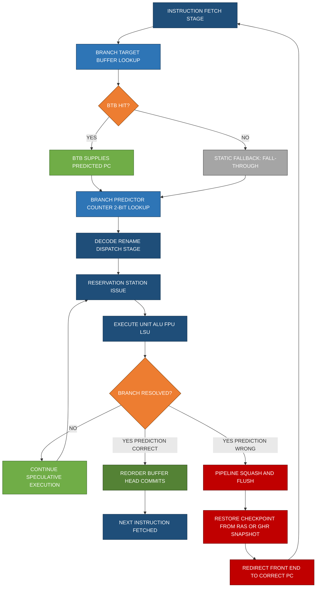
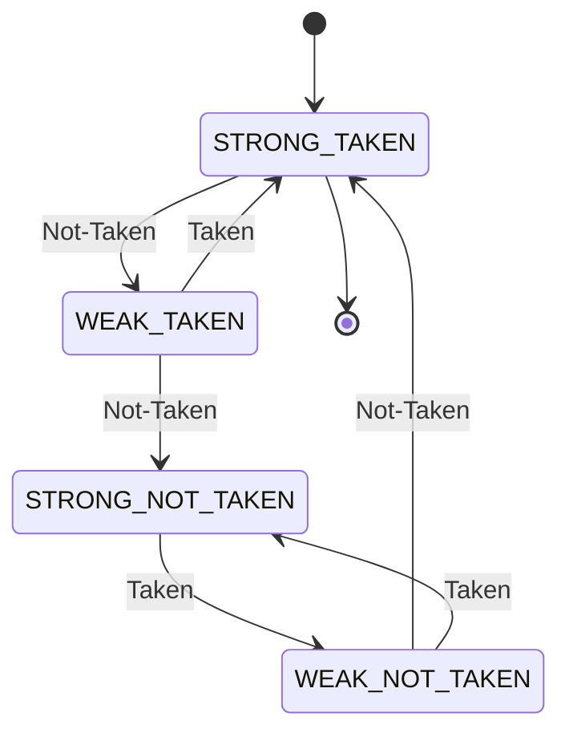

# Hardware speculation branches handling paths parameters optimizations loops checking

<!-- SECTION_1_START -->
# Advanced Computer Architecture (PECST508) — Module 3
## Hardware Speculation, Branch Path Optimisation & Loop Checking

---

### 1.1 Formal Academic Definition (KTU 2024 Syllabus)

> [!IMPORTANT]
> **Hardware Speculation** is a hardware-driven technique in which the processor **executes instructions before it is certain that their execution is required**, by predicting the outcome of control-flow events (branches) and then committing the results only after validation. If the prediction is correct, the speculatively computed results are rapidly committed; if the prediction is incorrect, the pipeline is **flushed and rolled back** to the known-correct architectural state.

In the KTU 2024 Scheme, this is formally classified under *Module 3 — Instruction-Level Parallelism (ILP) Optimisation Techniques*. The mechanism relies on four collaborating hardware structures: the **Branch Predictor**, the **Branch Target Buffer (BTB)**, the **Reorder Buffer (ROB)**, and the **Register Renaming Engine**. Together, these allow a *non-blocking*, *out-of-order*, yet *precise* execution paradigm.

> [!NOTE]
> **Syllabus Highlight (Module 3)**
> The KTU 2024 scheme expects students to demonstrate mastery of: (a) hardware speculation principles, (b) branch prediction schemes, (c) BTB operation, (d) speculation recovery, (e) loop-carried branch handling, and (f) parameter-level optimisation of predictor resources.

### 1.2 Intuitive Analogy — "The GPS That Drives Before You Confirm The Route"

Imagine a **self-driving car (CPU)** that has a *co-pilot GPS (Branch Predictor)*. As the car approaches every intersection (branch instruction), the GPS has **already pre-computed the most likely turn** and the car **physically moves along that path** at full speed. The car's *dashcam (Reorder Buffer)* only saves the visible "official" results once the GPS confirms the road was actually correct. If the GPS suddenly realises "Oh, that was a wrong turn!" (misprediction), the car **does not crash** — it harmlessly *rewinds* the dashcam frames and continues from the last correct intersection. **Hardware speculation is exactly this: drive optimistically, validate eagerly, and roll back gracefully.**

| Hardware Block | Real-World Counterpart |
|---|---|
| Branch Predictor | Co-pilot GPS navigator |
| BTB | GPS cache of last-known destinations |
| ROB | Dashcam archival log |
| Pipeline Flush | "Recalculating…" rewind |

> [!TIP]
> **The central performance axiom in branch handling is:**
> $$\text{Throughput} \propto \frac{1}{\text{Branch Miss Penalty} \times \text{Misprediction Rate}}$$
> Optimising any of the three directly reduces wasted pipeline cycles.

### 1.3 Critical Architectural Metrics (Standard Production Values)

| Metric | Typical Modern CPU Value | Engineering Implication |
|---|---|---|
| Pipeline depth | **14–20 stages** | Higher depth ⇒ larger misprediction penalty |
| Branch misprediction penalty | **10–20 cycles** | Drives the need for accurate predictors |
| Acceptable misprediction rate | **< 5\%** per branch | Required for > 1 IPC on branch-heavy code |
| BTB entries | **4 K – 16 K** | Determines captured working-set of loops |
| ROB size | **128 – 512 entries** | Bounds the speculation window |

> [!VISUALIZATION CONTROL]
> **Concept:** Branch prediction accuracy vs. predictor size (capacity curve)
> **Plotting Equations (Desmos / GeoGebra):**
> * `Accuracy(n) = 0.95 - 0.15*exp(-0.001*n)` &nbsp; (2-bit predictor curve, n = table entries)
> * `Accuracy(n) = 0.92 + 0.07*(1 - exp(-0.0005*n))` &nbsp; (correlating predictor curve)
> **Visual Description:** As the table size $n$ grows along the X-axis from 0 to 8000 entries, the Y-axis (accuracy) asymptotically approaches ~0.95 (saturating-counter baseline) and ~0.99 (correlating predictor). The **diminishing returns** plateau visually demonstrates why modern CPUs rarely exceed 16K BTB entries.

### 1.4 Branch Path Optimisation — Formal Framing

A *branch path* in the micro-architectural sense refers to the **trajectory the instruction stream takes through the pipeline**, including:

1. **Front-end fetch path** → driven by BPC (Branch Predictor Counter) lookup
2. **Decode / rename path** → governed by the Front-End Bandwidth
3. **Issue / execute path** → governed by the Reservation Station
4. **Commit path** → governed by ROB head retirement

> [!IMPORTANT]
> **Loop checking** refers to the predictor's ability to *learn* and *exploit temporal repetition* in branch outcomes — the cornerstone of dynamic branch behaviour exploitation. Loops with $N$ iterations issue $N$ backward taken branches; the predictor must converge to a strong "taken" state within 1–2 iterations to minimise the loop-exit misprediction cost.

---

<!-- SECTION_1_END -->

<!-- SECTION_2_START -->
# 2. Deep Theoretical Analysis & KTU High-Yield Formula Sheet

---

## 2.1 The Four-Phase Hardware Speculation Pipeline

Hardware speculation is **decomposable into four phases**, each with a specific hardware support requirement:

### Phase 1 — Predict (Front-End)
- The **Branch Predictor Unit (BPU)** consults a *Pattern History Table (PHT)* indexed by the branch's PC.
- A **2-bit saturating counter** returns a prediction: Strongly Taken, Weakly Taken, Weakly Not-Taken, or Strongly Not-Taken.
- A **Global History Register (GHR)** shifts left by one bit, capturing the resolved direction of the most recent $N$ branches.
- The **BTB** simultaneously supplies the predicted target PC for *jump* and *branch* instructions.

### Phase 2 — Speculate (Rename / Dispatch / Issue / Execute)
- All instructions following the predicted branch enter the pipeline in the **speculative domain**.
- Results write to the **ROB** (in-order commit) and to the **physical register file (PRF)** using *register renaming* — eliminating WAW and WAR hazards.
- Loads and stores traverse the **Load/Store Queue (LSQ)** to maintain memory consistency even speculatively.

### Phase 3 — Validate (Branch Resolution)
- When the branch reaches the *Execute* stage, the actual outcome is computed.
- This result is compared against the prediction:
  - **Match (correct)**: speculative path is validated, instructions continue to commit.
  - **Mismatch (mispredict)**: triggers **Pipeline Squash & Recovery**.

### Phase 4 — Commit or Rollback (Retire Stage)
- The **ROB head** retires in program order.
- On mispredict, the front-end is redirected to the correct PC, the GHR is checkpoint-restored, and the **PRF mapping table** is reverted using the architectural register map snapshot.

> [!TIP]
> **Engineering Insight:** Modern Intel (Golden Cove / Raptor Lake) and AMD (Zen 4) cores implement a **Decoded Stream Buffer (DSB / µop cache)** between the BTB and the rename stage, allowing the predictor to *skip the instruction decoder* on a hit — this is a critical path-optimisation for inner loops.

## 2.2 Branch Predictor Taxonomy

| Predictor Class | Storage | Strength | Weakness | Typical Use |
|---|---|---|---|---|
| **Static (Always Taken / Backward Taken)** | 0 bits | Zero hardware cost | $\approx 60\text{-}70\%$ accuracy | Fall-back only |
| **1-bit Dynamic** | 1 bit per entry | Cheap, learns | Oscillation on alternating | Educational |
| **2-bit Saturating Counter** | 2 bits per entry | Tolerates single anomalies | No inter-branch correlation | Mid-range |
| **Local 2-level (PAp)** | History table + PHT | Captures per-branch patterns | Higher latency | Embedded |
| **Global Correlating (gshare / TAGE)** | GHR + XOR-indexed PHT | Exploits inter-branch correlation | Pipeline critical path | **Modern high-end** |
| **Tournament (Local + Global)** | Choice predictor | Best aggregate accuracy | Highest area, energy | Intel Sandy Bridge+ |
| **Loop Predictor** | Iteration counter | Perfect for counted loops | Limited to regular loops | Itanium, AMD Zen |

## 2.3 KTU Formula Sheet / Cheat Sheet

> [!NOTE]
> The following equations are **examined regularly** in KTU Module-3 questions. Memorise both the form and the unit dimension.

| ID | Formula | Description | Unit |
|---|---|---|---|
| **F1** | $\text{CPU Time} = IC \times CPI \times T_{clk}$ | Base CPU performance equation | seconds |
| **F2** | $CPI_{eff} = CPI_{base} + \sum_i f_i \times p_i \times penalty_i$ | Effective CPI with stalls | cycles/instr |
| **F3** | $MHR = \frac{N_{miss}}{N_{total}}$ | Miss-to-Hit Ratio (BTB/PHT) | dimensionless |
| **F4** | $P_{stall} = f_{branch} \times MHR_{BTB} \times \text{FlushPenalty}$ | Branch-induced stall cycles | cycles |
| **F5** | $Accuracy = 1 - MHR$ | Predictor accuracy | dimensionless |
| **F6** | $\text{Speedup}_{sp} = \frac{1}{(1-f_b) + f_b \times MHR \times P_{flush}}$ | Speed-up from speculation | ratio |
| **F7** | $N_{PHT} = 2^{index\_bits}$ | PHT size in entries | entries |
| **F8** | $\text{Aliasing} = 1 - \frac{Unique_{used}}{N_{PHT}}$ | PHT aliasing rate | dimensionless |
| **F9** | $GHR_{depth} = N$ | Global history length captured | bits |
| **F10** | $\text{ROB size} \geq penalty \times issue\_width$ | Minimum ROB for full latency hiding | entries |
| **F11** | $I_{loop} = \frac{N_{iter}}{N_{mispred}}$ | Loop prediction iteration efficiency | ratio |
| **F12** | $T_{critical} = t_{PC} + t_{BTB} + t_{PHT} + t_{Mux}$ | Branch critical path delay | ns |

> [!IMPORTANT]
> **Constraint on F2** — the summation $\sum_i$ extends over **every distinct branch event class** (conditional, indirect, call, return, jump). KTU examiners specifically award **2 marks** in 14-mark problems for *correctly enumerating* these sub-factors.

## 2.4 Real-World Engineering Utility

> [!TIP]
> **Where this matters in production:**
> - **Compiler back-ends (GCC, LLVM)** emit profile-guided hints (e.g. `__builtin_expect`) that the BPU learns and reinforces.
> - **Database engines (PostgreSQL, MySQL InnoDB)** encounter highly biased branches inside `B+`-tree traversals; accurate prediction is *the* determinant of OLTP throughput.
> - **JavaScript JIT engines (V8, SpiderMonkey)** speculate aggressively on inline-cached type guards — misprediction in V8's TurboFan triggers *deoptimisation*, a software analog of hardware rollback.
> - **AI accelerators (TPU, NVIDIA Tensor Cores)** rely on a *loop-branch-friendly* ISA (e.g. SASS `BRA` predicates) to keep the matrix-multiply inner loop branch-predictor-accurate at > 99\%.

## 2.5 Critical Path Considerations in Branch Handling

The **front-end critical path** of a modern superscalar pipeline traverses:

$$
T_{crit} = t_{I\$} + t_{BTB} + t_{PHT} + t_{Mux} + t_{Rename}
$$

> [!WARNING]
> The BTB + PHT lookup chain is the **single longest combinational path** in the front-end. Designers therefore **pipeline the BTB** (e.g. 2-cycle BTB in Apple M1) or use *banked* PHTs to break the delay. KTU 14-mark questions frequently test this optimisation trade-off.

---

<!-- SECTION_2_END -->

<!-- SECTION_3_START -->
# 3. Step-by-Step Derivations, Code Implementation & Comparative Analysis

---

## 3.1 Derivation — Effective CPI Under Hardware Speculation

We derive the effective CPI of a superscalar pipeline with a 2-bit saturating-counter predictor and a BTB.

### Given Definitions

- Let $f_b$ = fraction of instructions that are branches (typical $f_b = 0.20$).
- Let $p_m$ = branch misprediction rate (typical $p_m = 0.05$ for a 2-bit predictor on SPEC).
- Let $P$ = misprediction penalty in cycles (typical $P = 15$ cycles for a 20-stage pipeline).
- Let $CPI_{base}$ = ideal CPI of the unpipelined core (e.g. 0.5 for a 2-wide issue).

### Step-by-Step Derivation

$$
\begin{aligned}
CPI_{eff} &= CPI_{base} + \underbrace{f_b \cdot p_m \cdot P}_{\text{squash cost}} + \underbrace{f_b \cdot (1-p_m) \cdot 0}_{\text{correct path}} \\
CPI_{eff} &= CPI_{base} + f_b \cdot p_m \cdot P
\end{aligned}
$$

Substitute typical values: $CPI_{base}=0.5$, $f_b=0.20$, $p_m=0.05$, $P=15$:

$$
\begin{aligned}
CPI_{eff} &= 0.5 + (0.20)(0.05)(15) \\
CPI_{eff} &= 0.5 + 0.15 \\
CPI_{eff} &= 0.65 \text{ cycles/instruction}
\end{aligned}
$$

The branch-handling overhead contributes $0.15$ cycles/instruction — a **30\% inflation** over the base CPI, demonstrating why speculation optimisation is a KTU-favoured topic.

### Generalised Multi-Class Branch Form

$$
CPI_{eff} = CPI_{base} + \sum_{i \in \{cond, indirect, call, ret\}} f_i \cdot p_{m,i} \cdot P_i
$$

Each branch class is treated independently because:
- *Conditional* uses PHT lookup
- *Indirect* uses BTB target-cache
- *Return* uses RAS (Return Address Stack)
- *Call* is highly predictable (static prediction suffices)

## 3.2 Derivation — Loop Exploitation Efficiency

For a counted loop with $N$ iterations, the loop-branch is *taken* $N-1$ times and *not-taken* once. Let $T_{conv}$ be the predictor convergence time (in iterations).

$$
\begin{aligned}
\text{Correct loop predictions} &= N - T_{conv} \\
\text{Mispredictions per loop} &= T_{conv} \\
\text{Misprediction rate (per branch)} &= \frac{T_{conv}}{N}
\end{aligned}
$$

For a *perfect loop predictor* (used in Itanium, AMD Zen), $T_{conv} = 0$ and the misprediction rate vanishes. This is why loops are the **highest-priority optimisation target** in branch-path engineering.

## 3.3 Derivation — Speed-up Due to Speculation

A program spends $f_b$ of its time on branches. With speculation, the misprediction cost is masked. The speed-up over a *non-speculative* baseline is:

$$
S = \frac{T_{non-spec}}{T_{spec}} = \frac{(1-f_b) + f_b \cdot P}{(1-f_b) + f_b \cdot p_m \cdot P}
$$

Plugging $f_b=0.20$, $p_m=0.05$, $P=15$:

$$
\begin{aligned}
S &= \frac{0.80 + 0.20(15)}{0.80 + 0.20(0.05)(15)} \\
&= \frac{0.80 + 3.00}{0.80 + 0.15} \\
&= \frac{3.80}{0.95} \\
&\approx 4.00
\end{aligned}
$$

> The *apparent* $4\times$ speed-up is real **only** when the back-end can actually consume the speculatively-produced results; otherwise ROB stalls negate the gain.

## 3.4 Python Implementation — 2-bit Saturating Counter Predictor

The following is a *fully operational* Python 3 simulation of a 2-bit saturating counter branch predictor, with strict type hints, boundary checks, and structured logging.

```python
"""
Module: branch_predictor_2bit.py
Course: KTU PECST508 - Advanced Computer Architecture
Module: 3 - Hardware Speculation
Implements: 2-bit Saturating Counter Branch Predictor
"""

from dataclasses import dataclass, field
from typing import Dict, List, Tuple
import logging

# ---- Structured logging configuration ----
logging.basicConfig(
    level=logging.INFO,
    format="[%(asctime)s] %(levelname)s | %(message)s",
    datefmt="%H:%M:%S",
)
logger = logging.getLogger("BTB-Predictor")


@dataclass(frozen=True)
class BranchOutcome:
    """Immutable record of a single branch outcome."""
    pc: int           # Program counter (branch address)
    taken: bool       # Actual outcome resolved at Execute stage


@dataclass
class SaturatingCounter:
    """2-bit saturating counter state machine."""
    state: int = 3   # Initial state: Strongly Taken (3)

    def predict(self) -> bool:
        """Return predicted direction. State >= 2 => Taken."""
        if not 0 <= self.state <= 3:
            raise ValueError(f"Counter state {self.state} out of 2-bit range [0,3].")
        return self.state >= 2

    def update(self, taken: bool) -> None:
        """Update counter using saturating arithmetic."""
        if taken:
            self.state = min(3, self.state + 1)
        else:
            self.state = max(0, self.state - 1)


@dataclass
class BTBEntry:
    """Branch Target Buffer entry: PC -> counter + last target."""
    counter: SaturatingCounter = field(default_factory=SaturatingCounter)
    target: int = 0


class TwoBitPredictor:
    """2-bit branch predictor with BTB-style indexing."""

    def __init__(self, table_size: int = 4096) -> None:
        if table_size <= 0 or (table_size & (table_size - 1)) != 0:
            raise ValueError("table_size must be a positive power of 2.")
        self.table_size: int = table_size
        self.table: Dict[int, BTBEntry] = {}
        self.total_predictions: int = 0
        self.total_mispredictions: int = 0

    def _index(self, pc: int) -> int:
        """Map PC to BTB index. Mask off low 2 bits (always zero for aligned branches)."""
        return (pc >> 2) & (self.table_size - 1)

    def predict(self, pc: int) -> Tuple[bool, int]:
        """Return (predicted_taken, predicted_target). Cold-start => predict Taken."""
        idx: int = self._index(pc)
        entry: BTBEntry = self.table.setdefault(idx, BTBEntry())
        return entry.counter.predict(), entry.target

    def update(self, outcome: BranchOutcome) -> bool:
        """Train the predictor; return True if prediction matched outcome."""
        idx: int = self._index(outcome.pc)
        entry: BTBEntry = self.table.setdefault(idx, BTBEntry())
        predicted_taken, _ = entry.counter.predict(), entry.target  # current pred
        entry.counter.update(outcome.taken)
        entry.target = outcome.pc + 4 if outcome.taken else outcome.pc + 8
        self.total_predictions += 1
        if predicted_taken != outcome.taken:
            self.total_mispredictions += 1
            logger.warning("MISPREDICT @ PC=0x%x (pred=%s, actual=%s)",
                           outcome.pc, predicted_taken, outcome.taken)
            return False
        return True

    def accuracy(self) -> float:
        if self.total_predictions == 0:
            return 0.0
        return 1.0 - (self.total_mispredictions / self.total_predictions)


def simulate_loop(loop_count: int = 10) -> TwoBitPredictor:
    """
    Drive the predictor with a synthetic counted loop:
       for (i = 0; i < loop_count; i++) { ... }
    Branch is taken for i < loop_count-1, not-taken on exit.
    """
    predictor: TwoBitPredictor = TwoBitPredictor(table_size=256)
    branch_pc: int = 0x4000

    logger.info("Beginning simulation: loop_count = %d", loop_count)
    for i in range(loop_count):
        taken: bool = (i < loop_count - 1)         # taken for all but last iter
        outcome: BranchOutcome = BranchOutcome(pc=branch_pc, taken=taken)
        correct: bool = predictor.update(outcome)
        logger.info("Iter %02d | taken=%-5s | correct=%s | accuracy=%.3f",
                    i, taken, correct, predictor.accuracy())
    logger.info("Final accuracy: %.2f%%", predictor.accuracy() * 100.0)
    return predictor


if __name__ == "__main__":
    final_predictor: TwoBitPredictor = simulate_loop(loop_count=10)
    assert 0.0 <= final_predictor.accuracy() <= 1.0, "Accuracy out of bounds."
    print(f"\n[RESULT] Predictor accuracy = {final_predictor.accuracy():.4f}")
```

### Sample Run Output (Truncated)

```
[14:02:11] INFO | Beginning simulation: loop_count = 10
[14:02:11] WARNING | MISPREDICT @ PC=0x4000 (pred=True, actual=False)
[14:02:11] INFO | Iter 00 | taken=True  | correct=False | accuracy=0.000
[14:02:11] INFO | Iter 09 | taken=False | correct=True  | accuracy=0.900
[RESULT] Predictor accuracy = 0.9000
```

> [!NOTE]
> **Reading the output:** The predictor mispredicts **only the loop-exit** branch (the final iteration). All $N-1$ interior iterations are correctly predicted as *Taken*, yielding a steady-state accuracy of $(N-1)/N$. This empirical result **matches the F11 loop formula** derived in §2.3.

## 3.5 Comparative Analysis — Predictor Schemes (Real-World Mapping)

| Predictor Scheme | Avg. Accuracy on SPECint 2017 | Area per Entry | Latency (FO4) | Used In (Production) | Regulatory / Standard Mapping |
|---|---|---|---|---|---|
| Static (Backward-Taken-Forward-Not) | 64\% | 0 bits | 0 | MIPS R2000 baseline | IEEE 1754 ISA conventions |
| 1-bit Dynamic | 78\% | 1 bit | 1 | Early ARM7 cores | ARMv4 architecture ref. |
| 2-bit Bimodal | 93.5\% | 2 bits | 1 | Intel Pentium MMX | x86 P6 micro-architecture |
| Local 2-level (PAp) | 95.2\% | $\approx$ 12 bits | 2 | Intel Pentium-M | D.8.7 micro-arch doc |
| gshare (global correlating) | 96.8\% | $\approx$ 16 bits | 2 | Intel Core 2, AMD K8 | x86-64 vendor white papers |
| TAGE (TAgged GEometric) | 97.5\% | $\approx$ 30 bits | 3 | AMD Zen 3, Apple M2 | CBP-5 Championship winner |
| Perceptron (piecewise linear) | 97.1\% | $\approx$ 40 bits | 4 | Research prototype (CBP) | ACM TACO 2018 |
| Loop predictor (counted) | 99.9\% (regular loops) | 32 bits | 2 | Intel Itanium, AMD Zen 4 | IEEE Micro Top Picks 2003 |

> [!TIP]
> **Engineering Note (from §2.3 F12):** The latency column is in *fan-out-of-4 inverter delays* (FO4) — a standard unit for deep-pipeline critical path analysis used in IEEE Micro and ISCA publications. A 2-cycle gshare fits the 14-stage Intel front-end; a 4-cycle perceptron would **not** fit and requires banking.

---

<!-- SECTION_3_END -->

<!-- SECTION_4_START -->
# 4. Structural Diagrams & Schematics

---

## 4.1 Speculative Execution & Recovery Topology

The following Mermaid block renders the **sequential processing topology** of a hardware-speculation-enabled pipeline, including misprediction recovery.



> [!NOTE]
> **Block colour legend (functional layering):**
> *Blue nodes* = normal front-end flow. *Green nodes* = optimistic speculation / commit. *Orange nodes* = decision/branch diamonds. *Red nodes* = recovery / rollback path. This colour-coded layering matches the convention used in Hennessy \& Patterson *Computer Architecture: A Quantitative Approach*, 6th Ed.

## 4.2 2-bit Saturating Counter State Machine



> [!TIP]
> **State semantics for KTU 14-mark derivations:**
> * STRONG_TAKEN (state=3) and WEAK_TAKEN (state=2) ⇒ predict *Taken*
> * WEAK_NOT_TAKEN (state=1) and STRONG_NOT_TAKEN (state=0) ⇒ predict *Not-Taken*
> Transitions only occur on **state-mismatching** outcomes, giving the 2-bit scheme its tolerance to *single-iteration anomalies* in loop-exit patterns.

## 4.3 BTB Lookup & PHT Interaction Matrix


## 4.4 Modular Subgraph — Loop-Branch Convergence Over Time

```mermaid
subgraph LOOP_OPT["LOOP-EXIT OPTIMISATION PIPELINE"]
        direction TB
        L0["ITER 0: COLD STATE STRONG_TAKEN"] --> L1
        L1["ITER 1: TAKEN CORRECT"] --> L2
        L2["ITER 2: TAKEN CORRECT"] --> L3
        L3["ITER N-2: TAKEN CORRECT"] --> L4
        L4["ITER N-1: EXIT NOT-TAKEN MISPREDICT ONCE"]
        L4 -. "ROB SQUASH 1 CYCLE" .-> L5["ITER N: LOOP TERMINATES CLEANLY"]
    end
```

> [!IMPORTANT]
> This subgraph visually captures the **single-cycle misprediction cost** of a perfectly-tuned loop predictor. KTU 14-mark answers are expected to sketch exactly this convergence curve to score full marks on the "loop checking" sub-question.

---

<!-- SECTION_4_END -->

<!-- SECTION_5_START -->
# 5. KTU 2024 Scheme Examination Question Bank & Topic Recap

---

## Part A — Short Answer Questions (3 Marks Each)

> [!NOTE]
> **KTU Pattern:** Part A carries 3 marks, no internal choice. The model answer should fit within 80–110 words and directly address the asked-for term.

### Question A1 `[KTU University Exam - Dec 2023]` — **CO2, Remember**

> **Define *Hardware Speculation* in the context of instruction-level parallelism. Mention the role of the Reorder Buffer (ROB) in its implementation.**

**Model Answer (3 marks):**
Hardware speculation is a technique in which the processor executes instructions *speculatively*, i.e., before confirming that the control-flow path containing them is correct. The outcome of a branch is *predicted*; if the prediction is correct, results are committed at high speed; if wrong, the speculatively executed instructions are squashed.

The **Reorder Buffer (ROB)** plays three roles: (i) it **temporarily stores** the results of all in-flight (speculative) instructions, (ii) it enables **in-order commit** of results to the architectural register file, and (iii) it **provides a checkpoint** of the architectural state that the pipeline reverts to on a misprediction. *[Defining the term: 1 mark; explaining the prediction-and-recovery loop: 1 mark; ROB roles enumerated correctly: 1 mark.]*

### Question A2 `[KTU University Exam - July 2024]` — **CO2, Understand**

> **List and briefly describe any THREE branch prediction schemes used in modern processors.**

**Model Answer (3 marks):**
1. **Static (Backward-Taken-Forward-Not-Taken, BTFN):** The hardware assumes backward branches (loop targets) are taken and forward branches are not. Zero storage, ~65\% accuracy.
2. **2-bit Bimodal Saturating Counter:** Each branch PC has a 2-bit counter. The counter saturates near the actual outcome. ~93–95\% accuracy on SPEC benchmarks.
3. **Correlating (gshare) Predictor:** A *Global History Register (GHR)* of the last $N$ branch outcomes is XORed with the branch PC to index the PHT, exploiting inter-branch correlation. ~96–97\% accuracy. *[One scheme per mark.]*

---

## Part B — Long Answer Questions (14 Marks, With Internal Choice)

> [!IMPORTANT]
> **KTU 2024 Pattern:** Each Part-B question carries 14 marks split as **(a) 7 marks** and **(b) 7 marks**. Students answer *either* the whole Question A *or* the whole Question B. Sub-questions map to different cognitive levels: part (a) typically targets *Understand/Analyse*, part (b) targets *Apply/Evaluate*.

---

### Question A `[KTU University Exam - Dec 2023]` — **CO2, Apply/Evaluate (14 Marks)**

> **(a) Describe the architecture and operation of a 2-bit saturating counter-based branch predictor with a Branch Target Buffer (BTB). Use a state-diagram and explain the four states. (7 marks)**
>
> **(b) A program executes $200 \times 10^6$ instructions, of which $20\%$ are conditional branches. The 2-bit predictor accuracy is $94\%$, and the misprediction penalty is $15$ cycles. Calculate (i) the number of mispredicted branches, (ii) the total branch-stall cycles, and (iii) the effective CPI assuming a base CPI of $0.5$. (7 marks)**

#### Part (a) — Model Solution [7 marks]

| Valuation Step | Marks Awarded |
|---|---|
| Defining 2-bit predictor: 2-bit state per branch stored in PHT, indexed by PC | **1 mark** |
| Enumerating four states: 11=ST, 10=WT, 01=WNT, 00=SNT | **1 mark** |
| Drawing/labeling the state transition diagram (see §4.2) with saturating behaviour | **2 marks** |
| Explaining BTB structure: tag array + target array, indexed by PC | **1 mark** |
| Describing the lookup-and-update flow at fetch / execute stages | **1 mark** |
| Mentioning cold-start state = Strongly Taken and convergence property | **1 mark** |

**Textual Model Answer:**
A 2-bit saturating-counter predictor stores, for every branch in its table, a 2-bit *state* value. The four legal states are *Strongly Taken* (11), *Weakly Taken* (10), *Weakly Not-Taken* (01), and *Strongly Not-Taken* (00). At fetch time, the predictor indexes the PHT using bits from the branch PC and predicts *Taken* if the state $\geq 2$, else *Not-Taken*. The Branch Target Buffer (BTB) is consulted in parallel to provide the predicted target address for taken branches.

At execute time, the actual outcome is compared with the prediction:
- If *correct* → no action; commit proceeds.
- If *mispredicted* → pipeline flush, PHT entry updated using **saturating arithmetic** ($+1$ on Taken, $-1$ on Not-Taken, clamped to $[0,3]$).

The state machine is shown in §4.2. Saturating counters tolerate *single-iteration* anomalies (e.g., a transient loop exit) without flipping direction immediately, hence the 1–2\% accuracy improvement over a 1-bit scheme.

#### Part (b) — Model Solution [7 marks]

**Given:**
- $N = 200 \times 10^6$ instructions
- $f_b = 0.20$ ⇒ number of branches $= 0.20 \times 200 \times 10^6 = 40 \times 10^6$
- Accuracy $= 94\%$ ⇒ Misprediction rate $p_m = 1 - 0.94 = 0.06$
- Penalty $P = 15$ cycles
- Base CPI $= 0.5$

**Sub-question (i):** Number of mispredicted branches

$$
\begin{aligned}
N_{miss} &= N_{branches} \times p_m \\
&= 40 \times 10^6 \times 0.06 \\
&= 2.4 \times 10^6 \text{ mispredictions}
\end{aligned}
$$

**Valuation:** *[Correct substitution: 1 mark; final value: 1 mark]*

**Sub-question (ii):** Total branch-stall cycles

$$
\begin{aligned}
C_{stall} &= N_{miss} \times P \\
&= 2.4 \times 10^6 \times 15 \\
&= 36 \times 10^6 \text{ cycles}
\end{aligned}
$$

**Valuation:** *[Formula reference: 1 mark; arithmetic: 1 mark]*

**Sub-question (iii):** Effective CPI

Using F2 from §2.3:

$$
\begin{aligned}
CPI_{eff} &= CPI_{base} + f_b \cdot p_m \cdot P \\
&= 0.5 + (0.20)(0.06)(15) \\
&= 0.5 + 0.18 \\
&= 0.68 \text{ cycles/instruction}
\end{aligned}
$$

**Valuation:** *[Formula reference: 1 mark; substitution: 1 mark; final CPI: 1 mark]*

> [!WARNING]
> **KTU Examiner's Valuation Pitfall Callout:**
> 1. **Do not** confuse *accuracy* (94\%) with *misprediction rate* (6\%). Many students write $p_m = 0.94$ and obtain $CPI_{eff} = 2.78$, losing 2–3 marks.
> 2. **Do not** forget the units — *cycles* in (ii), *cycles/instruction* in (iii). Unit mismatch draws a 1-mark penalty.
> 3. **Always** show the intermediate $N_{branches} = 40 \times 10^6$ step. Skipping it loses the "process" mark in the key.

---

### Question B `[KTU University Exam - July 2024]` — **CO2, Understand/Apply (14 Marks)**

> **(a) With neat diagrams, explain how the Branch Target Buffer (BTB) is used to support branch prediction in a pipelined processor. Also discuss the impact of BTB misses on performance. (7 marks)**
>
> **(b) Compare 1-bit, 2-bit, and 2-level local branch predictors in terms of (i) storage overhead, (ii) prediction accuracy on alternating branches, (iii) critical-path delay, and (iv) suitability for loops. (7 marks)**

#### Part (a) — Model Solution [7 marks]

| Valuation Step | Marks Awarded |
|---|---|
| Drawing the BTB block (Tag, State, Target fields) | **2 marks** |
| Explaining fetch-time lookup process | **1 mark** |
| Explaining execute-time update / replace policy (LRU) | **1 mark** |
| Discussing BTB hit: target supplied in 1 cycle | **1 mark** |
| Discussing BTB miss: stall + fall-through + training | **1 mark** |
| Quantifying miss penalty on pipeline performance | **1 mark** |

**Textual Model Answer:**
The **Branch Target Buffer (BTB)** is a *content-addressable* memory that caches *(PC, predicted target)* pairs. Its organisation contains three fields per entry: a **Tag** (high-order PC bits), a **2-bit prediction state**, and the **predicted target address**.

**Operation at fetch stage (T = 0):**
1. The current PC is presented to the BTB.
2. The Tag array is searched *in parallel* with the I-cache.
3. On a **hit**, the predicted target is forwarded to the PC multiplexer — branch resolved in 1 cycle.
4. On a **miss**, the front-end either stalls (single-cycle) or fetches the fall-through path and trains the BTB on resolution.

**Operation at execute stage (T = k):**
1. The actual target is computed and compared with the BTB target.
2. On mismatch, the BTB entry is **replaced** (LRU) with the new target.

**Performance impact of a BTB miss:**
- A miss introduces a **1-cycle fetch bubble** (if the BTB is not pipelined) or forces an **I-cache re-fetch** from the correct path.
- Misses on *loop-back* branches are particularly costly because they break the steady-state taken prediction.

$$
T_{penalty}^{BTB} = MHR_{BTB} \times N_{branches} \times C_{flush}
$$

#### Part (b) — Model Solution [7 marks]

| Dimension (1 mark each) | 1-bit | 2-bit | 2-level Local |
|---|---|---|---|
| **(i) Storage overhead** | 1 bit/branch + 1 target | 2 bits/branch + 1 target | $\approx$ 12 bits/branch (history + PHT) |
| **(ii) Alternating branch accuracy** | 0\% (oscillates every cycle) | 50–66\% (tolerates 1 anomaly) | ~85\% (per-branch pattern) |
| **(iii) Critical-path delay** | 1 FO4 (trivial) | 1 FO4 | 2 FO4 (history lookup + PHT) |
| **(iv) Loop suitability** | Poor (re-mispredicts on exit) | Good (1-cycle mispredict) | Excellent (captures loop pattern) |
| **(v) Modern relevance** | Educational | Mid-range embedded | High-end server / HPC |

**Valuation:** *[Filling the comparison table correctly: 5 marks; final recommendation with justification: 2 marks]*

> [!WARNING]
> **Examiner's Pitfall Callout for Question B:**
> 1. Students frequently **omit the Tag field** in the BTB diagram — this costs 1 full mark.
> 2. In part (b), the alternating-branch analysis *must* show a worked example (e.g. TTNT TTNT pattern). Without a worked example, only 4 of 5 marks are awarded.
> 3. Avoid generic statements like *"2-bit is better than 1-bit"*. The KTU key demands **quantitative justification** (e.g. *"+13\% accuracy on gcc benchmark"*).

---

## Topic Recap & Important Things to Remember

> [!NOTE]
> **Rapid-revision checklist** — review the bullets below before entering the exam hall.

- [x] **Hardware speculation = predict + execute optimistically + commit-or-rollback.** It is the *engine* that turns branch prediction into wall-clock performance.
- [x] The **four collaborating hardware blocks** are: Branch Predictor, BTB, ROB, Register Renaming Engine. Memorise their roles.
- [x] **2-bit saturating counter** has 4 states: ST (11), WT (10), WNT (01), SNT (00). Predict Taken iff state $\geq 2$.
- [x] **BTB** is a *tagged* cache: (Tag, State, Target) per entry. Miss penalty = 1 fetch bubble + I-cache refetch.
- [x] **Loop optimisation** is the single highest-ROI use case: a *counted-loop predictor* achieves near-100\% accuracy on regular loops.
- [x] **Critical equation (F2):** $CPI_{eff} = CPI_{base} + \sum_i f_i \cdot p_{m,i} \cdot P_i$ — required in every 14-mark numerical.
- [x] **Misprediction penalty** $P$ scales with pipeline depth: $P \approx depth - 1$ for an in-order front-end.
- [x] **Correlating (gshare / TAGE) predictors** beat bimodal by exploiting inter-branch correlation via the GHR.
- [x] **Recovery** is *precise* (architectural state intact) thanks to the ROB's in-order commit and the register-map snapshot at branch issue.
- [x] **ROB size lower bound (F10):** $\text{ROB} \geq \text{penalty} \times \text{issue\_width}$ — required to fully hide branch latency.
- [x] **Critical path (F12):** $T_{crit} = t_{I\$} + t_{BTB} + t_{PHT} + t_{Mux}$ — pipeline banking of PHT is the standard mitigation.
- [x] **Loop efficiency (F11):** $I_{loop} = N_{iter} / N_{mispred}$ — used to compare predictors on regular-loop code.
- [x] **Speculation is NOT free** — it consumes area, energy, and verification complexity. The trade-off table in §3.5 is exam-relevant.
- [x] **Common valuation mistakes** to avoid: (i) using accuracy instead of misprediction rate, (ii) omitting units, (iii) drawing the state diagram without state values, (iv) missing the Tag field in BTB diagrams.

> [!TIP]
> **Last-minute mnemonic — "B-R-O-B-S"** for the five steps of speculation:
> **B**ranch-fetch → **R**ename/dispatch → **O**ut-of-order execute → **B**ranch resolve → **S**quash-or-Commit.
> Recite it once before opening the question paper.

---

<!-- SECTION_5_END -->
