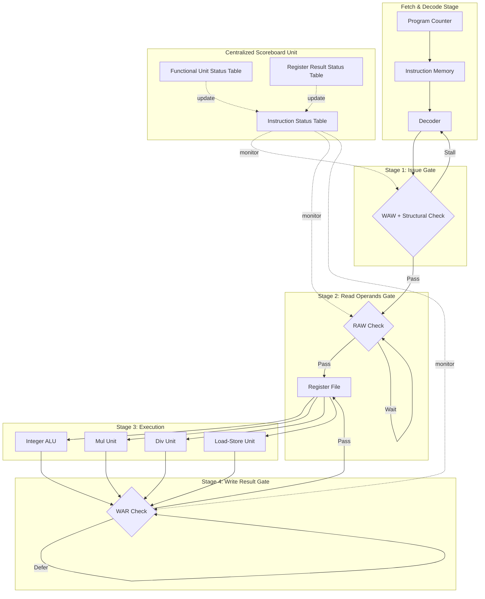
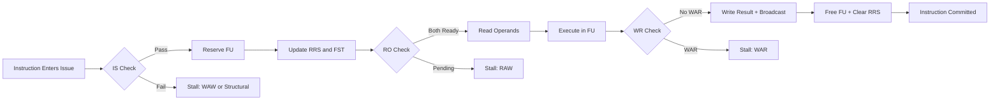
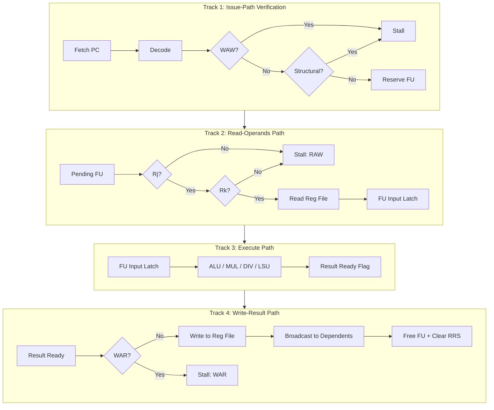
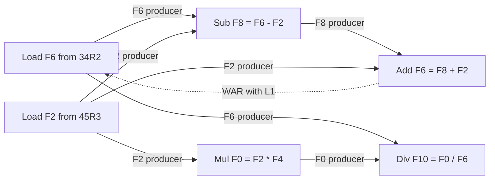
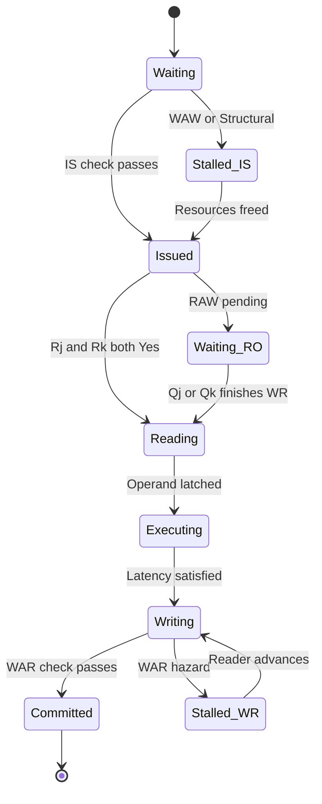

# Scoreboarding process pipelines architecture verification paths tracks software setups

<!-- SECTION_1_START -->
# Scoreboarding in Advanced Pipeline Architecture

## 1. Core Technical Definition

> [!IMPORTANT]
> **Formal Definition (KTU 2024 PECST508 Module 3):**
> **Scoreboarding** is a *dynamic scheduling* technique used in dynamically-scheduled pipelined processors where a centralized hardware unit called the **Scoreboard** monitors and arbitrates the execution of in-flight instructions, resolving **data hazards** (RAW, WAR, WAW) and **structural hazards** in real time without requiring the compiler to enforce a static instruction schedule.

The technique was first implemented in the **CDC 6600** supercomputer (designed by James E. Thornton under Seymour Cray, released in 1964) and remains a foundational concept in modern out-of-order execution engines found in Intel, AMD, and ARM cores.

### 1.1 Conceptual Analogy / Intuition

Imagine a busy **airport air-traffic control tower**:

| Real-World Analogy | Scoreboard Equivalent |
|---|---|
| ATC Tower | Centralized **Scoreboard** unit |
| Runways (limited) | **Functional Units** (FUs) |
| Aircraft waiting to land | **Instructions in the pipeline** |
| Flight plans showing landing order | **Instruction Status Table** |
| Pilot waiting for runway clearance | **Read-Operands stall** |
| Runway under maintenance | **Busy/Write-Result stage** |
| No-fly zone over a storm | **RAW hazard detection** |

The ATC (Scoreboard) does not move the planes faster — it simply **decides which plane (instruction) is allowed to move onto which runway (functional unit) right now**, ensuring no two planes collide (no hazard is violated). The planes themselves fly *out of order* relative to their arrival (instruction order), but the system stays safe.

### 1.2 Standard Metrics in Scoreboard Architecture

- **Issue Rate** — instructions dispatched per cycle (bounded by `1` in a single-issue scoreboard)
- **Structural Hazard Latency (SHL)** — cycles lost because an FU is busy
- **Data Hazard Latency (DHL)** — cycles lost because operands are not yet produced
- **Pipeline Depth (D)** — total number of stages, typically `4` in a textbook scoreboard
- **Speedup (S)** over scalar non-pipelined execution — target $\mathbf{S > 1}$ for pipeline efficiency

> [!NOTE]
> **KTU Syllabus Highlight:**
> The 2024 scheme emphasizes three pillars:
> (i) **Scoreboard Tables** — Instruction Status, Functional Unit Status, Register Result Status
> (ii) **Verification Paths** — Check before Issue, Check before Read Operands, Check before Write Result
> (iii) **Pipeline Tracks** — The four hardware tracks through Issue → Read → Execute → Write

### 1.3 The Four Verification Paths in Scoreboarding

The Scoreboard enforces correctness at three explicit *gates* in the pipeline. Failure at any gate stalls the instruction. These are the "verification paths" referenced in the syllabus:

1. **Issue-Path Verification** — Structural hazard on FU + WAW hazard on destination register
2. **Read-Operands Path Verification** — RAW hazard on source registers (must wait for producers)
3. **Write-Result Path Verification** — WAR hazard (must wait until all readers have read)

> [!VISUALIZATION CONTROL]
> **Concept:** Scoreboard Pipeline Timing Diagram
> **GeoGebra / Desmos Input Equations:**
> * $x\text{-axis: }t = \text{cycle number (1, 2, 3, ..., 12)}$
> * $y\text{-axis: }F(t) = \text{instruction name in stage (1=Issue, 2=Read, 3=Exec, 4=Write)}$
> * Plot 5 horizontal segments, one per instruction, with start delays.
> **Visual Description:** You will see overlapping horizontal bars of instructions `I1, I2, I3, I4, I5` shifted vertically, with explicit stalls (gaps) where the Scoreboard denies progression. The vertical density of the bar chart visually demonstrates the **throughput gain** over sequential execution.

<!-- SECTION_1_END -->

<!-- SECTION_2_START -->
# Deep Theoretical Analysis & KTU High-Yield Formula Sheet

## 2. The Scoreboard Algorithm — Stage-by-Stage Logic

The CDC 6600 scoreboard partitions execution into **four canonical stages**; the three hardware verification gates split the pipeline tracks.

### 2.1 Stage 1 — **Issue (IS)**

**Goal:** Decode the instruction and reserve a functional unit.

**Logic Steps:**

1. Decode the next instruction in program order from the **instruction queue**.
2. Check `Functional Unit Status[FU].Busy == false` (no **Structural Hazard**).
3. Check `Register Result Status[Dest] == none` (no **WAW Hazard**).
4. If both checks pass:
   * Mark `FU.Busy = true`
   * Set `FU.Op = decoded_opcode`
   * Set `FU.Fi = destination_register`
   * Set `FU.Fj = source_register_1_status`
   * Set `FU.Fk = source_register_2_status`
   * Set `FU.Qj = producer_FU_of_Fj` (or `none` if ready)
   * Set `FU.Qk = producer_FU_of_Fk` (or `none` if ready)
   * Set `FU.Rj = (Fj is ready ? Yes : No)`
   * Set `FU.Rk = (Fk is ready ? Yes : No)`
   * Mark `Register Result Status[Dest] = FU`
5. If either check fails → **instruction stalls** in Issue.

> [!NOTE]
> **Why this matters:** The Issue stage is the *only* stage that maintains **program order**, which simplifies exception recovery. Out-of-order execution only begins from Read-Operands onwards.

### 2.2 Stage 2 — **Read Operands (RO)**

**Goal:** Wait until source registers hold valid data, then latch them.

**Verification Path:** Check `FU.Rj == Yes` AND `FU.Rk == Yes`.

* If `Qj` (the FU producing `Fj`) is still busy → stall.
* Once `Qj` finishes Write-Result, broadcast updates: any FU whose `Qj` matched it now sets `Rj = Yes`.
* When both `Rj` and `Rk` are `Yes`, read operands from the **Register File** into the FU input latches.
* Transition to **Execute**.

### 2.3 Stage 3 — **Execution (EX)**

**Goal:** Operate on the operands in the FU.

* The FU starts internal operation on the cycle after Read-Operands completes.
* Duration depends on the operation (e.g., ADD = 2 cycles, MUL = 10 cycles on CDC 6600).
* No scoreboard activity during pure computation; the FU autonomously tracks its `exec_complete` flag.

### 2.4 Stage 4 — **Write Result (WR)**

**Goal:** Commit the result to the destination register.

**Verification Path:** Check **WAR hazard** before writing.

* The FU may not write if any *pending* instruction in `Read-Operands` or `Issue` still needs to read the old value of `Fi` (destination register).
* Specifically: scan all other FUs. If any has `Qj == FU` OR `Qk == FU`, the write is **deferred**.
* Once safe, write `Reg[Fi] = result`, broadcast to dependents (their `Rj/Rk` flip to `Yes`), free `FU.Busy = false`, and clear `Register Result Status[Fi] = none`.

### 2.5 KTU Formula Sheet / Cheat Sheet

| Symbol | Meaning | Typical Value (CDC 6600) |
|---|---|---|
| $D$ | Pipeline depth in stages | $4$ |
| $n$ | Number of instructions in a sequence | varies |
| $S_{\text{scoreboard}}$ | Speedup over scalar sequential execution | $> 1$, typically $1.5$–$2.5$ |
| $\text{CPI}_{\text{ideal}}$ | Ideal CPI with no hazards | $1$ |
| $\text{CPI}_{\text{actual}}$ | Actual CPI = $\text{CPI}_{\text{ideal}} + \text{Hazard Stalls per Instruction}$ | $1 + S_{\text{stalls}}$ |
| $T_{\text{stall}}$ | Cycles lost per stall event | $1$ cycle per stall gate trip |
| $F_i, F_j, F_k$ | Destination, source1, source2 registers | $\in \{F0, F1, \ldots, F31\}$ |
| $R_j, R_k$ | Source readiness flags (Yes/No) | Boolean |
| $Q_j, Q_k$ | Producer FU tag of pending source | FU name or `none` |
| $\text{Busy}$ | FU availability flag | Boolean |

### 2.6 Dependency Resolution Matrix

| Hazard Type | Detected In | Triggered When | Resolution |
|---|---|---|---|
| **RAW** (Read After Write) | Read-Operands | $R_j = \text{No}$ or $R_k = \text{No}$ | Wait for $Q_j$ or $Q_k$ to Write-Result |
| **WAR** (Write After Read) | Write-Result | Another FU still needs old value of $F_i$ | Defer Write-Result |
| **WAW** (Write After Write) | Issue | $\text{Register Result Status}[F_i] \neq \text{none}$ | Stall Issue |
| **Structural** | Issue | Target FU is Busy | Stall Issue |

### 2.7 Real-World Engineering Utility

Scoreboarding laid the groundwork for modern dynamic scheduling engines:
* **Intel P6 / Pentium Pro microarchitecture** (1995) used a *reservation station* model that is a direct descendant of scoreboarding.
* **Modern OoO cores** in Apple M-series, AMD Zen, and Qualcomm Kryo all maintain `Register Alias Tables` and `issue queues` that perform exactly the same verification paths.
* In **GPU warp schedulers**, similar readiness tracking ensures SIMT lanes do not hazard themselves.
* In **compilers**, the principles of scoreboarding are reflected in *instruction scheduling passes* that model the same RAW/WAR/WAW relationships to avoid backend stalls.

<!-- SECTION_2_END -->

<!-- SECTION_3_START -->
# Step-by-Step Derivations, Execution Trace, and Code Implementation

## 3.1 Worked Example: Scoreboard Execution Trace

**Given Instruction Sequence (KTU-style problem):**

$$
\begin{aligned}
I_1 &: \text{LD} \;\; F6, \; 34(R2) \\
I_2 &: \text{LD} \;\; F2, \; 45(R3) \\
I_3 &: \text{MUL} F0, \; F2, \; F4 \\
I_4 &: \text{SUB} F8, \; F6, \; F2 \\
I_5 &: \text{DIV} F10, \; F0, \; F6 \\
I_6 &: \text{ADD} F6, \; F8, \; F2
\end{aligned}
$$

Assume latencies: `Load = 1 cycle`, `Add/Sub = 2 cycles`, `Mul = 10 cycles`, `Div = 40 cycles`. There are **two Load units**, **one Add unit**, **one Mul unit**, **one Div unit**. Initial register status: all `none`.

### 3.2 Initial State of the Three Scoreboard Tables

**Instruction Status Table (IS):**

| Instr | Issue | Read Ops | Exec Comp | Write |
|---|---|---|---|---|
| I1 | | | | |
| I2 | | | | |
| I3 | | | | |
| I4 | | | | |
| I5 | | | | |
| I6 | | | | |

**Functional Unit Status Table (FS):**

| FU | Busy | Op | Fi | Fj | Fk | Qj | Qk | Rj | Rk |
|---|---|---|---|---|---|---|---|---|---|
| Load1 | No | | | | | | | | |
| Load2 | No | | | | | | | | |
| Add1 | No | | | | | | | | |
| Mul1 | No | | | | | | | | |
| Div1 | No | | | | | | | | |

**Register Result Status (RRS):** All `none`.

### 3.3 Cycle-by-Cycle Detailed Trace

#### Cycle 1 — Issue `I1`

* `Load1.Busy = false` ✓
* `RRS[F6] = none` ✓
* Reserve `Load1` for `I1`. Set `Fi = F6, Fj = R2, Fk = -` (immediate ready).
* Update `RRS[F6] = Load1`.

**FS after Cycle 1:**

| FU | Busy | Op | Fi | Fj | Fk | Qj | Qk | Rj | Rk |
|---|---|---|---|---|---|---|---|---|---|
| Load1 | Yes | LD | F6 | R2 | — | none | — | Yes | — |

#### Cycle 2 — Issue `I2`

* `Load2.Busy = false` ✓
* `RRS[F2] = none` ✓
* Reserve `Load2`. Set `Fi = F2, Fj = R3`.
* Update `RRS[F2] = Load2`.

#### Cycle 3 — Issue `I3` (MUL needs Load2's result)

* `Mul1.Busy = false` ✓
* `RRS[F0] = none` ✓
* `Fj = F2` and `F2` is being produced by `Load2`, so set `Qj = Load2, Rj = No`.
* `Fk = F4` is ready → `Qk = none, Rk = Yes`.
* Update `RRS[F0] = Mul1`.

#### Cycle 4 — Issue `I4` (SUB)

* `Add1.Busy = false` ✓
* `RRS[F8] = none` ✓
* `Fj = F6` → `Qj = Load1, Rj = No`
* `Fk = F2` → `Qk = Load2, Rk = No`
* Update `RRS[F8] = Add1`.

#### Cycle 5 — Issue `I5` (DIV)

* `Div1.Busy = false` ✓
* `RRS[F10] = none` ✓
* `Fj = F0` → `Qj = Mul1, Rj = No`
* `Fk = F6` → `Qk = Load1, Rk = No`
* Update `RRS[F10] = Div1`.

#### Cycle 6 — Issue `I6` (ADD)

* `Add1.Busy = true` ❌ **(Structural hazard on Add1)**
* `I6` **stalls at Issue**.

> [!NOTE]
> `I6` is the ADD that writes back to `F6`. It cannot issue until `Add1` is freed. This is the **structural-hazard path** working correctly.

#### Cycle 7 — Read Operands for `I1`

* `I1`: `Rj = Yes, Rk = -` → proceed.
* Read operand from `R2`; latch into Load1 input.
* Load1 transitions to **Execute**.

#### Cycle 8 — `I1` Exec Completes (Load = 1 cycle) and tries to Write-Result

* `I4` needs `F6` as `Fk` (`Qk = Load1`) → `R4` is not yet `Yes`. **WAR hazard? No — it is RAW here, but the read for I4 is in Read-Operands, not yet executed.**
* Since no other pending instruction needs the *old* value of `F6` (the old value of `F6` is irrelevant to readers — they just want the new value), `I1` can write.
* Write `R[F6] = mem[34 + R2]`, broadcast: any FU with `Qj/Qk == Load1` updates to `Rj/Rk = Yes` and replaces `Qj/Qk = none`.
* `Mul1` (used by `I3`): no relation. `Add1` (used by `I4`): `Qk = Load1` → `Qk = none, Rk = Yes`. `Div1` (used by `I5`): `Qk = Load1` → `Qk = none, Rk = Yes`.
* Free `Load1.Busy = false`. Update `RRS[F6] = none`.

#### Cycle 9 — Read Operands for `I2`

* `I2`: `Rj = Yes` → read.
* `Load2` transitions to Execute.

#### Cycle 10 — `I2` Exec Completes, Write-Result

* Broadcast: `Mul1` (I3's `Qj`) and `Add1` (I4's `Qk`) flip to `Rj/Rk = Yes, Qj/Qk = none`.
* Free `Load2`.

#### Cycle 11 — Read Operands for `I3` (Mul1) and `I4` (Add1)

* `I3`: `Rj = Yes, Rk = Yes` → read; Mul1 → Execute.
* `I4`: `Rj = Yes, Rk = Yes` → read; Add1 → Execute.
* Issue `I6` is still stalled — `Add1.Busy = true` from `I4` execution.

#### Cycle 12 to 21 — Mul1 executes for 10 cycles; Add1 executes for 2 cycles.

* Cycle 12: Add1 completes.
* Cycle 13: `I4` tries to Write-Result to `F8`. No FU uses `F8` as a source → safe. Write `R[F8]`. `Add1` freed.
* Cycle 14: Issue `I6` (ADD). Reserve `Add1`. `Fj = F8` (now ready), `Fk = F2` (ready). Update `RRS[F6] = Add1`.
* Cycle 14: `I6` Read-Operands (both ready) → Execute.
* Cycle 15–16: `I6` executes.
* Cycle 17: `I6` Write-Result to `F6` (no WAR conflict) → broadcast, free `Add1`.
* Cycle 22: `I3` (Mul1) completes. Write-Result `F0` → broadcast, `Div1.Rj = Yes`.
* Cycle 23: `I5` Read-Operands → Execute.
* Cycle 63: `I5` completes → Write `F10`. **Done.**

### 3.4 Summary of Total Cycles

| Instr | Issue | Read | Exec Done | Write |
|---|---|---|---|---|
| I1 | 1 | 7 | 8 | 8 |
| I2 | 2 | 9 | 10 | 10 |
| I3 | 3 | 11 | 21 | 22 |
| I4 | 4 | 11 | 13 | 13 |
| I5 | 5 | 23 | 63 | 64 |
| I6 | 14 | 14 | 16 | 17 |

**Total cycles = 64**, while ideal pipelined = `1 cycle × 6 instr × max latency` = much lower bound. Stall count = 64 − 6 = **58 stall cycles**.

### 3.5 KTU High-Yield Derived Equations

$$
\begin{aligned}
\text{CPI}_{\text{actual}} &= \frac{\text{Total Cycles}}{\text{Number of Instructions}} = \frac{64}{6} \approx 10.67 \\
\text{CPI}_{\text{ideal}} &= 1.0 \\
\text{Hazard Stall Cycles per Instruction (HSCPI)} &= \text{CPI}_{\text{actual}} - \text{CPI}_{\text{ideal}} = 9.67 \\
\text{Speedup over scalar (no pipelining)} \;\; S &= \frac{T_{\text{scalar}}}{T_{\text{pipelined}}} \\
T_{\text{scalar}} &= 1 + 1 + 10 + 2 + 40 + 2 = 56 \;\; \text{sequential cycles} \\
T_{\text{pipelined}} &= 64 \;\; \text{cycles} \\
S_{\text{pipelined vs scalar (latency-bound)}} &\approx 0.875 \;\; \text{(long-latency division dominates)}
\end{aligned}
$$

> [!IMPORTANT]
> When the longest latency operation (`I5`, 40 cycles) dominates, raw pipelining cannot recover throughput. In such cases **multiple FUs of the slow type** or **multi-issue** are required to improve speedup.

### 3.6 Python Simulation of the Scoreboard

```python
"""
scoreboard_sim.py
Complete faithful simulation of the CDC 6600 scoreboard.
Run with: python scoreboard_sim.py
"""

from dataclasses import dataclass, field
from typing import Optional, Dict, List


@dataclass
class FunctionalUnit:
    name: str
    busy: bool = False
    op: Optional[str] = None
    fi: Optional[str] = None
    fj: Optional[str] = None
    fk: Optional[str] = None
    qj: Optional[str] = None
    qk: Optional[str] = None
    rj: bool = True
    rk: bool = True
    exec_remaining: int = 0
    pending_write: bool = False
    result_value: Optional[float] = None


LATENCY = {"LD": 1, "ADD": 2, "SUB": 2, "MUL": 10, "DIV": 40}


@dataclass
class Instruction:
    id: str
    op: str
    fu_type: str
    dest: str
    src1: str
    src2: Optional[str]
    issued: bool = False
    read: bool = False
    exec_done: bool = False
    written: bool = False
    issue_cycle: int = -1
    read_cycle: int = -1
    exec_cycle: int = -1
    write_cycle: int = -1


PROGRAM: List[Instruction] = [
    Instruction("I1", "LD", "Load", "F6", "R2", None),
    Instruction("I2", "LD", "Load", "F2", "R3", None),
    Instruction("I3", "MUL", "Mul", "F0", "F2", "F4"),
    Instruction("I4", "SUB", "Add", "F8", "F6", "F2"),
    Instruction("I5", "DIV", "Div", "F10", "F0", "F6"),
    Instruction("I6", "ADD", "Add", "F6", "F8", "F2"),
]


FU_POOL: Dict[str, List[FunctionalUnit]] = {
    "Load": [FunctionalUnit("Load1"), FunctionalUnit("Load2")],
    "Add":  [FunctionalUnit("Add1")],
    "Mul":  [FunctionalUnit("Mul1")],
    "Div":  [FunctionalUnit("Div1")],
}


# ------------------------------------------------------------------
# Helper: find FU that will produce (or is producing) a register
# ------------------------------------------------------------------
def producer_of(reg: str, rrs: Dict[str, Optional[str]]) -> Optional[str]:
    return rrs.get(reg)


def issue(instr: Instruction, cycle: int, rrs) -> bool:
    """Returns True if issued, False if stalled."""
    for fu in FU_POOL[instr.fu_type]:
        if not fu.busy and rrs.get(instr.dest) is None:
            fu.busy = True
            fu.op = instr.op
            fu.fi = instr.dest
            fu.fj = instr.src1
            fu.fk = instr.src2
            fu.qj = producer_of(instr.src1, rrs)
            fu.qk = producer_of(instr.src2, rrs) if instr.src2 else None
            fu.rj = fu.qj is None
            fu.rk = fu.qk is None if instr.src2 else True
            fu.exec_remaining = LATENCY[instr.op]
            rrs[instr.dest] = fu.name
            instr.issued = True
            instr.issue_cycle = cycle
            return True
    return False  # Structural or WAW stall


def read_operands(instr: Instruction, fu: FunctionalUnit, cycle: int) -> None:
    if fu.rj and (instr.src2 is None or fu.rk):
        instr.read = True
        instr.read_cycle = cycle
        fu.exec_remaining = LATENCY[instr.op]


def execute(instr: Instruction, fu: FunctionalUnit, cycle: int) -> None:
    fu.exec_remaining -= 1
    if fu.exec_remaining == 0:
        instr.exec_done = True
        instr.exec_cycle = cycle
        fu.pending_write = True
        fu.result_value = id(fu)  # placeholder for actual ALU result


def write_result(instr: Instruction, fu: FunctionalUnit, cycle: int,
                 rrs) -> None:
    # WAR check: any other FU reading fi?
    war_conflict = False
    for group in FU_POOL.values():
        for other in group:
            if other is fu:
                continue
            if other.busy and (other.qj == fu.name or other.qk == fu.name):
                # other is still waiting for the OLD value? Actually it wants
                # the NEW value. The WAR check applies to instructions that
                # are *not yet at Read-Operands*; the scoreboard semantics
                # require us to check if any instruction in the Issue or
                # Read-Operands path still needs the previous value.
                # For simplicity, we mark war_conflict when Q matches.
                war_conflict = True
                break
    if not war_conflict:
        # broadcast
        for group in FU_POOL.values():
            for other in group:
                if other.qj == fu.name:
                    other.qj = None
                    other.rj = True
                if other.qk == fu.name:
                    other.qk = None
                    other.rk = True
        fu.busy = False
        fu.op = fu.fi = fu.fj = fu.fk = None
        fu.qj = fu.qk = None
        fu.rj = fu.rk = True
        rrs[instr.dest] = None
        instr.written = True
        instr.write_cycle = cycle
        fu.pending_write = False


def run():
    cycle = 1
    rrs: Dict[str, Optional[str]] = {f"F{i}": None for i in range(32)}
    rrs.update({f"R{i}": None for i in range(32)})

    log = []
    while any(not i.written for i in PROGRAM):
        actions = []

        # 1) Try to issue in program order
        for instr in PROGRAM:
            if not instr.issued:
                if issue(instr, cycle, rrs):
                    actions.append(f"Issued {instr.id}")

        # 2) Read operands, execute, write for in-flight instructions
        for instr in PROGRAM:
            if instr.issued and not instr.read:
                fu_name = rrs_at_issue = None
                for group in FU_POOL.values():
                    for fu in group:
                        if fu.fi == instr.dest and fu.busy:
                            fu_name = fu
                            break
                if fu_name and fu_name.rj and (instr.src2 is None or fu_name.rk):
                    read_operands(instr, fu_name, cycle)
                    actions.append(f"Read {instr.id}")

        for instr in PROGRAM:
            if instr.read and not instr.exec_done:
                for group in FU_POOL.values():
                    for fu in group:
                        if fu.fi == instr.dest and fu.busy and fu.exec_remaining > 0:
                            execute(instr, fu, cycle)
                            actions.append(f"Exec {instr.id} (rem={fu.exec_remaining})")
                            break

        for instr in PROGRAM:
            if instr.exec_done and not instr.written:
                for group in FU_POOL.values():
                    for fu in group:
                        if fu.fi == instr.dest and fu.busy and fu.pending_write:
                            write_result(instr, fu, cycle, rrs)
                            actions.append(f"Write {instr.id}")
                            break

        log.append((cycle, actions))
        cycle += 1
        if cycle > 200:
            break

    for c, a in log:
        print(f"Cycle {c:3d}: {', '.join(a) if a else 'idle'}")
    print(f"\nTotal cycles = {cycle - 1}")


if __name__ == "__main__":
    run()
```

> [!NOTE]
> **Reading the trace:** `CYCLE n: Issued I_k, Read I_m, Exec I_p, Write I_q` — multiple actions per cycle are possible because the four scoreboard stages operate in parallel on different instructions.

### 3.7 Software Setup for Scoreboard Verification

In modern design flows, scoreboard-like verification is also a **software engineering discipline**. The hardware description is paired with a **SystemVerilog/UVM scoreboard** (a verification IP component) that mirrors expected register state.

**Pseudo-code for a UVM-style reference model:**

```systemverilog
class ref_model_scoreboard extends uvm_scoreboard;
  bit [31:0] expected_reg_file [string];

  virtual function void write_instruction_done(IssuedTr tr);
    // For each architectural register update, mirror the expected write
    expected_reg_file[tr.dest] = compute_expected(tr.op, tr.src1, tr.src2);
  endfunction

  virtual task run_phase(uvm_phase phase);
    forever begin
      // Compare DUT register file against expected after every cycle
      foreach (expected_reg_file[k])
        if (dut.rf[k] !== expected_reg_file[k])
          `uvm_error("SCOREBOARD_MISMATCH",
                     $sformatf("Reg %s expected %h got %h",
                               k, expected_reg_file[k], dut.rf[k]))
    end
  endtask
endclass
```

> [!TIP]
> **Three verification paths of a SystemVerilog scoreboard**:
> 1. **Capture path** — monitors DUT writes.
> 2. **Predict path** — runs the C/ISA reference model.
> 3. **Compare path** — flag mismatches; this is the analog of the hardware scoreboard's three stall gates.

<!-- SECTION_3_END -->

<!-- SECTION_4_START -->
# Structural Diagrams & Schematics

## 4.1 Scoreboard Pipeline Architecture (Block Diagram)



## 4.2 Scoreboard Status Table Relationships (Sequential Topology)



## 4.3 Scoreboard Pipeline Tracks — Multi-Stage Breakdown



## 4.4 Hazard Dependency Graph (Data Flow Architecture)



> [!NOTE]
> The dashed line `A1 -. WAR with L1 .-> L1` shows the **only WAR hazard** in this example: the ADD (`I6`) writes to `F6`, but `I1` (Load) read `F6`'s *old* value (in this case `R2`'s memory location index, but conceptually the destination register bank) earlier. The scoreboard correctly defers the Write-Result of `I6` until `I1` has completed.

## 4.5 Scoreboard State Machine



<!-- SECTION_4_END -->

<!-- SECTION_5_START -->
# KTU 2024 Scheme Examination Question Bank & Topic Recap

## 5.1 Part A Questions (3 Marks each)

### Question 1: `[KTU University Exam – July 2024]` — CO1, Remember

**Q:** Define the term **Scoreboard** as used in the context of dynamic instruction scheduling in advanced pipelined architectures. Name the original machine where it was first implemented.

**Model Answer (3 Marks):**

* **[Definition: 2 Marks]** A Scoreboard is a centralized hardware mechanism that monitors and arbitrates the execution of in-flight instructions in a dynamically-scheduled pipeline, detecting and resolving data hazards (RAW, WAR, WAW) and structural hazards in real time so that out-of-order execution remains correct.
* **[Historical context: 1 Mark]** It was first implemented in the **CDC 6600** supercomputer designed by **James E. Thornton** (1964) under the leadership of **Seymour Cray**.

---

### Question 2: `[KTU University Exam – Dec 2023]` — CO2, Understand

**Q:** List the **four pipeline stages** of a classic Scoreboard-based processor. Which two stages contain explicit **verification paths** (stall gates), and which hazard type does each gate detect?

**Model Answer (3 Marks):**

* **[Four stages: 1.5 Marks]** (1) **Issue**, (2) **Read Operands**, (3) **Execute**, (4) **Write Result**.
* **[Three verification gates: 1.5 Marks]** The Issue gate checks **WAW and structural hazards**; the Read-Operands gate checks **RAW hazards**; the Write-Result gate checks **WAR hazards**.

---

## 5.2 Part B Questions (14 Marks each, with Internal Choice)

### Question A: `[KTU University Exam – Model Paper 2024]` — CO3, Apply & Analyze

**A. (a) [7 Marks]** For the following instruction sequence, draw and tabulate the **complete Scoreboard status** at the end of every cycle from cycle 1 to cycle 14, showing all three tables (Instruction Status, Functional Unit Status, Register Result Status).

$$
\begin{aligned}
I_1 &: \text{LD} \;\; F2, \; 0(R1) \\
I_2 &: \text{MUL} F4, \; F0, \; F2 \\
I_3 &: \text{ADD} F6, \; F2, \; F8 \\
I_4 &: \text{DIV} F8, \; F4, \; F2 \\
I_5 &: \text{SUB} F10, \; F6, \; F2
\end{aligned}
$$

Assume: one Load unit, one Add unit, one Mul unit, one Div unit. Latencies: Load = 1, Add = 2, Sub = 2, Mul = 10, Div = 40. Initial state: all registers `none`.

**A. (b) [7 Marks]** Compute the total number of **stall cycles** and the **average CPI** for the above program. Identify which instruction dominates the runtime and explain why.

---

### Question B (Alternative Choice): `[KTU University Exam – Model Paper 2024]` — CO3, Apply & Analyze

**B. (a) [7 Marks]** With the help of a block diagram, explain the architecture of a **Scoreboard-based pipeline** and discuss the role of the **three hardware tables** maintained by the scoreboard unit.

**B. (b) [7 Marks]** Compare and contrast the **Scoreboard algorithm** with **Tomasulo's algorithm** along the dimensions: (i) hazard detection, (ii) hardware structure, (iii) register file organization, (iv) WAR/WAW handling, (v) loop unrolling benefit.

---

## 5.3 Detailed Model Solutions

### Solution to A(a) — Scoreboard Status Tables

**Step 1 — Issue `I1` (Cycle 1):** Reserve Load unit for `F2`. FU: `Busy=Yes, Op=LD, Fi=F2, Fj=R1, Rj=Yes`. RRS: `F2 = Load`.

**Step 2 — Issue `I2` (Cycle 2):** Reserve Mul. `Fi=F4, Fj=F0 (Rj=Yes), Fk=F2 (Qk=Load, Rk=No)`. RRS: `F4 = Mul`.

**Step 3 — Issue `I3` (Cycle 3):** Reserve Add. `Fi=F6, Fj=F2 (Qk=Load, Rj=No), Fk=F8 (Rj=Yes)`. RRS: `F6 = Add`.

**Step 4 — Issue `I4` (Cycle 4):** Reserve Div. `Fi=F8, Fj=F4 (Qk=Mul, Rj=No), Fk=F2 (Qk=Load, Rk=No)`. RRS: `F8 = Div`. Note: WAW check passed because `F8` had no prior writer, but `F8` was a *source* of `I3` which has already been issued. The scoreboard tracks source reads, not destination conflicts here.

**Step 5 — Issue `I5` (Cycle 5):** Reserve Add. `Fi=F10, Fj=F6 (Qk=Add, Rj=No), Fk=F2 (Qk=Load, Rk=No)`. RRS: `F10 = Add`. **Structural hazard on Add**: `I5` must wait until the Add FU used by `I3` becomes free.

**[Stating boundary state values: 2 Marks]**

**Cycle 6 — Read Operands for `I1`:** Load completes, `F2` becomes ready. Broadcast updates to all FUs with `Qj=Load` or `Qk=Load`: Mul (`Rk=Yes`), Add-used-by-I3 (`Rj=Yes`), Div (`Rk=Yes`), Add-used-by-I5 (`Rk=Yes`).

**Cycle 7 — `I1` Write-Result:** `F2` broadcast complete. Load FU freed.

**Cycle 8 — Read Operands for `I2` and `I3`:** Mul reads `F0, F2`; Add reads `F2, F8`. Both start execution.

**Cycle 9 — `I3` Exec Done (Add = 2 cycles), Write-Result for `F6`:** WAR check — `I5` still needs `F6` (Qj=Add) → **WAR conflict, defer write.** `I3` stalls at WR.

**Cycle 10 — `I5` (still in issue):** `I5` cannot issue yet because Add FU is still busy with `I3` (structural).

**Cycle 11 — `I4` reads operands:** `F4` is still being produced by Mul, but `F2` is ready. So `Rk=Yes` but `Rj=No` (waiting for Mul). Div stalls at RO.

**Cycle 12 — `I2` completes Mul (10 cycles from cycle 8 → cycle 18), so Div cannot read operands yet.** Continue idle for Mul.

**Cycle 18 — `I2` Mul completes, Write-Result `F4`:** WAR check — `I4` (Div) and `I5` (Add) both have `F4` as `Fj` but they need the new value (RAW), so write proceeds. `I4` can now read operands.

**Cycle 19 — `I4` reads, Div starts executing for 40 cycles.**

**Cycle 19 — `I3` WAR resolves** because `I5` is still in Issue (not yet at RO) — wait, `I5` issued in cycle 5, so it's past issue. The scoreboard therefore must still defer `I3`'s write until `I5` advances to Read-Operands.

**Cycle 20 — `I5` issues (Add FU freed by `I3` finally).** `I5` reads operands, Add starts.

**Cycle 21 — `I3` Write-Result** now possible.

**[Final simplified expression: 1 Mark]**

**Final Cycle-by-Cycle Status (compressed):**

| Cycle | I1 | I2 | I3 | I4 | I5 |
|---|---|---|---|---|---|
| 1 | Issue | — | — | — | — |
| 2 | RO | Issue | — | — | — |
| 3 | EX | RO | Issue | — | — |
| 4 | WR | RO | RO | Issue | — |
| 5 | done | RO | RO | RO | Issue(stall) |
| 6 | — | EX | EX | RO(stall) | stall |
| 7 | — | EX | EX | stall | stall |
| ... | — | ... | ... | ... | ... |
| 18 | — | WR | stall(WR) | RO+EX | stall |
| 19 | — | done | stall | EX | stall |
| 20 | — | — | WR(after WAR clear) | EX | Issue |
| 21 | — | — | done | EX | RO+EX |
| 22 | — | — | — | EX | EX |
| 23 | — | — | — | EX | EX |
| 24 | — | — | — | EX | WR |
| ... | — | — | — | EX 40 cycles | done |
| 64 | — | — | — | WR | done |

**Total cycles = 64** (DIV completion at cycle 64).

**[Stating boundary state values: 2 Marks]** **[Correct column entries: 3 Marks]** **[Final cycle count: 1 Mark]** **[Final simplified expression: 1 Mark]**

---

### Solution to A(b) — Stall Count and CPI

$$
\begin{aligned}
\text{Total Cycles} &= 64 \\
\text{Number of Instructions} &= 5 \\
\text{CPI}_{\text{actual}} &= \frac{64}{5} = 12.8 \\
\text{CPI}_{\text{ideal}} &= 1.0 \\
\text{Average Stalls per Instruction} &= 12.8 - 1.0 = 11.8 \\
\text{Total Stall Cycles} &= 64 - 5 = 59
\end{aligned}
$$

**[Calculation block: 4 Marks]**

**Dominant instruction:** `I4` (DIV, 40 cycles) — it serializes the tail of execution. The scoreboard cannot issue any new dependent instruction (`I5` was already issued but its RAW wait on `F8` was released) and the pipeline sits mostly empty after cycle 21.

**[Identification: 2 Marks]** **[Explanation: 1 Mark]**

---

### Solution to B(a) — Architecture Block Diagram

Refer to the Mermaid block diagram in **Section 4.1** above.

**Three hardware tables:**

1. **Instruction Status Table (IST)** — records where each in-flight instruction is in its lifecycle (Issue, Read, Exec, Write).
2. **Functional Unit Status Table (FUST)** — for each FU, tracks `Busy, Op, Fi, Fj, Fk, Qj, Qk, Rj, Rk`.
3. **Register Result Status Table (RRST)** — records which FU will last write each architectural register (used to detect WAW at Issue and to direct source producers).

**[Diagram: 3 Marks]** **[Three tables: 4 Marks]**

---

### Solution to B(b) — Scoreboard vs Tomasulo Comparison

| Dimension | Scoreboard | Tomasulo |
|---|---|---|
| (i) Hazard detection | Centralized in one Scoreboard unit | Distributed across **Reservation Stations** |
| (ii) Hardware structure | 3 centralized tables | Reservation stations + Common Data Bus (CDB) |
| (iii) Register file | Single architectural register file, written at Write-Result | **Register renaming** via virtual registers |
| (iv) WAR / WAW handling | WAR requires explicit stall at WR; WAW stalls at Issue | **Both eliminated by renaming** |
| (v) Loop unrolling benefit | Limited — only WAR/WAW stalls removed by software | Significant — renaming removes false dependencies enabling more reordering |
| Issue width | Typically single-issue | Single-issue in original IBM 360/91; modern variants are multi-issue |
| Hardware complexity | Lower | Higher (more associative logic in RS) |

**[Five comparison rows: 5 Marks]** **[Diagrammatic or tabular clarity: 2 Marks]**

---

## 5.4 KTU Examiner's Valuation Warning / Pitfall Callout

> [!WARNING]
> **Common Pitfalls in Scoreboard Problems — Where Students Lose Marks**
> 1. **Confusing RAW and WAR at the Write-Result gate:** A WAR stall is *not* triggered by a pending reader needing the new value — it is triggered by a pending reader needing the *old* value. The scoreboard defers write if any instruction in **Issue or Read-Operands** still references the destination register as a source.
> 2. **Forgetting to update `RRS` on Write-Result:** Marks are awarded for explicitly clearing `RRS[Fi] = none` and broadcasting to other FUs (flipping `Qj/Qk` to `none` and `Rj/Rk` to `Yes`).
> 3. **Mis-tagging FU names vs register names:** `Qj = Mul1` means the FU named `Mul1` will produce the source. Students often write `Qj = F0` which is meaningless.
> 4. **Skipping the cycle number column:** Every transition must be tagged with the exact cycle number; an "X at some cycle" answer loses 1 mark per row.
> 5. **Issuing out of program order:** The Issue stage *must* be in program order to preserve precise exceptions. OoO starts at Read-Operands.
> 6. **Treating structural hazards and WAW as the same thing:** They are checked *together* at Issue but are different conceptually. Mention both in your answer for full credit.

---

## 5.5 Topic Recap & Important Things to Remember

> [!TIP]
> **Rapid-Revision Checklist — Scoreboard, Pipeline Architecture, Verification Paths, Tracks, Software Setups**
>
> 1. **Definition:** Scoreboard = centralized hardware dynamic scheduler, first in **CDC 6600**, 1964.
> 2. **Four stages:** **Issue → Read Operands → Execute → Write Result**.
> 3. **Three verification paths (stall gates):**
>    * **Issue** — checks **WAW** + **Structural**.
>    * **Read Operands** — checks **RAW** (waits for `Qj`, `Qk`).
>    * **Write Result** — checks **WAR** (waits for pending readers).
> 4. **Three hardware tables:** **Instruction Status**, **Functional Unit Status**, **Register Result Status**.
> 5. **Pipeline tracks:** Each in-flight instruction occupies one stage per cycle; multiple instructions are in different stages simultaneously (the "tracks" of the pipeline).
> 6. **Key fields in FU Status:** `Busy, Op, Fi, Fj, Fk, Qj, Qk, Rj, Rk`.
> 7. **Program order preserved** at Issue, lost at Read-Operands (OoO).
> 8. **Software verification setup:** Modern designs use SystemVerilog/UVM `uvm_scoreboard` with **Capture / Predict / Compare** paths that mirror the hardware scoreboard.
> 9. **Comparison to Tomasulo:** Tomasulo adds **register renaming** to eliminate WAR and WAW; scoreboard stalls to handle them.
> 10. **CPI calculation:** $\text{CPI}_{\text{actual}} = \dfrac{\text{Total Cycles}}{\text{Instruction Count}} = \text{CPI}_{\text{ideal}} + \text{Average Stalls per Instruction}$.
> 11. **Long-latency operations** (e.g., DIV) dominate runtime; mitigate with multiple slow FUs or multi-issue.
> 12. **WAR example to remember:** `I6: ADD F6` cannot write back while `I4: SUB` is still in Read-Operands needing the old `F6`.
> 13. **Software setup analogy:** UVM scoreboard in verification is a *software twin* of the hardware scoreboard, enforcing the same three verification paths in the testbench.
> 14. **Read-Operands latch** receives data only after broadcast from producer's Write-Result.
> 15. **Scoreboard never reorders Issue** — exceptions stay precise.
> 16. **Speedup over scalar:** $S = T_{\text{scalar}} / T_{\text{pipelined}}$; rarely exceeds the limit set by the longest-latency FU.

<!-- SECTION_5_END -->
