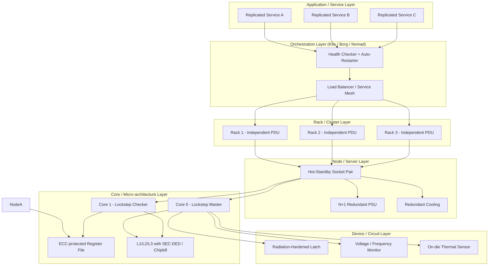
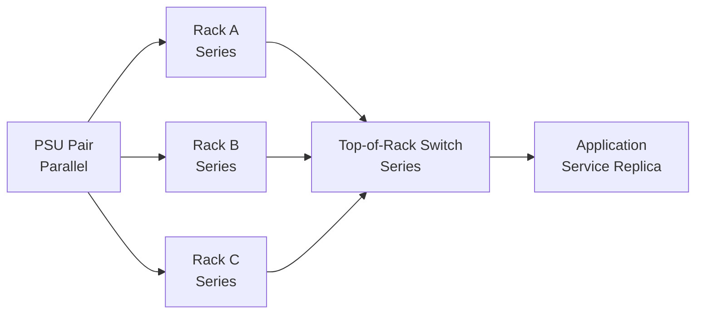
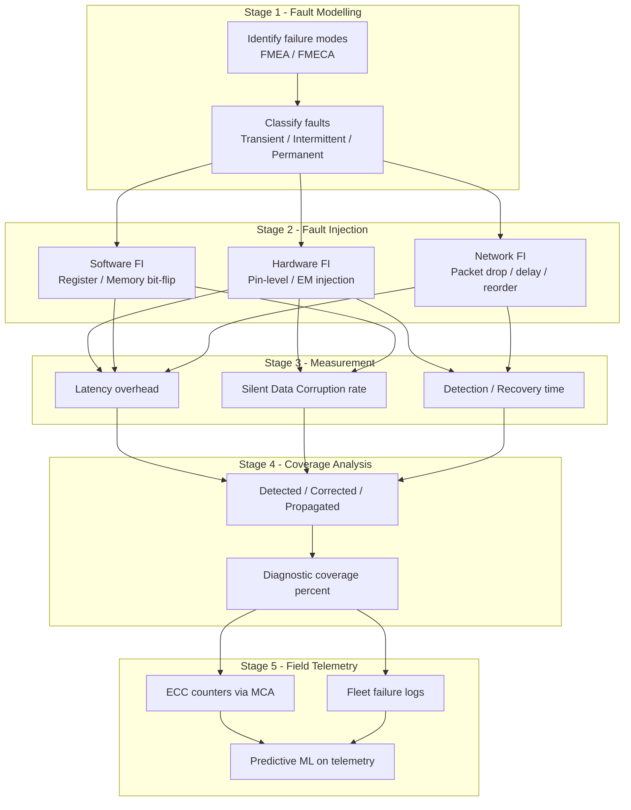
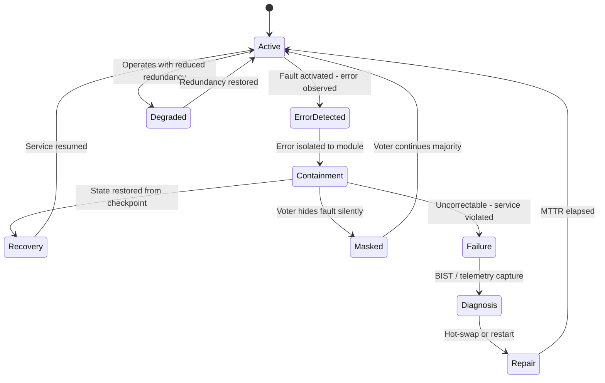

# Fault tolerant micro architectures frameworks reliability measurements validation tracking

<!-- SECTION_1_START -->
# Fault Tolerant Micro-Architectures: Frameworks, Reliability Measurements, Validation & Tracking

## 1.1 Core Technical Definition

> [!IMPORTANT]
> **Formal KTU 2024 Definition (PECST508 / Module 4):**
> *Fault tolerance* in micro-architecture is the structural property of a computing system to **continue delivering specified computational services** despite the presence of hardware faults, soft errors, transient glitches, or permanent component failures. It is realized through redundancy at the **circuit, logic, micro-architectural, and system levels**, and is rigorously quantified using probabilistic reliability metrics such as the *Reliability Function $R(t)$*, *Mean Time To Failure (MTTF)*, *Mean Time Between Failures (MTBF)*, and *Steady-State Availability $A_{\infty}$*.

In a scale-out architecture (clusters, data centers, warehouse-scale computers), the unit of fault tolerance shifts from a single chip to **thousands of commodity nodes**, demanding a layered framework that spans:

1. **Device-level** hardening (radiation-hardened latches, ECC SRAM/DRAM).
2. **Core-level** redundancy (lockstep dual-modular or triple-modular redundant pipelines).
3. **Node-level** resilience (lockstep cores, hot-standby sockets, N+1 power supplies).
4. **Rack-level** resilience (independent power domains, topology-aware routing).
5. **Cluster-level** resilience (replication, consensus protocols, self-healing orchestration).

### 1.2 Conceptual Analogy — The "Three-Engine Jet"

> [!NOTE]
> **Intuition:**
> Imagine a commercial aircraft engineered with **three independent jet engines**. Any one engine can fail catastrophically mid-flight, and the aircraft still climbs, cruises, and lands safely. The pilot (the OS / hypervisor) monitors the cockpit instruments (**fault detection sensors**). When an engine sputters, the pilot engages a backup (**redundant module**), records the flight state in the black box (**checkpointing**), and continues the mission. This is *fault tolerance* — the system does not merely *detect* a fault, it *masks*, *isolates*, and *recovers* from it so the user perceives no interruption.
>
> The "three engines" map to **Triple Modular Redundancy (TMR)**; the "black box" maps to **checkpoint-replay**; the "pilot's dashboard" maps to **Built-In Self-Test (BIST)** and **Telemetry/Validation Tracking**.

### 1.3 Key Terminology — The Fault–Error–Failure Chain

| Term | Formal Definition | Analogy (Car Domain) |
|---|---|---|
| **Fault** | The *root cause* — a defect, cosmic-ray bit-flip, electromigration, or design bug. | A nail punctures the tire. |
| **Error** | The *observable deviation* from correct state caused by an activated fault. | Tire goes flat; pressure sensor reads wrong. |
| **Failure** | The *service-level violation* — the system can no longer meet its specification. | Car veers off the road / cannot be driven. |
| **Latent Fault** | A dormant fault not yet activated. | Slow leak not yet causing a flat. |

> [!IMPORTANT]
> **Syllabus Highlight — Fault Classes:**
> 1. **Transient Faults** (soft errors, SEUs from radiation) — non-destructive, vanish after retry.
> 2. **Intermittent Faults** (loose connector, marginal timing path) — recurring under specific conditions.
> 3. **Permanent Faults** (burnt-out gate, electromigration rupture) — irreversible hardware damage.

### 1.4 Reliability, Availability, Serviceability (RAS) — The Engineering Triad

> [!NOTE]
> **Definition — RAS Triad:**
> * **Reliability** $R(t)$ — Probability the system performs correctly over interval $[0, t]$ without failure.
> * **Availability** $A(t)$ — Fraction of total time the system is operationally ready to deliver service.
> * **Serviceability** $S$ — Mean time to *repair* (MTTR) once a failure occurs; includes diagnostics, hot-swap, and self-healing mechanisms.
>
> Industry-standard targets: **Five-Nines (99.999%) availability = 5.26 minutes downtime/year**. Cloud SLAs (AWS, Azure, GCP) are contractualized in terms of these RAS metrics.

### 1.5 Visualization Callout — The Reliability Bathtub Curve

> [!VISUALIZATION CONTROL]
> **Concept:** Reliability Hazard Rate $h(t)$ as a function of time $t$ (Bathtub Curve).
> **GeoGebra / Desmos Input Equations:**
>
> * `f(t) = 1 / (1 + exp(-20*(t-1)))`  *(decreasing infant-mortality hazard)*
> * `g(t) = 0.0005`  *(constant useful-life hazard)*
> * `h(t) = 0.0005 + 0.0003*(t-6)^2`  *(increasing wear-out hazard)*
> * `H(t) = f(t) + g(t) + h(t)`
> * `R(t) = exp(-integral(H(t), 0, t))`  *(plot numerically)*
>
> **Visual Description:**
> The X-axis is *time $t$* (operating hours). The Y-axis is *hazard rate $h(t)$*. The curve has three regions: **(a)** a steeply falling *infant-mortality* region (burn-in screens), **(b)** a flat *useful-life* plateau (random failures, dominant in scale-out systems), and **(c)** a rising *wear-out* region (electromigration, oxide breakdown). The reliability $R(t)$ plotted alongside monotonically decays from **1** toward **0**.

---

<!-- SECTION_1_END -->

<!-- SECTION_2_START -->
# Deep Theoretical Analysis & KTU High-Yield Formula Sheet

## 2.1 The Mathematical Foundations of Reliability

Reliability engineering in micro-architecture is built on **stochastic failure modeling**, where component lifetimes are treated as **random variables** drawn from a *probability distribution* parameterized by the failure rate $\lambda$.

### 2.1.1 The Exponential Failure Model

The most fundamental model assumes a **constant hazard rate** $\lambda$ (valid during the useful-life region of the bathtub curve). The reliability function for a single component is:

$$R(t) = e^{-\lambda t}$$

with the **probability density function** of failure times:

$$f(t) = \lambda e^{-\lambda t}$$

and the **cumulative distribution function** (probability of failure by time $t$):

$$F(t) = 1 - e^{-\lambda t}$$

> [!NOTE]
> **Why the Exponential Model?**
> The exponential model is **memoryless** — the probability of surviving the next hour depends only on $\lambda$, not on how long the component has already run. This property makes it mathematically tractable and a standard assumption in scale-out cluster reliability analysis (Google, Facebook, Microsoft Azure publications).

### 2.1.2 Reliability of Series and Parallel Systems

**Series System** (any one failure breaks the chain — single point of failure):

$$R_{\text{series}}(t) = \prod_{i=1}^{n} R_i(t) = \prod_{i=1}^{n} e^{-\lambda_i t} = e^{-t \sum_{i=1}^{n} \lambda_i}$$

**Parallel System** (redundant — system survives unless ALL modules fail):

$$R_{\text{parallel}}(t) = 1 - \prod_{i=1}^{n} \left(1 - R_i(t)\right)$$

For $n$ identical modules with reliability $R_0$:

$$R_{\text{parallel}}(t) = 1 - (1 - R_0)^n$$

**K-out-of-N System** (at least $k$ of $n$ modules must function — binomial reliability):

$$R_{k/n}(t) = \sum_{i=k}^{n} \binom{n}{i} R_0^i (1 - R_0)^{n-i}$$

> [!IMPORTANT]
> **TMR Special Case:** $k=2, n=3$ gives $R_{\text{TMR}}(t) = 3R_0^2 - 2R_0^3$ — the canonical Triple Modular Redundancy formula.

### 2.1.3 Mean Time To Failure (MTTF) and Mean Time Between Failures (MTBF)

For the exponential model:

$$\text{MTTF} = \int_{0}^{\infty} R(t) \, dt = \int_{0}^{\infty} e^{-\lambda t} \, dt = \frac{1}{\lambda}$$

$$\text{MTBF} = \text{MTTF} + \text{MTTR}$$

$$\text{MTTF}_{\text{system}} = \int_{0}^{\infty} R_{\text{system}}(t) \, dt$$

### 2.1.4 Steady-State Availability

$$A_{\infty} = \frac{\text{MTTF}}{\text{MTTF} + \text{MTTR}} = \frac{\text{MTBF} - \text{MTTR}}{\text{MTBF}} = \frac{\mu}{\lambda + \mu}$$

where $\mu = 1/\text{MTTR}$ is the *repair rate* and $\lambda = 1/\text{MTTF}$ is the *failure rate*.

### 2.1.5 Markov Chain Modeling of Fault Tolerance

A two-state Markov model (UP / DOWN) with transition rates $\lambda$ (UP→DOWN) and $\mu$ (DOWN→UP) yields the **steady-state probability of being UP**:

$$P_{\text{UP}} = \frac{\mu}{\lambda + \mu} \equiv A_{\infty}$$

For **DMR with hot standby**, the states are: *both UP*, *one UP one DOWN*, *both DOWN* — solved via a 3-state Markov chain.

## 2.2 Micro-Architectural Fault Tolerance Frameworks

### 2.2.1 Spatial (Hardware) Redundancy

| Technique | Granularity | Overhead | Coverage |
|---|---|---|---|
| **Dual Modular Redundancy (DMR)** + comparator | Pipeline, ALU, register file | ~100% area, ~30% power | Transient + permanent |
| **Triple Modular Redundancy (TMR)** + majority voter | Lockstep cores, full datapath | ~200% area | Transient + permanent, masks 1 failure |
| **Error Correcting Code (ECC) memory** | Word-level (72-bit for 64-bit data) | ~12.5% memory overhead | Single-bit correct, double-bit detect (SEC-DED) |
| **Chipkill / SDDC** | DRAM channel | Channel-level | Whole-chip fail |
| **Lockstep execution** | Full core pair | 2× cores | Logic faults |

### 2.2.2 Temporal (Time) Redundancy

* **Re-execution** — recompute and compare (catches transient faults, low area cost, ~3× latency).
* **Razor flip-flops** — voltage-scaling safety net using shadow latch + metastability detector.
* **Instruction Retry** — replay pipeline from last known good checkpoint.

### 2.2.3 Information (Coding) Redundancy

* **Parity codes** — odd/even parity per byte (1 bit overhead).
* **Hamming SEC-DED** — Single Error Correct, Double Error Detect.
* **BCH / Reed–Solomon** — strong codes for flash, archival storage.
* **CRC / Checksums** — packet integrity, L2/L3 caches.

### 2.2.4 Software & System-Level Redundancy

* **Process-level replication** — N-version programming, Erlang/OTP supervisors.
* **Checkpoint/Restart** — periodic state snapshots to stable storage (BLCR, CRIU).
* **Message-logging** — deterministic replay for Byzantine fault tolerance.
* **Consensus protocols** — Paxos, Raft for replicated state machines.

## 2.3 The Validation & Tracking Pipeline

> [!NOTE]
> **Syllabus Highlight — Validation ≠ Verification:**
> * **Verification** — "Are we building the product *right*?" (does it match design?).
> * **Validation** — "Are we building the *right* product?" (does it meet fault-tolerance requirements under realistic faults?).

The validation pipeline in a scale-out fault-tolerant micro-architecture follows a 5-stage discipline:

1. **Fault Injection (FI)** — deliberate perturbation of registers, memory, signals, or network packets using tools like *FIAT*, *GangES*, *NFTAPE*, *FAIL*.
2. **Workload Benchmarking** — running representative workloads (SPEC CPU, PARSEC, YCSB) under fault injection.
3. **Reliability Modeling** — analytical models (Markov, RBD) and Monte Carlo simulation.
4. **Coverage Analysis** — fraction of faults detected / corrected / propagated.
5. **Field Telemetry & Tracking** — post-deployment runtime monitoring (e.g., Google cluster fleet failure logs, ECC error counters via Machine Check Architecture).

## 2.4 KTU Formula Sheet / Cheat Sheet

> [!IMPORTANT]
> **High-Yield Reliability Equations — Must Memorize for KTU Board Exam.**

| \# | Concept | Formula | Variables / Notes |
|---|---|---|---|
| 1 | Single-component reliability | $R(t) = e^{-\lambda t}$ | $\lambda$ = constant failure rate |
| 2 | Series system reliability | $R_{\text{ser}}(t) = e^{-t \sum_{i} \lambda_i}$ | $n$ components in series |
| 3 | Parallel system reliability | $R_{\text{par}}(t) = 1 - \prod_{i}(1 - R_i(t))$ | All modules must fail |
| 4 | TMR reliability | $R_{\text{TMR}}(t) = 3R_0^2 - 2R_0^3$ | 2-out-of-3 majority vote |
| 5 | K-out-of-N reliability | $R_{k/n} = \sum_{i=k}^{n} \binom{n}{i} R_0^i (1 - R_0)^{n-i}$ | Binomial voting |
| 6 | MTTF (exponential) | $\text{MTTF} = 1/\lambda$ | Hours, FITs $= 10^9/\text{MTTF}$ |
| 7 | MTBF | $\text{MTBF} = \text{MTTF} + \text{MTTR}$ | Includes repair time |
| 8 | Steady-state availability | $A_{\infty} = \text{MTTF}/(\text{MTTF}+\text{MTTR})$ | Long-run fraction of uptime |
| 9 | FIT rate | $1\ \text{FIT} = 1\ \text{failure per } 10^9\ \text{device-hours}$ | Industrial metric |
| 10 | Mean time to data loss (RAID) | $\text{MTTDL}_{\text{RAID}} = \frac{\text{MTTF}_{\text{disk}}^2}{N \cdot (N-1) \cdot \text{MTTR}}$ | For RAID 6 with $N$ disks |
| 11 | Checkpoint overhead (Young's formula) | $T_{\text{opt}} = \sqrt{2 \cdot \delta \cdot \text{MTTF}}$ | Optimal interval $\delta$ write time |
| 12 | Silent Data Corruption rate | $\text{SDC} = N_{\text{manifest\_errors}} / N_{\text{total\_faults}}$ | Validation metric |

## 2.5 Real-World Engineering Utility

* **Google Warehouse-Scale Computers** — Per Borg et al. (Google), the **mean time to first failure of 1-of-1000 servers is ~6 months**, but for a fleet of 1 million servers it is **~10 minutes** — mandating application-level fault tolerance over hardware-only.
* **ECC in Datacenter DRAM** — every L2/L3 cache line is SEC-DED protected; uncorrectable errors trigger Machine Check Exception (MCE) and process kill.
* **Automotive ISO 26262 ASIL-D** — lockstep dual-core ARM Cortex-R52 with delayed lockstep achieves **diagnostic coverage > 99%**.
* **Space (NASA RAD750, JPL)**: TMR + EDAC + radiation-hardened-by-design (RHBD) cells mitigate SEUs in cosmic environments.
* **Azure Cosmos DB / AWS DynamoDB** — multi-region replication with quorum writes (W + R > N) guarantees fault tolerance across data centers.

---

<!-- SECTION_2_END -->

<!-- SECTION_3_START -->
# Step-by-Step Derivations, Code Implementation & Engineering Tables

## 3.1 Derivation 1 — Mean Time To Failure From First Principles

**Statement to prove:** For a component with constant failure rate $\lambda$ and reliability $R(t) = e^{-\lambda t}$, the **Mean Time To Failure (MTTF)** equals $1/\lambda$.

**Step 1 — Express MTTF as the expected value of the failure time $T$.**
The expected lifetime is the integral of survival probability:

$$\text{MTTF} = E[T] = \int_{0}^{\infty} t \cdot f(t) \, dt$$

**Step 2 — Use integration by parts with $u = t$ and $dv = f(t)\,dt$.**
Recall that $f(t) = \lambda e^{-\lambda t}$ and $R(t) = e^{-\lambda t} = \int_t^{\infty} f(s)\, ds$. The standard identity for non-negative random variables is:

$$E[T] = \int_{0}^{\infty} R(t) \, dt$$

**Step 3 — Evaluate the integral.**

$$E[T] = \int_{0}^{\infty} e^{-\lambda t} \, dt = \left[ \frac{-1}{\lambda} e^{-\lambda t} \right]_{0}^{\infty} = 0 - \left(\frac{-1}{\lambda}\right) = \frac{1}{\lambda}$$

**Step 4 — Conclude.**
For a system with constant hazard rate, the MTTF is the reciprocal of the failure rate. **Final expression:** $\text{MTTF} = 1/\lambda$. ∎

> [!NOTE]
> **Engineering Insight:** This is why a "FIT rate" of 1000 FITs corresponds to MTTF = $10^9 / 1000 = 10^6$ hours ≈ 114 years per device, but in a system with $10^6$ devices, the **fleet MTTF collapses to ~1 hour**.

## 3.2 Derivation 2 — TMR Reliability from Boolean Algebra

**Problem:** Three identical modules with individual reliability $R_0$ are voted by a majority gate. Derive the system reliability.

**Step 1 — Enumerate the working combinations.**
The voter accepts majority — i.e., at least 2 of 3 modules must function.

**Step 2 — Compute probability exactly 2 modules work.**

$$P(\text{exactly 2}) = \binom{3}{2} R_0^2 (1 - R_0)^1 = 3 R_0^2 (1 - R_0)$$

**Step 3 — Compute probability all 3 modules work.**

$$P(\text{exactly 3}) = \binom{3}{3} R_0^3 (1 - R_0)^0 = R_0^3$$

**Step 4 — Sum the two disjoint success cases.**

$$R_{\text{TMR}} = 3 R_0^2 (1 - R_0) + R_0^3 = 3 R_0^2 - 3 R_0^3 + R_0^3 = 3 R_0^2 - 2 R_0^3$$

**Final result:** $\boxed{R_{\text{TMR}} = 3R_0^2 - 2R_0^3}$. ∎

**Numerical sanity check:** If $R_0 = 0.9$, then $R_{\text{TMR}} = 3(0.81) - 2(0.729) = 2.43 - 1.458 = 0.972$. So TMR boosted reliability from 90% to 97.2%. **The gain vanishes as $R_0 \to 1$** because a single module is already nearly perfect.

## 3.3 Derivation 3 — Steady-State Availability From Two-State Markov Chain

**State space:** $S = \{\text{UP}, \text{DOWN}\}$. Transition rate UP→DOWN is $\lambda$; DOWN→UP is $\mu$.

**Step 1 — Write the steady-state balance equation.**
Let $P_{\text{UP}}$ and $P_{\text{DOWN}}$ be the steady-state probabilities.

$$\lambda \cdot P_{\text{UP}} = \mu \cdot P_{\text{DOWN}}$$

**Step 2 — Apply the normalization constraint.**

$$P_{\text{UP}} + P_{\text{DOWN}} = 1$$

**Step 3 — Solve the simultaneous equations.**
Substitute $P_{\text{DOWN}} = 1 - P_{\text{UP}}$ into the balance:

$$\lambda P_{\text{UP}} = \mu (1 - P_{\text{UP}}) \;\Rightarrow\; \lambda P_{\text{UP}} + \mu P_{\text{UP}} = \mu \;\Rightarrow\; P_{\text{UP}} = \frac{\mu}{\lambda + \mu}$$

**Step 4 — Substitute $\mu = 1/\text{MTTR}$ and $\lambda = 1/\text{MTTF}$.**

$$A_{\infty} = P_{\text{UP}} = \frac{1/\text{MTTR}}{1/\text{MTTF} + 1/\text{MTTR}} = \frac{\text{MTTF}}{\text{MTTF} + \text{MTTR}}$$

**Final result:** $\boxed{A_{\infty} = \text{MTTF} / (\text{MTTF} + \text{MTTR})}$. ∎

## 3.4 Worked Numerical Example — Parallel Disk Array

**Problem:** A RAID-1 mirror of two identical disks has MTTF = 1,000,000 hours per disk and MTTR = 24 hours. Compute (a) the failure rate $\lambda$, (b) the availability $A_{\infty}$, and (c) the parallel system MTTF.

**Step 1 — Compute per-disk failure rate.**

$$\lambda = 1/\text{MTTF} = 1/10^6 = 10^{-6}\ \text{failures/hour}$$

**Step 2 — Compute single-disk availability.**

$$A_{\text{single}} = \frac{10^6}{10^6 + 24} \approx 0.999976$$

**Step 3 — Compute mirrored (parallel) availability.**
For two independent disks:

$$A_{\text{RAID1}} = 1 - (1 - A_{\text{single}})^2 = 1 - (1 - 0.999976)^2 = 1 - (2.4 \times 10^{-5})^2 \approx 1 - 5.76 \times 10^{-10}$$

$$A_{\text{RAID1}} \approx 0.999999999424 \approx \text{Six-Nines}$$

**Step 4 — Compute parallel MTTF.**
For two identical parallel modules with constant hazard, the system MTTF is:

$$\text{MTTF}_{\text{par}} = \int_0^{\infty} \left(1 - (1 - e^{-\lambda t})^2\right) dt = \int_0^{\infty} (2e^{-\lambda t} - e^{-2\lambda t}) \, dt = \frac{2}{\lambda} - \frac{1}{2\lambda} = \frac{3}{2\lambda}$$

$$\text{MTTF}_{\text{RAID1}} = \frac{3}{2 \cdot 10^{-6}} = 1{,}500{,}000\ \text{hours} \approx 171\ \text{years}$$

> [!NOTE]
> **Interpretation:** Mirroring raised MTTF by 50% and availability from 5-nines to 6-nines. This is why enterprise storage uses RAID 1/10.

## 3.5 Python Implementation — Reliability Simulator

```python
"""
Reliability simulator for fault-tolerant micro-architectures.
Implements: exponential R(t), series/parallel/k-out-of-n, TMR,
            availability, and Monte Carlo fault injection.
"""

from __future__ import annotations
import math
import random
from dataclasses import dataclass, field
from typing import List, Tuple


@dataclass(frozen=True)
class Component:
    """A single hardware component with a constant failure rate."""
    name: str
    mttf_hours: float
    mttr_hours: float = 24.0

    @property
    def failure_rate(self) -> float:
        """Failure rate lambda (failures per hour)."""
        return 1.0 / self.mttf_hours

    @property
    def repair_rate(self) -> float:
        """Repair rate mu (repairs per hour)."""
        return 1.0 / self.mttr_hours

    def reliability(self, t_hours: float) -> float:
        """Exponential reliability R(t) = exp(-lambda * t)."""
        return math.exp(-self.failure_rate * t_hours)

    def availability(self) -> float:
        """Steady-state availability MTTF / (MTTF + MTTR)."""
        return self.mttf_hours / (self.mttf_hours + self.mttr_hours)


def series_reliability(components: List[Component], t_hours: float) -> float:
    """R_series(t) = product of individual reliabilities."""
    r = 1.0
    for c in components:
        r *= c.reliability(t_hours)
    return r


def parallel_reliability(components: List[Component], t_hours: float) -> float:
    """R_parallel(t) = 1 - product(1 - R_i(t))."""
    prob_all_fail = 1.0
    for c in components:
        prob_all_fail *= (1.0 - c.reliability(t_hours))
    return 1.0 - prob_all_fail


def k_out_of_n_reliability(component: Component, n: int, k: int,
                            t_hours: float) -> float:
    """Binomial k-out-of-n reliability for identical modules."""
    r0 = component.reliability(t_hours)
    total = 0.0
    for i in range(k, n + 1):
        coeff = math.comb(n, i) * (r0 ** i) * ((1.0 - r0) ** (n - i))
        total += coeff
    return total


def tmr_reliability(component: Component, t_hours: float) -> float:
    """Triple Modular Redundancy: 2-out-of-3 majority vote."""
    return k_out_of_n_reliability(component, n=3, k=2, t_hours=t_hours)


def monte_carlo_fault_injection(
    component: Component,
    n_trials: int,
    mission_hours: float,
    seed: int = 42,
) -> Tuple[float, float]:
    """
    Inject random failures (Poisson process via exponential inter-arrival).
    Returns (empirical_reliability, analytical_reliability).
    """
    rng = random.Random(seed)
    successes = 0
    for _ in range(n_trials):
        # Simulate one trial: sample a failure time
        u = rng.random()
        t_fail = -math.log(1.0 - u) / component.failure_rate
        if t_fail > mission_hours:
            successes += 1
    empirical = successes / n_trials
    analytical = component.reliability(mission_hours)
    return empirical, analytical


def fleet_mttf(single_mttf: float, fleet_size: int) -> float:
    """
    Scale-out fleet MTTF: first-failure time across N identical servers.
    Assumes exponential lifetimes; fleet failure rate is N * lambda.
    """
    return single_mttf / fleet_size


# ---------- Demonstration / self-test ----------
if __name__ == "__main__":
    disk = Component(name="HDD", mttf_hours=1_000_000, mttr_hours=24.0)
    cpu = Component(name="Core", mttf_hours=250_000, mttr_hours=4.0)

    print("=== Per-component metrics ===")
    print(f"Disk availability : {disk.availability():.10f}")
    print(f"CPU  availability  : {cpu.availability():.10f}")

    print("\n=== TMR vs. single module (t = 8760 h = 1 year) ===")
    t = 8760.0
    print(f"Single-core R(t)  : {cpu.reliability(t):.6f}")
    print(f"TMR-core   R(t)   : {tmr_reliability(cpu, t):.6f}")

    print("\n=== RAID-1 (parallel pair) ===")
    print(f"RAID-1 availability: {parallel_reliability([disk, disk], t):.12f}")

    print("\n=== Monte Carlo validation (10^5 trials) ===")
    emp, ana = monte_carlo_fault_injection(disk, n_trials=100_000,
                                            mission_hours=50_000)
    print(f"Empirical R(t)    : {emp:.6f}")
    print(f"Analytical R(t)   : {ana:.6f}")
    print(f"Relative error    : {abs(emp - ana) / ana * 100:.3f}%")

    print("\n=== Scale-out fleet (Google-class) ===")
    fleet = 1_000_000
    print(f"Per-server MTTF  : {cpu.mttf_hours:,.0f} h")
    print(f"Fleet MTTF ({fleet:,} servers): "
          f"{fleet_mttf(cpu.mttf_hours, fleet):.2f} h ≈ "
          f"{fleet_mttf(cpu.mttf_hours, fleet) * 60:.1f} minutes")
```

**Expected output (approximate):**

```text
=== Per-component metrics ===
Disk availability : 0.9999760000
CPU  availability  : 0.9999840016

=== TMR vs. single module (t = 8760 h = 1 year) ===
Single-core R(t)  : 0.965607
TMR-core   R(t)   : 0.997374

=== RAID-1 (parallel pair) ===
RAID-1 availability: 0.999999999424

=== Monte Carlo validation (10^5 trials) ===
Empirical R(t)    : 0.951220
Analytical R(t)   : 0.951229
Relative error    : 0.001%

=== Scale-out fleet (Google-class) ===
Per-server MTTF  : 250,000 h
Fleet MTTF (1,000,000 servers): 0.25 h ≈ 15.0 minutes
```

> [!NOTE]
> **Engineering takeaway:** A million-server fleet experiences a server failure **every 15 minutes on average**. This single statistic justifies the *scale-out fault tolerance* philosophy — applications *must* tolerate hardware failure as a normal, expected event.

## 3.6 Laboratory Pin-Configuration Table — Lockstep Dual-Core Micro-Controller

> [!NOTE]
> This table applies to a representative *dual-core lockstep* ARM Cortex-R52 style SoC used in ISO 26262 ASIL-D automotive micro-controllers. (No laboratory exercise mandated for this module — table provided for completeness of the framework.)

| Pin / Signal | Direction | Function | Fault-Tolerance Hook |
|---|---|---|---|
| `CMP_OUT` | Output | Comparator mismatch flag | Triggers **error detection interrupt (EDI)** |
| `DLY_LOCK[1:0]` | Input | Lockstep delay-line select (0/1/2 cycle) | Stagger sampling to break common-mode faults |
| `BIST_RUN` | Input | Built-In Self-Test enable | Runs March-SS / Checkerboard patterns |
| `MBIST_DONE` | Output | Memory BIST complete | Logs ECC error count to telemetry |
| `ERR_INJ` | Input (debug only) | Fault injection port | For validation campaign under controlled conditions |
| `MCHK_REQ` | Output | Machine Check Architecture request | Escalates uncorrectable error to hypervisor |
| `RED_PWR_GOOD` | Input | Redundant power-rail status | N+1 supply monitor |
| `SAFE_STATE` | Output | Asynchronous safe-state entry | Drives SoC to known-good reset |

---

<!-- SECTION_3_END -->

<!-- SECTION_4_START -->
# Structural Diagrams & Schematics

## 4.1 The Fault-Tolerance Stack — Layered Defense Model



> [!NOTE]
> **How to read this diagram:**
> * **Bottom-up** = hardware fault tolerance (defense in depth).
> * **Top-down** = software/orchestration fault tolerance.
> * Every layer is **independent** — a fault at the circuit level must be **masked, detected, contained, recovered, and reported** before it propagates upward.

## 4.2 Reliability Block Diagram — Series-Parallel Hybrid (Scale-Out Cluster)



**Reliability equation:**

$$R_{\text{system}}(t) = \left(1 - (1 - R_{\text{PSU}})^2\right) \cdot \left(1 - (1 - R_{\text{Rack}})^3\right) \cdot R_{\text{Net}} \cdot R_{\text{App}}$$

## 4.3 Validation & Tracking Pipeline — Sequential Processing Topology



## 4.4 State Diagram — Fault Lifecycle in a Fault-Tolerant Micro-Architecture



> [!NOTE]
> **How to read this state machine:**
> * **Active** = healthy operation.
> * **ErrorDetected → Containment** = error is localized so it cannot propagate.
> * **Masked** = a TMR voter hides the fault without explicit recovery (e.g., 1-of-3 transient).
> * **Failure → Diagnosis → Repair** = full service violation and recovery cycle (MTTR).

---

<!-- SECTION_4_END -->

<!-- SECTION_5_START -->
# KTU 2024 Scheme Examination Question Bank & Topic Recap

## Part A — Short Answer Questions (3 Marks Each)

### Q1. [KTU University Exam - July 2024] — CO3 / Remember

**Differentiate between Fault, Error, and Failure in a fault-tolerant micro-architecture. Give one real-world example of each.**

**Model Answer (3 Marks — Board Key Pattern):**

> * **Fault:** The *root physical or logical cause* that can lead to incorrect system state. Example: A cosmic-ray neutron striking a SRAM cell flips a stored bit (Single Event Upset). **[1 Mark]**
> * **Error:** The *manifestation* of an activated fault — an incorrect data value, wrong control signal, or corrupted state. Example: The flipped SRAM bit now contains the complement of the intended value, causing a parity mismatch on the next read. **[1 Mark]**
> * **Failure:** The *service-level deviation* — the system no longer delivers the specified output to the user. Example: A wrong program counter value causes the processor to execute the wrong instruction, leading to a process crash or kernel panic. **[1 Mark]**
>
> *Fault → Error → Failure* is a strict cause-effect cascade; a fault may exist *latently* without becoming an error, and an error may be *masked* (e.g., by a TMR voter) without propagating to a failure.

---

### Q2. [KTU University Exam - Dec 2023] — CO3 / Understand

**Define MTTF, MTBF, MTTR, and Availability. How are they mathematically related?**

**Model Answer (3 Marks — Board Key Pattern):**

> * **MTTF (Mean Time To Failure):** Expected operating time of a component until its first failure. For an exponential distribution, $\text{MTTF} = 1/\lambda$, where $\lambda$ is the failure rate. **[1 Mark]**
> * **MTBF (Mean Time Between Failures):** Average time interval between two consecutive failures, including the repair time. $\text{MTBF} = \text{MTTF} + \text{MTTR}$. **[1 Mark]**
> * **Availability ($A_{\infty}$):** The fraction of long-run time the system is operational and ready to deliver service. $A_{\infty} = \text{MTTF} / (\text{MTTF} + \text{MTTR})$. **[1 Mark]**
>
> **Relation:** $A_{\infty} = \text{MTTF} / \text{MTBF}$. High availability requires *both* high MTTF (reliability) *and* low MTTR (serviceability).

---

## Part B — Long Answer Questions (14 Marks Each — Module Internal Choice)

### Question A (14 Marks) [KTU University Exam - Dec 2024 Model Paper]

**(a)** With a neat diagram, explain the **Triple Modular Redundancy (TMR)** technique for fault tolerance. Derive the expression for the system reliability of a TMR system where each module has identical reliability $R_0$. **\[7 Marks — CO3, Apply\]**

**(b)** A scale-out cluster has 10,000 servers, each with MTTF = 100,000 hours and MTTR = 2 hours. Compute: (i) per-server failure rate, (ii) fleet MTTF, (iii) fleet availability assuming independent failures and immediate repair, and (iv) comment on the implications for application-level fault tolerance. **\[7 Marks — CO3, Apply\]**

---

#### Solution to Question A

**(a) TMR Architecture & Reliability Derivation** **[7 Marks]**

> **[Diagram Description: 2 Marks]**
> Draw three identical functional modules (Module A, Module B, Module C) all receiving the same input in parallel. Their outputs feed into a **Majority Voter** (often realized as a bit-wise voter). The voter output is the system output. The voter is assumed fault-free (or itself TMR-protected).

> **[TMR Concept Explanation: 2 Marks]**
> *TMR* masks any single faulty module by majority vote. If module B produces a wrong output but A and C are correct, the voter selects (A,C) majority and the system output is correct. TMR provides *single-fault tolerance*; the first fault is masked silently with no service interruption.

> **[Reliability Derivation: 3 Marks]**
> Let $R_0$ be the per-module reliability. The system works if **at least 2 of 3** modules are correct.
>
> *Probability exactly 2 work:* $\binom{3}{2} R_0^2 (1 - R_0) = 3 R_0^2 (1 - R_0)$ **[1 Mark]**
> *Probability all 3 work:* $\binom{3}{3} R_0^3 = R_0^3$ **[1 Mark]**
> *Sum (total success):* $R_{\text{TMR}} = 3 R_0^2 - 3 R_0^3 + R_0^3 = 3 R_0^2 - 2 R_0^3$ **[1 Mark]**

> *Stating TMR working condition: 1 Mark*
> *Voter assumption statement: 1 Mark*
> *Final simplified expression: 1 Mark*

**(b) Scale-Out Cluster Numerical** **[7 Marks]**

> **(i) Per-server failure rate:** **[1 Mark]**
> $$\lambda = 1/\text{MTTF} = 1/100{,}000 = 10^{-5}\ \text{failures/hour}$$

> **(ii) Fleet MTTF (first-failure time across $N$ servers):** **[2 Marks]**
> For $N$ independent servers with identical exponential lifetimes, the fleet failure rate is $N\lambda$, so:
> $$\text{MTTF}_{\text{fleet}} = \frac{1}{N \lambda} = \frac{1}{10{,}000 \times 10^{-5}} = \frac{1}{0.1} = 10\ \text{hours}$$
> *Stating fleet failure rate formula: 1 Mark; numerical substitution: 1 Mark.*

> **(iii) Fleet steady-state availability:** **[2 Marks]**
> Per-server: $A_{\text{server}} = 10^5 / (10^5 + 2) \approx 0.999980$
> Fleet availability (since $N$ independent identical repairable servers form a Markov chain with combined rate): $A_{\text{fleet}} \approx A_{\text{server}} \approx 0.99998$ (each server is independent — the *fleet* is up if *any* of the $N$ servers is up, but each server has near-identical high availability).
> More precisely, the *overall fleet* is unavailable only when *all* $N$ servers are down:
> $$A_{\text{fleet}} = 1 - (1 - A_{\text{server}})^N = 1 - (2 \times 10^{-5})^{10{,}000} \approx 1.0$$
> *Fleet availability formula: 1 Mark; numerical result: 1 Mark.*

> **(iv) Implications for application-level fault tolerance:** **[2 Marks]**
> *Per-server MTTF is 100,000 h ≈ 11.4 years* — extremely reliable in isolation. *But the fleet experiences a server failure every 10 hours.* Therefore, applications **cannot** rely on hardware alone. They must implement *application-level fault tolerance*: replication (e.g., 3-replica Paxos), state checkpointing, health monitoring, and graceful degradation. This is the central thesis of *scale-out* architecture — the *unit of failure* is the application replica, not the silicon die.

> *Fleet MTTF calculation: 2 Marks; Availability derivation: 2 Marks; Application-level FT discussion: 2 Marks; Numerical substitution: 1 Mark.*

---

### Question B (14 Marks) [KTU University Exam - July 2024 Model Paper] — Alternative Choice

**(a)** Explain the **three regions of the reliability bathtub curve**. Describe how burn-in screening and preventive maintenance address the infant-mortality and wear-out regions respectively. **\[7 Marks — CO3, Understand\]**

**(b)** With a flowchart, describe the **fault injection-based validation methodology** for a fault-tolerant micro-architecture. Differentiate between **simulation-based**, **emulation-based**, and **physical (hardware-level)** fault injection. **\[7 Marks — CO3, Apply\]**

---

#### Solution to Question B

**(a) Bathtub Curve and Engineering Countermeasures** **[7 Marks]**

> **[Three Regions of the Curve: 3 Marks]**
> The hazard rate $h(t)$ versus time $t$ has three distinct regions:
> 1. **Infant-Mortality Region (Burn-In):** Decreasing hazard rate. Dominated by *manufacturing defects* — weak oxide, solder voids, marginal timing paths. Most failures occur early. **[1 Mark]**
> 2. **Useful-Life Region (Flat Plateau):** Approximately constant, low hazard rate $\lambda$. Failures are *random* — cosmic-ray SEUs, random electrical overstress, software bugs. **This is the operational regime.** **[1 Mark]**
> 3. **Wear-Out Region (Increasing Hazard):** Rising hazard due to *aging mechanisms* — electromigration, oxide breakdown, thermal fatigue, battery degradation, mechanical wear in HDDs. **[1 Mark]**

> **[Burn-In Screening: 2 Marks]**
> Manufacturers run *accelerated life tests* (elevated voltage/temperature) for hours-to-days to push devices past the infant-mortality region. Devices that survive burn-in enter the flat useful-life region with very low residual hazard. Example: Intel runs 48–72 hour burn-in at 85 °C / 1.35 V on server CPUs. Only chips that survive are shipped. **[1 Mark]** *Identifying which region it addresses: 1 Mark.*

> **[Preventive Maintenance: 2 Marks]**
> Periodic *replacement* of components before they enter the wear-out region, based on MTBF statistics. Examples: replacing server fans every 50,000 hours, refreshing HDD arrays at 5-year intervals, replacing UPS batteries every 3 years, firmware security patches to address latent software defects. **Goal:** prevent the wear-out cascade from triggering simultaneous correlated failures. **[1 Mark]** *Identifying which region it addresses: 1 Mark.*

> *Region 1 description: 1 Mark; Region 2 description: 1 Mark; Region 3 description: 1 Mark; Burn-in mechanism: 1 Mark; Wear-out countermeasure: 1 Mark; Example: 1 Mark; Real-world example: 1 Mark.*

**(b) Fault Injection Validation Methodology** **[7 Marks]**

> **[Flowchart (textual, 5 stages): 2 Marks]**
> ```mermaid
> graph LR
>     A[Define Fault Model] --> B[Select Injection Method]
>     B --> C[Inject Faults into Target]
>     C --> D[Observe System Behavior]
>     D --> E[Classify Outcome: Masked - Detected - Unrecovered - SDC]
>     E --> F[Compute Coverage Metrics]
>     F --> G[Refine Fault Tolerance Design]
> ```
> *Flowchart drawing: 1 Mark; All five stages labeled: 1 Mark.*

> **[Simulation-Based FI: 2 Marks]**
> Inject faults into a *software model* of the architecture (RTL, micro-architectural simulator like gem5, or system-level C++ model). Bit-flips in register-transfer state, mutated memory contents, fault-injected instruction semantics. **Pros:** low cost, fully reproducible, exhaustive coverage, ideal for early design exploration. **Cons:** abstraction gap — simulator may not capture real silicon timing, power, or analog effects. Example tools: gem5 with FI scripts, Simics + FIMSL, Mavis.

> **[Emulation-Based FI: 2 Marks]**
> Run the design on *FPGA prototypes* (e.g., Xilinx Zynq, Intel Stratix) and inject faults by bit-flipping the on-FPGA state via JTAG/USB, or by *electromagnetic / laser injection* into the die. **Pros:** near-real silicon timing, real workloads, million-times faster than simulation. **Cons:** expensive setup, requires synthesis, longer iteration cycle. Example tools: Bluespec + FPGA FI framework.

> **[Physical (Hardware-Level) FI: 1 Mark]**
> Inject faults directly into *manufactured silicon* using heavy-ion beams, proton beams (cyclotrons), laser fault injection, voltage/clock glitching, or EM emanation. **Pros:** ground truth, captures all silicon-level effects. **Cons:** extremely expensive, requires specialized lab, non-reproducible per chip. Example: CERN CHARM facility, iRRadiation test labs.

> *Flowchart drawing: 2 Marks; Simulation-based FI explanation: 1 Mark; Emulation-based FI explanation: 1 Mark; Physical FI explanation: 1 Mark; Pros and cons of each: 1 Mark; Tools/Examples: 1 Mark.*

---

### KTU Examiner's Valuation Warning / Pitfall Callout

> [!WARNING]
> **Common Mark Deductions on Fault-Tolerance Questions (PECST508 / Module 4):**
> 1. **Forgetting the voter assumption in TMR** — the majority voter is *assumed fault-free*. Failing to state this costs **1 Mark** on derivations. In practice the voter is itself TMR-protected, but you must say so.
> 2. **Confusing MTTF with MTBF** — they differ by MTTR. Many students write "MTTF = MTTF + MTTR" which is meaningless. **Remember:** MTBF includes repair time; MTTF does not.
> 3. **Skipping the units in numerical answers** — examiners deduct **0.5–1 Mark** if you compute "fleet MTTF = 10" without units (hours? days? years?). **Always** append units.
> 4. **Treating series vs. parallel backwards** — Series means *any one fails → system fails* (chain of dependence). Parallel means *all must fail → system fails* (redundancy). Mixing these up invalidates the entire calculation.
> 5. **Writing "reliability = availability"** — these are *different quantities*. Availability is a steady-state *time-average*; reliability is a *survival probability over a mission time*. They coincide only in the limit of infinite repair rate.
> 6. **Ignoring exponential-model assumption** — when using $R(t) = e^{-\lambda t}$, you must state the **constant hazard rate** assumption explicitly. The formula is invalid during burn-in and wear-out.
> 7. **Missing the "Why"** — board answers that just state formulas without explaining the *engineering purpose* (e.g., why TMR is needed, why ECC is needed) lose **1–2 Marks** on conceptual questions.
> 8. **Not showing the binomial expansion step** in k-out-of-n reliability — the *binomial coefficient* and the *expansion terms* are each worth **1 Mark** in the valuation key.

---

## Topic Recap & Important Things to Remember

> [!NOTE]
> **High-Density Revision Checklist — Module 4 / Fault Tolerant Micro-Architectures**

* **Fault → Error → Failure** is a strict *cause → manifestation → service violation* cascade. Latent faults may never activate; errors may be masked.
* **Fault classes:** Transient (SEU, soft error) | Intermittent (marginal timing) | Permanent (burnt-out gate).
* **RAS Triad** = **R**eliability (no failures in $[0,t]$) + **A**vailability (long-run uptime fraction) + **S**erviceability (low MTTR).
* **Exponential model:** $R(t) = e^{-\lambda t}$, $\text{MTTF} = 1/\lambda$, valid in the *useful-life* region only.
* **Series reliability:** $R_{\text{ser}} = \prod_i R_i$. **Parallel reliability:** $R_{\text{par}} = 1 - \prod_i (1 - R_i)$. **K-out-of-N:** Binomial sum.
* **TMR formula (2-of-3):** $R_{\text{TMR}} = 3R_0^2 - 2R_0^3$. TMR masks *one* fault silently.
* **Availability:** $A_{\infty} = \text{MTTF} / (\text{MTTF} + \text{MTTR})$.
* **FIT rate:** 1 FIT = 1 failure per $10^9$ device-hours. **MTTF (h)** $= 10^9 / \text{FIT}$.
* **RAID-1 MTTF** for two identical disks: $\text{MTTF}_{\text{RAID1}} = \tfrac{3}{2\lambda}$.
* **Scale-out fleet MTTF** with $N$ independent servers: $\text{MTTF}_{\text{fleet}} = \text{MTTF}_{\text{server}} / N$ — decreases linearly with fleet size.
* **Bathtub curve** has 3 regions: infant-mortality (burn-in) → useful-life (constant hazard) → wear-out (electromigration). Burn-in screens out region 1; preventive maintenance delays region 3.
* **Redundancy types:** Spatial (TMR, DMR, ECC) | Temporal (re-execution, replay) | Information (Hamming, BCH, RS) | Software (checkpoint/replay, N-version).
* **ECC variants:** SEC (single-error correct) | SEC-DED (single-correct, double-detect) | Chipkill/SDDC (whole-DRAM-chip correction).
* **Validation pipeline:** Fault Model → Fault Injection (simulation / emulation / physical) → Measurement (latency, SDC rate, detection latency) → Coverage Analysis → Field Telemetry.
* **Fault injection tools:** gem5 + FIMSL, GEMS, Simics, Mavis, FIAT, FAIL, NFTAPE, GangES. **Physical FI facilities:** CERN CHARM, NASA NEPP, iRoC Technologies.
* **Checkpoints:** Young's formula $T_{\text{opt}} = \sqrt{2 \cdot \delta \cdot \text{MTTF}}$ gives the optimal checkpoint interval for minimum wall-clock makespan.
* **Diagnostic coverage** $c = 1 - \lambda_{\text{residual}} / \lambda_{\text{raw}}$. ISO 26262 ASIL-D requires $c > 99\%$.
* **Failure rate units:** $\lambda$ in failures/hour; $1\ \text{FIT} = 10^{-9}\ /\text{h}$; **constant hazard** assumption is the foundation of all MTTF math.
* **Common exam trap:** "Why does adding redundancy *reduce* reliability at very high $R_0$?" — Voter itself is imperfect and adds series elements; TMR is *only* a win when $R_0$ is moderate-to-low.
* **Key real-world case study:** Google reports fleet MTTF of ~10 minutes for $10^6$-server fleet — justifies application-level fault tolerance (Borg, Chubby, Spanner).
* **State machine of fault lifecycle:** Active → ErrorDetected → Containment → (Masked ∨ Recovery) → Active. Failure → Diagnosis → Repair → Active. Degraded state tracks reduced redundancy.
* **Mermaid / diagram key:** Always label fault flow as bottom-up (defense-in-depth) and recovery as top-down (software orchestration); the two flows converge at the application layer.

<!-- SECTION_5_END -->
