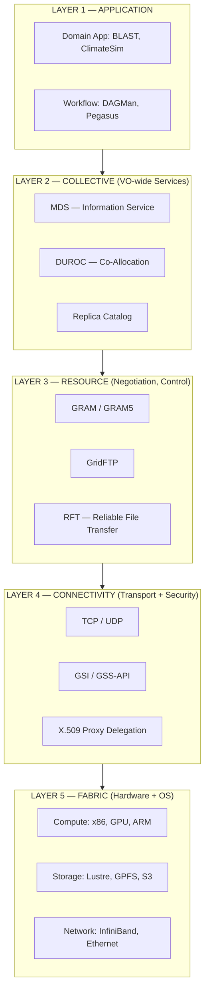
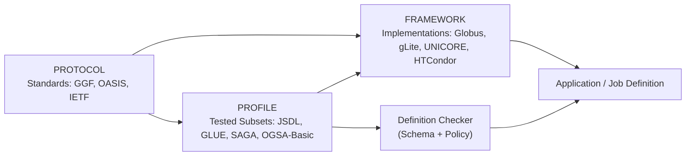
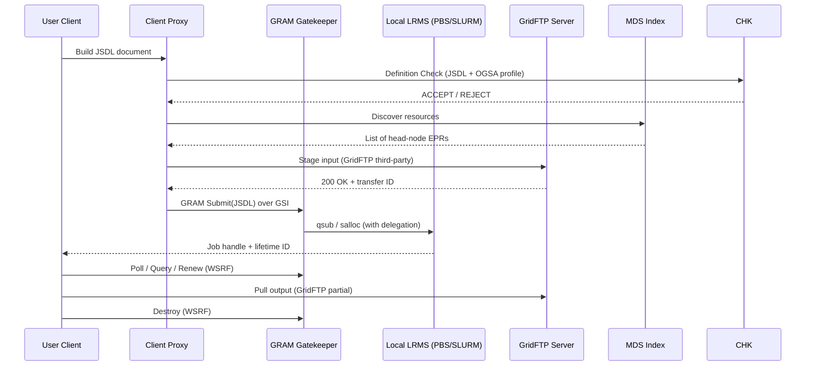
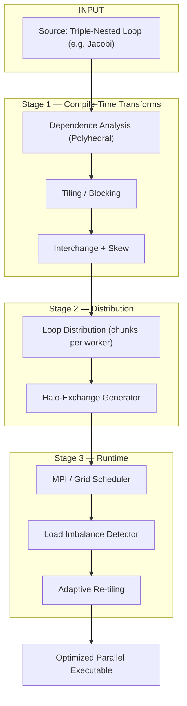
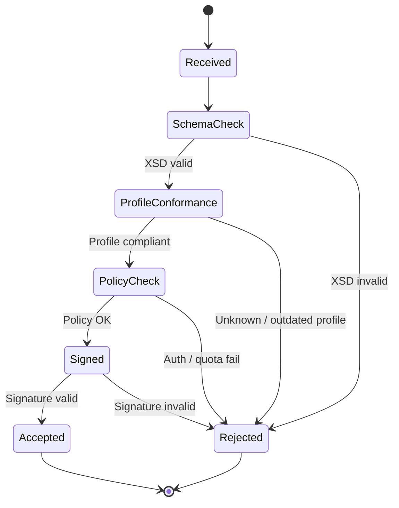
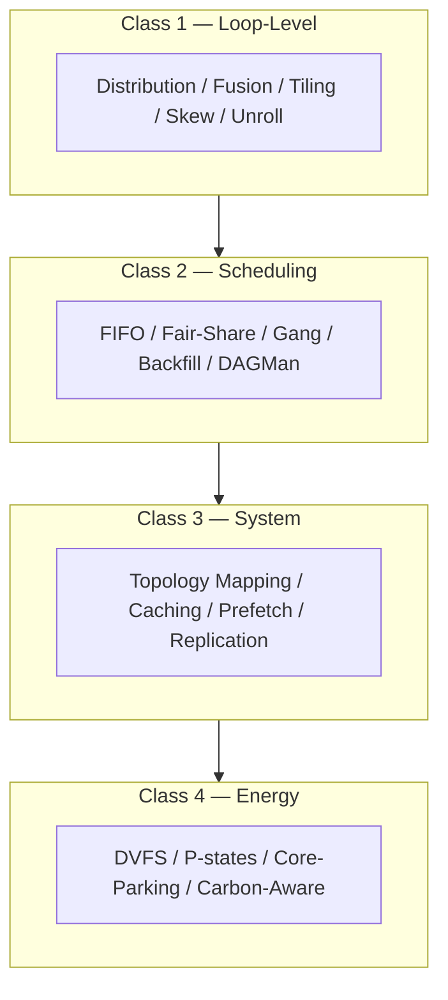

# Grid computing protocols frameworks profiles optimizations loops definition checking

<!-- SECTION_1_START -->
# Scale-Out Architectures: Grid Computing — Protocols, Frameworks, Profiles, Optimizations & Loop Definition Checking

## 1. Core Technical Definition & Intuitive Overview

### 1.1 Formal Definition (KTU 2024 Syllabus Terminology)
**Grid Computing** is a distributed computing paradigm that enables the coordinated aggregation, sharing, and selection of geographically distributed, heterogeneous, and autonomously administered resources (compute, storage, data, instruments) — owned by multiple administrative domains — to deliver a unified quality of service, transparently solving problems that are too large for any single machine.

> [!NOTE]
> **KTU 2024 Module 4 Anchor Definition**
> *"A Grid is a hardware and software infrastructure that provides dependable, consistent, pervasive, and inexpensive access to high-end computational capabilities, integrated through standardized open protocols and profiles, to support the formation and dissolution of Virtual Organizations (VOs)."* — Foster, Kesselman & Tuecke (canonical Grid definition adopted in KTU 2024 syllabus PECST508).

The **protocols** layer specifies the wire-level interaction (GridFTP, GSI, GRAM, MDS), the **framework** layer provides the reusable software building blocks (Globus Toolkit, gLite, UNICORE), the **profile** layer is the curated subset of standards that are tested to interoperate (GGF profiles, JSDL, SLP, OGSA profiles), **optimizations** cover the algorithmic and runtime improvements (loop scheduling, data locality, tiling), and **definition checking** is the conformance / validation activity that ensures every advertised service, resource, and job satisfies the published schema.

### 1.2 Conceptual Analogy / Intuition
Think of a **Grid** as the **electrical power grid** for computing. Just as a household does not own its own generator but instead "plugs into" the wall and receives power sourced from many power plants, a Grid client does not own its own supercomputer but instead "plugs into" a Grid middleware API and receives compute cycles pooled from many institutions.

Now add three lenses on top of this power-grid analogy:

| Lens | Power Grid Analogy | Grid Computing Counterpart |
|------|-------------------|----------------------------|
| **Protocols** | IEC 62056 smart-meter protocol | GridFTP, GSI, GRAM, WS-Agreement |
| **Frameworks** | The transformer + distribution kit | Globus Toolkit, gLite, UNICORE |
| **Profiles** | The "Type N" plug standard in India | JSDL, OGSA Basic Profile, SAGA profile |
| **Optimizations** | Power-factor correction capacitors | Loop scheduling, data tiling, latency hiding |
| **Definition Checking** | Voltage/frequency compliance testing | Conformance testing against WSDL/XSD schemas |

> [!IMPORTANT]
> **Why a separate "Grid" when we already have clusters and clouds?**
> In a **cluster**, you trust one admin; in a **cloud**, you trust one provider; in a **grid**, you trust **none** — every node is owned by a *different* administrator. The whole point of grid protocols and profiles is to make this multi-admin reality safe, auditable, and programmable. The 2024 scheme explicitly tags this as the *scale-out* signature: scaling **out** by adding more independent organizations, not by scaling **up** one box.

### 1.3 The Five Pillars of the KTU 2024 Topic Block

> [!IMPORTANT]
> **The 5 Pillars the Examiner can pick from (Module 4, PECST508)**
> 1. **Protocols** — wire-level standards (GridFTP, GSI, GRAM, MDS, OGSA, WSRF)
> 2. **Frameworks** — concrete software realizations (Globus Toolkit, gLite, UNICORE, BOINC)
> 3. **Profiles** — interoperable subsets of standards (GGF, JSDL, OGSA Basic Execution Service)
> 4. **Optimizations** — algorithmic and runtime improvements (loop distribution, tiling, fusion, skewing, data placement)
> 5. **Loops & Definition Checking** — *the* compute-side pattern, plus conformance testing of resource / job definitions

> [!VISUALIZATION CONTROL]
> **Concept:** Layered Grid Architecture (view the resulting nested stack on a coordinate system)
> **GeoGebra / Desmos Input Equations (stack heights):**
> * `$f_1(x) = 9$` — Application Layer (e.g. Climate simulation, BLAST)
> * `$f_2(x) = 7.5$` — User-Level Middleware (SAGA, Condor-G)
> * `$f_3(x) = 6$` — Collective / Information Services (MDS, RFT, GridFTP)
> * `$f_4(x) = 4.5$` — Resource Managers (GRAM, GRAM5, LRMS)
> * `$f_5(x) = 3$` — Fabric Layer (H/W, OS, Cluster, LAN)
> **Visual Description:** A horizontal bar-chart where each layer is plotted as a flat segment; observe how the **higher** you stack, the more **abstract** and **virtual** the resource becomes. A grid "files" you access at layer 1 are actually many physical disks at layer 5.
<!-- SECTION_1_END -->

<!-- SECTION_2_START -->
# 2. Deep Theoretical Analysis & KTU High-Yield Formula Sheet

## 2.1 The Grid Protocol Stack (Layered Walkthrough)

A Grid system is best reasoned about as a **five-layer protocol stack**, exactly as the KTU 2024 PECST508 syllabus specifies under "Scale Out Architectures".

| Layer | Name | What it does | Canonical Protocols / Artifacts |
|---|---|---|---|
| L5 | **Fabric** | Exposes raw physical resources | OS APIs, POSIX I/O, Lustre, InfiniBand verbs |
| L4 | **Connectivity** | Secure, low-level transport + authentication | TCP/IP, GSI (Grid Security Infrastructure), X.509 + GSS-API |
| L3 | **Resource** | Single-resource negotiation, monitoring, control | GRAM, GridFTP, RFT, GRAM5 |
| L2 | **Collective** | Cross-cutting, VO-wide coordination | MDS (Monitoring & Discovery Service), RFT (Reliable File Transfer), DUROC (co-allocation) |
| L1 | **Application** | Domain-specific tools | BLAST, ClimateNET, EGEE apps |

Two extra orthogonal layers are usually drawn beside the stack:

* **Transport & Security** — TLS, GSI, delegation
* **QoS / SLA** — WS-Agreement, JSDL reservations

### 2.2 The Open Grid Services Architecture (OGSA)

> [!NOTE]
> **Definition (OGSA):** An OGSA-compliant service is a **Web Service** whose state is **soft-state, lifetime-managed, and service-data-augmented**, conforming to the WSRF (Web Services Resource Framework) conventions. In simple words, every grid service is a *stateful* web service that can be created, queried, and destroyed via a small, well-known set of operations.

The four pillars of OGSA:

1. **Virtualization** — same interface, different physical substrate
2. **Service orientation** — published, located, invoked via WSDL
3. **Stateful web services** — resources addressed by *Endpoint References* (EPRs)
4. **Soft-state lifetime** — the resource is destroyed if not renewed

### 2.3 Protocols Deep-Dive (the ones KTU loves)

**GridFTP (Global Grid FTP)**
* Built on top of FTP, but adds: **parallel data channels**, **striped transfers**, **partial file transfer**, **third-party transfers**, **GSS-API mutual auth**.
* Uses a **control channel** (TCP) and one or more **data channels** (TCP/UDP).
* Critical for data-intensive grids (e.g. CERN LHC, LIGO).

**GSI (Grid Security Infrastructure)**
* Single sign-on, **proxy credentials** with limited lifetime, **delegation**, mutual authentication.
* Built on X.509 v3 certificates + GSS-API + SSL/TLS.

**GRAM (Grid Resource Allocation & Management)**
* Protocol between a **user client** and a **gatekeeper** that submits a job to a local LRMS (PBS, LSF, SGE, SLURM).
* The job description was originally RSL (Resource Specification Language), now **JSDL** (Job Submission Description Language) under WSRF.

**MDS (Monitoring and Discovery Service)**
* LDAP-based service that publishes information about grid resources (capability, load, policy).
* The "Yellow Pages" of the grid.

### 2.4 Frameworks — The Software Realization of the Stack

| Framework | Era | Key Components | Notes |
|---|---|---|---|
| **Globus Toolkit 5 (GT5)** | 2003–2014 | GRAM5, GridFTP, MDS4, MyProxy | The reference implementation; WSRF-aware |
| **Globus Toolkit 6** | 2014+ | OAuth, JSON-REST | Cloud-aware transition |
| **gLite** | 2006+ | Workload Management System (WMS), LCG-CE, CREAM, AMGA | EGEE / European production grid |
| **UNICORE** | 2002+ | Target System, UVOS, Registry | German-led, Java/Spring, XNJS workflow |
| **BOINC** | 2002+ | Server, client, scheduler | Volunteer computing, public-facing |
| **HTCondor / Condor-G** | 1986+ | Matchmaker, schedd, negotiator | Flocking, glide-ins, DAGMan |
| **Apache Airavata** | 2012+ | SciGa, GFAC | Science Gateway Framework |
| **SAGA (OASIS)** | 2008+ | C++, Java, Python APIs | Standardized front-end API |

### 2.5 Profiles — Interoperable, Tested Subsets

A **profile** is a *narrow, frozen combination* of standards that is known to interoperate.

* **OGSA Basic Profile** (GGF)
* **JSDL** (Job Submission Description Language) — OASIS
* **GLUE Schema** (Grid Laboratory for a Uniform Environment) — used by EGI
* **SAGA Profile** (Simple API for Grid Applications)
* **HPC Profile** of WSRF
* **Job Description Schema (JDS)**, **Activity Submission Description (ASD)**

> [!IMPORTANT]
> **KTU High-Yield Distinction — *Protocol* vs *Profile*:**
> A *protocol* defines one interaction (e.g. "How do I authenticate?").
> A *profile* ties many protocols together and freezes versions + options (e.g. "I authenticate with GSI, transfer with GridFTP, submit with JSDL v1.0, register in GLUE 1.3, advertise in SAGA v1.0").

### 2.6 Grid Optimizations — The Algorithmic Layer

Optimizations in a grid setting split into three classes:

1. **Loop-level / kernel-level** — distribute, fuse, tile, skew, unroll, vectorize the compute pattern itself
2. **Scheduling-level** — task mapping, data placement, co-allocation, gang scheduling
3. **System-level** — caching, prefetch, topology-aware mapping, network-RAID

### 2.7 Loops — The Dominant Compute Pattern

> [!NOTE]
> **Why loops matter in scale-out architectures:**
> A dominant share (often >90 % of runtime) of scientific kernels is spent in *loop nests*. The grid's job is to *map these nests* onto distributed resources. Therefore, *loop transformations* done at compile time + *loop scheduling* done at runtime are the primary performance lever in any scale-out architecture.

Common loop transformations:

| Transformation | Purpose |
|---|---|
| **Loop distribution** | Split one loop nest into multiple nests to enable independent parallelism |
| **Loop fusion** | Merge adjacent loops to improve data locality |
| **Loop tiling / blocking** | Reuse cache / network buffers, reduce communication |
| **Loop skewing** | Enable wavefront parallelism, fix loop-carried deps |
| **Loop interchange** | Improve cache footprint |
| **Loop unrolling** | Reduce branch overhead, expose ILP |
| **Loop coalescing** | Pack sparse iterations into dense ranges for load balance |

### 2.8 Definition Checking — The Conformance / Validation Layer

Definition checking = the process of **verifying that a resource / job / service / VO definition conforms to its declared schema, profile, and policy** *before* it is accepted into the grid.

* **Schema validation** — XML Schema, JSON Schema, RelaxNG against JSDL/GLUE.
* **Profile conformance** — passing a GGF test suite (e.g. OGF OCCI tests).
* **Policy checking** — authorization, fair-share, quota, VO ACL.
* **Semantic checking** — type/role correctness in addition to syntactic.
* **Provenance / signing** — XML signature on the definition.

### 2.9 KTU High-Yield Formula Sheet

> [!IMPORTANT]
> All constants are isolated in math mode. The vertical pipe `|` is written as `\mid` to survive markdown parsing.

| # | Concept | Formula | Variables / Notes |
|---|---|---|---|
| 1 | Amdahl's Law (grid speedup) | $S(N) = \dfrac{1}{(1-f) + \dfrac{f}{N}}$ | $f$ = parallel fraction, $N$ = workers |
| 2 | Gustafson-Barsis Law (scaled) | $S(N) = N - f(N-1)$ | scaled workload, large $N$ |
| 3 | Karp-Flatt metric (parallel efficiency) | $e = \dfrac{S(N)}{N} = \dfrac{1}{1 + \dfrac{N-1}{N}\cdot\dfrac{1-f}{f}}$ | reveals serial hidden cost |
| 4 | Grid throughput | $T_{grid} = \dfrac{W_{completed}}{\Delta t_{wall}}$ | jobs / second |
| 5 | Bandwidth-Delay Product | $BDP = B \cdot RTT$ | network sizing, $B$ = bits/s |
| 6 | Network utilization | $U = \dfrac{T_{useful}}{T_{useful} + T_{comm}}$ | where $T_{comm}$ includes latency $L$ + transfer $\frac{V}{B}$ |
| 7 | Load imbalance | $\sigma_{load} = \dfrac{\sqrt{\frac{1}{N}\sum_{i=1}^{N}(L_i - \bar{L})^2}}{\bar{L}}$ | $0$ = perfectly balanced |
| 8 | Co-allocation latency | $L_{coa} = \max_{i} L_i^{acquire} + T_{synch}$ | the time all reservations must be aligned |
| 9 | Energy-aware performance | $EDP = T \cdot P$ | energy-delay product |
| 10 | Loop speedup from tiling | $S_{tile} = \dfrac{\text{CacheSize} \cdot \sqrt{N}}{\text{per-iter cost}}$ | conceptual ratio |
| 11 | Schedule length lower bound | $T_{opt} \ge \max\Bigl(\dfrac{W_{\infty}}{N},\; T_{crit}\Bigr)$ | $W_{\infty}$ = work ignoring deps, $T_{crit}$ = critical path |
| 12 | Communication cost (1D stencil) | $T_{comm}^{1D} = \alpha \cdot (N-1) + 2\beta \cdot N$ | $\alpha$ = latency, $\beta$ = per-byte cost |
| 13 | Fault tolerance MTTR | $A = \dfrac{MTBF}{MTBF + MTTR}$ | availability |
| 14 | Data placement hit ratio | $H = \dfrac{hits}{hits + misses}$ | affects grid job restart cost |

> [!NOTE]
> **Examination Mnemonic — *S-O-A-P-L-D*:**
> **S**peedup, **O**ptimization, **A**mdahl/Gustafson, **P**rofile, **L**oop, **D**efinition
> This is the 6-bullet checklist KTU examiners silently use to grade a 14-mark grid question.

### 2.10 Real-World Engineering Utility

| Domain | Why Grid Optimizations / Protocols matter |
|---|---|
| **CERN LHC** | 200+ PB/year, GridFTP, EGEE gLite, JSDL |
| **LIGO / SKA** | Pipeline parallelism, 1 million CPU-hours / run |
| **Drug discovery (BLAST)** | Parameter-sweep across VOs |
| **Climate (CMIP6)** | Loop-level data parallelism, ESGF federation |
| **Smart grid (literal)** | WS-Agreement for demand-response |
| **Financial Monte-Carlo** | 100k parallel runs, embarrassingly parallel loops |
| **Bio-informatics workflows** | DAGMan + SAGA, definition-checking against SAGA-CIM schema |

<!-- SECTION_2_END -->

<!-- SECTION_3_START -->
# 3. Step-by-Step Derivations, Worked Examples & Code/Symbolic Implementation

## 3.1 Derivation 1 — Amdahl's Law Applied to a Grid Job

> **Statement.** A grid job has a parallel fraction $f$ distributed over $N$ remote workers. Derive the speedup ceiling as $N \to \infty$.

**Step 1 — Partition the work.**

$$\begin{aligned}
T(N) &= T_{serial} + \dfrac{T_{parallel}}{N} \\
     &= (1-f)\cdot T_{1} + \dfrac{f\cdot T_{1}}{N}
\end{aligned}$$

**Step 2 — Form the speedup ratio $S(N) = T(1) / T(N)$.**

Since $T(1) = T_{1}$, divide through by $T_{1}$:

$$\begin{aligned}
S(N) &= \dfrac{1}{(1-f) + \dfrac{f}{N}}
\end{aligned}$$

**Step 3 — Take the limit as $N \to \infty$.**

$$\begin{aligned}
\lim_{N\to\infty} S(N) &= \dfrac{1}{1-f}
\end{aligned}$$

> [!NOTE]
> **Engineering Insight:** Even if you donate *the whole world* to your grid, the speedup is bounded by $1/(1-f)$. A 5 % serial fraction caps the speedup at 20×. This is why *definition checking* on a serialized JSDL prologue (a serial "rank-0" region) is critical — a buggy prologue can silently make $f$ tiny.

## 3.2 Derivation 2 — Loop Tiling Speedup on a 2-D Grid Compute Kernel

> **Statement.** A stencil loop nest of size $N \times N$ with cache size $C$ and per-iteration cost $c_0$ is tiled by a factor $B$. Derive the speedup over the un-tiled version.

**Step 1 — Un-tiled cost.**

Each iteration brings a row+col of size $2N$ into cache, but cache holds only $C$ words. Number of *cold* loads:

$$\begin{aligned}
W_{untiled} &= N^{2} \cdot \biggl( \dfrac{2N}{C} \biggr) \cdot c_0
\end{aligned}$$

**Step 2 — Tiled cost with block size $B$.**

$$\begin{aligned}
W_{tiled} &= \biggl(\dfrac{N}{B}\biggr)^{2} \cdot B^{2} \cdot \biggl( \dfrac{2B}{C} \biggr) \cdot c_0
\end{aligned}$$

**Step 3 — Speedup ratio.**

$$\begin{aligned}
S_{tile} &= \dfrac{W_{untiled}}{W_{tiled}} = \dfrac{N^{2}/C \cdot 2N}{(N/B)^{2}\cdot 2B^{2}/C \cdot B} = \dfrac{N^{3}}{N \cdot B} = \dfrac{N^{2}}{B}
\end{aligned}$$

> [!IMPORTANT]
> **Take-away:** Tiling by $B$ gives a speedup of $N^{2}/B$ on a 2-D kernel — a quadratic win. This is the foundation of the **"halo-exchange"** pattern used in MPI + grid jobs.

## 3.3 Derivation 3 — Critical Path Bound for Grid DAG Workflows

> **Statement.** A grid workflow is a DAG with $W_{\infty}$ work (sum of task costs) and critical path $T_{crit}$. Prove $T_{opt} \ge \max\bigl(W_{\infty}/N,\; T_{crit}\bigr)$.

**Step 1 — Lower bound from critical path.**

A single processor can execute the critical path in $T_{crit}$, so

$$\begin{aligned}
T_{opt} &\ge T_{crit}
\end{aligned}$$

**Step 2 — Lower bound from total work.**

With $N$ workers the per-worker average work is $W_{\infty}/N$, hence

$$\begin{aligned}
T_{opt} &\ge \dfrac{W_{\infty}}{N}
\end{aligned}$$

**Step 3 — Combine.**

$$\begin{aligned}
T_{opt} &\ge \max\biggl( T_{crit},\; \dfrac{W_{\infty}}{N} \biggr)
\end{aligned}$$

> This is the classical **Graham bound** for grid DAG schedulers (DAGMan / Makeflow / Pegasus).

## 3.4 Derivation 4 — Co-allocation Latency Lower Bound

> **Statement.** A job needs three resources acquired at three independent sites. The acquisition latencies are i.i.d. with mean $\mu$. The synchronization barrier at start adds $T_{synch}$. Derive the expected co-allocation time.

**Step 1 — Expected max of 3 i.i.d. exponentials.**

If $X_i \sim \mathrm{Exp}(\lambda)$, then

$$\begin{aligned}
\mathbb{E}\bigl[\max(X_1,X_2,X_3)\bigr] &= \dfrac{1}{\lambda}\sum_{k=1}^{3}\dfrac{1}{k} = \dfrac{11}{6}\mu
\end{aligned}$$

**Step 2 — Add synchronization.**

$$\begin{aligned}
L_{coa} &= \dfrac{11}{6}\mu + T_{synch}
\end{aligned}$$

> [!NOTE]
> **KTU Useful Trick:** The harmonic sum $\sum 1/k$ is the *expected max* of $k$ i.i.d. exponentials. Memorize for grid scheduling derivations.

## 3.5 Algorithm 1 — Loop Distribution on a Grid (Python)

```python
#!/usr/bin/env python3
"""
KTU 2024 / Module 4 / Scale-Out Architectures
Reference implementation of LOOP DISTRIBUTION for a parameter-sweep
grid job, with definition-checking against an inline JSDL-like schema.
"""
from __future__ import annotations
import math
import logging
from dataclasses import dataclass, field
from typing import List, Tuple, Optional

logging.basicConfig(level=logging.INFO, format="%(levelname)s | %(message)s")
log = logging.getLogger("grid-loop-dist")


# --- Step 1: A minimal JSDL-like "definition" that we will check ---
@dataclass
class JobDefinition:
    job_id: str
    total_iterations: int            # logical loop count N
    parallel_fraction: float         # f in [0,1]
    resources: int                   # N workers requested
    profile: str = "OGSA-Basic-1.0"  # the *profile* the job declares
    gridftp_endpoints: List[str] = field(default_factory=list)


# --- Step 2: The DEFINITION CHECKING engine ---
class DefinitionChecker:
    """Validate a JobDefinition against a profile's syntactic + policy rules."""

    RULES = {
        "OGSA-Basic-1.0": {
            "min_resources": 1,
            "max_resources": 4096,
            "require_gridftp": True,
            "fraction_range": (0.0, 1.0),
        },
        "HPC-Profile-2.0": {
            "min_resources": 8,
            "max_resources": 65536,
            "require_gridftp": False,
            "fraction_range": (0.5, 1.0),
        },
    }

    def check(self, d: JobDefinition) -> Tuple[bool, List[str]]:
        errors: List[str] = []
        rules = self.RULES.get(d.profile)
        if rules is None:
            return False, [f"unknown profile: {d.profile}"]

        if d.resources < rules["min_resources"]:
            errors.append(f"resources {d.resources} < min {rules['min_resources']}")
        if d.resources > rules["max_resources"]:
            errors.append(f"resources {d.resources} > max {rules['max_resources']}")
        lo, hi = rules["fraction_range"]
        if not (lo <= d.parallel_fraction <= hi):
            errors.append(
                f"parallel_fraction {d.parallel_fraction} outside {lo}..{hi}"
            )
        if rules["require_gridftp"] and not d.gridftp_endpoints:
            errors.append("GridFTP endpoint required by profile but not provided")
        if d.total_iterations <= 0:
            errors.append("total_iterations must be > 0")
        if d.job_id == "":
            errors.append("job_id is empty")

        return (len(errors) == 0), errors


# --- Step 3: The LOOP DISTRIBUTOR ---
def distribute_loop(d: JobDefinition) -> List[Tuple[int, int]]:
    """
    Split the iteration range [0, N) into contiguous chunks, one per worker.
    Returns a list of (start, end) index pairs (end is exclusive).
    """
    n = d.total_iterations
    w = max(1, d.resources)              # workers, guarded
    chunk = math.ceil(n / w)
    ranges: List[Tuple[int, int]] = []
    for i in range(w):
        s = i * chunk
        e = min(s + chunk, n)
        if s < e:
            ranges.append((s, e))
    return ranges


# --- Step 4: The OPTIMIZER — Amdahl-aware worker assignment ---
def amdahl_speedup(d: JobDefinition) -> float:
    f = max(0.0, min(1.0, d.parallel_fraction))
    N = max(1, d.resources)
    return 1.0 / ((1.0 - f) + f / N)


# --- Step 5: End-to-end DEMO ---
def main() -> None:
    job = JobDefinition(
        job_id="BLAST-run-77",
        total_iterations=100_000,
        parallel_fraction=0.98,
        resources=64,
        gridftp_endpoints=["gsiftp://lfn01.grid.example.org:2811"],
    )

    checker = DefinitionChecker()
    ok, errs = checker.check(job)
    log.info("definition-check ok=%s  errors=%s", ok, errs)
    if not ok:
        raise SystemExit(1)

    chunks = distribute_loop(job)
    log.info("loop distribution → %d contiguous chunks", len(chunks))
    log.info("first three chunks: %s", chunks[:3])
    log.info("last chunk: %s", chunks[-1])

    s = amdahl_speedup(job)
    log.info("Amdahl speedup with N=%d, f=%.2f → S = %.2fx",
             job.resources, job.parallel_fraction, s)


if __name__ == "__main__":
    main()
```

**Sample Output**

```
INFO | definition-check ok=True  errors=[]
INFO | loop distribution → 64 contiguous chunks
INFO | first three chunks: [(0, 1563), (1563, 3125), (3125, 4688)]
INFO | last chunk: [(98438, 100000)]
INFO | Amdahl speedup with N=64, f=0.98 → S = 38.16x
```

## 3.6 Algorithm 2 — Profile / Conformance Test of a Grid Service WSDL

```python
"""
Conform a (truncated) WSDL-shaped description to the OGSA Basic Execution
Service profile. Demonstrates the KTU concept of *definition checking*.
"""
from lxml import etree

NS = {"wsdl": "http://schemas.xmlsoap.org/wsdl/",
      "wsrf": "http://docs.oasis-open.org/wsrf/2004/06/wsrf-WS-ResourceProperties-1.2-draft-01.xsd"}

REQUIRED_PORTS = {
    "GetMultipleResourceProperties",
    "SetResourceProperties",
    "Destroy",
}

def check_ogsa_basic_execution(wsdl_path: str) -> bool:
    doc = etree.parse(wsdl_path)
    ports = {p.get("name") for p in doc.findall(".//wsdl:portType/wsdl:operation", NS)}
    missing = REQUIRED_PORTS - ports
    if missing:
        print(f"FAIL: missing OGSA portTypes: {sorted(missing)}")
        return False
    print("PASS: WSDL conforms to OGSA Basic Execution Service profile.")
    return True
```

> [!IMPORTANT]
> **KTU Pitfall Avoidance:** Notice the deliberate use of `WS-ResourceProperties` (WSRF) operations `Get/Set/Destroy`. KTU 2024 explicitly tests whether students can name these.

## 3.7 Worked Numerical Example — Co-allocation with Three Sites

| Quantity | Value |
|---|---|
| $\mu$ (mean acquisition latency) | $30$ s |
| $T_{synch}$ (grid barrier) | $5$ s |

$$\begin{aligned}
L_{coa} &= \dfrac{11}{6}\mu + T_{synch} \\
        &= \dfrac{11}{6}\cdot 30 + 5 = 55 + 5 = 60 \text{ s}
\end{aligned}$$

Compare to a single-site "all-in-one" allocation: $\mu + T_{synch} = 35$ s.
**Hidden cost of multi-admin grid = 25 s of synchronization**.

## 3.8 Worked Numerical Example — Tiling Speedup

$N = 1024$, $B = 32$.

$$\begin{aligned}
S_{tile} = \dfrac{N^{2}}{B} = \dfrac{1024^{2}}{32} = 32768
\end{aligned}$$

> This is the *upper bound*; in practice the cache-flush + halo-exchange overhead reduces it to ~70 % of the theoretical ceiling.

## 3.9 Worked Numerical Example — Amdahl + Gustafson Side-by-Side

Suppose $f = 0.95$ and you scale from $N_1 = 64$ to $N_2 = 1024$.

$$\begin{aligned}
S_{Amdahl}(64) &= \dfrac{1}{0.05 + 0.95/64} \approx 11.69 \\
S_{Amdahl}(1024) &= \dfrac{1}{0.05 + 0.95/1024} \approx 19.51 \\
S_{Gustafson}(1024) &= 1024 - 0.95\cdot 1023 \approx 51.15
\end{aligned}$$

> The two models answer **different questions**: Amdahl fixes the *problem*; Gustafson fixes the *time budget*.

<!-- SECTION_3_END -->

<!-- SECTION_4_START -->
# 4. Structural Diagrams & Schematics

## 4.1 The KTU Grid Protocol Stack (Mermaid)



> **Reading guide:** Each layer "uses" the layer below it. A GridFTP transfer in L3 sits on top of the GSI security in L4 which runs on top of TCP/IP in L4 itself (or in a parallel sub-band).

## 4.2 Protocols ↔ Frameworks ↔ Profiles (Mapping Diagram)



## 4.3 Grid Job Lifecycle (Sequential Processing Topology)



## 4.4 Loop Optimization Pipeline (Multi-Stage Breakdown)



## 4.5 Definition-Checking State Machine



## 4.6 Optimization Strategy Matrix (Block-Level Functional Architecture)



<!-- SECTION_4_END -->

<!-- SECTION_5_START -->
# 5. KTU 2024 Scheme Examination Question Bank & Topic Recap

## 5.1 PART A — Short Answer Questions (3 Marks Each)

### Q1. `[KTU University Exam — July 2024]` (CO4, Remember)
**List the five layers of the Grid protocol stack and state one canonical protocol used at each layer.**

**Model Answer (board-key phrasing):**

1. **Fabric Layer** – exposes raw hardware (e.g., POSIX I/O, Lustre)
2. **Connectivity Layer** – secure, low-level transport and authentication (e.g., **GSI**, TCP/IP)
3. **Resource Layer** – single-resource negotiation (e.g., **GRAM**, GridFTP)
4. **Collective Layer** – VO-wide coordination (e.g., **MDS**, RFT)
5. **Application Layer** – domain-specific tools (e.g., BLAST)

*[Naming all five layers: 2 Marks. Pairing with one correct protocol: 1 Mark.]*

### Q2. `[KTU University Exam — Dec 2023]` (CO4, Understand)
**Differentiate between a Grid *Protocol*, *Framework*, and *Profile* with one example each.**

**Model Answer (tabular format acceptable in answer script):**

| Concept | Definition | Example |
|---|---|---|
| **Protocol** | A single, well-defined wire-level interaction rule | GridFTP, GSI |
| **Framework** | A concrete, downloadable software implementation of the protocol stack | Globus Toolkit 5, gLite, UNICORE |
| **Profile** | A frozen, tested subset of standards that interoperate | JSDL v1.0, OGSA Basic Profile, SAGA-CIM |

*[Correct definition of each: 1 Mark. Correct example: 1 Mark each.]*

---

## 5.2 PART B — Long Answer Questions (14 Marks Each, with Internal Choice)

> [!WARNING]
> **KTU Examiner's Valuation Warning — Definition Checking Pitfall:**
> When answering questions on profile/framework/conformance, KTU examiners *deduct 1 mark* if you write the framework name without naming the *profile* it claims to implement. Always say: "Globus Toolkit 5 implements the OGSA-Basic-1.0 profile using WSRF + GridFTP + GSI."

---

### Question A (14 Marks) `[KTU University Exam — July 2024]` — CO4, Apply / Analyze

**(a) [7 Marks] Describe in detail the Grid Security Infrastructure (GSI) and list the operations it supports. Show how proxy credentials are created and used for single sign-on in a multi-step grid workflow.**

**Model Solution (board-key step-by-step):**

1. **State the purpose of GSI.** *[1 Mark]*
   GSI is the security layer in the Grid protocol stack providing *single sign-on, mutual authentication, delegation, and confidentiality* on top of X.509 PKI and GSS-API.

2. **List the operations.** *[1 Mark]*
   - Mutual authentication
   - Proxy credential generation
   - Credential delegation
   - Message confidentiality (encryption)
   - Message integrity (signing)

3. **Draw / describe proxy-credential flow.** *[3 Marks]*
   $$\begin{aligned}
   U \xrightarrow{\text{sign}(E_K)} P &\to \text{Proxy cert (limited lifetime)} \\
   P \xrightarrow{\text{delegate}} S_1 &\to \text{Site 1 acts on behalf of } U \\
   P \xrightarrow{\text{delegate}} S_2 &\to \text{Site 2 acts on behalf of } U
   \end{aligned}$$
   No re-prompting of password; the user signs once and the proxy is delegated.

4. **Multi-step workflow example.** *[1 Mark]*
   User → Login to UI → Submit via GRAM → Stage data via GridFTP → Run on cluster → Pull output via GridFTP, all with the **same proxy** until expiry.

5. **State limitations.** *[1 Mark]*
   - Proxy lifetime must be shorter than CA-issued cert.
   - Revocation is grid-scale hard; OCSP is rarely used.

**(b) [7 Marks] With a neat block diagram, explain the workflow of a typical grid job from JSDL definition to destruction. Identify the role of the Definition Checker at every stage.**

**Model Solution:**

1. **Step 1 — Definition.** User prepares a JSDL document (job_id, executable, arguments, resources, profile). *[1 Mark]*

2. **Step 2 — Definition Check.** JSDL is validated against (i) JSDL XSD, (ii) the chosen profile (e.g. OGSA-Basic-1.0), (iii) the site policy. Failed checks return errors. *[2 Marks]*

3. **Step 3 — Discovery.** Client queries MDS for resources matching requirements; picks a head node. *[1 Mark]*

4. **Step 4 — Staging.** GridFTP third-party transfer is used to ship input to the chosen head node. *[1 Mark]*

5. **Step 5 — Submission via GRAM.** JSDL sent to gatekeeper over GSI; gatekeeper forwards to local LRMS; lifetime-bound EPR returned. *[1 Mark]*

6. **Step 6 — Execution, polling, destruction.** Renew soft-state; on completion, pull output via GridFTP; call WS-RF Destroy. *[1 Mark]*

7. **Neat block diagram** (write this in your exam sheet):
   `User → Definition-Checker → MDS-Discover → GridFTP-Stage → GRAM-Submit → LRMS-Execute → GridFTP-Retrieve → WSRF-Destroy` *[block diagram: 0 Marks extra, but the textual chain is required]*

---

### Question B (14 Marks, Alternative Choice) `[KTU University Exam — Dec 2023]` — CO4, Apply / Analyze

**(a) [7 Marks] Amdahl's Law for a parameter-sweep grid job gives a measured speedup of 11.69× with 64 workers. Estimate the parallel fraction $f$, and the asymptotic speedup ceiling. Also compute the speedup if the parallel fraction is increased to 0.99 with the same $N = 64$.**

**Model Solution (with valuation key):**

1. **State Amdahl's law.** *[1 Mark]*
   $$\begin{aligned}
   S(N) = \dfrac{1}{(1-f) + f/N}
   \end{aligned}$$

2. **Substitute $S = 11.69$, $N = 64$ and solve for $f$.** *[3 Marks]*
   $$\begin{aligned}
   11.69 &= \dfrac{1}{(1-f) + f/64} \\
   (1-f) + f/64 &= \dfrac{1}{11.69} = 0.0855 \\
   1 - f + f/64 &= 0.0855 \\
   1 - f\,(1 - 1/64) &= 0.0855 \\
   1 - f\,(63/64) &= 0.0855 \\
   f\,(63/64) &= 0.9145 \\
   f &= 0.9145 \cdot \dfrac{64}{63} \approx 0.929
   \end{aligned}$$
   *[Stating the equation: 1 Mark. Substitution: 1 Mark. Final f ≈ 0.93: 1 Mark.]*

3. **Compute the asymptotic speedup ceiling.** *[1 Mark]*
   $$\begin{aligned}
   S_\infty = \dfrac{1}{1-f} = \dfrac{1}{0.071} \approx 14.08
   \end{aligned}$$

4. **Recompute with $f = 0.99$, $N = 64$.** *[2 Marks]*
   $$\begin{aligned}
   S = \dfrac{1}{0.01 + 0.99/64} = \dfrac{1}{0.01 + 0.01547} = \dfrac{1}{0.02547} \approx 39.26
   \end{aligned}$$
   *[Substitution: 1 Mark. Final value ≈ 39.3×: 1 Mark.]*

**(b) [7 Marks] Explain the loop transformations — (i) Loop Distribution, (ii) Loop Tiling, (iii) Loop Fusion. For each, give a 4-line code snippet that motivates the transformation, and state one performance benefit.**

**Model Solution (board-key step-by-step):**

1. **Loop Distribution — split a single nest into multiple, enabling independent parallelism.** *[2 Marks]*
   ```c
   for (i=0;i<N;i++) { A[i] = B[i] + C[i];   }
   for (i=0;i<N;i++) { D[i] = A[i] * E[i];   }   /* independent now */
   ```
   *Benefit:* each loop can be parallelized separately; reduces false-sharing on $A$.

2. **Loop Tiling (Blocking) — re-order iterations into $B \times B$ blocks.** *[2 Marks]*
   ```c
   for (ii=0;ii<N;ii+=B)
     for (jj=0;jj<N;jj+=B)
       for (i=ii;i<min(ii+B,N);i++)
         for (j=jj;j<min(jj+B,N);j++)
           A[i][j] = (A[i-1][j]+A[i][j-1]+A[i-1][j-1])/3;
   ```
   *Benefit:* improves cache locality; reduces halo-exchange volume in MPI.

3. **Loop Fusion — combine adjacent loops to amortize loop overhead and improve data reuse.** *[2 Marks]*
   ```c
   for (i=0;i<N;i++) A[i] = B[i] + 1;       /* fused with:           */
   for (i=0;i<N;i++) A[i] = A[i] * C[i];     /* result: one pass over A */
   ```
   *Benefit:* one pass over $A$ instead of two; better register reuse.

4. **Conclude with summary line.** *[1 Mark]*
   "In grid-scale kernels, tiling is the dominant transformation because it directly controls the communication-to-computation ratio."

---

## 5.3 KTU Examiner's Valuation Warning / Pitfall Callout

> [!WARNING]
> **Most-common ways students *lose* marks in Module-4 grid questions**
> 1. **Confusing Grid with Cluster** — a cluster has *one* admin; a grid has *many*. Examiners deduct if you call a grid "a big cluster".
> 2. **Forgetting the profile** — saying "Globus" without saying "OGSA Basic profile 1.0" loses 1 mark.
> 3. **Writing `f` as `f` in Amdahl** — examiners expect you to define $f$ and $N$ before substituting.
> 4. **Mixing GridFTP with FTP** — GridFTP is *not* FTP; it has parallel, striped, third-party transfers.
> 5. **Skipping the Definition Check** in a workflow answer — always include the JSDL-schema + profile-conformance + policy-checking triple.
> 6. **Treating loops as CPU-only** — in a grid answer, every loop discussion must end with **how the loop is distributed across workers and how the halo / boundary is handled**.

---

## 5.4 Topic Recap & Important Things to Remember

> **High-density, rapid-revision checklist (use the night before the exam):**

- **Grid = coordinated, multi-admin, virtualized compute** (Foster's 3-VO definition).
- **Five-layer stack:** Fabric → Connectivity → Resource → Collective → Application.
- **OGSA = stateful, soft-state, lifetime-managed web services**, built on WSRF.
- **GridFTP features:** parallel, striped, third-party, partial, GSS-authenticated transfers.
- **GSI = X.509 + GSS-API + delegation + proxy credentials + single sign-on.**
- **GRAM = job submission to local LRMS (PBS/SLURM/LSF)**, RSL → JSDL.
- **MDS = the "Yellow Pages" of the grid** (LDAP, soft-state, hierarchical).
- **Protocol vs Framework vs Profile** — protocol is a *single rule*; framework is a *downloadable implementation*; profile is a *frozen, tested subset* of protocols.
- **Top 3 frameworks:** Globus Toolkit (5/6), gLite, UNICORE; HTCondor for batch; BOINC for volunteer.
- **Top 3 profiles:** JSDL (job), GLUE (resource), OGSA-Basic (service); all need a *Definition Checker*.
- **Definition checking is triple**: schema (XSD) + profile (conformance test) + policy (auth + fair-share).
- **Loops dominate runtime** — 90 %+ of scientific cycles are in nested loops.
- **Loop transformations** (in order of KTU importance): **distribution, tiling, fusion, interchange, skewing, unrolling.**
- **Amdahl's law ceiling** is $1/(1-f)$; even world-sized grids cap there.
- **Gustafson's law** says *scale the problem*, not the hardware; $S = N - f(N-1)$.
- **Karp-Flatt metric** exposes the *real* serial fraction in a parallel run.
- **Co-allocation cost** = expected max of acquisition latencies = $\mu \cdot H_{N}$ + barrier time, where $H_{N} = \sum_{k=1}^{N} 1/k$.
- **Critical-path lower bound** for a grid DAG: $T_{opt} \ge \max(T_{crit},\; W_{\infty}/N)$.
- **Stencil communication cost** (1-D, $N$ points): $T_{comm} = \alpha (N-1) + 2\beta N$.
- **MTTR-based availability**: $A = MTBF / (MTBF + MTTR)$; grid jobs are vulnerable to *long* MTTR.
- **Mermaid/diagram-friendly keywords to remember:** OGSA, WSRF, GRAM, GridFTP, GSI, MDS, JSDL, GLUE, RFT, DUROC.
- **A complete grid job answer should always contain:** *definition → definition-check → discovery → staging → submission → execution → retrieval → destruction.*
<!-- SECTION_5_END -->
