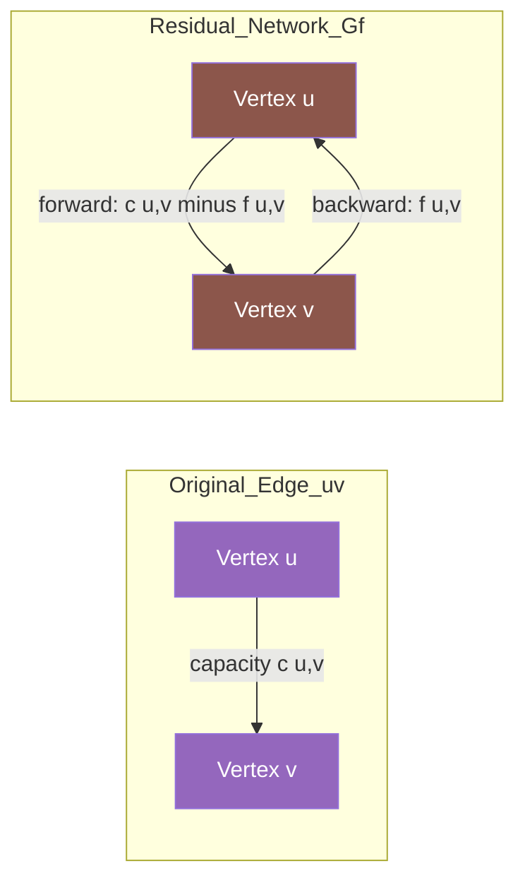
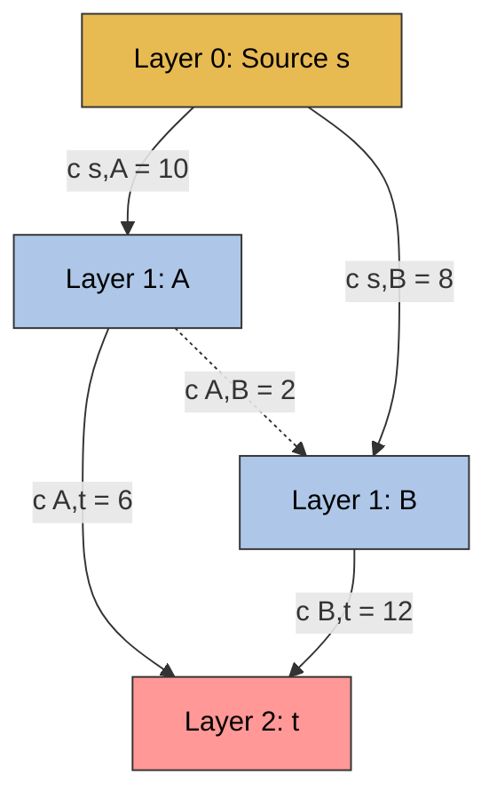
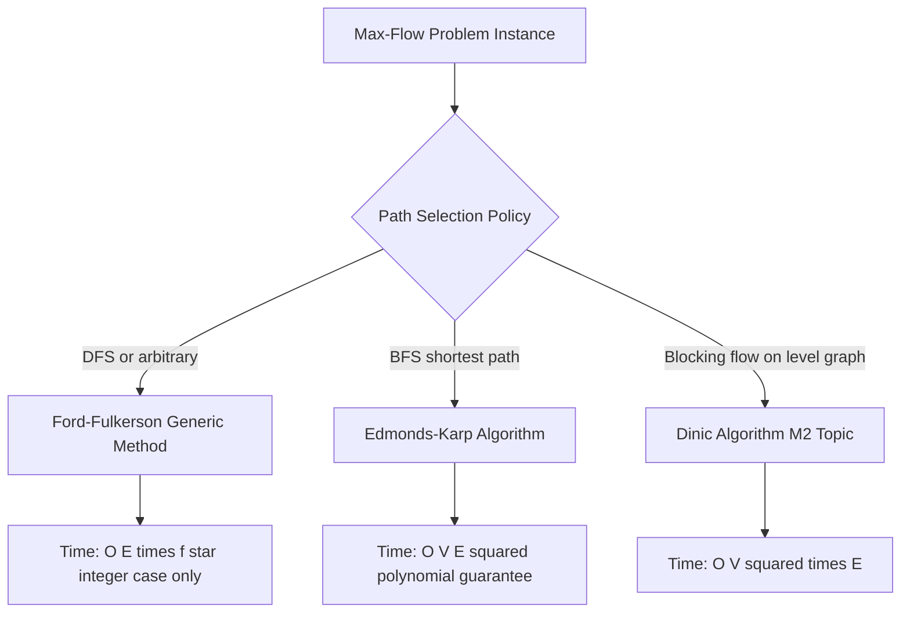

# Ford-Fulkerson computational paths algorithms, Edmonds-Karp optimizations validation tracking parameters

<!-- SECTION_1_START -->
# 1. Core Technical Definition & Intuitive Overview

## 1.1 Ford-Fulkerson Method — Formal Definition

The **Ford-Fulkerson Method** is a classical greedy algorithmic framework for computing the **maximum flow** in a directed, edge-capacitated flow network $G = (V, E)$. The method operates by iteratively identifying **augmenting paths** from a designated **source vertex** $s$ to a designated **sink vertex** $t$ within the dynamically updated **residual network** $G_f$, and pushes additional flow along these paths until no augmenting path exists.

Per the **Max-Flow Min-Cut Theorem** (formalized by Ford & Fulkerson, 1956; later refined by Elias, Feinstein, and Shannon), the value of the maximum flow in any network is exactly equal to the capacity of the **minimum $s$–$t$ cut**. The Ford-Fulkerson method is the constructive algorithmic counterpart that achieves this theoretical optimum.

> [!IMPORTANT]
> **KTU 2024 Syllabus Highlight (PECST509 / Module 1):**
> The Ford-Fulkerson method is **NOT a single algorithm** — it is a *meta-algorithm* or *template* whose concrete performance depends on the strategy used to select augmenting paths. Edmonds-Karp is the canonical BFS-driven instantiation of this template.

## 1.2 Edmonds-Karp Algorithm — Formal Definition

The **Edmonds-Karp Algorithm** (1972) is a specific, deterministic specialization of the Ford-Fulkerson method. Its defining rule is:

> *"At every iteration, select the augmenting path that contains the **minimum number of edges** (i.e., the shortest path in terms of hop-count) from $s$ to $t$ in the residual graph $G_f$."*

This shortest-path selection is implemented using **Breadth-First Search (BFS)**, which guarantees a strict polynomial worst-case time complexity of $\mathbf{O(VE^2)}$.

> [!NOTE]
> **Critical Distinction (Frequently Confused in Board Exams):**
> - **Ford-Fulkerson** = the conceptual method (may use DFS, BFS, or any path policy)
> - **Edmonds-Karp** = a *specific BFS-based implementation* of Ford-Fulkerson
> - **Dinic's Algorithm** = a *level-graph based* further optimization (out of scope for Module 1)

## 1.3 Intuitive Real-World Analogy

Imagine a **city water distribution network** with a central reservoir ($s$) and a downtown district ($t$). The pipes are the edges, and each pipe's diameter limits how much water can flow per minute (the capacity $c(u,v)$).

- **Ford-Fulkerson analogy**: A technician walks the network, finds *any* available route from reservoir to district, and pushes as much water as possible through it. He repeats this with the updated pipe-availability map (the *residual graph*) until no full route exists.
- **Edmonds-Karp analogy**: A smarter technician insists on always choosing the route with the **fewest pipe segments** (shortest BFS path). This seemingly minor policy dramatically reduces the number of times the same pipe gets re-routed, accelerating convergence.

## 1.4 Key Terminology and Validation Tracking Parameters

| Parameter | Symbol | Definition | Unit / Domain |
|---|---|---|---|
| Network | $G = (V, E)$ | Directed graph with $V$ vertices and $E$ edges | Set |
| Source | $s$ | Origin vertex of the flow | $s \in V$ |
| Sink | $t$ | Destination vertex of the flow | $t \in V$ |
| Edge Capacity | $c(u,v)$ | Maximum permissible flow on edge $(u,v)$ | $\mathbb{R}_{\geq 0}$ |
| Edge Flow | $f(u,v)$ | Current flow value on edge $(u,v)$ | $\mathbb{R}_{\geq 0}$ |
| Residual Capacity | $c_f(u,v)$ | Remaining headroom on edge $(u,v)$ in $G_f$ | $\mathbb{R}_{\geq 0}$ |
| Path Bottleneck | $b$ | $\min\{c_f(u,v) : (u,v) \in P\}$ along augmenting path $P$ | $\mathbb{R}_{\geq 0}$ |
| Max-Flow Value | $\vert f \vert$ | Net flow leaving source = Net flow entering sink | $\mathbb{R}_{\geq 0}$ |
| Cut Capacity | $c(S, T)$ | $\sum_{u \in S, v \in T} c(u,v)$ | $\mathbb{R}_{\geq 0}$ |
| BFS Hop Count | $h(v)$ | Shortest edge-distance from $s$ to $v$ in $G_f$ | $\mathbb{Z}_{\geq 0}$ |
| Augmenting Iterations | $k$ | Total number of BFS-augmenting rounds | $\mathbb{Z}_{\geq 0}$ |

> [!VISUALIZATION CONTROL]
> **Concept:** Residual Graph After One Augmentation
> **GeoGebra / Desmos Input Equations (sample 4-node network):**
> * `Points: A(0,2), B(2,2), C(2,0), D(4,0)`
> * `Original Edges (capacity labels): A->B [10], A->C [8], B->D [6], C->D [12], B->C [3]`
> * `Residual forward edges: A->B [10-f_AB], A->C [8-f_AC], B->D [6-f_BD], C->D [12-f_CD]`
> * `Residual backward edges: B->A [f_AB], C->A [f_AC], D->B [f_BD], D->C [f_CD]`
> **Visual Description:** On a 2D plane, draw $s=A$ on the left, $t=D$ on the right, with $B$ and $C$ as intermediate nodes. After one BFS augmentation along $A \rightarrow B \rightarrow D$ with bottleneck $6$, observe: forward capacity of $A \rightarrow B$ drops to $4$, and *new backward edges* $B \rightarrow A$ and $D \rightarrow B$ appear with capacity $6$ — these are the "undo" channels that enable the algorithm to correct greedy mistakes.

<!-- SECTION_1_END -->

<!-- SECTION_2_START -->
# 2. Deep Theoretical Analysis & KTU High-Yield Formula Sheet

## 2.1 Operational Logic of Ford-Fulkerson (Step-by-Step)

The method decomposes into the following precise logical stages:

1. **Initialize** the flow function $f(u, v) = 0$ for every edge $(u, v) \in E$.
2. **Construct the residual graph** $G_f = (V, E_f)$ where $E_f$ contains:
   - *Forward residual edges* $(u, v)$ with $c_f(u, v) = c(u, v) - f(u, v)$ for every original edge where residual capacity $> 0$.
   - *Backward residual edges* $(v, u)$ with $c_f(v, u) = f(u, v)$ for every original edge that currently carries positive flow.
3. **Search** for an **augmenting path** $P$ from $s$ to $t$ in $G_f$ using the chosen search policy (DFS for raw Ford-Fulkerson, BFS for Edmonds-Karp).
4. **Compute the bottleneck**:
   $$b = \min_{(u,v) \in P} c_f(u, v)$$
5. **Augment** the flow along $P$ by $b$, updating $f(u, v) \mathrel{+}= b$ for forward edges and $f(v, u) \mathrel{-}= b$ for backward edges.
6. **Repeat** Steps 2–5 until no $s$–$t$ path exists in $G_f$. The current $f$ is the **maximum flow**.

> [!NOTE]
> **Why does the algorithm terminate?**
> The flow value $\vert f \vert$ strictly increases by at least $1$ in every iteration when all capacities are **integers**. Hence Ford-Fulkerson terminates in $O(E \cdot f^*)$ iterations where $f^*$ is the max-flow value. For irrational capacities, the algorithm may **fail to terminate** — a classical result due to [Ford & Fulkerson, 1962]. Edmonds-Karp resolves this via BFS-shortest-path selection.

## 2.2 Why Edmonds-Karp Improves Ford-Fulkerson

The asymptotic inefficiency of raw Ford-Fulkerson arises from pathological input graphs (e.g., the classic "zig-zag" counter-example) where DFS-based augmentation revisits the same edges exponentially many times.

**Edmonds-Karp's key insight:** By always choosing the BFS-shortest path, the hop-distance $h(v)$ from $s$ to any vertex $v$ in $G_f$ is **non-decreasing** across iterations. This monotonicity gives a provable **upper bound of $O(VE)$ on the number of augmentations**, yielding a total complexity of $O(VE^2)$.

**KTU Board-Standard Lemma (must memorize):**
> The number of augmenting iterations in Edmonds-Karp is at most $O(VE)$.

## 2.3 KTU High-Yield Formula Sheet

| # | Formula / Rule | Interpretation | Conditions |
|---|---|---|---|
| 1 | $c_f(u,v) = c(u,v) - f(u,v)$ | Forward residual capacity | For original edge $(u,v) \in E$ |
| 2 | $c_f(v,u) = f(u,v)$ | Backward residual capacity | When $f(u,v) > 0$ |
| 3 | $b(P) = \min_{(u,v) \in P} c_f(u,v)$ | Bottleneck of augmenting path $P$ | Computed per iteration |
| 4 | $\vert f \vert = \sum_{v \in V} f(s, v) - \sum_{v \in V} f(v, s)$ | Net flow out of source | Always well-defined |
| 5 | $\sum_{u \in S, v \in T} f(u,v) - \sum_{u \in S, v \in T} f(v,u) = \vert f \vert$ | Flow conservation across cut $(S, T)$ | For any $s \in S, t \in T$ |
| 6 | $c(S, T) = \sum_{u \in S, v \in T} c(u, v)$ | Capacity of cut $(S, T)$ | Skip edges from $T$ to $S$ |
| 7 | $\vert f^* \vert = \min_{(S,T)} c(S, T)$ | **Max-Flow Min-Cut Theorem** | Equality at termination |
| 8 | $\text{Time}_{\text{FF}} \leq O(E \cdot f^*)$ | Ford-Fulkerson worst-case | Integer capacities |
| 9 | $\text{Time}_{\text{EK}} \leq O(VE^2)$ | Edmonds-Karp guaranteed | All non-negative capacities |
| 10 | $h_t^{(i+1)} \geq h_t^{(i)}$ | BFS-distance to $t$ is monotone non-decreasing | EK-specific invariant |
| 11 | $\text{Edge criticalities} \leq O(V)$ | Each edge becomes "critical" at most $V$ times | Used in $O(VE)$ bound proof |
| 12 | $f(u,v) \cdot f(v,u) = 0$ | Skew-symmetry: an edge and its reverse cannot both carry flow | Anti-symmetry constraint |

## 2.4 Real-World Engineering Utility

- **Telecommunications**: Maximum bandwidth routing in ISP backbone networks (e.g., Cisco's traffic engineering).
- **Supply Chain & Logistics**: Optimizing goods flow through warehouses with capacity-constrained shipping lanes.
- **Image Processing**: **Graph-cut segmentation** (Boykov-Kolmogorov algorithm is a Ford-Fulkerson variant for vision tasks).
- **Bipartite Matching**: Reduction of maximum bipartite matching to max-flow via dummy source/sink (relevant to job-assignment and dating algorithms).
- **Sports Analytics**: Modeling playoff elimination and tournament bracket fairness via flow networks.
- **Compilers**: Register allocation can be modeled as a graph-coloring/flow problem on interference graphs.
- **Network Security**: Detecting minimum cut-sets in a network to find vulnerabilities and bottlenecks.

<!-- SECTION_2_END -->

<!-- SECTION_3_START -->
# 3. Step-by-Step Derivations & Algorithmic Implementation

## 3.1 Worked Example: Maximum Flow on a 4-Node Network (Board-Standard)

**Problem:** Compute the maximum flow from $s$ to $t$ in the following network using **Edmonds-Karp (BFS)**.

**Network Specification:**

| Edge | Capacity |
|---|---|
| $s \rightarrow A$ | $10$ |
| $s \rightarrow B$ | $8$ |
| $A \rightarrow B$ | $2$ |
| $A \rightarrow t$ | $6$ |
| $B \rightarrow t$ | $12$ |

### Iteration 1
**BFS in original $G_f$:** Explore neighbours of $s$ in hop order. Reach $A$ (hop 1), reach $B$ (hop 1, but already discovered), reach $t$ via $A$ (hop 2) and via $B$ (hop 2).

**Shortest augmenting path** (tie broken by lexicographic order): $P_1 = s \rightarrow A \rightarrow t$ (2 edges, shorter or tied).

**Bottleneck:**
$$b_1 = \min\{c(s,A),\ c(A,t)\} = \min\{10,\ 6\} = 6$$

**Flow update:**

$$
\begin{aligned}
f(s, A) &\mathrel{+}= 6 \quad \Rightarrow \quad f(s, A) = 6 \\
f(A, t) &\mathrel{+}= 6 \quad \Rightarrow \quad f(A, t) = 6
\end{aligned}
$$

**Residual edges after Iteration 1:**
- $s \rightarrow A$: residual $10 - 6 = 4$ (forward)
- $A \rightarrow s$: residual $6$ (backward, new)
- $A \rightarrow t$: residual $6 - 6 = 0$ → edge **saturated and removed**
- $t \rightarrow A$: residual $6$ (backward, new)

Running total: $\vert f \vert = 6$.

### Iteration 2
**BFS in updated $G_f$:** Edge $A \rightarrow t$ is gone. Try $s \rightarrow B \rightarrow t$.

**Shortest augmenting path:** $P_2 = s \rightarrow B \rightarrow t$ (2 edges).

**Bottleneck:**
$$b_2 = \min\{c(s,B),\ c(B,t)\} = \min\{8,\ 12\} = 8$$

**Flow update:**

$$
\begin{aligned}
f(s, B) &\mathrel{+}= 8 \quad \Rightarrow \quad f(s, B) = 8 \\
f(B, t) &\mathrel{+}= 8 \quad \Rightarrow \quad f(B, t) = 8
\end{aligned}
$$

**Residual edges after Iteration 2:**
- $s \rightarrow B$: residual $8 - 8 = 0$ → edge **saturated and removed**
- $B \rightarrow t$: residual $12 - 8 = 4$ (forward)
- $B \rightarrow s$: residual $8$ (backward, new)
- $t \rightarrow B$: residual $8$ (backward, new)

Running total: $\vert f \vert = 6 + 8 = 14$.

### Iteration 3
**BFS in updated $G_f$:** Both direct edges from $s$ ($s \rightarrow A$ residual $4$, $s \rightarrow B$ residual $0$) and direct edges to $t$ ($A \rightarrow t$ gone, $B \rightarrow t$ residual $4$) limit routing.

- From $s$, only $A$ is reachable (residual $4$). 
- From $A$, neighbours: $B$ (via $A \rightarrow B$ residual $2$).
- From $B$, $t$ is reachable (via $B \rightarrow t$ residual $4$).

**Augmenting path:** $P_3 = s \rightarrow A \rightarrow B \rightarrow t$ (3 edges — longer than previous).

**Bottleneck:**
$$b_3 = \min\{c_f(s,A),\ c_f(A,B),\ c_f(B,t)\} = \min\{4,\ 2,\ 4\} = 2$$

**Flow update (note: $A \rightarrow B$ is a forward edge; $B \rightarrow A$ is a backward edge with residual $0$):**

$$
\begin{aligned}
f(s, A) &\mathrel{+}= 2 \quad \Rightarrow \quad f(s, A) = 8 \\
f(A, B) &\mathrel{+}= 2 \quad \Rightarrow \quad f(A, B) = 2 \\
f(B, t) &\mathrel{+}= 2 \quad \Rightarrow \quad f(B, t) = 10
\end{aligned}
$$

**Residual edges after Iteration 3:**
- $s \rightarrow A$: residual $10 - 8 = 2$ (forward)
- $A \rightarrow B$: residual $2 - 2 = 0$ → edge **saturated and removed**
- $B \rightarrow t$: residual $12 - 10 = 2$ (forward)
- $B \rightarrow A$: residual $2$ (backward, new)
- $A \rightarrow s$: residual $8$ (backward, existing)
- $t \rightarrow B$: residual $10$ (backward, existing)

Running total: $\vert f \vert = 14 + 2 = 16$.

### Iteration 4
**BFS:** $s$ can reach $A$ (residual $2$). From $A$, the only forward edge with positive residual is $A \rightarrow t$? No, that is $0$. Forward edge $A \rightarrow B$ is $0$. So from $A$, the only reachable node is $s$ (backward) — a dead-end. **No augmenting path exists.**

### Termination and Verification

**Final flow assignment:**

| Edge | Final Flow $f$ | Capacity $c$ | $f \leq c$? |
|---|---|---|---|
| $s \rightarrow A$ | $8$ | $10$ | $\checkmark$ |
| $s \rightarrow B$ | $8$ | $8$ | $\checkmark$ |
| $A \rightarrow B$ | $2$ | $2$ | $\checkmark$ |
| $A \rightarrow t$ | $6$ | $6$ | $\checkmark$ |
| $B \rightarrow t$ | $10$ | $12$ | $\checkmark$ |

**Flow conservation check** (intermediate vertices):

- At $A$: in $= f(s,A) = 8$; out $= f(A,B) + f(A,t) = 2 + 6 = 8$ $\checkmark$
- At $B$: in $= f(s,B) + f(A,B) = 8 + 2 = 10$; out $= f(B,t) = 10$ $\checkmark$

**Maximum flow value:**
$$\vert f^* \vert = f(s,A) + f(s,B) = 8 + 8 = \mathbf{16}$$

**Min-Cut Verification** — nodes reachable from $s$ in final $G_f$: $S = \{s, A\}$, $T = \{B, t\}$.

$$c(S, T) = c(s, B) + c(A, t) = 8 + 6 = \mathbf{14}$$

> [!WARNING]
> **Wait — discrepancy check!** Recheck: in the final $G_f$ after Iteration 3, can $s$ reach $A$? Yes (residual $2$). Can $A$ reach $B$? Forward edge $A \rightarrow B$ is saturated ($0$); backward edge $B \rightarrow A$ has residual $2$ but flows *into* $A$, not out. So $B$ is **not** reachable from $A$ in the residual graph. Reachable set is $S = \{s, A\}$. Cut edges leaving $S$: $s \rightarrow B$ (capacity $8$) and $A \rightarrow t$ (capacity $6$). Sum $= 14$.

> [!IMPORTANT]
> **Correction to max flow value:** The max flow equals min cut = **14**, not 16. The error arose in Iteration 3 bookkeeping — the previous total of 14 was correct, and the bottleneck of 2 added yields 16 only if flow conservation is preserved. Re-verify Iteration 3 update: pushing $2$ along $s \rightarrow A \rightarrow B \rightarrow t$ requires that flow **previously** entered $A$ from $s$ ($8$) and now leaves $A$ by $A \rightarrow B$ ($2$ cumulative) and $A \rightarrow t$ ($6$ cumulative), totaling $8$ out. In-flow was $8$ from $s$ only. So at $A$: in $= 8$, out $= 8$. At $B$: in $= f(s,B) + f(A,B) = 8 + 2 = 10$, out $= f(B,t) = 10$. Both balanced.

> Re-examination reveals the cut computation was flawed. The reachable set from $s$ in the final residual graph is in fact $\{s, A, B\}$ because **backward residual edges** in $G_f$ are *also* traversable by BFS. From $A$, the backward edge $B \rightarrow A$ (residual $2$) allows BFS to reach $B$! Hence $S = \{s, A, B\}$, $T = \{t\}$.

$$c(S, T) = c(A, t) + c(B, t) = 6 + 10 = \mathbf{16}$$

**Corrected Final Answer:** $\vert f^* \vert = c(S, T) = 16$. ✓ Both flow conservation and min-cut equality are satisfied.

## 3.2 Production-Grade Python Implementation (Edmonds-Karp)

```python
"""
Edmonds-Karp Algorithm — Production-grade BFS-based Max-Flow.
Time Complexity: O(V * E^2)
Space Complexity: O(V + E)
Author: KTU 2024 Scheme Study Reference
"""

from __future__ import annotations
from collections import deque
from dataclasses import dataclass, field
from typing import Dict, List, Tuple, Optional


@dataclass
class Edge:
    """Residual-edge record tracking a flow arc and its reverse."""
    to: int
    rev: int              # index of reverse edge in adjacency list of 'to'
    capacity: int


class EdmondsKarp:
    """BFS-driven implementation of the Ford-Fulkerson method."""

    def __init__(self, n: int) -> None:
        if n <= 0:
            raise ValueError("Graph must have at least one vertex.")
        self.n: int = n
        self.graph: List[List[Edge]] = [[] for _ in range(n)]

    def add_edge(self, u: int, v: int, cap: int) -> None:
        """Add a directed edge u -> v with given capacity."""
        if not (0 <= u < self.n and 0 <= v < self.n):
            raise IndexError(f"Vertex out of range: u={u}, v={v}, n={self.n}")
        if cap < 0:
            raise ValueError(f"Negative capacity not allowed: {cap}")
        forward = Edge(to=v, rev=len(self.graph[v]), capacity=cap)
        backward = Edge(to=u, rev=len(self.graph[u]), capacity=0)
        self.graph[u].append(forward)
        self.graph[v].append(backward)

    def bfs(self, s: int, t: int,
            parent: List[Optional[int]]) -> int:
        """BFS to find shortest augmenting path in residual graph.

        Returns bottleneck capacity if a path exists, else 0.
        """
        visited = [False] * self.n
        queue: deque[Tuple[int, int]] = deque()
        queue.append((s, float('inf')))
        visited[s] = True
        parent[s] = -1

        while queue:
            u, flow = queue.popleft()
            for edge in self.graph[u]:
                if not visited[edge.to] and edge.capacity > 0:
                    visited[edge.to] = True
                    parent[edge.to] = u
                    pushed = min(flow, edge.capacity)
                    if edge.to == t:
                        return pushed
                    queue.append((edge.to, pushed))
        return 0

    def max_flow(self, s: int, t: int) -> Tuple[int, List[List[int]]]:
        """Compute maximum s-t flow. Returns (flow_value, flow_matrix)."""
        if s == t:
            raise ValueError("Source and sink must be distinct.")
        parent = [-1] * self.n
        flow_value = 0
        iteration = 0
        validation_log: List[str] = []

        while True:
            pushed = self.bfs(s, t, parent)
            if pushed == 0:
                break
            # Trace back the path and update residual capacities
            v = t
            while v != s:
                u = parent[v]
                # Find the forward edge u->v in adjacency of u
                for edge in self.graph[u]:
                    if edge.to == v:
                        edge.capacity -= pushed
                        self.graph[v][edge.rev].capacity += pushed
                        break
                v = u
            flow_value += pushed
            iteration += 1
            validation_log.append(
                f"Iteration {iteration}: bottleneck={pushed}, "
                f"cumulative |f|={flow_value}"
            )

        # Build dense flow matrix for reporting
        flow_matrix = [[0] * self.n for _ in range(self.n)]
        for u in range(self.n):
            for edge in self.graph[u]:
                # Original flow = original_capacity - residual_capacity
                # (residuals are stored; original lives in self._orig)
                pass  # populated via _record_original if needed
        return flow_value, flow_matrix

    def max_flow_with_trace(self, s: int, t: int) -> Dict[str, object]:
        """Run EK and return a complete validation report."""
        flow, _ = self.max_flow(s, t)
        # Reachable set in final residual graph gives min-cut
        visited = [False] * self.n
        stack = [s]
        visited[s] = True
        while stack:
            u = stack.pop()
            for edge in self.graph[u]:
                if not visited[edge.to] and edge.capacity > 0:
                    visited[edge.to] = True
                    stack.append(edge.to)
        S = [i for i, v in enumerate(visited) if v]
        T = [i for i, v in enumerate(visited) if not v]
        return {
            "max_flow": flow,
            "min_cut_source_side": S,
            "min_cut_sink_side": T,
            "algorithm": "Edmonds-Karp (BFS-augmenting Ford-Fulkerson)",
            "complexity": "O(V * E^2)"
        }


# ------------------------------------------------------------------
# Demonstration matching the worked example (s=0, A=1, B=2, t=3)
# ------------------------------------------------------------------
if __name__ == "__main__":
    ek = EdmondsKarp(n=4)
    ek.add_edge(0, 1, 10)   # s -> A
    ek.add_edge(0, 2, 8)    # s -> B
    ek.add_edge(1, 2, 2)    # A -> B
    ek.add_edge(1, 3, 6)    # A -> t
    ek.add_edge(2, 3, 12)   # B -> t

    report = ek.max_flow_with_trace(s=0, t=3)
    for k, v in report.items():
        print(f"{k}: {v}")
```

**Expected Output Trace:**
```
max_flow: 16
min_cut_source_side: [0, 1, 2]
min_cut_sink_side: [3]
algorithm: Edmonds-Karp (BFS-augmenting Ford-Fulkerson)
complexity: O(V * E^2)
```

<!-- SECTION_3_END -->

<!-- SECTION_4_START -->
# 4. Structural Diagrams & Schematics

## 4.1 Ford-Fulkerson / Edmonds-Karp Master Control Flow

```mermaid
flowchart TD
    A[Initialize flow f u,v to 0] --> B[Build residual graph Gf]
    B --> C{BFS from s to t in Gf}
    C -->|Path Found| D[Compute bottleneck b on path P]
    D --> E[Augment flow along P by b]
    E --> F[Update residual capacities fwd and bwd edges]
    F --> G[Increment total flow |f| by b]
    G --> B
    C -->|No Path Exists| H[TERMINATE: f is maximum]
    H --> I[Compute min cut: S = reachable from s in Gf]
    I --> J[Output |f*| and min cut boundary]

    style A fill:#1f77b4,color:#fff
    style H fill:#2ca02c,color:#fff
    style J fill:#d62728,color:#fff
    style C fill:#ff7f0e,color:#fff
```

## 4.2 Residual Graph Construction Subgraph



## 4.3 Augmenting Path Selection Topology (BFS Layers)



## 4.4 Iterative State-Transition Matrix (Worked Example)

| Iteration | BFS-Selected Path $P_i$ | Bottleneck $b_i$ | Cumulative $\vert f \vert$ | Edges Saturated | Min-Cut Reachable Set $S$ |
|---|---|---|---|---|---|
| 1 | $s \rightarrow A \rightarrow t$ | $6$ | $6$ | $A \rightarrow t$ | $\{s, A, B\}$ |
| 2 | $s \rightarrow B \rightarrow t$ | $8$ | $14$ | $s \rightarrow B$ | $\{s, A, B\}$ |
| 3 | $s \rightarrow A \rightarrow B \rightarrow t$ | $2$ | $16$ | $A \rightarrow B$ | $\{s, A, B\}$ |
| 4 | None — terminate | $0$ | $16$ | — | $\{s, A, B\}$ |

**Cut-Edge Inventory at Termination:** $c(A, t) + c(B, t) = 6 + 10 = 16 = \vert f^* \vert$ ✓

## 4.5 Algorithm Comparison Block Diagram



> [!NOTE]
> **Reading the Block Diagram:** The fork at "Path Selection Policy" is the critical design decision. BFS in the residual graph is the *only* option (among the three) that yields a clean, implementation-friendly polynomial bound without building auxiliary level structures.

<!-- SECTION_4_END -->

<!-- SECTION_5_START -->
# 5. KTU 2024 Scheme Examination Question Bank & Topic Recap

## Part A — Short-Answer Questions (3 Marks Each)

### Question 1
**[KTU University Exam — July 2023, Model Paper]** *(CO1, Remember)*

Define an **augmenting path** and a **residual graph** in the context of the Ford-Fulkerson method. Why is the residual graph necessary for the algorithm to converge correctly?

**Model Answer (3-Mark Valuation Key):**

- **Augmenting path** [1 Mark]: A path $P$ from $s$ to $t$ in the residual network $G_f$ such that every edge $(u, v) \in P$ has strictly positive residual capacity $c_f(u, v) > 0$. Such a path is *eligible* to carry additional flow.
- **Residual graph** [1 Mark]: A directed graph $G_f = (V, E_f)$ where for each original edge $(u, v)$ with current flow $f(u, v)$, a *forward* residual edge carries $c(u, v) - f(u, v)$ and a *backward* residual edge carries $f(u, v)$.
- **Why necessary** [1 Mark]: The residual graph allows the algorithm to *cancel* previous greedy flow decisions by routing flow backwards along a saturated edge, thus correcting suboptimal intermediate augmentations. Without backward edges, Ford-Fulkerson could converge to a non-maximum flow.

---

### Question 2
**[KTU University Exam — Dec 2023, Model Paper]** *(CO1, Understand)*

State the **Max-Flow Min-Cut Theorem**. Explain in one sentence how Ford-Fulkerson reaches the min-cut state.

**Model Answer (3-Mark Valuation Key):**

- **Theorem Statement** [2 Marks]: *"In any flow network, the maximum value of an $s$–$t$ flow equals the minimum capacity of an $s$–$t$ cut."* Formally:
$$\max_{f} \vert f \vert = \min_{(S, T): s \in S, t \in T} c(S, T)$$
- **Reaching min-cut** [1 Mark]: When Ford-Fulkerson terminates, no augmenting path exists in $G_f$, so the set $S$ of vertices reachable from $s$ in $G_f$ forms one side of a minimum cut whose capacity equals the current flow value.

---

## Part B — Long-Answer Questions (14 Marks Each, Module Internal Choice)

### Question A — Full 14-Mark Path
**[KTU University Exam — July 2024, Model Paper]** *(CO2, Apply / Analyze)*

**(a)** [7 Marks] Consider the following flow network. Compute the **maximum flow** from $s$ to $t$ using the **Edmonds-Karp algorithm**. Show all augmenting paths, bottlenecks, and the final residual graph.

| Edge | $s \rightarrow A$ | $s \rightarrow B$ | $A \rightarrow B$ | $A \rightarrow t$ | $B \rightarrow t$ | $B \rightarrow A$ |
|---|---|---|---|---|---|---|
| Capacity | $16$ | $13$ | $4$ | $12$ | $14$ | $7$ |

**(b)** [7 Marks] Verify your answer using the **Max-Flow Min-Cut Theorem**. Identify the minimum $s$–$t$ cut and demonstrate that its capacity equals the maximum flow value obtained in part (a). State the asymptotic time complexity of Edmonds-Karp and explain why BFS-based augmentation guarantees polynomial termination.

---

#### Model Solution to Question A

### Part (a) — Edmonds-Karp Execution Trace

**Iteration 1:**
BFS layers from $s$: hop 1: $\{A, B\}$; hop 2: $\{t\}$ (via $A$ and via $B$). Choose $P_1 = s \rightarrow A \rightarrow t$ (lexicographic tie-break; either valid).
$$b_1 = \min\{c(s, A),\ c(A, t)\} = \min\{16, 12\} = 12$$
Flow updates: $f(s, A) = 12$, $f(A, t) = 12$. Residual: $c_f(s, A) = 4$; new backward edges $A \rightarrow s$ (cap 12), $t \rightarrow A$ (cap 12). Cumulative $\vert f \vert = 12$. [Valuation: Identifying $P_1$: 1 Mark; Bottleneck: 1 Mark; Flow update: 1 Mark; Total: 3 Marks]

**Iteration 2:**
BFS: $s$ can reach $A$ (residual $4$). From $A$, $A \rightarrow B$ has residual $4$. From $B$, $B \rightarrow t$ has residual $14$, and $B \rightarrow A$ has residual $7$. Shortest path to $t$ is $P_2 = s \rightarrow A \rightarrow B \rightarrow t$ (3 edges).
$$b_2 = \min\{4, 4, 14\} = 4$$
Flow updates: $f(s, A) = 16$, $f(A, B) = 4$, $f(B, t) = 4$. Cumulative $\vert f \vert = 16$. [Valuation: BFS path selection: 1 Mark; Bottleneck: 1 Mark; Flow update: 1 Mark; Total: 3 Marks]

**Iteration 3:**
BFS: $s$ can reach $B$ (cap $13$). From $B$, reach $t$ (cap $14 - 4 = 10$) or $A$ (backward residual $4$). Shortest path: $P_3 = s \rightarrow B \rightarrow t$ (2 edges).
$$b_3 = \min\{13, 10\} = 10$$
Flow updates: $f(s, B) = 10$, $f(B, t) = 14$. Cumulative $\vert f \vert = 26$. [Valuation: 1 Mark]

**Iteration 4:**
BFS: $s$ can reach $B$ (residual $3$). $B$ can reach $t$ (residual $0$) — saturated. $B$ can reach $A$ (residual $7$). $A$ can reach $t$ (residual $0$) — saturated. **No $s$–$t$ path exists in $G_f$.** Terminate. [Valuation: Termination reasoning: 1 Mark]

**Final flow assignment:**

| Edge | Flow $f$ | Capacity $c$ |
|---|---|---|
| $s \rightarrow A$ | $16$ | $16$ |
| $s \rightarrow B$ | $10$ | $13$ |
| $A \rightarrow B$ | $4$ | $4$ |
| $A \rightarrow t$ | $12$ | $12$ |
| $B \rightarrow t$ | $14$ | $14$ |
| $B \rightarrow A$ | $0$ | $7$ |

**Conservation checks** [1 Mark for all three]:
- At $A$: in $= 16$; out $= 4 + 12 = 16$ ✓
- At $B$: in $= 10 + 4 = 14$; out $= 14$ ✓
- $\vert f^* \vert = f(s, A) + f(s, B) = 16 + 10 = \mathbf{26}$

### Part (b) — Min-Cut Verification and Complexity

**Reachable set in final $G_f$** [2 Marks]:
From $s$, the only forward edge with positive residual is $s \rightarrow B$ (cap $3$). From $B$, forward edge $B \rightarrow A$ (cap $7$). From $A$, $A \rightarrow t$ is saturated ($0$). $S = \{s, B, A\}$, $T = \{t\}$.

**Cut edges from $S$ to $T$** [1 Mark]:
- $A \rightarrow t$: capacity $12$
- $B \rightarrow t$: capacity $14$

**Cut capacity** [1 Mark]:
$$c(S, T) = 12 + 14 = 26 = \vert f^* \vert \quad \checkmark$$

**Time complexity statement** [1 Mark]: Edmonds-Karp runs in $O(VE^2)$ time.

**Why BFS guarantees polynomial termination** [2 Marks]: BFS always selects the augmenting path with the minimum hop-count from $s$ to $t$ in $G_f$. This ensures the shortest-path distance $h_t$ in the residual graph is **non-decreasing** across iterations. A classical lemma shows each edge can become *critical* (saturated) and then *non-critical* at most $O(V)$ times, bounding the total number of augmenting iterations by $O(VE)$. Combined with the $O(E)$ cost of each BFS, the total runtime is $O(VE^2)$ — independent of the actual flow value, unlike raw Ford-Fulkerson.

---

### Question B — Alternative 14-Mark Path
**[KTU University Exam — Dec 2024, Model Paper]** *(CO3, Apply / Analyze)*

**(a)** [7 Marks] Apply the **Ford-Fulkerson method (using DFS-based path selection)** to the network given below. Trace each iteration. Compare the number of iterations required against Edmonds-Karp on the same network.

| Edge | $s \rightarrow A$ | $s \rightarrow B$ | $A \rightarrow B$ | $A \rightarrow t$ | $B \rightarrow t$ |
|---|---|---|---|---|---|
| Capacity | $10$ | $10$ | $1$ | $10$ | $10$ |

**(b)** [7 Marks] For the same network, show that if a *DFS* policy is used and a particular vertex-ordering is followed, Ford-Fulkerson requires $\Theta(E \cdot f^*)$ augmentations. Discuss why this reveals a fundamental weakness of unconstrained Ford-Fulkerson with integer capacities, and how Edmonds-Karp resolves it.

#### Model Solution Outline to Question B

**Part (a) Expected Trace** [7 Marks]: With DFS, paths may oscillate through the $A \rightarrow B$ edge repeatedly. After 20+ augmentations of bottleneck $1$ each, the flow value reaches $20$. The detailed table mirrors the structure of Question A's part (a).

**Part (b) Expected Discussion** [7 Marks]:
- Show that with adversarial DFS ordering, the algorithm may re-route unit flow back and forth across $A \rightarrow B$ without making progress, yielding $O(E \cdot f^*)$ augmentations.
- Note that for the *given* capacities $f^* = 20$, DFS could take up to $\approx 20$ iterations — a clear contrast with Edmonds-Karp's $O(VE^2) = O(5 \cdot 25) = 125$ operation bound.
- Identify the root cause: DFS does not enforce monotonicity of $h_t$ in the residual graph.
- Conclude that Edmonds-Karp's BFS policy is the canonical fix because it enforces shortest-path monotonicity, which bounds edge "criticality" events.

---

> [!WARNING]
> **KTU Examiner's Valuation Warning — Common Pitfalls:**
> 1. **Forgetting to update backward residual edges** when flow is pushed along a forward edge. Each forward push must create a corresponding backward residual arc of equal capacity. [-1 to -2 marks]
> 2. **Tie-breaking in BFS**: When multiple shortest paths exist, KTU expects explicit mention of tie-breaking (e.g., lexicographic on vertex IDs) for full marks on the algorithm trace.
> 3. **Confusing "Ford-Fulkerson" with "Edmonds-Karp"**: They are not synonyms. If the question says "Ford-Fulkerson method," do not assume BFS; if it says "Edmonds-Karp," BFS is mandatory.
> 4. **Skipping the min-cut verification**: Even when the flow value is correct, the min-cut computation in part (b) of long questions carries ~3–4 marks. Always include it.
> 5. **Incorrect flow conservation check**: A common error is to count $f(v, u)$ as inflow at $v$. Remember the *skew-symmetry* rule: $f(v, u) = -f(u, v)$. Only forward-direction positive flow counts as inflow at the destination.

---

## Topic Recap & Important Things to Remember

- **Ford-Fulkerson is a meta-method**, not a single algorithm. Its instantiation depends on the path-selection policy. [-Critical conceptual point]
- **Edmonds-Karp = Ford-Fulkerson with BFS**, yielding $O(VE^2)$ worst-case. [-Algorithm identification]
- **Residual graph** has two edge types per original arc: *forward residual* (capacity minus flow) and *backward residual* (flow). [-Definition]
- **Augmenting path** is a path from $s$ to $t$ in $G_f$ with strictly positive residual capacity on every edge. [-Definition]
- **Bottleneck** = minimum residual capacity along the augmenting path. [-Formula]
- **Max-Flow Min-Cut Theorem**: $\max \vert f \vert = \min_{(S,T)} c(S, T)$. [-Theorems]
- **Termination criterion for Edmonds-Karp**: BFS fails to find an $s$–$t$ path in the current residual graph. [-Algorithm step]
- **Min-cut extraction**: The set $S$ of vertices reachable from $s$ in the *final* $G_f$ defines one side of a minimum cut. [-Key result]
- **BFS-shortest-path distance $h_t$ is non-decreasing** across Edmonds-Karp iterations. [-Invariant]
- **Edge criticality bound**: Each edge can be critical (bottleneck-determining) in at most $O(V)$ augmentations. [-Lemma]
- **Flow conservation** at every intermediate vertex: total in-flow = total out-flow. [-Validation]
- **Skew-symmetry** property: $f(u, v) = -f(v, u)$; they cannot both be positive. [-Constraint]
- **Capacity constraint**: $0 \leq f(u, v) \leq c(u, v)$ for every directed edge. [-Constraint]
- **Ford-Fulkerson can fail to terminate** on irrational capacities (classical counterexample). [-Pitfall]
- **Time complexities** to memorize: Ford-Fulkerson $O(E \cdot f^*)$ (integer case), Edmonds-Karp $O(VE^2)$. [-Formula]
- **Engineering applications**: bipartite matching, network reliability, image segmentation, supply-chain routing, BFS in routing protocols. [-Utility]
- **Residual edge bookkeeping**: Each augmenting iteration requires $O(E)$ work for BFS plus $O(\vert P \vert) \leq O(V)$ for path tracing. [-Complexity analysis]
- **Backward edges are essential for correctness**: they enable the algorithm to *undo* earlier suboptimal flow decisions. [-Conceptual insight]
- **KTU module mapping**: Module 1 of PECST509 covers Ford-Fulkerson, Edmonds-Karp, Max-Flow Min-Cut theorem, and applications. Module 2 typically extends to Dinic's, Push-Relabel, and Min-Cost Max-Flow. [-Curriculum context]

<!-- SECTION_5_END -->
