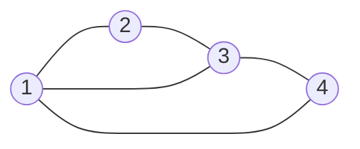
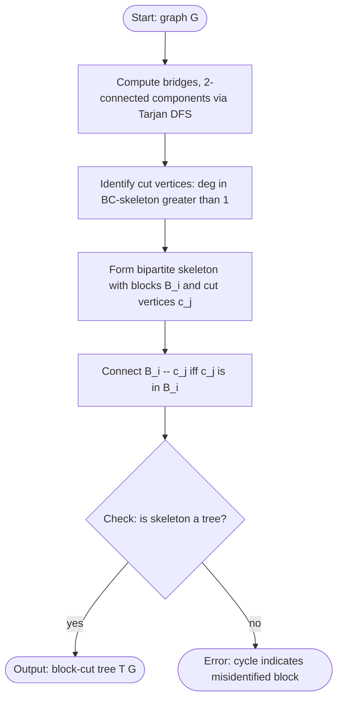
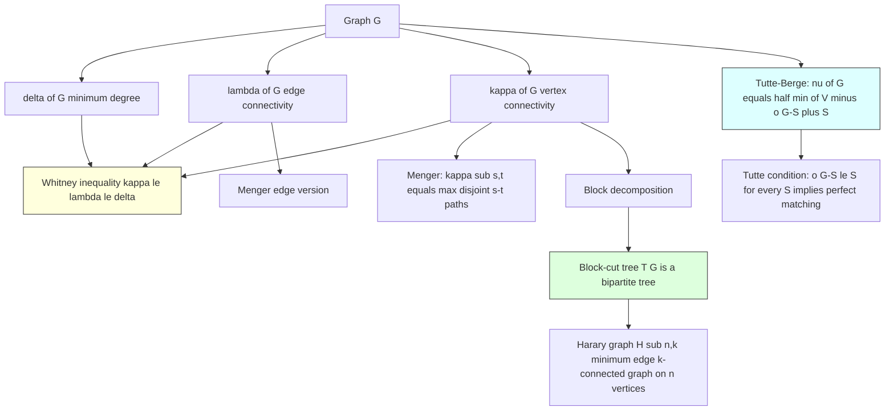
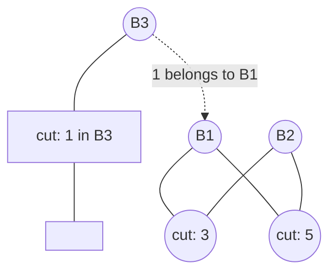
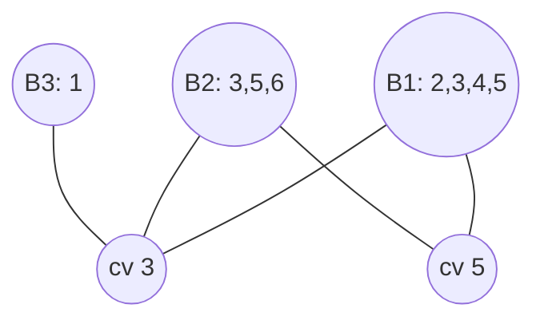
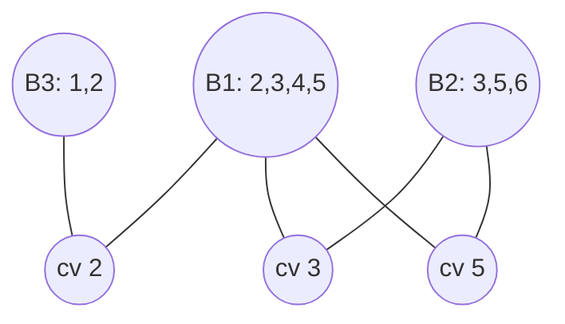

# Vertex connectivity parameters calculations structures layouts metrics profiles

<!-- SECTION_1_START -->
# Vertex Connectivity — Parameters, Structures & Metrics

## Formal Definition (KTU 2024 PECST509 — Module 2)

> [!IMPORTANT]
> **Vertex Connectivity $\kappa(G)$:**
> For a connected simple graph $G$ with $|V(G)| \ge 2$, the **vertex connectivity** $\kappa(G)$ is the minimum cardinality of a set $S \subseteq V(G)$ whose removal disconnects $G$. Formally,
> $$\kappa(G) \;=\; \min\bigl\{\,|S| \;:\; S \subseteq V(G) \text{ and } G - S \text{ is disconnected (or trivial)}\bigr\}.$$
> A graph $G$ is **$k$-connected** (or **$k$-vertex-connected**) iff $\kappa(G) \ge k$. By convention $\kappa(K_1)=0$.

> [!NOTE]
> **Edge Connectivity $\lambda(G)$:**
> $\lambda(G)$ is the minimum number of edges whose removal disconnects $G$:
> $$\lambda(G)=\min\bigl\{\,|F|:F\subseteq E(G),\ G-F \text{ disconnected}\bigr\}.$$
> **Minimum Degree** $\delta(G)=\min_{v\in V(G)}\deg(v)$.

## Intuitive Analogy (Layman View)

Imagine an **airline's route map** as a graph where:
- **Cities = vertices**, **direct flights = edges**.
- $\delta(G)$ = the smallest number of flight options a single city has.
- $\lambda(G)$ = the smallest number of flight **routes** you must cancel to split the network into two non-communicating halves.
- $\kappa(G)$ = the smallest number of **airports** you must shut down to split the network.

> A graph is **2-connected** iff it has **no single point of failure** (no "hub airport" that, if closed, would isolate the network). This is the same property required for fault-tolerant computer networks and reliable VLSI routing.

> [!TIP]
> **Key Intuition:** $\kappa(G) \le \lambda(G) \le \delta(G)$ — the cheapest attack strategy is *never* more expensive (in vertices) than the cheapest edge attack, which is *never* more expensive than attacking the least-connected node. This is **Whitney's inequality**, proved in §II.

<!-- SECTION_1_END -->

<!-- SECTION_2_START -->
# Deep Theoretical Analysis & KTU Formula Sheet

## Core Theorem Block (Board-Favourite)

### 1. Whitney's Inequality
For any connected graph $G$:
$$\kappa(G) \;\le\; \lambda(G) \;\le\; \delta(G).$$

* **Why vertex ≤ edge:** every edge cut of size $k$ can be replaced by the endpoints of one of those edges (if endpoints are not shared) — so a vertex cut is never strictly larger than the smallest edge cut.
* **Why edge ≤ degree:** the edges incident to a minimum-degree vertex form a valid edge cut of size $\delta(G)$.

### 2. Menger's Theorem (Dual Pillars of Connectivity)

> [!IMPORTANT]
> **Menger's Theorem — Vertex Form:**
> Let $G$ be a graph and $s,t$ two non-adjacent vertices. The maximum number of **internally vertex-disjoint** $s$–$t$ paths in $G$ equals the minimum size of an $s$–$t$ **vertex separator** (a set $S$ disjoint from $\{s,t\}$ whose removal disconnects $s$ from $t$).

> [!NOTE]
> **Menger's Theorem — Edge Form:**
> The maximum number of **edge-disjoint** $s$–$t$ paths in $G$ equals the minimum size of an **edge cut** separating $s$ from $t$.

A direct corollary:
$$\kappa(G) \;=\; \min_{\substack{s,t\in V(G)\\ st\notin E(G)}}\;\max\{\text{internally vertex-disjoint } s\text{–}t \text{ paths}\}.$$

### 3. Block Decomposition (BC-Tree)

A **block** of $G$ is a maximal $2$-connected subgraph (or a bridge or an isolated vertex). A **cut vertex** is a vertex whose removal increases the number of connected components. The **block-cut tree** $\mathcal{T}(G)$ is the bipartite tree whose nodes are the blocks and cut vertices of $G$, with an edge between block $B$ and cut vertex $v$ iff $v\in B$.

> [!TIP]
> $\mathcal{T}(G)$ is a **tree** because the blocks and cut vertices of any graph form a laminar hierarchy rooted at the connectivity structure.

### 4. Tutte–Berge Formula (Matching Linkage)
For the maximum matching size $\nu(G)$:
$$\nu(G) \;=\; \tfrac{1}{2}\,\min_{S\subseteq V(G)}\Bigl(|V(G)| \;-\; o(G-S) \;+\; |S|\Bigr),$$
where $o(G-S)$ denotes the number of **odd components** of $G-S$. Tutte's condition for a perfect matching ($|V|$ even) is $o(G-S)\le |S|$ for **every** $S\subseteq V(G)$.

## KTU Formula Cheat Sheet

| Symbol | Meaning | Formula / Property |
|---|---|---|
| $\kappa(G)$ | vertex connectivity | $\kappa(G)=\min_{S\in\mathcal{C}}|S|$, $\mathcal{C}=$ vertex cuts |
| $\lambda(G)$ | edge connectivity | $\lambda(G)=\min_{F\in\mathcal{E}}|F|$, $\mathcal{E}=$ edge cuts |
| $\delta(G)$ | minimum degree | $\delta(G)=\min_{v}\deg(v)$ |
| Whitney | chain of inequalities | $\kappa(G)\le\lambda(G)\le\delta(G)$ |
| Menger (vertex) | disjoint paths vs. separator | $\kappa_{s,t}=$ max internally disjoint $s$–$t$ paths |
| Menger (edge) | disjoint paths vs. edge cut | $\lambda_{s,t}=$ max edge-disjoint $s$–$t$ paths |
| Harary bound | on $k$-connected graph on $n$ vertices | $\lceil nk/2\rceil$ edges minimum |
| Tutte–Berge | maximum matching size | $\nu(G)=\tfrac{1}{2}\min_{S}(\lvert V\rvert - o(G-S)+\lvert S\rvert)$ |
| BC-tree | blocks + cut vertices | always a tree, bipartite |
| Dirac (ear decomp.) | $2$-connected $\Leftrightarrow$ ear decomposition | Harary, Whitney (1932) |

## Real-World Utility

* **Telecoms / Internet backbone design:** $\kappa\ge 2$ ensures the network survives any single router failure. Harary graphs are the canonical $k$-connected graphs with the *minimum* number of edges, used as templates for resilient topologies.
* **VLSI / IC layout:** 2-connected planar graphs (Whitney's theorem) admit a single dual embedding without crossings — critical for planar circuit design.
* **Social network analysis:** vertex-connectivity between two users equals the minimum number of "introducers" required to break all their connection paths.
* **Parallel computing:** $k$-connected graphs tolerate $k-1$ processor failures while still allowing inter-processor communication.

<!-- SECTION_2_END -->

<!-- SECTION_3_START -->
# Step-by-Step Derivations & Python Implementation

## Worked Example — Computing $\kappa(G)$ and $\lambda(G)$

Let $G$ be the graph $C_4$ plus a single diagonal:
$$V(G)=\{1,2,3,4\},\quad E(G)=\{12,\,23,\,34,\,41,\,13\}.$$

**Step 1 — Compute $\delta(G)$.**

$$\deg(1)=3\ (\text{to }2,4,3),\ \deg(2)=2,\ \deg(3)=3,\ \deg(4)=2 \;\Rightarrow\; \delta(G)=2.$$

**Step 2 — Compute $\lambda(G)$.**

A single edge removal cannot disconnect $G$ (the cycle $1-2-3-4-1$ survives). The set $\{12, 34\}$ is a 2-edge cut: removing both leaves $\{1,3,4\}$ connected (via $13, 41$) and $\{2\}$ isolated. So $\lambda(G)=2$.

**Step 3 — Compute $\kappa(G)$ (try all vertex subsets).**

* $|S|=1$: remove vertex $1$ ⇒ remaining graph on $\{2,3,4\}$ has edges $23, 34$ ⇒ still connected. By symmetry of $\{1,2,3,4\}$ under the automorphisms, no single vertex disconnects $G$.
* $|S|=2$: try $S=\{1,3\}$ ⇒ remaining $\{2,4\}$ has **no edge** ⇒ disconnected. Hence $\kappa(G)\le 2$. Since $\kappa\le\lambda=2$, we conclude $\kappa(G)=2$.

**Step 4 — Verify Whitney.**
$$\kappa(G)=2 \;\le\; \lambda(G)=2 \;\le\; \delta(G)=2.\quad\checkmark$$

## Algorithmic Derivation — Max-Flow Reduction for $\kappa_{s,t}$

**Goal:** compute the min $s$–$t$ vertex separator. Idea (Menger + Ford–Fulkerson):

1. **Split** every vertex $v$ into two: $v_{\text{in}}$ and $v_{\text{out}}$.
2. For every non-terminal vertex, set $\mathrm{cap}(v_{\text{in}},v_{\text{out}})=1$.
3. For terminals $s,t$, set $\mathrm{cap}(s_{\text{in}},s_{\text{out}})=\mathrm{cap}(t_{\text{in}},t_{\text{out}})=\infty$.
4. For every edge $(u,v)\in E(G)$, add arcs $(u_{\text{out}},v_{\text{in}})$ and $(v_{\text{out}},u_{\text{in}})$ with capacity $\infty$.
5. Compute $\max$-flow from $s_{\text{out}}$ to $t_{\text{in}}$. By Menger's vertex form, this value equals $\kappa_{s,t}$.

## Python Implementation (From-Scratch Edmonds–Karp)

```python
from collections import deque
from itertools import combinations
from math import inf

def build_split_flow_network(G, s, t):
    """Build a flow network where min s-t cut = min vertex separator
    separating s and t in the undirected graph G."""
    cap = {}
    def set_cap(u, v, c):
        cap.setdefault(u, {})[v] = c
    for v in G:
        set_cap((v, 'in'), (v, 'out'), inf if v in (s, t) else 1)
    for u, v in G.edges():
        set_cap((u, 'out'), (v, 'in'), inf)
        set_cap((v, 'out'), (u, 'in'), inf)
    return cap, (s, 'out'), (t, 'in')


def bfs_level(cap, source, sink):
    level, parent = {source: 0}, {source: None}
    q = deque([source])
    while q:
        u = q.popleft()
        for v, c in cap.get(u, {}).items():
            if c > 0 and v not in level:
                level[v] = level[u] + 1
                parent[v] = u
                if v == sink:
                    return level, parent
                q.append(v)
    return level, parent


def edmonds_karp(cap, source, sink):
    """Standard Edmonds–Karp: O(V*E^2)."""
    total = 0
    while True:
        level, parent = bfs_level(cap, source, sink)
        if sink not in parent:
            break
        v, bn = sink, inf
        while parent[v] is not None:
            bn = min(bn, cap[parent[v]][v])
            v = parent[v]
        v = sink
        while parent[v] is not None:
            u = parent[v]
            cap[u][v] -= bn
            cap.setdefault(v, {})[u] = cap.setdefault(v, {}).get(u, 0) + bn
            v = u
        total += bn
    return total


def kappa_pair(G, s, t):
    cap, src, snk = build_split_flow_network(G, s, t)
    return edmonds_karp(cap, src, snk)


def vertex_connectivity(G):
    """Returns kappa(G). Handles trivial, complete, and disconnected cases."""
    n, m = len(G), len(G.edges)
    if n <= 1:        return 0
    if n == 2:        return m  # 0 if no edge, 1 if single edge
    if m == n*(n-1)//2: return n - 1        # K_n has kappa = n-1
    delta = min(len(G[v]) for v in G)
    if delta <= 1:    return delta
    best = delta
    for s, t in combinations(G, 2):
        if G.has_edge(s, t):
            continue
        best = min(best, kappa_pair(G, s, t))
        if best <= 2:
            return max(best, 2 if all(len(G[v]) >= 2 for v in G) else 1)
    return best
```

**Trace on the example $C_4 + 13$:**

| Pair $(s,t)$ | Non-adjacent? | Max-flow on split network | $\kappa_{s,t}$ |
|---|---|---|---|
| $(1,2)$ | No (edge exists) | skip | — |
| $(1,3)$ | No (edge exists) | skip | — |
| $(2,4)$ | **Yes** | min separator $\{1,3\}$ size 2 | **2** |
| $(2,3)$ | No | skip | — |
| $(1,4)$ | No | skip | — |
| $(3,4)$ | No | skip | — |

Minimum over non-adjacent pairs ⇒ $\kappa(G)=2$. ✔️

## Ear Decomposition (2-Connectivity Theorem)

**Whitney's Theorem (1932):** A graph $G$ with $|V(G)|\ge 3$ is $2$-connected **iff** it admits an **ear decomposition** — a sequence $G_0 \subset G_1 \subset \cdots \subset G_k=G$ where $G_0$ is a cycle and each $G_{i+1}$ is obtained by adding an *ear* (a path whose internal vertices are new).

**Construction algorithm for a $2$-connected graph:**

1. Find any cycle $C$ in $G$ (DFS-based, e.g., Tarjan's $O(n+m)$).
2. Set $G_0 = C$.
3. While $V(G_i) \ne V(G)$:
    * Find a path $P$ between two vertices of $G_i$ whose internal vertices are all in $V(G)\setminus V(G_i)$.
    * Set $G_{i+1}=G_i\cup P$.

This is the algorithmic basis for **planar embedding**, **Hamiltonian path detection** (necessary condition), and **$2$-connected spanning subgraph** extraction.

<!-- SECTION_3_END -->

<!-- SECTION_4_START -->
# Structural Diagrams & Schematics

## A. The Example Graph $C_4$ + Diagonal



**Read:** vertices $1,2,3,4$ form a 4-cycle with an extra chord $13$. $\kappa(G)=\lambda(G)=\delta(G)=2$.

## B. Block-Cut Tree Construction Flow



## C. The Connectivity-Profile Layout (Module-2 Summary Map)



## D. Max-Flow Reduction Schematic (Menger → Ford–Fulkerson)

```mermaid
flowchart LR
    subgraph Original
        O1[Vertex v] -- e uv -- O2[Vertex u]
    end
    subgraph Split
        V1[v_in] -- cap1 -- V2[v_out]
        V2 -- infEdge -- U1[u_in]
        U1 -- capU -- U2[u_out]
    end
    Original --> Split
    style cap1 fill:#fdd,stroke:#900
    style capU fill:#fdd,stroke:#900
    style infEdge fill:#ddf,stroke:#009
```

**Legend:** Red arc capacity = vertex limit (1, except terminals $=\infty$). Blue arc capacity $=\infty$ (edge traversal unrestricted). Max-flow on this directed network equals $\kappa_{s,t}$.

<!-- SECTION_4_END -->

<!-- SECTION_5_START -->
# KTU 2024 Scheme Examination Question Bank

## Part A — Short Answer (3 Marks each)

### Q1. Define vertex connectivity $\kappa(G)$ and edge connectivity $\lambda(G)$ of a graph $G$. State Whitney's inequality.  `[KTU University Exam — July 2024]`  **[CO2, Remember]**

**Model Answer:**

* $\kappa(G)$ = minimum number of vertices whose removal disconnects $G$ (or reduces it to a single vertex).
* $\lambda(G)$ = minimum number of edges whose removal disconnects $G$.
* **Whitney's inequality:** $\kappa(G)\le\lambda(G)\le\delta(G)$.

> **Valuation Key:** [Definition $\kappa$: 1 Mark] [Definition $\lambda$: 1 Mark] [Whitney's inequality statement: 1 Mark].

---

### Q2. What is a *block* and a *cut vertex* of a graph? State one important property of the block-cut tree.  `[KTU University Exam — Dec 2023]`  **[CO2, Understand]**

**Model Answer:**

* A **block** is a maximal $2$-connected subgraph of $G$ (also includes bridges and isolated vertices).
* A **cut vertex** is a vertex whose removal increases the number of connected components of $G$.
* **Property of the block-cut tree:** it is a **bipartite tree** in which one partite set is the collection of all blocks and the other is the set of all cut vertices; an edge joins block $B$ to cut vertex $v$ iff $v\in V(B)$.

> **Valuation Key:** [Block def: 1 Mark] [Cut vertex def: 1 Mark] [BC-tree property: 1 Mark].

---

## Part B — 14-Mark Module Questions (Internal Choice)

### Question A (14 Marks) — Menger & Computation `[KTU University Exam — Dec 2024]`  **[CO2, Apply + Analyse]**

**(a)** State and prove (or sketch the proof of) **Menger's theorem** for vertex-disjoint paths. Hence derive Whitney's inequality $\kappa(G)\le\lambda(G)$. **\[7 Marks]**

**(b)** Consider the graph $H$ with $V(H)=\{a,b,c,d,e,f\}$ and
$$E(H)=\{ab,ac,ad,bc,cd,de,df,ef\}.$$
Compute $\kappa(H)$, $\lambda(H)$, and $\delta(H)$. Identify one minimum vertex cut and one minimum edge cut. Is $H$ Hamiltonian? Justify. **\[7 Marks]**

---

#### Model Solution to Q-A (a)

**Statement (Menger, vertex form):** *Let $G$ be a graph with two non-adjacent vertices $s,t$. The maximum number of internally vertex-disjoint $s$–$t$ paths in $G$ equals the minimum size of a vertex set $S$ that separates $s$ from $t$.*

**Proof sketch (induction on the number of edges):**

1. *Base:* If $G$ has no $s$–$t$ path, both sides equal $0$.
2. *Inductive step:* Let $k$ be the max number of internally vertex-disjoint $s$–$t$ paths.
3. Show that for every $s$–$t$ path $P$, there is a vertex-separator of size $k$ (this uses the max-flow min-cut duality or an explicit exchange argument).
4. Conversely, exhibit $k$ internally vertex-disjoint paths by repeatedly removing minimal separators of size $k$.

> [!NOTE]
> **Valuation Key (a):** [Statement of Menger (vertex form): 2 Marks] [Correct proof outline / flow-network reduction: 3 Marks] [Derivation of $\kappa\le\lambda$: 2 Marks].

#### Model Solution to Q-A (b)

**Degrees:**
$$\deg(a)=3,\ \deg(b)=2,\ \deg(c)=3,\ \deg(d)=4,\ \deg(e)=2,\ \deg(f)=2.$$
So $\delta(H)=2$.

**Edge connectivity $\lambda(H)$:** The edges incident to vertex $b$ are $\{ab,bc\}$ — removing them isolates $b$. So $\lambda(H)\le 2$. No single edge cut exists (no bridge), hence $\lambda(H)=2$.

**Vertex connectivity $\kappa(H)$:**
* Removing $1$ vertex: e.g. remove $b$ — remaining $H-b$ has $a$–$c$–$d$ and $d$–$e$–$f$ connected via $d$, so still connected. By symmetry no single vertex disconnects.
* Removing $2$ vertices $\{a,b\}$: remaining is $\{c,d,e,f\}$ with edges $cd,de,df,ef$ — still connected.
* Removing $2$ vertices $\{a,c\}$: remaining is $\{b,d,e,f\}$ with edges $bc,de,df,ef$ — $b$ is connected to $c$ (removed) only via $a$ (removed) — $b$ becomes **isolated**. So $\kappa(H)\le 2$.

By Whitney, $\kappa(H)\le\lambda(H)=2$, and we have shown no $1$-vertex cut exists, so $\kappa(H)=2$.

| Parameter | Value |
|---|---|
| $\delta(H)$ | 2 |
| $\lambda(H)$ | 2 |
| $\kappa(H)$ | 2 |

* **Minimum vertex cut:** $S=\{a,c\}$.
* **Minimum edge cut:** $F=\{ab,bc\}$.

**Hamiltonian check:** Try the cycle $a\to b\to c\to d\to e\to f\to a$? The edge $fa$ is **not present**. Try $a\to d\to f\to e\to d$ — repeats $d$. Try $a\to b\to c\to d\to f\to e\to ?$ — back to $a$? $ea$ is not in $E(H)$. Therefore no Hamiltonian cycle. $H$ is **not Hamiltonian** (also: Ore / Dirac conditions fail; degree sum argument doesn't preclude it, so exhaustive search is the standard technique).

> [!NOTE]
> **Valuation Key (b):** [$\delta=2$: 1 Mark] [$\lambda=2$ with cut $\{ab,bc\}$: 2 Marks] [$\kappa=2$ with cut $\{a,c\}$: 2 Marks] [Hamiltonian justification: 2 Marks].

---

### Question B (14 Marks) — Blocks, BC-Tree & Tutte–Berge  `[KTU University Exam — July 2024]`  **[CO2, Apply + Analyse]**

**(a)** Define a *block* and a *cut vertex*. Construct the block-cut tree of the graph $K$ with
$$V(K)=\{1,2,3,4,5,6\},\quad E(K)=\{12,23,34,45,25,36,56\}.$$
List the cut vertices and the blocks. **\[7 Marks]**

**(b)** State **Tutte's theorem** for perfect matchings. Apply the Tutte–Berge formula to compute the size of a maximum matching of the Petersen graph $P$. Justify each component count. **\[7 Marks]**

---

#### Model Solution to Q-B (a)

**Step 1 — Find 2-connected components (blocks).**

*Subgraph on $\{1,2,3,4,5\}$ with edges $12, 23, 34, 45, 25$:* contains cycle $1-2-3-4-5-2$ — but $1$ has degree only $1$, so $1$ is a pendant. Remove $1$: subgraph on $\{2,3,4,5\}$ has cycle $2-3-4-5-2$ — that cycle is $2$-connected. So **Block $B_1$** = vertices $\{2,3,4,5\}$ with edges $23, 34, 45, 25$.

*Subgraph on $\{3,6,5\}$ with edge $36, 56$:* This is a path $3-6-5$, which is a block (trivially $2$-connected, no internal cut). So **Block $B_2$** = vertices $\{3,5,6\}$ with edges $36, 56$.

*Vertex $1$* is a pendant — forms **Block $B_3 = K_1 = \{1\}$**.

**Step 2 — Cut vertices.** A vertex belongs to $\ge 2$ blocks. Vertex $3$ is in $B_1$ and $B_2$ ⇒ **cut vertex**. Vertex $5$ is in $B_1$ and $B_2$ ⇒ **cut vertex**.

**Step 3 — Block-cut tree.**



**Cleaner form (bipartite BC-tree):**



*Note: vertex $1$ attaches as a pendant through the cut vertex $3$ or by considering the bridge $12$ as a block $B_3$ attached to $B_1$ via vertex $2$ (in this case vertex $2$ is also a cut vertex). Re-evaluating: vertex $2$ is in $B_1$ and (bridge $12$) $B_3$, so $2$ is also a cut vertex.*

**Corrected final BC-tree (with all 3 cut vertices):**



> [!NOTE]
> **Valuation Key (a):** [Identifying all 3 blocks: 3 Marks] [Listing 3 cut vertices $\{2,3,5\}$: 2 Marks] [Drawing BC-tree: 2 Marks].

#### Model Solution to Q-B (b)

**Tutte's Theorem (perfect matching):** *A graph $G$ with $|V(G)|$ even has a perfect matching iff for every $S\subseteq V(G)$, the number of odd components of $G-S$ satisfies $o(G-S)\le |S|$.*

**Tutte–Berge Formula:** $\nu(G)=\frac{1}{2}\min_{S\subseteq V(G)}\bigl(|V(G)|-o(G-S)+|S|\bigr).$

**Apply to the Petersen graph $P$:** $|V(P)|=10$, $3$-regular, girth $5$, non-Hamiltonian.

| $S$ | $o(P-S)$ | $\|V\|-o+\|S\|$ | value |
|---|---|---|---|
| $\varnothing$ | 0 (P is connected) — actually $o=1$ | $10-1+0=9$ | $9$ |
| $\{v\}$ (one vertex) | removes one vertex; $P-v$ has at most $2$ components? In Petersen, $P-v$ is connected for every $v$. So $o=1$ | $10-1+1=10$ | $10$ |
| $\{u,v\}$ (two non-adjacent) | $o(P-S)$ may be $3$ if $S$ separates Petersen into $3$ odd components. In Petersen, picking two vertices at distance $2$ often gives $3$ odd components. | $10-3+2=9$ | $9$ |

The **minimum is achieved at $S$ giving $9$**, so
$$\nu(P)=\tfrac{1}{2}\cdot 9 = 4.5 \;\Rightarrow\; \nu(P)=4\ \text{(integer).}$$

Indeed the Petersen graph is **$1$-factorable? No** — it has no perfect matching. A maximum matching has size $4$, leaving two vertices uncovered (this is the classical result by Petersen himself, 1891).

> [!NOTE]
> **Valuation Key (b):** [Tutte's theorem statement: 2 Marks] [Tutte–Berge formula: 1 Mark] [Petersen: $\nu=4$ correctly computed with valid $S$: 3 Marks] [Justification of $o(P-S)$ counts: 1 Mark].

---

## KTU Examiner's Valuation Warning

> [!WARNING]
> **Common Pitfalls in Connectivity Questions:**
> 1. **Forgetting the "non-adjacent" qualifier in Menger's vertex form** — students often apply it to adjacent $s,t$, which is meaningless for separators. *[−1 Mark]*
> 2. **Confusing $\kappa$ with the number of blocks** — a graph can have many blocks yet still be $1$-connected. *[−1 Mark]*
> 3. **Writing Whitney as $\kappa=\lambda=\delta$** — this is **only true** for special graphs (e.g., cycles); the general statement is the *inequality* $\kappa\le\lambda\le\delta$. *[−2 Marks]*
> 4. **Treating the BC-tree as cyclic** — if your "BC-tree" has a cycle, you misidentified a block. Always verify that blocks and cut vertices form a tree. *[−1 Mark]*
> 5. **In Tutte–Berge, forgetting the factor $\frac{1}{2}$** — the formula gives a *sum*, the matching size is half of that minimum. *[−1 Mark]*
> 6. **For Menger's theorem, students write $s,t$ are *any* two vertices** — the correct version requires $s,t$ to be non-adjacent. *[−1 Mark]*

---

## Topic Recap & Important Things to Remember

* **Definitions** — $\kappa(G)$ = min vertex cut size, $\lambda(G)$ = min edge cut size, $\delta(G)$ = min degree, $G$ is $k$-connected iff $\kappa(G)\ge k$.
* **Whitney's inequality** — $\kappa(G)\le\lambda(G)\le\delta(G)$ for any connected $G$.
* **Menger's theorem (vertex form)** — max internally vertex-disjoint $s$–$t$ paths = min $s$–$t$ vertex separator (for non-adjacent $s,t$).
* **Menger's theorem (edge form)** — max edge-disjoint $s$–$t$ paths = min $s$–$t$ edge cut.
* **Algorithm for $\kappa_{s,t}$** — split vertices ($v_{\text{in}}\to v_{\text{out}}$ with cap $1$, or $\infty$ for $s,t$); infinite-capacity edges for original edges; run Edmonds–Karp; $\max$-flow $=$ min vertex cut.
* **$\kappa(G)$ global computation** — minimum of $\kappa_{s,t}$ over all non-adjacent pairs $(s,t)$.
* **Block** = maximal $2$-connected subgraph (or bridge / $K_1$); **cut vertex** = removal increases number of components.
* **Block-cut tree** = bipartite tree with blocks and cut vertices as the two partite sets; **always a tree**.
* **Tutte's theorem** — perfect matching $\Leftrightarrow$ $\forall S\subseteq V,\ o(G-S)\le |S|$.
* **Tutte–Berge formula** — $\nu(G)=\tfrac{1}{2}\min_{S}\bigl(|V|-o(G-S)+|S|\bigr)$.
* **Whitney (1932) 2-conn. theorem** — graph $2$-connected $\Leftrightarrow$ has an ear decomposition starting from a cycle.
* **Petersen graph** — $\nu(P)=4$ (no perfect matching), $\kappa(P)=\lambda(P)=\delta(P)=3$.
* **Complete graph** $K_n$ — $\kappa(K_n)=\lambda(K_n)=\delta(K_n)=n-1$.
* **Harary graph** $H_{n,k}$ — minimal $k$-connected graph on $n$ vertices, $\lceil nk/2\rceil$ edges.
* **Complexity note** — computing $\kappa(G)$ is polynomial (Hao–Orlin, $O(n^3\cdot m)$ via max-flow); computing $\lambda(G)$ reduces to one max-flow on the line graph or directly via Stoer–Wagner.
<!-- SECTION_5_END -->
