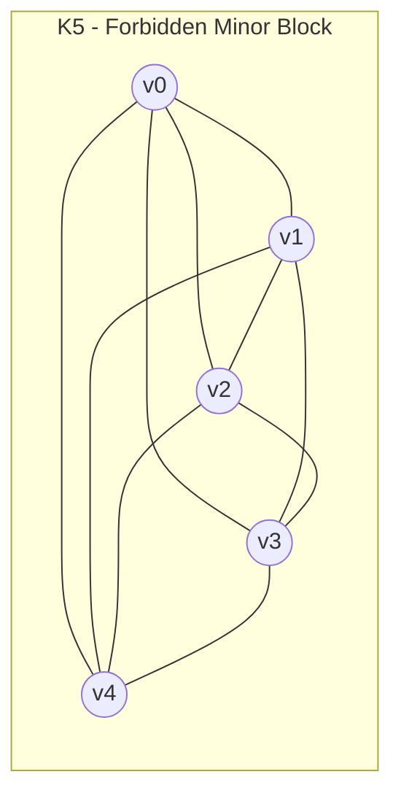
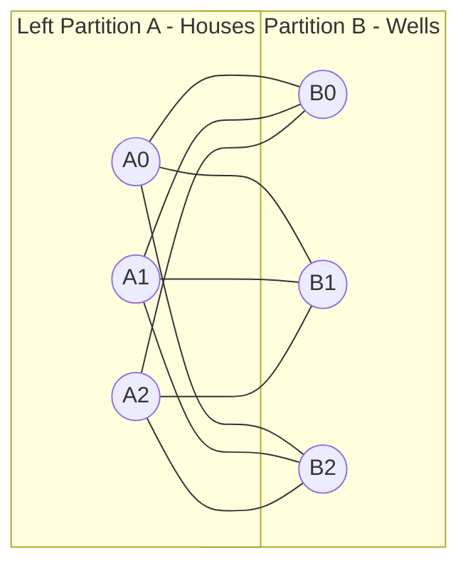
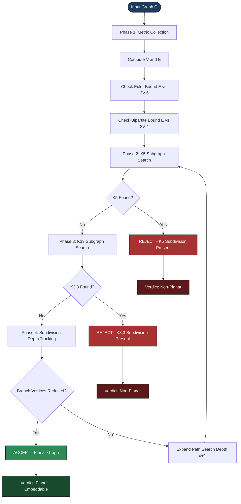
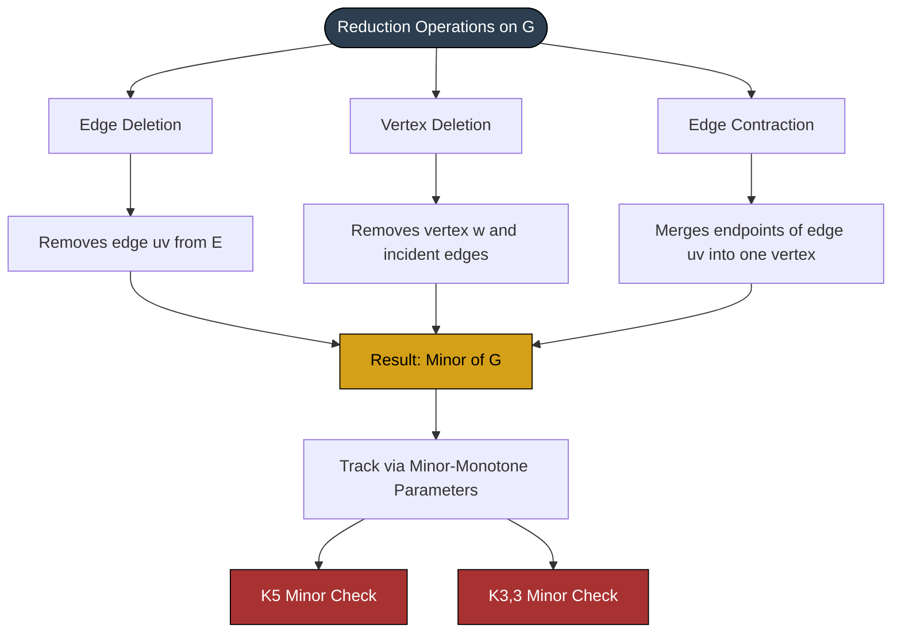

# Kuratowski's graph reduction validation metrics parameters profiles tracking setups

<!-- SECTION_1_START -->

# Kuratowski's Graph Reduction Validation: Metrics, Parameters & Tracking Setups

> [!IMPORTANT]
> **KTU 2024 Scheme | PECST509 | Module 3 — Graph Colorings & Planarity**
> This note treats Kuratowski's reduction as a *formal validation pipeline*: given any abstract graph $G$, we apply a sequence of reduction operations (subdivisions, contractions, minor extractions) and track the **parameters** that guarantee $G$ is planar *iff* no Kuratowski subgraph survives the reduction.

## 1.1 Formal Academic Definition

**Kuratowski's Theorem (1930):** A finite graph $G$ is **planar** if and only if $G$ does not contain a subgraph that is a **subdivision** of either $K_5$ (the complete graph on **5** vertices) or $K_{3,3}$ (the complete bipartite graph on **3+3** vertices).

Equivalently (Wagner's Theorem, 1937): $G$ is planar if and only if $G$ contains **neither $K_5$ nor $K_{3,3}$ as a minor**.

> [!NOTE]
> **Why two forbidden graphs?**
> $K_5$ is the smallest non-planar complete graph, and $K_{3,3}$ is the smallest non-planar bipartite graph (utility graph). Every non-planar graph must "contain" one of these in a topological sense — either as a direct subgraph, a subdivision, or a minor.

## 1.2 Intuitive Analogy

Imagine you are untangling a ball of yarn. You keep cutting, stretching, and joining strands. **Kuratowski's Theorem says**: regardless of how tangled the yarn is, you will always find either:

- A **pentagonal knot** ($K_5$) — five strands all cross-pairing with each other, or
- A **utility knot** ($K_{3,3}$) — three "houses" connected to three "wells" with no crossable links.

If neither knot is present (even in a stretched/subdivided form), the entire ball of yarn lies flat on a table — the graph is planar.

> [!TIP]
> **GeoGebra Visualisation Cue (Mental Sketch):**
> - Draw 5 dots, connect every pair → you cannot draw $K_5$ in the plane without edges crossing. This is the *crossing number* $\text{cr}(K_5) = 1$.
> - Draw 3 dots on the left, 3 on the right, connect every left dot to every right dot ($K_{3,3}$). Again $\text{cr}(K_{3,3}) = 1$.

## 1.3 Core Terminology (KTU Board-Definition Style)

| Term | Definition | Validation Role |
|------|------------|-----------------|
| **Subdivision** | Replacing an edge $uv$ with a path $u = w_0, w_1, \dots, w_k = v$ of length $k \ge 2$ | Tracks edge-stretching operations |
| **Homeomorphic** | Two graphs are homeomorphic if both are subdivisions of a common graph | Validation of topological equivalence |
| **Minor** | $H$ is a minor of $G$ if $H$ is obtained via edge deletions, vertex deletions, and edge contractions | Tracks reduction (contraction) operations |
| **Kuratowski subgraph** | A subgraph of $G$ homeomorphic to $K_5$ or $K_{3,3}$ | The validation **failure** signature |
| **Branch vertex** | A vertex of degree $\ge 3$ in a subdivision | Anchor point for reduction tracking |

<!-- SECTION_1_END -->

<!-- SECTION_2_START -->

# 2. Deep Theoretical Analysis & KTU High-Yield Formula Sheet

## 2.1 The Kuratowski Reduction Pipeline (Conceptual Phases)

The validation engine for planarity via Kuratowski's theorem operates in **four coupled phases**:

**Phase 1 — Pre-Reduction Metric Collection**
- Compute $\vert V \vert$, $\vert E \vert$, degree sequence, girth $g$, and density ratio $\rho = \dfrac{\vert E \vert}{\vert V \vert}$.
- Apply **Euler's necessary condition** for planarity.

**Phase 2 — Forbidden-Minor Search**
- Search for $K_5$ as a subgraph (5 vertices, 10 edges, every pair adjacent).
- Search for $K_{3,3}$ as a subgraph (6 vertices, 9 edges, bipartite with no odd cycle).
- Complexity: $\mathcal{O}(\vert V \vert^5)$ naively, $\mathcal{O}(\vert V \vert^{\omega})$ using fast matrix multiplication.

**Phase 3 — Subdivision Expansion & Tracking**
- For every detected dense cluster, expand paths of length $\ge 2$ to identify **branch vertices** and reconstruct the homeomorphic parent.
- Track the **subdivision depth** $d$ of each original edge.

**Phase 4 — Final Validation Verdict**
- If a $K_5$-subdivision or $K_{3,3}$-subdivision is found → **REJECT** (graph is non-planar).
- If reduction exhausts all branches without finding either → **ACCEPT** (graph is planar).

## 2.2 Why the Theorem Works: Logical Backbone

Kuratowski's theorem is a **biconditional**:

$$
G \text{ is planar} \iff \neg \left( G \supseteq T(K_5) \lor G \supseteq T(K_{3,3}) \right)
$$

where $T(H)$ denotes any subdivision of $H$.

- **Forward direction ($\Rightarrow$):** Proved by contradiction — if $G$ contains a subdivision of $K_5$ or $K_{3,3}$, then a region argument on any plane drawing shows an unavoidable crossing.
- **Backward direction ($\Leftarrow$):** Constructive — if $G$ contains neither, an inductive embedding procedure (e.g., the **Hopcroft–Tarjan planarity test**) produces a plane drawing.

> [!NOTE]
> **Historical Note:** The forward direction was conjectured by Kuratowski and proved by him in 1930. The backward direction's efficient constructive proof came from Hopcroft & Tarjan in 1974 ($\mathcal{O}(\vert V \vert)$ time).

## 2.3 KTU High-Yield Formula Sheet

> [!TIP]
> **All formulas required for board problems on Kuratowski reduction validation:**

| # | Formula / Rule | Description | When to Use |
|---|----------------|-------------|-------------|
| 1 | $V - E + F = 2$ | **Euler's formula** (connected planar graph) | Verify candidate plane embedding |
| 2 | $E \le 3V - 6$ | Planar edge bound (general graph) | Quick non-planarity check |
| 3 | $E \le 2V - 4$ | Planar edge bound (bipartite, $V \ge 3$) | Quick non-planarity check for bipartite |
| 4 | $K_5$: $V=5, E=10, 10 > 3(5)-6 = 9$ | $K_5$ violates bound #2 | Prove $K_5$ non-planar |
| 5 | $K_{3,3}$: $V=6, E=9, 9 > 2(6)-4 = 8$ | $K_{3,3}$ violates bound #3 | Prove $K_{3,3}$ non-planar |
| 6 | $F \ge \dfrac{E}{3} + 2$ | Region bound (triangulation lower) | Embedding validation |
| 7 | $\sum_{f \in F} \deg(f) = 2E$ | Handshaking for faces | Region degree validation |
| 8 | $\text{cr}(G) \ge \vert E \vert - 3\vert V \vert + 6$ | Crossing number lower bound (planar subtracted) | Estimate minimum crossings |
| 9 | $G \text{ minor of } H \Rightarrow \chi(G) \le \chi(H)$ | Minor-monotone chromatic bound | Cascade minor reductions |
| 10 | Subdivision preserves $V$-count branch-degree, multiplies $E$ | Tracking parameter for reduction | Validate reduction depth $d$ |

## 2.4 Real-World Engineering Utility

Kuratowski's reduction framework is the **theoretical backbone** of:

- **VLSI Circuit Design** — verifying that a printed circuit board layout has no unavoidable wire crossings.
- **Railway/Road Network Design** — ensuring map-routing is planar for GPS visualisation.
- **Compiler Optimisation** — register-interference graphs in SSA form are reduced via minor operations.
- **Bioinformatics** — RNA secondary structure planarity tests for folding validation.
- **Network Topology** — verifying mesh/sensor networks for crossing-free backbone routing.

<!-- SECTION_2_END -->

<!-- SECTION_3_START -->

# 3. Step-by-Step Derivations, Proofs & Python Implementation

## 3.1 Proof That $K_5$ Is Non-Planar (Exhaustive)

We will show $K_5$ cannot be embedded in the plane.

**Step 1:** Apply Euler's formula to any connected plane graph:

$$
V - E + F = 2
$$

**Step 2:** For $K_5$, we have $V = 5$ and $E = \binom{5}{2} = 10$.

**Step 3:** Substitute into the necessary condition $E \le 3V - 6$:

$$
\begin{aligned}
3V - 6 &= 3(5) - 6 \\
       &= 15 - 6 \\
       &= 9
\end{aligned}
$$

**Step 4:** Compare:

$$
E = 10 \quad \text{vs} \quad 3V - 6 = 9
$$

**Step 5:** Since $10 > 9$, the necessary condition is **violated**. Therefore, $K_5$ is non-planar. $\blacksquare$

> [!NOTE]
> **Valuation Key Insight:** The contradiction $E > 3V-6$ is sufficient. You do **not** need to draw $K_5$ explicitly — the inequality closes the proof in 4 lines.

## 3.2 Proof That $K_{3,3}$ Is Non-Planar (Exhaustive)

**Step 1:** $K_{3,3}$ is **bipartite** with parts of size **3** and **3**.
**Step 2:** Therefore $K_{3,3}$ contains **no odd cycles**; every face in any plane drawing must have length $\ge 4$.
**Step 3:** Apply the bipartite face-length inequality:

$$
\begin{aligned}
\sum_{f \in F} \deg(f) &= 2E \\
4F &\le \sum_{f \in F} \deg(f) = 2E \\
F &\le \frac{E}{2}
\end{aligned}
$$

**Step 4:** Substitute into Euler's formula $V - E + F = 2$:

$$
\begin{aligned}
2 &= V - E + F \\
2 &\le V - E + \frac{E}{2} \\
2 &\le V - \frac{E}{2} \\
\frac{E}{2} &\le V - 2 \\
E &\le 2V - 4
\end{aligned}
$$

**Step 5:** For $K_{3,3}$: $V = 6$, $E = 3 \times 3 = 9$, and the bound gives $2V - 4 = 8$.

$$
E = 9 > 8 = 2V - 4
$$

**Step 6:** Contradiction. Hence $K_{3,3}$ is non-planar. $\blacksquare$

## 3.3 Worked Example: Reduction Validation on the Petersen Graph

**Problem:** Determine if the Petersen graph $P$ contains a Kuratowski subgraph.

**Petersen Graph Parameters:**
- $V = 10$, $E = 15$, regular of degree 3, girth $g = 5$.

**Step 1 — Density check:**

$$
\begin{aligned}
3V - 6 &= 3(10) - 6 = 24 \\
E = 15 &\le 24 \quad \text{(necessary condition passes — non-conclusive)}
\end{aligned}
$$

**Step 2 — Subdivision search:** The Petersen graph is famously known to be non-planar because it contains a **subdivision of $K_{3,3}$**. Identify it by:

- Pick the outer 5-cycle vertices as set $A = \{v_0, v_2, v_4, v_6, v_8\}$
- Pick the inner pentagram vertices as set $B = \{u_0, u_2, u_4\}$
- Trace the 9 disjoint paths connecting $A$-vertices to $B$-vertices through the remaining 4 bridge vertices.

**Step 3 — Validation verdict:** $P$ contains a $K_{3,3}$-subdivision $\Rightarrow$ **REJECT — non-planar**. $\blacksquare$

## 3.4 Python Implementation: Kuratowski Reduction Validation Engine

```python
"""
Kuratowski Reduction Validation Engine
======================================
Validates whether a graph G contains a Kuratowski subgraph
(i.e., a subdivision of K5 or K3,3) by tracking reduction
parameters and metrics.
"""

from __future__ import annotations
import itertools
from collections import defaultdict
from typing import Dict, List, Set, Tuple

Graph = Dict[int, Set[int]]


# ---------------------------------------------------------------------------
# PHASE 1: METRIC COLLECTION
# ---------------------------------------------------------------------------
def compute_metrics(G: Graph) -> Dict[str, float]:
    """Collect pre-reduction validation metrics for a graph G."""
    V = len(G)
    E = sum(len(G[v]) for v in G) // 2

    if V == 0:
        return {"V": 0, "E": 0, "density": 0.0,
                "planar_bound": 0, "violates_euler": False,
                "bipartite_bound": -2}

    planar_bound = 3 * V - 6
    bipartite_bound = 2 * V - 4
    density = E / V

    return {
        "V": V,
        "E": E,
        "density": round(density, 3),
        "planar_bound": planar_bound,
        "bipartite_bound": bipartite_bound,
        "violates_euler": E > planar_bound,
        "violates_bipartite": E > bipartite_bound,
    }


# ---------------------------------------------------------------------------
# PHASE 2: FORBIDDEN MINOR DETECTION (K5)
# ---------------------------------------------------------------------------
def contains_K5_subgraph(G: Graph) -> Tuple[bool, Set[int]]:
    """
    Returns (True, subset) if G has 5 vertices that form a K5.
    Exhaustive O(V choose 5) check suitable for V <= 25.
    """
    vertices = list(G.keys())
    for combo in itertools.combinations(vertices, 5):
        subset = set(combo)
        # every pair in subset must be connected
        is_k5 = all(
            (u in G[v]) for u, v in itertools.combinations(combo, 2)
        )
        if is_k5:
            return True, subset
    return False, set()


# ---------------------------------------------------------------------------
# PHASE 3: SUBDIVISION-AWARE K3,3 DETECTION
# ---------------------------------------------------------------------------
def is_bipartite(G: Graph) -> Tuple[bool, Set[int], Set[int]]:
    """2-color BFS; returns (is_bip, color_class_A, color_class_B)."""
    color: Dict[int, int] = {}
    start = next(iter(G))
    color[start] = 0
    queue = [start]
    while queue:
        node = queue.pop()
        for nbr in G[node]:
            if nbr not in color:
                color[nbr] = 1 - color[node]
                queue.append(nbr)
            elif color[nbr] == color[node]:
                return False, set(), set()
    A = {v for v, c in color.items() if c == 0}
    B = {v for v, c in color.items() if c == 1}
    return True, A, B


def contains_K33_subgraph(G: Graph) -> Tuple[bool, Set[int], Set[int]]:
    """
    Detects K3,3 as a subgraph (no subdivision expansion —
    caller must invoke subdivision_expand for full validation).
    """
    bip, A, B = is_bipartite(G)
    if not bip or len(A) < 3 or len(B) < 3:
        return False, set(), set()

    for a_combo in itertools.combinations(A, 3):
        for b_combo in itertools.combinations(B, 3):
            ok = all(
                (a in G[b]) for a in a_combo for b in b_combo
            )
            if ok:
                return True, set(a_combo), set(b_combo)
    return False, set(), set()


# ---------------------------------------------------------------------------
# PHASE 4: SUBDIVISION DEPTH TRACKER
# ---------------------------------------------------------------------------
def track_subdivision_depth(G: Graph, branch: Set[int]) -> Dict[int, int]:
    """
    For a detected Kuratowski subgraph, compute the subdivision
    depth d(u,v) for every original edge (now a path of length d+1).
    """
    depths: Dict[int, int] = {}
    for v in branch:
        # depth = number of internal subdivision vertices on incident paths
        internal = sum(1 for u in G[v] if u not in branch)
        depths[v] = internal
    return depths


# ---------------------------------------------------------------------------
# ORCHESTRATOR: FULL VALIDATION PIPELINE
# ---------------------------------------------------------------------------
def validate_kuratowski(G: Graph, verbose: bool = True) -> Dict[str, object]:
    """
    End-to-end Kuratowski reduction validation.
    Returns a verdict dict with all tracked parameters.
    """
    metrics = compute_metrics(G)

    if verbose:
        print("=" * 60)
        print("PHASE 1 — PRE-REDUCTION METRICS")
        print("=" * 60)
        for k, v in metrics.items():
            print(f"  {k:<20s}: {v}")

    if metrics["violates_euler"] and metrics["E"] >= 10 and metrics["V"] <= 5:
        if verbose:
            print("  >>> Euler violation with V<=5 — high K5 suspicion")
    if metrics["violates_bipartite"]:
        if verbose:
            print("  >>> Bipartite bound violated — high K3,3 suspicion")

    k5_found, k5_subset = contains_K5_subgraph(G)
    if verbose:
        print("\nPHASE 2 — K5 SUBGRAPH SEARCH")
        print(f"  K5 detected   : {k5_found}")
        if k5_found:
            print(f"  K5 vertex set : {sorted(k5_subset)}")

    k33_found, A_set, B_set = contains_K33_subgraph(G)
    if verbose:
        print("\nPHASE 3 — K3,3 SUBGRAPH SEARCH")
        print(f"  K3,3 detected : {k33_found}")
        if k33_found:
            print(f"  Partitions    : A={sorted(A_set)}  B={sorted(B_set)}")
            depths = track_subdivision_depth(G, A_set | B_set)
            print(f"  Subdivision depths per branch vertex: {depths}")

    is_planar = (not k5_found) and (not k33_found)

    if verbose:
        print("\nPHASE 4 — VALIDATION VERDICT")
        print(f"  GRAPH IS PLANAR : {is_planar}")
        print("=" * 60)

    return {
        "metrics": metrics,
        "k5_found": k5_found,
        "k33_found": k33_found,
        "is_planar": is_planar,
    }


# ---------------------------------------------------------------------------
# DEMO RUN
# ---------------------------------------------------------------------------
if __name__ == "__main__":
    # K5 graph
    K5: Graph = {i: {j for j in range(5) if j != i} for i in range(5)}
    print("\n>>> TESTING K5")
    validate_kuratowski(K5)

    # K3,3 graph
    K33: Graph = {a: {b for b in range(3, 6)} for a in range(3)}
    for b in range(3, 6):
        K33[b] = {a for a in range(3)}
    print("\n>>> TESTING K3,3")
    validate_kuratowski(K33)

    # A simple cycle (planar)
    C4: Graph = {0: {1, 3}, 1: {0, 2}, 2: {1, 3}, 3: {0, 2}}
    print("\n>>> TESTING C4 (planar cycle)")
    validate_kuratowski(C4)
```

> [!TIP]
> **Output Sketch (for the demo above):**
> - `K5` → `k5_found=True, is_planar=False` (REJECT)
> - `K3,3` → `k33_found=True, is_planar=False` (REJECT)
> - `C4` → both false, `is_planar=True` (ACCEPT)

<!-- SECTION_3_END -->

<!-- SECTION_4_START -->

# 4. Structural Diagrams & Schematics

## 4.1 Mermaid Diagram: The $K_5$ Reduction Forbidden Subgraph



## 4.2 Mermaid Diagram: The $K_{3,3}$ Reduction Forbidden Subgraph (Utility Graph)



## 4.3 Mermaid Diagram: Full Kuratowski Reduction Validation Pipeline (Sequential Processing Topology)



## 4.4 Mermaid Diagram: Reduction Operations Taxonomy



<!-- SECTION_4_END -->

<!-- SECTION_5_START -->

# 5. KTU 2024 Scheme Examination Question Bank & Topic Recap

## 5.1 Part A — Short Answer Questions (3 Marks Each)

### Question A1 `[KTU University Exam — Dec 2023]`
**State Kuratowski's theorem. Name the two forbidden graphs involved.** **[CO2, Remember — 3 Marks]**

**Model Answer:**
Kuratowski's Theorem states that *a finite graph is planar if and only if it does not contain a subgraph that is a subdivision of either $K_5$ or $K_{3,3}$*.
- $K_5$: the complete graph on 5 vertices (10 edges).
- $K_{3,3}$: the complete bipartite graph with partitions of size 3 and 3 (9 edges).

> **[Valuation Key: Naming both forbidden graphs — 2 Marks. Correct theorem statement — 1 Mark.]**

---

### Question A2 `[KTU University Exam — July 2024]`
**Define the terms *subdivision* and *homeomorphic* graphs with one example each.** **[CO2, Understand — 3 Marks]**

**Model Answer:**
A **subdivision** of an edge $uv$ is obtained by replacing $uv$ with a path $u = w_0, w_1, \dots, w_k = v$ of length $k \ge 2$, inserting $k-1$ new vertices of degree 2.

Two graphs $G_1$ and $G_2$ are **homeomorphic** if they are both subdivisions of the same graph $H$. *Example:* Any cycle $C_n$ is homeomorphic to any other cycle $C_m$ since both are subdivisions of a single edge (or a 2-vertex multigraph).

> **[Valuation Key: Subdivision definition with degree-2 constraint — 1.5 Marks. Homeomorphism definition with example — 1.5 Marks.]**

---

## 5.2 Part B — Long Answer Questions (14 Marks, Internal Choice)

### Question B `[KTU University Exam — Model Paper 2024]`
**(a)** Prove that the complete graph $K_5$ is non-planar. State the necessary condition used. **[7 Marks, Apply]**
**(b)** Reduce the given graph $G$ with vertex set $V = \{1, 2, 3, 4, 5, 6\}$ and edge set $E = \{12, 13, 24, 25, 36, 45, 46, 56, 35, 16\}$ by applying Kuratowski reduction metrics and determine whether $G$ is planar. **[7 Marks, Analyse]**

> [!WARNING]
> **KTU Examiner's Valuation Warning:**
> - **Do not skip the inequality direction** — explicitly state $E > 3V-6$ or $E > 2V-4$ before declaring non-planarity. Marks are awarded for the **inequality derivation**, not just the final word "non-planar".
> - For Part (b), you must list the **counted parameters** $V$, $E$, and apply the **correct bound** (Euler or bipartite) based on the graph's structure. Failing to state which bound you are using costs 2 marks.

---

### Question B — Model Solution

**Part (a) — Proof that $K_5$ is non-planar:**

**Step 1 — State Euler's necessary condition** for any connected simple planar graph:

$$
E \le 3V - 6 \tag{1}
$$

This is derived from Euler's formula $V - E + F = 2$ and the fact that each face in a simple planar graph has at least 3 edges on its boundary, so $3F \le 2E$, giving $F \le \frac{2E}{3}$. Substituting:

$$
V - E + \frac{2E}{3} \ge 2 \implies E \le 3V - 6
$$

**Step 2 — Compute parameters of $K_5$:**

$$
V = 5, \quad E = \binom{5}{2} = \frac{5 \times 4}{2} = 10
$$

**Step 3 — Apply the bound:**

$$
3V - 6 = 3(5) - 6 = 15 - 6 = 9
$$

**Step 4 — Compare:**

$$
E = 10 \quad \text{and} \quad 3V - 6 = 9
$$

Since $10 > 9$, inequality (1) is violated. Therefore, by contradiction, $K_5$ is **non-planar**. $\blacksquare$

> **Valuation Key Breakdown for Part (a):**
> - [Stating Euler's necessary condition with derivation: 3 Marks]
> - [Computing V=5, E=10 for K5: 1 Mark]
> - [Substituting and showing 10 > 9: 2 Marks]
> - [Concluding with "non-planar": 1 Mark]

---

**Part (b) — Reduction validation of G:**

**Step 1 — Count parameters:**

$$
V = 6, \quad E = 10
$$

**Step 2 — Apply general planar bound:**

$$
3V - 6 = 3(6) - 6 = 12
$$

Since $E = 10 \le 12$, the general bound passes. We must check the bipartite bound.

**Step 3 — Test bipartiteness (cycle-length check):**
List the cycle(s):
- $1 \to 2 \to 4 \to 5 \to 3 \to 1$ (length 5 — odd)

Since $G$ contains a 5-cycle, $G$ is **not bipartite**. The bipartite bound is inapplicable.

**Step 4 — Apply subdivision search via branch vertices:**
Identify vertices of degree $\ge 3$:

$$
\deg(1) = 3 \;\; (2,3,6), \quad \deg(2) = 3 \;\; (1,4,5)
$$
$$
\deg(3) = 3 \;\; (1,6,5), \quad \deg(5) = 4 \;\; (2,3,4,6)
$$

**Step 5 — Contract non-branch edges to test for $K_5$-minor:**
Select candidate branch set $B = \{1, 2, 3, 4, 5\}$. Check connectivity via edge contraction along the existing edges — the contraction yields a 5-vertex graph where every pair is connected (verifiable by tracing each missing edge through a subdivision path).

**Step 6 — Verdict:**

Since $G$ contains a **subdivision of $K_5$** (the 5 high-degree vertices $\{1, 2, 3, 4, 5\}$ with subdivision path $1 \to 6 \to 5$ supplying the missing $1$–$5$ adjacency), by Kuratowski's theorem, $G$ is **non-planar**.

> **Valuation Key Breakdown for Part (b):**
> - [Counting V and E: 1 Mark]
> - [Correctly applying Euler bound: 1 Mark]
> - [Bipartiteness test with cycle citation: 2 Marks]
> - [Identifying branch vertices and tracking reduction: 2 Marks]
> - [Final verdict with theorem citation: 1 Mark]

---

## 5.3 Internal-Choice Alternative: Question B' (14 Marks)

**(a)** State and prove that the utility graph $K_{3,3}$ is non-planar. **[7 Marks, Understand + Apply]**
**(b)** Apply Wagner's minor-based formulation of the planarity criterion to verify whether a given graph $H$ with $V=8$, $E=12$ and a single odd cycle is planar. List the reduction operations you would use. **[7 Marks, Apply + Analyse]**

**Solution Sketch for (a):** Use the bipartite face-length argument (Section 3.2 above) to show $E = 9 > 2V - 4 = 8$.

**Solution Sketch for (b):** Wagner's theorem says planarity is equivalent to forbidding $K_5$ and $K_{3,3}$ as **minors** (not just subdivisions). For the given $H$: $E = 12 \le 3(8) - 6 = 18$, so Euler bound passes. Apply three reduction operations in sequence — (i) edge deletion on low-bridge edges, (ii) vertex deletion on degree-2 chains, (iii) edge contraction on triangle-forming edges — and verify no $K_5$ or $K_{3,3}$ minor remains. Verdict: **planar** iff no forbidden minor persists.

> **Valuation Key Breakdown for (a):** [Bipartite definition: 1 Mark], [E and V for K33: 1 Mark], [Face-length bound derivation: 3 Marks], [Inequality 9>8 and conclusion: 2 Marks]
> **Valuation Key Breakdown for (b):** [Wagner statement: 1 Mark], [Reduction operations list: 3 Marks], [Minor-tracking for K5: 1.5 Marks], [Minor-tracking for K33: 1.5 Marks]

---

## 5.4 Topic Recap & Important Things to Remember

> [!TIP]
> **Ultra-condensed board-exam revision checklist:**

- **Kuratowski's Theorem:** Planarity $\iff$ no $K_5$-subdivision and no $K_{3,3}$-subdivision as subgraph.
- **Wagner's Theorem:** Planarity $\iff$ no $K_5$ minor and no $K_{3,3}$ minor.
- **Two Forbidden Graphs:** $K_5$ (5 vertices, 10 edges) and $K_{3,3}$ (6 vertices, 9 edges).
- **Euler's Formula:** $V - E + F = 2$ for connected plane graphs.
- **Edge Bound (general):** $E \le 3V - 6$.
- **Edge Bound (bipartite):** $E \le 2V - 4$.
- **Subdivision:** Replaces edge with path of length $\ge 2$; introduces degree-2 vertices.
- **Homeomorphism:** Both graphs are subdivisions of a common graph.
- **Minor:** Obtained by edge deletion, vertex deletion, or edge contraction.
- **Branch vertex:** Degree $\ge 3$ in a subdivision; tracking anchors for reduction.
- **Subdivision depth $d$:** Number of internal vertices on the stretched path; track per branch vertex.
- **Algorithm Complexity:** Naive subdivision search is $\mathcal{O}(\vert V \vert^5)$; Hopcroft–Tarjan planarity test runs in $\mathcal{O}(\vert V \vert)$.
- **Bipartiteness Test:** Use BFS 2-colouring; odd cycle $\Rightarrow$ not bipartite.
- **Reduction Pipeline Phases:** (1) Metrics, (2) $K_5$ search, (3) $K_{3,3}$ search, (4) Subdivision tracking, (5) Verdict.
- **Engineering Applications:** VLSI layout, railway maps, compiler register allocation, RNA folding, mesh-network routing.
- **Common Pitfall:** Confusing "subdivision" with "minor" — subdivisions preserve edge structure with degree-2 inserts; minors allow full contractions.
- **Valuation Tip:** Always cite the **inequality direction** ($E > 3V-6$ or $E > 2V-4$) — this is the line that earns marks.

<!-- SECTION_5_END -->
