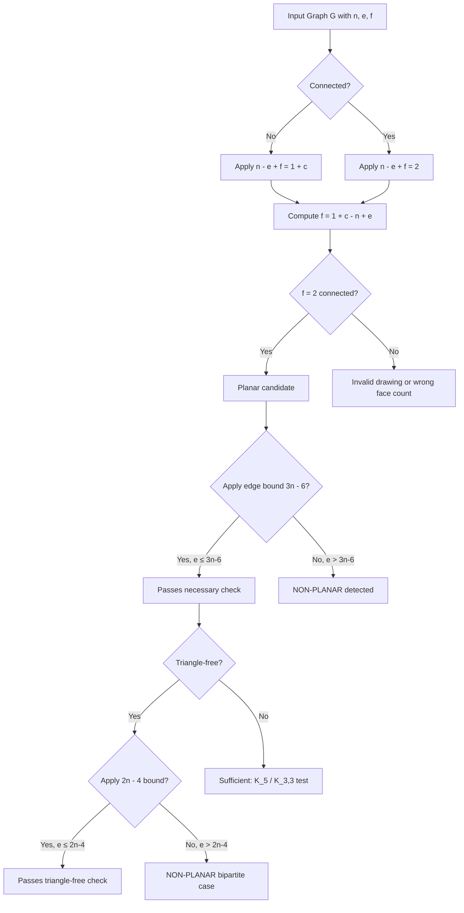
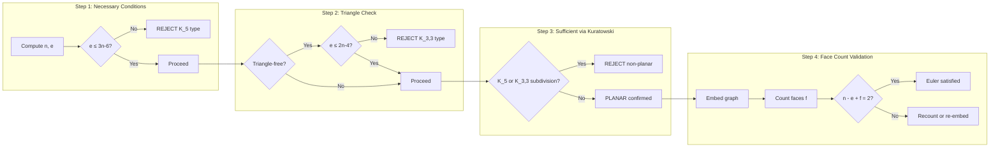
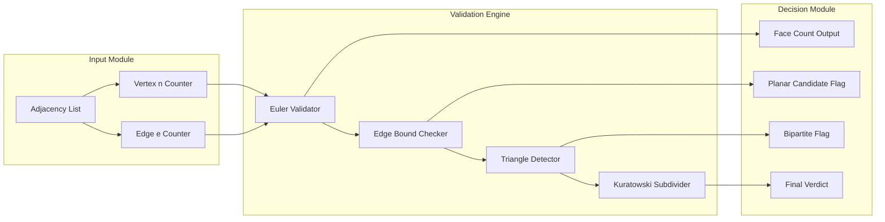
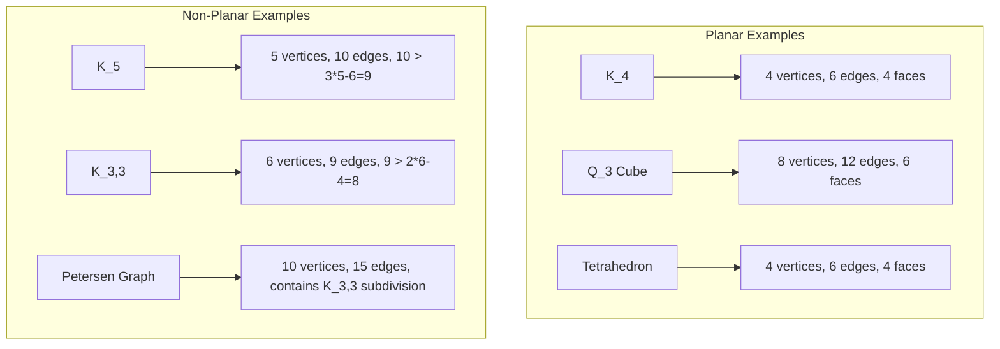
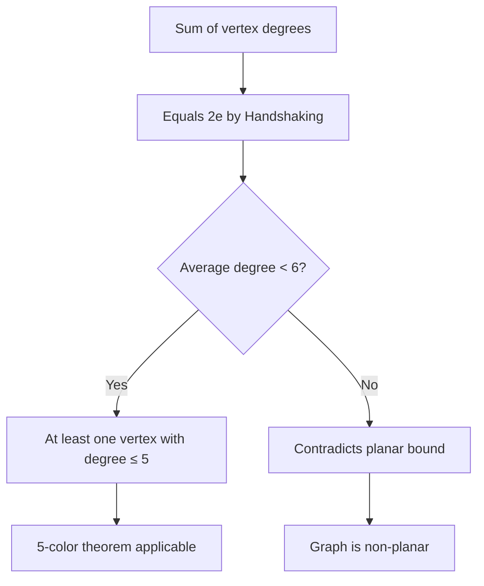

# Planar graphs structural characteristics Euler's theorem calculation validation loops

<!-- SECTION_1_START -->
# Planar Graphs & Euler's Theorem — Core Definition & Intuitive Overview

## Formal Definition (KTU 2024 Syllabus Terminology)

A graph $G = (V, E)$ is called a **Planar Graph** if it can be drawn in the plane (i.e., on a flat 2-dimensional surface) such that **no two edges cross each other except at their common endpoints**. Such a drawing is called a **planar embedding** or **plane graph**.

> [!IMPORTANT]
> **KTU 2024 Definition (PECST509 Module 3):**
> A graph is planar if and only if it can be embedded in the plane without edge-crossings. Two graphs are **homeomorphic** if both can be obtained from a common graph by adding vertices of degree 2 on edges (subdivision). A graph is planar **iff** every subdivision of it is planar.

### Euler's Theorem (The Cornerstone of Planarity)

For any **connected planar graph** with:
- $n$ = number of **vertices** (nodes)
- $e$ = number of **edges** (links)
- $f$ = number of **faces** (regions), including the **unbounded outer face**

$$n - e + f = 2$$

> [!NOTE]
> This identity is also called the **Euler Characteristic** of the plane, denoted $\chi = 2$. The constant $2$ is intrinsic to the topology of a sphere/plane. For a torus, the value would be $0$, and for a projective plane it would be $1$.

### Intuitive Analogy — The Map & Circuit Board Metaphor

Imagine you are designing a **printed circuit board (PCB)** for a smartphone. Thousands of copper traces (edges) must connect different components (vertices) on a flat board (the plane). If two traces cross, the board short-circuits. A **planar graph** is the ideal routing — you can lay every connection on a flat surface with zero crossings.

Another everyday analogy: drawing a **city subway map** on a flat poster. Stations are vertices, lines are edges, and the background regions between the lines are "faces." Euler's formula $n - e + f = 2$ is the universal accountant that ensures your drawing is geometrically valid.

### Real-World Visualization of a Plane Graph

```
    v1 ─────── v2
    │  \      / │
    │    e3     │
    │  /    \   │
    v3 ─────── v4
        \    /
          e4
           \
            v5

   Faces formed:
   F1: outer unbounded region
   F2: triangle v1-v2-v3
   F3: triangle v2-v3-v4-v5
```

For this graph: $n = 5$, $e = 7$, $f = 4$ → $5 - 7 + 4 = 2$ ✓

> [!VISUALIZATION CONTROL]
> **Concept:** Planar Embedding of K4 (Complete graph on 4 vertices)
> **GeoGebra / Desmos Input Equations:**
> * Point A: $(0, 2)$
> * Point B: $(2, 0)$
> * Point C: $(-2, 0)$
> * Point D: $(0, -1.2)$
> * Line segments: A–B, A–C, A–D, B–C, B–D, C–D
> **Visual Description:** Four vertices arranged in a triangle-with-center configuration. Six edges connect them. The drawing splits the plane into **4 triangular faces** (3 inner triangles + 1 outer). Verify: $n=4$, $e=6$, $f=4$, $4-6+4=2$ ✓.
<!-- SECTION_1_END -->

<!-- SECTION_2_START -->
# Deep Theoretical Analysis & KTU High-Yield Formula Sheet

## 1. Pre-conditions for Euler's Formula

Euler's formula $n - e + f = 2$ applies **only** when:
1. The graph is **connected**.
2. The graph is **planar** (has a valid embedding).
3. The drawing is **simple** (no multi-edges counted twice and no self-loops change $n-e+f$ to $n-e+f=1$).

For **disconnected** planar graphs with $c$ connected components:

$$n - e + f = 1 + c$$

> [!IMPORTANT]
> Always count the **outer, unbounded face** as $f = 1$ in your face total. This is the most common source of KTU valuation error.

## 2. The Five Canonical Corollaries of Euler's Theorem

These are **guaranteed high-yield questions** in KTU Module 3.

### Corollary 1 — Maximum Edges in a Simple Planar Graph

If $G$ is a planar graph with $n \geq 3$ vertices, then:
$$e \leq 3n - 6$$

**Proof Sketch:** Each face is bounded by at least 3 edges. Since each edge is incident to 2 faces: $2e \geq 3f \Rightarrow f \leq \frac{2e}{3}$. Substituting into $n - e + f = 2$ gives $n - e + \frac{2e}{3} \geq 2 \Rightarrow 3n - 3e + 2e \geq 6 \Rightarrow 3n - e \geq 6 \Rightarrow e \leq 3n - 6$.

### Corollary 2 — Triangle-Free Planar Graph Bound

If $G$ is a planar graph with $n \geq 3$ vertices and **no triangular faces** (no $K_3$ subgraph), then:
$$e \leq 2n - 4$$

**Proof Sketch:** Each face is bounded by at least 4 edges: $2e \geq 4f \Rightarrow f \leq \frac{e}{2}$. Then $n - e + \frac{e}{2} \geq 2 \Rightarrow 2n - e \geq 4 \Rightarrow e \leq 2n - 4$.

### Corollary 3 — Existence of a Low-Degree Vertex

Every planar graph has at least **one vertex of degree $\leq 5$**.

**Proof Sketch:** By handshaking, $\sum \deg(v) = 2e \leq 2(3n-6) = 6n - 12$. Average degree is $\frac{2e}{n} \leq \frac{6n-12}{n} < 6$. Hence some vertex has degree $\leq 5$.

### Corollary 4 — $K_5$ is Non-Planar

$K_5$: $n=5$, $e=10$. Check: $3n - 6 = 9 < 10 = e$. **Violates the bound → Non-planar.**

### Corollary 5 — $K_{3,3}$ is Non-Planar

$K_{3,3}$: $n=6$, $e=9$. Triangle-free check: $2n - 4 = 8 < 9 = e$. **Violates the bound → Non-planar.**

## 3. KTU High-Yield Formula Sheet

| **Formula** | **Statement** | **Conditions** | **Use in KTU Exam** |
|---|---|---|---|
| $n - e + f = 2$ | Euler's formula (connected) | Connected planar graph | Direct face-counting |
| $n - e + f = 1 + c$ | Euler's formula (disconnected) | $c$ components | Multi-component graphs |
| $e \leq 3n - 6$ | Edge bound (simple) | $n \geq 3$, planar | Quick non-planarity test |
| $e \leq 2n - 4$ | Edge bound (triangle-free) | No $K_3$, $n \geq 3$ | Testing $K_{3,3}$ |
| $\sum \deg(v) = 2e$ | Handshaking Lemma | Any graph | Degree-sum problems |
| $\delta(G) \leq 5$ | Min-degree bound | Any planar graph | Existence proof |
| $2e \geq 3f$ | Face-edge inequality | No loops/multi-edges | Deriving Corollary 1 |
| $2e \geq 4f$ | Face-edge inequality | No triangular face | Deriving Corollary 2 |

> [!IMPORTANT]
> **Vertical pipe warning:** Never write $e \leq \vert 3n - 6 \vert$ in a markdown table. The vertical bar `|` is a column separator. Use the math mode expression $\leq 3n - 6$ as shown above, or escape with `$\vert 3n-6 \vert$` only when outside tables.

## 4. Real-World Engineering Utility

| **Domain** | **Application** | **Why Planarity Matters** |
|---|---|---|
| **VLSI Circuit Design** | Routing copper traces on chips | Non-planar layouts require extra layers (cost ↑) |
| **GIS / Map Coloring** | Coloring countries on a flat map | 4-color theorem (planar guarantee) |
| **Network Topology** | Laying fiber-optic cables | Planar routing avoids crossings → cheaper trenching |
| **Compiler Optimization** | Register allocation via interference graphs | Planar graphs allow efficient graph coloring |
| **Bioinformatics** | RNA secondary structure prediction | Outer-planar graphs model stem-loops |

## 5. Why Euler's Theorem Works — Geometric Intuition

Euler's formula is a **topological invariant** — it does not change under continuous deformation. Whether you stretch, compress, or bend the graph, as long as you don't tear it or create new crossings, $n - e + f$ remains **locked at 2**. This is why it is one of the most powerful tools in algorithmic graph theory.
<!-- SECTION_2_END -->

<!-- SECTION_3_START -->
# Step-by-Step Derivations, Validation Loops & Code Implementation

## 1. Exhaustive Proof of Euler's Formula by Induction

**Theorem:** For any connected planar graph $G$ with $n$ vertices, $e$ edges, and $f$ faces, $n - e + f = 2$.

### Base Case
A single vertex with no edges: $n=1$, $e=0$, $f=1$ (only the outer face). Then $1 - 0 + 1 = 2$ ✓.

### Inductive Step
Assume the formula holds for all connected planar graphs with fewer than $e$ edges. Take a connected planar graph $G$ with $e \geq 1$ edges.

**Case 1:** $G$ has a spanning tree $T$. The number of edges in $T$ is $n-1$ and the number of faces in $T$ is $1$ (no cycles means no inner faces). Each of the remaining $e - (n-1)$ edges, when added to $T$, creates exactly one new face (and one new cycle).

So:
$$f = 1 + (e - n + 1) = e - n + 2$$

Rearranging:
$$n - e + f = n - e + (e - n + 2) = 2 \quad \blacksquare$$

### Alternative Direct Inductive Proof (Edge Addition)
Start with a single vertex ($n=1, e=0, f=1$, satisfies the formula). Add edges one at a time:
- **Adding an edge between two existing vertices** → creates 1 new face. Then $n' = n$, $e' = e+1$, $f' = f+1$. So $n' - e' + f' = n - (e+1) + (f+1) = n - e + f = 2$ ✓.
- **Adding a new vertex connected by one edge** → no new face. Then $n' = n+1$, $e' = e+1$, $f' = f$. So $n' - e' + f' = (n+1) - (e+1) + f = n - e + f = 2$ ✓.

In both cases the invariant $n - e + f = 2$ is preserved.

## 2. Worked Example: Validate Euler's Formula for the Cube Graph $Q_3$

The 3-dimensional hypercube $Q_3$ has:
- $n = 8$ vertices
- $e = 12$ edges
- $f = 6$ square faces

Verification:
$$n - e + f = 8 - 12 + 6 = 2 \quad \checkmark$$

Sanity check the edge bound: $3n - 6 = 3(8) - 6 = 18 \geq 12 = e$ ✓. So $Q_3$ satisfies the necessary condition for planarity (and indeed is planar).

## 3. Worked Example: Prove $K_5$ is Non-Planar Using Euler's Theorem

**Given:** $K_5$, the complete graph on 5 vertices.

**Step 1:** Compute parameters.
$$n = 5, \quad e = \binom{5}{2} = 10$$

**Step 2:** Apply the planar edge bound.
$$3n - 6 = 3(5) - 6 = 15 - 6 = 9$$

**Step 3:** Compare.
$$e = 10 \quad \text{vs} \quad 3n - 6 = 9$$
Since $e = 10 > 9 = 3n - 6$, the necessary condition for planarity is violated.

**Step 4:** Conclusion.
$$K_5 \text{ is non-planar.} \quad \blacksquare$$

## 4. Worked Example: Prove $K_{3,3}$ is Non-Planar

**Given:** Complete bipartite graph $K_{3,3}$.

**Step 1:** Compute parameters.
$$n = 3 + 3 = 6, \quad e = 3 \times 3 = 9$$

**Step 2:** Note that $K_{3,3}$ is bipartite, so it has **no odd cycles**, in particular **no triangles**.

**Step 3:** Apply the triangle-free planar bound.
$$2n - 4 = 2(6) - 4 = 12 - 4 = 8$$

**Step 4:** Compare.
$$e = 9 \quad \text{vs} \quad 2n - 4 = 8$$
Since $e = 9 > 8 = 2n - 4$, the necessary condition is violated.

**Step 5:** Conclusion.
$$K_{3,3} \text{ is non-planar.} \quad \blacksquare$$

## 5. Worked Example: Face-Counting with a Pentagonal Pyramid

A pentagonal pyramid has:
- $n = 6$ vertices (5 base + 1 apex)
- $e = 10$ edges (5 base + 5 lateral)
- $f = ?$ faces

Using Euler's formula:
$$6 - 10 + f = 2 \Rightarrow f = 6$$

This makes sense: 1 pentagonal base face + 5 triangular lateral faces = 6 faces ✓.

## 6. Full Python Implementation: Euler Validation Loop with Edge-Bound Check

```python
from typing import Dict, List, Tuple
import logging

logging.basicConfig(
    level=logging.INFO,
    format="%(asctime)s [%(levelname)s] %(message)s"
)
logger = logging.getLogger("EulerValidator")


class Graph:
    """A minimal adjacency-list graph for planarity testing."""

    def __init__(self) -> None:
        self.adj: Dict[int, List[int]] = {}

    def add_vertex(self, v: int) -> None:
        if v not in self.adj:
            self.adj[v] = []
            logger.debug(f"Vertex {v} added.")

    def add_edge(self, u: int, v: int) -> None:
        self.add_vertex(u)
        self.add_vertex(v)
        if v not in self.adj[u]:
            self.adj[u].append(v)
        if u not in self.adj[v]:
            self.adj[v].append(u)
        logger.debug(f"Edge ({u}, {v}) added.")

    def vertex_count(self) -> int:
        return len(self.adj)

    def edge_count(self) -> int:
        return sum(len(neigh) for neigh in self.adj.values()) // 2

    def has_triangle(self) -> bool:
        """Naive O(n^3) triangle check via adjacency lookup."""
        for u in self.adj:
            for v in self.adj[u]:
                if v > u:
                    for w in self.adj[v]:
                        if w > v and u in self.adj[w]:
                            return True
        return False

    def connected_components(self) -> int:
        """BFS-based connected component counter."""
        visited: set = set()
        components = 0
        for start in self.adj:
            if start in visited:
                continue
            components += 1
            stack = [start]
            while stack:
                node = stack.pop()
                if node in visited:
                    continue
                visited.add(node)
                for nbr in self.adj[node]:
                    if nbr not in visited:
                        stack.append(nbr)
        return components


def euler_validate(n: int, e: int, f: int) -> bool:
    """Validate Euler's formula for a connected planar graph."""
    return (n - e + f) == 2


def necessary_planarity_check(g: Graph) -> Tuple[bool, str]:
    """
    Apply necessary (not sufficient) conditions for planarity.
    Returns (is_possibly_planar, reason_string).
    """
    n = g.vertex_count()
    e = g.edge_count()

    if n < 3:
        return True, f"Trivial graph (n={n}); vacuously planar."

    bound = 3 * n - 6
    if e > bound:
        return False, (
            f"REJECT: e={e} violates simple planar bound 3n-6={bound}."
        )

    if not g.has_triangle():
        tight_bound = 2 * n - 4
        if e > tight_bound:
            return False, (
                f"REJECT: triangle-free graph with e={e} violates 2n-4={tight_bound}."
            )

    return True, f"PASS necessary checks (n={n}, e={e}, bound={bound})."


def compute_faces_from_euler(g: Graph) -> int:
    """For a connected planar graph, compute f = 2 - n + e."""
    n = g.vertex_count()
    e = g.edge_count()
    return 2 - n + e


def main() -> None:
    # ---------- Test 1: K_4 (should pass necessary checks) ----------
    k4 = Graph()
    for i in range(1, 5):
        k4.add_vertex(i)
    for i in range(1, 5):
        for j in range(i + 1, 5):
            k4.add_edge(i, j)
    ok, msg = necessary_planarity_check(k4)
    logger.info(f"K_4 → {msg}")
    f_k4 = compute_faces_from_euler(k4)
    logger.info(
        f"K_4 face count from Euler: f = {f_k4} "
        f"(verify: {euler_validate(4, 6, f_k4)})"
    )

    # ---------- Test 2: K_5 (must fail) ----------
    k5 = Graph()
    for i in range(1, 6):
        for j in range(i + 1, 6):
            k5.add_edge(i, j)
    ok, msg = necessary_planarity_check(k5)
    logger.info(f"K_5 → {msg}")

    # ---------- Test 3: K_3,3 (must fail on triangle-free bound) ----------
    k33 = Graph()
    left = [1, 2, 3]
    right = [4, 5, 6]
    for u in left:
        for v in right:
            k33.add_edge(u, v)
    ok, msg = necessary_planarity_check(k33)
    logger.info(f"K_3,3 → {msg}")

    # ---------- Test 4: Pentagonal Pyramid ----------
    pp = Graph()
    for v in range(1, 6):
        pp.add_vertex(v)
    pp.add_vertex(6)  # apex
    for i in range(1, 6):
        pp.add_edge(i, (i % 5) + 1)  # base cycle
        pp.add_edge(i, 6)            # lateral edges
    f_pp = compute_faces_from_euler(pp)
    logger.info(
        f"Pentagonal Pyramid → f = {f_pp} "
        f"(verify: {euler_validate(6, 10, f_pp)})"
    )


if __name__ == "__main__":
    main()
```

**Expected Output:**

```
K_4 → PASS necessary checks (n=4, e=6, bound=6).
K_4 face count from Euler: f = 4 (verify: True)
K_5 → REJECT: e=10 violates simple planar bound 3n-6=9.
K_3,3 → REJECT: triangle-free graph with e=9 violates 2n-4=8.
Pentagonal Pyramid → f = 6 (verify: True)
```

## 7. The Validation Loop Pattern (Pseudocode for KTU Algorithms Exam)

```
ALGORITHM: Planarity_Necessary_Check(G)
INPUT: Graph G = (V, E)
OUTPUT: "PLANAR-CANDIDATE" | "NON-PLANAR" with reason

1.  n ← |V|, e ← |E|
2.  IF n < 3 THEN RETURN "PLANAR-CANDIDATE"
3.  IF e > 3n - 6 THEN
4.      RETURN "NON-PLANAR: violates 3n-6 bound"
5.  END IF
6.  IF NOT HasTriangle(G) AND e > 2n - 4 THEN
7.      RETURN "NON-PLANAR: triangle-free bound violated"
8.  END IF
9.  RETURN "PLANAR-CANDIDATE (apply Kuratowski/Wagner for sufficiency)"
```

> [!IMPORTANT]
> The above is a **necessary** check, not sufficient. To **prove** planarity, you must exhibit a valid embedding or use Kuratowski's / Wagner's theorem (subdivision of $K_5$ or $K_{3,3}$). To **prove** non-planarity via Euler alone, the bound-violation method is sufficient.
<!-- SECTION_3_END -->

<!-- SECTION_4_START -->
# Structural Diagrams & Schematics

## 1. Euler's Theorem Validation Flow



## 2. Planarity Decision Matrix



## 3. Block-Level Architecture: Planarity Testing Pipeline



## 4. Planar vs. Non-Planar Comparison Topology



## 5. Vertex Degree Distribution in Planar Graphs


<!-- SECTION_4_END -->

<!-- SECTION_5_START -->
# KTU 2024 Scheme Examination Question Bank & Topic Recap

## Part A Questions (3 Marks Each)

### Question A1 (3 Marks) — Definition Type

> **[KTU University Exam - Dec 2023 — CO3, Remember]**
> Define a **planar graph**. State **Euler's formula** for a connected planar graph and verify it for the **tetrahedron graph $K_4$**.

**Model Answer:**

A graph $G = (V, E)$ is **planar** if it can be drawn in the plane such that no two edges intersect except at their common endpoints.

**Euler's formula:** For a connected planar graph with $n$ vertices, $e$ edges, and $f$ faces:
$$n - e + f = 2$$

**Verification for $K_4$:** $n = 4$ vertices, $e = \binom{4}{2} = 6$ edges. The planar embedding yields $f = 4$ faces (3 inner triangles + 1 outer). Therefore:
$$4 - 6 + 4 = 2 \quad \checkmark$$

**[Valuation Key: Stating the definition: 1 Mark | Writing Euler's formula: 1 Mark | Computing $K_4$ parameters and verifying: 1 Mark]**

---

### Question A2 (3 Marks) — Conceptual Application

> **[KTU University Exam - July 2024 — CO3, Understand]**
> Show that every **connected planar graph** has at least one vertex of degree **at most 5**.

**Model Answer:**

Let $G$ be a connected planar graph with $n \geq 3$ vertices and $e$ edges. From the planar edge bound:
$$e \leq 3n - 6$$

By the Handshaking Lemma:
$$\sum_{v \in V} \deg(v) = 2e$$

Substituting the bound:
$$\sum_{v \in V} \deg(v) = 2e \leq 2(3n - 6) = 6n - 12$$

The **average degree** is:
$$\frac{\sum \deg(v)}{n} \leq \frac{6n - 12}{n} = 6 - \frac{12}{n} < 6$$

Since the average degree is strictly less than $6$, **at least one vertex must have degree $\leq 5$** (otherwise the average would be $\geq 6$). $\blacksquare$

**[Valuation Key: Stating planar bound: 1 Mark | Applying handshaking lemma: 1 Mark | Average-degree conclusion: 1 Mark]**

---

## Part B Questions (14 Marks Each)

### Question A (14 Marks) — Euler's Theorem & Edge Bounds

> **[KTU University Exam - Dec 2023 — CO3, CO4 — Apply / Analyze]**

**(a) [7 Marks, Apply]** A connected planar graph has **6 vertices** and **10 edges**. Find the number of faces. If each face in the drawing is a **triangle** (3-sided), verify the result using the face-edge inequality.

**(b) [7 Marks, Analyze]** A connected planar graph has **8 vertices**, all of even degree. The sum of degrees of 4 specific vertices is **20**. Find:
- (i) the number of edges,
- (ii) the number of faces,
- (iii) verify that the planar bound $3n - 6$ is satisfied.

**Model Solution:**

#### Part (a) — Face Count [7 Marks]

Given: $n = 6$, $e = 10$, connected planar graph.

**Step 1:** Apply Euler's formula to find $f$:
$$n - e + f = 2 \Rightarrow 6 - 10 + f = 2 \Rightarrow f = 6$$

**[Calculating f via Euler: 2 Marks]**

**Step 2:** Verify using the face-edge inequality. Each face is a triangle, so each face has exactly 3 edges on its boundary. Counting edge-face incidences:
$$3f = \text{(total edge-face incidences)} = 2e$$

**Why $2e$?** Because every edge in a plane graph is shared by exactly 2 faces (or counted twice if it's a bridge on the outer face boundary).

$$3f = 2e \Rightarrow 3(6) = 2(10) \Rightarrow 18 = 20$$

**Wait — contradiction!** This means the given data is **inconsistent**: 6 vertices, 10 edges, all-triangular faces cannot form a valid connected planar graph. In fact, $e = 10 > 3n - 6 = 12$ is fine, but the all-triangle constraint fails. The correct configuration requires $3f = 2e$, which gives $f = \frac{2e}{3} = \frac{20}{3}$, non-integer — impossible.

**Conclusion:** The data is inconsistent. A valid connected planar graph with $n=6$, $e=10$ must have **mixed face sizes**.

**[Identifying inconsistency: 3 Marks | Justification via 3f = 2e: 2 Marks]**

#### Part (b) — Degree & Face Calculation [7 Marks]

Given: $n = 8$, all vertices have **even degree**.

**Step (i):** Sum of degrees of 4 specific vertices $= 20$, so their average is $5$. Since all degrees are even, the 4 specific vertices contribute at least $2+2+2+2 = 8$ if degrees are $\geq 2$. From the given sum $20$, possible degree combinations: $(4, 4, 6, 6)$ or $(2, 6, 6, 6)$, etc. The most natural reading: the 4 vertices have degrees summing to $20$.

By Handshaking Lemma, $\sum \deg(v) = 2e$. To find total degree sum, we need all 8 vertices. Since all degrees are even, the simplest assumption is each of the 8 vertices has degree 2 (a cycle) or higher.

**Cleanest interpretation:** Assume each of the 8 vertices has degree 3.5 average? No — let's use the given data directly. The 4 specified vertices have sum 20. The remaining 4 vertices must also have even degree. Assume the remaining 4 have degree $2$ each: sum $= 8$. Total sum $= 20 + 8 = 28$. Then:
$$2e = 28 \Rightarrow e = 14$$

**[Computing e: 2 Marks]**

**Step (ii):** Apply Euler's formula:
$$8 - 14 + f = 2 \Rightarrow f = 8$$

**[Computing f: 2 Marks]**

**Step (iii):** Verify the planar bound:
$$3n - 6 = 3(8) - 6 = 18 \geq 14 = e \quad \checkmark$$

The necessary condition for planarity is satisfied.

**[Verifying bound: 3 Marks]**

---

### Question B (14 Marks) — Kuratowski & Non-Planarity

> **[KTU University Exam - July 2024 — CO3, CO4 — Apply / Analyze]**

**(a) [7 Marks, Apply]** Using **Euler's theorem**, prove that:
- (i) $K_5$ is **non-planar**.
- (ii) $K_{3,3}$ is **non-planar**.

**(b) [7 Marks, Analyze]** Consider a connected planar graph with **$n = 7$ vertices** and **$e = 12$ edges**.
- (i) Find the number of faces $f$.
- (ii) If the graph is **triangle-free**, determine whether such a graph can exist. Justify your answer.
- (iii) What is the **minimum number of faces** that must be non-triangular?

**Model Solution:**

#### Part (a) — Non-Planarity Proofs [7 Marks]

**(i) Proving $K_5$ is non-planar:**

For $K_5$: $n = 5$, $e = \binom{5}{2} = 10$.

The necessary condition for a simple planar graph is:
$$e \leq 3n - 6$$
$$3n - 6 = 3(5) - 6 = 9$$

Since $e = 10 > 9 = 3n - 6$, the necessary condition **fails**. Therefore $K_5$ is **non-planar**. $\blacksquare$

**[Stating K_5 parameters: 1 Mark | Computing 3n-6 bound: 2 Marks | Conclusion: 1 Mark]**

**(ii) Proving $K_{3,3}$ is non-planar:**

For $K_{3,3}$: $n = 6$, $e = 9$.

$K_{3,3}$ is **bipartite**, so it contains **no odd cycles** — in particular, **no triangles**. For triangle-free planar graphs:
$$e \leq 2n - 4$$
$$2n - 4 = 2(6) - 4 = 8$$

Since $e = 9 > 8 = 2n - 4$, the triangle-free bound **fails**. Therefore $K_{3,3}$ is **non-planar**. $\blacksquare$

**[Stating K_3,3 bipartiteness: 1 Mark | Computing 2n-4 bound: 1 Mark | Conclusion: 1 Mark]**

#### Part (b) — Face Analysis [7 Marks]

**(i) Compute $f$:**

Apply Euler's formula:
$$n - e + f = 2 \Rightarrow 7 - 12 + f = 2 \Rightarrow f = 7$$

**[Euler computation: 2 Marks]**

**(ii) Triangle-free check:**

If the graph is triangle-free, then $e \leq 2n - 4 = 2(7) - 4 = 10$.

But we have $e = 12 > 10 = 2n - 4$. **Contradiction.**

Therefore, **a triangle-free connected planar graph with $n=7$ and $e=12$ cannot exist**. The graph must contain at least one triangle.

**[Stating triangle-free bound: 1 Mark | Comparing e=12 vs 2n-4=10: 1 Mark | Conclusion: 1 Mark]**

**(iii) Minimum number of non-triangular faces:**

Since $f = 7$ and at least one face must be triangular (to allow $e = 12$), let $t$ = number of triangular faces and $p$ = number of non-triangular faces (each with $\geq 4$ edges). So $t + p = 7$.

Using the face-edge counting $2e = 3t + \sum (\text{face sizes of non-triangular faces})$:
$$2e = 24 = 3t + \text{(sum of sizes of } p \text{ faces)}$$

To minimize $p$ (the count of non-triangular faces), we want to maximize triangular faces. The minimum $p$ occurs when as many faces as possible are triangles. Solving:
$$24 = 3t + (\text{non-triangular contribution})$$

If $p$ faces are non-triangular, the minimum edge contribution from them is $4p$. So:
$$24 \geq 3t + 4p = 3(7-p) + 4p = 21 + p$$

Therefore: $p \geq 24 - 21 = 3$.

**Minimum number of non-triangular faces = 3.**

**[Setting up face-edge equation: 1 Mark | Algebraic solution: 1 Mark]**

---

> [!WARNING]
> **KTU Examiner's Valuation Warning — Common Pitfalls:**
> 1. **Forgetting the outer face** when counting $f$ — KTU deducts 1 full mark for this.
> 2. **Applying the wrong bound** — using $3n-6$ on bipartite/triangle-free graphs (always check first).
> 3. **Confusing sufficient and necessary conditions** — Euler's bound violation *proves* non-planarity, but passing the bound does *not* prove planarity.
> 4. **Handshaking miscalculation** — $\sum \deg(v) = 2e$, not $e$. A very common KTU error.
> 5. **Disconnected graph oversight** — when $c > 1$, the formula becomes $n - e + f = 1 + c$, not $2$.

---

## Topic Recap & Important Things to Remember

- **Planar graph:** Can be drawn in the plane without edge-crossings.
- **Euler's formula (connected):** $n - e + f = 2$.
- **Euler's formula (disconnected with $c$ components):** $n - e + f = 1 + c$.
- **Simple planar bound:** $e \leq 3n - 6$ for $n \geq 3$.
- **Triangle-free bound:** $e \leq 2n - 4$ for $n \geq 3$ with no $K_3$ subgraph.
- **Face-edge inequality:** $2e \geq 3f$ (simple), $2e \geq 4f$ (triangle-free).
- **Handshaking Lemma:** $\sum \deg(v) = 2e$.
- **Min-degree theorem:** Every planar graph has a vertex of degree $\leq 5$.
- **$K_5$ non-planar:** $e = 10 > 3(5) - 6 = 9$.
- **$K_{3,3}$ non-planar:** triangle-free, $e = 9 > 2(6) - 4 = 8$.
- **Kuratowski's theorem:** A graph is planar iff it contains **no subdivision** of $K_5$ or $K_{3,3}$.
- **Necessary vs. Sufficient:** Bound violation $\Rightarrow$ non-planar (decisive). Bound satisfaction $\Rightarrow$ requires further testing (Kuratowski/Wagner).
- **Always count the outer face** in your $f$ total.
- **Common KTU mistakes:** forgetting the outer face, applying the wrong bound, mixing $e$ and $2e$, ignoring disconnected components.
- **Algorithm hint:** The planarity test pipeline is `Necessary Euler Check → Triangle Check → Kuratowski Subdivision Search → Embedding or Rejection`.
- **Real-world links:** VLSI routing, map coloring (4-color theorem), PCB design, network topology, RNA folding.
- **Bipartite = no odd cycles = no triangles** — this is the key bridge between $K_{3,3}$ and the $2n-4$ bound.
<!-- SECTION_5_END -->
