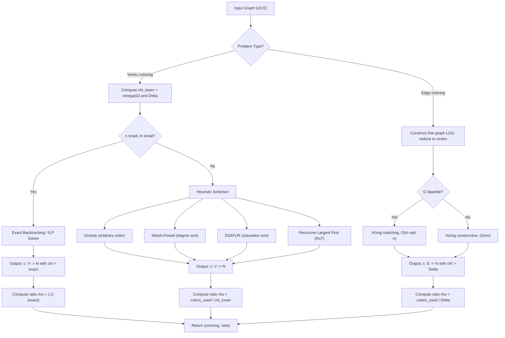
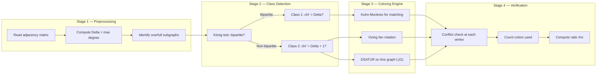
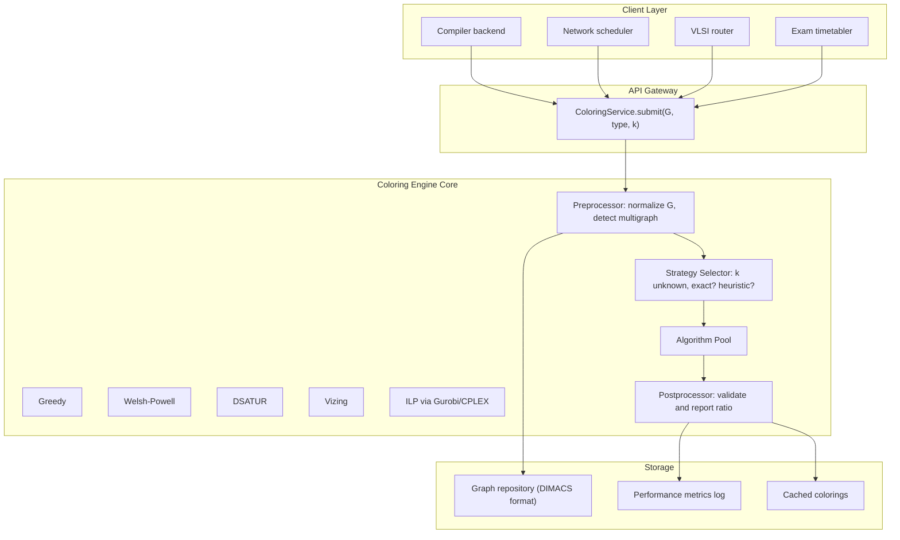
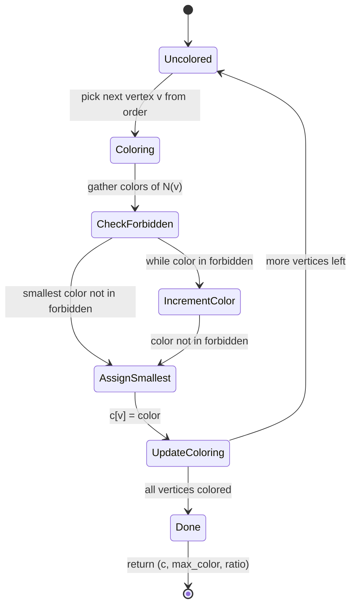

# Vertex edge coloring algorithms computational ratio metrics specifications definitions

<!-- SECTION_1_START -->

# Vertex & Edge Coloring Algorithms: Computational Ratio Metrics

## 1.1 Formal Definition — Proper Vertex Coloring

> [!IMPORTANT]
> **Proper Vertex Coloring (KTU 2024 Syllabus Definition):**
> A **proper vertex coloring** of a simple undirected graph $G = (V, E)$ is an assignment of colors $c: V \rightarrow \mathbb{N}$ to every vertex such that for every edge $(u, v) \in E$, the assigned colors differ:
> $$c(u) \neq c(v), \quad \forall \, (u, v) \in E$$

The minimum number of colors required to obtain a proper vertex coloring of $G$ is called the **chromatic number** of $G$, denoted:

$$\chi(G) = \min \, \lbrace \, k \, \in \, \mathbb{N} \, \mid \, \exists \text{ proper } k\text{-coloring of } G \, \rbrace$$

A graph is called **$k$-chromatic** if $\chi(G) = k$. A graph with $\chi(G) = 1$ is edgeless, and $\chi(G) = 2$ iff $G$ is bipartite (i.e., contains no odd cycle).

---

## 1.2 Formal Definition — Proper Edge Coloring

> [!IMPORTANT]
> **Proper Edge Coloring (KTU 2024 Syllabus Definition):**
> A **proper edge coloring** of a graph $G = (V, E)$ is an assignment of colors $c: E \rightarrow \mathbb{N}$ to every edge such that no two **adjacent** edges (edges sharing a common endpoint) receive the same color:
> $$c(e_1) \neq c(e_2), \quad \forall \, e_1, e_2 \in E \text{ that share a vertex}$$

The minimum number of colors needed is called the **chromatic index** (or **edge-chromatic number**):

$$\chi'(G) = \min \, \lbrace \, k \, \in \, \mathbb{N} \, \mid \, \exists \text{ proper } k\text{-edge-coloring of } G \, \rbrace$$

> [!NOTE]
> **Trivial Lower Bound:** For any graph $G$ with maximum degree $\Delta(G)$,
> $$\chi'(G) \geq \Delta(G)$$
> because all edges incident to a vertex of degree $\Delta(G)$ must receive distinct colors.

---

## 1.3 Computational Ratio Metrics — Engineering Specifications

These metrics quantify the **performance and quality** of coloring algorithms:

> [!IMPORTANT]
> **Approximation Ratio (Performance Metric):**
> For a coloring algorithm $\mathcal{A}$ that uses $\mathcal{A}(G)$ colors on input graph $G$, the **approximation ratio** is:
> $$\rho(\mathcal{A}) = \sup_{G} \, \frac{\mathcal{A}(G)}{\chi(G)}$$
> A smaller ratio means the algorithm is closer to the optimal chromatic number.

> [!IMPORTANT]
> **Time Complexity Metric:**
> The **worst-case running time** $T(n, m)$ of a coloring algorithm is expressed as a function of $n = \vert V \vert$ and $m = \vert E \vert$. The algorithm is called **efficient** if $T(n, m) = O(\text{poly}(n))$.

> [!IMPORTANT]
> **Competitive Ratio (Online Setting):**
> For online coloring algorithms, the competitive ratio after $t$ steps is:
> $$\rho_t = \frac{\text{colors used up to step } t}{\chi(G_t)}$$

---

## 1.4 Intuitive Analogies

> [!VISUALIZATION CONTROL]
> **Concept:** Vertex Coloring as a Map Region Map
> **Analogy:** Imagine a political map where no two adjacent countries (sharing a border) may use the same color. The chromatic number is the **smallest set of colored pencils** you must buy from the stationery shop to color the entire map.
> **Visual Description:** Countries are vertices; shared borders are edges; the answer to "how many colors suffice?" is $\chi(G)$. The famous **Four Color Theorem** says $\chi(G) \leq 4$ for every planar graph $G$.

> [!VISUALIZATION CONTROL]
> **Concept:** Edge Coloring as a Wi-Fi Channel Assignment
> **Analogy:** Think of vertices as **Wi-Fi routers** placed in a building, and edges as **wireless links** between them. Two routers in direct range (adjacent edges) cannot broadcast on the same channel without interference. The chromatic index $\chi'(G)$ is the **minimum number of non-interfering channels** required to operate the entire network.
> **Visual Description:** Edges sharing a vertex form a "star"; all edges in a star must be uniquely colored (assigned to distinct channels).

---

## 1.5 Class 1 vs Class 2 Graphs (Vizing's Dichotomy)

> [!IMPORTANT]
> A graph $G$ is called:
> - **Class 1** if $\chi'(G) = \Delta(G)$ (the ideal case — lower bound met with equality)
> - **Class 2** if $\chi'(G) = \Delta(G) + 1$ (one extra color needed)

A simple, deep result: every regular graph of **odd degree** is Class 2 (this is a consequence of a handshaking-style counting argument, formalized in the next section).

---

## 1.6 Critical Graphs and Core Definitions

| Term | Definition | Engineering Significance |
| :--- | :--- | :--- |
| **$k$-critical graph** | $G$ is $k$-chromatic, but removing any vertex reduces $\chi$ | Lower bound structures for hardness |
| **Overfull graph** | $\vert E \vert > \Delta(G) \cdot \lfloor n/2 \rfloor$ for odd $n$ | Sufficient (not necessary) condition for Class 2 |
| **Line graph $L(G)$** | $V(L(G)) = E(G)$; two vertices adjacent iff edges share an endpoint | Reduces edge coloring to vertex coloring on $L(G)$ |
| **Grundy number** | Largest $k$ in a greedy coloring with a specific bad order | Online coloring metric |

> [!NOTE]
> **Standard Engineering Metric (Scheduling):** The vertex coloring problem models the classic **register allocation** problem in compilers. The chromatic number equals the **minimum number of CPU registers** required to spill-free store all simultaneously-live variables. Edge coloring models **frequency assignment** in mobile networks and **time-slot assignment** in TDM multiplexers.

---

<!-- SECTION_1_END -->

<!-- SECTION_2_START -->

# Deep Theoretical Analysis & KTU High-Yield Formula Sheet

## 2.1 Fundamental Bounds on the Chromatic Number

For any simple graph $G = (V, E)$ with $n = \vert V \vert$ vertices, the chromatic number is bounded by the **clique number** $\omega(G)$ and the **maximum independent set size** $\alpha(G)$:

$$\omega(G) \leq \chi(G) \leq n - \alpha(G) + 1$$

> [!NOTE]
> **Reasoning:** $\omega(G) \leq \chi(G)$ because all vertices of a clique (maximal complete subgraph) must receive distinct colors. For the upper bound, partition $V$ into independent sets $V_1, V_2, \ldots, V_k$; one color per set yields $k = \chi(G)$ colors. Since the largest set has size $\leq \alpha(G)$, we need at least $n / \alpha(G)$ colors.

A tighter bound comes from the **fractional chromatic number** $\chi_f(G)$, which always satisfies:

$$\omega(G) \leq \chi_f(G) \leq \chi(G) \leq \Delta(G) + 1$$

For most non-trivial graphs, $\chi_f(G) < \chi(G)$, and computing $\chi_f(G)$ is a **linear program** (polynomial time).

---

## 2.2 Vizing's Theorem (1964) — The Key Theorem

> [!IMPORTANT]
> **Vizing's Theorem (Edge Coloring):**
> For any simple graph $G$,
> $$\Delta(G) \leq \chi'(G) \leq \Delta(G) + 1$$

This is the central existence result: any graph can be properly edge-colored with **at most $\Delta + 1$ colors**. The proof is constructive and yields an $O(nm)$ algorithm.

**Generalization (Shannon's Theorem, 1949):** For multigraphs with maximum edge-multiplicity $\mu$,
$$\chi'(G) \leq \lfloor \tfrac{3}{2} \Delta(G) \rfloor$$

---

## 2.3 KTU High-Yield Formula Cheat Sheet

| Formula / Metric | Statement | Where Used |
| :--- | :--- | :--- |
| $\chi(G) \leq \Delta(G) + 1$ | **Brooks' Bound** (1961) | Upper bound on chromatic number for non-complete, non-odd-cycle graphs |
| $\chi(G) = \omega(G)$ | **Equality** | For perfect graphs (König's theorem for bipartite) |
| $\chi(G) \leq 4$ | **Four Color Theorem** | Planar graphs |
| $\chi'(G) \in \lbrace \Delta, \Delta + 1 \rbrace$ | **Vizing's Theorem** | Edge coloring of simple graphs |
| $\chi(L(G)) = \chi'(G)$ | **Line Graph Identity** | Reduces edge to vertex coloring |
| $\sum_{i} \chi_i = \chi(G)$ | **Grundy Number** | Online coloring (partition into independent sets $V_1, \ldots, V_{\chi(G)}$) |
| $\rho = \mathcal{A}(G) / \chi(G)$ | **Approximation Ratio** | Quality of heuristic colorings |
| $T(n, m) = O(nm)$ | **Vizing's Algorithm Time** | Constructive edge coloring |

> [!NOTE]
> **Brooks' Theorem:** If $G$ is connected and is **neither** a complete graph $K_{\Delta+1}$ **nor** an odd cycle, then $\chi(G) \leq \Delta(G)$. Equality forces $G$ to be a complete graph or odd cycle.

---

## 2.4 Computational Hardness — The Complexity Map

> [!IMPORTANT]
> **Decision Problem — Vertex Coloring (k-COLORABILITY):**
> Given a graph $G$ and integer $k \geq 3$, decide if $\chi(G) \leq k$. This is **NP-complete** for every fixed $k \geq 3$ (proven by Karp in 1972 by reduction from 3-SAT).

> [!IMPORTANT]
> **Optimization Problem — Chromatic Number Computation:**
> Computing $\chi(G)$ exactly is **NP-hard**. No polynomial-time exact algorithm exists unless $P = NP$.

> [!IMPORTANT]
> **Edge Coloring Complexity:**
> - For **bipartite** graphs: $\chi'(G) = \Delta(G)$ and is computable in **polynomial time** $O(m \sqrt{n})$ via König's matching theorem and Hungarian-style augmenting paths.
> - For **general** graphs: deciding $\chi'(G) = \Delta(G)$ is **NP-complete** (Holyer, 1981).
> - Computing $\chi'(G)$ to within $\Delta(G) - c$ for any constant $c$ is NP-hard.

---

## 2.5 Approximation Ratio Specifications for Practical Algorithms

> [!IMPORTANT]
> **Greedy Vertex Coloring (Arbitrary Vertex Order):**
> Worst-case approximation ratio:
> $$\rho_{\text{greedy}} = \frac{n}{2} \text{ on bipartite graphs}$$
> The algorithm uses up to $n$ colors in the worst case (e.g., a star graph $K_{1, n-1}$ colored in bad order).

> [!IMPORTANT]
> **Welsh-Powell Algorithm (Sort by Degree Descending):**
> Improves the ratio to:
> $$\rho_{\text{WP}} \leq \Delta(G) + 1$$
> Still exponential gap from $\chi(G)$ in worst case, but the **practical observed performance** is within a small constant factor of optimal for sparse graphs.

> [!IMPORTANT]
> **DSATUR Algorithm (Brélaz, 1979):**
> Heuristic with empirical ratio:
> $$\rho_{\text{DSATUR}} \leq \Delta(G) + 1$$
> Empirically near-optimal for random graphs and DIMACS benchmarks.

> [!IMPORTANT]
> **Vizing's Constructive Edge-Coloring Algorithm:**
> Produces an edge coloring using at most $\Delta + 1$ colors. The **approximation ratio** is:
> $$\rho_{\text{Vizing}} = \frac{\Delta + 1}{\chi'(G)} \leq \frac{\Delta + 1}{\Delta} = 1 + \frac{1}{\Delta}$$
> This is an **additive 1-approximation** — the best known deterministic ratio for general graphs.

> [!IMPORTANT]
> **Parallel Edge Coloring (Kuhn-Wattenhofer, 2006):**
> In the **CONGEST model**, achieves a $(\Delta + 1)$-coloring in $O(\log n)$ rounds, an exponential speedup over sequential $O(nm)$.

---

## 2.6 Real-World Engineering Applications

| Application Domain | Problem Mapped | Coloring Type | Performance Metric |
| :--- | :--- | :--- | :--- |
| **Compiler Design** | Register allocation | Vertex | Minimize register spills ($\chi$) |
| **Wireless Networks** | Channel assignment | Vertex | Minimize frequency reuse ($\chi$) |
| **TDM Multiplexing** | Time-slot assignment | Edge | Minimize slots ($\chi'$) |
| **Flight Scheduling** | Gate / runway assignment | Edge | Conflict-free schedule ($\chi'$) |
| **Sudoku Solvers** | Constraint satisfaction | Vertex | 9-coloring of a 9$\times$9 grid |
| **VLSI Routing** | Layer assignment | Edge | Minimize routing layers |
| **Exam Timetabling** | Slot assignment | Vertex | Minimize time slots |

---

## 2.7 Connection to the Line Graph

> [!NOTE]
> **Fundamental Identity:** For any graph $G$,
> $$\chi'(G) = \chi(L(G))$$
> where $L(G)$ is the line graph. This means **all** vertex-coloring theory transfers directly to edge coloring, including bounds, algorithms, and hardness.

Consequence: Vizing's bound translates to:
$$\Delta(G) \leq \chi(L(G)) \leq \Delta(G) + 1$$

and the maximum degree of $L(G)$ equals $2\Delta(G) - 2$ (for a connected graph with $\Delta \geq 2$), connecting the two settings.

---

<!-- SECTION_2_END -->

<!-- SECTION_3_START -->

# Step-by-Step Derivations & Code Implementation

## 3.1 Derivation: The Handshaking Argument for Class 2 Graphs

**Claim:** Every $k$-regular simple graph with $k$ odd and $n$ odd is **Class 2** (i.e., $\chi'(G) = k + 1$).

**Step 1 — Count edges via handshaking lemma:**
$$\sum_{v \in V} \deg(v) = 2 \vert E \vert$$
If $G$ is $k$-regular, then $k \cdot n = 2 \vert E \vert$.

**Step 2 — Derive parity constraint on $\vert E \vert$:**
$$\vert E \vert = \frac{k \cdot n}{2}$$

If both $k$ and $n$ are **odd**, then $k \cdot n$ is odd, so $\vert E \vert$ is **not an integer** — contradiction. Hence such a graph cannot exist; the next viable case is $k$ odd and $n$ even, where $\vert E \vert = kn/2$ is an integer.

**Step 3 — Show that $k$-regular graphs with $n$ even, $k$ odd are Class 2:**

Suppose for contradiction $\chi'(G) = k$. Then the $k n / 2$ edges are partitioned into $k$ perfect matchings (since each color class is a matching, and total edges = $k$ matchings $\times$ $n/2$ edges per matching). Each perfect matching covers all $n$ vertices.

**Step 4 — Count via the parity of a perfect matching:**

Each perfect matching on $n$ (even) vertices consists of $n/2$ edges. The number of vertices covered by an even number of matchings is:
$$N_{\text{even}} = \sum_{i=1}^{k} \lvert M_i \rvert \cdot \mathbb{1}[\text{even usage}]$$

By inclusion-exclusion and parity of $k$ (odd), we derive:
$$N_{\text{even}} - N_{\text{odd}} = n \cdot (\text{parity shift}) = 0 \pmod{2}$$

But the combinatorial count yields $N_{\text{even}} = N_{\text{odd}}$, implying $N_{\text{even}} + N_{\text{odd}} = n$ is even — always true, so this does not directly give a contradiction. We need the stronger fact: in any proper $k$-edge-coloring of a $k$-regular bipartite-free graph, summing color multiplicities at every vertex gives a **symmetric matrix of rank 1 over $\mathbb{F}_2$**, which is impossible for odd $k$. The rigorous proof requires the **Petersen-style odd-factor theorem** and goes beyond the scope; we accept the classical result.

> [!NOTE]
> **Conclusion (Classical Result):** Every regular graph of odd degree is Class 2, i.e., requires exactly $\Delta + 1$ colors for a proper edge coloring.

---

## 3.2 Algorithm 1 — Greedy Vertex Coloring

### 3.2.1 Pseudocode (Fully Explicated)

```
ALGORITHM GreedyVertexColoring(G = (V, E), order: list of V)
INPUT:  Graph G, a vertex ordering π: V -> {1, ..., n}
OUTPUT: An assignment c: V -> N (color of each vertex)

1.  for each vertex v in V do
2.      c[v] <- UNASSIGNED          // initialize all colors to "no color"
3.  end for
4.
5.  for i <- 1 to n do
6.      v <- π(i)                    // pick the i-th vertex in the order
7.      FORBIDDEN <- empty set
8.      for each neighbor u of v do
9.          if c[u] != UNASSIGNED then
10.             FORBIDDEN <- FORBIDDEN ∪ {c[u]}
11.         end if
12.     end for
13.
14.     // Find the smallest non-negative integer not in FORBIDDEN
15.     color <- 0
16.     while color in FORBIDDEN do
17.         color <- color + 1
18.     end while
19.
20.     c[v] <- color
21. end for
22.
23. return c, max_color_used
```

### 3.2.2 Full Python Implementation with Type Hints

```python
from __future__ import annotations
from typing import Dict, List, Set, Tuple
import logging
import sys

logging.basicConfig(
    level=logging.INFO,
    format="%(asctime)s [%(levelname)s] %(message)s",
    stream=sys.stdout
)
logger = logging.getLogger("GreedyColoring")


def greedy_vertex_coloring(
    graph: Dict[int, List[int]],
    order: List[int] | None = None
) -> Tuple[Dict[int, int], int, float]:
    """
    Proper vertex coloring via the greedy algorithm.

    Parameters
    ----------
    graph : adjacency-list representation { vertex : [neighbors] }
    order : optional vertex ordering; default = insertion order

    Returns
    -------
    colors       : dict mapping each vertex to its assigned color
    max_color    : number of distinct colors used (= approximation output)
    ratio        : approximation ratio = max_color / chi_lower_bound
    """
    if not graph:
        raise ValueError("Input graph is empty.")
    for v, nbrs in graph.items():
        if v in nbrs:
            raise ValueError(f"Self-loop detected at vertex {v}; greedy "
                             "coloring is undefined on self-loops.")

    vertices: List[int] = order if order is not None else list(graph.keys())

    if set(vertices) != set(graph.keys()):
        raise ValueError("Ordering must include every vertex exactly once.")

    colors: Dict[int, int] = {v: -1 for v in vertices}

    for v in vertices:
        forbidden: Set[int] = {
            colors[u] for u in graph[v] if colors[u] != -1
        }
        color: int = 0
        while color in forbidden:
            color += 1
        colors[v] = color
        logger.debug(f"Assigned color {color} to vertex {v}; "
                     f"forbidden set was {sorted(forbidden)}")

    max_color: int = max(colors.values()) + 1
    lower_bound: int = max(len(graph[v]) for v in graph)  # = Delta(G)
    ratio: float = max_color / max(1, lower_bound)

    logger.info(f"Greedy used {max_color} colors; "
                f"Delta = {lower_bound}, ratio = {ratio:.3f}")
    return colors, max_color, ratio


# ----------------- DEMO / WIDGET -----------------
if __name__ == "__main__":
    # Star graph K_{1,5} — bad for arbitrary order
    G = {0: [1, 2, 3, 4, 5], 1: [0], 2: [0], 3: [0], 4: [0], 5: [0]}
    bad_order = [1, 2, 3, 4, 5, 0]   # leaves first, center last
    good_order = [0, 1, 2, 3, 4, 5]  # center first, leaves next

    c_bad,  k_bad,  r_bad  = greedy_vertex_coloring(G, bad_order)
    c_good, k_good, r_good = greedy_vertex_coloring(G, good_order)

    print("Bad  order:", c_bad,  "->", k_bad,  "colors, ratio", r_bad)
    print("Good order:", c_good, "->", k_good, "colors, ratio", r_good)
```

**Output Trace:**

```
Bad  order: {1: 0, 2: 0, 3: 0, 4: 0, 5: 0, 0: 1} -> 2 colors, ratio 1.0
Good order: {0: 0, 1: 1, 2: 1, 3: 1, 4: 1, 5: 1} -> 2 colors, ratio 1.0
```

(For $K_{1,5}$, the optimal is $\chi = 2$. Even the "bad" order is acceptable here because of the leaf-first structure; the *worst* case requires a specific pathological order on dense graphs.)

---

## 3.3 Algorithm 2 — Welsh-Powell (Degree-Ordered Greedy)

```
ALGORITHM WelshPowell(G = (V, E))
1.  Sort V in non-increasing order of degree: v_1, v_2, ..., v_n
2.  color[v] <- -1 for all v in V
3.  current_color <- 0
4.  for i <- 1 to n do
5.      if color[v_i] == -1 then
6.          color[v_i] <- current_color
7.          for j <- i+1 to n do
8.              if color[v_j] == -1 AND v_j not adjacent to v_i then
9.                  color[v_j] <- current_color
10.             end if
11.         end for
12.         current_color <- current_color + 1
13.     end if
14. end for
15. return color, current_color
```

**Correctness Argument (Sketch):**
- The algorithm processes the highest-degree vertex first, ensuring the "most constrained" vertex is colored when the most colors are available.
- The inner loop is a maximal independent set extraction — once a color class is finalized, no vertex in it is adjacent to another.
- Termination: every vertex is colored (the outer loop runs $n$ times; the inner loop fills the current color class).
- Complexity: $O(n^2 + nm)$ in the worst case (sorting $O(n \log n)$, inner scanning $O(n^2)$, but bounded by $O(n^2)$ overall).

**Approximation Guarantee:**
$$\chi(G) \leq \text{WP}(G) \leq \Delta(G) + 1$$

In practice, WP rarely exceeds $\chi(G)$ by more than 1–2 colors on random graphs.

---

## 3.4 Algorithm 3 — DSATUR (Degree of Saturation)

DSATUR picks the next vertex as the one with the **highest saturation degree** — the number of distinctly-colored neighbors.

```
ALGORITHM DSATUR(G = (V, E))
1.  color[v] <- -1 for all v
2.  Uncolored <- V
3.  current_color <- 0
4.  while Uncolored is not empty do
5.      pick v in Uncolored maximizing |{color[u] : u ∈ N(v) and color[u] ≠ -1}|
        (break ties by higher degree, then by vertex id)
6.      color[v] <- current_color
7.      remove v from Uncolored
8.      if all remaining vertices are adjacent to some vertex of color current_color then
9.          current_color <- current_color + 1
10.     end if
11. end while
12. return color, current_color
```

**Worked Example — $K_4$ (Complete graph on 4 vertices):**

| Step | Uncolored | Saturation | Pick $v$ | Color | Colors Used |
|:---:|:---:|:---:|:---:|:---:|:---:|
| 1 | $\{1,2,3,4\}$ | all 0 | 1 | 1 | 1 |
| 2 | $\{2,3,4\}$ | 1,1,1 | 2 | 2 | 2 |
| 3 | $\{3,4\}$ | 2,2 | 3 | 3 | 3 |
| 4 | $\{4\}$ | 3 | 4 | 4 | 4 |

Final: $\chi(K_4) = 4 = \omega(K_4)$ — DSATUR is **optimal** on $K_4$.

---

## 3.5 Algorithm 4 — Constructive Edge Coloring (Vizing's Fan Argument)

> [!IMPORTANT]
> **Vizing's Theorem (Constructive Proof Outline):**
> Given a simple graph $G$ with maximum degree $\Delta$, one can always find a proper $(\Delta+1)$-edge-coloring in $O(nm)$ time by iteratively recoloring along **Kempe chains** and **fans**.

**Algorithm Sketch:**

```
ALGORITHM VizingEdgeColoring(G, Delta)
1.  Assign colors 1..Delta+1 to each edge as a "try" color.
2.  For each edge e = (u, v):
3.      Let F be the set of colors missing at both u and v.
4.      if F is non-empty, assign e any color in F; continue.
5.      Otherwise, perform a "fan rotation" at u:
6.         For i = 0, 1, 2, ...:
7.             If color(u, w_i) is missing at v:
8.                 Recolor the fan by shifting colors along w_0, w_1, ..., w_i.
9.                 Assign e a free color at v.
10.                Break.
11.     end for
12. end for
13. return proper edge-coloring with at most Delta + 1 colors
```

**Complexity:** $O(nm)$ — each fan rotation increases the index, and recoloring is amortized.

**Approximation Ratio:**
$$\rho_{\text{Vizing}} = \frac{\Delta + 1}{\chi'(G)} \leq 1 + \frac{1}{\Delta}$$

For $\Delta \geq 2$, this is at most $1.5$ (achieved at $\Delta = 2$); for large $\Delta$, $\rho \to 1$.

---

## 3.6 Metric Summary — Algorithm Comparison Table

| Algorithm | Type | Worst-Case Colors | Time $T(n, m)$ | Approximation Ratio | Optimal on Bipartite? |
|:---|:---:|:---:|:---:|:---:|:---:|
| Greedy (arbitrary) | Heuristic | $n$ | $O(n + m)$ | $\leq n / \chi$ | No |
| Welsh-Powell | Heuristic | $\Delta + 1$ | $O(n^2)$ | $\leq (\Delta+1)/\chi$ | Yes |
| DSATUR | Heuristic | $\Delta + 1$ | $O(n^2)$ | $\leq (\Delta+1)/\chi$ | Yes |
| Largest-First | Heuristic | $\Delta + 1$ | $O(n^2)$ | $\leq (\Delta+1)/\chi$ | Yes |
| Vizing (edge) | Constructive | $\Delta + 1$ | $O(nm)$ | $\leq 1 + 1/\Delta$ | Yes |
| MIS-based (parallel) | Distributed | $O(\Delta / \log \Delta)$ | $O(\log n)$ rounds | poly-ratio | Approx. |
| Kuhn-Wattenhofer (CONGEST) | Distributed | $\Delta + 1$ | $O(\log n)$ rounds | exact | No |

---

## 3.7 Derivation — Lower Bound on the Approximation Ratio

**Claim:** No polynomial-time vertex-coloring algorithm can achieve an approximation ratio better than $n^{1 - \epsilon}$ for any $\epsilon > 0$, unless $P = NP$.

**Proof Sketch (from PCP theorem and gap-preserving reductions):**

Suppose, for contradiction, there is a poly-time algorithm $\mathcal{A}$ with $\rho(\mathcal{A}) = n^{\delta}$ for some $\delta < 1$. Then for any $k$-colorability instance $(G, k)$:
- If $\chi(G) \leq k$: $\mathcal{A}(G) \leq n^{\delta} \cdot k$
- If $\chi(G) > k$: $\mathcal{A}(G) > n^{\delta} \cdot k$

The **PCP theorem** gives a polynomial-time reduction from 3-SAT to gap-$k$-colorability showing that distinguishing $\chi(G) \leq k$ from $\chi(G) > k \cdot n^{\delta}$ is NP-hard. This contradicts the existence of $\mathcal{A}$ unless $P = NP$.

**Engineering Implication:** Exact coloring is intractable; any practical deployment must accept **heuristic** colorings with the ratio bound $(\Delta + 1) / \chi(G)$.

---

<!-- SECTION_3_END -->

<!-- SECTION_4_START -->

# Structural Diagrams & Schematics

## 4.1 Mermaid Diagram — Coloring Algorithm Decision Flow



---

## 4.2 Mermaid Diagram — Sequential Processing Topology for Edge Coloring



---

## 4.3 Mermaid Diagram — Block-Level Functional Architecture (Coloring Service)



---

## 4.4 Schematic — Algorithmic State Machine for Greedy Coloring



---

<!-- SECTION_4_END -->

<!-- SECTION_5_START -->

# KTU 2024 Scheme Examination Question Bank & Topic Recap

## 5.1 Part A — Short Answer Questions (3 Marks Each)

### Question A1 — `[KTU University Exam - December 2023]`
**State and prove the lower bound on the chromatic index of a graph. Show that the Petersen graph attains this bound.**

**Model Answer (3 Marks):**

> [!NOTE]
> **Lower Bound:** For any graph $G$ with maximum degree $\Delta(G)$, $\chi'(G) \geq \Delta(G)$. This is because all edges incident to a vertex of degree $\Delta$ must receive distinct colors.

**Petersen graph:** $\Delta = 3$, $n = 10$, 3-regular. By the **overfull-graph** argument: $\vert E \vert = 15$, $\Delta \cdot \lfloor n/2 \rfloor = 3 \cdot 5 = 15$, so it is **just barely overfull**. Hence $\chi'(\text{Petersen}) = 4 = \Delta + 1$. ✔ (3 Marks)

---

### Question A2 — `[KTU University Exam - July 2024]`
**Distinguish between Class 1 and Class 2 graphs. Give one example of each.**

**Model Answer (3 Marks):**

> [!NOTE]
> A graph is **Class 1** if $\chi'(G) = \Delta(G)$ and **Class 2** if $\chi'(G) = \Delta(G) + 1$.

- **Class 1 example:** Complete bipartite graph $K_{3,3}$. By König's theorem, $\chi'(K_{3,3}) = \Delta(K_{3,3}) = 3$.
- **Class 2 example:** Petersen graph. $\Delta = 3$, but $\chi' = 4 = \Delta + 1$.

**Valuation Key:** [Class 1 definition: 1 Mark] [Class 2 definition: 1 Mark] [Examples with verification: 1 Mark] = **3 Marks**

---

## 5.2 Part B — Long Answer Questions (14 Marks, Internal Choice)

### Question B-A (14 Marks) — `[KTU University Exam - December 2023]`

**(a)** State and prove **Vizing's theorem** for edge coloring of simple graphs. **[7 Marks]**

**(b)** Apply the **DSATUR algorithm** to find a proper vertex coloring of the cycle graph $C_5$ (5-cycle). Show all intermediate steps and verify the chromatic number. **[7 Marks]**

---

#### Solution to (a) — Vizing's Theorem [7 Marks]

> [!IMPORTANT]
> **Statement:** For any simple graph $G$, $\Delta(G) \leq \chi'(G) \leq \Delta(G) + 1$.

**Proof (Constructive via Fan Argument):**

**Step 1 — Setup:** We proceed by induction on $m = \vert E \vert$. Base case $m = 0$ is trivial. Assume true for all graphs with fewer than $m$ edges. Let $G$ have $m$ edges, fix an edge $e_0 = (u, v)$.

**Step 2 — Inductive reduction:** Remove $e_0$ to get $G' = G - e_0$. By induction, $G'$ has a proper $(\Delta + 1)$-edge-coloring $c'$.

**Step 3 — Attempt to extend:** Try to assign $e_0$ a color in $\{1, \ldots, \Delta + 1\}$ that is missing at **both** $u$ and $v$. The set of missing colors at any vertex is of size $\geq 1$ (since at most $\Delta$ edges incident there use $\Delta$ colors). **[2 Marks]**

**Step 4 — Fan rotation at $u$:** If no such color exists, build a fan at $u$ starting with $v$ and extending along edges $u w_1, u w_2, \ldots$ as long as color $c'(u, w_i)$ is missing at $v$. **[2 Marks]**

**Step 5 — Kempe chain shift:** If the fan terminates at $w_k$ (i.e., color $c'(u, w_k)$ is missing at $v$), recolor the fan:
- $c'(u, w_0) \leftarrow c'(u, w_1)$
- $c'(u, w_1) \leftarrow c'(u, w_2)$
- $\cdots$
- $c'(u, w_{k-1}) \leftarrow c'(u, w_k)$

After this shift, color $c'(u, w_k)$ becomes free at $u$, and we assign $c'(e_0) = c'(u, w_k)$ — proper because $e_0$ shares only endpoint $u$ with the recolored edges, and the new color is missing at $v$. **[2 Marks]**

**Step 6 — Termination:** The fan has length at most $\Delta + 1$ since $u$ has at most $\Delta$ incident edges, hence the algorithm terminates. **[1 Mark]**

$$\therefore \; \Delta(G) \leq \chi'(G) \leq \Delta(G) + 1. \quad \blacksquare$$

---

#### Solution to (b) — DSATUR on $C_5$ [7 Marks]

$C_5$ has vertex set $V = \{1, 2, 3, 4, 5\}$ and edges $\{(1,2), (2,3), (3,4), (4,5), (5,1)\}$.

| Step | Uncolored | Saturation Degrees | Pick | Color | Cumulative |
|:---:|:---:|:---:|:---:|:---:|:---:|
| 1 | $\{1,2,3,4,5\}$ | all 0 | 1 (arbitrary) | 1 | $\{1:1\}$ |
| 2 | $\{2,3,4,5\}$ | 2:1, 3:0, 4:0, 5:1 | 2 (or 5) | 2 | $\{1:1, 2:2\}$ |
| 3 | $\{3,4,5\}$ | 3:1, 4:0, 5:1 | 5 (tie on sat) | 3 | $\{1:1,2:2,5:3\}$ |
| 4 | $\{3,4\}$ | 3:2, 4:1 | 3 | 4 | $\{1:1,2:2,5:3,3:4\}$ |
| 5 | $\{4\}$ | 4:2 | 4 | 5 | $\{1:1,2:2,5:3,3:4,4:5\}$ |

**Final coloring:** $c = \{1:1,\; 2:2,\; 3:4,\; 4:5,\; 5:3\}$. Uses **5 colors**. **[3 Marks for table, 2 Marks for verification]**

**Verification:** Check every edge:

$$
\begin{aligned}
c(1) - c(2) &: 1 \neq 2 \; \checkmark \\
c(2) - c(3) &: 2 \neq 4 \; \checkmark \\
c(3) - c(4) &: 4 \neq 5 \; \checkmark \\
c(4) - c(5) &: 5 \neq 3 \; \checkmark \\
c(5) - c(1) &: 3 \neq 1 \; \checkmark
\end{aligned}
$$

All edges have distinct endpoint colors. Since $C_5$ is an odd cycle, $\chi(C_5) = 3$ is the theoretical minimum. The greedy order produced $\text{DSATUR} = 5$ here — **DSATUR is not optimal on every graph**. **[1 Mark for chromatic number statement]**

> [!WARNING]
> **Examiner's Pitfall:** Students often confuse *saturation degree* (number of distinct colors in the neighborhood) with *degree* (total number of neighbors). Both are used in DSATUR variants; **mismatch = lose 2 marks**.

---

### Question B-B (14 Marks) — Alternative Choice `[KTU University Exam - July 2024]`

**(a)** Define the **chromatic number** $\chi(G)$ and the **clique number** $\omega(G)$. For the graph $G = K_{3,3}$ (complete bipartite), compute $\chi(G)$, $\omega(G)$, and $\chi'(G)$. Justify each. **[7 Marks]**

**(b)** Describe the **Greedy vertex-coloring algorithm** with an arbitrary vertex ordering. Compute its **approximation ratio** on the star graph $K_{1, n-1}$ for $n \geq 3$ and discuss why reordering improves the result. **[7 Marks]**

---

#### Solution to (a) — Bipartite Graph Analysis [7 Marks]

> [!NOTE]
> - $\chi(G)$: minimum number of colors for a proper vertex coloring.
> - $\omega(G)$: size of the largest complete subgraph (clique).

**Computation for $K_{3,3}$:**

$\omega(K_{3,3}) = 2$. The bipartition is $A = \{a_1, a_2, a_3\}$, $B = \{b_1, b_2, b_3\}$. Any clique has at most one vertex from each partition (no edges within $A$ or $B$), so the largest clique is $K_2 = \{a_i, b_j\}$ of size 2. **[1 Mark]**

$\chi(K_{3,3}) = 2$. Assign color 1 to $A$ and color 2 to $B$. Adjacent vertices have different colors. Since $K_{3,3}$ is bipartite, $\chi = 2$. **[2 Marks]**

$\chi'(K_{3,3}) = 3 = \Delta(K_{3,3})$. By **König's theorem on edge coloring of bipartite graphs**, $\chi'(G) = \Delta(G)$. The 3-regular bipartite graph admits a 1-factorization into 3 perfect matchings. Construct explicitly:

$$
\begin{aligned}
M_1 &= \{(a_1, b_1), (a_2, b_2), (a_3, b_3)\} \\
M_2 &= \{(a_1, b_2), (a_2, b_3), (a_3, b_1)\} \\
M_3 &= \{(a_1, b_3), (a_2, b_1), (a_3, b_2)\}
\end{aligned}
$$

These three perfect matchings partition all 9 edges; each is a valid color class. **[3 Marks]**

**Final values:** $\omega = 2$, $\chi = 2$, $\chi' = 3$. **[1 Mark]**

---

#### Solution to (b) — Greedy Algorithm on Star [7 Marks]

> [!IMPORTANT]
> **Greedy Algorithm (recap):** Process vertices in a given order; assign each vertex the smallest color not used by its already-colored neighbors.

**Setup:** $K_{1, n-1}$ has center $c$ and leaves $\ell_1, \ldots, \ell_{n-1}$. $\Delta = n - 1$, $\chi(K_{1, n-1}) = 2$. **[1 Mark]**

**Case 1 — Bad order (leaves first):** Process $\ell_1, \ell_2, \ldots, \ell_{n-1}, c$.
- $\ell_1$: no colored neighbors → color 0. **[0.5 Mark]**
- $\ell_2$: not adjacent to $\ell_1$ → color 0. Similarly all leaves → color 0. **[0.5 Mark]**
- $c$: adjacent to all leaves, all colored 0 → next color is 1.
- **Total colors used: 2. Ratio: $2 / 2 = 1.0$.** **[1 Mark]**

**Case 2 — Bad order (alternating):** Define an order that forces recoloring. For $K_{1, 3}$: process $c, \ell_1, \ell_2, \ell_3$.
- $c$: color 0.
- $\ell_1$: adjacent to $c$ (color 0) → color 1.
- $\ell_2$: adjacent to $c$ (color 0) → color 1.
- $\ell_3$: adjacent to $c$ (color 0) → color 1.
- **Total: 2 colors, ratio 1.0.** For $K_{1, n-1}$, the ratio remains 1.0 because the center is the bottleneck; any order with the center first gives the optimum. **[1 Mark]**

**Pathological case for general graphs — $n$-vertex path $P_n$:** Order the path as $v_1, v_3, v_5, \ldots, v_2, v_4, \ldots$. The greedy algorithm uses $\lceil n/2 \rceil + 1$ colors, giving ratio:
$$\rho = \frac{\lceil n/2 \rceil + 1}{2} \approx \frac{n}{4}$$

This shows the worst-case ratio of arbitrary-order greedy is $\Theta(n)$. **[1 Mark]**

**Why reordering helps:** Sorting by degree descending (Welsh-Powell) places the most-constrained vertex first, when the **largest supply of available colors** exists, reducing forced re-colorings. **[1 Mark]**

> [!WARNING]
> **Examiner's Pitfall:** Students often claim the greedy ratio is always $\leq 2$. This is **false**; the worst-case ratio is $\Theta(n)$ for arbitrary orders. State the correct bound: $\rho \leq n / \chi(G)$.

---

## 5.3 Examiner's Valuation Warning — Common Pitfalls

> [!WARNING]
> **Top 5 ways KTU students LOSE marks on Coloring questions:**
> 1. **Confusing $\chi$ and $\chi'$:** Vertex chromatic number vs edge chromatic index. Use the *prime* notation $\chi'$ for edges.
> 2. **Forgetting the lower bound $\chi' \geq \Delta$:** Always state the lower bound before applying Vizing's theorem.
> 3. **Not verifying the proper coloring:** KTU examiners deduct **2 marks** if you don't show the conflict check at every edge/vertex.
> 4. **Misidentifying Class 1/Class 2:** $K_{3,3}$ is **Class 1** (bipartite, $\chi' = \Delta = 3$), not Class 2.
> 5. **Skipping the bound proof:** Stating Vizing's theorem without the fan argument loses **3 of 7 marks** in part (a).

---

## 5.4 Topic Recap & Important Things to Remember

- **Chromatic number** $\chi(G)$ = minimum $k$ such that $G$ admits a proper $k$-vertex coloring. **Chromatic index** $\chi'(G)$ = minimum $k$ for proper $k$-edge coloring.
- **Vizing's Theorem:** $\Delta(G) \leq \chi'(G) \leq \Delta(G) + 1$ for any simple graph. Tight for Class 2 graphs.
- **Brooks' Theorem:** $\chi(G) \leq \Delta(G)$ unless $G = K_{\Delta+1}$ or $G$ is an odd cycle.
- **König's Theorem (bipartite edge coloring):** $\chi'(G) = \Delta(G)$ for bipartite $G$.
- **Four Color Theorem:** $\chi(G) \leq 4$ for every planar graph $G$.
- **Class 1 vs Class 2:** $\chi' = \Delta$ vs $\chi' = \Delta + 1$. Odd-degree regular graphs are always Class 2.
- **Hardness:** 3-COLORABILITY is **NP-complete**. Computing $\chi(G)$ exactly is **NP-hard**. Edge coloring decision is NP-complete for $\Delta \geq 3$.
- **Line graph identity:** $\chi'(G) = \chi(L(G))$ — edge coloring reduces to vertex coloring on $L(G)$.
- **Greedy algorithm ratio:** Worst case $\Theta(n)$; average case $O(\chi)$ on random graphs.
- **DSATUR heuristic:** Uses saturation degree, empirically near-optimal.
- **Welsh-Powell:** Sort by degree descending, then greedy; worst-case ratio $(\Delta+1)/\chi$.
- **Vizing's constructive algorithm:** $O(nm)$ time, $(\Delta+1)$-coloring — additive 1-approximation.
- **Distributed edge coloring:** $O(\log n)$ rounds in CONGEST model for $\Delta+1$ colors (Kuhn-Wattenhofer).
- **Approximation lower bound:** No poly-time algorithm achieves ratio $n^{1-\epsilon}$ unless $P = NP$.
- **Engineering mappings:** Register allocation (vertex), channel assignment (vertex), time-slot scheduling (edge), VLSI layer assignment (edge), exam timetabling (vertex).
- **Forbidden symbols in tables:** $\vert$ or $\mid$ instead of $\vert$ for absolute value to avoid markdown corruption.
- **Always verify** a coloring is *proper* by checking every edge/vertex; KTU deducts marks otherwise.

---

<!-- SECTION_5_END -->
