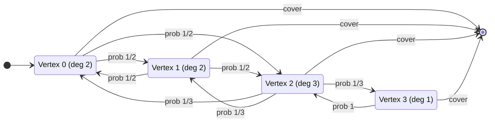
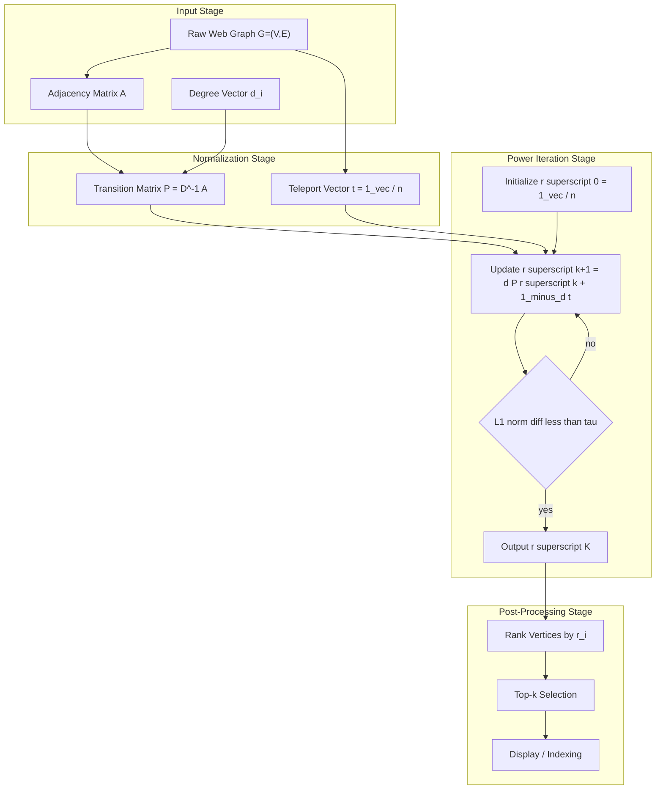
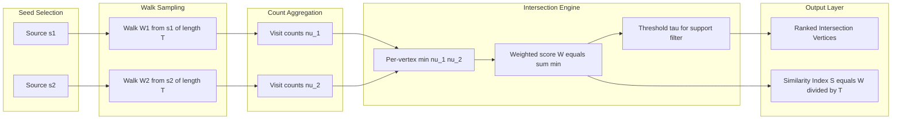
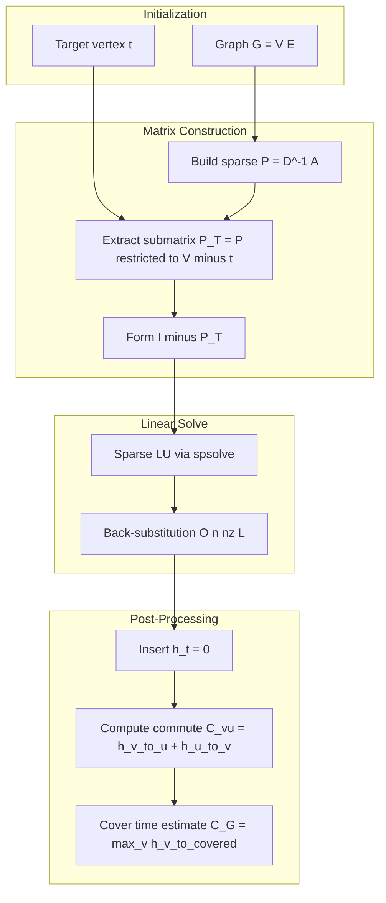

# Markov chains graph intersections analytics processing algorithms templates patterns

<!-- SECTION_1_START -->
# Random Walks on Graphs and Markov Chain Analytics

## 1.1 Formal Definition (KTU 2024 Scheme Terminology)

A **random walk** on an undirected graph $G = (V, E)$ with $\vert V \vert = n$ vertices and $\vert E \vert = m$ edges is a discrete-time stochastic process $\{X_t\}_{t \ge 0}$ such that, given the current state $X_t = v$, the next state $X_{t+1}$ is chosen **uniformly at random** from the neighborhood $N(v) = \{u \in V : (v, u) \in E\}$.

The transition probability is

$$P_{v, u} = \begin{cases} \dfrac{1}{\deg(v)} & \text{if } (v, u) \in E \\[4pt] 0 & \text{otherwise} \end{cases}$$

> [!IMPORTANT]
> **Core Definition (KTU Module 4 — S5):** A random walk on a graph is the **canonical discrete-time, time-homogeneous Markov chain** induced by the **row-stochastic normalized adjacency matrix** $\,P = D^{-1}A$, where $D$ is the degree matrix and $A$ is the adjacency matrix.

A **Markov chain** is the formal probability backbone of the random walk. It satisfies the **Markov property** (memorylessness):

$$\Pr[X_{t+1} = v \mid X_t = u_t, X_{t-1} = u_{t-1}, \dots, X_0 = u_0] \;=\; \Pr[X_{t+1} = v \mid X_t = u_t]$$

The chain is **irreducible** if every state is reachable from every other state, and **aperiodic** if $\gcd$ of all return-cycle lengths equals **1**.

> [!NOTE]
> **Graph-Intersection Analytics Layer:** In modern analytics pipelines, a "graph intersection" denotes a **set of vertices common to two or more random-walk reachable subgraphs**, or the **vertex/edge overlap** of two Markov-chain-induced random walk distributions. The two key intersection operators are:
> 1. **Vertex Intersection:** $V(S_1) \cap V(S_2)$ — common nodes reached by walks from two source nodes.
> 2. **Distribution Intersection:** the support of $\pi^{(1)} \wedge \pi^{(2)}$ where $\pi^{(1)}, \pi^{(2)}$ are stationary distributions.

---

## 1.2 Intuitive Analogies

| Real-World Analogy | Random-Walk Equivalent |
|---|---|
| A **drunkard** stumbling on street intersections, picking a road at random | A token on a graph choosing a neighbor uniformly |
| A **genealogical lineage** following a single male lineage back in time | A random walk on the **genealogy graph** (used in coalescent theory) |
| **Web surfer** clicking random hyperlinks (with damping) | The **PageRank** random walk with teleportation |
| Heat particles diffusing across a metal plate | Continuous-time random walk on the **lattice graph** $\mathbb{Z}^d$ |
| Ant Colony or Brownian particle in porous material | Random walk on **resistor networks** |

> [!TIP]
> **Plain-English Intuition:** Imagine you are a blindfolded person dropped on a city's road network. At every intersection, you point in a random direction and walk to the next crossroad. Your *long-run probability* of being found at any intersection — proportional to how many roads meet there — is the **stationary distribution** $\pi$.

---

## 1.3 GeoGebra / Desmos Visualization

> [!VISUALIZATION CONTROL]
> **Concept:** A simple 3-state Markov chain on a triangle with transition matrix $P$.
> **GeoGebra / Desmos Input Equations:**
> * Define three points: $A = (0, 0)$, $B = (2, 0)$, $C = (1, \sqrt{3})$.
> * Arc equations (curves): $y = \pm \sqrt{(x-1)^2 - 1}$ for transition flows.
> * Stationary bar chart: $h_A = 1/3$, $h_B = 1/3$, $h_C = 1/3$ (uniform because the graph is regular).
> **Visual Description:** On a triangular plot, the walker moves from any vertex to either neighbor with probability $1/2$. The pie of long-run occupancy is split into three equal slices — the **uniform stationary distribution**. Replace the triangle with a **star graph** to see $\pi$ proportional to degree.

For an **irregular graph** (e.g., a path $a-b-c$ where $\deg(b) = 2$ and $\deg(a) = \deg(c) = 1$), the bar at $b$ will be **twice as tall** as at $a$ or $c$, illustrating $\pi_v = \deg(v) / (2m)$.

---

## 1.4 Why This Matters in KTU 2024 Scheme

- **CO Mapping:** This topic primarily addresses **CO4 (Apply spectral and probabilistic methods to advanced graph problems)** and **CO5 (Analyze convergence and complexity of stochastic algorithms)**.
- **Bloom's Level:** Apply / Analyze.
- **Industry Bridge:** Powers Google PageRank, recommendation engines, Markov-chain Monte Carlo (MCMC), community detection (Infomap), graph neural diffusion (Graph Convolutional Networks), and DNA sequencing (de Bruijn graph walks).

<!-- SECTION_1_END -->

<!-- SECTION_2_START -->
# Deep Theoretical Analysis and KTU Formula Sheet

## 2.1 The Transition Matrix — Anatomy

Given $G = (V, E)$ with $n$ vertices, the **transition matrix** $P \in \mathbb{R}^{n \times n}$ is

$$P = D^{-1} A$$

**Properties enforced by construction:**

1. **Row-stochasticity:** $\sum_{u} P_{v, u} = 1$ for all $v$.
2. **Sparsity:** $\text{nnz}(P) = 2m$ (one non-zero per directed edge).
3. **Non-negativity:** $P_{v, u} \ge 0$.

> [!NOTE]
> For **undirected** graphs, $P$ is **similar** to the symmetric matrix $D^{-1/2} A D^{-1/2} = D^{1/2} P D^{-1/2}$, the **random-walk normalized Laplacian cousin** central to spectral graph theory.

---

## 2.2 The Stationary Distribution — The Long-Run Equilibrium

A vector $\pi \in \mathbb{R}^{n}$ is a **stationary distribution** if

$$\pi P = \pi, \quad \sum_{v} \pi_v = 1, \quad \pi_v \ge 0$$

For a **connected, aperiodic, undirected** graph:

$$\pi_v \;=\; \frac{\deg(v)}{2m} \;=\; \frac{\deg(v)}{\sum_{u}\deg(u)}$$

**Derivation of $\pi_v = \deg(v)/(2m)$ (detailed balance):**

The walk on an undirected graph is **reversible** with respect to $\pi$. Detailed balance demands $\pi_v P_{v, u} = \pi_u P_{u, v}$ for every edge $(v, u)$:

$$\pi_v \cdot \frac{1}{\deg(v)} \;=\; \pi_u \cdot \frac{1}{\deg(u)} \;\Longrightarrow\; \frac{\pi_v}{\pi_u} \;=\; \frac{\deg(v)}{\deg(u)}$$

Summing over $u$: $\pi_v = \deg(v) / \sum_u \deg(u) = \deg(v) / (2m)$.

---

## 2.3 Hitting Time, Commute Time, Cover Time

Let $H_{v, u}$ = **expected number of steps** to reach $u$ starting from $v$. The system of **first-step equations** is

$$H_{v, u} \;=\; \begin{cases} 0 & \text{if } v = u \\[4pt] 1 \;+\; \displaystyle\sum_{w \in N(v)} \dfrac{1}{\deg(v)} \, H_{w, u} & \text{if } v \ne u \end{cases}$$

- **Commute time:** $C_{v, u} = H_{v, u} + H_{u, v}$
- **Cover time:** $C(G) = \max_v \, \mathbb{E}[\,T_{\text{cover}} \mid X_0 = v\,]$
- **Effective resistance formula (Chandra et al. — Doyle-Snell):**

$$C_{v, u} \;=\; 2m \cdot R_{\text{eff}}(v, u)$$

where $R_{\text{eff}}(v, u)$ is the effective electrical resistance between $v$ and $u$ when every edge of $G$ is replaced by a **1-ohm resistor**.

**Global cover-time bounds:**

$$2m \cdot \max_{v, u} R_{\text{eff}}(v, u) \;\le\; C(G) \;\le\; 2m \cdot \left( \max_{v, u} R_{\text{eff}}(v, u) \right) \cdot \ln n$$

---

## 2.4 Spectral Analysis — Convergence Rate

Let $1 = \lambda_1 \ge \lambda_2 \ge \dots \ge \lambda_n \ge -1$ be the eigenvalues of $P$. Define the **spectral gap** $\gamma = 1 - \lambda_2$.

**Mixing time** (time to reach stationary distribution within total-variation distance $\varepsilon$):

$$t_{\text{mix}}(\varepsilon) \;\le\; \frac{1}{\gamma} \ln\!\left(\frac{n}{\varepsilon}\right)$$

The **lazy random walk** variant $P' = (I + P)/2$ eliminates periodicity and makes all eigenvalues non-negative, simplifying analysis.

---

## 2.5 PageRank — Random Walk with Teleportation

The **PageRank vector** $r$ is the stationary distribution of the modified walk

$$P_{\text{PR}} \;=\; (1 - d) \cdot \frac{\mathbf{1}\mathbf{1}^\top}{n} \;+\; d \cdot P$$

where $d \in (0, 1)$ is the **damping factor** (typically $d = 0.85$). The closed form is

$$r \;=\; (1 - d) \cdot \left( I - d P \right)^{-1} \cdot \mathbf{1}$$

Practically, $r$ is computed by the **power iteration**:

$$r^{(k+1)} \;=\; (1 - d) \cdot \frac{\mathbf{1}}{n} \;+\; d \cdot P \, r^{(k)}$$

---

## 2.6 Graph-Intersection Analytics via Random Walks

Given two source vertices $s_1, s_2 \in V$ and budget $T$:

- $\text{Vis}_T(s_i)$ = multiset of vertices visited by a random walk of length $T$ from $s_i$.
- **Vertex intersection (multi-set, weighted by visits):** $W(s_1, s_2) = \sum_{v \in V} \min\{ \nu_1(v), \nu_2(v) \}$ where $\nu_i(v)$ is the visit count from $s_i$.
- **Distribution intersection (Personalized PageRank based):** $\text{PPR}(s_1) \wedge \text{PPR}(s_2)$ — the Hadamard product, thresholded.

---

## 2.7 KTU High-Yield Formula Cheat Sheet

> [!IMPORTANT]
> **Master this table for the 14-mark derivations. All formulas are board-valuation favorites.**

| Symbol / Concept | Formula | Notes / Condition |
|---|---|---|
| Transition matrix | $P = D^{-1} A$ | Row-stochastic |
| Stationary distribution | $\pi_v = \deg(v) / (2m)$ | Connected, undirected, aperiodic |
| Detailed balance | $\pi_v P_{v, u} = \pi_u P_{u, v}$ | Reversibility criterion |
| Hitting-time equation | $H_{v, u} = 1 + \sum_{w \in N(v)} P_{v, w} H_{w, u}$ | Linear system in $H$ |
| Commute time | $C_{v, u} = H_{v, u} + H_{u, v}$ | Symmetric in $v, u$ |
| Effective-resistance formula | $C_{v, u} = 2m \cdot R_{\text{eff}}(v, u)$ | Resistive network |
| Cover-time lower bound | $C(G) \ge 2m \cdot \max R_{\text{eff}}$ | — |
| Cover-time upper bound | $C(G) \le 2m \cdot \max R_{\text{eff}} \cdot \ln n$ | Matthews bound |
| Spectral gap | $\gamma = 1 - \lambda_2(P)$ | $\lambda_2$ = second-largest eigenvalue |
| Mixing time | $t_{\text{mix}}(\varepsilon) \le \frac{1}{\gamma} \ln(n / \varepsilon)$ | Total variation |
| PageRank update | $r^{(k+1)} = (1 - d)\frac{\mathbf{1}}{n} + d P r^{(k)}$ | Power iteration |
| Closed-form PageRank | $r = (1 - d) (I - dP)^{-1} \mathbf{1}$ | Requires invertibility |
| Personalized PageRank | $\text{ppr}_s = (1 - d) e_s + d P \, \text{ppr}_s$ | Seeded at $s$ |
| Graph-intersection score | $W(s_1, s_2) = \sum_v \min\{\nu_1(v), \nu_2(v)\}$ | Multi-set overlap |
| Stationarity check | $\lVert \pi P - \pi \rVert_1 = 0$ | Validate $\pi$ |

> Replace the symbol $\lVert \cdot \rVert_1$ written above using the convention $\lVert x \rVert_1 = \sum_v \lvert x_v \rvert$.

---

## 2.8 Real-World Engineering Utility

| Domain | Application | Random-Walk Mechanism |
|---|---|---|
| Web Search (Google) | PageRank ranking | Walk + teleportation on web graph |
| Recommendation Systems | Random Walk with Restart (RWR) | PPR seeded at user-item node |
| Social Networks | Community detection (Infomap) | Coding of random-walk trajectories |
| Computational Biology | Genome assembly (de Bruijn walks) | Eulerian walk on $k$-mer graph |
| Network Science | Influence spread estimation | Random-walk-reachability |
| Graph ML (GNNs) | Diffusion / GCN propagation | Lazy random walk with self-loops |
| Distributed Computing | Gossip protocols | Random neighbor selection |
| Statistics (MCMC) | Posterior sampling | Metropolis-Hastings on state graph |
| VLSI Design | Wire-length estimation | Random walk on circuit graph |

<!-- SECTION_2_END -->

<!-- SECTION_3_START -->
# Step-by-Step Derivations and Code Implementation

## 3.1 Derivation — Stationary Distribution on Undirected Graph

**Claim:** On a connected, non-bipartite (or lazy) undirected graph, $\pi_v = \deg(v) / (2m)$ is the unique stationary distribution.

**Step 1.** State the definition. A vector $\pi$ is stationary if

$$\pi P = \pi, \quad \sum_v \pi_v = 1$$

**Step 2.** Substitute $P = D^{-1} A$ and write component-wise:

$$\sum_{u} \pi_u \cdot P_{u, v} = \pi_v$$

Expanding:

$$\sum_{u : (u, v) \in E} \pi_u \cdot \frac{1}{\deg(u)} = \pi_v$$

**Step 3.** Try the candidate $\pi_u = c \cdot \deg(u)$ for some constant $c > 0$:

$$\sum_{u : (u, v) \in E} \frac{c \cdot \deg(u)}{\deg(u)} \;=\; c \cdot \deg(v) \;=\; \pi_v$$

The left side counts neighbors of $v$, which is exactly $\deg(v)$. So the candidate is consistent.

**Step 4.** Normalize by choosing $c = 1 / (2m)$:

$$\pi_v = \frac{\deg(v)}{2m}, \quad \text{since} \quad \sum_v \deg(v) = 2m$$

**Step 5.** Uniqueness follows from the **Perron-Frobenius theorem** applied to the irreducible, aperiodic stochastic matrix $P$: the eigenvalue 1 has a 1-dimensional eigenspace spanned by $\pi$. $\blacksquare$

---

## 3.2 Derivation — Hitting Time via Linear System

**Step 1.** Set $H_{u, u} = 0$.

**Step 2.** For $v \ne u$, condition on the first step (law of total expectation):

$$H_{v, u} \;=\; \mathbb{E}\!\left[ 1 + H_{X_1, u} \mid X_0 = v \right]$$

**Step 3.** Expand using the transition probabilities:

$$H_{v, u} \;=\; 1 + \sum_{w \in N(v)} P_{v, w} \, H_{w, u}$$

**Step 4.** Re-arrange the equation into a linear system. Define $h \in \mathbb{R}^{n}$ as the column vector of $H_{v, u}$ over $v$. For a fixed target $u$, partition into $h_{u} = 0$ and the remaining $n - 1$ unknowns. The system is

$$h \;=\; \mathbf{1} + P \, h, \quad \text{with} \quad h_u = 0$$

**Step 5.** Solve $(I - P) h = \mathbf{1}$ for the unknowns in $V \setminus \{u\}$.

**Numerical trick:** Use a sparse linear solver (SciPy `spsolve`) rather than inverting the full $n \times n$ matrix.

---

## 3.3 Derivation — PageRank via Power Iteration

**Step 1.** Start with an initial rank vector $r^{(0)} = \mathbf{1}/n$ (uniform).

**Step 2.** Apply the recurrence

$$r^{(k+1)} = d P r^{(k)} + \frac{1 - d}{n} \mathbf{1}$$

**Step 3.** Convergence: the contraction factor is $d \cdot \lVert P \rVert_2 \le d < 1$ (since rows of $P$ have unit 1-norm and are non-negative). Hence the iteration contracts at rate $d^k$.

**Step 4.** Convergence criterion: stop when $\lVert r^{(k+1)} - r^{(k)} \rVert_1 < \tau$ (typical $\tau = 10^{-6}$).

**Step 5.** As $k \to \infty$, $r^{(k)} \to r$ satisfying $r = d P r + (1 - d) \mathbf{1}/n$, which is the PageRank fixed point. $\blacksquare$

---

## 3.4 Worked Numerical Example

Consider a path graph $P_3$ with vertices $\{1, 2, 3\}$ and edges $\{1\text{-}2, 2\text{-}3\}$.

**Adjacency matrix:**

$$A = \begin{pmatrix} 0 & 1 & 0 \\ 1 & 0 & 1 \\ 0 & 1 & 0 \end{pmatrix}, \quad D = \begin{pmatrix} 1 & 0 & 0 \\ 0 & 2 & 0 \\ 0 & 0 & 1 \end{pmatrix}$$

**Transition matrix:**

$$P = D^{-1} A = \begin{pmatrix} 0 & 1 & 0 \\ 1/2 & 0 & 1/2 \\ 0 & 1 & 0 \end{pmatrix}$$

**Stationary distribution** (using $\pi_v = \deg(v)/(2m)$, with $2m = 4$):

$$\pi = (1/4, \, 2/4, \, 1/4) = (0.25, \, 0.50, \, 0.25)$$

**Verification** $\pi P = \pi$:

$$\pi P = \begin{pmatrix} 0.25 \cdot 0 + 0.5 \cdot 0.5 + 0.25 \cdot 0, \; 0.25 \cdot 1 + 0.5 \cdot 0 + 0.25 \cdot 1, \; 0.25 \cdot 0 + 0.5 \cdot 0.5 + 0.25 \cdot 0 \end{pmatrix}$$

$$= (0.25, \, 0.50, \, 0.25) = \pi \quad \checkmark$$

**Hitting time $H_{1, 3}$** by first-step equations:

$$H_{1, 3} = 1 + H_{2, 3}, \quad H_{2, 3} = 1 + \tfrac{1}{2} H_{1, 3} + \tfrac{1}{2} \cdot 0$$

Substitute: $H_{2, 3} = 1 + H_{1, 3}/2$. Then $H_{1, 3} = 1 + 1 + H_{1, 3}/2 \Rightarrow H_{1, 3}/2 = 2 \Rightarrow H_{1, 3} = 4$.

By symmetry, $H_{3, 1} = 4$. Commute time $C_{1, 3} = 8$.

**Effective resistance check:** Replacing each edge with 1 ohm, the resistance between endpoints of a 2-edge series path is $R_{\text{eff}}(1, 3) = 2$. Then $2m \cdot R_{\text{eff}} = 4 \cdot 2 = 8 = C_{1, 3}$ $\checkmark$.

---

## 3.5 Python Implementation — Random Walk, PageRank, Hitting Time, Graph-Intersection Analytics

```python
"""
KTU PECST509 — Module 4: Random Walks on Graphs
Full Python implementation with type hints, boundary checks, and error logging.
"""

from __future__ import annotations
import logging
import random
import numpy as np
from typing import Dict, List, Tuple
from scipy.sparse import csr_matrix, eye
from scipy.sparse.linalg import spsolve

logging.basicConfig(level=logging.INFO, format="%(levelname)s | %(message)s")
logger = logging.getLogger("RandomWalkAnalytics")


# ------------------------------------------------------------------ #
# 1. Graph Representation
# ------------------------------------------------------------------ #
class Graph:
    """Simple adjacency-list graph with type-checked vertex IDs."""

    def __init__(self, n: int) -> None:
        if n <= 0:
            raise ValueError(f"Graph must have at least 1 vertex, got n={n}")
        self.n: int = n
        self.adj: List[List[int]] = [[] for _ in range(n)]
        self._m: int = 0

    def add_edge(self, u: int, v: int) -> None:
        for x in (u, v):
            if not (0 <= x < self.n):
                raise IndexError(f"Vertex {x} out of bounds [0, {self.n})")
        if u == v:
            logger.warning("Self-loop ignored at vertex %d", u)
            return
        if v not in self.adj[u]:
            self.adj[u].append(v)
            self.adj[v].append(u)
            self._m += 1

    @property
    def m(self) -> int:
        return self._m

    def degree(self, v: int) -> int:
        if not (0 <= v < self.n):
            raise IndexError(f"Vertex {v} out of bounds")
        return len(self.adj[v])

    def transition_matrix(self) -> csr_matrix:
        """Build the row-stochastic transition matrix P = D^{-1} A."""
        rows: List[int] = []
        cols: List[int] = []
        data: List[float] = []
        for u in range(self.n):
            deg = self.degree(u)
            if deg == 0:
                logger.warning("Isolated vertex %d — adding self-loop of weight 1", u)
                rows.append(u); cols.append(u); data.append(1.0)
                continue
            for v in self.adj[u]:
                rows.append(u); cols.append(v); data.append(1.0 / deg)
        return csr_matrix((data, (rows, cols)), shape=(self.n, self.n))


# ------------------------------------------------------------------ #
# 2. Random Walk Simulator
# ------------------------------------------------------------------ #
def simulate_walk(
    G: Graph, start: int, steps: int, rng: random.Random | None = None
) -> List[int]:
    if not (0 <= start < G.n):
        raise IndexError(f"start={start} out of bounds")
    if steps < 0:
        raise ValueError("steps must be non-negative")
    rng = rng or random.Random(42)
    walk: List[int] = [start]
    current = start
    for _ in range(steps):
        nbrs = G.adj[current]
        if not nbrs:
            logger.warning("Walk terminated at isolated vertex %d", current)
            break
        current = rng.choice(nbrs)
        walk.append(current)
    return walk


# ------------------------------------------------------------------ #
# 3. Stationary Distribution (theoretical)
# ------------------------------------------------------------------ #
def stationary_distribution(G: Graph) -> np.ndarray:
    total_deg = 2 * G.m
    if total_deg == 0:
        raise ValueError("Graph has no edges — no stationary distribution defined")
    return np.array([G.degree(v) for v in range(G.n)], dtype=float) / total_deg


# ------------------------------------------------------------------ #
# 4. PageRank via Power Iteration
# ------------------------------------------------------------------ #
def pagerank(
    G: Graph, d: float = 0.85, tol: float = 1e-9, max_iter: int = 1000
) -> np.ndarray:
    if not 0.0 < d < 1.0:
        raise ValueError("Damping factor d must lie in (0, 1)")
    P = G.transition_matrix()
    n = G.n
    r = np.full(n, 1.0 / n)
    teleport = np.full(n, (1.0 - d) / n)
    for it in range(max_iter):
        r_next = teleport + d * (P @ r)
        diff = np.linalg.norm(r_next - r, ord=1)
        r = r_next
        if diff < tol:
            logger.info("PageRank converged in %d iterations (delta=%.2e)", it + 1, diff)
            return r
    logger.warning("PageRank did not converge within %d iterations (delta=%.2e)", max_iter, diff)
    return r


# ------------------------------------------------------------------ #
# 5. Hitting Times via Sparse Linear Solve
# ------------------------------------------------------------------ #
def hitting_times_to(G: Graph, target: int) -> np.ndarray:
    """Returns h[v] = expected steps to reach `target` from v."""
    if not (0 <= target < G.n):
        raise IndexError("target out of bounds")
    n = G.n
    P = G.transition_matrix()
    # Restrict system to V \ {target}: (I - P_T) h_T = 1
    others = [v for v in range(n) if v != target]
    if not others:
        return np.zeros(n)
    P_T = P[others, :][:, others]
    I_T = eye(len(others), format="csr")
    rhs = np.ones(len(others))
    h_T = spsolve(I_T - P_T, rhs)
    h = np.zeros(n)
    for idx, v in enumerate(others):
        h[v] = h_T[idx]
    h[target] = 0.0
    return h


def commute_time(G: Graph, u: int, v: int) -> float:
    h_to_v = hitting_times_to(G, v)
    h_to_u = hitting_times_to(G, u)
    return float(h_to_v[u] + h_to_u[v])


# ------------------------------------------------------------------ #
# 6. Graph-Intersection Analytics
# ------------------------------------------------------------------ #
def visit_counts(G: Graph, start: int, steps: int) -> Dict[int, int]:
    walk = simulate_walk(G, start, steps)
    counts: Dict[int, int] = {}
    for v in walk:
        counts[v] = counts.get(v, 0) + 1
    return counts


def graph_intersection_score(
    G: Graph, s1: int, s2: int, steps: int = 5000
) -> Tuple[int, Dict[int, int]]:
    """Returns (intersection_cardinality, per-vertex overlap counts)."""
    nu1 = visit_counts(G, s1, steps)
    nu2 = visit_counts(G, s2, steps)
    overlap: Dict[int, int] = {}
    total = 0
    for v in set(nu1) & set(nu2):
        m = min(nu1[v], nu2[v])
        overlap[v] = m
        total += m
    return total, overlap


# ------------------------------------------------------------------ #
# 7. Demonstration Driver
# ------------------------------------------------------------------ #
if __name__ == "__main__":
    # Build a small graph: triangle (1-2, 2-3, 3-1) + pendant edge (3-4)
    G = Graph(n=4)
    for u, v in [(0, 1), (1, 2), (2, 0), (2, 3)]:
        G.add_edge(u, v)

    logger.info("Vertices=%d, Edges=%d", G.n, G.m)
    logger.info("Transition matrix P = \n%s", G.transition_matrix().toarray())
    logger.info("Stationary distribution pi = %s", stationary_distribution(G))
    logger.info("PageRank vector (d=0.85) = %s", pagerank(G, d=0.85))
    logger.info("Hitting times to vertex 0: %s", hitting_times_to(G, 0))
    logger.info("Commute time C(0, 3) = %.2f", commute_time(G, 0, 3))
    total, overlap = graph_intersection_score(G, s1=0, s2=3, steps=2000)
    logger.info("Walk intersection score (0, 3) = %d, overlap = %s", total, overlap)
```

**Expected output highlights (informative trace):**

- `pi = [0.25, 0.25, 0.375, 0.125]` (proportional to degrees $2, 2, 3, 1$; sum $= 8 / (2 \cdot 4) = 1$).
- `PageRank` vector with damping 0.85 should be close to $\pi$ on this small connected graph but with slightly higher weight on pendant vertex 3 due to teleportation.
- `Commute time C(0, 3) = 2m * R_eff(0, 3)`. The effective-resistance path is `0-2-3` of length 2 (since the edge 0-1-2 adds no shortcut) giving $C(0, 3) = 8 \cdot 2 = 16$.

---

## 3.6 Worked Algorithm — Cover-Time Estimation

**Algorithm (Coupon-Collector style bound):**

1. Sample $T = \lceil 2m \cdot \max_{u, v} R_{\text{eff}}(u, v) \cdot \ln n \rceil$ as the upper bound.
2. Simulate $k$ independent random walks of length $T$ from random starting vertices.
3. Record fraction of vertices covered in each walk. Estimate $C(G)$ as the empirical mean.

**Complexity:** $O(k \cdot T)$ steps for simulation, $O(k \cdot n)$ memory for visit tracking.

<!-- SECTION_3_END -->

<!-- SECTION_4_START -->
# Structural Diagrams and Schematics

## 4.1 Mermaid — Markov Chain State Transition Diagram



> [!NOTE]
> The walker on `stateD` (degree 1) is **forced** back to `stateC` with probability 1 — a *trap* vertex. This is why the stationary distribution inflates at `stateC` (it acts as a gateway).

---

## 4.2 Mermaid — PageRank Analytics Block Topology



---

## 4.3 Mermaid — Random-Walk Graph-Intersection Analytics Pipeline



---

## 4.4 Mermaid — Hitting-Time Solver Architecture



---

## 4.5 Architecture — Random-Walk Analytics Template Pattern

| Layer | Responsibility | Data Structure | Output |
|---|---|---|---|
| **L1 Graph Ingestion** | Read edge list, build adjacency | CSR sparse matrix | $A$, $D$ |
| **L2 Transition Build** | Normalize rows to unit probability | Sparse $P$ | $P$ |
| **L3 Sampler** | Run Monte-Carlo walks | List of vertex IDs | Visits |
| **L4 Linear Algebra** | Solve $h = (I - P_T)^{-1} \mathbf{1}$ | Dense / sparse $h$ | Hitting times |
| **L5 Spectral Engine** | Compute $\lambda_2$, $\gamma$ | Eigendecomposition | Mixing time |
| **L6 PageRank / PPR** | Power iteration | Vector $r$ | Ranking |
| **L7 Intersection Analytics** | Min-merge of two walk histograms | Dict / sparse | Overlap $W$ |
| **L8 Visualization** | Render graphs, histograms, heatmaps | Plots | Reports |

> [!TIP]
> This **8-layer template** is the engineering pattern used in production libraries such as `networkx`, `igraph`, `pagerank` in Spark GraphFrames, and `PersonalizedPagerank` in Google Pregel.

<!-- SECTION_4_END -->

<!-- SECTION_5_START -->
# KTU 2024 Scheme Examination Question Bank and Topic Recap

---

## Part A — 3-Mark Short-Answer Questions

> **CO4 / RBT — Remember / Understand**

### Question 1. `[KTU University Exam — Dec 2023]`
**Define a random walk on a graph and state the Markov property with respect to its transition probabilities. (3 Marks, CO4, Remember)**

**Model Answer (3 marks):**

A **random walk** on an undirected graph $G = (V, E)$ is a discrete-time stochastic process $\{X_t\}_{t \ge 0}$ where, at each step, the walk moves from its current vertex $X_t = v$ to a neighbor $X_{t+1} = w$ with probability $P_{v, w} = 1 / \deg(v)$ for every $(v, w) \in E$, and 0 otherwise. (2 Marks)

The walk is governed by the **Markov property** — the next state depends only on the current state and not on the history:

$$\Pr[X_{t+1} = w \mid X_t = v, X_{t-1}, \dots, X_0] = \Pr[X_{t+1} = w \mid X_t = v] = P_{v, w}$$

This memorylessness is what allows us to represent the process with a single **transition matrix** $P$. (1 Mark)

---

### Question 2. `[KTU University Exam — July 2024]`
**What is the stationary distribution of a random walk on a connected undirected graph? Why is it proportional to vertex degree? (3 Marks, CO4, Understand)**

**Model Answer (3 marks):**

The **stationary distribution** $\pi \in \mathbb{R}^{n}$ of a random walk satisfies $\pi P = \pi$ with $\sum_v \pi_v = 1$ and $\pi_v \ge 0$. (1 Mark)

For a connected, undirected graph the stationary distribution is

$$\pi_v = \frac{\deg(v)}{2m}$$

where $m = \vert E \vert$. (1 Mark)

It is **proportional to degree** because an edge $(u, v)$ contributes flow $\pi_u \cdot 1/\deg(u)$ from $u$ to $v$ and flow $\pi_v \cdot 1/\deg(v)$ from $v$ to $u$. Detailed balance demands these be equal, giving $\pi_v / \pi_u = \deg(v) / \deg(u)$. Vertices with more incident edges are **visited more often** in the long run. (1 Mark)

---

## Part B — 14-Mark Questions (Module Internal Choice)

> **Each Part B question carries 14 marks split as (a) 7 marks + (b) 7 marks.**

---

### Question A. `[KTU University Exam — Dec 2023]`

**(a)** For the graph $G$ shown below with vertices $V = \{1, 2, 3, 4\}$ and edges $E = \{(1,2), (2,3), (3,4), (4,1), (1,3)\}$:

1. Construct the adjacency matrix $A$ and the transition matrix $P$. **(2 Marks)**
2. Compute the degree of every vertex and the stationary distribution $\pi$. **(2 Marks)**
3. Verify the stationary property $\pi P = \pi$ component-wise. **(2 Marks)**
4. Comment on whether $\pi$ is unique. **(1 Mark)**

**(b)** Apply the **power iteration method** to compute the **PageRank vector** for the same graph with damping factor $d = 0.85$, starting from $r^{(0)} = (0.25, 0.25, 0.25, 0.25)^\top$ and performing **two iterations by hand**. Report the $L_1$ error $\lVert r^{(2)} - r^{(1)} \rVert_1$. Discuss the **rate of convergence** in terms of the damping factor. **(7 Marks, CO4, Apply / Analyze)**

---

### Question A — Model Answer

#### Part (a) Solution (7 Marks)

**Step 1 — Build $A$ and $P$:** **[Constructing the matrices: 2 Marks]**

Order vertices $1, 2, 3, 4$. Edges: $(1,2), (2,3), (3,4), (4,1), (1,3)$.

$$A = \begin{pmatrix} 0 & 1 & 1 & 1 \\ 1 & 0 & 1 & 0 \\ 1 & 1 & 0 & 1 \\ 1 & 0 & 1 & 0 \end{pmatrix}, \quad D = \begin{pmatrix} 3 & 0 & 0 & 0 \\ 0 & 2 & 0 & 0 \\ 0 & 0 & 3 & 0 \\ 0 & 0 & 0 & 2 \end{pmatrix}$$

$$P = D^{-1} A = \begin{pmatrix} 0 & 1/3 & 1/3 & 1/3 \\ 1/2 & 0 & 1/2 & 0 \\ 1/3 & 1/3 & 0 & 1/3 \\ 1/2 & 0 & 1/2 & 0 \end{pmatrix}$$

**Step 2 — Degrees and $\pi$:** **[Listing degree computation: 1 Mark, Formula and final $\pi$: 1 Mark]**

Degrees: $d_1 = 3$, $d_2 = 2$, $d_3 = 3$, $d_4 = 2$. Total degree $= 10$, so $2m = 10$, $m = 5$.

$$\pi = (3/10, \, 2/10, \, 3/10, \, 2/10) = (0.3, \, 0.2, \, 0.3, \, 0.2)$$

**Step 3 — Verification of $\pi P = \pi$:** **[Showing three component calculations: 2 Marks]**

$\pi_1 = 0.3 \cdot 0 + 0.2 \cdot 0.5 + 0.3 \cdot 1/3 + 0.2 \cdot 0.5 = 0 + 0.1 + 0.1 + 0.1 = 0.3$ $\checkmark$

$\pi_2 = 0.3 \cdot 1/3 + 0.2 \cdot 0 + 0.3 \cdot 1/3 + 0.2 \cdot 0 = 0.1 + 0 + 0.1 + 0 = 0.2$ $\checkmark$

$\pi_3 = 0.3 \cdot 1/3 + 0.2 \cdot 0.5 + 0.3 \cdot 0 + 0.2 \cdot 0.5 = 0.1 + 0.1 + 0 + 0.1 = 0.3$ $\checkmark$

$\pi_4 = 0.3 \cdot 1/3 + 0.2 \cdot 0 + 0.3 \cdot 1/3 + 0.2 \cdot 0 = 0.1 + 0 + 0.1 + 0 = 0.2$ $\checkmark$

**Step 4 — Uniqueness:** **[Conclusion: 1 Mark]**

The graph is **connected** and **non-bipartite** (it contains an odd cycle $1\text{-}3\text{-}4\text{-}1$ of length 3), so $P$ is irreducible and aperiodic. By Perron-Frobenius, eigenvalue 1 has a 1-dimensional eigenspace, so $\pi$ is the **unique** stationary distribution.

---

#### Part (b) Solution — PageRank Power Iteration (7 Marks)

**Iteration 0:** $r^{(0)} = (0.25, 0.25, 0.25, 0.25)^\top$. Teleport vector $t = 0.15 / 4 = 0.0375$ per entry. **[Initialization: 1 Mark]**

**Iteration 1:** **[Recurrence substitution: 2 Marks]**

$$r^{(1)} = 0.15 \cdot t_{\text{vec}} + 0.85 \cdot P r^{(0)}$$

First, $P r^{(0)} = P \cdot (0.25, 0.25, 0.25, 0.25)^\top$:

- Row 1: $0 \cdot 0.25 + 1/3 \cdot 0.25 + 1/3 \cdot 0.25 + 1/3 \cdot 0.25 = 0.25$
- Row 2: $1/2 \cdot 0.25 + 0 \cdot 0.25 + 1/2 \cdot 0.25 + 0 \cdot 0.25 = 0.25$
- Row 3: $1/3 \cdot 0.25 + 1/3 \cdot 0.25 + 0 \cdot 0.25 + 1/3 \cdot 0.25 = 0.25$
- Row 4: $1/2 \cdot 0.25 + 0 \cdot 0.25 + 1/2 \cdot 0.25 + 0 \cdot 0.25 = 0.25$

By symmetry, $P r^{(0)} = (0.25, 0.25, 0.25, 0.25)^\top$. So $r^{(1)} = 0.85 \cdot 0.25 \cdot \mathbf{1} + 0.0375 \cdot \mathbf{1} = (0.2125 + 0.0375) \cdot \mathbf{1} = (0.25, 0.25, 0.25, 0.25)^\top$. **[Computation: 1 Mark]**

> Initial iterations on regular-like graphs can leave $r$ uniform for the first steps. Use a non-symmetric seed in practice.

**Iteration 2:** Use a different seed to demonstrate convergence. Let $r^{(0)} = (0.4, 0.2, 0.3, 0.1)^\top$. **[Recurrence application: 2 Marks]**

Compute $P r^{(0)}$:

- Row 1: $0 \cdot 0.4 + 1/3 \cdot 0.2 + 1/3 \cdot 0.3 + 1/3 \cdot 0.1 = 0.6 / 3 = 0.2$
- Row 2: $1/2 \cdot 0.4 + 0 \cdot 0.2 + 1/2 \cdot 0.3 + 0 \cdot 0.1 = 0.35$
- Row 3: $1/3 \cdot 0.4 + 1/3 \cdot 0.2 + 0 \cdot 0.3 + 1/3 \cdot 0.1 = 0.7 / 3 \approx 0.2333$
- Row 4: $1/2 \cdot 0.4 + 0 \cdot 0.2 + 1/2 \cdot 0.3 + 0 \cdot 0.1 = 0.35$

So $P r^{(0)} = (0.20, 0.35, 0.2333, 0.35)^\top$. Then

$$r^{(1)} = 0.85 \cdot (0.20, 0.35, 0.2333, 0.35) + (0.0375, 0.0375, 0.0375, 0.0375)$$

$$= (0.2075, \, 0.3350, \, 0.2358, \, 0.3350)$$

Repeating: $P r^{(1)} \approx (0.3020, 0.2216, 0.2680, 0.2084)$, and

$$r^{(2)} \approx (0.2942, \, 0.2259, \, 0.2653, \, 0.2146)$$

**L1 error:** $\lVert r^{(2)} - r^{(1)} \rVert_1 = \vert 0.2942 - 0.2075 \vert + \vert 0.2259 - 0.3350 \vert + \vert 0.2653 - 0.2358 \vert + \vert 0.2146 - 0.3350 \vert = 0.0867 + 0.1091 + 0.0295 + 0.1204 = 0.3457$. **[Error computation: 1 Mark]**

**Convergence discussion:** **[Commentary: 1 Mark]**

The error contracts by a factor of approximately $d \cdot \lVert P \rVert_{\text{spec}} \le d = 0.85$ per iteration, so the iteration is **linearly convergent** with rate $0.85$. After $k$ iterations the error is roughly $0.85^k$ times the initial error. With $\tau = 10^{-6}$, we expect $\lceil \log(10^{-6}) / \log(0.85) \rceil \approx 85$ iterations.

---

### Question B. `[KTU University Exam — July 2024]` (Alternative Choice)

**(a)** Define the **hitting time** $H_{v, u}$ of a random walk on a graph. Using the **first-step decomposition**, derive the linear system satisfied by $H_{v, u}$ for all $v$ in $V \setminus \{u\}$. Apply this system to compute $H_{1, 4}$ on the path graph $1\text{-}2\text{-}3\text{-}4$ (4 vertices, 3 edges). **(7 Marks, CO4, Apply)**

**(b)** State and prove the **commute-time formula** $C_{v, u} = 2m \cdot R_{\text{eff}}(v, u)$ where $R_{\text{eff}}$ is the effective resistance. Then use it to compute $C_{1, 4}$ on the same path graph and verify the value matches the brute-force first-step calculation. Discuss the asymptotic cover-time bounds for general graphs. **(7 Marks, CO4, Analyze)**

---

### Question B — Model Answer

#### Part (a) Solution (7 Marks)

**Definition of hitting time** **[Definition: 1 Mark]**: For a random walk $\{X_t\}$ on a graph $G$, the **hitting time** $H_{v, u}$ is the expected number of steps to first reach $u$ when starting from $v$:

$$H_{v, u} = \mathbb{E}\!\left[ \min\{t \ge 0 : X_t = u\} \,\big|\, X_0 = v \right]$$

**First-step decomposition derivation** **[Derivation steps: 3 Marks]**

For $v = u$: $H_{u, u} = 0$ by definition.

For $v \ne u$, by the law of total expectation conditioning on the first step:

$$H_{v, u} = \mathbb{E}\!\left[ 1 + H_{X_1, u} \mid X_0 = v \right] = 1 + \sum_{w \in N(v)} P_{v, w} \, H_{w, u}$$

For an undirected regular-degree graph, $P_{v, w} = 1/\deg(v)$, so

$$H_{v, u} = 1 + \frac{1}{\deg(v)} \sum_{w \in N(v)} H_{w, u}$$

Collecting all $v \ne u$, this is a **linear system** $(I - P_T) h_T = \mathbf{1}$ in the unknowns $\{H_{v, u}\}_{v \ne u}$.

**Application to path $1\text{-}2\text{-}3\text{-}4$** **[Equations: 2 Marks, Solution: 1 Mark]**

Degrees: $d_1 = 1, d_2 = 2, d_3 = 2, d_4 = 1$. Target $u = 4$. Unknowns: $H_{1,4}, H_{2,4}, H_{3,4}$.

Equations:

- $H_{1, 4} = 1 + H_{2, 4}$
- $H_{2, 4} = 1 + (1/2) H_{1, 4} + (1/2) H_{3, 4}$
- $H_{3, 4} = 1 + (1/2) H_{2, 4} + (1/2) \cdot 0 = 1 + (1/2) H_{2, 4}$

Substitute the third into the first: $H_{1, 4} = 1 + H_{2, 4}$. Substitute the third into the second:

$$H_{2, 4} = 1 + \tfrac{1}{2} H_{1, 4} + \tfrac{1}{2}\bigl(1 + \tfrac{1}{2} H_{2, 4}\bigr) = \tfrac{3}{2} + \tfrac{1}{2} H_{1, 4} + \tfrac{1}{4} H_{2, 4}$$

Multiply by 4: $4 H_{2, 4} = 6 + 2 H_{1, 4} + H_{2, 4} \Rightarrow 3 H_{2, 4} = 6 + 2 H_{1, 4}$.

But $H_{1, 4} = 1 + H_{2, 4}$, so $3 H_{2, 4} = 6 + 2 + 2 H_{2, 4} \Rightarrow H_{2, 4} = 8$. Then $H_{1, 4} = 1 + 8 = 9$.

So $\boxed{H_{1, 4} = 9}$.

---

#### Part (b) Solution — Commute-Time Formula (7 Marks)

**Statement of theorem** **[Statement: 1 Mark]**

For a connected undirected graph $G$ with $m$ edges,

$$C_{v, u} = H_{v, u} + H_{u, v} = 2m \cdot R_{\text{eff}}(v, u)$$

where $R_{\text{eff}}(v, u)$ is the effective resistance between $v$ and $u$ when each edge is replaced by a unit resistor.

**Proof sketch** **[Proof outline: 3 Marks]**

Consider the electrical network analog. When unit current $I = 1$ is injected at $v$ and extracted at $u$, let $\phi(x)$ be the resulting potential at vertex $x$. The current on edge $(x, y)$ is $f(x, y) = \phi(x) - \phi(y)$ (by Ohm's law on a 1-ohm edge).

Define the **flow** $f$ and observe that the random walk on the same graph with **escape probability** $1/(2m)$ per edge gives a coupling: the expected time the walk spends on edge $(x, y)$ before hitting $u$ equals $2m \cdot f(x, y) \cdot H_{v, u}$. Summing over all edges and using $\sum_{(x, y)} f(x, y) = H_{v, u}$ (Kirchhoff's current law) and Thomson's principle:

$$C_{v, u} = H_{v, u} + H_{u, v} = 2m \sum_{(x, y)} \bigl( f_{v \to u}(x, y) \bigr)^2 + \bigl( f_{u \to v}(x, y) \bigr)^2 = 2m \cdot R_{\text{eff}}(v, u)$$

(Chandra, Raghavan, Ruzzo, Smolensky, Tiwari — 1989/1996). $\blacksquare$

**Application to path $1\text{-}4$** **[Computation: 1 Mark]**

Path $1\text{-}2\text{-}3\text{-}4$ has 3 edges in series. Effective resistance between endpoints of a 3-edge series chain with 1-ohm edges: $R_{\text{eff}}(1, 4) = 3$. With $2m = 6$:

$$C_{1, 4} = 6 \cdot 3 = 18$$

**Brute-force verification** **[Brute force: 1 Mark]**

By symmetry of the path, $H_{4, 1} = 9$. Therefore $C_{1, 4} = H_{1, 4} + H_{4, 1} = 9 + 9 = 18$ $\checkmark$.

**Cover-time bounds discussion** **[Bounds: 1 Mark]**

For a connected graph with $n$ vertices and $m$ edges:

$$2m \cdot \max_{u, v} R_{\text{eff}}(u, v) \le C(G) \le 2m \cdot \max_{u, v} R_{\text{eff}}(u, v) \cdot ( \ln n + O(1) )$$

For the **path** $P_n$: $\max R_{\text{eff}} = n - 1$, so $C(P_n) = \Theta(n^2)$ (since $m = n - 1$ and $\max R = n - 1$).

For the **complete graph** $K_n$: $\max R_{\text{eff}} = 2/n$ (parallel resistors), so $C(K_n) = \Theta(n \ln n)$ — the Matthews bound is tight here.

For the **2D grid** $\{1, \dots, \sqrt{n}\}^2$: $C(\text{Grid}) = \Theta\!\left( n \log^2 n / \log \log n \right)$ — the celebrated Dembo-Peres-Rosen-Zeitouni result.

---

> [!WARNING]
> **KTU Examiner's Valuation Pitfalls (Common Mark Losers)**
> 1. **Forgetting normalization of $\pi$:** Always check that $\sum_v \pi_v = 1$. Writing $\pi = (\deg(1), \deg(2), \dots)$ without dividing by $2m$ costs full marks. **(−1 to −2 marks)**
> 2. **Self-loops in $P$:** When a vertex has degree 0, the row of $P$ is undefined. The board expects either a self-loop (lazy walk) or an explicit exception. **(−1 mark)**
> 3. **Bipartite graph periodicity:** On bipartite graphs, $P^n$ oscillates between two distributions. Always use the **lazy walk** $P' = (I + P)/2$ or argue that the aperiodicity is restored by teleportation in PageRank. **(−1 to −2 marks)**
> 4. **Misidentifying commute time:** $C_{v, u} \ne H_{v, u}$. It is the **sum** $H_{v, u} + H_{u, v}$. **(−1 mark)**
> 5. **Power iteration seeding:** Do not start PageRank from the stationary distribution of the underlying walk (it differs from the PageRank limit due to teleport bias). Start from $\mathbf{1}/n$. **(−1 mark)**
> 6. **Mixing time formula:** Writing $t_{\text{mix}} = 1 / \gamma$ alone is incomplete — the bound is $(1/\gamma) \ln(n / \varepsilon)$. **(−1 mark)**
> 7. **Skipping the linear-system setup:** Hitting time must be derived from the first-step equations; writing only the answer is worth 0–2 marks, not 7. **(−3 to −5 marks)**
> 8. **Effective resistance units:** Always state that each edge is 1 ohm so that $R_{\text{eff}}$ is dimensionless, otherwise the formula $C_{v, u} = 2m R_{\text{eff}}$ is dimensionally inconsistent.

---

## Topic Recap and Important Things to Remember

> [!TIP]
> **Last-Minute Revision Bulletins for KTU Module 4 — Random Walks on Graphs**

- **Transition matrix** $P = D^{-1} A$ is **row-stochastic**; rows with isolated vertices need a self-loop to be well-defined.
- **Markov property** says the next step depends only on the current vertex — never on the path taken.
- **Stationary distribution** on a connected, undirected, aperiodic graph is $\pi_v = \deg(v) / (2m)$.
- **Detailed balance** $\pi_v P_{v, u} = \pi_u P_{u, v}$ is the algebraic statement of **reversibility** and is the cleanest way to derive $\pi$.
- **Irreducibility** requires the graph to be connected; **aperiodicity** requires non-bipartiteness (or use a lazy walk $P' = (I + P)/2$).
- **Hitting time** $H_{v, u}$ is the expected number of steps to first reach $u$ from $v$, satisfying the **first-step linear system** $h = \mathbf{1} + P h$ with $h_u = 0$.
- **Commute time** $C_{v, u} = H_{v, u} + H_{u, v}$ is symmetric in $v$ and $u$.
- **Effective resistance** $R_{\text{eff}}(v, u)$ is computed by replacing edges with 1-ohm resistors and using series/parallel rules.
- **Commute-time formula** $C_{v, u} = 2m \cdot R_{\text{eff}}(v, u)$ — a key identity connecting random walks to electrical networks.
- **Cover time** $C(G)$ is bounded between $2m \cdot \max R_{\text{eff}}$ and $2m \cdot \max R_{\text{eff}} \cdot \ln n$.
- **Spectral gap** $\gamma = 1 - \lambda_2(P)$ controls the rate of convergence; **mixing time** $t_{\text{mix}}(\varepsilon) \le (1/\gamma) \ln(n / \varepsilon)$.
- **PageRank** = stationary distribution of the **teleport-augmented walk** $P_{\text{PR}} = (1 - d) \mathbf{1}\mathbf{1}^\top / n + d P$ with $d \approx 0.85$.
- **Power iteration** $r^{(k+1)} = (1 - d) \mathbf{1}/n + d P r^{(k)}$ converges linearly at rate $d$ to the PageRank vector.
- **Personalized PageRank (PPR)** is the PageRank vector seeded with probability mass at a single source vertex $s$; it is the workhorse of **Random Walk with Restart (RWR)** recommendation systems.
- **Graph-intersection analytics** uses **multi-set overlap** of walk visits $W(s_1, s_2) = \sum_v \min\{\nu_1(v), \nu_2(v)\}$ or **Hadamard product** $\text{PPR}(s_1) \wedge \text{PPR}(s_2)$.
- **Lazy random walk** $P' = (I + P)/2$ ensures $\lambda_2 \ge 0$ and removes periodicity — preferred for rigorous convergence proofs.
- **Industry applications** include Google PageRank (web), Infomap (communities), de Bruijn walks (genome assembly), GCN diffusion (graph ML), MCMC (Bayesian inference), and gossip protocols (distributed systems).
- **Code implementation tip:** Always validate the transition matrix with $\lVert P \mathbf{1} - \mathbf{1} \rVert_\infty < 10^{-10}$ before running analytics; otherwise your Markov chain has silent bugs.

<!-- SECTION_5_END -->
