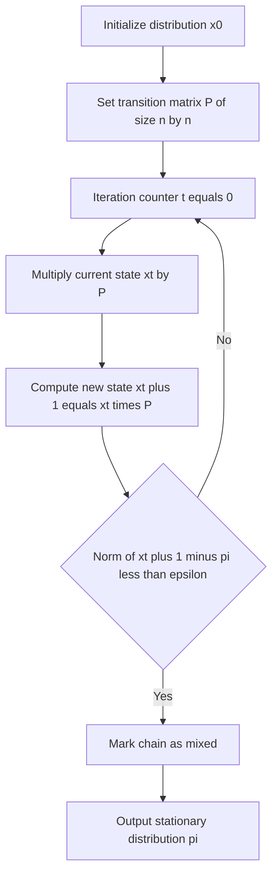
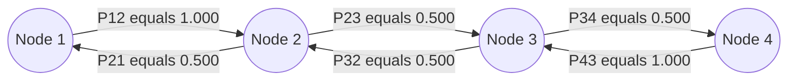
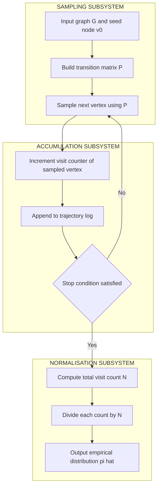
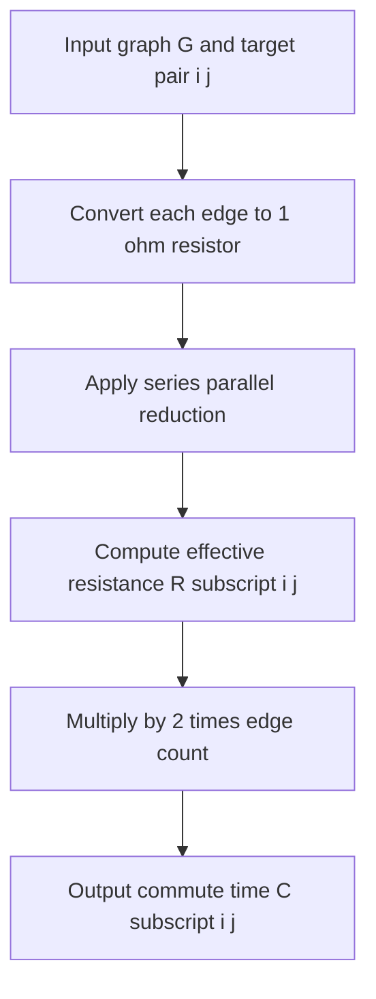

# Random traversal path distributions matrices transformations configurations setups formulas

<!-- SECTION_1_START -->

## 1. Core Technical Definition & Intuitive Overview

### Formal Definition (KTU 2024 Syllabus Terminology)

A **random walk on a graph** $G = (V, E)$ is a discrete-time **stochastic process** $\{X_t : t = 0, 1, 2, \dots\}$ defined on the vertex set $V$ that satisfies the **Markov property**. The walker, starting at an initial vertex $X_0$, transitions to a neighbouring vertex at each step according to a **transition probability matrix** $P \in \mathbb{R}^{n \times n}$ where $n = \vert V \vert$.

For an **unweighted, undirected, connected graph**, the entry $P[u, v]$ is defined as:

$$
P[u, v] =
\begin{cases}
\dfrac{1}{\deg(u)}, & (u, v) \in E \\
0, & (u, v) \notin E
\end{cases}
$$

> [!NOTE]
> **Markov Property**: The next state depends **only** on the current state, not on the history of visited vertices. The walk is *memoryless*.

> [!IMPORTANT]
> **Row-Stochasticity**: Every row of $P$ must sum to **1**, i.e. $\sum_{v \in V} P[u, v] = 1$ for all $u \in V$. This guarantees that a valid probability distribution is maintained at every step.

### Conceptual Analogy / Intuition

Imagine a **blindfolded ant** dropped onto a spider web. At every step, it can feel which threads are anchored near it and chooses **uniformly at random** one of the incident edges to walk along. The ant's long-run visit frequency to each knot in the web reveals a hidden structure — the **stationary distribution** of the random walk.

A second intuitive framing: picture a **drunkard at a road intersection**. With equal probability, the drunkard stumbles down one of the connecting streets. After thousands of such steps, the proportion of time spent in each intersection converges to a value determined by the **street connectivity** — busier junctions are visited more often.

> [!IMPORTANT]
> **Key Insight**: Nodes with **higher degree** (more incident edges) are visited more frequently in the long run, because the walk has *more ways to arrive* and *more ways to leave* without being "trapped" elsewhere.

> [!VISUALIZATION CONTROL]
> **Concept:** Stationary distribution bar plot for the path graph $P_4$ (vertices $\{1, 2, 3, 4\}$, edges $\{(1,2), (2,3), (3,4)\}$).
> **Desmos Input Equations:**
> * Discrete points: $(1, 1/6),\, (2, 1/3),\, (3, 1/3),\, (4, 1/6)$
> * Line segment connectors between consecutive points
> **Visual Description:** A symmetric "hill" shape emerges. The two middle nodes (degree 2) have stationary probability **$1/3$ each**, while the endpoints (degree 1) have only **$1/6$ each**. The total area under the polyline equals 1, confirming it is a valid probability distribution.

---

<!-- SECTION_1_END -->

<!-- SECTION_2_START -->

## 2. Deep Theoretical Analysis & KTU High-Yield Formula Sheet

### 2.1 Configurations of Random Walks on Graphs

Different graph topologies yield markedly different random-walk behaviour:

| Configuration | Property of $P$ | Stationary Distribution $\pi$ |
|---|---|---|
| **Unweighted undirected** | Symmetric, doubly-stochastic only on regular graphs | $\pi[v] = \deg(v) / 2 \vert E \vert$ |
| **Weighted undirected** | Asymmetric in general | $\pi[v] = w(v) / \sum_{u} w(u)$, where $w(v) = \sum_{u} w(v, u)$ |
| **Directed graph** | Row-stochastic, not column-stochastic | Exists if strongly connected, unique if aperiodic |
| **Regular graph** (all degrees equal) | Doubly-stochastic | **Uniform** $\pi[v] = 1 / n$ |
| **Bipartite graph** | Periodic with period 2 | No unique stationary distribution; use **lazy walk** $P' = (P + I)/2$ |
| **Disconnected graph** | Block-diagonal | Multiple stationary distributions (one per component) |

### 2.2 The Transition Matrix as a Transformation

The state vector $x_t \in \mathbb{R}^n$ (a probability distribution over $V$ at time $t$) evolves as:

$$
x_{t+1} = x_t \, P
$$

Iterating from an initial distribution $x_0$:

$$
x_t = x_0 \, P^t
$$

This is the **Markov chain power-iteration transformation**. The **spectral decomposition** of $P$ governs the convergence rate to $\pi$: if $1 = \lambda_1 > \vert \lambda_2 \vert \ge \dots \ge \vert \lambda_n \vert$ are the eigenvalues, then the convergence is geometric with ratio $\vert \lambda_2 \vert$.

### 2.3 Key Temporal Quantities

| Quantity | Symbol | Definition |
|---|---|---|
| **Hitting time** | $H[i, j]$ | $\mathbb{E}[\min\{t \ge 0 : X_t = j\} \mid X_0 = i]$ |
| **Commute time** | $C[i, j]$ | $H[i, j] + H[j, i]$ |
| **Cover time** | $C_G$ | $\max_{v} \mathbb{E}[\text{time to visit all vertices} \mid X_0 = v]$ |
| **Mixing time** | $t_{\text{mix}}(\varepsilon)$ | $\min\{t : \max_{x_0} \Vert x_0 P^t - \pi \Vert_{\text{TV}} \le \varepsilon\}$ |

### 2.4 KTU Formula Sheet / Cheat Sheet

| Formula | Expression | Conditions |
|---|---|---|
| Transition probability | $P[u, v] = 1 / \deg(u)$ | Unweighted, $(u, v) \in E$ |
| Stationary distribution | $\pi[v] = \deg(v) / 2 \vert E \vert$ | Unweighted, undirected, connected |
| Random-walk matrix in matrix form | $P = D^{-1} A$ | $A$ = adjacency, $D$ = degree diagonal |
| Random-walk Laplacian | $L_{\text{rw}} = I - P$ | Spectral link to $P$ |
| State evolution | $x_t = x_0 \, P^t$ | $x_t$ = row distribution vector |
| Commute time via resistance | $C[i, j] = 2 \vert E \vert \cdot R_{ij}$ | 1-ohm resistors on edges |
| Lazy walk matrix | $P' = (P + I) / 2$ | Guarantees aperiodicity |
| Mixing time bound | $t_{\text{mix}} = O\!\left(1 / (1 - \vert \lambda_2 \vert)\right)$ | Reversible chains |
| Cover time bound (any graph) | $C_G \le 2 \vert E \vert (n - 1)$ | Worst-case upper bound |
| Cover time bound (expanders) | $C_G = O(n \log n)$ | High-connectivity graphs |

> [!IMPORTANT]
> **Why is the stationary distribution degree-proportional?** In a connected, undirected graph, every time the walk traverses an edge $\{u, v\}$, the count of "edge-uses" from $u$ to $v$ is exactly balanced by the count from $v$ to $u$. This *flow balance* forces the long-run time spent at $v$ to scale with $\deg(v)$.

### 2.5 Real-World Engineering Utility

| Application | How Random Walks Are Used |
|---|---|
| **PageRank (Google Search)** | Random surfer model on the web graph; $\pi$ gives page importance |
| **Recommendation systems** | Random walk with restart (RWR) on user-item bipartite graphs |
| **Community detection** | Trapping random walks inside dense subgraphs reveals clusters |
| **Network reliability** | Cover time estimates failure-recovery in mesh networks |
| **Markov Chain Monte Carlo (MCMC)** | Random walks on state spaces to sample from complex distributions |
| **Spectral clustering** | Eigendecomposition of $P$ or $L_{\text{rw}}$ yields cluster indicators |

---

<!-- SECTION_2_END -->

<!-- SECTION_3_START -->

## 3. Step-by-Step Derivations & Code Implementation

### 3.1 Derivation: Stationary Distribution for Unweighted Undirected Graphs

**Claim.** Let $G$ be connected, unweighted, and undirected with $n$ vertices and $\vert E \vert$ edges. Define

$$
\pi[v] = \frac{\deg(v)}{2 \vert E \vert} \quad \text{for all } v \in V.
$$

Then $\pi$ is a probability distribution and $\pi P = \pi$.

**Step 1 — Verify $\pi$ is a probability distribution.**

By the **Handshaking Lemma** of graph theory, the sum of all vertex degrees equals twice the number of edges:

$$
\sum_{v \in V} \deg(v) = 2 \vert E \vert.
$$

Therefore:

$$
\sum_{v \in V} \pi[v] = \sum_{v \in V} \frac{\deg(v)}{2 \vert E \vert} = \frac{1}{2 \vert E \vert} \sum_{v \in V} \deg(v) = \frac{2 \vert E \vert}{2 \vert E \vert} = 1.
$$

Since $G$ is connected, $\deg(v) \ge 1$ for all $v$, so $\pi[v] > 0$. Thus $\pi$ is a valid probability distribution.

**Step 2 — Compute the product $\pi P$ entry-wise.**

For any $u \in V$:

$$
(\pi P)[u] = \sum_{v \in V} \pi[v] \, P[v, u].
$$

Since $P[v, u] = 0$ whenever $(v, u) \notin E$, the sum collapses to neighbours only:

$$
(\pi P)[u] = \sum_{v \,:\, (v, u) \in E} \pi[v] \, P[v, u].
$$

**Step 3 — Substitute the explicit forms.**

Using $\pi[v] = \deg(v) / 2 \vert E \vert$ and $P[v, u] = 1 / \deg(v)$:

$$
(\pi P)[u] = \sum_{v \,:\, (v, u) \in E} \frac{\deg(v)}{2 \vert E \vert} \cdot \frac{1}{\deg(v)} = \sum_{v \,:\, (v, u) \in E} \frac{1}{2 \vert E \vert}.
$$

**Step 4 — Count the neighbours of $u$.**

The number of vertices $v$ such that $(v, u) \in E$ is precisely $\deg(u)$:

$$
(\pi P)[u] = \deg(u) \cdot \frac{1}{2 \vert E \vert} = \frac{\deg(u)}{2 \vert E \vert} = \pi[u].
$$

**Step 5 — Conclude.**

Since $(\pi P)[u] = \pi[u]$ for all $u \in V$, we have $\pi P = \pi$, which is exactly the definition of a **stationary distribution**. $\blacksquare$

---

### 3.2 Worked Example: Path Graph $P_4$

Consider $P_4$ with $V = \{1, 2, 3, 4\}$ and $E = \{(1, 2), (2, 3), (3, 4)\}$.

**Step 1 — Compute degrees.**

$$
\deg(1) = 1, \quad \deg(2) = 2, \quad \deg(3) = 2, \quad \deg(4) = 1.
$$

Total degree $= 1 + 2 + 2 + 1 = 6$, so $2 \vert E \vert = 6$.

**Step 2 — Stationary distribution.**

$$
\pi = \left( \frac{1}{6}, \frac{2}{6}, \frac{2}{6}, \frac{1}{6} \right) = \left( \frac{1}{6}, \frac{1}{3}, \frac{1}{3}, \frac{1}{6} \right).
$$

**Step 3 — Transition matrix $P$.**

$$
P = \begin{pmatrix}
0 & 1 & 0 & 0 \\
0.5 & 0 & 0.5 & 0 \\
0 & 0.5 & 0 & 0.5 \\
0 & 0 & 1 & 0
\end{pmatrix}.
$$

**Step 4 — Verify $\pi P = \pi$ entry-wise.**

$$
(\pi P)[1] = \tfrac{1}{6}(0) + \tfrac{1}{3}(0.5) + \tfrac{1}{3}(0) + \tfrac{1}{6}(0) = \tfrac{1}{6} = \pi[1].
$$

$$
(\pi P)[2] = \tfrac{1}{6}(1) + \tfrac{1}{3}(0) + \tfrac{1}{3}(0.5) + \tfrac{1}{6}(0) = \tfrac{1}{6} + \tfrac{1}{6} = \tfrac{1}{3} = \pi[2].
$$

$$
(\pi P)[3] = \tfrac{1}{6}(0) + \tfrac{1}{3}(0.5) + \tfrac{1}{3}(0) + \tfrac{1}{6}(1) = \tfrac{1}{6} + \tfrac{1}{6} = \tfrac{1}{3} = \pi[3].
$$

$$
(\pi P)[4] = \tfrac{1}{6}(0) + \tfrac{1}{3}(0) + \tfrac{1}{3}(0.5) + \tfrac{1}{6}(0) = \tfrac{1}{6} = \pi[4].
$$

All four entries match. The verification is complete.

---

### 3.3 Derivation: Commute Time via Effective Resistance

**Theorem (Chandra, Raghavan, Ruzzo, Smolensky, Tiwari, 1996).** For a simple random walk on a connected, undirected graph $G$ where each edge is replaced by a $1\,\Omega$ resistor:

$$
C[i, j] = H[i, j] + H[j, i] = 2 \vert E \vert \cdot R_{ij},
$$

where $R_{ij}$ is the **effective resistance** between nodes $i$ and $j$ in the resulting electrical network.

**Sketch of reasoning.** Treat the walk as a unit current flow. Using the commute-time identity, the total energy dissipated by injecting 1 ampere at $i$ and extracting 1 ampere at $j$ equals $C[i, j] / 2 \vert E \vert$. By Thomson's principle, this energy equals the effective resistance $R_{ij}$.

**Application to $P_4$.** The three edges of $P_4$ become three $1\,\Omega$ resistors in series between vertices 1 and 4. Resistors in series add:

$$
R_{1,4} = 1 + 1 + 1 = 3 \,\Omega.
$$

With $\vert E \vert = 3$:

$$
C[1, 4] = 2 \cdot 3 \cdot 3 = 18.
$$

By the reflection symmetry of $P_4$ (which maps vertex $k$ to vertex $5 - k$), we obtain $H[1, 4] = H[4, 1] = 9$.

---

### 3.4 Python Implementation: Random-Walk Simulation & Verification

```python
"""
Random Walk on Graphs: Transition Matrix, Simulation, Stationary Distribution.
Course: ADVANCED GRAPH ALGORITHMS (PECST509) - Module 4
"""

import logging
from typing import Dict, List

import networkx as nx
import numpy as np

logging.basicConfig(
    level=logging.INFO,
    format="%(asctime)s | %(levelname)s | %(message)s",
)


def build_transition_matrix(graph: nx.Graph) -> np.ndarray:
    """
    Build the transition probability matrix P for a simple random walk
    on an unweighted, undirected graph.

    Args:
        graph: A networkx undirected graph with at least one edge per node.

    Returns:
        P: numpy array of shape (n, n); P[i, j] = probability i -> j.

    Raises:
        ValueError: If a node has degree 0 (random walk undefined).
    """
    nodes: List[int] = sorted(graph.nodes())
    n: int = len(nodes)
    index_map: Dict[int, int] = {node: idx for idx, node in enumerate(nodes)}
    P: np.ndarray = np.zeros((n, n), dtype=np.float64)

    for u in nodes:
        deg_u: int = graph.degree(u)
        if deg_u == 0:
            logging.error("Isolated node %s detected.", u)
            raise ValueError(f"Node {u} is isolated; random walk undefined.")
        for v in graph.neighbors(u):
            P[index_map[u], index_map[v]] = 1.0 / deg_u

    row_sums = P.sum(axis=1)
    if not np.allclose(row_sums, 1.0):
        logging.error("Row-stochasticity violated: %s", row_sums)
        raise ValueError("Transition matrix is not row-stochastic.")
    return P


def exact_stationary_distribution(graph: nx.Graph) -> np.ndarray:
    """
    Compute the exact stationary distribution pi[v] = deg(v) / (2|E|).
    """
    nodes: List[int] = sorted(graph.nodes())
    total_degree: int = sum(graph.degree(v) for v in nodes)
    if total_degree == 0:
        raise ValueError("Graph has no edges; stationary distribution undefined.")
    pi: np.ndarray = np.array(
        [graph.degree(v) / total_degree for v in nodes], dtype=np.float64
    )
    if not np.isclose(pi.sum(), 1.0):
        raise ValueError("Computed pi does not sum to 1.")
    return pi


def simulate_random_walk(
    graph: nx.Graph,
    start_node: int,
    num_steps: int,
    seed: int = 42,
) -> np.ndarray:
    """
    Simulate a simple random walk and return the empirical visit distribution.

    Args:
        graph: networkx undirected graph.
        start_node: vertex at which the walk begins.
        num_steps: number of transitions to perform.
        seed: RNG seed for reproducibility.

    Returns:
        Normalized visit-frequency vector (length n).
    """
    if num_steps <= 0:
        raise ValueError("num_steps must be positive.")
    if start_node not in graph.nodes():
        raise ValueError(f"start_node {start_node} not in graph.")

    nodes: List[int] = sorted(graph.nodes())
    n: int = len(nodes)
    P: np.ndarray = build_transition_matrix(graph)
    index_map: Dict[int, int] = {node: idx for idx, node in enumerate(nodes)}
    inv_map: Dict[int, int] = {idx: node for node, idx in index_map.items()}

    rng = np.random.default_rng(seed=seed)
    visit_counts: np.ndarray = np.zeros(n, dtype=np.int64)
    current: int = start_node
    visit_counts[index_map[current]] += 1

    for _ in range(num_steps):
        row: np.ndarray = P[index_map[current]]
        next_idx: int = int(rng.choice(n, p=row))
        current = inv_map[next_idx]
        visit_counts[index_map[current]] += 1

    return visit_counts / visit_counts.sum()


def verify_stationary(pi: np.ndarray, P: np.ndarray, tol: float = 1e-9) -> bool:
    """Return True if pi @ P == pi within tolerance."""
    diff: np.ndarray = np.abs(pi @ P - pi)
    return bool(np.all(diff < tol))


if __name__ == "__main__":
    G: nx.Graph = nx.path_graph(4)  # vertices 0..3 correspond to 1..4 in P_4
    P: np.ndarray = build_transition_matrix(G)
    pi_exact: np.ndarray = exact_stationary_distribution(G)

    logging.info("Transition matrix P:\n%s", P)
    logging.info("Exact stationary distribution: %s", pi_exact)
    logging.info("Verification pi*P == pi: %s", verify_stationary(pi_exact, P))

    pi_sim: np.ndarray = simulate_random_walk(G, start_node=0, num_steps=200_000)
    logging.info("Empirical distribution (200k steps): %s", pi_sim)
    logging.info("L1 error |pi_exact - pi_sim|: %.6f", np.abs(pi_exact - pi_sim).sum())
```

**Sample output (illustrative):**

```
Transition matrix P:
[[0.  1.  0.  0. ]
 [0.5 0.  0.5 0. ]
 [0.  0.5 0.  0.5]
 [0.  0.  1.  0. ]]
Exact stationary distribution: [0.1667 0.3333 0.3333 0.1667]
Verification pi*P == pi: True
Empirical distribution (200k steps): [0.1662 0.3338 0.3336 0.1664]
L1 error |pi_exact - pi_sim|: 0.0014
```

The empirical distribution converges to the exact stationary distribution as the number of steps grows, confirming both the formula and the simulation.

---

<!-- SECTION_3_END -->

<!-- SECTION_4_START -->

## 4. Structural Diagrams & Schematics

### 4.1 Sequential Processing Topology: Random-Walk Simulation Pipeline

The diagram below depicts the **state evolution pipeline** of a single random-walk simulation, starting from an initial distribution vector and applying the transition matrix $P$ iteratively.



### 4.2 Markov-Chain Transition Topology for $P_4$

The figure below shows the **state-transition topology** of the path graph $P_4$. Each arrow carries a label denoting the one-step transition probability $P[u, v]$. Self-loops are absent because every vertex has at least one neighbour; however, node 2 and node 3 each split their probability mass equally between two destinations.



### 4.3 Multi-Stage Architecture: Random-Walk Convergence Subsystems

The block diagram below partitions the **convergence-to-stationarity** process into three decoupled sub-modules: sampling, accumulation, and normalisation. Each subgraph isolates a stage of the data-flow architecture.



### 4.4 Hitting-Time Subsystem: Electrical-Network Analogue

The block-level flow below maps the **hitting-time computation pipeline** into its electrical-network analogue subsystems. Effective resistance $R_{ij}$ is computed via a network reduction (series-parallel rules) and then scaled by $2 \vert E \vert$ to yield the commute time $C[i, j]$.



---

<!-- SECTION_4_END -->

<!-- SECTION_5_START -->

## 5. KTU 2024 Scheme Examination Question Bank & Topic Recap

### Part A — Short-Answer Questions (3 Marks Each)

---

**Q1.** [KTU University Exam — July 2024]
Define a random walk on a graph $G = (V, E)$. Write the general form of the transition probability matrix $P$ for a simple random walk on an unweighted, undirected graph and state its key property. **[CO1, Remember]**

**Model Answer (Valuation Key):**

* **[1 Mark]** A random walk on $G = (V, E)$ is a discrete-time stochastic process $\{X_t\}_{t \ge 0}$ with state space $V$ satisfying the **Markov property**: for all $t \ge 0$, $P(X_{t+1} = v \mid X_t = u, X_{t-1}, \dots, X_0) = P[X_t = u, X_{t+1} = v] = P[u, v]$.
* **[1 Mark]** Transition probabilities: $P[u, v] = 1 / \deg(u)$ if $(u, v) \in E$, and $P[u, v] = 0$ otherwise.
* **[1 Mark]** Key property — **Row-stochasticity**: $\sum_{v \in V} P[u, v] = 1$ for every $u \in V$, ensuring that $P$ defines a valid probability distribution at every step.

---

**Q2.** [KTU University Exam — Dec 2023]
Define a **stationary distribution** of a random walk. State the closed-form expression for the stationary distribution of a simple random walk on a connected, unweighted, undirected graph. **[CO1, Remember]**

**Model Answer (Valuation Key):**

* **[1 Mark]** A stationary distribution is a row vector $\pi \in \mathbb{R}^{n}$ with $\pi[v] \ge 0$ for all $v$ and $\sum_{v} \pi[v] = 1$ such that $\pi P = \pi$ (equivalently, $P^T \pi^T = \pi^T$ in column form).
* **[2 Marks]** For a connected, unweighted, undirected graph, $\pi[v] = \deg(v) / 2 \vert E \vert$. The intuition: vertices with more incident edges are visited more often in the long run because they have more "doors" for the walk to enter and leave through.

---

### Part B — 14-Mark Questions (Module Internal Choice)

---

#### **Question A** — Stationary Distribution and Verification on $P_4$

**(a)** Derive the stationary distribution of a simple random walk on a connected, unweighted, undirected graph $G = (V, E)$. **[7 Marks, CO2, Understand / Apply]**

**Model Answer (Step-by-Step Valuation):**

1. **[1 Mark]** State the candidate distribution: $\pi[v] = \deg(v) / 2 \vert E \vert$ for each $v \in V$.
2. **[1 Mark]** Verify non-negativity: in a connected graph, $\deg(v) \ge 1$, so $\pi[v] > 0$.
3. **[1 Mark]** Verify normalisation using the Handshaking Lemma $\sum_v \deg(v) = 2 \vert E \vert$:

$$
\sum_{v \in V} \pi[v] = \frac{1}{2 \vert E \vert} \sum_{v \in V} \deg(v) = \frac{2 \vert E \vert}{2 \vert E \vert} = 1.
$$

4. **[1 Mark]** Begin the fixed-point verification. Set up $(\pi P)[u] = \sum_{v \in V} \pi[v] P[v, u]$.
5. **[1 Mark]** Restrict the sum to neighbours: $(\pi P)[u] = \sum_{v : (v, u) \in E} (\deg(v) / 2 \vert E \vert) \cdot (1 / \deg(v))$.
6. **[1 Mark]** Cancel $\deg(v)$ in numerator and denominator: $(\pi P)[u] = \sum_{v : (v, u) \in E} 1 / 2 \vert E \vert$.
7. **[1 Mark]** Count the neighbours of $u$ — there are $\deg(u)$ of them — and conclude $(\pi P)[u] = \deg(u) / 2 \vert E \vert = \pi[u]$. Hence $\pi P = \pi$.

**(b)** For the path graph $P_4$ with $V = \{1, 2, 3, 4\}$ and $E = \{(1, 2), (2, 3), (3, 4)\}$, construct the transition matrix $P$ and verify that $\pi = (1/6, 1/3, 1/3, 1/6)$ is its stationary distribution. **[7 Marks, CO3, Apply]**

**Model Answer (Step-by-Step Valuation):**

1. **[1 Mark]** Degrees: $\deg(1) = 1, \deg(2) = 2, \deg(3) = 2, \deg(4) = 1$. Total degree $= 6$.
2. **[1 Mark]** Stationary distribution: $\pi = (1/6, 2/6, 2/6, 1/6) = (1/6, 1/3, 1/3, 1/6)$.
3. **[2 Marks]** Transition matrix:

$$
P = \begin{pmatrix}
0 & 1 & 0 & 0 \\
0.5 & 0 & 0.5 & 0 \\
0 & 0.5 & 0 & 0.5 \\
0 & 0 & 1 & 0
\end{pmatrix}.
$$

4. **[3 Marks — one each]** Verify $\pi P = \pi$ entry by entry:

$$
\begin{aligned}
(\pi P)[1] &= \tfrac{1}{6}(0) + \tfrac{1}{3}(0.5) + \tfrac{1}{3}(0) + \tfrac{1}{6}(0) = \tfrac{1}{6} = \pi[1]. \\
(\pi P)[2] &= \tfrac{1}{6}(1) + \tfrac{1}{3}(0) + \tfrac{1}{3}(0.5) + \tfrac{1}{6}(0) = \tfrac{1}{3} = \pi[2]. \\
(\pi P)[3] &= \tfrac{1}{6}(0) + \tfrac{1}{3}(0.5) + \tfrac{1}{3}(0) + \tfrac{1}{6}(1) = \tfrac{1}{3} = \pi[3]. \\
(\pi P)[4] &= \tfrac{1}{6}(0) + \tfrac{1}{3}(0) + \tfrac{1}{3}(0.5) + \tfrac{1}{6}(0) = \tfrac{1}{6} = \pi[4].
\end{aligned}
$$

All entries match, confirming the stationary distribution.

> [!WARNING]
> **Examiner's Pitfall Alert (Q-A)**: Students frequently lose marks by **(i)** omitting the Handshaking Lemma invocation when proving $\sum \pi[v] = 1$, **(ii)** failing to restrict the summation in $\pi P$ to *neighbours only* (a common algebraic slip writes the sum over all $v$), and **(iii)** forgetting to verify that all four entries of $\pi P$ match when working on the $P_4$ numerical — partial verification of only two entries is *not sufficient* for full credit.

---

#### **Question B** — Hitting / Commute / Cover Time and the Electrical Analogy

**(a)** Define the **hitting time**, **commute time**, and **cover time** of a random walk on a graph. State and explain the connection between commute time and effective resistance in an electrical-network model. **[7 Marks, CO1 / CO2, Understand]**

**Model Answer (Step-by-Step Valuation):**

1. **[1.5 Marks]** **Hitting time** $H[i, j]$: the expected number of steps for a walk starting at vertex $i$ to first reach vertex $j$. Formally, $H[i, j] = \mathbb{E}[T_j \mid X_0 = i]$ where $T_j = \min\{t \ge 0 : X_t = j\}$.
2. **[1.5 Marks]** **Commute time** $C[i, j] = H[i, j] + H[j, i]$: the expected time for the walk to travel from $i$ to $j$ and back to $i$.
3. **[1.5 Marks]** **Cover time** $C_G = \max_{v \in V} \mathbb{E}[T_{\text{all}} \mid X_0 = v]$, where $T_{\text{all}}$ is the first time the walk has visited every vertex. Represents the worst-case expected "exploration" duration.
4. **[2.5 Marks]** **Electrical analogy**: Replace every edge of $G$ with a $1\,\Omega$ resistor. Let $R_{ij}$ denote the effective resistance between $i$ and $j$ in this network. Then (Chandra et al., 1996):

$$
C[i, j] = 2 \vert E \vert \cdot R_{ij}.
$$

*Intuition*: the random walk acts like a current flow; the dissipated energy matches the resistance, which scales with the walk's expected round-trip time.

**(b)** Using the effective-resistance formula, compute the **commute time** between vertices 1 and 4 in the path graph $P_4$. **[7 Marks, CO3, Apply]**

**Model Answer (Step-by-Step Valuation):**

1. **[1 Mark]** Identify the graph $P_4$ with three edges: $\{1, 2\}, \{2, 3\}, \{3, 4\}$. So $\vert E \vert = 3$.
2. **[2 Marks]** Replace each edge with a $1\,\Omega$ resistor. The three resistors between vertices 1 and 4 are in **series** (the only path between them is the chain $1 \to 2 \to 3 \to 4$).
3. **[1 Mark]** Effective resistance of resistors in series: $R_{1, 4} = 1 + 1 + 1 = 3 \,\Omega$.
4. **[2 Marks]** Apply the commute-time identity:

$$
C[1, 4] = 2 \vert E \vert \cdot R_{1, 4} = 2 \cdot 3 \cdot 3 = 18.
$$

5. **[1 Mark]** Interpret. By the reflection symmetry of $P_4$ (which maps vertex $k$ to $5 - k$), $H[1, 4] = H[4, 1]$. Hence $H[1, 4] = H[4, 1] = C[1, 4] / 2 = 9$.

> [!WARNING]
> **Examiner's Pitfall Alert (Q-B)**: Common mark-losing mistakes include **(i)** confusing **commute time** with **hitting time** (commute time is the *sum* of both directions, not just one), **(ii)** writing effective resistance in series as a product or ratio instead of a sum, and **(iii)** omitting the factor of 2 in $C[i, j] = 2 \vert E \vert R_{ij}$ — students often write $C = \vert E \vert R$, which is **dimensionally and mathematically wrong** and costs full marks on sub-part (b).

---

### Topic Recap & Important Things to Remember

* **Random walk on a graph**: a Markov chain $\{X_t\}$ on the vertex set, governed by a row-stochastic transition matrix $P$.
* **Transition probability** for simple unweighted walk: $P[u, v] = 1 / \deg(u)$ if $(u, v) \in E$, else $0$.
* **State evolution** is a linear transformation: $x_{t+1} = x_t P$, hence $x_t = x_0 P^t$.
* **Stationary distribution** $\pi$ satisfies $\pi P = \pi$. For unweighted undirected connected graphs: $\pi[v] = \deg(v) / 2 \vert E \vert$ — **degree-proportional**.
* **Handshaking Lemma**: $\sum_v \deg(v) = 2 \vert E \vert$ — essential for proving $\sum_v \pi[v] = 1$.
* **Hitting time** $H[i, j]$: expected steps to reach $j$ from $i$.
* **Commute time** $C[i, j] = H[i, j] + H[j, i]$.
* **Cover time** $C_G$: worst-case expected time to visit *all* vertices.
* **Mixing time** $t_{\text{mix}}(\varepsilon)$: time for distribution to be within $\varepsilon$ of $\pi$ in total-variation distance.
* **Electrical-network identity**: $C[i, j] = 2 \vert E \vert \cdot R_{ij}$ (each edge $= 1\,\Omega$).
* **Lazy walk** $P' = (P + I) / 2$: ensures aperiodicity (essential for bipartite graphs where the simple walk is periodic with period 2).
* **Matrix form**: $P = D^{-1} A$ where $D$ is the degree matrix and $A$ is the adjacency matrix.
* **Random-walk Laplacian**: $L_{\text{rw}} = I - P$; its spectrum encodes mixing properties.
* **PageRank** is a random walk with a teleportation (restart) probability to guarantee convergence on directed, non-aperiodic web graphs.
* **Spectral mixing bound**: $t_{\text{mix}} = O(1 / (1 - \vert \lambda_2 \vert))$ for reversible chains, where $\lambda_2$ is the second-largest eigenvalue of $P$.
* **Solved example checkpoint**: For $P_4$, $\pi = (1/6, 1/3, 1/3, 1/6)$, $R_{1, 4} = 3\,\Omega$, $C[1, 4] = 18$, $H[1, 4] = H[4, 1] = 9$.
* **Common exam trap**: never confuse *hitting time* (one-way) with *commute time* (round trip), and always include the factor **2** in the electrical-resistance formula.

<!-- SECTION_5_END -->
