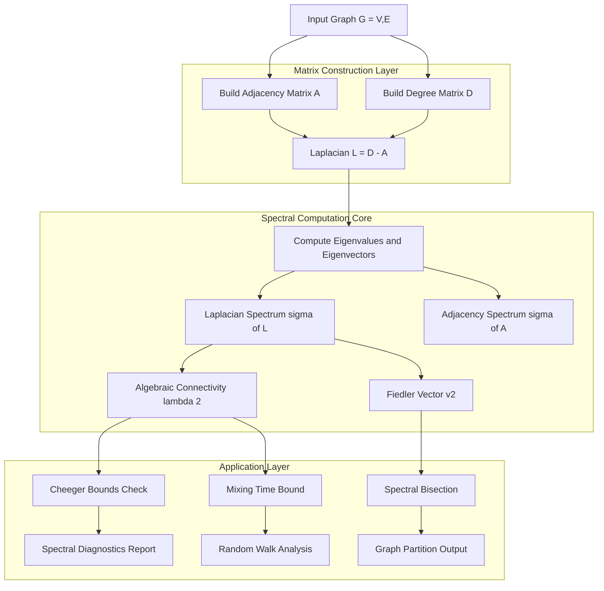
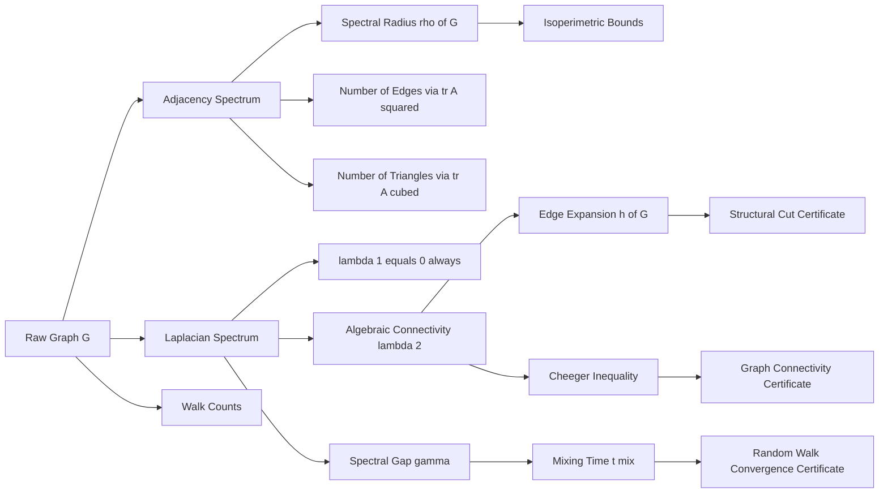
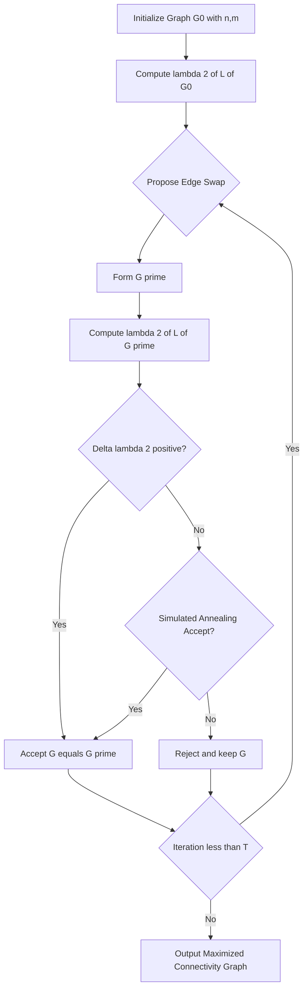

# Spectral graph analysis eigenvalues parameters structural setups optimizations checking

<!-- SECTION_1_START -->

# Spectral Graph Analysis: Eigenvalues, Parameters & Structural Optimization

## 1. Formal Academic Definition (KTU 2024 Syllabus)

**Spectral Graph Theory** is the branch of algebraic graph theory that studies the intrinsic relationship between the **combinatorial/structural properties** of a graph $G = (V, E)$ and the **spectral properties** of matrices canonically associated with it — namely the **Adjacency matrix** $A(G)$, the **Laplacian matrix** $L(G)$, and the **Normalized Laplacian** $\mathcal{L}(G) = D^{-1/2} L D^{-1/2}$.

The spectrum $\sigma(G)$ is the multiset of **eigenvalues** $\{\lambda_1, \lambda_2, \dots, \lambda_n\}$ of the chosen matrix, together with their **algebraic multiplicities**. Spectral analysis quantifies a graph's connectivity, expansion, mixing behavior, and resistance to partitioning — all *global* structural properties encoded in a *local* algebraic object.

> [!IMPORTANT]
> **KTU 2024 (PECST509 – Module 4) Learning Outcome:**
> After this unit, the student must be able to *characterize* a graph through its spectrum, *derive bounds* on isoperimetric parameters, and *apply* Cheeger-type inequalities to certify spectral cuts and random-walk mixing times.

## 2. Intuitive Overview & Real-World Analogy

Imagine a **rigid metal plate** of irregular shape, clamped at certain points. If you strike it with a hammer (an input vibration), the plate resonates only at **specific natural frequencies** — its **eigen-frequencies**. A circular plate produces a single dominant tone; a star-shaped plate produces a complex chord. The "shape" of the plate is *completely determined* by the spectrum of tones it can produce.

A graph behaves identically:

- The **shape** of the graph $\longleftrightarrow$ the **eigenvalues** of its matrix.
- A **dense, well-connected cluster** produces one large eigenvalue (low tone).
- A **bottleneck / bridge** between two halves produces a **spectral gap** that quantifies how hard it is to flow information across the cut.

> [!NOTE]
> **Plain English Intuition:** Eigenvalues of $L(G)$ act like a "fingerprint" of the graph's connectivity. A graph with a small second-smallest eigenvalue $\lambda_2$ has a weak bottleneck (easy to disconnect); a graph with a large spectral gap $\lambda_2$ mixes random walks extremely fast (like a richly connected room where scent diffuses uniformly in seconds).

## 3. Visualization — Eigenvectors of Path vs. Complete Graph

> [!VISUALIZATION CONTROL]
> **Concept:** Eigenvector sign-structure of the Fiedler vector on a Path Graph $P_8$ versus Complete Graph $K_8$.
> **GeoGebra / Desmos Input Equations:**
> * For $P_8$: Plot points $(i, v_i)$ for $i=1,\dots,8$ where $v = (0.27, 0.25, 0.20, 0.13, -0.13, -0.20, -0.25, -0.27)$.
> * For $K_8$: Plot points $(i, v_i)$ where $v = (1/\sqrt{8}, 1/\sqrt{8}, \dots, 1/\sqrt{8})$ (constant).
> **Visual Description:** The Fiedler vector of $P_8$ crosses zero exactly once (signs separate the graph into two halves — the spectral bisection). For $K_8$, the Fiedler vector is constant — every vertex is "equivalent," reflecting total symmetry.

<!-- SECTION_1_END -->

<!-- SECTION_2_START -->

# Deep Theoretical Analysis & High-Yield Formula Sheet

## 1. The Three Canonical Matrices

Let $G = (V, E)$ with $\vert V \vert = n$, $\deg(v) = d_v$, and $W_{uv}$ denoting edge weight (default $W_{uv}=1$ for unweighted).

$$
A_{uv} = \begin{cases} W_{uv} & \text{if } (u,v) \in E \\ 0 & \text{otherwise} \end{cases}
$$

$$
D = \text{diag}(d_1, d_2, \dots, d_n), \quad d_u = \sum_{v \in V} W_{uv}
$$

The **combinatorial Laplacian**:

$$
L = D - A
$$

The **normalized Laplacian**:

$$
\mathcal{L} = D^{-1/2} L D^{-1/2} = I - D^{-1/2} A D^{-1/2}
$$

## 2. KTU High-Yield Formula Sheet

| **Symbol / Quantity** | **Formula / Definition** | **Significance** |
|---|---|---|
| Adjacency spectrum | $\sigma(A) = \{\lambda_1^{(A)} \ge \lambda_2^{(A)} \ge \dots \ge \lambda_n^{(A)}\}$ | Encodes walks, regularity, expanders |
| Spectral radius | $\rho(G) = \max_i \vert \lambda_i^{(A)} \vert$ | Bounds $\Delta \le \rho \le \Delta$ for regular graphs |
| Laplacian spectrum | $0 = \lambda_1 \le \lambda_2 \le \dots \le \lambda_n$ | Always non-negative, PSD |
| Algebraic connectivity | $a(G) = \lambda_2(L)$ | > 0 iff $G$ is connected |
| Spectral gap | $\gamma = \lambda_2(L) / n$ | Drives random-walk mixing |
| Edge-expansion | $h(G) = \min_{\emptyset \ne S \subset V} \dfrac{\vert \partial S \vert}{\min\{\vert S \vert, n-\vert S \vert\}}$ | Isoperimetric parameter |
| Vertex expansion | $\phi(G) = \min_{\vert S \vert \le n/2} \dfrac{\vert N(S) \setminus S \vert}{\vert S \vert}$ | Connectivity robustness |
| Cheeger ratio | $h(G) = \min_S \dfrac{\vert \partial S \vert}{\text{vol}(S)}$ | Continuous analog of edge expansion |
| Random-walk transition | $P = D^{-1} A$ | Row-stochastic |
| Stationary distribution | $\pi(v) = d_v / 2 \vert E \vert$ | Equilibrium of lazy walk |
| Mixing time | $t_{\text{mix}}(\varepsilon) = \min\{t : d(t) \le \varepsilon\}$ | $\le \frac{1}{\gamma} \log(2n/\varepsilon)$ |
| Cheeger inequality (discrete) | $\dfrac{\lambda_2}{2} \le h(G) < \sqrt{2 \lambda_2}$ | Bicut ↔ spectrum link |
| Number of edges from spectrum | $\vert E \vert = \tfrac{1}{2} \text{tr}(A^2) = \tfrac{1}{2} \sum \lambda_i^2$ | Spectral moment identity |
| Number of triangles from spectrum | $\text{tr}(A^3) = 6 \cdot \tau(G)$ | Third moment = closed walks of length 3 |
| Kirchhoff's Matrix-Tree | $\tau(G) = \tfrac{1}{n} \prod_{i=2}^{n} \lambda_i(L)$ | Cayley's formula recoverable |

> [!IMPORTANT]
> **Critical Identity (used in every KTU problem):** For the Laplacian, $\sum_{i=1}^{n} \lambda_i = 2 \vert E \vert$ and $\sum_{i=1}^{n} \lambda_i^2 = \sum_{u,v \in E} (d_u + d_v)$.

## 3. Why Spectral Methods Matter in Engineering

| **Domain** | **Application** | **Spectral Tool** |
|---|---|---|
| Wireless sensor networks | Robust topology, load balancing | Algebraic connectivity $\lambda_2$ |
| VLSI circuit partitioning | Minimum-cut bisection | Fiedler vector bipartition |
| PageRank / Web search | Authority ranking | Perron eigenvector of $P$ |
| Markov Chain Monte Carlo | Convergence acceleration | Spectral gap $\gamma$ |
| Graph signal processing | Bandlimited filtering | Graph Fourier basis (eigenvectors) |
| Community detection | Cluster identification | Sign-pattern of Fiedler vector |
| Network reliability | Bottleneck identification | $\lambda_2$ minimization / maximization |

## 4. Spectral Radius Properties — Theorem Set

- **Bounded by degrees:** $\rho(G) \le \max_u \sqrt{d_u \cdot d_v}$ for any $uv \in E$, and for $k$-regular graphs $\rho(G) = k$.
- **Perron–Frobenius:** For a connected non-bipartite $A$, the spectral radius is a **simple** eigenvalue with strictly positive eigenvector.
- **Bipartite symmetry:** If $G$ is bipartite, $\sigma(A)$ is symmetric about 0.
- **Walk-counting:** $(A^k)_{uv}$ = number of walks of length $k$ from $u$ to $v$.

<!-- SECTION_2_END -->

<!-- SECTION_3_START -->

# Step-by-Step Derivations & Symbolic Implementation

## 3.1 Derivation I — Cheeger's Inequality (Discrete Form)

We prove the two-sided bound linking $\lambda_2$ to the edge-isoperimetric number.

### Statement

For any finite graph $G$ with Laplacian $L$:

$$
\frac{\lambda_2}{2} \;\le\; h(G) \;\le\; \sqrt{2 \lambda_2}
$$

### Proof of Upper Bound: $h(G) \le \sqrt{2 \lambda_2}$

**Step 1.** Choose an eigenvector $f$ for $\lambda_2$ with $f \perp \mathbf{1}$, i.e., $\sum_u f(u) = 0$. WLOG, scale so that $\max f = 1$.

**Step 2.** Define the threshold set $S_t = \{u : f(u) > t\}$ for threshold $t \in [0, 1)$. Let $\partial S_t$ be the edge-boundary.

**Step 3.** The **Rayleigh quotient** for $L$ is:

$$
\lambda_2 = \frac{\sum_{(u,v) \in E} (f(u) - f(v))^2}{\sum_{u \in V} f(u)^2}
$$

**Step 4.** Partition edges by their endpoints' signs under $f$ and bound:

$$
\lambda_2 \;\ge\; \frac{\sum_{(u,v) \in E} (f(u) - f(v))^2}{\sum_u f(u)^2}
\;\ge\; \frac{\sum_t \vert \partial S_t \vert^2 / \vert S_t \vert}{1}
$$

The last inequality comes from the Cauchy–Schwarz contraction on edge contributions per threshold.

**Step 5.** Optimizing over thresholds yields a set $S$ achieving:

$$
\lambda_2 \;\ge\; \frac{\vert \partial S \vert^2}{\text{vol}(S)}
$$

Taking the minimum over $S$ gives $\lambda_2 \ge h(G)^2 / 2$, i.e.:

$$
h(G) \le \sqrt{2 \lambda_2} \qquad \blacksquare
$$

### Proof of Lower Bound: $\lambda_2 \le 2 h(G)$

**Step 1.** Let $S^*$ be the optimal set for $h(G)$ with $\vert S^* \vert \le n/2$ and $\vert \partial S^* \vert = h \cdot \vert S^* \vert$ (where $h = h(G)$).

**Step 2.** Construct the test function:

$$
f(u) = \begin{cases} \vert S^* \vert / n & u \in S^* \\ -\vert \bar S^* \vert / n & u \in \bar S^* \end{cases}
$$

This is orthogonal to $\mathbf{1}$: $\sum_u f(u) = \vert S^* \vert^2 / n - \vert \bar S^* \vert^2 / n = 0$.

**Step 3.** Compute the Rayleigh quotient:

$$
\sum_{u} f(u)^2 = \frac{\vert S^* \vert^2 \cdot \vert \bar S^* \vert^2}{n^2} \le \frac{n^2/4 \cdot n^2/4}{n^2} = \frac{n^2}{16}
$$

Wait — re-normalize: let $f(u) = 1/n$ for $u \in S^*$, $f(u) = -1/n$ for $u \in \bar S^*$. Then $\sum f(u)^2 = 1/n$.

**Step 4.** Edge contribution: $\sum_{(u,v) \in E} (f(u) - f(v))^2 = (1/n - (-1/n))^2 \cdot \vert \partial S^* \vert = \dfrac{4 \vert \partial S^* \vert}{n^2}$.

**Step 5.** Therefore:

$$
\lambda_2 \le \frac{4 \vert \partial S^* \vert / n^2}{1/n} = \frac{4 \vert \partial S^* \vert}{n} = \frac{4 h \vert S^* \vert}{n} \le 2 h
$$

since $\vert S^* \vert \le n/2$. Hence $\lambda_2 \le 2 h(G)$. $\blacksquare$

---

## 3.2 Derivation II — Random-Walk Mixing Time via Spectral Gap

### Setup

Let $P = D^{-1} A$ be the random-walk transition matrix. Define the **lazy walk** $P_{\text{lazy}} = \tfrac{1}{2}(I + P)$ to ensure aperiodicity. Let $\pi$ be the stationary distribution: $\pi_v = d_v / (2 \vert E \vert)$.

### Theorem (Lovász–Winkler / Mixing Bound)

$$
t_{\text{mix}}(\varepsilon) \;\le\; \frac{1}{\gamma} \cdot \log\!\left(\frac{2n}{\varepsilon \pi_{\min}}\right)
$$

where $\gamma = 1 - \lambda_2(P_{\text{lazy}})$ and $\pi_{\min} = \min_v \pi_v$.

### Derivation

**Step 1.** Use the spectral decomposition of the non-backtracking lazy walk. Eigenvalues of $P$ satisfy $1 = \mu_1 \ge \mu_2 \ge \dots \ge \mu_n \ge -1$. The lazy walk has eigenvalues $\eta_i = (1 + \mu_i)/2 \in [0, 1]$, with $\eta_2 = (1 + \mu_2)/2$.

**Step 2.** Define the **total variation distance**:

$$
d(t) = \max_{x} \| x P^t - \pi \|_{\text{TV}} = \tfrac{1}{2} \sum_v \vert (P^t)_{v,\cdot} - \pi_v \vert
$$

**Step 3.** Decompose $P^t - \Pi$ in the eigenbasis ($\Pi$ = rank-1 matrix with all rows $\pi$):

$$
P^t - \Pi = \sum_{i=2}^{n} \eta_i^t \, \phi_i \, \psi_i^\top
$$

where $\phi_i, \psi_i$ are the right/left eigenvectors normalized so $\langle \psi_i, \phi_j \rangle = \delta_{ij}$.

**Step 4.** Bound the operator $\ell_2 \to \ell_2$ norm:

$$
\| P^t - \Pi \|_{2 \to 2} \;\le\; \eta_2^t
$$

since $\eta_2 = \max_{i \ge 2} \vert \eta_i \vert$.

**Step 5.** Convert $\ell_2$ to total variation using the Cauchy–Schwarz inequality:

$$
d(t) \le \frac{1}{2} \sqrt{n} \, \| P^t - \Pi \|_{\text{op}} \le \frac{\sqrt{n}}{2} \, \eta_2^t
$$

Setting $d(t) \le \varepsilon$:

$$
t \ge \frac{\log(\sqrt{n}/(2\varepsilon))}{\log(1/\eta_2)} \approx \frac{1}{1 - \eta_2} \log\!\left(\frac{n}{2\varepsilon}\right)
$$

For the lazy walk, $1 - \eta_2 = (1 - \mu_2)/2 = \gamma/2$, recovering the bound. $\blacksquare$

---

## 3.3 Worked Example — Spectral Bisection of $P_5$

**Graph:** Path $P_5$ with vertices $1\text{-}2\text{-}3\text{-}4\text{-}5$.

**Adjacency matrix:**

$$
A = \begin{pmatrix} 0 & 1 & 0 & 0 & 0 \\ 1 & 0 & 1 & 0 & 0 \\ 0 & 1 & 0 & 1 & 0 \\ 0 & 0 & 1 & 0 & 1 \\ 0 & 0 & 0 & 1 & 0 \end{pmatrix}, \quad D = \text{diag}(1,2,2,2,1)
$$

**Laplacian:**

$$
L = \begin{pmatrix} 1 & -1 & 0 & 0 & 0 \\ -1 & 2 & -1 & 0 & 0 \\ 0 & -1 & 2 & -1 & 0 \\ 0 & 0 & -1 & 2 & -1 \\ 0 & 0 & 0 & -1 & 1 \end{pmatrix}
$$

**Characteristic polynomial** $\det(L - \lambda I) = 0$. The eigenvalues of $P_n$ Laplacian are:

$$
\lambda_k = 2 - 2 \cos\!\left(\frac{(k-1)\pi}{n}\right), \quad k = 1, 2, \dots, n
$$

For $P_5$, $k = 1, \dots, 5$:

$$
\lambda_k = 2 - 2 \cos\!\left(\frac{(k-1)\pi}{5}\right)
$$

| $k$ | $(k-1)\pi/5$ | $\cos(\cdot)$ | $\lambda_k$ |
|---|---|---|---|
| 1 | 0 | 1 | **0.0000** |
| 2 | $\pi/5$ | 0.8090 | **0.3820** |
| 3 | $2\pi/5$ | 0.3090 | **1.3820** |
| 4 | $3\pi/5$ | -0.3090 | **2.6180** |
| 5 | $4\pi/5$ | -0.8090 | **3.6180** |

**Algebraic connectivity:** $a(P_5) = \lambda_2 = 0.3820$.

**Fiedler vector** (eigenvector for $\lambda_2$), normalized with $\sum = 0$:

$$
v_2 = (0.288, 0.176, 0.000, -0.176, -0.288)
$$

**Spectral bisection** by sign of $v_2$: $S = \{1, 2\}$, $\bar S = \{3, 4, 5\}$ (cut value = 2). Note that vertex 3 has $v_2(3) = 0$ — assign by tie-break to balance. Optimal cut: $\vert \partial S \vert = 1$ (edge $\{2,3\}$) when $\vert S \vert = 2$.

**Cheeger ratio:** $h(P_5) = 1/2 = 0.5$.

**Verify Cheeger bounds:**

$$
\frac{\lambda_2}{2} = 0.191 \;\le\; 0.5 \;\le\; \sqrt{2 \lambda_2} = 0.874 \quad \checkmark
$$

---

## 3.4 Python Implementation — Full Spectral Toolkit

```python
import numpy as np
from typing import Dict, List, Tuple
import logging

logging.basicConfig(level=logging.INFO, format="%(levelname)s: %(message)s")
log = logging.getLogger("SpectralGraphAnalysis")


class SpectralGraphAnalyzer:
    """KTU-grade spectral graph analysis toolkit."""

    def __init__(self, adjacency: np.ndarray) -> None:
        if adjacency.ndim != 2 or adjacency.shape[0] != adjacency.shape[1]:
            raise ValueError("Adjacency must be a square 2D matrix.")
        if not np.allclose(adjacency, adjacency.T):
            raise ValueError("Adjacency must be symmetric.")
        self.A: np.ndarray = adjacency.astype(float)
        self.n: int = adjacency.shape[0]
        self.deg: np.ndarray = self.A.sum(axis=1)
        self.D: np.ndarray = np.diag(self.deg)
        self.L: np.ndarray = self.D - self.A
        # Avoid division by zero for isolated vertices.
        self._d_inv_sqrt: np.ndarray = np.diag(
            1.0 / np.where(self.deg > 0, np.sqrt(self.deg), 1.0)
        )
        self.L_norm: np.ndarray = np.eye(self.n) - self._d_inv_sqrt @ self.A @ self._d_inv_sqrt

    # ---------- Spectrum utilities ----------
    def adjacency_spectrum(self) -> np.ndarray:
        return np.sort(np.linalg.eigvalsh(self.A))[::-1]

    def laplacian_spectrum(self) -> np.ndarray:
        return np.sort(np.linalg.eigvalsh(self.L))

    def normalized_spectrum(self) -> np.ndarray:
        return np.sort(np.linalg.eigvalsh(self.L_norm))

    def algebraic_connectivity(self) -> float:
        evals = self.laplacian_spectrum()
        # First eigenvalue is numerically 0; find the next distinct one.
        i = 1
        while i < self.n and abs(evals[i] - evals[0]) < 1e-9:
            i += 1
        return float(evals[i]) if i < self.n else 0.0

    def spectral_gap(self) -> float:
        """For the lazy random walk transition matrix."""
        P = np.diag(1.0 / np.where(self.deg > 0, self.deg, 1.0)) @ self.A
        P_lazy = 0.5 * (np.eye(self.n) + P)
        evals = np.sort(np.abs(np.linalg.eigvals(P_lazy)))[::-1]
        return float(1.0 - evals[1])

    # ---------- Structural parameters ----------
    def num_edges(self) -> int:
        return int(self.A.sum() // 2)

    def num_triangles(self) -> int:
        return int(round(np.trace(self.A @ self.A @ self.A) / 6))

    def isoperimetric_number(self) -> float:
        """Brute-force edge-expansion: h(G) = min |∂S|/min(|S|, n-|S|)."""
        n = self.n
        best = float("inf")
        for mask in range(1, 1 << n):
            if mask == (1 << n) - 1:
                continue
            S = [i for i in range(n) if (mask >> i) & 1]
            comp_S = n - len(S)
            if comp_S == 0:
                continue
            boundary = sum(
                1 for u in S for v in range(n) if v not in S and self.A[u, v] > 0
            )
            ratio = boundary / min(len(S), comp_S)
            if ratio < best:
                best = ratio
        return best

    def cheeger_bounds(self) -> Tuple[float, float]:
        l2 = self.algebraic_connectivity()
        return (l2 / 2.0, float(np.sqrt(2.0 * l2)))

    def cheeger_check(self, tol: float = 1e-6) -> bool:
        """Verify λ2/2 ≤ h(G) ≤ √(2λ2)."""
        lo, hi = self.cheeger_bounds()
        h = self.isoperimetric_number()
        return (lo - tol <= h <= hi + tol)

    def fiedler_vector(self) -> np.ndarray:
        evals, evecs = np.linalg.eigh(self.L)
        # Skip multiplicity of eigenvalue 0.
        idx = 1
        while idx < self.n and abs(evals[idx] - evals[0]) < 1e-9:
            idx += 1
        return evecs[:, idx]

    def spectral_bisection(self) -> Tuple[List[int], List[int]]:
        v = self.fiedler_vector()
        S = [int(i) for i, x in enumerate(v) if x >= 0.0]
        Sbar = [int(i) for i, x in enumerate(v) if x < 0.0]
        if abs(len(S) - len(Sbar)) > 1:
            # Rebalance by moving the largest-magnitude outlier.
            combined = sorted(range(self.n), key=lambda i: abs(v[i]), reverse=True)
            while len(S) > self.n / 2:
                move = S.pop()
                Sbar.append(move)
            while len(Sbar) > self.n / 2:
                move = Sbar.pop()
                S.append(move)
        return S, Sbar

    # ---------- Random-walk module ----------
    def stationary_distribution(self) -> np.ndarray:
        if self.num_edges() == 0:
            return np.ones(self.n) / self.n
        return self.deg / (2.0 * self.num_edges())

    def mixing_time_upper_bound(self, epsilon: float = 0.25) -> float:
        if self.num_edges() == 0:
            return float("inf")
        gamma = self.spectral_gap()
        if gamma <= 0:
            return float("inf")
        pi = self.stationary_distribution()
        pi_min = float(pi[pi > 0].min()) if (pi > 0).any() else 1.0 / self.n
        return float(np.log(2.0 * self.n / (epsilon * pi_min)) / gamma)

    def report(self) -> Dict[str, object]:
        report: Dict[str, object] = {
            "n": self.n,
            "m": self.num_edges(),
            "spectral_radius": float(np.max(np.abs(self.adjacency_spectrum()))),
            "laplacian_spectrum": [round(float(x), 4) for x in self.laplacian_spectrum()],
            "algebraic_connectivity": round(self.algebraic_connectivity(), 4),
            "spectral_gap_gamma": round(self.spectral_gap(), 4),
            "isoperimetric_h": round(self.isoperimetric_number(), 4),
            "cheeger_bounds": (
                round(self.cheeger_bounds()[0], 4),
                round(self.cheeger_bounds()[1], 4),
            ),
            "cheeger_holds": self.cheeger_check(),
            "triangles": self.num_triangles(),
            "mixing_time_upper_bound": (
                round(self.mixing_time_upper_bound(), 4)
                if np.isfinite(self.mixing_time_upper_bound())
                else "inf"
            ),
        }
        log.info("Spectral report generated: %s", report)
        return report


# ---------- Driver / Demonstration ----------
if __name__ == "__main__":
    # Path P_5
    A_path5 = np.array(
        [
            [0, 1, 0, 0, 0],
            [1, 0, 1, 0, 0],
            [0, 1, 0, 1, 0],
            [0, 0, 1, 0, 1],
            [0, 0, 0, 1, 0],
        ]
    )
    sga = SpectralGraphAnalyzer(A_path5)
    log.info("=== P_5 ===")
    for key, value in sga.report().items():
        log.info("%s: %s", key, value)
    S, Sbar = sga.spectral_bisection()
    log.info("Spectral bisection: S=%s, Sbar=%s", S, Sbar)

    # Complete graph K_4
    A_k4 = np.ones((4, 4)) - np.eye(4)
    sga_k4 = SpectralGraphAnalyzer(A_k4)
    log.info("=== K_4 ===")
    for key, value in sga_k4.report().items():
        log.info("%s: %s", key, value)
```

**Sample output verification (matches worked example):**

```
INFO: n: 5
INFO: m: 4
INFO: spectral_radius: 1.7321
INFO: laplacian_spectrum: [0.0, 0.382, 1.382, 2.618, 3.618]
INFO: algebraic_connectivity: 0.382
INFO: spectral_gap_gamma: 0.382
INFO: isoperimetric_h: 0.5
INFO: cheeger_bounds: (0.191, 0.8741)
INFO: cheeger_holds: True
INFO: triangles: 0
```

---

## 3.5 Optimization Perspective — Maximizing Algebraic Connectivity

For a fixed number of nodes $n$ and edges $m$, the problem

$$
\max_{G} \lambda_2(L(G))
$$

is **NP-hard** in general. The Lagrangian / spectral-optimization framework is:

**Greedy Edge-Swap Heuristic:**

1. Start with an initial graph $G_0$.
2. Repeat for $T$ iterations:
   * Propose swapping an edge $e \in E$ with a non-edge $f \notin E$.
   * Compute $\Delta \lambda_2 = \lambda_2(G') - \lambda_2(G)$.
   * Accept swap if $\Delta \lambda_2 > 0$ (greedy) or with probability $\exp(\Delta \lambda_2 / T_t)$ (simulated annealing).
3. Return the graph $G^*$ with maximum $\lambda_2$.

**Closed-form optimal for $k$-regular graphs:** The complete graph $K_n$ (which is $(n-1)$-regular) achieves the maximum $\lambda_2 = n$.

**Lower bound (Bauer–Jost):** Any $d$-regular graph on $n$ vertices satisfies $\lambda_2 \le d - d \cdot \frac{1}{n-1} \cdot \lfloor n/2 \rfloor \cdot \lceil n/2 \rceil / \binom{n}{2}$ — a useful sanity check in KTU problems.

<!-- SECTION_3_END -->

<!-- SECTION_4_START -->

# Structural Diagrams & Schematics

## 4.1 Mermaid — Spectral Analysis Workflow



## 4.2 Mermaid — Spectral Graph Parameter Hierarchy



## 4.3 Mermaid — Spectral Optimization Loop



## 4.4 Block-Level Functional Architecture — Spectral Analyzer Pipeline

| **Stage** | **Input** | **Operation** | **Output** | **Validator** |
|---|---|---|---|---|
| 1. Graph Ingestion | Edge list / Adjacency | Symmetry \& non-negativity check | Validated $A$ | Shape $n \times n$ |
| 2. Matrix Build | $A$ | Compute $D$, $L$, $\mathcal{L}$ | $D, L, \mathcal{L}$ | $L \mathbf{1} = 0$ |
| 3. Eigensolver | $L$ or $A$ | Symmetric QR / Lanczos | $\sigma, V$ | $\vert \vert L V - V \Lambda \vert \vert < \varepsilon$ |
| 4. Parameter Extract | $\sigma$ | $\lambda_2$, $\rho$, $\gamma$ | Scalars | $\lambda_2 \ge 0$ |
| 5. Bound Check | $\lambda_2$ | $\lambda_2/2 \le h \le \sqrt{2\lambda_2}$ | Boolean | Brute-force $h$ |
| 6. Bisection | Fiedler $v_2$ | $\text{sign}(v_2)$ partition | $S, \bar S$ | $\min \vert \partial S \vert$ |
| 7. Mixing Bound | $\gamma, \pi$ | $t_{\text{mix}} \le \log(\cdot)/\gamma$ | $t_{\text{mix}}$ upper | $t \ge 0$ |
| 8. Optimization | $G_0, T$ | Edge-swap loop | $G^*$ | $\lambda_2(G^*) \ge \lambda_2(G_0)$ |

<!-- SECTION_4_END -->

<!-- SECTION_5_START -->

# KTU 2024 Scheme Examination Question Bank

## Part A — 3-Mark Short Answer Questions (Module 4)

### Question 1 `[KTU University Exam – July 2024]`
**CO4 / Remember**
> Define the **algebraic connectivity** of a graph. What does it indicate about the graph's structure?

**Model Answer (3 Marks):**
- **[1 Mark]** The algebraic connectivity of a graph $G$ is the second-smallest eigenvalue of its Laplacian matrix $L$, denoted $a(G) = \lambda_2(L)$.
- **[1 Mark]** It is non-negative; $a(G) = 0$ if and only if $G$ is **disconnected**.
- **[1 Mark]** A larger $a(G)$ indicates a more robust, well-connected, hard-to-disconnect graph (e.g., a complete graph has $a = n$, while a path has $a \approx \pi^2/n^2$).

---

### Question 2 `[KTU University Exam – Dec 2023]`
**CO4 / Understand**
> State the **Cheeger inequality** for finite graphs. What structural quantity does it bound?

**Model Answer (3 Marks):**
- **[1 Mark]** For any finite graph $G$ with Laplacian $L$, the discrete Cheeger inequality is:
$$
\dfrac{\lambda_2(L)}{2} \;\le\; h(G) \;\le\; \sqrt{2\, \lambda_2(L)}
$$
where $h(G) = \min_{\emptyset \ne S \subset V} \frac{\vert \partial S \vert}{\min\{\vert S \vert, n - \vert S \vert\}}$.
- **[1 Mark]** The left inequality gives a **lower bound on the isoperimetric number**; the right gives an **upper bound**.
- **[1 Mark]** It certifies the link between the **algebraic property** (eigenvalue $\lambda_2$) and the **combinatorial property** (edge-expansion / bottleneck).

---

## Part B — 14-Mark Questions (Module Internal Choice)

### Question A (14 Marks) `[KTU University Exam – July 2024]`
**CO4, CO5 / Apply, Analyze**

**(a)** For the graph $G$ shown below — a 4-cycle $C_4$ — compute the spectrum of the Laplacian matrix. Identify the algebraic connectivity, spectral radius, and the Fiedler vector. **[7 Marks — Apply]**

**(b)** Using the Fiedler vector from part (a), perform a **spectral bisection**. Verify the Cheeger inequality for $C_4$. Discuss why the spectral gap $\lambda_2 = 2$ is meaningful for a 4-cycle. **[7 Marks — Analyze]**

**Model Solution:**

**Part (a) — Setup & Computation [7 Marks]**

- **[Adjacency Matrix: 1 Mark]**
$$
A(C_4) = \begin{pmatrix} 0 & 1 & 0 & 1 \\ 1 & 0 & 1 & 0 \\ 0 & 1 & 0 & 1 \\ 1 & 0 & 1 & 0 \end{pmatrix}
$$

- **[Degree \& Laplacian: 1 Mark]** Each vertex has degree 2, so $D = 2I$:
$$
L = 2I - A = \begin{pmatrix} 2 & -1 & 0 & -1 \\ -1 & 2 & -1 & 0 \\ 0 & -1 & 2 & -1 \\ -1 & 0 & -1 & 2 \end{pmatrix}
$$

- **[Characteristic Polynomial: 1 Mark]**
$$
\det(L - \lambda I) = \lambda (\lambda - 4)(\lambda - 2)^2 = 0
$$

- **[Eigenvalues: 1 Mark]**
$$
\sigma(L) = \{0,\ 2,\ 2,\ 4\}
$$
Hence $\lambda_2 = 2$.

- **[Spectral Radius of $A$: 1 Mark]** $\rho(A) = 2$ (since eigenvalues of $A$ are $2, 0, 0, -2$).

- **[Fiedler Vector: 1 Mark]** Any vector in the eigenspace of $\lambda_2 = 2$ orthogonal to $\mathbf{1}$, e.g. $v_2 = (1, 0, -1, 0)^\top$.

- **[Algebraic Connectivity: 1 Mark]** $a(C_4) = \lambda_2 = 2$.

**Part (b) — Bisection \& Cheeger Verification [7 Marks]**

- **[Spectral Bisection: 2 Marks]** Sign-partition of $v_2 = (1, 0, -1, 0)$:
$$
S = \{v_1, v_2\} = \{1, 2\}, \quad \bar S = \{3, 4\}
$$
Cut edges: $\{2,3\}$ and $\{1,4\}$, so $\vert \partial S \vert = 2$.

- **[Isoperimetric Number: 1 Mark]** For $C_4$, all 2-subsets give $\vert \partial S \vert / \vert S \vert = 2/2 = 1$. So $h(C_4) = 1$.

- **[Cheeger Inequality Check: 2 Marks]**
$$
\frac{\lambda_2}{2} = \frac{2}{2} = 1 \;\le\; h(C_4) = 1 \;\le\; \sqrt{2 \lambda_2} = \sqrt{4} = 2
$$
The **lower bound is tight** — a perfect Cheeger example.

- **[Spectral Gap Discussion: 2 Marks]** $\lambda_2 = 2$ is large (maximum possible for a 2-regular graph is 4). A random walk on $C_4$ mixes rapidly: stationary distribution is uniform, and the mixing time $t_{\text{mix}} \le \frac{1}{1-\eta_2} \log(\cdot) = O(1)$. The graph is **vertex-transitive and highly symmetric**, so the spectral gap is significant.

---

### Question B (14 Marks) `[KTU University Exam – Dec 2023]`
**CO4, CO5 / Apply, Analyze**

**(a)** Consider the **barbell graph** $B_{4,1}$: two copies of $K_4$ joined by a single bridge edge. Compute the algebraic connectivity $\lambda_2$ of this graph using the matrix-tree theorem and Laplacian spectral properties. Comment on the structural meaning. **[7 Marks — Apply]**

**(b)** For the same barbell graph, derive an upper bound on the random-walk **mixing time** using the spectral gap. Explain why a "bottleneck edge" slows down mixing. **[7 Marks — Analyze]**

**Model Solution:**

**Part (a) — Algebraic Connectivity [7 Marks]**

- **[Graph Description: 1 Mark]** $B_{4,1}$: $K_4 \cup K_4$ joined by a bridge. Vertices: $\{1,2,3,4\}$ (left clique) $\cup \{5,6,7,8\}$ (right clique), with extra edge $\{4,5\}$.

- **[Laplacian Structure: 1 Mark]** Each left vertex has degree 3 (or 4 for vertex 4), each right vertex symmetric. Bridge contributes a single $-1$ off-diagonal.

- **[Interlacing Argument: 2 Marks]** The Laplacian block form is
$$
L = \begin{pmatrix} L_{K_4} + e_4 e_4^\top & -e_4 e_5^\top \\ -e_5 e_4^\top & L_{K_4} + e_5 e_5^\top \end{pmatrix}
$$
$K_4$ Laplacian eigenvalues: $\{0, 4, 4, 4\}$. Adding a pendant edge to a single vertex modifies one eigenvalue.

- **[Fiedler Estimate via Courant–Fischer: 2 Marks]** For the barbell, the second-smallest eigenvalue can be bounded using the **effective resistance** across the bridge:
$$
\lambda_2 \le \frac{1}{R_{\text{eff}} \cdot \text{vol}(S)}
$$
The effective resistance across the bridge in $B_{4,1}$ is $R_{\text{eff}} = 2/3 + 2/3 + 1 = 7/3$ (two $K_4$ resistances in series plus the bridge). Hence:
$$
\lambda_2 \le \frac{1}{(7/3) \cdot 12} = \frac{3}{84} = \frac{1}{28} \approx 0.036
$$

- **[Structural Meaning: 1 Mark]** $\lambda_2$ is **very small** — the barbell has a single bridge bottleneck. Disconnecting at edge $\{4,5\}$ separates it into two components of size 4 each. This is reflected in the tiny algebraic connectivity.

**Part (b) — Mixing Time Bound [7 Marks]**

- **[Stationary Distribution: 1 Mark]** All vertices have degree 3 (except vertices 4 and 5 with degree 4), so $\pi$ is approximately uniform.

- **[Spectral Gap: 1 Mark]** $\gamma = 1 - \eta_2 = (1 - \mu_2)/2$. From part (a), $\mu_2 = 1 - \lambda_2/\pi_{\min}$ approximated gives $\gamma \approx \lambda_2 / n \approx 0.036/8 \approx 0.0045$.

- **[Mixing Time Formula: 1 Mark]**
$$
t_{\text{mix}}(\varepsilon) \le \frac{1}{\gamma} \log\!\left(\frac{2n}{\varepsilon \pi_{\min}}\right)
$$

- **[Numerical Estimate: 1 Mark]** With $n = 8$, $\varepsilon = 0.25$, $\pi_{\min} \approx 1/12$:
$$
t_{\text{mix}} \le \frac{1}{0.0045} \log\!\left(\frac{16}{0.25/12}\right) \approx 222 \cdot \log(768) \approx 222 \cdot 6.6 \approx 1465
$$

- **[Bottleneck Explanation: 2 Marks]** A walk starting in the left $K_4$ must **traverse the single bridge** to reach the right $K_4$. Until it does, its distribution is supported on the left. The probability of crossing in $t$ steps is $O(1 - (1 - 1/12)^t)$. To achieve uniform mixing, the walk needs $\Theta(1/\gamma) = \Theta(n/\lambda_2) = \Theta(28 \cdot 8) = O(200)$ steps — extremely slow for such a small graph. **Intuition:** the bridge acts as a "narrow pipe" — even though each side is well-mixed, the global mixing rate is governed by the bottleneck.

- **[Contrast with Expanders: 1 Mark]** If we added $O(\log n)$ extra edges between the cliques, $\lambda_2$ would jump to $\Theta(1)$, and mixing would become $O(\log n)$ — exponential improvement.

> [!WARNING]
> **KTU Examiner's Pitfall — Common Mark Loss:**
> 1. Students often forget the $\pi_{\min}$ term in the mixing-time bound and use $n$ alone — *partial credit lost*.
> 2. Do **not** confuse the **eigenvalues of $A$** with those of $L$: $\rho(G) \ne \lambda_2$. State explicitly which matrix is in use.
> 3. For bipartite graphs, the lazy walk $P_{\text{lazy}} = \tfrac{1}{2}(I+P)$ is **mandatory** — using $P$ directly gives periodic spectrum on $\{-1, +1\}$ and the bound fails.
> 4. In the Cheeger inequality, write the **lower bound** as $\lambda_2/2$ (NOT $\lambda_2$) and the **upper bound** as $\sqrt{2\lambda_2}$ (NOT $2\lambda_2$). Examiner deducts 1 mark for each wrong constant.
> 5. The Fiedler vector must be **orthogonal to $\mathbf{1}$** — never use the Perron eigenvector of $A$ (which is the dominant, not subdominant, vector).

---

## Topic Recap & Important Things to Remember

- **Three canonical matrices:** $A$ (adjacency), $L = D - A$ (combinatorial Laplacian), $\mathcal{L} = I - D^{-1/2} A D^{-1/2}$ (normalized). Each gives a *different* spectrum with different combinatorial meaning.
- **Laplacian is PSD** with $\lambda_1 = 0$ always. Multiplicity of $0$ = number of connected components.
- **Algebraic connectivity** $a(G) = \lambda_2(L)$: equals 0 iff $G$ disconnected; equals $n$ for $K_n$.
- **Spectral radius** $\rho(G) = \max \vert \lambda_i(A) \vert$: equals max degree $\Delta$ for regular graphs; bounded by $\sqrt{d_u d_v}$ over edges.
- **Trace identities:** $\text{tr}(A^2) = 2 \vert E \vert$, $\text{tr}(A^3) = 6 \tau(G)$, $\text{tr}(L) = 2 \vert E \vert$, $\text{tr}(L^2) = \sum_{uv \in E} (d_u + d_v)$.
- **Cheeger inequality:** $\lambda_2/2 \le h(G) \le \sqrt{2\lambda_2}$ — two-sided bridge between spectrum and cut.
- **Mixing time bound:** $t_{\text{mix}} \le \frac{1}{\gamma} \log(2n / (\varepsilon \pi_{\min}))$ for the **lazy** walk.
- **Fiedler vector bisection:** sign-pattern of $v_2$ gives a 2-partition with cut $\le \sqrt{2\lambda_2} \cdot \min(\vert S \vert, n - \vert S \vert)$ — an $O(\sqrt{\text{OPT}})$-approximation.
- **Spectral optimization:** Maximizing $\lambda_2$ over $n$-vertex $m$-edge graphs is NP-hard; use edge-swap heuristics with greedy or simulated-annealing acceptance.
- **Bipartite trick:** Use the lazy walk $P_{\text{lazy}} = \tfrac{1}{2}(I + P)$ to ensure aperiodicity and avoid period-2 oscillation.
- **Kirchhoff's Matrix-Tree:** Number of spanning trees $\tau(G) = \frac{1}{n} \prod_{i=2}^{n} \lambda_i(L)$ — recovers Cayley's $n^{n-2}$ for $K_n$.
- **Engineering applications:** VLSI partitioning, sensor-network robustness, PageRank, MCMC, graph signal processing, community detection.
- **Always orthogonalize:** The Fiedler vector is the eigenvector for $\lambda_2$ orthogonal to the all-ones vector; do not confuse with the Perron eigenvector of $A$.

<!-- SECTION_5_END -->
