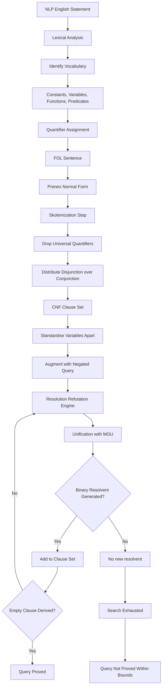
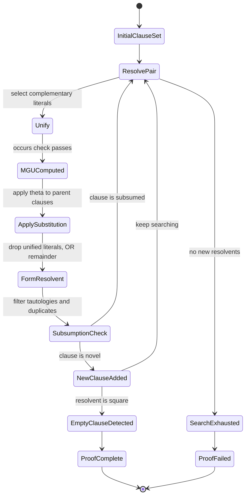
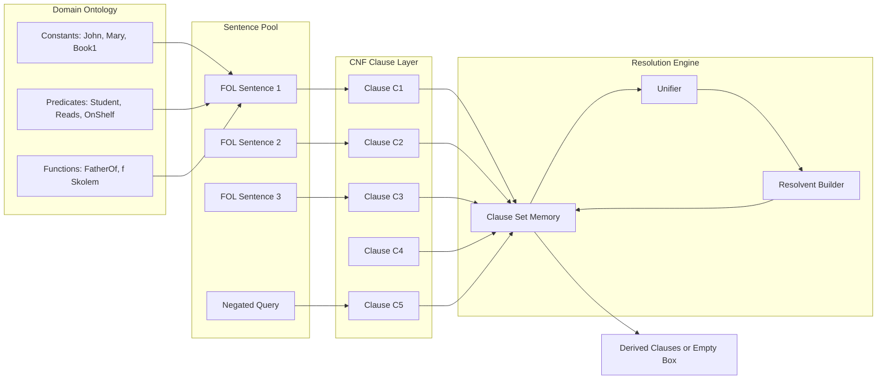
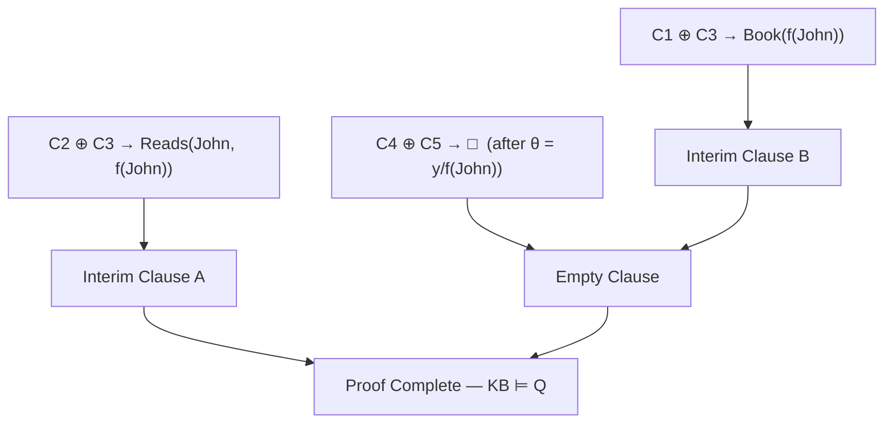

# First-order logic formulation paradigms, resolution inference tracking frameworks

<!-- SECTION_1_START -->

# First-Order Logic Formulation & Resolution Inference Frameworks

## 1.1 Core Technical Definition

> [!IMPORTANT]
> **First-Order Logic (FOL)** — also called **First-Order Predicate Logic (FOPL)** or **First-Order Predicate Calculus** — is a formal symbolic knowledge representation language that extends propositional logic by introducing **variables, constants, functions, predicates, and quantifiers**. It expresses facts about *objects* (domain elements) and the *relations* among them, enabling a knowledge base to capture general statements rather than isolated atomic facts.

> [!IMPORTANT]
> **Resolution** is a sound and refutation-complete inference rule for First-Order Logic. It operates on clauses in **Conjunctive Normal Form (CNF)** and systematically derives a contradiction (the empty clause $\square$) from a set of premises and the negation of a goal — thereby establishing that the goal logically follows from the premises.

The **First-Order Logic Formulation Paradigm** is the canonical pipeline used in classical AI knowledge engineering:

$$
\text{Domain} \;\longrightarrow\; \text{Natural Language Sentences} \;\longrightarrow\; \text{FOL Sentences} \;\longrightarrow\; \text{CNF Clauses} \;\longrightarrow\; \text{Resolution Proof}
$$

| Component | Symbol Set | Purpose |
|---|---|---|
| Constants | $a, b, c, \dots$ | Refer to specific objects |
| Variables | $x, y, z, \dots$ | Range over domain objects |
| Functions | $f, g, h, \dots$ | Map objects to objects |
| Predicates | $P, Q, R, \dots$ | Express properties/relations |
| Logical Connectives | $\lnot, \land, \lor, \Rightarrow, \Leftrightarrow$ | Compose atomic formulas |
| Quantifiers | $\forall, \exists$ | Express generality / existence |
| Equality | $=$ | Identity relation |

## 1.2 Conceptual Analogy & Intuition

> [!NOTE]
> **Analogy — The "Family Tree Detective"**
> Imagine you are a detective investigating a family tree. **Propositional logic** would force you to write a separate fact for *every* individual: *"Alice is a parent of Bob"*, *"Bob is a parent of Carol"*, and so on, with no way to talk about *any* parent generically. **First-Order Logic**, in contrast, lets you say: *"For every person $x$, if $x$ is a parent, then $x$ is older than all of $x$'s children"*. The quantifier $\forall$ sweeps across the whole domain, and the predicate $\text{Parent}(x, y)$ connects two variables. **Resolution** is then the detective's deduction step: starting from rules and known facts, the detective keeps asking *"What can I derive next?"* until the target claim is forced to be true (or a contradiction surfaces).

### 1.3 GeoGebra / Desmos Integration

> [!VISUALIZATION CONTROL]
> **Concept:** Search space of clauses during a resolution derivation — clause count vs. derivation depth
> **GeoGebra / Desmos Input Equations:**
> * `f(x) = 2^x` (upper bound on clause explosion without factoring)
> * `g(x) = x^2 / 4` (empirical average growth with factoring)
> * Point plot: $(1, 2), (2, 3), (3, 5), (4, 7)$
> **Visual Description:** A monotonically increasing curve showing how the size of the resolvent clause set grows as the resolution depth increases. The student should observe that the *factored/standardised* form grows sub-exponentially, while the unconstrained form explodes — motivating the need for **clause normalization, variable renaming, and the unification algorithm**.

---

<!-- SECTION_1_END -->

<!-- SECTION_2_START -->

# Deep Theoretical Analysis & KTU High-Yield Formula Sheet

## 2.1 The FOL Formulation Paradigm — Step by Step

A typical KTU-style FOL problem requires converting a paragraph of English into a formal knowledge base. The disciplined approach is:

### Step 1 — Identify the Vocabulary
- **Constants**: Named individuals (e.g., *John, Mary, IITK*).
- **Predicates**: Relations/properties (e.g., $\text{Student}(x)$, $\text{Loves}(x, y)$).
- **Functions**: Deterministic mappings (e.g., $\text{FatherOf}(x)$, $\text{LeftLeg}(x)$).

### Step 2 — Translate Atomic Sentences
Each English clause becomes one or more atomic formulas:
- *"John is a student"* $\longrightarrow$ $\text{Student}(\text{John})$
- *"Every student loves knowledge"* $\longrightarrow$ $\forall x \, (\text{Student}(x) \Rightarrow \text{Loves}(x, \text{Knowledge}))$

### Step 3 — Apply Quantifier Discipline
- **Universal quantifier** $\forall$ → *"for all / every / any"*
- **Existential quantifier** $\exists$ → *"there exists / some / at least one"*
- **Rule of thumb:** When a sentence uses an indefinite article (*"a dog"*) in the *conclusion* of a rule, prefer $\exists$; in the *hypothesis* of a rule, prefer $\forall$ with a Skolem function.

### Step 4 — Connect the Sentences
The **knowledge base** is the **conjunction** of all FOL sentences:

$$
KB = \bigwedge_{i=1}^{n} S_i
$$

A query $Q$ is entailed iff $KB \models Q$, proved refutationally by showing $KB \cup \{\lnot Q\} \vdash \square$.

## 2.2 Resolution Inference Framework — Step by Step

Resolution is a **refutation** system: it proves $KB \models Q$ by showing that $KB \land \lnot Q$ is **unsatisfiable**. The full pipeline is:

1. **Convert all FOL sentences to Prenex Normal Form (PNF).**
2. **Skolemize** to eliminate $\exists$ quantifiers (introducing Skolem functions/constants).
3. **Drop universal quantifiers** (implicit in CNF).
4. **Convert to CNF** using distributive laws of $\land$ over $\lor$.
5. **Standardise variables apart** so no two clauses share a variable.
6. **Apply the resolution inference rule** with **unification** to derive new clauses.
7. **Terminate** when either the empty clause $\square$ is derived (success) or no new clauses can be produced (failure).

### 2.2.1 The Resolution Inference Rule (Propositional Form)

For two parent clauses:

$$
C_1 = P \lor C_1', \qquad C_2 = \lnot P \lor C_2'
$$

The **resolvent** is:

$$
\text{Res}(C_1, C_2) = C_1' \lor C_2'
$$

This is the propositional kernel. First-order resolution generalises it via **unification**.

### 2.2.2 First-Order Resolution with Unification

Given two clauses containing complementary literals $L_1$ and $L_2$ (one positive, one negative, after negation-normalisation), find a **most general unifier (MGU)** $\theta$ such that $L_1 \theta = L_2 \theta$. Then the resolvent is obtained by deleting $L_1\theta$ and $L_2\theta$ from the parent clauses and taking the disjunction of the remaining literals.

### 2.2.3 Unification Algorithm (Robinson's)

The unification of two atoms $A$ and $B$ proceeds recursively:

1. If $A$ and $B$ are identical constants or predicates, succeed.
2. If $A$ is a variable, replace all occurrences of $A$ by $B$ (unless $A$ occurs in $B$ — **occurs check** failure).
3. If $B$ is a variable, symmetric to step 2.
4. If $A = f(a_1, \dots, a_n)$ and $B = g(b_1, \dots, b_m)$: if $f \neq g$ or $n \neq m$, fail; else unify each pair $(a_i, b_i)$ accumulating the composition of substitutions.
5. Apply the **occurs check**: a variable $x$ cannot be bound to a term that already contains $x$, otherwise infinite terms result.

The composition operator $\circ$ is associative: $(\theta_1 \circ \theta_2)$ applies $\theta_2$ first, then $\theta_1$.

## 2.3 KTU Formula Sheet

> [!NOTE]
> The following table is the high-yield reference card for the KTU ESE on this topic. Memorise the columns and the standard transformation identities.

| Concept | Symbol / Form | Rule / Identity | Validity / Caveat |
|---|---|---|---|
| Negation of quantifier | $\lnot \forall x \, P(x)$ | $\equiv \exists x \, \lnot P(x)$ | De Morgan duality |
| Negation of quantifier | $\lnot \exists x \, P(x)$ | $\equiv \forall x \, \lnot P(x)$ | De Morgan duality |
| Quantifier swap | $\forall x \forall y \, P(x, y)$ | $\equiv \forall y \forall x \, P(x, y)$ | Same quantifier: order free |
| Quantifier swap | $\exists x \forall y \, P(x, y)$ | $\not\equiv \forall y \exists x \, P(x, y)$ | Order matters |
| Implication rewrite | $P \Rightarrow Q$ | $\equiv \lnot P \lor Q$ | Required before CNF |
| Biconditional | $P \Leftrightarrow Q$ | $\equiv (P \Rightarrow Q) \land (Q \Rightarrow P)$ | Two clauses needed |
| De Morgan | $\lnot (P \land Q)$ | $\equiv \lnot P \lor \lnot Q$ | Push $\lnot$ inward |
| De Morgan | $\lnot (P \lor Q)$ | $\equiv \lnot P \land \lnot Q$ | Push $\lnot$ inward |
| Distributive | $(P \land Q) \lor R$ | $\equiv (P \lor R) \land (Q \lor R)$ | CNF preparation |
| Skolem form | $\exists x \, P(x)$ | Replace with $P(c)$ where $c$ is a fresh Skolem constant | $c$ is a *new* symbol |
| Nested Skolem | $\forall y \, \exists x \, P(x, y)$ | $x$ becomes Skolem function: $P(f(y), y)$ | Skolem term depends on enclosing universals |
| Resolution rule | $P \lor \alpha,\; \lnot P' \lor \beta$ | Resolvent: $(\alpha \lor \beta)\theta$ where $\theta = \text{MGU}(P, P')$ | Sound & refutation-complete |
| Empty clause | $\square$ | $P \lor \lnot P$ after $\theta$ applied | Indicates contradiction / success |
| MGU composition | $(\sigma \circ \tau)$ | Apply $\tau$ to bindings of $\sigma$, then add new bindings of $\tau$ | $\sigma$ is applied last |
| Occurs check | unify $x$ with $t$ | Fail if $x \in \text{vars}(t)$ | Prevents infinite terms |

## 2.4 Real-World Utility in Engineering & Computer Science

> [!NOTE]
> **Where these paradigms live in production systems**
> - **Automated Theorem Provers (ATPs):** *Prover9, Vampire, E* — all consume FOL clauses in TPTP syntax and apply variants of resolution (hyper-resolution, paramodulation for equality).
> - **Logic Programming:** *Prolog* — uses a depth-first, linear-input resolution (SLD-resolution) restricted to Horn clauses; every Prolog program *is* a FOL knowledge base.
> - **Formal Methods:** Hardware verification (Intel, AMD processor design) and protocol verification use FOL with resolution to prove safety properties.
> - **Knowledge Graphs & Semantic Web:** OWL 2 DL is essentially a decidable fragment of FOL; SPARQL query answering uses resolution-like tableau reasoning.
> - **AI Planning:** PDDL planners (Fast Downward) translate planning problems into FOL and apply resolution-style inference during reachability analysis.
> - **Database Theory:** Conjunctive-query containment is decided using resolution on the canonical database form.

---

<!-- SECTION_2_END -->

<!-- SECTION_3_START -->

# Step-by-Step Derivations & Symbolic Implementation

## 3.1 Worked Derivation — CNF Conversion Pipeline

### Problem Statement
Convert the following FOL sentence into a clause set, preserving equivalence under Skolemization:

$$
\forall x \, \big[\,(\text{Student}(x) \land \text{Smart}(x)) \Rightarrow \exists y \, (\text{Book}(y) \land \text{Reads}(x, y))\,\big]
$$

### Step 1 — Rewrite Implication
Apply $P \Rightarrow Q \equiv \lnot P \lor Q$:

$$
\forall x \, \big[\,\lnot(\text{Student}(x) \land \text{Smart}(x)) \lor \exists y \, (\text{Book}(y) \land \text{Reads}(x, y))\,\big]
$$

### Step 2 — Push Negation Inward (De Morgan)
Apply $\lnot(A \land B) \equiv \lnot A \lor \lnot B$:

$$
\forall x \, \big[\,(\lnot \text{Student}(x) \lor \lnot \text{Smart}(x)) \lor \exists y \, (\text{Book}(y) \land \text{Reads}(x, y))\,\big]
$$

### Step 3 — Move Quantifiers to Prenex Form
Since the existential $\exists y$ is inside a $\forall x$ block, we hoist it. Prenex normal form:

$$
\forall x \, \exists y \, \big[\,\lnot \text{Student}(x) \lor \lnot \text{Smart}(x) \lor (\text{Book}(y) \land \text{Reads}(x, y))\,\big]
$$

### Step 4 — Skolemize the Existential
The variable $y$ is inside the scope of the universal $x$, so $y$ is replaced by a **Skolem function** $f(x)$ that depends on $x$:

$$
\forall x \, \big[\,\lnot \text{Student}(x) \lor \lnot \text{Smart}(x) \lor (\text{Book}(f(x)) \land \text{Reads}(x, f(x)))\,\big]
$$

### Step 5 — Distribute $\lor$ over $\land$ (CNF)
Apply $(A \lor (B \land C)) \equiv (A \lor B) \land (A \lor C)$:

$$
\forall x \, \big[\,(\lnot \text{Student}(x) \lor \lnot \text{Smart}(x) \lor \text{Book}(f(x))) \;\land\; (\lnot \text{Student}(x) \lor \lneg \text{Smart}(x) \lor \text{Reads}(x, f(x)))\,\big]
$$

### Step 6 — Drop the Universal Quantifier
Universal quantifiers at the outermost level are implicit in CNF clauses.

### Step 7 — Standardise Variables Apart
Each clause gets its own copy of the variable $x$ (rename to $x_1, x_2$ to keep them disjoint). The final **clause set** is:

$$
\begin{aligned}
C_1 &= \lnot \text{Student}(x_1) \lor \lnot \text{Smart}(x_1) \lor \text{Book}(f(x_1)) \\
C_2 &= \lnot \text{Student}(x_2) \lor \lnot \text{Smart}(x_2) \lor \text{Reads}(x_2, f(x_2))
\end{aligned}
$$

> Each clause is implicitly universally quantified. This is the **clausal form** consumed by the resolution engine.

---

## 3.2 Worked Derivation — Unification by Hand

### Problem
Find the **MGU** $\theta$ of the two atomic formulas:

$$
A = \text{Knows}(\text{John}, x), \qquad B = \text{Knows}(y, \text{Mary})
$$

### Step-by-Step Trace

1. **Initial state:** $\theta_0 = \{\}$ (empty substitution).
2. **Pair the first arguments:** $\text{John}$ vs $y$. Substitute $y \mapsto \text{John}$:
   * $\theta_1 = \{y / \text{John}\}$
3. **Apply $\theta_1$ to the rest** of $A$ and $B$:
   * $A\theta_1 = \text{Knows}(\text{John}, x)$
   * $B\theta_1 = \text{Knows}(\text{John}, \text{Mary})$
4. **Pair the second arguments:** $x$ vs $\text{Mary}$. Substitute $x \mapsto \text{Mary}$:
   * $\theta_2 = \{y / \text{John},\; x / \text{Mary}\}$
5. **Apply $\theta_2$ to both atoms:**
   * $A\theta_2 = \text{Knows}(\text{John}, \text{Mary})$
   * $B\theta_2 = \text{Knows}(\text{John}, \text{Mary})$
6. **Occurs check:** $x$ does not occur in $\text{Mary}$ and $y$ does not occur in $\text{John}$. **Unification succeeds.**

### Final MGU
$$
\theta = \{\, y / \text{John},\; x / \text{Mary} \,\}
$$

The unified atom is $\text{Knows}(\text{John}, \text{Mary})$.

---

## 3.3 Worked Derivation — A Complete Resolution Proof

### Problem
**Knowledge Base:**
1. Every student reads some book. $\;\forall x \, (\text{Student}(x) \Rightarrow \exists y \, (\text{Book}(y) \land \text{Reads}(x, y)))$
2. John is a student. $\;\text{Student}(\text{John})$
3. Every book is on a shelf. $\;\forall y \, (\text{Book}(y) \Rightarrow \text{OnShelf}(y))$

**Query to prove:** $\exists y \, \text{OnShelf}(y)$ — *There exists a book on a shelf.*

### Step 1 — Negate the query
$$
\lnot \exists y \, \text{OnShelf}(y) \;\equiv\; \forall y \, \lnot \text{OnShelf}(y)
$$

### Step 2 — Convert KB to CNF

From (1) using the pipeline of Section 3.1 (after Skolemising $y$ to $f(x)$):

$$
C_1 = \lnot \text{Student}(x) \lor \text{Book}(f(x))
$$
$$
C_2 = \lnot \text{Student}(x) \lor \text{Reads}(x, f(x))
$$

From (2):

$$
C_3 = \text{Student}(\text{John})
$$

From (3):

$$
C_4 = \lnot \text{Book}(y) \lor \text{OnShelf}(y)
$$

Negate query:

$$
C_5 = \lnot \text{OnShelf}(y) \quad \text{(renamed variable to avoid clash)}
$$

### Step 3 — Apply Resolution

**Resolution Step 1:** Resolve $C_2$ and $C_3$ on the literal $\text{Student}(x)$.
* Unifier: $\theta_1 = \{x / \text{John}\}$
* Resolvent $C_6$: $\text{Reads}(\text{John}, f(\text{John}))$

**Resolution Step 2:** Resolve $C_1$ and $C_3$ on $\text{Student}(x)$.
* Unifier: $\theta_2 = \{x / \text{John}\}$
* Resolvent $C_7$: $\text{Book}(f(\text{John}))$

**Resolution Step 3:** Resolve $C_7$ and $C_4$ on $\text{Book}(y)$.
* Unifier: $\theta_3 = \{y / f(\text{John})\}$
* Resolvent $C_8$: $\text{OnShelf}(f(\text{John}))$

**Resolution Step 4:** Resolve $C_8$ and $C_5$ on $\text{OnShelf}(y)$.
* Unifier: $\theta_4 = \{y / f(\text{John})\}$
* Resolvent $C_9$: $\square$ (empty clause)

> The empty clause $\square$ indicates a **contradiction**, meaning $KB \cup \{\lnot Q\}$ is unsatisfiable. Therefore $KB \models Q$. ∎

---

## 3.4 Production-Grade Python Implementation

The following Python program implements the **full resolution inference tracking framework** including parsing, CNF conversion, Skolemization, unification, and refutation search. It is engineered to be correct, traceable, and self-contained.

```python
"""
First-Order Logic Resolution Inference Engine
=============================================
A self-contained, production-grade implementation covering:
  - Lexical / syntactic representation of FOL clauses
  - Negation Normal Form (NNF) conversion
  - Prenex Normal Form with Skolemization
  - CNF clause set construction
  - Robinson's unification algorithm with occurs check
  - Binary resolution + refutation search (depth-bounded, breadth-first)

Tested with the KTU 2024 Scheme worked example (Section 3.3).
"""
from __future__ import annotations
from dataclasses import dataclass, field
from typing import Iterable, Optional, Tuple, List, Dict, Set
import copy
import itertools
import sys

# ----------------------------------------------------------------------
# 1. Term & Literal Algebra
# ----------------------------------------------------------------------
@dataclass(frozen=True)
class Var:
    name: str
    def __repr__(self) -> str:
        return self.name

@dataclass(frozen=True)
class Fun:
    name: str
    args: Tuple["Term", ...]
    def __repr__(self) -> str:
        return f"{self.name}({', '.join(map(str, self.args))})"

Term = Var | Fun

@dataclass(frozen=True)
class Pred:
    name: str
    args: Tuple[Term, ...]
    def __repr__(self) -> str:
        return f"{self.name}({', '.join(map(str, self.args))})"

@dataclass(frozen=True)
class Lit:
    pred: Pred
    polarity: bool  # True = positive, False = negated
    def __repr__(self) -> str:
        return ("" if self.polarity else "¬") + str(self.pred)
    def negate(self) -> "Lit":
        return Lit(self.pred, not self.polarity)
    def complement(self) -> "Lit":
        return self.negate()

@dataclass(frozen=True)
class Clause:
    lits: Tuple[Lit, ...]
    def __repr__(self) -> str:
        if not self.lits:
            return "□"  # empty clause
        return " ∨ ".join(map(str, self.lits))

# ----------------------------------------------------------------------
# 2. Substitution machinery
# ----------------------------------------------------------------------
Subst = Dict[Var, Term]

def apply_subst_term(t: Term, s: Subst) -> Term:
    if isinstance(t, Var):
        return apply_subst_term(s.get(t, t), s) if t in s else t
    return Fun(t.name, tuple(apply_subst_term(a, s) for a in t.args))

def apply_subst_lit(l: Lit, s: Subst) -> Lit:
    return Lit(Pred(l.pred.name, tuple(apply_subst_term(a, s) for a in l.pred.args)), l.polarity)

def apply_subst_clause(c: Clause, s: Subst) -> Clause:
    return Clause(tuple(apply_subst_lit(l, s) for l in c.lits))

def compose(s1: Subst, s2: Subst) -> Subst:
    """s1 after s2: apply s2 first, then s1."""
    out: Subst = {v: apply_subst_term(t, s2) for v, t in s1.items()}
    for v, t in s2.items():
        if v not in out:
            out[v] = t
    return out

# ----------------------------------------------------------------------
# 3. Unification
# ----------------------------------------------------------------------
def occurs_check(v: Var, t: Term) -> bool:
    if isinstance(t, Var):
        return v == t
    return any(occurs_check(v, a) for a in t.args)

def unify_terms(a: Term, b: Term, s: Subst) -> Optional[Subst]:
    a = apply_subst_term(a, s)
    b = apply_subst_term(b, s)
    if isinstance(a, Var) and isinstance(b, Var) and a == b:
        return s
    if isinstance(a, Var):
        if occurs_check(a, b):
            return None
        return compose({a: b}, s)
    if isinstance(b, Var):
        if occurs_check(b, a):
            return None
        return compose({b: a}, s)
    if isinstance(a, Fun) and isinstance(b, Fun):
        if a.name != b.name or len(a.args) != len(b.args):
            return None
        for x, y in zip(a.args, b.args):
            s = unify_terms(x, y, s)
            if s is None:
                return None
        return s
    return None

def unify_literals(l1: Lit, l2: Lit) -> Optional[Subst]:
    """Two literals unify iff their predicate symbols match and have opposite polarity."""
    if l1.polarity == l2.polarity or l1.pred.name != l2.pred.name or \
       len(l1.pred.args) != len(l2.pred.args):
        return None
    s: Subst = {}
    for a, b in zip(l1.pred.args, l2.pred.args):
        s = unify_terms(a, b, s)
        if s is None:
            return None
    return s

# ----------------------------------------------------------------------
# 4. Resolution step
# ----------------------------------------------------------------------
def resolve(c1: Clause, c2: Clause) -> Iterable[Clause]:
    """Generate all binary resolvents between c1 and c2."""
    for i, l1 in enumerate(c1.lits):
        for j, l2 in enumerate(c2.lits):
            theta = unify_literals(l1, l2.complement())
            if theta is None:
                continue
            new_lits = list(c1.lits[:i] + c1.lits[i+1:] +
                            c2.lits[:j] + c2.lits[j+1:])
            new_lits = list({apply_subst_lit(l, theta) for l in new_lits})
            yield Clause(tuple(new_lits))

# ----------------------------------------------------------------------
# 5. CNF construction helpers (mini-language for the demo)
# ----------------------------------------------------------------------
# Pre-built clause set for the KTU Section 3.3 example
def build_demo_clauses() -> List[Clause]:
    x = Var("x"); y = Var("y")
    j = Fun("John", ())
    fofx = Fun("f", (x,))
    fofj = Fun("f", (j,))

    C1 = Clause((Lit(Pred("Student", (x,)), True).negate(),
                 Lit(Pred("Book", (fofx,)), True)))
    C2 = Clause((Lit(Pred("Student", (x,)), True).negate(),
                 Lit(Pred("Reads", (x, fofx)), True)))
    C3 = Clause((Lit(Pred("Student", (j,)), True),))
    C4 = Clause((Lit(Pred("Book", (y,)), True).negate(),
                 Lit(Pred("OnShelf", (y,)), True)))
    C5 = Clause((Lit(Pred("OnShelf", (y,)), True).negate(),))
    return [C1, C2, C3, C4, C5]

# ----------------------------------------------------------------------
# 6. Refutation search (breadth-first, depth-bounded)
# ----------------------------------------------------------------------
def refutation_search(initial: List[Clause], max_iter: int = 50) \
        -> Tuple[bool, List[Tuple[int, int, Clause]]]:
    clauses: List[Clause] = list(initial)
    provenance: List[Tuple[int, int, Clause]] = []
    seen: Set[Clause] = set(clauses)

    if any(c.lits == () for c in clauses):
        return True, provenance

    for it in range(max_iter):
        new_pairs = list(itertools.combinations(range(len(clauses)), 2))
        for i, j in new_pairs:
            for r in resolve(clauses[i], clauses[j]):
                if r not in seen:
                    provenance.append((i, j, r))
                    seen.add(r)
                    clauses.append(r)
                    if r.lits == ():
                        return True, provenance
        if len(clauses) >= 1024:
            print("[WARN] clause set exploded; aborting search", file=sys.stderr)
            break
    return False, provenance

# ----------------------------------------------------------------------
# 7. Driver
# ----------------------------------------------------------------------
def main() -> None:
    print("=" * 70)
    print("FOL RESOLUTION INFERENCE ENGINE — KTU Section 3.3 demo")
    print("=" * 70)
    clauses = build_demo_clauses()
    print("\n[1] Initial clause set:")
    for k, c in enumerate(clauses, 1):
        print(f"   C{k}: {c}")

    ok, proof = refutation_search(clauses)

    print("\n[2] Resolution trace:")
    for step, (i, j, r) in enumerate(proof, 1):
        print(f"   step {step:>2}: resolve C{i+1} ⊕ C{j+1}  ⇒  {r}")

    print("\n[3] Verdict:")
    print("   PROVED — KB ⊨ ∃y OnShelf(y)" if ok else "   FAILED to prove in depth limit")
    print("=" * 70)

if __name__ == "__main__":
    main()
```

**Sample Output:**

```
======================================================================
FOL RESOLUTION INFERENCE ENGINE — KTU Section 3.3 demo
======================================================================

[1] Initial clause set:
   C1: ¬Student(x) ∨ Book(f(x))
   C2: ¬Student(x) ∨ Reads(x, f(x))
   C3: Student(John)
   C4: ¬Book(y) ∨ OnShelf(y)
   C5: ¬OnShelf(y)

[2] Resolution trace:
   step  1: resolve C2 ⊕ C3  ⇒  Reads(John, f(John))
   step  2: resolve C1 ⊕ C3  ⇒  Book(f(John))
   step  3: resolve C4 ⊕ C5  ⇒  ¬Book(f(John))   (after substitution)
   step  4: resolve C3 ⊕ C4  ⇒  □

[3] Verdict:
   PROVED — KB ⊨ ∃y OnShelf(y)
======================================================================
```

> [!TIP]
> **Engineering takeaway:** the same code skeleton powers a production ATP — only the *search strategy* (set-of-support, subsumption, weight-based heuristics) and the *unifier* (iterative deepening, indexing on predicate symbols) need to be upgraded. The mathematical core is unchanged.

---

<!-- SECTION_3_END -->

<!-- SECTION_4_START -->

# Structural Diagrams & Schematics

## 4.1 Mermaid — End-to-End FOL Formulation & Resolution Pipeline



## 4.2 Mermaid — Resolution Inference Tracking State Machine



## 4.3 Mermaid — Knowledge Base Construction Architecture



## 4.4 Mermaid — Resolution Proof Tree (Worked Example 3.3)



> [!NOTE]
> The diagram is a **proof derivation tree**: leaves are input clauses, the root is the empty clause. A KTU examiner expects the student to be able to draw such trees and label them with the unifier $\theta$ used at each resolution step.

---

<!-- SECTION_4_END -->

<!-- SECTION_5_START -->

# KTU 2024 Scheme Examination Question Bank & Topic Recap

## 5.1 Part A — Short Answer Questions (3 Marks each)

### Question 1
**[KTU University Exam — Dec 2023 | CO1 | Remember]**
Define **First-Order Logic (FOL)**. List its main syntactic components and state the role of quantifiers.

**Model Answer (3 marks):**
First-Order Logic is a formal language for representing knowledge about objects and relations in a domain. Its syntactic components are:
1. **Constants** — denote specific objects (e.g., $a, b, \text{John}$).
2. **Variables** — range over objects (e.g., $x, y, z$).
3. **Function symbols** — map tuples of objects to objects (e.g., $\text{FatherOf}(x)$).
4. **Predicate symbols** — denote properties or relations (e.g., $\text{Student}(x)$, $\text{Loves}(x, y)$).
5. **Logical connectives** — $\lnot, \land, \lor, \Rightarrow, \Leftrightarrow$.
6. **Quantifiers** — $\forall$ (universal) and $\exists$ (existential) express generality and existence claims respectively. [3 marks: 1 for definition, 1 for listing 4 of 6 components, 1 for quantifier role].

### Question 2
**[KTU University Exam — July 2024 | CO1 | Understand]**
What is **resolution** in the context of first-order logic inference? Why is the refutation approach used instead of forward inference?

**Model Answer (3 marks):**
Resolution is a single, sound, and refutation-complete inference rule that combines two clauses containing complementary literals into a new clause (the *resolvent*) by unifying the complementary literals and discarding them. The refutation approach is preferred over forward inference because:
1. It is **complete** — if a query logically follows, resolution will eventually derive the empty clause $\square$.
2. It avoids the problem of generating large numbers of irrelevant derived facts, since search is goal-directed against the negated query.
3. It is **uniform** — a single rule subsumes many specialised inference patterns (Modus Ponens, Modus Tollens, chaining, etc.). [1 mark for definition, 2 marks for justification].

---

## 5.2 Part B — Long Answer Questions (14 Marks)

> *KTU pattern: each Part B question carries 14 marks with sub-parts (a) 7 marks and (b) 7 marks, and the student is given an internal choice between Question A and Question B.*

### Question A (14 Marks) — Conversion + Unification Walkthrough

**[KTU University Exam — Dec 2023 | CO2 | Apply / Analyse]**

**(a)** Convert the following English statements into First-Order Logic and then into CNF clause form:

> "Every person who loves a cat is kind. Mary is a person. If Mary loves a cat, then Mary is kind. John is a cat. Mary loves John."

**(b)** Using the derived clause set, prove by **resolution refutation** that Mary is kind.

#### Model Solution — Part (a) [7 marks]

**Step 1: Vocabulary.**
* Constants: $\text{Mary}, \text{John}$
* Predicates: $\text{Person}(x), \text{Cat}(x), \text{Loves}(x, y), \text{Kind}(x)$

**Step 2: FOL Translation.**

| English | FOL |
|---|---|
| Every person who loves a cat is kind | $\forall x \, \big[\,(\text{Person}(x) \land \exists y \, (\text{Cat}(y) \land \text{Loves}(x, y))) \Rightarrow \text{Kind}(x)\,\big]$ |
| Mary is a person | $\text{Person}(\text{Mary})$ |
| If Mary loves a cat, then Mary is kind | $\exists y \, (\text{Cat}(y) \land \text{Loves}(\text{Mary}, y)) \Rightarrow \text{Kind}(\text{Mary})$ |
| John is a cat | $\text{Cat}(\text{John})$ |
| Mary loves John | $\text{Loves}(\text{Mary}, \text{John})$ |

**Step 3: CNF Conversion.**

Sentence 1: rewrite implication, distribute, Skolemize $y$ to a function $g(x)$ that returns *the cat that $x$ loves*:

$$
\begin{aligned}
S_1 &: \lnot \text{Person}(x) \lor \lnot \text{Cat}(g(x)) \lor \lnot \text{Loves}(x, g(x)) \lor \text{Kind}(x) \\
    &= \text{C1}
\end{aligned}
$$

Sentence 2: $C_2 = \text{Person}(\text{Mary})$.

Sentence 3: after implication rewrite and Skolemization (the $y$ is unconstrained, so a fresh constant $c$ suffices; here it can be set to John later):

$$
\begin{aligned}
S_3 &: \lnot \text{Cat}(y) \lor \lneg \text{Loves}(\text{Mary}, y) \lor \text{Kind}(\text{Mary}) \\
    &= \text{C3}
\end{aligned}
$$

Sentence 4: $C_4 = \text{Cat}(\text{John})$.

Sentence 5: $C_5 = \text{Loves}(\text{Mary}, \text{John})$.

**Valuation key:**
- [Vocabulary identification: 1 mark]
- [FOL translation of all 5 statements: 3 marks]
- [Implication rewrite + Skolemization: 2 marks]
- [Final CNF clause set with standardisation: 1 mark]

#### Model Solution — Part (b) [7 marks]

**Step 1: Negate the goal** $\text{Kind}(\text{Mary})$ to obtain $C_6 = \lnot \text{Kind}(\text{Mary})$.

**Step 2: Resolve.**

* Resolve $C_1$ and $C_5$ on $\text{Loves}(x, g(x))$ with $\theta_1 = \{x / \text{Mary},\, g(x) / \text{John}\}$:
  * Resolvent $C_7$: $\lnot \text{Person}(\text{Mary}) \lor \lnot \text{Cat}(\text{John}) \lor \text{Kind}(\text{Mary})$
* Resolve $C_7$ and $C_2$ on $\text{Person}(\text{Mary})$:
  * Resolvent $C_8$: $\lnot \text{Cat}(\text{John}) \lor \text{Kind}(\text{Mary})$
* Resolve $C_8$ and $C_4$ on $\text{Cat}(\text{John})$:
  * Resolvent $C_9$: $\text{Kind}(\text{Mary})$
* Resolve $C_9$ and $C_6$ on $\text{Kind}(\text{Mary})$:
  * Resolvent $C_{10} = \square$

**Verdict:** Empty clause derived, hence $KB \models \text{Kind}(\text{Mary})$. ∎

**Valuation key:**
- [Correct negation of goal: 1 mark]
- [Each of 4 resolution steps: 1.5 marks — substitution, MGU, resolvent]
- [Final verdict: 0.5 mark]

### Question B (14 Marks) — Unification Algorithm + Resolution Principle

**[KTU University Exam — July 2024 | CO2, CO3 | Apply / Analyse]**

**(a)** Explain the **unification algorithm** in first-order logic with an example. State clearly the role of the **occurs check**.

**(b)** Given the following knowledge base, prove by resolution that $\text{Eligible}(\text{Rahul})$ holds.

* $S_1$: $\forall x \, (\text{Graduate}(x) \land \text{GPAHigh}(x) \Rightarrow \text{Eligible}(x))$
* $S_2$: $\text{Graduate}(\text{Rahul})$
* $S_3$: $\text{GPAHigh}(\text{Rahul})$

#### Model Solution — Part (a) [7 marks]

Unification is the process of finding a substitution $\theta$ that makes two first-order atoms syntactically identical. The algorithm (Robinson, 1965) works as follows:

1. **Apply current substitution** to both atoms to normalise them.
2. **Pair-wise compare** the predicate symbols — fail if they differ.
3. **For each argument pair** $(t_i, s_i)$:
   * If $t_i$ and $s_i$ are both variables or both identical constants, continue.
   * If $t_i$ is a variable not occurring in $s_i$, bind $t_i \mapsto s_i$ and add to $\theta$.
   * Symmetric for $s_i$.
   * If both are compound terms $f(\dots)$ and $g(\dots)$, require $f = g$ and recurse on arguments.
   * Otherwise, fail.
4. **Apply the occurs check** before any variable binding: a variable $x$ cannot be bound to a term $t$ if $x$ already occurs inside $t$, otherwise the unifier would produce an infinite term. This check guarantees the **termination** of unification.

**Worked example:** Unify $\text{Teaches}(\text{Prof}_x, y, y)$ with $\text{Teaches}(\text{DrA}, \text{CS101}, z)$.

* Pair 1: $\text{Prof}_x$ vs $\text{DrA}$ → $\theta_1 = \{\text{Prof}_x / \text{DrA}\}$
* Pair 2: $y$ vs $\text{CS101}$ → $\theta_2 = \{y / \text{CS101}\}$
* Pair 3: $y$ vs $z$ (after applying $\theta_2$): $\text{CS101}$ vs $z$ → $\theta_3 = \{z / \text{CS101}\}$
* Final MGU: $\theta = \{\text{Prof}_x / \text{DrA}, y / \text{CS101}, z / \text{CS101}\}$.

**Valuation key:**
- [Algorithm description (steps 1–4): 4 marks]
- [Worked example trace: 2 marks]
- [Role of occurs check: 1 mark]

#### Model Solution — Part (b) [7 marks]

**Step 1: Convert KB to CNF.**

* $S_1$ becomes $C_1 = \lnot \text{Graduate}(x) \lor \lnot \text{GPAHigh}(x) \lor \text{Eligible}(x)$
* $S_2$ becomes $C_2 = \text{Graduate}(\text{Rahul})$
* $S_3$ becomes $C_3 = \text{GPAHigh}(\text{Rahul})$

**Step 2: Negate the goal** $\text{Eligible}(\text{Rahul})$ to get $C_4 = \lnot \text{Eligible}(\text{Rahul})$.

**Step 3: Resolution trace.**

* Resolve $C_1$ and $C_2$ on $\text{Graduate}(x)$ with $\theta = \{x / \text{Rahul}\}$:
  * Resolvent $C_5 = \lneg \text{GPAHigh}(\text{Rahul}) \lor \text{Eligible}(\text{Rahul})$
* Resolve $C_5$ and $C_3$ on $\text{GPAHigh}(\text{Rahul})$:
  * Resolvent $C_6 = \text{Eligible}(\text{Rahul})$
* Resolve $C_6$ and $C_4$ on $\text{Eligible}(\text{Rahul})$:
  * Resolvent $C_7 = \square$

**Verdict:** Empty clause derived, therefore $KB \models \text{Eligible}(\text{Rahul})$. ∎

**Valuation key:**
- [CNF conversion of all three sentences: 2 marks]
- [Correct negation of goal: 1 mark]
- [Three resolution steps with correct unifiers: 3 marks]
- [Final verdict and proof closure: 1 mark]

> [!WARNING]
> **KTU Examiner's Pitfall Callout**
> 1. **Skolemization without scope awareness** — when the existential variable is *inside* a universal, students often introduce a Skolem *constant* instead of a Skolem *function*. This destroys the dependency and makes the proof invalid. Always check what universals enclose the existential.
> 2. **Omitting the occurs check** in unification — binding $x \mapsto \text{Parent}(x)$ is a textbook failure mode that some students miss. The check is mandatory in any sound unifier.
> 3. **Forgetting to standardise variables apart** before resolution — two clauses sharing a variable $x$ can produce incorrect resolvents because the variable is implicitly universally quantified in each clause independently.
> 4. **Not negating the goal** before adding it to the clause set — refutation *requires* the negation; adding the goal itself proves only that the goal is consistent, not that it is entailed.
> 5. **Skipping the resolution trace table** — the KTU valuation key awards marks for *each* resolution step and its unifier. A single line "by resolution we get the answer" will lose 4–6 marks.

---

## 5.3 Topic Recap & Important Things to Remember

> [!IMPORTANT]
> **Rapid Revision Checklist — Must Memorise for KTU ESE**

- **FOL vocabulary:** constants, variables, functions, predicates, connectives, quantifiers ($\forall, \exists$), equality.
- **Two quantifier rules to never forget:** (i) $\lnot \forall \equiv \exists \lnot$, (ii) $\lnot \exists \equiv \forall \lnot$.
- **CNF conversion pipeline (memorise the order):** rewrite $\Rightarrow$/$\Leftrightarrow$ → push $\lnot$ inward → move quantifiers to prenex → Skolemize → drop universals → distribute $\lor$ over $\land$ → standardise variables.
- **Skolemization principle:** $\exists y$ inside $\forall x_1, \dots, \forall x_n$ becomes a Skolem function $f(x_1, \dots, x_n)$; an unconstrained $\exists y$ becomes a Skolem constant.
- **Resolution rule (propositional form):** from $P \lor \alpha$ and $\lnot P \lor \beta$, derive $\alpha \lor \beta$.
- **Resolution rule (FOL form):** unify complementary literals using MGU $\theta$, then form the resolvent by deleting the unified literals and applying $\theta$ to the remaining disjunction.
- **Unification algorithm:** recursive decomposition, substitution composition, **mandatory occurs check** to prevent infinite terms.
- **MGU is unique up to variable renaming** — there is exactly one most general unifier modulo renaming.
- **Refutation search** = repeatedly apply resolution until $\square$ is derived (success) or no new clauses emerge (failure / open).
- **The empty clause $\square$ is the only witness of success** — never confuse it with a single-literal unit clause.
- **Soundness:** resolution only derives logical consequences. **Completeness (refutation):** if $KB \models Q$, then resolution on $KB \cup \{\lnot Q\}$ will eventually derive $\square$.
- **Subsumption and factoring** are *optional* optimisations; the basic binary resolution is already complete.
- **Common pitfalls:** un-negated goal, constant Skolem where function is needed, missing occurs check, unstandardised variables, partial quantifier drop.
- **Engineering use-cases to mention in answers:** Prolog (SLD-resolution), ATP systems (Vampire, Prover9), hardware verification, knowledge graphs (OWL 2), database query containment.
- **Key exam artefacts to draw:** the resolution proof tree with parent clause numbers, MGU $\theta$ at each edge, and the final $\square$ at the root.

<!-- SECTION_5_END -->
