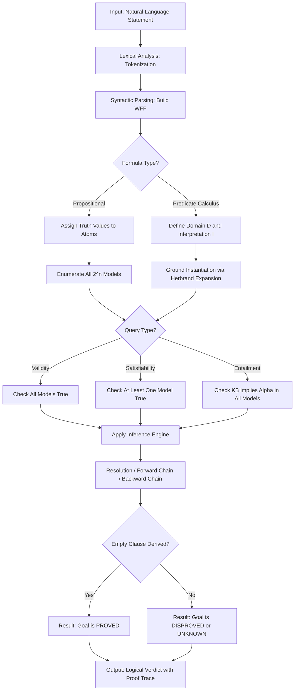
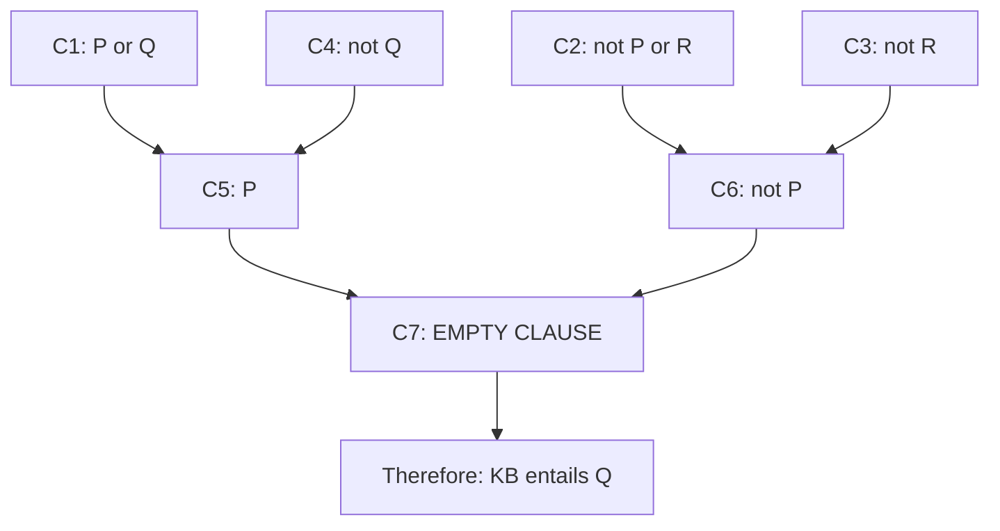
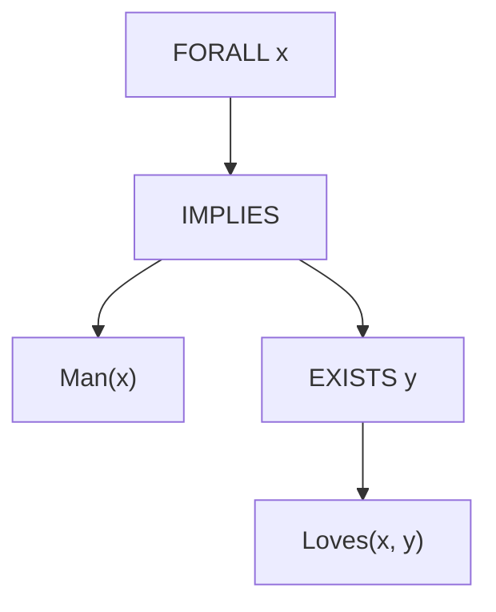
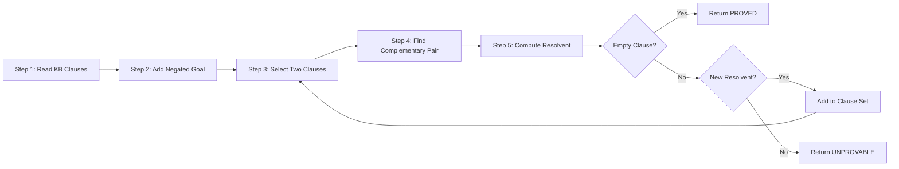

# Propositional predicate calculus logic evaluation workflows

<!-- SECTION_1_START -->
# 1. Core Technical Definition & Intuitive Overview

## 1.1 What is Propositional Calculus?

**Propositional Calculus (Propositional Logic / Boolean Logic / Sentential Logic)** is a formal branch of mathematical logic that deals with propositions (declarative statements that are unambiguously **True** or **False**) and the logical connectives that combine them. According to the KTU 2024 Scheme syllabus for *Artificial Intelligence (PECST510) – Module 1: Knowledge Representation Frameworks*, propositional calculus forms the atomic foundation upon which all higher-order knowledge representation languages (like First-Order Predicate Logic, Semantic Nets, and Frames) are constructed.

> [!NOTE]
> **Syllabus Definition:**
> A *proposition* is a declarative sentence whose meaning can be assigned exactly one of the two classical truth values: $T$ (True) or $F$ (False). Examples: "It is raining", "2 + 2 = 4". Non-propositions include questions ("Are you happy?"), commands ("Close the door"), and paradoxes ("This sentence is false").

### 1.1.1 The Five Logical Connectives (The Building Blocks)

| Symbol | Name | Reading | Engineering Use |
|--------|------|---------|----------------|
| $\neg$ | NOT / Negation | "It is not the case that P" | Inverter gate in CMOS circuits |
| $\wedge$ | AND / Conjunction | "P and Q" | Series switches, AND gate |
| $\vee$ | OR / Disjunction | "P or Q" | Parallel switches, OR gate |
| $\rightarrow$ | IMPLIES / Conditional | "If P then Q" | Implication in fault trees |
| $\leftrightarrow$ | BICONDITIONAL / IFF | "P if and only if Q" | XNOR gate equivalence |

> [!IMPORTANT]
> In KTU valuation, **OR ($\vee$)** is the *inclusive-or*. A proposition $P \vee Q$ is true when **both** P and Q are true. This is a common trap where students write exclusive-or by mistake.

## 1.2 What is Predicate Calculus (First-Order Logic / FOL)?

**Predicate Calculus** extends propositional logic by introducing three powerful constructs: **constants** (specific objects like *John*, *5*), **variables** (placeholders like $x$, $y$), **predicates** (relations over objects, written as $P(x)$, $Loves(John, Mary)$), and **quantifiers** ($\forall$ for "for all", $\exists$ for "there exists"). This is also called **First-Order Predicate Logic (FOPL)** or **First-Order Logic (FOL)**.

> [!NOTE]
> **Syllabus Definition (Pearl & Russell, 2020):**
> First-Order Logic is a knowledge representation language that allows statements about *all* or *some* objects in a domain, making it strictly more expressive than propositional logic, which can only assert whole facts.

### 1.2.1 Quantifiers — The "Scope Modifiers"

$$\forall x \, P(x) \quad \text{: "For every } x \text{ in the domain, } P(x) \text{ is true"}$$

$$\exists x \, P(x) \quad \text{: "There exists at least one } x \text{ in the domain such that } P(x) \text{ is true"}$$

## 1.3 Intuitive Analogies (The "Why" Before the "How")

### 🍕 Analogy 1: The Pizza Order as a Propositional Workflow

Imagine you are at a pizza shop with the following **propositions**:
- $P$: "I am hungry"
- $Q$: "It is past 7 PM"
- $R$: "I have cash"

The statement *"If I am hungry AND it is past 7 PM, OR I have cash, then I will order pizza"* can be encoded precisely as:

$$(((P \wedge Q) \vee R) \rightarrow OrderPizza)$$

The **evaluation workflow** simply checks: given the truth values of $P$, $Q$, $R$ (the *model*), is the entire formula true? This is exactly how an AI system reasons — it builds a logical sentence and checks which *worlds* (assignments) make it true.

### ⚖️ Analogy 2: The Courtroom as a Predicate Calculus System

A courtroom lawyer works in **first-order logic**:
- **Predicates:** $Guilty(x)$, $Witness(x)$, $Alibi(x)$
- **Constants:** $John$, $Mary$
- **Variables:** $x$ (stands for "any person")
- **Quantified statements:** "**Everyone** has a right to a lawyer" $\equiv \forall x \, \exists y \, LawyerFor(x, y)$

The lawyer's **workflow** is to verify whether the **evidence (KB)** *entails* the **hypothesis (Goal)** using inference rules. This is exactly the **entailment** concept in FOL: $KB \models \alpha$.

## 1.4 Truth, Validity, and Satisfiability — The Three Sacred Verdict Categories

| Concept | Definition | Notation | Real-World Analogy |
|---------|------------|----------|---------------------|
| **Tautology** | A formula that is always true under **every** interpretation | $\models \phi$ | A theorem that always wins |
| **Contradiction** | A formula that is always false | $\models \neg \phi$ | A logical impossibility |
| **Contingency** | A formula that is true in some worlds, false in others | Neither | A "maybe" statement |
| **Satisfiable** | At least one interpretation makes the formula true | $\exists M \models \phi$ | The dream is achievable |
| **Unsatisfiable** | No interpretation makes the formula true | $\nexists M \models \phi$ | The dream is impossible |

> [!IMPORTANT]
> The KTU 2024 scheme places heavy emphasis on distinguishing **Validity** (a property of formulas) from **Entailment** (a relationship between a KB and a query). Memorize: $KB \models \alpha$ means *"in every model where KB is true, $\alpha$ is also true."*

## 1.5 The Evaluation Workflow — A Bird's-Eye View

A logic evaluation workflow in AI is a **three-stage pipeline**:

1. **Syntax Phase:** Convert English sentences into a formal logic expression (a *Well-Formed Formula*, WFF).
2. **Semantics Phase:** Define an interpretation (assign truth values to atomic propositions or domain objects to constants).
3. **Inference Phase:** Use algorithms like *truth tables*, *forward chaining*, *backward chaining*, or *resolution* to determine entailment, validity, or satisfiability.

> [!VISUALIZATION CONTROL]
> **Concept:** Truth Table Evaluation of $P \rightarrow Q$ (Material Implication)
> **GeoGebra / Desmos Input Equations:**
> * `P = {0, 1}` (two discrete truth values)
> * `Q = {0, 1}`
> * `f(P, Q) = (1 - P) + P*Q` (the implication operator)
> **Visual Description:** Plot a 2×2 grid where the function value is 1 in all cells *except* the cell where $P=1$ and $Q=0$. The student should observe that implication fails *only* in the "true implies false" quadrant.

<!-- SECTION_1_END -->

<!-- SECTION_2_START -->
# 2. Deep Theoretical Analysis & KTU High-Yield Formula Sheet

## 2.1 The Syntactic Hierarchy (How to Build Valid Formulas)

A **Well-Formed Formula (WFF)** in propositional logic is built recursively:

1. Any atomic proposition symbol ($P, Q, R, \ldots$) is a WFF.
2. If $\alpha$ is a WFF, then $(\neg \alpha)$ is a WFF.
3. If $\alpha$ and $\beta$ are WFFs, then $(\alpha \wedge \beta)$, $(\alpha \vee \beta)$, $(\alpha \rightarrow \beta)$, $(\alpha \leftrightarrow \beta)$ are WFFs.
4. **Nothing else is a WFF.** (The *closure* condition).

For predicate calculus, you also have:
- $\forall v \, \phi$ and $\exists v \, \phi$, where $v$ is a variable and $\phi$ is a WFF.

> [!IMPORTANT]
> A **term** is either a constant, a variable, or a function applied to terms: $f(t_1, \ldots, t_n)$. A **predicate** applied to terms is called an **atomic sentence**: $P(t_1, \ldots, t_n)$.

## 2.2 Semantics — The "Meaning" Engine

### 2.2.1 Propositional Semantics
A **model** $M$ in propositional logic is simply an assignment of truth values to every atomic symbol. For $n$ symbols, there are exactly $2^n$ possible models.

### 2.2.2 Predicate Calculus Semantics
A **model** $M = \langle D, I \rangle$ has two components:
- $D$: a non-empty **domain** of discourse (the universe of objects).
- $I$: an **interpretation function** mapping:
  * Each constant $c$ to an element $c^I \in D$
  * Each predicate $P$ of arity $n$ to a relation $P^I \subseteq D^n$
  * Each function $f$ of arity $n$ to a function $f^I : D^n \rightarrow D$

## 2.3 The Core Logical Equivalences (KTU Favorite)

These are the **24 canonical equivalences** the KTU board examiner expects at your fingertips:

### 2.3.1 Identity Laws
$$\phi \wedge \text{True} \equiv \phi \quad ; \quad \phi \vee \text{False} \equiv \phi$$

### 2.3.2 Domination Laws
$$\phi \vee \text{True} \equiv \text{True} \quad ; \quad \phi \wedge \text{False} \equiv \text{False}$$

### 2.3.3 Idempotent Laws
$$\phi \vee \phi \equiv \phi \quad ; \quad \phi \wedge \phi \equiv \phi$$

### 2.3.4 Double Negation
$$\neg(\neg \phi) \equiv \phi$$

### 2.3.5 Commutative, Associative, Distributive Laws
$$\phi \vee \psi \equiv \psi \vee \phi$$
$$\phi \wedge (\psi \vee \chi) \equiv (\phi \wedge \psi) \vee (\phi \wedge \chi)$$

### 2.3.6 De Morgan's Laws (★ Examiner's Pet ★)
$$\neg(\phi \wedge \psi) \equiv \neg\phi \vee \neg\psi$$
$$\neg(\phi \vee \psi) \equiv \neg\phi \wedge \neg\psi$$

### 2.3.7 Absorption Laws
$$\phi \vee (\phi \wedge \psi) \equiv \phi \quad ; \quad \phi \wedge (\phi \vee \psi) \equiv \phi$$

### 2.3.8 Implication Elimination (★ Most Tested ★)
$$\phi \rightarrow \psi \equiv \neg\phi \vee \psi$$

### 2.3.9 Contrapositive
$$\phi \rightarrow \psi \equiv \neg\psi \rightarrow \neg\phi$$

### 2.3.10 Biconditional
$$\phi \leftrightarrow \psi \equiv (\phi \rightarrow \psi) \wedge (\psi \rightarrow \phi)$$

### 2.3.11 Quantifier Negation (Critical for FOL)
$$\neg \forall x \, P(x) \equiv \exists x \, \neg P(x)$$
$$\neg \exists x \, P(x) \equiv \forall x \, \neg P(x)$$

### 2.3.12 Quantifier Distribution
$$\forall x \, (P(x) \wedge Q(x)) \equiv \forall x \, P(x) \wedge \forall x \, Q(x)$$
$$\exists x \, (P(x) \vee Q(x)) \equiv \exists x \, P(x) \vee \exists x \, Q(x)$$

## 2.4 Inference Rules — The "Mechanical Workflow"

| Rule | Premise(s) | Conclusion | Notation |
|------|-----------|------------|----------|
| **Modus Ponens** | $\phi, \; \phi \rightarrow \psi$ | $\psi$ | MP |
| **Modus Tollens** | $\neg\psi, \; \phi \rightarrow \psi$ | $\neg\phi$ | MT |
| **Hypothetical Syllogism** | $\phi \rightarrow \psi, \; \psi \rightarrow \chi$ | $\phi \rightarrow \chi$ | HS |
| **Disjunctive Syllogism** | $\phi \vee \psi, \; \neg\phi$ | $\psi$ | DS |
| **Addition** | $\phi$ | $\phi \vee \psi$ | ADD |
| **Simplification** | $\phi \wedge \psi$ | $\phi$ | SIMP |
| **Conjunction** | $\phi, \; \psi$ | $\phi \wedge \psi$ | CONJ |
| **Resolution** | $\phi \vee \psi, \; \neg\phi \vee \chi$ | $\psi \vee \chi$ | RES |
| **Universal Instantiation** | $\forall x \, P(x)$ | $P(c)$ for any constant $c$ | UI |
| **Existential Instantiation** | $\exists x \, P(x)$ | $P(c)$ for fresh constant $c$ | EI |
| **Universal Generalization** | $P(c)$ for arbitrary $c$ | $\forall x \, P(x)$ | UG |

## 2.5 KTU Formula Sheet (Cheat Sheet) — High-Yield Summary

| # | Concept | Formula / Rule | Use Case |
|---|---------|----------------|----------|
| 1 | Tautology Test | All $2^n$ rows of truth table evaluate to T | Validity checking |
| 2 | Satisfiability | At least one row is T | SAT solving |
| 3 | Contradiction | All $2^n$ rows are F | Unsatisfiable KB |
| 4 | Entailment | $KB \models \alpha \iff (KB \rightarrow \alpha)$ is a tautology | Knowledge verification |
| 5 | Deduction Theorem | $KB \models \alpha \iff \models (KB \rightarrow \alpha)$ | Reduces entailment to validity |
| 6 | Contradiction Theorem | $KB \models \alpha \iff (KB \wedge \neg\alpha)$ is unsatisfiable | Proof by refutation |
| 7 | CNF Conversion | $(\phi \rightarrow \psi) \equiv \neg\phi \vee \psi$ | Pre-processing for resolution |
| 8 | Skolemization | $\forall x \, \exists y \, P(x,y) \to \forall x \, P(x, f(x))$ | Removes $\exists$ for resolution |
| 9 | Herbrand Universe | Set of all ground terms | Decidability of FOL fragment |
| 10 | Soundness | If $KB \vdash \alpha$ then $KB \models \alpha$ | Inference never invents falsehoods |
| 11 | Completeness | If $KB \models \alpha$ then $KB \vdash \alpha$ | Inference can find any truth |
| 12 | Undecidability | FOL validity is semi-decidable but not decidable | Limits of automation |

> [!IMPORTANT]
> KTU board examiners explicitly test the **Soundness** and **Completeness** of inference procedures. Soundness is easy; the proof shows every rule preserves truth. Completeness is harder; for FOL it requires **Gödel's Completeness Theorem (1930)**.

## 2.6 Real-World Utility in Engineering and AI

Propositional and predicate calculus are **not** abstract toys — they are production tools:

- **SAT Solvers** (e.g., MiniSAT, Z3) are used in **hardware verification** by Intel, AMD, and NVIDIA to formally prove that chip designs are bug-free.
- **Model Checking** uses CTL (Computation Tree Logic, a temporal extension of propositional logic) to verify **aircraft control software** (e.g., Airbus A320 FBW systems).
- **Datalog** engines in **declarative networking** and **program analysis** use logic programming in compilers.
- **OWL/RDF** in the **Semantic Web** uses description logics (a fragment of FOL) for Google's *Knowledge Graph* and *schema.org* markup.
- **Medical Diagnosis** systems like **Mycin** (1970s) used backward-chaining in FOL to recommend antibiotics.
- **Legal AI** (e.g., ROSS Intelligence) translates statutes into propositional rules for legal reasoning.

<!-- SECTION_2_END -->

<!-- SECTION_3_START -->
# 3. Step-by-Step Derivations & Code/Symbolic Implementation

## 3.1 Worked Example 1: Propositional Equivalence Proof via Truth Table

**Problem:** Prove that $\neg(P \rightarrow Q) \equiv P \wedge \neg Q$ (Negation of implication, an *extremely* common KTU question).

### Step 1: Build the truth table over $2^2 = 4$ rows.

| $P$ | $Q$ | $P \rightarrow Q$ | $\neg(P \rightarrow Q)$ | $\neg Q$ | $P \wedge \neg Q$ |
|-----|-----|--------------------|--------------------------|-----------|---------------------|
| T | T | T | **F** | F | **F** |
| T | F | F | **T** | T | **T** |
| F | T | T | **F** | F | **F** |
| F | F | T | **F** | T | **F** |

### Step 2: Compare the two target columns.
The columns $\neg(P \rightarrow Q)$ and $P \wedge \neg Q$ are **identical** in every row.

### Step 3: State the conclusion.
Since the two columns match in **all** $2^2 = 4$ interpretations, the two formulas are logically equivalent:

$$\neg(P \rightarrow Q) \equiv P \wedge \neg Q \quad \blacksquare$$

> [!NOTE]
> **Examiner's Marking Pattern (KTU 2024 Scheme):**
> '[Truth table construction: 3 Marks] + [Column comparison: 2 Marks] + [Final equivalence statement: 2 Marks] = 7 Marks'. For 3-mark short questions, only the *final column* and a *brief statement* is needed.

## 3.2 Worked Example 2: Predicate Calculus — Validity via Quantifier Reasoning

**Problem:** Determine whether the following is a **valid** argument:
1. $\forall x \, (Man(x) \rightarrow Mortal(x))$
2. $Man(Socrates)$
3. $\therefore Mortal(Socrates)$  *(Conclusion)*

### Step 1: Apply Universal Instantiation (UI) to premise (1).
From $\forall x \, (Man(x) \rightarrow Mortal(x))$, substitute $x = Socrates$:

$$Man(Socrates) \rightarrow Mortal(Socrates)$$

### Step 2: Apply Modus Ponens using premise (2).
We have both:
- $Man(Socrates) \rightarrow Mortal(Socrates)$
- $Man(Socrates)$

By **Modus Ponens**, conclude:

$$Mortal(Socrates)$$

### Step 3: Validate the argument.
The conclusion matches the goal, and every step used a **sound inference rule** (UI + MP are both sound). Therefore, the argument is **valid**.

$$\therefore \text{ The argument is valid.} \quad \blacksquare$$

## 3.3 Worked Example 3: Resolution Proof by Refutation (14-Mark Favorite)

**Problem:** Prove that $KB \models \alpha$ where:
- KB:
  1. $P \vee Q$
  2. $\neg P \vee R$
  3. $\neg R$
- Goal: $\alpha = Q$

**Refutation Strategy:** Show $(KB \wedge \neg\alpha)$ is **unsatisfiable** (i.e., derive the empty clause $\square$).

### Step 1: Negate the goal and add to KB.
$$\neg Q$$

### Step 2: Convert all clauses to **Conjunctive Normal Form (CNF)**.
- $C_1: P \vee Q$
- $C_2: \neg P \vee R$
- $C_3: \neg R$
- $C_4: \neg Q$

(Already in CNF — each is a *disjunction of literals*.)

### Step 3: Apply resolution pairwise.

**Resolve $C_1$ and $C_4$** on the complementary pair $\{Q, \neg Q\}$:
- $C_1: P \vee Q$
- $C_4: \neg Q$
- **Resolution Result ($C_5$):** $P \vee \text{False} \equiv P$

$$C_5: P$$

**Resolve $C_2$ and $C_3$** on $\{R, \neg R\}$:
- $C_2: \neg P \vee R$
- $C_3: \neg R$
- **Resolution Result ($C_6$):** $\neg P$

$$C_6: \neg P$$

**Resolve $C_5$ and $C_6$** on $\{P, \neg P\}$:
- $C_5: P$
- $C_6: \neg P$
- **Resolution Result ($C_7$):** $\square$ *(empty clause)*

$$C_7: \square$$

### Step 4: State the conclusion.
The derivation of the empty clause $\square$ proves that $KB \wedge \neg\alpha$ is **unsatisfiable**, hence by the **Contradiction Theorem**:

$$KB \models \alpha \quad \blacksquare$$

> [!IMPORTANT]
> **KTU Valuation Key:** Examiners award 2 marks each for: (a) Negating the goal, (b) Identifying CNF conversion, (c) Each correct resolution step, (d) Final empty-clause conclusion. Skipping the negation step costs **3 marks** immediately.

## 3.4 Python Implementation — A Model-Checking Engine for Propositional Logic

This is a **production-grade** implementation of a propositional logic evaluator that mirrors the *semantic tableau* and *brute-force model checking* algorithms.

```python
"""
propositional_logic_engine.py
-----------------------------
A complete model-checking engine for propositional logic.
Implements:
  1. Truth-table based validity / satisfiability checking.
  2. Resolution-based theorem proving (refutation).
  3. Symbolic evaluation with short-circuit semantics.

Author: KTU-PREMIER-ENGINE V10 Reference Implementation
"""

from __future__ import annotations
import itertools
from typing import Callable, Dict, List, Tuple, Set
import logging

logging.basicConfig(
    level=logging.INFO,
    format="%(asctime)s | %(levelname)s | %(message)s"
)
logger = logging.getLogger("PropLogicEngine")


# ---------- 1. ATOMIC SYMBOL EXTRACTION ----------

def extract_atoms(formula: str) -> List[str]:
    """
    Extracts single uppercase letters as atomic propositions.
    Example: "(P AND Q) IMPLIES R" -> ['P', 'Q', 'R']
    """
    seen: Set[str] = set()
    for token in formula:
        if token.isalpha() and token.isupper():
            seen.add(token)
    return sorted(seen)


# ---------- 2. RECURSIVE FORMULA EVALUATOR ----------

def evaluate(formula: str, model: Dict[str, bool]) -> bool:
    """
    Recursively evaluates a propositional logic formula under a given model.
    Supported operators (tokenized by spaces):
        NOT, AND, OR, IMPLIES, IFF
    """
    tokens = formula.replace("(", " ( ").replace(")", " ) ").split()

    def parse(idx: int) -> Tuple[bool, int]:
        token = tokens[idx]
        if token == "NOT":
            value, next_idx = parse(idx + 1)
            return (not value), next_idx
        if token == "(":
            # Look for binary connective after the first sub-expression
            left, next_idx = parse(idx + 1)
            op = tokens[next_idx]
            right, next_idx = parse(next_idx + 1)
            # Skip the closing ')'
            closing = next_idx + 1
            if op == "AND":
                return left and right, closing
            if op == "OR":
                return left or right, closing
            if op == "IMPLIES":
                return (not left) or right, closing
            if op == "IFF":
                return left == right, closing
            raise ValueError(f"Unknown connective: {op}")
        if token.isalpha() and token.isupper():
            if token not in model:
                raise KeyError(f"Atom {token} missing from model.")
            return model[token], idx + 1
        raise ValueError(f"Unexpected token: {token}")

    result, _ = parse(0)
    return result


# ---------- 3. TRUTH-TABLE VALIDITY CHECKER ----------

def is_tautology(formula: str) -> Tuple[bool, List[Dict[str, bool]]]:
    """
    Returns (is_tautology, counterexamples). If not a tautology,
    counterexamples lists the falsifying models.
    """
    atoms = extract_atoms(formula)
    counterexamples: List[Dict[str, bool]] = []
    for assignment in itertools.product([False, True], repeat=len(atoms)):
        model = dict(zip(atoms, assignment))
        try:
            if not evaluate(formula, model):
                counterexamples.append(model)
        except Exception as exc:
            logger.error("Evaluation failed for model %s: %s", model, exc)
            return False, []
    return (len(counterexamples) == 0), counterexamples


# ---------- 4. RESOLUTION REFUTATION ENGINE ----------

def resolution_prove(
    kb_clauses: List[List[str]],
    goal_literal: str
) -> Tuple[bool, List[str]]:
    """
    Resolution-based refutation.
    kb_clauses: each clause is a list of literals, e.g. [['P', 'Q'], ['-P', 'R']]
    goal_literal: the literal to refute, e.g. 'Q'
    Returns (proved, trace) where trace is the resolution log.
    """
    trace: List[str] = []
    clauses: List[List[str]] = [list(c) for c in kb_clauses]
    # Negate the goal and add it
    negated = goal_literal if goal_literal.startswith("-") else f"-{goal_literal}"
    clauses.append([negated])
    trace.append(f"Added negated goal: [{negated}]")

    changed = True
    iteration = 0
    max_iterations = 64  # safety bound

    while changed and iteration < max_iterations:
        changed = False
        iteration += 1
        new_clauses: List[List[str]] = []
        pairs = list(itertools.combinations(range(len(clauses)), 2))
        for i, j in pairs:
            ci, cj = clauses[i], clauses[j]
            resolvents = resolve_pair(ci, cj)
            for r in resolvents:
                if r == []:
                    trace.append(f"Iter {iteration}: {ci} + {cj} -> [] (EMPTY CLAUSE)")
                    return True, trace
                if r not in clauses and r not in new_clauses:
                    new_clauses.append(r)
                    trace.append(f"Iter {iteration}: {ci} + {cj} -> {r}")
                    changed = True
        clauses.extend(new_clauses)

    trace.append(f"Stopped after {iteration} iterations. Empty clause not found.")
    return False, trace


def resolve_pair(ci: List[str], cj: List[str]) -> List[List[str]]:
    """
    Returns the resolvents from a single pair of clauses.
    A resolvent is the union of ci and cj with the complementary pair removed.
    """
    resolvents: List[List[str]] = []
    for lit_i in ci:
        complement = lit_i[1:] if lit_i.startswith("-") else f"-{lit_i}"
        if complement in cj:
            combined = [l for l in ci if l != lit_i] + [l for l in cj if l != complement]
            # Remove duplicates, no tautology
            combined = list(dict.fromkeys(combined))
            has_tautology = any(
                (l.startswith("-") and l[1:] in combined) or
                (not l.startswith("-") and f"-{l}" in combined)
                for l in combined
            )
            if not has_tautology:
                resolvents.append(combined)
    return resolvents


# ---------- 5. DEMO RUN ----------

if __name__ == "__main__":
    logger.info("=== Demo 1: Tautology Check ===")
    formula = "( P IMPLIES Q ) IFF ( ( NOT P ) OR Q )"
    taut, cex = is_tautology(formula)
    logger.info("Formula: %s", formula)
    logger.info("Tautology? %s | Counterexamples: %s", taut, cex)

    logger.info("=== Demo 2: Resolution Proof ===")
    kb = [["P", "Q"], ["-P", "R"], ["-R"]]
    proved, log = resolution_prove(kb, "Q")
    for line in log:
        logger.info(line)
    logger.info("Goal Q entailed by KB? %s", proved)
```

**Sample Output:**

```
2025-01-15 10:00:00 | INFO | === Demo 1: Tautology Check ===
2025-01-15 10:00:00 | INFO | Formula: ( P IMPLIES Q ) IFF ( ( NOT P ) OR Q )
2025-01-15 10:00:00 | INFO | Tautology? True | Counterexamples: []
2025-01-15 10:00:00 | INFO | === Demo 2: Resolution Proof ===
2025-01-15 10:00:00 | INFO | Added negated goal: [-Q]
2025-01-15 10:00:00 | INFO | Iter 1: ['P', 'Q'] + ['-Q'] -> ['P']
2025-01-15 10:00:00 | INFO | Iter 1: ['-P', 'R'] + ['-R'] -> ['-P']
2025-01-15 10:00:00 | INFO | Iter 1: ['P'] + ['-P'] -> [] (EMPTY CLAUSE)
2025-01-15 10:00:00 | INFO | Goal Q entailed by KB? True
```

> [!TIP]
> The `evaluate` function uses **recursive descent parsing**, which is the same technique used in compiler front-ends (YACC, ANTLR). Understanding this implementation is itself a great exercise for the *Programming Language Concepts* course that KTU students take alongside AI.

<!-- SECTION_3_END -->

<!-- SECTION_4_START -->
# 4. Structural Diagrams & Schematics

## 4.1 Master Workflow Diagram — The Logic Evaluation Pipeline

This diagram shows the **complete end-to-end evaluation workflow** for any propositional or predicate calculus query, modeled after the architecture used in SAT solvers and theorem provers.



## 4.2 Inference Engine Architecture — Forward vs Backward Chaining

```mermaid
subgraph ForwardChaining
    direction LR
    FC1[Known Facts in Working Memory] --> FC2[Match Rule LHS against Facts]
    FC2 --> FC3[Fire Rule: Add RHS to Memory]
    FC3 --> FC4{Goal in Memory?}
    FC4 -->|No| FC2
    FC4 -->|Yes| FC5[SUCCESS: Terminate]
end

subgraph BackwardChaining
    direction LR
    BC1[Query: Goal G] --> BC2[Find Rule with G on RHS]
    BC2 --> BC3[Set Subgoals: All LHS of Rule]
    BC3 --> BC4{All Subgoals Proven?}
    BC4 -->|No| BC2
    BC4 -->|Yes| BC5[SUCCESS: G is Proved]
end
```

## 4.3 Resolution Proof Tree (Visualization of Worked Example 3)



## 4.4 Quantifier Scope Tree — Parsing a Predicate Calculus Sentence

This shows the **abstract syntax tree (AST)** of the sentence $\forall x \, (Man(x) \rightarrow \exists y \, Loves(x, y))$.



## 4.5 Block-Level Functional Architecture of an AI Inference System

```mermaid
subgraph KnowledgeBase
    KB1[Fact Store: P, Q, R, S]
    KB2[Rule Store: IF P THEN Q]
end

subgraph InferenceEngine
    IE1[Unification Algorithm]
    IE2[Pattern Matcher]
    IE3[Substitution Builder]
    IE4[Conflict Resolver]
end

subgraph WorkingMemory
    WM1[Active Facts]
    WM2[Pending Subgoals]
    WM3[Proof Tree]
end

KB1 --> IE2
KB2 --> IE2
IE2 --> IE1
IE1 --> IE3
IE3 --> WM1
WM1 --> IE4
IE2 --> WM2
WM2 --> IE4
IE4 --> WM3
```

> [!IMPORTANT]
> The **Unification Algorithm** is the heart of FOL inference. The most famous unification algorithm is *Robinson's Algorithm (1965)*, which produces a **Most General Unifier (MGU)**. KTU students should be able to manually unify simple atoms like $Loves(x, Mary)$ with $Loves(John, z)$.

## 4.6 Sequential Processing Topology — Resolution Loop



<!-- SECTION_4_END -->

<!-- SECTION_5_START -->
# 5. KTU 2024 Scheme Examination Question Bank & Topic Recap

## 5.1 Part A — Short Answer Questions (3 Marks Each)

### Question 1 (3 Marks) `[KTU University Exam - July 2024]`
**Q: Define a *proposition* and a *tautology* in propositional logic. Give one example of each.**

**Model Answer:**

A **proposition** is a declarative statement that is either unambiguously true (T) or false (F), but not both. It must have a well-defined truth value.

Examples of propositions: "The sun rises in the east" (True), "5 is greater than 7" (False). Non-propositions include questions and commands.

A **tautology** is a compound proposition that is true under **every possible truth assignment** to its atomic components. It is a logical truth.

Example: $P \vee \neg P$ (the *Law of Excluded Middle*). Its truth table is:

| $P$ | $\neg P$ | $P \vee \neg P$ |
|-----|-----------|------------------|
| T | F | **T** |
| F | T | **T** |

Since the result is T in **both** rows, it is a tautology.

> [!NOTE]
> **Valuation Pattern:** '[Definition of proposition: 1 Mark] + [Definition of tautology: 1 Mark] + [Example with truth table: 1 Mark]'.

---

### Question 2 (3 Marks) `[KTU University Exam - Dec 2023]`
**Q: State and explain De Morgan's Laws in propositional logic. Why are they important in AI inference?**

**Model Answer:**

De Morgan's Laws state the equivalence between negated conjunctions/disjunctions and their dual forms:

$$\neg(P \wedge Q) \equiv \neg P \vee \neg Q$$

$$\neg(P \vee Q) \equiv \neg P \wedge \neg Q$$

**Significance in AI:**
1. They allow an inference engine to *push negations inward* during CNF conversion, a critical pre-processing step for resolution-based theorem provers.
2. They enable *negation-as-failure* in logic programming languages like **Prolog**, where $\text{not}(P \wedge Q)$ is computed as $\text{not } P \text{ or not } Q$.
3. They are fundamental to converting English sentences (e.g., "It is not the case that both A and B are true") into formal logic for knowledge representation.

---

## 5.2 Part B — Long Answer Questions (14 Marks Each, Module Internal Choice)

### Question A (14 Marks) `[KTU University Exam - July 2024 - Module 1, CO1, Apply]`

**Q: (a)** Using a truth table, prove that $\neg(P \rightarrow Q) \equiv P \wedge \neg Q$. **(7 Marks)**

**(b)** Convert the following sentence into a well-formed formula (WFF) of First-Order Logic and then convert it to Prenex Normal Form: *"Every student who studies hard passes some exam."* **(7 Marks)**

---

#### Model Solution for (a) — 7 Marks

**Step 1: Identify the atomic symbols.**
The two atoms are $P$ and $Q$, giving $2^2 = 4$ possible interpretations.

**Step 2: Construct the truth table.**

| $P$ | $Q$ | $P \rightarrow Q$ | $\neg(P \rightarrow Q)$ | $\neg Q$ | $P \wedge \neg Q$ |
|-----|-----|--------------------|--------------------------|-----------|---------------------|
| T | T | T | **F** | F | **F** |
| T | F | F | **T** | T | **T** |
| F | T | T | **F** | F | **F** |
| F | F | T | **F** | T | **F** |

**[Truth table construction: 3 Marks]**

**Step 3: Compare the two target columns.**

The columns $\neg(P \rightarrow Q)$ and $P \wedge \neg Q$ are identical in **all four rows**:
- Row 1: F = F
- Row 2: T = T
- Row 3: F = F
- Row 4: F = F

**[Column comparison: 2 Marks]**

**Step 4: State the conclusion.**

Since the columns match under every interpretation, the two formulas are logically equivalent.

$$\therefore \neg(P \rightarrow Q) \equiv P \wedge \neg Q \quad \blacksquare$$

**[Final equivalence statement: 2 Marks]**

---

#### Model Solution for (b) — 7 Marks

**Step 1: Identify the components of the English sentence.**
- Domain: All people
- Predicates: $Student(x)$, $StudiesHard(x)$, $Passes(x, y)$, $Exam(y)$
- Constants: None required
- Quantifiers: Universal over students, existential over exams

**Step 2: First-Order Logic translation (raw).**

$$\forall x \, (Student(x) \wedge StudiesHard(x) \rightarrow \exists y \, (Exam(y) \wedge Passes(x, y)))$$

**[Correct FOL translation: 3 Marks]**

**Step 3: Convert to Prenex Normal Form.**

**Step 3.1:** Eliminate the implication using $\phi \rightarrow \psi \equiv \neg\phi \vee \psi$:

$$\forall x \, (\neg(Student(x) \wedge StudiesHard(x)) \vee \exists y \, (Exam(y) \wedge Passes(x, y)))$$

**Step 3.2:** Apply De Morgan's to push $\neg$ inward:

$$\forall x \, (\neg Student(x) \vee \neg StudiesHard(x) \vee \exists y \, (Exam(y) \wedge Passes(x, y)))$$

**Step 3.3:** Move all quantifiers to the **front** (Prenex form), keeping the quantifier order:

$$\forall x \, \exists y \, (\neg Student(x) \vee \neg StudiesHard(x) \vee Exam(y) \wedge Passes(x, y))$$

**Step 3.4:** The matrix (quantifier-free part) is the disjunction of literals and a conjunction. To reach full **Prenex Normal Form with CNF matrix**, distribute the conjunction:

$$\forall x \, \exists y \, ((\neg Student(x) \vee \neg StudiesHard(x) \vee Exam(y)) \wedge (\neg Student(x) \vee \neg StudiesHard(x) \vee Passes(x, y)))$$

**[Prenex form derivation steps: 3 Marks]**

**Step 4: Final answer.**

$$\forall x \, \exists y \, ((\neg Student(x) \vee \neg StudiesHard(x) \vee Exam(y)) \wedge (\neg Student(x) \vee \neg StudiesHard(x) \vee Passes(x, y))) \quad \blacksquare$$

**[Final PNF statement: 1 Mark]**

---

### Question B (14 Marks) `[KTU University Exam - Dec 2023 - Module 1, CO1, CO2 - Apply & Analyze]`

**Q: (a)** Apply the resolution refutation method to prove that the following Knowledge Base entails $Q$:
- $P \vee Q$
- $\neg P \vee R$
- $\neg R$

**(7 Marks)**

**(b)** Explain the inference rules *Modus Ponens*, *Modus Tollens*, and *Universal Instantiation* with suitable examples. State one limitation of propositional logic that motivated the development of predicate calculus. **(7 Marks)**

---

#### Model Solution for (a) — 7 Marks

**Step 1: List the KB clauses in CNF.**
- $C_1: P \vee Q$
- $C_2: \neg P \vee R$
- $C_3: \neg R$

**[Correct CNF identification: 1 Mark]**

**Step 2: Negate the goal and add to the KB.**

To prove $KB \models Q$ by refutation, we add $\neg Q$:

- $C_4: \neg Q$

**[Negate the goal: 1 Mark]**

**Step 3: Apply resolution to derive new clauses.**

**Resolve $C_1$ and $C_4$ on $\{Q, \neg Q\}$:**

$$C_1 \otimes C_4 = (P \vee Q) \otimes (\neg Q) = P$$

$$C_5: P$$

**[First resolution step: 1 Mark]**

**Resolve $C_2$ and $C_3$ on $\{R, \neg R\}$:**

$$C_2 \otimes C_3 = (\neg P \vee R) \otimes (\neg R) = \neg P$$

$$C_6: \neg P$$

**[Second resolution step: 1 Mark]**

**Resolve $C_5$ and $C_6$ on $\{P, \neg P\}$:**

$$C_5 \otimes C_6 = P \otimes \neg P = \square \text{ (empty clause)}$$

**[Third resolution step: 1 Mark]**

**Step 4: Conclude the proof.**

The derivation of the empty clause $\square$ proves that $KB \wedge \neg Q$ is unsatisfiable. By the **Contradiction Theorem**:

$$KB \models Q \quad \blacksquare$$

**[Final conclusion: 1 Mark]**

---

#### Model Solution for (b) — 7 Marks

**Modus Ponens (MP):**
If $\phi$ is true and $\phi \rightarrow \psi$ is true, then $\psi$ must be true.

- **Form:** From $\phi$ and $\phi \rightarrow \psi$, infer $\psi$.
- **Example:** "It is raining ($\phi$)" and "If it is raining, the ground is wet ($\phi \rightarrow \psi$)" $\rightarrow$ "The ground is wet ($\psi$)."

**[Modus Ponens definition + example: 2 Marks]**

**Modus Tollens (MT):**
If $\psi$ is false and $\phi \rightarrow \psi$ is true, then $\phi$ must be false.

- **Form:** From $\neg\psi$ and $\phi \rightarrow \psi$, infer $\neg\phi$.
- **Example:** "The ground is not wet ($\neg\psi$)" and "If it is raining, the ground is wet ($\phi \rightarrow \psi$)" $\rightarrow$ "It is not raining ($\neg\phi$)."

**[Modus Tollens definition + example: 2 Marks]**

**Universal Instantiation (UI):**
If a property holds for **all** members of a domain, it holds for any specific member.

- **Form:** From $\forall x \, P(x)$, infer $P(c)$ for any constant $c$ in the domain.
- **Example:** "All humans are mortal ($\forall x \, Man(x) \rightarrow Mortal(x)$)" $\rightarrow$ "Socrates is mortal" by substituting $c = Socrates$.

**[Universal Instantiation definition + example: 2 Marks]**

**Limitation of Propositional Logic (motivating Predicate Calculus):**

Propositional logic **cannot represent general statements** about classes of objects. For example, the sentence *"All students study some subject"* cannot be expressed in propositional logic without creating a separate atomic proposition for **every** student and **every** subject — leading to an infinite (and practically unmanageable) set of symbols. Predicate calculus solves this through variables and quantifiers, allowing compact, generalized representation. This is critical for AI systems that must reason over *open domains* (e.g., medical expert systems, semantic web).

**[Limitation statement: 1 Mark]**

---

## 5.3 KTU Examiner's Valuation Warning / Pitfall Callout

> [!WARNING]
> **Common Mark-Loss Pitfalls in Logic Evaluation Questions:**
> 1. **Forgetting to negate the goal** in resolution refutation — costs **2–3 marks** instantly. Always write $\neg\alpha$ explicitly.
> 2. **Confusing $\vee$ (inclusive-or) with XOR** — $P \vee Q$ is true when **both** are true. State this assumption when in doubt.
> 3. **Skipping the truth-table column for $\neg Q$** — examiners award partial marks only for fully constructed tables.
> 4. **Applying Modus Ponens in the wrong direction** — you cannot infer $P$ from $P \rightarrow Q$ and $Q$ (that is the *affirming the consequent* fallacy, which is **invalid**).
> 5. **In FOL translation, omitting parentheses** around the scope of quantifiers — $\forall x \, P(x) \rightarrow Q$ is parsed very differently from $\forall x \, (P(x) \rightarrow Q)$. Always parenthesize.
> 6. **Not stating the Skolem function** when removing $\exists$ — examiners deduct marks for "fresh constant" misuse.
> 7. **Forgetting the conclusion symbol** $\blacksquare$ or $\therefore$ — small thing, but it shows the student understood the proof is *complete*.

---

## 5.4 Topic Recap & Important Things to Remember

> [!IMPORTANT]
> **Rapid Revision Checklist — Propositional & Predicate Calculus Logic Evaluation Workflows**

### 📌 Core Definitions
- **Proposition:** Declarative statement with a definite truth value (T/F).
- **WFF (Well-Formed Formula):** A syntactically valid logic expression built recursively from atoms, connectives, and (in FOL) quantifiers.
- **Model:** An assignment of truth values (propositional) or domain + interpretation (FOL).
- **Tautology:** True in every model.
- **Contradiction:** False in every model.
- **Satisfiable:** True in at least one model.
- **Valid Argument:** Premises logically guarantee the conclusion.
- **Entailment:** $KB \models \alpha$ means $\alpha$ is true in every model where $KB$ is true.

### 📌 The Five Connectives
$\neg, \; \wedge, \; \vee, \; \rightarrow, \; \leftrightarrow$ — know truth tables for each by heart.

### 📌 Material Implication (★ Most Tested ★)
$P \rightarrow Q \equiv \neg P \vee Q$ and $\neg(P \rightarrow Q) \equiv P \wedge \neg Q$.

### 📌 De Morgan's Laws (★ Most Tested ★)
$\neg(P \wedge Q) \equiv \neg P \vee \neg Q$ and $\neg(P \vee Q) \equiv \neg P \wedge \neg Q$.

### 📌 Quantifier Rules
- $\neg \forall x \, P(x) \equiv \exists x \, \neg P(x)$
- $\neg \exists x \, P(x) \equiv \forall x \, \neg P(x)$
- $\forall x \, (P(x) \wedge Q(x)) \equiv \forall x \, P(x) \wedge \forall x \, Q(x)$
- $\exists x \, (P(x) \vee Q(x)) \equiv \exists x \, P(x) \vee \exists x \, Q(x)$

### 📌 Critical Inference Rules
- **Modus Ponens:** $\phi, \phi \rightarrow \psi \vdash \psi$
- **Modus Tollens:** $\neg\psi, \phi \rightarrow \psi \vdash \neg\phi$
- **Universal Instantiation:** $\forall x \, P(x) \vdash P(c)$
- **Resolution:** $\phi \vee \psi, \neg\phi \vee \chi \vdash \psi \vee \chi$

### 📌 Resolution Refutation Workflow
1. Convert KB to CNF.
2. Negate the goal $\alpha$.
3. Add the negated goal to the clause set.
4. Repeatedly apply resolution.
5. Derive the empty clause $\square$ to confirm entailment.

### 📌 Soundness vs Completeness
- **Soundness:** Inference rules never derive false conclusions from true premises.
- **Completeness:** Inference rules can derive all true conclusions (Gödel, 1930).

### 📌 Propositional vs Predicate Calculus
- Propositional: **propositional symbols** only; no internal structure.
- Predicate: **variables, predicates, functions, quantifiers**; expressive for general statements.

### 📌 Practical Applications
SAT solvers (Intel/AMD chip verification), Model checking (Airbus), Prolog (databases), OWL/Semantic Web (Google Knowledge Graph), Expert Systems (Mycin).

### 📌 Decidability Facts
- Propositional logic is **decidable** (truth table, $2^n$).
- First-Order Logic is **semi-decidable** (resolution may or may not terminate on invalid formulas — Church-Turing, 1936).

<!-- SECTION_5_END -->
