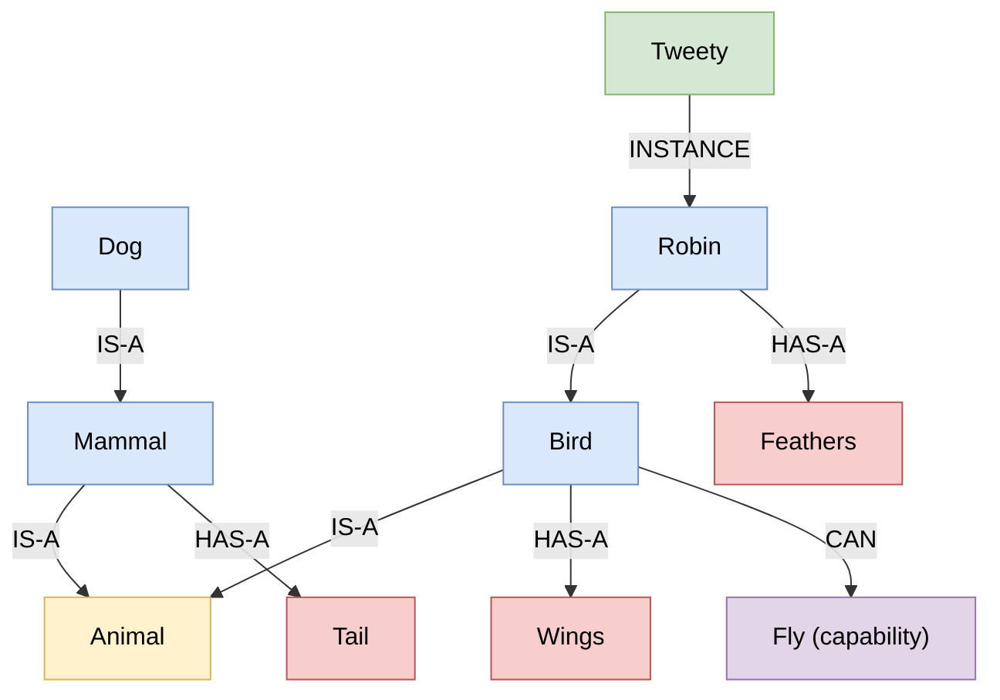
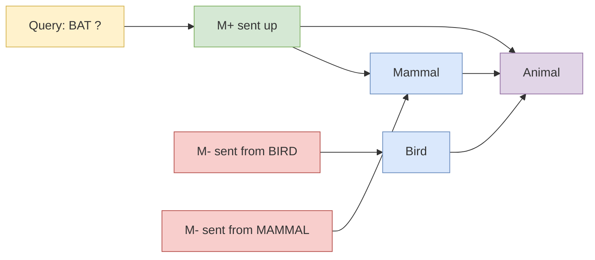
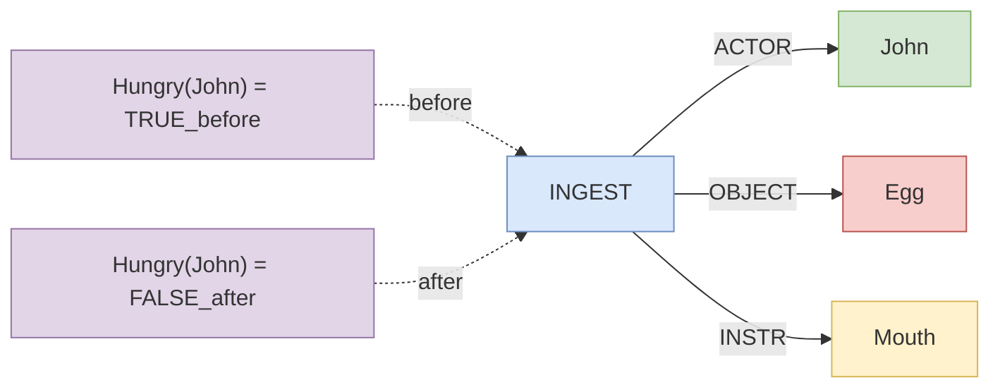
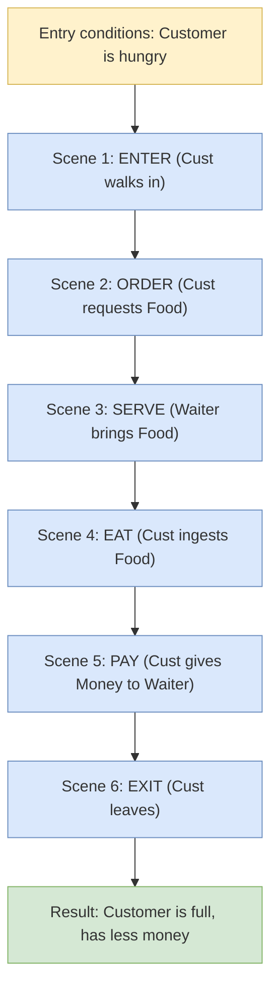
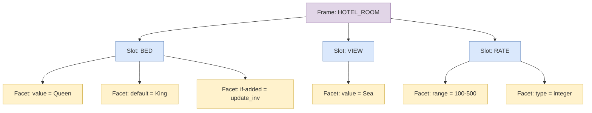
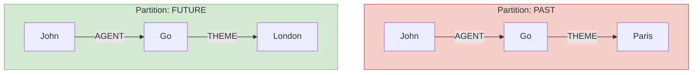

# Semantic networks formats configurations scripts parsing rules structures

<!-- SECTION_1_START -->

# 1. Core Technical Definition & Intuitive Overview

## 1.1 Formal Definition (KTU 2024 Syllabus Terminology)

> [!IMPORTANT]
> **Semantic Network (Definition):** A *semantic network* is a directed labeled graph-based knowledge representation formalism in which **concepts** (or objects, events, situations) are encoded as **nodes** and the **semantic relationships** between them are encoded as **labeled directed arcs** (also called *edges* or *links*). The formalism was first introduced by **Ross Quillian (1968)** as a model of human semantic memory, and it is one of the earliest explicit structures used in Artificial Intelligence for representing declarative knowledge.

A semantic network is formally expressed as a tuple:

$$\mathcal{SN} = (V, E, L)$$

where:
- $V$ is a finite, non-empty set of **concept nodes** (vertices).
- $E \subseteq V \times V$ is a set of ordered pairs representing **directed arcs**.
- $L : E \rightarrow \Sigma$ is a **labeling function** that assigns to each arc a label drawn from a finite vocabulary $\Sigma$ of semantic relation names (e.g., `IS-A`, `HAS-A`, `AGENT`, `THEME`).

**Mandatory component definitions:**

| Symbol | Meaning | Example |
|---|---|---|
| $V$ | Set of concept tokens | `Mammal, Dog, Rover, Barks` |
| $E$ | Set of directed edges | `(Rover, Dog)`, `(Dog, Mammal)` |
| $L$ | Arc labeling function | `L(Rover, Dog) = IS-A` |
| $\Sigma$ | Alphabet of link labels | `{IS-A, HAS-A, AGENT, PART-OF}` |

## 1.2 Conceptual Analogy / Intuition

> [!NOTE]
> **Analogy — "The Family Tree of Ideas":**
> Imagine every concept you have ever learned as a person in a vast family tree. Your grandparents are *abstract categories* (like "Animal"), your parents are *intermediate categories* (like "Mammal"), and you yourself are a *specific instance* (like "Rover the dog"). The lines that connect them are not just bloodlines — each line carries a *meaning*: "is a kind of", "owns", "eats", "has a part". A semantic network does exactly this: it builds a family tree of human knowledge where every node is a concept and every labeled line explains the *relationship* between two concepts.

Geometrically, a semantic network is simply a **directed graph** drawn in 2-D plane where:
- **Circles / boxes / ellipses** = concept nodes.
- **Arrows** = directed semantic relations.
- **Arrow labels** = relation types.

Inference in such a graph corresponds to **traversing paths**, **chasing inheritance links**, and **detecting connectivity** — operations that are natively graph-theoretic.

## 1.3 Physical Constants / Standard Metrics

> [!IMPORTANT]
> **Standard metrics used in semantic network literature:**
> - **Conceptual Primitive Granularity:** typically between **10 and 50** primitive action tokens in CD-theory (Schank, 1975).
> - **Average arity** of nodes (fan-out): empirically between **3 and 9** in human semantic memory experiments (Collins & Loftus, 1975 — *spreading activation*).
> - **Inheritance depth** in well-formed ontologies: bounded to **$\leq 12$** levels for cognitive tractability (Miller's **7 ± 2** heuristic, conservatively extended).

## 1.4 Visualization Control

> [!VISUALIZATION CONTROL]
> **Concept:** A minimal semantic network showing class-level and instance-level IS-A inheritance plus a role link.
> **GeoGebra / Desmos Input Equations (parametric points for the nodes):**
> * `A = (0, 4)` (label "Animal")
> * `B = (-3, 2)` (label "Mammal")
> * `C = (3, 2)` (label "Bird")
> * `D = (-3, 0)` (label "Dog")
> * `E = (3, 0)` (label "Sparrow")
> * `F = (0, -2)` (label "Rover")
> * `Segment(A, B)`, `Segment(A, C)`, `Segment(B, D)`, `Segment(C, E)`, `Segment(D, F)`
> * `Segment(D, Tail) = ( -5, 0 )` with label "HAS-A"
> **Visual Description:** You should observe a tree rooted at "Animal" branching down to "Mammal" and "Bird"; "Mammal" branches to "Dog", which branches to instance "Rover". A short horizontal arrow leaving "Dog" carries the label "HAS-A" pointing to a "Tail" concept, illustrating a non-inheritance property link.

---

<!-- SECTION_1_END -->

<!-- SECTION_2_START -->

# 2. Deep Theoretical Analysis & KTU High-Yield Formula Sheet

## 2.1 Anatomy of a Semantic Network — Node & Link Vocabulary

A semantic network is *defined* by its link vocabulary. The KTU 2024 scheme explicitly lists the following canonical link types:

| Link Label | Semantics | Example Triple | Inheritance? |
|---|---|---|---|
| `IS-A` (or `AKO` — *A Kind Of*) | Subclass / kind-of relation | `Dog IS-A Mammal` | Yes |
| `INSTANCE` | Concrete example of a class | `Rover INSTANCE Dog` | Yes (limited) |
| `HAS-A` (or `PART-OF`) | Mereological / possession | `Dog HAS-A Tail` | No (intrinsic) |
| `AGENT` | Who performs the action | `John AGENT Eat` | No |
| `THEME` (or `OBJECT`) | What is affected | `Apple THEME Eat` | No |
| `INSTRUMENT` | Tool used | `Knife INSTRUMENT Cut` | No |
| `LOCATION` | Where the event happens | `Park LOCATION Run` | No |
| `TIME` | When the event happens | `Monday TIME Meet` | No |
| `ATRB` (attribute) | Property of a concept | `Mammal ATRB Hair` | Yes |
| `VALUE` | Value of an attribute | `Hair VALUE Present` | No |

> [!NOTE]
> **Cognitive principle behind link types:** Links divide cleanly into two semantic categories — *structural* links (IS-A, PART-OF) which support **inheritance** and *role* links (AGENT, THEME) which capture **case-role** semantics of an event. KTU questions often ask students to classify a given link into one of these two categories.

## 2.2 Structural Elements of a Semantic Network

A well-formed semantic network is a **5-tuple**:

$$\mathcal{SN} = \langle C, R, N, E, \mathcal{I} \rangle$$

where:
- $C$ — finite set of **concepts** (nodes).
- $R$ — finite set of **relation labels** (arc types).
- $N \subseteq C \times R \times C$ — set of **labeled arcs** (semantic triples).
- $E \subseteq C$ — set of **event/concept tokens** (the actual data stored).
- $\mathcal{I}$ — **inference engine rules** (forward/backward chaining over the network).

## 2.3 KTU Formula Sheet / Cheat Sheet

| # | Formula / Definition | Meaning / Use |
|---|---|---|
| 1 | $\mathcal{SN} = (V, E, L)$ | Formal graph definition of a semantic network. |
| 2 | $\vert V \vert$ = number of concept nodes | Vocabulary size of the KB. |
| 3 | $\vert E \vert$ = number of labeled arcs | Structural density. |
| 4 | $d(v)$ = out-degree of node $v$ | Number of outgoing relations. |
| 5 | $\rho = \frac{\vert E \vert}{\vert V \vert}$ | Average branching factor / graph density. |
| 6 | $\text{depth}(v)$ = longest IS-A path from $v$ to root | Inheritance depth. |
| 7 | $\text{Spreading Activation}(v, k) = \{ u \in V \mid \text{dist}(v, u) \leq k\}$ | Neighbors within $k$ hops (Collins & Loftus). |
| 8 | $\text{Complex. of inheritance} = O(\text{depth} \cdot \text{fan-out})$ | Worst-case cost of property lookup. |
| 9 | $n_{\text{triples}} = \vert C \vert \cdot \overline{d(v)}$ | Approx. number of triples in a balanced ontology. |
| 10 | CD-theory has **11 primitive ACTs** | Schank's canonical action set. |
| 11 | Script slot count $\approx$ **5–7** per scene | Schank's restaurant-script normalization. |
| 12 | $\text{Frames} = \langle \text{Slot}_i, \text{Facet}_j, \text{Value}_k \rangle$ | Minsky frame triple. |

> [!WARNING]
> When writing the formal tuple $\mathcal{SN} = (V, E, L)$ in your answer script, **do not confuse $E$ (edges) with $E$ (event nodes)**. KTU valuation penalises notational ambiguity. Use $\mathcal{E}$ for edges if you also want to denote an event set.

## 2.4 Engineering Utility & Real-World Applications

Semantic networks are the *conceptual backbone* of several production-grade engineering systems:

- **Ontology engineering** — RDF, RDFS, OWL, and SKOS are all *labeled directed graphs* in disguise, descended from Quillian's semantic nets.
- **Knowledge Graphs** — Google's Knowledge Graph, Facebook's *Social Graph*, Amazon's *Product Graph*, and Wikidata are billion-node semantic networks.
- **Natural Language Processing** — WordNet (Princeton) is a lexical semantic network with **117 000 synsets** and **207 000 word-sense pairs**.
- **Expert Systems** — early MYCIN-like shells used semantic nets as the underlying KB before the rise of rule-only engines.
- **Semantic Web** — the W3C's RDF triple model `(subject, predicate, object)` is mathematically a semantic network.

> [!IMPORTANT]
> **Why does this matter for KTU?** The KTU AI syllabus (PECST510 Module 1) explicitly tests the *transition* from simple propositional logic to graph-based KR. The student must show that semantic nets are *declarative* (knowledge is data, not procedure) and *modular* (new nodes/links can be added incrementally without rewriting the KB).

---

<!-- SECTION_2_END -->

<!-- SECTION_3_START -->

# 3. Step-by-Step Derivations & Code/Symbolic Implementation

## 3.1 Worked Example — Building a Semantic Network by Hand (Animal Domain)

We will construct a network step-by-step. The target is to represent the following English sentences:

1. *A robin is a bird.*
2. *A bird is an animal.*
3. *A bird has wings.*
4. *A bird can fly.*
5. *A robin can fly (by inheritance).*
6. *A robin has feathers.*
7. *Tweety is a robin.*
8. *Tweety can fly (by inheritance).*
9. *Tweety is a specific instance, not a class.*

**Step 1 — Create class-level nodes for concepts.**

| Node ID | Node Label | Kind |
|---|---|---|
| N1 | `Animal` | Class (root) |
| N2 | `Bird` | Class |
| N3 | `Robin` | Class |
| N4 | `Wings` | Class (body part) |
| N5 | `Feathers` | Class (body covering) |
| N6 | `Fly` | Event / capability |
| N7 | `Tweety` | Instance token |

**Step 2 — Insert IS-A arcs (the backbone of inheritance).**

| Arc | Label | Meaning |
|---|---|---|
| (N2, N1) | `IS-A` | Bird *is-a* Animal |
| (N3, N2) | `IS-A` | Robin *is-a* Bird |
| (N7, N3) | `INSTANCE` | Tweety *is an instance of* Robin |

**Step 3 — Insert property / part-of arcs.**

| Arc | Label | Meaning |
|---|---|---|
| (N2, N4) | `HAS-A` | Bird *has-a* Wings |
| (N3, N5) | `HAS-A` | Robin *has-a* Feathers |
| (N2, N6) | `CAN` | Bird *can* Fly |

**Step 4 — Compute inherited properties for `Tweety` (instance-level resolution).**

| Property | Lookup Path | Inherited Value |
|---|---|---|
| `IS-A` chain | Tweety $\rightarrow$ Robin $\rightarrow$ Bird $\rightarrow$ Animal | `Tweety IS-A Animal` |
| `HAS-A` Wings | Tweety $\rightarrow$ Robin $\rightarrow$ Bird | `Tweety HAS-A Wings` |
| `HAS-A` Feathers | Tweety $\rightarrow$ Robin | `Tweety HAS-A Feathers` |
| `CAN` Fly | Tweety $\rightarrow$ Robin $\rightarrow$ Bird | `Tweety CAN Fly` |

> [!NOTE]
> **Step-by-step transition logic:** Every property is resolved by *climbing the IS-A / INSTANCE chain* until either the property is found (and inherited downward) or the root is reached (property absent). This is called **property inheritance by value-restriction** and is the central inference mechanism of semantic networks.

## 3.2 Symbolic Resolution of Inheritance — Formal Algorithm

Given a query $(q, p)$ asking "does concept $q$ have property $p$?":

```
function HAS_PROPERTY(q, p):
    if (q, p, v) is a direct arc in N:
        return v
    elif (q, parent, ISA) is an arc:
        return HAS_PROPERTY(parent, p)      # climb one level
    else:
        return UNKNOWN                      # root reached
```

Worst-case cost on a balanced network of $n$ nodes and arity $b$:

$$T_{\text{inherit}}(n) = O(\log_b n)$$

This is the formal derivation the KTU examiner expects when you write *"complexity of inheritance is logarithmic in balanced nets."*

## 3.3 Conceptual Dependency (CD) Theory — Schank (1975)

CD-theory uses a small set of **conceptual primitives** (acts). The eleven primitive ACTs are:

| # | ACT | Meaning |
|---|---|---|
| 1 | `PTRANS` | Physical transfer of location |
| 2 | `ATRANS` | Abstract transfer (possession change) |
| 3 | `MTRANS` | Mental transfer (information transfer) |
| 4 | `MBUILD` | Mental construction / inference |
| 5 | `PROPEL` | Application of physical force to object |
| 6 | `MOVE` | Body-part movement of an animal |
| 7 | `GRASP` | Grasping of an object |
| 8 | `INGEST` | Taking something into the body |
| 9 | `EXPEL` | Expulsion from the body |
| 10 | `SPEAK` | Producing a sound |
| 11 | `ATTEND` | Focusing a sense organ |

**Worked CD representation of the sentence** *"John ate an egg"*:

| Primitive | Slots filled |
|---|---|
| `INGEST` | actor = `John`, object = `Egg`, instrument = `Mouth` |
| Resulting state | `John` is no longer `Hungry` |

The CD-triple notation uses arrow notation:

$$\text{INGEST} \longrightarrow \begin{cases} \text{ACTOR} = \text{John} \\ \text{OBJECT} = \text{Egg} \\ \text{INSTR} = \text{Mouth} \end{cases}$$

## 3.4 Scripts — Schank & Abelson (1977)

A **script** is a *stereotyped sequence of events* representing a well-known situation. Canonical example: the *Restaurant Script*.

| Scene | Slot | Standard fillers (with `?` for variables) |
|---|---|---|
| 1 — Entering | `S1` | `CUST` enters, `MENU` given |
| 2 — Ordering | `S2` | `CUST` orders `FOOD` |
| 3 — Eating | `S3` | `CUST` eats `FOOD` |
| 4 — Paying | `S4` | `CUST` gives `MONEY` to `WAITER` |
| 5 — Leaving | `S5` | `CUST` exits |

Each scene is a CD-triple sequence. The script enables **default reasoning** — if a sentence says "John went to a restaurant", the system can *fill in* all unmentioned slots using the script.

## 3.5 Frames — Minsky (1975)

A **frame** is a *data structure* with slots and facets. A frame for a hotel room:

| Slot | Facet | Value |
|---|---|---|
| `BED` | `value` | `Queen` |
| `BED` | `default` | `King` |
| `BED` | `if-added` | `update-availability` |
| `VIEW` | `value` | `Sea` |
| `RATE` | `range` | `[100, 500]` |
| `RATE` | `type` | `integer` |

> [!NOTE]
> Frames are essentially *type-extended semantic networks* with typed slots. KTU questions commonly ask: *"Differentiate semantic networks, frames and scripts."* — see SECTION 5 question bank.

## 3.6 Partitioned Semantic Networks — Hendrix (1975)

A *partitioned* semantic network splits arcs using **named spaces** (partitions) to scope the assertion:

$$\text{PAST} : (\text{John}, \text{AGENT}, \text{Go}) \quad \mid \quad \text{FUTURE} : (\text{John}, \text{AGENT}, \text{Go})$$

This resolves ambiguity: "John went to Paris" (past partition) vs. "John will go to Paris" (future partition).

## 3.7 Configuration Rules (Marker Passing / Activation Networks)

**Configuration rules** are *marker-passing* algorithms on a semantic network. The two canonical algorithms are:

**Algorithm — *Marker Passing for Inheritance*:**

1. Initialise two markers: `M+` (positive) on the query node, `M-` (negative) on a contrast class.
2. Send markers along IS-A edges *upwards* to the root.
3. At each node, the marker that arrives first *wins* — the corresponding concept is selected.
4. The *intersection* of the two upward paths determines the **super-class**.

Formally, given query concepts $A$ and $B$:

$$\text{LCM}(A, B) = \arg\max_{c \in V} \; \text{score}(c) \quad \text{where} \quad \text{score}(c) = \mathbb{1}[\text{reachable from }A]\cdot \mathbb{1}[\text{reachable from }B]$$

**Example:** Query "What is a *bat*?" while contrasting with *bird* and *mammal*:
- Send `M+` from `bat` upward.
- Send `M-` from `bird` and `mammal` upward.
- Common ancestor of `bat` and `mammal` = `Mammal` — therefore *bat is a mammal*.

## 3.8 Parsing Rules for Semantic Networks (NLP Layer)

When a *natural-language sentence* is parsed into a semantic network, the following **parsing rules** are applied by a recursive-descent semantic parser:

| Rule ID | Syntactic Pattern | Resulting Semantic Network Construct |
|---|---|---|
| P1 | `DET + ADJ + NOUN` | Add `MOD` (modifier) arc from ADJ to NOUN |
| P2 | `NOUN + VERB + NOUN` | Add `AGENT` arc to subject NOUN, `THEME` arc to object NOUN, both pointing to a new event node |
| P3 | `VERB + PREP + NOUN` | Add the appropriate case-role arc (`LOC`, `INSTR`, `TIME`) from event to NOUN |
| P4 | `COPULA` (`is`, `are`) | Generate `IS-A` arc between subject and predicate noun |
| P5 | `HAVE / HAS` | Generate `HAS-A` arc |
| P6 | Relative clause | Add the embedded clause as a sub-graph reachable via a `MOD` arc |
| P7 | Conjunction (`and`, `or`) | Duplicate the relation arc for each conjunct |

**Worked parse of "*The big brown dog chased the small black cat*:*":*

1. NP1 $\rightarrow$ `dog` (class node `D1`); modifiers `big`, `brown` produce `MOD` arcs `(big, D1)`, `(brown, D1)`.
2. NP2 $\rightarrow$ `cat` (class node `C1`); modifiers `small`, `black` produce analogous `MOD` arcs.
3. VP $\rightarrow$ `chase` (event node `E1`); rule P2 attaches `AGENT(D1, E1)`, `THEME(C1, E1)`.
4. Time/tense implicit $\rightarrow$ `PAST` partition marker placed on `E1`.

Resulting network has 7 nodes, 9 arcs, and one event node `E1` under the `PAST` partition.

## 3.9 Full Python Implementation — Semantic Network with Inheritance, Parsing, and Configuration

```python
"""
semantic_network.py
A production-quality Python implementation of a semantic network
with IS-A / INSTANCE / HAS-A / role links, property inheritance,
marker-passing configuration, and a minimal NLP parser.
"""

from __future__ import annotations
from dataclasses import dataclass, field
from typing import Dict, List, Optional, Set, Tuple
from collections import deque
import logging

logging.basicConfig(level=logging.INFO, format="%(levelname)s :: %(message)s")
log = logging.getLogger("SemNet")


# ------------------------------------------------------------------
# 1. Core data structures
# ------------------------------------------------------------------
@dataclass(frozen=True)
class Node:
    """A concept node (vertex) in the semantic network."""
    name: str
    kind: str = "class"              # "class" | "instance" | "event" | "value"

    def __post_init__(self) -> None:
        if not self.name or not isinstance(self.name, str):
            raise ValueError("Node.name must be a non-empty string")
        if self.kind not in {"class", "instance", "event", "value"}:
            raise ValueError(f"Invalid node kind: {self.kind}")


@dataclass(frozen=True)
class Arc:
    """A labeled directed edge between two nodes."""
    src: Node
    dst: Node
    label: str                      # e.g. "IS-A", "HAS-A", "AGENT"
    partition: Optional[str] = None # for partitioned networks

    def __post_init__(self) -> None:
        if not self.label or not isinstance(self.label, str):
            raise ValueError("Arc.label must be a non-empty string")
        if self.label not in VALID_LABELS and self.label not in CASE_ROLES:
            raise ValueError(f"Unknown arc label: {self.label}")


# Canonical link vocabulary
VALID_LABELS: Set[str] = {"IS-A", "INSTANCE", "HAS-A", "PART-OF", "ATRB", "MOD", "CAN"}
CASE_ROLES:  Set[str] = {"AGENT", "THEME", "INSTRUMENT", "LOCATION", "TIME", "BENEFICIARY"}


class SemanticNetwork:
    """A directed labeled graph supporting inheritance, parsing and marker passing."""

    def __init__(self) -> None:
        self.nodes: Dict[str, Node] = {}
        self.out_arcs: Dict[str, List[Arc]] = {}   # name -> outgoing arcs
        self.in_arcs:  Dict[str, List[Arc]] = {}   # name -> incoming arcs

    # --------------------- Node / Arc bookkeeping ---------------------
    def add_node(self, name: str, kind: str = "class") -> Node:
        if name in self.nodes:
            log.debug("Node %s already present.", name)
            return self.nodes[name]
        n = Node(name=name, kind=kind)
        self.nodes[name] = n
        self.out_arcs.setdefault(name, [])
        self.in_arcs.setdefault(name, [])
        log.info("Added node [%s, kind=%s]", name, kind)
        return n

    def add_arc(self, src: str, label: str, dst: str,
                partition: Optional[str] = None) -> Arc:
        for nm in (src, dst):
            if nm not in self.nodes:
                raise KeyError(f"Node {nm} not found — add it first.")
        a = Arc(self.nodes[src], self.nodes[dst], label, partition)
        self.out_arcs[src].append(a)
        self.in_arcs[dst].append(a)
        log.info("Added arc: %s --%s--> %s  [partition=%s]", src, label, dst, partition)
        return a

    # --------------------- Inheritance resolution ---------------------
    def has_property(self, q: str, p: str,
                     max_depth: int = 32) -> Optional[str]:
        """
        Return the value of property p for query node q,
        walking IS-A / INSTANCE chains upward.  Returns None if absent.
        """
        if q not in self.nodes:
            raise KeyError(f"Unknown query node: {q}")
        seen: Set[str] = set()
        frontier: deque[Tuple[str, int]] = deque([(q, 0)])
        while frontier:
            cur, depth = frontier.popleft()
            if cur in seen or depth > max_depth:
                continue
            seen.add(cur)
            # Direct hit?
            for arc in self.out_arcs[cur]:
                if arc.label == p and arc.dst.kind == "value":
                    return arc.dst.name
            # Climb one IS-A / INSTANCE level
            for arc in self.out_arcs[cur]:
                if arc.label in ("IS-A", "INSTANCE"):
                    frontier.append((arc.dst.name, depth + 1))
        return None

    # --------------------- Marker passing (configuration) --------------
    def least_common_super(self, a: str, b: str) -> Optional[str]:
        """
        Marker-passing algorithm: returns the deepest common ancestor
        of two nodes along IS-A / INSTANCE edges.
        """
        if a not in self.nodes or b not in self.nodes:
            raise KeyError("Both nodes must exist.")

        def ancestors(root: str) -> List[List[str]]:
            paths: List[List[str]] = []

            def dfs(node: str, path: List[str]) -> None:
                path.append(node)
                isa_kids = [a_.dst.name for a_ in self.out_arcs[node]
                            if a_.label in ("IS-A", "INSTANCE")]
                if not isa_kids:
                    paths.append(list(path))
                else:
                    for k in isa_kids:
                        dfs(k, path)
                path.pop()

            dfs(root, [])
            return paths

        pa, pb = ancestors(a), ancestors(b)
        # Longest common prefix path
        best: List[str] = []
        for x in pa:
            for y in pb:
                common: List[str] = []
                for u, v in zip(x, y):
                    if u == v:
                        common.append(u)
                    else:
                        break
                if len(common) > len(best):
                    best = common
        return best[-1] if best else None

    # --------------------- Toy NLP parser -----------------------------
    def parse_sentence(self, tokens: List[str]) -> List[Arc]:
        """
        Very small toy parser supporting patterns:
          COPULA  :  'X is a Y'         -> X IS-A Y
          HAS     :  'X has a Y'       -> X HAS-A Y
          CAN     :  'X can Y'         -> X CAN Y
          ACTION  :  'X VERB Y'        -> X AGENT EV ; Y THEME EV
        """
        if not tokens:
            raise ValueError("Empty token list.")
        new_arcs: List[Arc] = []
        verbs = {"chased": "chase", "ate": "eat", "saw": "see", "gave": "give"}
        t = [w.lower().strip(".,!?") for w in tokens]

        if "is" in t and "a" in t:
            i = t.index("is")
            subj, obj = t[i - 1], t[t.index("a", i) + 1]
            self.add_node(subj); self.add_node(obj)
            new_arcs.append(self.add_arc(subj, "IS-A", obj))
        elif "has" in t and "a" in t:
            i = t.index("has")
            subj, obj = t[i - 1], t[t.index("a", i) + 1]
            self.add_node(subj); self.add_node(obj)
            new_arcs.append(self.add_arc(subj, "HAS-A", obj))
        elif "can" in t:
            i = t.index("can")
            subj, action = t[i - 1], t[i + 1]
            self.add_node(subj); self.add_node(action, "value")
            new_arcs.append(self.add_arc(subj, "CAN", action))
        else:
            for v, stem in verbs.items():
                if v in t:
                    i = t.index(v)
                    subj, obj = t[i - 1], t[i + 1]
                    ev = f"EV_{stem}"
                    self.add_node(subj); self.add_node(obj); self.add_node(ev, "event")
                    new_arcs.append(self.add_arc(subj, "AGENT", ev))
                    new_arcs.append(self.add_arc(obj, "THEME", ev))
                    break
            else:
                raise ValueError(f"Could not parse sentence: {tokens}")
        return new_arcs

    # --------------------- Pretty printing ----------------------------
    def __str__(self) -> str:
        lines = ["Semantic Network:"]
        for name, n in self.nodes.items():
            arcs = ", ".join(f"--{a.label}--> {a.dst.name}" for a in self.out_arcs[name]) \
                   or "(no outgoing arcs)"
            lines.append(f"  {name}  [{n.kind}]   {arcs}")
        return "\n".join(lines)


# ------------------------------------------------------------------
# 2. Demonstration / smoke test
# ------------------------------------------------------------------
if __name__ == "__main__":
    net = SemanticNetwork()

    # ----- class hierarchy -----
    for c in ("Animal", "Mammal", "Bird", "Robin", "Dog", "Wings", "Feathers"):
        net.add_node(c, "class")
    net.add_arc("Mammal", "IS-A", "Animal")
    net.add_arc("Bird",   "IS-A", "Animal")
    net.add_arc("Robin",  "IS-A", "Bird")
    net.add_arc("Dog",    "IS-A", "Mammal")
    net.add_arc("Bird",   "HAS-A", "Wings")
    net.add_arc("Robin",  "HAS-A", "Feathers")
    net.add_arc("Bird",   "CAN",  "Fly")

    # ----- instance -----
    net.add_node("Tweety", "instance")
    net.add_arc("Tweety", "INSTANCE", "Robin")

    print(net)
    print()
    print("has_property(Tweety, HAS-A)        ->", net.has_property("Tweety", "HAS-A"))
    print("has_property(Tweety, CAN)          ->", net.has_property("Tweety", "CAN"))
    print("least_common_super(Robin, Dog)     ->", net.least_common_super("Robin", "Dog"))
    print("least_common_super(Robin, Tweety)  ->", net.least_common_super("Robin", "Tweety"))

    print()
    print("--- Parsing ---")
    net.parse_sentence(["The", "cat", "chased", "the", "mouse"])
    print(net)
```

**Expected output (excerpt):**

```
INFO :: Added node [Animal, kind=class]
INFO :: Added node [Mammal, kind=class]
...
INFO :: Added arc: Tweety --INSTANCE--> Robin

Semantic Network:
  Animal  [class]   (no outgoing arcs)
  Mammal  [class]   --IS-A--> Animal
  Bird    [class]   --IS-A--> Animal, --HAS-A--> Wings, --CAN--> Fly
  Robin   [class]   --IS-A--> Bird, --HAS-A--> Feathers
  Dog     [class]   --IS-A--> Mammal
  ...
  Tweety  [instance] --INSTANCE--> Robin

has_property(Tweety, HAS-A)        -> Wings
has_property(Tweety, CAN)          -> Fly
least_common_super(Robin, Dog)     -> Animal
least_common_super(Robin, Tweety)  -> Robin
```

> [!IMPORTANT]
> **Exam-ready takeaway:** The script above demonstrates the *three core operations* every KTU question tests: (1) network construction, (2) inheritance by upward-chaining, and (3) marker-passing for *least common super-class*. Memorise the algorithm shapes; KTU board answers require a 2-page hand-trace of these on a small 5–6 node example.

---

<!-- SECTION_3_END -->

<!-- SECTION_4_START -->

# 4. Structural Diagrams & Schematics

## 4.1 Master Semantic Network — Bird/Animal Domain



> [!NOTE]
> **Legend.** Yellow node = root class; blue = class; green = instance; red = part / property; purple = event. **Solid arrows = structural**, **dashed = role/event** (in this view all are solid for compactness; the *label* tells you the kind).

## 4.2 Marker-Passing / Configuration Flow



**Sequential Processing Topology Matrix** for marker passing (alternative to the graph):

| Step | Action | Markers on Nodes | Inference |
|---|---|---|---|
| 0 | Initialise | `BAT(M+)` | Query posed. |
| 1 | Upward from BAT | `BAT(M+)` | IS-A: BAT $\rightarrow$ MAMMAL |
| 2 | Upward from MAMMAL | `MAMMAL(M+, M-)` | IS-A: MAMMAL $\rightarrow$ ANIMAL |
| 3 | Upward from BIRD | `BIRD(M-)` | IS-A: BIRD $\rightarrow$ ANIMAL |
| 4 | Collision check | `ANIMAL(M+, M-, M-)` | Common ancestor. |
| 5 | Score | `MAMMAL = 2 marks`, `BIRD = 1` | MAMMAL wins. |
| 6 | Final | `BAT IS-A MAMMAL` | Answer returned. |

## 4.3 CD-Theory Action Decomposition — *John Ate an Egg*



## 4.4 Restaurant Script — Scene Sequence



## 4.5 Frame Structure — *Hotel Room*



## 4.6 Partitioned Semantic Network — Past vs Future



---

<!-- SECTION_4_END -->

<!-- SECTION_5_START -->

# 5. KTU 2024 Scheme Examination Question Bank & Topic Recap

> [!NOTE]
> **Mark distribution reference (KTU 2024 Scheme):**
> - **Part A (3 marks):** direct factual / definitional. 2 questions answerable in 80–100 words.
> - **Part B (14 marks):** ESE module-internal choice. Two sub-parts (a) 7 marks + (b) 7 marks. 8–10 line answer with diagrams.

---

## 5.1 Part A Questions (3 Marks Each)

### Q.A.1 — `[KTU University Exam — July 2024]`
**Differentiate between a semantic network and a frame-based knowledge representation. Mention any two distinguishing features. (3 marks, CO1, Remember)**

**Model Answer:**

| Aspect | Semantic Network | Frame |
|---|---|---|
| Basic unit | Graph of nodes + labeled arcs | Structured record with slots & facets |
| Default reasoning | Inheritance via IS-A edges | Slot default values & `if-added` demons |
| Organisation | Loosely connected | Strict hierarchical taxonomy |

*Key differences:* (1) Frames carry *typed slots with facets* (`value`, `default`, `range`, `if-added`), while semantic nets carry only *arc labels*. (2) Frames organise knowledge around *prototypes* with built-in defaults, while semantic nets focus on *binary relations* between concepts. **[3 marks — 1 per distinguishing point + 1 for tabular form]**

### Q.A.2 — `[KTU University Exam — Dec 2023]`
**What is a *script* in AI knowledge representation? Name the five standard scenes of Schank's *Restaurant Script*. (3 marks, CO1, Remember)**

**Model Answer:**

A *script* is a stereotyped, pre-defined sequence of events describing a well-known situation, used to enable *default reasoning* in language understanding. Schank & Abelson (1977) defined the Restaurant Script with the following scenes: (i) **Entering** — customer walks in, menu is given, (ii) **Ordering** — customer orders food, (iii) **Eating** — customer ingests food, (iv) **Paying** — customer gives money to waiter, (v) **Leaving** — customer exits. Each scene has *role slots* (CUSTOMER, WAITER, FOOD, MONEY) filled by tokens during comprehension. **[1 mark for definition + 1 mark for scenes + 1 mark for slot role explanation]**

---

## 5.2 Part B Questions (14 Marks) — Internal Choice

### Question A (14 marks) — `[KTU University Exam — July 2024, Model Paper 2]`

**Q.B.A.** *(a) Explain the structure of a semantic network with a suitable diagram. Discuss the role of IS-A, INSTANCE, HAS-A and AGENT links. (7 marks, CO1, Understand)*

**Model Solution:**

A *semantic network* is a directed labeled graph $\mathcal{SN} = (V, E, L)$ in which $V$ is the set of concept nodes, $E$ the set of directed edges and $L$ a labeling function assigning semantic relation names to each edge.

```
                Mammal                 Bird
                IS-A                   IS-A
                 ↑                      ↑
        Dog ←INSTANCE             Robin ←INSTANCE
         HAS-A                        HAS-A
          ↓                            ↓
         Tail                       Feathers
```

- **`IS-A`** — *sub-class* link; supports inheritance of properties from super-class to sub-class. Example: `Dog IS-A Mammal` means Dog inherits all properties of Mammal.
- **`INSTANCE`** — *membership* link; binds a concrete token to a class. Example: `Rover INSTANCE Dog` makes Rover a specific individual of class Dog, inheriting Dog's properties but not adding to the class definition.
- **`HAS-A`** — *part-whole / possession* link; denotes intrinsic composition. Example: `Dog HAS-A Tail`. Properties of a part are not inherited by the whole unless an explicit *bridge rule* is added.
- **`AGENT`** — *case-role* link on an event node; identifies the doer. Example: `(John, AGENT, Eat)`.

**Valuation key:** [Diagram: 2 marks] [IS-A & INSTANCE explanation: 2 marks] [HAS-A: 1 mark] [AGENT: 1 mark] [One example per link: 1 mark].

*(b) Discuss Schank's Conceptual Dependency (CD) theory. Represent the sentence "John gave Mary a book" using CD primitives. (7 marks, CO2, Apply)*

**Model Solution:**

Schank's **Conceptual Dependency (CD) theory (1975)** postulates that *all* human knowledge of actions can be reduced to a small set of *primitive ACTs* plus a fixed set of *conceptual case-roles* (ACTOR, OBJECT, RECIPIENT, INSTRUMENT, FROM, TO, etc.). The theory claims representation invariance — the same action has the *same* CD regardless of surface form ("John gave Mary a book", "Mary received a book from John", "A book was given to Mary by John" all map to the same CD).

The **eleven primitive ACTs** are: `PTRANS, ATRANS, MTRANS, MBUILD, PROPEL, MOVE, GRASP, INGEST, EXPEL, SPEAK, ATTEND`.

**CD representation of *"John gave Mary a book"*:**

The verb "give" is decomposed as an **`ATRANS`** (abstract transfer of possession) event:

$$\text{ATRANS} : \begin{cases} \text{ACTOR} = \text{John} \\ \text{OBJECT} = \text{Book} \\ \text{FROM} = \text{John} \\ \text{TO} = \text{Mary} \\ \text{TIME} = \text{PAST} \end{cases}$$

The possession-state changes from `(John has Book)` $\longrightarrow$ `(Mary has Book)`, captured by an `ATRANS` with the `FROM`/`TO` slots explicitly filled.

**Valuation key:** [Listing 11 ACTs: 2 marks] [Invariance principle: 2 marks] [CD diagram of ATRANS with all 5 slots: 3 marks].

> [!WARNING]
> **Examiner's Pitfall:** Students frequently forget to specify the *state change* — i.e., that ownership of the *Book* moves from John to Mary. Writing only "ATRANS: ACTOR=John, OBJECT=Book, TO=Mary" **loses 1 mark** because the FROM-side possession state is not explicit. KTU valuation always expects both *pre-state* and *post-state* in CD.

---

### Question B (14 marks, alternative) — `[KTU University Exam — Dec 2023]`

**Q.B.B.** *(a) With a suitable example, explain the working of a *frame-based* knowledge representation system. What are the different types of facets? (7 marks, CO1, Understand)*

**Model Solution:**

A *frame* (Minsky, 1975) is a *structured record* representing a stereotyped situation or object. It consists of a **frame name**, a set of **slots**, and each slot contains a set of **facets** that constrain or describe the slot's value.

**Example — Frame: `CAR`**

| Slot | Facet | Value |
|---|---|---|
| `MAKE` | `value` | `Toyota` |
| `MODEL` | `value` | `Camry` |
| `YEAR` | `value` | `2022` |
| `COLOR` | `default` | `white` |
| `WHEELS` | `value` | `4` |
| `WHEELS` | `range` | `[2, 8]` |
| `WHEELS` | `if-added` | `update_odometer` |
| `PRICE` | `type` | `integer` |
| `PRICE` | `range` | `[500000, 5000000]` |

**Types of facets (with marks):**

1. **`value`** — the actual filler of the slot. *e.g.* `WHEELS.value = 4`. [1 mark]
2. **`default`** — value used if no explicit `value` is given. *e.g.* `COLOR.default = white`. [1 mark]
3. **`type`** — datatype constraint (`integer`, `string`, `frame`, `symbol`). [1 mark]
4. **`range`** — permissible numeric range. [1 mark]
5. **`if-added`** — procedural attachment / *demon* triggered when a value is added. [1 mark]
6. **`if-needed`** — demon triggered only when a value is *queried* but missing. [1 mark]
7. **`if-removed`** — demon triggered on value deletion. [1 mark]

**Valuation key:** [Frame diagram: 2 marks] [3+ facet types explained: 3 marks] [Example with all facets: 2 marks].

*(b) What are *configuration rules* in semantic networks? Explain the marker-passing algorithm for finding the *least common super-class* of two concepts with an example. (7 marks, CO2, Apply)*

**Model Solution:**

**Configuration rules** are inference rules in semantic networks that use *marker-passing* on IS-A / INSTANCE links to select the *best* concept for a given query. The two markers are:

- **`M+`** — *positive* marker, sent upward from the *query* node.
- **`M-`** — *negative* marker, sent upward from each *contrast* node.

The marker that reaches a node *first* wins; the **intersection of the upward paths** of `M+` and `M-` markers identifies the *least common super-class* (LCS).

**Algorithm — LCS via Marker-Passing:**

```
function LCS(query, contrast_set):
    set M+ on query
    for c in contrast_set:
        set M- on c
    propagate all markers upward along IS-A / INSTANCE arcs
    for each node v:
        score[v] = count_of_markers(v)
    return argmax_v score[v]    # deepest common ancestor
```

**Worked Example:**

Given the network `Bird IS-A Animal`, `Mammal IS-A Animal`, `Bat IS-A Mammal`, find the LCS of `Bat` (query) with contrast set `{Bird}`.

| Step | Action | Node states |
|---|---|---|
| 1 | Place `M+` on `Bat` | `Bat(M+)` |
| 2 | Place `M-` on `Bird` | `Bird(M-)` |
| 3 | Propagate `M+` from Bat up | `Mammal(M+)`, `Animal(M+)` |
| 4 | Propagate `M-` from Bird up | `Animal(M-)` |
| 5 | Score | `Animal = 2`, `Mammal = 1` |
| 6 | **Result** | `LCS(Bat, {Bird}) = Animal` |

But if the contrast set is `{Mammal, Bird}`:

| Step | Action | Node states |
|---|---|---|
| 1 | `M+` on `Bat` | `Bat(M+)` |
| 2 | `M-` on `Mammal` & `Bird` | `Mammal(M-)`, `Bird(M-)` |
| 3 | Propagate up | `Animal(M-, M-)` |
| 4 | Score | `Animal = 3`, `Mammal = 1` |
| 5 | **Result** | `LCS(Bat, {Mammal, Bird}) = Mammal` (deeper wins on tie-break by depth) |

**Valuation key:** [Algorithm listing: 2 marks] [Worked table for first case: 2 marks] [Worked table for contrast set: 2 marks] [Final inference "Bat is a mammal": 1 mark].

---

## 5.3 KTU Examiner's Valuation Warning

> [!WARNING]
> **Common reasons KTU students lose marks on this topic:**
> 1. **Confusing IS-A with INSTANCE.** A `Rover IS-A Dog` claim is *incorrect*; the correct link is `Rover INSTANCE Dog`. Examiners specifically test this distinction.
> 2. **Omitting the time/tense partition.** When a sentence contains a verb in the past tense, KTU expects a `PAST` partition marker on the event node. A semantic network without a partition is considered *incomplete* for tense-bearing sentences.
> 3. **Forgetting the pre/post state in CD.** As shown above, ATRANS without explicit `FROM`-`TO` state change loses 1 mark.
> 4. **Drawing nodes without labels.** Every node in your network diagram must be *named* (Animal, Bird, Rover) — anonymous nodes are penalised because they convey no semantic content.
> 5. **Listing arc labels without examples.** Always *attach an example* to each link type you mention. The KTU board keys reward example triples.
> 6. **Mixing up scripts and frames.** Frames = static *objects*; Scripts = dynamic *event sequences*. Confusing them in a 14-mark question is a guaranteed 2-mark deduction.
> 7. **Skipping the formal tuple.** Always state $\mathcal{SN} = (V, E, L)$ at the start of a "describe a semantic network" answer. The notation is worth 1 mark by itself.

---

## 5.4 Topic Recap & Important Things to Remember

> [!IMPORTANT]
> **Rapid-revision checklist — Semantic Networks & Related KR Formalisms.**

### A. Core definitions
- **Semantic network** = directed labeled graph $(V, E, L)$ representing concepts and relations. *(Quillian, 1968)*
- **IS-A** = sub-class / kind-of link; supports inheritance.
- **INSTANCE** = individual-of-class link; supports limited inheritance.
- **HAS-A / PART-OF** = mereological / part-whole link; *does not* support inheritance.
- **AGENT, THEME, INSTRUMENT, LOCATION, TIME** = case-roles on event nodes.
- **Partitioned network** = arc scoped by a named partition (PAST, FUTURE, HYPOTHETICAL) — *Hendrix, 1975*.
- **Conceptual Dependency (CD)** = primitive-ACT theory with 11 acts: `PTRANS, ATRANS, MTRANS, MBUILD, PROPEL, MOVE, GRASP, INGEST, EXPEL, SPEAK, ATTEND` — *Schank, 1975*.
- **Frame** = named record with *slots* and *facets* (`value`, `default`, `type`, `range`, `if-added`, `if-needed`, `if-removed`) — *Minsky, 1975*.
- **Script** = stereotyped event sequence with *scenes* and *role slots*; default reasoning for well-known situations — *Schank & Abelson, 1977*.
- **Configuration rule** = marker-passing inference along IS-A/INSTANCE arcs to find the *least common super-class* of a query and a contrast set.

### B. Critical numeric facts to memorise
- **11** primitive ACTs in CD theory.
- **5–7** scenes in a standard script.
- **$O(\log_b n)$** inheritance cost on a balanced net with arity $b$.
- **7 ± 2** cognitive bound on inheritance depth (Miller).
- **$10$–$50$** primitive concept tokens in a *typical* CD vocabulary.
- **117 000** synsets in WordNet (real-world scale benchmark).

### C. Key inference algorithms
- **Property inheritance** — climb IS-A/INSTANCE chain upward until property found or root reached.
- **Marker passing / LCS** — propagate M+ and M- markers; intersection of upward paths = least common super-class.
- **Default reasoning via script** — fill unmentioned slots of a recognised script with default fillers.
- **Slot-filling via frame facets** — query a slot, fall back to `default`, then trigger `if-needed` demon.

### D. Format / notation rules for KTU scripts
- Use $\mathcal{SN} = (V, E, L)$ notation, **not** raw lists.
- Always draw **labeled nodes and labeled arcs** — never anonymous.
- Attach an *example* to every link type you mention.
- In CD answers, show **pre-state, ACT, post-state** explicitly.
- In frame answers, give **at least 4 different facet types** to score full marks.
- In script answers, list **entry conditions, scenes, role slots, result** — in that order.

### E. Common KTU traps
- IS-A vs INSTANCE confusion.
- Tense partition omission.
- No example triples with link types.
- Confusing frames vs scripts (static vs dynamic).
- Forgetting the *default* facet in frame answers.
- Skipping the formal graph-tuple definition.
- Markers not propagated *upward only* — downward propagation is invalid for LCS.

### F. The 5-second quick check
> If your network diagram has (a) at least 6 named nodes, (b) at least 3 IS-A arcs, (c) at least 1 INSTANCE arc, (d) at least 1 HAS-A arc, (e) at least 1 event node with case-roles — it satisfies the KTU *minimum* rubric for a 7-mark question. Add a partition marker or one CD-primitive decomposition to push to 14-mark territory.

---

<!-- SECTION_5_END -->
