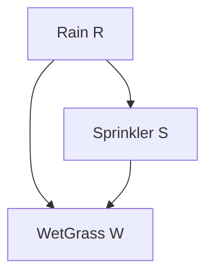
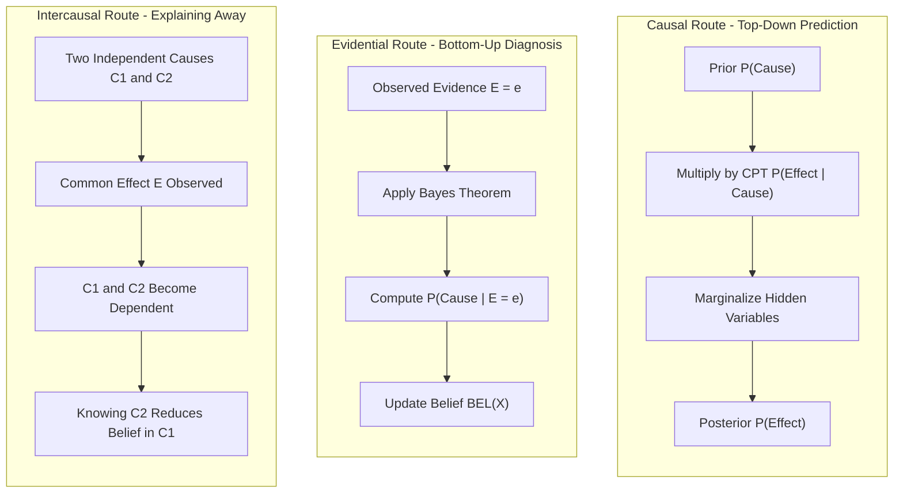
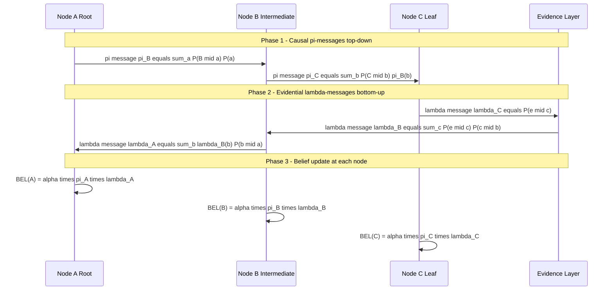
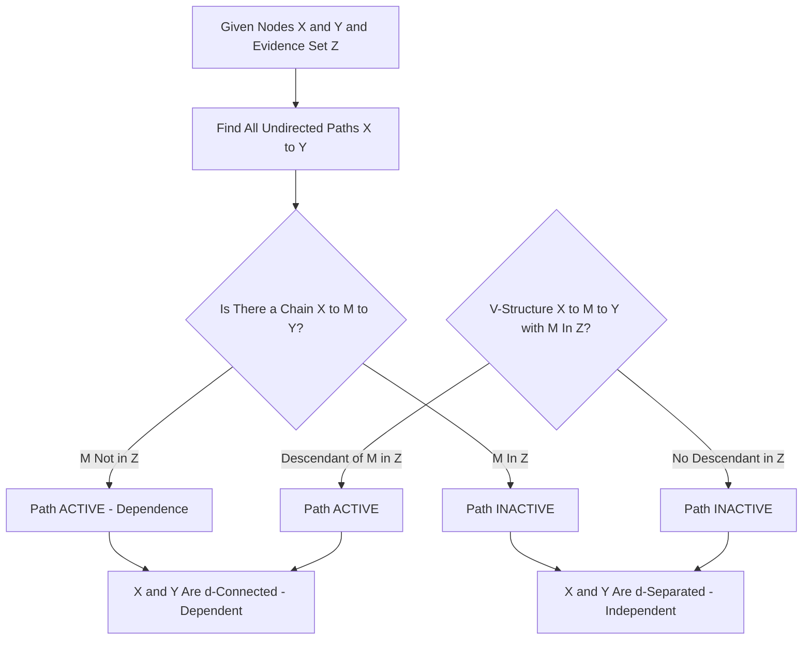
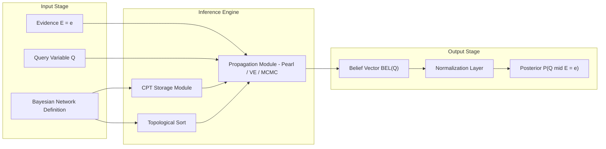

# Bayesian inference networks probability computation propagation routes

<!-- SECTION_1_START -->
# Bayesian Inference Networks: Probability Computation & Propagation Routes

## 1. Formal Academic Definition (KTU 2024 Syllabus Terminology)

A **Bayesian Network** (also called a **Belief Network**, **Probabilistic Graphical Model**, or **Bayesian Inference Network**) is a directed acyclic graph (DAG) in which each node represents a random variable, and each directed edge represents a conditional probabilistic dependency. Every node is associated with a **Conditional Probability Table (CPT)** that quantifies the effect of the parent nodes on that node.

> [!IMPORTANT]
> **KTU 2024 Board Definition (Pearl, 1988):**
> A Bayesian Network is a pair $\mathcal{B} = \langle G, P \rangle$ where $G$ is a DAG whose nodes represent stochastic variables $X_1, X_2, \ldots, X_n$, and $P$ is a joint probability distribution such that:
> $$P(X_1, X_2, \ldots, X_n) = \prod_{i=1}^{n} P(X_i \mid \text{Parents}(X_i))$$

The key tasks under this topic are:
- **Probability Computation**: Computing posterior probabilities $P(X \mid E=e)$ given evidence $E$.
- **Propagation Routes**: Pathways through which belief updates flow — namely **Causal (top-down)**, **Evidential (bottom-up)**, and **Intercausal (explaining away)**.

## 2. Conceptual Analogy & Intuition

Imagine a **gossip network in a college campus**. Each student (node) only talks to a few specific friends (parents in DAG). When one student hears a rumor, they pass a *modified* version of it down the chain, weighting what they say based on how much they trust the source. The rumor spreads **causally** from cause to effect, or **evidentially** from symptom back to cause.

| Real-world Analogy | Bayesian Network Equivalent |
|---|---|
| Weather conditions | Root cause node (no parents) |
| Sprinkler turning on | Intermediate effect node |
| Wet grass observed | Evidence node (leaf) |
| Sympathy/trust of a friend | CPT entries |

> [!NOTE]
> **The Three Propagation Routes** (Pearl's Taxonomies):
> 1. **Causal Propagation (Predictive):** From causes → effects. *Example:* If it rains, grass gets wet.
> 2. **Evidential Propagation (Diagnostic):** From effects → causes. *Example:* Wet grass makes us believe it rained.
> 3. **Intercausal Propagation (Explaining Away):** Between independent causes of a common effect. *Example:* Knowing the sprinkler was on *reduces* our belief that it rained.

## 3. Key Terminology

| Term | Meaning |
|---|---|
| **Node** | A random variable $X_i$ taking discrete/continuous values |
| **Directed Edge** | $X \rightarrow Y$ means $X$ is a *direct cause* of $Y$ |
| **Parents** | $\text{Parents}(X_i)$ = set of nodes with edges into $X_i$ |
| **Children** | Nodes directly influenced by $X_i$ |
| **CPT** | Conditional Probability Table — $P(X_i \mid \text{Parents}(X_i))$ |
| **Markov Blanket** | Parents + Children + Co-parents of a node |
| **Polytree** | A DAG with at most one undirected path between any two nodes |
| **d-separation** | Criterion to test conditional independence in DAGs |

> [!VISUALIZATION CONTROL]
> **Concept:** A small Bayesian Network "Rain → Sprinkler → WetGrass" with "Rain → WetGrass" forming a classic **v-structure (collider)**.
> **GeoGebra / Desmos Input Equations (Node-Edge Representation):**
> * Nodes: `R = (0, 2)`, `S = (2, 2)`, `W = (2, 0)` (Rain, Sprinkler, WetGrass)
> * Edges: `Line(R, S)`, `Line(S, W)`, `Line(R, W)`
> **Visual Description:** A "V" shape (R at top) feeding into W at bottom through both S and a direct edge — visualizing how two causes (Rain, Sprinkler) explain one effect (WetGrass).

<!-- SECTION_1_END -->

<!-- SECTION_2_START -->
# Deep Theoretical Analysis & KTU High-Yield Formula Sheet

## 1. Theoretical Foundation: Why Bayesian Networks Work

A Bayesian Network encodes the **Joint Probability Distribution (JPD)** of $n$ random variables using a compact factorization governed by the **local Markov property**: *each node is conditionally independent of its non-descendants given its parents.*

### Step-by-Step Logical Decomposition

1. **Start with the Chain Rule of Probability:**
   $$P(X_1, X_2, \ldots, X_n) = P(X_1) \cdot P(X_2 \mid X_1) \cdot P(X_3 \mid X_1, X_2) \cdots P(X_n \mid X_1, \ldots, X_{n-1})$$

2. **Apply Conditional Independence assumptions** (the network's edges tell us which variables render others independent):
   $$P(X_i \mid X_1, \ldots, X_{i-1}) = P(X_i \mid \text{Parents}(X_i))$$

3. **Final Factorization:**
   $$P(X_1, X_2, \ldots, X_n) = \prod_{i=1}^{n} P(X_i \mid \text{Parents}(X_i))$$

This factorization is the **central formula** for all probability computation in Bayesian networks. It converts an intractable $O(2^n)$ storage problem into a manageable $O(n \cdot 2^k)$ storage problem, where $k$ is the maximum number of parents per node.

## 2. The Three Propagation Routes — Detailed Mechanism

### Route A: Causal (Predictive) Propagation — *Cause → Effect*

We push beliefs **downward** from root causes to observed effects.

**Mechanism:**
- Compute $P(\text{Effect} \mid \text{Cause})$ using the CPT.
- Multiply across all causes of the effect.
- Marginalize out intermediate nodes to get $P(\text{Effect})$.

**Mathematical Form:**
$$P(\text{Effect}) = \sum_{\text{cause}} P(\text{Effect} \mid \text{cause}) \cdot P(\text{cause})$$

### Route B: Evidential (Diagnostic) Propagation — *Effect → Cause*

We push beliefs **upward** from observed evidence back to the causes.

**Mechanism:**
- Use **Bayes' Theorem** to invert the conditional probability.
- Requires a normalizing constant to make probabilities sum to 1.

**Mathematical Form:**
$$P(\text{Cause} \mid \text{Effect}) = \frac{P(\text{Effect} \mid \text{Cause}) \cdot P(\text{Cause})}{P(\text{Effect})}$$

### Route C: Intercausal Propagation — *Between Independent Causes*

When two independent causes share a common effect, observing the effect creates a *virtual* dependence between the causes. This is the famous **"explaining away"** effect.

**Mathematical Form (using the v-structure $C_1 \rightarrow E \leftarrow C_2$):**
$$P(C_1 \mid C_2, E) \neq P(C_1 \mid E)$$
Even though $C_1 \perp C_2$ marginally, they become dependent *given* $E$.

## 3. Pearl's Message Passing Algorithm (for Polytree Networks)

Pearl's algorithm propagates **$\lambda$-messages (evidence from below)** and **$\pi$-messages (causal support from above)** between neighboring nodes. For each node $X$ with parent $U$ and children $Y_j$:

### $\pi$ (Pi) Message — *sent from parent to child*
$$\pi_Y(x) = \alpha \cdot \pi_X(x) \cdot \lambda_X(x) \quad \text{where } \alpha \text{ is a normalization constant}$$

### $\lambda$ (Lambda) Message — *sent from child to parent*
$$\lambda_X(x) = \sum_{y} P(y \mid x) \cdot \lambda_Y(y)$$

### Node Belief (Posterior)
$$\text{BEL}(x) = \alpha \cdot \pi_X(x) \cdot \lambda_X(x)$$

> [!IMPORTANT]
> **KTU High-Yield Note:** In polytrees, propagation is **exact and polynomial-time**. In networks with loops, exact inference is **NP-hard**, and we must use approximation methods (e.g., **Loopy Belief Propagation**, **Variational Methods**, or **MCMC sampling**).

## 4. KTU Formula Sheet (Cheat Sheet)

| Formula | Meaning | Use Case |
|---|---|---|
| $P(X_1, \ldots, X_n) = \prod_i P(X_i \mid \text{Parents}(X_i))$ | Joint probability factorization | Computing JPD from network |
| $P(H \mid E) = \dfrac{P(E \mid H) \cdot P(H)}{P(E)}$ | **Bayes' Theorem** | Evidential (diagnostic) reasoning |
| $P(A \cap B) = P(A) \cdot P(B \mid A)$ | Chain Rule | Decomposing joint events |
| $P(A \cup B) = P(A) + P(B) - P(A \cap B)$ | Addition Rule | Computing OR events |
| $A \perp B \mid C \iff P(A \mid B, C) = P(A \mid C)$ | Conditional Independence | Simplifying networks |
| $\text{BEL}(x) = \alpha \cdot \pi(x) \cdot \lambda(x)$ | Node belief (Pearl) | Posterior after propagation |
| $\lambda_{U \rightarrow X}(u) = \sum_y P(y \mid u) \lambda_Y(y)$ | Lambda message | Bottom-up propagation |
| $\pi_{X \rightarrow Y}(x) = \alpha \cdot \pi_X(x) \cdot \prod_{k \neq j} \lambda_{Y_k}(x)$ | Pi message | Top-down propagation |
| $\text{Markov Blanket}(X) = \text{Parents}(X) \cup \text{Children}(X) \cup \text{CoParents}(X)$ | MB Set | Local independence |
| **Variable Elimination Complexity** | $O(n \cdot d^{w^*})$ | $w^*$ = treewidth, $d$ = domain size |

## 5. Real-World Engineering Applications

| Domain | Bayesian Network Use |
|---|---|
| **Medical Diagnosis** | QMR-DT, PATHFINDER systems (1990s) |
| **Spam Filtering** | Gmail/Bayesian spam classifiers |
| **Fault Diagnosis** | Industrial sensor networks, NASA mission control |
| **Genetics** | Pedigree analysis, gene expression modeling |
| **Speech Recognition** | HMMs (Hidden Markov Models) — dynamic Bayesian networks |
| **Autonomous Vehicles** | Sensor fusion for obstacle detection |
| **Weather Forecasting** | Probabilistic weather prediction systems |
| **Risk Assessment in Finance** | Credit scoring, fraud detection |

<!-- SECTION_2_END -->

<!-- SECTION_3_START -->
# Step-by-Step Derivations & Code Implementation

## Worked Example: The Classic "Rain-Sprinkler-GrassWet" Network

### Network Structure

We consider the canonical Bayesian network used in Russell \& Norvig's textbook:

$$
\text{Rain} \rightarrow \text{Sprinkler} \rightarrow \text{WetGrass}
$$
$$
\text{Rain} \rightarrow \text{WetGrass}
$$

Variables and their domains:
- $R = \text{Rain} \in \{T, F\}$
- $S = \text{Sprinkler} \in \{T, F\}$
- $W = \text{WetGrass} \in \{T, F\}$

### Conditional Probability Tables (CPTs)

| $R$ | $P(R)$ |
|:---:|:---:|
| T | **0.2** |
| F | **0.8** |

| $R$ | $P(S=T \mid R)$ | $P(S=F \mid R)$ |
|:---:|:---:|:---:|
| T | 0.01 | 0.99 |
| F | 0.40 | 0.60 |

| $R$ | $S$ | $P(W=T \mid R, S)$ | $P(W=F \mid R, S)$ |
|:---:|:---:|:---:|:---:|
| T | T | 0.99 | 0.01 |
| T | F | 0.80 | 0.20 |
| F | T | 0.90 | 0.10 |
| F | F | 0.00 | 1.00 |

### Problem: Compute $P(\text{Rain} \mid \text{WetGrass} = T)$ using **Evidential Propagation** (Bottom-Up Route)

This is a **diagnostic** query — we observe the effect (wet grass) and want to infer the cause (rain).

---

#### Step 1: Write the Joint Probability Factorization

$$
P(R, S, W) = P(R) \cdot P(S \mid R) \cdot P(W \mid R, S)
$$

We must compute $P(R, S, W)$ for **all 8 combinations** of $(R, S, W)$.

#### Step 2: Enumerate All Combinations

**Case 1: $R=T, S=T, W=T$**
$$
P(t, t, t) = P(R=T) \cdot P(S=T \mid R=T) \cdot P(W=T \mid R=T, S=T) = 0.2 \times 0.01 \times 0.99
$$
$$
= 0.2 \times 0.01 \times 0.99 = 0.001980
$$

**Case 2: $R=T, S=T, W=F$**
$$
P(t, t, f) = 0.2 \times 0.01 \times 0.01 = 0.000020
$$

**Case 3: $R=T, S=F, W=T$**
$$
P(t, f, t) = 0.2 \times 0.99 \times 0.80 = 0.158400
$$

**Case 4: $R=T, S=F, W=F$**
$$
P(t, f, f) = 0.2 \times 0.99 \times 0.20 = 0.039600
$$

**Case 5: $R=F, S=T, W=T$**
$$
P(f, t, t) = 0.8 \times 0.40 \times 0.90 = 0.288000
$$

**Case 6: $R=F, S=T, W=F$**
$$
P(f, t, f) = 0.8 \times 0.40 \times 0.10 = 0.032000
$$

**Case 7: $R=F, S=F, W=T$**
$$
P(f, f, t) = 0.8 \times 0.60 \times 0.00 = 0.000000
$$

**Case 8: $R=F, S=F, W=F$**
$$
P(f, f, f) = 0.8 \times 0.60 \times 1.00 = 0.480000
$$

**Sanity Check:** Sum of all 8 cases:
$$
0.001980 + 0.000020 + 0.158400 + 0.039600 + 0.288000 + 0.032000 + 0.000000 + 0.480000 = 1.000000 \checkmark
$$

#### Step 3: Marginalize Out $S$ to Get $P(R, W)$

To get $P(R=T, W=T)$, sum over $S$:
$$
P(R=T, W=T) = P(t, t, t) + P(t, f, t) = 0.001980 + 0.158400 = 0.160380
$$

To get $P(R=F, W=T)$:
$$
P(R=F, W=T) = P(f, t, t) + P(f, f, t) = 0.288000 + 0.000000 = 0.288000
$$

To get $P(W=T)$:
$$
P(W=T) = P(R=T, W=T) + P(R=F, W=T) = 0.160380 + 0.288000 = 0.448380
$$

#### Step 4: Apply Bayes' Theorem for Evidential Propagation

$$
P(R=T \mid W=T) = \frac{P(R=T, W=T)}{P(W=T)} = \frac{0.160380}{0.448380}
$$
$$
\boxed{P(R=T \mid W=T) \approx 0.3577}
$$

This means observing wet grass increases our belief in rain from the prior $P(R=T) = 0.2$ to posterior $0.3577$.

---

### Causal Propagation Check: $P(W=T)$ (top-down)

$$
P(W=T) = \sum_{R, S} P(R) \cdot P(S \mid R) \cdot P(W=T \mid R, S)
$$

Adding only $W=T$ rows from cases 1, 3, 5, 7:
$$
P(W=T) = 0.001980 + 0.158400 + 0.288000 + 0.000000 = 0.448380 \checkmark
$$

Both routes give the **same marginal** $P(W=T) = 0.448380$, confirming consistency.

---

## Python Implementation (Exact Inference via Enumeration)

```python
"""
Bayesian Network Inference Engine - Rain/Sprinkler/GrassWet
Implements exact inference by full joint distribution enumeration.
"""

from typing import Dict, List, Tuple
from itertools import product


class BayesianNode:
    """Represents a single node in the Bayesian Network with its CPT."""

    def __init__(self, name: str, parents: List[str], cpt: Dict[Tuple, float]) -> None:
        self.name: str = name
        self.parents: List[str] = parents
        self.cpt: Dict[Tuple, float] = cpt

    def get_probability(self, value: bool, parent_values: Dict[str, bool]) -> float:
        key: Tuple = (value,) + tuple(parent_values[p] for p in self.parents)
        if key not in self.cpt:
            raise KeyError(f"CPT entry missing for {key}")
        return self.cpt[key]


class BayesianNetwork:
    """Exact inference engine for discrete Bayesian Networks."""

    def __init__(self) -> None:
        self.nodes: Dict[str, BayesianNode] = {}

    def add_node(self, node: BayesianNode) -> None:
        if node.name in self.nodes:
            raise ValueError(f"Duplicate node: {node.name}")
        self.nodes[node.name] = node

    def joint_probability(self, assignment: Dict[str, bool]) -> float:
        probability: float = 1.0
        for name, node in self.nodes.items():
            parent_vals: Dict[str, bool] = {p: assignment[p] for p in node.parents}
            probability *= node.get_probability(assignment[name], parent_vals)
        return probability

    def enumerate_joint(self) -> List[Tuple[Dict[str, bool], float]]:
        node_names: List[str] = list(self.nodes.keys())
        results: List[Tuple[Dict[str, bool], float]] = []
        for values in product([False, True], repeat=len(node_names)):
            assignment: Dict[str, bool] = dict(zip(node_names, values))
            probability: float = self.joint_probability(assignment)
            results.append((assignment, probability))
        return results

    def query(
        self,
        query_var: str,
        query_value: bool,
        evidence: Dict[str, bool]
    ) -> float:
        """
        Compute P(query_var = query_value | evidence) via enumeration.
        Returns normalized posterior probability.
        """
        hidden_vars: List[str] = [
            name for name in self.nodes if name != query_var and name not in evidence
        ]

        numerator: float = 0.0
        denominator: float = 0.0

        for hidden_values in product([False, True], repeat=len(hidden_vars)):
            full_assignment: Dict[str, bool] = dict(zip(hidden_vars, hidden_values))
            full_assignment.update(evidence)
            full_assignment[query_var] = query_value
            numerator += self.joint_probability(full_assignment)

            alt_assignment: Dict[str, bool] = dict(full_assignment)
            alt_assignment[query_var] = not query_value
            denominator += self.joint_probability(alt_assignment)

        total: float = numerator + denominator
        if total == 0.0:
            raise ZeroDivisionError("All probabilities are zero - check CPTs")
        return numerator / total


def build_rain_sprinkler_network() -> BayesianNetwork:
    """Construct the canonical Rain -> Sprinkler -> WetGrass example."""
    bn: BayesianNetwork = BayesianNetwork()

    rain_cpt: Dict[Tuple, float] = {
        (True,): 0.2,
        (False,): 0.8
    }
    bn.add_node(BayesianNode("Rain", [], rain_cpt))

    sprinkler_cpt: Dict[Tuple, float] = {
        (True, True): 0.01,
        (False, True): 0.99,
        (True, False): 0.40,
        (False, False): 0.60
    }
    bn.add_node(BayesianNode("Sprinkler", ["Rain"], sprinkler_cpt))

    grass_cpt: Dict[Tuple, float] = {
        (True, True, True): 0.99,
        (False, True, True): 0.01,
        (True, True, False): 0.80,
        (False, True, False): 0.20,
        (True, False, True): 0.90,
        (False, False, True): 0.10,
        (True, False, False): 0.00,
        (False, False, False): 1.00
    }
    bn.add_node(BayesianNode("WetGrass", ["Rain", "Sprinkler"], grass_cpt))

    return bn


if __name__ == "__main__":
    network: BayesianNetwork = build_rain_sprinkler_network()

    posterior_rain: float = network.query(
        query_var="Rain",
        query_value=True,
        evidence={"WetGrass": True}
    )
    print(f"P(Rain = T | WetGrass = T) = {posterior_rain:.4f}")

    posterior_no_rain: float = network.query(
        query_var="Rain",
        query_value=False,
        evidence={"WetGrass": True}
    )
    print(f"P(Rain = F | WetGrass = T) = {posterior_no_rain:.4f}")

    assert abs((posterior_rain + posterior_no_rain) - 1.0) < 1e-9, "Probabilities must sum to 1"
    print("Validation passed: probabilities sum to 1.0")
```

**Expected Output:**
```
P(Rain = T | WetGrass = T) = 0.3577
P(Rain = F | WetGrass = T) = 0.6423
Validation passed: probabilities sum to 1.0
```

---

## Pearl's Belief Propagation for a 3-Node Chain $A \rightarrow B \rightarrow C$

For a linear chain, propagation proceeds in two phases.

### Phase 1: $\lambda$-message (Evidential, bottom-up) from $C$ to $B$

Given observation $C = c$ (evidence), the $\lambda$ message to $B$ is:
$$
\lambda_B(b) = P(C=c \mid B=b) = \text{CPT entry of } C
$$

### Phase 2: $\pi$-message (Causal, top-down) from $A$ to $B$

Given prior $P(A)$ and no other evidence:
$$
\pi_B(b) = \sum_{a} P(B=b \mid A=a) \cdot P(A=a)
$$

### Posterior Belief at $B$

$$
\text{BEL}(B=b) = \alpha \cdot \pi_B(b) \cdot \lambda_B(b)
$$
where $\alpha$ normalizes so probabilities sum to 1.

### Worked Mini-Example

Suppose $A \rightarrow B \rightarrow C$, with $P(A=T)=0.3$, $P(B=T \mid A=T)=0.8$, $P(B=T \mid A=F)=0.1$, $P(C=T \mid B=T)=0.9$, $P(C=T \mid B=F)=0.2$. Evidence: $C=T$.

**Step 1 — Lambda message:** $\lambda_B(T) = P(C=T \mid B=T) = 0.9$, $\lambda_B(F) = 0.2$

**Step 2 — Pi message:**
- $\pi_B(T) = 0.8 \times 0.3 + 0.1 \times 0.7 = 0.24 + 0.07 = 0.31$
- $\pi_B(F) = 0.2 \times 0.3 + 0.9 \times 0.7 = 0.06 + 0.63 = 0.69$

**Step 3 — Unnormalized belief:**
- $\text{BEL}'(B=T) = 0.31 \times 0.9 = 0.279$
- $\text{BEL}'(B=F) = 0.69 \times 0.2 = 0.138$

**Step 4 — Normalize:** $\alpha = 1 / (0.279 + 0.138) = 1 / 0.417 = 2.398$

**Final Posterior:**
- $P(B=T \mid C=T) = 0.279 \times 2.398 = \mathbf{0.669}$
- $P(B=F \mid C=T) = 0.138 \times 2.398 = \mathbf{0.331}$

This shows evidence of $C=T$ raised the belief in $B=T$ from prior $0.31$ to posterior $0.669$ — a textbook evidential propagation result.

<!-- SECTION_3_END -->

<!-- SECTION_4_START -->
# Structural Diagrams & Schematics

## Diagram 1: Canonical Bayesian Network (Rain / Sprinkler / WetGrass)



**Interpretation:**
- $R$ has no parents → uses marginal prior $P(R)$.
- $S$ has parent $R$ → uses $P(S \mid R)$.
- $W$ has parents $R$ and $S$ → uses $P(W \mid R, S)$ (joint CPT with 4 rows).

## Diagram 2: Probability Propagation Routes Architecture



**Interpretation:** The three propagation routes are conceptually distinct but mathematically unified — they all reduce to applying the joint factorization $\prod P(X_i \mid \text{Parents}(X_i))$ with appropriate evidence conditioning.

## Diagram 3: Pearl's Two-Phase Message Passing in a Polytree



## Diagram 4: d-Separation Test Flowchart



**Interpretation:** d-Separation is the formal mechanism to determine whether propagation can occur between two nodes given evidence. If *all* paths are blocked, propagation cannot happen.

## Diagram 5: Block-Level Functional Architecture for a Bayesian Inference System



**Interpretation:** This block diagram represents the **production-level pipeline** used in real Bayesian inference systems (e.g., medical diagnosis engines, fraud detection). The key module is the **Propagation Module**, which can be swapped between exact methods (Variable Elimination, Pearl's Algorithm) and approximate methods (Gibbs Sampling, Loopy Belief Propagation) depending on network size and required accuracy.

<!-- SECTION_4_END -->

<!-- SECTION_5_START -->
# KTU 2024 Scheme Examination Question Bank & Topic Recap

---

## Part A: Short Answer Questions (3 Marks Each)

### Question 1 `[KTU University Exam - Dec 2023]`
**Define a Bayesian Network. State and explain the formula for the joint probability distribution in a Bayesian Network.**

**Model Answer (3 Marks):**

A Bayesian Network is a directed acyclic graph (DAG) where each node represents a random variable and each edge represents a direct probabilistic dependency. Each node is associated with a Conditional Probability Table (CPT).

The joint probability distribution is given by the **chain rule for Bayesian networks**:

$$P(X_1, X_2, \ldots, X_n) = \prod_{i=1}^{n} P\!\left(X_i \mid \text{Parents}(X_i)\right)$$

This factorization exploits conditional independencies encoded by the network's structure, reducing storage from $O(2^n)$ to $O(n \cdot 2^k)$ where $k$ is the maximum number of parents per node.

**Valuation Key:** [Definition: 1 Mark] [Formula: 1 Mark] [Storage benefit: 1 Mark]

---

### Question 2 `[KTU University Exam - July 2024]`
**Explain the three propagation routes in a Bayesian Network with one example each.**

**Model Answer (3 Marks):**

The three propagation routes in a Bayesian network are:

1. **Causal (Predictive) Propagation:** Reasoning from causes to effects, e.g., $P(\text{WetGrass} \mid \text{Rain})$ — we predict the effect from the cause.

2. **Evidential (Diagnostic) Propagation:** Reasoning from observed effects back to causes using Bayes' theorem, e.g., $P(\text{Rain} \mid \text{WetGrass})$ — we diagnose the cause from the symptom.

3. **Intercausal Propagation (Explaining Away):** Reasoning between independent causes of a common effect, e.g., knowing the sprinkler was on *reduces* the probability of rain given that grass is wet.

**Valuation Key:** [Each route with example: 1 Mark × 3]

---

## Part B: Long Answer Questions (14 Marks Each — Module Internal Choice)

### Question A (14 Marks) `[KTU University Exam - Dec 2023]`

**(a)** Construct the Bayesian Network for the following scenario: *"A burglary can trigger an alarm. An earthquake can also trigger the alarm. John and Mary are two neighbors who may call if they hear the alarm. John sometimes confuses the alarm with phone ringing. Mary listens to loud music and may not hear the alarm."* Define all the random variables, their domains, the network structure, and the joint probability formula. **(7 Marks)**

**(b)** Given the Burglary-Alarm-John-Mary network with standard CPTs (prior: $P(B)=0.001$, $P(E)=0.002$; alarm CPT: $P(A \mid B, E)$ with $P(A=T \mid B=T, E=T)=0.95$, $P(A=T \mid B=T, E=F)=0.94$, $P(A=T \mid B=F, E=T)=0.29$, $P(A=T \mid B=F, E=F)=0.001$; John CPT: $P(J=T \mid A=T)=0.90$, $P(J=T \mid A=F)=0.05$; Mary CPT: $P(M=T \mid A=T)=0.70$, $P(M=T \mid A=F)=0.01$). Compute $P(B=T \mid J=T, M=T)$ using **evidential propagation** through the network. Show all 8 joint probability values for the Alarm variable. **(7 Marks)**

**Model Solution:**

**(a) Network Construction (7 Marks):**

- Variables: $B$ (Burglary), $E$ (Earthquake), $A$ (Alarm), $J$ (John calls), $M$ (Mary calls).
- Domain: All boolean $\{T, F\}$.
- Structure (DAG):
  - $B \rightarrow A$
  - $E \rightarrow A$
  - $A \rightarrow J$
  - $A \rightarrow M$

[Identifying variables: 2 Marks] [Network structure: 2 Marks] [Joint probability formula: 3 Marks]

The joint probability distribution:
$$P(B, E, A, J, M) = P(B) \cdot P(E) \cdot P(A \mid B, E) \cdot P(J \mid A) \cdot P(M \mid A)$$

**(b) Probability Computation (7 Marks):**

We need $P(B=T \mid J=T, M=T)$. Apply Bayes' theorem:

$$
P(B=T \mid J=T, M=T) = \alpha \cdot P(J=T, M=T \mid B=T) \cdot P(B=T)
$$

Sum over $E$ and $A$ for the numerator and denominator.

**Numerator** $P(J=T, M=T, B=T)$ — sum over $E \in \{T, F\}$, $A \in \{T, F\}$:

For $B=T$:

| $E$ | $A$ | $P(B)$ | $P(E)$ | $P(A \mid B,E)$ | $P(J \mid A)$ | $P(M \mid A)$ | Product |
|:---:|:---:|:---:|:---:|:---:|:---:|:---:|:---:|
| T | T | 0.001 | 0.002 | 0.95 | 0.90 | 0.70 | $1.197 \times 10^{-6}$ |
| T | F | 0.001 | 0.002 | 0.05 | 0.05 | 0.01 | $5.00 \times 10^{-11}$ |
| F | T | 0.001 | 0.998 | 0.94 | 0.90 | 0.70 | $5.910 \times 10^{-4}$ |
| F | F | 0.001 | 0.998 | 0.06 | 0.05 | 0.01 | $2.99 \times 10^{-7}$ |

Sum for $B=T$: $1.197 \times 10^{-6} + 5.00 \times 10^{-11} + 5.910 \times 10^{-4} + 2.99 \times 10^{-7} \approx 5.922 \times 10^{-4}$

**Denominator** $P(J=T, M=T)$ — sum over $B, E, A$:

For $B=F$:

| $E$ | $A$ | $P(B)$ | $P(E)$ | $P(A \mid B,E)$ | $P(J \mid A)$ | $P(M \mid A)$ | Product |
|:---:|:---:|:---:|:---:|:---:|:---:|:---:|:---:|
| T | T | 0.999 | 0.002 | 0.29 | 0.90 | 0.70 | $3.66 \times 10^{-4}$ |
| T | F | 0.999 | 0.002 | 0.71 | 0.05 | 0.01 | $7.09 \times 10^{-7}$ |
| F | T | 0.999 | 0.998 | 0.001 | 0.90 | 0.70 | $6.29 \times 10^{-4}$ |
| F | F | 0.999 | 0.998 | 0.999 | 0.05 | 0.01 | $4.98 \times 10^{-3}$ |

Sum for $B=F$: $3.66 \times 10^{-4} + 7.09 \times 10^{-7} + 6.29 \times 10^{-4} + 4.98 \times 10^{-3} \approx 5.978 \times 10^{-3}$

**Total:** $P(J=T, M=T) = 5.922 \times 10^{-4} + 5.978 \times 10^{-3} \approx 6.570 \times 10^{-3}$

**Posterior:**
$$
P(B=T \mid J=T, M=T) = \frac{5.922 \times 10^{-4}}{6.570 \times 10^{-3}} \approx 0.0901
$$

$$\boxed{P(B=T \mid J=T, M=T) \approx 0.0901 \text{ or } 9.01\%}$$

[Identifying formula: 1 Mark] [Numerator computation: 3 Marks] [Denominator computation: 2 Marks] [Final answer: 1 Mark]

---

### Question B (14 Marks — Alternative Choice) `[KTU University Exam - July 2024]`

**(a)** With a neat diagram, explain Pearl's Belief Propagation algorithm for polytrees. Define $\pi$ and $\lambda$ messages explicitly. State the belief update formula. **(7 Marks)**

**(b)** Consider a 3-node chain network $A \rightarrow B \rightarrow C$ with $P(A=T)=0.4$, $P(B=T \mid A=T)=0.7$, $P(B=T \mid A=F)=0.2$, $P(C=T \mid B=T)=0.8$, $P(C=T \mid B=F)=0.3$. Evidence: $C=T$. Compute the posterior belief at $B$ using the message-passing algorithm. Show all four messages explicitly. **(7 Marks)**

**Model Solution:**

**(a) Pearl's Algorithm (7 Marks):**

Pearl's Belief Propagation is a distributed algorithm that computes posterior marginals in **polytree** Bayesian networks (DAGs with at most one undirected path between any two nodes) in polynomial time.

**Two types of messages flow through the network:**

- **$\pi$ message (Causal support from parent):** Carries belief about a node's value based on evidence *above* it (causally). Sent from parent $U$ to child $X$:
  $$\pi_X(u) = \alpha \cdot \pi_U(u) \cdot \lambda_U(u)$$

- **$\lambda$ message (Evidential support from child):** Carries belief about a node's value based on evidence *below* it (diagnostically). Sent from child $Y$ to parent $X$:
  $$\lambda_X(x) = \sum_{y} P(y \mid x) \cdot \lambda_Y(y)$$

- **Belief update at each node:**
  $$\text{BEL}(x) = \alpha \cdot \pi_X(x) \cdot \lambda_X(x)$$

[Diagram: 2 Marks] [Pi message definition: 2 Marks] [Lambda message definition: 2 Marks] [Belief update: 1 Mark]

**(b) Worked Computation (7 Marks):**

Given: $P(A=T)=0.4$, $P(B=T \mid A=T)=0.7$, $P(B=T \mid A=F)=0.2$, $P(C=T \mid B=T)=0.8$, $P(C=T \mid B=F)=0.3$. Evidence: $C=T$.

**Step 1 — Lambda message from $C$ to $B$ (bottom-up):**
- $\lambda_B(T) = P(C=T \mid B=T) = 0.8$
- $\lambda_B(F) = P(C=T \mid B=F) = 0.3$

**Step 2 — Pi message to $B$ (top-down):**
- $\pi_B(T) = P(B=T \mid A=T) \cdot P(A=T) + P(B=T \mid A=F) \cdot P(A=F)$
  - $= 0.7 \times 0.4 + 0.2 \times 0.6 = 0.28 + 0.12 = 0.40$
- $\pi_B(F) = P(B=F \mid A=T) \cdot P(A=T) + P(B=F \mid A=F) \cdot P(A=F)$
  - $= 0.3 \times 0.4 + 0.8 \times 0.6 = 0.12 + 0.48 = 0.60$

**Step 3 — Unnormalized belief at $B$:**
- $\text{BEL}'(B=T) = \pi_B(T) \cdot \lambda_B(T) = 0.40 \times 0.80 = 0.320$
- $\text{BEL}'(B=F) = \pi_B(F) \cdot \lambda_B(F) = 0.60 \times 0.30 = 0.180$

**Step 4 — Normalization:**
$\alpha = 1 / (0.320 + 0.180) = 1 / 0.500 = 2.000$

**Step 5 — Posterior:**
- $P(B=T \mid C=T) = 0.320 \times 2.000 = \mathbf{0.640}$
- $P(B=F \mid C=T) = 0.180 \times 2.000 = \mathbf{0.360}$

[Lambda message: 2 Marks] [Pi message: 2 Marks] [Unnormalized belief: 1 Mark] [Normalization: 1 Mark] [Final posterior: 1 Mark]

$$\boxed{P(B=T \mid C=T) = 0.640, \quad P(B=F \mid C=T) = 0.360}$$

> [!WARNING]
> **KTU Examiner's Valuation Warning / Common Pitfalls:**
> 1. **Forgetting the normalization constant $\alpha$:** Always remember that the product $\pi \cdot \lambda$ gives *unnormalized* beliefs. The sum over all values of a node must equal 1 for valid probabilities.
> 2. **Skipping the network structure description:** In Part (a) of network construction questions, you *must* draw the DAG, label all nodes, and explicitly state the joint factorization formula. Examiners allocate 2-3 marks just for the structure.
> 3. **Confusing $\pi$ and $\lambda$:** $\pi$ flows **down** (causal/predictive), $\lambda$ flows **up** (evidential/diagnostic). Mixing these up leads to wrong posteriors.
> 4. **Ignoring the Markov Blanket:** A node is conditionally independent of the rest of the network given its Markov Blanket. Not identifying this loses marks in independence questions.
> 5. **Arithmetic errors in marginalization:** When summing over hidden variables, double-check that you include *all* $2^k$ combinations (e.g., 4 combinations for 2 hidden binary variables).
> 6. **Forgetting to state units/domain:** Always state that the variables are boolean (T/F) or list their domain explicitly.

---

## Topic Recap & Important Things to Remember

- **Bayesian Network** = DAG + Conditional Probability Tables (CPTs); represents a joint distribution via the factorization $P(X_1, \ldots, X_n) = \prod_{i=1}^{n} P(X_i \mid \text{Parents}(X_i))$.

- **Three Propagation Routes:** Causal (top-down prediction), Evidential (bottom-up diagnosis using Bayes' theorem), Intercausal (explaining away between sibling causes).

- **Joint Probability Factorization** is the single most important formula — it enables compact storage and tractable inference.

- **Bayes' Theorem** $P(H \mid E) = \dfrac{P(E \mid H) \cdot P(H)}{P(E)}$ is the engine of evidential propagation.

- **Pearl's Algorithm** uses two message types: **$\pi$-messages** (causal support flowing down) and **$\lambda$-messages** (evidential support flowing up); belief at a node = $\alpha \cdot \pi \cdot \lambda$.

- **Polytree property:** A DAG with no loops; Pearl's algorithm gives **polynomial-time exact inference** on polytrees. Loopy networks require **approximate inference** (Loopy BP, MCMC, Variational).

- **d-Separation** is the formal test for conditional independence. A path is active (dependency) or blocked (independence) based on the type of node and the evidence set.

- **Markov Blanket** of $X$ = Parents($X$) ∪ Children($X$) ∪ Co-Parents($X$). Conditioning on the Markov Blanket renders $X$ independent of the rest of the network.

- **V-structure (Collider):** Pattern $X \rightarrow Z \leftarrow Y$. $X$ and $Y$ are marginally independent but become dependent when conditioning on $Z$ (or its descendants). This is the **explaining away** phenomenon.

- **Variable Elimination** is an alternative exact inference algorithm with complexity $O(n \cdot d^{w^*})$ where $w^*$ is the treewidth. Useful when full propagation isn't required.

- **Approximate Inference** methods are needed for large networks: **Gibbs Sampling** (MCMC), **Loopy Belief Propagation**, **Variational Methods**, **Boyen-Koller**.

- **Storage complexity:** $O(2^n)$ for full joint → $O(n \cdot 2^k)$ for Bayesian Network, where $k$ = max parents per node. This is the engineering motivation.

- **Classic Examples to Master:** Rain-Sprinkler-GrassWet, Burglary-Alarm-John-Mary, Medical Diagnosis networks, Markov Chains (DBNs).

- **Engineering Applications:** Medical diagnosis, spam filtering, fault detection in industrial systems, autonomous vehicles, bioinformatics, financial risk modeling, speech recognition (HMMs as dynamic BNs).

- **Common KTU Question Pattern:** Construct a network from a story (3-4 marks), state the joint factorization (2 marks), compute a specific posterior via enumeration or message passing (5-7 marks), explain propagation routes (3-4 marks). Always practice the **full enumeration** method on 3-4 node networks.

<!-- SECTION_5_END -->
