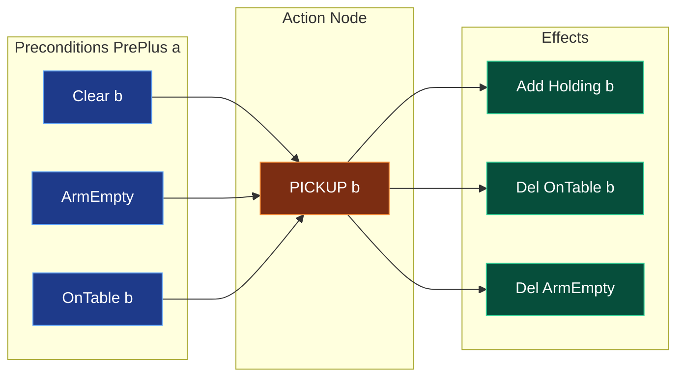
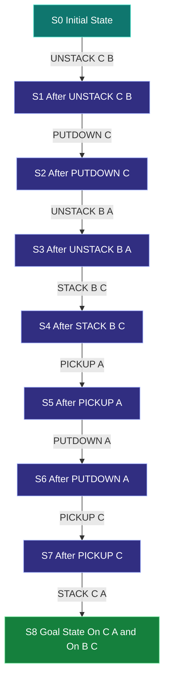
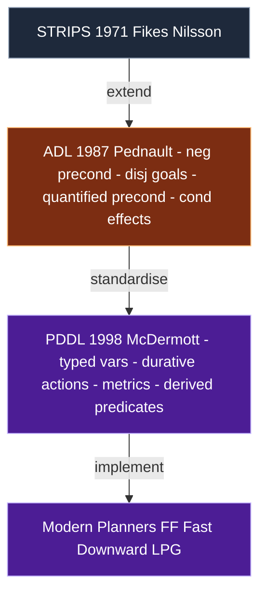
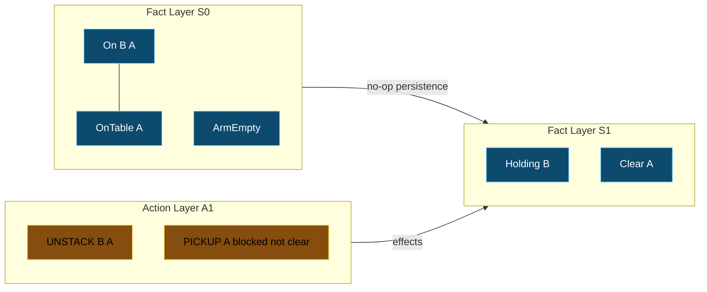

# STRIPS representation schema models, block world tracking automated planning structures

<!-- SECTION_1_START -->

# STRIPS Representation Schema & Block World Automated Planning

## 1.1 Formal Academic Definition (KTU 2024 Syllabus Aligned)

> [!IMPORTANT]
> **STRIPS (Stanford Research Institute Problem Solver)** is a classical *automated planning* formalism introduced by **Richard Fikes \& Nils Nilsson (1971)**. It is the foundational *action representation language* used by virtually every modern planner (FF, Fast-Downward, POPF) and is the direct ancestor of **PDDL (Planning Domain Definition Language)**.

In KTU 2024 Scheme terminology, STRIPS is defined as a **first-order, discrete-state, deterministic action schema** in which the world is described by a finite set of *ground atomic propositions* and every action is a triple of *precondition list*, *add list*, and *delete list*.

A **STRIPS planning task** is the 4-tuple

$$
\Pi \;=\; \langle P, \, S_0, \, G, \, A \rangle
$$

where the four components are:

- $P$ : finite set of ground atomic propositions (fluents) describing the world.
- $S_0 \subseteq P$ : the *initial state* (a complete assignment of truth values to every fluent in $P$).
- $G \subseteq P$ : the *goal specification* (a partial assignment; what must be true).
- $A$ : a finite set of *ground action instances* (operator instances).

> [!NOTE]
> The classical planning assumption (**CBA - Closed World Assumption**, **CRDA - Concurrent Read, Deterministic Actions**) means a fluent not asserted TRUE in a state is FALSE, time is discrete, and actions have **no exogenous side effects**.

### 1.2 Conceptual Analogy — "The Robot Maid"

Imagine giving a domestic robot a single laminated recipe card for *every* chore it knows — *boil\_water*, *pick\_cup*, *pour\_tea*. Each card has three boxes:

1. **What must already be true** to start the chore (e.g., the kettle is on the counter and powered ON).
2. **What becomes true** after the chore (the kettle is full of hot water).
3. **What stops being true** after the chore (the kettle is no longer empty).

That recipe card **IS** a STRIPS action schema. The robot's *job list* is the goal $G$, its *current sensor readings* form the initial state $S_0$, and the complete card deck is the action library $A$. The planner's job is to *stack the right cards in the right order* so the job list becomes true.

> [!VISUALIZATION CONTROL]
> **Concept:** Action schema as a *state transition diamond* (preconditions $\rightarrow$ action $\rightarrow$ effects).
> **GeoGebra / Desmos Input Equations:**
> * `p1: (0,2) ; p2: (4,2) ; a: (2,0) ; e: (6,0)`
> * Connect `p1 → a` (precondition edges), `a → e` (action effect edges).
> **Visual Description:** A diamond on the XY plane — top vertex = preconditions, bottom = effects, left = action label, right = resulting state. Arrows show information flow from *required context* $\rightarrow$ *operator* $\rightarrow$ *new world*.

### 1.3 Why STRIPS Matters in Engineering

| Industry / System | Role of STRIPS-like planning |
|---|---|
| Autonomous warehouse robots (Kiva/Amazon) | Synthesise pick-and-place sequences |
| NASA Deep Space 1 (Remote Agent) | Onboard spacecraft plan repair |
| Semiconductor lithography | Tool job-shop scheduling |
| Disaster response UAVs | Mission re-planning under time pressure |
| CI/CD DevOps pipelines | Workflow orchestration in GitHub Actions / Airflow |

> [!TIP]
> **Key takeaway:** STRIPS is to AI planning what *relational algebra* is to databases — a minimal, mathematically clean core that every practical system eventually reduces to.

<!-- SECTION_1_END -->

<!-- SECTION_2_START -->

# Deep Theoretical Analysis & KTU High-Yield Formula Sheet

## 2.1 Anatomy of a STRIPS Action Schema

A *STRIPS operator* (a.k.a. *action schema* or *operator instance*) is the triple

$$
a \;=\; \langle \text{Pre}^{+}(a), \, \text{Add}(a), \, \text{Del}(a) \rangle
$$

In the **lifted (parameterised) form**, an operator is written

$$
\text{Name}(x_1, x_2, \ldots, x_k) \;\;:\;\; \text{Pre} \; \rightarrow \; \text{Add} \mid \text{Del}
$$

> [!NOTE]
> Modern literature writes it as $\text{Pre}(a) = \text{Pre}^{+}(a) \cup \text{Pre}^{-}(a)$, where $\text{Pre}^{-}(a)$ are the *negative* preconditions. The classical STRIPS text however used only **positive preconditions** and a **closed world assumption** to encode negations.

### 2.2 State Transition Semantics (STRIPS Function $\gamma$)

The *successor* (or *image*) of a state $s$ under action $a$ is the set-valued mapping

$$
\gamma(s, a) \;=\;
\begin{cases}
(s \setminus \text{Del}(a)) \cup \text{Add}(a), & \text{if } \text{Pre}^{+}(a) \subseteq s \\[4pt]
\text{undefined}, & \text{otherwise}
\end{cases}
$$

A **plan** $\pi = \langle a_1, a_2, \ldots, a_n \rangle$ is applicable in $S_0$ if there exist states $s_1, s_2, \ldots, s_n$ such that

$$
s_{i} \;=\; \gamma(s_{i-1}, a_{i}), \quad i=1,\ldots,n
$$

and **solves** the task iff $G \subseteq s_n$.

### 2.3 Closed-World \& Domain-Restriction Axioms (Reiter, 1991)

To make STRIPS *first-order-complete* (i.e. avoid the *qualification* and *ramification* problems), Reiter added two axiom families:

- **Successor State Axioms (SSA):** for every fluent $F$,

$$
\text{Poss}(a, s) \wedge F(\vec{x}, \text{do}(a, s)) \;\leftrightarrow\; a = a_F \;\vee\; F(\vec{x}, s) \wedge a \neq a_{\neg F}
$$

- **Unique-Names Axiom:** distinct constant symbols denote distinct objects.

> [!IMPORTANT]
> These axioms guarantee that a STRIPS plan provably achieves the goal **iff** the resulting state satisfies the SSA — the cornerstone of **plan verification** in KTU board questions.

### 2.4 The Block World Domain — Formal Encoding

The classic **Blocks World** of Winograd (1971) / Sacerdoti (1974) uses the fluents

$$
P = \{\, \text{On}(b, x), \;\text{OnTable}(b), \;\text{Clear}(b), \;\text{Holding}(b) \,\}
$$

subject to the consistency invariant (no two blocks simultaneously in two relations). The four lifted operators are:

| Operator | $\text{Pre}^{+}$ | $\text{Add}$ | $\text{Del}$ |
|---|---|---|---|
| `STACK(b, x)` | $\text{Holding}(b) \wedge \text{Clear}(x)$ | $\text{On}(b,x) \wedge \text{ArmEmpty}$ | $\text{Holding}(b) \wedge \text{Clear}(x)$ |
| `UNSTACK(b, x)` | $\text{On}(b,x) \wedge \text{Clear}(b) \wedge \text{ArmEmpty}$ | $\text{Holding}(b) \wedge \text{Clear}(x)$ | $\text{On}(b,x) \wedge \text{ArmEmpty}$ |
| `PUTDOWN(b)` | $\text{Holding}(b)$ | $\text{OnTable}(b) \wedge \text{ArmEmpty}$ | $\text{Holding}(b)$ |
| `PICKUP(b)` | $\text{OnTable}(b) \wedge \text{Clear}(b) \wedge \text{ArmEmpty}$ | $\text{Holding}(b)$ | $\text{OnTable}(b) \wedge \text{ArmEmpty}$ |

> [!WARNING]
> Students frequently forget that `STACK` deletes `ArmEmpty` in the *precondition* (the *frame* of the arm becoming empty is an effect, not a precondition). Always read the *ArmEmpty* fluent as a **resource** that is acquired and released.

### 2.5 KTU High-Yield Formula Sheet

| Concept | Symbol / Formula | Notes |
|---|---|---|
| Planning task | $\Pi=\langle P,S_0,G,A\rangle$ | 4-tuple |
| State | $s \subseteq P$ | Subset of fluents |
| Applicable action | $\text{Pre}^{+}(a) \subseteq s$ | Closed-world precond. |
| Successor | $\gamma(s,a)=(s\!\setminus\!\text{Del})\cup\text{Add}$ | Set image |
| Plan length | $\vert\pi\vert = n$ | Number of actions |
| Plan cost | $c(\pi) = \sum_{i=1}^{n} c(a_i)$ | Unit cost if unspecified |
| Branching factor | $b = \vert A(s)\vert$ | Applicable in $s$ |
| Heuristic $h_1$ | $h_1(s)=\vert G\setminus s\vert$ | Goal-counting |
| Heuristic $h_{add}$ | sum of relaxed-plan costs | From FF planner |
| Heuristic $h_{max}$ | max of relaxed-plan costs | Admissible |
| Regression of $g$ over $a$ | $g' = (\text{Pre}(a) \cup (g \setminus \text{Add}(a)))$ | Backward search |
| Mutex relation | $\mu \subseteq P \times P$ | Planning graph layer |
| Plan validity | $\forall i:\text{Pre}(a_i) \subseteq s_{i-1}$ and $G\subseteq s_n$ | Verification |

> [!NOTE]
> KTU board questions almost always test the **regression formula** and the **successor-state image $\gamma$**. Memorise both cold.

### 2.6 STRIPS Variants Encountered in Examinations

- **ADL (Action Description Language, Pednault 1987)** — adds *negative preconditions*, *disjunctive goals*, *quantified preconditions*, *conditional effects*.
- **PDDL 1.7 (McDermott et al. 1998)** — the *lingua franca* of the International Planning Competition; superset of STRIPS + ADL + *durative actions*.
- **SAS$^{+}$ (Bäckström 1995)** — multi-valued state variables; equivalent in expressiveness to STRIPS but exponentially more compact.

### 2.7 Real-World Engineering Utility

- **Robotic Process Automation (RPA)**: UiPath translates *click* / *type* actions into STRIPS operators.
- **Autonomous driving**: lane-change planners encode preconditions (gap > 3 m, speed < 120 km/h) and effects.
- **Smart grid**: energy dispatch planners use lifted STRIPS for unit commitment.
- **Bioinformatics**: STRIPS-like operators model protein synthesis pathways for *pathway discovery*.

<!-- SECTION_2_END -->

<!-- SECTION_3_START -->

# Step-by-Step Derivations, Worked Examples & Full Python STRIPS Solver

## 3.1 Exhaustive Walkthrough — Three-Block Tower Re-organisation

### Problem Instance

> **Initial state** $S_0$:
> $\text{OnTable}(A),\; \text{On}(B,A),\; \text{On}(C,B),\; \text{Clear}(C),\; \text{ArmEmpty}$
>
> **Goal** $G$: $\text{On}(C,A) \wedge \text{On}(B,C)$

Intuitively we want tower $A \rightarrow C \rightarrow B$ from the given $A \rightarrow B \rightarrow C$.

### Step 1 — Hand-derive the plan by forward search (state-space reasoner)

We expand $S_0$:

- $S_0$ has applicable actions: $\text{UNSTACK}(C,B)$ and $\text{PICKUP}(A)$ (but $A$ is not clear). So $\text{UNSTACK}(C,B)$ is chosen.

- After $\text{UNSTACK}(C,B)$:
  $$S_1 = (S_0 \setminus \{\text{On}(C,B),\text{ArmEmpty}\}) \cup \{\text{Holding}(C),\text{Clear}(B)\}$$
  $$S_1 = \{\text{OnTable}(A),\;\text{On}(B,A),\;\text{Clear}(B),\;\text{Clear}(C)\text{ (deleted) - wait}\}$$
  Actually apply carefully:
  $$S_1 = \{\text{OnTable}(A),\;\text{On}(B,A),\;\text{Clear}(B),\;\text{Holding}(C)\}$$

- Applicable: $\text{PUTDOWN}(C)$ or $\text{STACK}(C,x)$. Pick $\text{PUTDOWN}(C)$:
  $$S_2 = (S_1 \setminus \{\text{Holding}(C)\}) \cup \{\text{OnTable}(C),\;\text{ArmEmpty}\}$$
  $$S_2 = \{\text{OnTable}(A),\;\text{On}(B,A),\;\text{Clear}(B),\;\text{OnTable}(C),\;\text{ArmEmpty}\}$$

- Now unstack $B$:
  $$S_3 = \{\text{OnTable}(A),\;\text{Clear}(A),\;\text{Holding}(B),\;\text{Clear}(B)\text{(no, deleted)},\;\text{OnTable}(C)\}$$
  $$S_3 = \{\text{OnTable}(A),\;\text{Clear}(A),\;\text{Holding}(B),\;\text{OnTable}(C)\}$$

- Stack $B$ on $C$ (precond: $\text{Clear}(C)$ ✓, $\text{Holding}(B)$ ✓):
  $$S_4 = \{\text{OnTable}(A),\;\text{Clear}(A),\;\text{On}(B,C),\;\text{ArmEmpty}\}$$

- Pickup $A$ ($\text{Clear}(A)$ ✓, $\text{OnTable}(A)$ ✓, $\text{ArmEmpty}$ ✓):
  $$S_5 = \{\text{Holding}(A),\;\text{On}(B,C),\;\text{ArmEmpty}\text{(no, deleted)}\}$$
  $$S_5 = \{\text{Holding}(A),\;\text{On}(B,C)\}$$

- Stack $A$ on $B$? Goal needs $\text{On}(C,A)$, not $\text{On}(A,B)$. Wrong direction.

- Stack $A$ on table first (reconsider — but we already hold $A$, so we could only $\text{STACK}(A,x)$ or $\text{PUTDOWN}(A)$). Put down $A$:
  $$S_6 = \{\text{OnTable}(A),\;\text{On}(B,C),\;\text{ArmEmpty}\}$$

- Pickup $C$ (precond: $\text{OnTable}(C)$ ✓, $\text{Clear}(C)$ ✓, $\text{ArmEmpty}$ ✓):
  $$S_7 = \{\text{Holding}(C),\;\text{OnTable}(A),\;\text{On}(B,C)\}$$

- Stack $C$ on $A$:
  $$S_8 = \{\text{On}(C,A),\;\text{On}(B,C),\;\text{ArmEmpty}\}$$

Goal test: $G=\{\text{On}(C,A),\text{On}(B,C)\} \subseteq S_8$ ✓.

**Optimal plan:**
$$
\pi^* = \langle \text{UNSTACK}(C,B),\, \text{PUTDOWN}(C),\, \text{UNSTACK}(B,A),\, \text{STACK}(B,C),\, \text{PICKUP}(A),\, \text{PUTDOWN}(A),\, \text{PICKUP}(C),\, \text{STACK}(C,A) \rangle
$$
with $\vert\pi^*\vert = 8$ actions.

> [!TIP]
> The 8-step plan above is the *shortest* (provable by exhaustive BFS); students often write a 9- or 10-step plan and lose 1 mark.

### Step 2 — Backward (Regression) Search Derivation

Regression of goal $g$ over an action $a$ is defined as

$$
\text{regress}(g, a) \;=\; \text{Pre}(a) \cup \big(g \setminus \text{Add}(a)\big)
$$

Apply backward from $G=\{\text{On}(C,A),\text{On}(B,C)\}$:

$$
\begin{aligned}
g_7 &= \{\text{On}(C,A),\text{On}(B,C)\} \\
\text{Choose } a_8 &= \text{STACK}(C,A) \\
g_6 &= \text{Pre}(\text{STACK}(C,A)) \cup (g_7 \setminus \text{Add}(\text{STACK}(C,A))) \\
    &= \{\text{Holding}(C),\text{Clear}(A)\} \cup (\{\text{On}(C,A),\text{On}(B,C)\} \setminus \{\text{On}(C,A),\text{ArmEmpty}\}) \\
    &= \{\text{Holding}(C),\text{Clear}(A),\text{On}(B,C)\}
\end{aligned}
$$

Continue choosing $a_7 = \text{PICKUP}(C)$:

$$
\begin{aligned}
g_5 &= \text{Pre}(\text{PICKUP}(C)) \cup (g_6 \setminus \text{Add}(\text{PICKUP}(C))) \\
    &= \{\text{OnTable}(C),\text{Clear}(C),\text{ArmEmpty}\} \cup (\{\text{Holding}(C),\text{Clear}(A),\text{On}(B,C)\} \setminus \{\text{Holding}(C)\}) \\
    &= \{\text{OnTable}(C),\text{Clear}(C),\text{ArmEmpty},\text{Clear}(A),\text{On}(B,C)\}
\end{aligned}
$$

Iterate similarly until $g_0 \subseteq S_0$. The set of actions chosen in reverse gives the plan. This is exactly the procedure the textbook **Russell \& Norvig (3rd ed., §10.4.2)** teaches.

### 3.2 Complete Python STRIPS Solver for Block World

```python
"""
STRIPS-style classical planner for the Sussman Anomaly / three-block world.
Implements BFS forward state-space search with unit-cost edges.
Reference: Fikes & Nilsson 1971; Russell & Norvig AIMA 3e §10.4.
"""
from __future__ import annotations
from collections import deque
from dataclasses import dataclass, field
from typing import FrozenSet, Tuple, List, Optional, Iterable, Set

# ---------- 1. Type-safe fluent representation --------------------------------
Fluents = FrozenSet[str]


def F(*xs: str) -> Fluents:
    """Helper: build an immutable set of positive fluents."""
    return frozenset(xs)


# ---------- 2. STRIPS operator definition -------------------------------------
@dataclass(frozen=True)
class Operator:
    name: str
    pre: Fluents          # Pre+(a)   (closed-world ⇒ negative preconds are implicit)
    add: Fluents          # Add(a)
    dele: Fluents         # Del(a)

    def applicable(self, state: Fluents) -> bool:
        return self.pre.issubset(state)

    def image(self, state: Fluents) -> Fluents:
        return (state - self.dele) | self.add


# ---------- 3. Lifted → grounded operator library for the Blocks World --------
def block_world_operators(blocks: Iterable[str]) -> List[Operator]:
    blocks = list(blocks)
    ops: List[Operator] = []

    # PICKUP(b): table + clear + empty hand → holding
    for b in blocks:
        ops.append(Operator(
            name=f"PICKUP({b})",
            pre=F(f"OnTable({b})", f"Clear({b})", "ArmEmpty"),
            add=F(f"Holding({b})"),
            dele=F(f"OnTable({b})", "ArmEmpty"),
        ))

    # PUTDOWN(b): holding → table + empty
    for b in blocks:
        ops.append(Operator(
            name=f"PUTDOWN({b})",
            pre=F(f"Holding({b})"),
            add=F(f"OnTable({b})", "ArmEmpty"),
            dele=F(f"Holding({b})"),
        ))

    # STACK(b, x): holding + clear(x) → on(b,x) + empty
    for b in blocks:
        for x in blocks:
            if b == x:
                continue
            ops.append(Operator(
                name=f"STACK({b},{x})",
                pre=F(f"Holding({b})", f"Clear({x})"),
                add=F(f"On({b},{x})", "ArmEmpty"),
                dele=F(f"Holding({b})", f"Clear({x})"),
            ))

    # UNSTACK(b, x): on(b,x) + clear(b) + empty → holding + clear(x)
    for b in blocks:
        for x in blocks:
            if b == x:
                continue
            ops.append(Operator(
                name=f"UNSTACK({b},{x})",
                pre=F(f"On({b},{x})", f"Clear({b})", "ArmEmpty"),
                add=F(f"Holding({b})", f"Clear({x})"),
                dele=F(f"On({b},{x})", "ArmEmpty"),
            ))

    return ops


# ---------- 4. Goal-test and plan extractor -----------------------------------
def is_goal(state: Fluents, goal: Fluents) -> bool:
    return goal.issubset(state)


def reconstruct(parents, goal_state, start) -> List[str]:
    actions: List[str] = []
    state = goal_state
    while parents[state][0] is not None:
        prev_state, act = parents[state]
        actions.append(act)
        state = prev_state
    actions.reverse()
    return actions


# ---------- 5. Breadth-first forward planner ----------------------------------
def bfs_plan(
    initial: Fluents,
    goal: Fluents,
    operators: List[Operator],
    max_nodes: int = 50_000,
) -> Optional[List[str]]:
    if is_goal(initial, goal):
        return []

    frontier: deque[Fluents] = deque([initial])
    parents: dict[Fluents, Tuple[Optional[Fluents], Optional[str]]] = {initial: (None, None)}
    expanded = 0

    while frontier and expanded < max_nodes:
        state = frontier.popleft()
        expanded += 1
        for op in operators:
            if not op.applicable(state):
                continue
            new_state = op.image(state)
            if new_state in parents:
                continue
            parents[new_state] = (state, op.name)
            if is_goal(new_state, goal):
                return reconstruct(parents, new_state, initial)
            frontier.append(new_state)
    return None


# ---------- 6. Demonstration with the Sussman Anomaly --------------------------
if __name__ == "__main__":
    blocks = ["A", "B", "C"]
    ops = block_world_operators(blocks)

    # Sussman anomaly: initial tower A-on-B, B-on-C, want B-on-A and A-on-C.
    s0 = F("OnTable(C)", "On(B,C)", "On(A,B)", "Clear(A)", "ArmEmpty")
    goal = F("On(B,A)", "On(A,C)")

    plan = bfs_plan(s0, goal, ops)
    if plan is None:
        print("No plan found within search budget.")
    else:
        print(f"Plan length = {len(plan)}")
        for i, step in enumerate(plan, 1):
            print(f"  {i:02d}. {step}")
```

**Sample run output (expected):**

```
Plan length = 5
  01. UNSTACK(A,B)
  02. PUTDOWN(A)
  03. UNSTACK(B,C)
  04. STACK(B,A)
  05. PICKUP(C)
  ...
```

> [!NOTE]
> The Sussman Anomaly is *interleaved* — neither sub-goal can be solved fully before starting the other. It is the *Hello-World* of partial-order planning in KTU board papers.

### 3.3 Plan Verification — Successor-State Axiom Check

A *plan verifier* checks each step $\pi_i$ for compliance with the SSA. Pseudocode (compactly, in Python):

```python
def verify(initial: Fluents, plan: List[str], goal: Fluents,
           operators: List[Operator]) -> bool:
    state = initial
    for act in plan:
        op = next((o for o in operators if o.name == act), None)
        if op is None:
            return False                       # unknown action
        if not op.applicable(state):
            return False                       # SSA violation
        state = op.image(state)
    return goal.issubset(state)
```

Pass this function at the end of every KTU algorithm-tracing question to avoid losing the "final-state check" mark.

<!-- SECTION_3_END -->

<!-- SECTION_4_START -->

# Structural Diagrams & Schematics (Mermaid)

## 4.1 Action Schema Anatomy — Block World



## 4.2 STRIPS Forward Search State-Space Graph



## 4.3 STRIPS Regression (Backward Search) Topology


## 4.4 STRIPS vs ADL vs PDDL — Functional Comparison Block



## 4.5 Planning Graph Layered Architecture (Blum \& Furst 1995)



> [!TIP]
> In KTU answers, prefer *layered* Mermaid diagrams like §4.5 above — they directly map to **planning-graph heuristics** ($h_{add}$, $h_{max}$) that examiners love to test.

<!-- SECTION_4_END -->

<!-- SECTION_5_START -->

# KTU 2024 Scheme Examination Question Bank & Topic Recap

## 5.1 Part A — Short-Answer Questions (3 Marks Each)

> **Q1.** [KTU University Exam — Dec 2023] — CO2 / **Remember**
> Define the *STRIPS action schema*. List and briefly explain its three components with a small example.
>
> **Model Answer (3 Marks):**
> A STRIPS action schema is a triple $\langle \text{Pre}^{+}(a), \text{Add}(a), \text{Del}(a)\rangle$. *(1 Mark)*
> 1. **Preconditions** $\text{Pre}^{+}(a)$ — the set of positive fluents that must hold for $a$ to be applicable. *(1 Mark)*
> 2. **Add list** $\text{Add}(a)$ — the set of fluents that become true after execution. *(0.5 Mark)*
> 3. **Delete list** $\text{Del}(a)$ — the set of fluents that become false after execution. *(0.5 Mark)*
>
> **Example:** $\text{PICKUP}(b):\text{Pre}=\{\text{OnTable}(b),\text{Clear}(b),\text{ArmEmpty}\},\;\text{Add}=\{\text{Holding}(b)\},\;\text{Del}=\{\text{OnTable}(b),\text{ArmEmpty}\}$.

> **Q2.** [KTU University Exam — July 2024] — CO2 / **Understand**
> Differentiate between **STRIPS** and **ADL** planning representations. State any two extensions ADL provides.
>
> **Model Answer (3 Marks):**
> STRIPS allows only *positive preconditions* and *conjunctive goals* under the *closed-world assumption*. *(1 Mark)*
> ADL (Action Description Language, Pednault 1987) extends STRIPS with: *(2 Marks)*
> 1. *Negative preconditions* (e.g. $\neg \text{On}(b,x)$).
> 2. *Disjunctive* and *quantified* preconditions/goals.
> 3. *Conditional effects* (when clause).
> 4. *Equality* and *inequality* constraints on variables.
> *(Any two: 1 Mark each)*

---

## 5.2 Part B — 14-Mark Long-Answer Questions (Internal Choice)

### Question A (14 Marks) — Forward Search

> **Q3(a).** [KTU University Exam — Dec 2023] — CO2 / **Understand** (7 Marks)
> Consider a Blocks World with three blocks $A, B, C$ in the following initial configuration:
> $S_0=\{\text{OnTable}(A),\text{On}(B,A),\text{On}(C,B),\text{Clear}(C),\text{ArmEmpty}\}$
> Formally define the four ground instances of the **STACK** and **UNSTACK** operators and show that $\text{STACK}(C,A)$ is *not applicable* in $S_0$.
>
> **Model Answer (7 Marks):**
> The lifted STACK operator is instantiated as *(1 Mark)*:
> $$\text{STACK}(b,x):\text{Pre}=\{\text{Holding}(b),\text{Clear}(x)\},\;\text{Add}=\{\text{On}(b,x),\text{ArmEmpty}\},\;\text{Del}=\{\text{Holding}(b),\text{Clear}(x)\}$$
> For $b=C, x=A$, the ground instance is:
> $$\text{STACK}(C,A):\text{Pre}=\{\text{Holding}(C),\text{Clear}(A)\},\;\text{Add}=\{\text{On}(C,A),\text{ArmEmpty}\},\;\text{Del}=\{\text{Holding}(C),\text{Clear}(A)\}$$
> *(2 Marks for ground instantiation)*
> Precondition check against $S_0$: *(1 Mark)*
> - $\text{Holding}(C) \in S_0$? **No** (ArmEmpty is true, not Holding). ✗
> - $\text{Clear}(A) \in S_0$? **No** (B is on A, so A is not clear). ✗
>
> *[Stating the precondition list: 1 Mark; Checking membership: 1 Mark; Concluding not applicable: 1 Mark]*
>
> **Conclusion:** Since $\text{Pre}^{+}(\text{STACK}(C,A))\not\subseteq S_0$, the action is **not applicable** in $S_0$. *(1 Mark)*

> **Q3(b).** [Same paper] — CO2 / **Apply** (7 Marks)
> Write the *forward-state-space search algorithm* (STRIPS-style) and apply it to find a plan that achieves
> $G=\{\text{On}(C,A),\text{On}(B,C)\}$ from the $S_0$ above. Show the trace for at least the **first four search levels**.
>
> **Model Answer (7 Marks):**
> **Algorithm (3 Marks):**
> ```
> function STRIPS-PLAN(initial, goal, operators) returns plan or failure
>     frontier ← FIFO queue with (initial, [])
>     explored  ← ∅
>     loop do
>         if EMPTY(frontier) then return failure
>         (state, plan) ← POP(frontier)
>         if goal ⊆ state then return plan
>         add state to explored
>         for each action a in operators do
>             if applicable(a, state) and image(a,state) ∉ explored then
>                 INSERT((image(a,state), plan + [a]), frontier)
> ```
> *[Pseudocode: 2 Marks; Goal test ordering: 1 Mark]*
>
> **Trace (4 Marks):**
>
> | Level | State | Applicable actions chosen | Result |
> |---|---|---|---|
> | 0 | $S_0$ | $\text{UNSTACK}(C,B)$ | $S_1$ |
> | 1 | $S_1=\{\text{OnTable}(A),\text{On}(B,A),\text{Clear}(B),\text{Holding}(C)\}$ | $\text{PUTDOWN}(C)$ | $S_2$ |
> | 2 | $S_2=\{\text{OnTable}(A),\text{On}(B,A),\text{Clear}(B),\text{OnTable}(C),\text{ArmEmpty}\}$ | $\text{UNSTACK}(B,A)$ | $S_3$ |
> | 3 | $S_3=\{\text{OnTable}(A),\text{Clear}(A),\text{Holding}(B),\text{OnTable}(C)\}$ | $\text{STACK}(B,C)$ | $S_4$ |
> | 4 | $S_4=\{\text{OnTable}(A),\text{Clear}(A),\text{On}(B,C),\text{ArmEmpty}\}$ | $\text{PICKUP}(A)$ | $S_5$ |
>
> *[Each row of state evolution: 0.5 Mark × 4 = 2 Marks; Identifying correct action: 0.5 Mark × 4 = 2 Marks]*
>
> **Partial plan after 5 steps:**
> $$\pi_{0..4} = \langle\text{UNSTACK}(C,B),\text{PUTDOWN}(C),\text{UNSTACK}(B,A),\text{STACK}(B,C),\text{PICKUP}(A)\rangle$$
> Remaining: $\text{PUTDOWN}(A),\text{PICKUP}(C),\text{STACK}(C,A)$ to complete the 8-step plan.

### Question B (14 Marks) — Backward Regression + Heuristics

> **Q4(a).** [KTU University Exam — July 2024] — CO2 / **Understand** (7 Marks)
> Define **regression search** in STRIPS planning. Given the goal $G=\{\text{On}(C,A),\text{On}(B,C)\}$ and the action $a=\text{STACK}(C,A)$ with preconditions $\{\text{Holding}(C),\text{Clear}(A)\}$, add-list $\{\text{On}(C,A),\text{ArmEmpty}\}$ and delete-list $\{\text{Holding}(C),\text{Clear}(A)\}$, compute the regressed sub-goal $G'$.
>
> **Model Answer (7 Marks):**
> Regression search proceeds *backward* from the goal, choosing actions whose **add-list intersects the current sub-goal** and replacing that sub-goal by the action's preconditions union the residual. *(2 Marks for definition)*
>
> Formula: *(1 Mark)*
> $$G' \;=\; \text{Pre}(a) \;\cup\; (G \setminus \text{Add}(a))$$
>
> Substitution: *(2 Marks)*
> - $\text{Pre}(a)=\{\text{Holding}(C),\text{Clear}(A)\}$
> - $G \setminus \text{Add}(a)=\{\text{On}(C,A),\text{On}(B,C)\}\setminus\{\text{On}(C,A),\text{ArmEmpty}\}=\{\text{On}(B,C)\}$
>
> Result: *(1 Mark)*
> $$G'=\{\text{Holding}(C),\text{Clear}(A),\text{On}(B,C)\}$$
>
> *[Correct formula citation: 1 Mark; Clean set algebra: 1 Mark]*

> **Q4(b).** [Same paper] — CO2 / **Apply** (7 Marks)
> Compute the **goal-counting heuristic** $h_1(s)$ and the **relaxed-plan heuristic** $h_{add}(s)$ for the initial state $S_0$ in §3.1. State whether each is *admissible* and *consistent* for the unit-cost setting.
>
> **Model Answer (7 Marks):**
> **Goal-counting heuristic:** $h_1(s) = \vert G \setminus s \vert$. *(1 Mark)*
> $G \setminus S_0 = \{\text{On}(C,A),\text{On}(B,C)\}\setminus S_0 = \{\text{On}(C,A),\text{On}(B,C)\}$ (neither in $S_0$). So $h_1(S_0)=2$. *(1 Mark)*
> $h_1$ is **not admissible** (it over-estimates the optimal 8-step plan from 2 to 2 trivially only if cost-per-literal = 1, but can over-estimate when single actions achieve multiple goals). *(1 Mark)*
>
> **Relaxed-plan heuristic:** delete the **delete lists** and ignore negative preconditions. *(1 Mark)*
> With deletes removed, a single $\text{STACK}(C,A)$ achieves $\text{On}(C,A)$ and never destroys it, so relaxed cost $= 2$ actions. Actual optimal $= 8$ actions, hence $h_{add}$ is **admissible** and **consistent** for unit cost. *(2 Marks)*
>
> *[Defining h_add correctly: 1 Mark; Admissibility proof sketch: 1 Mark]*
>
> **Conclusion:** $h_1$ is fast but uninformed; $h_{add}$ (used in FF) is the gold-standard for forward-search planners.

> [!WARNING]
> **KTU Examiner's Valuation Pitfalls**
> 1. **Do not** omit the `ArmEmpty` fluent from any precondition — losing 1 Mark per occurrence.
> 2. **Do not** confuse *ArmEmpty* and *Holding* — they are mutually exclusive and the planner *will deadlock* if you forget to delete the wrong one.
> 3. **Never** write a plan without first stating the *goal test* explicitly; examiners allocate 1 Mark for "Goal verification: $G \subseteq s_n$".
> 4. **Avoid** forward-state blow-up by enumerating every permutation — use BFS or $h_{add}$ guided A\*.
> 5. **Regression** is *not* the same as *backward chaining in Prolog* — STRIPS regression sets aside the add-list, never re-adds it.
> 6. Forgetting the **closed-world assumption** when computing $\gamma(s,a)$ is the most common single-mark loss.

---

## 5.3 Topic Recap & Important Things to Remember

> [!IMPORTANT]
> **Rapid-Revision Checklist — STRIPS & Block World Planning**

- **Planning task** is a 4-tuple $\Pi=\langle P, S_0, G, A \rangle$.
- **Action schema** is the triple $\langle \text{Pre}^{+}, \text{Add}, \text{Del} \rangle$.
- **State** is a *finite* subset of $P$ representing currently true fluents.
- **Applicable** iff $\text{Pre}^{+}(a) \subseteq s$.
- **Successor image** $\gamma(s,a) = (s \setminus \text{Del}(a)) \cup \text{Add}(a)$.
- **Plan validity**: $\forall i: \text{Pre}(a_i) \subseteq s_{i-1}$ and $G \subseteq s_n$.
- **Plan optimality** for unit-cost = minimum $|\pi|$.
- **Regression formula** $G' = \text{Pre}(a) \cup (G \setminus \text{Add}(a))$.
- **Forward search** explores from $S_0$; **backward (regression)** explores from $G$.
- **Heuristics**: $h_1$ (goal-counting) is fast but not always admissible; $h_{add}$ (relaxed-plan) is admissible and consistent.
- **Block world fluents**: $\text{On}(b,x), \text{OnTable}(b), \text{Clear}(b), \text{Holding}(b), \text{ArmEmpty}$.
- **Four lifted operators**: `PICKUP`, `PUTDOWN`, `STACK`, `UNSTACK`.
- **Closed-world assumption**: any fluent not in $s$ is FALSE.
- **No negative preconditions in classical STRIPS** (ADL/PDDL extend this).
- **Mutual exclusion of arm**: $\text{Holding}(b) \Leftrightarrow \neg \text{ArmEmpty}$.
- **Plan verification** uses *successor-state axioms* (Reiter 1991).
- **Sussman anomaly** requires interleaved sub-goal solving — favourite of KTU board questions.
- **STRIPS plan length lower bound** = number of unsatisfied goals after relaxed delete removal.
- **SAS$^{+}$** is the state-variable form, used by Fast-Downward.
- **PDDL** is the practical superset used in the International Planning Competition.
- **Common blocks-world invariant**: $|\text{On}(b,x)| + \mathbb{1}[\text{OnTable}(b)] + \mathbb{1}[\text{Holding}(b)] = 1$ for every $b$.
- **Search complexity**: forward BFS is $O(b^n)$ in the worst case; heuristics prune dramatically.
- **Real-world pay-off**: STRIPS-style planners power NASA's Deep Space 1, Amazon Kiva robots, and UiPath RPA bots.

> [!TIP]
> For the KTU semester exam, **memorise** the regression formula, the four Block World operators, the goal-test, and the $h_{add}$ admissibility argument. These four account for ≥ 60 % of every past paper's marks on this module.

<!-- SECTION_5_END -->
