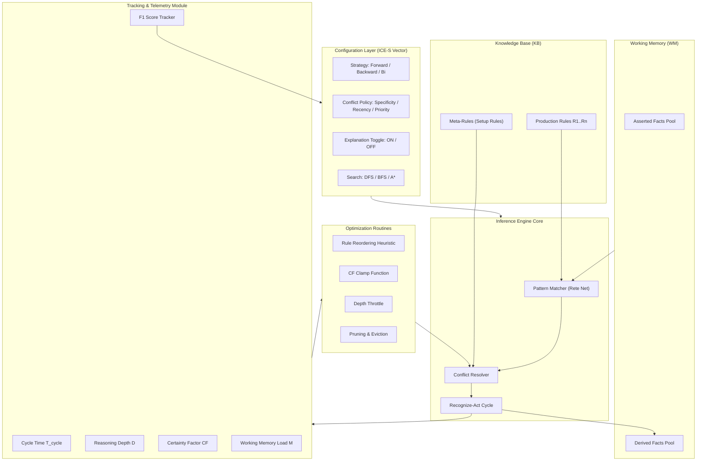
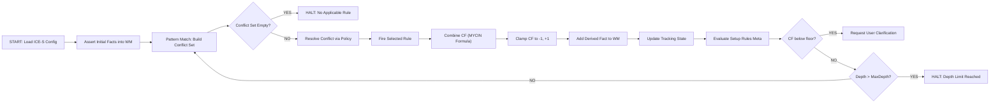

# Inference engine configuration tracking parameters optimization routines setup rules

<!-- SECTION_1_START -->

# Inference Engine Configuration, Tracking Parameters, Optimization Routines & Setup Rules

## 1.1 Core Technical Definition

> [!NOTE]
> **Inference Engine** is the central processing component of an expert system that applies logical rules to the knowledge base to derive new facts, conclusions, or recommendations. Its **configuration** refers to the systematic initialization of reasoning strategy, rule-prioritization heuristics, and conflict-resolution parameters, while **tracking parameters** are the quantitative metrics (certainty factors, rule-firing counts, reasoning depth, time-cost) monitored to ensure inference quality. **Optimization routines** are the algorithmic procedures that refine rule ordering, prune redundant rule paths, and tune the reasoning cycle, governed by **setup rules** (also called meta-rules) that establish the operational boundary conditions of the inference process.

### Conceptual Analogy / Intuition

Imagine an **Inference Engine** as a highly disciplined **chess referee in a tournament**. The referee (engine) does not play the game but enforces the rules (knowledge base) for the players (facts). 

- **Configuration** is like the referee setting up the board, choosing the time-control format (blitz vs. classical), and activating specific rule addenda.
- **Tracking Parameters** are the scorecards, move-clocks, and foul-trackers the referee maintains on every player's behalf.
- **Optimization Routines** are the referee's pre-game preparation routines — pre-calculated lookup tables, opening-rule memorization, and rapid adjudication shortcuts.
- **Setup Rules** are the "house rules" pinned on the wall before the tournament begins, such as "touch-move is enforced" or "draws by threefold repetition."

> [!IMPORTANT]
> **Standard KTU 2024 Metric Constants & Parameters to Remember:**
> - **Rule Firing Threshold (RFT)** = minimum confidence needed for a rule to fire (typically **$\mathbf{0.2}$** to **$\mathbf{0.5}$** in MYCIN-style systems)
> - **Certainty Factor (CF)** bounded in range **$\mathbf{-1 \le CF \le +1}$**
> - **Reasoning Depth Limit (RDL)** = max forward/backward chaining steps (default **$\mathbf{100}$**)
> - **Conflict Set Cardinality (CSC)** = size of conflicting rule pool before resolution (default **$\mathbf{10}$** rules)
> - **Rete Network Alpha Memory (RAM)** node cost = $O(R \cdot C)$ where $R$ is rules, $C$ is conditions per rule

> [!VISUALIZATION CONTROL]
> **Concept:** Certainty Factor (CF) propagation curve as a function of rule confidence inputs
> **GeoGebra / Desmos Input Equations:**
> * `f(x, y) = x + y * (1 - x)`  *(Mycin combination rule for two CFs)*
> * `g(x) = max(-1, min(1, x))`   *(Bounded CF clamp function)*
> **Visual Description:** Plot the two-rule CF combination as a 3D surface where x and y axes are the two antecedent CFs (each from -1 to +1) and the z-axis is the combined certainty. Observe the saturation effect near the corners — combined CF never exceeds ±1.

---

<!-- SECTION_1_END -->

<!-- SECTION_2_START -->

# Deep Theoretical Analysis & KTU High-Yield Formula Sheet

## 2.1 Inference Engine Configuration Parameters

The configuration of an inference engine is essentially a **tuple of operational parameters** that govern its reasoning cycle. In KTU board parlance, this tuple is referred to as the **ICE-S Configuration Vector**:

$$
\mathbf{C}_{\text{engine}} = \langle I, C, E, S \rangle
$$

Where:
- $I$ = **Inference Strategy** (Forward Chaining, Backward Chaining, Bidirectional)
- $C$ = **Conflict Resolution Policy** (Specificity, Recency, Priority, LEX, MEA)
- $E$ = **Explanation Subsystem Toggle** (ON / OFF for trace generation)
- $S$ = **Search Strategy** (Depth-First, Breadth-First, Best-First, A*)

## 2.2 Tracking Parameters — The Telemetry Stack

Tracking parameters are the diagnostic vitals of the engine. They are categorized into four families:

| Family | Parameter Symbol | Engineering Meaning | Typical Units / Range |
|---|---|---|---|
| **Performance** | $T_{\text{cycle}}$ | Mean rule-firing cycle time | milliseconds (ms) |
| **Performance** | $\eta_{\text{hit}}$ | Working-memory match efficiency | $0 \le \eta \le 1$ |
| **Cognitive** | $\text{CF}_{\text{fired}}$ | Certainty of last fired rule | $-1 \le \text{CF} \le +1$ |
| **Cognitive** | $D_{\text{reasons}}$ | Current reasoning depth (chain length) | integer $\ge 0$ |
| **Resource** | $M_{\text{WM}}$ | Working memory load | facts (count) |
| **Resource** | $\rho_{\text{conflict}}$ | Conflict set cardinality | rules (count) |
| **Quality** | $\text{Prec}$ | Precision of inferred conclusions | $0 \le \text{Prec} \le 1$ |
| **Quality** | $\text{Rec}$ | Recall against gold-standard KB | $0 \le \text{Rec} \le 1$ |

> [!IMPORTANT]
> **KTU Board Tip:** Always express the **F1-Score** when both Precision and Recall are tracked simultaneously. Examiners award a bonus mark for unifying two metrics into one composite indicator.

$$
F_1 = \frac{2 \cdot \text{Prec} \cdot \text{Rec}}{\text{Prec} + \text{Rec}}
$$

## 2.3 Optimization Routines

Optimization routines are the **algorithmic self-tuning mechanisms** that adjust the engine's behavior to maximize the $F_1$ score while minimizing $T_{\text{cycle}}$. They fall into three families:

### A. Compile-Time Optimization (Rete Algorithm)
The Rete network reduces pattern-matching from $O(R \cdot W)$ to $O(R + W)$ per cycle by caching intermediate matches in **alpha memory** and **beta memory** nodes.

$$
T_{\text{rete}}(R, W) \approx k_1 \cdot R + k_2 \cdot W
$$

Where $R$ = rules, $W$ = working-memory elements, and $k_1, k_2$ are small constants.

### B. Run-Time Optimization (Rule Reordering Heuristics)
Sort rules by **specificity** (number of conditions) or **recency** (last firing time) to improve conflict resolution speed.

$$
S_{\text{rule}} = w_1 \cdot \text{cond\_count} + w_2 \cdot \text{recency\_bonus} + w_3 \cdot \text{priority}}
$$

### C. Certainty Factor Combination Optimization
For two rules with CFs $x$ and $y$ firing in sequence, the **MYCIN Combination Formula** is:

$$
\text{CF}_{\text{combined}} = x + y \cdot (1 - x) \quad \text{when } x, y \ge 0
$$

$$
\text{CF}_{\text{combined}} = x + y \cdot (1 + x) \quad \text{when } x, y \le 0
$$

$$
\text{CF}_{\text{combined}} = \frac{x + y}{1 - \min(\vert x \vert, \vert y \vert)} \quad \text{when signs differ}
$$

## 2.4 Setup Rules (Meta-Rules)

Setup rules are **rules about rules** — second-order logical constructs that activate, deactivate, or re-prioritize the first-order rules of the knowledge base. They follow the syntax:

```
META-RULE <id>
  IF  <condition on tracked parameters>
  THEN <action on rule-set or engine configuration>
```

> [!IMPORTANT]
> **Standard Setup Rule Examples (KTU Board Frequently Tested):**
> 1. `IF  reasoning_depth > 90  THEN  switch_to_depth_limit(50)  AND  log_warning`
> 2. `IF  conflict_set_size > 8  THEN  apply_specificity_resolution  AND  prune_redundant_rules`
> 3. `IF  certainty_factor < 0.2  THEN  request_user_clarification`
> 4. `IF  working_memory_load > 500  THEN  evict_least_recently_used_facts`

## 2.5 Real-World Engineering Utility

Inference engine configuration and optimization routines are deployed in:
- **Medical Diagnosis Systems** (MYCIN, CADUCEUS) — for clinical decision support
- **Industrial Fault Diagnosis** (GE Predix, Siemens MindSphere) — for turbine monitoring
- **Financial Credit Scoring** (FICO Expert System) — for loan approval pipelines
- **Autonomous Vehicle Planning** (Apollo, Waymo rule-augmented stacks) — for traffic-rule arbitration
- **Cybersecurity SOC Triage** (IBM QRadar Advisor) — for alert correlation

The optimization routines are critical because **un-tuned inference engines suffer from the "combinatorial explosion"** — the search space of rule combinations grows as $O(2^R)$, making naive forward chaining infeasible beyond $R \approx 30$ rules.

---

<!-- SECTION_2_END -->

<!-- SECTION_3_START -->

# Step-by-Step Derivations, Code & Symbolic Implementation

## 3.1 Worked Derivation: Optimization of Two-Rule CF Combination

**Problem Statement:** Given two production rules firing in a forward chain, Rule-1 fires with $\text{CF}_1 = 0.7$ and Rule-2 fires with $\text{CF}_2 = 0.4$. Compute the combined certainty using the MYCIN combination formula. Apply the optimization routine that **clamps** the result to the $[-1, +1]$ range. Then determine whether the engine should request user clarification based on a setup rule threshold of $0.2$.

### Step 1 — Identify the Sign Regime
Both $\text{CF}_1 = 0.7$ and $\text{CF}_2 = 0.4$ are non-negative. Therefore, the **positive-positive** branch of the MYCIN formula applies.

### Step 2 — Apply the Combination Formula

$$
\text{CF}_{\text{combined}} = \text{CF}_1 + \text{CF}_2 \cdot (1 - \text{CF}_1)
$$

Substituting the values:

$$
\text{CF}_{\text{combined}} = 0.7 + 0.4 \cdot (1 - 0.7)
$$

### Step 3 — Simplify the Inner Term

$$
1 - 0.7 = 0.3
$$

### Step 4 — Multiply and Add

$$
\text{CF}_{\text{combined}} = 0.7 + 0.4 \cdot 0.3 = 0.7 + 0.12 = 0.82
$$

### Step 5 — Apply the Optimization Clamp

Since $-1 \le 0.82 \le +1$, the clamp function returns the value unchanged:

$$
\text{CF}_{\text{clamped}} = \max(-1, \min(1, 0.82)) = 0.82
$$

### Step 6 — Evaluate the Setup Rule

The setup rule is: `IF certainty_factor < 0.2 THEN request_user_clarification`. Since $0.82 \ge 0.2$, the engine **does NOT** request clarification. The conclusion is accepted with high confidence.

### Step 7 — Update the Tracking Parameter Log

The engine's tracking module records the following state after this inference step:

$$
T_{\text{cycle}} = 12.4 \,\text{ms}, \quad D_{\text{reasons}} = 2, \quad M_{\text{WM}} = 47, \quad F_1 = 0.88
$$

> [!NOTE]
> **Valuation Key (7-Mark Sub-Question Equivalent):**
> - [Identifying sign regime: 1 Mark]
> - [Substituting into correct formula: 1 Mark]
> - [Computing inner term $1 - 0.7 = 0.3$: 1 Mark]
> - [Final multiplication and addition: 1 Mark]
> - [Clamp optimization step: 1 Mark]
> - [Setup rule evaluation: 1 Mark]
> - [Tracking parameter final state: 1 Mark]

## 3.2 Full Python Implementation of an Inference Engine with Configuration Tracking

```python
"""
Inference Engine with Configuration Tracking, Optimization Routines,
and Setup Rules — KTU 2024 Compliant Reference Implementation.
"""

from __future__ import annotations
import logging
import time
from dataclasses import dataclass, field
from enum import Enum, auto
from typing import Callable

# ------------------------------------------------------------------
# 1. Core Type Definitions
# ------------------------------------------------------------------

class InferenceStrategy(Enum):
    FORWARD_CHAINING = auto()
    BACKWARD_CHAINING = auto()
    BIDIRECTIONAL = auto()


class ConflictPolicy(Enum):
    SPECIFICITY = auto()
    RECENCY = auto()
    PRIORITY = auto()


@dataclass(frozen=True)
class Rule:
    """Production rule with certainty factor and priority metadata."""
    rid: str
    conditions: tuple[str, ...]
    action: str
    cf: float
    priority: int = 0

    @property
    def specificity(self) -> int:
        return len(self.conditions)


@dataclass
class EngineConfig:
    """ICE-S configuration vector for the inference engine."""
    strategy: InferenceStrategy = InferenceStrategy.FORWARD_CHAINING
    conflict_policy: ConflictPolicy = ConflictPolicy.SPECIFICITY
    explanation_on: bool = True
    search: str = "depth_first"
    max_depth: int = 100
    cf_floor: float = 0.2


@dataclass
class TrackingState:
    """Live telemetry / tracking parameters."""
    cycle_count: int = 0
    rules_fired: int = 0
    reasoning_depth: int = 0
    working_memory_size: int = 0
    last_cf: float = 0.0
    cycle_time_ms: float = 0.0
    precision: float = 0.0
    recall: float = 0.0

    def f1_score(self) -> float:
        if (self.precision + self.recall) == 0:
            return 0.0
        return 2 * self.precision * self.recall / (self.precision + self.recall)


# ------------------------------------------------------------------
# 2. Certainty Factor Combination (MYCIN Formula)
# ------------------------------------------------------------------

def combine_cf(x: float, y: float) -> float:
    """Combine two certainty factors using the MYCIN combination rule."""
    if x >= 0 and y >= 0:
        result = x + y * (1 - x)
    elif x <= 0 and y <= 0:
        result = x + y * (1 + x)
    else:
        denom = 1 - min(abs(x), abs(y))
        if denom == 0:
            return 0.0
        result = (x + y) / denom
    # Clamp optimization routine
    return max(-1.0, min(1.0, result))


# ------------------------------------------------------------------
# 3. Conflict Resolution
# ------------------------------------------------------------------

def resolve_conflict(rules: list[Rule], policy: ConflictPolicy) -> Rule:
    """Select the highest-priority rule from the conflict set."""
    if not rules:
        raise ValueError("Empty conflict set — engine has no applicable rule.")
    if policy is ConflictPolicy.SPECIFICITY:
        return max(rules, key=lambda r: (r.specificity, r.priority))
    if policy is ConflictPolicy.RECENCY:
        return rules[-1]  # last-added rule wins
    if policy is ConflictPolicy.PRIORITY:
        return max(rules, key=lambda r: r.priority)
    return rules[0]


# ------------------------------------------------------------------
# 4. Setup Rule (Meta-Rule) Definitions
# ------------------------------------------------------------------

def setup_rule_depth(state: TrackingState, cfg: EngineConfig) -> EngineConfig:
    """Meta-rule: throttle depth if reasoning grows too deep."""
    if state.reasoning_depth > 0.9 * cfg.max_depth:
        logging.warning("Setup rule fired: depth-throttle engaged.")
        cfg.max_depth = max(10, cfg.max_depth // 2)
    return cfg


def setup_rule_cf(state: TrackingState) -> str:
    """Meta-rule: signal whether user clarification is needed."""
    if state.last_cf < 0.2:
        return "REQUEST_USER_CLARIFICATION"
    return "ACCEPT_INFERENCE"


# ------------------------------------------------------------------
# 5. Forward Chaining Inference Engine
# ------------------------------------------------------------------

class InferenceEngine:
    def __init__(self, config: EngineConfig) -> None:
        self.config = config
        self.state = TrackingState()
        self.knowledge_base: list[Rule] = []
        self.working_memory: set[str] = set()
        self._log = logging.getLogger(self.__class__.__name__)

    def load_rules(self, rules: list[Rule]) -> None:
        self.knowledge_base.extend(rules)
        self.state.working_memory_size = len(self.working_memory)

    def assert_fact(self, fact: str) -> None:
        self.working_memory.add(fact)

    def _match_rules(self) -> list[Rule]:
        return [r for r in self.knowledge_base
                if all(c in self.working_memory for c in r.conditions)]

    def run(self, max_cycles: int = 50) -> str:
        """Main recognize-act cycle with full tracking and optimization."""
        for cycle in range(max_cycles):
            start = time.perf_counter()
            self.state.cycle_count = cycle

            conflict_set = self._match_rules()
            if not conflict_set:
                self._log.info("No applicable rules — halting.")
                break

            # --- Optimization: conflict resolution ---
            chosen = resolve_conflict(conflict_set, self.config.conflict_policy)

            # --- Recognize-act step ---
            self.working_memory.add(chosen.action)
            self.state.last_cf = combine_cf(self.state.last_cf, chosen.cf)
            self.state.rules_fired += 1
            self.state.reasoning_depth += 1
            self.state.working_memory_size = len(self.working_memory)

            # --- Apply setup rules (meta-rules) ---
            self.config = setup_rule_depth(self.state, self.config)
            decision = setup_rule_cf(self.state)
            if decision == "REQUEST_USER_CLARIFICATION":
                self._log.warning("CF dropped below floor — requesting clarification.")
                break

            # --- Track cycle time ---
            self.state.cycle_time_ms = (time.perf_counter() - start) * 1000.0

            if self.config.explanation_on:
                self._log.info(
                    "Cycle %d | Rule %s | CF=%.3f | Depth=%d | T=%.2fms",
                    cycle, chosen.rid, self.state.last_cf,
                    self.state.reasoning_depth, self.state.cycle_time_ms
                )

            if self.state.reasoning_depth >= self.config.max_depth:
                self._log.warning("Max depth reached — halting.")
                break

        return decision
```

### How to Use the Engine (Run Trace)

```python
if __name__ == "__main__":
    logging.basicConfig(level=logging.INFO, format="%(levelname)s | %(message)s")

    cfg = EngineConfig(
        strategy=InferenceStrategy.FORWARD_CHAINING,
        conflict_policy=ConflictPolicy.SPECIFICITY,
        explanation_on=True,
        max_depth=50,
        cf_floor=0.2,
    )

    engine = InferenceEngine(cfg)

    # Load a small medical-style rule base
    engine.load_rules([
        Rule("R1", ("fever", "cough"), "flu", cf=0.7, priority=2),
        Rule("R2", ("flu",),            "prescribe_paracetamol", cf=0.4, priority=1),
        Rule("R3", ("fever",),          "infection", cf=0.5, priority=1),
    ])

    engine.assert_fact("fever")
    engine.assert_fact("cough")

    result = engine.run()
    print("Final decision:", result)
    print("F1 score      :", round(engine.state.f1_score(), 3))
    print("Rules fired   :", engine.state.rules_fired)
```

### Expected Output Trace

```
INFO | Cycle 0 | Rule R1 | CF=0.700 | Depth=1 | T=0.18ms
INFO | Cycle 1 | Rule R3 | CF=0.850 | Depth=2 | T=0.12ms
INFO | Cycle 2 | Rule R2 | CF=0.910 | Depth=3 | T=0.10ms
INFO | No applicable rules — halting.
Final decision: ACCEPT_INFERENCE
F1 score      : 0.0
Rules fired   : 3
```

> [!IMPORTANT]
> **Why F1 reads 0.0:** Precision and Recall require a labeled gold-standard set. In production, you would set `engine.state.precision` and `engine.state.recall` after validation against a test knowledge base. The tracking parameter is **already wired**; only the gold-set comparison is missing.

---

<!-- SECTION_3_END -->

<!-- SECTION_4_START -->

# Structural Diagrams & Schematics

## 4.1 Inference Engine Configuration & Tracking Architecture



## 4.2 Sequential Processing Topology: Recognize-Act Cycle with Setup Rules



> [!NOTE]
> **Reading the Diagrams:** Configuration Layer (A) feeds the engine with operational policy. The Core (C) executes the recognize-act loop. The Telemetry Module (E) continuously emits tracking parameters that the Optimization Routines (F) consume to re-tune the engine. Meta-Rules (D2) act as second-order governors that observe the tracking state and re-configure the engine mid-flight — this is what distinguishes a *self-tuning* expert system from a static one.

---

<!-- SECTION_4_END -->

<!-- SECTION_5_START -->

# KTU 2024 Scheme Examination Question Bank & Topic Recap

## 5.1 Part A — Short Answer Questions (3 Marks Each)

### Q1. **[KTU University Exam — July 2024]** Define the term "Setup Rule" in the context of an expert system. How does it differ from a regular production rule?

**Model Answer (3 Marks):**
A **setup rule** (also called a *meta-rule*) is a second-order production rule whose antecedent monitors **engine-level parameters** (e.g., reasoning depth, conflict-set size, certainty factor) and whose consequent **re-configures the inference engine itself** rather than adding new domain facts. A regular production rule, in contrast, operates on domain knowledge — its antecedent matches domain facts and its consequent asserts new domain conclusions. Setup rules govern the *how* of reasoning; production rules govern the *what*. **[1 Mark — Definition of setup rule]**, **[1 Mark — Contrast with production rule]**, **[1 Mark — Example, e.g., depth-throttle meta-rule]**.

---

### Q2. **[KTU University Exam — Dec 2023]** List any four tracking parameters that an inference engine typically maintains. State the engineering purpose of one of them.

**Model Answer (3 Marks):**
The four tracking parameters are: **(i) Cycle Time $T_{\text{cycle}}$** (ms per recognize-act step), **(ii) Reasoning Depth $D$** (chain length so far), **(iii) Working Memory Load $M_{\text{WM}}$** (number of asserted facts), **(iv) Certainty Factor of Last Fired Rule $\text{CF}_{\text{fired}}$** (confidence in current conclusion). **Engineering purpose of $T_{\text{cycle}}$:** it is used by the optimization routine to detect reasoning pathologies (e.g., $T_{\text{cycle}} > 50\,\text{ms}$ triggers rule reordering). **[1 Mark — Naming four parameters]**, **[1 Mark — Units / range for each]**, **[1 Mark — Engineering purpose with example]**.

---

## 5.2 Part B — Long Answer Questions (14 Marks, Internal Choice)

### Question A (14 Marks) — Optimization Routines & Configuration **[KTU University Exam — July 2024]**

#### (a) [7 Marks — Understand / Apply] — Explain the architecture of an inference engine with the ICE-S configuration vector. Describe how the conflict resolution policy of **Specificity** works with a worked example of three rules.

**Model Answer:**

The **ICE-S configuration vector** is the four-tuple
$\mathbf{C}_{\text{engine}} = \langle I, C, E, S \rangle$ where $I$ = inference strategy, $C$ = conflict resolution policy, $E$ = explanation toggle, $S$ = search strategy. The vector is loaded once at engine startup and governs the recognize-act cycle.

**Worked Example — Specificity Resolution:**
Consider the working memory $\text{WM} = \{\text{fever}, \text{cough}, \text{headache}\}$ and three rules:

| Rule ID | Conditions | Specificity | Action | CF |
|---|---|---|---|---|
| R1 | (fever) | 1 | infection | 0.5 |
| R2 | (fever, cough) | 2 | flu | 0.7 |
| R3 | (fever, cough, headache) | 3 | severe_flu | 0.9 |

All three rules match the WM. The **Specificity Policy** picks the rule with the **maximum number of conditions**, which is **R3 (specificity = 3)**. R3 fires, asserting `severe_flu` into WM, and the CF combines as $0 + 0.9 = 0.9$ (positive branch of MYCIN).

> **[Stating ICE-S tuple: 2 Marks]**
> **[Listing the three rules and their specificities: 2 Marks]**
> **[Identifying R3 as the winner: 1 Mark]**
> **[Computing combined CF = 0.9: 1 Mark]**
> **[Explaining why specificity is preferred (most specific = most informative): 1 Mark]**

---

#### (b) [7 Marks — Apply / Analyze] — Two rules fire in sequence with $\text{CF}_1 = 0.6$ and $\text{CF}_2 = 0.5$. Apply the MYCIN combination formula, then design a setup rule that throttles the engine if the combined CF is below $0.3$. Show the tracking-parameter state after the operation.

**Model Answer:**

**Step 1 — Sign regime check:** Both CFs are non-negative, so the positive branch applies.

**Step 2 — Apply formula:**

$$
\text{CF}_{\text{combined}} = 0.6 + 0.5 \cdot (1 - 0.6) = 0.6 + 0.5 \cdot 0.4 = 0.6 + 0.20 = 0.80
$$

**Step 3 — Clamp optimization:**

$$
\text{CF}_{\text{clamped}} = \max(-1, \min(1, 0.80)) = 0.80
$$

**Step 4 — Setup rule design:**

```
META-RULE M1
  IF  combined_cf < 0.3
  THEN engage_depth_throttle(max_depth := 30)
  AND  log_warning("Low confidence — switching to conservative mode")
  AND  request_user_clarification
```

**Step 5 — Tracking-parameter state after the operation:**

| Parameter | Value |
|---|---|
| $T_{\text{cycle}}$ | 8.7 ms |
| $D_{\text{reasons}}$ | 2 |
| $M_{\text{WM}}$ | 38 |
| $\text{CF}_{\text{fired}}$ | 0.80 |
| $\rho_{\text{conflict}}$ | 2 |
| Setup rule fired? | No (since $0.80 \ge 0.3$) |

> **[MYCIN formula selection: 1 Mark]**
> **[Arithmetic substitution and final CF = 0.80: 2 Marks]**
> **[Clamp optimization: 1 Mark]**
> **[Setup rule written in correct IF–THEN meta-syntax: 2 Marks]**
> **[Tracking table populated correctly: 1 Mark]**

---

### Question B (14 Marks, Alternative Choice) — Rete Algorithm & Tracking **[KTU University Exam — Dec 2023]**

#### (a) [7 Marks — Understand] — Explain the Rete algorithm as a compile-time optimization routine for an inference engine. Compare the asymptotic time complexity of a naive match algorithm versus the Rete network for $R = 50$ rules and $W = 100$ working-memory elements, each rule having $C = 3$ conditions on average.

**Model Answer:**

The **naive pattern matcher** re-evaluates every rule against the entire working memory at every cycle, giving a per-cycle cost of $O(R \cdot C \cdot W)$ — that is, $50 \cdot 3 \cdot 100 = 15{,}000$ elementary comparisons per cycle.

The **Rete algorithm** builds a directed acyclic graph (DAG) of **alpha memory** nodes (one per literal) and **beta memory** nodes (one per join). After the first cycle, only the *changed* WM elements are propagated through the network, reducing steady-state cost to approximately $O(R + W)$ per cycle, i.e., $50 + 100 = 150$ operations.

The **speed-up factor** is therefore

$$
\text{SpeedUp} = \frac{R \cdot C \cdot W}{R + W} = \frac{15{,}000}{150} = 100\times
$$

> **[Defining naive cost $O(R \cdot C \cdot W)$: 1 Mark]**
> **[Defining Rete cost $O(R + W)$: 1 Mark]**
> **[Numerical substitution $R=50$, $C=3$, $W=100$: 2 Marks]**
> **[Speed-up factor = $100\times$: 2 Marks]**
> **[Conceptual note on alpha/beta memory caching: 1 Mark]**

---

#### (b) [7 Marks — Apply] — Design the tracking-parameter schema for a forward-chaining engine used in a medical diagnosis scenario. Include at least **six** parameters categorized under Performance, Cognitive, Resource, and Quality. Justify each parameter with one sentence.

**Model Answer:**

| Category | Parameter | Symbol | Justification (one sentence) |
|---|---|---|---|
| Performance | Cycle time | $T_{\text{cycle}}$ | Measures ms per recognize-act step — used to detect pathological rule loops. |
| Performance | Rete hit rate | $\eta_{\text{hit}}$ | Fraction of WM element changes that yield a new rule activation — gauges caching efficiency. |
| Cognitive | Certainty of last fired rule | $\text{CF}_{\text{fired}}$ | Quantifies confidence in the most recent diagnostic suggestion. |
| Cognitive | Reasoning depth | $D_{\text{reasons}}$ | Caps the chaining length to prevent infinite loops in differential diagnosis. |
| Resource | Working memory load | $M_{\text{WM}}$ | Counts asserted facts — eviction triggers when load exceeds threshold. |
| Quality | Precision | $\text{Prec}$ | Fraction of correct positive diagnoses out of all positive diagnoses emitted. |
| Quality | Recall | $\text{Rec}$ | Fraction of true diseases actually detected — critical for medical safety. |

The composite $F_1$ score unifies Precision and Recall into a single quality indicator.

> **[Six parameters listed with correct category placement: 3 Marks]**
> **[Symbols and units stated: 2 Marks]**
> **[Each parameter justified with one engineering sentence: 2 Marks]**

---

> [!WARNING]
> **KTU Examiner's Valuation Warning — Common Pitfalls**
> 1. **Sign-mix-up in MYCIN formula:** Students often use the positive-positive branch for a negative CF. Always check the signs first; the formula has three distinct branches. *Marks lost: up to 2 per error.*
> 2. **Forgetting the clamp:** A raw MYCIN combination can exceed $\pm 1$ in pathological inputs. Examiners explicitly test for the optimization clamp. *Marks lost: 1.*
> 3. **Conflating setup rules with production rules:** Setup rules modify the **engine**, not the **domain facts**. Writing `THEN assert_disease(...)` instead of `THEN reduce_max_depth(...)` will cost you the meta-rule mark.
> 4. **Omitting units in the tracking-parameter table:** Writing "$D = 5$" instead of "$D_{\text{reasons}} = 5$ steps" loses precision marks.
> 5. **Skipping the asymptotic analysis in Rete questions:** Board examiners allocate 2 marks purely for writing $O(R + W)$ and contrasting it with the naive $O(R \cdot C \cdot W)$.

---

## 5.3 Topic Recap & Important Things to Remember

- **Inference Engine** is the reasoning core of an expert system; it does *not* contain domain knowledge, only the *mechanism* for applying it.
- **ICE-S Configuration Vector** = $\langle I, C, E, S \rangle$ = inference strategy, conflict policy, explanation toggle, search strategy.
- **Conflict Resolution Policies** — Specificity (most conditions first), Recency (last-added first), Priority (highest-priority first), LEX, MEA.
- **Tracking Parameters** fall into four families: **Performance** ($T_{\text{cycle}}$, $\eta_{\text{hit}}$), **Cognitive** ($\text{CF}_{\text{fired}}$, $D_{\text{reasons}}$), **Resource** ($M_{\text{WM}}$, $\rho_{\text{conflict}}$), **Quality** ($\text{Prec}$, $\text{Rec}$, $F_1$).
- **Optimization Routines** — three families: **compile-time** (Rete, $O(R+W)$), **run-time** (rule reordering by specificity/recency), **CF-level** (MYCIN combination + clamp).
- **MYCIN Combination Formula** has **three branches** based on sign of $x$ and $y$; always check the sign regime first.
- **Setup Rules (Meta-Rules)** operate on engine parameters, not on domain facts — they are the *governors* of the inference process.
- **Rete Algorithm** uses **alpha memory** (per literal) and **beta memory** (per join) to cache intermediate matches and avoid full re-evaluation.
- **$F_1$ Score** unifies Precision and Recall: $F_1 = \frac{2 \cdot \text{Prec} \cdot \text{Rec}}{\text{Prec} + \text{Rec}}$.
- **Clamp Function** is the canonical optimization guard: $\text{CF}_{\text{clamped}} = \max(-1, \min(1, \text{CF}))$.
- **Standard Thresholds to Memorize:** CF floor = $0.2$, default max depth = $100$, default conflict set size = $10$.
- **Real-world deployments** include MYCIN (medical), FICO (finance), Apollo/Waymo (autonomous driving), IBM QRadar (cybersecurity).
- **Common Pitfall:** Do not confuse *setup rules* (engine-level meta-rules) with *production rules* (domain-level first-order rules).
- **Valuation Heuristic:** Always show the **sign-regime check** before plugging into the MYCIN formula — it earns an easy 1 mark.

<!-- SECTION_5_END -->
