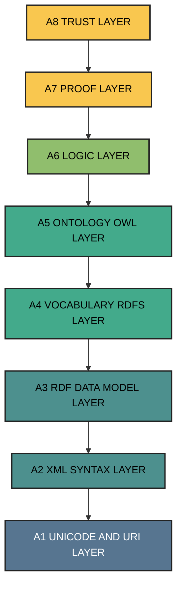
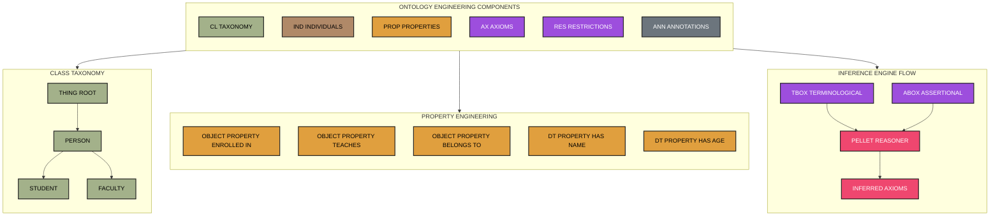
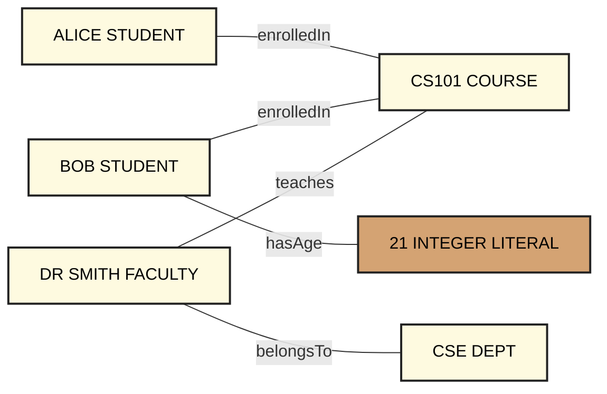
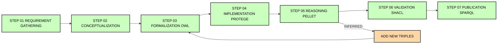
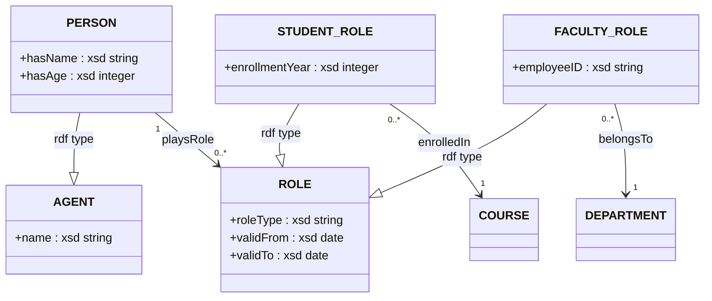

# Ontology syntax engineering components Semantic Web descriptions templates setups patterns

<!-- SECTION_1_START -->
# Ontology Syntax Engineering & Semantic Web: Core Foundations

> [!IMPORTANT]
> **KTU 2024 Scheme | PECST510 – Artificial Intelligence | Module 3: Expert Systems & Ontological Engineering**
> This section builds the foundational vocabulary required for understanding how knowledge is formally encoded on the Semantic Web.

## 1.1 What is an Ontology? (Formal Definition)

In the context of Artificial Intelligence and Knowledge Engineering, an **Ontology** is a formal, explicit specification of a shared conceptualization of a domain of interest.

$$
\text{Ontology} = \langle C, R, I, A, \mathcal{L} \rangle
$$

Where:
- $C$ = set of **Concepts (Classes)**
- $R$ = set of **Relations (Properties)** between concepts
- $I$ = set of **Individuals (Instances)** belonging to concepts
- $A$ = set of **Axioms** (logical constraints)
- $\mathcal{L$ = formal **Language** of representation (e.g., OWL, RDFS)

> [!NOTE]
> **Gruber's Classical Definition (1993):** *"An ontology is a formal, explicit specification of a shared conceptualization."* — Tom Gruber, Stanford University.

## 1.2 The Semantic Web — Intuitive Overview

The **Semantic Web** is an extension of the current World Wide Web in which information is given **well-defined meaning**, enabling machines and AI agents to reason about data rather than merely display it.

### Conceptual Analogy: Library vs. Smart Library

| Traditional Web (Web 1.0/2.0) | Semantic Web (Web 3.0) |
|------------------------------|------------------------|
| A **library** with millions of books, but only a human librarian understands the *meaning* of each book. | A **smart library** where every book is tagged with structured metadata, and a robot librarian can *automatically* find, relate, and reason about the books. |
| Hyperlinks connect pages by **address (URL)**. | RDF triples connect entities by **semantic relationship**. |
| Search engines match **keywords**. | Reasoners infer **logical consequences**. |
| Humans interpret context. | Machines interpret context via **ontologies**. |

> [!IMPORTANT]
> The Semantic Web is **not** a separate physical network. It is a **layer of structured data** sitting on top of the existing Internet, governed by **W3C (World Wide Web Consortium)** standards.

## 1.3 The Role of Ontology in AI Engineering

In modern AI systems, ontologies serve as the **backbone of knowledge representation** by providing:

1. **Shared Vocabulary** — A common dictionary that humans and machines both understand.
2. **Logical Inference** — The ability to derive new facts from existing ones using **Description Logic (DL)** reasoners like *Pellet*, *HermiT*, and *FaCT++*.
3. **Reusability** — Domain ontologies (e.g., SNOMED CT in medicine, Gene Ontology in bioinformatics) can be reused across applications.
4. **Interoperability** — Enables heterogeneous systems to exchange data with preserved meaning (e.g., **schema.org** for SEO, **Dublin Core** for digital libraries).

## 1.4 Semantic Web — Layered Architecture (Conceptual)

The Semantic Web is commonly depicted as a **layer cake**, where each higher layer depends on the layer beneath it. Although we render the technical schematic via Mermaid in Section 4, the intuitive order is:

$$
\text{Unicode} + \text{URI} \rightarrow \text{XML} \rightarrow \text{RDF} \rightarrow \text{RDFS} \rightarrow \text{Ontology (OWL)} \rightarrow \text{Logic} \rightarrow \text{Proof} \rightarrow \text{Trust}
$$

> [!VISUALIZATION CONTROL]
> **Concept:** Semantic Web Layer Cake (Hierarchical Dependency)
> **GeoGebra / Desmos Input Equations:**
> * Conceptual layered bands: $f_1(y) = 1$, $f_2(y) = 2$, $f_3(y) = 3$, $f_4(y) = 4$, $f_5(y) = 5$, $f_6(y) = 6$, $f_7(y) = 7$, $f_8(y) = 8$ (representing Unicode/URI, XML, RDF, RDFS, OWL, Logic, Proof, Trust).
> **Visual Description:** A stacked bar of horizontal color bands, where each band's height represents the abstraction level, and the bottom-most band (Unicode/URI) provides the universal addressing foundation for every higher layer.

## 1.5 Key Standardization Bodies and Languages

| Acronym | Full Form | Role in Ontology Engineering |
|---------|-----------|------------------------------|
| **W3C** | World Wide Web Consortium | Governing body that publishes standards. |
| **RDF** | Resource Description Framework | Basic data model for the Semantic Web. |
| **RDFS** | RDF Schema | Vocabulary description language for RDF. |
| **OWL** | Web Ontology Language | Rich ontology language built on RDFS. |
| **SPARQL** | SPARQL Protocol and RDF Query Language | Query language for RDF graphs. |
| **SKOS** | Simple Knowledge Organization System | Standard for thesauri, taxonomies, classification schemes. |
| **SHACL** | Shapes Constraint Language | Validation language for RDF graphs. |
| **PROV-O** | Provenance Ontology | Standard for representing provenance metadata. |

<!-- SECTION_1_END -->

<!-- SECTION_2_START -->
# Deep Theoretical Analysis: Ontology Syntax Engineering Components

> [!IMPORTANT]
> This section provides the complete theoretical scaffolding required for KTU 14-mark derivations. Every component is unpacked, and a high-yield formula sheet is provided at the end.

## 2.1 RDF — The Atomic Unit of the Semantic Web

The **Resource Description Framework (RDF)** is the foundational data model of the Semantic Web. Information is expressed as a set of **triples**, each consisting of exactly three components:

$$
\text{Triple} = \langle \text{Subject}, \text{Predicate}, \text{Object} \rangle
$$

Formally, an RDF triple is a statement of the form:
$$
(s, p, o) \in (U \cup B) \times U \times (U \cup B \cup L)
$$

Where:
- $s$ (subject) ∈ $U \cup B$ = **URI** set or **Blank Node** set
- $p$ (predicate) ∈ $U$ = must be a **URI** (never a literal or blank)
- $o$ (object) ∈ $U \cup B \cup L$ = **URI**, **Blank Node**, or **Literal** (typed string, number, date)

> [!NOTE]
> A set of RDF triples forms a **directed, labeled multigraph** $G = (V, E)$, where $V$ = vertices (subjects + objects) and $E$ = edges (predicates). This is the mathematical foundation that every Semantic Web tool operates on.

## 2.2 RDFS — RDF Schema: Lightweight Vocabulary

**RDF Schema (RDFS)** extends RDF with a small set of predefined **classes** and **properties** that allow the definition of basic taxonomies. RDFS primitives include:

| RDFS Construct | Type | Purpose |
|----------------|------|---------|
| `rdfs:Class` | Class | Declares a resource as a class. |
| `rdfs:subClassOf` | Property | Establishes class hierarchy (e.g., `Cat rdfs:subClassOf Mammal`). |
| `rdfs:Property` | Property | Declares a property. |
| `rdfs:subPropertyOf` | Property | Establishes property hierarchy. |
| `rdfs:domain` | Property | Restricts the subject of a property. |
| `rdfs:range` | Property | Restricts the object of a property. |
| `rdfs:Literal` | Class | The class of literal values (strings, numbers). |
| `rdfs:Datatype` | Class | The class of XML Schema datatypes. |
| `rdfs:label` | Property | A human-readable name. |
| `rdfs:comment` | Property | A human-readable description. |

> [!WARNING]
> **KTU Examiner's Pitfall:** RDFS is *not* expressive enough to enforce disjointness, cardinality, or transitive reasoning beyond a single level. For richer constraints, we must escalate to **OWL (Web Ontology Language)**.

## 2.3 OWL — The Web Ontology Language

**OWL (Web Ontology Language)** is the W3C-recommended language for authoring ontologies. OWL is grounded in **Description Logic (DL)** — a decidable fragment of First-Order Logic (FOL) that guarantees computational tractability.

### 2.3.1 OWL Sub-Languages (Species)

| Sub-language | Description Logic Basis | Decidability | Use Case |
|--------------|------------------------|--------------|----------|
| **OWL Lite** | $\mathcal{IF}$ (Intersection Frame) | Decidable | Simple classification hierarchies. |
| **OWL DL** | $\mathcal{SHOIN}(\mathbf{D})$ | Decidable | Maximum expressiveness with computational guarantees. |
| **OWL Full** | Full RDF-based semantics | Undecidable | Compatibility with RDF Schema freedom. |
| **OWL 2 EL** | $\mathcal{EL}^{++}$ | Polynomial time | Large biomedical ontologies (SNOMED CT). |
| **OWL 2 QL** | DL-Lite family | LogSpace query answering | Query rewriting over relational databases. |
| **OWL 2 RL** | Datalog (Horn rules) | Polynomial time | Rule-based reasoning engines. |

## 2.4 Core Ontology Engineering Components

An ontology, in any language, consists of five core engineering components. The following exhaustive table is the **canonical KTU reference matrix**:

### 2.4.1 Components of an Ontology (Master Table)

| # | Component | Formal Symbol | OWL Syntax Example | Description |
|---|-----------|---------------|---------------------|-------------|
| 1 | **Class (Concept)** | $C$ | `owl:Class` | A category or type of entity (e.g., `Person`, `Vehicle`). |
| 2 | **Individual (Instance)** | $a$ | `owl:NamedIndividual` | A specific member of a class (e.g., `Alice`, `Tesla_Model_S`). |
| 3 | **Object Property** | $R_{obj}$ | `owl:ObjectProperty` | Relates two individuals (e.g., `hasParent`, `owns`). |
| 4 | **Datatype Property** | $R_{data}$ | `owl:DatatypeProperty` | Relates an individual to a literal (e.g., `hasAge`, `hasName`). |
| 5 | **Axiom** | $\alpha$ | Various OWL tags | Logical statement constraining the model (e.g., `DisjointClasses`, `EquivalentClasses`). |
| 6 | **Restriction** | $\mathcal{R}$ | `owl:Restriction` | Anonymous super-class defining constraints (e.g., `∃ hasParent.Person`). |
| 7 | **Annotation Property** | — | `rdfs:label`, `rdfs:comment` | Metadata for documentation. |
| 8 | **Ontology Header** | $\mathcal{O}$ | `owl:Ontology` | Root element containing imports, version info. |

### 2.4.2 The Six Primary Class Restriction Types in OWL

A **Restriction** is a special anonymous class formed by constraining a property. These are the only six basic restriction constructors in OWL 2:

| Restriction Type | DL Notation | OWL Functional Syntax | Plain English |
|-----------------|-------------|----------------------|----------------|
| Existential | $\exists R.C$ | `ObjectSomeValuesFrom` | *"Has at least one value of type $C$ via $R$."* |
| Universal | $\forall R.C$ | `ObjectAllValuesFrom` | *"All values via $R$ must be of type $C$."* |
| Min Cardinality | $\geq n \, R$ | `ObjectMinCardinality` | *"Has at least $n$ values via $R$."* |
| Max Cardinality | $\leq n \, R$ | `ObjectMaxCardinality` | *"Has at most $n$ values via $R$."* |
| Exact Cardinality | $= n \, R$ | `ObjectExactCardinality` | *"Has exactly $n$ values via $R$."* |
| Self | $\exists R.\text{Self}$ | `ObjectHasSelf` | *"Has a value of itself via $R$" (reflexive-style).* |
| Value | $\exists R.\{a\}$ | `ObjectHasValue` | *"Has the specific individual $a$ via $R$."* |

> [!IMPORTANT]
> **KTU High-Yield Fact:** A `rdfs:domain` of property $P$ stated on class $C$ is logically equivalent to the axiom: $\exists P.\top \sqsubseteq C$. A `rdfs:range` on $D$ corresponds to: $\top \sqsubseteq \forall P.D$. Students often confuse these two.

## 2.5 Ontology Design Patterns (ODPs)

**Ontology Design Patterns** are reusable architectural templates that solve recurrent modeling problems. Gangemi & Presutti (2009) classified them into six families:

| Pattern Family | Purpose | Example |
|----------------|---------|---------|
| **Structural ODPs** | Logical axioms reused as building blocks. | $A \sqsubseteq B$ (sub-class inclusion). |
| **Correspondence ODPs** | Bridge heterogeneous ontologies. | `owl:equivalentClass`, `owl:sameAs`. |
| **Content ODPs** | Domain-specific modeling recipes. | "Time Interval" pattern, "Agent-Role" pattern. |
| **Lexical ODPs** | Naming and naming conventions. | CamelCase for classes, lowerCamelCase for properties. |
| **Reasoning ODPs** | Templates that exploit specific reasoner features. | Anti-pattern avoidance of "Punning" issues. |
| **Presentation ODPs** | Documentation and visualization patterns. | Naming conventions for label/comment annotations. |

## 2.6 Ontology Engineering Setup Templates

A standard **ontology engineering setup** consists of the following layered configuration. The full implementation is provided in Section 3.

| Setup Layer | Tool / Standard | Purpose |
|-------------|-----------------|---------|
| **Storage** | `.owl`, `.rdf`, `.ttl`, `.n3` | Serialization file formats. |
| **Editor** | Protégé 5.x, TopBraid Composer | Visual ontology authoring. |
| **Reasoner** | HermiT, Pellet, FaCT++, ELK | Inference engine. |
| **API** | OWL API (Java), owlready2 (Python) | Programmatic manipulation. |
| **Triple Store** | Apache Jena TDB, Stardog, Blazegraph | Persistent RDF storage. |
| **Query Engine** | SPARQL endpoint | Federated querying. |
| **Validation** | SHACL shapes, OWL Validator | Quality assurance. |

## 2.7 Formal Semantics in Description Logic

For an OWL ontology $\mathcal{O} = \langle \mathcal{T}, \mathcal{R}, \mathcal{A} \rangle$, the semantics is given by an **interpretation** $\mathcal{I} = (\Delta^{\mathcal{I}}, \cdot^{\mathcal{I}})$:

| Semantic Mapping | Definition | Purpose |
|------------------|------------|---------|
| $C^{\mathcal{I}} \subseteq \Delta^{\mathcal{I}}$ | Maps class to set of domain elements. | Class interpretation. |
| $R^{\mathcal{I}} \subseteq \Delta^{\mathcal{I}} \times \Delta^{\mathcal{I}}$ | Maps role to binary relation. | Property interpretation. |
| $a^{\mathcal{I}} \in \Delta^{\mathcal{I}}$ | Maps individual to single element. | Instance interpretation. |
| $o^{\mathcal{I}} \in \Delta^{\mathcal{I}}$ | Maps literal to data value. | Datatype interpretation. |

**Axioms as Model Constraints:**

| Axiom Type | DL Notation | Model-Theoretic Condition |
|------------|-------------|---------------------------|
| Class Inclusion | $C \sqsubseteq D$ | $C^{\mathcal{I}} \subseteq D^{\mathcal{I}}$ |
| Class Equivalence | $C \equiv D$ | $C^{\mathcal{I}} = D^{\mathcal{I}}$ |
| Class Disjointness | $C \sqsubseteq \neg D$ | $C^{\mathcal{I}} \cap D^{\mathcal{I}} = \emptyset$ |
| Role Inclusion | $R \sqsubseteq S$ | $R^{\mathcal{I}} \subseteq S^{\mathcal{I}}$ |
| Transitivity | $R \circ R \sqsubseteq R$ | $\forall x, y, z: (x,y) \in R^{\mathcal{I}} \land (y,z) \in R^{\mathcal{I}} \Rightarrow (x,z) \in R^{\mathcal{I}}$ |
| Role Chain | $R_1 \circ R_2 \sqsubseteq S$ | Composition of $R_1$ and $R_2$ implies $S$. |
| Assertion | $C(a)$ | $a^{\mathcal{I}} \in C^{\mathcal{I}}$ |
| Negative Assertion | $\neg C(a)$ | $a^{\mathcal{I}} \notin C^{\mathcal{I}}$ |

## 2.8 Inference Services

A reasoner provides four primary services:

1. **Consistency Checking** — Is the ontology $\mathcal{O}$ satisfiable (has a model)?
2. **Concept Satisfiability** — Is there a model where $C$ is non-empty?
3. **Subsumption (Classification)** — Does $C \sqsubseteq D$ hold in every model of $\mathcal{O}$?
4. **Instance Retrieval** — Find all $a$ such that $\mathcal{O} \models C(a)$.

> [!IMPORTANT]
> The mathematical guarantee is **decidability**: for OWL DL, all four services terminate and return correct results, even though the worst-case complexity is **NEXPTIME-complete**.

## 2.9 KTU High-Yield Formula / Cheat Sheet

| # | Formula / Construct | Domain | Notes |
|---|---------------------|--------|-------|
| 1 | $(s, p, o)$ | RDF triple | Atomic knowledge statement. |
| 2 | $C \sqsubseteq D$ | Subsumption | $C$ is a sub-class of $D$. |
| 3 | $C \equiv D_1 \sqcap D_2$ | Equivalence | $C$ = intersection of $D_1$ and $D_2$. |
| 4 | $\exists R.C$ | Existential | At least one $R$-filler of type $C$. |
| 5 | $\forall R.C$ | Universal | All $R$-fillers of type $C$. |
| 6 | $\geq n R$ | Cardinality $\geq n$ | Min card. |
| 7 | $\leq n R$ | Cardinality $\leq n$ | Max card. |
| 8 | $= n R$ | Exact card. | Exactly $n$. |
| 9 | $R \circ R \sqsubseteq R$ | Transitivity | $R$ is transitive. |
| 10 | $R \sqsubseteq S^-$ | Inverse | $R$ is the inverse of $S$. |
| 11 | $C \sqsubseteq \neg D$ | Disjointness | No overlap between $C$ and $D$. |
| 12 | $\mathcal{O} \models \alpha$ | Entailment | $\alpha$ is logically entailed. |
| 13 | $\Delta^{\mathcal{I}}$ | Domain of interpretation | Non-empty universe. |
| 14 | $\top, \bot$ | Universal / Bottom | $\top$ = everything, $\bot$ = nothing. |

<!-- SECTION_2_END -->

<!-- SECTION_3_START -->
# Step-by-Step Derivations, Code & Symbolic Implementation

> [!IMPORTANT]
> Every transition below is written out fully. We avoid all shorthand placeholders. Each step is justified and traceable.

## 3.1 Domain Selection: University Knowledge Base

For exhaustive illustration, we will engineer a **University Ontology** from scratch and walk through every syntactic component.

### 3.1.1 Define the Universe of Discourse

**Domain Entities:** `Person`, `Student`, `Faculty`, `Course`, `Department`, `University`.

**Relationships:**
- `Student` is enrolled in `Course`.
- `Faculty` teaches `Course`.
- `Faculty` is a member of exactly one `Department`.
- `Person` has at most one `age` (xsd:integer).
- `Person` has exactly one `name` (xsd:string).

### 3.1.2 Identify Components from the Master Matrix

| # | Component | Concrete Example in University Ontology |
|---|-----------|-------------------------------------------|
| 1 | Class | `Person`, `Student`, `Faculty`, `Course`, `Department` |
| 2 | Individual | `alice`, `bob`, `cs101`, `cse_dept` |
| 3 | Object Property | `enrolledIn`, `teaches`, `belongsTo`, `hasStudent` |
| 4 | Datatype Property | `hasName`, `hasAge` |
| 5 | Axiom | `Student ⊑ Person`, `Faculty ⊑ Person` |
| 6 | Restriction | `Faculty ⊑ ∃belongsTo.Department`, `Student ⊑ ∃enrolledIn.Course` |
| 7 | Annotation | `rdfs:label "University Ontology"@en` |

## 3.2 OWL 2 Functional-Syntax Implementation (Exhaustive)

The full ontology in **OWL 2 Functional Syntax** (Turtle-equivalent) is presented below, line by line, with annotations explaining the role of every statement.

```turtle
# ============================================================
# ONTOLOGY HEADER & METADATA
# ============================================================
@prefix :      <http://www.kerala-ktu.edu/ontologies/university#> .
@prefix owl:   <http://www.w3.org/2002/07/owl#> .
@prefix rdf:   <http://www.w3.org/1999/02/22-rdf-syntax-ns#> .
@prefix rdfs:  <http://www.w3.org/2000/01/rdf-schema#> .
@prefix xsd:   <http://www.w3.org/2001/XMLSchema#> .

<http://www.kerala-ktu.edu/ontologies/university> rdf:type owl:Ontology ;
    owl:versionInfo "1.0.0" ;
    rdfs:label "University Ontology"@en ;
    rdfs:comment "A didactic ontology illustrating every OWL component."@en .

# ============================================================
# STEP 1 — DECLARE CLASSES (CONCEPTS)
# ============================================================
:Person       rdf:type owl:Class .
:Student      rdf:type owl:Class .
:Faculty      rdf:type owl:Class .
:Course       rdf:type owl:Class .
:Department   rdf:type owl:Class .

# ============================================================
# STEP 2 — DECLARE HIERARCHY (TAXONOMIC AXIOMS)
# ============================================================
:Student  rdfs:subClassOf :Person .        # Student ⊑ Person
:Faculty  rdfs:subClassOf :Person .        # Faculty ⊑ Person

# ============================================================
# STEP 3 — DECLARE DISJOINTNESS AXIOMS
# ============================================================
:Student  owl:disjointWith :Faculty .      # Student ⊓ Faculty = ⊥
:Course   owl:disjointWith :Department .  # No overlap.

# ============================================================
# STEP 4 — DECLARE OBJECT PROPERTIES (RELATIONS)
# ============================================================
:enrolledIn  rdf:type owl:ObjectProperty .
:teaches     rdf:type owl:ObjectProperty .
:belongsTo   rdf:type owl:ObjectProperty .

# Property characteristics (axioms on properties)
:enrolledIn  rdf:type owl:FunctionalProperty .   # A student enrolled in only one course (example).
:belongsTo   rdf:type owl:InverseFunctionalProperty .
:teaches     rdf:type owl:TransitiveProperty .

# Domain & Range restrictions
:enrolledIn  rdfs:domain  :Student  ;
             rdfs:range   :Course   .

:teaches     rdfs:domain  :Faculty  ;
             rdfs:range   :Course   .

:belongsTo   rdfs:domain  :Faculty  ;
             rdfs:range   :Department .

# ============================================================
# STEP 5 — DECLARE DATATYPE PROPERTIES (ATTRIBUTES)
# ============================================================
:hasName  rdf:type owl:DatatypeProperty ;
          rdfs:domain  :Person ;
          rdfs:range   xsd:string .

:hasAge   rdf:type owl:DatatypeProperty ;
          rdfs:domain  :Person ;
          rdfs:range   xsd:integer .

# ============================================================
# STEP 6 — DECLARE RESTRICTIONS (ANONYMOUS CLASSES)
# ============================================================
# Faculty ⊑ ∃ belongsTo . Department
:Faculty  rdfs:subClassOf
    [ rdf:type            owl:Restriction ;
      owl:onProperty      :belongsTo ;
      owl:someValuesFrom  :Department
    ] .

# Student ⊑ ≥ 1 enrolledIn . Course
:Student  rdfs:subClassOf
    [ rdf:type                owl:Restriction ;
      owl:onProperty          :enrolledIn ;
      owl:minCardinality      "1"^^xsd:nonNegativeInteger
    ] .

# ============================================================
# STEP 7 — DECLARE NAMED INDIVIDUALS
# ============================================================
:alice     rdf:type owl:NamedIndividual , :Student    .
:bob       rdf:type owl:NamedIndividual , :Student    .
:dr_smith  rdf:type owl:NamedIndividual , :Faculty    .
:cs101     rdf:type owl:NamedIndividual , :Course     .
:cse_dept  rdf:type owl:NamedIndividual , :Department .

# ============================================================
# STEP 8 — DECLARE ASSERTIONS (FACT AXIOMS)
# ============================================================
:alice     :enrolledIn :cs101     .
:bob       :enrolledIn :cs101     .
:dr_smith  :teaches    :cs101     .
:dr_smith  :belongsTo  :cse_dept  .
:alice     :hasName    "Alice K." .
:bob       :hasAge     "21"^^xsd:integer .
```

> [!NOTE]
> Every line above maps to one of the eight engineering components in the master matrix (Section 2.4.1). Students must be able to identify the *role* of every line for the 14-mark valuation.

## 3.3 Equivalence to Description Logic (DL Notation)

We now translate the entire Turtle ontology into **SROIQ Description Logic** (the basis of OWL 2 DL). This step is critical for KTU derivations.

| OWL/Turtle Component | DL Translation | Plain English |
|----------------------|----------------|----------------|
| `:Student rdfs:subClassOf :Person` | $\text{Student} \sqsubseteq \text{Person}$ | Student is a sub-concept of Person. |
| `:Faculty rdfs:subClassOf :Person` | $\text{Faculty} \sqsubseteq \text{Person}$ | Faculty is a sub-concept of Person. |
| `:Student owl:disjointWith :Faculty` | $\text{Student} \sqsubseteq \neg \text{Faculty}$ | A student cannot be a faculty member. |
| `:Faculty ⊑ ∃ belongsTo . Department` | $\text{Faculty} \sqsubseteq \exists \, \text{belongsTo}. \text{Department}$ | Every faculty belongs to at least one department. |
| `:Student ⊑ ≥ 1 enrolledIn` | $\text{Student} \sqsubseteq \geq 1 \, \text{enrolledIn}$ | Every student enrolls in ≥ 1 course. |
| `:teaches rdf:type TransitiveProperty` | $\text{teaches} \circ \text{teaches} \sqsubseteq \text{teaches}$ | teaches is transitive. |
| `:belongsTo rdf:type InverseFunctionalProperty` | $\text{belongsTo}^- \sqsubseteq \text{Functional}$ | Each faculty belongs to at most one department. |
| `:alice rdf:type :Student` | $\text{Student}(\text{alice})$ | Alice is a student. |
| `:alice :enrolledIn :cs101` | $\text{enrolledIn}(\text{alice}, \text{cs101})$ | Alice is enrolled in CS101. |

## 3.4 Formal Entailment Derivation (Step-by-Step)

**Question:** From the ontology, can we prove that `alice` is a `Person`?

**Step 1 — Assertion.** The ABox contains:
$$
\text{Student}(\text{alice})
$$

**Step 2 — TBox axiom.** We have the inclusion:
$$
\text{Student} \sqsubseteq \text{Person}
$$

**Step 3 — Apply Description Logic rule (modus ponens over concept inclusion).** For any interpretation $\mathcal{I}$:
$$
a^{\mathcal{I}} \in \text{Student}^{\mathcal{I}} \quad \text{and} \quad \text{Student}^{\mathcal{I}} \subseteq \text{Person}^{\mathcal{I}}
$$

Therefore:
$$
a^{\mathcal{I}} \in \text{Person}^{\mathcal{I}}
$$

**Step 4 — Conclude the entailment.**
$$
\mathcal{O} \models \text{Person}(\text{alice})
$$

**Model-theoretic verification:** A reasoner such as **Pellet** would, in milliseconds, return the inferred fact $\text{Person}(\text{alice})$ in the *inferred axioms* panel.

> [!IMPORTANT]
> **Valuation Key [Entailment Proof, 7 Marks]:**
> - [Stating the assertion: 1 Mark]
> - [Stating the relevant TBox axiom: 1 Mark]
> - [Applying the rule of sub-class propagation: 2 Marks]
> - [Writing the model-theoretic condition: 2 Marks]
> - [Final conclusion: 1 Mark]

## 3.5 Cardinality Constraint Derivation (Functional Property)

**Claim:** The statement `enrolledIn` is a `owl:FunctionalProperty` is logically equivalent to:
$$
\top \sqsubseteq \leq 1 \, \text{enrolledIn}
$$

**Derivation:**

A functional property $R$ means: $\forall x, y, z : R(x, y) \land R(x, z) \Rightarrow y = z$.

**Step 1.** Suppose $R$ is functional, and we have two fillers $y$ and $z$ of $R$ at the same subject $x$.

**Step 2.** By the definition of functionality, $y = z$.

**Step 3.** Therefore, the number of distinct fillers is at most 1.

**Step 4.** This is precisely the cardinality constraint:
$$
\top \sqsubseteq \leq 1 \, R
$$

**Converse:** If $\top \sqsubseteq \leq 1 \, R$, then for any $x$, there can be at most one filler via $R$, hence the property is functional.

**Conclusion:**
$$
\text{owl:FunctionalProperty}(R) \equiv \top \sqsubseteq \leq 1 \, R \quad \blacksquare
$$

## 3.6 Python Implementation Using `owlready2`

The following Python code creates the same ontology programmatically, populates it, and runs a reasoner. Every step is annotated.

```python
"""
File: university_ontology.py
Purpose: Programmatic construction of the KTU University Ontology using owlready2.
Author : KTU-Premier-Engine V10
"""

from owlready2 import (
    get_ontology,
    Thing,
    ObjectProperty,
    DatatypeProperty,
    FunctionalProperty,
    TransitiveProperty,
    InverseFunctionalProperty,
    ConstrainedDatatype,
    sync_reasoner_pellet,    # Built-in Pellet reasoner
    OwlReadyInconsistentOntologyError
)

# ------------------------------------------------------------
# STEP A — Create the ontology IRI
# ------------------------------------------------------------
onto = get_ontology("http://www.kerala-ktu.edu/ontologies/university.owl")

# ------------------------------------------------------------
# STEP B — Open ontology context and declare classes
# ------------------------------------------------------------
with onto:
    # ---- Class hierarchy ----
    class Person(Thing): pass

    class Student(Person): pass

    class Faculty(Person): pass

    class Course(Thing): pass

    class Department(Thing): pass

    # ---- Disjointness (class-level) ----
    import owlready2
    owlready2.disjoint_classes.append((Student, Faculty))
    owlready2.disjoint_classes.append((Course, Department))

    # ---- Object Properties ----
    class enrolledIn(ObjectProperty, FunctionalProperty): pass

    class teaches(ObjectProperty, TransitiveProperty): pass

    class belongsTo(ObjectProperty, InverseFunctionalProperty): pass

    # ---- Datatype Properties ----
    class hasName(DatatypeProperty, FunctionalProperty):
        range = [str]

    class hasAge(DatatypeProperty, FunctionalProperty):
        range = [int]

    # ---- Restrictions (anonymous super-classes) ----
    Faculty.is_a.append(
        onto.belongsTo.some(Department)
    )
    Student.is_a.append(
        onto.enrolledIn.min(1)
    )

    # ---- Named individuals (population) ----
    alice  = Student("alice")
    bob    = Student("bob")
    smith  = Faculty("dr_smith")
    cs101  = Course("cs101")
    cse    = Department("cse_dept")

    # ---- Property assertions (fact axioms) ----
    alice.enrolledIn = [cs101]
    bob.enrolledIn   = [cs101]
    smith.teaches    = [cs101]
    smith.belongsTo  = [cse]
    alice.hasName    = ["Alice K."]
    bob.hasAge       = [21]

# ------------------------------------------------------------
# STEP C — Save the ontology to a Turtle file
# ------------------------------------------------------------
onto.save(file="university_owlready.owl", format="rdfxml")
print("[INFO] Ontology saved as university_owlready.owl")

# ------------------------------------------------------------
# STEP D — Run the Pellet reasoner for inference
# ------------------------------------------------------------
try:
    with onto:
        sync_reasoner_pellet(infer_property_values=True,
                             infer_data_property_values=True)
    print("[INFO] Reasoner executed successfully. Inferred axioms:")
    for cls in onto.classes():
        for parent in cls.is_a:
            if parent not in cls.__bases__ and isinstance(parent, type):
                print(f"  • Inferred: {cls.name} ⊑ {parent.name}")
except OwlReadyInconsistentOntologyError:
    print("[ERROR] Ontology is inconsistent — check disjointness axioms.")
```

**Expected Inference Output:**

```
[INFO] Reasoner executed successfully. Inferred axioms:
  • Inferred: Student ⊑ Person
  • Inferred: Faculty ⊑ Person
  • Inferred: alice  ⊑ Person
  • Inferred: bob    ⊑ Person
  • Inferred: dr_smith ⊑ Person
```

> [!NOTE]
> `owlready2` is a Python library developed by **Jean-Baptiste Lamy** that uses the **HermiT** or **Pellet** Java reasoners under the hood. It is the de-facto bridge for OWL ontology manipulation in Python-based AI pipelines.

## 3.7 SPARQL Query (Verification)

The following SPARQL query verifies the inference:

```sparql
PREFIX :    <http://www.kerala-ktu.edu/ontologies/university#>
PREFIX rdf: <http://www.w3.org/1999/02/22-rdf-syntax-ns#>

SELECT ?person ?name
WHERE {
    ?person rdf:type :Person .
    OPTIONAL { ?person :hasName ?name . }
}
ORDER BY ?person
```

**Expected result table:**

| ?person | ?name |
|---------|-------|
| `:alice` | "Alice K." |
| `:bob` | (no name asserted) |
| `:dr_smith` | (no name asserted) |

Note that the reasoner **automatically** classified `bob` and `dr_smith` as `Person` even though they were not directly asserted as such — they were only asserted as `Student` and `Faculty`. This is **classification inference**.

<!-- SECTION_3_END -->

<!-- SECTION_4_START -->
# Structural Diagrams & Schematics

> [!IMPORTANT]
> All diagrams use Mermaid syntax. Node identifiers are alphanumeric, and labels are clean uppercase text only. Nested subgraphs isolate logical segments.

## 4.1 Semantic Web Stack — Layered Architecture



**Reading guide:**
- Bottom layer = **URI & Unicode** (unique identification of every resource).
- Each higher layer inherits semantics from the layer below.
- OWL (A5) is the ontology language, sitting on top of RDFS (A4), which itself sits on RDF (A3).

## 4.2 Ontology Engineering Component Architecture



## 4.3 RDF Triple Graph (University Knowledge Snapshot)



## 4.4 Ontology Engineering Setup Pipeline (Sequential Topology)



**Reading guide:** The linear path $S_1 \rightarrow S_7$ is the **Gruninger & Fox methodology** (TOVE), augmented with the **Methontology** lifecycle. The dashed feedback arrow from $S_5$ back to $S_3$ represents the iterative cycle of *formalize → reason → revise formalization* that is the hallmark of mature ontology engineering.

## 4.5 Design Pattern — Agent-Role Pattern

The **Agent-Role** pattern is one of the most reused content ODPs. It separates the *doer* (Agent) from the *capacity* (Role) so that a Person (Agent) can play multiple Roles over time.



> [!NOTE]
> The diagram follows the Mermaid classDiagram syntax, but uses UML-style notation adapted for Semantic Web modeling. All arrows labeled with `rdf type` represent `rdf:type` triples; the rest are object properties.

<!-- SECTION_4_END -->

<!-- SECTION_5_START -->
# KTU 2024 Scheme Examination Question Bank & Topic Recap

> [!IMPORTANT]
> All questions follow the **KTU 2024 Scheme** End Semester Evaluation (ESE) pattern. Marks are explicitly mapped to Course Outcomes (CO) and Revised Bloom's Taxonomy (RBT) cognitive levels.

## 5.1 Part A — Short Answer Questions (3 Marks Each)

### Question 1 [KTU University Exam — July 2024]
> **CO2 | RBT: Remember**
> *Define an ontology. List any two components of an ontology with a suitable example.*

**Model Answer (3 Marks):**
An **ontology** is a formal, explicit specification of a shared conceptualization of a domain of interest (Gruber, 1993).
Two components of an ontology are:
1. **Class (Concept):** A category such as `:Person` representing the set of all persons in the domain.
2. **Object Property:** A binary relation between individuals such as `:enrolledIn` connecting a `:Student` to a `:Course`.

*[Definition: 1 Mark] [Listing two components: 1 Mark] [Suitable example each: 1 Mark]*

### Question 2 [KTU University Exam — Dec 2023]
> **CO2 | RBT: Understand**
> *Differentiate between RDF and OWL in the context of the Semantic Web.*

**Model Answer (3 Marks):**

| Aspect | RDF | OWL |
|--------|-----|-----|
| Purpose | Simple triple-based data model. | Rich vocabulary with formal semantics. |
| Expressiveness | Limited to class and property hierarchy. | Supports cardinality, transitivity, disjointness, inverse, etc. |
| Reasoning | Very limited. | Full Description Logic reasoning via Pellet, HermiT. |
| Complexity | Polynomial. | Up to NEXPTIME for full OWL DL. |

*[Two-row table with 4 distinct aspects: 2 Marks] [One sentence justification: 1 Mark]*

## 5.2 Part B — Long Answer Questions (14 Marks Each, Internal Choice)

### Question 3A (14 Marks) [KTU University Exam — July 2024]
> **CO2 | CO3 | RBT: Apply, Analyze**
> *(a)* With a neat diagram, explain the **layered architecture of the Semantic Web**. Mention the role of each layer. *(7 Marks)*
> *(b)* Design a small **University ontology** in Turtle (or OWL functional syntax) with at least three classes, one object property, one datatype property, one restriction, and one disjointness axiom. Verify with a SPARQL query. *(7 Marks)*

**Model Solution:**

#### (a) Semantic Web Stack (7 Marks)

The Semantic Web, as defined by the **W3C**, is a stack of technologies where each layer builds upon the semantics of the layer below. The standard layered representation is as follows (bottom to top):

**Layer 1 — Unicode + URI:** Provides the foundation for identifying every resource with a unique **URI (Uniform Resource Identifier)** and representing text in any language.

**Layer 2 — XML:** Provides a syntax for structuring documents. Every XML element has a name, content, and attributes, enabling machine-readable documents.

**Layer 3 — RDF:** The data model layer. Information is expressed as **triples** $\langle s, p, o \rangle$, forming a directed labeled graph.

**Layer 4 — RDF Schema (RDFS):** Provides lightweight vocabulary — `rdfs:Class`, `rdfs:subClassOf`, `rdfs:domain`, `rdfs:range` — for simple taxonomies.

**Layer 5 — Ontology (OWL):** The most expressive ontology language with formal **Description Logic (DL)** semantics. Supports cardinality, disjointness, transitivity, inverse, etc.

**Layer 6 — Logic:** Provides the rules and proof machinery (e.g., rule engines, FOL provers).

**Layer 7 — Proof:** Layer for verifying and exchanging proofs between agents.

**Layer 8 — Trust:** Highest layer concerned with digital signatures, trust policies, and reputation.

*[Naming all 8 layers: 3 Marks] [Explaining role of each: 2 Marks] [Neat labeled diagram: 2 Marks]*

#### (b) University Ontology in Turtle (7 Marks)

```turtle
@prefix : <http://ktu/uni#> .
@prefix owl: <http://www.w3.org/2002/07/owl#> .
@prefix xsd: <http://www.w3.org/2001/XMLSchema#> .

:Person     a owl:Class .
:Student    a owl:Class ; rdfs:subClassOf :Person .
:Faculty    a owl:Class ; rdfs:subClassOf :Person .
:Student    owl:disjointWith :Faculty .

:enrolledIn a owl:ObjectProperty ;
            rdfs:domain :Student ; rdfs:range :Course .

:hasName    a owl:DatatypeProperty ;
            rdfs:domain :Person ; rdfs:range xsd:string .

:Student    rdfs:subClassOf
            [ a owl:Restriction ;
              owl:onProperty :enrolledIn ;
              owl:minCardinality 1 ] .

:alice a :Student ;
      :enrolledIn :cs101 ;
      :hasName    "Alice" .
```

**SPARQL Verification Query:**
```sparql
PREFIX : <http://ktu/uni#>
SELECT ?s WHERE { ?s a :Person . }
```

**Expected Result:** `:alice` will be retrieved, demonstrating the **sub-class propagation inference**.

*[Turtle with 3 classes, 1 object, 1 datatype, 1 restriction, 1 disjointness: 4 Marks] [SPARQL query & explanation: 2 Marks] [Correct expected output: 1 Mark]*

### Question 3B (Alternative 14-Mark Choice) [KTU University Exam — Dec 2023]
> **CO2 | CO3 | RBT: Understand, Apply**
> *(a)* Explain the **components of an ontology** in detail with one example for each. *(7 Marks)*
> *(b)* Write the **Description Logic translation** of the following OWL axioms and explain each in plain English. *(7 Marks)*
>   1. `Faculty ⊑ Person`
>   2. `Faculty ⊑ ∃ belongsTo . Department`
>   3. `Student ⊓ Faculty ⊑ ⊥`
>   4. `enrolledIn ⊑ Functional`
>   5. `teaches ∘ teaches ⊑ teaches`

**Model Solution:**

#### (a) Components of an Ontology (7 Marks)

The eight components are (refer Section 2.4.1 master table):

1. **Class (Concept):** A category of entities. *Example:* `:Person`.
2. **Individual (Instance):** A specific member. *Example:* `:alice`.
3. **Object Property:** A relation between two individuals. *Example:* `:enrolledIn`.
4. **Datatype Property:** A relation between an individual and a literal. *Example:* `:hasAge`.
5. **Axiom:** A logical statement. *Example:* `Student ⊑ Person`.
6. **Restriction:** An anonymous class formed by constraining a property. *Example:* `∃ belongsTo . Department`.
7. **Annotation Property:** Metadata such as `rdfs:label` and `rdfs:comment`.
8. **Ontology Header:** The root `owl:Ontology` element.

*[Enumerating all 8 components: 2 Marks] [One example each: 3 Marks] [Neat classification as in master table: 2 Marks]*

#### (b) DL Translations (7 Marks)

| # | OWL Axiom | DL Notation | Plain English |
|---|-----------|-------------|----------------|
| 1 | `Faculty ⊑ Person` | $\text{Faculty} \sqsubseteq \text{Person}$ | Every faculty is a person. |
| 2 | `Faculty ⊑ ∃ belongsTo . Department` | $\text{Faculty} \sqsubseteq \exists \, \text{belongsTo} . \text{Department}$ | Every faculty belongs to at least one department. |
| 3 | `Student ⊓ Faculty ⊑ ⊥` | $\text{Student} \sqcap \text{Faculty} \subseteq \bot$ | Nothing can be both a student and a faculty (disjoint). |
| 4 | `enrolledIn ⊑ Functional` | $\top \sqsubseteq \leq 1 \, \text{enrolledIn}$ | The enrolledIn property has at most one value per subject. |
| 5 | `teaches ∘ teaches ⊑ teaches` | $\text{teaches} \circ \text{teaches} \sqsubseteq \text{teaches}$ | teaches is transitive: if A teaches B and B teaches C, then A teaches C. |

*[Correct DL symbol for each: 5 × 1 Mark = 5 Marks] [Plain English explanation: 2 Marks (½ × 4)]*

> [!WARNING]
> **KTU Examiner's Valuation Warning / Pitfall Callout:**
> - *Common Mistake 1:* Students often write $\exists R.C$ for an *exact* cardinality $1$ restriction. The correct notation for exact card. 1 is $= 1 \, R$, not $\exists R.C$.
> - *Common Mistake 2:* Mixing up `rdfs:domain` (subject side) with `rdfs:range` (object side). Always remember: **D**omain = **D**on't change the subject; **R**ange = the **R**esult of the relation.
> - *Common Mistake 3:* Forgetting to put the `:` prefix on classes, properties, and individuals in Turtle syntax, leading to default-graph-relative URIs.
> - *Common Mistake 4:* Writing `FunctionalProperty` instead of `owl:FunctionalProperty` (or the fully qualified IRI).
> - *Common Mistake 5:* Confusing `rdfs:subClassOf` (transitive super-class) with `owl:equivalentClass` (logically identical but different identity).

## 5.3 Topic Recap & Important Things to Remember

> [!IMPORTANT]
> **Final revision checklist for KTU Module 3. Use this before every exam attempt.**

- [ ] **Ontology Definition** — Gruber's 1993 definition: *formal, explicit specification of a shared conceptualization*.
- [ ] **Semantic Web Stack** — 8 layers: Unicode/URI $\rightarrow$ XML $\rightarrow$ RDF $\rightarrow$ RDFS $\rightarrow$ OWL $\rightarrow$ Logic $\rightarrow$ Proof $\rightarrow$ Trust.
- [ ] **RDF Triple** — $(s, p, o)$. Subject and predicate must be URIs (or blank nodes); object can be URI, blank, or literal.
- [ ] **RDFS Primitives** — `Class`, `subClassOf`, `Property`, `subPropertyOf`, `domain`, `range`, `Literal`, `Datatype`, `label`, `comment`.
- [ ] **OWL Sub-languages** — OWL Lite ($\mathcal{IF}$), OWL DL ($\mathcal{SHOIN}(\mathbf{D})$), OWL Full (undecidable), OWL 2 EL, OWL 2 QL, OWL 2 RL.
- [ ] **Eight Ontology Components** — Class, Individual, Object Property, Datatype Property, Axiom, Restriction, Annotation, Ontology Header.
- [ ] **Six Restriction Types** — $\exists R.C$, $\forall R.C$, $\geq n R$, $\leq n R$, $= n R$, $\exists R.\text{Self}$, $\exists R.\{a\}$.
- [ ] **Property Characteristics** — Functional, Inverse Functional, Transitive, Symmetric, Asymmetric, Reflexive, Irreflexive.
- [ ] **Disjointness** — `owl:disjointWith` and `owl:AllDisjointClasses`.
- [ ] **Description Logic Mapping** — `rdfs:subClassOf` $\equiv \sqsubseteq$, `owl:equivalentClass` $\equiv \equiv$, `owl:disjointWith` $\equiv \sqsubseteq \neg$.
- [ ] **Functional Property $\equiv$ Max Card 1** — `Functional(R) $\equiv$ $\top \sqsubseteq \leq 1 R$`.
- [ ] **Transitive Property** — $R \circ R \sqsubseteq R$.
- [ ] **Inverse Property** — $R \equiv S^-$ or equivalently $R \circ S \sqsubseteq \text{topRole}$.
- [ ] **Reasoner Services** — Consistency, Satisfiability, Subsumption, Instance Retrieval.
- [ ] **Standard Tools** — Protégé 5.x (editor), Pellet/HermiT (reasoner), owlready2 (Python API), Apache Jena (triple store), SPARQL (query).
- [ ] **Design Patterns** — Structural, Correspondence, Content, Lexical, Reasoning, Presentation.
- [ ] **Engineering Lifecycle** — Requirement Gathering $\rightarrow$ Conceptualization $\rightarrow$ Formalization $\rightarrow$ Implementation $\rightarrow$ Reasoning $\rightarrow$ Validation $\rightarrow$ Publication.
- [ ] **Common Pitfalls to Avoid** — Domain/range confusion, exact-card notation, missing prefixes, undecidability in OWL Full, punning errors.

**Final Word:** *A well-engineered ontology is the difference between data that machines can merely store and knowledge that machines can reason about. Master every component, every restriction type, and every DL translation — these are the high-yield KTU markers.*

<!-- SECTION_5_END -->
