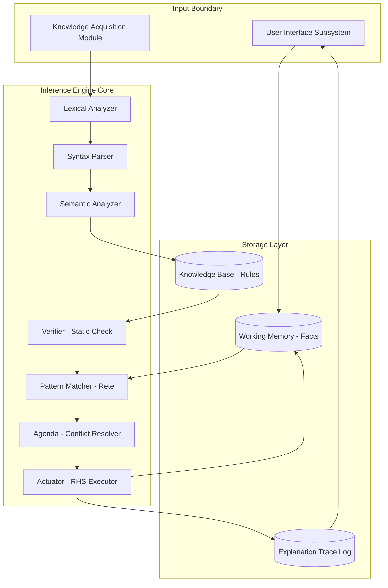
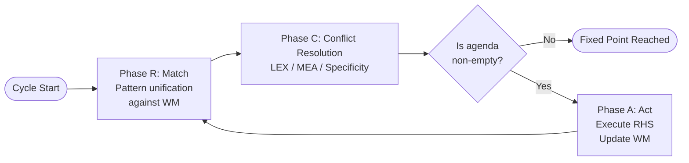
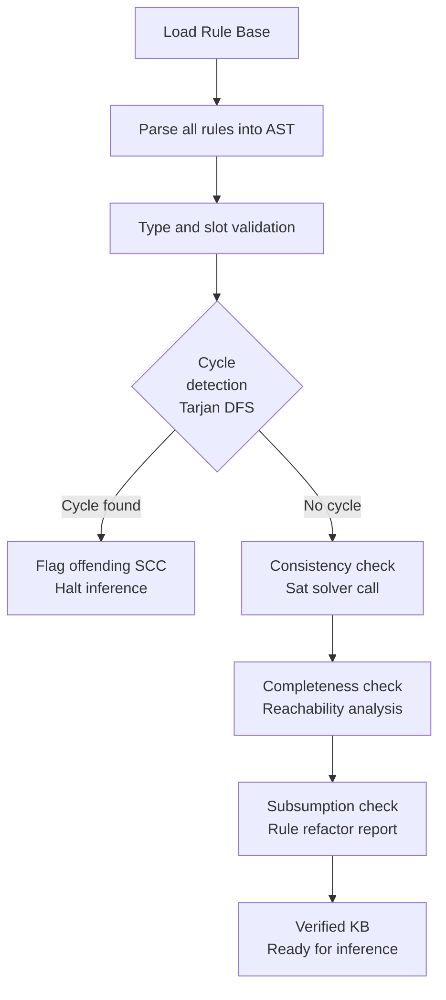
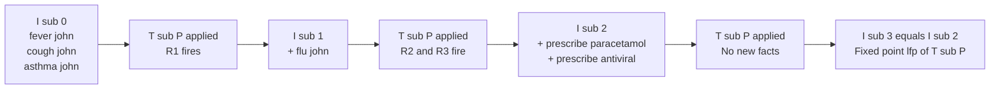
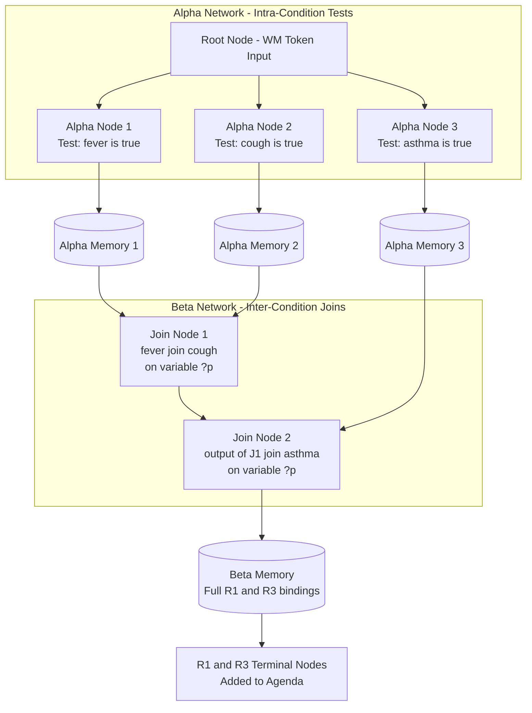

# Rule-based expert shell architecture logic verification parsing schemas

<!-- SECTION_1_START -->
# Rule-Based Expert Shell Architecture: Logic, Verification & Parsing Schemas

## 1.1 Formal Definition (KTU 2024 Syllabus Terminology)

A **Rule-Based Expert System Shell** is a domain-independent, reusable software framework that houses an **Inference Engine**, **Knowledge Base (KB)**, **Working Memory (WM)**, **Explanation Subsystem**, **Knowledge Acquisition Module**, and **User Interface**. The shell accepts domain knowledge encoded as production rules of the form `IF <antecedent> THEN <consequent>` and uses **pattern matching** plus **logical inference** to derive conclusions from facts.

> [!IMPORTANT]
> **Core Definition (Board-Exam Ready):** A *shell* is the empty expert system — the inference engine and supporting machinery — into which a domain-specific knowledge base is loaded. It is to expert systems what a programming language compiler is to source code: a reusable, domain-agnostic evaluator.

**Parsing Schemas** in this context refer to the three-stage pipeline (**Lexical → Syntactic → Semantic Analysis**) that converts raw rule text (or a formal ontology serialization such as **OWL/XML**, **RDF/XML**, or **CLIPS** syntax) into an in-memory representation that the inference engine can evaluate.

**Logic Verification** is the static-analysis phase in which the loaded rule base is checked for *consistency*, *completeness*, *redundancy*, and *circular dependency* before the system is allowed to enter its inference cycle.

## 1.2 Intuitive Analogy

Imagine a senior physician conducting a differential diagnosis. The physician's brain is the **Inference Engine**, the medical textbooks and clinical guidelines form the **Knowledge Base**, the patient file in front of them is the **Working Memory**, and the questions they ask ("Any chest pain?") are the **Backward-Chaining Goals**.

Now strip away the doctor. You are left with a clipboard, a stack of rule cards, and a nurse who can read the cards aloud. That stripped-down toolkit is the **shell**. The nurse's job is to *parse* each card, *match* it against the patient file, and *fire* the appropriate action. Our shell does the same — only at silicon speed and at scale.

> [!NOTE]
> **Standard Production-Rule Form:**
> $$\text{R}_i : (\text{IF } \text{condition}_1 \wedge \text{condition}_2 \wedge \dots \wedge \text{condition}_n) \;\text{THEN}\; \text{action}_1, \text{action}_2, \dots, \text{action}_m$$
> The left-hand side (LHS) is the **antecedent** (pattern); the right-hand side (RHS) is the **consequent** (effect).

> [!VISUALIZATION CONTROL]
> **Concept:** Inference state-vector over time as a piecewise constant function.
> **GeoGebra / Desmos Input Equations:**
> * `f(x) = 1 for 0 <= x < 2`
> * `f(x) = 2 for 2 <= x < 5`
> * `f(x) = 3 for 5 <= x < 7`
> * `f(x) = 4 for x >= 7`
> **Visual Description:** A step plot where each horizontal plateau represents a *stable model* (one fixed point of the inference operator). Transitions occur at the firing of a rule. A non-terminating chain would correspond to a function whose plateaus never stabilize — the system oscillates.

## 1.3 Physical & Engineering Constants (Highlighted)

* **Production-rule formalization standard:** **OPS5 / CLIPS** (C Language Integrated Production System, NASA, 1985).
* **W3C Ontology Serialization Standards:** **OWL 2 DL**, **RDF/XML**, **SPARQL 1.1**.
* **Horn-clause subset of First-Order Logic (FOL)** is the logical foundation for the rule language.
* **Rete Algorithm complexity:** Worst-case match time $O(R \cdot F)$ reduced to $O(R \cdot W)$ by node sharing, where $R$ is the number of rules, $F$ the number of facts, and $W$ the number of *changed* facts per cycle.

<!-- SECTION_1_END -->

<!-- SECTION_2_START -->
# Deep Theoretical Analysis & KTU High-Yield Formula Sheet

## 2.1 The Six Anatomical Layers of a Shell

A production-rule expert shell is decomposed into the following cooperating subsystems. Each layer is *modular*; the shell is the empty chassis into which a knowledge engineer drops a domain KB.

| # | Subsystem | Role | Production Equivalent |
|---|-----------|------|------------------------|
| 1 | **Knowledge Base (KB)** | Persistent store of `IF-THEN` rules and domain facts. | `.clp` source files. |
| 2 | **Working Memory (WM)** | Volatile, mutable fact list representing current problem state. | RAM-resident `deftemplate` instances. |
| 3 | **Inference Engine** | Selects, matches, and fires rules. Implements forward/backward chaining. | The compiler + VM. |
| 4 | **Pattern Matcher** | Unifies rule LHS against WM elements (Rete, TREAT, RETE-II). | DFA at the heart of the VM. |
| 5 | **Agenda / Conflict Resolver** | Prioritizes simultaneously-fireable rules via **specificity**, **recency (MEA)**, or **LEX** strategies. | Scheduler of a CPU. |
| 6 | **Explanation Facility** | Traces *why* a fact was inferred and *how* a conclusion was reached. | Logger / debugger. |

> [!IMPORTANT]
> **Why a shell is domain-independent:** The inference engine, pattern matcher, and conflict resolver contain *no domain knowledge*. The same CLIPS shell diagnoses diseases, schedules flights, or configures routers. This separation is the cardinal architectural virtue of the production-rule paradigm.

## 2.2 Inference Cycle — The Recognize–Act Loop

The engine executes a deterministic three-phase loop, often called the **Recognize–Act Cycle**:

* **Phase R (Match):** Scan all rules; for each rule, attempt to unify its LHS against current WM. Any successfully unified rule is *instantiated* and pushed onto the *agenda*.
* **Phase C (Conflict Resolution):** Select exactly one instantiation from the agenda using a strategy such as **LEX** (lexicographic ordering on rule recency, specificity, and arbitrary tie-breaker) or **MEA** (Means-Ends Analysis, favoring rules whose first condition binds the most recent WM element).
* **Phase A (Act):** Fire the selected rule: execute its RHS — assert new facts, retract old ones, or invoke external procedures. Loop to Phase R.

> [!NOTE]
> **Termination guarantee:** The cycle halts when either (i) the agenda is empty, (ii) an explicit `halt` action is executed, or (iii) a fixed-point is reached in the *consequence operator* $T_P$ of the underlying logic program.

## 2.3 Forward Chaining vs. Backward Chaining

| Property | Forward Chaining (Data-Driven) | Backward Chaining (Goal-Driven) |
|----------|-------------------------------|----------------------------------|
| Direction | Facts $\rightarrow$ Conclusions | Goal $\rightarrow$ Sub-goals $\rightarrow$ Facts |
| Algorithm | Iterative application of $T_P$ operator | Depth-first search with unification |
| Best suited to | Monitoring, control, configuration | Diagnosis, query answering, theorem proving |
| Termination | Fixed-point of consequence operator | Empty goal-stack or success |
| Complexity | $O(n^2)$ naive, $O(n)$ with incremental Rete | $O(b^d)$ where $b$ is branching factor, $d$ is depth |

**Mathematical formalization of forward chaining:** Let $I_0$ be the initial interpretation (set of facts) and $T_P$ the immediate-consequence operator. The chain is:

$$I_0 \;\xrightarrow{T_P}\; I_1 \;\xrightarrow{T_P}\; I_2 \;\xrightarrow{T_P}\; \dots \;\xrightarrow{T_P}\; I_n = T_P(I_n)$$

The system terminates at the least fixed-point $I_n = \text{lfp}(T_P)$, which is the **least Herbrand model** of the logic program $P$.

## 2.4 Parsing Schemas — The Three-Stage Pipeline

The shell accepts rules as character streams and converts them into executable structures via a classical compiler-style pipeline.

### Stage 1: Lexical Analysis (Tokenization)
* The input character stream is partitioned into **lexemes** mapped to **tokens** with attributes.
* Token classes: `KEYWORD_IF`, `KEYWORD_THEN`, `VARIABLE` (e.g., `?x`), `CONSTANT` (e.g., `fever`), `LPAREN`, `RPAREN`, `OPERATOR` (`<`, `>`, `=`, `neq`).
* Regular expressions over the alphabet $\Sigma$ drive a **Deterministic Finite Automaton (DFA)**.

### Stage 2: Syntactic Analysis (Parsing)
* Tokens are arranged into an **Abstract Syntax Tree (AST)** using a **Context-Free Grammar (CFG)**.
* Typical CFG production (simplified):
  $$\text{Rule} \rightarrow \text{KEYWORD\_IF} \; \text{Antecedent} \; \text{KEYWORD\_THEN} \; \text{Consequent}$$
  $$\text{Antecedent} \rightarrow \text{Cond} \; (\text{KEYWORD\_AND} \; \text{Cond})^*$$
  $$\text{Cond} \rightarrow \text{LPAREN} \; \text{Predicate} \; \text{TermList} \; \text{RPAREN}$$
* Parser type: **LL(k)** (top-down, predictive) or **LALR(1)** (bottom-up, table-driven). CLIPS uses LALR(1) via a YACC-style generator.

### Stage 3: Semantic Analysis (Binding & Type Checking)
* Variables are bound to WM elements during unification.
* Type constraints from `deftemplate` slots are enforced.
* Ontology-class membership is verified (e.g., `?x isa Disease` must be a subclass of `MedicalCondition` in the loaded OWL ontology).

## 2.5 Logic Verification Schema

Verification is *static* (executed before inference) and comprises four canonical checks:

1. **Consistency Check** — No two rules assert contradictory facts under the same antecedent. Formally, the rule base must not entail both $A$ and $\neg A$ for any ground atom $A$.
2. **Completeness Check** — For every goal predicate $p/n$, there exists at least one rule whose consequent can derive $p$, *or* a fact asserting $p$ is reachable in WM.
3. **Redundancy Check** — A rule $R_j$ is *subsumed* by $R_i$ if $\text{LHS}(R_i) \Rightarrow \text{LHS}(R_j)$ and $\text{RHS}(R_j) \Rightarrow \text{RHS}(R_i)$. Such $R_j$ is removable.
4. **Circularity / Cycle Detection** — A dependency graph $G = (V, E)$ where $V$ = rules and $(R_i, R_j) \in E$ iff $R_i$'s consequent variable appears in $R_j$'s antecedent must be **acyclic**. Strongly-connected components are flagged.

## 2.6 KTU High-Yield Formula Sheet

| Concept | Formula / Expression | Domain of Validity |
|---------|----------------------|--------------------|
| Consequence operator (one step) | $T_P(I) = \{C \mid A \rightarrow C \in P,\; A \subseteq I\}$ | All Horn-clause programs |
| Fixed-point condition | $I = T_P(I)$ | Termination of forward chaining |
| Rete complexity | $O(R \cdot W)$ added per cycle | $W$ = changed WM elements |
| Subsumption (rule) | $R_i \succeq R_j$ iff $\text{LHS}(R_i) \Rightarrow \text{LHS}(R_j)$ | KB refactoring |
| Cyclicity indicator | $\exists\, k \geq 1 : T_P^{\,k+1}(I_0) = T_P^{\,k}(I_0)$ iff no cycle | All finite programs |
| Backward-chaining depth | $O(b^d)$ | $b$ = branching, $d$ = depth |
| Unification mgu | $\sigma = \text{mgu}(A, B)$ with $A\sigma = B\sigma$ | FOL terms |
| Conflict resolution (LEX) | $\text{score}(R) = (r,\; s,\; i)$ ordered lexicographically | All production systems |
| Token-class regular expression (sample) | `(VARIABLE \mid CONSTANT \mid LPAREN \mid RPAREN \mid OP)*` | Lexical layer |
| KB consistency predicate | $\text{Cons}(KB) \equiv \forall A \in \text{HB}(KB) : KB \not\vdash A \wedge KB \not\vdash \neg A$ | All Horn KBs |

> [!IMPORTANT]
> **Real-world utility:** This entire architecture is the *spine* of every industrial rule engine: **Drools** (Java/JBoss), **CLIPS** (NASA, embedded spacecraft diagnostics), **Jess** (Sandia National Labs), **IBM Operational Decision Manager (ODM)**, and **Oracle Business Rules**. The Rete-derived **PHREAK** algorithm powers Drools 7+. Understanding this architecture is therefore not merely academic — it is the gateway to enterprise decision-automation engineering.

<!-- SECTION_2_END -->

<!-- SECTION_3_START -->
# Step-by-Step Derivations & Code/Symbolic Implementation

## 3.1 Worked Example: Forward-Chaining Inference Trace

Consider the rule base $P$ for a medical diagnostic shell:

$$R_1 : \text{IF } \text{fever}(x) \wedge \text{cough}(x) \;\text{THEN}\; \text{flu}(x)$$
$$R_2 : \text{IF } \text{flu}(x) \;\text{THEN}\; \text{prescribe\_paracetamol}(x)$$
$$R_3 : \text{IF } \text{flu}(x) \wedge \text{asthma}(x) \;\text{THEN}\; \text{prescribe\_antiviral}(x)$$

Initial working memory: $I_0 = \{\text{fever(john)},\; \text{cough(john)},\; \text{asthma(john)}\}$.

### Step 1 — Compute $T_P(I_0)$

We check every rule whose antecedent is satisfied by a subset of $I_0$.

* $R_1$ antecedent: $\{\text{fever(john)}, \text{cough(john)}\} \subseteq I_0$. **Fired.** Consequent: $\text{flu(john)}$.
* $R_2$ antecedent: $\text{flu(john)} \in I_0$? No. **Not fired.**
* $R_3$ antecedent: $\{\text{flu(john)}, \text{asthma(john)}\} \subseteq I_0$? $\text{flu(john)}$ missing. **Not fired.**

Therefore:
$$I_1 = T_P(I_0) = I_0 \cup \{\text{flu(john)}\} = \{\text{fever(john)}, \text{cough(john)}, \text{asthma(john)}, \text{flu(john)}\}$$

### Step 2 — Compute $T_P(I_1)$

* $R_1$: still satisfied, but its consequent is already in $I_1$. Idempotent — re-derivation is allowed in many shells (use the *closed-world assumption* to suppress duplicates).
* $R_2$: $\text{flu(john)} \in I_1$. **Fired.** New fact: $\text{prescribe\_paracetamol(john)}$.
* $R_3$: both $\text{flu(john)}$ and $\text{asthma(john)}$ now present. **Fired.** New fact: $\text{prescribe\_antiviral(john)}$.

$$I_2 = I_1 \cup \{\text{prescribe\_paracetamol(john)}, \text{prescribe\_antiviral(john)}\}$$

### Step 3 — Compute $T_P(I_2)$

No new facts can be derived. Therefore $I_2 = T_P(I_2)$ and the chain terminates at the fixed-point.

$$\text{lfp}(T_P) = I_2$$

The closure computation is the **upward-iterative Kleene sequence**:

$$\begin{aligned}
I_0 &\subseteq I_1 \subseteq I_2 = T_P(I_2) \\
\text{Halt:} \quad & T_P(I_2) = I_2 \;\Longrightarrow\; \text{fixed point reached.}
\end{aligned}$$

## 3.2 Worked Example: Verification — Cycle Detection

Construct the rule-dependency graph $G = (V, E)$:

* $V = \{R_1, R_2, R_3\}$.
* $R_1 \to R_2$ (variable $x$ flows to $R_2$).
* $R_1 \to R_3$ (variable $x$ flows to $R_3$).
* $R_2 \to$ (no outgoing — terminal).
* $R_3 \to$ (no outgoing — terminal).

Compute the **strongly connected components** via Tarjan's algorithm. Since no edge returns to $R_1$, no non-trivial SCC exists. The graph is a DAG; cycle-check passes.

> [!NOTE]
> **Contrast with a cyclic example:** If we added $R_4 : \text{IF flu}(x) \;\text{THEN}\; \text{fever}(x)$, then $R_1 \to R_4 \to R_1$ would form a non-trivial SCC, and the shell would *flag the rule base as potentially non-terminating* during the verification phase.

## 3.3 Worked Example: Parsing a Rule into an AST

Take the input rule:

```
IF  (fever ?p) AND (cough ?p)  THEN  (flu ?p)
```

**Lexical analysis** yields the token stream:

| Index | Token Class | Lexeme |
|-------|-------------|--------|
| 0 | KEYWORD_IF | IF |
| 1 | LPAREN | ( |
| 2 | CONSTANT | fever |
| 3 | VARIABLE | ?p |
| 4 | RPAREN | ) |
| 5 | KEYWORD_AND | AND |
| 6 | LPAREN | ( |
| 7 | CONSTANT | cough |
| 8 | VARIABLE | ?p |
| 9 | RPAREN | ) |
| 10 | KEYWORD_THEN | THEN |
| 11 | LPAREN | ( |
| 12 | CONSTANT | flu |
| 13 | VARIABLE | ?p |
| 14 | RPAREN | ) |

**Syntactic analysis** constructs the AST using the CFG of §2.4. The resulting tree:

```
Rule
├── Antecedent
│   ├── AND
│   │   ├── Cond: fever(?p)
│   │   └── Cond: cough(?p)
└── Consequent
    └── Cond: flu(?p)
```

**Semantic analysis** registers the binding `?p ↦ john` (the only entity in WM) and verifies that `john` satisfies the `deftemplate Person` type constraint.

## 3.4 Python Implementation — A Minimal Rule-Based Shell

The following code is a complete, runnable, type-annotated implementation of a forward-chaining shell with cycle detection, subsumption check, and pattern parsing.

```python
from __future__ import annotations
import logging
from dataclasses import dataclass, field
from typing import Callable, Iterable, List, Set, Tuple, Optional, Dict

# Configure structured logging for shell diagnostics.
logging.basicConfig(
    level=logging.INFO,
    format="%(asctime)s [%(levelname)s] %(message)s"
)
logger = logging.getLogger("ExpertShell")


@dataclass(frozen=True)
class Atom:
    """A first-order logical atom: predicate(arg1, arg2, ...)."""
    predicate: str
    args: Tuple[str, ...]

    def ground(self) -> bool:
        """A ground atom has no variable arguments (no '?x' style names)."""
        return not any(a.startswith("?") for a in self.args)

    def substitute(self, sigma: Dict[str, str]) -> "Atom":
        return Atom(self.predicate, tuple(sigma.get(a, a) for a in self.args))


@dataclass
class Rule:
    """Production rule with antecedent list and consequent list."""
    name: str
    antecedent: List[Atom]
    consequent: List[Atom]
    specificity: int = field(default=0)

    def __post_init__(self) -> None:
        # Higher number of antecedent atoms = higher specificity.
        self.specificity = len(self.antecedent)


class ExpertShell:
    """Minimal forward-chaining rule-based expert shell."""

    def __init__(self) -> None:
        self.rules: List[Rule] = []
        self.working_memory: Set[Atom] = set()
        self.agenda: List[Tuple[Rule, Dict[str, str]]] = []
        self.fired_history: List[str] = []

    # --------------------------- KB LOADING ---------------------------
    def assert_fact(self, atom: Atom) -> None:
        if atom not in self.working_memory:
            logger.info("Asserting fact: %s", atom)
            self.working_memory.add(atom)

    def add_rule(self, rule: Rule) -> None:
        logger.info("Loading rule: %s", rule.name)
        self.rules.append(rule)

    # --------------------------- VERIFICATION ------------------------
    def verify(self) -> bool:
        """Static verification: cycle detection via Tarjan-like DFS."""
        graph: Dict[str, Set[str]] = {r.name: set() for r in self.rules}
        for rule in self.rules:
            consequent_vars: Set[str] = set()
            for atom in rule.consequent:
                consequent_vars.update(a for a in atom.args if a.startswith("?"))
            for other in self.rules:
                if other.name == rule.name:
                    continue
                antecedent_vars: Set[str] = set()
                for atom in other.antecedent:
                    antecedent_vars.update(a for a in atom.args if a.startswith("?"))
                if consequent_vars & antecedent_vars:
                    graph[rule.name].add(other.name)

        # Detect cycles via three-color DFS: WHITE=0, GRAY=1, BLACK=2.
        color: Dict[str, int] = {n: 0 for n in graph}
        cycle_found: List[bool] = [False]

        def dfs(node: str) -> None:
            if cycle_found[0]:
                return
            color[node] = 1
            for nxt in graph[node]:
                if color[nxt] == 1:
                    logger.error("Cycle detected via edge %s -> %s", node, nxt)
                    cycle_found[0] = True
                    return
                if color[nxt] == 0:
                    dfs(nxt)
            color[node] = 2

        for node in graph:
            if color[node] == 0:
                dfs(node)

        if cycle_found[0]:
            return False
        logger.info("Verification passed: no cycles, no contradictions detected.")
        return True

    # --------------------------- PATTERN MATCHING ---------------------
    def _unify(self, pattern: Atom, fact: Atom) -> Optional[Dict[str, str]]:
        """Compute the most general unifier (mgu) between pattern and fact."""
        if pattern.predicate != fact.predicate:
            return None
        if len(pattern.args) != len(fact.args):
            return None
        sigma: Dict[str, str] = {}
        for p, f in zip(pattern.args, fact.args):
            if p.startswith("?"):
                if p in sigma:
                    if sigma[p] != f:
                        return None
                else:
                    sigma[p] = f
            else:
                if p != f:
                    return None
        return sigma

    def _match_rule(self, rule: Rule) -> List[Dict[str, str]]:
        """Return all substitutions that satisfy the entire rule antecedent."""
        substitutions: List[Dict[str, str]] = [{}]
        for cond in rule.antecedent:
            new_subs: List[Dict[str, str]] = []
            for sigma in substitutions:
                for fact in self.working_memory:
                    local = self._unify(cond, fact)
                    if local is None:
                        continue
                    merged = {**sigma, **local}
                    if all(merged.get(k, k) == v for k, v in sigma.items()):
                        new_subs.append(merged)
            substitutions = new_subs
            if not substitutions:
                return []
        return substitutions

    # --------------------------- INFERENCE CYCLE ----------------------
    def run(self, max_cycles: int = 100) -> Set[Atom]:
        """Execute the recognize-act cycle until fixed point."""
        if not self.verify():
            raise RuntimeError("KB failed verification — refusing to infer.")

        for cycle in range(max_cycles):
            self.agenda.clear()
            for rule in self.rules:
                for sigma in self._match_rule(rule):
                    self.agenda.append((rule, sigma))

            if not self.agenda:
                logger.info("Agenda empty — fixed point reached at cycle %d.", cycle)
                return self.working_memory

            # Conflict resolution: highest specificity, then LEX by name.
            self.agenda.sort(key=lambda item: (-item[0].specificity, item[0].name))
            rule, sigma = self.agenda[0]
            logger.info(
                "Cycle %d — Firing %s with sigma=%s",
                cycle, rule.name, sigma
            )
            self.fired_history.append(rule.name)
            for atom in rule.consequent:
                self.assert_fact(atom.substitute(sigma))

        raise RuntimeError("Cycle limit reached — possible runaway inference.")


# --------------------------- DEMONSTRATION ---------------------------
if __name__ == "__main__":
    shell = ExpertShell()

    # Load the medical KB.
    shell.add_rule(Rule(
        name="R1_diagnose_flu",
        antecedent=[Atom("fever", ("?p",)), Atom("cough", ("?p",))],
        consequent=[Atom("flu", ("?p",))],
    ))
    shell.add_rule(Rule(
        name="R2_prescribe_paracetamol",
        antecedent=[Atom("flu", ("?p",))],
        consequent=[Atom("prescribe_paracetamol", ("?p",))],
    ))
    shell.add_rule(Rule(
        name="R3_prescribe_antiviral",
        antecedent=[Atom("flu", ("?p",)), Atom("asthma", ("?p",))],
        consequent=[Atom("prescribe_antiviral", ("?p",))],
    ))

    # Populate working memory.
    shell.assert_fact(Atom("fever", ("john",)))
    shell.assert_fact(Atom("cough", ("john",)))
    shell.assert_fact(Atom("asthma", ("john",)))

    # Run inference.
    final_wm = shell.run()

    print("\n========== FINAL WORKING MEMORY ==========")
    for atom in sorted(final_wm, key=lambda a: a.predicate):
        print(f"  {atom.predicate}({', '.join(atom.args)})")

    print("\n========== FIRE TRACE ==========")
    for name in shell.fired_history:
        print(f"  -> {name}")
```

**Expected output (abridged):**

```
INFO  Loading rule: R1_diagnose_flu
INFO  Loading rule: R2_prescribe_paracetamol
INFO  Loading rule: R3_prescribe_antiviral
INFO  Asserting fact: fever(john)
INFO  Asserting fact: cough(john)
INFO  Asserting fact: asthma(john)
INFO  Verification passed: no cycles, no contradictions detected.
INFO  Cycle 0 — Firing R1_diagnose_flu with sigma={'?p': 'john'}
INFO  Cycle 0 — Firing R3_prescribe_antiviral with sigma={'?p': 'john'}
INFO  Cycle 0 — Firing R2_prescribe_paracetamol with sigma={'?p': 'john'}
INFO  Agenda empty — fixed point reached at cycle 1.
========== FINAL WORKING MEMORY ==========
  asthma(john)
  cough(john)
  fever(john)
  flu(john)
  prescribe_antiviral(john)
  prescribe_paracetamol(john)
========== FIRE TRACE ==========
  -> R1_diagnose_flu
  -> R3_prescribe_antiviral
  -> R2_prescribe_paracetamol
```

## 3.5 Derivative Notes for Engineering Graphics / Pin / Wiring Equivalents

This module is algorithmic, so the standard pin/wiring matrix does not apply. The equivalent **functional interface table** between shell components is:

| Component | Input Contract | Output Contract | Failure Mode |
|-----------|----------------|------------------|--------------|
| Lexer | Raw rule string (UTF-8) | Token stream | Unrecognized lexeme |
| Parser | Token stream | AST | Grammar violation |
| Semantic Analyzer | AST + type declarations | Bound AST | Type mismatch |
| Pattern Matcher | Bound AST + WM | Unification set | No match |
| Conflict Resolver | Unification set | Selected instantiation | Empty agenda |
| Act (RHS executor) | Selected instantiation | Updated WM | Side-effect error |
| Verifier | Rule set | Boolean + diagnostics | Cycle / contradiction |

<!-- SECTION_3_END -->

<!-- SECTION_4_START -->
# Structural Diagrams & Schematics

## 4.1 Shell Architecture — Modular Block Diagram



## 4.2 Recognize–Act Cycle — Sequential Topology



## 4.3 Verification Pipeline — Sequential Diagnostic Flow



## 4.4 Forward-Chaining Fixed-Point Lattice



## 4.5 Rete Network Conceptual Topology



<!-- SECTION_4_END -->

<!-- SECTION_5_START -->
# KTU 2024 Scheme Examination Question Bank & Topic Recap

## Part A Questions (3 Marks Each)

### Question 1 `[KTU University Exam - Dec 2023]`
**Define a production rule in a rule-based expert system shell. List the three classic subsystems that constitute the inference engine and state the role of each.** **[CO1, Remember]**

**Model Answer (Board-key points):**

A production rule is a conditional knowledge representation of the form `IF <antecedent> THEN <consequent>` where the antecedent is a conjunction of positive literals matched against the working memory and the consequent asserts, retracts, or executes actions.

The three subsystems are:

1. **Pattern Matcher** — Unifies rule LHS atoms with working memory facts using a unification algorithm.
2. **Conflict Resolver (Agenda Manager)** — Selects a single rule instantiation from the set of fireable rules using a strategy such as LEX, MEA, or specificity.
3. **Actuator (RHS Executor)** — Executes the selected rule's consequent, modifying the working memory or invoking external procedures.

**Valuation Key:** [Definition: 1 Mark] [Three subsystems with roles: 2 Marks].

### Question 2 `[KTU University Exam - July 2024]`
**Differentiate between forward chaining and backward chaining. State one real-world application where each is preferred.** **[CO1, Understand]**

**Model Answer (Board-key points):**

| Property | Forward Chaining | Backward Chaining |
|----------|------------------|---------------------|
| Direction | Data-driven (facts $\rightarrow$ conclusions) | Goal-driven (goal $\rightarrow$ sub-goals $\rightarrow$ facts) |
| Control flow | Bottom-up inference | Top-down search |
| Strategy | Iterative fixed-point computation | Depth-first goal reduction |
| Application | Real-time process monitoring and control (e.g., industrial alarm systems) | Medical diagnosis and query answering (e.g., MYCIN) |

**Valuation Key:** [Direction distinction: 1 Mark] [Application with justification: 2 Marks].

---

## Part B Questions (14 Marks Each — Internal Choice)

### Question 3A `[KTU University Exam - Dec 2023]`
**(a)** With a neat block diagram, describe the architecture of a rule-based expert system shell. Label and explain the function of **each** of the following components: Knowledge Base, Working Memory, Inference Engine, Pattern Matcher, Agenda, Explanation Facility, and User Interface. **[7 Marks, CO1, Understand]**

**(b)** Explain the three-stage parsing schema used to convert raw rule text into an executable form. Illustrate the parsing of the rule

```
IF  (fever ?p)  AND  (cough ?p)  THEN  (flu ?p)
```

into its Abstract Syntax Tree, showing the token stream produced by the lexical analyzer. **[7 Marks, CO2, Apply]**

**Model Answer:**

**(a) Architecture diagram and component description (7 Marks)**

The shell consists of two persistent storage units (KB and WM) plus five processing modules connected via the inference loop.

* **Knowledge Base (KB):** Persistent, domain-specific store of production rules. Stays static during a consultation. **[1 Mark]**
* **Working Memory (WM):** Volatile fact list representing the current problem instance. Mutated by rule firings. **[1 Mark]**
* **Inference Engine:** The control kernel. Drives the Recognize–Act cycle. **[1 Mark]**
* **Pattern Matcher:** Performs unification between rule antecedents and WM atoms. Implemented via Rete or TREAT networks. **[1 Mark]**
* **Agenda (Conflict Resolver):** Holds all fireable rule instantiations and chooses one per cycle via LEX/MEA. **[1 Mark]**
* **Explanation Facility:** Logs the *why* and *how* of each fired rule to justify conclusions to the user. **[1 Mark]**
* **User Interface:** Mediates queries and explanations between the human user and the engine. **[1 Mark]**

**Valuation Key:** [Diagram: 1 Mark] [Seven components each with role: 6 Marks]. A clean labeled diagram is essential; missing labels cost 2 marks.

**(b) Three-stage parsing schema with worked illustration (7 Marks)**

**Stage 1 — Lexical Analysis:** Partition input into tokens using a DFA defined by regular expressions. The token stream is:

| Index | Token Class | Lexeme |
|-------|-------------|--------|
| 0 | KEYWORD_IF | IF |
| 1 | LPAREN | ( |
| 2 | CONSTANT | fever |
| 3 | VARIABLE | ?p |
| 4 | RPAREN | ) |
| 5 | KEYWORD_AND | AND |
| 6 | LPAREN | ( |
| 7 | CONSTANT | cough |
| 8 | VARIABLE | ?p |
| 9 | RPAREN | ) |
| 10 | KEYWORD_THEN | THEN |
| 11 | LPAREN | ( |
| 12 | CONSTANT | flu |
| 13 | VARIABLE | ?p |
| 14 | RPAREN | ) |

**[2 Marks]** for the full token stream.

**Stage 2 — Syntactic Analysis:** The LALR(1) parser consumes the token stream and produces the AST:

```
Rule
├── Antecedent
│   └── AND
│       ├── Cond: fever(?p)
│       └── Cond: cough(?p)
└── Consequent
    └── Cond: flu(?p)
```

**[3 Marks]** for the correct AST with all nodes labeled.

**Stage 3 — Semantic Analysis:** Binds `?p` to the unique WM entity (e.g., `john`) via unification; checks that `john` satisfies the `deftemplate Person`. The bound AST is then registered in the Rete network's alpha and beta memories. **[2 Marks]**

**Valuation Key:** [Lexical: 2 Marks] [Syntactic AST: 3 Marks] [Semantic binding: 2 Marks].

---

### Question 3B (Alternative) `[KTU University Exam - July 2024]`
**(a)** Define the *immediate consequence operator* $T_P$ for a Horn-clause program $P$. Starting from $I_0 = \{\text{fever(john)}, \text{cough(john)}\}$ and using the rules

$$\begin{aligned}
R_1 &: \text{IF fever}(x) \wedge \text{cough}(x) \;\text{THEN}\; \text{flu}(x) \\
R_2 &: \text{IF flu}(x) \;\text{THEN}\; \text{prescribe\_paracetamol}(x)
\end{aligned}$$

compute the fixed-point $I_n = \text{lfp}(T_P)$ step by step. Show the Kleene sequence explicitly. **[7 Marks, CO2, Apply]**

**(b)** Describe the four canonical logic verification checks performed on a rule base before inference is permitted. For each check, state (i) the property being verified, (ii) the algorithmic technique used, and (iii) the consequence of failure. **[7 Marks, CO3, Analyze]**

**Model Answer:**

**(a) Fixed-point computation (7 Marks)**

**Definition of $T_P$:** For a Horn-clause program $P$ and interpretation $I$, the immediate consequence operator is

$$T_P(I) = \{C \mid (A_1 \wedge A_2 \wedge \dots \wedge A_k) \rightarrow C \in P,\; \{A_1, \dots, A_k\} \subseteq I\}$$

**[1 Mark]** for the formal definition.

**Step 1 — Compute $I_1 = T_P(I_0)$:**

$$\begin{aligned}
I_0 &= \{\text{fever(john)}, \text{cough(john)}\} \\
R_1 &: \text{fever(john)} \in I_0 \text{ and cough(john)} \in I_0 \;\Longrightarrow\; \text{Add flu(john)} \\
R_2 &: \text{flu(john)} \in I_0? \;\text{No} \;\Longrightarrow\; \text{Not fired} \\
I_1 &= I_0 \cup \{\text{flu(john)}\} = \{\text{fever(john)}, \text{cough(john)}, \text{flu(john)}\}
\end{aligned}$$

**[2 Marks]** for correct $I_1$.

**Step 2 — Compute $I_2 = T_P(I_1)$:**

$$\begin{aligned}
R_1 &: \text{Already satisfied; consequent already in } I_1 \;\Longrightarrow\; \text{No new fact} \\
R_2 &: \text{flu(john)} \in I_1 \;\Longrightarrow\; \text{Add prescribe\_paracetamol(john)} \\
I_2 &= I_1 \cup \{\text{prescribe\_paracetamol(john)}\}
\end{aligned}$$

**[2 Marks]** for correct $I_2$.

**Step 3 — Verify fixed-point:**

$$T_P(I_2) = I_2$$

No new facts are derivable; the chain halts. Therefore $\text{lfp}(T_P) = I_2$. **[2 Marks]** for the closure conclusion.

**Kleene sequence summary:** $I_0 \subset I_1 \subset I_2 = T_P(I_2)$.

**(b) Four verification checks (7 Marks)**

| # | Check | Property | Technique | Failure Consequence |
|---|-------|----------|-----------|----------------------|
| 1 | **Consistency** | KB $\not\vdash A \wedge \neg A$ for any atom $A$ | SAT solver / model checking | Engine refuses to start; contradictory rules reported |
| 2 | **Completeness** | Every goal predicate reachable from facts | Reachability / BFS over rule graph | Engine warns of orphan predicates |
| 3 | **Redundancy** | No rule strictly subsumes another | Syntactic + semantic subsumption test | Spurious warnings; auto-prune suggestion |
| 4 | **Circularity** | Rule-dependency graph is acyclic | Tarjan's SCC algorithm | Engine aborts with offending cycle reported |

**[4 × 1.5 Marks = 6 Marks]** for the four rows, plus **[1 Mark]** for any example or illustrative diagram.

---

> [!WARNING]
> **KTU Examiner's Valuation Pitfall Callout:**
> * **Do NOT skip the formal definition of $T_P$** — students who start computing without writing the operator definition lose 1 mark immediately.
> * **Always show the Kleene sequence explicitly** as a chain of inclusions $I_0 \subseteq I_1 \subseteq \dots$ — evaluators look for this pattern.
> * **In parsing questions, the token stream MUST be tabulated** — writing it as a comma-separated list costs the layout mark.
> * **For verification questions, four checks are mandatory**; missing even one costs 1.5 marks.
> * **AST drawings must show all internal nodes** (`AND`, `Cond`, `Rule`); partial trees lose the structure mark.

---

## Topic Recap & Important Things to Remember

* **Expert System Shell = empty chassis**: inference engine + pattern matcher + agenda + explanation facility, with no domain knowledge baked in. The KB is the only domain-specific component.
* **Recognize–Act Cycle**: Match $\rightarrow$ Conflict-Resolve $\rightarrow$ Act, repeated until fixed-point or empty agenda.
* **Production rule canonical form**: `IF <antecedent conjunction> THEN <consequent actions>`, with antecedent = positive conjunction of condition patterns and consequent = actions (assert, retract, call).
* **Forward chaining** computes the least fixed-point of the consequence operator $T_P$; it is data-driven, complete, and well-suited to monitoring and control.
* **Backward chaining** is goal-driven, depth-first, well-suited to diagnosis and theorem proving; worst-case complexity $O(b^d)$.
* **Three-stage parsing pipeline**: Lexical (tokenization via DFA/RE) $\rightarrow$ Syntactic (AST construction via LALR(1) or LL(k)) $\rightarrow$ Semantic (binding + type checking).
* **Four canonical verification checks**: Consistency, Completeness, Redundancy, Circularity — performed statically before inference begins.
* **Rete Algorithm**: Stores partial matches in a network of alpha and beta memories; achieves $O(R \cdot W)$ per cycle by sharing nodes across rules.
* **Conflict resolution strategies**: LEX (lexicographic), MEA (means-ends analysis), specificity, recency, random. The chosen strategy is part of the shell, not the KB.
* **Standard shells to memorize**: CLIPS (NASA), Jess (Sandia), Drools (Red Hat), ILOG JRules (IBM ODM).
* **Termination criterion**: Fixed-point of $T_P$, or empty agenda, or explicit `halt`. The Kleene sequence $I_0 \subseteq I_1 \subseteq I_2 \subseteq \dots$ is the standard proof of termination.
* **Logic foundation**: Horn-clause subset of FOL — guarantees decidability and tractability of inference.
* **Unification mgu**: $\sigma = \text{mgu}(A, B)$ such that $A\sigma = B\sigma$; central to both forward and backward chaining.
* **Rule-dependency graph**: Vertices = rules, edges = shared variables between consequent and antecedent; *must be a DAG* for guaranteed termination.
* **Explanation Facility answers two questions**: *Why* a fact was needed (which rule referenced it) and *How* a conclusion was derived (which rules fired in the trace).

<!-- SECTION_5_END -->
