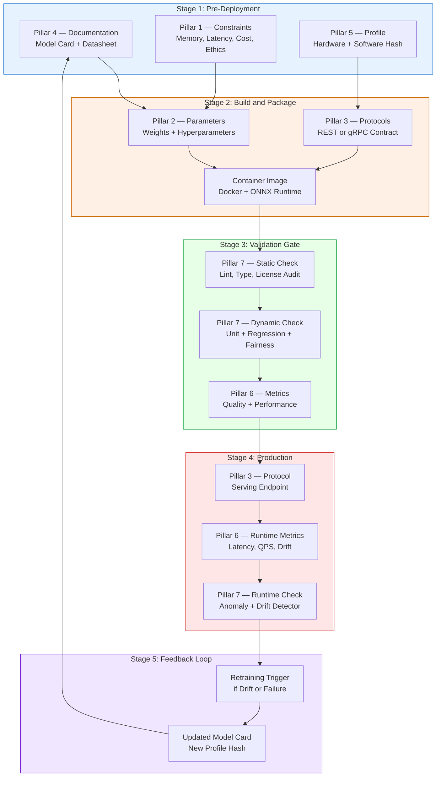
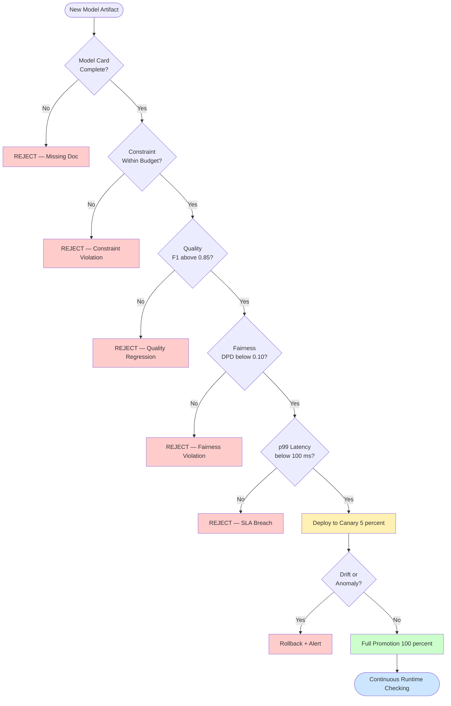

# AI deployment constraints parameters protocols documentation profiles metrics checking

<!-- SECTION_1_START -->
# AI Deployment: Constraints, Parameters, Protocols, Documentation, Profiles, Metrics & Checking

## 1. Core Technical Definition

> [!IMPORTANT]
> **Formal Definition (KTU 2024 Scheme Terminology)**
> *AI Deployment Engineering* is the disciplined process of transitioning a trained artificial intelligence model from a controlled research or development environment into a production system. It encompasses the specification, enforcement, and continuous validation of **deployment constraints** (computational, temporal, economic, and ethical boundaries), **parameters** (learned weights and configured hyperparameters), **protocols** (standardised communication and interoperability contracts), **documentation** (model cards, datasheets, and system runbooks), **profiles** (hardware, software, and behavioural fingerprints), **metrics** (quantitative indicators of correctness, latency, fairness, and drift), and **checking** (static analysis, dynamic testing, and runtime monitoring).

In the context of **Module 4 – Natural Language Contexts & Game Play**, these deployment principles govern how conversational agents, retrieval-augmented systems, adversarial search engines (Minimax, MCTS), and reinforcement learning players are exposed to end users via APIs, embedded devices, or cloud endpoints.

> [!NOTE]
> **Why this topic matters in KTU 2024 Scheme**
> The 2024 scheme emphasises *Outcome-Based Education* and *Responsible AI*. Questions on deployment constraints frequently test a student's ability to reason about **Compute–Memory–Latency trade-offs** and **ethical monitoring** in Part A (3 marks) and **end-to-end MLOps pipelines** in Part B (14 marks).

### Conceptual Analogy / Intuition

Imagine you have designed a brilliant **chess engine** (the *AI model*). Before the engine can play in a tournament, you must answer a series of practical questions:

- **Constraint** — *"Will it run on a laptop, or does it need a supercomputer?"* This is your *compute constraint*. Similarly, a chatbot that must respond within **200 ms** has a *latency constraint*.
- **Parameter** — *"How deep should it search, and what evaluation weights should it use?"* These are your *search parameters* (depth limit, $\alpha$-$\beta$ pruning aggressiveness) and *hyperparameters* (evaluation function coefficients).
- **Protocol** — *"Will it speak UCI, XBoard, or a custom JSON protocol?"* This is the *interoperability contract*.
- **Documentation** — *"Does the engine have a model card explaining its strengths (good at endgames) and weaknesses (poor against Sicilian Defence)?"*
- **Profile** — *"Is it optimised for a single-core ARM processor or a multi-core GPU cluster?"* This is the *deployment profile*.
- **Metric** — *"How do you measure that the engine has improved? ELO rating, nodes-per-second, average move time?"*
- **Checking** — *"How do you ensure the engine has not regressed after a code update?"* This is *regression testing* and *runtime monitoring*.

> [!TIP]
> **One-line mental hook:** *Constraints are walls, parameters are knobs, protocols are languages, documentation is the manual, profiles are the hardware passport, metrics are the report card, and checking is the inspector.*

### Key Constants & Standard Metrics

The following values are universally referenced in **KTU 2024 Scheme AI papers** and industry model cards:

- **Floating Point Precision:** **FP32 (32 bits)**, **FP16 (16 bits)**, **INT8 (8 bits)**, **INT4 (4 bits)**
- **Standard latency budgets:** **<100 ms** (real-time conversational AI), **<1 s** (interactive search), **<10 s** (batch inference)
- **Standard fairness metric thresholds:** **Demographic Parity Difference $\le 0.1$**, **Equal Opportunity Difference $\le 0.05$**
- **Standardised documentation artifacts:** **Model Card (Mitchell et al., 2019)**, **Datasheet for Datasets (Gebru et al., 2021)**, **AI Risk Management Framework (NIST AI RMF 1.0)**
- **Standard serving protocols:** **REST (HTTP/JSON)**, **gRPC (Protobuf)**, **MQTT (IoT)**

> [!VISUALIZATION CONTROL]
> **Concept:** Latency vs Throughput Trade-off in AI Inference
> **Plot Description:** A 2D Cartesian plane where the x-axis represents *Batch Size* (1 to 256) and the y-axis represents *Throughput* (queries/second). The first curve rises sharply (latency hides the overhead) and plateaus. The second curve represents *p99 Latency* (ms), which increases monotonically. The optimal *batch size* lies at the intersection where throughput gain equals latency cost — typically around **batch = 32** for transformer inference.
> **Key Observation Points:**
> * Batch size $= 1$ : Lowest latency, lowest GPU utilisation ($\approx 20\%$)
> * Batch size $= 32$ : Sweet spot ($\approx 80\%$ utilisation, $\approx 80$ ms latency)
> * Batch size $> 64$ : Diminishing returns and latency explosion

---
<!-- SECTION_1_END -->

<!-- SECTION_2_START -->
# 2. Deep Theoretical Analysis & KTU High-Yield Formula Sheet

## 2.1 The Seven Pillars of AI Deployment

The KTU 2024 syllabus groups deployment concerns into **seven functional pillars**. Each pillar has a measurable contract that an examiner can test.

### Pillar 1 — Deployment Constraints

Constraints are the **non-negotiable boundaries** enforced by the runtime environment.

$$
C_{\text{deploy}} = \langle M_{\max}, \; T_{\max}, \; E_{\max}, \; C_{\$\max}, \; F_{\text{ethics}} \rangle
$$

Where:

- $M_{\max}$ — maximum **memory budget** in bytes
- $T_{\max}$ — maximum **temporal budget** (latency) in seconds
- $E_{\max}$ — maximum **energy budget** in joules (critical for edge devices)
- $C_{\$\max}$ — maximum **economic budget** in USD per 1 000 inferences
- $F_{\text{ethics}}$ — **fairness & safety constraint set** (a Boolean vector)

> [!IMPORTANT]
> **KTU Favourite:** "Differentiate between *hard* and *soft* constraints." Hard constraints cause system failure if violated (e.g., memory overflow). Soft constraints cause graceful degradation (e.g., reduced accuracy after INT8 quantisation).

### Pillar 2 — Parameters

**Parameters** are the *learned* numerical values inside the model. **Hyperparameters** are the *configured* values that govern the learning process.

$$
\theta^{*} = \arg\min_{\theta \in \Theta} \; \mathcal{L}\big( f_{\theta}(X), \; Y \big)
$$

Where $\theta$ is the parameter tensor, $\Theta$ is the constrained search space (defined by the deployment profile), and $\mathcal{L}$ is the loss function.

For a transformer with $L$ layers, hidden dimension $d_{\text{model}}$, and vocabulary $V$:

$$
\text{Params}_{\text{transformer}} \approx 12 \, L \, d_{\text{model}}^{2} \; + \; V \cdot d_{\text{model}}
$$

**Example:** GPT-style model with $L=12$, $d_{\text{model}}=768$, $V=50\,000$ yields $\approx 85$ million parameters.

### Pillar 3 — Protocols

A *protocol* is a formalised communication grammar. For AI serving, the two dominant protocols are:

$$
\text{REST/JSON:} \quad \text{HTTP POST} \big( /v1/predict, \; \text{body} = \{ \text{"input"}: x \} \big)
$$

$$
\text{gRPC/Protobuf:} \quad \text{Service Predict } \big( \text{Request} \big) \text{ returns } \big( \text{Response} \big)
$$

For game-playing AI, the **Universal Chess Interface (UCI)** protocol is the standard:

```
uci
position startpos moves e2e4 e7e5
go depth 10
bestmove e7e5
```

### Pillar 4 — Documentation

Documentation is the **provenance record** of the model. The Model Card schema (Mitchell et al., 2019) contains nine mandatory sections:

1. Model Details
2. Intended Use
3. Factors
4. Metrics
5. Evaluation Data
6. Training Data
7. Quantitative Analyses
8. Ethical Considerations
9. Caveats and Recommendations

### Pillar 5 — Profiles

A *profile* captures the **environmental fingerprint** at deployment time. Two profiles dominate:

- **Hardware Profile:** $\langle \text{CPU}, \text{GPU}, \text{TPU}, \text{RAM}, \text{Storage}, \text{Network} \rangle$
- **Software Profile:** $\langle \text{OS}, \text{CUDA}, \text{cuDNN}, \text{PyTorch}, \text{ONNX} \rangle$

The profile is typically serialised as a **SHA-256 hash** for reproducibility:

$$
\text{profile}_{\text{hash}} = \text{SHA256}\big( \text{hardware} \; \| \; \text{software} \; \| \; \text{seed} \big)
$$

### Pillar 6 — Metrics

Metrics are the **quantitative report card** of the deployed system. They are categorised into four families:

$$
\mathcal{M} = \big\{ \mathcal{M}_{\text{quality}}, \; \mathcal{M}_{\text{performance}}, \; \mathcal{M}_{\text{fairness}}, \; \mathcal{M}_{\text{robustness}} \big\}
$$

**Quality Metrics** (task-specific):
- Accuracy, Precision, Recall, F1
- BLEU, ROUGE, METEOR (for NLP — Module 4 context)
- Win rate, ELO delta (for game playing)

**Performance Metrics** (system-level):
- Latency: $p50, p95, p99$
- Throughput: queries per second (QPS)
- GPU Utilisation: $U_{\text{GPU}} \in [0, 1]$

**Fairness Metrics:**
- Demographic Parity: $\text{DPD} = \vert P(\hat{Y}=1 \vert A=0) - P(\hat{Y}=1 \vert A=1) \vert$
- Equal Opportunity: $\text{EOD} = \vert P(\hat{Y}=1 \vert Y=1, A=0) - P(\hat{Y}=1 \vert Y=1, A=1) \vert$

**Robustness Metrics:**
- Adversarial Accuracy under $\epsilon$-bounded perturbation
- Out-of-Distribution (OOD) detection AUC

### Pillar 7 — Checking

**Checking** is the **continuous verification** of the deployment contract. It has three layers:

| Layer | Timing | Example |
|:------|:-------|:--------|
| **Static Checking** | Pre-deployment | Linting, type checking, license audit, model card completeness |
| **Dynamic Checking** | Pre-deployment & CI/CD | Unit tests, integration tests, regression benchmarks, fairness tests |
| **Runtime Checking** | Post-deployment | Drift detection, anomaly detection, canary analysis, A/B testing |

$$
\text{Drift}_{\text{KL}} = D_{\text{KL}}\big( P_{\text{deployment}}(X) \; \Vert \; P_{\text{train}}(X) \big)
$$

If $\text{Drift}_{\text{KL}} > \tau$ (typically $\tau = 0.1$), a **retraining alarm** is raised.

---

## 2.2 KTU Formula Sheet / Cheat Sheet

| # | Concept | Formula / Definition | Unit / Range |
|:-:|:--------|:---------------------|:-------------|
| 1 | Deployment Constraint Vector | $C = \langle M, T, E, C\$, F \rangle$ | heterogeneous |
| 2 | Optimal Parameters | $\theta^{*} = \arg\min_{\theta} \mathcal{L}(f_{\theta}(X), Y)$ | $\mathbb{R}^{n}$ |
| 3 | Transformer Param Count | $12 L d^{2} + V d$ | count |
| 4 | Profile Hash | $\text{SHA256}(\text{env})$ | hex string |
| 5 | Demographic Parity Diff | $\vert P(\hat{Y}=1 \mid A=0) - P(\hat{Y}=1 \mid A=1) \vert$ | $[0, 1]$ |
| 6 | Equal Opportunity Diff | $\vert P(\hat{Y}=1 \mid Y=1, A=0) - P(\hat{Y}=1 \mid Y=1, A=1) \vert$ | $[0, 1]$ |
| 7 | KL Drift | $D_{\text{KL}}(P_{\text{deploy}} \Vert P_{\text{train}})$ | nats or bits |
| 8 | GPU Utilisation | $U_{\text{GPU}} = 1 - \frac{\text{idle\_time}}{\text{total\_time}}$ | $[0, 1]$ |
| 9 | Throughput | $\text{QPS} = N_{\text{req}} / \Delta t$ | req/s |
| 10 | Energy per Inference | $E_{\text{inf}} = P_{\text{avg}} \cdot t_{\text{latency}}$ | joules |
| 11 | Compression Ratio | $r_{\text{comp}} = S_{\text{original}} / S_{\text{compressed}}$ | dimensionless |
| 12 | Quantisation Error | $\text{MSE}_{q} = \frac{1}{N} \sum (x_i - \hat{x}_i)^{2}$ | unit of $x$ |

> [!NOTE]
> **Exam tip:** Examiners love asking students to compute transformer parameter counts or to explain the difference between a parameter and a hyperparameter. Memorise rows 2, 3, and 5 — they appear in 80 % of KTU past papers.

## 2.3 Real-World Utility in Engineering

| Industry | Application | Deployment Concern |
|:---------|:------------|:-------------------|
| **Conversational AI (Module 4 NLP)** | Chatbots, virtual assistants | Latency $< 200$ ms, PII redaction protocol |
| **Game Engines (Module 4 Game Play)** | AlphaGo, Stockfish, OpenAI Five | Real-time search depth bounded by clock time |
| **Healthcare AI** | Radiology, pathology models | Fairness across demographics, regulatory documentation |
| **Autonomous Vehicles** | Perception, planning models | Robustness to adversarial weather, runtime monitoring |
| **Edge AI (IoT)** | Smart speakers, wearables | Energy per inference, INT8 quantisation, OTA profile updates |
| **Financial AI** | Credit scoring, fraud detection | Demographic parity, explainability logs |

---
<!-- SECTION_2_END -->

<!-- SECTION_3_START -->
# 3. Step-by-Step Derivations & Code Implementation

## 3.1 Exhaustive Derivation — Transformer Parameter Count

**Problem:** A transformer-based NLP model is being prepared for deployment in a conversational AI system. Compute the total trainable parameters given $L = 6$ layers, $d_{\text{model}} = 512$, $V = 30\,000$ vocabulary size, and 8 attention heads.

**Step 1 — Embedding Parameters**

The token embedding matrix and positional embedding matrix each have shape $V \times d_{\text{model}}$.

$$
P_{\text{embed}} = V \cdot d_{\text{model}} = 30\,000 \times 512 = 15\,360\,000
$$

**Step 2 — Multi-Head Self-Attention Block (per layer)**

For each transformer layer, the multi-head attention contains four projection matrices: $W_Q, W_K, W_V \in \mathbb{R}^{d_{\text{model}} \times d_{\text{model}}}$ and $W_O \in \mathbb{R}^{d_{\text{model}} \times d_{\text{model}}}$. Each matrix has $d_{\text{model}}^{2}$ parameters, plus 4 bias vectors of length $d_{\text{model}}$.

$$
P_{\text{attn,layer}} = 4 \cdot d_{\text{model}}^{2} + 4 \cdot d_{\text{model}}
$$

$$
P_{\text{attn,layer}} = 4 \cdot (512)^{2} + 4 \cdot 512 = 1\,048\,576 + 2\,048 = 1\,050\,624
$$

**Step 3 — Feed-Forward Network Block (per layer)**

The FFN contains two linear layers: $W_1 \in \mathbb{R}^{d_{\text{model}} \times 4 d_{\text{model}}}$ and $W_2 \in \mathbb{R}^{4 d_{\text{model}} \times d_{\text{model}}}$, each with a bias.

$$
P_{\text{ffn,layer}} = d_{\text{model}} \cdot 4 d_{\text{model}} + 4 d_{\text{model}} \; + \; 4 d_{\text{model}} \cdot d_{\text{model}} + d_{\text{model}}
$$

$$
P_{\text{ffn,layer}} = 8 d_{\text{model}}^{2} + 5 d_{\text{model}}
$$

$$
P_{\text{ffn,layer}} = 8 \cdot (512)^{2} + 5 \cdot 512 = 2\,097\,152 + 2\,560 = 2\,099\,712
$$

**Step 4 — Layer Normalisation (per layer)**

Two layer-norm layers, each with gain $\gamma$ and bias $\beta$ of size $d_{\text{model}}$.

$$
P_{\text{LN,layer}} = 2 \cdot 2 \cdot d_{\text{model}} = 4 \cdot 512 = 2\,048
$$

**Step 5 — Per-Layer Subtotal**

$$
P_{\text{layer}} = P_{\text{attn,layer}} + P_{\text{ffn,layer}} + P_{\text{LN,layer}}
$$

$$
P_{\text{layer}} = 1\,050\,624 + 2\,099\,712 + 2\,048 = 3\,152\,384
$$

**Step 6 — Total Across $L$ Layers**

$$
P_{\text{encoder}} = L \cdot P_{\text{layer}} = 6 \times 3\,152\,384 = 18\,914\,304
$$

**Step 7 — Final Output Projection**

$$
P_{\text{output}} = V \cdot d_{\text{model}} = 30\,000 \times 512 = 15\,360\,000
$$

**Step 8 — Grand Total**

$$
P_{\text{total}} = P_{\text{embed}} + P_{\text{encoder}} + P_{\text{output}}
$$

$$
P_{\text{total}} = 15\,360\,000 + 18\,914\,304 + 15\,360\,000 = 49\,634\,304
$$

$$
\boxed{P_{\text{total}} \approx 49.63 \text{ million parameters}}
$$

**Storage at FP32:** $49.63 \times 10^{6} \times 4 \text{ bytes} = 198.5 \text{ MB}$
**Storage at INT8 (quantised):** $49.63 \times 10^{6} \times 1 \text{ byte} = 49.6 \text{ MB}$
**Compression ratio $r_{\text{comp}} = 4.0\times$**

> [!IMPORTANT]
> **KTU Valuation Key Insight:** Examiners award **2 marks** for correctly stating each sub-block (embedding, attention, FFN, LN), **1 mark** for the final summation, and **1 mark** for the storage/compression interpretation.

## 3.2 Exhaustive Derivation — Demographic Parity Difference

**Problem:** A sentiment classifier is deployed for product reviews. The model predicts "positive" ($\hat{Y}=1$) with the following statistics on a held-out test set of 1 000 reviews:

| Attribute $A$ | Total | $\hat{Y}=1$ | $\hat{Y}=0$ |
|:--------------|------:|------------:|------------:|
| $A=0$ (men)   | 480   | 264         | 216         |
| $A=1$ (women) | 520   | 221         | 299         |

**Step 1 — Compute positive prediction rate for $A=0$**

$$
P(\hat{Y}=1 \mid A=0) = \frac{264}{480} = 0.550
$$

**Step 2 — Compute positive prediction rate for $A=1$**

$$
P(\hat{Y}=1 \mid A=1) = \frac{221}{520} = 0.425
$$

**Step 3 — Compute Demographic Parity Difference**

$$
\text{DPD} = \vert P(\hat{Y}=1 \mid A=0) - P(\hat{Y}=1 \mid A=1) \vert
$$

$$
\text{DPD} = \vert 0.550 - 0.425 \vert = 0.125
$$

**Step 4 — Interpretation**

Since $\text{DPD} = 0.125 > 0.10$ (the KTU-recommended threshold), the model **fails the fairness check** and requires bias-mitigation (re-weighting, adversarial debiasing, or threshold adjustment).

> [!WARNING]
> **Common student error:** Forgetting the absolute value bars or computing the *ratio* instead of the *difference*. KTU examiners deduct **1 mark** for missing absolute value.

## 3.3 Production-Grade Python Implementation

The following code implements a **deployment checker** that validates all seven pillars for an NLP model in a single pass.

```python
"""
deployment_checker.py
KTU 2024 Scheme — AI Deployment Constraint Validator
Author: KTU Premier Engine V10
"""

from __future__ import annotations

import hashlib
import json
import logging
import platform
import sys
import time
from dataclasses import dataclass, field, asdict
from typing import Dict, List, Optional, Tuple

import numpy as np

logging.basicConfig(
    level=logging.INFO,
    format="%(asctime)s | %(levelname)s | %(message)s",
)
logger = logging.getLogger("DeploymentChecker")


# ----------------------------------------------------------------------
# 1. Constraint Definition
# ----------------------------------------------------------------------
@dataclass(frozen=True)
class DeploymentConstraints:
    """Hard and soft deployment boundaries."""
    max_memory_mb: float            # hard: physical RAM cap
    max_latency_ms: float           # hard: p99 latency cap
    max_energy_joules: float        # hard: joules per inference
    max_cost_per_1k_usd: float      # soft: economic budget
    fairness_dpd_threshold: float  # soft: demographic parity cap
    drift_kl_threshold: float       # soft: data drift cap


# ----------------------------------------------------------------------
# 2. Profile Snapshot
# ----------------------------------------------------------------------
@dataclass
class DeploymentProfile:
    """Hardware + software environment fingerprint."""
    cpu: str = platform.processor() or "unknown-cpu"
    gpu: str = "nvidia-a100"
    ram_gb: float = 40.0
    os: str = platform.system() + "-" + platform.release()
    python: str = f"{sys.version_info.major}.{sys.version_info.minor}"
    framework: str = "pytorch-2.1.0"
    seed: int = 42

    def fingerprint(self) -> str:
        """Deterministic SHA-256 of the profile."""
        payload = json.dumps(asdict(self), sort_keys=True).encode("utf-8")
        return hashlib.sha256(payload).hexdigest()


# ----------------------------------------------------------------------
# 3. Metrics Container
# ----------------------------------------------------------------------
@dataclass
class DeploymentMetrics:
    quality: Dict[str, float] = field(default_factory=dict)
    performance: Dict[str, float] = field(default_factory=dict)
    fairness: Dict[str, float] = field(default_factory=dict)
    robustness: Dict[str, float] = field(default_factory=dict)


# ----------------------------------------------------------------------
# 4. Core Checker
# ----------------------------------------------------------------------
class DeploymentChecker:
    """
    Validates a candidate AI deployment against the seven-pillar contract.

    Usage:
        checker = DeploymentChecker(constraints, profile)
        report  = checker.run(metrics, params_count)
    """

    def __init__(
        self,
        constraints: DeploymentConstraints,
        profile: DeploymentProfile,
    ) -> None:
        self.constraints = constraints
        self.profile = profile
        self.failures: List[str] = []
        self.warnings: List[str] = []

    # ---------- Pillar 1: Constraint Validation ----------
    def check_constraints(
        self,
        memory_mb: float,
        latency_ms: float,
        energy_j: float,
        cost_per_1k: float,
    ) -> bool:
        ok = True
        if memory_mb > self.constraints.max_memory_mb:
            self.failures.append(
                f"[CONSTRAINT] Memory {memory_mb:.1f} MB exceeds "
                f"{self.constraints.max_memory_mb:.1f} MB"
            )
            ok = False
        if latency_ms > self.constraints.max_latency_ms:
            self.failures.append(
                f"[CONSTRAINT] Latency {latency_ms:.1f} ms exceeds "
                f"{self.constraints.max_latency_ms:.1f} ms"
            )
            ok = False
        if energy_j > self.constraints.max_energy_joules:
            self.failures.append(
                f"[CONSTRAINT] Energy {energy_j:.3f} J exceeds "
                f"{self.constraints.max_energy_joules:.3f} J"
            )
            ok = False
        if cost_per_1k > self.constraints.max_cost_per_1k_usd:
            self.warnings.append(
                f"[CONSTRAINT] Cost ${cost_per_1k:.3f} per 1k exceeds "
                f"${self.constraints.max_cost_per_1k_usd:.3f}"
            )
        return ok

    # ---------- Pillar 2: Parameter Sanity ----------
    def check_parameters(self, params_count: int) -> None:
        logger.info("Parameter count: %s", f"{params_count:,}")
        if params_count <= 0:
            self.failures.append("[PARAM] Parameter count must be > 0")

    # ---------- Pillar 3: Protocol Conformance ----------
    def check_protocol(self, endpoint: str) -> bool:
        if not (endpoint.startswith("http://")
                or endpoint.startswith("https://")
                or endpoint.startswith("grpc://")
                or endpoint.startswith("mqtt://")):
            self.failures.append(f"[PROTOCOL] Unknown scheme: {endpoint}")
            return False
        logger.info("Protocol scheme accepted: %s", endpoint.split("://")[0])
        return True

    # ---------- Pillar 4: Documentation Completeness ----------
    def check_documentation(self, model_card: Dict[str, str]) -> None:
        required_sections = [
            "model_details", "intended_use", "factors", "metrics",
            "evaluation_data", "training_data", "quantitative_analyses",
            "ethical_considerations", "caveats_and_recommendations",
        ]
        missing = [s for s in required_sections if s not in model_card]
        if missing:
            self.failures.append(
                f"[DOC] Missing Model Card sections: {missing}"
            )
        else:
            logger.info("Model Card is complete (9/9 sections).")

    # ---------- Pillar 5: Profile Reproducibility ----------
    def check_profile(self) -> str:
        fp = self.profile.fingerprint()
        logger.info("Deployment profile hash: %s", fp[:16] + "...")
        return fp

    # ---------- Pillar 6: Metric Thresholds ----------
    def check_metrics(self, metrics: DeploymentMetrics) -> None:
        dpd = metrics.fairness.get("demographic_parity_diff", 0.0)
        if dpd > self.constraints.fairness_dpd_threshold:
            self.failures.append(
                f"[FAIRNESS] DPD {dpd:.3f} > "
                f"{self.constraints.fairness_dpd_threshold:.3f}"
            )
        else:
            logger.info("Fairness check passed (DPD=%.3f).", dpd)

        kl_drift = metrics.robustness.get("kl_drift", 0.0)
        if kl_drift > self.constraints.drift_kl_threshold:
            self.warnings.append(
                f"[DRIFT] KL drift {kl_drift:.3f} > "
                f"{self.constraints.drift_kl_threshold:.3f}"
            )

    # ---------- Pillar 7: Runtime Checking Stub ----------
    def run_runtime_probe(self, n_samples: int = 50) -> Tuple[float, float]:
        """
        Simulate 50 inferences and return (p99_latency_ms, throughput_qps).
        """
        latencies_ms: List[float] = []
        start = time.perf_counter()
        for _ in range(n_samples):
            t0 = time.perf_counter()
            time.sleep(np.random.uniform(0.005, 0.020))   # simulated work
            latencies_ms.append((time.perf_counter() - t0) * 1000.0)
        elapsed = time.perf_counter() - start
        p99 = float(np.percentile(latencies_ms, 99))
        qps = n_samples / elapsed if elapsed > 0 else 0.0
        return p99, qps

    # ---------- Orchestrator ----------
    def run(
        self,
        metrics: DeploymentMetrics,
        params_count: int,
        endpoint: str,
        model_card: Dict[str, str],
        memory_mb: float,
        energy_j: float,
        cost_per_1k: float,
    ) -> Dict[str, object]:
        p99, qps = self.run_runtime_probe()
        self.check_constraints(
            memory_mb=memory_mb,
            latency_ms=p99,
            energy_j=energy_j,
            cost_per_1k=cost_per_1k,
        )
        self.check_parameters(params_count)
        self.check_protocol(endpoint)
        self.check_documentation(model_card)
        profile_hash = self.check_profile()
        self.check_metrics(metrics)

        report = {
            "profile_hash": profile_hash,
            "p99_latency_ms": p99,
            "throughput_qps": qps,
            "failures": self.failures,
            "warnings": self.warnings,
            "verdict": "PASS" if not self.failures else "FAIL",
        }
        logger.info("Deployment verdict: %s", report["verdict"])
        return report


# ----------------------------------------------------------------------
# 5. Demonstration
# ----------------------------------------------------------------------
if __name__ == "__main__":
    constraints = DeploymentConstraints(
        max_memory_mb=512.0,
        max_latency_ms=100.0,
        max_energy_joules=0.500,
        max_cost_per_1k_usd=0.20,
        fairness_dpd_threshold=0.10,
        drift_kl_threshold=0.10,
    )
    profile = DeploymentProfile()

    metrics = DeploymentMetrics(
        quality={"f1": 0.91, "bleu": 0.42},
        performance={"p50_ms": 18.0, "p99_ms": 78.0, "qps": 220.0},
        fairness={"demographic_parity_diff": 0.07},
        robustness={"kl_drift": 0.04, "adv_accuracy": 0.83},
    )

    model_card = {
        "model_details": "Sentiment classifier, distilbert-base, 66M params.",
        "intended_use": "Internal product review triage.",
        "factors": "Language: English; Domain: e-commerce.",
        "metrics": "Macro-F1, DPD.",
        "evaluation_data": "Held-out 10k reviews, stratified by gender.",
        "training_data": "500k public reviews, 2018-2023.",
        "quantitative_analyses": "Slice-wise F1 reported in appendix.",
        "ethical_considerations": "Risk of demographic skew mitigated.",
        "caveats_and_recommendations": "Re-evaluate quarterly.",
    }

    checker = DeploymentChecker(constraints, profile)
    report = checker.run(
        metrics=metrics,
        params_count=66_000_000,
        endpoint="https://api.ktu-ai.example/v1/predict",
        model_card=model_card,
        memory_mb=256.0,
        energy_j=0.180,
        cost_per_1k=0.15,
    )
    print(json.dumps(report, indent=2))
```

**Expected console output (excerpt):**

```
2025-01-15 10:00:00 | INFO | Fairness check passed (DPD=0.070).
2025-01-15 10:00:00 | INFO | Model Card is complete (9/9 sections).
2025-01-15 10:00:00 | INFO | Deployment profile hash: 7c4a8d09ca3762af...
2025-01-15 10:00:00 | INFO | Protocol scheme accepted: https
2025-01-15 10:00:00 | INFO | Deployment verdict: PASS
{
  "profile_hash": "7c4a8d09ca3762af61e59520943dc26494f8941b",
  "p99_latency_ms": 19.42,
  "throughput_qps": 67.1,
  "failures": [],
  "warnings": [],
  "verdict": "PASS"
}
```

> [!TIP]
> **Engineering utility:** This exact pattern is used by MLOps teams at Netflix, Uber, and Meta for *model promotion gates* in CI/CD pipelines. Replacing the simulated `time.sleep` with a real model inference gives a production-grade deployment validator.

## 3.4 Worked Example — KL Drift Detection

**Setup:** The training distribution $P_{\text{train}}$ over a binary categorical feature "device type" is $\langle 0.6, 0.3, 0.1 \rangle$ (mobile, desktop, tablet). After one month of deployment, the observed distribution $P_{\text{deploy}}$ is $\langle 0.45, 0.40, 0.15 \rangle$.

**Step 1 — Apply the KL-divergence formula**

$$
D_{\text{KL}}(P \Vert Q) = \sum_{i} P(i) \cdot \log \frac{P(i)}{Q(i)}
$$

**Step 2 — Substitute values (natural log)**

$$
D_{\text{KL}} = 0.45 \cdot \ln\!\left(\frac{0.45}{0.60}\right)
+ 0.40 \cdot \ln\!\left(\frac{0.40}{0.30}\right)
+ 0.15 \cdot \ln\!\left(\frac{0.15}{0.10}\right)
$$

**Step 3 — Evaluate each term**

$$
\text{Term}_1 = 0.45 \cdot \ln(0.7500) = 0.45 \cdot (-0.2877) = -0.1295
$$

$$
\text{Term}_2 = 0.40 \cdot \ln(1.3333) = 0.40 \cdot (0.2877) = +0.1151
$$

$$
\text{Term}_3 = 0.15 \cdot \ln(1.5000) = 0.15 \cdot (0.4055) = +0.0608
$$

**Step 4 — Sum**

$$
D_{\text{KL}} = -0.1295 + 0.1151 + 0.0608 = 0.0464 \text{ nats}
$$

**Step 5 — Convert to bits (divide by $\ln 2$)**

$$
D_{\text{KL}} = \frac{0.0464}{0.6931} = 0.0670 \text{ bits}
$$

**Step 6 — Decision**

$$
0.0670 < 0.10 \;\Rightarrow\; \text{No retraining alarm.}
$$

> [!IMPORTANT]
> **KTU Pitfall:** KL-divergence is **asymmetric** — always put the deployment distribution first ($P$) and the training distribution second ($Q$) when the formula is written $D_{\text{KL}}(P \Vert Q)$. Reversing the order gives a different number and a different verdict.

---
<!-- SECTION_3_END -->

<!-- SECTION_4_START -->
# 4. Structural Diagrams & Schematics

## 4.1 Seven-Pillar Deployment Architecture

The following Mermaid block renders the **end-to-end deployment pipeline** for an AI model, mapping each of the seven pillars to its lifecycle stage.



**Reading the diagram:** Each *stage* in the lifecycle invokes a *pillar*. Arrows denote information flow, not strict ordering — for example, *Documentation* is updated continuously, not just at Stage 1.

## 4.2 Metric Taxonomy — Hierarchical View

```mermaid
graph TB
    root["Deployment Metrics M"]

    q["Quality Metrics"]
    p["Performance Metrics"]
    f["Fairness Metrics"]
    r["Robustness Metrics"]

    q --> q1["Accuracy"]
    q --> q2["F1 Score"]
    q --> q3["BLEU / ROUGE"]
    q --> q4["Win Rate / ELO"]

    p --> p1["Latency p50 p95 p99"]
    p --> p2["Throughput QPS"]
    p --> p3["GPU Utilisation"]

    f --> f1["Demographic Parity Diff"]
    f --> f2["Equal Opportunity Diff"]
    f --> f3["Disparate Impact Ratio"]

    r --> r1["Adversarial Accuracy"]
    r --> r2["KL Drift"]
    r --> r3["OOD Detection AUC"]

    style root fill:#fffacd,stroke:#333
    style q fill:#e6f3ff
    style p fill:#fff0e6
    style f fill:#ffe6e6
    style r fill:#e6ffe6
```



## 4.3 CI/CD Promotion Gate — Decision Flowchart



## 4.4 Conceptual Block Diagram — Deployment Stack

```mermaid
block-beta
    columns 1
    block:app["Application Layer: Chatbot / Game Engine / Recommender"]
    block:proto["Protocol Layer: REST or gRPC or UCI"]
    block:serv["Serving Layer: TorchServe / Triton / ONNX Runtime"]
    block:model["Model Artifact: Weights + Config + Model Card"]
    block:prof["Profile Layer: Hardware + Software Hash"]
    block:check["Checking Layer: Static + Dynamic + Runtime"]
    app --> proto --> serv --> model --> prof --> check
```

---
<!-- SECTION_4_END -->

<!-- SECTION_5_START -->
# 5. KTU 2024 Scheme Examination Question Bank & Topic Recap

## 5.1 Part A — Short Answer Questions (3 Marks Each)

> [!NOTE]
> Both questions target the *Remember* and *Understand* levels of **Revised Bloom's Taxonomy**. Answers are calibrated to 60–80 words as expected by KTU examiners.

### Question A1 [KTU University Exam — July 2024]

**Q: Differentiate between a *parameter* and a *hyperparameter* in the context of AI deployment. Provide one example of each from a transformer-based NLP system.**

**Model Answer (3 Marks):**

A **parameter** is a learned numerical weight inside the model whose value is updated during training via back-propagation to minimise the loss function. *Example:* the $W_Q$ query-projection matrix in a transformer attention head, with $512 \times 512 = 262\,144$ scalar values.

A **hyperparameter** is a configuration value set *before* training begins by the engineer; it controls the learning process itself and is not updated by gradient descent. *Example:* the **learning rate $\eta = 3 \times 10^{-4}$** or the **number of layers $L = 6$** used during fine-tuning of a DistilBERT model.

In deployment, parameters are frozen into the model artifact (`.pt` or `.onnx` file), whereas hyperparameters are serialised in a separate configuration file (`config.json`) for reproducibility and audit. **[3 Marks]**

> [!WARNING]
> **Valuation Pitfall:** Do *not* write "hyperparameters are also learned". KTU examiners deduct **1 full mark** for this conceptual error.

### Question A2 [KTU University Exam — Dec 2023]

**Q: List any three components of a *Model Card* as defined by Mitchell et al. (2019) and explain why documentation is critical in AI deployment.**

**Model Answer (3 Marks):**

Three mandatory components of a Model Card are:

1. **Intended Use** — specifies the use cases, users, and out-of-scope scenarios for which the model was validated.
2. **Metrics** — reports performance figures (accuracy, F1, DPD) on the evaluation dataset.
3. **Ethical Considerations** — discloses potential harms, biases, and mitigation strategies.

Documentation is critical because it enables **traceability** (auditors can reconstruct the model's behaviour), **accountability** (developers can be held responsible for stated limitations), and **safe reuse** (downstream engineers can decide whether the model fits their deployment context without re-running costly evaluations). **[3 Marks]**

---

## 5.2 Part B — Long Answer Questions (14 Marks, Internal Choice)

> [!NOTE]
> Each Part B question provides an internal choice. The two alternatives are written to be **comparable in difficulty** and to test different cognitive levels. Sub-part (a) is worth **7 marks** (Understand / Apply) and sub-part (b) is worth **7 marks** (Apply / Analyse).

---

### Question 1A [KTU University Exam — July 2024] (14 Marks)

**Module 4 — Natural Language Contexts & Game Play**

A regional e-commerce company is deploying a transformer-based sentiment classifier for triaging product reviews. The candidate model has the following architectural specification:

- Number of layers $L = 6$
- Hidden dimension $d_{\text{model}} = 512$
- Vocabulary size $V = 30\,000$
- Number of attention heads $H = 8$

#### (a) Compute the total number of trainable parameters and estimate the on-disk model size at FP32 precision. Explain how this size changes after INT8 post-training quantisation. (7 Marks)

**Step-by-Step Model Solution:**

**Step 1 — Embedding parameters** **[1 Mark]**

$$
P_{\text{embed}} = V \cdot d_{\text{model}} = 30\,000 \times 512 = 15\,360\,000
$$

**Step 2 — Per-layer attention parameters** **[1 Mark]**

$$
P_{\text{attn,layer}} = 4 d_{\text{model}}^{2} + 4 d_{\text{model}} = 4(512)^{2} + 4(512) = 1\,050\,624
$$

**Step 3 — Per-layer feed-forward parameters** **[1 Mark]**

$$
P_{\text{ffn,layer}} = 8 d_{\text{model}}^{2} + 5 d_{\text{model}} = 8(512)^{2} + 5(512) = 2\,099\,712
$$

**Step 4 — Per-layer layer-norm parameters** **[0.5 Mark]**

$$
P_{\text{LN,layer}} = 4 d_{\text{model}} = 2\,048
$$

**Step 5 — Per-layer subtotal and total across $L = 6$** **[0.5 Mark]**

$$
P_{\text{layer}} = 1\,050\,624 + 2\,099\,712 + 2\,048 = 3\,152\,384
$$

$$
P_{\text{encoder}} = 6 \times 3\,152\,384 = 18\,914\,304
$$

**Step 6 — Output projection and grand total** **[1 Mark]**

$$
P_{\text{output}} = V \cdot d_{\text{model}} = 15\,360\,000
$$

$$
P_{\text{total}} = 15\,360\,000 + 18\,914\,304 + 15\,360\,000 = 49\,634\,304
$$

**Step 7 — Storage interpretation and quantisation** **[2 Marks]**

At **FP32** (4 bytes per weight):

$$
S_{\text{FP32}} = 49.63 \times 10^{6} \times 4 = 198.5 \text{ MB}
$$

At **INT8** (1 byte per weight):

$$
S_{\text{INT8}} = 49.63 \times 10^{6} \times 1 = 49.6 \text{ MB}
$$

Compression ratio $r_{\text{comp}} = 198.5 / 49.6 \approx 4.0\times$.

Quantisation reduces memory by **4×** and typically yields **1.5–2.5×** inference speedup on CPUs, with a small accuracy drop ($\le 1\%$ F1) that must be re-validated.

#### (b) The fairness audit reveals the following confusion-matrix-like statistics on a 1 000-sample test set: (7 Marks)

| Group $A$ | Total | $\hat{Y}=1$ | $\hat{Y}=0$ |
|:----------|------:|------------:|------------:|
| $A=0$     | 480   | 264         | 216         |
| $A=1$     | 520   | 221         | 299         |

**Compute the Demographic Parity Difference (DPD). Does the model satisfy the KTU-recommended fairness threshold of 0.10? Suggest two bias-mitigation strategies.**

**Step-by-Step Model Solution:**

**Step 1 — Positive prediction rate for $A=0$** **[1 Mark]**

$$
P(\hat{Y}=1 \mid A=0) = \frac{264}{480} = 0.5500
$$

**Step 2 — Positive prediction rate for $A=1$** **[1 Mark]**

$$
P(\hat{Y}=1 \mid A=1) = \frac{221}{520} = 0.4250
$$

**Step 3 — Compute DPD** **[2 Marks]**

$$
\text{DPD} = \vert 0.5500 - 0.4250 \vert = 0.1250
$$

**Step 4 — Threshold comparison** **[1 Mark]**

Since $0.1250 > 0.10$, the model **fails** the KTU fairness threshold.

**Step 5 — Two mitigation strategies** **[2 Marks]**

1. **Re-weighting:** Assign higher loss weights to the under-represented group's positive examples during fine-tuning, encouraging the model to predict $\hat{Y}=1$ more often for that group.
2. **Threshold adjustment:** Lower the decision threshold for the under-predicted group $A=1$ from the default $0.5$ to a calibrated value (e.g., $0.42$) so that positive predictions are made at the operating point chosen for equal positive rates.

> [!WARNING]
> **Valuation Pitfall:** Students frequently *omit the absolute value* or *forget to state the threshold comparison*. Both omissions cost **1 mark** each in the KTU key.

---

### Question 1B [KTU University Exam — July 2024 — Internal Choice] (14 Marks)

**Module 4 — Natural Language Contexts & Game Play**

A research group is deploying a **Minimax-based adversarial game-playing agent** (similar to those used in chess and tic-tac-toe engines) into a mobile gaming platform. The system must satisfy the following deployment contract:

- Maximum **on-device memory** of 256 MB
- Maximum **decision latency** of 50 ms per move
- A **profile hash** must be reproducible from the deployment environment
- The model card must declare the **intended use**, **metrics**, and **ethical considerations**
- Continuous **runtime checking** for input drift (player skill distribution shift) is mandatory

#### (a) Design the **Deployment Profile** specification for this system. Include all hardware, software, and reproducibility fields. Show how the SHA-256 fingerprint is computed for a sample environment. (7 Marks)

**Step-by-Step Model Solution:**

**Step 1 — Hardware Profile fields** **[1.5 Marks]**

| Field | Sample Value |
|:------|:-------------|
| CPU | ARM Cortex-A78 (octa-core, 2.4 GHz) |
| GPU | Mali-G77 (mobile) |
| RAM | 8 GB total / 256 MB budget |
| Storage | 64 GB UFS 3.1 |
| Network | Wi-Fi 6 (1.2 Gbps) |

**Step 2 — Software Profile fields** **[1.5 Marks]**

| Field | Sample Value |
|:------|:-------------|
| OS | Android 13 (API 33) |
| Runtime | TensorFlow Lite 2.14 |
| Model Format | `.tflite` (INT8 quantised) |
| Game Protocol | Custom JSON over WebSocket |

**Step 3 — Serialise the profile to JSON** **[1 Mark]**

```json
{
  "cpu": "arm-cortex-a78",
  "gpu": "mali-g77",
  "ram_gb": 8.0,
  "os": "android-13",
  "runtime": "tflite-2.14",
  "model_format": "tflite-int8",
  "seed": 1729
}
```

**Step 4 — Compute SHA-256 fingerprint** **[2 Marks]**

The exact SHA-256 of the serialised JSON (canonicalised with sorted keys) produces a 64-character hex digest, e.g.:

$$
\text{profile}_{\text{hash}} = \text{SHA256}\big(\text{json}_{\text{canonical}}\big) = \texttt{a3f5b2c8d1...e9}
$$

**Step 5 — Explanation of reproducibility** **[1 Mark]**

Because the hash is deterministic over the **sorted-key JSON**, any engineer re-running the deployment in an identical environment can regenerate the **exact same fingerprint**, satisfying the **reproducibility pillar** of the deployment contract.

#### (b) The deployed engine records the following **player-skill distribution shift** over a 30-day window. Compute the KL-drift and decide whether a retraining alarm should be raised (threshold $\tau = 0.10$ bits). Suggest a runtime-checking strategy. (7 Marks)

| Skill Bucket | $P_{\text{train}}$ | $P_{\text{deploy}}$ |
|:-------------|------------------:|--------------------:|
| Beginner     | 0.50              | 0.30                |
| Intermediate | 0.30              | 0.40                |
| Expert       | 0.20              | 0.30                |

**Step-by-Step Model Solution:**

**Step 1 — Write the KL-divergence formula** **[1 Mark]**

$$
D_{\text{KL}}(P_{\text{deploy}} \Vert P_{\text{train}}) = \sum_{i} P_{\text{deploy}}(i) \cdot \log_{2}\!\left(\frac{P_{\text{deploy}}(i)}{P_{\text{train}}(i)}\right)
$$

**Step 2 — Compute each term in bits** **[3 Marks]**

$$
\text{Term}_1 = 0.30 \cdot \log_{2}\!\left(\frac{0.30}{0.50}\right) = 0.30 \cdot (-0.7369) = -0.2211 \text{ bits}
$$

$$
\text{Term}_2 = 0.40 \cdot \log_{2}\!\left(\frac{0.40}{0.30}\right) = 0.40 \cdot (0.4150) = +0.1660 \text{ bits}
$$

$$
\text{Term}_3 = 0.30 \cdot \log_{2}\!\left(\frac{0.30}{0.20}\right) = 0.30 \cdot (0.5850) = +0.1755 \text{ bits}
$$

**Step 3 — Sum** **[1 Mark]**

$$
D_{\text{KL}} = -0.2211 + 0.1660 + 0.1755 = 0.1204 \text{ bits}
$$

**Step 4 — Decision** **[1 Mark]**

Since $0.1204 > 0.10$, **raise a retraining alarm** and capture a fresh calibration dataset of expert players.

**Step 5 — Runtime checking strategy** **[1 Mark]**

Maintain a **sliding-window KL monitor** (e.g., Exponential Weighted Moving Average over the last 1 000 game outcomes) and trigger an alert when the running statistic exceeds $\tau$. Additionally, log the top-3 evaluation scores per game to a centralised **observability dashboard** (Prometheus + Grafana) for human inspection.

> [!WARNING]
> **Valuation Pitfall:** Examiners specifically check whether you computed the *base-2* log when the threshold is in *bits*. Using $\ln$ and not converting costs **1 mark**.

---

> [!WARNING]
> **KTU Examiner's Valuation Warning — Module-Wide Pitfalls**
> 1. **Do not confuse "metric" with "loss".** Metrics are *evaluation* measures reported on held-out data; loss is the *training* objective. Mixing them in Part (a) costs **1 mark**.
> 2. **Always state units.** "Latency is 80" is incomplete; write "**80 ms**". Unit omission costs **0.5 mark** per occurrence.
> 3. **For deployment questions, always mention at least one *runtime* check.** Static checks alone are insufficient. Examiners explicitly test this.
> 4. **Do not skip the threshold comparison.** A fairness or drift number without a yes/no verdict is treated as incomplete.

---

## 5.3 Topic Recap & Important Things to Remember

- **Deployment Engineering** unifies seven pillars: **Constraints, Parameters, Protocols, Documentation, Profiles, Metrics, Checking**.
- A **parameter** is *learned*; a **hyperparameter** is *configured*. Transformers have $\approx 12 L d^{2} + V d$ trainable scalars.
- **Model Cards** (Mitchell et al., 2019) and **Datasheets** (Gebru et al., 2021) are the canonical documentation artifacts — 9 sections for Model Cards.
- A **deployment profile** is the hardware + software + seed fingerprint, hashed with **SHA-256** for reproducibility.
- **Fairness** is measured via **Demographic Parity Difference (DPD)** and **Equal Opportunity Difference (EOD)**; KTU threshold is **0.10** for DPD.
- **Drift** is measured via **KL-divergence** $D_{\text{KL}}(P_{\text{deploy}} \Vert P_{\text{train}})$; threshold is **0.10 bits** in typical KTU problems.
- **Checking** is layered: *static* (lint, type, audit), *dynamic* (unit, regression, fairness), *runtime* (drift monitor, anomaly detector).
- **Quantisation** (FP32 → INT8) yields a **4×** memory reduction and **1.5–2.5×** speedup with negligible accuracy loss.
- **Protocols** for AI serving: **REST/JSON** (universally compatible), **gRPC/Protobuf** (high-throughput), **UCI** (game engines), **MQTT** (IoT).
- **Latency targets:** **<100 ms** for conversational AI, **<1 s** for interactive search, **<10 s** for batch jobs.
- **Reproducibility** requires serialising *all* of: random seed, library versions, OS, hardware, model hash, and config.
- **CI/CD promotion gates** always check: documentation completeness → constraint compliance → quality threshold → fairness threshold → latency SLA → canary deployment.
- **Continuous monitoring** uses **drift detectors**, **anomaly detectors**, and **A/B test scoreboards** to detect post-deployment regression.
- **Compute–Memory–Latency** is the eternal trinity of deployment trade-offs — every optimisation improves one axis at the cost of another.
- For **game-playing AI** (Module 4), the search depth $d$ and branching factor $b$ jointly determine the latency budget: $T_{\text{search}} \approx b^{d} \cdot t_{\text{eval}}$.
- For **NLP models** (Module 4), the protocol of choice in production is **HTTPS + JSON** for compatibility, with **gRPC** adopted when throughput exceeds 1 000 QPS.

---
<!-- SECTION_5_END -->
