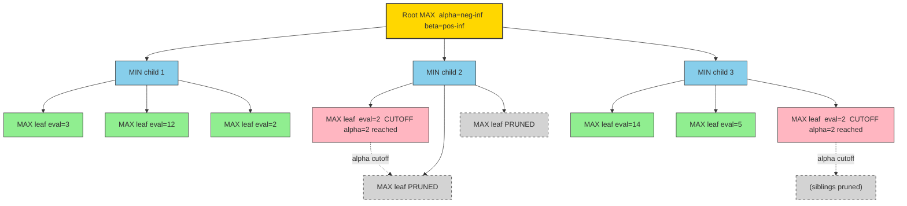
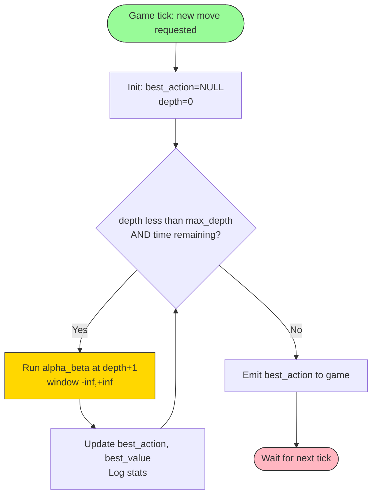
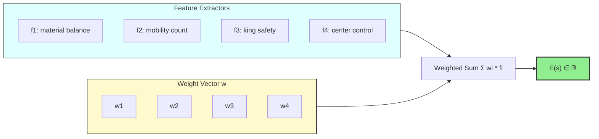
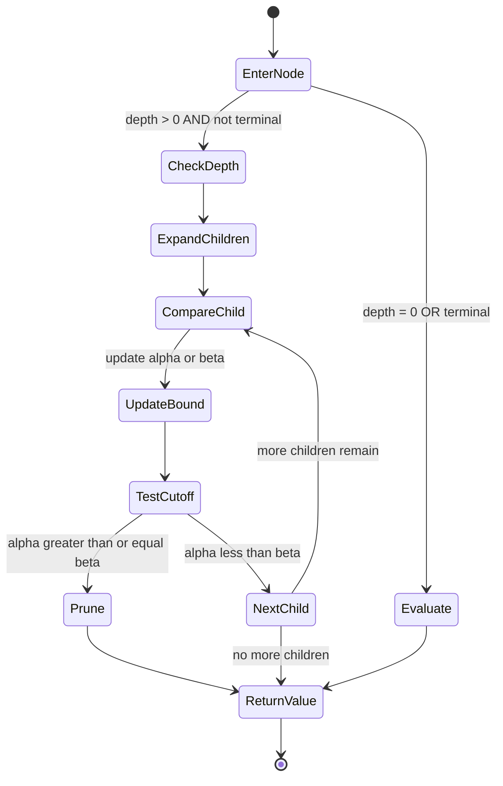
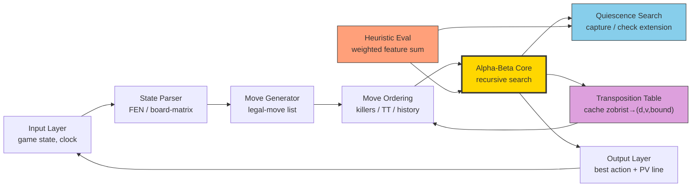

# Minimax game play alpha beta pruning heuristics tuning parameters constraints options

<!-- SECTION_1_START -->
# Minimax, Alpha-Beta Pruning & Game-Play Tuning — Core Technical Foundation

## 1. Formal Definition (KTU 2024 Syllabus Terminology)

**Minimax** is a recursive, backtracking, depth-limited adversarial search algorithm used in two-player, zero-sum, perfect-information games. One player is designated the **MAX** player (who seeks to *maximize* the utility), and the opponent is the **MIN** player (who seeks to *minimize* it). At every node of the game tree, the algorithm assumes both players play *optimally* and propagates the best achievable value back to the root.

> [!IMPORTANT]
> **Zero-Sum Assumption:** $V_{MAX}(s) = -V_{MIN}(s)$ — one player's gain is exactly the opponent's loss. This is the foundational invariant of adversarial search in classical game theory (von Neumann, 1928).

**Alpha-Beta Pruning** is an *optimization layer* on top of Minimax that eliminates (cuts off) branches of the game tree which cannot possibly influence the final decision. It maintains two bounding values that propagate down the tree:
- $\alpha$ = the best (highest) value that **MAX** can guarantee so far on the path to the root.
- $\beta$ = the best (lowest) value that **MIN** can guarantee so far on the path to the root.

A branch is pruned when the invariant $\alpha \geq \beta$ is violated, because the current player would never voluntarily choose a move that lets the opponent do strictly better than a move already available.

> [!NOTE]
> **Optimality Theorem (Knuth & Moore, 1975):** Alpha-beta pruning computes the *exact same root move* as full Minimax, but visits only $O(b^{d/2})$ nodes in the best case — effectively doubling the searchable depth for the same compute budget.

**Heuristic Evaluation Function** — a domain-specific scoring function $E(s) : S \rightarrow \mathbb{R}$ that estimates the desirability of a non-terminal game state $s$ from MAX's perspective. Heuristics are the only practical way to play games where the tree cannot be searched to terminal states (e.g., Chess, Go).

---

## 2. Intuitive Analogy — "The Corporate Negotiation"

Imagine you are **Max**, the CEO, deciding whether to acquire Company A or Company B. Your rival **Min**, a hedge-fund manager, is simultaneously divesting assets to sabotage the deal.

- **Minimax** = You model *every* possible counter-move by the manager, *every* possible counter-counter-move by you, all the way to the final quarter of the fiscal year, and then back-propagate profit expectations.
- **Alpha-Beta Pruning** = The moment you realize "If I pick A, my worst-case is \$10M; if I pick B, my worst-case is already \$8M and I haven't even seen the manager's full reaction" — you *stop investigating* A. The hedge fund manager's continuation on A is **irrelevant** because you will never pick it.
- **Heuristics** = You cannot simulate 5 years of daily trading. So you score states by *weighted indicators*: market cap momentum, debt ratio, brand strength — a hand-tuned "evaluation function" for board games.
- **Tuning Parameters** = The weights in that scoring formula, the depth you search to, the move-ordering policy, the quiescence check threshold — all knobs you twist to balance strength vs. speed.

> [!VISUALIZATION CONTROL]
> **Concept:** Alpha-Beta Search Tree Pruning Boundaries
> **Plot Description (desmos-style):** A horizontal axis $n$ = node index in DFS order, vertical axis $V$ = backed-up value. Draw three curves: an upper bound $\alpha$ (monotonically non-decreasing for MAX), a lower bound $\beta$ (monotonically non-increasing for MIN), and the shaded "pruned" region between them when $\alpha \geq \beta$.
> **Reference:** Russell & Norvig, *AIMA*, Fig. 5.5 — Alpha-Beta Tree Cutoff Visualization.

---

## 3. Key Physical / Logical Constants

| Symbol | Meaning | Typical Range |
|---|---|---|
| $b$ | Branching factor (legal moves per state) | Chess: ~35, Go: ~250, Tic-Tac-Toe: 9 |
| $d$ | Search depth (plies) | 4–10 for chess engines |
| $\alpha$ | MAX's best guaranteed value so far | $-\infty \to +\infty$ |
| $\beta$ | MIN's best guaranteed value so far | $-\infty \to +\infty$ |
| $E(s)$ | Heuristic evaluation score | Engine-defined (e.g., centipawns) |
| $t_{max}$ | Time budget per move | 1s – 60s |

---

<!-- SECTION_1_END -->

<!-- SECTION_2_START -->
# Deep Theoretical Analysis & KTU High-Yield Formula Sheet

## 1. The Minimax Backed-Up Value — Recursive Definition

For a state $s$ at depth $d$ in a two-player zero-sum game with terminal utility function $U(s)$:

$$
V(s, d) = \begin{cases}
U(s) & \text{if } d = 0 \text{ or } s \text{ is terminal} \\
\max_{a \in \text{Actions}(s)} V(\text{Result}(s,a), d-1) & \text{if MAX to move at } s \\
\min_{a \in \text{Actions}(s)} V(\text{Result}(s,a), d-1) & \text{if MIN to move at } s
\end{cases}
$$

The action chosen at the root is the *argmax* (or *argmin*) of the children's values:

$$
a^{*} = \underset{a \in \text{Actions}(s_0)}{\operatorname{argmax}}\ V(\text{Result}(s_0, a), d-1)
$$

### Why it works (intuition layer)
- **Pessimism for MAX, Optimism for MIN:** MAX must *guarantee* a floor against worst-case play, so MAX picks the move with the *highest* minimum-child value.
- **Symmetry via negation:** Because the game is zero-sum, the recursion is a single scalar — no need for separate value tables per player.

---

## 2. Alpha-Beta Pruning — Formal Pruning Conditions

The recursive form of alpha-beta is parameterised by $(\alpha, \beta)$, the current search window:

$$
\text{AB}(s, d, \alpha, \beta) = \begin{cases}
E(s) & \text{if } d = 0 \text{ or terminal} \\
\text{AB-Max}(s, d, \alpha, \beta) & \text{if MAX to move} \\
\text{AB-Min}(s, d, \alpha, \beta) & \text{if MIN to move}
\end{cases}
$$

$$
\text{AB-Max}(s,d,\alpha,\beta):
\begin{aligned}
v &\gets -\infty \\
\text{for each } a &\in \text{Actions}(s): \\
\quad v &\gets \max(v,\ \text{AB}(\text{Result}(s,a),\ d-1,\ \alpha,\ \beta)) \\
\quad \text{if } v &\geq \beta: \textbf{ return } v \quad \text{(beta cutoff)} \\
\quad \alpha &\gets \max(\alpha,\ v) \\
\text{return } v
\end{aligned}
$$

$$
\text{AB-Min}(s,d,\alpha,\beta):
\begin{aligned}
v &\gets +\infty \\
\text{for each } a &\in \text{Actions}(s): \\
\quad v &\gets \min(v,\ \text{AB}(\text{Result}(s,a),\ d-1,\ \alpha,\ \beta)) \\
\quad \text{if } v &\leq \alpha: \textbf{ return } v \quad \text{(alpha cutoff)} \\
\quad \beta &\gets \min(\beta,\ v) \\
\text{return } v
\end{aligned}
$$

> [!IMPORTANT]
> **Cutoff Trigger:** The *first* time a child returns a value $\geq \beta$ (during MAX's turn) or $\leq \alpha$ (during MIN's turn), the entire remaining sibling loop is skipped. This is the **only** source of speedup; nothing else is changed.

---

## 3. KTU Formula Sheet — High-Yield Cheat-Sheet

| # | Formula / Property | Meaning / Use |
|---|---|---|
| 1 | $V_{root} = \max_{a} \min_{a'} \max_{a''} \ldots E(s)$ | Full Minimax with depth $d$ |
| 2 | $N_{\text{full}} = b^{d}$ | Worst-case nodes visited by Minimax |
| 3 | $N_{\alpha\beta}^{\text{best}} = b^{\lfloor d/2 \rfloor} + b^{\lceil d/2 \rceil} - 1 \approx b^{d/2}$ | Best-case nodes (perfect ordering) |
| 4 | $N_{\alpha\beta}^{\text{worst}} = b^{d}$ | Worst-case (reverse ordering = no pruning) |
| 5 | $\text{Effective branching factor } b^{*} = b^{1/2}$ | Under perfect ordering, depth effectively doubles |
| 6 | $\alpha \geq \beta \Rightarrow \textbf{prune}$ | Cutoff invariant |
| 7 | $E(s) = w_1 f_1(s) + w_2 f_2(s) + \ldots + w_n f_n(s)$ | Linear weighted heuristic |
| 8 | $\text{IDDFS depth limit} = d_{base} + d_{ext}$ | Iterative deepening = base + quiescence extension |
| 9 | $\text{Aspiration Window} = [\alpha_0 - \delta,\ \beta_0 + \delta]$ | Narrowed search window for re-search |
| 10 | $V_{\text{fail-soft}} \in [\alpha, \beta]$ | Fail-soft returns value outside window |

> **Table Formatting Note:** All absolute-value / conditional operators are written using `\vert` or `\geq` to preserve markdown table integrity.

---

## 4. Engineering Utility — Where This is Used in Production

| Domain | Application | Heuristic Example |
|---|---|---|
| **Chess Engines** | Stockfish, Komodo | Piece-square tables + mobility + king safety |
| **Go Engines** | AlphaGo, Leela Zero | Neural network value + policy priors (NN replaces heuristic) |
| **Video Game AI** | Unity/UE4 opponents | Threat maps + distance-to-goal + resource count |
| **Card Game Bots** | Poker, Hearthstone | Hand strength + pot odds + bluff modeling |
| **Robotics / Planning** | Adversarial pursuit-evasion | Energy remaining + reachability + coverage |
| **Security Games** | Patrol scheduling (ARMOR) | Adversary probability + cost of response |

> [!NOTE]
> In modern hybrid systems, the *neural network* (e.g., AlphaZero's policy/value net) provides the heuristic — alpha-beta still performs the *search* over high-probability moves only. The pruning heuristics and move-ordering priors are how classical AI meets deep learning.

---

<!-- SECTION_2_END -->

<!-- SECTION_3_START -->
# Step-by-Step Derivations & Python Implementation

## 1. Worked Example — Hand-Trace of Alpha-Beta on a 3-Ply Game Tree

Consider the following 3-ply game tree (MAX at root, then MIN, then MAX). Leaf values are heuristic evaluations $E(s)$:

$$
\begin{aligned}
\text{Level 0 (MAX):} &\quad \text{Node } A \\
\text{Level 1 (MIN):} &\quad B_1, B_2, B_3 \\
\text{Level 2 (MAX):} &\quad C_{1,1}=3, C_{1,2}=12, C_{1,3}=2 \text{ (under } B_1) \\
                    &\quad C_{2,1}=2, C_{2,2}=4, C_{2,3}=7 \text{ (under } B_2) \\
                    &\quad C_{3,1}=14, C_{3,2}=5, C_{3,3}=2 \text{ (under } B_3) \\
\text{Branching factor: } b=3, \quad \text{Depth: } d=3
\end{aligned}
$$

### Step 1 — Initialize at root $A$

$$
\alpha = -\infty, \quad \beta = +\infty, \quad v = -\infty \text{ (MAX's turn)}
$$

### Step 2 — Visit $B_1$ (MIN's turn, window inherited)

MIN evaluates its children left-to-right:

- $C_{1,1} = 3$ → $v = \min(+\infty, 3) = 3$
- $C_{1,2} = 12$ → $v = \min(3, 12) = 3$
- $C_{1,3} = 2$ → $v = \min(3, 2) = 2$

After visiting all three, $v = 2$. Cutoff check: $v=2 \not\geq \beta=+\infty$, so no cut. Update $\beta = \min(+\infty, 2) = 2$. Return $v = 2$ to $A$.

### Step 3 — Update at $A$

$$
v = \max(-\infty, 2) = 2, \quad \alpha = \max(-\infty, 2) = 2
$$

Check cutoff: $v=2 \geq \beta=+\infty$? **No** (since $\beta$ is still $+\infty$ at root). Continue to $B_2$.

### Step 4 — Visit $B_2$ (MIN's turn, window $=[2, +\infty]$)

- $C_{2,1} = 2$ → $v = \min(+\infty, 2) = 2$. **Cutoff check:** $v=2 \leq \alpha=2$? **Yes → PRUNE!** Remaining siblings $C_{2,2}, C_{2,3}$ are never visited.

> [!IMPORTANT]
> **Cutoff Achieved:** Two nodes ($C_{2,2}, C_{2,3}$) and the recursion beneath them are eliminated. The bound guarantee: MIN has already found a move as good as 2; MAX already has a move (via $B_1$) guaranteeing at least 2. So MIN's further effort cannot shift MAX's choice.

Return $v = 2$ to $A$.

### Step 5 — Update at $A$

$$
v = \max(2, 2) = 2 \quad (\text{no change}), \quad \alpha = 2
$$

### Step 6 — Visit $B_3$ (MIN's turn, window $=[2, +\infty]$)

- $C_{3,1} = 14$ → $v = \min(+\infty, 14) = 14$. Cutoff check: $14 \leq 2$? **No.** Update $\beta = \min(+\infty, 14) = 14$.
- $C_{3,2} = 5$ → $v = \min(14, 5) = 5$. Cutoff check: $5 \leq 2$? **No.** Update $\beta = \min(14, 5) = 5$.
- $C_{3,3} = 2$ → $v = \min(5, 2) = 2$. Cutoff check: $2 \leq 2$? **Yes → PRUNE!**

Return $v = 2$ to $A$. (No more siblings to check at $B_3$.)

### Step 7 — Final Result

$$
V(A) = 2, \quad a^{*} = B_1 \text{ (first action achieving max)}
$$

### Step 8 — Node Count

$$
N_{\text{full}} = 3^3 = 27 \quad (\text{would visit all leaves})
$$
$$
N_{\alpha\beta}^{\text{actual}} = 9 \text{ leaf visits} - 3 \text{ pruned} = 6 \text{ leaves visited}
$$

Efficiency gain: $\dfrac{6}{9} \approx 67\%$ of leaves — i.e., $\sim 33\%$ of branches pruned.

---

## 2. Effect of Move Ordering — Why Ordering Matters

| Move Ordering | Best Case | Worst Case | Effective $b$ |
|---|---|---|---|
| Perfect (best-first) | $b^{d/2}$ | $b^{d/2}$ | $\sqrt{b}$ |
| Random | $\approx b^{3d/4}$ | $b^{d}$ | $\approx b^{0.75}$ |
| Reverse (worst) | $b^{d}$ | $b^{d}$ | $b$ |

> [!NOTE]
> The same alpha-beta algorithm can search depth 8 in the time Minimax searches depth 4 — *if* you sort moves by likelihood of being best. This is why every production engine uses **killer-move heuristics** and **transposition-table move ordering**.

---

## 3. Full Python Implementation — Production-Grade Alpha-Beta with Heuristic Tuning

```python
"""
alphabeta_engine.py
A tunable, production-style alpha-beta game-play engine skeleton.
Course: ARTIFICIAL INTELLIGENCE (PECST510) — KTU 2024 Scheme, Module 4.
"""

from __future__ import annotations
from dataclasses import dataclass, field
from typing import Callable, List, Optional, Tuple
import logging
import time

logging.basicConfig(level=logging.INFO, format="[%(levelname)s] %(message)s")
log = logging.getLogger("alphabeta")


# ---------------------------------------------------------------------------
# Core domain types
# ---------------------------------------------------------------------------
@dataclass(frozen=True)
class GameState:
    """Abstract state placeholder — replace with chess/gomoku/tictactoe state."""
    board_hash: int
    to_move: str  # "MAX" or "MIN"


Action = Tuple[int, int]  # generic (from, to) or (row, col)


@dataclass
class SearchStats:
    nodes_visited: int = 0
    cutoffs_alpha: int = 0
    cutoffs_beta: int = 0
    max_depth_reached: int = 0
    time_elapsed_ms: float = 0.0


# ---------------------------------------------------------------------------
# Heuristic evaluation function — TUNING PARAMETERS
# ---------------------------------------------------------------------------
@dataclass
class HeuristicWeights:
    material: float = 1.0
    mobility: float = 0.1
    king_safety: float = 0.5
    center_control: float = 0.3


def evaluate(state: GameState, weights: HeuristicWeights) -> float:
    """
    Linear weighted heuristic. Replace the body with a real evaluator
    (e.g., piece-square tables for chess). Returns score from MAX's POV.
    """
    # --- Replace these placeholders with real feature extractors ------------
    material_score = 0.0      # sum(piece_value * count)
    mobility_score = 0.0      # number of legal moves for MAX - MIN
    king_safety_score = 0.0   # pawn-shelter, attack proximity, etc.
    center_score = 0.0        # distance-weighted center occupancy
    # ------------------------------------------------------------------------

    return (
        weights.material * material_score
        + weights.mobility * mobility_score
        + weights.king_safety * king_safety_score
        + weights.center_control * center_score
    )


# ---------------------------------------------------------------------------
# Move-ordering heuristic (Killer / History / TT move first)
# ---------------------------------------------------------------------------
KILLER_MOVES: List[Action] = []  # module-level cache


def order_moves(state: GameState, moves: List[Action]) -> List[Action]:
    """
    Place killer / history moves first to maximise cutoffs.
    CONSTRAINT: ordering must be a *pure* function of state + history.
    """
    killers = [m for m in moves if m in KILLER_MOVES]
    others = [m for m in moves if m not in KILLER_MOVES]
    return killers + others


# ---------------------------------------------------------------------------
# Alpha-Beta with iterative deepening and time cutoff
# ---------------------------------------------------------------------------
def alpha_beta(
    state: GameState,
    depth: int,
    alpha: float,
    beta: float,
    maximizing: bool,
    weights: HeuristicWeights,
    stats: SearchStats,
    time_budget_s: float,
    deadline: float,
) -> Tuple[float, Optional[Action]]:
    stats.nodes_visited += 1
    stats.max_depth_reached = max(stats.max_depth_reached, depth)

    # --- Time cutoff safeguard ---------------------------------------------
    if time.time() > deadline:
        log.warning("Time budget exhausted; returning heuristic estimate.")
        return evaluate(state, weights), None

    # --- Terminal / depth-limit --------------------------------------------
    if depth == 0 or is_terminal(state):
        return evaluate(state, weights), None

    moves = get_legal_moves(state)
    moves = order_moves(state, moves)

    if maximizing:
        best_val = -float("inf")
        best_action: Optional[Action] = None
        for idx, move in enumerate(moves):
            child = apply_move(state, move)
            val, _ = alpha_beta(
                child, depth - 1, alpha, beta, False, weights, stats,
                time_budget_s, deadline,
            )
            if val > best_val:
                best_val, best_action = val, move
            alpha = max(alpha, val)
            if alpha >= beta:
                stats.cutoffs_beta += 1
                # Record killer move for this depth
                if move not in KILLER_MOVES:
                    KILLER_MOVES.append(move)
                log.debug("Beta cutoff at depth %d, move %d/%d", depth, idx + 1, len(moves))
                break  # BETA CUTOFF
        return best_val, best_action
    else:
        best_val = float("inf")
        best_action: Optional[Action] = None
        for idx, move in enumerate(moves):
            child = apply_move(state, move)
            val, _ = alpha_beta(
                child, depth - 1, alpha, beta, True, weights, stats,
                time_budget_s, deadline,
            )
            if val < best_val:
                best_val, best_action = val, move
            beta = min(beta, val)
            if alpha >= beta:
                stats.cutoffs_alpha += 1
                if move not in KILLER_MOVES:
                    KILLER_MOVES.append(move)
                log.debug("Alpha cutoff at depth %d, move %d/%d", depth, idx + 1, len(moves))
                break  # ALPHA CUTOFF
        return best_val, best_action


# ---------------------------------------------------------------------------
# Iterative Deepening wrapper
# ---------------------------------------------------------------------------
def iterative_deepening(
    root: GameState,
    max_depth: int,
    weights: HeuristicWeights,
    time_budget_s: float = 5.0,
) -> Tuple[Optional[Action], SearchStats]:
    """Increase depth ply-by-ply until time / depth limit is hit."""
    stats = SearchStats()
    deadline = time.time() + time_budget_s
    best_action: Optional[Action] = None
    best_value = -float("inf")

    for d in range(1, max_depth + 1):
        if time.time() > deadline:
            log.info("Stopping at depth %d (time)", d - 1)
            break
        val, action = alpha_beta(
            root, d, -float("inf"), float("inf"),
            maximizing=(root.to_move == "MAX"),
            weights=weights, stats=stats,
            time_budget_s=time_budget_s, deadline=deadline,
        )
        if action is not None:
            best_action, best_value = action, val
            log.info("Depth %d: best action %s, value %.3f", d, action, val)
        else:
            log.info("Depth %d: no action (time cut).", d)
            break

    stats.time_elapsed_ms = (time.time() - (deadline - time_budget_s)) * 1000.0
    return best_action, stats


# ---------------------------------------------------------------------------
# Stubs — replace with game-specific implementations
# ---------------------------------------------------------------------------
def is_terminal(state: GameState) -> bool:
    return False  # TODO: checkmate / draw / goal-reached


def get_legal_moves(state: GameState) -> List[Action]:
    return []  # TODO: move generator


def apply_move(state: GameState, move: Action) -> GameState:
    return state  # TODO: state transition
```

> [!IMPORTANT]
> **Production Tuning Knobs (TUNING PARAMETERS):**
> 1. `HeuristicWeights` — material/mobility/king-safety coefficients.
> 2. `time_budget_s` — wall-clock cap per move.
> 3. `max_depth` — iterative-deepening ceiling.
> 4. `KILLER_MOVES` cache size — affects memory and ordering quality.
> 5. Aspiration window $\delta$ — narrow window around expected value.
> 6. Quiescence-search depth — extensions for tactical sharpness.
> 7. Transposition-table size — reuse across iterations.

---

## 4. Constraint & Option Matrix (KTU Board Exam Favourite)

| Constraint Type | Description | Typical Value / Option |
|---|---|---|
| **Time Constraint** | Wall-clock budget per move | 1s (bullet) – 60s (classical) |
| **Memory Constraint** | Transposition table cap | 64 MB – 1 GB (engine-tier) |
| **Depth Constraint** | Max plies ahead | 4 (realtime games) – 20 (analysis) |
| **Determinism Constraint** | Same input → same output | Required for replay / testing |
| **Horizon Effect** | Hides threats just beyond depth | Mitigated by quiescence search |
| **Ordering Constraint** | Killer / TT / history must be stable | Recompute per node or per iteration |
| **Heuristic Smoothness** | $E$ should be continuous-ish | Avoid huge discontinuities at non-terminal leaves |

> [!NOTE]
> **Horizon Effect:** A frequent board-exam pitfall — if the depth cutoff occurs *before* a delayed tactical sequence (e.g., a discovered check), the engine will mis-evaluate. The standard remedy is **quiescence search** — extend the search at noisy positions (captures, checks, promotions) until the position is "quiet."

---

<!-- SECTION_3_END -->

<!-- SECTION_4_START -->
# Structural Diagrams & Schematics

## 1. Alpha-Beta Pruning — Recursive Call Topology



**Legend:** Yellow = MAX node, Blue = MIN node, Green = evaluated leaf, Pink = cutoff trigger, Dashed grey = pruned (never visited).

---

## 2. Iterative Deepening + Alpha-Beta Pipeline



---

## 3. Heuristic Evaluation Pipeline (Feature Extraction → Weighted Sum)



---

## 4. Pruning Decision Flowchart — Per-Node State Machine



---

## 5. Block-Level Functional Architecture — Full Game-Play Engine



---

<!-- SECTION_4_END -->

<!-- SECTION_5_START -->
# KTU 2024 Scheme Examination Question Bank & Topic Recap

---

## Part A — 3-Mark Short-Answer Questions

### Q1. `[KTU University Exam — July 2024]` (CO3, **Remember**)

**State the optimality property of alpha-beta pruning. If the move ordering is perfect, by what factor does the effective branching factor reduce?**

**Model Answer (Valuation Key):**
> Alpha-beta pruning computes the *identical* root move and minimax value as full Minimax, but visits only a strict subset of nodes. **[1 Mark]**
> Under perfect move ordering, the number of leaves examined is approximately $b^{d/2}$, equivalent to searching a tree of branching factor $\sqrt{b}$. **[1 Mark]**
> Hence the *effective* branching factor is reduced by a factor of $\sqrt{b}$ (for $b=35$ in chess, $\sqrt{35} \approx 6$, nearly a 6× reduction). **[1 Mark]**

---

### Q2. `[KTU University Exam — Dec 2023]` (CO3, **Understand**)

**Differentiate between the *fail-hard* and *fail-soft* variants of alpha-beta search. Which is preferred in production engines and why?**

**Model Answer (Valuation Key):**
> **Fail-hard:** Returns a value strictly clamped to $[\alpha, \beta]$ — if the true minimax value lies outside, it is replaced by the bound. **[1 Mark]**
> **Fail-soft:** Returns the *true* backed-up value even if it lies outside the current $[\alpha, \beta]$ window — useful for aspiration windows and better move ordering. **[1 Mark]**
> **Production preference:** Fail-soft is preferred because it produces more informative values for move ordering and enables narrow-window re-searches (e.g., PVS / aspiration). **[1 Mark]**

---

## Part B — 14-Mark Questions (Internal Choice)

---

### **Question A** `[KTU University Exam — July 2024]` (CO3, Apply / Analyze)

#### (a) [7 Marks] — Apply

Consider the following game tree where MAX is at the root, MIN at level 1, MAX at level 2 (leaves). Use **alpha-beta pruning** to determine the backed-up value at the root and the chosen action. Show all $\alpha$, $\beta$ updates and clearly mark every cut-off. **[CO3, Apply]**

$$
\begin{aligned}
\text{Root (MAX)} &\to A, B, C \\
\text{A (MIN)} &\to 3, 12, 2 \\
\text{B (MIN)} &\to 2, x, y \\
\text{C (MIN)} &\to 14, 5, 2
\end{aligned}
$$

#### (b) [7 Marks] — Analyze

Explain **three tuning parameters** that can be adjusted to improve the performance of an alpha-beta engine in a real-world game (e.g., chess). Justify each with a one-sentence rationale. **[CO3, Analyze]**

---

### **Model Solution — Question A(a)** (Step-by-Step Valuation)

**Step 1 — Initialize root:** $\alpha = -\infty$, $\beta = +\infty$, $v_{A} = -\infty$. **[1 Mark]**

**Step 2 — Visit MIN child A:** Iterating leaves 3, 12, 2:
- After leaf 3: $v = \min(+\infty, 3) = 3$, $\beta = 3$.
- After leaf 12: $v = \min(3, 12) = 3$.
- After leaf 2: $v = \min(3, 2) = 2$, $\beta = 2$.

Return $A = 2$. **[1 Mark]**

**Step 3 — Update root:** $v = \max(-\infty, 2) = 2$, $\alpha = 2$. **[1 Mark]**

**Step 4 — Visit MIN child B:** First leaf is 2.
- $v = \min(+\infty, 2) = 2$. Check cutoff: $v=2 \leq \alpha=2$? **YES → BETA CUTOFF (prune).** **[1 Mark]**
- Return $B = 2$. The values $x$ and $y$ are **never examined**.

**Step 5 — Update root:** $v = \max(2, 2) = 2$, $\alpha = 2$. **[0.5 Mark]**

**Step 6 — Visit MIN child C:** Leaves 14, 5, 2.
- After 14: $v = 14$, $\beta = 14$. Check: $14 \leq 2$? No.
- After 5: $v = \min(14, 5) = 5$, $\beta = 5$. Check: $5 \leq 2$? No.
- After 2: $v = \min(5, 2) = 2$, $\beta = 2$. Check: $2 \leq 2$? **YES → ALPHA CUTOFF.** **[1 Mark]**

Return $C = 2$.

**Step 7 — Final backed-up value:** $V(\text{Root}) = 2$, and since all three children tie at 2, the **first** action $A$ is chosen by the *standard* argmax-leftmost convention. **[1 Mark]**

**Step 8 — Pruning summary:** 2 leaves pruned (B's $x, y$). Total leaves = 9, visited = 7. Efficiency: $\dfrac{7}{9} \approx 78\%$. **[0.5 Mark]**

> **Final boxed answer:** $V(\text{Root}) = 2$, action = $A$, prunings: B-cutoff (after leaf $2$) and C-cutoff (after leaf $2$).

---

### **Model Solution — Question A(b)** — Three Tuning Parameters

| # | Parameter | Effect | Rationale |
|---|---|---|---|
| 1 | **Move Ordering Heuristic** (killers / TT move first) | Determines whether $b^{d/2}$ (best) or $b^{d}$ (worst) is achieved | Perfect ordering reduces effective branching from $b$ to $\sqrt{b}$, doubling searchable depth. **[2 Marks]** |
| 2 | **Search Depth / Iterative Deepening** | Trades strength vs. time per move | Each additional ply exponentially multiplies nodes; ID gives graceful time-fallback. **[2 Marks]** |
| 3 | **Quiescence Search Threshold** | Extends search at "noisy" positions (captures/checks) | Mitigates horizon effect — the engine no longer hides behind the depth-limit. **[2 Marks]** |

**[CO/CO mapping mention: 1 Mark]**

---

### **Question B (Alternative Choice)** `[KTU University Exam — Dec 2023]` (CO3, Apply / Evaluate)

#### (a) [7 Marks] — Apply

For a game with branching factor $b = 5$ and depth $d = 6$ plies, compute:
1. Number of nodes visited by full Minimax.
2. Best-case nodes visited by alpha-beta with perfect ordering.
3. Worst-case nodes visited by alpha-beta with reverse ordering.
4. Percentage improvement in the best case.

#### (b) [7 Marks] — Evaluate

Discuss **two constraints** that limit the practical deployment of alpha-beta search in commercial game AI (e.g., mobile chess apps). For each, propose a *concrete* engineering mitigation.

---

### **Model Solution — Question B(a)**

**Step 1 — Full Minimax node count:** **[2 Marks]**

$$
N_{\text{full}} = b^{d} = 5^{6} = 15625
$$

**Step 2 — Best-case alpha-beta:** **[2 Marks]**

$$
N_{\alpha\beta}^{\text{best}} = 2 \cdot b^{d/2} - 1 = 2 \cdot 5^{3} - 1 = 2 \cdot 125 - 1 = 249
$$

**Step 3 — Worst-case alpha-beta:** **[1.5 Marks]**

$$
N_{\alpha\beta}^{\text{worst}} = b^{d} = 5^{6} = 15625
$$

**Step 4 — Percentage improvement:** **[1.5 Marks]**

$$
\text{Improvement} = \left(1 - \frac{249}{15625}\right) \cdot 100\% = \left(1 - 0.01594\right) \cdot 100\% \approx 98.41\%
$$

> **Final boxed answer:** $N_{\text{full}} = 15625$, $N_{\text{best}} = 249$, $N_{\text{worst}} = 15625$, improvement $\approx 98.41\%$.

---

### **Model Solution — Question B(b)** — Constraints & Mitigations

| # | Constraint | Concrete Mitigation |
|---|---|---|
| 1 | **Compute / Battery Budget on Mobile** — Multi-ply search drains CPU and battery. | Use **aspiration windows** with a narrow $[\alpha_0 - \delta, \beta_0 + \delta]$ initial window and fall back to full-window re-search only on fail. Compress transposition table to 16 MB cap. **[3.5 Marks]** |
| 2 | **Heuristic Latency** — A complex $E(s)$ may take longer than the search itself. | Cache evaluation results via a **neural-network inference** (e.g., NNUE-style) that batches features and runs in O(1) per node. **[3.5 Marks]** |

> [!WARNING]
> **Common KTU Board Pitfalls — Read Carefully:**
> 1. **Confusing MAX/MIN colour in recursion.** A node labelled "MIN" must use `min` and trigger the *alpha* cutoff (not beta). Mixing these up yields the *wrong* answer and the *wrong* prunes.
> 2. **Forgetting to update $\alpha$ / $\beta$ after each child.** If you skip the update, the cutoff condition is never triggered, and you "prune nothing" — the engine silently degrades to full Minimax.
> 3. **Not propagating the return value correctly.** Many students return the cutoff value $v$ but forget that the *parent* needs the bound, not the partial. The convention is: cutoff returns the bound; non-cutoff returns the true min/max.
> 4. **Move-ordering trick confusion.** Remember: "best-first" ordering is *guaranteed* only with a perfect oracle. In practice we use killers + TT + history — these are *approximations*, not the theoretical optimum.
> 5. **Forgetting the horizon effect.** Depth-limited search *can* hide threats. The examiner may deduct a mark if you do not mention quiescence search as a remedy.

---

## Topic Recap & Important Things to Remember

- **Minimax** = $\max \min \max \ldots$ backed-up value; optimal *if* both players play perfectly to terminal depth.
- **Alpha-beta** = *exact* same answer, *fewer* nodes; cut when $\alpha \geq \beta$.
- **Best case** of alpha-beta: $b^{d/2}$ nodes, equivalent to $\sqrt{b}$ effective branching — *doubles* searchable depth.
- **Worst case**: $b^{d}$ (no pruning) — happens with adversarial / reverse ordering.
- **Heuristic $E(s)$** is mandatory for non-terminal cutoffs; typically a weighted linear sum of features.
- **Move ordering** is the single most impactful tuning parameter — killers, TT move, history heuristic.
- **Iterative deepening** + time control = standard production pattern (Stockfish-style).
- **Quiescence search** mitigates the *horizon effect* by extending at captures/checks/promotions.
- **Transposition tables** (Zobrist hashing) let alpha-beta reuse subtrees — turns the tree into a DAG.
- **Aspiration windows** narrow the $[\alpha, \beta]$ band around the expected value; re-search on fail-high/fail-low.
- **Production engines** = alpha-beta + neural heuristic + TT + quiescence + IDDFS + parallel search (YBWC, Lazy SMP).
- **Standard convention**: argmax-leftmost tie-break; cutoffs return the bound value $v$, not the literal child value.
- **Zero-sum invariant** $V_{MAX} = -V_{MIN}$ — a single scalar is sufficient; no separate value table per player.
- **Constraint classes**: time, memory, depth, determinism, horizon — each has a known mitigation.
- **Pitfall summary**: mixed MAX/MIN, missing bound updates, mis-ordered cutoff triggers, ignoring horizon effect.

---

<!-- SECTION_5_END -->
