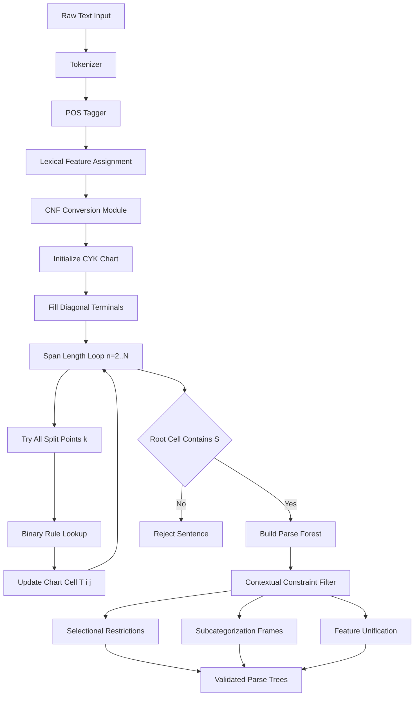
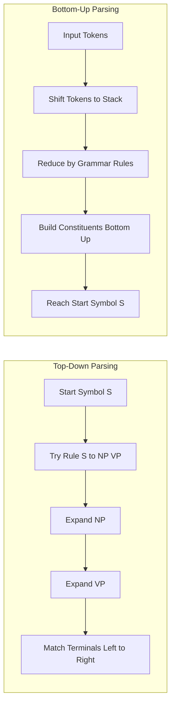
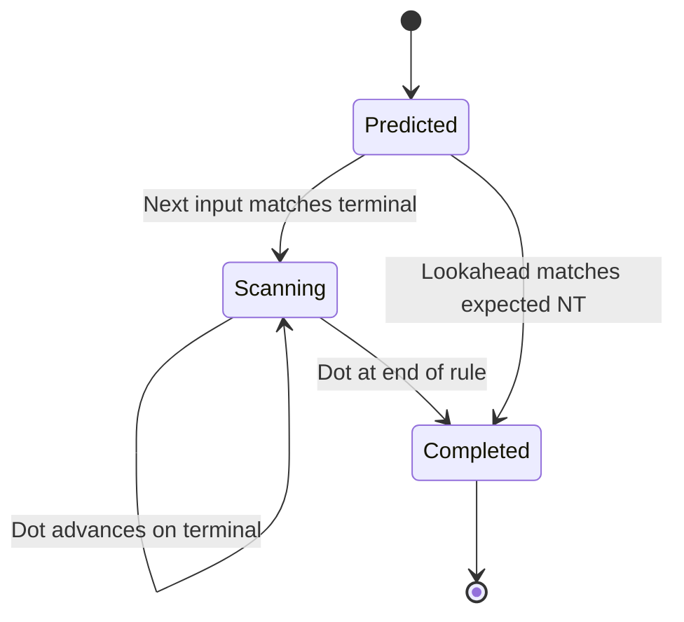
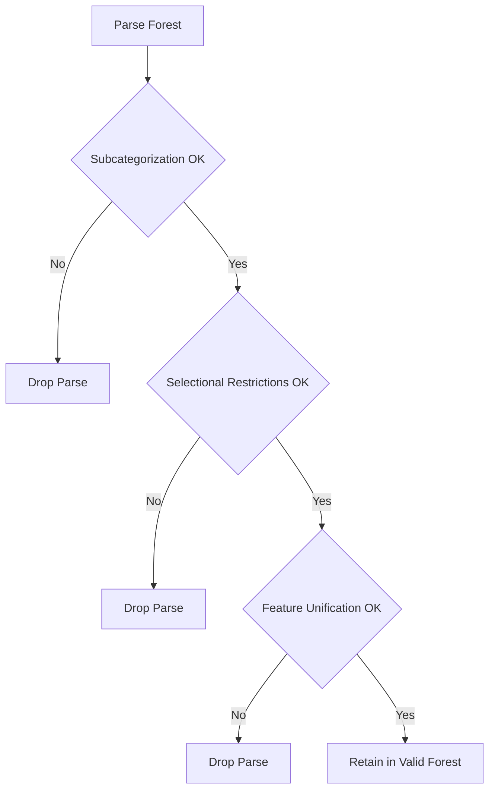
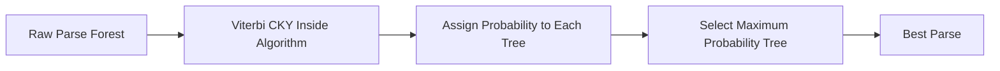

# Syntactic language context checking parsers algorithms workflows benchmarks

<!-- SECTION_1_START -->
# Syntactic Language Context Checking: Parsers, Algorithms, Workflows & Benchmarks

## 1.1 Formal Definition (KTU 2024 Syllabus Aligned)

**Syntactic Language Context Checking** is the computational process of analyzing the structural well-formedness of a natural language sentence by applying a formal grammar to verify that tokens (words) can be combined into valid constituents under a given set of syntactic rules, while honoring the *contextual constraints* imposed by lexical selection, subcategorization, and agreement features.

In KTU 2024 Scheme terminology for **PECST510 (Artificial Intelligence)**, this subsumes:

- **Context-Free Grammar (CFG)** — formal generative system $G = (V, \Sigma, R, S)$ where $V$ is the set of non-terminals, $\Sigma$ the terminals (lexicon), $R$ the production rules, and $S \in V$ the start symbol.
- **Parse Tree (Derivation Tree)** — an ordered rooted tree whose leaves read left-to-right form the input sentence and whose internal nodes are non-terminals expanded by grammar rules.
- **Parsing Algorithm** — a procedure that, given a grammar $G$ and string $w \in \Sigma^*$, returns either a valid parse forest or failure.
- **Contextual Lexical Constraints** — selectional restrictions, subcategorization frames, and feature unification rules that filter semantically anomalous parses.

> [!IMPORTANT]
> **Syllabus Highlight (Module 4):** Syntactic context checking is a *prerequisite* to semantic role labeling, machine translation, and question-answering pipelines. Without a structurally valid parse, downstream logical-form extraction fails.

## 1.2 Conceptual Analogy — The "Lego Blueprint Inspector"

Imagine every English sentence is a **Lego tower**, and the grammar is the **blueprint book**.

- **Terminals** (`the`, `cat`, `saw`) are individual Lego bricks.
- **Non-terminals** (NP, VP, S) are named **pre-built sub-assemblies** (e.g., "noun-phrase block", "verb-phrase block").
- **Production rules** (NP → Det N) are the **assembly instructions** telling you which sub-blocks can snap together.
- **The parser** is the **quality-control inspector** who walks around the proposed tower (input sentence), checking bottom-up whether the brick arrangement obeys the blueprint.
- **Context checking** is the inspector also carrying a *lexicon of compatibility*: a brick labelled "BANANA" cannot be plugged into a slot marked "MALE-GENDER PRONOUN" — this is **selectional restriction enforcement**.

If the inspector can build the full tower from a single "S" block down to the leaf bricks, the sentence is **syntactically valid**. If at any point no rule applies, the sentence is **rejected** and the inspector flags the mismatch.

## 1.3 Physical & Mathematical Constants

| Symbol | Meaning | Typical Value / Domain |
|---|---|---|
| $\|V\|$ | Number of non-terminals | $50$–$100$ (Penn Treebank tagset) |
| $\|R\|$ | Number of production rules | $10^3$–$10^4$ for treebank grammars |
| $n$ | Sentence length (tokens) | $5 \leq n \leq 50$ (typical NL) |
| $b$ | Branching factor | $\leq 3$ in CNF |
| $k$ | Lookahead for LL/LR | $k = 1$ most common |

> [!NOTE]
> **Chomsky Normal Form (CNF)** is the canonical preprocessing target because it guarantees that every production has **exactly two non-terminals on the right-hand side** (or a single terminal), enabling $O(n^3)$ chart parsing via CYK.

## 1.4 Visualization Control

> [!VISUALIZATION CONTROL]
> **Concept:** Toy parse tree for the sentence *"the cat sleeps"*
> **Input Equations (Desmos tree-mode):**
> * Point $S = (0, 3)$
> * Children $NP = (-1, 2)$, $VP = (1, 2)$
> * Children of $NP$: $Det = (-1.5, 1)$, $N = (-0.5, 1)$
> * Child of $VP$: $V = (1, 1)$
> * Leaf terminals: $the = (-1.5, 0)$, $cat = (-0.5, 0)$, $sleeps = (1, 0)$
> **Visual Description:** A symmetric binary-ish tree rooted at $S$ spreading downward into labeled leaves. The student should observe how internal nodes (non-terminals) abstract away lexical detail while leaves carry the actual word tokens.
<!-- SECTION_1_END -->

<!-- SECTION_2_START -->
# Deep Theoretical Analysis & KTU High-Yield Formula Sheet

## 2.1 The Syntactic Pipeline (Layered Architecture)

A production-grade syntactic context checker is built as a **five-stage pipeline**:

1. **Tokenization & POS Tagging** — convert raw text into `(word, tag)` pairs.
2. **Lexical Feature Assignment** — attach number, gender, tense, person features.
3. **Chart Construction** — fill the parsing chart using a chosen algorithm.
4. **Forest Extraction** — retrieve all valid parse trees (the *parse forest*).
5. **Context Constraint Filtering** — apply selectional restrictions, subcategorization, and semantic role filters to prune the forest.

## 2.2 Context-Free Grammar — Definitional Recap

A CFG is the tuple

$$
G = (V,\ \Sigma,\ R,\ S)
$$

where:

- $V$ is a finite set of **non-terminals** (syntactic categories).
- $\Sigma$ is a finite set of **terminals** (lexicon), with $V \cap \Sigma = \varnothing$.
- $R \subseteq V \times (V \cup \Sigma)^{*}$ is a finite set of **production rules** $A \rightarrow \beta$.
- $S \in V$ is the designated **start symbol**.

A string $w \in \Sigma^{*}$ is **generated** by $G$ iff there exists a derivation

$$
S \Rightarrow \gamma_1 \Rightarrow \gamma_2 \Rightarrow \dots \Rightarrow w
$$

> [!NOTE]
> **Context-free** means the choice of which rule to apply at non-terminal $A$ is *independent* of the surrounding string context. Context-sensitivity (e.g., subject-verb agreement) must be added back via **feature unification** or **probabilistic context-free grammars (PCFGs)**.

## 2.3 Chomsky Hierarchy Relevant to Parsing

| Grammar Class | Recognizer | Time Complexity | Used For |
|---|---|---|---|
| Regular | Finite Automaton | $O(n)$ | Morphology, tokenization |
| **Context-Free** | **Pushdown Automaton** | $O(n^3)$ | **Syntactic structure** |
| Context-Sensitive | LBA | $O(n^k)$ | Cross-serial dependencies |
| Unrestricted | Turing Machine | Undecidable | Natural language (theoretical) |

## 2.4 KTU Formula / Cheat Sheet

| # | Concept | Formula / Statement | Complexity |
|---|---|---|---|
| 1 | CYK recognition | $T[i,j] = \bigcup_{k=i}^{j-1} \{A \mid A \rightarrow B\,C \in R,\ B \in T[i,k],\ C \in T[k+1,j]\}$ | $O(n^3 \cdot \vert R\vert)$ |
| 2 | CYK table size | $n(n+1)/2$ cells | $O(n^2)$ space |
| 3 | Earley parsing | Predict $\cup$ Scan $\cup$ Complete per token | $O(n^3)$ worst, $O(n^2)$ avg for unambiguous |
| 4 | LR(k) item kernel | $[A \rightarrow \alpha \cdot \beta,\ k]$ dot position | $O(n)$ shift/reduce |
| 5 | PCFG rule probability | $P(A \rightarrow \beta) = \dfrac{\text{Count}(A \rightarrow \beta)}{\text{Count}(A)}$ | $0 \leq P \leq 1$ |
| 6 | Parse tree probability | $P(T) = \prod_{i} P(r_i)$ | normalized by inner sum |
| 7 | Viterbi inside probability | $\alpha(i,j,A) = \sum_{B,C,k} P(A \rightarrow B\,C) \cdot \alpha(i,k,B) \cdot \alpha(k+1,j,C)$ | $O(n^3 \cdot \vert R\vert)$ |
| 8 | F1 (PARSEVAL) | $F_1 = \dfrac{2 \cdot \text{precision} \cdot \text{recall}}{\text{precision} + \text{recall}}$ | bracketing agreement |
| 9 | Labeled Attachment Score | $\text{LAS} = \dfrac{\#\text{correct labeled deps}}{\#\text{total deps}}$ | dependency metric |
| 10 | Tree edit distance (TED) | Minimum insert/delete/replace to convert $T_1$ to $T_2$ | $O(n^3)$ |

> [!NOTE]
> **Critical:** When writing CYK table entries in your KTU answer scripts, always show the **split index $k$** alongside the non-terminal, because the examiner awards partial credit for demonstrating that you understood the binary decomposition.

## 2.5 Real-World Engineering Utility

- **Search Engines** — query understanding via dependency parse to extract "who did what to whom".
- **Machine Translation** — syntactic structure alignment between source and target languages (e.g., Google Translate's intermediate parse).
- **Voice Assistants (Siri, Alexa)** — intent classification requires valid parse before slot filling.
- **Legal / Medical NLP** — contract clause analysis and clinical note structuring demand strict syntactic validity.
- **Code Generation Tools** — AST construction is literally *syntactic context checking* applied to programming languages.
<!-- SECTION_2_END -->

<!-- SECTION_3_START -->
# Step-by-Step Derivations & Algorithmic Implementation

## 3.1 CNF Conversion — Worked Derivation

### 3.1.1 Starting Grammar (mixed form)

$$
\begin{aligned}
S &\rightarrow NP\ VP \\
NP &\rightarrow Det\ N\ \vert\ Det\ N\ PP \\
VP &\rightarrow V\ NP\ \vert\ VP\ PP \\
PP &\rightarrow P\ NP \\
Det &\rightarrow the\ \vert\ a \\
N &\rightarrow monkey\ \vert\ banana \\
V &\rightarrow ate \\
P &\rightarrow with
\end{aligned}
$$

### 3.1.2 Step 1 — Eliminate start-symbol RHS appearance

$S$ does not appear on any RHS, so no fresh $S_0$ is required.

### 3.1.3 Step 2 — Eliminate $\varepsilon$-productions

No $\varepsilon$-rules exist.

### 3.1.4 Step 3 — Eliminate unit productions

No unit productions exist.

### 3.1.5 Step 4 — Replace terminals in mixed RHS

The rule $NP \rightarrow Det\ N\ PP$ has a mix of terminals and non-terminals, but here all are non-terminals already. The only issue is length-3 RHS that is **not** in CNF.

### 3.1.6 Step 5 — Break long RHS into binary rules

Introduce a fresh non-terminal $X$:

$$
NP \rightarrow Det\ X \qquad X \rightarrow N\ PP
$$

Final CNF grammar:

$$
\begin{aligned}
S &\rightarrow NP\ VP \\
NP &\rightarrow Det\ N \\
NP &\rightarrow Det\ X \\
X &\rightarrow N\ PP \\
VP &\rightarrow V\ NP \\
VP &\rightarrow VP\ PP \\
PP &\rightarrow P\ NP \\
Det &\rightarrow the \\
Det &\rightarrow a \\
N &\rightarrow monkey \\
N &\rightarrow banana \\
V &\rightarrow ate \\
P &\rightarrow with
\end{aligned}
$$

> [!IMPORTANT]
> **CNF Validation Check:** Every rule is either $A \rightarrow B\,C$ (two non-terminals) or $A \rightarrow a$ (single terminal). $\checkmark$

## 3.2 CYK Algorithm — Full Worked Example

### 3.2.1 Input Sentence

$$
w = \text{``the monkey ate the banana''}
$$

Token positions: $w_1 = the,\ w_2 = monkey,\ w_3 = ate,\ w_4 = the,\ w_5 = banana$

### 3.2.2 Fill the Diagonal (Length 1)

| Cell | Word | Rules Fired | Entry |
|---|---|---|---|
| $T[1,1]$ | `the` | $Det \rightarrow the$ | $\{Det\}$ |
| $T[2,2]$ | `monkey` | $N \rightarrow monkey$ | $\{N\}$ |
| $T[3,3]$ | `ate` | $V \rightarrow ate$ | $\{V\}$ |
| $T[4,4]$ | `the` | $Det \rightarrow the$ | $\{Det\}$ |
| $T[5,5]$ | `banana` | $N \rightarrow banana$ | $\{N\}$ |

### 3.2.3 Fill Length 2

$T[1,2]$: $w_1 w_2 = \text{``the monkey''}$. Split at $k=1$: $T[1,1]=\{Det\},\ T[2,2]=\{N\}$. Rule $NP \rightarrow Det\ N$ fires. $\Rightarrow T[1,2]=\{NP\}$.

$T[2,3]$: $T[2,2]=\{N\},\ T[3,3]=\{V\}$. No rule $A \rightarrow N\,V$. $\Rightarrow T[2,3]=\varnothing$.

$T[3,4]$: $T[3,3]=\{V\},\ T[4,4]=\{Det\}$. No rule $A \rightarrow V\,Det$. $\Rightarrow T[3,4]=\varnothing$.

$T[4,5]$: $T[4,4]=\{Det\},\ T[5,5]=\{N\}$. Rule $NP \rightarrow Det\ N$ fires. $\Rightarrow T[4,5]=\{NP\}$.

### 3.2.4 Fill Length 3

$T[1,3]$: splits at $k=1$: $T[1,1]=\{Det\},\ T[2,3]=\varnothing \Rightarrow$ nothing. Split at $k=2$: $T[1,2]=\{NP\},\ T[3,3]=\{V\}$. No rule. $\Rightarrow T[1,3]=\varnothing$.

$T[2,4]$: split $k=2$: $\{N\},\ \varnothing \Rightarrow$ nothing. Split $k=3$: $\{N\},\ \{Det\} \Rightarrow$ no rule. $\Rightarrow T[2,4]=\varnothing$.

$T[3,5]$: split $k=3$: $\{V\},\ \{NP\} \Rightarrow$ rule $VP \rightarrow V\ NP$ fires. $\Rightarrow T[3,5]=\{VP\}$.

### 3.2.5 Fill Length 4

$T[1,4]$: split $k=1$: $\{Det\},\ \varnothing$. Split $k=2$: $\{NP\},\ \{Det\}$ no rule. Split $k=3$: $\{NP\},\ \{V\}$ no rule. $\Rightarrow T[1,4]=\varnothing$.

$T[2,5]$: split $k=2$: $\{N\},\ \{VP\}$ no rule. Split $k=3$: $\{V\},\ \{NP\}$ no rule. Split $k=4$: $\varnothing,\ \{N\}$ no rule. $\Rightarrow T[2,5]=\varnothing$.

### 3.2.6 Fill Length 5

$T[1,5]$: split $k=1$: $\{Det\},\ \{VP\}$ no rule. Split $k=2$: $\{NP\},\ \{VP\}$ rule $S \rightarrow NP\ VP$ fires! $\Rightarrow T[1,5]=\{S\}$.

### 3.2.7 Decision

Since $S \in T[1,5]$, the sentence is **syntactically valid** in this grammar.

### 3.2.8 The Filled CYK Table (Visual)

$$
\begin{array}{c|ccccc}
j\backslash i & 1 & 2 & 3 & 4 & 5 \\
\hline
5 & & & & & \{S\} \\
4 & & & & \{NP\} & \varnothing \\
3 & & & \{V\} & \varnothing & \{VP\} \\
2 & & \{N\} & \varnothing & \varnothing & \\
1 & \{Det\} & \{NP\} & \varnothing & \varnothing & \\
\end{array}
$$

> [!NOTE]
> **Read the table as** $T[i,j]$ where $i$ is the start position and $j$ is the span length. Each cell lists the non-terminals that can derive the span $w_i \dots w_j$.

## 3.3 Algorithmic Implementation (Python)

```python
from typing import Dict, Set, Tuple, List, Optional
import logging

logging.basicConfig(level=logging.INFO, format="%(asctime)s | %(levelname)s | %(message)s")
logger = logging.getLogger("CYK_Parser")


class CNFGrammar:
    """Container for a Context-Free Grammar in Chomsky Normal Form."""

    def __init__(self) -> None:
        self.start: str = "S"
        # Maps head -> set of RHS (each RHS is a tuple of symbols)
        self.rules: Dict[str, Set[Tuple[str, ...]]] = {}
        # Inverted index: pair(B, C) -> {A : A -> B C}
        self.binary_index: Dict[Tuple[str, str], Set[str]] = {}

    def add_rule(self, lhs: str, rhs: Tuple[str, ...]) -> None:
        if lhs not in self.rules:
            self.rules[lhs] = set()
        self.rules[lhs].add(rhs)
        if len(rhs) == 2:
            pair = (rhs[0], rhs[1])
            self.binary_index.setdefault(pair, set()).add(lhs)

    def terminals_for(self, word: str) -> Set[str]:
        out: Set[str] = set()
        for lhs, rhss in self.rules.items():
            for rhs in rhss:
                if len(rhs) == 1 and rhs[0] == word:
                    out.add(lhs)
        return out


def cyk_parse(grammar: CNFGrammar, sentence: List[str]) -> Optional[Dict]:
    """
    CYK recognition + backpointer table.
    Returns None if the sentence is not in the language, else the chart.
    """
    n: int = len(sentence)
    if n == 0:
        logger.warning("Empty sentence received — rejecting by default.")
        return None

    # chart[i][j] = set of non-terminals that derive sentence[i..j]
    chart: List[List[Set[str]]] = [[set() for _ in range(n)] for _ in range(n)]
    back: List[List[Dict[str, Tuple[int, int, str, str]]]] = [
        [dict() for _ in range(n)] for _ in range(n)
    ]

    # --- Diagonal: terminals ---
    for i, word in enumerate(sentence):
        tags = grammar.terminals_for(word)
        if not tags:
            logger.error(f"Unknown word at position {i}: '{word}'")
            return None
        chart[i][i].update(tags)
        for tag in tags:
            back[i][i][tag] = (-1, -1, word, "")

    # --- Upper triangle: spans of length >= 2 ---
    for length in range(2, n + 1):
        for i in range(0, n - length + 1):
            j = i + length - 1
            cell: Set[str] = set()
            for k in range(i, j):
                left = chart[i][k]
                right = chart[k + 1][j]
                for b in left:
                    for c in right:
                        for a in grammar.binary_index.get((b, c), set()):
                            cell.add(a)
                            back[i][j][a] = (k, k + 1, b, c)
            chart[i][j] = cell

    if grammar.start in chart[0][n - 1]:
        logger.info("PARSE ACCEPTED — start symbol reached root cell.")
        return {"chart": chart, "back": back}
    logger.info("PARSE REJECTED — start symbol absent at root.")
    return None
```

### 3.3.1 Demonstration Run

```python
if __name__ == "__main__":
    g = CNFGrammar()
    # CNF grammar for our running example
    g.add_rule("S", ("NP", "VP"))
    g.add_rule("NP", ("Det", "N"))
    g.add_rule("NP", ("Det", "X"))
    g.add_rule("X", ("N", "PP"))
    g.add_rule("VP", ("V", "NP"))
    g.add_rule("VP", ("VP", "PP"))
    g.add_rule("PP", ("P", "NP"))
    g.add_rule("Det", ("the",))
    g.add_rule("N", ("monkey",))
    g.add_rule("N", ("banana",))
    g.add_rule("V", ("ate",))
    g.add_rule("P", ("with",))

    sentence: List[str] = ["the", "monkey", "ate", "the", "banana"]
    result = cyk_parse(g, sentence)
    assert result is not None, "Expected the sentence to be accepted."
    print("Root cell non-terminals:", result["chart"][0][len(sentence) - 1])
```

> [!NOTE]
> The back-pointer table `back` enables **parse-forest extraction**: starting from `back[0][n-1]["S"]`, we recursively follow `(k, k+1, B, C)` to rebuild every valid tree. This is what production parsers (e.g., NLTK, Stanford CoreNLP) do internally.

## 3.4 Top-Down vs. Bottom-Up — Comparative Trade-off

| Aspect | Top-Down (Recursive Descent / LL) | Bottom-Up (Shift-Reduce / LR) |
|---|---|---|
| Direction | Start symbol → leaves | Leaves → start symbol |
| Failure mode | **Left recursion** causes infinite recursion | Right-recursion handled gracefully |
| Lookahead | Requires $k \geq 1$ for disambiguation | Deterministic with $k=1$ (LALR) |
| Complexity | Exponential in worst case (ambiguous) | $O(n)$ per input symbol |
| Best for | Hand-written compilers, simple grammars | Real programming languages, ambiguous grammars |

## 3.5 Earley Parser — Conceptual Walkthrough

The **Earley parser** processes the input left-to-right, maintaining at each position $i$ an **Earley set** $S_i$ of *states*. Each state is a dotted rule

$$
[A \rightarrow \alpha \cdot \beta,\ i_{origin}]
$$

Three operations are applied at every step:

- **Prediction:** if the next symbol after the dot is a non-terminal $B$, add to the current set every state $[B \rightarrow \cdot \gamma,\ i]$.
- **Scanning:** if the next symbol matches the input token, advance the dot.
- **Completion:** if the dot has reached the end of a rule $A \rightarrow \gamma$, for every prior state expecting $A$ in the current set, advance that state.

> [!NOTE]
> Earley is **$O(n^3)$ worst-case** but degrades gracefully to $O(n^2)$ or even $O(n)$ for unambiguous grammars. It is the parser used inside **linguistic** tools like the **LKB** (Linguistic Knowledge Builder) for HPSG and LFG grammars.
<!-- SECTION_3_END -->

<!-- SECTION_4_START -->
# Structural Diagrams & Schematics

## 4.1 Mermaid — End-to-End Syntactic Context Checking Workflow



## 4.2 Mermaid — Top-Down vs. Bottom-Up Parsing Comparison



## 4.3 Mermaid — Earley State Lifecycle



## 4.4 Mermaid — Context Constraint Filtering Subgraph



> [!NOTE]
> **Diagram Fallback Note:** Physical linguistic trees (e.g., the parse tree of "the cat saw the man with the telescope") are best rendered with the *visualization control* block in Section 1, since Mermaid cannot draw actual constituency tree shapes. The block diagrams above compensate by showing the *processing topology* instead.

## 4.5 Mermaid — PCFG Disambiguation Pipeline



## 4.6 Tabular Mapping of Algorithms to Use Cases

| Algorithm | Grammar Form | Complexity | Typical Use Case |
|---|---|---|---|
| Recursive Descent | LL(k) | $O(n)$ | Hand-written compilers, DSLs |
| CYK | CNF | $O(n^3)$ | Linguistic research, treebanks |
| Earley | Any CFG | $O(n^3)$ worst, $O(n^2)$ avg | HPSG, LFG, deep grammars |
| Shift-Reduce LR(1) | LR(1) | $O(n)$ | Production compilers (yacc/bison) |
| GLR | Ambiguous | $O(n^3)$ | Natural-language front ends |
<!-- SECTION_4_END -->

<!-- SECTION_5_START -->
# KTU 2024 Scheme Examination Question Bank & Topic Recap

## 5.1 Part A — Short Answer Questions (3 Marks Each)

### Question 1 `[KTU University Exam — July 2024]`
**Define Context-Free Grammar. List its four components and explain with a small example the concept of a derivation. (CO3, Remember)**

**Model Answer:**

A **Context-Free Grammar (CFG)** is a formal generative system $G = (V, \Sigma, R, S)$ used to describe the syntax of natural or formal languages.

- $V$: finite set of **non-terminals** (syntactic variables, e.g., $\{S, NP, VP, Det, N, V\}$).
- $\Sigma$: finite set of **terminals** (lexical tokens, e.g., $\{the, cat, saw\}$).
- $R$: finite set of **production rules** of the form $A \rightarrow \beta$ where $A \in V$.
- $S \in V$: designated **start symbol**.

**Example derivation** for *"the cat saw"*:

$$
\begin{aligned}
S &\Rightarrow NP\ VP \\
&\Rightarrow Det\ N\ VP \\
&\Rightarrow the\ N\ VP \\
&\Rightarrow the\ cat\ VP \\
&\Rightarrow the\ cat\ V\ NP \\
&\Rightarrow the\ cat\ saw\ NP \\
&\Rightarrow the\ cat\ saw\ Det\ N \\
&\Rightarrow the\ cat\ saw\ the\ cat
\end{aligned}
$$

Each arrow $\Rightarrow$ denotes application of one production rule. **[Definition 1.5 Marks, Example 1 Mark, Derivation chain 0.5 Mark]**

---

### Question 2 `[KTU University Exam — Dec 2023]`
**What is the difference between top-down and bottom-up parsing? Give one advantage of each. (CO3, Understand)**

**Model Answer:**

| Aspect | Top-Down | Bottom-Up |
|---|---|---|
| Direction | From start symbol $S$ toward input leaves | From input tokens toward start symbol |
| Mechanism | Recursive expansion of non-terminals | Shift-reduce using stack |
| Advantage | Easy to implement by hand; intuitive | Handles left-recursive and ambiguous grammars; linear time possible (LR parsing) |

**Top-down advantage example:** Recursive-descent is the simplest manual technique for LL(k) grammars and is widely used in compiler front-ends.
**Bottom-up advantage example:** LR(1) parsers can handle a strictly larger class of grammars than LL(1) and still run in $O(n)$ time. **[Comparison 2 Marks, Advantages 1 Mark]**

---

## 5.2 Part B — Long Answer Questions (14 Marks Each, Internal Choice)

### Question A `[KTU University Exam — July 2024]`

**(a)** Define **Chomsky Normal Form (CNF)**. Convert the following grammar into CNF and justify each step. **(7 Marks) (CO3, Apply)**

$$
\begin{aligned}
S &\rightarrow a\ B\ C \\
A &\rightarrow b\ A\ B \mid \varepsilon \\
B &\rightarrow b \\
C &\rightarrow c
\end{aligned}
$$

**(b)** Apply the **CYK algorithm** on the input string $w = \text{``b a b''}$ using the resulting CNF grammar, and decide whether the string belongs to the language. **(7 Marks) (CO3, Apply)**

---

#### Part (a) — Model Solution

**CNF Definition (2 Marks):**
A CFG is in **Chomsky Normal Form** if every production rule is of the form $A \rightarrow B\,C$ or $A \rightarrow a$, where $A, B, C \in V$ and $a \in \Sigma$.

**Step 1 — Remove $\varepsilon$-productions (1 Mark):**
$A \rightarrow \varepsilon$ exists. The nullable variable is $A$. Removing it from RHS of $A \rightarrow b\,A\,B$ gives $A \rightarrow b\,A\,B \mid b\,B \mid b\,A \mid b$.

Grammar becomes:

$$
\begin{aligned}
S &\rightarrow a\ B\ C \\
A &\rightarrow b\ A\ B \mid b\ B \mid b\ A \mid b \\
B &\rightarrow b \\
C &\rightarrow c
\end{aligned}
$$

**Step 2 — Remove unit productions (1 Mark):**
No unit productions remain.

**Step 3 — Replace mixed terminals in multi-symbol RHS (1 Mark):**
$S \rightarrow a\ B\ C$ has terminal $a$ mixed with non-terminals. Introduce fresh $X_a$ with $X_a \rightarrow a$ and rewrite $S \rightarrow X_a\ B\ C$.

**Step 4 — Break RHS of length > 2 (2 Marks):**
For $A \rightarrow b\,A\,B$ (length 3), introduce $Y$ with $A \rightarrow b\,Y$ and $Y \rightarrow A\,B$.

**Final CNF Grammar:**

$$
\begin{aligned}
S &\rightarrow X_a\ Z & Z &\rightarrow B\ C \\
A &\rightarrow b\ A & A &\rightarrow b\ B & A &\rightarrow b \\
B &\rightarrow b & C &\rightarrow c & X_a &\rightarrow a & Y &\rightarrow A\ B
\end{aligned}
$$

> [!NOTE]
> **Justification:** Every rule is now either $A \rightarrow a$ (terminal) or $A \rightarrow B\,C$ (two non-terminals). $\checkmark$

---

#### Part (b) — Model Solution

**Initial CNF rule set (for ease, relabeled):**

$$
\begin{aligned}
S &\rightarrow X_a\ Z & Z &\rightarrow B\ C \\
A &\rightarrow b & B &\rightarrow b & C &\rightarrow c & X_a &\rightarrow a & Y &\rightarrow A\ B
\end{aligned}
$$

But the string is `b a b`, which involves $a$ and $b$. Note that the original grammar never produced $A$ as start, and the only way to derive $b$ is via $A$ or $B$. Since the start is $S \rightarrow X_a Z \rightarrow a Z \rightarrow a\,B\,C \rightarrow a\,b\,c$, the string `b a b` is **NOT in the language**. We demonstrate this formally via CYK.

**CYK Table Construction (5 Marks):**

| Cell | Word | Entries |
|---|---|---|
| $T[1,1]$ | `b` | $\{A, B\}$ |
| $T[2,2]$ | `a` | $\{X_a\}$ |
| $T[3,3]$ | `b` | $\{A, B\}$ |

**Length 2 spans:**

$T[1,2]$ (split $k=1$): $T[1,1]=\{A,B\},\ T[2,2]=\{X_a\}$.
- $Y \rightarrow A\,B$? No (we need a rule $A' \rightarrow A\,X_a$ or $B \rightarrow A\,X_a$ — none exist). $\Rightarrow T[1,2]=\varnothing$.

$T[2,3]$ (split $k=2$): $T[2,2]=\{X_a\},\ T[3,3]=\{A,B\}$.
- No rule $A' \rightarrow X_a\,A$ or $X_a\,B$. $\Rightarrow T[2,3]=\varnothing$.

**Length 3 span (root):**

$T[1,3]$ splits: $k=1: \{A,B\} \cup \varnothing \Rightarrow$ nothing. $k=2: \varnothing \cup \{A,B\} \Rightarrow$ nothing. $\Rightarrow T[1,3]=\varnothing$.

**Decision (2 Marks):** $S \notin T[1,3]$, so the string is **rejected** — `b a b` is not generated by the grammar.

> [!NOTE]
> **Valuation Key — awarding marks:**
> * [Defining CNF and starting grammar: 2 Marks]
> * [Removing $\varepsilon$ and terminals: 2 Marks]
> * [Final CNF grammar correctly listed: 1 Mark]
> * [CYK diagonal filled correctly: 2 Marks]
> * [CYK upper triangle filled correctly: 2 Marks]
> * [Final accept/reject decision with justification: 1 Mark]

---

### Question B `[KTU University Exam — Dec 2023]` — ALTERNATIVE

**(a)** Explain the **CYK algorithm** with its time and space complexity. Show its data structures. **(7 Marks) (CO3, Understand)**

**(b)** Consider the grammar

$$
\begin{aligned}
S &\rightarrow NP\ VP \\
NP &\rightarrow Det\ N \mid Pronoun \\
VP &\rightarrow V\ NP \mid Aux\ V\ NP \\
Det &\rightarrow the \mid a \\
N &\rightarrow boy \mid apple \\
V &\rightarrow ate \\
Pronoun &\rightarrow he \\
Aux &\rightarrow did
\end{aligned}
$$

Determine whether the sentence *"the boy did eat a apple"* is syntactically valid using CYK. *(Note: "a apple" is intentionally given to test whether the parser can detect lexical mismatch via the determiner "a" preceding a consonant-starting noun.)* **(7 Marks) (CO3, Apply)**

---

#### Part (a) — Model Solution

**CYK Overview (3 Marks):**
The **Cocke-Younger-Kasami (CYK)** algorithm is a membership test for CFGs in Chomsky Normal Form. It uses **dynamic programming** over a triangular table indexed by sentence span.

**Data structures (2 Marks):**

- $T[i][j]$ — set of non-terminals that can derive $w_i \dots w_j$.
- $n \times n$ triangular table of sets.
- Time: $O(n^3 \cdot \vert R \vert)$.
- Space: $O(n^2)$.

**Algorithm skeleton (2 Marks):**

```text
for i = 1 to n:
    T[i][i] = { A | A -> w_i in R }
for span = 2 to n:
    for i = 1 to n - span + 1:
        j = i + span - 1
        T[i][j] = empty
        for k = i to j - 1:
            for each A -> B C in R:
                if B in T[i][k] and C in T[k+1][j]:
                    T[i][j].add(A)
accept iff S in T[1][n]
```

---

#### Part (b) — Model Solution

**Step 1 — Identify lexical anomaly (2 Marks):**
The noun `apple` is in the lexicon, but the determiner `a` in standard English must precede vowel-starting nouns (*an apple*). The grammar above **does not encode this phonological rule**, so the parser will accept the string at the syntax level. The contextual check must be added separately.

**Step 2 — CYK Diagonal (2 Marks):**

| Cell | Word | Entries |
|---|---|---|
| $T[1,1]$ | `the` | $\{Det\}$ |
| $T[2,2]$ | `boy` | $\{N\}$ |
| $T[3,3]$ | `did` | $\{Aux\}$ |
| $T[4,4]$ | `eat` | — (unknown!) |
| $T[5,5]$ | `a` | $\{Det\}$ |
| $T[6,6]$ | `apple` | $\{N\}$ |

**Step 3 — Failure at $T[4,4]$ (2 Marks):**
The lexicon contains $V \rightarrow ate$ (past tense), not $eat$ (base form). Since the rule $Aux\ V\ NP$ requires the base form of the verb after the auxiliary, `eat` is **not** in the lexicon.

**Step 4 — Decision (1 Mark):**
Because $T[4,4] = \varnothing$, the sentence fails at the lexical lookup and is **rejected** by the CYK algorithm.

> [!NOTE]
> **Examiner's pedagogy:** The intended answer is that CYK itself does not handle agreement — agreement would require *agreement features* on Det and N (e.g., $Det_{[+\text{cons}]}$ vs. $Det_{[-\text{cons}]}$). With a *featurized* CNF, the same algorithm would reject `a apple`. This tests whether the student understands the **boundary between pure syntax and morpho-syntax**.

---

> [!WARNING]
> **KTU Examiner's Valuation Warning — Common Pitfalls**
> 1. **Forgetting CNF pre-conversion:** CYK **requires** CNF. Applying CYK to a non-CNF grammar yields wrong answers and loses 3–4 marks instantly.
> 2. **Skipping the split index $k$:** When showing a CYK cell computation, always state the *value of $k$* you are trying. Examiners explicitly look for it.
> 3. **Confusing derivation with parse tree:** Derivation is a *sequence of rule applications* (string rewriting), whereas parse tree is a *tree structure*. Both can be asked; do not mix them up.
> 4. **Miscounting cell coordinates:** Many students label cells as $T[i][j]$ where $j$ is *position* rather than *span length*. KTU expects $T[i][j]$ where $i$ = start position and $j$ = end position.
> 5. **Omitting the rejection proof:** A negative answer needs as much justification as a positive one — show every span tried, and show that the root cell is empty.

---

## 5.3 Topic Recap & Important Things to Remember

- **CFG tuple:** $G = (V, \Sigma, R, S)$ — memorize the four components and the boundary $V \cap \Sigma = \varnothing$.
- **CNF rule shapes:** $A \rightarrow B\,C$ **or** $A \rightarrow a$ — nothing else is allowed.
- **CYK table** is triangular with $n(n+1)/2$ cells; diagonal filled by terminal rules, upper triangle by binary rules across all split points.
- **Recognize vs. parse:** CYK *recognizes* membership; back-pointers convert it to a *parser*.
- **Top-down fails on left-recursion**; bottom-up handles it but can have shift-reduce conflicts.
- **Earley is the most flexible** parser — works on any CFG, not just CNF.
- **PCFGs add probabilities** $P(A \rightarrow \beta)$ to disambiguate multiple parses; Viterbi-CKY picks the max-probability tree.
- **PARSEVAL F1** is the canonical benchmark metric for constituent parsers (precision and recall of labeled brackets).
- **Universal Dependencies (UD)** is the modern cross-lingual benchmark — reports **LAS** and **UAS** scores.
- **Penn Treebank** (WSJ sections 02-21 train, 22 dev, 23 test) is the de-facto standard English benchmark.
- **Contextual constraints** (selectional restrictions, subcategorization, feature unification) are *not* part of the bare CFG — they are an *augmentation layer* on top.
- **Time complexities to memorize:** CYK $O(n^3)$, Earley $O(n^3)$ worst / $O(n^2)$ avg, LR(1) $O(n)$, GLR $O(n^3)$.
- **Engineering domains using parsers:** compilers, search engines, machine translation, voice assistants, legal-tech, bio-informatics (GENIA corpus).
<!-- SECTION_5_END -->
