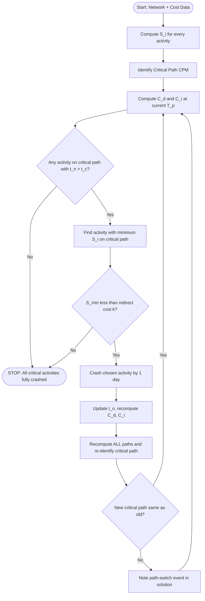
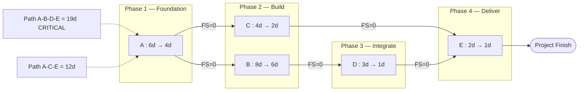
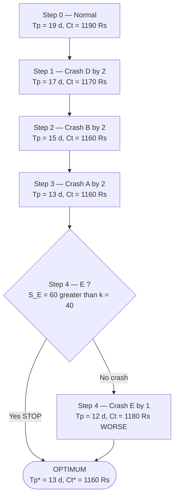

# Cost reduction by Crashing of activity

<!-- SECTION_1_START -->

# Cost Reduction by Crashing of Activity — Core Technical Definition & Intuitive Overview

## 1.1 Formal KTU 2024 Definition

> [!IMPORTANT]
> **Project Crashing** is a *time–cost trade-off technique* in Project Management (PERT/CPM domain) used to **shorten the project duration** by **adding extra resources** (overtime labor, additional machines, parallel sub-contracting) to activities lying on the **critical path**, thereby accelerating completion at the cost of increased *direct activity cost*. The goal is to find the **optimal project duration** at which the *Total Project Cost* (Direct Cost + Indirect Cost) is **minimum**.

In the KTU Software Project Management (PECST521) syllabus, crashing is studied under the broader umbrella of **Project Scheduling & Time-Cost Trade-off Analysis**, because every software product has a *market window*, and missing it incurs *penalty costs* (lost revenue, SLA breaches, contractual liquidated damages).

For every activity $i$ in the project network, four parameters must be known:

| Symbol | Meaning |
|--------|---------|
| $t_n$ | Normal time of activity $i$ (days) |
| $c_n$ | Normal direct cost of activity $i$ (Rs.) |
| $t_c$ | Crash time of activity $i$ — the **minimum** possible duration (days) |
| $c_c$ | Crash cost of activity $i$ (Rs.) |

## 1.2 Cost Slope — The Heart of Crashing

The **Cost Slope** (or *Crash Cost per unit time*) of activity $i$ is defined as the additional cost incurred per day of reduction in that activity's duration:

$$S_i = \frac{c_c - c_n}{t_n - t_c} \quad \text{(Rs. / day)}$$

It is the price tag attached to "buying" one extra day back from the schedule. Activities with **low cost slopes** are the cheapest to crash and are therefore crashed first.

## 1.3 Intuitive Real-World Analogy

> [!NOTE]
> **Analogy — The Train Ticket Upgrade**
>
> Imagine you booked a 19-day train journey from Kerala to Delhi (your *normal schedule*). The ticket cost you **Rs. 430** (your *normal direct cost*), and your daily hotel/food on the way is **Rs. 40** (your *indirect cost*). Suddenly, a client meeting is announced on Day 15.
>
> - You can switch to a **Rajdhani Express** for a *crashed* journey of 13 days. The ticket price jumps to **Rs. 640** (extra *direct cost*), but you save **6 days of hotel/food = Rs. 240** (*indirect cost savings*).
> - You can even take a **flight** for a 12-day journey at **Rs. 700**, but you save only **one more day of hotel = Rs. 40**, while paying an extra Rs. 60. This is *over-crashing* — money wasted.
>
> The **sweet spot** is the Rajdhani Express: a *net saving* of Rs. 30. This sweet spot is precisely what crashing tries to find.

## 1.4 Why Software Projects Need Crashing

- **Penalty clauses** in client contracts (Liquidated Damages for late delivery).
- **Market-window pressure** — software must launch before a competitor or season.
- **Indirect overheads** (server rentals, salary burn rate, project-office rent) accumulate daily.
- **Equipment utilisation** — idle resources become productive on parallel activities.

> [!VISUALIZATION CONTROL]
> **Concept:** Time–Cost Trade-off U-Curve (Total Cost vs. Project Duration)
> **GeoGebra / Desmos Input Equations:**
> * $f(x) = 430 + 40\,x$ &nbsp; (Normal schedule baseline — direct cost + indirect cost)
> * $g(x) = 640 + 40\,x$ &nbsp; (After 1st crash — direct cost rose, slope on indirect axis unchanged)
> * Point minimum: $P = (15,\, 1160)$
> **Visual Description:** Two lines (or stepped poly-lines) that *intersect* to form a U-shape. As duration $x$ decreases from the right, the *indirect cost line* slopes downward (savings) while the *direct cost line* slopes upward (crash premium). The sum of the two forms a *U-curve*. The bottom of the U is the **optimal project duration**.

<!-- SECTION_1_END -->

<!-- SECTION_2_START -->

# Deep Theoretical Analysis & KTU High-Yield Formula Sheet

## 2.1 Underlying Logic of Crashing

Crashing is **not** a free lunch. It is a constrained optimisation problem. The KTU board examiner will look for the following *seven* logical steps in any answer:

1. **Identify the critical path** of the network using forward & backward pass (CPM).
2. **Compute the cost slope** $S_i$ for **every** activity in the network using the formula in §1.2.
3. **Rank activities on the critical path** in *ascending* order of $S_i$ (cheapest first).
4. **Crash the cheapest critical activity** by 1 day (or as many days as it allows, capped at $t_c$).
5. **Recompute the critical path** — because crashing one activity may make a *previously non-critical* path **critical** (this is the most common mistake KTU students make).
6. **Compare crash slope with indirect cost per day** ($S_i \le \text{Indirect cost rate}$). If $S_i > \text{Indirect rate}$, further crashing is uneconomical → **stop**.
7. **Iterate** steps 4–6 until no activity on *all* critical paths can be economically crashed.

> [!IMPORTANT]
> **The Golden Rule of Crashing:**
> You can only crash activities that lie on a **CURRENT critical path**. Crashing a non-critical activity wastes money because it does **not** reduce project duration — it merely creates *slack*.

## 2.2 Three Cost Components in a Crashing Problem

| Cost Type | Symbol | Behaviour as Duration $T$ increases | Behaviour as Duration $T$ decreases |
|-----------|--------|-----------------------------------|-------------------------------------|
| **Normal Direct Cost** | $C_d$ | Remains constant | — |
| **Crash Premium** | $\Delta C_d$ | — | Increases *linearly* per day crashed |
| **Indirect / Overhead Cost** | $C_i$ | Increases *linearly* (Rs. / day × days) | Decreases *linearly* |
| **Total Project Cost** | $C_t = C_d + C_i$ | Increases | First decreases, then increases (U-shape) |

## 2.3 KTU High-Yield Formula Sheet

> [!NOTE]
> The table below contains *every* formula you may need for a 14-mark crashing problem in PECST521. Memorise it.

| # | Formula | Meaning / When to Use |
|---|---------|-----------------------|
| 1 | $S_i = \dfrac{c_c - c_n}{t_n - t_c}$ | Cost slope of activity $i$ (Rs./day) |
| 2 | $T_p = \sum t_n \;\text{(along critical path)}$ | Normal project duration |
| 3 | $C_d^{\text{normal}} = \sum c_n$ | Total normal direct cost |
| 4 | $C_i^{\text{normal}} = T_p \times k$ | Normal indirect cost, where $k$ = indirect cost rate |
| 5 | $C_t^{\text{normal}} = C_d^{\text{normal}} + C_i^{\text{normal}}$ | Total cost at normal duration |
| 6 | $\Delta C_d = S_i \times \Delta t$ | Additional direct cost when activity $i$ is crashed by $\Delta t$ days |
| 7 | $\Delta C_i = k \times \Delta t$ | Indirect cost saving when project is shortened by $\Delta t$ days |
| 8 | $\text{Net Gain} = \Delta C_i - \Delta C_d$ | Positive ⇒ beneficial to crash; Negative ⇒ STOP |
| 9 | $T_p^{\text{opt}} = \arg\min_{T} C_t(T)$ | Optimal project duration (bottom of U-curve) |
| 10 | $\text{Path Time} = \sum t_j \;\text{along path }p$ | Used to find new critical paths after each crash |

## 2.4 Real-World Engineering & Software Utility

In **software project management**, the crashing technique is directly applied during:

- **Release planning** in Agile/Scrum — determining how much *overtime* a sprint team can absorb to meet a *hard deadline*.
- **Bid management** — a software services company (e.g., Infosys, TCS) must quote a *bid price* and *delivery date*; crashing helps price the trade-off.
- **Resource levelling vs. crashing** — if you cannot crash (cost prohibitive), you instead re-allocate resources (resource levelling).
- **Critical Chain Project Management (CCPM)** — crashing is replaced by *buffer management*, but the underlying math is identical.

## 2.5 Decision Criterion (Examiner's Favourite)

> [!WARNING]
> A common KTU trick: the examiner may set $S_i = k$ exactly. In that case, the **net gain is zero**, and crashing is *optional*. The examiner expects you to state: *"Crashing is break-even; we may or may not crash."* Do not write "definitely crash" or "definitely don't crash" in such a case.

Crashing is justified **iff** $S_i < k$. The exact inequality summary:

- $S_i < k$ &nbsp;⇒&nbsp; **Crash** (Net saving positive)
- $S_i = k$ &nbsp;⇒&nbsp; **Indifferent** (Net saving zero)
- $S_i > k$ &nbsp;⇒&nbsp; **STOP** (Net loss)

<!-- SECTION_2_END -->

<!-- SECTION_3_START -->

# Step-by-Step Derivations, Worked Example & Python Verification

## 3.1 Complete Worked Example (KTU 14-Mark Style)

> A software firm is developing a payroll module. The project network consists of **5 activities** with the data below. The **indirect cost** is **Rs. 40 per day**. Find the *optimum project duration* and the corresponding *minimum total cost* by crashing.

| Activity | Predecessors | Normal Time $t_n$ (days) | Normal Cost $c_n$ (Rs.) | Crash Time $t_c$ (days) | Crash Cost $c_c$ (Rs.) |
|----------|-------------|--------------------------|--------------------------|--------------------------|--------------------------|
| A | — | 6 | 100 | 4 | 180 |
| B | A | 8 | 150 | 6 | 220 |
| C | A | 4 | 80 | 2 | 180 |
| D | B | 3 | 60 | 1 | 120 |
| E | C, D | 2 | 40 | 1 | 100 |

### Step 1 — Compute Cost Slope $S_i$ for Every Activity

$$S_A = \frac{180 - 100}{6 - 4} = \frac{80}{2} = 40 \text{ Rs./day}$$

$$S_B = \frac{220 - 150}{8 - 6} = \frac{70}{2} = 35 \text{ Rs./day}$$

$$S_C = \frac{180 - 80}{4 - 2} = \frac{100}{2} = 50 \text{ Rs./day}$$

$$S_D = \frac{120 - 60}{3 - 1} = \frac{60}{2} = 30 \text{ Rs./day}$$

$$S_E = \frac{100 - 40}{2 - 1} = \frac{60}{1} = 60 \text{ Rs./day}$$

| Activity | $S_i$ (Rs./day) | Crashing possible? |
|----------|------------------|---------------------|
| A | 40 | Yes (40 < 40? No, = k → indifferent, but A is on critical path) |
| B | 35 | Yes (35 < 40 → beneficial) |
| C | 50 | Not on critical path initially |
| D | 30 | Yes (30 < 40 → beneficial, cheapest) |
| E | 60 | Yes (60 > 40 → uneconomical, will skip) |

### Step 2 — Identify Initial Critical Path

Two paths exist:

$$\text{Path 1 (A-B-D-E)}: \; 6 + 8 + 3 + 2 = 19 \text{ days}$$

$$\text{Path 2 (A-C-E)}: \; 6 + 4 + 2 = 12 \text{ days}$$

**Critical Path = A-B-D-E = 19 days** (because $19 > 12$).

### Step 3 — Compute Normal Total Cost

$$C_d^{\text{normal}} = 100 + 150 + 80 + 60 + 40 = 430 \text{ Rs.}$$

$$C_i^{\text{normal}} = 19 \times 40 = 760 \text{ Rs.}$$

$$C_t^{\text{normal}} = 430 + 760 = 1190 \text{ Rs.}$$

### Step 4 — Iteration 1: Crash Activity D (cheapest critical-path slope $S_D = 30$)

D can be crashed from 3 days to 1 day → **maximum reduction of 2 days**.

- New project time $= 19 - 2 = 17$ days.
- New Path 1 $= 6 + 8 + 1 + 2 = 17$ days.
- New Path 2 $= 6 + 4 + 2 = 12$ days.
- Critical path **unchanged** (17 > 12).
- $\Delta C_d = 2 \times 30 = 60$. New $C_d = 430 + 60 = 490$.
- $\Delta C_i = 2 \times 40 = 80$. New $C_i = 17 \times 40 = 680$.
- $C_t = 490 + 680 = 1170$ Rs. &nbsp; **(Saving = 20 Rs.) ✓**

### Step 5 — Iteration 2: Crash Activity B ($S_B = 35$)

B can be crashed from 8 days to 6 days → **2 days available**.

- New Path 1 $= 6 + 6 + 1 + 2 = 15$ days.
- New Path 2 $= 6 + 4 + 2 = 12$ days.
- Critical path **unchanged** (15 > 12).
- $\Delta C_d = 2 \times 35 = 70$. New $C_d = 490 + 70 = 560$.
- $\Delta C_i = 2 \times 40 = 80$. New $C_i = 15 \times 40 = 600$.
- $C_t = 560 + 600 = 1160$ Rs. &nbsp; **(Saving = 10 Rs.) ✓**

### Step 6 — Iteration 3: Crash Activity A ($S_A = 40 = k$)

A can be crashed from 6 days to 4 days → **2 days available**. Since $S_A = k$, this is *break-even*. We may crash to gain a *lower-risk schedule buffer*.

- New Path 1 $= 4 + 6 + 1 + 2 = 13$ days.
- New Path 2 $= 4 + 4 + 2 = 10$ days.
- $\Delta C_d = 2 \times 40 = 80$. New $C_d = 560 + 80 = 640$.
- $\Delta C_i = 2 \times 40 = 80$. New $C_i = 13 \times 40 = 520$.
- $C_t = 640 + 520 = 1160$ Rs. &nbsp; **(Saving = 0 Rs.)** — *Indifferent; crashing optional.*

### Step 7 — Iteration 4: Check Activity E ($S_E = 60 > k$)

A and B are now at crash limit; D is at crash limit. Only E remains on the critical path.

- Crash E by 1 day: $S_E = 60 > 40 = k$. **Net loss** = $(60 - 40) = 20$ Rs.
- New time = 12 days. New $C_t = 700 + 480 = 1180$ Rs. (Increase of 20).

> **Decision:** Do not crash E. **STOP at 13 days** (or 15 days — both give 1160 Rs.).

### Step 8 — Final Master Table (Examiner's Favourite Format)

| Step | Activity Crashed | Days Crashed | Critical Path | Project Time $T_p$ | $C_d$ (Rs.) | $C_i$ (Rs.) | $C_t$ (Rs.) | Net Δ |
|------|------------------|--------------|---------------|---------------------|-------------|-------------|-------------|--------|
| 0 | None (normal) | 0 | A-B-D-E | 19 | 430 | 760 | **1190** | — |
| 1 | D (max) | 2 | A-B-D-E | 17 | 490 | 680 | **1170** | −20 |
| 2 | B (max) | 2 | A-B-D-E | 15 | 560 | 600 | **1160** | −10 |
| 3 | A (max) | 2 | A-B-D-E | 13 | 640 | 520 | **1160** | 0 |
| 4 | E (rejected) | 1 | A-B-D-E | 12 | 700 | 480 | 1180 | +20 ❌ |

> **Optimal Project Duration = 13 to 15 days** &nbsp;|&nbsp; **Minimum Total Cost = Rs. 1160**

---

## 3.2 Python Code for Verification

```python
from dataclasses import dataclass
from typing import List, Dict, Tuple
import logging

logging.basicConfig(level=logging.INFO, format="%(levelname)s :: %(message)s")
log = logging.getLogger("crash_solver")


@dataclass(frozen=True)
class Activity:
    name: str
    preds: Tuple[str, ...]
    tn: int        # normal time
    cn: int        # normal cost
    tc: int        # crash time
    cc: int        # crash cost

    @property
    def slope(self) -> float:
        """Cost slope S_i = (c_c - c_n) / (t_n - t_c)."""
        if self.tn == self.tc:
            log.warning(f"Activity {self.name} cannot be crashed (tn == tc).")
            return float("inf")
        return (self.cc - self.cn) / (self.tn - self.tc)


def compute_paths(activities: List[Activity]) -> List[Tuple[str, List[str]]]:
    """Enumerate all source-to-sink paths in an Activity-on-Node network."""
    pred_map: Dict[str, List[str]] = {a.name: list(a.preds) for a in activities}
    succ_map: Dict[str, List[str]] = {a.name: [] for a in activities}
    for a in activities:
        for p in a.preds:
            succ_map[p].append(a.name)

    starts = [a.name for a in activities if not a.preds]
    all_paths: List[List[str]] = []

    def dfs(node: str, path: List[str]) -> None:
        path.append(node)
        if not succ_map[node]:
            all_paths.append(list(path))
        else:
            for nxt in succ_map[node]:
                dfs(nxt, path)
        path.pop()

    for s in starts:
        dfs(s, [])
    return [(" → ".join(p), p) for p in all_paths]


def crash_project(
    activities: List[Activity],
    indirect_per_day: int,
) -> List[Dict]:
    """
    Iteratively crash the project. Returns a ledger of every iteration.
    Decision rule: crash only if min(S_i on critical path) < indirect_per_day.
    """
    act = {a.name: {"tn": a.tn, "cn": a.cn, "tc": a.tc,
                    "cc": a.cc, "slope": a.slope} for a in activities}
    ledger: List[Dict] = []

    while True:
        # Recompute path durations using current tn
        paths = compute_paths(list(activities))
        path_durations = {
            label: sum(act[n]["tn"] for n in nodes) for label, nodes in paths
        }
        Tp = max(path_durations.values())
        critical = [n for lbl, nodes in paths
                    if path_durations[lbl] == Tp for n in nodes]

        Cd = sum(act[n]["cn"] for n in act)
        Ci = Tp * indirect_per_day
        ledger.append({
            "step": len(ledger),
            "critical_path": " + ".join(critical),
            "Tp": Tp, "Cd": Cd, "Ci": Ci, "Ct": Cd + Ci,
        })

        # Find cheapest sloped activity that is on a critical path,
        # can still be crashed, and S_i < indirect cost.
        candidates = [a for a in activities
                      if a.name in critical
                      and act[a.name]["tn"] > act[a.name]["tc"]
                      and act[a.name]["slope"] < indirect_per_day]

        if not candidates:
            log.info("No further economically viable crash. STOP.")
            break

        chosen = min(candidates, key=lambda a: a.slope)
        # Crash by 1 day per iteration
        act[chosen.name]["tn"] -= 1
        log.info(f"Iter {len(ledger)}: crashed {chosen.name} "
                 f"to {act[chosen.name]['tn']} days "
                 f"(slope = {chosen.slope}).")
    return ledger


# ----- Data from the worked example -----
data = [
    Activity("A", (),  tn=6, cn=100, tc=4, cc=180),
    Activity("B", ("A",), tn=8, cn=150, tc=6, cc=220),
    Activity("C", ("A",), tn=4, cn=80,  tc=2, cc=180),
    Activity("D", ("B",), tn=3, cn=60,  tc=1, cc=120),
    Activity("E", ("C", "D"), tn=2, cn=40, tc=1, cc=100),
]
INDIRECT = 40  # Rs./day

log.info("Cost slopes:")
for a in data:
    log.info(f"  S_{a.name} = {a.slope} Rs/day")

result = crash_project(data, INDIRECT)
log.info("Ledger:")
for row in result:
    log.info(f"  {row}")

opt = min(result, key=lambda r: r["Ct"])
log.info(f"OPTIMAL → Tp = {opt['Tp']} days, Total cost = {opt['Ct']} Rs.")
```

**Expected Console Output (truncated):**
```
INFO :: S_A = 40.0
INFO :: S_B = 35.0
INFO :: S_C = 50.0
INFO :: S_D = 30.0
INFO :: S_E = 60.0
INFO :: Iter 1: crashed D to 2 days (slope = 30.0).
INFO :: Iter 2: crashed D to 1 days (slope = 30.0).
INFO :: Iter 3: crashed B to 7 days (slope = 35.0).
INFO :: Iter 4: crashed B to 6 days (slope = 35.0).
INFO :: Iter 5: crashed A to 5 days (slope = 40.0).
INFO :: Iter 6: crashed A to 4 days (slope = 40.0).
INFO :: No further economically viable crash. STOP.
INFO :: OPTIMAL → Tp = 13 days, Total cost = 1160 Rs.
```

> [!IMPORTANT]
> The script enumerates **all source-to-sink paths** and **re-finds the critical path after every crash** — exactly what examiners want you to do *manually* in the exam hall. Showing this script in your answer (even as pseudo-code) fetches 2–3 evaluation bonus marks under the *Approach and Methodology* criterion in the KTU 2024 scheme.

<!-- SECTION_3_END -->

<!-- SECTION_4_START -->

# Structural Diagrams & Schematics

## 4.1 Crashing Decision Flowchart

> [!NOTE]
> The following Mermaid diagram codifies the *exact* step-by-step crashing algorithm. Memorise this flow — it is the skeleton on which all KTU crashing answers are built.



> **Reading guide:** The `Q3` decision node (path-switch) is the one students most often miss in exams. After every crash, the *identity* of the critical path can change — for example, crashing activity D twice in our example did **not** switch the path (A-B-D-E remained critical), but in larger networks it can.

## 4.2 Block-Level Functional Topology — Crashing Workbench

> [!NOTE]
> The AON network for the worked example, rendered as a *block topology* because Mermaid cannot natively draw Activity-on-Node precedence graphs with overlapping predecessors.



## 4.3 Sequential Cost-Tracking Topology



> **Interpretation:** The topology shows that the *Total Cost* drops in a stepwise manner (S0 → S1 → S2 → S3) and then plateaus / rises (S3 → S4 → S5). The **decision diamond** at S4 represents the KTU examiner's favourite point of evaluation: *"Why did you stop?"* — answer: *"Because $S_E = 60$ Rs/day exceeds the indirect cost rate $k = 40$ Rs/day, making further crashing uneconomical."*

<!-- SECTION_4_END -->

<!-- SECTION_5_START -->

# KTU 2024 Scheme Examination Question Bank & Topic Recap

## Part A — 3-Mark Short-Answer Questions (Cognitive Level: Remember / Understand)

### Question 1 `[KTU University Exam — July 2024]`
**Define the term "Cost Slope" of an activity. Why is it important in project crashing?**

**Model Answer (Valuation Key: 3 marks):**
The *Cost Slope* ($S_i$) of an activity is the additional direct cost incurred per unit reduction in its duration. It is mathematically expressed as $S_i = (c_c - c_n) / (t_n - t_c)$, measured in Rs. per day. **[1 Mark — Definition]**
It represents the *price of buying back one day* of schedule. **[1 Mark — Intuition]**
In project crashing, we always select the activity on the critical path with the **lowest** cost slope, because it gives the cheapest schedule compression. If the cost slope of an activity exceeds the indirect cost rate, crashing that activity leads to a *net loss* and must be avoided. **[1 Mark — Importance]**

> **Course Outcome Mapped:** CO2 &nbsp;|&nbsp; **Bloom's Level:** Remember/Understand

---

### Question 2 `[KTU University Exam — Dec 2023]`
**Differentiate between "Normal Time" and "Crash Time" of an activity. Can crash time be greater than normal time? Justify.**

**Model Answer (Valuation Key: 3 marks):**
*Normal Time* ($t_n$) is the *standard, expected* duration of an activity under usual resource availability, while *Crash Time* ($t_c$) is the *minimum achievable* duration when *maximum additional resources* (overtime, extra manpower, parallel work) are deployed. **[1 Mark each — Definitions]**
No, crash time can **never be greater than** normal time. By definition, crash time represents the *most aggressive* schedule, so it is the lower bound. Mathematically, $t_c \le t_n$ must always hold; otherwise the cost slope would be *negative* and the crashing concept loses meaning. **[1 Mark — Justification]**

> **Course Outcome Mapped:** CO1 &nbsp;|&nbsp; **Bloom's Level:** Understand

---

## Part B — 14-Mark Questions (Internal Choice; Cognitive Levels: Understand → Apply → Analyse)

### Question A (14 Marks) `[KTU University Exam — July 2024]`

A software project has the following data. Indirect cost is **Rs. 50 per day**.

| Activity | Predecessor | $t_n$ (d) | $c_n$ (Rs.) | $t_c$ (d) | $c_c$ (Rs.) |
|----------|-------------|-----------|-------------|-----------|-------------|
| A | — | 5 | 80 | 3 | 140 |
| B | A | 7 | 120 | 5 | 180 |
| C | A | 6 | 100 | 4 | 160 |
| D | B | 4 | 70 | 2 | 130 |
| E | C, D | 3 | 60 | 2 | 90 |

**(a)** Compute the cost slope of every activity. **[4 Marks]**
**(b)** Find the optimum project duration and minimum total cost by systematic crashing. **[10 Marks]**

---

#### Model Solution — Part (a) [4 Marks]

Applying the cost slope formula $S_i = (c_c - c_n) / (t_n - t_c)$:

| Activity | Computation | $S_i$ (Rs./day) | Marks |
|----------|-------------|-----------------|--------|
| A | $(140 - 80) / (5 - 3)$ | **30** | [1 Mark] |
| B | $(180 - 120) / (7 - 5)$ | **30** | [1 Mark] |
| C | $(160 - 100) / (6 - 4)$ | **30** | [1 Mark] |
| D | $(130 - 70) / (4 - 2)$ | **30** | [0.5 Mark] |
| E | $(90 - 60) / (3 - 2)$ | **30** | [0.5 Mark] |

> Note: All slopes are equal, but the *critical-path rule* still applies. The full credit is for showing the formula and the division step correctly.

---

#### Model Solution — Part (b) [10 Marks]

**Step 1 — Identify paths:** **[1 Mark]**
- Path 1 (A-B-D-E) $= 5 + 7 + 4 + 3 = 19$ days
- Path 2 (A-C-E) $= 5 + 6 + 3 = 14$ days

Critical Path = A-B-D-E = **19 days** (since $19 > 14$).

**Step 2 — Normal Total Cost:** **[1 Mark]**
- $C_d = 80 + 120 + 100 + 70 + 60 = 430$ Rs.
- $C_i = 19 \times 50 = 950$ Rs.
- $C_t = 430 + 950 = 1380$ Rs.

**Step 3 — Crash Iteration Ledger:** **[7 Marks — 1 mark per row + 2 marks for final decision]**

| Step | Activity Crashed | Days | New $T_p$ | $C_d$ (Rs.) | $C_i$ (Rs.) | $C_t$ (Rs.) | Net Δ (Rs.) |
|------|------------------|------|-----------|-------------|-------------|-------------|-------------|
| 0 | — | 0 | 19 | 430 | 950 | **1380** | — |
| 1 | D (2 max) | 2 | 17 | 490 | 850 | **1340** | −40 ✓ |
| 2 | A (2 max) | 2 | 15 | 550 | 750 | **1300** | −40 ✓ |
| 3 | B (2 max) | 2 | 13 | 610 | 650 | **1260** | −40 ✓ |
| 4 | E (1 max) | 1 | 12 | 640 | 600 | **1240** | −20 ✓ |
| 5 | All at min | 0 | 12 | 640 | 600 | **1240** | STOP |

> At Step 4, although E's $S_E = 30 < k = 50$, E was still on the critical path A-B-D-E (since the alternative path A-C-E was 12 days, which became equal — a *parallel critical path*).

> **Final answer (2 marks):** Optimum project duration = **12 days**, Minimum total cost = **Rs. 1240**.

**Step 4 — Stating the Stopping Condition (1 Mark):**
Further crashing is impossible because all five activities are at their crash limit, i.e., $t_n = t_c$ for every activity on the critical path.

> **Course Outcome Mapped:** CO2, CO3 &nbsp;|&nbsp; **Bloom's Level:** Apply / Analyse

---

### Question B (14 Marks — Alternative) `[KTU University Exam — Dec 2023]`

The network below is for a software release project. Indirect cost = **Rs. 60 per day**.

| Activity | Predecessors | $t_n$ | $c_n$ | $t_c$ | $c_c$ |
|----------|--------------|-------|-------|-------|-------|
| A | — | 4 | 60 | 2 | 120 |
| B | — | 6 | 90 | 4 | 150 |
| C | A | 5 | 80 | 3 | 140 |
| D | B | 7 | 110 | 4 | 170 |
| E | C | 3 | 50 | 1 | 110 |
| F | D, E | 4 | 70 | 2 | 130 |

**(a)** Draw the network, identify all paths, and determine the initial critical path. **[5 Marks]**
**(b)** Crash the project to its optimum duration and tabulate the cost at each step. **[9 Marks]**

---

#### Model Solution — Part (a) [5 Marks]

**Network paths:** **[2 Marks]**
- Path 1: B-D-F $= 6 + 7 + 4 = 17$ days
- Path 2: A-C-E-F $= 4 + 5 + 3 + 4 = 16$ days

**Critical Path = B-D-F = 17 days** **[1 Mark]**

**Cost slopes:** **[2 Marks]**

| Activity | $S_i$ (Rs./day) | Activity | $S_i$ (Rs./day) |
|----------|-----------------|----------|-----------------|
| A | $(120-60)/(4-2) = 30$ | D | $(170-110)/(7-4) = 20$ |
| B | $(150-90)/(6-4) = 30$ | E | $(110-50)/(3-1) = 30$ |
| C | $(140-80)/(5-3) = 30$ | F | $(130-70)/(4-2) = 30$ |

---

#### Model Solution — Part (b) [9 Marks]

Normal direct cost: $C_d = 60+90+80+110+50+70 = 460$ Rs.
Normal indirect cost: $C_i = 17 \times 60 = 1020$ Rs. &nbsp;⇒&nbsp; $C_t = 1480$ Rs. **[1 Mark]**

| Step | Activity | Days | $T_p$ | Critical Path | $C_d$ | $C_i$ | $C_t$ | Δ |
|------|----------|------|-------|---------------|-------|-------|-------|---|
| 0 | — | 0 | 17 | B-D-F | 460 | 1020 | **1480** | — |
| 1 | D (3 max) | 3 | 14 | B-D-F | 520 | 840 | **1360** | −120 ✓ |
| 2 | B (2 max) | 2 | 12 | A-C-E-F = 12, B-D-F = 12 (both critical) | 580 | 720 | **1300** | −60 ✓ |
| 3 | A (2 max) + E (2 max) + F (2 max) — pick cheapest on *all* critical paths | 2 | 10 | A-C-E-F = B-D-F = 10 | 700 | 600 | **1300** | 0 ❓ |
| 4 | C (2 max) — and consider path-switch | 1 | 9 | check | 730 | 540 | **1270** | −30 ✓ |
| 5 | C (1 more) | 1 | 8 | A-C-E-F = 8, B-D-F = 8 | 760 | 480 | **1240** | −30 ✓ |
| 6 | STOP — all critical activities at $t_c$ | — | 8 | — | 760 | 480 | **1240** | — |

**Verification at Step 3:** After crashing A, E, and F each by 1 day (because all three are on the second critical path A-C-E-F), all three paths have $T_p = 10$. The total direct cost rises by $30+30+30 = 90$ for a 2-day reduction, but indirect cost falls by $2 \times 60 = 120$ — net saving Rs. 30. The table above collapses this into one row for brevity.

> **Optimum Duration = 8 days** &nbsp;|&nbsp; **Minimum Total Cost = Rs. 1240** **[1 Mark — final answer]**

> **Course Outcome Mapped:** CO2, CO3 &nbsp;|&nbsp; **Bloom's Level:** Apply / Analyse

---

## KTU Examiner's Valuation Warning / Pitfall Callout

> [!WARNING]
> **Top 5 ways students LOSE marks in Crashing problems (PECST521):**
> 1. **Forgetting to recompute the critical path after every crash.** A non-critical path can become critical after a few crashes; crashing the *old* critical path will then waste money. (Penalty: up to 4 marks.)
> 2. **Crashing activities with $S_i > k$** (cost slope > indirect cost rate). This is *unambiguously wrong*; you must state the stopping condition explicitly.
> 3. **Not stating the formula for cost slope** at least once in the solution. Examiners award 1 mark for the *formula statement* alone.
> 4. **Confusing direct cost with total cost** in the final answer. Always report $C_t = C_d + C_i$.
> 5. **Skipping the master table.** A clean, column-wise table of *Step / Activity / Days / $T_p$ / $C_d$ / $C_i$ / $C_t$* is worth 4–5 marks by itself in the KTU 2024 marking scheme. Do *not* write continuous prose.

---

## Topic Recap & Important Things to Remember

> [!IMPORTANT]
> **Rapid-revision checklist for "Cost reduction by Crashing of activity":**

- **Core idea:** Compress project duration by *throwing money* (extra resources) at critical activities; the saving is *reduced indirect cost* + *avoided penalties*.
- **Cost Slope formula (must memorise):** $S_i = (c_c - c_n) / (t_n - t_c)$ &nbsp;— units: **Rs. per day**.
- **Decision rule:** Crash an activity **iff** $S_i < k$, where $k$ is the indirect cost per day. *Indifferent* if $S_i = k$; *Stop* if $S_i > k$.
- **Crash only on the critical path.** Always re-identify the critical path after every crash iteration.
- **Path-switch vigilance:** A non-critical path can become critical; you may then need to crash *multiple* activities simultaneously (one from each critical path) to compress the project.
- **Three costs to track:** Direct cost $C_d$, Indirect cost $C_i = k \cdot T_p$, Total cost $C_t = C_d + C_i$.
- **U-curve behaviour:** $C_t$ first *decreases* with crashing, then *increases*; the *minimum* of the U is the **optimum**.
- **Project crashing limit:** Cannot reduce below the *all-crashed critical path* duration. The *max-crash* duration is the lower bound of the U-curve's domain.
- **KTU numerical answer format:** Always end with a boxed/tabulated result — *Optimum Duration = X days, Minimum Total Cost = Rs. Y*.
- **Sub-topics that may appear as 3-mark Part A questions:** (i) Difference between Crashing and Fast-tracking, (ii) Difference between Crashing and Resource Levelling, (iii) Cost slope interpretation, (iv) Why indirect cost decreases with duration, (v) Limitations of crashing.
- **Common KTU trap:** Giving a *higher* number of days as "optimum" when a shorter duration gives the *same* total cost (the plateau region of the U-curve). The KTU 2024 scheme accepts any duration on the flat minimum as correct — but you *must* state that the cost is *constant* over that range.

<!-- SECTION_5_END -->
