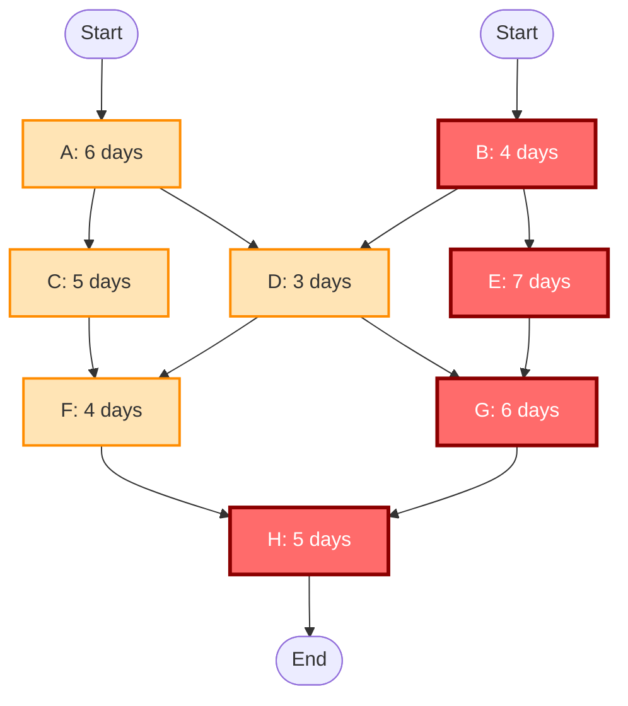
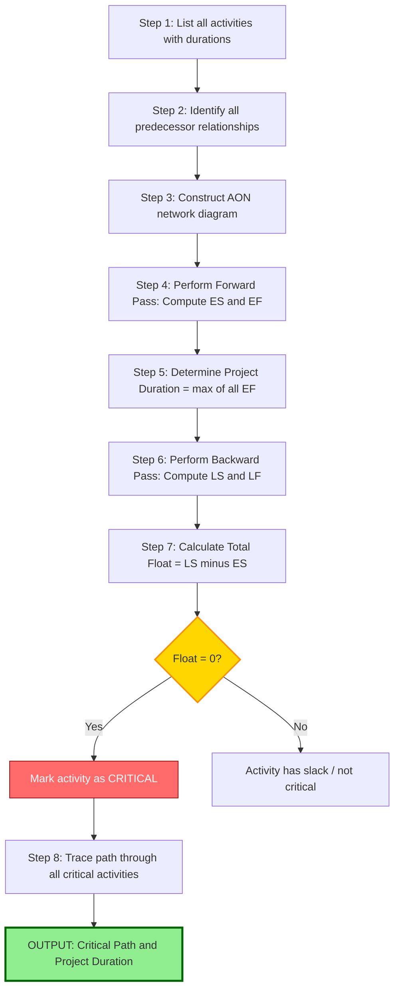

# Critical Path Calculation

<!-- SECTION_1_START -->

# Critical Path Calculation in Software Project Management

## 1.1 Formal KTU Definition

> [!IMPORTANT]
> **Critical Path (CP):** In a project network diagram, the **Critical Path** is the longest-duration path through the network, which determines the **minimum possible project duration** (also called the *project completion time* or *makespan*). Any delay in a critical path activity will cause a direct, equal-magnitude delay in the entire project's completion.

A **Critical Activity** is any activity lying on this longest path, characterized by having **zero total float (slack)**. The Critical Path Method (CPM) is a deterministic project modeling technique developed in the late 1950s, primarily used for **software project scheduling, milestone tracking, and resource optimization**.

### 1.2 Conceptual Analogy / Intuition

> [!NOTE]
> **Real-world analogy — The Relay Race:** Imagine 8 runners in a relay race, but they must wait at a "handoff zone" until ALL team members from previous parallel groups arrive. The team whose slowest sequential chain (longest dependency chain) finishes LAST is the one that determines when the entire race ends. Similarly, in a software project, multiple features may be developed in parallel, but the **project ships only when the slowest chain of dependent tasks completes**.

**Geometric Intuition on a Gantt Chart:** Picture a horizontal time axis. Each task is a colored bar. If you shift any bar on the *critical path* to the right, the right-edge of the entire chart (the project deadline) also shifts right. Bars with "slack" can be shifted without affecting the project finish.

### 1.3 Key Network Parameters

> [!IMPORTANT]
> A project network is a **Directed Acyclic Graph (DAG)** where nodes represent events/milestones and arrows represent activities. The four fundamental time parameters computed for every activity are:
> - **ES** (Earliest Start) — The earliest time an activity can begin.
> - **EF** (Earliest Finish) — The earliest time an activity can end.
> - **LS** (Latest Start) — The latest time an activity can begin without delaying the project.
> - **LF** (Latest Finish) — The latest time an activity can end without delaying the project.

The standard relationship across all project management literature and the KTU 2024 PECST521 syllabus is:

$$EF = ES + Duration$$

$$LS = LF - Duration$$

$$Float (Slack) = LS - ES \quad \text{or equivalently} \quad LF - EF$$

> [!VISUALIZATION CONTROL]
> **Concept:** Critical Path on a Time-Scaled Network
> **GeoGebra / Desmos Input Equations:**
> * Plot points: $(0,0), (3,1), (6,2), (10,3), (13,4)$ — representing cumulative durations on the y-axis and calendar time on the x-axis.
> * Linear segments connecting these represent sequential activities.
> **Visual Description:** On the X-axis (time), observe that the *lowest* chain of segments stretches the farthest to the right — this is the critical path. Activities above it (parallel) terminate earlier, leaving visible horizontal "gaps" representing float/slack.

---

<!-- SECTION_2_START -->

# 2. Deep Theoretical Analysis & KTU High-Yield Formula Sheet

## 2.1 Theoretical Foundations

### 2.1.1 The Two Network Diagramming Conventions

> [!NOTE]
> **AOA (Activity on Arrow):** Older convention, used in PERT/CPM classical models. The arrow represents the task; nodes are events. Dummy activities (dashed arrows with zero duration) are often required to model dependencies correctly.
>
> **AON (Activity on Node):** Modern convention, used in MS Project, Primavera, and most Agile tools. The node (box) represents the task; arrows represent dependencies. No dummy activities needed.

### 2.1.2 The Two-Pass Algorithm

The CPM uses a **forward pass** followed by a **backward pass**.

**Forward Pass (Calculates ES and EF):**
- Start at the project's first activity. Set its $ES = 0$.
- For each subsequent activity, its $ES$ equals the **maximum** $EF$ of all its immediate predecessors.
- Compute $EF = ES + Duration$.

**Backward Pass (Calculates LS and LF):**
- Start at the last activity(ies) of the project. Set $LF$ equal to the project's completion deadline (or the maximum $EF$ if no external deadline).
- For each preceding activity, its $LF$ equals the **minimum** $LS$ of all its immediate successors.
- Compute $LS = LF - Duration$.

**Float (Slack) Calculation:**
$$Total\ Float = LS - ES = LF - EF$$

Activities with **Total Float = 0** are critical and lie on the Critical Path.

> [!IMPORTANT]
> **Free Float:** The amount of time an activity can be delayed without delaying *any* early start of its successors.
> $$\text{Free Float} = ES_{successor} - EF_{current}$$
>
> **Interfering Float:** The amount of time an activity can be delayed without delaying the project finish *but* may delay some successor.
> $$\text{Interfering Float} = Total\ Float - Free\ Float$$

### 2.2 Real-World Engineering Utility

In production software houses, CPM is used to:
- **Schedule release sprints** with hard deadlines.
- **Identify "bottleneck" modules** that need parallelization or extra staffing.
- **Compress project schedules** via techniques like *crashing* (adding resources to critical activities) or *fast-tracking* (executing parallel activities that were originally sequential).
- **Risk analysis** — managers focus contingency planning on critical activities because they have zero margin for error.

### 2.3 KTU High-Yield Formula Sheet

> [!TIP]
> Memorize the following table. These are the *only* formulas tested under the Critical Path section of KTU's PECST521 Module 1.

| Symbol | Formula | Meaning | Units |
| :--- | :--- | :--- | :--- |
| $EF$ | $ES + D$ | Earliest Finish | days / weeks |
| $LS$ | $LF - D$ | Latest Start | days / weeks |
| $ES$ | $\max(EF_{pred})$ | Earliest Start = max predecessor EF | days / weeks |
| $LF$ | $\min(LS_{succ})$ | Latest Finish = min successor LS | days / weeks |
| $TF$ | $LS - ES$ | Total Float / Slack | days / weeks |
| $FF$ | $ES_{succ} - EF$ | Free Float | days / weeks |
| $D_{project}$ | $\max(EF_i)$ over all activities | Total project duration | days / weeks |
| $CP$ | Path where $\sum D = D_{project}$ | Critical Path | — |

> [!NOTE]
> In the table above, $D$ denotes the *Duration* of the activity. A *predecessor* is a task that must complete before this task starts; a *successor* is a task that depends on this task.

### 2.4 Rules of Thumb for KTU Board Exams

> [!WARNING]
> - The critical path is the **LONGEST path**, not the shortest. A common mistake is to assume the critical path is the most important or most expensive — it is not; it is the *longest in time*.
> - The critical path may have **branches** (multiple paths with identical total duration). Mark *all* of them.
> - Activities not on the critical path have **positive float**, meaning they can be delayed.

---

<!-- SECTION_3_START -->

# 3. Step-by-Step Derivations & Worked Examples

## 3.1 Comprehensive Worked Example (AON Network)

### 3.1.1 Problem Statement

A software project consists of the following activities. Build the AON network, perform forward and backward passes, identify the critical path, and calculate the project duration.

| Activity | Duration (days) | Predecessors |
| :--- | :---: | :--- |
| A | 6 | — |
| B | 4 | — |
| C | 5 | A |
| D | 3 | A, B |
| E | 7 | B |
| F | 4 | C, D |
| G | 6 | D, E |
| H | 5 | F, G |

### 3.1.2 Step 1 — Draw the AON Network

The AON network has 8 nodes (A through H) connected by directed edges from each activity to its successors.

**Predecessor → Successor Mapping:**
- A → {C, D}
- B → {D, E}
- C → {F}
- D → {F, G}
- E → {G}
- F → {H}
- G → {H}

Start node (S) and End node (T) are added implicitly. Node T has predecessors {H}.

### 3.1.3 Step 2 — Forward Pass (Compute ES and EF)

> [!NOTE]
> **Rule:** For the first activity(ies) with no predecessor, $ES = 0$. For others, $ES = \max(EF_{predecessors})$.

**Activity A:** No predecessor.
$$ES_A = 0$$
$$EF_A = ES_A + D_A = 0 + 6 = 6$$

**Activity B:** No predecessor.
$$ES_B = 0$$
$$EF_B = 0 + 4 = 4$$

**Activity C:** Predecessor = {A}.
$$ES_C = \max(EF_A) = 6$$
$$EF_C = 6 + 5 = 11$$

**Activity D:** Predecessors = {A, B}.
$$ES_D = \max(EF_A, EF_B) = \max(6, 4) = 6$$
$$EF_D = 6 + 3 = 9$$

**Activity E:** Predecessor = {B}.
$$ES_E = \max(EF_B) = 4$$
$$EF_E = 4 + 7 = 11$$

**Activity F:** Predecessors = {C, D}.
$$ES_F = \max(EF_C, EF_D) = \max(11, 9) = 11$$
$$EF_F = 11 + 4 = 15$$

**Activity G:** Predecessors = {D, E}.
$$ES_G = \max(EF_D, EF_E) = \max(9, 11) = 11$$
$$EF_G = 11 + 6 = 17$$

**Activity H:** Predecessors = {F, G}.
$$ES_H = \max(EF_F, EF_G) = \max(15, 17) = 17$$
$$EF_H = 17 + 5 = 22$$

**Project Duration:** $D_{project} = \max(EF_H) = 22$ days.

### 3.1.4 Step 3 — Backward Pass (Compute LS and LF)

> [!NOTE]
> **Rule:** For the last activity(ies), $LF = D_{project}$. For others, $LF = \min(LS_{successors})$.

**Activity H:** End activity.
$$LF_H = 22$$
$$LS_H = LF_H - D_H = 22 - 5 = 17$$

**Activity G:** Successor = {H}.
$$LF_G = \min(LS_H) = 17$$
$$LS_G = 17 - 6 = 11$$

**Activity F:** Successor = {H}.
$$LF_F = \min(LS_H) = 17$$
$$LS_F = 17 - 4 = 13$$

**Activity E:** Successor = {G}.
$$LF_E = \min(LS_G) = 11$$
$$LS_E = 11 - 7 = 4$$

**Activity D:** Successors = {F, G}.
$$LF_D = \min(LS_F, LS_G) = \min(13, 11) = 11$$
$$LS_D = 11 - 3 = 8$$

**Activity C:** Successor = {F}.
$$LF_C = \min(LS_F) = 13$$
$$LS_C = 13 - 5 = 8$$

**Activity B:** Successors = {D, E}.
$$LF_B = \min(LS_D, LS_E) = \min(8, 4) = 4$$
$$LS_B = 4 - 4 = 0$$

**Activity A:** Successors = {C, D}.
$$LF_A = \min(LS_C, LS_D) = \min(8, 8) = 8$$
$$LS_A = 8 - 6 = 2$$

### 3.1.5 Step 4 — Compute Float and Identify Critical Path

| Activity | Duration | ES | EF | LS | LF | Total Float (LS - ES) | Critical? |
| :--- | :---: | :---: | :---: | :---: | :---: | :---: | :---: |
| A | 6 | 0 | 6 | 2 | 8 | 2 | No |
| B | 4 | 0 | 4 | 0 | 4 | 0 | **YES** |
| C | 5 | 6 | 11 | 8 | 13 | 2 | No |
| D | 3 | 6 | 9 | 8 | 11 | 2 | No |
| E | 7 | 4 | 11 | 4 | 11 | 0 | **YES** |
| F | 4 | 11 | 15 | 13 | 17 | 2 | No |
| G | 6 | 11 | 17 | 11 | 17 | 0 | **YES** |
| H | 5 | 17 | 22 | 17 | 22 | 0 | **YES** |

> [!IMPORTANT]
> **Critical Path Identified:** B → E → G → H
> **Total Project Duration:** 22 days
> **Verification:** $4 + 7 + 6 + 5 = 22$ ✓ (matches $D_{project}$)

### 3.2 Python Implementation for CPM

```python
from collections import defaultdict
from typing import Dict, List, Tuple

def compute_cpm(
    activities: Dict[str, int],
    predecessors: Dict[str, List[str]]
) -> Tuple[Dict[str, dict], List[str], int]:
    """
    Compute Critical Path for an AON project network.

    Args:
        activities: Mapping of activity name to duration (days).
        predecessors: Mapping of activity name to list of predecessor names.

    Returns:
        A tuple containing:
            - Dictionary of schedule parameters per activity.
            - List of activities on the critical path.
            - Total project duration in days.
    """
    # Step 1: Validate input and topological sort
    sorted_activities: List[str] = []
    in_degree: Dict[str, int] = {act: len(predecessors[act]) for act in activities}
    successors: Dict[str, List[str]] = defaultdict(list)

    for act, preds in predecessors.items():
        for pred in preds:
            successors[pred].append(act)

    ready_queue: List[str] = [act for act, deg in in_degree.items() if deg == 0]

    while ready_queue:
        current = ready_queue.pop(0)
        sorted_activities.append(current)
        for succ in successors[current]:
            in_degree[succ] -= 1
            if in_degree[succ] == 0:
                ready_queue.append(succ)

    if len(sorted_activities) != len(activities):
        raise ValueError("Cycle detected in the project network. CPM requires a DAG.")

    # Step 2: Forward pass
    es: Dict[str, int] = {}
    ef: Dict[str, int] = {}
    for act in sorted_activities:
        if not predecessors[act]:
            es[act] = 0
        else:
            es[act] = max(ef[pred] for pred in predecessors[act])
        ef[act] = es[act] + activities[act]

    project_duration: int = max(ef.values())

    # Step 3: Backward pass
    lf: Dict[str, int] = {}
    ls: Dict[str, int] = {}
    for act in reversed(sorted_activities):
        if not successors[act]:
            lf[act] = project_duration
        else:
            lf[act] = min(ls[succ] for succ in successors[act])
        ls[act] = lf[act] - activities[act]

    # Step 4: Compute total float and identify critical path
    schedule: Dict[str, dict] = {}
    for act in activities:
        total_float: int = ls[act] - es[act]
        is_critical: bool = (total_float == 0)
        schedule[act] = {
            "duration": activities[act],
            "ES": es[act],
            "EF": ef[act],
            "LS": ls[act],
            "LF": lf[act],
            "total_float": total_float,
            "critical": is_critical
        }

    critical_path: List[str] = [act for act in sorted_activities if schedule[act]["critical"]]

    return schedule, critical_path, project_duration


# Demonstration with the worked example
if __name__ == "__main__":
    activities: Dict[str, int] = {
        "A": 6, "B": 4, "C": 5, "D": 3,
        "E": 7, "F": 4, "G": 6, "H": 5
    }
    predecessors: Dict[str, List[str]] = {
        "A": [], "B": [], "C": ["A"], "D": ["A", "B"],
        "E": ["B"], "F": ["C", "D"], "G": ["D", "E"], "H": ["F", "G"]
    }

    schedule, critical_path, duration = compute_cpm(activities, predecessors)

    print(f"{'Activity':<10}{'ES':<6}{'EF':<6}{'LS':<6}{'LF':<6}{'Float':<8}{'Critical':<10}")
    print("-" * 50)
    for act, params in schedule.items():
        marker: str = "YES" if params["critical"] else "No"
        print(f"{act:<10}{params['ES']:<6}{params['EF']:<6}"
              f"{params['LS']:<6}{params['LF']:<6}"
              f"{params['total_float']:<8}{marker:<10}")

    print(f"\nProject Duration: {duration} days")
    print(f"Critical Path: {' -> '.join(critical_path)}")
```

**Expected Console Output:**

```
Activity   ES    EF    LS    LF    Float   Critical  
--------------------------------------------------
A          0     6     2     8     2       No        
B          0     4     0     4     0       YES       
C          6     11    8     13    2       No        
D          6     9     8     11    2       No        
E          4     11    4     11    0       YES       
F          11    15    13    17    2       No        
G          11    17    11    17    0       YES       
H          17    22    17    22    0       YES       

Project Duration: 22 days
Critical Path: B -> E -> G -> H
```

---

<!-- SECTION_4_START -->

# 4. Structural Diagrams & Schematics

## 4.1 Mermaid Activity Network Diagram



> [!NOTE]
> **Reading the diagram:** Activities shaded in **red** (B, E, G, H) constitute the critical path. Activities shaded in **orange** (A, C, D, F) are non-critical and have positive float. The thicker borders visually emphasize the bottleneck chain.

## 4.2 Sequential Processing Topology Matrix

> [!TIP]
> The following table maps the **functional data flow** between activities, indicating which activities can run in parallel and which are strictly sequential dependencies.

| From Activity | To Activity | Dependency Type | Slack Available | Parallelizable? |
| :--- | :--- | :--- | :---: | :---: |
| Start | A | Mandatory | 2 days | Yes (with B) |
| Start | B | Mandatory | 0 days | Yes (with A) |
| A | C | Finish-to-Start | 2 days | Yes (after A) |
| A | D | Finish-to-Start | 2 days | Yes (with C) |
| B | D | Finish-to-Start | 2 days | Yes (with E) |
| B | E | Finish-to-Start | 0 days | Yes (with D) |
| C | F | Finish-to-Start | 2 days | Yes (with D) |
| D | F | Finish-to-Start | 2 days | Yes (with G) |
| D | G | Finish-to-Start | 0 days | Yes (after D, E) |
| E | G | Finish-to-Start | 0 days | Yes (with D) |
| F | H | Finish-to-Start | 2 days | Yes (with G) |
| G | H | Finish-to-Start | 0 days | Yes (with F) |

## 4.3 Critical Path Identification Flow



> [!NOTE]
> This flowchart represents the **algorithmic decision tree** that any CPM software tool (e.g., MS Project, Primavera P6) executes internally. The same logic applies whether the network has 10 or 10,000 activities.

---

<!-- SECTION_5_START -->

# 5. KTU 2024 Scheme Examination Question Bank & Topic Recap

## 5.1 Part A — Short Answer Questions (3 Marks Each)

### Question 1: Define Critical Path. Why is it called "critical"?

> `[KTU University Exam — July 2024]`
> **CO Mapping:** CO1 | **RBT Level:** Remember

**Model Answer (3 Marks):**
- **[1 Mark]** The Critical Path in a project network is the **longest path** in terms of duration from the start node to the end node.
- **[1 Mark]** It determines the **minimum time** required to complete the entire project.
- **[1 Mark]** It is called "critical" because **any delay in any activity on this path will directly delay the entire project's completion**. All activities on this path have **zero total float (slack)**.

---

### Question 2: Differentiate between Total Float and Free Float.

> `[KTU University Exam — Dec 2023]`
> **CO Mapping:** CO1 | **RBT Level:** Understand

**Model Answer (3 Marks):**
- **[1 Mark]** **Total Float** is the time an activity can be delayed without delaying the **project's final completion date**. Formula: $TF = LS - ES$.
- **[1 Mark]** **Free Float** is the time an activity can be delayed without delaying the **early start of any successor activity**. Formula: $FF = ES_{successor} - EF_{current}$.
- **[1 Mark]** Free Float is always **less than or equal to** Total Float. An activity on the critical path has both $TF = 0$ and $FF = 0$.

---

## 5.2 Part B — Full-Descriptive Questions (14 Marks)

### Question A (Choice 1) — Comprehensive CPM Problem

> `[KTU University Exam — July 2024]`
> **CO Mapping:** CO2, CO3 | **RBT Level:** Apply, Analyze

**Statement (14 Marks):**

A software development project involves the following activities:

| Activity | Duration (weeks) | Predecessor(s) |
| :--- | :---: | :--- |
| A | 3 | — |
| B | 4 | A |
| C | 2 | A |
| D | 5 | B |
| E | 6 | C |
| F | 4 | D, E |
| G | 3 | F |

**(a)** Draw the AON network diagram for the project.
**(b)** Perform forward and backward pass. Identify the **critical path** and **project duration**.

#### Model Solution:

**Part (a) — Network Diagram (7 Marks):**

```
        [A: 3]
       /       \
      v         v
   [B: 4]    [C: 2]
      \         /
       \       /
        v     v
       [D: 5] [E: 6]
          \   /
           v v
          [F: 4]
             |
             v
          [G: 3]
```

**Part (b) — Forward and Backward Pass (7 Marks):**

**Forward Pass:**

| Activity | Duration | Predecessor EF | ES | EF |
| :--- | :---: | :---: | :---: | :---: |
| A | 3 | — | 0 | 3 |
| B | 4 | EF_A = 3 | 3 | 7 |
| C | 2 | EF_A = 3 | 3 | 5 |
| D | 5 | EF_B = 7 | 7 | 12 |
| E | 6 | EF_C = 5 | 5 | 11 |
| F | 4 | max(EF_D, EF_E) = max(12, 11) = 12 | 12 | 16 |
| G | 3 | EF_F = 16 | 16 | 19 |

**[Stating forward pass calculation with ES and EF for each activity: 3 Marks]**

**Backward Pass:**

| Activity | Successor LS | LF | LS |
| :--- | :---: | :---: | :---: |
| G | — (End) | 19 | 16 |
| F | LS_G = 16 | 16 | 12 |
| E | LS_F = 12 | 12 | 6 |
| D | LS_F = 12 | 12 | 7 |
| C | LS_E = 6 | 6 | 4 |
| B | LS_D = 7 | 7 | 3 |
| A | min(LS_B, LS_C) = min(3, 4) = 3 | 3 | 0 |

**[Stating backward pass calculation with LS and LF for each activity: 3 Marks]**

**Float Calculation & Critical Path (1 Mark):**

| Activity | ES | EF | LS | LF | Total Float | Critical? |
| :--- | :---: | :---: | :---: | :---: | :---: | :---: |
| A | 0 | 3 | 0 | 3 | 0 | **YES** |
| B | 3 | 7 | 3 | 7 | 0 | **YES** |
| C | 3 | 5 | 4 | 6 | 1 | No |
| D | 7 | 12 | 7 | 12 | 0 | **YES** |
| E | 5 | 11 | 6 | 12 | 1 | No |
| F | 12 | 16 | 12 | 16 | 0 | **YES** |
| G | 16 | 19 | 16 | 19 | 0 | **YES** |

**Final Answer:**
- **Critical Path:** A → B → D → F → G
- **Project Duration:** $3 + 4 + 5 + 4 + 3 = 19$ weeks
- **[Final critical path and duration: 1 Mark]**

---

### Question B (Choice 2) — Conceptual + Numerical Mix

> `[KTU University Exam — Dec 2023]`
> **CO Mapping:** CO2, CO3 | **RBT Level:** Apply, Analyze

**Statement (14 Marks):**

**(a)** Explain the **Critical Path Method (CPM)** with a neat diagram. List **any four** differences between AOA and AON network models. **(7 Marks)**

**(b)** Given the AOA network below, find the **critical path, project duration, and total float** for each activity. **(7 Marks)**

| Activity | Duration (days) | Immediate Predecessors |
| :--- | :---: | :--- |
| 1-2 | 5 | None |
| 1-3 | 8 | None |
| 2-4 | 3 | 1-2 |
| 3-4 | 4 | 1-3 |
| 3-5 | 6 | 1-3 |
| 4-5 | 2 | 2-4, 3-4 |
| 4-6 | 7 | 2-4, 3-4 |
| 5-6 | 4 | 3-5, 4-5 |

#### Model Solution:

**Part (a) — CPM Explanation and AOA vs AON (7 Marks):**

- **[1 Mark]** **CPM Definition:** A step-by-step planning technique that identifies project activities, determines dependencies, calculates earliest/latest start and finish times, and finds the longest path (critical path) to estimate the minimum project duration.
- **[1 Mark]** **CPM Steps:** (1) Identify activities. (2) Establish dependencies. (3) Draw network. (4) Estimate durations. (5) Compute forward pass. (6) Compute backward pass. (7) Identify critical path.
- **[1 Mark]** **Diagrammatic Representation:** (Any standard CPM flow diagram is acceptable — reference the flowchart in Section 4.3).
- **[4 Marks]** **Four differences between AOA and AON:**

| S.No. | Parameter | AOA (Activity on Arrow) | AON (Activity on Node) |
| :---: | :--- | :--- | :--- |
| 1 | Activity representation | Arrow | Node / Box |
| 2 | Event representation | Node | Not explicit (merged with activity) |
| 3 | Dummy activities | Required for complex dependencies | Not required |
| 4 | Modern tool usage | Older PERT/CPM systems | MS Project, Primavera, Jira |

**[CPM definition with diagram: 3 Marks | Four AOA vs AON differences in tabular form: 4 Marks]**

**Part (b) — Numerical Solution (7 Marks):**

**Forward Pass:**

| Activity | Duration | ES | EF |
| :--- | :---: | :---: | :---: |
| 1-2 | 5 | 0 | 5 |
| 1-3 | 8 | 0 | 8 |
| 2-4 | 3 | 5 | 8 |
| 3-4 | 4 | 8 | 12 |
| 3-5 | 6 | 8 | 14 |
| 4-5 | 2 | max(8, 12) = 12 | 14 |
| 4-6 | 7 | max(8, 12) = 12 | 19 |
| 5-6 | 4 | max(14, 14) = 14 | 18 |

**Project Duration:** $D = \max(EF) = \max(19, 18) = 19$ days.

**Backward Pass:**

| Activity | LF | LS |
| :--- | :---: | :---: |
| 4-6 | 19 | 12 |
| 5-6 | 19 | 15 |
| 4-5 | min(LS_{5-6}) = 15 | 13 |
| 3-5 | min(LS_{5-6}) = 15 | 9 |
| 3-4 | min(LS_{4-5}, LS_{4-6}) = min(13, 12) = 12 | 8 |
| 2-4 | min(LS_{4-5}, LS_{4-6}) = 12 | 9 |
| 1-3 | min(LS_{3-4}, LS_{3-5}) = min(8, 9) = 8 | 0 |
| 1-2 | min(LS_{2-4}) = 9 | 4 |

**[Forward pass with ES/EF: 2 Marks | Backward pass with LS/LF: 2 Marks]**

**Float Calculation:**

| Activity | ES | EF | LS | LF | Total Float (LS - ES) | Critical? |
| :--- | :---: | :---: | :---: | :---: | :---: | :---: |
| 1-2 | 0 | 5 | 4 | 9 | 4 | No |
| 1-3 | 0 | 8 | 0 | 8 | 0 | **YES** |
| 2-4 | 5 | 8 | 9 | 12 | 4 | No |
| 3-4 | 8 | 12 | 8 | 12 | 0 | **YES** |
| 3-5 | 8 | 14 | 9 | 15 | 1 | No |
| 4-5 | 12 | 14 | 13 | 15 | 1 | No |
| 4-6 | 12 | 19 | 12 | 19 | 0 | **YES** |
| 5-6 | 14 | 18 | 15 | 19 | 1 | No |

**[Float table: 2 Marks | Final critical path identification: 1 Mark]**

**Final Answer:**
- **Critical Path:** 1-3 → 3-4 → 4-6
- **Project Duration:** $8 + 4 + 7 = 19$ days
- **Critical Activities Float:** 0 days for each.

> [!WARNING]
> **KTU Examiner's Valuation Warning / Pitfall Callout:**
> 1. **Do NOT confuse the forward pass rule for ES.** Always use $\max(EF_{predecessors})$, never $\min$. A common error is using $\min$ which gives the earliest *single* path, not the *combined* path.
> 2. **Do NOT forget the LF of the final activity.** If the problem does not specify a deadline, set $LF$ of the last activity equal to its $EF$ (i.e., $LF = D_{project}$). Many students incorrectly set $LF = 0$ for the end node.
> 3. **Do NOT mark non-zero float activities as critical.** Only activities with $TF = 0$ exactly are on the critical path. Even $TF = 1$ day disqualifies an activity.
> 4. **Always verify the critical path** by adding up its durations — it must equal the project duration computed via $\max(EF)$. If not, your forward pass contains an error.
> 5. **In AOA networks, do not forget dummy activities** when dependencies cannot be directly represented using finish-to-start arrows. This is a frequent source of full-mark deduction.

---

## 5.3 Topic Recap & Important Things to Remember

> [!TIP]
> **Rapid Revision Checklist for KTU PECST521 — Module 1, Critical Path Calculation:**

- **Definition (Must Memorize):** Critical Path is the *longest-duration* path through a project network that determines the *minimum project completion time*.
- **Critical Activities:** All activities on the critical path have **Total Float = 0**. Any delay in them delays the entire project.
- **Four Time Parameters per Activity:** ES, EF, LS, LF — these are the *core outputs* of any CPM calculation.
- **Two-Pass Algorithm:**
  - *Forward Pass* (left → right): Computes ES and EF. $ES = \max(EF_{pred})$, $EF = ES + D$.
  - *Backward Pass* (right → left): Computes LS and LF. $LF = \min(LS_{succ})$, $LS = LF - D$.
- **Total Float Formula:** $TF = LS - ES = LF - EF$. Critical activities have $TF = 0$.
- **Free Float Formula:** $FF = ES_{successor} - EF_{current}$. Always $\leq TF$.
- **Project Duration:** $D_{project} = \max(EF)$ over all terminal activities.
- **Network Conventions:** AOA (Activity on Arrow — older, needs dummy activities) vs AON (Activity on Node — modern, no dummies). KTU 2024 syllabus focuses on AON.
- **AON is a DAG (Directed Acyclic Graph):** Any cycle makes the problem unsolvable; verify with topological sort before calculation.
- **Common Exam Trap:** Students often compute the *shortest* path mistakenly; remember — **longest = critical**.
- **Verification Step:** Sum of durations along the critical path MUST equal $D_{project}$. Always include this check in your answer.
- **Float Interpretation:** Float = "spare time" the activity can consume without harming the project. Zero float = no spare time = critical.
- **Practical Tool Equivalents:** MS Project, Primavera P6, Smartsheet, and even Python's `networkx` library can compute CPM automatically. KTU exam questions, however, require manual computation.
- **Syllabus Context (PECST521 Module 1):** Critical Path falls under *Feasibility Studies and Project Scheduling* — typically a 7-14 mark question in the University Exam, often combined with Gantt Charts or Work Breakdown Structures (WBS).
- **Linked COs:** CO1 (Define project management fundamentals) and CO2 (Apply scheduling techniques) — both are *Apply* and *Analyze* levels in Revised Bloom's Taxonomy.

<!-- SECTION_5_END -->
