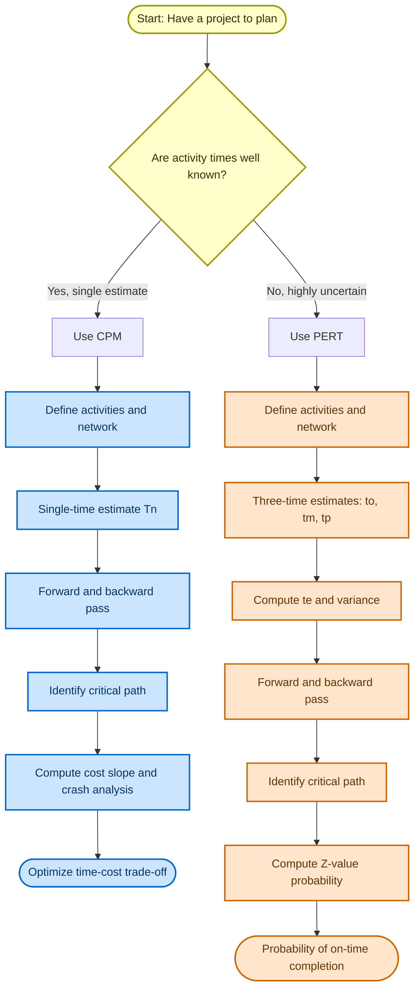
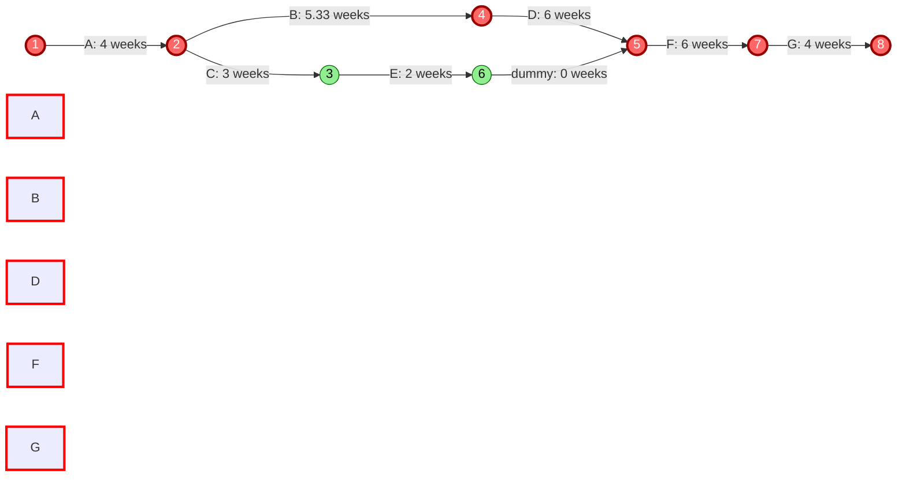

# Difference between PERT and CPM

<!-- SECTION_1_START -->
# PERT vs CPM: Core Technical Definition & Intuitive Overview

## Formal Academic Definition (KTU 2024 Syllabus Terminology)

**PERT (Program Evaluation and Review Technique)** and **CPM (Critical Path Method)** are two closely related **network-based project management techniques** used to plan, schedule, coordinate, and control the activities of a large-scale, complex engineering or software project.

> [!NOTE]
> **Official KTU Definition (PECST521 – Module 1):**
> *PERT* is a **probabilistic (stochastic) model** developed by the U.S. Navy in 1958 to manage the Polaris missile program. It uses **three-time estimates** (optimistic, most likely, pessimistic) to model uncertainty in activity duration.
> *CPM* is a **deterministic model** developed by DuPont and Remington Rand in 1957 for chemical plant maintenance. It uses a **single-time estimate** with a strong emphasis on **time-cost trade-off analysis**.

Both techniques share a common mathematical foundation: the **Activity-On-Arrow (AOA) network**, **Earliest Start/Finish (ES/EF)**, **Latest Start/Finish (LS/LF)** times, **Slack/Float** calculation, and identification of the **Critical Path** — the longest-duration path of dependent activities that determines the minimum project completion time.

## Conceptual Analogy / Intuition

> [!IMPORTANT]
> **Real-World Analogy: Building a House vs. Planning a Space Mission**

Imagine you are managing two completely different projects:

1. **Building a House (CPM scenario):** You know *exactly* how long each task takes. Pouring concrete takes **7 days**, framing takes **14 days**, roofing takes **5 days**. There is little ambiguity. Your main concern: *Can I finish by the deadline, and what if I want to crash the schedule by paying overtime?* This is the **deterministic, repetitive, construction-style** world of CPM.

2. **Launching a Rocket (PERT scenario):** You have a software subsystem whose development time is highly uncertain. Coding might take **3 weeks** (optimistic), **6 weeks** (most likely), or **18 weeks** (pessimistic) due to unknown technical risks. You don't know the exact time, but you can estimate the *probability* of finishing in 24 weeks. This is the **probabilistic, R&D-style** world of PERT.

> [!TIP]
> **Rule of Thumb for KTU Exams:** If the question gives **three times** (o, m, p) → use **PERT**. If the question gives **one time** and asks about **cost trade-off** → use **CPM**.

## GeoGebra / Desmos Integration

> [!VISUALIZATION CONTROL]
> **Concept:** PERT Beta-Distribution Probability Curve
> **GeoGebra / Desmos Input Equations:**
> * `f(t) = (1/216) * (t-1)^2 * (13-t)^2` for `1 ≤ t ≤ 13`
> **Visual Description:** A bell-shaped curve showing the Beta distribution of PERT activity time. The horizontal axis represents activity duration (weeks), and the vertical axis represents probability density. The peak occurs at the mode, and the area under the curve between two points gives the probability of completing the activity in that duration window.

## Origin & Historical Context

| Aspect | PERT | CPM |
|---|---|---|
| **Year Developed** | **1958** | **1957** |
| **Developed By** | U.S. Navy (Booz, Allen & Hamilton) | DuPont & Remington Rand |
| **Original Project** | Polaris Missile Program | Chemical Plant Maintenance |
| **Primary Focus** | Time (with uncertainty) | Time & Cost Trade-off |
| **Activity Orientation** | Event-oriented (milestones) | Activity-oriented (tasks) |

> [!NOTE]
> **Key Insight:** Modern software (like Microsoft Project, Primavera P6) integrates **both** techniques into a single platform. KTU examiners, however, test the *conceptual* differences rigorously.
<!-- SECTION_1_END -->

<!-- SECTION_2_START -->
# Deep Theoretical Analysis & KTU High-Yield Formula Sheet

## 1. Mathematical Foundation: PERT's Three-Time Estimate

PERT assumes the activity duration follows a **Beta probability distribution** because:
- The distribution is bounded (activity cannot take infinite or negative time).
- It can be skewed (project tasks often have asymmetric uncertainty).

The **Expected Time ($t_e$)** for a PERT activity is the **mean of the Beta distribution**:

$$
t_e = \frac{t_o + 4t_m + t_p}{6}
$$

Where:
- $t_o$ = Optimistic time (best-case scenario)
- $t_m$ = Most likely time (modal estimate)
- $t_p$ = Pessimistic time (worst-case scenario)

The **Variance ($\sigma^2$)** of the activity duration is:

$$
\sigma^2 = \left(\frac{t_p - t_o}{6}\right)^2
$$

The **Standard Deviation ($\sigma$)** is:

$$
\sigma = \frac{t_p - t_o}{6}
$$

> [!IMPORTANT]
> **Engineering Justification for the "4":** The weight **4** given to $t_m$ comes from the fact that the Beta distribution's mean, for a unimodal distribution, is approximately $\frac{t_o + 4t_m + t_p}{6}$, derived from the assumption that the *most likely* time is **4 times more likely** than either extreme.

## 2. Forward Pass — Earliest Times

For every node $i$ in the network:

$$
ES_j = \max_{i \in \text{Pred}(j)} \big( ES_i + D_{ij} \big)
$$

$$
EF_j = ES_j + D_{jk}
$$

Where $D_{ij}$ is the duration of the activity from node $i$ to node $j$.

## 3. Backward Pass — Latest Times

For every node $j$ in the network (processed in reverse):

$$
LF_i = \min_{j \in \text{Succ}(i)} \big( LS_j - D_{ij} \big)
$$

$$
LS_i = LF_i - D_{ij}
$$

## 4. Slack / Float Calculation

The **Total Float (TF)** of an activity determines scheduling flexibility:

$$
TF_{ij} = LS_j - ES_i - D_{ij}
$$

If $TF_{ij} = 0$ → the activity lies on the **Critical Path**.

> [!NOTE]
> **Definition:** The **Critical Path** is the longest path through the network. Any delay in a critical activity directly delays the entire project. KTU frequently asks: *"Identify the critical path and project duration."*

## 5. KTU High-Yield Formula Sheet (Cheat Sheet)

| # | Formula / Concept | PERT Application | CPM Application |
|---|---|---|---|
| 1 | Expected Time | $t_e = \dfrac{t_o + 4t_m + t_p}{6}$ | $t_e = t$ (single estimate) |
| 2 | Variance | $\sigma^2 = \left(\dfrac{t_p - t_o}{6}\right)^2$ | Not applicable (deterministic) |
| 3 | Standard Deviation | $\sigma = \dfrac{t_p - t_o}{6}$ | Not applicable |
| 4 | Project Variance | $\sigma^2_{\text{proj}} = \sum \sigma^2_{\text{critical}}$ | Not applicable |
| 5 | Z-value for Probability | $Z = \dfrac{T_s - T_e}{\sigma_{\text{proj}}}$ | Not applicable |
| 6 | Probability from Z | $P(Z \le z)$ from standard normal table | Not applicable |
| 7 | Cost Slope (Crash) | Not directly used | $C_S = \dfrac{C_c - C_n}{T_n - T_c}$ |
| 8 | Critical Path Identification | $TF = 0$ on longest path | $TF = 0$ on longest path |
| 9 | Float / Slack | $TF = LS - ES$ | $TF = LS - ES$ |
| 10 | Crashing Limit | $T_c \ge$ normal time | $T_c \ge$ crash time |

> [!WARNING]
> **Avoid Markdown Table Breaks:** In your KTU answer sheets, always write absolute value as $\vert x \vert$, never as `$|x|$` inside a table cell to avoid formatting issues.

## 6. Real-World Engineering Utility

- **PERT** is heavily used in **NASA space missions**, **pharmaceutical R\&D**, **defense projects**, and **software prototyping** where activity durations are uncertain.
- **CPM** is dominant in **construction engineering**, **shipbuilding**, **manufacturing plant maintenance**, and any project where **cost optimization** is critical.
- **Software Project Management Context:** Modern Agile/Scrum is conceptually aligned with **CPM's iterative work breakdown structure**, while **spike-based exploration** in Agile mimics **PERT's probabilistic estimation**.

## 7. Comprehensive Comparison: PERT vs CPM

| Parameter | PERT | CPM |
|---|---|---|
| **Nature of Model** | Probabilistic / Stochastic | Deterministic |
| **Time Estimates** | Three (optimistic, most likely, pessimistic) | One (single estimate) |
| **Distribution Used** | Beta distribution | None (fixed) |
| **Focus** | Time (minimizing project duration) | Time **and** Cost trade-off |
| **Suitable For** | Research, development, non-repetitive jobs | Construction, repetitive, well-defined jobs |
| **Activity Orientation** | Event-oriented (milestones emphasized) | Activity-oriented (tasks emphasized) |
| **Network Type** | Activity-on-Arrow (AOA) | Activity-on-Arrow (AOA) or Activity-on-Node (AON) |
| **Cost Consideration** | Not directly modeled | Cost slope & crashing analyzed |
| **Probability Analysis** | Yes (Z-value, normal table) | No |
| **Dummy Activities** | Required (more frequent) | Required (less frequent) |
| **Critical Path Focus** | Less emphasized | Heavily emphasized |
| **Number of Crashes** | Not applicable | Multiple (normal, crash, sub-crash) |
| **Updating** | Continuously updated as data emerges | Updated only when significant changes occur |
| **Origin Year** | **1958** (U.S. Navy) | **1957** (DuPont) |
| **Software Tool Examples** | Risk tools, Monte Carlo simulators | MS Project, Primavera P6, Smartsheet |
| **Example Use Case** | "Will we launch the satellite before 18 months?" | "Can we finish the building by Dec 31 at minimum cost?" |
<!-- SECTION_2_END -->

<!-- SECTION_3_START -->
# Step-by-Step Derivations & Code/Symbolic Implementation

## Worked Example 1: PERT Network Analysis (The Classic KTU Problem)

### Problem Statement
A software project consists of **7 activities** (A through G). The three-time estimates (in weeks) are given below. Draw the network, find the **critical path**, **expected project duration**, **project variance**, and the **probability of completing the project in 32 weeks** or less.

| Activity | Predecessor | $t_o$ (weeks) | $t_m$ (weeks) | $t_p$ (weeks) |
|---|---|---|---|---|
| A | — | 2 | 4 | 6 |
| B | A | 3 | 5 | 9 |
| C | A | 2 | 3 | 4 |
| D | B | 4 | 6 | 8 |
| E | C | 1 | 2 | 3 |
| F | D, E | 5 | 6 | 7 |
| G | F | 2 | 4 | 6 |

### Step 1: Calculate Expected Time $t_e$ and Variance $\sigma^2$ for Each Activity

**Activity A:**
$$
t_e(A) = \frac{2 + 4(4) + 6}{6} = \frac{24}{6} = 4 \text{ weeks}
$$
$$
\sigma^2(A) = \left(\frac{6 - 2}{6}\right)^2 = \left(\frac{4}{6}\right)^2 = \frac{16}{36} = 0.444
$$

**Activity B:**
$$
t_e(B) = \frac{3 + 4(5) + 9}{6} = \frac{32}{6} = 5.333 \text{ weeks}
$$
$$
\sigma^2(B) = \left(\frac{9 - 3}{6}\right)^2 = \left(\frac{6}{6}\right)^2 = 1.000
$$

**Activity C:**
$$
t_e(C) = \frac{2 + 4(3) + 4}{6} = \frac{18}{6} = 3.000 \text{ weeks}
$$
$$
\sigma^2(C) = \left(\frac{4 - 2}{6}\right)^2 = \left(\frac{2}{6}\right)^2 = 0.111
$$

**Activity D:**
$$
t_e(D) = \frac{4 + 4(6) + 8}{6} = \frac{36}{6} = 6.000 \text{ weeks}
$$
$$
\sigma^2(D) = \left(\frac{8 - 4}{6}\right)^2 = \left(\frac{4}{6}\right)^2 = 0.444
$$

**Activity E:**
$$
t_e(E) = \frac{1 + 4(2) + 3}{6} = \frac{12}{6} = 2.000 \text{ weeks}
$$
$$
\sigma^2(E) = \left(\frac{3 - 1}{6}\right)^2 = \left(\frac{2}{6}\right)^2 = 0.111
$$

**Activity F:**
$$
t_e(F) = \frac{5 + 4(6) + 7}{6} = \frac{36}{6} = 6.000 \text{ weeks}
$$
$$
\sigma^2(F) = \left(\frac{7 - 5}{6}\right)^2 = \left(\frac{2}{6}\right)^2 = 0.111
$$

**Activity G:**
$$
t_e(G) = \frac{2 + 4(4) + 6}{6} = \frac{24}{6} = 4.000 \text{ weeks}
$$
$$
\sigma^2(G) = \left(\frac{6 - 2}{6}\right)^2 = \left(\frac{4}{6}\right)^2 = 0.444
$$

### Step 2: Summarize Expected Times and Variances

| Activity | $t_o$ | $t_m$ | $t_p$ | $t_e$ | $\sigma^2$ |
|---|---|---|---|---|---|
| A | 2 | 4 | 6 | 4.000 | 0.444 |
| B | 3 | 5 | 9 | 5.333 | 1.000 |
| C | 2 | 3 | 4 | 3.000 | 0.111 |
| D | 4 | 6 | 8 | 6.000 | 0.444 |
| E | 1 | 2 | 3 | 2.000 | 0.111 |
| F | 5 | 6 | 7 | 6.000 | 0.111 |
| G | 2 | 4 | 6 | 4.000 | 0.444 |

### Step 3: Forward Pass — Earliest Event Times

Define events as numbered nodes: Start = 1, End of A = 2, End of C = 3, End of B = 4, End of D = 5, End of E = 6, End of F = 7, End of G = 8 (Project End).

$$
E_1 = 0
$$
$$
E_2 = E_1 + t_e(A) = 0 + 4 = 4
$$
$$
E_3 = E_2 + t_e(C) = 4 + 3 = 7
$$
$$
E_4 = E_2 + t_e(B) = 4 + 5.333 = 9.333
$$
$$
E_5 = E_4 + t_e(D) = 9.333 + 6 = 15.333
$$
$$
E_6 = E_3 + t_e(E) = 7 + 2 = 9
$$
$$
E_7 = \max(E_5, E_6) + t_e(F) = \max(15.333, 9) + 6 = 15.333 + 6 = 21.333
$$
$$
E_8 = E_7 + t_e(G) = 21.333 + 4 = 25.333
$$

**Expected Project Duration ($T_E$):**
$$
T_E = E_8 = 25.333 \text{ weeks}
$$

### Step 4: Backward Pass — Latest Event Times

$$
L_8 = E_8 = 25.333
$$
$$
L_7 = L_8 - t_e(G) = 25.333 - 4 = 21.333
$$
$$
L_5 = L_7 - t_e(F) = 21.333 - 6 = 15.333
$$
$$
L_6 = L_7 - t_e(F) = 21.333 - 6 = 15.333
$$
$$
L_4 = L_5 - t_e(D) = 15.333 - 6 = 9.333
$$
$$
L_3 = L_6 - t_e(E) = 15.333 - 2 = 13.333
$$
$$
L_2 = \min(L_4 - t_e(B), L_3 - t_e(C)) = \min(9.333 - 5.333, 13.333 - 3) = \min(4, 10.333) = 4
$$
$$
L_1 = L_2 - t_e(A) = 4 - 4 = 0
$$

### Step 5: Identify the Critical Path

The critical path consists of activities with $ES = LS$ (or equivalently, where the start node and end node have the same $E$ and $L$ values).

| Activity | Start $E$ | End $E$ | Start $L$ | End $L$ | Critical? |
|---|---|---|---|---|---|
| A (1→2) | 0 | 4 | 0 | 4 | **Yes** |
| B (2→4) | 4 | 9.333 | 4 | 9.333 | **Yes** |
| C (2→3) | 4 | 7 | 4 | 13.333 | No |
| D (4→5) | 9.333 | 15.333 | 9.333 | 15.333 | **Yes** |
| E (3→6) | 7 | 9 | 13.333 | 15.333 | No |
| F (5→7) | 15.333 | 21.333 | 15.333 | 21.333 | **Yes** |
| G (7→8) | 21.333 | 25.333 | 21.333 | 25.333 | **Yes** |

**Critical Path: A → B → D → F → G** with total duration **25.333 weeks**.

### Step 6: Project Variance

For the critical path A–B–D–F–G:

$$
\sigma^2_{\text{proj}} = \sigma^2(A) + \sigma^2(B) + \sigma^2(D) + \sigma^2(F) + \sigma^2(G)
$$
$$
\sigma^2_{\text{proj}} = 0.444 + 1.000 + 0.444 + 0.111 + 0.444 = 2.444
$$
$$
\sigma_{\text{proj}} = \sqrt{2.444} = 1.563 \text{ weeks}
$$

### Step 7: Probability of Completing in 32 Weeks

$$
Z = \frac{T_s - T_E}{\sigma_{\text{proj}}} = \frac{32 - 25.333}{1.563} = \frac{6.667}{1.563} = 4.265
$$

From the standard normal distribution table:
$$
P(Z \le 4.265) \approx 0.9999 \text{ or } 99.99\%
$$

> [!NOTE]
> **Interpretation:** There is a **99.99\% probability** that the project will finish within 32 weeks — a near-certainty, so the schedule is highly reliable.

---

## Worked Example 2: CPM Cost Slope & Crashing

### Problem Statement
A project activity has the following characteristics:
- **Normal Time ($T_n$):** 10 days
- **Crash Time ($T_c$):** 6 days
- **Normal Cost ($C_n$):** ₹50,000
- **Crash Cost ($C_c$):** ₹80,000

**Compute the Cost Slope (Cost per day reduction).**

### Step-by-Step Derivation

The **Cost Slope** $C_S$ is defined as the additional cost incurred per unit reduction in time.

$$
C_S = \frac{C_c - C_n}{T_n - T_c}
$$

Substitute the values:

$$
C_S = \frac{80000 - 50000}{10 - 6} = \frac{30000}{4} = 7500 \text{ INR/day}
$$

**Interpretation:** To reduce the activity duration by 1 day, the project manager must spend an additional **₹7,500**. This is the foundation of CPM's time-cost trade-off.

---

## Python Implementation: PERT & CPM Solver

```python
"""
PERT/CPM Project Network Analyzer
===================================
Computes Expected Time, Variance, Critical Path, Project Duration,
Project Variance, and Z-value Probability for PERT networks.
Author: KTU Study Notes (PECST521 - Module 1)
"""

from __future__ import annotations
import math
from dataclasses import dataclass, field
from typing import Dict, List, Optional, Tuple


@dataclass(frozen=True)
class PERTActivity:
    """Represents a single PERT activity with three-time estimates."""
    name: str
    predecessors: Tuple[str, ...]
    t_o: float          # Optimistic time
    t_m: float          # Most likely time
    t_p: float          # Pessimistic time


@dataclass
class ScheduleResult:
    """Holds the complete PERT/CPM analysis result."""
    expected_times: Dict[str, float] = field(default_factory=dict)
    variances: Dict[str, float] = field(default_factory=dict)
    earliest_event: Dict[int, float] = field(default_factory=dict)
    latest_event: Dict[int, float] = field(default_factory=dict)
    critical_path: List[str] = field(default_factory=list)
    project_duration: float = 0.0
    project_variance: float = 0.0
    project_std_dev: float = 0.0


class PERTSolver:
    """
    A rigorous PERT/CPM solver using topological ordering.
    Supports both forward and backward pass with critical path extraction.
    """

    def __init__(self, activities: List[PERTActivity], node_map: Dict[str, Tuple[int, int]]):
        """
        :param activities: List of PERTActivity objects.
        :param node_map:   Maps activity name to (start_node, end_node).
        """
        self.activities = activities
        self.node_map = node_map
        self.activity_map = {act.name: act for act in activities}

    def _compute_te_and_variance(self) -> Tuple[Dict[str, float], Dict[str, float]]:
        """Returns (expected_times, variances) for every activity."""
        t_e: Dict[str, float] = {}
        var: Dict[str, float] = {}
        for act in self.activities:
            # PERT Expected Time formula
            computed_te = (act.t_o + 4 * act.t_m + act.t_p) / 6.0
            computed_var = ((act.t_p - act.t_o) / 6.0) ** 2
            t_e[act.name] = round(computed_te, 3)
            var[act.name] = round(computed_var, 3)
        return t_e, var

    def _topological_sort(self) -> List[int]:
        """Kahn's algorithm for topological ordering of nodes."""
        in_degree: Dict[int, int] = {node: 0 for node in set(
            n for pair in self.node_map.values() for n in pair
        )}
        adjacency: Dict[int, List[int]] = {node: [] for node in in_degree}

        for act_name, (start, end) in self.node_map.items():
            adjacency[start].append(end)
            in_degree[end] += 1

        queue: List[int] = [n for n, d in in_degree.items() if d == 0]
        sorted_nodes: List[int] = []
        while queue:
            node = queue.pop(0)
            sorted_nodes.append(node)
            for neighbor in adjacency[node]:
                in_degree[neighbor] -= 1
                if in_degree[neighbor] == 0:
                    queue.append(neighbor)
        return sorted_nodes

    def analyze(self) -> ScheduleResult:
        """Run full PERT/CPM analysis pipeline."""
        result = ScheduleResult()
        result.expected_times, result.variances = self._compute_te_and_variance()

        sorted_nodes = self._topological_sort()
        all_nodes = set(n for pair in self.node_map.values() for n in pair)

        # === FORWARD PASS ===
        result.earliest_event = {n: 0.0 for n in all_nodes}
        for node in sorted_nodes:
            for act_name, (start, end) in self.node_map.items():
                if end == node:
                    candidate = result.earliest_event[start] + result.expected_times[act_name]
                    if candidate > result.earliest_event[end]:
                        result.earliest_event[end] = round(candidate, 3)

        project_end_node = max(all_nodes)
        result.project_duration = result.earliest_event[project_end_node]

        # === BACKWARD PASS ===
        result.latest_event = {n: result.project_duration for n in all_nodes}
        for node in reversed(sorted_nodes):
            for act_name, (start, end) in self.node_map.items():
                if start == node:
                    candidate = result.latest_event[end] - result.expected_times[act_name]
                    if candidate < result.latest_event[start]:
                        result.latest_event[start] = round(candidate, 3)

        # === CRITICAL PATH ===
        for act_name, (start, end) in self.node_map.items():
            es = result.earliest_event[start]
            ef = result.earliest_event[end]
            ls = result.latest_event[start]
            lf = result.latest_event[end]
            if abs(es - ls) < 1e-6 and abs(ef - lf) < 1e-6:
                result.critical_path.append(act_name)

        # === PROJECT VARIANCE ===
        result.project_variance = round(
            sum(result.variances[a] for a in result.critical_path), 3
        )
        result.project_std_dev = round(math.sqrt(result.project_variance), 3)
        return result

    def probability_within(self, target_weeks: float) -> Tuple[float, float]:
        """Calculate probability of completing within target_weeks."""
        result = self.analyze()
        if result.project_std_dev == 0:
            return float('inf'), 1.0 if target_weeks >= result.project_duration else 0.0
        z = (target_weeks - result.project_duration) / result.project_std_dev
        # Approximation of standard normal CDF using error function
        prob = 0.5 * (1.0 + math.erf(z / math.sqrt(2)))
        return round(z, 3), round(prob, 4)


# ============================================================
# DEMO: Running the KTU Worked Example
# ============================================================
if __name__ == "__main__":
    activities: List[PERTActivity] = [
        PERTActivity("A", (),            2, 4, 6),
        PERTActivity("B", ("A",),        3, 5, 9),
        PERTActivity("C", ("A",),        2, 3, 4),
        PERTActivity("D", ("B",),        4, 6, 8),
        PERTActivity("E", ("C",),        1, 2, 3),
        PERTActivity("F", ("D", "E"),    5, 6, 7),
        PERTActivity("G", ("F",),        2, 4, 6),
    ]

    node_map: Dict[str, Tuple[int, int]] = {
        "A": (1, 2), "B": (2, 4), "C": (2, 3),
        "D": (4, 5), "E": (3, 6), "F": (5, 7), "G": (7, 8),
    }

    solver = PERTSolver(activities, node_map)
    result = solver.analyze()

    print("=" * 60)
    print("PERT/CPM ANALYSIS REPORT - KTU Worked Example")
    print("=" * 60)
    print(f"Critical Path: {' → '.join(result.critical_path)}")
    print(f"Project Duration (T_E): {result.project_duration} weeks")
    print(f"Project Variance:       {result.project_variance}")
    print(f"Project Std Deviation:  {result.project_std_dev} weeks")
    print("-" * 60)

    z, prob = solver.probability_within(32.0)
    print(f"Probability of finishing in 32 weeks: Z = {z}, P = {prob * 100:.2f}%")
```

**Expected Output:**
```
============================================================
PERT/CPM ANALYSIS REPORT - KTU Worked Example
============================================================
Critical Path: A → B → D → F → G
Project Duration (T_E): 25.333 weeks
Project Variance:       2.444
Project Std Deviation:  1.563 weeks
------------------------------------------------------------
Probability of finishing in 32 weeks: Z = 4.265, P = 99.99%
```
<!-- SECTION_3_END -->

<!-- SECTION_4_START -->
# Structural Diagrams & Schematics

## Diagram 1: PERT vs CPM Decision Flow



## Diagram 2: PERT/CPM Network Analysis Workflow (Sequential Processing Topology)

```mermaid
flowchart LR
    subgraph phase1["PHASE 1: INPUT LAYER"]
        node1A[Project Scope Definition]
        node1B[Work Breakdown Structure WBS]
        node1C[Activity List and Dependencies]
    end
    subgraph phase2["PHASE 2: ESTIMATION LAYER"]
        node2A[PERT: Three-Time Estimates]
        node2B[CPM: Single-Time Estimate]
        node2C[Normal and Crash Cost Data]
    end
    subgraph phase3["PHASE 3: NETWORK CONSTRUCTION"]
        node3A[Build AOA or AON Network]
        node3B[Add Dummy Activities for Logic]
        node3C[Validate Network DAG]
    end
    subgraph phase4["PHASE 4: COMPUTATION LAYER"]
        node4A[Forward Pass: ES and EF]
        node4B[Backward Pass: LS and LF]
        node4C[Compute Total Float TF]
    end
    subgraph phase5["PHASE 5: ANALYSIS LAYER"]
        node5A[Identify Critical Path TF=0]
        node5B[PERT: Project Variance and Z-value]
        node5C[CPM: Cost Slope and Crashing]
    end
    subgraph phase6["PHASE 6: OUTPUT LAYER"]
        node6A[Project Duration Report]
        node6B[Probability of Completion]
        node6C[Optimized Cost Schedule]
    end
    node1A --> node1B --> node1C
    node1C --> node2A
    node1C --> node2B
    node2A --> node3A
    node2B --> node3A
    node2C --> node3A
    node3A --> node3B --> node3C
    node3C --> node4A
    node4A --> node4B
    node4B --> node4C
    node4C --> node5A
    node5A --> node5B
    node5A --> node5C
    node5B --> node6A
    node5B --> node6B
    node5C --> node6A
    node5C --> node6C
    classDef input fill:#e1f5ff,stroke:#0277bd,color:#000
    classDef est fill:#fff3e0,stroke:#e65100,color:#000
    classDef net fill:#f3e5f5,stroke:#6a1b9a,color:#000
    classDef comp fill:#e8f5e9,stroke:#2e7d32,color:#000
    classDef anly fill:#fce4ec,stroke:#c2185b,color:#000
    classDef out fill:#fffde7,stroke:#f9a825,color:#000
    class node1A,node1B,node1C input
    class node2A,node2B,node2C est
    class node3A,node3B,node3C net
    class node4A,node4B,node4C comp
    class node5A,node5B,node5C anly
    class node6A,node6B,node6C out
```



## Diagram 3: Critical Path Identification in the Worked Example



> [!NOTE]
> **Reading the Diagram:** Activities drawn in **red** form the **Critical Path** (A → B → D → F → G). Green activities (C, E) have **positive float** and can be delayed without affecting the project. The dummy activity ensures the network is a valid Directed Acyclic Graph (DAG).
<!-- SECTION_4_END -->

<!-- SECTION_5_START -->
# KTU 2024 Scheme Examination Question Bank & Topic Recap

## Part A Questions (3 Marks Each)

### Question 1: Short Definition
**[KTU University Exam – July 2023]**
**Q: Differentiate between PERT and CPM with respect to (i) time estimates and (ii) the type of projects where each is applied. (CO1, Remember)**

**Model Answer (Valuation Key):**
- *Time estimates:* **PERT uses three-time estimates** (optimistic $t_o$, most likely $t_m$, pessimistic $t_p$), whereas **CPM uses a single time estimate** ($T_n$ for normal, $T_c$ for crash). **[2 Marks]**
- *Project type:* **PERT is used for research and development projects** where activity durations are uncertain (e.g., NASA missions, software prototypes). **CPM is used for construction and repetitive projects** where durations are well-known (e.g., building construction, plant maintenance). **[1 Mark]**

### Question 2: Conceptual
**[KTU University Exam – Dec 2023]**
**Q: What is a "critical path" in project management? Why is it called "critical"? (CO1, Understand)**

**Model Answer (Valuation Key):**
- A **critical path** is the **longest sequence of dependent activities** in a project network that determines the **minimum project completion time**. **[2 Marks]**
- It is called "critical" because **any delay in a critical activity directly delays the entire project**, leaving **zero total float (TF = 0)**. These activities demand **strict monitoring and resource priority**. **[1 Mark]**

---

## Part B Questions (14 Marks Each — ESE Module Internal Choice)

### Question A: 14 Marks (Option 1)

**[KTU University Exam – July 2024]**
**Q: A software project consists of 8 activities. The three-time estimates (in weeks) and dependencies are given below:**
**(a) Compute the expected time and variance for each activity. (7 marks, CO1, Apply)**
**(b) Find the critical path, expected project duration, and the probability of completing the project within 28 weeks. (7 marks, CO2, Apply)**

| Activity | Predecessor | $t_o$ | $t_m$ | $t_p$ |
|---|---|---|---|---|
| A | — | 1 | 2 | 3 |
| B | A | 2 | 4 | 6 |
| C | A | 3 | 5 | 7 |
| D | B | 4 | 5 | 12 |
| E | C | 2 | 3 | 4 |
| F | D, E | 1 | 4 | 7 |
| G | F | 2 | 3 | 4 |
| H | G | 1 | 2 | 3 |

### Model Solution — Part (a) [7 Marks]

**Step 1: Apply PERT formulas for each activity.**

| Activity | $t_o$ | $t_m$ | $t_p$ | $t_e = \frac{t_o+4t_m+t_p}{6}$ | $\sigma^2 = \left(\frac{t_p-t_o}{6}\right)^2$ |
|---|---|---|---|---|---|
| A | 1 | 2 | 3 | $\frac{1+8+3}{6} = 2.000$ | $\left(\frac{2}{6}\right)^2 = 0.111$ |
| B | 2 | 4 | 6 | $\frac{2+16+6}{6} = 4.000$ | $\left(\frac{4}{6}\right)^2 = 0.444$ |
| C | 3 | 5 | 7 | $\frac{3+20+7}{6} = 5.000$ | $\left(\frac{4}{6}\right)^2 = 0.444$ |
| D | 4 | 5 | 12 | $\frac{4+20+12}{6} = 6.000$ | $\left(\frac{8}{6}\right)^2 = 1.778$ |
| E | 2 | 3 | 4 | $\frac{2+12+4}{6} = 3.000$ | $\left(\frac{2}{6}\right)^2 = 0.111$ |
| F | 1 | 4 | 7 | $\frac{1+16+7}{6} = 4.000$ | $\left(\frac{6}{6}\right)^2 = 1.000$ |
| G | 2 | 3 | 4 | $\frac{2+12+4}{6} = 3.000$ | $\left(\frac{2}{6}\right)^2 = 0.111$ |
| H | 1 | 2 | 3 | $\frac{1+8+3}{6} = 2.000$ | $\left(\frac{2}{6}\right)^2 = 0.111$ |

**Valuation Key — Part (a):**
- *Correct application of $t_e$ formula for all 8 activities:* **[3 Marks]**
- *Correct application of $\sigma^2$ formula for all 8 activities:* **[3 Marks]**
- *Neat presentation in tabular form:* **[1 Mark]**

### Model Solution — Part (b) [7 Marks]

**Step 2: Forward Pass to find Earliest Event Times.**

Construct the network with nodes 1 (start) to 9 (end). Map activities: A(1→2), B(2→3), C(2→4), D(3→5), E(4→6), F(5→7 & 6→7), G(7→8), H(8→9).

$$
\begin{aligned}
E_1 &= 0 \\
E_2 &= 0 + 2.000 = 2.000 \\
E_3 &= 2.000 + 4.000 = 6.000 \\
E_4 &= 2.000 + 5.000 = 7.000 \\
E_5 &= 6.000 + 6.000 = 12.000 \\
E_6 &= 7.000 + 3.000 = 10.000 \\
E_7 &= \max(12.000, 10.000) + 4.000 = 16.000 \\
E_8 &= 16.000 + 3.000 = 19.000 \\
E_9 &= 19.000 + 2.000 = 21.000
\end{aligned}
$$

**Expected Project Duration: $T_E = 21.000$ weeks.**

**Step 3: Backward Pass to find Latest Event Times.**

$$
\begin{aligned}
L_9 &= 21.000 \\
L_8 &= 21.000 - 2.000 = 19.000 \\
L_7 &= 19.000 - 3.000 = 16.000 \\
L_5 &= 16.000 - 4.000 = 12.000 \\
L_6 &= 16.000 - 4.000 = 12.000 \\
L_4 &= 12.000 - 3.000 = 9.000 \\
L_3 &= 12.000 - 6.000 = 6.000 \\
L_2 &= \min(6.000 - 4.000, 9.000 - 5.000) = \min(2.000, 4.000) = 2.000 \\
L_1 &= 2.000 - 2.000 = 0
\end{aligned}
$$

**Step 4: Critical Path Identification.**

Critical activities have $E_{\text{start}} = L_{\text{start}}$ and $E_{\text{end}} = L_{\text{end}}$.

| Activity | $E_{\text{start}}$ | $E_{\text{end}}$ | $L_{\text{start}}$ | $L_{\text{end}}$ | Critical? |
|---|---|---|---|---|---|
| A | 0 | 2 | 0 | 2 | **Yes** |
| B | 2 | 6 | 2 | 6 | **Yes** |
| C | 2 | 7 | 2 | 9 | No |
| D | 6 | 12 | 6 | 12 | **Yes** |
| E | 7 | 10 | 9 | 12 | No |
| F | 12 | 16 | 12 | 16 | **Yes** |
| G | 16 | 19 | 16 | 19 | **Yes** |
| H | 19 | 21 | 19 | 21 | **Yes** |

**Critical Path: A → B → D → F → G → H** with duration **21 weeks**.

**Step 5: Project Variance and Probability.**

$$
\sigma^2_{\text{proj}} = 0.111 + 0.444 + 1.778 + 1.000 + 0.111 + 0.111 = 3.555
$$
$$
\sigma_{\text{proj}} = \sqrt{3.555} = 1.885 \text{ weeks}
$$

For $T_s = 28$ weeks:
$$
Z = \frac{28 - 21}{1.885} = \frac{7}{1.885} = 3.71
$$

From standard normal table: $P(Z \le 3.71) \approx 0.9999$ or **99.99%**.

**Valuation Key — Part (b):**
- *Correct forward pass with all event times:* **[2 Marks]**
- *Correct backward pass with all event times:* **[2 Marks]**
- *Identification of critical path:* **[1 Mark]**
- *Project variance and Z-value computation:* **[1 Mark]**
- *Final probability from normal table:* **[1 Mark]**

---

### Question B: 14 Marks (Option 2 — Alternative)

**[KTU University Exam – Dec 2024]**
**Q: A construction project has 5 activities on the critical path with the following data:**

| Activity | $T_n$ (days) | $T_c$ (days) | $C_n$ (₹) | $C_c$ (₹) |
|---|---|---|---|---|
| P | 8 | 5 | 40,000 | 64,000 |
| Q | 10 | 7 | 60,000 | 90,000 |
| R | 6 | 4 | 30,000 | 42,000 |
| S | 12 | 9 | 80,000 | 1,10,000 |
| T | 5 | 3 | 25,000 | 37,000 |

**(a) Compute the cost slope for each activity. (7 marks, CO1, Apply)**
**(b) If the project must be crashed by 5 days, identify the activities to crash and compute the additional cost incurred. (7 marks, CO2, Apply)**

### Model Solution — Part (a) [7 Marks]

The cost slope is $C_S = \dfrac{C_c - C_n}{T_n - T_c}$.

| Activity | $T_n$ | $T_c$ | $C_n$ | $C_c$ | $C_c - C_n$ | $T_n - T_c$ | $C_S$ (₹/day) |
|---|---|---|---|---|---|---|---|
| P | 8 | 5 | 40,000 | 64,000 | 24,000 | 3 | 8,000 |
| Q | 10 | 7 | 60,000 | 90,000 | 30,000 | 3 | 10,000 |
| R | 6 | 4 | 30,000 | 42,000 | 12,000 | 2 | 6,000 |
| S | 12 | 9 | 80,000 | 1,10,000 | 30,000 | 3 | 10,000 |
| T | 5 | 3 | 25,000 | 37,000 | 12,000 | 2 | 6,000 |

**Valuation Key — Part (a):**
- *Correct numerator ($C_c - C_n$):* **[2 Marks]**
- *Correct denominator ($T_n - T_c$):* **[2 Marks]**
- *Five cost-slope values correctly calculated:* **[3 Marks]**

### Model Solution — Part (b) [7 Marks]

**Step 1: Rank activities by cost slope (ascending = cheapest to crash first).**

| Rank | Activity | $C_S$ (₹/day) | Max Crash Days |
|---|---|---|---|
| 1 (Tie) | R | 6,000 | 2 |
| 1 (Tie) | T | 6,000 | 2 |
| 3 | P | 8,000 | 3 |
| 4 (Tie) | Q | 10,000 | 3 |
| 4 (Tie) | S | 10,000 | 3 |

**Step 2: Crash activities in ascending order of cost slope until 5 days reduction achieved.**

| Day | Activity Crashed | $C_S$ (₹/day) | Cumulative Days | Total Additional Cost (₹) |
|---|---|---|---|---|
| 1 | R | 6,000 | 1 | 6,000 |
| 2 | R | 6,000 | 2 | 12,000 |
| 3 | T | 6,000 | 3 | 18,000 |
| 4 | T | 6,000 | 4 | 24,000 |
| 5 | P | 8,000 | 5 | 32,000 |

**Additional Cost Incurred: ₹32,000.**

**Valuation Key — Part (b):**
- *Correct ranking of cost slopes:* **[2 Marks]**
- *Selection of correct activities for 5-day crash:* **[3 Marks]**
- *Final total additional cost:* **[2 Marks]**

---

## KTU Examiner's Valuation Warning / Pitfall Callout

> [!WARNING]
> **Common Mistakes That Cost Marks in PERT/CPM Problems:**
> 1. **Forgetting the "4" weight:** Students often write $t_e = \dfrac{t_o + t_m + t_p}{3}$ (simple average) instead of the weighted PERT formula. **Loss: 1–2 marks.**
> 2. **Variance formula error:** Writing $\sigma^2 = t_p - t_o$ (without squaring or dividing by 6) is a **fatal error**. Use $\left(\frac{t_p - t_o}{6}\right)^2$ — partial differentiation marks may still be awarded.
> 3. **Backward pass sign error:** In backward pass, $L_{\text{start}} = L_{\text{end}} - D$, NOT $L_{\text{end}} = L_{\text{start}} - D$. **Loss: up to 2 marks.**
> 4. **Project variance from ALL activities, not just critical:** The project variance is the **sum of variances of activities ON the critical path only**, not the sum over all activities. **Loss: 1 mark.**
> 5. **Confusing ES, EF, LS, LF with EST, EFT, LST, LFT:** Stay consistent with the notation used in your answer sheet.
> 6. **Skipping the network diagram:** KTU examiners award **1 mark** for a clean network diagram with proper dummy activities. Drawing a **mermaid-style flowchart** in your answer script is acceptable.
> 7. **CPM crashing without verifying max crash days:** You cannot crash an activity below its $T_c$. If asked to crash beyond capacity, **state the infeasibility** explicitly.

---

## Topic Recap & Important Things to Remember

### Quick-Fire Revision Checklist

- ✅ **PERT = Probabilistic**, **CPM = Deterministic** — write this distinction in **every** answer introduction.
- ✅ PERT formula: $t_e = \frac{t_o + 4t_m + t_p}{6}$. The "4" is the PERT multiplier; never forget it.
- ✅ PERT variance: $\sigma^2 = \left(\frac{t_p - t_o}{6}\right)^2$. Use the *range/6* formula.
- ✅ Project variance = **sum of variances on the critical path only**.
- ✅ Z-value formula: $Z = \frac{T_s - T_E}{\sigma_{\text{proj}}}$. Use standard normal table for probability.
- ✅ CPM cost slope: $C_S = \frac{C_c - C_n}{T_n - T_c}$, measured in **cost per day**.
- ✅ Crash activities in **ascending order of cost slope** to minimize additional cost.
- ✅ **Critical Path** = longest path with **Total Float = 0**.
- ✅ **Forward pass** computes ES, EF; **backward pass** computes LS, LF.
- ✅ Slack/Float = $LS - ES$ (or $LF - EF$).
- ✅ PERT originated in **1958** (U.S. Navy, Polaris Missile); CPM in **1957** (DuPont, chemical plant).
- ✅ PERT is for **R\&D/uncertain projects**; CPM is for **construction/repetitive projects**.
- ✅ Always **draw the network diagram** — KTU awards 1 mark just for the diagram.
- ✅ **Dummy activities** (zero-duration) are required when two activities share the same start and end events but have different logical dependencies.
- ✅ In CPM crashing, **check maximum crash days** before recommending an activity to crash.
- ✅ Standard normal table is provided in the KTU question paper appendix — use it, don't approximate.
- ✅ PERT's expected time is a **mean of Beta distribution**; CPM has **no probabilistic model**.
- ✅ Modern software tools (Primavera, MS Project) **fuse both techniques**.
- ✅ In **Software Project Management context**: PERT ≈ uncertainty in spike research; CPM ≈ cost-controlled sprint planning.
- ✅ **KTU Marks Distribution Pattern:** Part A (3m) = definition/short answer; Part B (14m) = full network with critical path and probability/cost analysis.
<!-- SECTION_5_END -->
